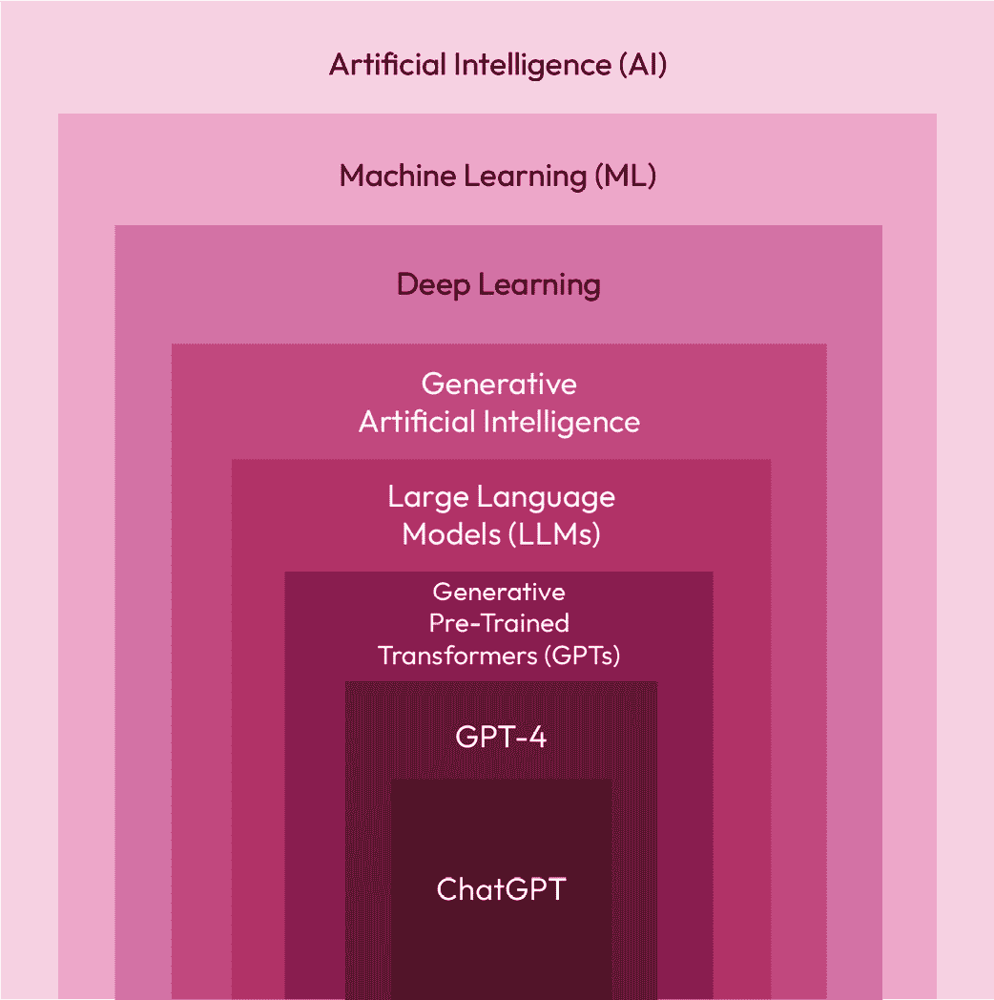

# 1

# 生成式 AI 助手简介

在本章中，我们将探讨以下关键主题：

+   什么是生成式 AI？

+   开发者面临的常见挑战

+   生成式 AI 为开发者提供的助手

+   开发者从助手中受益

+   开发者助手的类型

当 ChatGPT 问世时，它彻底改变了我们与基于 AI 的系统互动以寻求所需答案的方式。ChatGPT 为**生成式 AI**（**GenAI**），一类利用机器学习模型根据从现有数据集中学习到的模式和信息的**人工智能**（**AI**），自主创建新内容（如文本、图像或其他形式的数据）打开了大门。

GenAI 通过改变解决用例的方式，颠覆了多个行业。GenAI 彻底改变的一个领域是软件开发过程。不是手动编写所有代码，GenAI 可以自动生成大量代码，极大地提高了构建应用程序的软件工程师和开发者的生产力。

GenAI 不仅能够自动生成新代码，还协助软件开发生命周期的许多其他任务，包括规划、分析、设计、测试、调试、部署、维护和审查。我们将逐步在本书中展开所有这些方面。

本章将深入探讨不同基于 GenAI 的助手如何出现，以帮助开发者更快地创建软件应用程序。但在我们深入细节之前，我们将探索生成式 AI 的旅程、开发者每天面临的挑战以及基于 GenAI 的助手如何帮助他们。让我们先简要了解生成式 AI 的力量。

# 什么是生成式 AI？

生成式 AI 是一种可以通过学习现有示例来创建新内容（如文本、图像甚至音乐）的 AI。它就像教计算机从大量数据中理解模式和风格，然后利用这些知识来产生新颖和原创的内容，就像人类可能会根据他们的经验和想象力创作故事或绘画一样。例如，它可以撰写文章、生成逼真的图片，甚至通过根据其学习到的内容预测接下来会发生什么来帮助开发软件代码。

关于生成式 AI，以下是一些关键信息：

+   **生成与分析**：生成式 AI 可以创建全新的艺术品，如文本、代码、图像、视频等，而不仅仅是分类或从现有艺术品中提取见解。例如，合成数据生成是新一代的新艺术品。

+   **自学习**：许多生成式 AI 系统在大数据集上自我训练，以学习模式和关系。这使得它们能够推广到新的上下文中。

+   **概率模型**：生成式 AI 构建概率模型以生成符合训练数据中模式的新输出。输出是从学习到的概率分布中采样的。

+   **多样化的应用**：用例包括生成文本（例如，文章、代码、对话）、图像、音频、视频游戏内容、分子设计等等。

+   **输出多样性**：通过捕捉高级模式而不是逐字复制，生成式模型可以产生广泛多样的原创输出。

+   **前沿领域** - 生成式人工智能是机器学习研究中的一个极其活跃的领域，DALL-E、AlphaCode 和 MuseNet 等模型在创新方面的进展展示了其快速的发展。

为了更好地理解生成式人工智能在人工智能堆栈中的位置，以下图表有助于我们更好地理解这一概念。

图 1.1 – 人工智能堆栈

我们希望将生成式人工智能的讨论保持简短，因为关于这个领域有大量的资料可以深入研究。本书的重点是帮助开发者使用生成式人工智能来加速软件开发并提高他们的生产力。但在那之前，我们还需要了解开发者面临的一些挑战。

# 开发者/构建者面临的常见挑战

如果你看看一个典型的软件开发者的日常，你会意识到大部分时间都花在分析、创建、测试和调试特定于应用程序所需功能的代码上。许多开发者面临的常见挑战都与这些主题相关：

+   **重复编码**：在没有自动完成或生成工具的情况下手动实现重复代码或模板代码，这不仅耗时，而且容易出错。

+   **理解不熟悉的代码**：在没有人工智能解释或总结的情况下，难以快速提升并理解复杂的遗留代码库。

+   **寻找代码示例**：在没有人工智能代码搜索的情况下手动搜索和识别合适的代码示例来学习或重用是繁琐的。

+   **诊断问题**：没有人工智能协助定位潜在原因和解决方案，调试问题会花费更长的时间。

+   **缺乏标准化**：没有人工智能的建议来标准化代码模式和风格，代码质量和一致性会受到影响。

+   **文档编写**：在没有人工智能自动文档生成的情况下手动编写代码文档非常耗时。

+   **重新实现解决方案**：未能发现和利用代码库中现有的解决方案会导致重复工作。

+   **效率低下**：没有人工智能优化，在改进代码结构、性能和效率方面缺乏指导。

+   **任务切换**：没有人工智能处理琐碎的任务和查找，频繁的任务切换会打断开发者的工作流程。

+   **知识差距**：初学者需要指导，而中级开发者在没有人工智能编码洞察的情况下存在知识空白。

+   **创意限制**：没有生成式代码建议，缺乏灵感刺激和解决方案搜索空间的扩展。

+   **技术变革的速度**：新的开源工具、库和功能不断添加，因此很难跟上所有新创新并在应用程序开发中使用它们。

总体来说，生成式编码人工智能缓解了许多痛点，并在所有技能水平上增强了人类的能力。开发者从采用这些快速发展的技术中可以受益匪浅。

并非每个人都负责编写应用程序的代码。在组织中还有许多其他技术角色，他们通过利用基于云的服务和工具来协助构建应用程序。通常，我们称他们为构建者。使用 AWS 服务解决用例的构建者被称为 AWS 构建者。这些构建者面临的具体挑战也因他们的角色和使用的工具而异。构建者面临的最耗时挑战之一是在他们使用的特定服务或工具中调试错误。控制台错误和网络错误是 AWS 构建者遇到的最突出的错误，他们必须检查日志文件以识别和修复问题。AWS 构建者还需要在解决方案架构、最佳实践、文档和支持方面获得帮助。

我们将在本书中深入探讨解决这些挑战的每个方面，但首先，让我们看看生成式人工智能助手在软件开发过程中帮助开发者和构建者的某些领域。

# 开发者/构建者使用的生成式人工智能助手

生成式人工智能助手通过利用先进的机器学习模型工作，这些模型主要在大量的代码和自然语言数据上训练。在底层，这些模型分析现有代码中的模式和结构，以预测和生成新的代码片段。当开发者输入一个提示或部分编写的代码时，人工智能使用深度学习技术处理这个输入，理解上下文、语法和语义。然后，它生成相关的代码补全、建议，甚至整个函数，模仿现有代码库的风格和约定。

此外，这些助手通过用户交互不断学习和改进，适应特定的编码风格和偏好，从而随着时间的推移提供越来越准确和上下文感知的辅助。这种复杂的模式识别、上下文理解和持续学习的过程，使得生成式人工智能编码助手能够显著提高开发者的生产力和效率。

这里有一些它们能做什么的例子：

+   **代码补全**：根据上下文预测并自动完成代码，随着开发者的输入。类似于自动完成，但更强大且更具上下文性。

+   **代码合成**：根据代码应执行的操作的描述生成整个代码片段或函数。节省开发者编写样板或重复代码的时间。

+   **代码解释**：提供对代码部分所做工作的简单语言解释，以帮助开发者理解代码库。

+   **代码摘要**：在较高层次上总结代码模块的整体目的和流程。对于理解遗留代码很有用。

+   **代码错误诊断**：分析错误信息和堆栈跟踪，提供有关潜在原因和修复错误的指导。

+   **代码优化**：建议改进代码的结构、整合或简化方法，使其更快、更高效等。

+   **文档生成**：从代码上下文自动生成代码文档和注释。

+   **故障排除和问题解决**：理解问题的原因，并为构建者提供可能的解决方案。

+   **架构和最佳实践**：为构建者提供如何最佳架构一个用例的建议，并推荐用于解决该问题的基础设施类型。

这些 AI 助手的主要价值是减轻编码中的重复或例行方面，使开发者能够专注于软件开发中更有价值、更具创造性的部分。他们的目标是提高开发者的生产力和软件质量。

# 开发者/构建者从助手中获益

开发者用的生成式 AI 助手有以下几个关键原因：

+   **提高生产力**：它们自动化重复的编码任务和工作流程，使开发者能够在更短的时间内完成更多的工作。自动完成、代码生成和调试辅助等直接节省了开发者的时间和精力。

+   **减少认知负荷**：通过处理例行任务和提供上下文感知的建议，AI 助手减轻了开发者工作记忆的负担。这为更复杂的问题解决腾出更多的脑力。

+   **代码可发现性**：自然语言代码搜索和摘要等特性提高了代码库的可发现性。开发者可以更容易地找到和理解相关的代码示例。

+   **知识共享**：AI 模型可以编码编程最佳实践和模式。这使得在开发团队之间共享知识变得更加容易。

+   **一致性**：由 AI 工具生成或优化的代码遵循一致的风格和模式。这提高了代码的可维护性。

+   **初学者技能提升**：经验较少的开发者可以利用 AI 驱动的补全、解释和建议来更快地提高他们的技能。

+   **专注于创造力**：通过自动化例行编码工作，开发者可以花更多的时间在创造性问题解决和优化算法上。

+   **减少错误**：错误和反模式可以在开发者编码时实时自动检测和修复。这提高了软件质量和可靠性。

+   **最新技术集成**：使用新库、开源工具和功能的便捷性，以改善端到端代码。

总体而言，通过增强人类能力，生成式人工智能使开发者能够更高效地工作，编写更高质量的代码，发现新的解决方案，并将精力集中在人类最能发挥价值的地方。这些工具在改变软件开发方面的潜力非常巨大。

# 开发者/构建者助手类型

尽管生成式人工智能驱动的助手列表不断增长，以下是一些为开发者提供的顶级生成式人工智能助手：

+   **Amazon Q 开发者**：一个由生成式人工智能驱动的助手，擅长在整个软件开发生命周期中帮助开发者。当集成到集成开发环境（IDE）中时，Amazon Q 提供全面的软件开发支持，包括代码生成、解释、优化和转换，以及其他许多自动化功能。当由 AWS 构建者使用时，它提供使用各种 AWS 服务构建更快解决方案的理解支持，并协助架构、最佳实践、文档、故障排除问题和支持。

+   **GitHub Copilot**：GitHub 和 OpenAI 提供的一个插件，在开发环境中提供上下文感知的代码补全。

+   **DeepCode**：一个代码审查助手，可以识别错误、安全问题、性能问题等，并提出修复建议。

+   **Kite**：带有文档和代码解释器的自动补全，以增强代码理解。

+   **Codex**：OpenAI 的一个 API，可以从自然语言描述中生成代码片段。

+   **TabNine**：一个使用深度学习在开发者键入时实时建议相关代码片段的代码补全工具。

+   **Pythia**：Facebook 的 IDE 插件，建议代码编辑和转换以修复问题。

+   **Sourcery**：一个自动重构 Python 代码的人工智能工具，建议改进和优化以实现更干净和更高效的代码。

随着更多初创公司、大型科技公司和开源项目将生成式人工智能集成到软件开发过程中，该列表不断扩展。目标是增强生产力和软件质量。每个 GenAI 助手都不同，并以各种方式协助开发者；然而，在这本书中，我们将详细介绍开发者如何使用 Amazon Q 开发者来加速软件开发并提高他们日常的生产力。

在我们结束本章之前，这里有一个关于开发者使用的生成式人工智能助手的非常重要笔记。

总是记住这一点

用于代码生成的生成式 AI 辅助工具表现出非确定性，因为在不同的条件下，对于相同的输入会产生不同的输出。这种可变性源于潜在的随机模型，这些模型考虑了一系列可能的解决方案，并根据诸如上下文、学习到的模式和随机性等因素选择一个。虽然这可以在代码建议中引入创造性和适应性，但它也可能导致结果不一致，因此对于开发者来说，审查和验证生成的代码以确保其满足特定项目需求和标准非常重要。

# 摘要

在本章中，我们简要介绍了生成式 AI 及其如何革命性地改变了许多行业。特别是在软件开发行业中，我们考察了开发者面临的一些常见挑战。然后，我们介绍了开发过程中的各个领域，其中生成式 AI 辅助工具可以帮助开发者，以及他们如何从这些辅助工具中受益。

最后，我们探讨了市场上一些可用的辅助工具以及它们如何帮助解决日常挑战。我们特别强调了 Amazon Q Developer，这是由 AWS 提供的一项服务，可以帮助开发者和构建者。本书的其余部分将围绕 Amazon Q Developer 作为软件开发的首选辅助工具展开。

在我们接下来的章节中，我们将探讨 Amazon Q Developer 是什么以及它如何帮助开发者。我们还将探讨如何在各种**集成开发环境**（**IDEs**）和其他通常使用的开发工具中设置它。

# 参考文献

生成式 AI: [`zh.wikipedia.org/wiki/生成式人工智能`](https://zh.wikipedia.org/wiki/生成式人工智能)
