# 第二章：介绍和设置亚马逊 Q 开发者

在本章中，我们将探讨以下关键主题：

+   亚马逊 Q 命名法

+   亚马逊 Q 开发者基础

+   亚马逊 Q 开发者功能

+   亚马逊 Q 开发者层级

+   亚马逊 Q 为第三方 IDE 的开发者设置

+   亚马逊 Q 开发者为命令行设置

+   亚马逊 Q 开发者为 AWS 编码环境设置

+   在 AWS 的支持下构建亚马逊 Q 开发者

在我们上一章中，我们介绍了生成式 AI 驱动的助手如何帮助开发者提高生产力，我们还探讨了市场上的一些助手。在本章中，我们将重点关注**亚马逊 Q 开发者**——这是一个开发者工具，帮助我们理解和构建使用生成式 AI 的应用程序。它支持开发者在整个软件开发生命周期中。通过亚马逊 Q 开发者，员工能够及时获得相关信息和指导，促进流程简化、快速决策、有效问题解决，并在工作场所培养创造力和创新。

让我们从关于服务命名法的注意事项开始。

# 亚马逊 Q 命名法

在我们继续之前，我们想要澄清命名法，以防止本书剩余部分出现任何误解。

**亚马逊 Q**是用于指代 AWS 的生成式 AI 助手的旗舰术语。在这个术语下，有多个产品或现有 AWS 服务的功能，专门协助特定类型的科技领域及其在该领域工作的典型人物。让我们快速了解一下这些：

+   **亚马逊 Q 商业版**：这是一个由生成式 AI 驱动的助手，能够回答问题、提供摘要、生成内容，并基于企业系统中的数据安全地完成任务。它使员工能够更具创造力、数据驱动、高效、准备充分并提高生产力。

+   **亚马逊 Q 在 QuickSight**：亚马逊 QuickSight 是 AWS 提供的**商业智能**（**BI**）服务。通过亚马逊 Q 在 QuickSight，客户可以获得一个生成式 BI 助手，使业务分析师能够在几分钟内使用自然语言构建 BI 仪表板，并轻松创建可视化和复杂计算。

+   **亚马逊 Q 在 Connect**：亚马逊 Connect 是 AWS 提供的一项服务，它使企业能够轻松地建立和管理客户联系中心，提供各种功能以增强客户服务和支持。亚马逊 Q 在 Connect 利用与客户的实时对话和相关的公司内容，自动为代理建议响应和操作，从而增强客户支持。

+   **AWS 供应链中的 Amazon Q**：AWS 供应链是 AWS 提供的一项服务，它统一了数据，并提供了基于机器学习的可操作见解、内置的上下文协作和需求规划。它无缝地集成到您现有的**企业资源计划**（ERP）和供应链管理系统。通过 AWS 供应链中的 Amazon Q，库存经理、供需规划师和其他利益相关者可以就其供应链的状态、潜在原因和推荐行动提出问题并获得智能答案。他们还可以探索“如果...会怎样”的情景，以评估各种供应链决策的权衡。

+   **Amazon Q 开发者**：本书重点关注这项服务。它帮助开发者和 IT 专业人员完成各种任务，包括编码、测试、升级应用程序、诊断错误、执行安全扫描和修复以及优化 AWS 资源。

本书使用的旧名称和术语

代码助手之前被称为 Amazon CodeWhisperer，现在已被重新命名为 Amazon Q 开发者的一部分。您在使用多个 AWS 服务时可能会看到旧名称 CodeWhisperer，但现在它都是 Amazon Q 开发者的一部分。

此外，在本书中，为了简洁起见，我们有时会使用 Amazon Q、Q 开发者或仅 Q 来指代 **Amazon** **Q 开发者**。

在我们深入探讨如何在不同的环境中设置 Amazon Q 开发者之前，让我们首先探索一些基础知识。

# Amazon Q 开发者基础知识

在了解开发者面临的挑战后，AWS 创建了一个由生成式人工智能驱动的助手——Amazon Q 开发者。

开发者通常遵循**软件开发生命周期**（SDLC）：计划、创建、测试、运营和维护。这个过程中的每个阶段通常都是重复的且容易出错。因此，这个过程需要大量的时间和精力，阻碍了开发者的生产力。以下图显示了开发者花费时间和精力的典型 SDLC 任务。

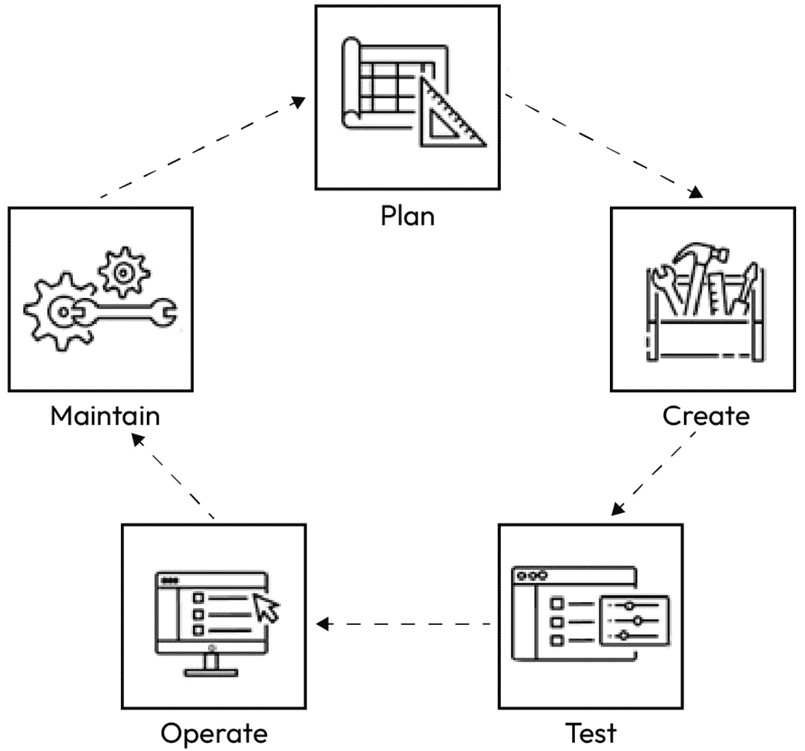

图 2.1 – 开发者花费最多时间的 SDLC 任务

Amazon Q 开发者协助开发者在整个软件开发生命周期（SDLC）中。在深入探讨本书中每个组件之前，让我们先从高层次上了解一下这一点：

+   **计划**：Amazon Q 通过提供代码解释并帮助遵循 AWS 最佳实践和推荐，在规划阶段提供协助。

+   **创建**：Amazon Q 通过提供内联编码建议、使用自然语言生成新功能以及允许您在**集成开发环境**（IDE）中直接提问，来提高开发效率。

+   **测试**：Amazon Q 帮助开发者验证其代码的功能和安全。它协助进行单元测试，并在开发周期的早期阶段识别和解决安全漏洞。

+   **操作**：Amazon Q 能够排查错误、分析 VPC 可达性，并提供增强的调试和优化建议。

+   **维护**：Amazon Q 的代码转换功能通过将项目升级到较新语言版本来帮助维护和现代化代码。

现在，让我们看看 Amazon Q 开发者的功能。

# Amazon Q 开发者功能

我们有专门的章节深入探讨每个功能。本章将介绍其功能并帮助您完成与不同工具协同工作所需的初始设置。让我们从最重要的功能，自动代码生成，开始。

## 自动代码生成

Amazon Q 开发者生成大量代码的能力加速了应用开发，使开发者能够解决以前未关注的企业关键问题。这为构思和创造下一代创新体验创造了额外的时间。此外，通过在 **集成开发环境**（**IDE**）中进行安全扫描，它可以在应用生命周期早期识别和纠正潜在漏洞，从而降低与开发相关的成本、时间和风险。

Amazon Q 开发者无缝集成到开发者的 IDE 中。通过安装 Amazon Q IDE 扩展，开发者可以立即开始编码。随着代码的编写，Amazon Q 开发者自动评估代码及其伴随的注释。识别自然语言注释（英文），Q 提供多个实时代码建议，甚至提供在编写注释时的完成建议。

Amazon Q 超越了单个代码片段，在 IDE 的代码编辑器中直接建议整个函数和逻辑代码块，通常跨越 10-15 行。生成的代码反映了开发者的写作风格，并遵循他们的命名约定。开发者可以迅速接受顶级建议（使用 *tab* 键），探索其他建议（使用箭头键），或无缝继续自己的代码创作过程。本章 *参考文献* 部分提供了一个链接，列出了不同 IDE 中 Amazon Q 开发者的用户操作完整列表。

Amazon Q 开发者支持多种编程语言，如 Python、Java、JavaScript、TypeScript、C#、Go、Rust、PHP、Ruby、Kotlin、C、C++、shell 脚本、SQL 和 Scala。此外，Q 开发者作为扩展可在许多 IDE 中使用，如 Visual Studio、VS Code 和 JetBrains IDE，并在 AWS Lambda、Amazon SageMaker Studio、Amazon EMR Studio、Amazon Redshift、Amazon CodeCatalyst 和 AWS Glue Studio 中原生可用。

我们在本书的 *第 2、3 和 4 部分* 中有多章与自动代码生成相关。

## 代码定制

亚马逊 Q 开发者通过考虑内部代码库的细微差别来增强其建议，这对于拥有大量存储库、内部 API 和独特编码实践的组织至关重要。开发者经常在与缺乏全面文档的大型内部代码库导航时遇到困难。为了解决这个问题，亚马逊 Q 允许与组织的私有存储库安全集成。只需几步点击，开发者就可以定制亚马逊 Q，以提供与内部库、API、包、类和方法实时匹配的建议。

这种定制支持多个数据源，使组织能够验证推荐是否符合编码标准、安全协议和性能最佳实践。管理员可以细粒度控制，安全地选择用于定制的存储库并实施严格的访问控制。他们决定激活哪些定制并管理组织内开发者的访问权限。每个定制独立运行，保持基础模型的完整性并保护知识产权。这确保只有具有特定访问权限的授权成员才能查看、访问和使用这些定制推荐。

我们将在本书的*第十章*中深入探讨这个主题。

## 代码转换

目前，亚马逊 Q 允许你将 Java 8 和 Java 11 编写的代码升级到 Java 17。为了辅助这一功能，亚马逊 Q 代码转换开发者代理可用于生成用于升级你的代码的转换计划。在转换你的代码后，它提供转换摘要和文件差异，让你在接受更改之前可以审查这些更改。

我们将在本书的*第十二章*中深入探讨这个主题。

## 代码解释、优化和更新

亚马逊 Q 开发者可以解释、优化、重构、修复和更新你 IDE 中的特定代码行。要更新你的代码，只需让亚马逊 Q 修改特定的代码行或代码块。它将生成包含所需更改的新代码，然后你可以直接将其插入原始文件中。

我们将在本书的*第十章*中深入探讨这个主题。

## 代码功能开发

亚马逊 Q 开发者代理可以帮助你在 IDE 中开发代码功能或对项目进行更改。描述你想要创建的功能，亚马逊 Q 将使用你当前项目的上下文来生成实现计划和必要的代码，以实现该功能。

我们将在本书的*第十二章*中深入探讨这个主题。

## 参考跟踪

亚马逊 Q 开发者经过大量数据集的训练，这些数据集包括来自亚马逊和开源代码的数十亿行代码。它能够识别出代码建议与特定开源训练数据相似的情况。它可以对这些建议添加存储库和许可详情的注释。此外，它还记录了与训练数据相似性高的已接受建议，从而便于提供适当的归属。

我们将在本书的*第十一章*中深入探讨这个主题。

## 安全扫描

Amazon Q 开发者还帮助对生成的和开发者编写的代码进行扫描，以识别潜在的安全漏洞。它还提供了解决已识别漏洞的建议。扫描过程扩展到检测难以捉摸的安全问题，并且与 VS Code 和 JetBrains IDEs 中的 Python、Java 和 JavaScript 兼容。

安全扫描涵盖了多个方面，包括符合 **Open Worldwide Application Security Project** (**OWASP**) 标准、执行加密库实践、遵守 AWS 安全标准和其他最佳实践。

我们将在本书的*第十三章*中深入探讨这个主题。

## 与 AWS 服务的集成

Amazon Q 开发者通过集成许多服务，加速了 AWS 上的开发，允许使用 AWS 服务快速构建应用程序。

数据工程师可以通过利用 Q 与 AWS Glue Studio Notebook 和 Amazon EMR Notebook 的集成来加速数据管道的创建。通过使用简单的英语句子阐述业务成果，Q 在 Redshift 查询编辑器中自动生成 SQL 查询，使得在 Redshift 中创建 SQL 查询变得简单。数据科学家和机器学习工程师可以通过利用 Q 与 Amazon SageMaker Studio 的集成来加速机器学习开发过程。

AWS 构建者可以利用 Q 开发者与 AWS Lambda 的集成来快速构建事件驱动的逻辑。Q 还通过 Amazon CodeCatalyst 支持 DevOps 流程，协助其许多功能，如拉取请求和代码更改。

Amazon Q 开发者还了解您账户中的 AWS 资源，并通过其对话功能轻松列出您资源的具体方面。它还可以帮助您了解使用的 AWS 服务的成本。

Q 开发者不仅自动化了 AWS 内部的许多开发任务，还帮助构建者调试 lambda 代码和理解与网络相关的问题。

此外，您可以咨询 Q 以获取最佳实践和解决方案，用于各种用例。它还可以推荐针对特定用例的最佳 EC2 实例。Q 的聊天功能允许您轻松提问并接收回复，从而简化了与 AWS 支持的集成。

我们将在本章后面的“在 Amazon Q Developer 支持下构建 AWS”部分深入探讨 Q 对 AWS 服务的辅助。这些功能的更详细探索也在本书的“第四部分”的单独章节中提供，其中我们详细解释了现实世界的开发用例。

Amazon Q Developer 提供了许多功能，其中一些高级选项在 Pro 层中可用。在下一节中，我们将介绍免费层和 Pro 层，并解释您作为用户如何利用它们。

# Amazon Q Developer 层级

Amazon Q Developer 提供两个层级：免费层和 Pro 层。让我们快速了解一下这两个层级是如何运作的，以及它们提供了哪些功能。

## Amazon Q Developer 免费层

Amazon Q Developer 的免费层为登录为 AWS IAM 用户或 AWS Builder ID 用户的任何人提供每月限制。您可用的具体功能取决于您的界面和认证方法。

关于免费层的最好之处在于，任何人都可以使用他们用于软件开发支持的 IDE 中的 Amazon Q Developer，即使他们不使用 AWS 服务或没有 AWS 账户。

因此，如果您正在阅读这本书并且还没有设置 AWS 账户，您可以使用此链接快速设置 AWS Builder ID：[`profile.aws.amazon.com`](https://profile.aws.amazon.com)。您的 AWS Builder ID 代表您作为个人，并且与您现有的 AWS 账户关联的任何凭证和数据都分开。您只需要您的个人电子邮件 ID 即可快速设置。

以下截图突出显示了设置完成后我的 AWS Builder ID 页面。

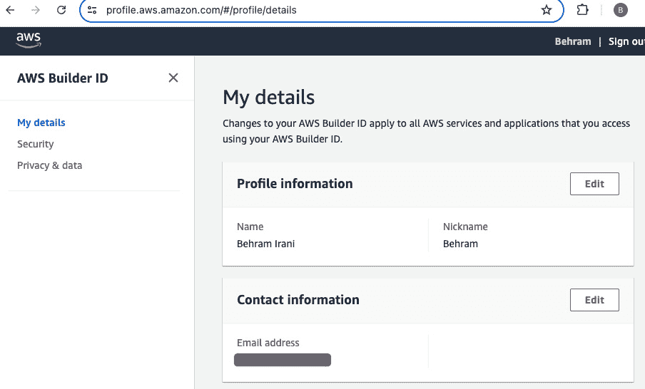

图 2.2 – AWS Builder ID 创建

一旦创建了 AWS Builder ID，您就可以登录到支持的 IDE 之一。我们将在本章后面的 IDE 设置部分介绍这一部分。

## Amazon Q Developer Pro 层

要访问 Amazon Q Developer Pro，您必须是 IAM 身份中心用户，并且您的管理员必须订阅 Amazon Q Developer Pro。作为订阅者，您的使用限制在 Amazon Q 控制台、IDE 中的 Q 和 Amazon CodeCatalyst 中的 Q 以个人用户级别确定。

如果您是组织的一部分，那么 Pro 层的访问将由管理员团队设置。然而，如果您正在阅读这本书并想尝试一些仅在 Pro 层中可用的 Amazon Q Developer 功能，您也可以作为个人 AWS 用户这样做。

我们将快速指导您访问 Pro 层的一种方法。一旦您设置了 AWS 账户，您很可能会为自己分配管理员角色，以便您无需额外配置权限即可访问所有 AWS 服务。然而，如果您不是管理员，请确保您有 Amazon Q Developer 服务的管理员角色。

一旦您登录到 AWS 控制台，搜索并打开 Amazon Q 服务页面。以下截图显示了可订阅的 Q Developer Pro 套件。

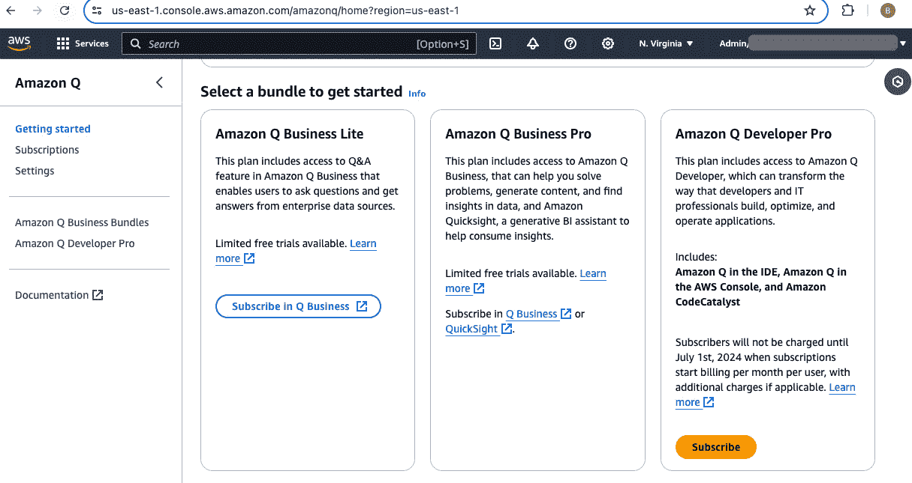

图 2.3 – Amazon Q Developer Pro 套件

一旦您点击 **订阅**，它将要求您从 IAM 身份中心选择一个用户或组以授予专业订阅。如果您是首次使用用户且您的 IAM 身份中心用户尚未设置，您必须在分配之前设置它，如下面的截图所示。

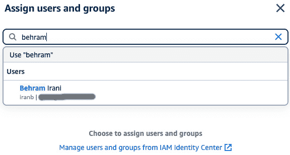

图 2.4 – Amazon Q Developer Pro – IAM 身份中心用户和组

在 IAM 身份中心设置用户涉及几个任务，我们已在本章 *参考文献* 部分中包含了一个设置说明的链接。一旦用户准备就绪，他们将在下拉菜单中显示，供您通过名称搜索并分配到之前的步骤中。在此设置过程中，IAM 身份中心还将配置其应用程序设置中的 Amazon Q，其中可以找到身份源和身份验证设置。

一旦您在订阅屏幕中分配了用户，Pro 级别订阅将激活，如下面的截图所示。

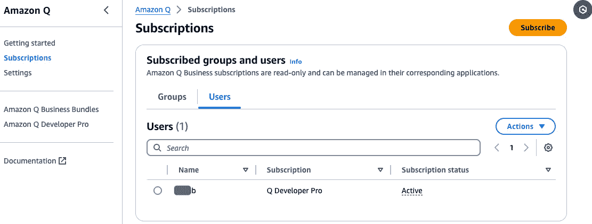

图 2.5 – Amazon Q Developer Pro – 用户的活动订阅

订阅激活后，从 AWS 控制台转到 Amazon Q Developer 服务，在其设置页面，您将看到用户可使用的完整功能列表，以及起始 URL。起始 URL 是我们在外部 IDE 中进行身份验证时将使用的。

以下截图突出了为用户准备好的 Amazon Q Developer Pro 订阅详情。

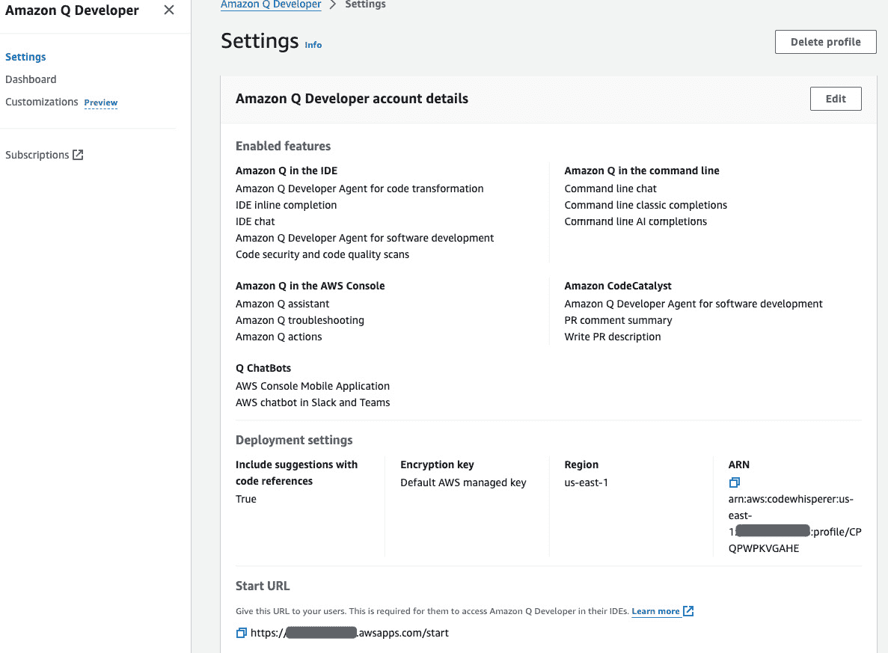

图 2.6 – Amazon Q Developer Pro – 设置屏幕

要确定 Q Developer 的免费和 Pro 级别包含的具体功能，请参阅定价文档，其中链接已提供在本章末尾的 *参考文献* 部分中。

现在，让我们继续下一个主题：在您最喜欢的 IDE 中设置 Amazon Q Developer。

# 为第三方 IDE 设置 Amazon Q Developer

IDE 是一种为程序员提供全面软件开发设施的软件应用程序。通常，IDE 包括源代码编辑器、构建自动化工具和调试器。其目的是通过将软件开发的各种方面集成到单一环境中，简化编码和开发过程，使开发更加高效和方便。IDE 的流行例子包括 Visual Studio、Eclipse 和 IntelliJ IDEA。

为了提高开发者生产力，Amazon Q 开发者无缝集成到 Visual Studio、Visual Studio Code 和 JetBrains IDE 中。每个 IDE 都有其自身的优势，开发者通常有一个首选的 IDE 或根据特定编程语言的需求进行切换。我们旨在演示如何在所有三个 IDE 中启用 Q，并将选择权留给我们的最终用户。

## VS Code

**Visual Studio** **Code** (**VS Code**) 是一个兼容 Windows、macOS 和 Linux 的独立源代码编辑器。它是 Java 和网页开发者的理想选择，并提供许多扩展来支持几乎任何编程语言。

安装 VS Code 后，要开始使用 Q，你需要安装 Amazon Q 扩展。你可以通过搜索 VS Code 的扩展部分或通过 VS Code 市场安装它。有关安装和设置 VS Code 的 Q 扩展的进一步帮助，请参阅本章末尾 *参考文献* 部分提供的链接。

扩展安装完成后，你需要进行身份验证。如果你正在使用作为你组织一部分的 Amazon Q Pro 级别，你的 AWS 账户管理员将为你设置并启用 IAM Identity Center 以进行身份验证。基本上，你的管理员将把你添加为用户，并提供一个登录 URL，让你使用 IAM Identity Center 登录，以便你可以在组织策略中利用 Q。

如果你使用 VS Code 并且想作为免费级别用户使用 Amazon Q，那么你需要使用你的 AWS Builder ID 登录。一旦安装并验证，你将看到以下截图，其中为 VS Code 安装了 Amazon Q 扩展，并且你可以看到它使用截图底部的 Builder ID 进行验证。

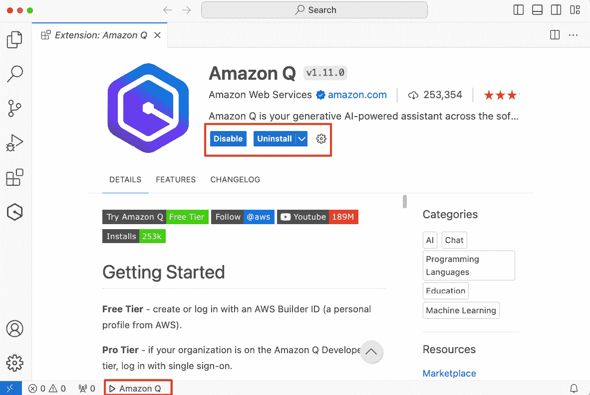

图 2.7 – 在 VS Code 中启用了并验证的 Amazon Q 开发者扩展

快速查看在 VS Code 中免费和 Pro 级别的身份验证方式。在前面的章节中，我们为免费级别建立了 AWS Builder ID，并且为 IAM Identity Center 设置了一个用户，该用户获得了 Pro 级别的订阅。

安装 Amazon Q 扩展后，当你第一次尝试从 VS Code 编辑器验证到 Q 时，你将看到以下截图中的两种选择，免费和 Pro 级别。

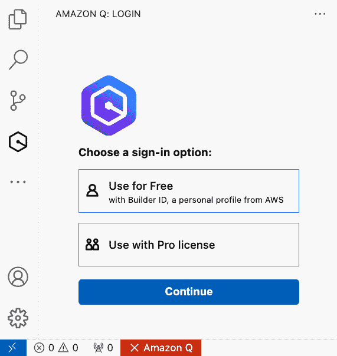

图 2.8 – VS Code 中访问 Amazon Q 开发者的身份验证选项

当你使用免费级别进行操作时，它将打开一个浏览器窗口，要求你输入你的 AWS Builder ID 凭据。它还会要求你确认是否批准通过 Amazon Q 给 IDE 访问你的数据，如以下截图所示。

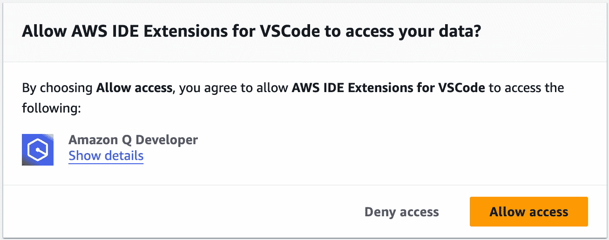

图 2.9 – 授权 Amazon Q 访问 VS Code

您将在 VS Code IDE 中看到通知，如以下屏幕截图所示，表明您已成功使用 AWS Builder ID 进行认证，并且 IDE 已准备好利用 Amazon Q 的免费级别功能。

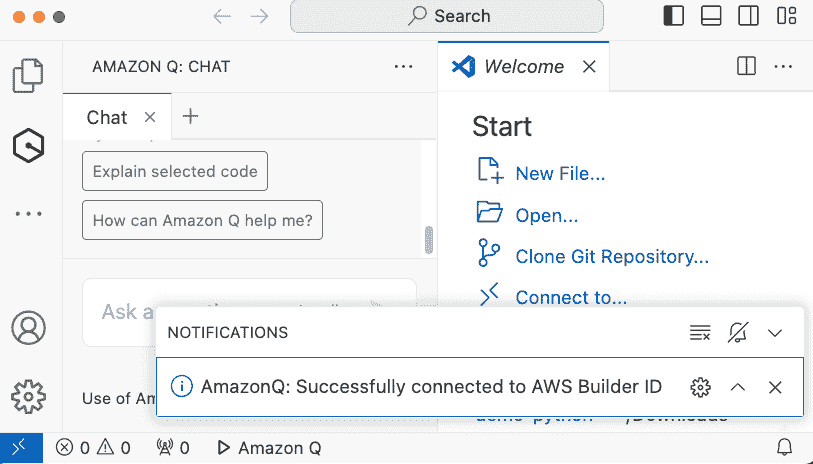

图 2.10 – 使用 AWS Builder ID 在 VS Code 中认证

如果您想认证到 Amazon Q Pro 级别，系统将提示您输入起始 URL。此 URL 在上一节中 Pro 级别的设置过程中获取。只需复制 URL 并粘贴到此处，如以下屏幕截图所示。

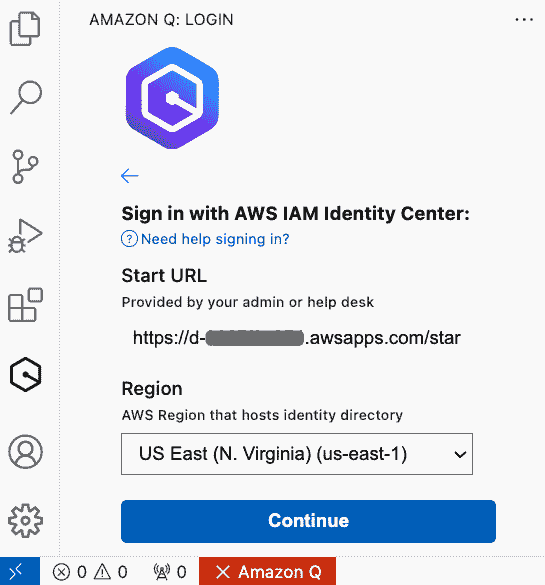

图 2.11 – 在 VS Code IDE 中认证到 Amazon Q Pro 级别

继续操作后，系统将提示您通过网页浏览器使用 IAM 身份凭证进行再次认证。在成功进行多因素认证后，VS Code 将如您在以下屏幕截图中所见，通知您已连接并准备好使用 Amazon Q Pro 级别。

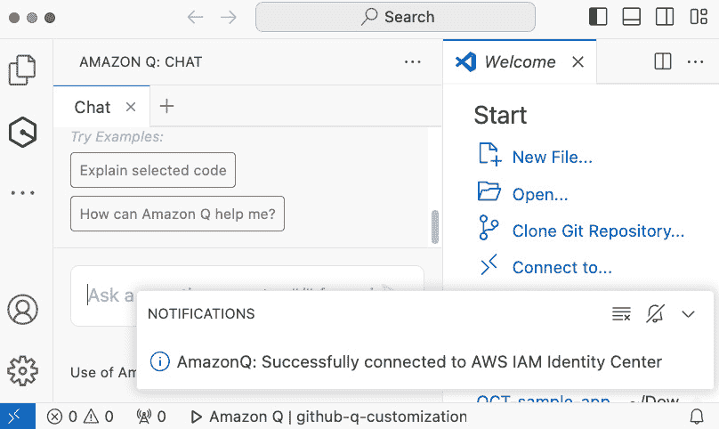

图 2.12 – 在 VS Code IDE 中成功认证到 Amazon Q Pro 级别

JetBrains IDE 的设置与此相同，让我们快速看一下。由于过程类似，我们不会重复所有步骤。

## JetBrains

JetBrains 提供了一系列 IDE，每个 IDE 都支持不同的编程语言。例如，Java 开发者使用 IntelliJ Idea IDE，而 Python 开发者使用 PyCharm IDE。同样，JetBrains 为其他编程语言提供了许多其他 IDE。由于我们将使用 Python 作为主要语言来描述 Amazon Q 的不同功能，让我们为 PyCharm IDE 设置它。

我们需要安装并认证 Amazon Q 插件，就像之前为 VS Code 所做的那样。您可以从 IDE 的插件部分或从 JetBrains 市场安装插件。为了进一步帮助您安装和设置 JetBrains IDE 的插件，请参阅本章末尾 *参考文献* 部分提供的链接，其中还列出了对不同 JetBrains IDE 及其特定版本的支持。

以下屏幕截图显示了 PyCharm IDE 内安装的 Amazon Q 插件。请注意，为了避免冲突结果，请禁用其他 AI 助手。如果您使用 PyCharm 进行 Python 编码，那么您已经准备好跳转到 *第四章* 开始使用 Amazon Q 开发者。

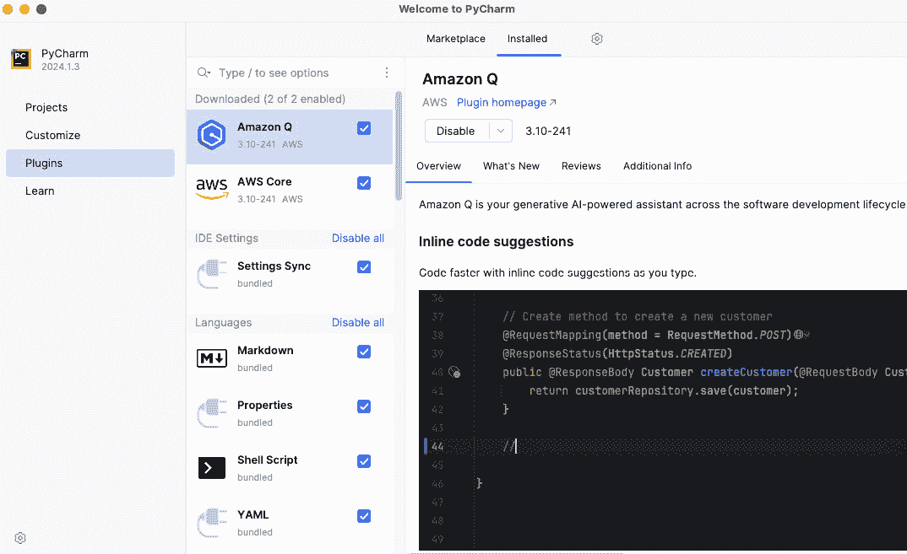

图 2.13 – PyCharm IDE 中启用的 Amazon Q 开发者插件

让我们看看 Amazon Q 支持的另一个流行 IDE，Visual Studio。

## Visual Studio

Visual Studio 2022 是 Windows 上流行的 IDE，适用于 .NET 和 C++ 开发者。它在构建网页、云、桌面、移动应用、服务以及游戏方面表现出色。

要在 Visual Studio IDE 中使用 Amazon Q，您需要安装 AWS Toolkit for Visual Studio。从 Visual Studio 市场中，首先安装 AWS Toolkit for Visual Studio，然后有多种方式可以用于 AWS 账户的认证。有关使用 Visual Studio 设置 Amazon Q 的详细说明，请参阅本章末尾 *参考文献* 部分提供的链接。

Amazon Q 在 Visual Studio 中支持 C、C++ 和 C# 作为编程语言，并且也提供了命令行支持，因此让我们看看使用命令行进行 Amazon Q 开发者初始设置的步骤。

# 命令行版本的 Amazon Q 开发者设置

在复杂 IDE 的时代，**命令行界面**（**CLIs**）仍然是开发者进行快速测试和构建的流行选择。在本书的 *第二部分* 中，我们将探讨如何使用 Amazon Q 开发者与命令行一起使用，但首先，我们需要确保 Q 已安装并设置用于命令行。

事物不断演变，但目前，命令行版本的 Amazon Q 开发者仅支持 macOS。有少量壳、终端模拟器、终端 IDE 和超过 500 个 CLI 支持。始终参考 AWS 文档以获取新支持的环境。

由于我们使用的是 macOS 和 zsh 壳终端，我们将指导您进行其安装步骤：

+   下载并安装命令行版本的 Amazon Q 开发者。链接位于本章末尾的 *参考文献* 部分中。

+   如果您有组织提供的 Pro 级别访问权限，您将需要组织管理员提供的 IAM Identity Centre 启动 URL。

+   如果您是免费用户，系统将要求您使用 Builder ID 或 IAM Identity Centre 进行认证。AWS Builder ID 是一个个人配置文件，它授予您访问 Amazon Q 开发者的权限。Builder IDs 是免费的，您可以使用电子邮件地址注册。

安装成功后，Amazon Q 的 **自动检查** 部分应显示勾选标记，如下面的截图所示。

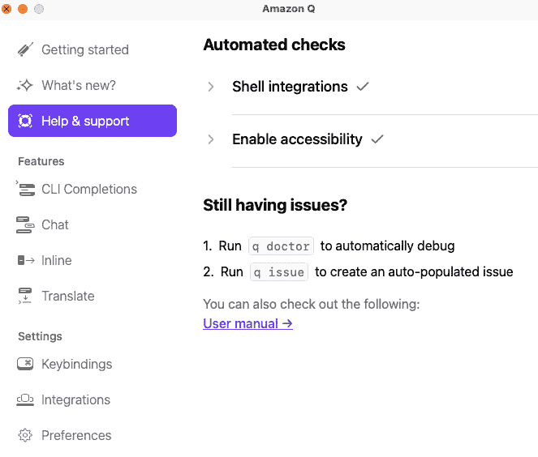

图 2.14 – 命令行版本的 Amazon Q 安装

您可以使用 `q doctor` 命令来验证一切是否顺利。以下截图确认 Q 开发者已正确安装用于命令行。

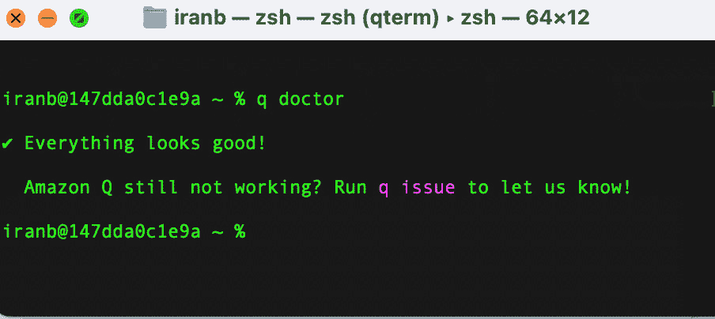

图 2.15 – 命令行版本的 Amazon Q 开发者安装 – 成功

现在，让我们看看 Amazon Q 开发者与一些支持的 AWS 服务和工具的初始设置。

# Amazon Q 开发者设置用于 AWS 编码环境

如果你是一名应用程序构建者、软件开发者、数据工程师或数据科学家，并且与 AWS 服务合作，你将频繁使用如 Amazon SageMaker 这样的构建友好型工具作为构建 AI/ML 项目的平台，Amazon EMR 作为构建大数据处理项目的平台，AWS Glue 用于构建**提取、转换和加载**（**ETL**）管道，以及 AWS Lambda 作为无服务器计算服务。所有这些服务都提供帮助构建者和开发者编写代码的工具。

为了简化与这些 AWS 服务的开发者体验，Amazon Q 在支持的 AWS 工具中提供代码建议和代码生成功能。让我们探索所有这些工具以及如何设置它们。

## Amazon SageMaker Studio

Amazon SageMaker Studio 是一个综合平台，提供针对**机器学习**（**ML**）开发每个阶段的专用工具。从数据准备到模型构建、训练、部署和管理，它提供了一个无缝的工作流程。快速上传数据，在您首选的 IDE 中构建模型，增强团队协作，利用 AI 辅助优化编码，微调和调试模型，在生产中部署和管理它们，以及自动化工作流程——所有这些都可以在一个单一的基于 Web 的界面中轻松实现。

在启用 Q Developer 在 SageMaker Studio 中提供 Python 代码推荐之前，我们假设你的 SageMaker Studio 环境已经启动并运行，所有先决条件都已完成，并且已创建 SageMaker 域。

要继续操作，在你的 SageMaker IAM 执行角色中，只需添加以下 IAM 策略允许 Amazon Q 生成代码推荐：

```py
{
  "Version": "2012-10-17",
  "Statement": [
    {
      "Sid": "CodeWhispererPermissions",
      "Effect": "Allow",
      "Action": ["codewhisperer:GenerateRecommendations"],
      "Resource": "*"
    }
  ]
}
```

注意在策略声明中仍然引用了旧名称 CodeWhisperer。它可能会在未来发生变化，因此请始终参考官方文档以获取更新。

如果你已经有了一个 SageMaker 域，你可以在域设置中找到它的执行角色，如图下所示。

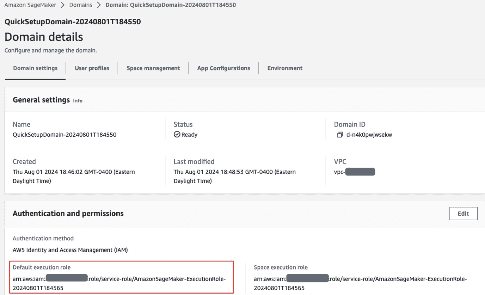

图 2.16 – SageMaker 域的执行角色

注意

2023 年 11 月，SageMaker Studio 更新了全新的体验。之前版本的体验现在被命名为 Amazon SageMaker Studio Classic，仍然可供使用。如果你已经使用经典主题，你仍然可以启用 Amazon Q Developer 以实现基于内联提示的代码生成。

然而，在新体验中，除了内联提示外，你还可以启用来自 Amazon Q 的聊天式辅助。聊天功能只能通过 Amazon Q Developer 的 Pro 级别启用，这需要将 SageMaker 域与 IAM 身份中心集成。

要在 SageMaker Studio 中启用 Amazon Q 的聊天式功能，你可以在域详情的**应用配置**选项卡中启用 Q，如图下所示。Q 配置文件 ARN 可以在 Amazon Q Developer 的设置页面中找到，如图*图 2.6*所示。

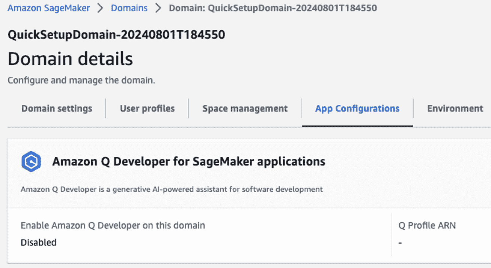

图 2.17 – 在 SageMaker Studio 中启用 Amazon Q 聊天

在此之后，您可以在新的 JupyterLab 笔记本中查看底部，可以看到 Amazon Q 已启用，如下面的截图所示。此外，SageMaker 还支持内联提示以及基于聊天的代码生成，这些也在截图中被突出显示。

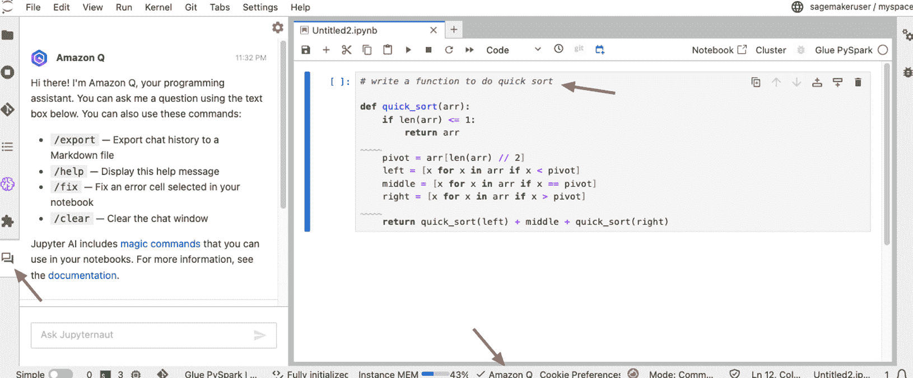

图 2.18 – 在 SageMaker Studio 中 Amazon Q 的实际应用

我们将在 *第十四章* 中探讨如何在 SageMaker Studio 中有效使用 Amazon Q。目前，我们只是在 AWS 内所有支持的工具中设置它。

## Amazon EMR Studio

EMR Studio 是 Amazon EMR 服务中的一个 IDE，它简化了数据科学家和工程师使用 R、Python、Scala 和 PySpark 创建、可视化和调试数据工程和数据分析应用程序的过程。Amazon Q 开发者支持 Python 语言，这使得编写 Spark 作业变得容易。

要在 EMR Studio 中启用 Amazon Q，您只需将我们用于 SageMaker Studio 的相同 IAM 策略附加到 EMR 上。一旦通过工作区启动笔记本，Q 将启用以供使用。

下面的截图显示了 EMR Studio 笔记本内启用的 Q，并能根据注释生成代码。请注意，CodeWhisperer 的旧名称仍然被显示出来。这最终可能会更改为 Amazon Q。

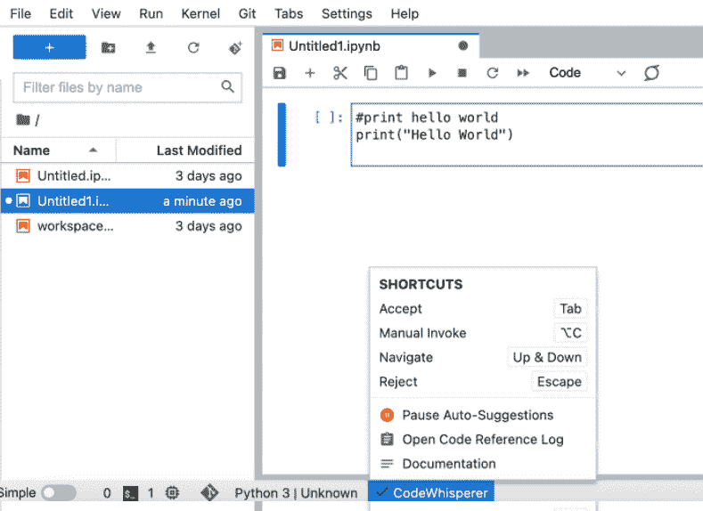

图 2.19 – 在 Amazon EMR Studio 中启用 Amazon Q

## JupyterLab

许多数据科学家和数据工程师使用 Jupyter Notebooks 进行他们的数据科学项目。JupyterLab，一个用于编写笔记本的可定制且功能丰富的应用程序，是 Jupyter 项目的一个关键组件，该项目是一个非营利性、开源项目，旨在提供用于交互式计算的工具和标准。

Amazon Q 支持 JupyterLab 中的 Python 代码推荐。以下命令在 macOS 上安装 Q 以用于 JupyterLab 3 或 4。

```py
# Use the below command if you have JupyterLab 4
pip install amazon-codewhisperer-jupyterlab-ext
# Use the below command if you have JupyterLab 3
pip install amazon-codewhisperer-jupyterlab-ext~=1.0
jupyter server extension enable amazon_codewhisperer_jupyterlab_ext
```

安装后，您可以使用 AWS Builder ID 进行身份验证，之后 Q 将开始在笔记本内提供建议。

## AWS Glue Studio

AWS Glue Studio 提供了一个用户友好的图形界面，用于在 AWS Glue 中轻松创建、执行和监控数据集成作业。Amazon Q 支持 Python 以及 Scala 语言，这些语言常用于使用 Glue Studio 编码 ETL 管道。

要在 Glue Studio 中启用 Amazon Q，我们用于 SageMaker Studio 设置的相同 IAM 策略必须附加到 Glue 角色上。一旦启用，您可以在 **ETL 作业**下启动 Glue Studio 笔记本，并开始利用 Q 的功能。

下面的截图显示了 Glue Studio 笔记本内启用的 Q，并能根据提示生成代码。请注意，CodeWhisperer 的旧名称仍然被显示出来。这最终可能会更改为 Amazon Q。

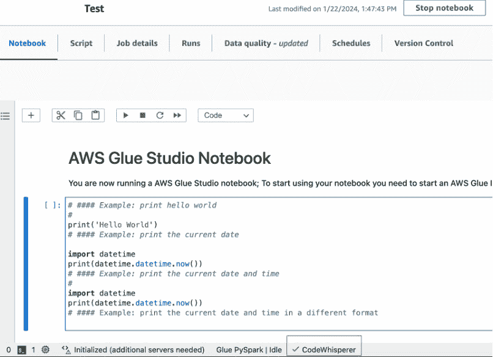

图 2.20 - 在 AWS Glue Studio 中启用了 Amazon Q

## AWS Lambda

AWS Lambda 是一种无服务器和事件驱动的计算服务，它可以在不配置或管理服务器的情况下执行您的代码。它提供了一条快速路径，将想法转化为现代、生产就绪的无服务器应用程序。

截至目前，Amazon Q 在 AWS Lambda 中支持 Python 和 Node.js 语言。在为 Q 分配相同的 IAM 策略后，您可以通过从 **工具** 菜单中选择 Q 代码建议选项来激活它。

以下屏幕截图显示了在 Lambda 函数中启用 Amazon Q 的选项。请注意，CodeWhisperer 的旧名称仍然被显示出来。这最终可能会改为 Amazon Q。

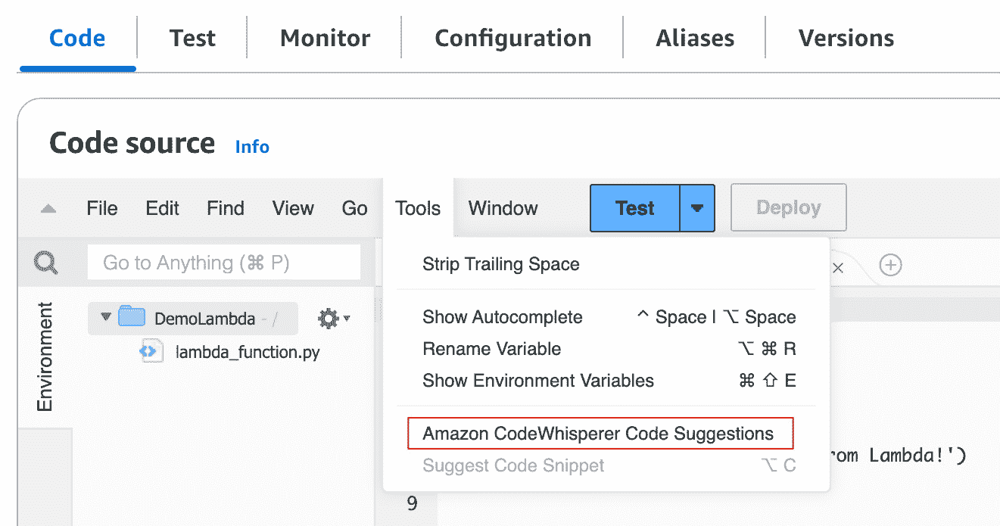

图 2.21 – 在 AWS Lambda 中启用了 Amazon Q

Lambda 编辑器现在可以接受代码建议。请参考章节末尾的“参考文献”部分的“用户操作”网页来测试包括 lambda 在内的不同编辑器的不同键盘快捷键。

现在让我们转换一下话题，看看 Amazon Q 开发者如何也能帮助 AWS 构建者更快地构建解决方案。

# 在 Amazon Q 开发者的支持下在 AWS 上构建

如果您是 IT 部门的构建者并使用 AWS 服务来解决业务用例，那么 Amazon Q 可以帮助提高您的生产力和增强您使用 AWS 服务的体验。Amazon Q 可以从 AWS 管理控制台、AWS 网站甚至 AWS 文档中访问，以帮助您更快地达到预期的最终目标。

在我们探索 Amazon Q 在 AWS 的一些功能之前，让我们回顾一下在使用它之前您可能需要在您的 AWS 账户中拥有的权限。

## Amazon Q 权限

当用户登录 AWS 控制台时，他们会承担一个已经授予使用 AWS 服务中特定资源的某些权限的角色。为了使用 Amazon Q 的功能，用户必须有权使用 Q 功能。为了方便起见，用户承担的角色需要有一个包含 Q 权限的 IAM 策略。最快和最简单的方法是将托管 IAM 策略附加到该角色上。`AmazonQFullAccess` 是一个托管 IAM 策略，它提供了对 Amazon Q 所有功能的完全访问权限。

此托管 IAM 策略在操作和资源中包含通配符 (`*`) 字符，允许所有 AWS 资源使用 Q 的所有功能。以下代码片段说明了此策略：

```py
{
  "Version": "2012-10-17",
  "Statement": [
    {
      "Sid": "AllowAmazonQFullAccess",
      "Effect": "Allow",
      "Action": [
        "q:*"
      ],
      "Resource": "*"
    }
  ]
}
```

在您的组织中，AWS 账户管理员很可能不会授予您完全访问权限。通常，通配符字符会被替换为您的角色需要访问的实际操作和资源。

例如，为了允许用户使用 Q 的对话功能，在“操作”部分，`*`将被替换为`q:StartConversation`和`q:SendMessage`。而要使用 AWS 控制台故障排除功能，操作将包括`q:StartTroubleshootingAnalysis`、`q:GetTroubleshootingResults`和`q:StartTroubleshootingResolutionExplanation`操作。

现在我们已经整理好了权限，让我们探索一些亚马逊 Q 可以在 AWS 上提供帮助的领域。

## 对话式问答功能

亚马逊 Q 允许您在 AWS 管理控制台内部直接提出对话式问题。AWS 构建者可以就架构、服务、最佳实践等方面提出广泛的问题，并且还可以提出多个后续问题以获得所需的指导。在 Q 聊天控制台中获取所有响应可以减少研究和调查所需的时间，从而加快应用程序构建过程。

以下屏幕截图突出了 Q 提供基于上下文答案的能力。亚马逊 Q 图标位于控制台右上角。我们将在本书的*第四部分*中探索更多亚马逊 Q 在 AWS 上的对话式使用。

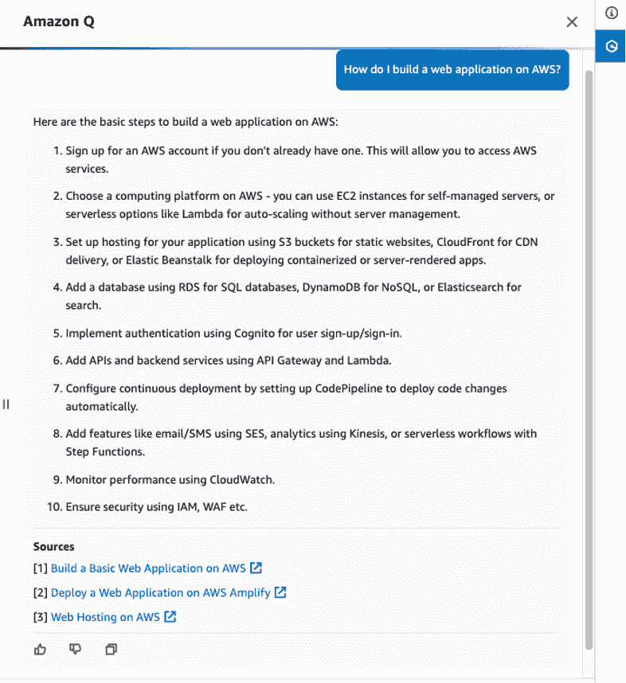

图 2.22 – 在 AWS 控制台中使用亚马逊 Q

亚马逊 Q 还通过其对话式问答功能为 AWS 服务（如亚马逊 Redshift 和 AWS Glue）提供有针对性的帮助。虽然我们将在本介绍性章节中简要介绍它们，但更详细的讨论将在本书的*第四部分*中提供，其中我们将深入研究 AWS 构建过程的相关章节。

### 与亚马逊 Redshift 聊天以生成见解

亚马逊 Redshift 是云中的一项完全托管的数据仓库服务，它使用基于 SQL 的强大分析工具提供快速查询性能。它有效地管理着 PB 级规模的数据仓库，使用户能够分析大型数据集并从中提取对决策有价值的见解。亚马逊 Redshift 查询编辑器是一个基于浏览器的工具，允许用户直接对其 Redshift 数据仓库运行 SQL 查询。

亚马逊 Redshift 查询编辑器中的亚马逊 Q 生成 SQL 功能根据自然语言提示生成 SQL 推荐。这通过帮助用户更有效地从数据中提取见解来提高生产力。

提供的屏幕截图展示了亚马逊 Q 如何理解聊天中提出的查询，并有效地连接必要的各种表以完成 SQL 查询。您可以将生成的查询集成到笔记本中，并通过测试查询以获得精确结果来验证其准确性。

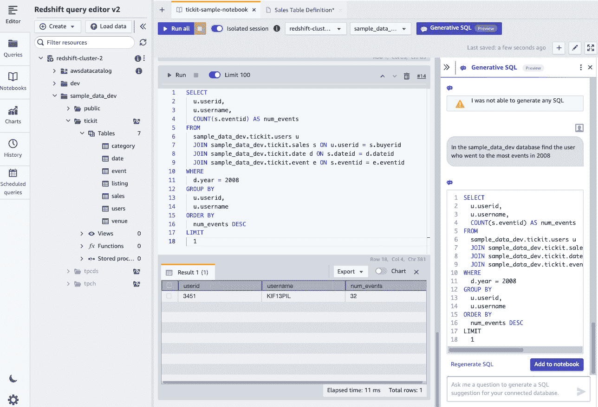

图 2.23 – 亚马逊 Q 在亚马逊 Redshift 查询编辑器中的工作概述

此功能将加快报告创建，并使非技术用户能够在等待技术专长生成报告之前从数据中提取见解。我们将在 *第十四章* 中深入了解此细节。现在，让我们探索 Amazon Q 如何在 AWS Glue 笔记本中增加价值，使数据工程师更容易创建 ETL 作业。

### 使用聊天生成 AWS Glue ETL 的逻辑

在上一节中，我们讨论了 Amazon Q 如何在 Glue Studio 笔记本中协助自动编码。然而，有时你需要与助手聊天以生成整个样板逻辑。使用 Amazon Q 聊天功能简化了作业编写、故障排除，并立即对有关 AWS Glue 和数据集成任务的查询提供响应，大大减少了时间和精力。

以下截图展示了如何通过向 Q 提供用例，它能够生成 Glue 代码，然后你可以将其复制到 Glue Studio 笔记本中进行测试。这大大节省了数据工程师创建自定义脚本的 ETL 作业的时间。

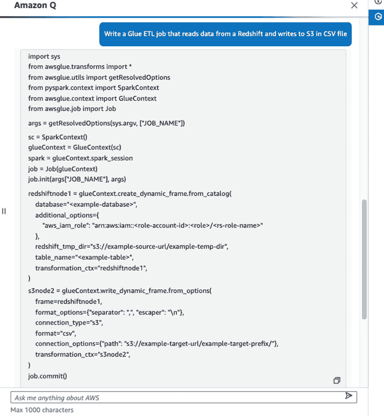

图 2.24 – 使用 Amazon Q 聊天生成 Glue 代码

在 *第十四章* 中，我们将介绍一个用例并提供解决方案，以说明 Q 如何加快 AWS Glue 中的 ETL 作业创建。

### 聊天关于 AWS 资源和成本

现在，Amazon Q 还能理解你在账户中创建的资源上下文中的问答。你可以提出诸如“显示我在 us-west-1 区域运行的所有 EC2 实例”的问题，它将为你列出所有实例。Amazon Q 还可以为你提供 AWS 账户中使用的资源的成本分解。你可以提出诸如“我们在 2023 年 us-east-1 区域在 Amazon Redshift 上花费了多少钱？”的问题，它将为你提供成本结构。

现在，让我们探索一些 Amazon Q 的其他重要功能，这些功能与各种 AWS 服务相关。

## 故障排除 AWS 控制台错误

AWS 构建者在开发过程中花费大量时间来故障排除问题。Amazon Q 使之容易直接从 AWS 控制台中识别和解决错误。而不是手动检查日志和研究错误解决方案，Q 只需点击一下按钮就提出可能的解决方案。

在下面的截图中，我们有一个简单的 AWS Lambda 函数，它打印一条消息。但示例代码中有一个错误。

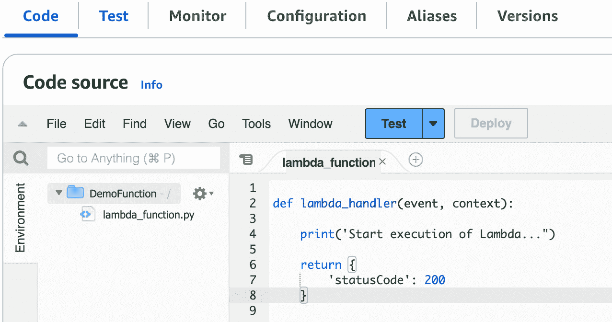

图 2.25 – AWS Lambda 函数中代码存在错误的示例

一切看起来都很不错，但我们错误地将字符串在 `print` 语句中用双引号而不是单引号结束。当运行测试时，错误变得明显，如下面的截图所示。

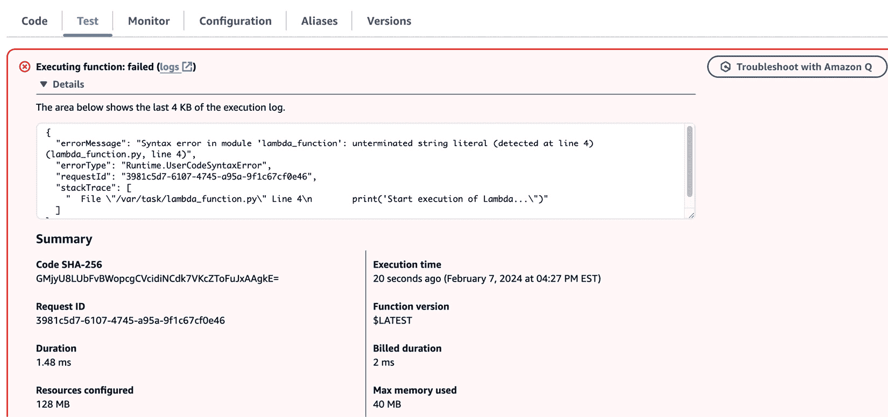

图 2.26 – Amazon Q 与 AWS Lambda 的故障排除功能 – 错误

您无需手动检查日志文件或在网上研究错误，只需在测试屏幕上点击**使用 Amazon Q 进行故障排除**按钮即可。Q 将提供问题分析，您还可以要求它提供解决方案。以下截图显示了缺失单引号的分析和解决方案。

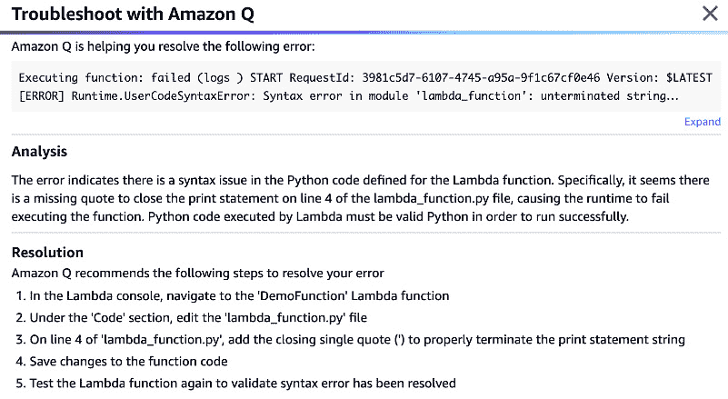

图 2.27 – Amazon Q 与 AWS Lambda 的故障排除功能 – 错误解决

在本书的*第四部分*中，我们将深入了解如何使用 AWS 服务构建解决方案时解决其他复杂问题的细节。

## 故障排除网络问题

每个应用程序构建者和开发者都知道处理网络问题可能会多么可怕。为了减轻这种挫败感，Amazon Q 还可以帮助解决网络问题。Amazon Q 与 Amazon VPC 的可达性分析器协同工作，检查网络连接并识别潜在的配置问题。

例如，在以下截图中，您可以看到，只需向 Q 提出一个连接性问题，它就能提出可能存在的网络问题。

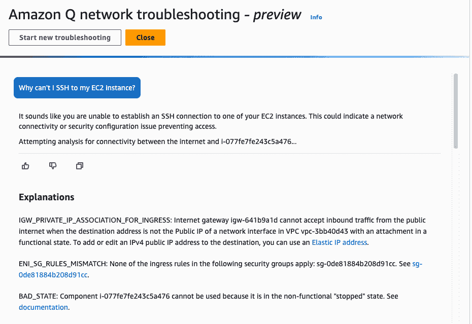

图 2.28 – Amazon Q 网络故障排除

在 Q 确定问题是由网络连接问题引起的后，它随后利用 Amazon VPC 的可达性分析器分析整个网络路径，确定问题可能发生在路径中的哪个位置。以下截图显示了从源到目的地的路径分析，并建议潜在的问题位置。

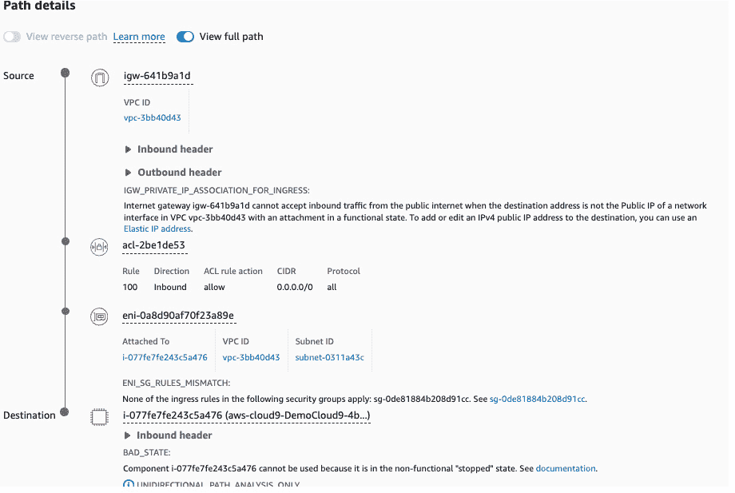

图 2.29 – Amazon Q 网络故障排除 – 路径分析

让我们继续看看 Amazon Q 在 AWS 上的更多功能。

## Amazon EC2 实例的最佳选择

AWS 构建者对 Amazon **弹性计算云**（**EC2**）实例非常熟悉，因为他们中的许多人使用服务器来部署和运行他们的应用程序。然而，由于 EC2 实例类型众多，很难知道哪种类型的实例最适合特定的负载。当然，您可以进行研究并选择最佳选项，但 Amazon Q 使得从 EC2 控制台本身选择最佳的 EC2 实例变得容易。

在 EC2 控制台中，您可以选择实例类型，当您点击如下截图所示的**获取建议**链接时，Amazon Q 就派上用场了。

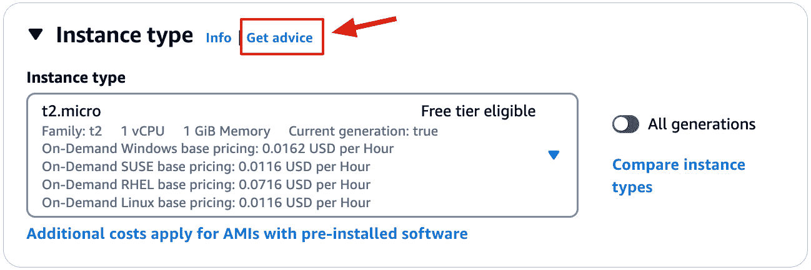

图 2.30 – Amazon Q – EC2 实例类型建议

您可以选择您的用例、工作负载类型、优先级和 CPU 类型，这些构成了亚马逊 Q 的输入，以建议最佳可能的 EC2 实例。以下截图显示了您从 Q 寻求建议后，选择标准部分的情况。

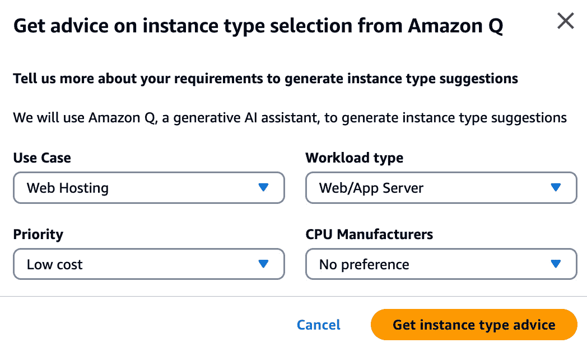

图 2.31 – Amazon Q – EC2 实例类型选择标准

一旦您点击**获取实例类型建议**按钮，Q 就会施展其魔法。以下截图显示了根据我们提供的输入标准应使用的实例，并解释了这些 EC2 实例各自带来的优势。它列出了信息来源，以便任何人都可以查看原始的真实来源。

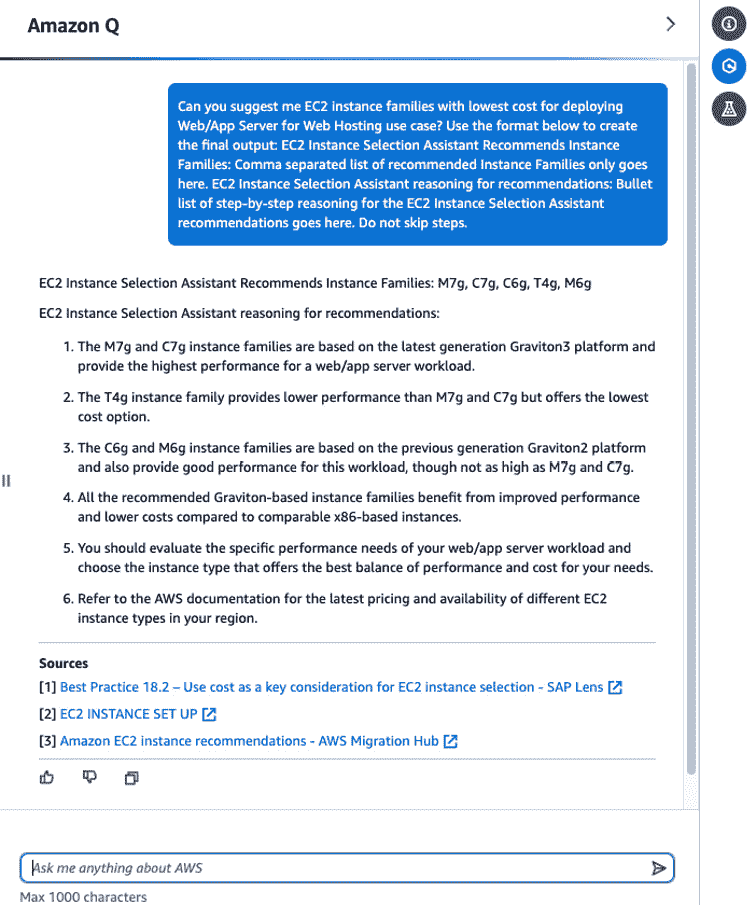

图 2.32 – Amazon Q – EC2 实例选择建议

在我们结束关于 Amazon Q 的介绍性章节之前，让我们快速看一下关于功能开发的关键方面之一。

## 协助 AWS 支持案例

您可以使用 Amazon Q 开发者创建支持案例，并从 AWS 管理控制台中的任何位置联系 AWS 支持，包括 AWS 支持中心控制台。亚马逊 Q 利用您对话的上下文，自动为您草拟支持案例，并将最近的对话纳入支持案例描述中。一旦创建案例，亚马逊 Q 就可以通过您首选的方式将您连接到支持代理，包括在同一界面内的实时聊天。

## 在 Amazon CodeCatalyst 中协助 DevOps 流程

Amazon CodeCatalyst 是一项服务，为开发团队提供统一的软件开发服务，以快速在 AWS 上构建、部署和扩展应用程序，同时保持组织特定的最佳实践。

亚马逊 Q 在 Amazon CodeCatalyst 中的功能开发能力充当一个生成式 AI 助手，您可以分配问题给它。一旦问题被分配，亚马逊 Q 将分析其标题和描述，审查指定存储库中的代码，并在可能的情况下草拟一个解决方案。然后，这个草拟的解决方案将被呈现给用户，以便在拉取请求中进行评估。

我们在书的第四部分有关于这个主题的整整一章，所以在这里我们将简要介绍。

# 摘要

在本章中，我们介绍了 Amazon Q 开发者是什么以及它如何帮助开发人员和应用程序构建者在日常任务中提供协助。我们还简要探讨了其一些功能，以及设置时的考虑因素。

接下来，我们介绍了 Amazon Q 在命令行界面、外部 IDE（如 VS Code 和 JetBrains IDEs）以及 AWS 服务、IDEs 和笔记本（如 Amazon SageMaker Studio、Amazon EMR Studio、AWS Glue Studio 和 AWS Lambda）中的设置。

我们探讨了其对 AWS 构建者的益处，强调了如何从 AWS 控制台本身利用 Amazon Q 来协助各种活动。从高层次上，我们介绍了 Amazon Q 如何帮助进行对话式问答风格的聊天、控制台问题、网络故障排除、EC2 实例选择，以及 Amazon CodeCatalyst 中的 DevOps 流程。

在本书第二部分的后续章节中，我们将深入了解自动代码生成技术以及 Amazon Q 开发者如何在这一过程中协助开发者。

# 参考文献

+   Amazon Q 主页：[`aws.amazon.com/q/`](https://aws.amazon.com/q/)

+   Amazon Q 开发者定价：[`aws.amazon.com/q/developer/pricing/`](https://aws.amazon.com/q/developer/pricing/)

+   设置 Amazon Q 开发者：[`docs.aws.amazon.com/amazonq/latest/qdeveloper-ug/getting-started-q-dev.html`](https://docs.aws.amazon.com/amazonq/latest/qdeveloper-ug/getting-started-q-dev.html)

+   macOS 命令行安装 Amazon Q 开发者：[`desktop-release.codewhisperer.us-east-1.amazonaws.com/latest/Amazon%20Q.dmg`](https://desktop-release.codewhisperer.us-east-1.amazonaws.com/latest/Amazon%20Q.dmg)

+   为您的 IDE 安装 Amazon Q 开发者扩展/插件：[`docs.aws.amazon.com/amazonq/latest/qdeveloper-ug/q-in-IDE-setup.html`](https://docs.aws.amazon.com/amazonq/latest/qdeveloper-ug/q-in-IDE-setup.html)

+   不同 IDE 中 Amazon Q 开发者的用户操作：[`docs.aws.amazon.com/amazonq/latest/qdeveloper-ug/actions-and-shortcuts.html`](https://docs.aws.amazon.com/amazonq/latest/qdeveloper-ug/actions-and-shortcuts.html)

+   AWS IAM 身份中心：[`docs.aws.amazon.com/singlesignon/latest/userguide/what-is.html`](https://docs.aws.amazon.com/singlesignon/latest/userguide/what-is.html)

+   Amazon Q 开发者层级：[`docs.aws.amazon.com/amazonq/latest/qdeveloper-ug/getting-started-q-dev.html`](https://docs.aws.amazon.com/amazonq/latest/qdeveloper-ug/getting-started-q-dev.html)

# 第二部分：生成代码推荐

在本部分中，我们将探讨许多可以帮助开发者在软件开发生命周期中使用的 Amazon Q 开发者关键功能。这些功能可以在许多支持的 IDE 中使用，并帮助各种编程语言。

本部分包含以下章节：

+   *第三章*，*理解自动代码生成技术*

+   *第四章*，*使用自动代码生成提高 Python 和 Java 编码效率*

+   *第五章*，*使用自动代码生成提高 C 和 C++编码效率*

+   *第六章*，*使用自动代码生成提高 JavaScript 和 PHP 编码效率*

+   *第七章*，*使用自动代码生成提高 SQL 编码效率*

+   *第八章*, *使用自动代码生成提高命令**-**行和 Shell 脚本的编码效率*

+   *第九章*, *使用自动代码生成提高 JSON、YAML 和 HCL 的编码效率*
