# 6

# 使用自动代码生成提高 JavaScript 和 PHP 的编码效率

在本章中，我们将探讨以下关键主题：

+   网络开发编程语言概述

+   使用 Amazon Q Developer 进行 JavaScript 自动代码生成

+   使用 Amazon Q Developer 自动生成 PHP 代码

+   使用 Amazon Q Developer 解释和优化 JavaScript 和 PHP 代码的可解释性

在上一章中，我们探讨了编程语言的某些类别。然后，我们讨论了基础编程语言的概述，在关注软件行业中使用的两种主导语言：C 和 C++ 之前。我们介绍了如何使用 Amazon Q Developer 集成自动代码生成，并可以帮助 C 和 C++ 开发者理解、学习语法和自动生成代码。

与上一章类似，在本章中，我们将关注两种编程语言。我们将从网络编程语言的概述开始，然后重点关注在软件行业中常用的两种语言：**JavaScript**（**JS**）和 **PHP**。我们将介绍如何使用自动代码生成，特别是通过 Amazon Q Developer，来帮助 JavaScript 和 PHP 开发者理解基础知识、学习语法、自动生成代码、代码可解释性和通过代码建议进行优化。

# 网络开发编程语言概述

在前面的章节中，我们回顾了不同的编程语言类别，并深入探讨了如 C 和 C++ 这样的基础语言，这些语言为许多系统结构提供动力。现在，让我们深入了解网络开发语言，如 JS 和 PHP，这些语言使动态和交互式网络体验成为可能。这些是服务器端脚本、客户端脚本、**文档对象模型**（**DOM**）编程、Web API、移动应用程序等最受欢迎的语言。

几十年前，随着网络应用程序开发的增长，软件行业中引入了许多语言。网络开发语言在塑造现代网络应用程序的交互和功能方面发挥着关键作用。在这些语言中，JavaScript（JS）和 PHP 因其在客户端和服务器端脚本中的各自角色而突出。JavaScript 为网络浏览器中的动态和交互式用户体验提供动力，而 PHP 则便于服务器端逻辑，以实现动态内容生成和数据库交互。在 Web 开发领域，效率和生产力是成功的关键因素。开发者经常面临诸如重复编码任务、在不同模块间保持代码一致性以及跟上不断发展的最佳实践等挑战。自动代码生成已成为解决这些挑战的解决方案，使开发者能够自动化常规编码任务并简化他们的工作流程。

亚马逊 Q 开发者是一个利用人工智能和机器学习的高级工具，为 JavaScript 和 PHP 的自动代码生成提供了显著的能力。通过将亚马逊 Q 开发者集成到开发过程中，开发者可以利用其功能来提高生产力、提升代码质量并加快开发周期。

作为前端脚本语言，JS 在创建交互式用户界面和动态网页内容方面起着至关重要的作用。然而，由于需要跨浏览器兼容性、异步编程模式和事件驱动交互的管理，JS 开发可能会变得复杂。亚马逊 Q 开发者通过生成针对特定要求定制的代码片段和函数来简化 JS 开发。网页开发者可以利用不同的提示技术以及聊天式集成（请参阅*第三章*）来获取自动创建事件处理程序、DOM 操作函数和异步操作的建议，从而减少开发时间并确保在不同浏览器环境中的代码一致性。

在服务器端，PHP 仍然是动态网页应用和后端服务的流行选择。PHP 在处理表单提交、会话管理和数据库交互方面的多功能性使它对网页开发者来说是不可或缺的。然而，编写高效且安全的 PHP 代码需要遵守编码标准和最佳实践。亚马逊 Q 开发者通过为常见任务如数据库查询、表单处理和错误处理生成优化的 PHP 代码片段来协助开发者。这不仅加速了开发，还增强了代码的可靠性和安全性。

此外，亚马逊 Q 开发者支持 JS 和 PHP 语法的学习和理解。对于这些语言的新手开发者，亚马逊 Q 开发者通过聊天式交互提供交互式教程和代码示例。开发者可以使用提示来请求对语言特性的解释、获取特定功能的代码片段或根据预定义模板生成完整的脚本。亚马逊 Q 开发者这一教育特性有助于缩短学习曲线，并使开发者能够快速掌握基本概念和技术。

现在，让我们深入探讨一下亚马逊 Q 开发者如何帮助一位网页程序员。为了说明这一点，我正在使用 VS Code 中的亚马逊 Q 开发者界面（有关亚马逊 Q 开发者与 VS Code 的配置步骤，请参阅*第二章*，并在本章末尾的*参考*部分查看 JS 和 PHP 的 URL），并检查 JS 和 PHP 在 VS Code 中的配置步骤；检查本章末尾的*参考*部分以获取 JS 和 PHP 的 URL。

注意

亚马逊 Q 开发者使用 LLMs，按其本质是非确定性的，因此您可能不会得到代码快照中显示的完全相同的答案/代码块；尝试更新提示以获取所需的建议。然而，从逻辑上讲，生成的答案/代码应满足要求。

# 使用 Amazon Q 开发者进行 JS 自动代码生成

首先，让我们探索 Amazon Q 开发者如何帮助一个计划使用 JS 但缺乏语言背景的新网页程序员。我们将使用 Amazon Q 开发者的聊天风格界面来教育程序员。

## JS 语言基础

让我们通过询问 JS 的基础知识来了解 JS 编程语言：

```py
Q: What is programming language JavaScript(JS) and what are use cases best suitable for JS ?
```

如你在以下屏幕截图中所见，Amazon Q 开发者提供了关于原始开发者的历史信息。然后，它通过分类总结 JS 语言的常见用例，其中 JS 语言表现出色。此外，它还提供了进一步参考和学习的资源。

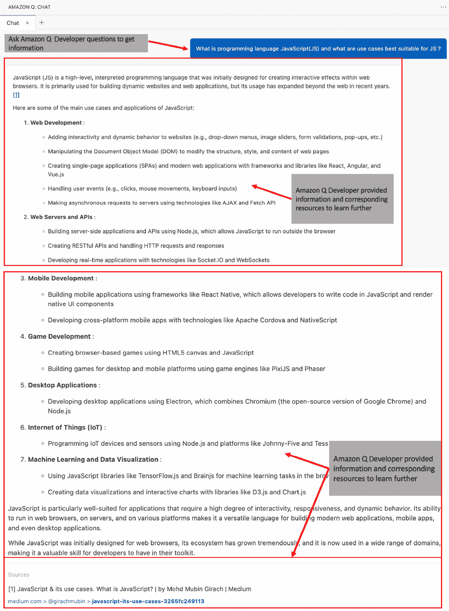

图 6.1 – 聊天风格 – JS 基础

你可以观察到，除了网页开发之外，Amazon Q 开发者指出了 JS 应用程序的通用性，例如游戏开发、桌面应用程序、**物联网**（**IoT**）应用程序和机器学习应用程序。Amazon Q 还提供了关于在“**需要高度交互性、响应性和动态行为**”的应用程序中使用 JS 的指南*.*

根据前面的信息，你可以看到 JS 是如此通用，可以在各个行业的各种软件开发项目中使用。让我们看看 JS 网页程序员常用的命令：

```py
Q: What are the common commands in programming language JS?
```

我们不会逐个介绍每个命令，但为了说明，如你在以下部分屏幕截图中所见，Amazon Q 开发者提供了 JS 编程语言中常见命令和结构的几个类别。为了便于理解，它还包含了每个类别的常见关键命令。

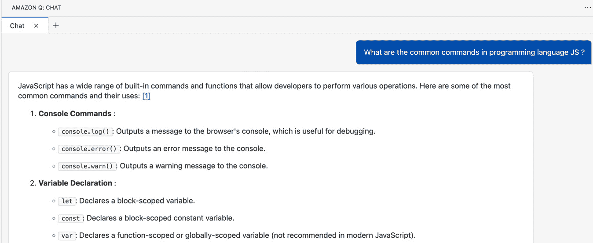

图 6.2 – 聊天风格 – JS 命令

Amazon Q 开发者突出了 JS 在多个领域支持的命令集，例如控制台命令、DOM 操作命令、数组操作等等。

让我们使用其中一个领域来获取信息，并请 Amazon Q 开发者提供与 JS 对 DOM 操作支持相关的详细信息和示例：

```py
Q: What is DOM Manipulation and how JS supports it ?
```

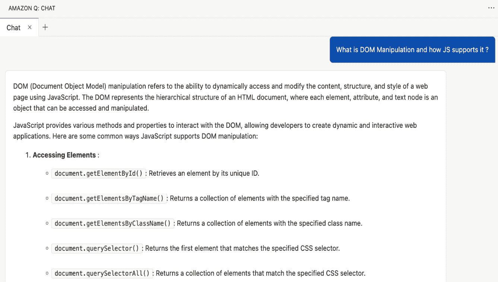

图 6.3 – 聊天风格 – JS DOM 操作

如前一张部分截图所示，亚马逊 Q 开发者从 DOM 操作的基础开始，这指的是使用 JS 动态访问和修改网页的内容、结构和样式的能力。DOM 代表了 HTML 文档的层次结构，其中每个元素、属性和文本节点都是一个可以访问和操作的对象。然后，它继续提供与访问 DOM 元素、创建和修改元素、操作属性、处理事件、修改样式以及 DOM 操作库和框架相关的具体细节。最后，它提供了一个总结，强调了 JS 在 DOM 操作中的重要性：“**DOM 操作是构建动态和交互式 Web 应用程序的关键方面。通过利用 JavaScript 访问和修改 DOM 的能力，开发者可以创建丰富的用户体验，动态更新内容，验证用户输入，并响应用户交互，而无需刷新整个页面**”，并附上参考来源。

现在，让我们向亚马逊 Q 开发者询问在编写复杂脚本时最常用的循环之一的语法，即 JS 中的`for...in`循环：

```py
Q: Provide syntax and example of "for…in loop" in JS
```

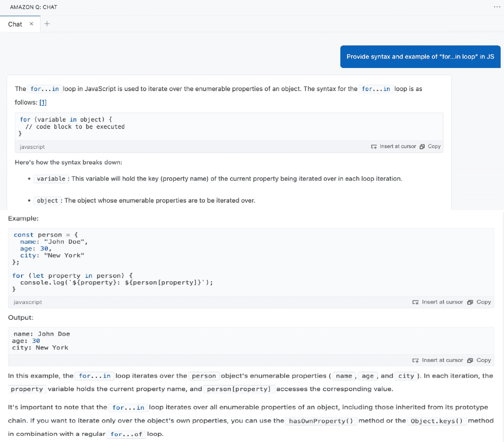

图 6.4 – 聊天风格 – JS “for...in”循环示例

在上一张部分截图中，可以看到亚马逊 Q 开发者提供了`for...in`循环的语法、细节和示例。现在，让我们转到示例使用案例，以展示亚马逊 Q 开发者推荐代码的能力。

## 端到端 JS 使用案例开发

为了说明，我将使用 VS Code 脚本编辑器窗口的单行和多行提示。

这里是使用案例：创建 JS 端到端代码来构建待办事项列表应用程序。创建添加新项目、标记项目为完成和删除项目等任务。使用 JS 操作 DOM 并响应用户事件。以下是提示：

```py
Prompt:
/* Create JS end to end code to building a to-do list application. Tasks to adding new items, mark items as completed, and delete items. Use JavaScript to manipulate the DOM and responding to user events. */
```

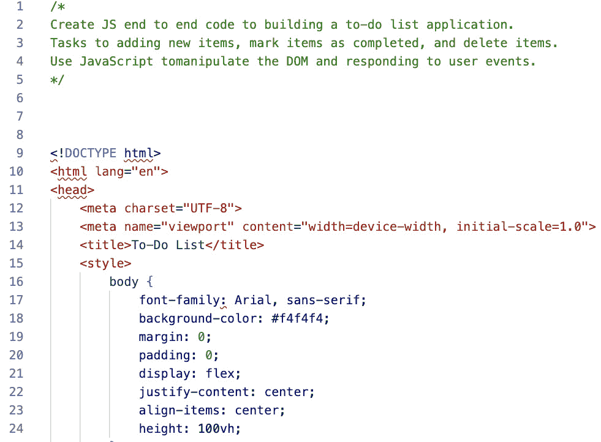

图 6.5 – 提示 – JS 程序部分快照

上一张截图显示了亚马逊 Q 开发者建议的部分代码片段。根据我们的提示生成的完整端到端代码展示了 JS 和 DOM 操作中的几个基本和高级概念。它有效地利用了与 DOM 相关的关键 JS 功能，例如获取元素、创建元素、修改元素、处理事件和应用样式。它利用了 JS 的多个关键内置函数，包括`document.getElementById`、`document.createElement`、`taskItem.appendChild`、`taskList.removeChild`、`Button.onclick`等。它还包括一个自定义的`addTask()`函数来支持编码最佳实践。端到端代码满足了您提示的具体要求，展示了亚马逊 Q 开发者生成全面且功能强大的 Web 开发任务代码的能力。

在当前版本的代码中，亚马逊 Q 开发者添加了两个按钮：“删除”和“完成”。如果我们根据应用程序支持的基本操作链来考虑，似乎缺少一个“取消”按钮。让我们使用单行提示技术建议亚马逊 Q 开发者添加一个“取消”按钮：

```py
Prompt:
/* add Cancel button */
```

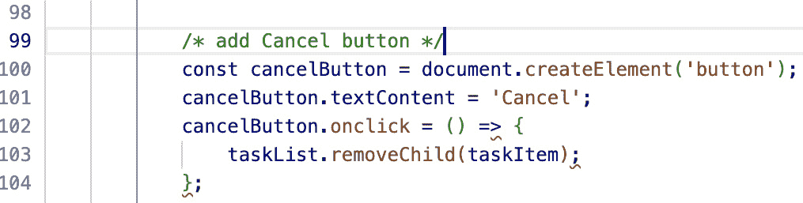

图 6.6 – 提示 – JS 程序取消按钮

正如您在前面的屏幕截图中所见，亚马逊 Q 开发者添加了多行代码来添加“取消”按钮。它有效地使用了诸如 `document.createElement`、`cancelButton.onclick` 和 `taskList.removeChild` 等 JS 函数。

在下一节中，我们将看看亚马逊 Q 开发者如何支持 PHP 开发者。

# 使用亚马逊 Q 开发者进行 PHP 自动代码生成

就像之前一样，首先，让我们假设一位新的网络程序员计划使用 **PHP**（这是一个递归缩写，代表 **PHP: Hypertext Preprocessor**）并且没有太多使用 PHP 背景进行编码的经验。让我们使用亚马逊 Q 开发者的聊天风格界面来教育这位程序员。

## PHP 语言基础

让我们了解 PHP 编程语言：

```py
Q: What is programming language PHP and what are use cases best suitable for PHP ?
```

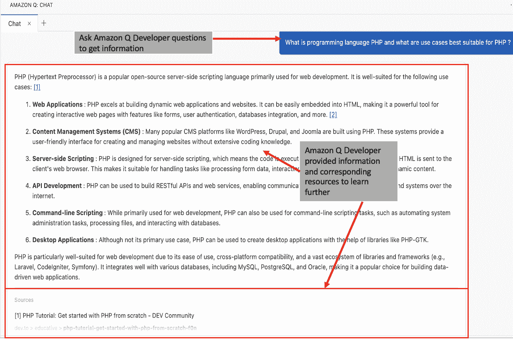

图 6.7 – 聊天风格 – PHP 基础

正如您在前面的屏幕截图中所见，亚马逊 Q 开发者提供了基本信息，例如告知我们 PHP 是一种流行的开源服务器端脚本语言，广泛用于网站开发。它主要用于创建动态网页和网页应用程序。PHP 的多功能性和大量库和框架的可用性已经扩展了其使用场景，超出了网页的范围。然而，它仍然主要用于构建动态网页应用程序、内容管理系统和网页服务。

此外，它概述了 PHP 在其中扮演重要角色的常见应用，例如网站开发、**内容管理系统**（**CMSs**）、服务器端脚本、命令行脚本、桌面应用程序、数据处理和分析以及嵌入式系统。

由于 PHP 是一种流行的开源服务器端脚本语言，让我们请亚马逊 Q 开发者提供有关 PHP 对服务器端脚本支持的具体细节和示例，这有助于其广泛使用：

```py
Q: What is server-side scripting and how PHP supports it?
```

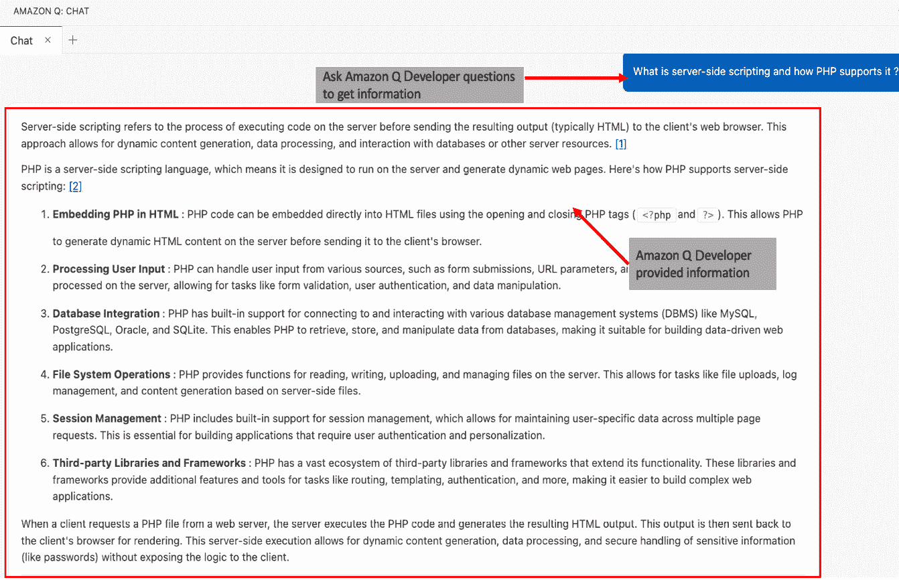

图 6.8 – 聊天风格 – PHP 服务器端脚本支持

亚马逊 Q 开发者从服务器端脚本的基础开始，解释说：“**服务器端脚本是指在实际输出（通常是 HTML）发送到客户端的 Web 浏览器之前在服务器上执行代码的过程**”*.* 然后，它为 PHP 提供了背景信息，强调 PHP 是一种设计在服务器上运行并生成动态网页的服务器端脚本语言。此外，它列出了 PHP 支持的关键功能，例如在 HTML 中嵌入 PHP 代码、处理用户输入、文件系统操作、数据库集成、会话管理、网络服务和 API 以及服务器配置和环境。

现在，让我们请求一些 PHP 网络程序员常用的命令：

```py
Q: What are the common commands in programming language PHP?
```

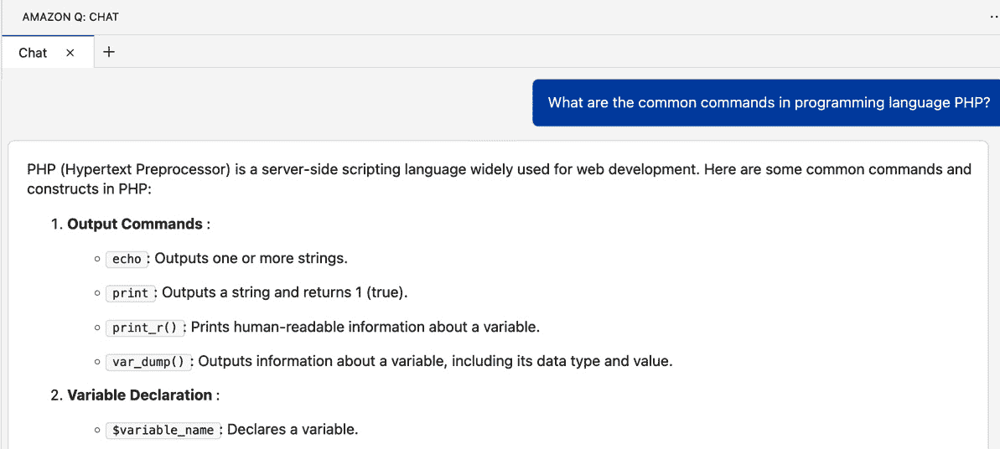

图 6.9 – 聊天式界面 – PHP 常见命令局部截图

我们不会涵盖每个命令，但如图 6.10 所示的局部截图所示，亚马逊 Q 开发者提供了各种命令类别，例如输出命令、变量命令、条件语句、数据库命令、表单命令、错误处理、数组命令等。为了便于理解，它为每个类别包含了一些常见的关键命令，并为用户提供参考，以便获取这些主题的更详细信息。

数据库命令是使 PHP 在服务器端脚本中变得有用的几个重要类别之一。现在，让我们向亚马逊 Q 开发者请求 PHP 中`mysqli_connect()`的语法和示例：

```py
Q: Provide syntax and example of mysqli_connect() in PHP
```

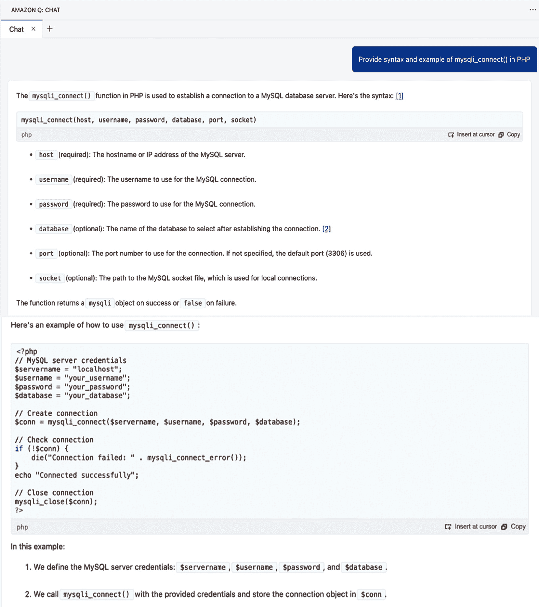

图 6.10 – 聊天式界面 – PHP mysqli_connect()

如前图所示，亚马逊 Q 开发者提供了一个`mysqli_connect()`的示例，并解释了代码每一行的细节，以便更容易理解。

## PHP 语言端到端用例开发

现在，让我们继续到示例用例，以展示亚马逊 Q 开发者推荐代码的能力。为了说明，我将使用相同的聊天式界面生成代码，然后转到 VS Code 脚本编辑器窗口。

在服务器端编程中，PHP 的一个常见用例是处理用户身份验证和管理会话。这包括验证用户凭据、启动会话以及管理会话数据以在 Web 应用程序的不同页面之间保持用户状态。以下是提示：

```py
Prompt:
/* Write PHP server-side end to end programming to handle user authentication and managing sessions. This involves verifying user credentials, starting sessions, and managing session data to maintain user state across different pages of a web application. */
```

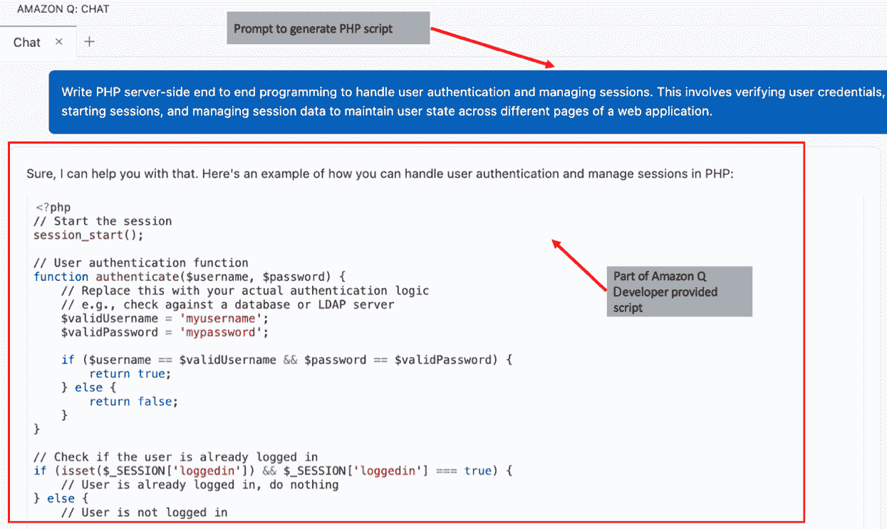

图 6.11 – 提示 – PHP 程序局部快照

上述截图显示了 Amazon Q Developer 提出的部分代码片段。您可以使用 `authenticate ($username, $password)` 函数并带有错误处理，以及使用 `isset($_SESSION['loggedin']) && $_SESSION['loggedin']` 检查有效用户并使用会话处理。该代码符合您提示的具体要求，展示了 Amazon Q Developer 生成全面且功能性的代码以处理用户身份验证和管理会话的能力。

脚本已经输出了错误信息，但让我们通过一些定制来增加趣味。不是仅仅显示一个无聊的错误信息，而是每次发生错误时都从充满随机图像的文件夹中显示一个随机错误图像。让我们使用单行提示技术，添加一个自定义的转折点：

```py
Prompt:
/* show random error image from folder '/user/error/images/'*/
```

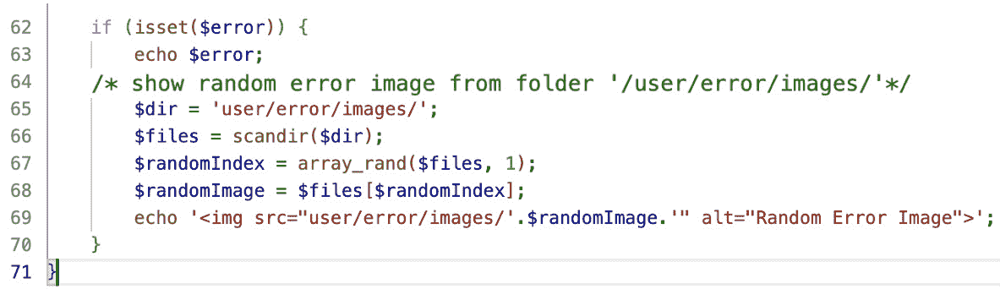

图 6.12 – 提示 – PHP 程序自定义错误图像

如前述截图所示，Amazon Q Developer 添加了多行代码，随机从我们的 `error/images` 目录中选择一个图像，并将其作为显示的一部分。

现在，让我们探讨 Amazon Q Developer 如何支持 JS 和 PHP 的代码可解释性和优化。

# 使用 Amazon Q Developer 解释 JS 和 PHP 代码的可解释性和优化

Amazon Q Developer 为 JS 和 PHP 提供了一个简单的界面，以实现代码的可解释性和优化。有关可解释性和优化的更多详细信息，请参阅 *第十二章*。

为了说明，我将在 *PHP 服务器端端到端代码* 创建任务中使用的先前自动生成的代码。如下所示截图，突出显示代码，右键单击以打开弹出菜单，选择 **Amazon Q**，然后选择 **解释** 以实现代码可解释性或选择 **优化** 以获取优化建议。

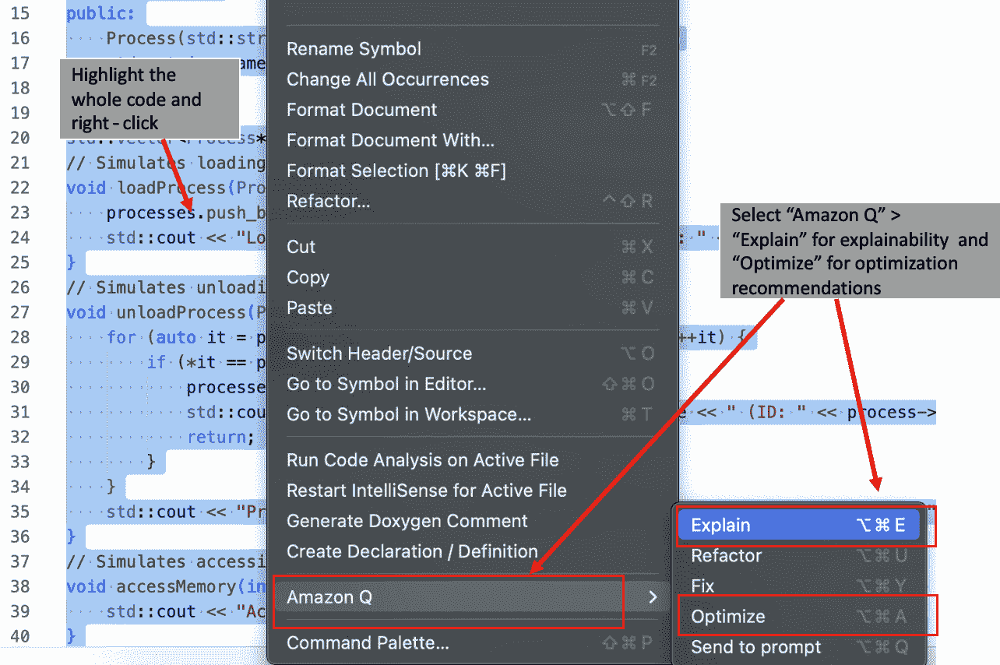

图 6.13 – 提示 – JS 和 PHP 程序的可解释性和优化

这将打开 Amazon Q Developer 的聊天式界面以分析完整代码。

对于可解释性，Amazon Q Developer 提供了关于每个函数和整体代码逻辑的详细信息。

在优化方面，Amazon Q Developer 提供了端到端优化的代码，您可以直接使用 `authenticate()` 函数将其插入到您的编辑器中，结合 `$isLoggedIn` 中的条件以提高可读性，并建议输出编码以防止潜在的安全漏洞。这些优化增强了代码的安全性、可读性和性能，而不改变其核心功能。此外，它建议用更安全的方法替换当前的认证方法，例如使用安全的密码散列算法并将用户凭据存储在数据库中。

除了 JS 和 PHP，Amazon Q 开发者还支持多种其他编程语言。该领域正在进行许多改进，我们预计将会有更多语言支持方面的改进（请参阅章节末尾的*参考文献*部分）。

# 摘要

Amazon Q 开发者代表了在诸如 JS 和 PHP 这样的网络开发语言中自动代码生成的变革性工具。程序员通过与 Amazon Q 开发者的聊天式交互来与之互动，使其成为一个直观的学习和编码平台。通过使用各种提示技术，开发者可以从 Amazon Q 开发者那里获取代码片段或完整的脚本，从而简化他们的工作流程。

对于 JS 来说，这项功能对于创建交互式用户界面和动态网络内容至关重要。开发者可以提示 Amazon Q 开发者生成用于常见任务（如表单验证、事件处理和 DOM 操作）的 JS 代码。

类似地，Amazon Q 开发者对 PHP 的集成有助于网络开发者实现动态网络应用、服务器端脚本和后端服务。如图所示，它可以生成用于处理用户登录、会话、身份验证等任务的 PHP 代码。除了代码生成外，Amazon Q 开发者还提供生成代码的解释，帮助开发者理解脚本中每一部分的功能。这一教育特性对于希望提高编码技能的新手和经验丰富的开发者来说都非常有价值。

总体而言，Amazon Q 开发者通过自动化常规编码任务和提供优化见解，使网络开发者能够更高效地工作。这使开发者能够专注于项目创新方面，提高开发效率和代码质量。对 JS 和 PHP 的支持展示了 Amazon Q 开发者在现代网络开发中的多功能性和潜力。

在下一章中，我们将介绍 Amazon Q 开发者如何通过 SQL 为数据库管理员（DBAs）和开发工程师（DEs）提供益处。

# 参考文献

+   Visual Studio Code 中的 JavaScript：[`code.visualstudio.com/docs/languages/javascript`](https://code.visualstudio.com/docs/languages/javascript)

+   Visual Studio Code 中的 PHP：[`code.visualstudio.com/docs/languages/php`](https://code.visualstudio.com/docs/languages/php)

+   在 IDE 中 Amazon Q 开发者支持的语言：[`docs.aws.amazon.com/amazonq/latest/qdeveloper-ug/q-language-ide-support.html`](https://docs.aws.amazon.com/amazonq/latest/qdeveloper-ug/q-language-ide-support.html)
