# 7

# 使用自动代码生成提高 SQL 的编码效率

在本章中，我们将探讨以下关键主题：

+   数据库管理语言的概述

+   使用 Amazon Q Developer 为**数据库管理员**（**DBAs**）进行 SQL 自动代码生成

+   使用 Amazon Q Developer 为**数据工程师**（**DEs**）进行 SQL 自动代码生成

+   使用 Amazon Q Developer 进行 SQL 代码的可解释性和优化

在我们上一章中，我们讨论了网络编程语言的概述，然后重点介绍了在软件行业中使用的两种主导语言——**JavaScript**（**JS**）和 PHP。我们展示了自动代码生成，特别是 Amazon Q Developer，是如何集成并可以被 JS 和 PHP 开发者用来理解基础知识、学习语法以及自动生成代码的。

在本章中，我们将专注于数据库管理语言。我们将深入研究软件行业中占主导地位的数据库管理语言之一——**结构化查询语言**（**SQL**）。使用两个用户角色，数据库管理员（DBAs）和数据库工程师（DEs），我们将介绍如何通过 Amazon Q Developer 的自动代码生成来帮助您理解基础知识、学习语法以及为常见的数据库管理员活动自动生成代码。然后，我们将探讨代码可解释性，以支持 Amazon Q Developer 为 SQL 提供的文档和代码优化建议。

# 数据库管理语言概述

让我们深入了解另一个在各个行业中广泛使用的系统领域——数据库管理——并探索 SQL，这是处理大型数据集、表、视图、用户等的关键语言。

在数据库管理的动态环境中，SQL 作为与关系数据库交互的基本语言。SQL 使数据库管理员（DBAs）和数据库工程师（DEs）能够高效地在各种**数据库管理系统**（**DBMs**）中检索、操作和管理数据。当在涉及关系数据库和/或列数据库的项目上工作时，如 MySQL、PostgreSQL、Oracle 数据库、SQL Server、Teradata 和 Amazon RedShift，SQL 至关重要。随着数据库变得越来越复杂，对业务运营至关重要，编写高效和可靠的 SQL 代码的能力变得至关重要。自动代码生成已成为简化 SQL 开发流程、自动化常规任务并提高数据库管理员和数据库工程师 alike 生产力的一种变革性方法。Amazon Q Developer 利用先进的人工智能和机器学习功能，为 SQL 代码生成提供强大的支持。本节探讨了 Amazon Q Developer 如何革新 SQL 开发，赋予数据库管理员和数据库工程师权力，并促进高效的数据库管理和数据操作。

对于数据库管理员（DBAs）来说，SQL 在数据库管理和应用开发中扮演着至关重要的角色，它使得定义数据库结构、管理访问控制、监控日志表和确保数据完整性等任务成为可能。对于数据工程师（DEs）而言，SQL 是执行诸如在表中加载数据、通过连接多个表查询数据、使用存储过程操作数据以及卸载数据等任务的关键。然而，编写 SQL 查询和维护数据库模式可能会非常耗时且容易出错，尤其是在数据需求广泛且关系复杂的环境中。Amazon Q Developer 通过自动化生成 SQL 查询、数据库模式定义和数据操作脚本，简化了 SQL 开发过程。通过其直观的聊天式界面，DBAs 和数据工程师可以使用自然语言提示与 Amazon Q Developer 交互，请求特定的 SQL 查询或任务。

此外，Amazon Q Developer 还作为 SQL 学习者和新手数据工程师的教育资源。它通过聊天界面提供交互式教程、SQL 概念的说明以及 SQL 查询的实际示例。这一教育特性帮助 DBAs 和数据工程师更有效地掌握 SQL 基础知识，并将其应用于实际的数据库管理和数据操作场景中。

经验丰富的 DBAs 和数据工程师可以使用 Amazon Q Developer 的高级功能，例如查询优化和性能调整建议。它分析用户生成的 SQL 查询，识别潜在的性能瓶颈或低效之处，并提供建议以提升查询执行速度和资源利用率。这些优化能力对于在生产环境中保持最佳数据库性能和可扩展性至关重要。致力于数据库驱动应用程序的团队可以从标准化的 SQL 代码模板、共享的最佳实践和简化的代码审查流程中受益。

现在，让我们深入探讨 Amazon Q Developer 如何帮助 DBAs 和数据工程师。为了说明，我将使用 Amazon **关系数据库服务**（**RDS**）的 MySQL 版本，这是 Amazon Web Services（**AWS**）提供的一项服务，以及与 VS Code 集成的 Amazon Q Developer 界面（有关 Amazon Q Developer 与 VS Code 的配置步骤，请参阅*第二章*）。

注意

Amazon Q Developer 使用**大型语言模型**（**LLMs**），这些模型本质上是非确定性的，因此您可能不会得到与代码快照中显示的完全相同的答案/代码块。尝试更新提示以获取您期望的建议。然而，从逻辑上讲，生成的答案/代码应满足要求。

# 使用 Amazon Q Developer 为 DBAs 自动生成 SQL 代码

首先，假设一位新的 DBA 计划使用 Amazon RDS for MySQL，并且对该服务没有任何背景知识。让我们使用 Amazon Q 开发者的聊天风格界面来教育 DBA，在那里他们可以简单地用自然语言提问，了解关于 Amazon RDS for MySQL 的 DBA 活动和最佳实践。

## Amazon RDS for MySQL 的基本知识，适用于 DBA

让我们先了解 Amazon RDS for MySQL：

```py
Q: What is Amazon RDS for MySQL ?
```

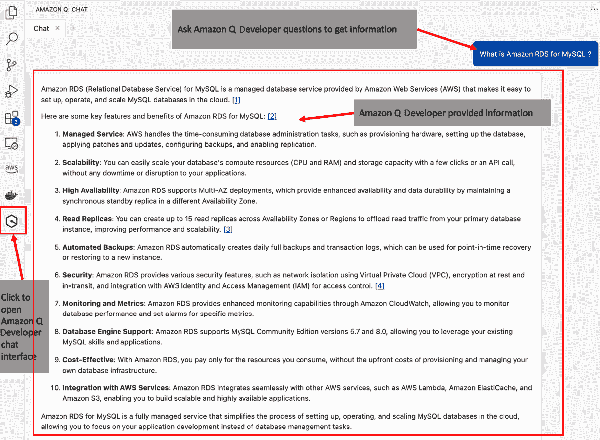

图 7.1 – 聊天风格 – MySQL DBA 的 Amazon RDS 基本

注意，Amazon Q 开发者提供了关于 Amazon RDS for MySQL 的关键信息，涉及重要主题，如**托管服务**、**可伸缩性**、**高可用性**、**只读副本**和**自动备份**。

现在，让我们深入了解与 Amazon RDS for MySQL 相关的 DBA 特定信息：

```py
Q: What are the common activities of Amazon RDS for MySQL DBA?
```

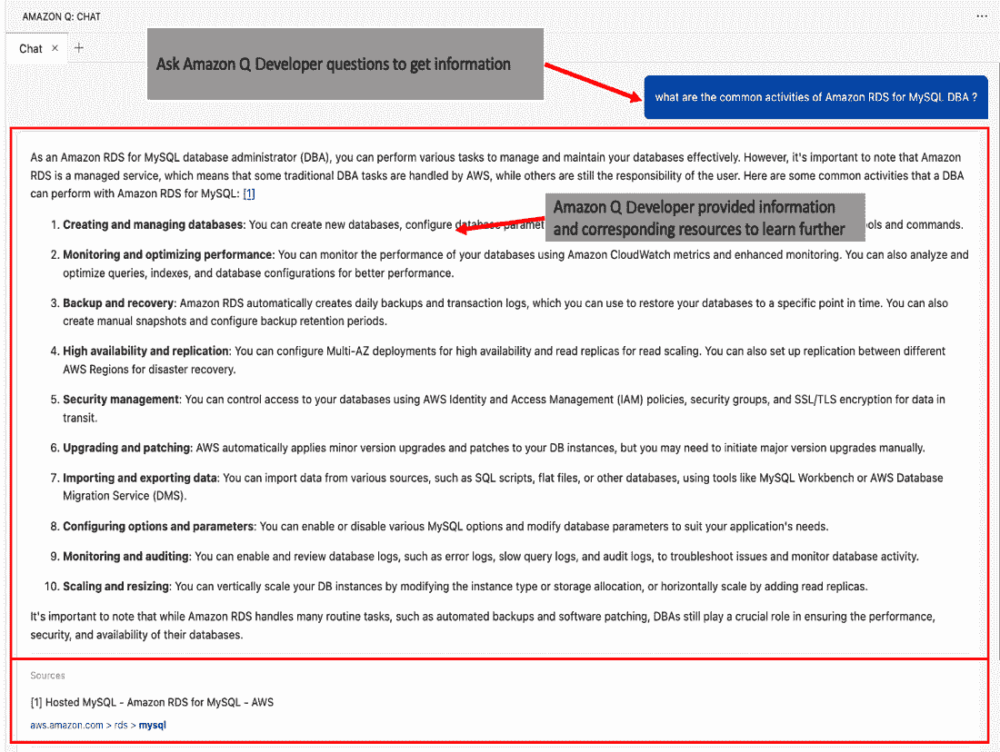

图 7.2 – 聊天风格 – Amazon RDS for MySQL 的基本 MySQL DBA 活动

我们不会深入探讨 Amazon Q 开发者建议的每个 DBA 活动；只需注意，Amazon Q 开发者利用了 DBA 职责的关键领域，如创建和管理数据库、监控和优化性能、备份和恢复、高可用性和复制、安全管理以及升级和打补丁，为 Amazon RDS 提供 MySQL 特定的信息。此外，它还提供了可用于进一步阅读的资源。

安全管理是数据库管理员（DBA）最重要的职责之一。管理型 AWS 服务，如 Amazon RDS，具有与本地数据库不同的机制，因此 DBA 了解这些差异至关重要。让我们请 Amazon Q 开发者提供更多信息，以帮助 DBA 了解 Amazon RDS for MySQL 的具体细节和最佳实践。

为了说明最佳实践建议，我们将询问 Amazon Q 开发者关于关键安全资源配置，例如 Amazon RDS for MySQL 数据库的安全组。

```py
Q: What are the best practices for configuring security groups for Amazon RDS for MySQL databases?
```

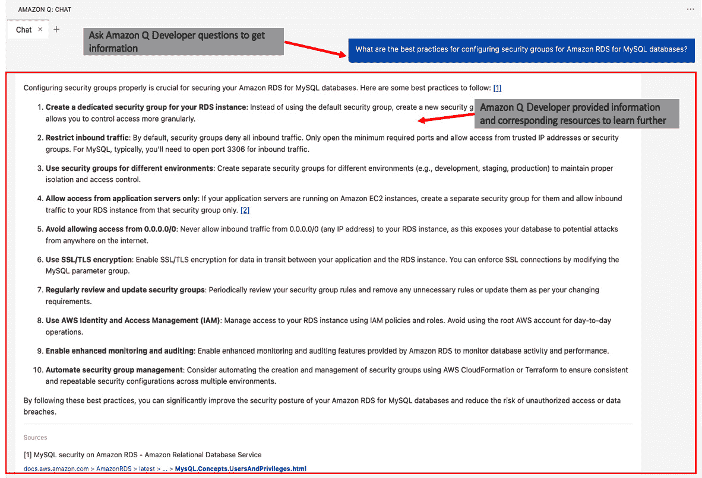

图 7.3 – 聊天风格 – Amazon RDS for MySQL 安全组最佳实践

如前一个屏幕截图所示，Amazon Q 开发者提供了 DBA 可以遵循的 10 个最佳实践，以配置 Amazon RDS for MySQL 的安全组。

## 为 DBA 生成 SQL

现在，让我们询问 Amazon Q 开发者关于 Amazon RDS for MySQL DBA 使用的常见 SQL 命令：

```py
Q: Which are the common SQL commands used by Amazon RDS for MySQL DBA?
```

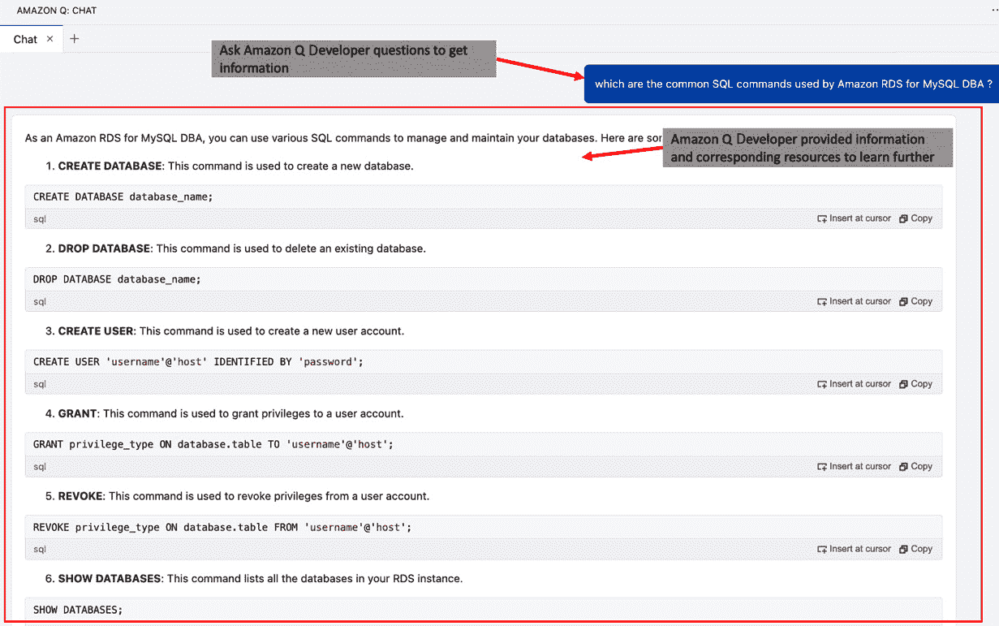

图 7.4 – 聊天风格 – Amazon RDS for MySQL 的常见 SQL 命令

如前截图所示，Amazon Q Developer 的聊天式界面提供了多个常用 SQL 命令及其语法，以便于理解。新 Amazon RDS for MySQL DBA 将意识到，虽然一些传统的 DBA 活动由 Amazon RDS 管理，但创建数据库和模式、简单的表以及具有特定访问权限的数据库用户等活动仍需要 DBA 的关注。

因此，基于之前为 DBA 提供的信息，让我们开始编写 SQL 命令，在 Amazon Q Developer 的帮助下执行常见的 DBA 任务。为了说明，我将使用 VS Code 脚本编辑器窗口的单行和多行提示。

让我们让 Amazon Q Developer 提供一个创建数据库和模式的 SQL 命令：

```py
Prompt :
/* Write a SQL command for Amazon RDS for MySQL to
create database "my_test_db", schema "my_test_db.my_test_schema"
*/
```

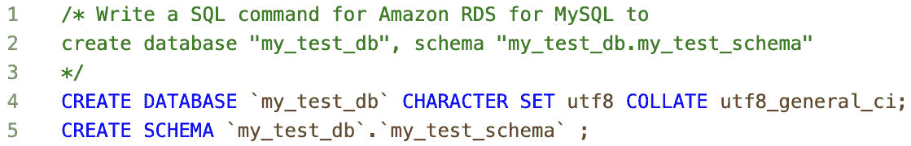

图 7.5 – 为 Amazon RDS for MySQL 创建数据库和模式的提示

注意，Amazon Q Developer 提供了创建数据库和模式所需的完整、无错误的 SQL 代码，按照提示中提供的 MySQL 具体名称。

现在，让我们让 Amazon Q Developer 创建一个简单的表：

```py
Prompt :
/* Write a SQL command for Amazon RDS for MySQL
to create table "my_test_table" in schema "my_test_schema" with columns sr_nbr as integer, name as varchar 50 where sr_nbr is a primary key */
```

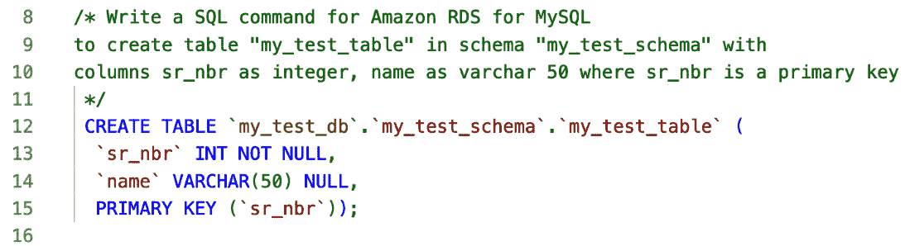

图 7.6 – 为 Amazon RDS for MySQL 创建表的提示

注意，正如提示的那样，Amazon Q Developer 提供了带有主键约束的表 DDL。

现在，让我们让 Amazon Q Developer 创建一个数据库用户，并在前表中授予用户特定的访问权限：

```py
Prompt 1:
/* Write a SQL command for Amazon RDS for MySQL
to create user "my_test_user" */
Prompt 2:
/* Write a SQL command for Amazon RDS for MySQL
to grant select, insert, and update access to user "my_test_user" on
table "my_test_db.my_test_schema.my_test_table"
*/
```

我们得到的 SQL 代码如图*图 7.7*所示。

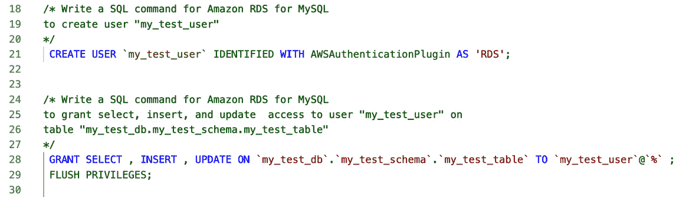

图 7.7 – 为 Amazon RDS for MySQL 创建用户和授予用户访问权限的提示

现在，让我们编写 SQL 语句来移除之前授予的`update`权限：

```py
Prompt :
/* Write a SQL command for Amazon RDS for MySQL
to revoke update access to user "my_test_user" on
table "my_test_db.my_test_schema.my_test_table"
*/
```

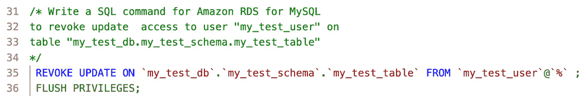

图 7.8 – 为 Amazon RDS for MySQL 撤销访问权限的提示

现在，让我们执行清理任务，删除用户、表、模式和数据库：

```py
Prompt :
/* Write a SQL command for Amazon RDS for MySQL to
drop user "my_test_user"
drop table "my_test_db.my_test_schema.my_test_table"
drop schema "my_test_db.my_test_schema"
drop database "my_test_db"
*/
```

我们得到的 SQL 代码如图*图 7.9*所示。

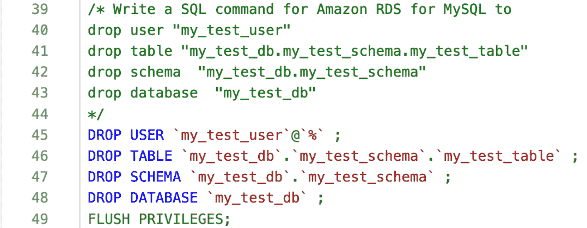

图 7.9 – 为 Amazon RDS for MySQL 撤销对象的提示

如此所示，通过使用 Amazon RDS for MySQL，DBA 可以简单地使用聊天式和/或提示式界面与 Amazon Q Developer 交互，接收无错误的 SQL 代码以执行日常活动。为了进一步探索，请随意使用额外的提示从 Amazon Q Developer 获取与 DBA 活动相关的 SQL 代码。

在下一节中，我们将看看 Amazon Q Developer 如何帮助一个主要负责编写 SQL 代码以理解数据、连接多个表、操作数据以及将数据加载到表中的 DE。

# 使用 Amazon Q Developer 为 DEs 自动生成 SQL 代码

首先，让我们假设一个新 DE 正在计划使用 Amazon RDS for MySQL，并且对 SQL 命令提供没有背景知识。在接下来的几节中，我们将探讨 Amazon Q Developer 如何支持 DE 的常见 **数据操作语言** (**DML**) 支持、语法和基本 SQL 查询。让我们从基本的 DML 支持开始。

## Amazon RDS for MySQL 基础知识对 DE

让我们使用 Amazon Q Developer 的聊天风格界面来教育 DE，他们可以简单地用自然语言提出问题，了解 Amazon RDS for MySQL 可用的命令和函数。由于数据操作是 DE 的关键活动，属于 DML，让我们请 Amazon Q Developer 提供有关 Amazon RDS 对 DML 操作支持的信息：

```py
Q: What are supported SQL DML commands in Amazon RDS for MySQL?
```

如以下截图所示，Amazon Q Developer 提供了常用的可用 SQL 命令，如 **SELECT**、**INSERT**、**UPDATE** 和 **DELETE**。

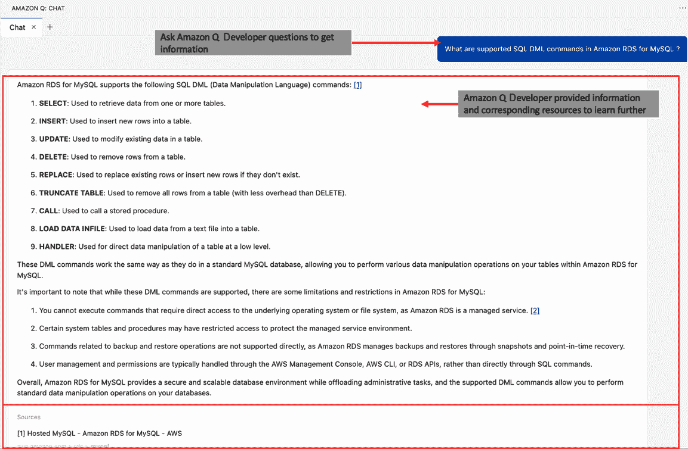

图 7.10 – 聊天风格 – Amazon RDS for MySQL 对 DE 的 DML

## 为 DE 生成 SQL

让我们深入了解并询问 SQL 命令，通过一些常见的 SQL 操作来了解 Amazon Q Developer 如何帮助 DE 学习更多，以及使用不同的提示技术自动生成 SQL 代码。

在我们开始编写 SQL 代码之前，让我们再问一个关于 SQL 语法的问题：

```py
Q: What is syntax of SELECT SQL commands in Amazon RDS for MySQL ?
```

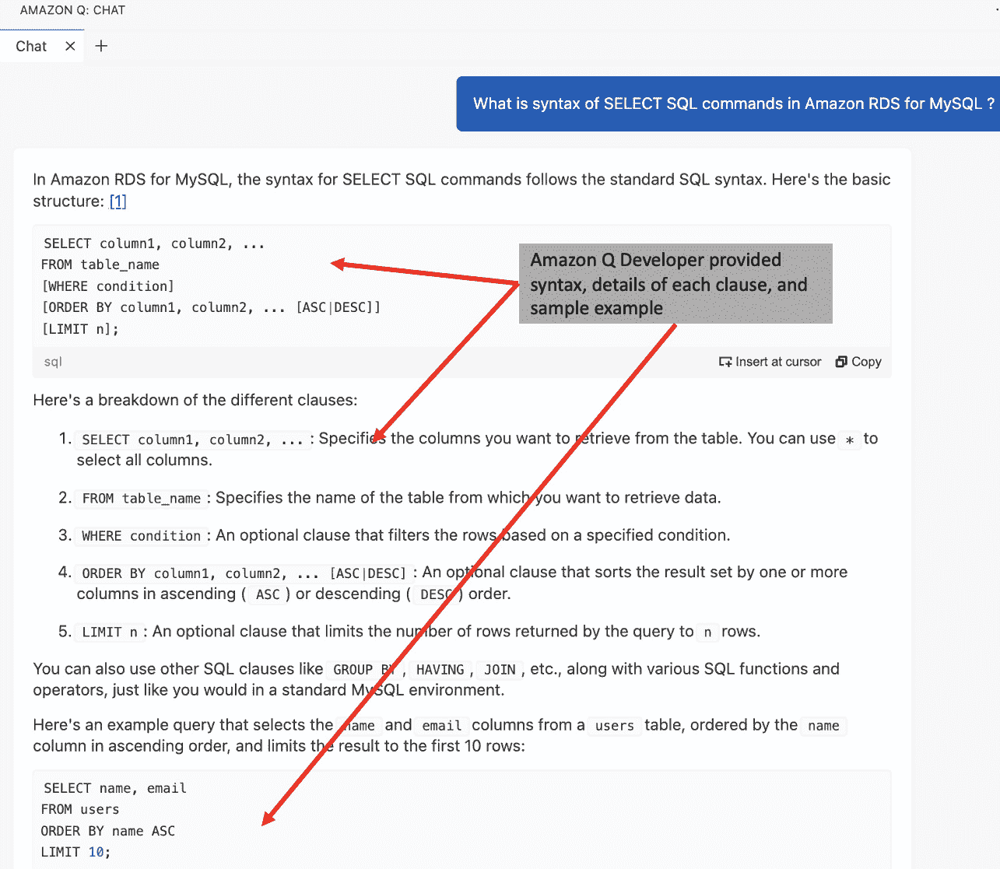

图 7.11 – 聊天风格 – Amazon RDS for MySQL 对 DE 的 SELECT 命令提示

注意 Amazon Q Developer 在末尾提供了详细的子句和示例，以帮助用户理解 `select` 命令的使用。

现在，让我们在 Amazon Q Developer 的帮助下开始编写 SQL 命令，以执行常见的 DE 任务。为了说明，我将使用 VS Code 脚本编辑器窗口的单行和多行提示。

让我们从简单的 `select` 命令开始，假设表已经存在，并且用户有权从中选择：

```py
Prompt :
/* Write a SQL command for Amazon RDS for MySQL to
select sample 10 records from
Table "table_emp" and Table "table_dept"
*/
```

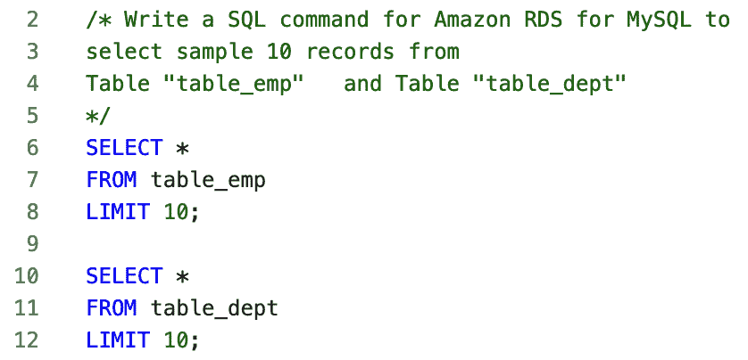

图 7.12 – Amazon RDS for MySQL 对 DE 的 select SQL 命令提示

现在，让我们通过使用 `join` 来将这两个表连接起来，以去规范化数据：

```py
Prompt :
/* Write a SQL command for Amazon RDS for MySQL to join
Table "table_emp" - columns emp_id as integer, emp_name as varchar 50  with Table "table_dept" - columns emp_id as integer, dept_id as int, and dept_name as varchar 50
on emp_id to pull emp_id, emp_name, dept_name
and pull all records from table_emp
*/
```

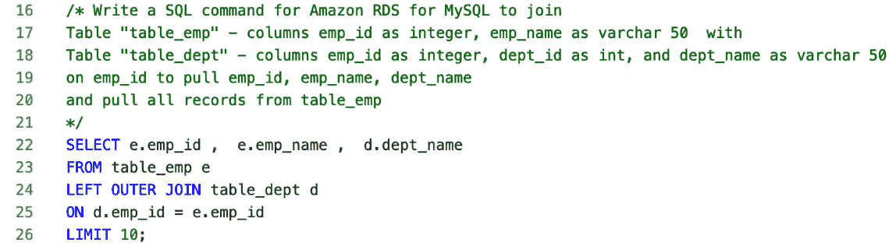

图 7.13 – Amazon RDS for MySQL 对 DE 的 join SQL 命令提示

注意我们提示中的 `pull all records from table_emp` 指令，Amazon Q Developer 正确将其转换为两个表之间的 `LEFT OUTER JOIN`。

现在，让我们使用提示来创建一个“存储过程”，将前面的 join 输出加载到现有的表中：

```py
Prompt :
/* Write a SQL command for Amazon RDS for MySQL to create Store Procedure  to
Join between Table "table_emp" and Table "table_dept"
on emp_id to pull uppercase(emp_id), emp_name, dept_name
and pull all records from table_emp
load data into table "derom_data"
*/
```

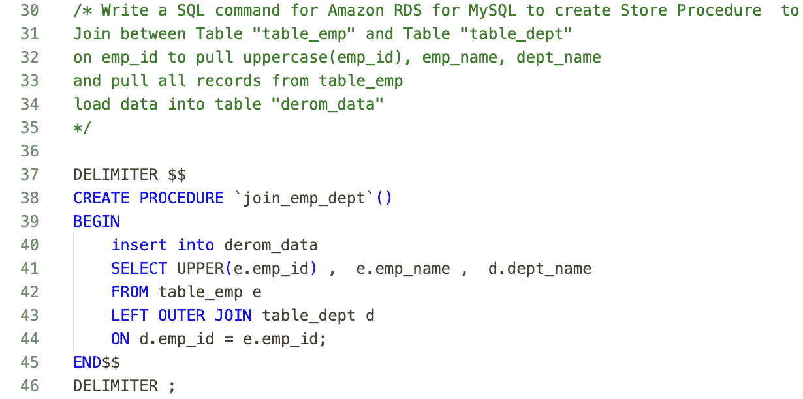

图 7.14 – Amazon RDS for MySQL 对 DE 的 join SQL 命令提示

注意，Amazon Q 开发者根据我们的指示创建了无错误的代码来创建一个“过程”，并且它还添加了适当的函数来处理 `emp_id` 的大写指令。

在前面的例子中，我们只是触及了 Amazon Q 开发者对 SQL 代码开发的集成表面。请随意尝试不同的聊天式提示和交互式编码来进一步探索。

现在，让我们探索 Amazon Q 开发者如何支持 SQL 代码的可解释性和优化。

# 使用 Amazon Q 开发者进行 SQL 代码可解释性和优化

Amazon Q 开发者提供了一个简单的界面来实现代码的可解释性和优化。有关可解释性和优化主题的更多详细信息，请参阅 *第十二章*。

为了说明，我将在存储过程创建任务期间使用之前自动生成的代码。如图下所示，突出显示存储过程中生成的代码部分，右键单击以打开弹出菜单，选择 **Amazon Q**，然后选择 **解释** 以实现代码可解释性或选择 **优化** 以获取优化建议。

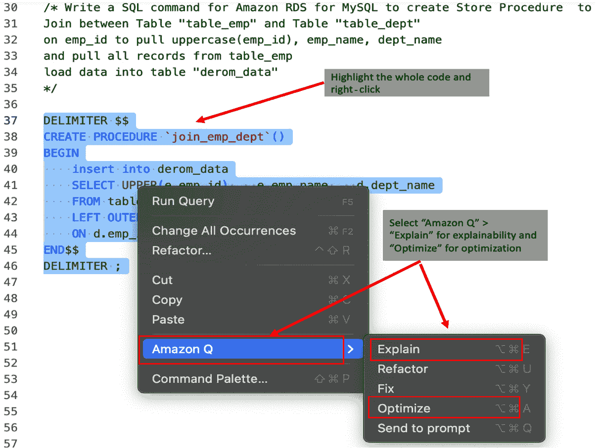

图 7.15 –SQL 代码可解释性和优化

这将弹出 Amazon Q 开发者的聊天式界面，并使用完整的代码进行分析。

对于可解释性，Amazon Q 开发者为几乎每一行代码提供详细信息，并在最后提供一个总结，例如以下内容：“**当调用 join_emp_dept 存储过程时，它将执行 SELECT 语句，根据 emp_id 列在 table_emp 和 table_dept 表之间执行左外连接。包括大写员工 ID、员工姓名和部门名称的结果数据将被插入到** **derom_data 表** **中** **”****。

对于优化，尽管我们有一个相对简单的逻辑的小代码片段，但 Amazon Q 开发者仍然提供了改进代码和重写代码的建议，遵循 `join` 实现的最佳实践，添加到 `insert` 语句中的列列表，添加 `coalesce` 等。

如前所述，Amazon Q 开发者为数据库管理员（DBA）和开发者提供了有意义的输入，为关系数据库（如 Amazon RDS MySQL）自动生成 SQL 代码。此外，Amazon Q 开发者与列式数据库（如 Amazon Redshift）无缝集成。AWS 将完全托管的人工智能数据仓库服务 Amazon Redshift 与代码助手集成，允许用户使用**自然语言处理**（**NLP**）生成完整的 SQL 查询。我们将在 *第十四章*（[B21378_14.xhtml#_idTextAnchor210]）的 *与 Amazon Redshift 的代码辅助集成* 部分探讨此主题。

除了 SQL 之外，Amazon Q Developer 还支持多种其他编程语言。该领域正在进行许多开发，我们预计其中一些将支持额外的语言（请参阅本章末尾的*参考文献*部分）。

# 摘要

Amazon Q Developer 代表了 DBA 和 DE 在 SQL 代码生成和数据库管理方面的突破性创新。通过各种提示技术和聊天式交互，专业人士可以从 Amazon Q Developer 获取 SQL 代码。这一功能有助于自动化常规的 SQL 任务，提高代码一致性，并提供高级优化功能。它使数据库专业人士能够专注于战略举措、创新和交付高质量的数据库驱动应用程序。

将 Amazon Q Developer 与 SQL 集成也促进了协作数据库开发。致力于数据库驱动应用程序的团队可从标准化的 SQL 代码模板、共享的最佳实践和简化的代码审查流程中受益。这种一致性提高了团队的生产力，降低了在数据库架构修改或数据迁移过程中出现错误的风险，并加快了数据库驱动应用程序的上市时间。

此外，Amazon Q Developer 提供了关于 SQL 代码优化的见解，确保高效的查询性能和资源利用。通过不断改进其建议，Amazon Q Developer 适应数据库专业人士不断变化的需求，为复杂的数据库挑战提供尖端解决方案。

因此，Amazon Q Developer 不仅自动化了常规的 SQL 任务，而且促进了数据库团队内的协作和创新，最终导致更高质量和更高效的数据库驱动应用程序。

在本章中，我们只是触及了 Amazon Q Developer 对 DBA 和 DE 的支持。您可以自由探索与创建常见数据库对象相关的其他 SQL 选项，例如视图、物化视图、函数和复杂的 SQL 查询。

在下一章中，我们将介绍 Amazon Q Developer 如何通过使用 shell 脚本来帮助系统管理和自动化。

# 参考文献

在 IDE 中支持 Amazon Q Developer 的语言：[`docs.aws.amazon.com/amazonq/latest/qdeveloper-ug/q-language-ide-support.html`](https://docs.aws.amazon.com/amazonq/latest/qdeveloper-ug/q-language-ide-support.html)
