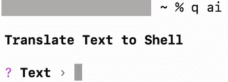
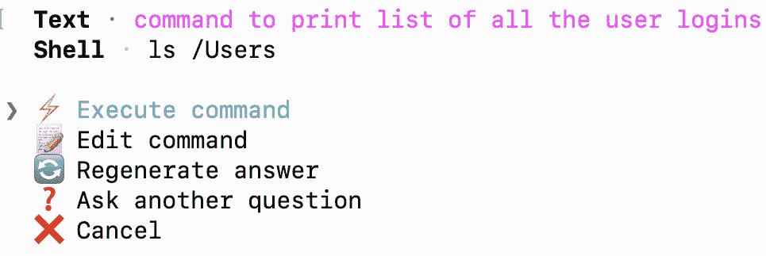
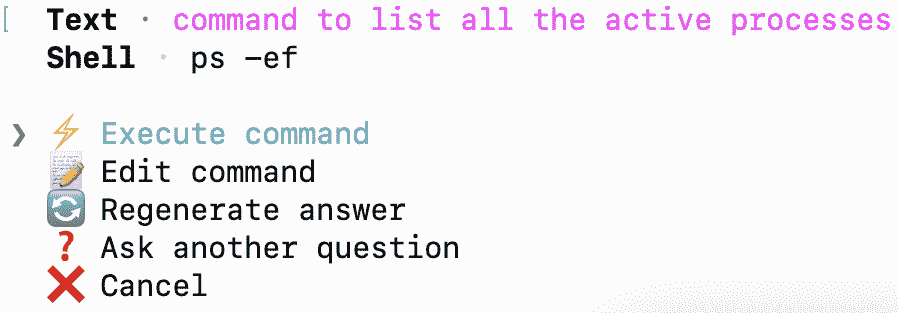
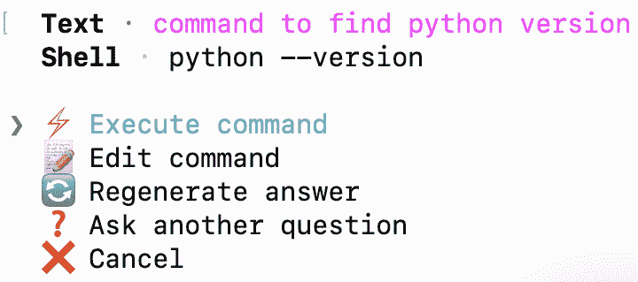
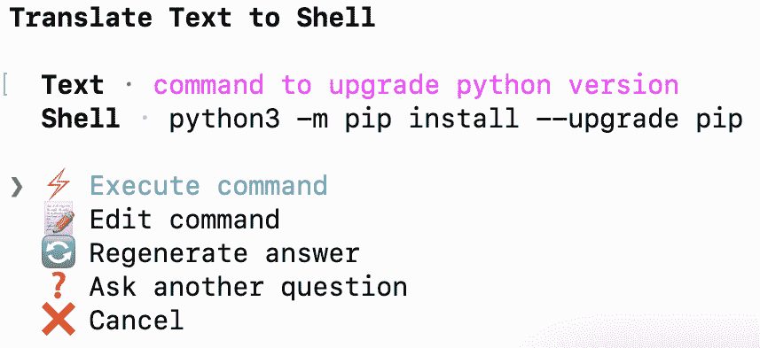
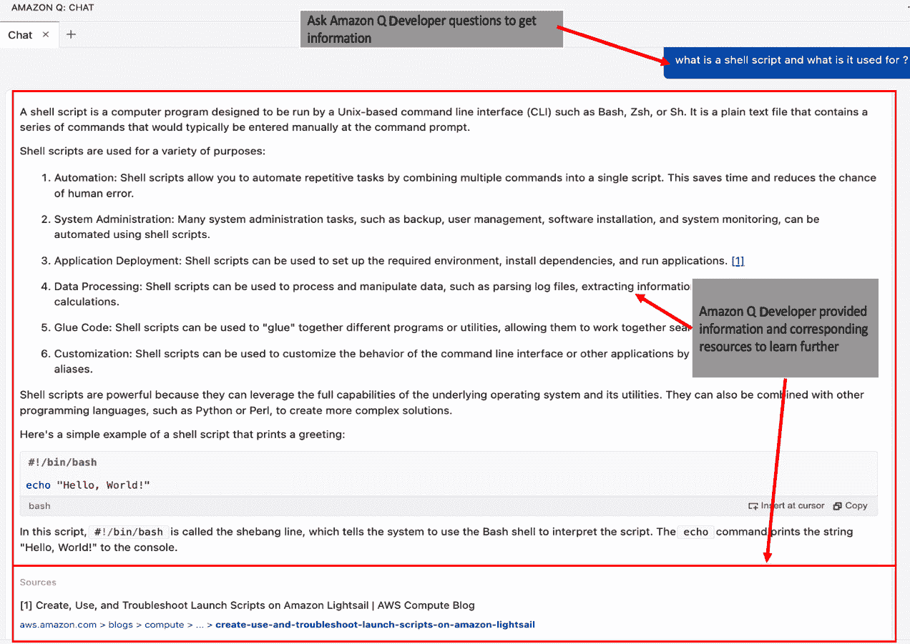
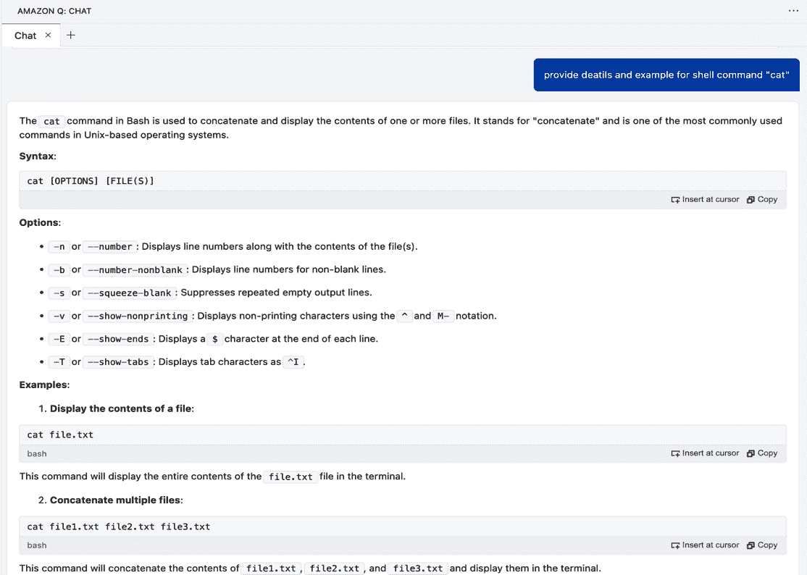
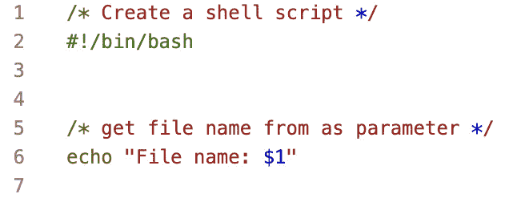
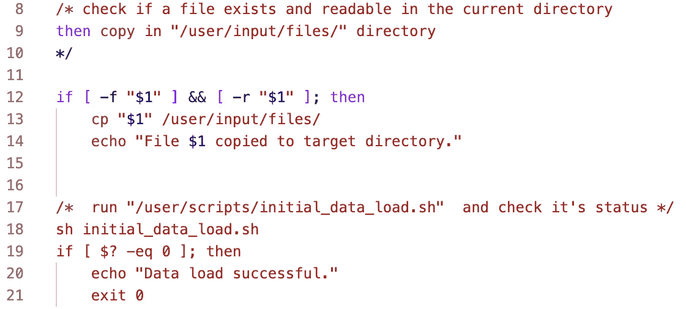
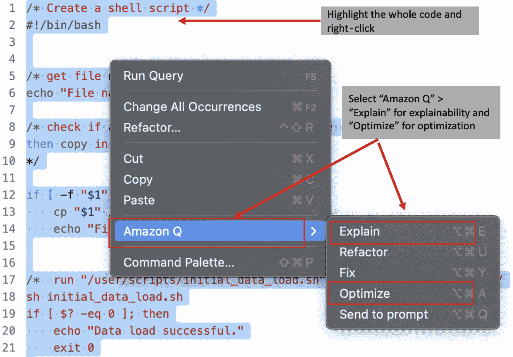

# 通过自动代码生成提高命令行和 Shell 脚本的编码效率

在本章中，我们将探讨以下关键主题：

+   命令行和 Shell 脚本概述

+   使用 Amazon Q Developer 为系统管理员生成命令行自动代码

+   使用 Amazon Q Developer 为程序员生成 Shell 脚本自动代码

+   使用 Amazon Q Developer 解释和优化 Shell 脚本

在上一章中，我们深入探讨了软件行业中占主导地位的数据库管理语言之一：**结构化查询语言**（**SQL**）。通过两个用户角色——**数据库管理员**（**DBA**）和 **数据工程师**（**DE**），我们介绍了通过 Amazon Q Developer 自动生成代码如何帮助理解基础知识、学习语法，并自动生成常见的 DBA 和 DE 活动的代码。

在本章中，我们继续探讨类似主题，重点关注系统管理员和 Shell 脚本程序员。系统管理员主要使用 **命令行界面**（**CLI**）进行各种系统配置任务，而 Shell 脚本程序员使用 **操作系统**（**OS**）命令来自动化重复性任务，如开发过程、文件传输和预处理任务。我们将介绍 Amazon Q Developer 如何帮助这些专业人士理解基础知识、学习语法，并自动生成常见的系统管理和 Shell 脚本编程活动的代码。然后，我们将探讨代码可解释性，以支持 Amazon Q Developer 为 Shell 脚本提供的文档和代码优化建议。

# 命令行和 Shell 脚本概述

操作系统代码在管理和维护 IT 基础设施稳定性、安全性和效率方面发挥着关键作用。Shell 脚本和命令行是自动化常规任务、执行系统命令以及在基于 Unix 的操作系统（如 Linux 和 macOS）上编排复杂工作流程的基本工具。随着组织努力优化运营流程和增强可扩展性，对高效 Shell 脚本和命令行解决方案的需求日益增加。

自动代码生成已成为通过 IDE 和/或命令行简化 Shell 脚本开发、减少人工努力并提高系统管理员、程序员和工程师生产力的变革性方法。

命令行和 shell 脚本使系统管理员、程序员和工程师能够自动化重复性任务，如文件管理、系统监控、用户管理和备份操作。它还便于将多个命令串联起来执行系统命令和复杂的工作流程，确保 IT 操作的一致性和可靠性。然而，编写和维护复杂的串联命令和 shell 脚本可能耗时，容易出错，并且需要专业知识，尤其是当脚本变得更加复杂且对业务运营至关重要时。系统管理员、程序员和工程师可以利用不同的提示技术以及聊天式集成（参考*第三章*）来获取针对特定系统任务的定制化 shell 脚本自动创建的建议。这种交互模型加速了脚本开发周期，减少了人为错误，并确保了在不同操作系统环境中脚本结构和执行的统一性。

此外，Amazon Q 开发者作为学习 shell 脚本技术、可用命令行语法和最佳实践的教育资源。它通过其聊天界面提供交互式教程、shell 脚本概念的说明以及自动化脚本的实用示例。这一教育特性有助于系统管理员、程序员和工程师提升他们的脚本编写技能，采用行业标准实践，并有效地利用高级自动化功能。

对于经验丰富的用户，Amazon Q 开发者提供了高级功能，如脚本优化和错误处理建议。它分析生成的 shell 脚本，识别潜在的低效或陷阱，并提供提高脚本性能和可靠性的建议。这些优化能力对于在动态 IT 环境中保持操作效率和可扩展性至关重要。Amazon Q 开发者与 shell 脚本的集成还促进了协作实践。致力于系统自动化项目的团队从标准化的 shell 脚本模板、共享的自动化工作流程和简化的代码审查流程中受益。这种一致性提高了团队的生产力，促进了开发和运维团队之间的协作，并加快了关键 IT 基础设施变更的部署时间。

在下一节中，我们将探讨 Amazon Q 开发者如何通过 Unix CLI 和 shell 脚本生成操作系统代码。为了说明，我将使用整体思维链提示技术来模拟一系列活动，将它们分解为单行和多行提示（有关更多详细信息，请参阅*第三章*）。对于平台，我将使用带有 VS Code 的 Amazon Q 开发者界面和 macOS 终端 CLI。有关将 Amazon Q 开发者与 VS Code 和 CLI 集成的配置步骤，请参阅*第二章*，并在章节末尾的*参考文献*部分查看*终端 shell 集成*和*为命令行安装 Amazon Q*的 URL。

注意

Amazon Q 开发者使用**大型语言模型**（**LLMs**），其本质是非确定性的，因此您可能不会得到代码快照中显示的完全相同的答案/代码块；尝试更新提示以获取所需的建议。然而，从逻辑上讲，生成的答案/代码应满足要求。

# 使用 Amazon Q 开发者为系统管理员自动生成命令行代码

我将扮演一个熟悉磁盘空间管理、用户管理、进程管理和库管理等职责的系统管理员角色，但需要帮助编写具有正确语法的命令。使用 macOS，我将演示 Amazon Q 开发者如何与 CLI 交互。这个示例展示了 Amazon Q 开发者如何简化并自动化复杂任务，即使对于那些具有有限命令行经验的人来说也是如此。

通过遵循这些步骤，您将能够利用 Amazon Q 开发者的强大功能来简化您的命令行任务，并作为系统管理员提高您的整体生产力。

要开始与 Amazon Q 开发者的交互，请打开终端并输入 `q ai`：



图 8.1 – CLI – Amazon Q 开发者基础

一旦集成窗口打开，让我们要求 Amazon Q 开发者提供以下部分中系统管理员常见任务的命令。这些任务包括磁盘空间管理、用户管理、库管理、进程管理、网络配置和系统监控等多个领域。通过利用 Amazon Q 开发者，系统管理员可以收到针对广泛任务的详细、分步命令，确保高效和准确的执行。Amazon Q 开发者的 CLI 允许用户执行命令而无需在终端提示符中明确输入。

## 磁盘空间管理 CLI 自动代码生成

磁盘空间管理是系统管理员的关键职责之一。有效的空间管理有助于维护系统稳定性、性能和安全，因此对于系统管理员来说是一项至关重要的任务。让我们从一些与磁盘空间管理相关的任务开始。让我们使用思维链来模拟常见任务，并将它们分解成简单的单行提示。

让我们从查找可用的磁盘空间开始：

```py
Prompt: command to find out the disk space available
```


图 8.2 – CLI – Amazon Q Developer 可用磁盘空间

现在，让我们确定已使用的磁盘空间，并根据磁盘占用的空间量从高到低排序结果：

```py
Prompt: command to find out the disk space utilized sort by high to low
```


图 8.3 – CLI – Amazon Q Developer 磁盘使用情况

现在，让我们查找文件的大小，并按大小从高到低排序，以便系统管理员可以确定哪些文件对磁盘空间利用率贡献最大：

```py
Prompt: command to find out the largest file on the disk
```


图 8.4 – CLI – Amazon Q Developer 大文件

观察前一个屏幕截图，可以看到 Amazon Q Developer 通过链式多个命令提供了一个单一命令，以实现提示中的指令。

现在，让我们通过让 Amazon Q Developer 查找最大的 10 个文件并将它们存档来释放一些空间。这可能涉及一个稍微复杂的过程：

```py
Prompt: command to find out top 10 largest file on the disk and archive them
```


图 8.5 – CLI – Amazon Q Developer 存档文件

正如您在前面的屏幕截图中看到的，Amazon Q Developer 通过链式多个命令提供了一个单一命令，以实现提示中的指令。它还使用了我们指定的文件数量，并将这些文件作为`tar.gz`存档。

现在，让我们看看用户管理，这是系统管理员另一个非常重要的责任领域。

## 系统管理员用户管理 CLI 自动代码生成

系统管理员用户管理涉及在计算机系统或网络上创建、配置、维护和保障用户账户的任务。有效的用户管理对于维护系统安全、确保数据完整性和支持组织内高效运作至关重要。让我们使用思维链来模拟常见任务，并将它们分解成简单的单行提示。

让我们从基本的用户管理任务开始，例如识别所有有权访问系统的用户列表：

```py
Prompt: command to print list of all the user logins
```



图 8.6 – CLI – Amazon Q Developer 用户列表

现在，让我们识别系统上的活跃用户并确定他们最后一次登录的时间：

```py
Prompt: command to print user list with last login date and time
```


图 8.7 – CLI – Amazon Q Developer 用户最后登录

现在，让我们识别系统上最近未登录的休眠用户：

```py
Prompt: command to print user name those do not have last log-in date
```


图 8.8 – CLI – Amazon Q Developer 用户从未登录

为了增强安全性和减少漏洞，让我们从系统中删除没有最近登录日期的休眠用户。这个过程可能有些复杂，所以让我们看看 Amazon Q Developer 如何帮助：

```py
Prompt: command to drop user those do not have login date
```


图 8.9 – CLI – Amazon Q Developer 删除从未登录的用户

在前面的截图观察中，可以看到随着需求复杂性的增加，Amazon Q Developer 会链式执行多个命令以实现提示中的指令。

现在，让我们看看一些与进程管理相关的任务以及 Amazon Q Developer 的相应支持。

## 进程管理 CLI 自动代码生成

进程管理是系统管理员的一项关键职责，包括监控、控制和优化计算机系统上运行的进程，以确保资源利用率和性能的效率。维护服务器的健康是系统管理员的重要职责之一。

让我们从要求 Amazon Q Developer 生成查找所有活跃进程的命令开始：

```py
Prompt: command to list all the active processes
```



图 8.10 – CLI – Amazon Q Developer 活跃进程

在进程管理中，CPU 在系统中有效执行多个进程方面起着至关重要的作用，因此让我们找出前 10 个 CPU 密集型进程：

```py
Prompt: command to list top 10 CPU intense processes
```


图 8.11 – CLI – Amazon Q Developer 顶级 CPU 进程

与 CPU 类似，内存在整个系统中的多进程有效执行中起着至关重要的作用，因此让我们确定前 10 个内存密集型进程：

```py
Prompt: command to list top 10 memory intense processes
```


图 8.12 – CLI – Amazon Q Developer 顶级内存进程

系统管理员通常需要终止消耗大量内存或 CPU 资源的进程。为了模拟这种情况，让我们使用 Amazon Q Developer 创建一个命令来杀死消耗最多内存的前两个进程：

```py
Prompt: command to list kill top two memory intense processes
```


图 8.13 – CLI – Amazon Q Developer 杀死顶级内存进程

如前一个截图所示，Amazon Q Developer 高效地生成了精确的命令，通过终止两个内存密集型进程来释放内存。这涉及一个稍微复杂的命令，其中多个命令被端到端地链接在一起。

现在，让我们看看与库管理相关的一个最后区域，这包括安装新库和升级现有库。

## 库管理 CLI 自动代码生成

与其他部分相比，图书馆管理中的活动相对较少，但这些任务对于确保所有应用程序在服务器上平稳运行至关重要。适当的图书馆管理，包括安装新库和升级现有库，对于维护应用程序的功能和性能至关重要。这些任务虽然不那么频繁，但在防止软件冲突、增强安全性和确保应用程序能够访问最新功能和优化方面发挥着重要作用。因此，尽管图书馆管理活动可能看起来不多，但它们对服务器环境整体健康和效率的影响是显著的。

让我们从基础开始，获取所有库的列表并将它们保存到文件中：

```py
Prompt: command to list all the installed libraries and their version and save them in a file
```


图 8.14 – CLI – Amazon Q 开发者所有库列表

系统管理员验证已安装库的版本是标准做法。例如，让我们利用 Python 并请求 Amazon Q 开发者生成识别相关版本的命令：

```py
Prompt: command to find python version
```



图 8.15 – CLI – Amazon Q 开发者查找版本

同样，系统管理员通常需要升级已安装的库。例如，让我们使用 Python 并让 Amazon Q 开发者生成升级 Python 版本的命令：

```py
Prompt: command to upgrade python version
```



图 8.16 – CLI – Amazon Q 开发者升级版本

我已经展示了系统管理员常用的几个常用 CLI 命令，展示了 Amazon Q 开发者提供从单个命令到链式多个命令以实现要求的命令的能力。此外，尝试使用 Amazon Q 开发者为其他可能从生成 CLI 命令中受益的用户角色。

在下一节中，我们将探讨 Amazon Q 开发者如何帮助程序员编写 shell 脚本。

# 使用 Amazon Q 开发者为程序员生成 Shell 脚本自动代码

沿着前几章的主题，我将从一个希望学习和开发使用 shell 脚本的程序员或工程师的角色开始。

## Shell 脚本基础

让我们使用 Amazon Q 开发者的聊天风格界面来教育程序员，他们可以简单地用自然语言提问来了解可用的命令和功能。我将使用聊天风格交互和单行和多行提示技术：

```py
Q : what is a shell script and what is it used for ?
```



图 8.17 – Shell 脚本 – 基础

如前一个屏幕截图所示，对于学习者，Amazon Q Developer 指出了 Shell 脚本有效的关键区域，例如自动化、系统管理、应用部署等。它还提供了一个带有`bash` shell 声明的`"Hello, World !"` Shell 脚本示例。此外，它还提供了可用于获取更多信息的数据源。

现在，让我们获取更多信息，并询问常用的 Shell 脚本命令及其对应的语法示例：

```py
Q : what are the  available bash shell script commands ?
```


图 8.18 – Shell – 命令列表，部分截图

如前一个部分截图所示，Amazon Q Developer 提供了一个 Shell 脚本命令目录，这些命令被分类为文件和目录命令、文本处理命令、系统信息命令、进程管理命令、网络命令以及用户和权限命令。此外，Bash 支持控制结构、函数和其他特性，使其成为自动化 Unix-like 操作系统任务和系统管理的强大脚本语言。

现在让我们请求 Amazon Q Developer 提供`"``cat"`命令的语法和示例：

```py
Q : provide details and example for shell command "cat"
```



图 8.19 – Shell – “cat”命令

如前一个屏幕截图所示，Amazon Q Developer 提供了命令的基本用法。然后，它提供了语法`cat [OPTIONS] [FILE(S)]`以及不同的选项，如`-n`、`-b`、`-s`、`-v`、`-E`和`-T`，并提供了示例。

## 程序员用 Shell 脚本生成

现在我们已经了解了 Shell 脚本的基础知识，让我们使用前面的信息来处理一个用例。

这里是使用案例：创建一个接受文件名作为参数的 Shell 脚本。检查文件是否存在且可读。如果是，则在`/user/input/files`目录中复制该文件并启动`initial_data_load.sh`脚本。然后，检查进程是否成功完成。

让我们使用思维链提示技术将这个用例分解成更小的任务，当它们组合在一起时，将实现端到端场景：

1.  创建一个接受文件名作为参数的 Shell 脚本。

1.  检查文件是否存在且可读，然后在`/``user/input/files`目录中复制该文件。

1.  假设程序员已经创建了一个名为`initial_data_load.sh`的脚本。让我们开始执行`initial_data_load.sh`脚本并检查其是否成功完成。

为了说明，我将使用 VS Code 脚本编辑器窗口的单行和多行提示。

### 需求 1

这就是我们如何处理第一个要求并创建一个接受文件名作为参数的 Shell 脚本：

```py
Prompt 1 :
/* Create a shell script */
Prompt 2 :
/* get file name from as parameter */
```



图 8.20 – Shell – 输入参数

注意到 Amazon Q Developer 初始化了 Shell 并接受了一个参数。现在，让我们处理下一个需求。

### 要求 2 和 3

检查文件是否可用且可读，然后将文件复制到`/user/input/files`目录。然后我们将启动`initial_data_load.sh`脚本并检查其成功完成：

```py
Prompt 1 :
/* check if a file exists and readable in the current directory then copy in "/user/input/files/" directory */
Prompt 2 :
/* run "/user/scripts/initial_data_load.sh"  and check it's status  */
```



图 8.21 – Shell – 复制文件并运行脚本

如上图所示，您可以使用多个单行提示符，在 Amazon Q Developer 的帮助下自动生成代码。由于这是一个相对简单的用例，您可以自由尝试单行和多行提示技术，以观察 Amazon Q Developer 生成的最终代码。

# 使用 Amazon Q Developer 进行 shell 脚本的可解释性和优化

Amazon Q Developer 提供了一个简单的界面来实现代码的可解释性和优化。有关可解释性和优化的更多详细信息，请参阅*第十二章*。

为了说明，我将在创建 shell 脚本任务期间使用之前自动生成的代码。如图所示，突出显示代码，右键单击以打开弹出菜单，选择**Amazon Q**，然后选择**解释**以进行代码可解释性或**优化**以获取优化建议：



图 8.22 – Shell – Amazon Q 可解释性和优化

这将弹出 Amazon Q Developer 的聊天式界面，并将整个代码移动到分析位置。

为了可解释性，Amazon Q Developer 为每一行代码提供了详细信息，并在最后提供了一个总结：“**总的来说，这个 shell 脚本接受一个文件名作为参数，检查该文件是否存在于当前目录中并且可读，将文件复制到指定位置(/user/input/files/)，运行另一个脚本(initial_data_load.sh)，并根据第二个脚本的退出状态打印成功或失败信息**”。

由于我们使用多个单行提示符构建了这个脚本，为了优化，Amazon Q Developer 彻底分析了整个脚本。它提供了几个优化和增强脚本可读性、可维护性和错误处理的建议。这些改进没有改变其核心功能。建议涵盖了变量赋值、条件优化、错误处理、路径赋值、命令替换、错误重定向、退出状态和代码格式化。此外，Amazon Q Developer 生成了一个包含这些最佳实践的更新后的端到端 shell 脚本，您可以通过点击**插入到****光标**按钮直接添加。

除了命令行和 shell 脚本之外，Amazon Q Developer 还支持多种其他编程语言。在这个领域有许多增强功能正在发生，我们预计将会有更多的增强来支持额外的语言（请参阅本章末尾的*参考文献*部分）。

# 摘要

如上图所示，Amazon Q 开发者作为系统管理员、程序员和工程师的有价值助手。Amazon Q 开发者可以与 CLI 结合使用，仅通过简单的提示就能生成复杂的命令。输出命令可以是简单的单个命令，也可以是命令链的组合，以实现诸如磁盘空间管理、用户管理、进程管理、库管理等多样的管理任务。

Shell 脚本程序员和工程师可以使用思维链提示、单行提示和多行提示技术来自动生成端到端无错误的脚本。此外，他们还可以使用**解释**和**优化**选项来轻松获取代码细节和定制代码建议。使用这些选项鼓励遵循 shell 脚本最佳实践和命令行语法，促进代码质量和标准化。该工具还验证脚本语法和命令行选项，并推荐安全的脚本实践以减轻潜在的安全漏洞。这确保了系统管理员和 DevOps 工程师生成的 shell 脚本和命令行集成既稳健又安全，符合组织标准和监管要求。

在下一章中，我们将探讨如何使用 Amazon Q 开发者工具在命令行和 shell 脚本中建议代码。

# 参考资料

+   安装 Amazon Q 命令行版本：[`docs.aws.amazon.com/amazonq/latest/qdeveloper-ug/command-line-getting-started-installing.html`](https://docs.aws.amazon.com/amazonq/latest/qdeveloper-ug/command-line-getting-started-installing.html)

+   终端 shell 集成：[`code.visualstudio.com/docs/terminal/shell-integration`](https://code.visualstudio.com/docs/terminal/shell-integration)

+   Amazon Q 开发者在 IDE 中支持的语言：[`docs.aws.amazon.com/amazonq/latest/qdeveloper-ug/q-language-ide-support.html`](https://docs.aws.amazon.com/amazonq/latest/qdeveloper-ug/q-language-ide-support.html)
