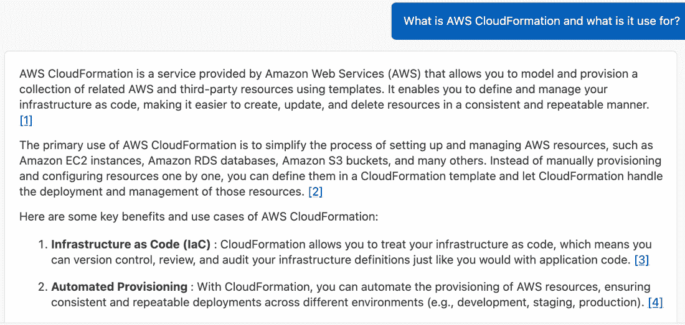
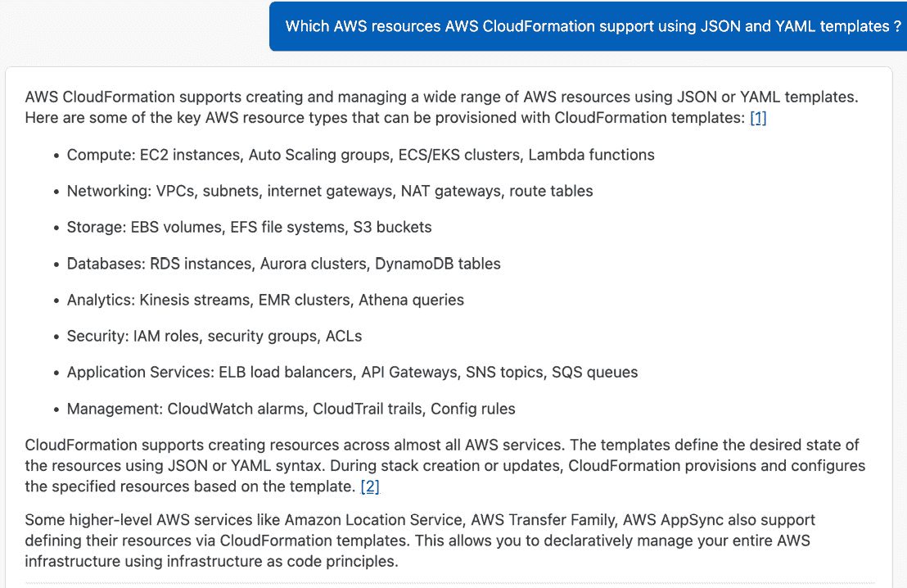
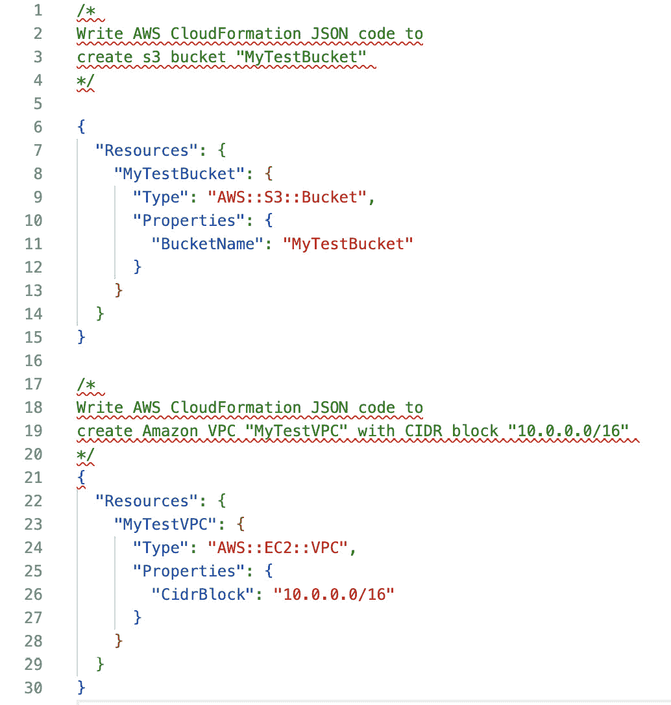
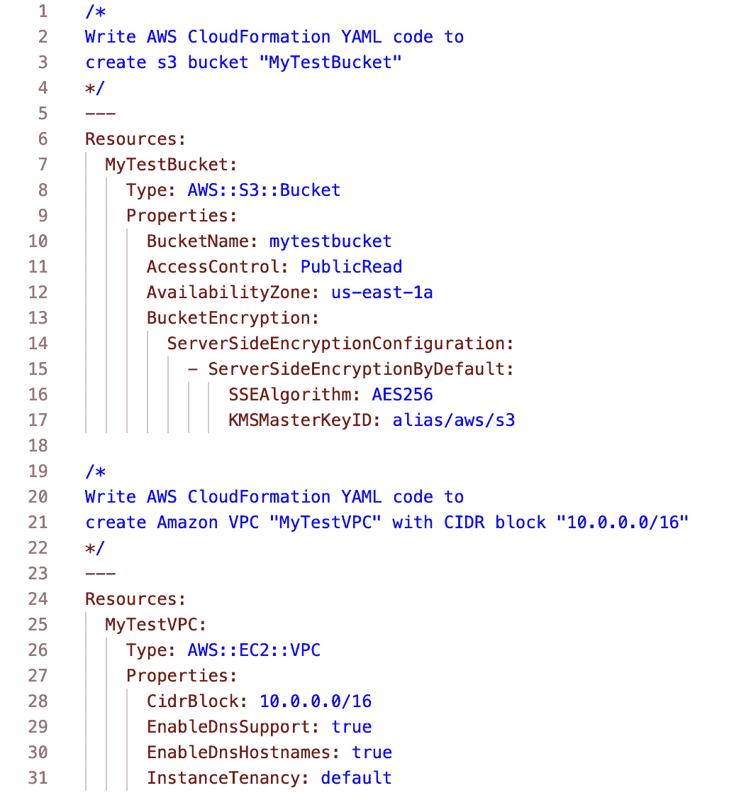
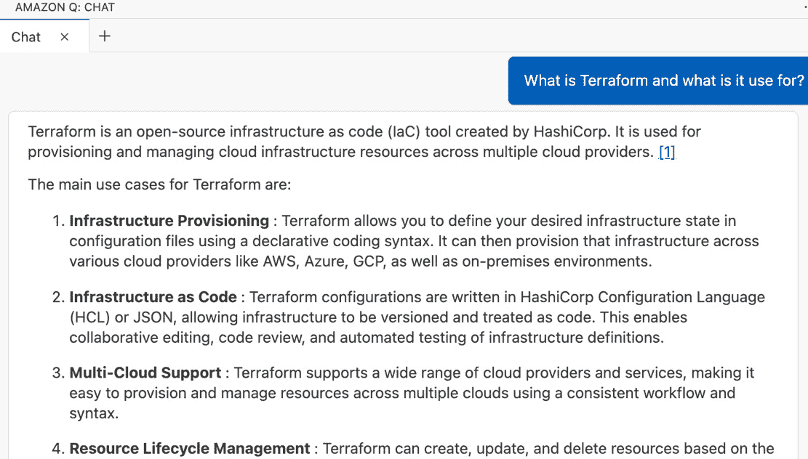
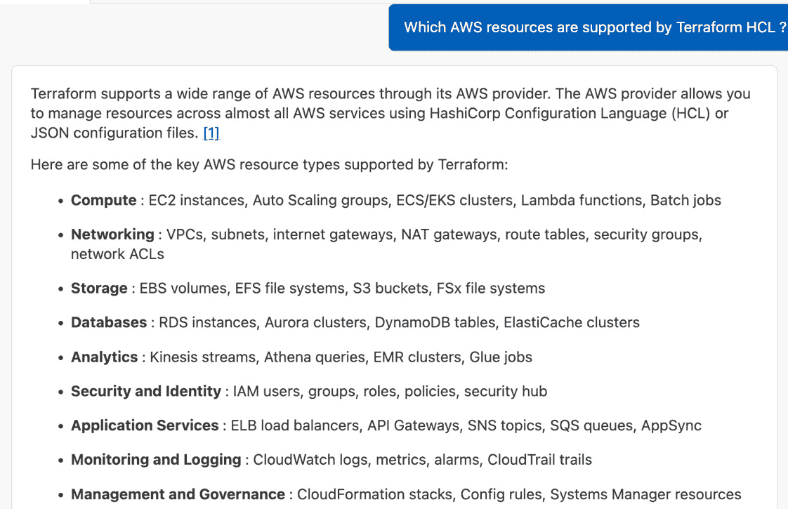
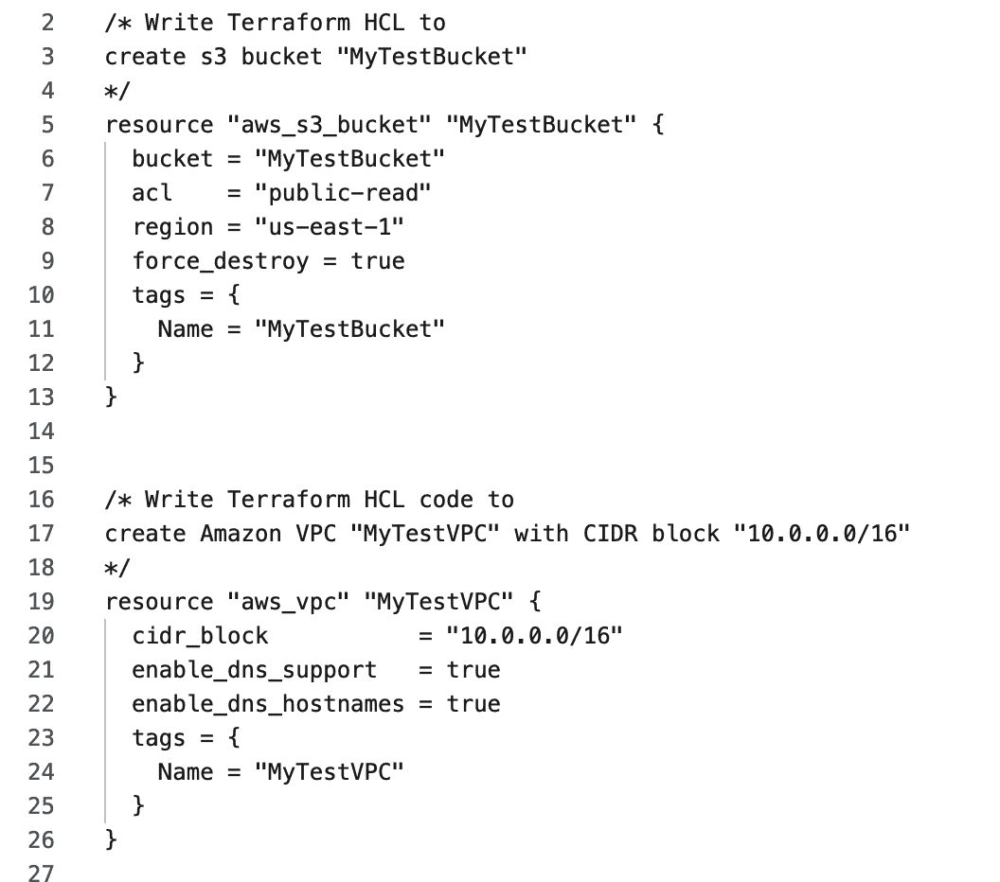
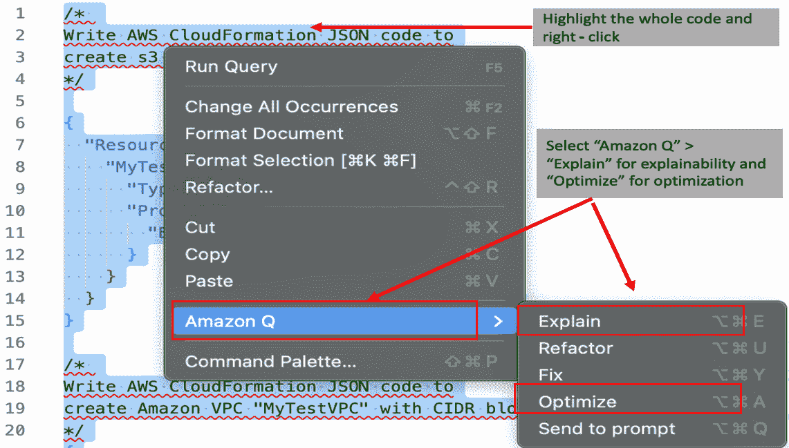

# 第九章：通过自动代码生成提高 JSON、YAML 和 HCL 的编码效率

在本章中，我们将探讨以下关键主题：

+   **基础设施即代码**（IaC）语言的概述

+   使用 Amazon Q Developer 为 AWS CloudFormation 自动生成 JSON 和 YAML 代码

+   使用 Amazon Q Developer 为 Terraform 自动生成 HCL 代码

+   使用 Amazon Q Developer 进行 JSON、YAML 和 HCL 代码的可解释性和优化

在上一章中，我们通过两个用户角色：系统管理员和 shell 脚本程序员，探讨了命令行界面（CLI）和 shell 脚本。我们介绍了如何通过 Amazon Q Developer 的自动代码生成功能协助这些专业人士。使用 Amazon Q Developer CLI，我们演示了如何完成各种管理任务，如磁盘空间管理、用户管理、进程管理、库管理等等。此外，我们还利用思维链提示、单行提示和多行提示技术生成了一个端到端的 shell 脚本。

在本章中，我们将探讨与 IaC 相关的不同编程语言类别。在 IaC 中，编程语言与使用的工具或服务紧密耦合。首先，我们将关注 JSON 和 YAML，它们由 AWS CloudFormation 服务使用。然后，我们将探索 HCL，它由 Terraform 使用。我们将介绍如何通过 Amazon Q Developer 的自动代码生成功能帮助理解基础知识、学习语法以及使用 JSON、YAML 和 HCL 自动生成代码。然后，我们将探讨代码可解释性，以支持 Amazon Q Developer 为 IaC 程序员提供的文档和代码优化建议。

# IaC 语言的概述

在当今的云计算领域，基础设施即代码（IaC）已成为管理和提供基础设施的基本范式转变。AWS CloudFormation 和 Terraform 是两款领先的 IaC 工具，它们使开发人员和系统管理员能够以编程方式定义和管理云资源，将基础设施视为软件。

AWS CloudFormation 通过声明性 JSON 或 YAML 模板简化了 AWS 资源的提供和管理。这些模板定义了 AWS 服务的配置和相互依赖关系，使用户能够可预测和可重复地提供多个资源。CloudFormation 自动创建、更新和删除基础设施堆栈，确保一致性并降低资源提供中手动错误的几率。

Terraform，由 HashiCorp 开发，采用更广泛的方法，支持多个云服务提供商（包括 AWS、Azure 和 Google Cloud Platform）以及本地基础设施。它使用一种名为**HashiCorp 配置语言**（**HCL**）的声明性语言来定义基础设施代码。Terraform 的状态管理功能允许它在最小停机时间内规划和执行对基础设施的更改，并管理不同提供商之间资源的复杂依赖关系。

AWS CloudFormation 和 Terraform 在帮助组织实现 IaC（基础设施即代码）原则方面发挥着关键作用，包括版本控制、自动化和可扩展性。它们促进了协作开发实践，与 CI/CD 管道集成，并允许将基础设施配置作为代码存储库进行管理。IaC 开发人员可以利用 Amazon Q Developer 的各种提示技术和聊天式集成，在几个关键领域增强 AWS CloudFormation 和 Terraform 的功能。Amazon Q Developer 根据特定的基础设施需求自动生成 AWS CloudFormation 模板和 Terraform 配置。通过自然语言处理和聊天式交互，开发人员可以指定基础设施需求，并接收符合最佳实践和架构指南的生成代码。除了基本的模板生成之外，Amazon Q Developer 还提供优化建议，并强制执行 AWS CloudFormation 和 Terraform 配置的最佳实践。它分析生成的代码，识别潜在的性能瓶颈或安全漏洞，并提供优化基础设施部署的建议。

此外，Amazon Q Developer 作为学习 IaC（基础设施即代码）原则和掌握 AWS CloudFormation 和 Terraform 的教育资源。它通过直观的界面提供交互式教程、IaC 概念的说明和实际示例。这一教育方面有助于开发人员和系统管理员提高他们在高效和安全地管理云资源方面的熟练程度。此外，通过将 Amazon Q Developer 与 AWS CloudFormation 和 Terraform 集成，团队可以受益于标准化的模板、共享的基础设施配置和简化的代码审查流程。这种集成增强了开发、运维和安全团队之间的协作，确保基础设施更改的一致性和安全性。随着云环境的发展，Amazon Q Developer 持续更新其推荐和功能，以与 AWS CloudFormation 和 Terraform 的最新最佳实践和架构模式保持一致。这确保了组织可以利用最尖端的设施管理技术，并在云部署中保持运营卓越。

让我们深入探讨，看看 Amazon Q Developer 如何帮助一位 IaC 开发者。为了说明，我将使用带有 VS Code 的 Amazon Q Developer 界面（有关 Amazon Q Developer 与 VS Code 配置的步骤，请参阅*第二章*）。此外，有关 Visual Studio Code 的 Terraform 扩展的信息，请参阅本章末尾的“参考文献”部分。

注意

Amazon Q Developer 使用 LLMs，其本质是非确定性的，因此您可能不会得到与代码快照中显示的完全相同的答案/代码块；尝试更新提示以获取所需的建议。然而，从逻辑上讲，生成的答案/代码应满足要求。

# 使用 Amazon Q Developer 为 AWS CloudFormation 自动生成 JSON 和 YAML 代码

与上一章类似，让我们假设一位新的 IaC 开发者计划使用 JSON 和 YAML 编码在 AWS 云上使用 AWS CloudFormation 构建基础设施，但缺乏对该服务的背景知识。我们将使用 Amazon Q Developer 的聊天式界面来教育 IaC 开发者。他们可以简单地用自然语言提问，以了解 AWS CloudFormation 及其对 JSON 和 YAML 的支持。

## AWS CloudFormation 基础

让我们首先了解 AWS CloudFormation：

```py
Q: What is AWS CloudFormation and what is it use for?
```



图 9.1 – 提示 – IaC AWS CloudFormation 基础

Amazon Q Developer 提供了 AWS CloudFormation 服务的概述：“**AWS CloudFormation 是由 Amazon Web Services (AWS) 提供的一项服务，允许您使用模板来建模和部署一组相关的 AWS 和第三方资源。它使您能够以代码的形式定义和管理您的基础设施，从而更容易以一致和可重复的方式创建、更新和删除资源**。”

此外，Amazon Q Developer 列出了一些可以使用 AWS CloudFormation 部署的 AWS 资源。然后，它提供了 AWS CloudFormation 的关键特性，包括基础设施即代码 (IaC)、自动化部署、资源编排、可重用性和模块化、变更管理、回滚和删除。此外，它还强调了使用 JSON 和 YAML 模板作为常见的编程机制。

因此，现在，让我们让 Amazon Q Developer 提供更多关于 AWS CloudFormation 支持的 AWS 资源的信息，使用 JSON 和 YAML 模板：

```py
Q: Which AWS resources AWS CloudFormation support using JSON and YAML templates?
```



图 9.2 – 提示 – IaC AWS CloudFormation AWS 资源

如前一个屏幕截图所示，Amazon Q Developer 提供了一个格式良好的答案，其中包含与计算、网络、存储、数据库、分析、安全、应用服务和管理等资源类别相关的规格，以及 AWS CloudFormation 支持的每个类别的示例资源（使用 JSON 和 YAML）。

## JSON 自动代码生成

根据前面的信息，一个 IaC（基础设施即代码）开发者现在理解了 AWS CloudFormation 在 JSON 中配置资源所提供支持。作为下一步，让我们开始编写 AWS CloudFormation 的 JSON 模板以创建一个简单的 AWS 资源。

让我们要求 Amazon Q Developer 从一个存储资源（如 S3 存储桶）和一个网络组件（如 VPC）创建一个常用请求的 AWS 资源（如 S3 存储桶）的 JSON 代码。为了定制，使用特定的 S3 存储桶名称、VPC 名称和 CIDR 块`10.0.0.0/16`。我们将使用提示来完成以下操作：

1.  创建一个名为`"MyTestBucket"`的 S3 存储桶的 AWS CloudFormation JSON 模板。

1.  创建一个 AWS CloudFormation JSON 模板，以创建一个 CIDR 块为`10.0.0.0/16`的`"MyTestVPC"` VPC。

为了说明，我将使用与 Amazon Q Developer 集成的 VS Code 脚本编辑器。由于这些要求相对简单，让我们为前面提到的每个资源使用单行提示：

```py
Prompt 1:
/* Write AWS CloudFormation JSON code to
create s3 bucket "MyTestBucket" */
Prompt 2:
/* Write AWS CloudFormation JSON code to
create Amazon VPC "MyTestVPC" with CIDR block "10.0.0.0/16" */
```



图 9.3 – 提示 – IaC AWS CloudFormation JSON，S3 和 VPC

如前一个屏幕截图所示，Amazon Q Developer 为 S3 和 VPC 提供了正确的端到端 JSON 模板语法。它使用了 AWS CloudFormation 支持的特定关键字来配置这些资源，例如`"AWS::S3::Bucket"`和`"AWS::EC2::VPC"`，这些关键字结合了资源类型和相应的父服务名称。此外，它还使用了满足我们要求的必需属性，例如将`"BucketName"`设置为`"MyTestBucket"`和将`"CidrBlock"`的值设置为`"10.0.0.0/16"`。

## YAML 自动代码生成

YAML 是 AWS CloudFormation 支持用于配置资源的另一种语言。作为下一步，让我们开始编写 AWS CloudFormation 的 YAML 模板以创建一个简单的 AWS 资源。我们将使用与 JSON 模板相同的创建 Amazon S3 存储桶和 VPC 的要求。现在，让我们修改我们的提示以指示 Amazon Q Developer 生成一个 YAML 模板。

与前一个示例类似，我将使用与 Amazon Q Developer 集成的 VS Code 脚本编辑器，并为这些资源中的每一个使用单行提示：

```py
Prompt 1:
/* Write AWS CloudFormation YAML code to create s3 bucket "MyTestBucket" */
Prompt 2:
/* Write AWS CloudFormation YAML code to create Amazon VPC "MyTestVPC" with CIDR block "10.0.0.0/16" */
```



图 9.4 – 提示 – IaC AWS CloudFormation YAML，S3 和 VPC

注意在前面的屏幕截图中，Amazon Q Developer 为 S3 和 VPC 创建了一个端到端的 YAML 脚本。它使用了 AWS CloudFormation 支持的特定关键字来配置这些资源，例如`AWS::S3::Bucket`和`AWS::EC2::VPC`，这些关键字结合了资源类型和相应的父服务名称。此外，它还使用了满足我们要求的必需属性，例如将`BucketName`设置为`mytestbucket`和将`CidrBlock`的值设置为`10.0.0.0/16`。

如果您将 YAML 模板截图（*图 9**.4*）与 JSON 模板截图（*图 9**.3*）进行比较，您会注意到 Amazon Q Developer 在 YAML 版本中包含了额外的属性。由于 LLM 的非确定性特性，Amazon Q Developer 可能会添加额外的属性。然而，它始终包含满足您需求的必要属性。如果您希望，您可以调整提示以添加更多要求，并接收包含额外属性的推荐。

我们将在 *使用 Amazon Q Developer 进行 JSON、YAML 和 HCL 代码可解释性和优化* 部分重新审视 JSON 模板，以审查额外的建议。

# 使用 Amazon Q Developer 自动生成 Terraform 的 HCL 代码

我们将在本节中也遵循主题，从对语言的基本知识开始。我将首先扮演一个新 IaC 开发者的角色，他计划通过 Terraform 使用 HCL，并且对该工具没有任何背景知识。

## Terraform 基础知识

让我们使用 Amazon Q Developer 的聊天式界面来教育 IaC 开发者，他们可以简单地用自然语言提问来学习 Terraform。

让我们先从 Amazon Q Developer 那里了解 Terraform：

```py
Q: What is Terraform and what is it use for?
```



图 9.5 – 提示 – IaC Terraform 基本部分截图

如您在前面的部分截图中所见，Amazon Q Developer 提供了基本信息：“**Terraform 是由 HashiCorp 创建的开源基础设施即代码 (IaC) 工具。它用于跨多个云提供商部署和管理云基础设施资源**”。然后，它列出了 Terraform 支持的使用案例和功能，如基础设施部署、IaC、多云支持、资源生命周期管理、状态管理、依赖处理等。

现在，根据 Amazon Q Developer 的回答信息，作为一个 IaC 开发者，我们了解到它使用了 HCL 在多个云提供商和本地创建资源，包括 AWS 资源，如 EC2 实例、VPC、RDS 数据库等。

现在让我们让 Amazon Q Developer 列出 HCL 支持的不同 AWS 资源：

```py
Q: Which AWS resources are supported by Terraform HCL?
```



图 9.6 – 提示 – IaC Terraform AWS 资源

注意到 Amazon Q Developer 提供了一个包括计算、网络、存储、数据库、分析、安全、应用服务和管理等类别的分类列表，以及每个类别中 Terraform HCL 支持的示例资源。

## HCL 自动代码生成

根据 Amazon Q Developer 提供的先前基本信息，HCL 是 Terraform 支持的语言，用于部署多个 AWS 云资源，包括 Amazon S3 存储桶和 VPC。作为下一步，我们将使用与上一节中 AWS CloudFormation 使用 JSON 相同的要求来创建 S3 存储桶和 VPC。

现在，让我们修改我们的提示以指示亚马逊 Q 开发者生成一个 HCL 模板。类似于前面的例子，我将使用与亚马逊 Q 开发者集成的 VS Code 脚本编辑器，并为这些资源中的每一个使用单行提示：

```py
Prompt 1:
/* Write Terraform HCL to create s3 bucket "MyTestBucket" */
Prompt 2:
/* Write Terraform HCL code to create Amazon VPC "MyTestVPC" with CIDR block "10.0.0.0/16" */
```



图 9.7 – 提示 – IaC Terraform HCL，S3 和 VPC

注意到亚马逊 Q 开发者提供的端到端 HCL 代码使用了 Terraform 模块和相应的必需属性。它使用了`resource "aws_s3_bucket"`、`resource "aws_vpc"`、`bucket = "MyTestBucket"`和`cidr_block = "10.0.0.0/16"`来满足提示中提供的精确规范。您可以自由地更新提示以从亚马逊 Q 开发者获取具体的 HCL 代码建议。

# 使用亚马逊 Q 开发者进行 JSON、YAML 和 HCL 代码的可解释性和优化

亚马逊 Q 开发者提供了一个简单的界面来实现代码的可解释性和优化，并支持带有 JSON 和 YAML 模板以及 Terraform HCL 的 AWS CloudFormation 脚本。有关可解释性和优化的更多详细信息，请参阅*第十二章*。

为了说明，我将使用在 AWS CloudFormation JSON 创建任务期间自动生成的代码。如图下所示，突出显示代码，右键单击以打开弹出菜单，选择**亚马逊 Q**，然后选择**解释**以进行代码可解释性或**优化**以获取优化建议。



图 9.8 – JSON、YAML 和 HCL – 亚马逊 Q 的可解释性和优化

这将弹出亚马逊 Q 开发者的聊天风格界面，并将用于分析的完整代码移动到该界面。

对于可解释性，亚马逊 Q 开发者识别出两个不同的模板，并相应地隔离每个块，提供可用于文档和了解资源规范的相关详细信息。例如，亚马逊 Q 开发者为 S3 存储桶部分提供了以下详细信息：“**此模板定义了一个名为 MyTestBucket 的单个资源，类型为 AWS::S3::Bucket。属性部分指定了 S3 存储桶资源的属性。在这种情况下，它将 BucketName 属性设置为“MyTestBucket”，这将成为创建的 S3** **存储桶的名称**”。

为了优化，Amazon Q 开发者推荐了几个额外的属性来增强 CloudFormation 模板的安保性、功能性和组织结构，同时保持其核心目的，即创建一个 S3 存储桶和一个 VPC。以下是一些建议的关键增强功能：“**启用 S3 存储桶加密：通过 AES256 服务器端加密增强数据安全，配置 VPC DNS 支持：启用 EnableDnsHostnames 和 EnableDnsSupport 以确保 VPC 内的 DNS 正确解析，设置 VPC 实例租户：将租户设置为默认，这对于大多数用例是推荐的，并实施标签：为资源添加标签以改善识别和组织目的**”。

此外，Amazon Q 开发者生成了一个包含所有先前更改的更新后的端到端脚本，您可以直接通过点击 **插入到** **光标** 按钮来添加。

除了 JSON、YAML 和 HCL 用于 IaC 之外，Amazon Q 开发者还支持 **AWS Cloud Development Kit** (**CDK**)（TypeScript 和 Python），以及多种其他编程语言。这一领域正在进行许多增强，我们预计将支持更多语言的进一步增强（请参阅本章末尾的 *参考文献* 部分）。

# 摘要

通过 Amazon Q 开发者增强的 JSON、YAML 和 HCL 与 AWS CloudFormation 和 Terraform，通过 IaC 革命性地改变了现代基础设施管理。这些工具自动化了部署工作流程，确保了一致性和遵循最佳实践，同时提供了教育资源以促进学习和采用。这种全面的方法使组织能够在其云环境中实现更高的敏捷性、可靠性和可扩展性。

如本章所示，Amazon Q 开发者与 AWS CloudFormation 和 Terraform 集成以生成 JSON、YAML 和 HCL 代码，可以显著提高基础设施供应和管理的高效性和创新性。通过利用 Amazon Q 开发者的功能，团队能够简化 IaC 模板的开发，优化资源利用，并加快部署周期。这不仅减少了人工工作量，还最小化了在基础设施更新和扩展操作中出错的风险。此外，Amazon Q 开发者提供了对高级配置的见解，并就优化基础设施设计提供建议。这使得组织能够实施满足不断变化业务需求的强大、可扩展的架构。

最终，Amazon Q 开发者、JSON、YAML 和 HCL 与 AWS CloudFormation 和 Terraform 之间的协同作用，使企业能够在云操作中实现卓越的运营，推动其 IT 环境中的持续改进和创新。

在下一章中，我们将探讨如何使用 Amazon Q Developer 的自定义功能来允许代码建议与团队的内部库、专有算法技术和企业代码风格保持一致。

# 参考资料

+   Visual Studio Code 的 Terraform 扩展：[`marketplace.visualstudio.com/items?itemName=HashiCorp.terraform`](https://marketplace.visualstudio.com/items?itemName=HashiCorp.terraform)

+   在 IDE 中支持 Amazon Q Developer 的语言：[`docs.aws.amazon.com/amazonq/latest/qdeveloper-ug/q-language-ide-support.html`](https://docs.aws.amazon.com/amazonq/latest/qdeveloper-ug/q-language-ide-support.html)

# 第三部分：高级助手功能

在本部分中，我们将探讨 Amazon Q Developer 的一些高级功能，这些功能通过提供超出基本自动代码生成能力的功能来提高开发者的生产力。

本部分包含以下章节：

+   *第十章*, *自定义代码建议*

+   *第十一章*, *理解代码引用*

+   *第十二章*, *简化代码解释、优化、转换和功能开发*

+   *第十三章*, *简化代码扫描和修复安全漏洞*
