# 10

# 定制代码建议

在本章中，我们将探讨以下关键主题：

+   Amazon Q 定制的先决条件

+   在 Amazon Q 中创建定制

+   评估和优化定制

+   创建不同的定制版本

+   添加用户和组

+   在集成开发环境（IDE）中使用定制

通过定制，**Amazon Q 开发者** 可以支持针对您团队内部库、专有算法和企业代码风格的软件开发。通过连接包含您的代码的数据源，Amazon Q 利用您的内容提供与您组织开发风格相一致的帮助。

让我们开始，先看看在您能够利用 Amazon Q 定制之前需要满足的一些先决条件。

# Amazon Q 定制的先决条件

由于定制主要被组织使用，它仅在 Amazon Q 开发者 Pro 级别中可用。但是，您也可以通过获取 Pro 订阅并在 Amazon Q 管理控制台中添加定制功能来亲自尝试。

当使用 Amazon Q 定制时，请确保您的 Amazon Q 管理员已获得访问您的代码库的授权，该代码库可以存储在 **Amazon S3** 上，或通过 **AWS CodeConnections**。值得注意的是，在 Amazon Q 开发者 Pro 的标准设置流程中，您的 **AWS 组织** 管理员不会授予 Amazon Q 管理员访问这些服务的权限。

因此，在利用 Amazon Q 定制之前，将以下权限添加到您的 Amazon Q 管理员角色中至关重要。请注意，即使在现在与 Amazon Q 开发者相关的情况下，策略中仍然显示了 **CodeWhisperer** 的旧名称：

```py
{
    "Version": "2012-10-17",
    "Statement": [{
            "Effect": "Allow",
            "Action": [
                "sso-directory:DescribeUsers"
            ],
            "Resource": [
                "*"
            ]
        },
        {
            "Effect": "Allow",
            "Action": [
                "codewhisperer:CreateCustomization",
                "codewhisperer:DeleteCustomization",
                "codewhisperer:ListCustomizations",
                "codewhisperer:UpdateCustomization",
                "codewhisperer:GetCustomization",
                "codewhisperer:ListCustomizationPermissions",
                "codewhisperer:AssociateCustomizationPermission",
                "codewhisperer:DisassociateCustomizationPermission"
            ],
            "Resource": [
                "*"
            ]
        },
        {
            "Effect": "Allow",
            "Action": [
                "codeconnections:ListConnections",
                "codeconnections:ListOwners",
                "codeconnections:ListRepositories",
                "codeconnections:GetConnection"
            ],
            "Resource": [
                "*"
            ]
        },
        {
            "Effect": "Allow",
            "Action": "codeconnections:UseConnection",
            "Resource": "*",
            "Condition": {
                "ForAnyValue:StringEquals": {
                    "codeconnections:ProviderAction": [
                        "GitPull",
                        "ListRepositories",
                        "ListOwners"
                    ]
                }
            }
        },
        {
            "Effect": "Allow",
            "Action": [
                "s3:GetObject*",
                "s3:GetBucket*",
                "s3:ListBucket*"
            ],
            "Resource": [
                "*"
            ]
        }
    ]
}
```

上述策略授予了角色使用 Amazon Q 开发者定制 API 的权限。它还允许角色通过 Amazon S3 或 AWS CodeConnections 建立连接并访问代码库。如果您计划尝试定制，请随意从 AWS 文档中复制 **身份和访问管理**（**IAM**）策略代码，该链接已在本章末尾的 *参考文献* 部分提供。

Amazon Q 还会在 **Amazon CloudWatch 日志** 中保留有关您创建定制的相关数据。请使用以下授权设置授予您的 Amazon Q 管理员访问这些日志的权限。以下权限允许 Amazon Q 开发者管理员查看这些日志。我们将在以下章节中看到这些日志在跟踪以及调试方面的帮助：

```py
{
    "Version": "2012-10-17",
    "Statement": [
        {
            "Sid": "AllowLogDeliveryActions",
            "Effect": "Allow",
            "Action": [
                "logs:PutDeliverySource",
                "logs:GetDeliverySource",
                "logs:DeleteDeliverySource",
                "logs:DescribeDeliverySources",
                "logs:PutDeliveryDestination",
                "logs:GetDeliveryDestination",
                "logs:DeleteDeliveryDestination",
                "logs:DescribeDeliveryDestinations",
                "logs:CreateDelivery",
                "logs:GetDelivery",
                "logs:DeleteDelivery",
                "logs:DescribeDeliveries",
                "firehose:ListDeliveryStreams",
                "firehose:DescribeDeliveryStream",
                "s3:ListAllMyBuckets",
                "s3:ListBucket",
                "s3:GetBucketLocation"
            ],
            "Resource": [
                "arn:aws:logs:us-east-1:account number:log-group:*",
                "arn:aws:firehose:us-east-1:account number:deliverystream/*",
                "arn:aws:s3:::*"
            ]
        }
    ]
}
```

确保定制质量的第一步是选择最佳源材料。在准备数据源时，包含具有团队认可模式的代码，同时避免包含反模式、错误、安全漏洞、性能问题等类似问题的代码。组织通过创建全面指南和最佳实践来建立最佳编码标准和模式，这些指南和最佳实践经过充分记录，并且对所有开发者易于访问。他们通过代码审查和开发项目中的安全标准来执行这些标准。所有组织都可以自行决定哪些项目代码库是他们的黄金标准，以便他们可以使用这些代码库在 Amazon Q 开发者中进行定制。

您的数据源应包含 2 MB 到 20 GB 的支持语言的源代码文件。Amazon CloudWatch 日志将指示定制训练过程中使用的所有代码库的总大小。在接下来的几节中，我们将在日志中强调这一点。文件数量没有限制，但请确保您希望支持的每种语言至少包含 10 个文件。如果使用 Amazon S3 作为数据源，请将所有源代码组织在一个目录中，避免放置在根级别，因为根级别的文件将被忽略。

支持的语言

目前，Amazon Q 开发者支持 Java、Python、JavaScript 和 TypeScript 编程语言的定制，并且只能从 VS Code 和 JetBrains IDE 中使用。请关注新版本，可能包含更多选项。

现在，让我们学习如何在 Amazon Q 开发者中创建定制。

# 在 Amazon Q 中创建定制

要开始定制，首先在 Amazon Q 开发者控制台中设置它们。我们假设您已经遵循了设置 Pro 级别的步骤。

下面的截图显示了 Amazon Q 开发者控制台中的定制设置。要访问 Amazon Q 开发者控制台，在 AWS 控制台中搜索服务名称，然后点击**设置**按钮，即可到达以下屏幕。

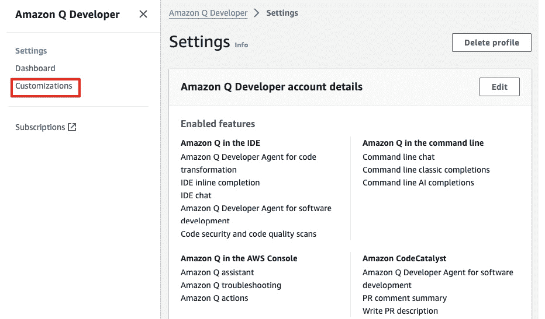

图 10.1 – Amazon Q 定制设置

然后，点击**定制**链接，在**定制**页面内遵循简单的三步流程：连接到代码库、创建定制和激活它。以下截图显示了该过程。

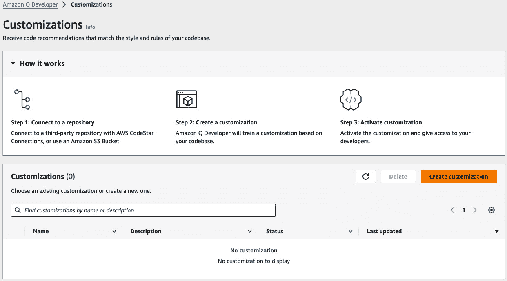

图 10.2 – Amazon Q 定制 – 创建过程

让我们逐一查看这些步骤。

## 连接到代码库

一旦你在控制台中点击**创建定制**按钮，你将看到一个页面，你可以在这里提供定制的名称和描述，以及与源代码库的连接，如下面的截图所示。

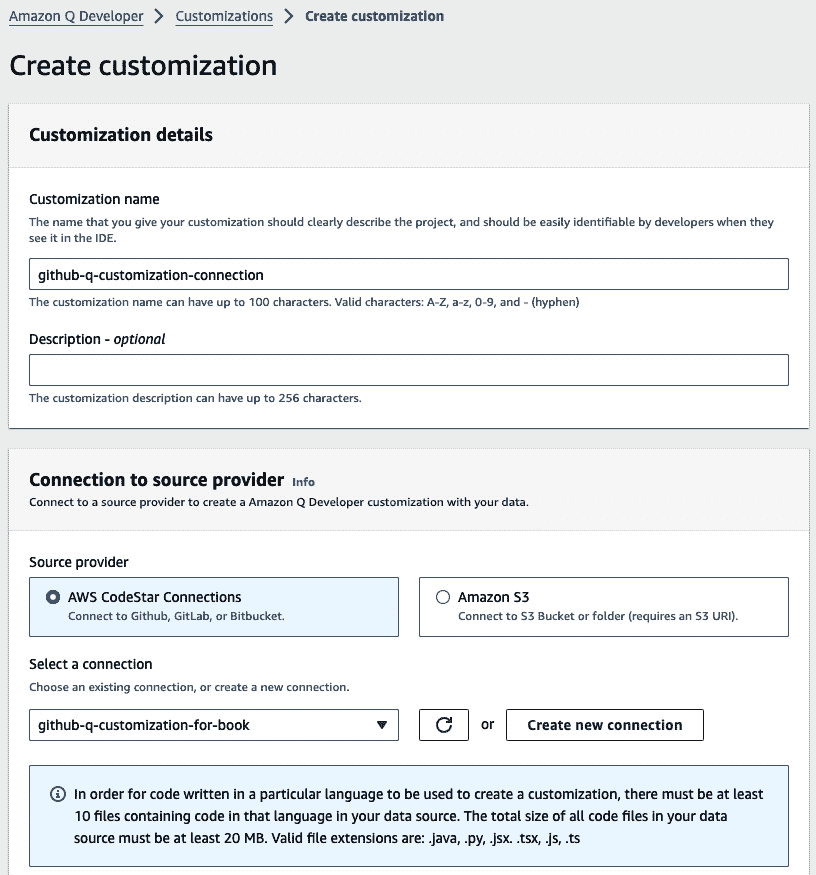

图 10.3 – Amazon Q 自定义 – 创建连接

总是尽量在这里给出有意义的名称和清晰的描述，因为开发人员可以从 IDE 中看到这些信息。

在前面的截图中的重要方面是源连接。有两种方式可以使您的源代码对 Amazon Q 可用以创建自定义。您可以将组织中的所有源代码上传到 Amazon S3 存储桶，并提供 S3 URI 作为源连接。许多将大量企业代码存储在代码仓库中作为 DevOps 流程一部分的组织不太可能使用此选项。另一种选项确实是连接到代码存储库。

如果您的数据源位于 GitHub、GitLab 或 Bitbucket，您需要使用 AWS CodeConnections 与其建立连接。为了展示本章中的自定义功能，我将连接到我的 GitHub 仓库，我将利用一些公共仓库，我将为使此功能工作而将其分叉。有关如何创建到您的仓库的连接的详细步骤，我在本章末尾的*参考文献*部分提供了链接，以便您可以一步一步地创建连接并将连接放入 Amazon Q 自定义创建页面。

以下截图显示了同一自定义创建页面的底部部分，该页面允许您将在此过程中生成的日志输出到日志交付选项之一。在这种情况下，我选择了 AWS CloudWatch，在后续步骤中，我将向您展示日志在此过程中的重要性。

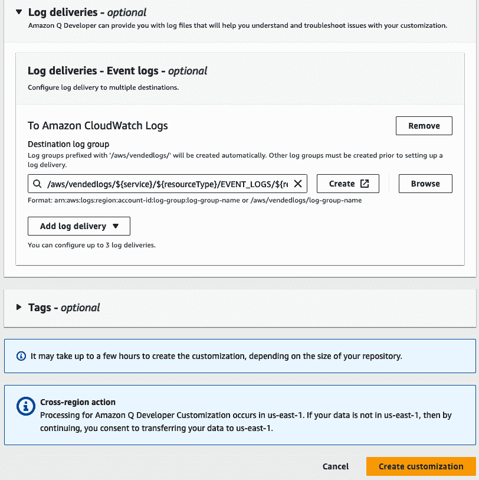

图 10.4 – Amazon Q 自定义 – 日志交付选项

一旦点击**创建自定义**按钮，它就开始了训练过程。根据代码库的总大小，可能需要几分钟到几小时甚至更长时间。

## 准备自定义

在此步骤中，Amazon Q 将连接到您的代码仓库，并根据您组织的编码实践训练一个自定义模型，以便它可以利用您的内容提供针对您组织开发人员偏好的定制建议。

安全注意事项

AWS 不会在任何不直接有利于您的企业的背景下存储或利用您的内容。此外，AWS 不会利用您的内容向其他客户提供代码建议，当然，Amazon Q 也不会参考为其他客户进行的网络安全扫描。

在此过程中，Amazon Q 从代码仓库检索源代码，并在进行合理性检查和质量检查，如重复文件检查和不支持的文件格式后，尝试确定它是否有足够的上下文来创建一个对所有组织开发人员都有益的自定义。

运行了一段时间后，定制创建页面失败了，并给我提供了一个错误信息，说代码大小不足以训练一个有效的模型。这个问题在以下截图中得到了突出。

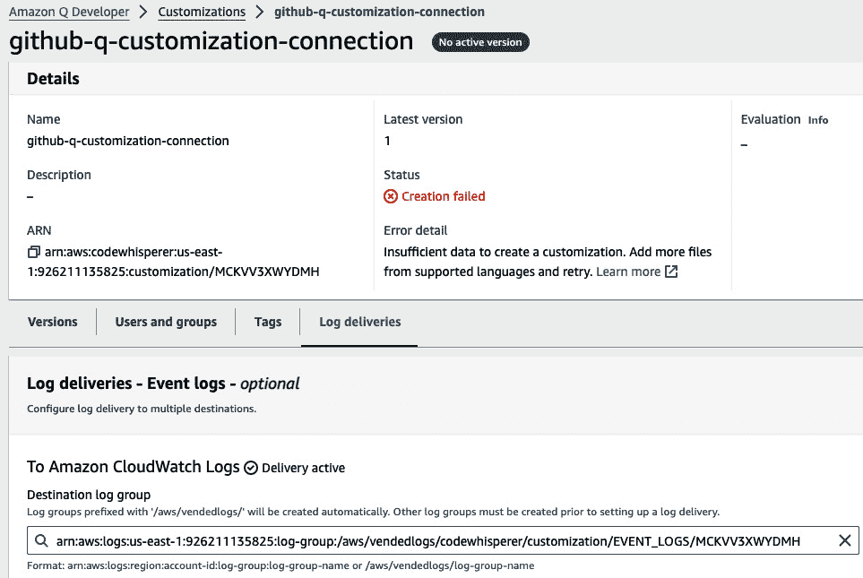

图 10.5 – Amazon Q 定制 – 创建定制失败

这个错误并没有确切地告诉我什么是不充分的，以及它是如何在我们的代码库中低于最低阈值的。这就是 CloudWatch 日志派上用场的地方。对于许多可能的故障排除错误消息，你可以通过*参考*部分中的链接进行查看，但我会介绍我在这个过程中遇到的一个错误。

如果你导航到定制设置期间提供的 CloudWatch 日志组链接，如图 10.4 中的*日志投递*部分所示，你将能够看到这个错误的确切原因。例如，在我的情况下，错误日志，如以下截图所示，表明在质量清理过程之后，Amazon Q 只能收集大约 1 MB 的代码。这个限制低于引擎进行定制训练过程所需的最低阈值 2 MB。

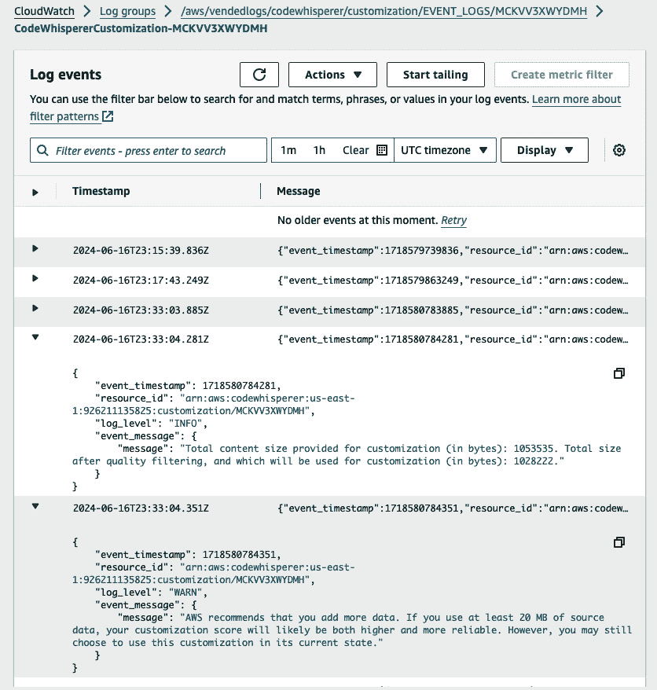

图 10.6 – Amazon Q 定制 – AWS CloudWatch 中的失败详情

这种数据不足错误的原因是，我从 AWS 在 GitHub 上提供的公共代码示例中 fork 了一个流行的代码仓库，位于`https://github.com/aws-samples.`

实际上，作为组织的一部分，你的管理员会将 Amazon Q 定制连接到你的私有企业仓库，以便 Amazon Q 可以根据你组织内部使用的海量代码来训练定制。为了展示本书中的定制，我无法使用任何私有代码，所以我所能做的就是通过连接到一个允许任何人以任何方式使用代码的公共仓库来展示这个功能。

此外，在代码仓库中找到的公共代码可能已经被用来训练 Amazon Q 开发者，所以从技术上讲，我并不会得到真正的定制。然而，为了展示它的工作步骤，这应该足以达到目的。

在收到那个失败信息后，我意识到我需要提供更多的代码示例，可能还需要更多样化的内容，以便训练一开始就能正常工作。因此，我继续在我的 GitHub 账户中 fork 了几个更多的仓库，这样 Amazon Q 就能跳过那个错误步骤。我重新运行了定制创建过程，过了一会儿，我又查看了一次 CloudWatch 日志，看看添加更多的代码仓库是否有助于它越过最低阈值。

以下截图显示，它勉强越过了所需的 2 MB 最低阈值。

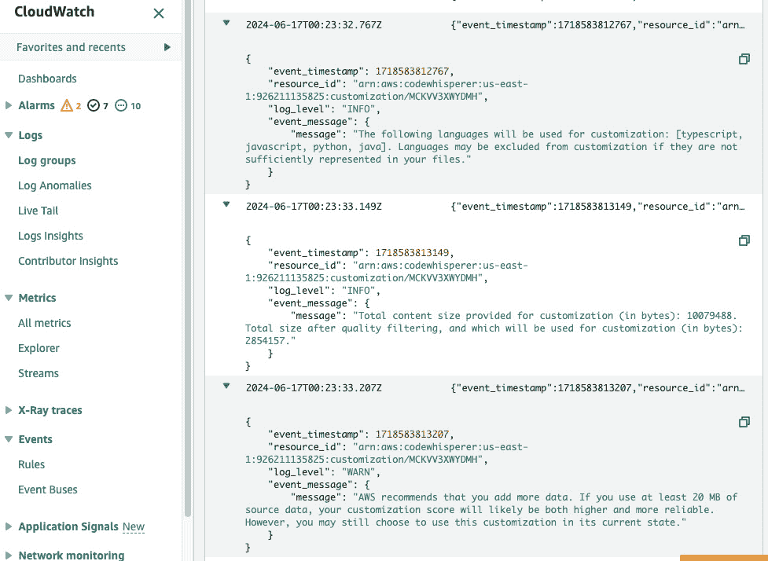

图 10.7 – Amazon Q 定制 – 修改后重新运行后的 AWS CloudWatch 日志

因此，即使添加了 5 到 6 个存储库，代码大小仍然只有 2 MB 多一点。建议至少有 2 MB，这可以扩展到 20 GB 的代码库。所以，很明显定制过程将完成，但我并不期望得到一个很高的评估分数。

以下截图显示定制已成功完成；然而，它给了我一个令人难以置信的评估分数为 1。换句话说，它告诉我最好不要将此定制功能推广到我们组织中的所有开发者，因为它会产生较差的结果。

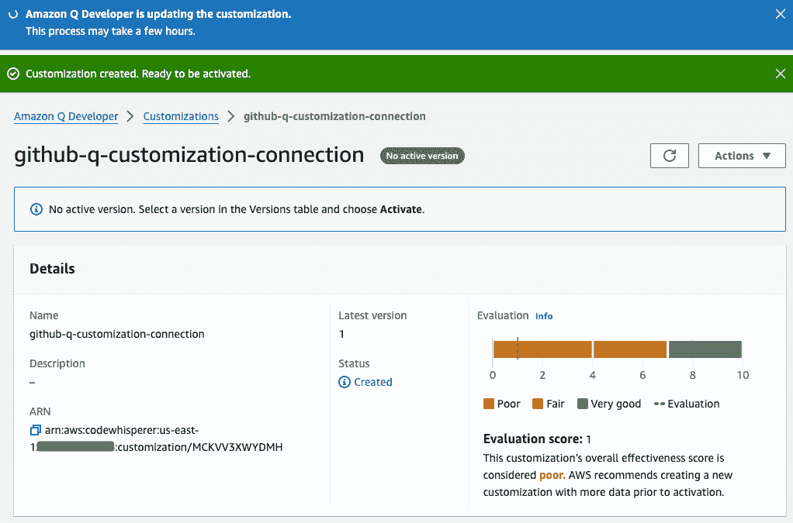

图 10.8 – Amazon Q 定制 – 定制创建已完成

我们将在下一节讨论分数评估以及如何改进它，但让我们完成创建过程中的第三步，即激活创建的定制。

## 激活和停用定制

定制创建完成后，需要激活。由于这是我们第一个版本，即使评估分数不高，我们也会激活它。然而，在现实中，你可以通过定制创建过程不断迭代，直到得到一个良好的评估分数，然后激活你想要用作最终版本的版本。

以下截图显示了定制创建完成后出现的**激活**选项。一旦激活，状态将显示为已激活。你也可以通过从**操作**下拉菜单中选择**停用**选项来停用任何定制版本。这对于只保留得分最高的版本以供使用非常有用。

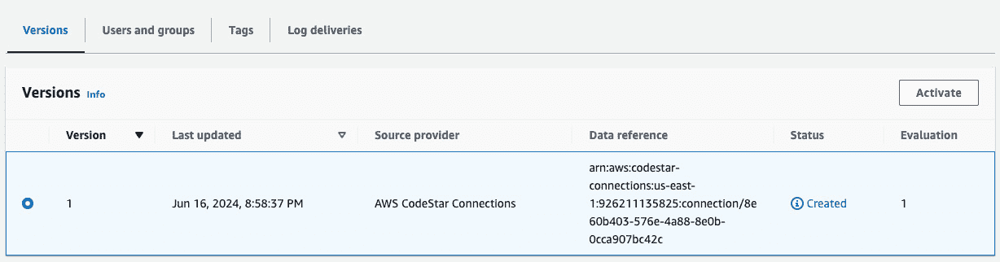

图 10.9 – Amazon Q 定制 – 激活定制的一个版本

现在，让我们了解分数评估过程以及如何改进它。

# 评估和优化定制

当定制过程完成后，它会给出一个评估分数，并在旁边提供详细的分数范围及其含义的描述。让我们详细讨论一下。

## 分数评估

根据你的评估分数，你现在应该决定是否激活你的定制。考虑以下因素：

+   **非常好（8-10）**：Amazon Q 建议激活此定制。

+   **公平（5-7）**：Amazon Q 建议激活此定制。如果你没有看到显著的改进，请考虑以下优化建议。如果那些不起作用，请考虑切换到不同的代码源。

+   **差（1-4）**：这种自定义设置可能不太有用。考虑下一节中关于优化自定义设置的优化建议。如果这些建议不有效，考虑切换到不同的代码源。

此评估矩阵在 AWS 文档中建议，其链接也包含在本章末尾的*参考文献*部分。

以下屏幕截图突出了我们自定义设置的此评估分数，并在旁边突出显示了每个评分范围的含义。

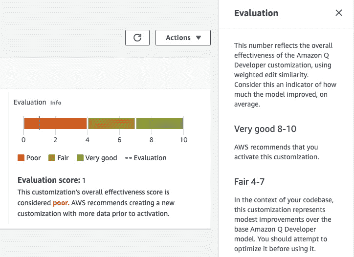

图 10.10 – 亚马逊 Q 自定义设置 – 评分评估标准

那么，我们如何提高这个分数呢？让我们看看。

## 优化自定义设置

让我们突出一些可能提高您评估分数的建议。

为了针对您组织中使用的特定语言进行优化，考虑扩大您的数据源，包括更多的代码仓库。如果您的数据集仅限于几种编程语言，尝试包含更广泛的语言种类。此外，排除自动生成的文件和从模板创建的仓库，因为为这类文件进行培训通常添加的价值很小，并引入了噪声。

评估您的代码库是否经常使用内部库。如果不使用，亚马逊 Q 的核心模型可能已经表现最佳。为了针对特定语言进行微调，确保为每种语言至少包含 20 个数据文件，总大小至少为 10 MB。本质上，通过增加和改进用于培训自定义设置的代码的多样性、质量和数量，评估分数可能会提高。更高的评估分数将有助于生成更好的自定义代码建议。一旦您确定了如何优化自定义设置，您就可以创建它的多个版本。

# 创建多个自定义设置版本

随着组织创建新的代码仓库和建立新的编码标准，可能需要保留亚马逊 Q 开发者的自定义设置，以整合额外的自定义设置并提高现有自定义设置的评估分数。这就是自定义设置的**版本控制**派上用场的地方，它允许您根据培训保留不同版本的自定义设置。

在亚马逊 Q 开发者中创建多个自定义设置版本很容易。从您可以看到当前版本的创建自定义设置页面，您可以从**操作**下拉菜单中选择**创建新版本**，并开始构建新版本，如以下屏幕截图所示。

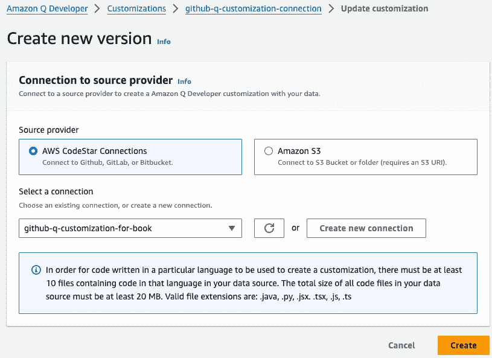

图 10.11 – 亚马逊 Q 自定义设置 – 创建自定义设置的新版本

Amazon Q 管理员可以为每个定制化访问最多三个版本：最新版本、当前正在使用的版本以及最近使用但不再使用的版本。

一旦定制化版本获得可接受的评估分数，管理员就可以将其提供给用户或组。

# 将用户和组添加到定制化中

添加用户或组非常简单。此步骤将允许开发者在开始使用 VS Code 或 JetBrains IDE 编码时访问定制化，这两个 IDE 都已安装了 Amazon Q 扩展。

以下截图显示了 Amazon Q 控制台中的“添加用户/组”选项卡。

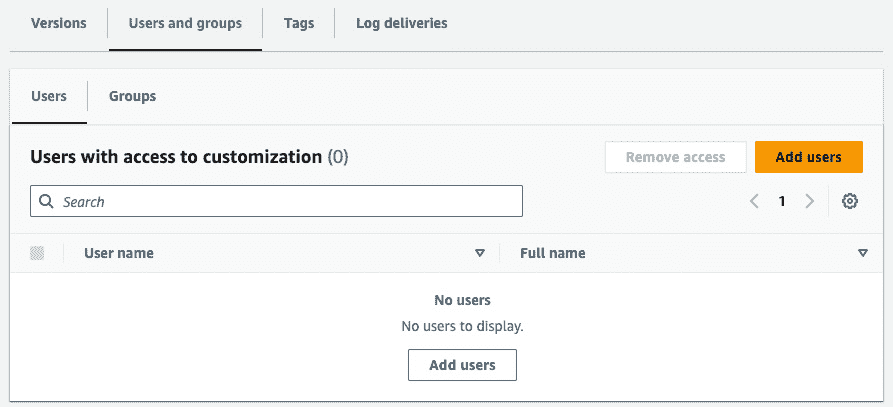

图 10.12 – Amazon Q 定制化 – 添加用户/组

在此情况下，如以下截图所示，我正在添加自己，以便我开始在 VS Code IDE 中使用定制化。请记住，这是我们使用*第二章*中列出的步骤配置的 AWS IAM Identity Center 用户。

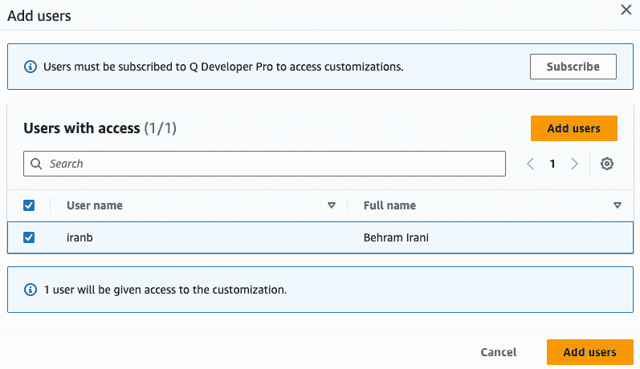

图 10.13 – Amazon Q 定制化 – 添加用户

现在，我们已经准备好开始从 IDE 使用定制化了。

# 在 IDE 中使用定制化

一旦管理员批准开始使用特定的定制化，从 IDE 开始使用它就非常简单。

提醒一下，定制化仅在专业版中可用，这意味着您必须使用 IAM Identity Center 凭据登录 IDE。以下截图突出显示了这一点，当我使用 IAM Identity Center 凭据登录 VS Code IDE 时，它通知我有权访问新的 Amazon Q 定制化。

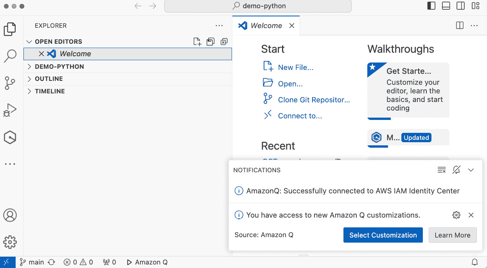

图 10.14 – Amazon Q 定制化 – VS Code IDE 中的新定制化通知

一旦选择，我可以看到之前创建的定制化名称。以下截图在 VS Code IDE 中突出了这一点。

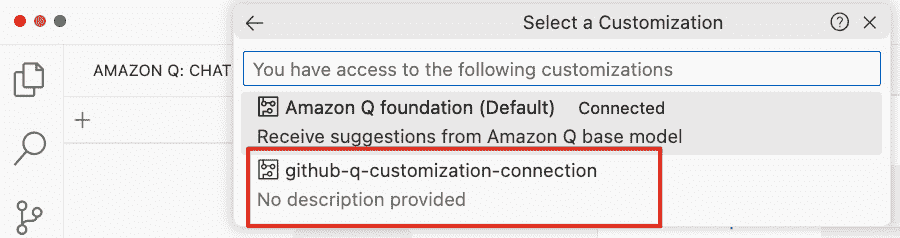

图 10.15 – Amazon Q 定制化 – 在 VS Code IDE 中选择定制化

一旦选择，恭喜，您将收到通知，所有新的 Amazon Q 代码建议都将来自所选的定制化。以下截图突出了这一点。

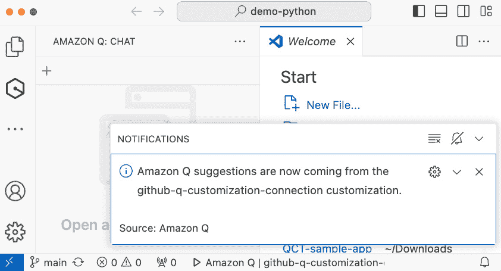

图 10.16 – Amazon Q 定制化 – VS Code IDE 中的定制化选择确认

现在，请记住，Amazon Q 将尝试在它找到的任何由自定义训练数据创建的代码逻辑处为你提供定制建议。如果它无法关联到定制模型，Amazon Q 将提供默认模型的建议。

您可以通过内联提示或使用 Amazon Q 开发者的聊天功能来获取定制代码建议。例如，想象您正在一家大型电子商务公司工作，该公司拥有许多面向客户的购物应用程序，作为新应用程序的开发者，您被分配了一个构建向客户推荐商品的功能的任务。这个功能的逻辑可能已经在您的组织中存在。在您的 IDE 中，您只需简单地插入一个内联提示或使用适当的函数名，例如 `shoppingRecommendationEngine(customerId: String)`，Amazon Q 将尝试根据它在定制训练过程中从您的组织私有仓库中学到的示例提供逻辑。函数中的所有复杂逻辑，可能在您的组织中已经建立为黄金标准，都可以立即使用，而无需您手动理解和创建所有代码。

Amazon Q 开发者还可以使用聊天功能回答您关于组织自定义代码的问题。您只需要求聊天根据用例生成或解释代码，Q 将尝试从它从组织的代码库中学到的内容中推断，以提供最接近的匹配输出。例如，您可以要求 Amazon Q 聊天生成一个使用 k-means 聚类算法的购物推荐引擎实现，它将尝试根据它在定制训练过程中从您的组织代码库中学到的其他类似示例提供代码建议。

这就结束了本章的内容。如果您已订阅了专业版，或者您的组织需要设置此功能，请随意尝试。

# 摘要

在本章中，我们介绍了 Amazon Q 开发者中的代码定制是什么。我们首先概述了 Amazon Q 定制的先决条件。然后，我们探讨了如何在 Amazon Q 中创建定制。在创建过程之后，需要对分数进行评估，并实施优化技术，以便在后续的定制创建过程中提高分数。

我们还研究了如何创建和维护多个版本的定制。一旦定制创建完成，管理员会将其分配给用户或组。最后，用户可以使用他们的 IAM 身份中心凭证登录 VS Code 或 JetBrains IDE，以选择并开始使用这些定制。

在下一章中，我们将探讨理解代码建议引用的方法，以便采取适当的行动。

# 参考资料

+   连接到代码仓库的设置步骤：[`docs.aws.amazon.com/dtconsole/latest/userguide/welcome-connections.html`](https://docs.aws.amazon.com/dtconsole/latest/userguide/welcome-connections.html)

    解决定制错误：[`docs.aws.amazon.com/amazonq/latest/qdeveloper-ug/customizations-log-use-understand.html`](https://docs.aws.amazon.com/amazonq/latest/qdeveloper-ug/customizations-log-use-understand.html)

+   定制评估：[`docs.aws.amazon.com/amazonq/latest/qdeveloper-ug/customizations-admin-activate.html`](https://docs.aws.amazon.com/amazonq/latest/qdeveloper-ug/customizations-admin-activate.html)
