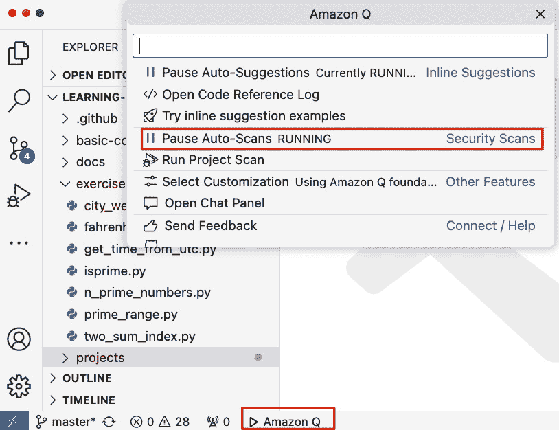
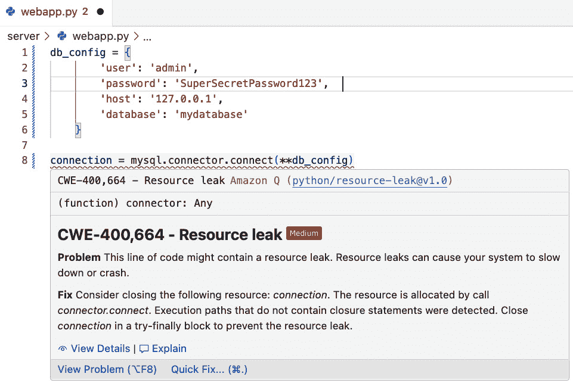
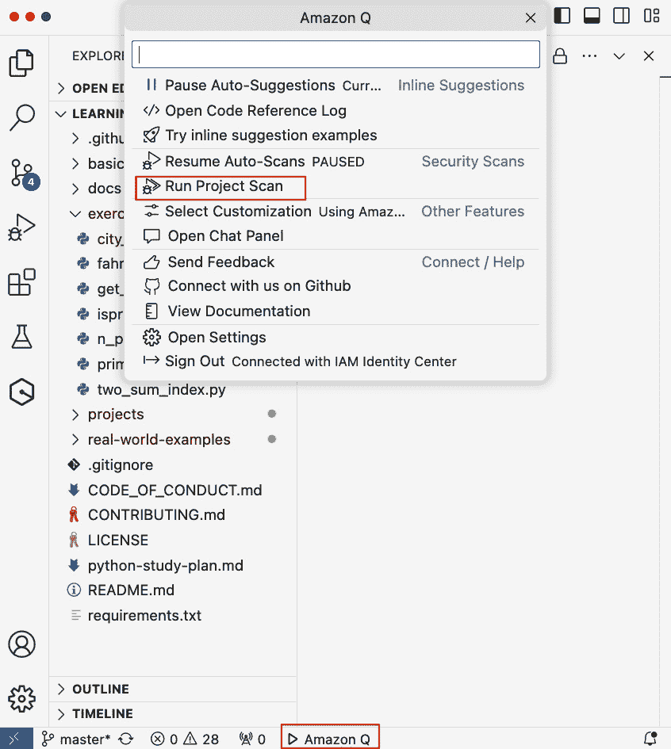
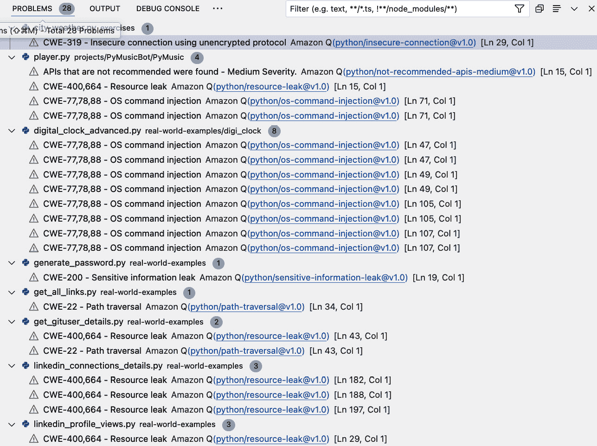
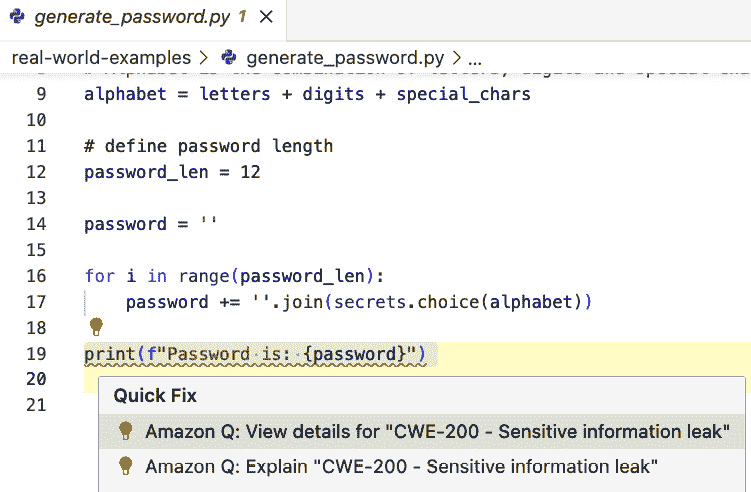
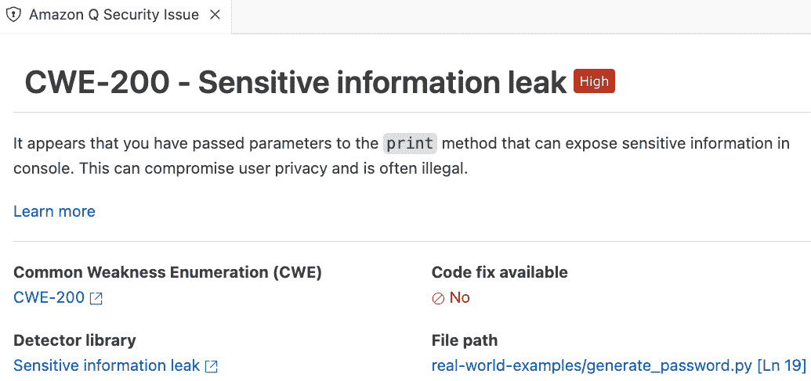

# 第十三章：简化代码中的扫描和修复安全漏洞

在本章中，我们将探讨以下关键主题：

+   代码安全扫描的重要性

+   使用 Amazon Q 进行的代码扫描类型

+   启动安全扫描

+   解决漏洞发现

本章篇幅虽短，但可以争论的是，与软件安全相关的内容永远不会简短，并且比其他任何事情都更重要。在我们探索使用 Amazon Q Developer 进行代码安全扫描的相关功能之前，让我们重申这一主题的重要性。

# 代码安全扫描的重要性

代码安全扫描是软件开发中的一个关键实践，旨在在代码库中的潜在安全漏洞被利用之前识别和减轻这些漏洞。以下是代码安全扫描之所以至关重要的几个原因：

+   **预防安全漏洞**：定期的代码安全扫描有助于识别攻击者可能利用的漏洞。通过在开发早期阶段捕捉这些问题，组织可以预防数据泄露、财务损失和声誉损害。

+   **遵守法规**：许多行业都受到严格的数据保护和安全法规的约束，例如**通用数据保护条例**（**GDPR**）、**健康保险可携带性和问责法案**（**HIPAA**）和**支付卡行业数据安全标准**（**PCI-DSS**）。代码安全扫描确保软件符合这些法规，从而避免法律处罚并确保客户信任。

+   **保护敏感信息**：应用程序经常处理敏感信息，如个人数据、财务记录和专有商业信息。代码中的安全漏洞可能导致对这些数据的未授权访问。定期扫描有助于通过识别和解决安全缺陷来保护这些敏感信息。

+   **降低成本**：在开发周期早期修复安全漏洞比部署后解决它们要便宜得多。部署后的修复不仅涉及代码更改，还包括补偿、法律费用和损害控制措施。

+   **维护软件完整性**：代码安全扫描通过确保不存在恶意代码或后门来帮助维护软件的完整性。这对于分发给最终用户的软件尤为重要，因为它有助于保持产品在信任和可靠性方面的声誉。

+   **促进持续改进**：通过将代码安全扫描集成到开发过程中，组织可以持续改进其安全态势。扫描工具可以提供反馈和建议，使开发者能够从过去的错误中学习，并避免在未来引入类似漏洞。

+   **支持安全开发实践**: 定期安全扫描强化了安全编码实践在开发者中的重要性。它鼓励以安全为首要考虑的心态，使开发者更加意识到常见的安全陷阱和避免它们的最佳实践。

+   **增强客户信心**: 客户和客户越来越意识到网络安全威胁。通过定期代码扫描展示对安全的承诺可以增强客户对组织产品和服务的信心和信任。

对漏洞进行代码安全扫描是一种主动措施，在软件开发组织的整体安全策略中发挥着至关重要的作用。通过早期识别和解决安全问题，公司可以保护敏感数据，遵守法规，降低成本，并保持其软件产品的完整性和可信度。

现在，让我们将重点转向 Amazon Q 开发者工具在代码扫描和修复代码漏洞方面的辅助作用。

# 使用 Amazon Q 的代码扫描类型

Amazon Q 扫描利用基于多年亚马逊标准和安全最佳实践的检测器。随着安全政策的演变和新检测器的引入，扫描会自动集成这些更新，以确保您的代码始终符合最新的政策。

安全检测器由 Amazon CodeGuru 提供支持，这是一个分析代码并提供智能建议以增强代码安全和质量的开发者工具。在本书末尾的 *参考文献* 部分提供了一个链接，列出了不同编程语言的各个不同检测器库。请注意，检测器涵盖了每个受支持编程语言的数百个代码建议。为了理解 Amazon Q 开发者工具的安全扫描功能，我们将在下一节中仅选择几个在示例代码中检测到的漏洞。

Amazon Q 通过识别策略违规和漏洞来确保代码的安全性，这些漏洞是通过 **静态应用安全测试**（**SAST**）、秘密检测和 **基础设施即代码**（**IaC**）扫描来识别的。AWS 文档也突出了这个列表，其链接在 *参考文献* 部分提供。这个列表可能会在未来扩展到其他类型的扫描，因此请密切关注官方文档以获取更新：

+   **SAST 扫描**: 这种扫描在代码混淆阶段之前进行，并由应用安全团队使用，以捕获源代码本身中的漏洞。它也被称为白盒测试。Amazon Q 检测源代码中的问题，例如资源泄露、SQL 注入和跨站脚本。

+   **秘密扫描**：保护代码库中敏感信息免受泄露。Amazon Q 会检查你的代码和文本文件，寻找如硬编码密码、数据库连接字符串和用户名等秘密，并提供关于漏洞和安全加固的建议。

+   **IaC 扫描**：评估你的基础设施文件的安全性。Amazon Q 会审查你的 IaC 文件，以识别配置错误、合规性问题以及安全漏洞。

现在让我们来看看如何开始使用 Amazon Q 的安全扫描功能。

# 启动安全扫描

Amazon Q Developer 提供了两种代码安全扫描的变体。

## 编码时扫描

一些开发者更喜欢在编写代码时，IDE 能够提醒他们代码中存在的任何安全漏洞。Amazon Q 的自动扫描功能会持续监控你正在积极工作的文件，一旦在代码中检测到问题，就会立即生成发现结果。

注意

此功能仅适用于 Pro 级别，并在使用 Amazon Q Developer 时默认启用。如果你已订阅 Amazon Q Developer 的 Pro 级别，则自动扫描功能将出现在 Amazon Q 菜单选项中，你甚至可以暂停它，如果你更喜欢在项目级别一次性运行整个扫描。

下面的截图展示了在 VS Code IDE 中的此功能。

图 13.1 – Amazon Q 安全扫描 – 自动扫描设置

如果自动扫描功能正在运行，一旦你编写了可能被视为安全漏洞的代码，Q 会立即标记它，并告知你问题，并提供解释。

下面的截图显示了我们在代码中引入的一个明显的安全违规，Q 立即标记了它，并立即提供了原因。

图 13.2 – Amazon Q 安全扫描 – 自动扫描检测到问题

现在让我们看看 Amazon Q 提供的开放扫描选项。

## 扫描整个项目

如果开发者希望在项目完成后进行扫描，那么他们可以使用 Amazon Q 提供的此选项，该选项会扫描整个项目，并一次性提供所有安全漏洞。此选项在 Amazon Q Developer 的两个级别中均可用。

要启动此操作，请打开项目，然后运行 Amazon Q 的**运行项目扫描**选项，如图下所示。

图 13.3 – Amazon Q 安全扫描 – 扫描整个项目

一旦扫描完成，Amazon Q 将为开发者提供一个所有安全问题的摘要，以便他们审查并采取行动解决这些问题。以下截图显示了我们在*第十二章*中使用的 Python 项目中找到的所有问题。如果你跳过了那一章，以下是项目的 GitHub 链接，你可以尝试在本章中再次运行它：[`github.com/jassics/learning-python`](https://github.com/jassics/learning-python)。

图 13.4 – Amazon Q 安全扫描 – 安全扫描发现

获取代码中的问题报告是一回事，但采取适当的行动来解决问题是我们最初发现它们的主要原因。Amazon Q 开发者也可以帮助解决漏洞发现，让我们看看我们有哪些选项。

# 解决漏洞发现

一旦 Amazon Q 识别出问题，它将提供一些选项。它要么提供有关问题的更多详细信息，或者你可以使用 Q 聊天功能来解释发现，并提供修复建议。有时，当 Q 能够自行解决时，你也会看到自动修复选项。

以下截图显示了我们在上一节的项目中讨论的问题可以采取的行动。当然，在这种情况下，打印密码是故意为之，以展示密码生成功能，但 Q 的扫描能够检测到问题，并展示你可以采取的行动。

图 13.5 – Amazon Q 安全扫描 – 处理发现的选项

## 详细查看安全发现

查看图 13.5，如果你选择**查看详情**选项，Amazon Q 将详细描述问题是什么以及你可以如何找到解决方案。它基本上让你能够做出明智的决定来改进你的代码。以下截图显示了此选项。

图 13.6 – Amazon Q 安全扫描 – 发现的详细视图

现在我们来看看你可以选择的 Q 解释选项。

## 寻求对问题的解释

再次查看图 13.5，如果你选择**解释**选项，Amazon Q 将允许你寻求对问题的交互式解释，其中 Q 将调用其聊天功能，并提供解释以及你可以将其插入代码中的推荐修复方案。以下截图显示了我们在上一节中查看的相同问题的解释。

图 13.7 – Amazon Q 安全扫描 – 解释发现

这就带我们来到了本章的重要结尾。请随意在自己的项目中尝试这个功能，看看你发现了什么。使用亚马逊 Q 开发者检测和查看问题的机制，以及寻求解释和修复，对所有类型的安全问题都是相同的，因此我们将保持本章简短。

# 摘要

在本章中，我们讨论了为什么代码安全扫描对每个项目都是至关重要的。没有明确的策略来发现并解决代码中的安全问题，任何软件项目都不能投入生产。

我们随后探讨了亚马逊 Q 开发者提供的不同类型扫描。我们还研究了如何在亚马逊 Q 中启动安全扫描，无论是使用自动扫描选项还是通过项目级别进行扫描。最后，我们检查了亚马逊 Q 如何帮助解决所有发现的问题。

在下一章中，我们将转向使用亚马逊 Q 开发者来在 AWS 环境中创建解决方案。

# 参考文献

+   亚马逊 CodeGuru 检测库：[`docs.aws.amazon.com/codeguru/detector-library/`](https://docs.aws.amazon.com/codeguru/detector-library/)

+   亚马逊 Q 开发者提供的安全扫描类型：[`docs.aws.amazon.com/amazonq/latest/qdeveloper-ug/security-scans.html`](https://docs.aws.amazon.com/amazonq/latest/qdeveloper-ug/security-scans.html)

# 第四部分：在 AWS 上加速构建

在本部分中，我们将探讨亚马逊 Q 开发者如何帮助在 AWS 上更快地构建应用程序。亚马逊 Q 与各种 AWS 服务和工具集成，提供全面的辅助体验。亚马逊 Q 不仅提高了 AWS 构建者的生产力，还提供了集成和无缝的工作体验。

本部分包含以下章节：

+   *第十四章*，*在 AWS 上加速数据工程*

+   *第十五章*，*在 AWS 上加速构建解决方案*

+   *第十六章*，*在 AWS 上加速 DevOps 流程*
