# 14

# 加速 AWS 上的数据工程

在本章中，我们将探讨以下关键主题：

+   与 AWS 服务的代码辅助选项

+   与 AWS Glue 的代码辅助集成

+   与 Amazon EMR 的代码辅助集成

+   与 AWS Lambda 的代码辅助集成

+   与 Amazon SageMaker 的代码辅助集成

+   与 Amazon Redshift 的代码辅助集成

在本书的前一部分，我们探讨了自动代码生成技术以及代码伴侣与**集成开发环境**（**IDEs**）的集成，并提供了使用 JetBrains PyCharm IDE 和 Amazon Q Developer 对不同语言进行示例的例子。在本章中，我们将特别关注 Amazon 如何通过与其核心 AWS 服务的集成来扩展其在辅助代码开发者领域的努力。

# 与 AWS 服务的代码辅助选项

AWS 用户会根据他们项目的独特需求、用例、开发者的技术需求、开发者偏好以及 AWS 服务的特点来选择多样化的服务。为了满足各种开发者角色，例如数据工程师、数据科学家、应用开发者等，AWS 已经将其代码服务与代码辅助功能集成。如果你是使用 AWS 服务的应用构建者、软件开发者、数据工程师或数据科学家，你将经常使用 Amazon SageMaker 作为构建 AI/**机器学习**（**ML**）项目的平台，Amazon EMR 作为构建大数据处理项目的平台，AWS Glue 用于构建**提取、转换和加载**（**ETL**）管道，AWS Lambda 作为应用开发的无服务器计算服务。所有这些服务都提供了帮助构建者和开发者编写代码的工具。

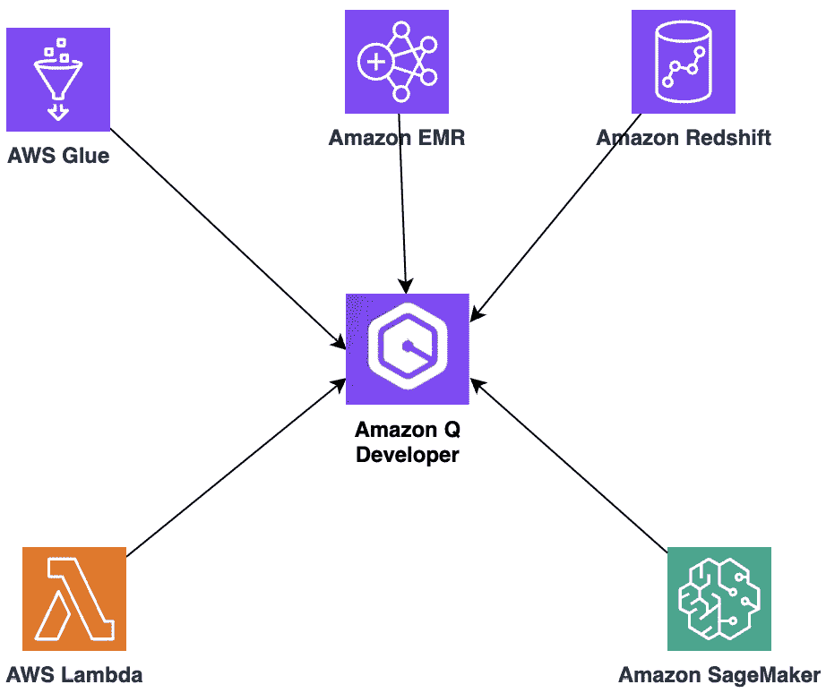

图 14.1 – 与 AWS 服务相关的代码辅助选项

截至本书编写时，AWS 已经将 Amazon Q Developer 与 AWS Glue、Amazon EMR、AWS Lambda、Amazon SageMaker 和 Amazon Redshift 集成。然而，我们预计受益于代码辅助的服务列表，如 Amazon Q Developer，将在未来继续扩展。

在以下章节中，我们将深入探讨这些服务的每一个，详细检查它们与 Amazon Q 的集成情况。我们将提供有助于数据工程师在 AWS 上加速开发的示例。

注意

**大型语言模型**（**LLMs**）本质上是非确定性的，因此你可能不会得到代码快照中显示的相同代码块。然而，从逻辑上讲，生成的代码应该满足要求。

**CodeWhisperer**是合并到 Amazon Q Developer 服务中的一个旧名称。截至本书编写时，AWS 控制台中的一些集成仍然被称为 CodeWhisperer，这可能在将来发生变化。

# 与 AWS Glue 的代码辅助集成

在我们深入探讨 AWS Glue 服务的代码辅助支持之前，让我们快速浏览 AWS Glue 的概述。**AWS Glue**是一个无服务器数据集成服务，旨在简化从各种来源发现、准备、移动和集成数据的过程，满足分析、机器学习和应用开发的需求。在非常高的层面上，AWS Glue 具有以下主要组件，每个组件都有多个功能来支持数据工程师：

+   **Glue 数据目录**：它是一个集中的技术元数据存储库。它存储有关数据源、转换和目标的数据，提供了一个统一的数据视图。

+   **Glue Studio**：AWS Glue Studio 提供了一个图形界面，它简化了在 AWS Glue 中创建、执行和监控数据集成作业的过程。此外，它还为高级开发者提供了 Jupyter 笔记本。

AWS Glue Studio 无缝集成到 Amazon Q Developer。让我们通过考虑数据丰富化的一个非常常见的用例来探索其进一步的功能。

## AWS Glue 的应用场景

当我们有用例要解决时，我们才能最好地理解任何服务或工具的功能和特性。因此，让我们从一个简单且广泛使用的使用查找表进行数据丰富化的用例开始。

**使用查找表进行数据丰富化**：在典型场景中，业务分析师通常需要通过查找表将列中找到的代码/ID 的相关细节合并到数据中，以实现数据丰富化。期望的结果是在同一行中包含代码和相应的详细信息，形成一个全面且去规范化（denormalized）的记录。为了解决这个特定的用例，数据工程师开发 ETL 作业来连接表，创建包含去规范化数据集的最终结构。

为了说明这个用例，我们将使用包含诸如接车和下车的日期和时间、接车和下车的位置、行程距离、详细的费用分解、各种费率类型、使用的支付方式和司机报告的乘客数量等详细信息的黄色出租车行程记录。此外，行程信息还包括接车和下车的乘客位置代码。

业务目标是根据接车位置代码增强数据集的区域信息。

为了满足这一需求，数据工程师必须开发一个 PySpark ETL 脚本。此脚本应执行查找与接车位置代码对应的区域信息。随后，工程师通过将黄色出租车行程数据与详细的接车区域信息合并来创建去规范化/丰富化的数据，并将结果保存为文件。

作为代码开发者/数据工程师，您需要将前面的业务目标转换为技术需求。

## 解决方案蓝图

1.  编写 PySpark 代码以处理技术需求。

1.  从 S3 位置读取`yellow_tripdata_2023-01.parquet`文件到 DataFrame 中，并显示 10 条记录的样本。

1.  从 S3 位置读取`taxi+_zone_lookup.csv`文件到 DataFrame 中，并显示 10 条记录的样本。

1.  在`PULocationID = LocationID`上对`yellow_tripdata_2023-01.parquet`和`taxi+_zone_lookup.csv`执行左外连接，以收集接车区域信息。

1.  将前面提到的数据集作为 CSV 文件保存在前面的 Amazon S3 桶中的新`glue_notebook_yellow_pick_up_zone_output`文件夹中。

1.  为验证，从`glue_notebook_yellow_pick_up_zone_output`文件夹下载并检查文件。

现在我们已经定义了一个 use case，让我们逐步通过它的解决方案。

## 数据准备

第一步将是准备数据。为了说明其功能，在接下来的章节中，我们将利用公开的 NY 出租车数据集（TLC 行程记录数据）。[`www.nyc.gov/site/tlc/about/tlc-trip-record-data.page`](https://www.nyc.gov/site/tlc/about/tlc-trip-record-data.page)。

首先，我们将在本地机器上下载所需的文件，然后上传到 Amazon 的一个 S3 桶中：

1.  从[`d37ci6vzurychx.cloudfront.net/trip-data/yellow_tripdata_2023-01.parquet`](https://d37ci6vzurychx.cloudfront.net/trip-data/yellow_tripdata_2023-01.parquet)下载 2023 年 1 月的 Yellow Taxi 行程记录数据 Parquet 文件(`yellow_tripdata_2023-01.parquet`)到本地机器。

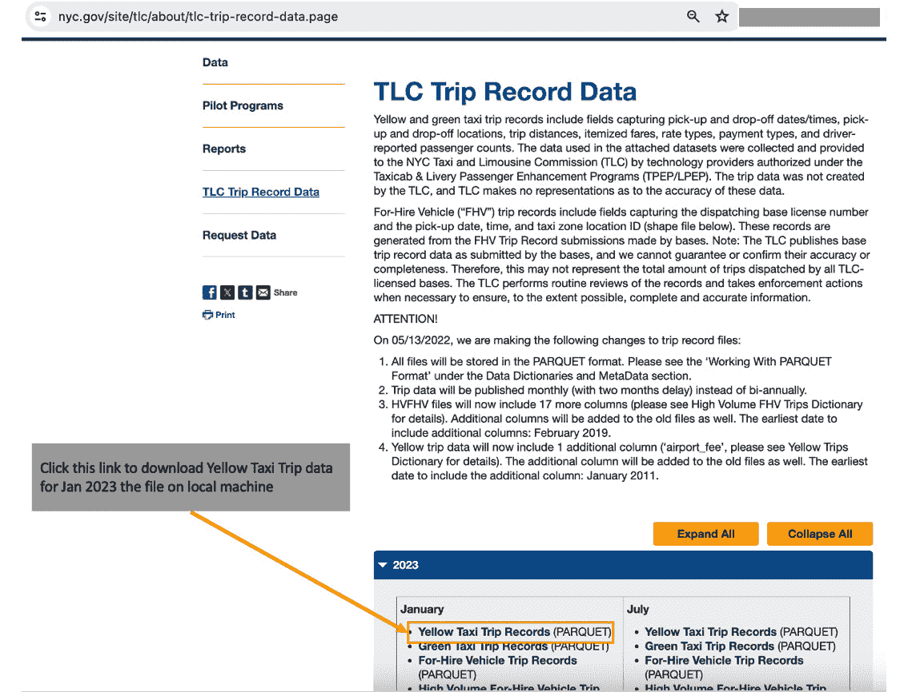

图 14.2 – 2023 年 1 月 Parquet 文件的 Yellow Taxi 行程记录数据

1.  从[`d37ci6vzurychx.cloudfront.net/misc/taxi+_zone_lookup.csv`](https://d37ci6vzurychx.cloudfront.net/misc/taxi+_zone_lookup.csv)下载 Taxi Zone Lookup Table CSV 文件(`taxi+_zone_lookup.csv`)到本地机器。

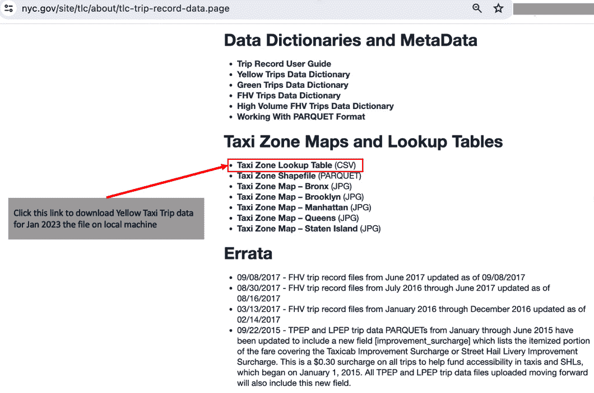

图 14.3 – Zone Lookup Table CSV 文件

1.  在 Amazon S3 中创建两个`yellow_taxi_trip_records`和`zone_lookup`文件夹，我们可以在我们的 Glue 笔记本作业中引用它们。

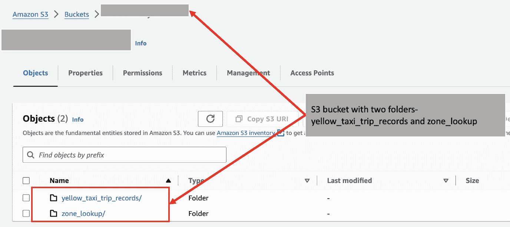

图 14.4 – S3 文件夹结构

1.  将`yellow_tripdata_2023-01.parquet`文件上传到`yellow_taxi_trip_records`文件夹。

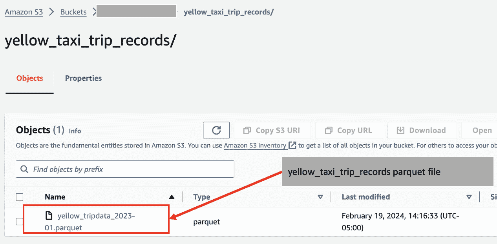

图 14.5 – yellow_taxi_tripdata_record 文件

1.  将`taxi+_zone_lookup.csv`文件上传到`zone_lookup`文件夹。

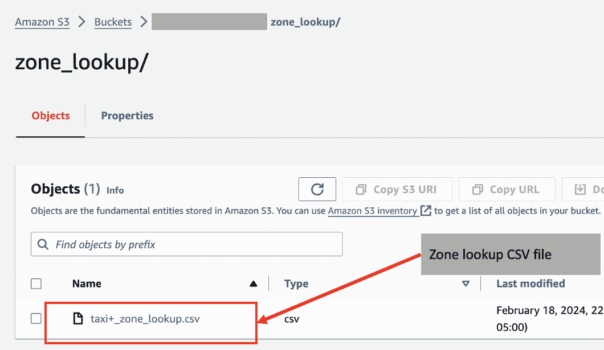

图 14.6 – zone_lookup 文件

注意

我们将使用相同的 dataset 和 use case，通过 AWS Glue 和 Amazon EMR 来发现解决方案。为了说明目的，我们已经手动准备了数据。然而，在生产环境中，可以通过利用各种 AWS 服务和/或第三方软件来自动化文件传输。

现在，让我们深入探讨使用 Amazon Q 开发者与 AWS Glue Studio 笔记本集成来解决前面用例的详细解决方案。

## 解决方案 – 使用 AWS Glue Studio 笔记本的 Amazon Q 开发者

让我们首先启用 Amazon Q Developer 与 AWS Glue Studio 笔记本。

### 启用 AWS Glue Studio 笔记本以使用 Amazon Q Developer 的先决条件

开发者需要修改与 IAM 用户或角色关联的 **身份和访问管理**（**IAM**）策略，以授予 Amazon Q Developer 在 Glue Studio 笔记本中启动建议的权限。参考 *第二章* 了解启用 Amazon Q Developer 与 AWS Glue Studio 笔记本的相关细节。

为了实现之前提到的解决方案蓝图，我们将使用在 *第三章* 中讨论的各种自动代码生成技术。主要，我们将专注于单行提示、多行提示和思维链提示用于自动代码生成。

让我们使用 Amazon Q Developer 在 AWS Glue Studio 笔记本中自动生成端到端脚本。以下是之前定义的解决方案蓝图的逐步解决方案说明。

### 要求 1

首先，你需要编写一些 PySpark 代码。

在创建 Glue Studio 笔记本时，选择 **Spark (Python**) 引擎和附加了 Amazon Q Developer 策略的角色。

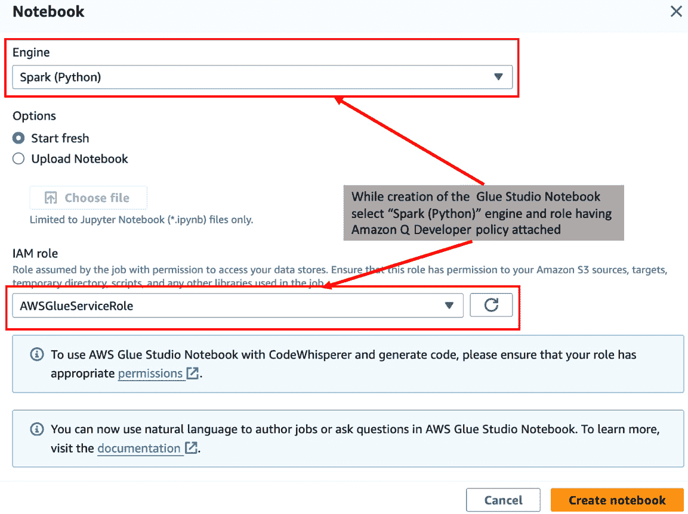

图 14.7 – 使用 PySpark 创建 Glue Studio 笔记本

一旦创建笔记本，观察名为 `Glue PySpark` 的内核。

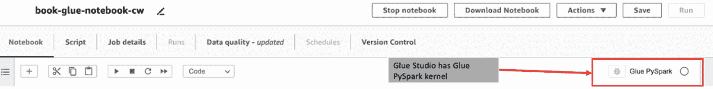

图 14.8 – 带有 Glue PySpark 内核的 Glue Studio 笔记本

### 要求 2

从 S3 位置读取 `yellow_tripdata_2023-01.parquet` 文件到 DataFrame 中，并显示 10 条记录的样本。

让我们使用一系列思维提示技术，在多个单元格中使用多个单行提示来实现前面的要求：

```py
Prompt # 1:
# Read s3://<your-bucket-name-here>/yellow_taxi_trip_records/yellow_tripdata_2023-01.parquet file in a dataframe
Prompt # 2:
# display a sample of 10 records from dataframe
```

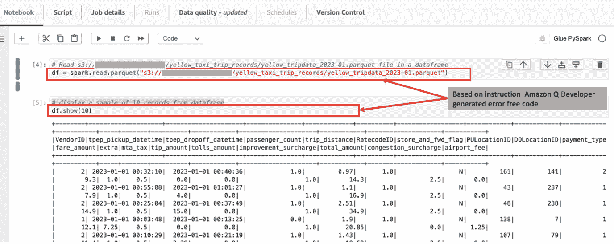

图 14.9 – 使用单行提示读取 Yellow Taxi Trip Records 数据的 PySpark 代码

注意，当输入启用 Amazon Q Developer 的 Glue Studio 笔记本提示时，它将启动代码建议。Q Developer 识别文件格式为 Parquet，并建议使用 `spark.read.parquet` 方法。你可以直接从笔记本中执行每个单元格/代码。此外，当你移动到下一个单元格时，Q Developer 使用“逐行建议”来建议显示模式。

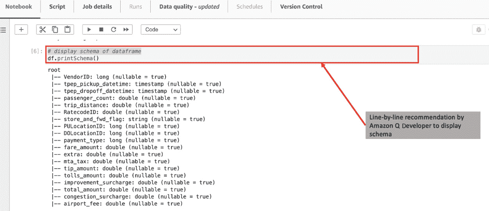

图 14.10 – 显示模式的逐行建议

### 要求 3

从 S3 位置读取 `taxi+_zone_lookup.csv` 文件到 DataFrame 中，并显示 10 条记录的样本。

我们已经探讨了使用多个单行提示的思维链提示技术来满足 *要求 2*。现在，让我们尝试使用多行提示来实现前面的要求，并且我们将尝试为 DataFrame 名称定制代码：

```py
Prompt:
"""
Read s3://<your-bucket-name-here>/zone_lookup/taxi+_zone_lookup.csv in a dataframe name zone_df.
Show sample 10 records from zone_df.
"""
```

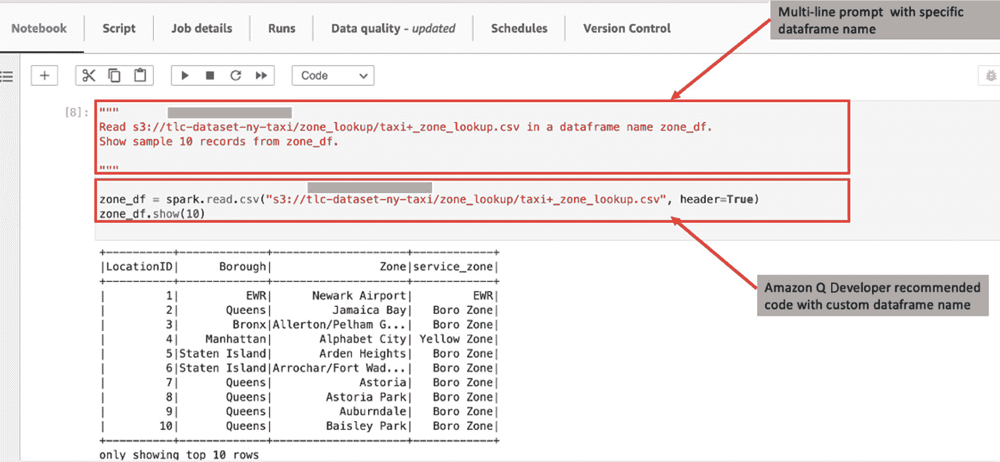

图 14.11 – 使用多行提示读取区域查找文件的 PySpark 代码

注意，Amazon Q 开发者理解了多行提示背后的上下文，以及提示中指定的特定 DataFrame 名称。它自动生成了多行代码，DataFrame 名称作为 `zone_df`，文件格式为 CSV，建议使用 `spark.read.csv` 方法读取 CSV 文件。您可以直接从笔记本中执行每个单元格/代码。

### 要求 4

在 `pulocationid = LocationID` 上对 `yellow_tripdata_2023-01.parquet` 和 `taxi+_zone_lookup.csv` 执行左外连接以收集取货区域信息。

我们将继续使用多行提示和一些代码定制来实现前面的要求：

```py
Prompt:
"""
Perform a left outer join on dataframe df and dataframe zone_df on PULocationID = LocationID to save in dataframe name yellow_pu_zone_df.
Show sample 10 records from yellow_pu_zone_df and show schema.
"""
```

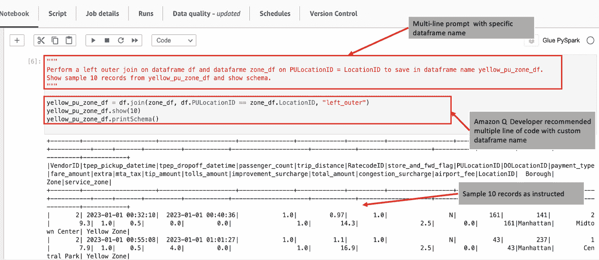

图 14.12 – 左外连接 df 和 dataframe zone_df – 多行提示

现在，让我们回顾代码执行返回的 DataFrame 的模式。

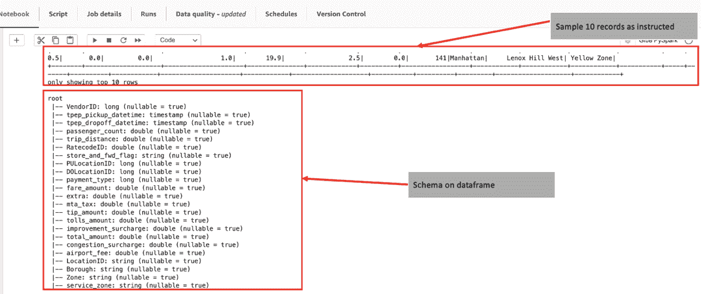

图 14.13 – 左外连接 df 和 dataframe zone_df – 显示模式

注意，正如多行提示中所述，Amazon Q 开发者理解了上下文，并自动生成了无错误的代码，与我们提供的有关 `yellow_pu_zone_df` DataFrame 名称的精确规格完全一致。您可以直接从笔记本中执行每个单元格/代码。

### 要求 5

将前面的数据集保存为 CSV 文件，在前面 Amazon S3 桶中的新文件夹 `glue_notebook_yellow_pick_up_zone_output` 中。

由于前面的要求很简单，可以封装在单个句子中，我们将使用单行提示来生成代码，并且我们还将包括标题以方便验证：

```py
Prompt:
# Save dataframe yellow_pu_zone_df as CSV file at location s3://<your-bucket-name-here>/tlc-dataset-ny-taxi/glue_notebook_yellow_pick_up_zone_output/ with header information
```

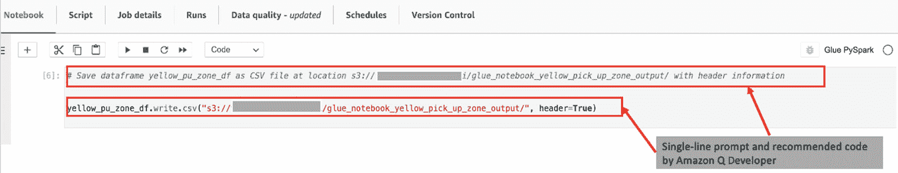

图 14.14 – 保存包含丰富取货位置数据的 CSV 文件

### 要求 6

为了验证，从 `glue_notebook_yellow_pick_up_zone_output` 文件夹下载并检查文件。

让我们去 Amazon S3 控制台验证文件。选择其中一个文件并点击 **下载**。

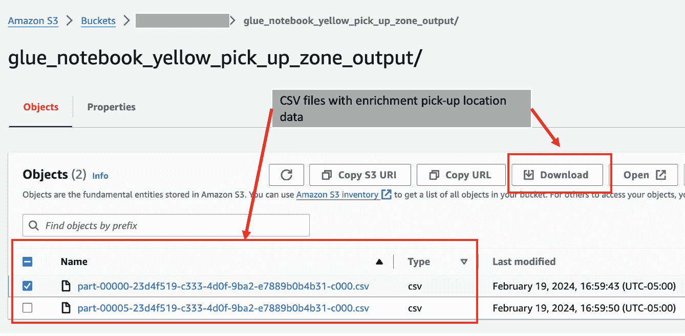

图 14.15 – 保存包含丰富取货位置数据的 CSV 文件

下载文件后，您可以使用任何文本编辑器来查看文件内容。

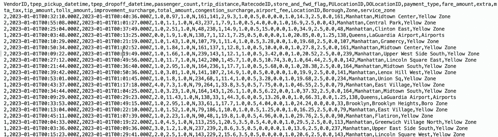

图 14.16 – 验证包含丰富取货位置数据的 CSV 文件

注意到 CSV 文件根据取货位置 ID 有额外的区域信息列。在下一节中，我们将探索 Amazon Q 开发者与 AWS Glue 的集成，并使用聊天助手技术。

挑战思考

为了满足*要求 6*，如果你感兴趣，尝试使用相同的 Glue Studio 笔记本来读取 CSV 文件，显示样本记录，并添加标题。

**提示**：使用多行提示技术，类似于我们在读取区域查找文件时使用的技术。

## 解决方案 – Amazon Q 开发者与 AWS Glue

Amazon Q 开发者提供了 AWS Glue 控制台中的聊天式界面。现在，让我们探索 Amazon Q 开发者与 AWS Glue 之间的集成，以及我们使用 Amazon Q 开发者和 AWS Glue Studio 笔记本集成所处理的相同用例和解决方案蓝图。

现在，让我们看看启用 Amazon Q 与 AWS Glue 的先决条件。

要启用 Amazon Q 开发者与 AWS Glue 的集成，我们需要更新 IAM 策略。请参阅*第二章*以获取在 AWS Glue 中启动与 Amazon Q 交互的更多详细信息。

现在，让我们深入探讨 Amazon Q 开发者与 AWS Glue Studio 集成的前述用例。

为了满足提到的要求，我们将主要使用在第*第三章*中讨论的聊天伴侣。

这里是一个逐步的解决方案演示，我们将使用它作为前面所有要求的提示：

```py
Instruction to Amazon Q:
Write a Glue ETL job.
Read the 's3://<your bucket name>/yellow_taxi_trip_records/yellow_tripdata_2023-01.parquet' file in a dataframe and display a sample of 10 records.
Read the 's3://<your bucket name>/zone_lookup/taxi+_zone_lookup.csv' file in a dataframe and display a sample of 10 records.
Perform a left outer join on 'yellow_tripdata_2023-01.parquet' and 'taxi+_zone_lookup.csv' on DOLocationID = LocationID to gather pick-up zone information.
Save the above dataset as a CSV file in above Amazon S3 bucket in a new folder 'glue_notebook_yellow_drop_off_zone_output'.
```

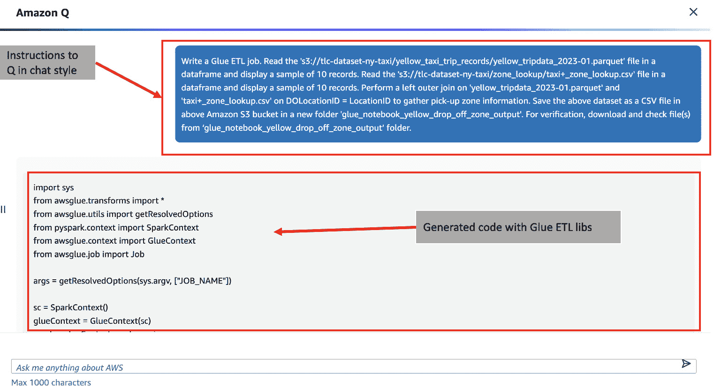

图 14.17 – Amazon Q 开发者建议的 AWS Glue ETL 代码 – 第一部分

你可以看到，根据提供给 Amazon Q 的指令，它生成了 ETL 代码的框架。它生成了使用 Glue-PySpark 库的代码结构，一个创建动态 dataframe 以读取 parquet 文件的 s3node，以及一个写入动态 dataframe 以写入 CSV 文件的 s3node。

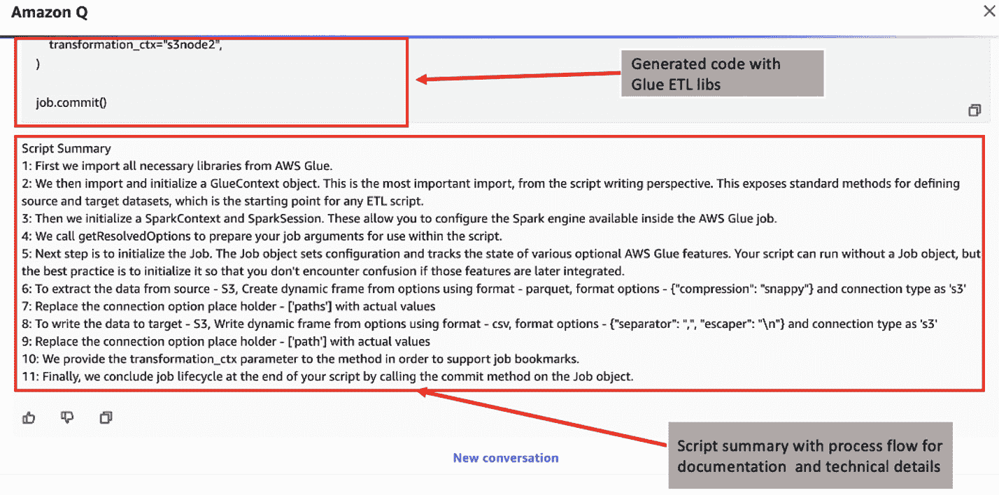

图 14.18 – Amazon Q 开发者建议的 AWS Glue ETL 代码 – 第二部分

注意到 Amazon Q 还提供了技术细节来解释脚本流程。这也可以用来满足脚本中的文档需求。

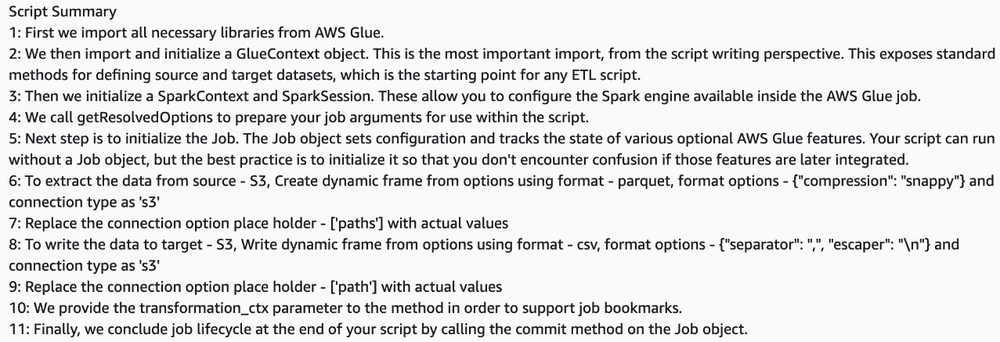

图 14.19 – Amazon Q 开发者建议的 AWS Glue ETL 代码 – 脚本摘要

具有编码经验的数据工程师可以轻松地参考脚本摘要和脚本框架来编写端到端的脚本以满足解决方案蓝图。由于 LLMs 本质上是非确定性的，所以你可能不会得到代码快照中显示的相同代码块。

根据前面的用例说明，AWS Glue 与 Amazon Q 开发者集成并使用提示技术可以由经验相对较低的数据工程师使用，而使用聊天助手与 AWS Glue 集成的 Amazon Q 开发者可以由经验相对较多的 ETL 开发者利用。

### 摘要 – Amazon Q 开发者与 AWS Glue Studio 笔记本

如上图所示，我们只需提供具有特定要求的提示，就可以自动生成端到端、无错误且可执行的代码。Amazon Q 开发者与 AWS Glue Studio 笔记本集成，理解上下文并自动生成可以直接从笔记本中运行的 PySpark 代码，无需预先配置任何硬件。这对许多数据工程师来说是一个重大的进步，使他们摆脱了与 PySpark 库、方法和语法相关的技术复杂性。

接下来，我们将探讨与 Amazon EMR 的代码辅助集成。

# 与 Amazon EMR 的代码辅助集成

在我们深入探讨 Amazon EMR 的代码辅助支持的细节之前，让我们快速浏览一下 Amazon EMR 的概述。**Amazon EMR** 是一个基于云的大数据平台，简化了各种大数据框架（如 Apache Hadoop、Apache Spark、Apache Hive 和 Apache HBase）的部署、管理和扩展。在较高层次上，Amazon EMR 包含以下主要组件，每个组件都有多个功能来支持数据工程师和数据科学家：

+   **EMR on EC2/EKS**：Amazon EMR 服务提供了两种选项，即 EMR on EC2 和 EMR on EKS，允许客户配置集群。Amazon EMR 简化了数据分析师和工程师执行批量作业和交互式工作负载的过程。

+   **EMR Serverless**：Amazon EMR Serverless 是 Amazon EMR 内的一个无服务器替代方案。使用 Amazon EMR Serverless，用户可以访问 Amazon EMR 提供的完整功能集和优势，而无需对集群规划和管理工作具有专业知识。

+   **EMR Studio**：EMR Studio 支持数据工程师和数据科学家在 IDE 内开发、可视化和调试应用程序。它还提供了一个 Jupyter Notebook 环境用于交互式编码。

## Amazon EMR Studio 的用例

为了简单和便于跟踪 Amazon Q 开发者与 Amazon EMR 的集成，我们将使用本章在 *代码辅助集成与 AWS Glue* 部分中使用的相同用例和数据。请参阅 *AWS Glue 的用例* 部分，该部分涵盖了有关解决方案蓝图和数据准备的相关细节。

## 解决方案 – Amazon Q 开发者与 Amazon EMR Studio

让我们先启用 Amazon Q 开发者与 Amazon EMR Studio。要启用 Amazon Q 开发者与 Amazon EMR Studio 的集成，我们需要更新 IAM 策略。

### 启用 Amazon Q 开发者与 Amazon EMR Studio 的先决条件

开发者需要修改与该角色关联的 IAM 策略，以授予 Amazon Q 开发者在 EMR Studio 中发起推荐的权限。请参考*第二章*以获取有关在 Amazon EMR Studio 中与 Amazon Q 开发者进行交互的更多详细信息。

为了满足提到的需求，我们将使用在 *第三章* 中讨论的各种自动代码生成技术。主要，我们将重点关注单行提示、多行提示和思考链提示用于自动代码生成技术。

让我们使用 Amazon Q 开发者来自动生成端到端脚本，这些脚本可以在 Amazon EMR Studio 中实现以下需求。以下是解决方案的逐步解决方案概述。

备注

当涉及到 Amazon Q 开发者推荐代码时，你可以观察到 Glue Studio 笔记本和 EMR Studio 笔记本之间有很多相似之处。

### 需求 1

你将需要编写 PySpark 代码来处理技术需求。

一旦你打开 Amazon EMR Studio，使用 **启动器** 从 **笔记本** 部分选择 **PySpark**。

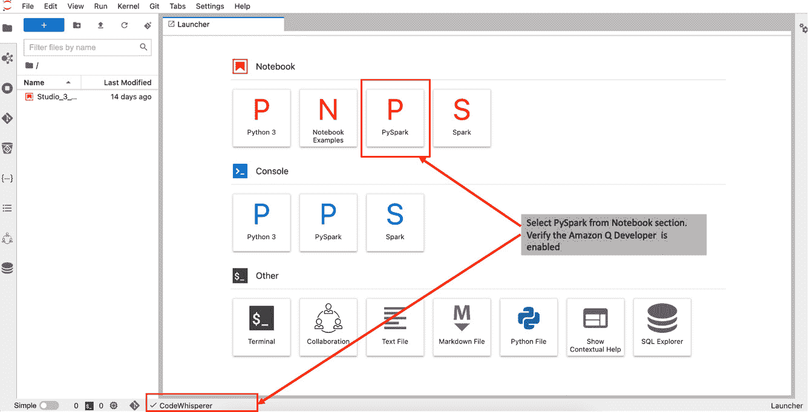

图 14.20 – 使用 PySpark 创建 EMR Studio 笔记本

一旦创建笔记本，你将看到一个名为 `PySpark` 的内核。内核是一个在后台运行的独立进程，它执行你在笔记本中编写的代码。有关更多信息，请参阅本章末尾的 *参考文献* 部分。

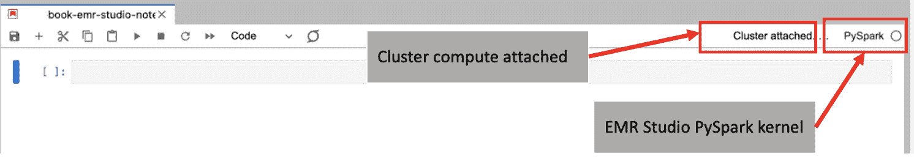

图 14.21 – 带有 PySpark 内核的 EMR Studio 笔记本

我已经将一个集群附加到我的笔记本上了，但你可以在 AWS 文档中探索不同的选项来将计算附加到 EMR Studio，请参阅[`docs.aws.amazon.com/emr/latest/ManagementGuide/emr-studio-create-use-clusters.html`](https://docs.aws.amazon.com/emr/latest/ManagementGuide/emr-studio-create-use-clusters.html)。

### 需求 2

从 S3 位置读取 `yellow_tripdata_2023-01.parquet` 文件到 DataFrame 中，并显示 10 条记录的样本。

让我们使用一个在不同单元格中包含多个单行提示的思考链提示技术来实现这个需求：

```py
Prompt # 1:
# Read s3://<your-bucket-name-here>/yellow_taxi_trip_records/yellow_tripdata_2023-01.parquet file in a dataframe
Prompt # 2:
# Display a sample of 10 records from dataframe
```

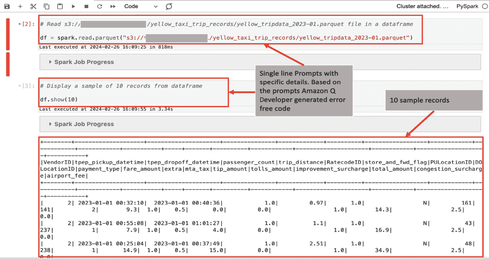

图 14.22 – 使用单行提示读取 Yellow Taxi Trip Records 数据的 PySpark 代码

注意，当输入 Amazon Q 开发者启用的 EMR Studio 笔记本提示时，它将启动代码推荐。Amazon Q 开发者识别文件格式为 Parquet，并建议使用 `spark.read.parquet` 方法。你可以直接从笔记本中执行每个单元格/代码。此外，当你移动到下一个单元格时，Amazon Q 开发者利用“逐行推荐”来建议显示模式。

### 需求 3

从 S3 位置读取 `taxi+_zone_lookup.csv` 文件到 DataFrame 中，并显示 10 条记录的样本。

我们已经探讨了使用多个单行提示的思考链提示技术来处理 *需求 2*。现在，让我们尝试一个多行提示来实现这个需求，并且我们将尝试为 DataFrame 名称定制代码：

```py
Prompt:
"""
Read s3://<your-bucket-name-here>/zone_lookup/taxi+_zone_lookup.csv in a dataframe name zone_df. Show sample 10 records from zone_df.
"""
```

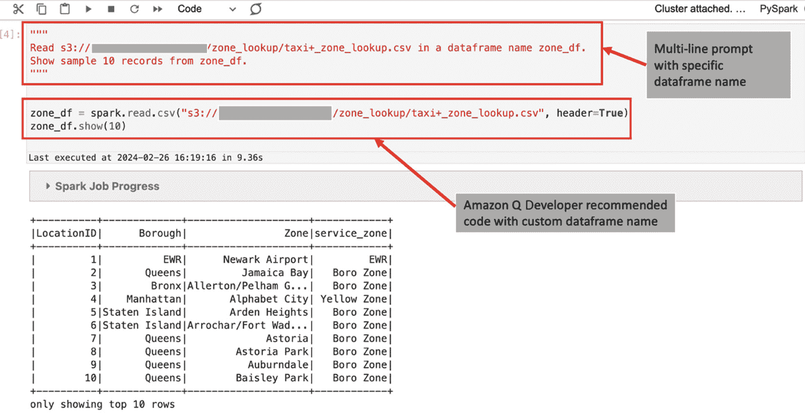

图 14.23 – 使用多行提示读取区域查找文件的 PySpark 代码

观察到 Amazon Q Developer 理解了多行提示背后的上下文，以及提示中指定的特定 DataFrame 名称。它自动生成了多行代码，DataFrame 名称为`zone_df`，文件格式为 CSV，建议使用`spark.read.csv`方法读取 CSV 文件。您可以直接从笔记本中执行每个单元格/代码。

### 需求 4

在`yellow_tripdata_2023-01.parquet`和`taxi+_zone_lookup.csv`上执行左外连接，基于`pulocationid = LocationID`来收集接车区域信息。

我们将继续使用多行提示和一些代码定制来实现上述需求：

```py
Prompt:
"""
Perform a left outer join on dataframe df and dataframe zone_df on PULocationID = LocationID to save in dataframe name yellow_pu_zone_df.
Show sample 10 records from yellow_pu_zone_df and show schema.
"""
```

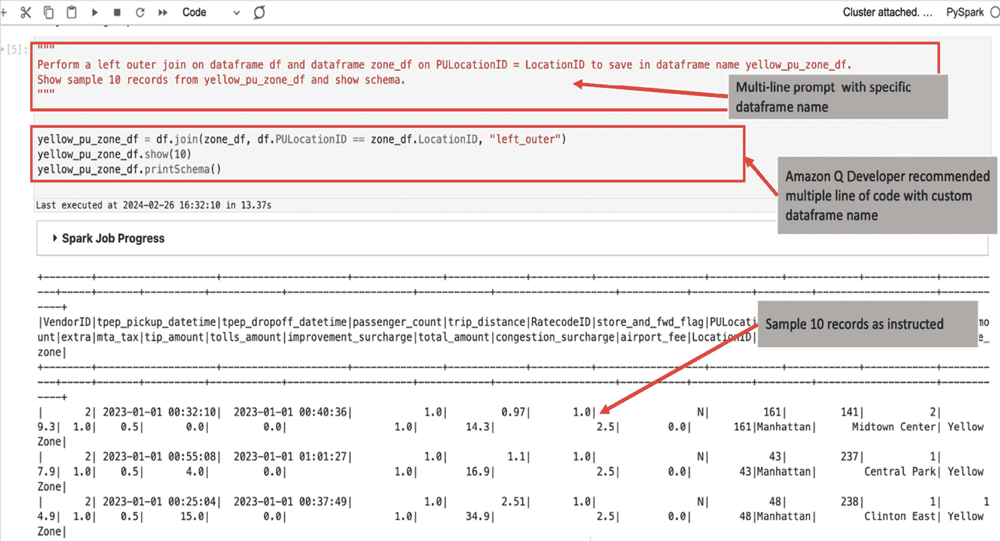

图 14.24 – 左外连接 df 和 dataframe zone_df – 多行提示

现在，让我们回顾一下代码打印出的 DataFrame 的架构。

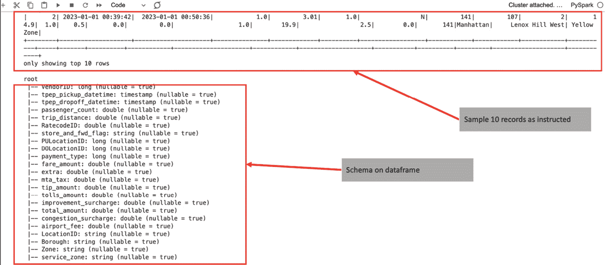

图 14.25 – 左外连接 df 和 dataframe zone_df – 显示架构

观察到，正如多行提示中所述，Amazon Q Developer 理解了上下文，并自动生成了无错误的代码，这些代码与我们提供的有关名为`yellow_pu_zone_df`的 DataFrame 的精确规格完全一致。您可以直接从笔记本中执行每个单元格/代码。

### 需求 5

将上述数据集保存为 CSV 文件，存放在之前 Amazon S3 桶中的新文件夹`glue_notebook_yellow_pick_up_zone_output`中。

由于这个需求很简单，可以封装在单个句子中，我们将使用单行提示来生成代码，并且我们还将包括一个标题以方便验证：

```py
Prompt:
# Save dataframe yellow_pu_zone_df as CSV file at location s3://<your-bucket-name-here>/tlc-dataset-ny-taxi/glue_notebook_yellow_pick_up_zone_output/ with header information
```

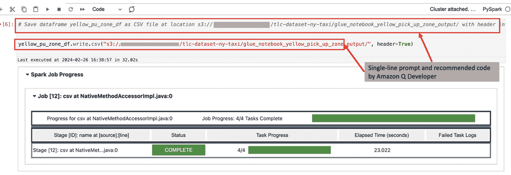

图 14.26 – 保存包含丰富接车位置数据的 CSV 文件

### 需求 6

为了验证，从`glue_notebook_yellow_pick_up_zone_output`文件夹下载并检查文件。

让我们去 Amazon S3 控制台验证文件。选择其中一个文件，然后点击**下载**。


图 14.27 – 验证最终结果集 – Amazon Q Developer 与 Amazon EMR Studio

下载后，您可以使用文本编辑器来查看文件内容。

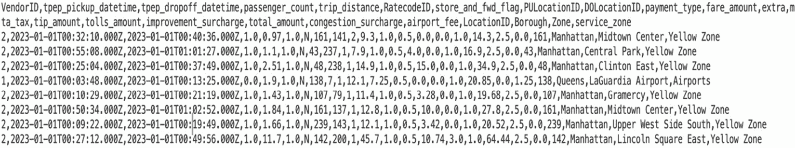

图 14.28 – 验证 Amazon Q Developer 与 Amazon EMR Studio 的 CSV 文件内容

观察到 CSV 文件有基于接车位置 ID 的额外区域信息列。

### 摘要 – Amazon Q Developer 与 Amazon EMR Studio

如所示，我们只需提供具有特定要求的提示，就可以自动生成端到端、无错误且可执行的代码。Amazon Q 开发者，与 Amazon EMR Studio 笔记本集成，理解上下文并自动生成可以直接从笔记本运行的 PySpark 代码。这对许多数据工程师来说是一个重大进步，使他们免于担心与 PySpark 库、方法和语法相关的技术复杂性。

挑战思考

要满足 *要求 6*，如果您感兴趣，尝试利用相同的 EMR Studio 笔记本读取 CSV 文件、显示样本记录并添加标题。

**提示**：使用多行提示技术，类似于我们在读取 Zone Lookup 文件时使用的技术。

在下一节中，我们将考虑应用程序开发人员的角色，以探索 AWS Lambda 与代码辅助的集成。

# AWS Lambda 与代码辅助的集成

在我们深入探讨 AWS Lambda 服务代码辅助支持之前，让我们快速了解一下 AWS Lambda 的概述。**AWS Lambda** 是一种无服务器计算服务，允许用户在不配置或管理服务器的情况下运行代码。使用 Lambda，您可以从 Lambda 控制台上传您的代码或使用可用的编辑器。在代码运行期间，根据提供的配置，服务会自动处理执行所需的计算资源。它旨在高度可扩展、成本效益高，且适用于事件驱动型应用。

AWS Lambda 支持多种编程语言，包括 Node.js、Python、Java、Go 和 .NET Core，允许您选择最适合您应用程序的语言。Lambda 可以轻松集成到其他 AWS 服务中，使您能够构建复杂且可扩展的架构。它与 Amazon S3、DynamoDB 和 API Gateway 等服务无缝协作。

AWS Lambda 控制台与 Amazon Q 开发者集成，使开发者能够轻松获得编码辅助/建议。

## AWS Lambda 的用例

让我们从转换文件格式的一个简单且广泛使用的用例开始。

**文件格式转换**：在典型场景中，一旦从外部团队和/或来源收到文件，它可能不在目标位置，也不具有应用程序期望的所需名称。在这种情况下，可以使用 AWS Lambda 快速将文件从源位置复制到目标位置，并在目标位置重命名文件。

为了说明这个用例，让我们将 NY Taxi Zone 查找文件从源位置 (`s3://<your-bucket-name>/zone_lookup/`) 复制到目标位置 (`s3://<your-bucket-name>/source_lookup_file/`)。同时，从文件名中删除特殊字符 (`+`)，将其保存为 `taxi_zone_lookup.csv`。

为了满足这一要求，应用程序开发者必须开发一个 Python 脚本。此脚本应将区域查找文件从源位置复制并重命名到目标位置。

作为代码开发者/数据工程师，您需要将前面的业务目标转换为解决方案蓝图。

## 解决方案蓝图

1.  编写一个 Python 脚本来处理技术需求。

1.  将 `taxi+_zone_lookup.csv` 文件从 S3 复制到 `zone_lookup` 文件夹，然后到 `source_lookup_file` 文件夹。

1.  在复制过程中，将目标 `source_lookup_file` 文件夹中的 `taxi+_zone_lookup.csv` 改为 `taxi_zone_lookup.csv`。

1.  为了验证，检查 `source_lookup_file/taxi_zone_lookup.csv` 文件的内容。

既然我们已经定义了用例，让我们逐步分析其解决方案。

## 数据准备

我们正在使用本章在“*与 AWS Glue 集成的代码辅助*”部分中配置的相同查找文件。请参阅“*AWS Glue 用例*”部分，该部分涵盖了与数据准备相关的详细信息。

## 解决方案 – Amazon Q 开发者与 AWS Lambda

让我们先启用 AWS Lambda 控制台中的 Amazon Q 开发者。为了启用 AWS Lambda 与 Amazon Q 开发者的集成，我们需要更新 IAM 策略。

### 启用 Amazon Q 开发者与 AWS Lambda 的先决条件

开发者需要修改与 IAM 用户或角色关联的 IAM 策略，以授予 Amazon Q 开发者通过 AWS Lambda 控制台发起推荐的权限。请参考*第二章*以获取有关在 AWS Lambda 中与 Amazon Q 开发者进行交互的更多详细信息。

要让 Amazon Q 开发者开始代码建议，请确保选择**工具** | **Amazon CodeWhisperer 代码建议**。

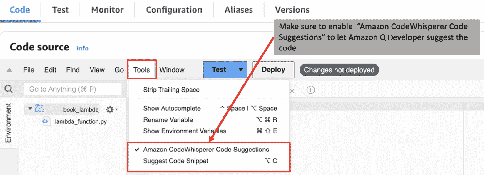

图 14.29 – AWS Lambda 控制台中的 Amazon Q 开发者用于 Python 运行时

为了满足提到的要求，我们将使用在第 *第三章* 中讨论的自动代码生成技术。主要，我们将关注多行提示自动代码生成。让我们使用 Amazon Q 开发者来自动生成一个端到端脚本，该脚本可以在 AWS Lambda 控制台和 EMR Studio 中实现以下要求。以下是解决方案的逐步解决方案概述。

### 需求 1

您需要编写一个 Python 脚本来处理技术需求。

一旦打开 AWS Lambda 控制台，使用启动器选择一个 Python 运行时。

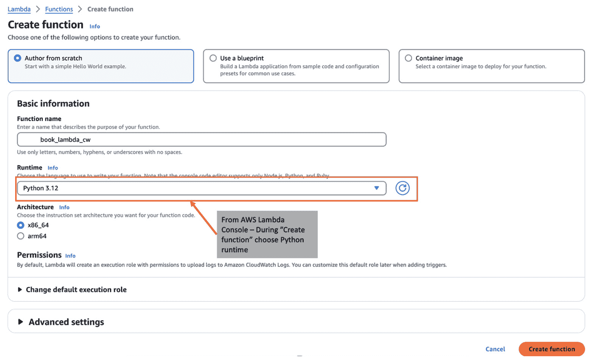

图 14.30 – 从 AWS Lambda 创建 Python 运行时

一旦成功创建 Lambda 函数，您会注意到 AWS Lambda 创建了一个包含一些示例代码的 `lambda_function.py` 文件。对于这个练习，我们可以安全地删除示例代码，因为我们将会使用 Amazon Q 开发者来生成端到端代码。

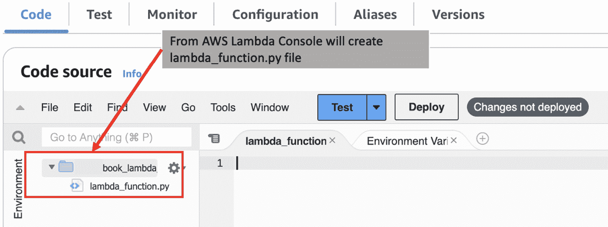

图 14.31 – AWS Lambda 控制台与 Python 运行时的 Amazon Q 开发者

让我们将 *要求 2* 和 *3* 结合起来，因为我们计划使用多行提示。

### 要求 2 和 3

将 `taxi+_zone_lookup.csv` 文件从 S3 复制到 `source_lookup_file` 文件夹中的 `zone_lookup` 文件夹。

在复制过程中，将目标 `source_lookup_file` 文件夹中的文件名从 `taxi+_zone_lookup.csv` 更改为 `taxi_zone_lookup.csv`。

让我们使用多行提示来自动生成代码：

```py
Prompt:
"""
write a lambda function.
copy s3://<your-bucket-name>/zone_lookup/taxi+_zone_lookup.csv
as s3://<your-bucket-name>/source_lookup_file/taxi_zone_lookup.csv
"""
```

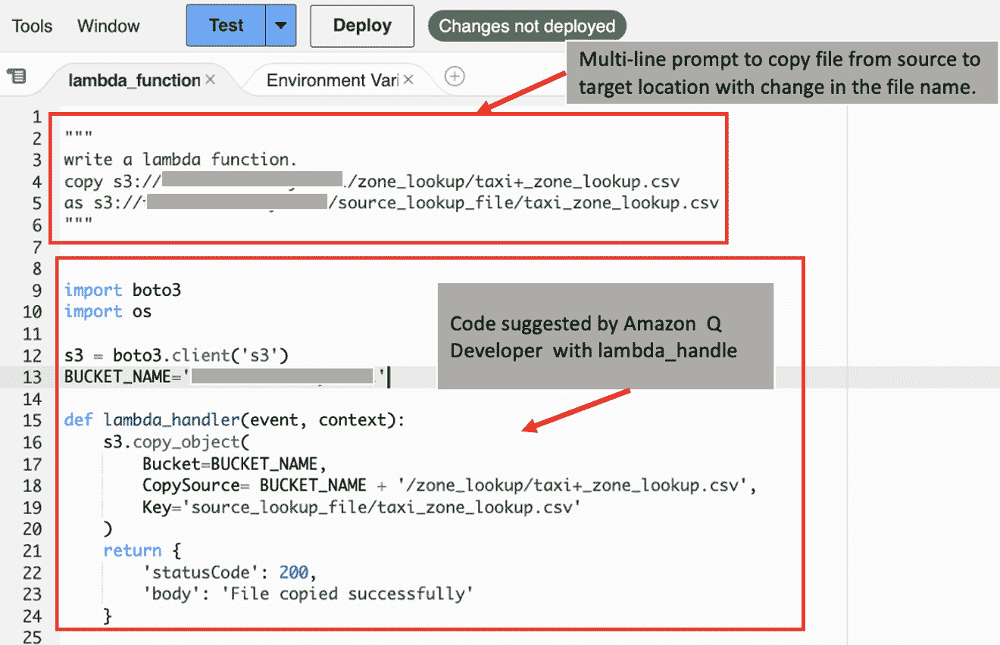

图 14.32 – Amazon Q 开发者为 AWS Lambda 控制台生成的代码

观察到 Amazon Q 开发者创建了一个 `lambda_handler` 函数，并添加了 `返回代码 200` 和成功消息。

### 要求 4

为了验证，请检查 `source_lookup_file/taxi_zone_lookup.csv` 文件的内容。

让我们部署并使用测试事件来运行 Amazon Q 开发者生成的 Lambda 代码。

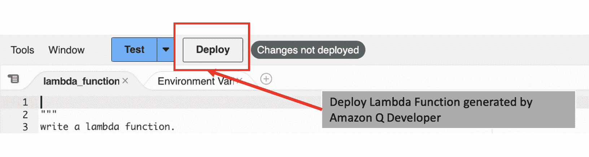

图 14.33 – 部署 AWS Lambda 代码

现在，让我们通过转到 **测试** 选项卡并点击 **测试** 按钮来测试代码。由于我们没有向此 Lambda 函数传递任何值，因此 **测试** 选项卡中的 JSON 事件值在我们的情况下并不重要。

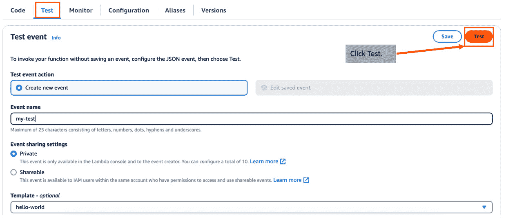

图 14.34 – 测试 AWS Lambda 代码

一旦 Lambda 代码成功执行，它将为您提供执行详情。观察代码执行成功，并显示带有成功消息的返回代码。

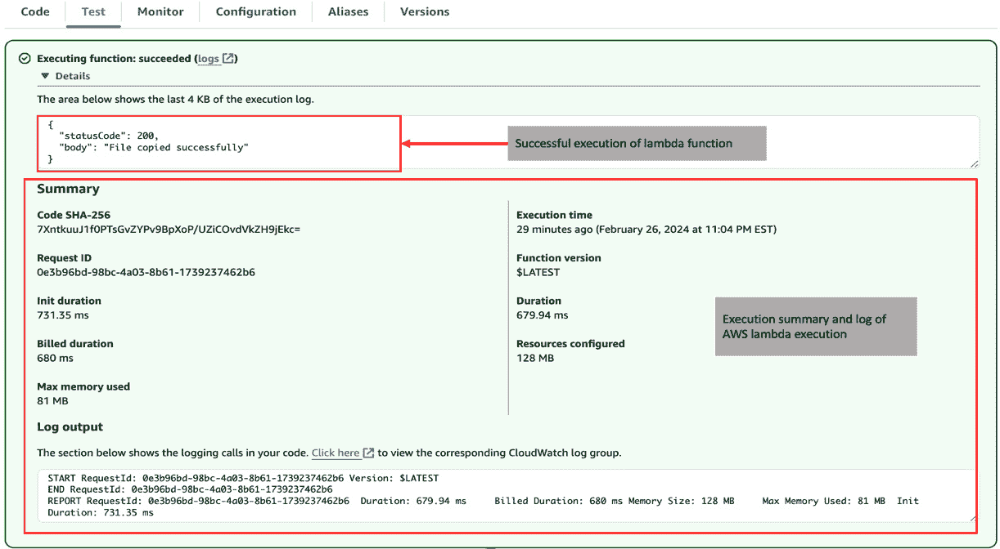

图 14.35 – AWS Lambda 代码执行

让我们使用 Amazon S3 控制台下载并验证 `s3://<your-bucket-name>/source_lookup_file/taxi_zone_lookup.csv`。

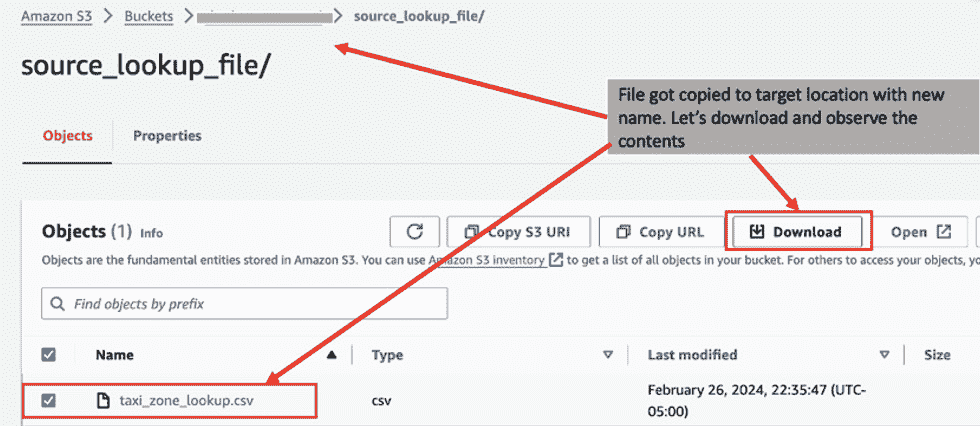

图 14.36 – 来自 Amazon S3 的目标查找文件

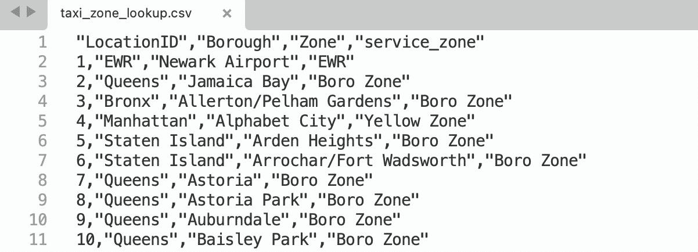

图 14.37 – 区域查找文件

### 摘要 – Amazon Q 开发者与 AWS Lambda

如上图所示，我们只需提供具有特定要求的提示，就可以自动生成端到端、无错误且可执行的代码。Amazon Q 开发者，与 AWS Lambda 集成，根据所选的 Lambda 运行时环境自动生成基于返回代码的 `lambda_handle()` 函数。这种集成可以帮助那些编码经验相对有限的开发者自动生成 Lambda 函数，且代码更改最小或无更改。

继续以应用程序开发者的身份，接下来，我们将探索数据科学家角色，以研究代码辅助与 Amazon SageMaker 的集成。

# 与 Amazon SageMaker 的代码辅助集成

在我们开始深入研究 Amazon SageMaker 服务的代码辅助支持之前，让我们快速浏览一下 Amazon SageMaker 的概述。**Amazon SageMaker**是一个完全托管的服务，简化了在规模上构建、训练和部署机器学习模型的过程。它旨在使开发人员和数据科学家更容易构建、训练和部署机器学习模型，而无需在机器学习或深度学习方面具有广泛的专长。它具有多个功能，如端到端工作流程、内置算法、自定义模型训练、自动模型调优、真实数据、边缘管理器、增强人工智能和托管笔记本等，仅举几例。Amazon SageMaker 与其他 AWS 服务集成，例如 Amazon S3 用于数据存储、AWS Lambda 用于无服务器推理和 Amazon CloudWatch 用于监控。

Amazon SageMaker Studio 托管托管笔记本，这些笔记本与 Amazon Q Developer 集成。

## Amazon SageMaker 的应用场景

让我们使用一个与客户流失预测相关的非常常见的商业用例，数据科学家使用 XGBoost 算法。

**客户流失预测**在商业中涉及利用数据和算法来预测哪些客户有风险停止使用产品或服务。术语“流失”通常表示客户结束订阅、停止购买或停止服务使用。客户流失预测的主要目标是识别这些客户在流失之前，使企业能够实施主动措施以保留客户。

我们将使用公开可用的直接营销银行数据来展示 Amazon Q Developer 对数据收集、特征工程、模型训练和模型部署等里程碑步骤的支持。

通常，数据科学家需要编写一个复杂的脚本，从 Amazon SageMaker Studio 笔记本中执行所有上述里程碑步骤。

## 解决方案蓝图

1.  设置一个包含所需库集合的环境。

1.  **数据收集**：从[`sagemaker-sample-data-us-west-2.s3-us-west-2.amazonaws.com/autopilot/direct_marketing/bank-additional.zip`](https://sagemaker-sample-data-us-west-2.s3-us-west-2.amazonaws.com/autopilot/direct_marketing/bank-additional.zip)下载并解压缩直接营销银行数据。

1.  **特征工程**：为了展示功能，我们将执行以下常用的特征工程步骤：

    +   使用默认值操纵列数据

    +   删除额外列

    +   执行独热编码

1.  **模型训练**：让我们使用 XGBoost 算法：

    +   重新排列数据以创建训练、验证和测试数据集/文件

    +   使用 XGBoost 算法使用训练数据集训练模型

1.  **模型部署**：将模型作为端点部署以允许推理。

在前面的解决方案蓝图示例中，我们展示了通过处理常用里程碑步骤来集成 Amazon Q 开发者与 Amazon SageMaker。然而，根据您数据和企业需求的不同复杂度，可能需要额外的步骤。

## 数据准备

我们将利用公开托管在 AWS 上的直接营销银行数据集。完整数据集可在 [`sagemaker-sample-data-us-west-2.s3-us-west-2.amazonaws.com/autopilot/direct_marketing/bank-additional.zip`](https://sagemaker-sample-data-us-west-2.s3-us-west-2.amazonaws.com/autopilot/direct_marketing/bank-additional.zip) 获取。所有数据准备步骤都将作为数据收集要求的一部分在 SageMaker Studio 笔记本中执行。

## 解决方案 – Amazon Q 与 Amazon SageMaker Studio

首先，让我们启用 Amazon Q 开发者与 Amazon SageMaker Studio。以下先决条件是必需的，以便允许 Amazon Q 开发者在 Amazon SageMaker Studio 内自动生成代码。

### 启用 Amazon Q 开发者与 Amazon SageMaker Studio 的先决条件

开发者需要修改与 IAM 用户或角色关联的 IAM 策略，以授予 Amazon Q 开发者在 Amazon SageMaker Studio 笔记本中启动推荐的权限。请参阅 *第二章* 了解启用 Amazon Q 开发者与 Amazon SageMaker Studio 笔记本的详细信息。

一旦 Amazon Q 开发者为 Amazon SageMaker Studio 笔记本激活，从 **启动器**中选择 **创建笔记本**以验证 Amazon Q 开发者是否已启用。

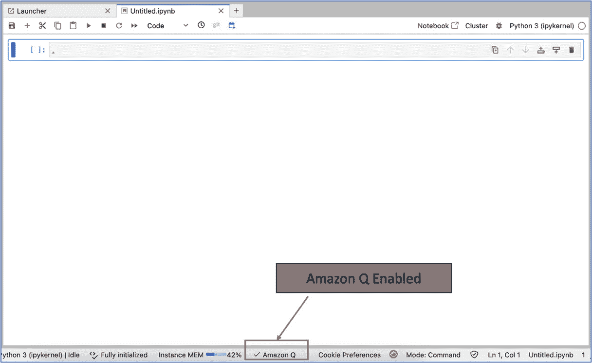

图 14.38 – SageMaker Studio 中启用了 Amazon Q 开发者的笔记本

为了满足上述要求，我们将使用在第 *第四章* 中讨论的自动代码生成技术。主要，我们将关注单行提示、多行提示和思维链提示，以实现自动代码生成技术。

### 要求 1

设置包含所需库的环境。

让我们使用单行提示：

```py
Prompt 1:
# Fetch this data by importing the SageMaker library
Prompt 2:
# Defining global variables BUCKET and ROLE that point to the bucket associated with the Domain and it's execution role
```

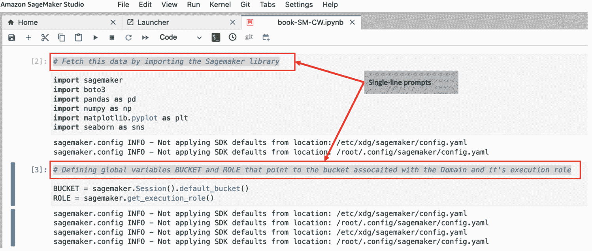

图 14.39 – Amazon Q 开发者 – SageMaker Studio 设置环境

注意，根据我们的提示，Amazon Q 开发者生成了带有默认库和变量的代码。然而，根据您的需求和账户设置，您可能需要更新/添加代码。

### 要求 2

对于数据收集，从 [`sagemaker-sample-data-us-west-2.s3-us-west-2.amazonaws.com/autopilot/direct_marketing/bank-additional.zip`](https://sagemaker-sample-data-us-west-2.s3-us-west-2.amazonaws.com/autopilot/direct_marketing/bank-additional.zip) 下载并解压直接营销银行数据。

我们将专注于多行提示来实现这一要求：

```py
Prompt:
'''Using the requests library download the ZIP file from
the url "https://sagemaker-sample-data-us-west-2.s3-us-west-2.amazonaws.com/autopilot/direct_marketing/bank-additional.zip"
and save it to current directory and unzip the archive
'''
```

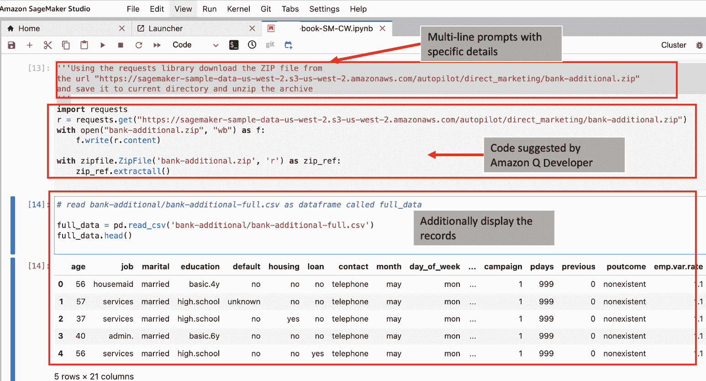

图 14.40 –亚马逊 Q 开发者 – SageMaker Studio 数据收集

### 要求 3

为了展示特征工程的功能，我们将执行以下常用的特征工程步骤，这将帮助我们提高模型精度：

1.  使用默认值操纵列数据。

1.  删除额外列。

1.  执行独热编码。

我们将专注于多行提示来实现这一要求：

```py
Prompt #1:
'''
Create a new dataframe with column no_previous_contact and populates from existing dataframe column pdays using numpy when the condition equals to 999, 1, 0 and show the table
'''
Prompt # 2:
# do one hot encoding for full_data
Prompt # 3:
'''
Drop the columns 'duration', emp.var.rate', 'cons.price.idx', 'cons.conf.idx', 'euribor3m' and 'nr.employed'
from the dataframe and create a new dataframe with name model_data
'''
```

我们得到以下屏幕。

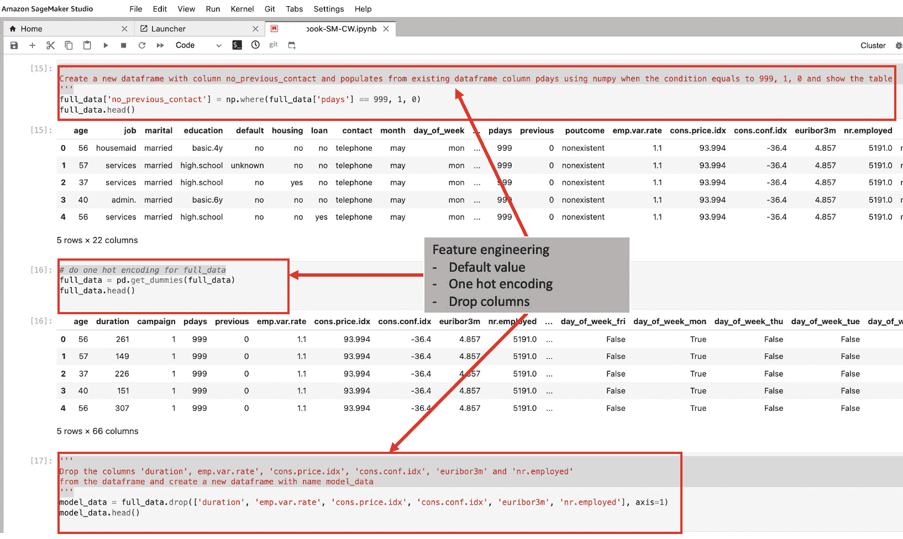

图 14.41 –亚马逊 Q 开发者 – SageMaker Studio 特征工程

现在，让我们继续使用生成的代码进行模型训练、测试和验证：

```py
Prompt # 4:
#split model_data for train, validation, and test
Prompt # 5:
'''
for train_data move y_yes as first column.
Drop y_no and y_yes columns from train_data.
save file as train.csv
'''
Prompt # 6:
'''
for validation_data move y_yes as first column.
Drop y_no and y_yes columns from validation_data.
save file as validation.csv
'''
```

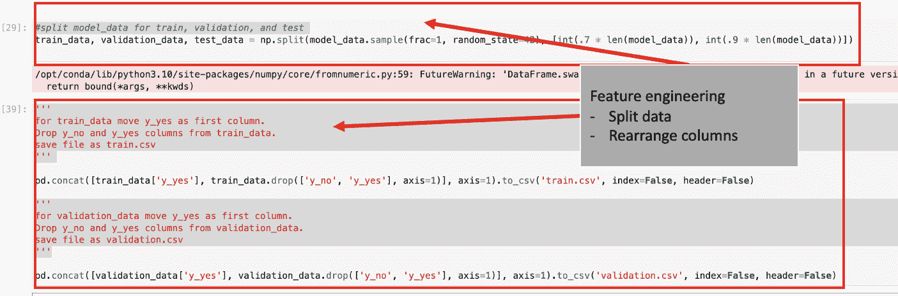

图 14.42 –亚马逊 Q 开发者 – SageMaker Studio 特征工程

注意，对于单行和多行提示，我们需要提供更多具体的细节来生成预期的代码。

### 要求 4

**模型训练**：让我们使用 XGBoost 算法：

+   重新排列数据以创建训练、验证和测试数据集/文件

+   使用 XGBOOST 算法使用训练数据集训练模型

我们将专注于多行提示来实现这一要求，以启动模型训练活动：

```py
Prompt #1:
''' upload train.csv to S3 Bucket train/train.csv prefix.
upload validation.csv to S3 Bucket validation/validation.csv prefix '''
Prompt #2:
# pull latest xgboost model as a CONTAINER
Prompt #3:
# create TrainingInput from s3 train/train.csv and validation/validation.csv
Prompt #3:
# create training job with hyper paramers max_depth=5, eta=0.2, gamma=4, min_child_weight=6, subsample=0.8, objective='binary:logistic', num_round=100
```

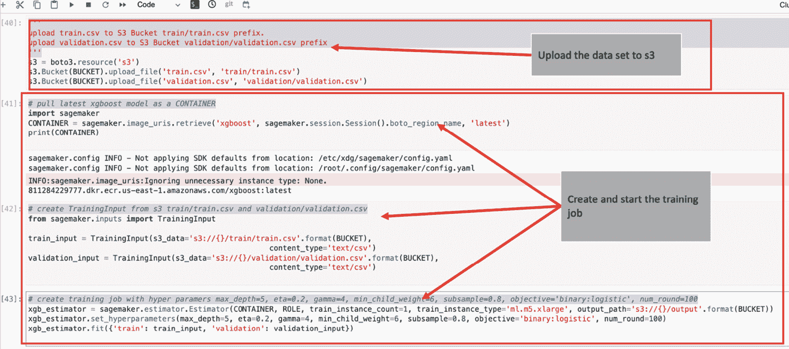

图 14.43 –亚马逊 Q 开发者 – SageMaker Studio 模型训练

### 要求 5

将模型部署为端点以允许推理。

我们将专注于单行提示来实现这一要求：

```py
Prompt #1:
# Deploy a model that's hosted behind a real-time endpoint
```

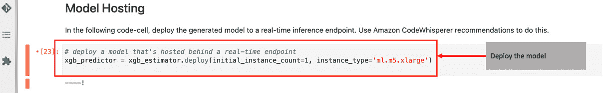

图 14.44 –亚马逊 Q 开发者 -SageMaker studio 模型训练

注意到亚马逊 Q 开发者使用默认配置的`instance_type`和`initial_instance_count`。您可以通过点击亚马逊 SageMaker 控制台中的**推理**下拉菜单并选择**端点**选项来检查托管模型。

在前面的示例中，我们广泛使用了单行提示、多行提示和思维链提示技术。如果您想使用聊天式界面，可以利用以下截图所示的亚马逊 Q 开发者聊天式界面。

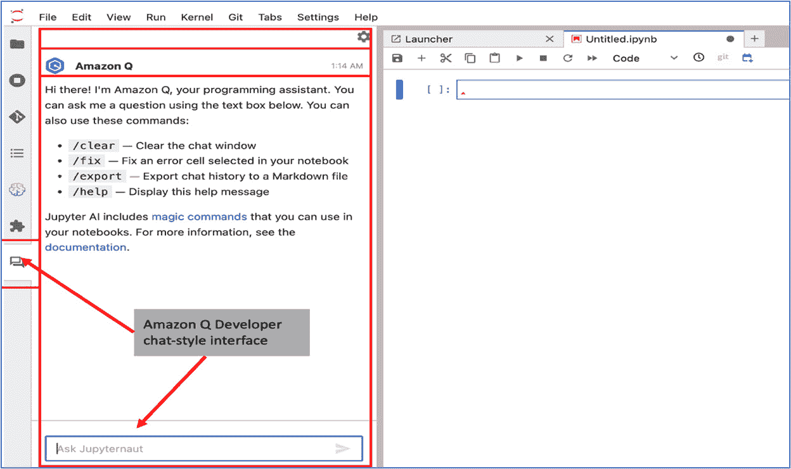

图 14.45 –亚马逊 Q 开发者 -SageMaker studio 聊天式界面

### 摘要 – 亚马逊 Q 开发者与亚马逊 SageMaker

如所示，亚马逊 Q 开发者与亚马逊 SageMaker Studio 笔记本 IDE 无缝集成，能够自动生成端到端、无错误且可执行的代码。通过提供具有特定要求的提示，Q 开发者可以在 SageMaker Studio 笔记本中自动生成代码，包括数据收集、特征工程、模型训练和模型部署等关键里程碑步骤。

虽然数据科学家可以利用此集成来生成代码块，但可能需要进行定制。必须在提示中提供特定细节以调整代码。在某些情况下，可能需要调整以符合企业标准、业务需求和配置。用户应具备提示工程的专业知识、熟悉脚本编写，并在部署到生产之前进行彻底测试，以确保脚本满足业务需求。

现在，让我们深入探讨数据分析师如何在处理 Amazon Redshift 时使用代码辅助。

# 与 Amazon Redshift 的代码辅助集成

在我们深入探讨 Amazon Redshift 服务的代码辅助支持之前，让我们快速浏览一下 AWS Redshift 的概述。**Amazon Redshift**是一个由人工智能驱动的、完全托管、基于云的数据仓库服务。它旨在使用标准 SQL 查询进行高性能分析和处理大量数据集。

Amazon Redshift 针对数据仓库进行了优化，提供了一种快速且可扩展的解决方案，用于处理和分析大量结构化数据。它使用列式存储和**大规模并行处理**（**MPP**）架构，将数据和查询分布在多个节点上，以提供复杂查询的高性能。这种架构允许它轻松地从几百吉字节扩展到拍字节的数据，使组织能够随着需求的变化扩展其数据仓库。它集成了各种数据源，允许您从多个来源加载数据，包括 Amazon S3、Amazon DynamoDB 和 Amazon EMR。

注意

为了查询数据，Amazon Redshift 还提供了一个查询编辑器。Redshift 查询编辑器 v2 有两种与数据库交互的模式：**编辑器**和**笔记本**。代码辅助集成在 Redshift 查询编辑器 v2 的笔记本模式下。

## Amazon Redshift 的用例

让我们从转换文件格式的一个简单且广泛使用的用例开始。

**识别顶尖表现者**：在典型的业务用例中，分析师对根据某些标准识别顶尖表现者感兴趣。

为了说明这个用例，我们将使用公开可用的`tickit`数据库，该数据库与 Amazon Redshift 一起提供。有关`tickit`数据库的更多信息，请参阅本章末尾的*参考文献*部分。

分析师希望识别大多数场馆所在的最顶级州。

为了满足这一需求，分析师开发者必须开发 SQL 查询来与`tickit`数据库中的不同表进行交互。

## 解决方案蓝图

由于我们正在考虑数据分析师的角色并使用代码辅助来生成代码，我们不需要进一步将业务需求分解为解决方案蓝图。这使得分析师能够与数据库交互，而无需涉及表结构和关系细节：

+   编写 SQL 语句以识别大多数场馆所在的顶级州

## 数据准备

我们将使用公开可用的 `tickit` 数据库，该数据库随 Amazon Redshift 一起提供。让我们使用 Redshift 查询编辑器 v2 导入数据：

1.  从 Redshift 查询编辑器 2 连接到您的 Amazon Redshift 集群或无服务器端点。

1.  然后，选择 `sample_data_dev` 并点击 `tickit`。

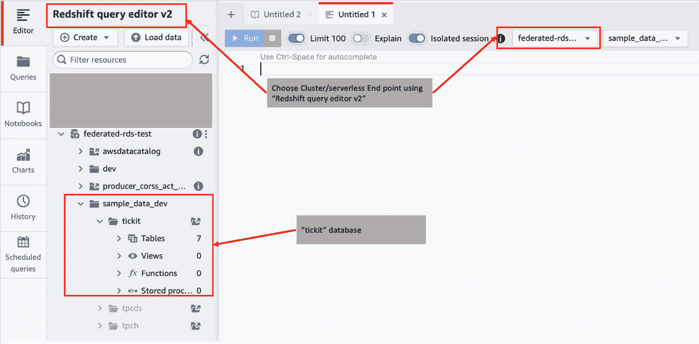

图 14.46 – 使用 Amazon Redshift 导入 tickit 数据库

## 解决方案 – Amazon Q 与 Amazon Redshift

首先，让我们启用 Amazon Q 与 Amazon Redshift。为了允许 Amazon Q 在 Amazon Redshift 内生成 SQL，管理员需要在 Redshift 查询编辑器 v2 的 **笔记本** 中启用 **生成 SQL** 选项。请参考 *第三章* 获取有关在 Amazon Redshift 中启动与 Amazon Q 交互的更多详细信息。

### 启用 Amazon Q 与 Amazon Redshift 的先决条件

让我们了解启用 Redshift 查询编辑器 v2 中 **笔记本** 内的 **生成 SQL** 选项所需的步骤。

1.  使用管理员权限登录以连接到您的 Amazon Redshift 集群或无服务器端点。

1.  选择 **笔记本**。

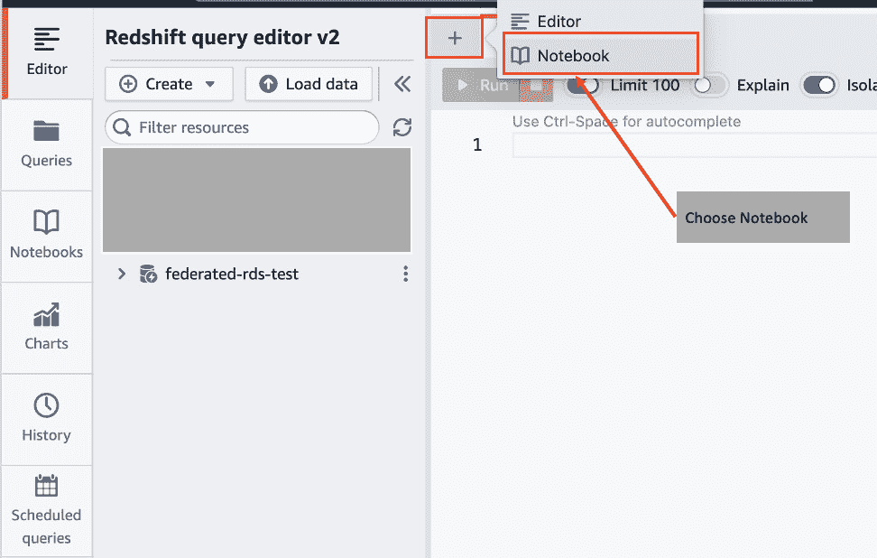

图 14.47 – 使用 Redshift 查询编辑器 v2 的笔记本

1.  选择 **生成 SQL**，然后勾选 **生成 SQL** 复选框，并点击 **保存**。

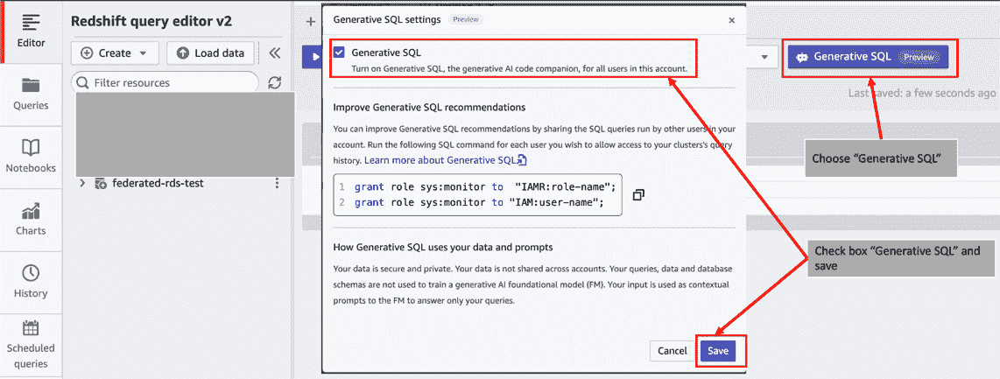

图 14.48 – 使用 Redshift 查询编辑器 v2 启用生成 SQL

为了满足上述要求，我们将使用在第 *第四章* 中讨论的自动代码生成技术。主要，我们将关注自动代码生成的聊天伴侣。

### 要求 1

编写 SQL 语句以识别大多数场馆所在的顶级州。

使用 Amazon Q 的交互会话提出以下问题：

```py
Q:Which state has most venues?
```

注意，我们没有向 Amazon Q 开发者提供数据库详细信息，但它仍然能够识别所需的表，`tickit.venue`。它生成了包含 `Group by`、`Order by` 和 `Limit` 的完整可执行端到端查询以满足要求。为了使分析师更容易运行查询，代码辅助已集成到笔记本中。只需点击 **添加到笔记本**，SQL 代码就会在用户可以直接运行的笔记本单元格中可用。

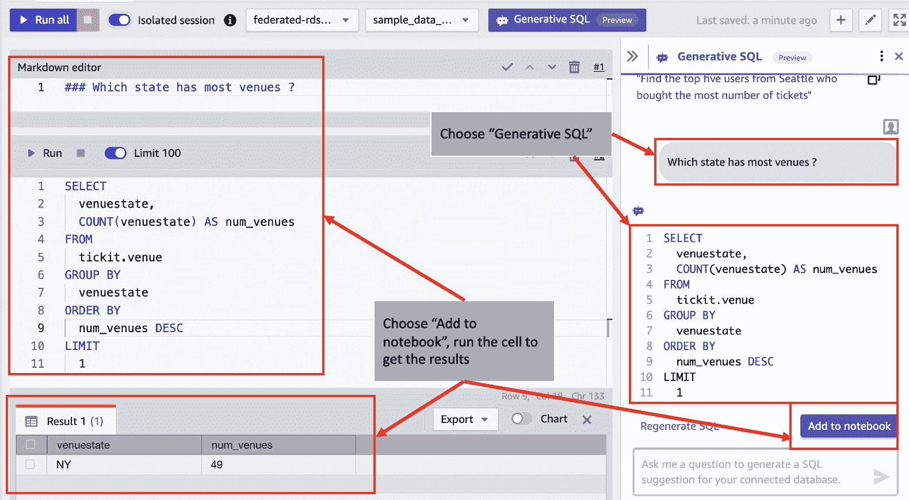

图 14.49 – 使用 Amazon Redshift 代码辅助进行交互

### 摘要 – Amazon Q 与 Amazon Redshift

如演示所示，我们可以通过聊天式界面与 Amazon Q 交互，轻松生成端到端、无错误且可执行的 SQL。Amazon Q 与 Amazon Redshift 查询编辑器 v2 中的笔记本无缝集成。用户无需向代码助手提供数据库和/或表详情。它自动识别必要的表并生成满足提示中指定要求的 SQL 代码。此外，为了方便分析师运行查询，它直接集成到笔记本中。Amazon Q 与 Amazon Redshift 结合，证明是数据分析师的有价值资产。在许多情况下，数据分析师无需将业务需求转换为技术步骤。他们可以利用自动生成 SQL 的功能，无需深入了解数据库和表详情。

# 摘要

在本章中，我们最初介绍了不同 AWS 服务与代码伴侣的集成，以帮助用户自动生成代码。然后，我们探讨了 Amazon Q 开发者与一些核心服务的集成，例如 AWS Glue、Amazon EMR、AWS Lambda、Amazon Redshift 和 Amazon SageMaker，这些服务通常被应用开发者、数据工程师和数据科学家使用。

然后，我们在先决条件中讨论了与示例常见用例的深入集成以及各种集成的相应解决方案讲解。

AWS Glue 与 Amazon Q 开发者集成，帮助数据工程师在 AWS Glue Studio 笔记本环境中生成和执行 ETL 脚本。这包括使用 AWS Glue Studio 的一个完整的端到端 Glue ETL 作业的骨架概要。

AWS EMR 与 Amazon Q 开发者集成，帮助数据工程师在 AWS EMR Studio 笔记本环境中生成和执行 ETL 脚本。

AWS Lambda 控制台 IDE 与 Amazon Q 开发者集成，支持应用工程师生成和执行基于 Python 的端到端应用程序，用于文件移动。

Amazon SageMaker Studio 笔记本与 Amazon Q 开发者集成，帮助数据科学家使用不同的提示技术实现数据收集、特征工程、模型训练和模型部署的重大里程碑步骤。

Amazon Redshift 与 Amazon Q 集成，帮助业务分析师通过简单地提供业务需求来生成 SQL 查询。用户无需向代码助手提供数据库和/或表详情。

在下一章中，我们将探讨如何使用 Amazon Q 开发者获取 AWS 特定的指导和推荐，无论是从 AWS 控制台还是从有关架构和最佳实践支持的文档等各个主题的文档中。

# 参考文献

+   AWS 预设指导 - 数据工程：[`docs.aws.amazon.com/prescriptive-guidance/latest/aws-caf-platform-perspective/data-eng.html`](https://docs.aws.amazon.com/prescriptive-guidance/latest/aws-caf-platform-perspective/data-eng.html)

+   Jupyter 内核：[`docs.jupyter.org/en/latest/projects/kernels.html`](https://docs.jupyter.org/en/latest/projects/kernels.html)

+   Amazon Q 开发者与 AWS Glue Studio：[`docs.aws.amazon.com/amazonq/latest/qdeveloper-ug/glue-setup.html`](https://docs.aws.amazon.com/amazonq/latest/qdeveloper-ug/glue-setup.html)

+   TLC 行程记录数据：[`www.nyc.gov/site/tlc/about/tlc-trip-record-data.page`](https://www.nyc.gov/site/tlc/about/tlc-trip-record-data.page)

+   在 AWS Glue 中设置 Amazon Q 数据集成：[`docs.aws.amazon.com/glue/latest/dg/q-setting-up.html`](https://docs.aws.amazon.com/glue/latest/dg/q-setting-up.html)

+   在 Amazon EMR 中设置 Amazon Q 开发者数据集成：[`docs.aws.amazon.com/amazonq/latest/qdeveloper-ug/emr-setup.html`](https://docs.aws.amazon.com/amazonq/latest/qdeveloper-ug/emr-setup.html)

+   将计算资源附加到 EMR Studio 工作区：[`docs.aws.amazon.com/emr/latest/ManagementGuide/emr-studio-create-use-clusters.html`](https://docs.aws.amazon.com/emr/latest/ManagementGuide/emr-studio-create-use-clusters.html)

+   使用 AWS Lambda 与 Amazon Q 开发者：[`docs.aws.amazon.com/amazonq/latest/qdeveloper-ug/lambda-setup.html`](https://docs.aws.amazon.com/amazonq/latest/qdeveloper-ug/lambda-setup.html)

+   与查询编辑器 v2 生成式 SQL 交互：[`docs.aws.amazon.com/redshift/latest/mgmt/query-editor-v2-generative-ai.html`](https://docs.aws.amazon.com/redshift/latest/mgmt/query-editor-v2-generative-ai.html)

+   Amazon Redshift “tickit” 数据库：[`docs.aws.amazon.com/redshift/latest/dg/c_sampledb.html`](https://docs.aws.amazon.com/redshift/latest/dg/c_sampledb.html)

+   直接营销银行数据：[`sagemaker-sample-data-us-west-2.s3-us-west-2.amazonaws.com/autopilot/direct_marketing/bank-additional.zip`](https://sagemaker-sample-data-us-west-2.s3-us-west-2.amazonaws.com/autopilot/direct_marketing/bank-additional.zip)

+   Amazon SageMaker Studio：[`aws.amazon.com/sagemaker/studio/`](https://aws.amazon.com/sagemaker/studio/)
