# 在 AWS 上加速构建解决方案

在本章中，我们将探讨以下关键主题：

+   在 AWS 上构建解决方案的关键步骤

+   在 AWS 上构建过程中的 Amazon Q 功能用例

+   了解 AWS 账户资源

此时，组织正在以快速的速度将 IT 基础设施迁移到云端，AWS 在提供云计算服务以构建其技术堆栈方面是市场领导者。当将现有应用程序迁移到 AWS 或使用许多 AWS 服务原生创建新应用程序时，所有构建者都需要采取某些步骤。构建者是每个组织的关键角色，那些利用 AWS 服务满足其 IT 需求的人使用 AWS 构建者来解决他们的业务用例。

AWS 构建者是一个使用 AWS 设计、开发、部署和管理 AWS 云平台上的应用程序和解决方案的个人。这些人可能是开发者、工程师、架构师、数据科学家或其他与 AWS 服务合作以为其组织或客户构建创新和可扩展解决方案的专业人士。AWS 构建者利用 AWS 提供的广泛工具和服务来创建强大且高效的应用程序，以满足其项目的特定需求和要求。他们负责理解 AWS 服务、实施最佳实践，并不断改进他们的技能，以推动项目中的创新和成功。

不可否认，与本地环境相比，云计算加速了 IT 构建过程。然而，大型和复杂的项目在进入生产环境之前仍然需要大量的时间和努力。

让我们快速看一下构建者在 AWS 上构建项目时需要采取的一些关键步骤。

# 在 AWS 上构建解决方案的关键步骤

构建者通常通过以下步骤使用 AWS 服务来解决用例：涉及几个步骤：

1.  **理解需求**：构建者首先需要理解用例的需求，包括要解决的问题、期望的结果以及任何约束或限制。

1.  **选择 AWS 服务**：根据需求，构建者选择最适合用例的 AWS 服务。这可能涉及研究和评估各种 AWS 服务，以确定哪些服务提供所需的功能和能力。

1.  **设计解决方案架构**：构建者设计解决方案的架构，包括整体系统设计、数据流、集成点和可扩展性考虑。这涉及到创建图表，例如架构图或数据流图，以可视化解决方案。

1.  **设置 AWS 资源**：构建者配置必要的 AWS 资源以实现解决方案。这可能包括设置计算实例（例如，EC2）、存储（例如，S3）、数据库（例如，RDS）、网络（例如，VPC）和其他所需服务。

1.  **开发应用程序代码**：构建者开发实现解决方案所需的应用程序代码或脚本。这可能涉及使用 Python、Java 或 Node.js 等编程语言编写代码，以及为**基础设施即代码**（**IaC**）工具（如 AWS CloudFormation 或 AWS **云开发** **套件**（**CDK**））创建配置文件或脚本。

1.  **测试和调试**：构建者测试解决方案以确保其按预期工作并满足要求。这包括单元测试、集成测试和端到端测试，以验证解决方案的功能和性能。构建者还会调试测试过程中出现的任何问题或错误。

1.  **部署和推广**：一旦测试完成，构建者将解决方案部署到生产环境。这可能涉及将应用程序代码部署到计算实例，配置负载均衡器和自动扩展组，以及配置 DNS 设置。构建者会仔细规划和执行部署，以最小化停机时间和对用户的影响。

1.  **监控和优化**：部署后，构建者监控解决方案以确保其继续平稳运行并满足性能目标。这涉及使用 AWS CloudWatch 和其他监控工具监控指标、日志和警报。构建者根据需要优化解决方案以降低成本、提高性能和可扩展性。

1.  **文档和知识共享**：构建者记录解决方案架构、配置和部署过程，以促进知识共享和未来的维护。这些文档有助于其他团队成员了解解决方案的工作原理以及如何解决可能出现的问题。

如您所见，使用许多 AWS 专用服务构建特定用例的解决方案涉及许多步骤。每个步骤都提出了自己的挑战，每位构建者都有自己通过这些步骤的方法。关键点是，构建复杂解决方案通常需要时间，其中很大一部分时间用于研究。这项研究可能包括研究之前解决的类似用例，权衡特定 AWS 服务的利弊，探索设计模式和其实施，以及很可能在构建过程中遇到的问题和错误的调试。

让我们直接探讨如何使用 Amazon Q 加速在 AWS 上构建解决方案的过程，Amazon Q 专注于构建者经常花费大量时间的领域——研究。

# 在 AWS 构建过程中的构建阶段利用 Amazon Q 功能的用例

为了更好地了解 Amazon Q 如何帮助加速在 AWS 上的构建过程，我们将介绍一个用例，然后通过解决它的步骤。在这个过程中，我们将突出 Amazon Q 的许多功能，这些功能可以减少构建者本应花费的时间。

请记住，为了简单起见，我们在这里展示的是一个可以用许多不同方式解决的简单用例。然而，一旦你通过了用例的流程，它将帮助你理解 Amazon Q 在构建使用 AWS 服务解决方案时的各种功能。这些功能可以应用于 AWS 构建者在他们的组织中可能遇到的任何其他复杂用例。关键是要理解这些功能如何节省时间并提高生产力，最终增强 AWS 构建者的体验。跟我重复一遍——没有 AWS 构建者应该不高兴。让我们直接进入用例。

一家公司希望构建一个网络应用程序，用户可以上传图像用于各种目的，例如个人资料图片、产品图片或内容插图。为了确保最佳性能和用户体验，该公司旨在实施一个可扩展且高效的图像处理管道，在将这些图像存储到后端存储系统之前对其进行调整大小和优化。

由于 AWS 是他们首选的云服务提供商，该业务希望 IT 团队在短时间内使用 AWS 服务创建一个简单且成本效益高的解决方案。

虽然这里的用例可能很简单，但通常，组织中的 AWS 构建者会从业务那里收到复杂的需求，这些需求需要周密的规划、研究和执行。假设是 AWS 构建者对许多 AWS 服务、其功能和它们如何帮助解决用例有一个大致的了解。然而，并非每个构建者都一样，也不是每个人的专业知识水平都相同。有些人可能是入门级构建者，他们严重依赖资深构建者的研究和指导，而其他人可能知道如何解决用例，但可能不熟悉所有最佳实践和替代设计模式。

重要提醒：基于 LLM 的解决方案并不总是返回相同的结果

LLM 在部署到应用程序中时并不天生产生幂等结果。这有几个原因：

**随机性**：大多数 LLM 在生成输出时都会使用一些随机元素，例如从概率分布中进行采样。这意味着每次调用都会产生略微不同的结果。

**持续学习**：许多部署的 LLM 会继续在新数据上训练，不断更新其参数。模型本质上是在不断变化的，因此结果会演变。

**交互性**：基于 LLM 的对话式 AI 系统会积累上下文和历史，这会影响后续的响应。结果取决于之前的交互。

**外部依赖**：应用程序可能会引入影响 LLM 输出的外部数据。如果这些数据发生变化，输出也会随之变化。

**多模态输入**：对于处理图像、音频等内容的 LLM，除了文本外，这些输入的变化会导致不同的输出。

由于 Amazon Q 也是一个基于 LLM 的服务，因此对于这个用例以及你解决的任何用例，结果可能并不总是返回相同的输出。因此，在将解决方案部署到生产环境中之前，有一个人类参与适当提示并测试验证是很重要的。

希望你没有跳过前面的提醒笔记！现在，让我们直接进入 Amazon Q 如何帮助加速解决这个用例。

## 对话式问答能力

Amazon Q 的对话能力将帮助我们更好地理解用例的初始步骤。你可以向 Amazon Q 提出不同的问题，它会尝试理解你想要做什么。如果你是一个对 AWS 服务有一定了解的 AWS 构建者，并且与解决这个用例相关，你可以从向 Amazon Q 提出一个广泛的问题开始，然后通过提示缩小选项。例如，在以下截图中，我们请求一个解决方案，而没有过多地详细说明它应该在 AWS 上看起来是什么样子。

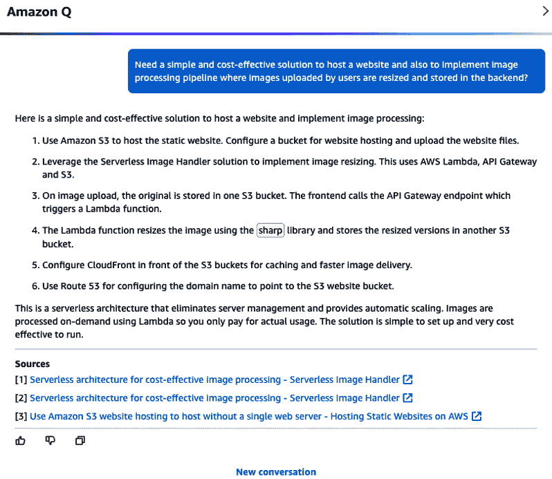

图 15.1 – Amazon Q 对话能力 – 一般问题

由于问题中没有具体的指令，Amazon Q 提供了一个可能的解决方案的一般概述。这就是你可以进一步提示系统缩小可能解决方案的地方。由于用例要求我们构建和托管一个简单的网站，我们提示 Amazon Q 进一步细化其推荐。以下截图显示了此提示和 Q 的响应。

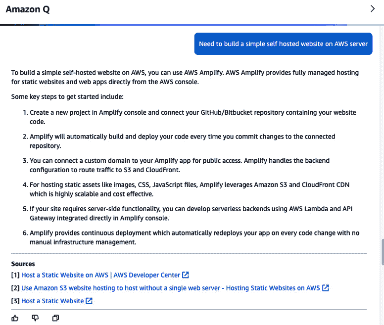

图 15.2 – Amazon Q 对话能力 – 提示 1

Q 理解了提示，并建议使用**AWS Amplify**服务作为托管网站的一种简单方式。正如你通过这个简单的例子所看到的，提示系统是获得针对你试图解决的问题定制的结果的 crucial 步骤。由于用例要求我们构建一个网站，并且它不会只是一个静态网页，以下截图中的提示进一步细化了 Q 的输出。

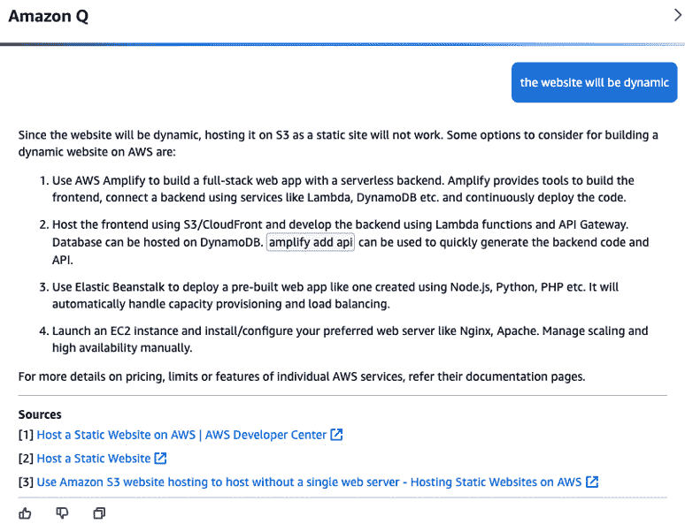

图 15.3 – Amazon Q 对话能力 – 提示 2

你可以继续沿着这个提示路径，直到你收到足够的建议来帮助解决特定的用例。Amazon Q 还提供了信息来源，以便你可以了解更多关于它。

如果您已经有了关于您想用于此用例的 AWS 服务的想法，您可以直接构建您要问 Amazon Q 的第一个问题，包括系统在提出推荐解决方案时应考虑的所有相关因素。例如，在我们的用例中，如果我们知道我们可以将网站托管在 EC2 上，然后使用 S3 作为存储来存储原始和调整大小的图像，那么我们可以一次性提示系统，如下面的截图所示。

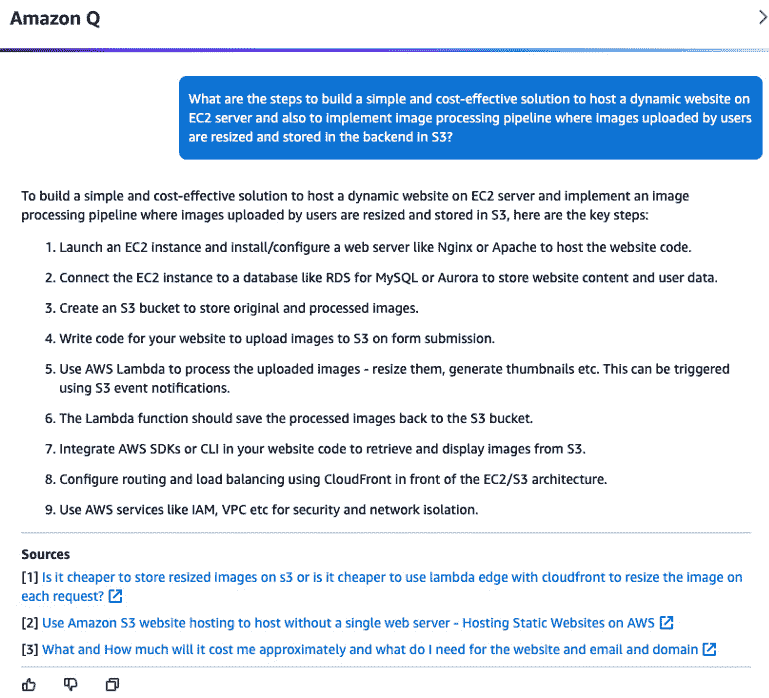

图 15.4 – Amazon Q 对话能力 – 明确的需求

如您从推荐中看到的，Amazon Q 能够提出一个解决方案，使用您想用于解决此用例的一些 AWS 服务。

为了清晰起见，让我们假设在 Amazon Q 的帮助下，我们能够将解决方案的流程确定如下：

1.  用户通过 Web 应用程序界面上传图像。

1.  网络应用程序将上传的图像发送到 Amazon S3 存储桶。

1.  一个 S3 事件通知触发一个 AWS Lambda 函数。

1.  Lambda 函数从 S3 存储桶检索上传的图像并直接启动图像处理。

1.  图像处理任务，如调整大小和压缩，在 Lambda 函数中使用 OpenCV 或 PIL 等库执行。

1.  一旦图像处理完成，Lambda 函数将处理后的图像保存回 S3 存储桶或指定位置。

1.  可选地，处理后的图像的元数据可以存储在数据库或日志系统中，用于监控和分析目的。

1.  处理后的图像现在可以用于在 Web 应用程序或任何其他下游系统中检索和显示。

下面的图示显示了此特定用例的解决方案架构。

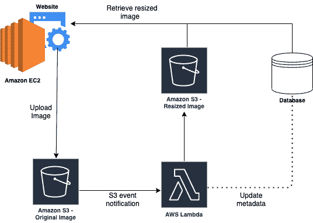

图 15.5 – 图像处理管道 – 解决方案架构

由于我们在这里强调的是 Amazon Q 的功能，这些功能有助于快速构建 AWS 上的解决方案，因此并非所有步骤都会在这里详细说明。此外，您从 Q 收到的响应可能与我们所得到的有所不同，因此我们可能无法在此章节中展示所有逐步说明，以便您构建此用例。这里的目的是向您展示您如何利用 Q 的这些功能来满足自己的用例，并且在整个流程结束时，您将能够根据您所采取的所有步骤（包括设计、开发、构建、测试、调试、部署和文档）来量化 Amazon Q 在整个过程中为您节省了多少时间。

我们现在理解了 Q 的对话功能是如何帮助缩小解决方案的一般流程及其架构的。让我们了解 Amazon Q 的下一个功能：根据用例最优选择正确的 EC2 实例 – 构建者通常需要根据用例来决定，同时考虑每个此类实例的优缺点。

## 选择最优的 Amazon EC2 实例

要托管网站，我们需要启动一个带有 Apache HTTP 服务器的 Amazon EC2 实例。构建者接下来要问的问题是应该选择哪种 EC2 实例？让我们看看 Amazon Q 如何帮助。

当您前往 EC2 控制台启动 EC2 实例时，现在在**实例类型**部分有一个顾问链接。以下截图显示了**获取建议**链接。

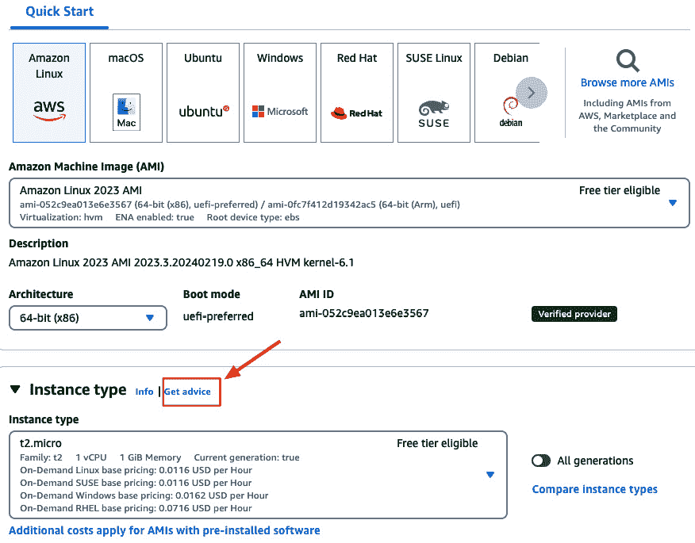

图 15.6 – Amazon Q – EC2 实例选择顾问

对于我们的用例，我们需要一个低成本的 EC2 实例来托管网站。我们将选择适当的使用案例选项，如下面的截图所示。

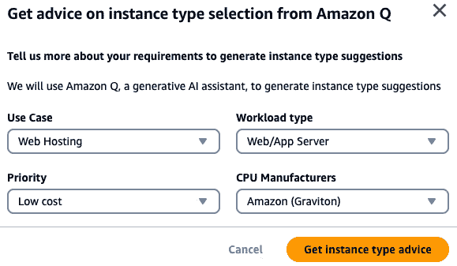

图 15.7 – Amazon Q – EC2 实例选择用于网站托管

根据我们的标准，Q 会响应最优的 EC2 实例，我们可以从这些实例开始我们的用例。Q 只是帮助缩小选择范围；实际的成本/性能基准测试仍需要作为过程的一部分来完成。

以下截图显示了用于网站托管的推荐 EC2 实例，同时保持低成本。

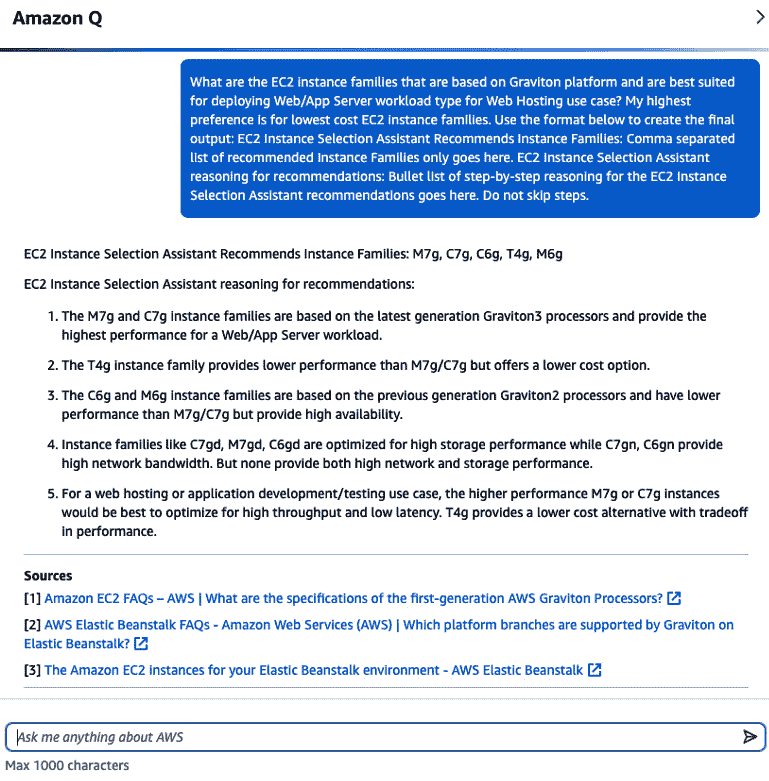

图 15.8 – Amazon Q – EC2 实例类型推荐用于网站托管

在本节中，我们展示了 Amazon Q 如何根据用例选择正确的 EC2 实例类型。在 EC2 实例上启用网站的剩余设置可能因 HTTP 服务器的设置方式而异。Web 服务器可以在启动 EC2 实例时启动，或者，在许多情况下，使用已经完成所有必要设置的**Amazon 机器镜像**（**AMI**）来启动 Web 服务器。实现细节超出了本书的范围，因为它们可能因个别用例而异。

Amazon Q 的下一个功能解决了一个让构建者最头疼的问题：网络问题。构建者热衷于构建应用程序。当他们准备测试或部署某些内容时，网络问题可能会出现并阻碍进度。关于网络最令人沮丧的部分是，通常，仅根据错误信息很难知道确切的问题。找到问题的根本原因需要网络知识和故障排除技能。这个过程有时会花费很多时间。

为了帮助这个主题，亚马逊 Q 提供了一个网络故障排除功能，允许在 AWS 管理控制台中快速解决此类问题。让我们深入了解这个功能。

## 网络故障排除协助

大多数时候，尤其是在生产环境中，项目所需的所有基础设施都是通过 IaC（基础设施即代码）配置和维护的。如果开发者负责自行设置网络，最好是使用开发账户，那么他们可以从询问亚马逊 Q 关于为我们的用例设置网络所需的步骤开始。

以下屏幕截图显示了 Q 列出的为公开网站设置网络的步骤。

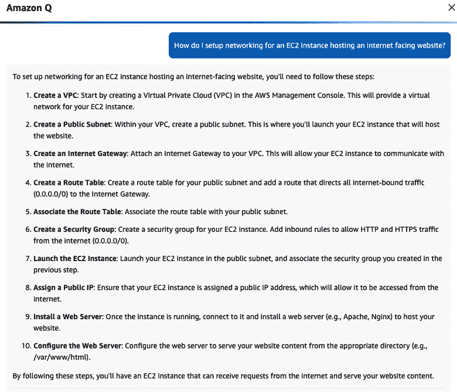

图 15.9 – 亚马逊 Q – 网站托管网络推荐

一旦你设置了所有网络元素，如 VPC、子网、路由表等，然后你可以验证设置是否正确。对于特定的网络分析，亚马逊 Q 依赖于 VPC 可达性分析器来提供解释和详细的路径分析。

在以下屏幕截图中，亚马逊 Q 的网络故障排除功能检查了我们设置的网络是否可以连接到互联网。

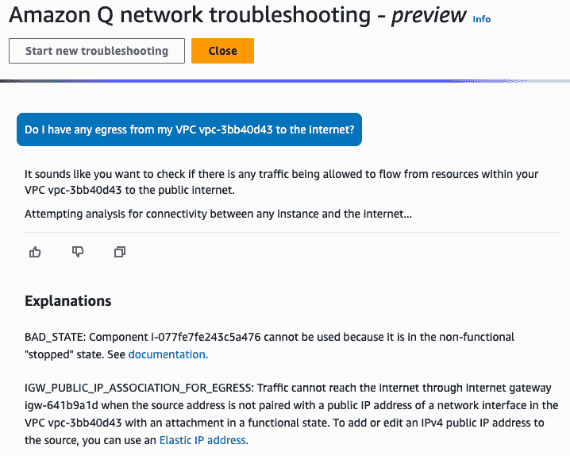

图 15.10 – 亚马逊 Q – 网络推荐用于网站托管

亚马逊 Q 与 VPC 可达性分析器的协同工作能力可以节省无数用于尝试解决网络配置中出现问题的时间。一旦修复了问题，你也可以通过向亚马逊 Q 提出简单的问题来确认是否达到了所需的网络状态。

例如，以下屏幕截图显示了构建者正在检查 EC2 实例是否可以连接到互联网，Q 将提供结果以及网络路径详细信息。

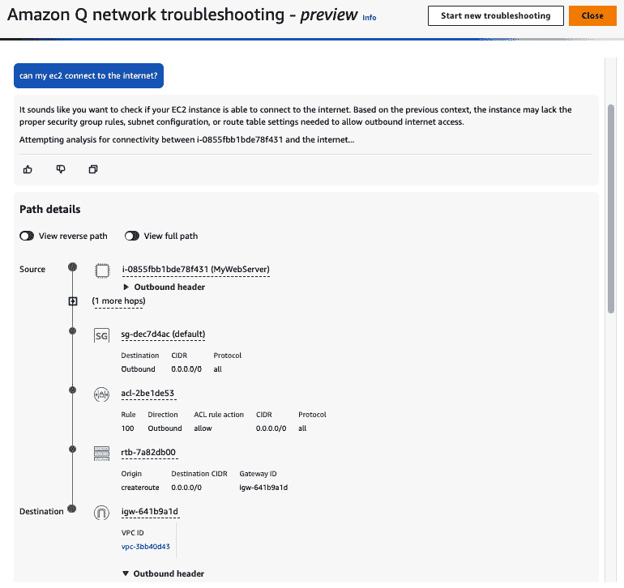

图 15.11 – 亚马逊 Q – 网站托管互联网连接检查

我们只展示了几个问题来展示亚马逊 Q 的能力；然而，在实际场景中，你可以提出更多关于网络的疑问，例如以下问题：

+   你能帮我弄清楚为什么我无法从堡垒主机连接到应用子网中的私有实例吗？

+   哪些安全组阻止了对我的亚马逊 Aurora 数据库的访问？

+   为什么我无法 SSH 进入 i-xxxx EC2 实例？

有时问题不容易解决，或者你可能在使用的服务中遇到其他问题。在这种情况下，你还可以使用亚马逊 Q 快速向 AWS 提出支持案例。让我们快速看一下这个方面。

## 与 AWS 支持聊天

如果在任何时候您无法解决问题，您可以要求 Amazon Q 帮助您与支持人员交谈，通过要求 Q 直接参与支持。以下截图显示了如果您只有基本支持计划时提供的选项。如果您有高级计划，它将允许您从 Q 控制台直接创建支持案例。在本书末尾的*参考文献*部分提供了不同 AWS 支持计划的链接。

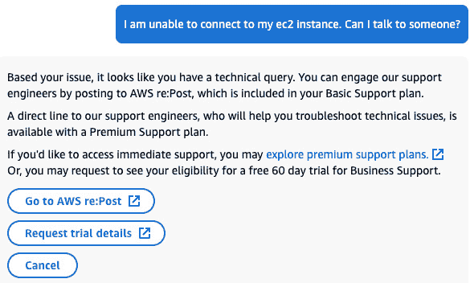

图 15.12 – Amazon Q –支持案例

另一个选项是首先看看 Q 是否可以帮助解决问题。如果 Q 提供的响应似乎没有帮助，您也可以在 Q 中点击不喜欢图标，它将帮助您创建支持案例，如以下截图所示。

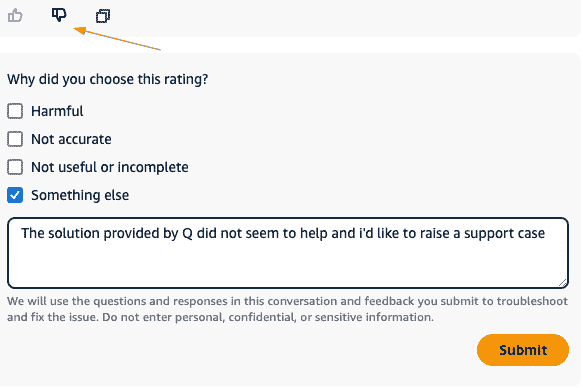

图 15.13 – Amazon Q –通过点击不喜欢图标创建支持案例

这样，它还将允许您从 Q 聊天本身创建支持案例，问题上下文将自动填充支持案例字段。这节省了时间，因为您不需要离开屏幕来填写单独的支持案例。

我们的使用案例现在可以继续前进到下一个构建块。让我们继续前进，在解决我们用例的下一个部分的同时，我们还将介绍 Amazon Q 的另一个关键功能。

## 使用 Amazon Q 解决控制台错误

为了演示 Amazon Q 的下一个功能，让我们继续到解决方案的下一步，这涉及到创建一个 Lambda 函数。此函数将在从网站上传图像到 S3 存储桶时触发。Lambda 函数将使用图像处理库来调整图像大小，并将其放置在另一个 S3 存储桶中。此外，Lambda 函数还将更新数据库中调整大小后的图像的元数据，使网站能够引用它并从 S3 存储桶检索正确的图像以显示在某些网页上。

在上一章中，我们展示了 Amazon Q 如何加速 AWS Lambda 代码生成。使用相同的技巧，你也可以为这个用例自动生成 Lambda 函数逻辑。以下是我们用例的示例 Lambda 函数。它突出了核心图像处理部分，而没有所有必要的附加功能。代码仅供参考，您可以使用 Amazon Q 帮助您生成代码。如果尝试重新生成，输出可能会变化，因此应仔细验证其正确性：

```py
import boto3
from PIL import Image
import io
def lambda_handler(event, context):
    # Get the S3 bucket and key from the event
    s3 = boto3.client('s3')
    source_bucket = event['Records'][0]['s3']['bucket']['name']
    source_key = event['Records'][0]['s3']['object']['key']
    # Download the original image from S3
    response = s3.get_object(Bucket=source_bucket, Key=source_key)
    image_content = response['Body'].read()
    # Open the image using PIL
    image = Image.open(io.BytesIO(image_content))
    # Resize the image
    resized_image = image.resize((200, 200))  # Adjust the size as needed
    # Upload the resized image to a new S3 bucket
    destination_bucket = 'your-destination-bucket-name'
    destination_key = f"resized/{source_key}"
    # Save the resized image to a BytesIO object
    resized_image_io = io.BytesIO()
    resized_image.save(resized_image_io, format='JPEG')  # Change the format if needed
    resized_image_io.seek(0)
    # Upload the resized image to S3
    s3.put_object(Bucket=destination_bucket, Key=destination_key, 
        Body=resized_image_io)
    return {
        'statusCode': 200,
        'body': 'Image resized and uploaded successfully!'
    }
```

我们将设置此 Lambda 函数，并为在源 S3 存储桶中创建对象时添加一个触发调用。因此，每次网站将图像上传到该存储桶时，S3 中的“创建对象”事件将触发 Lambda 函数。

以下截图显示了我们所添加的 Lambda 触发器。

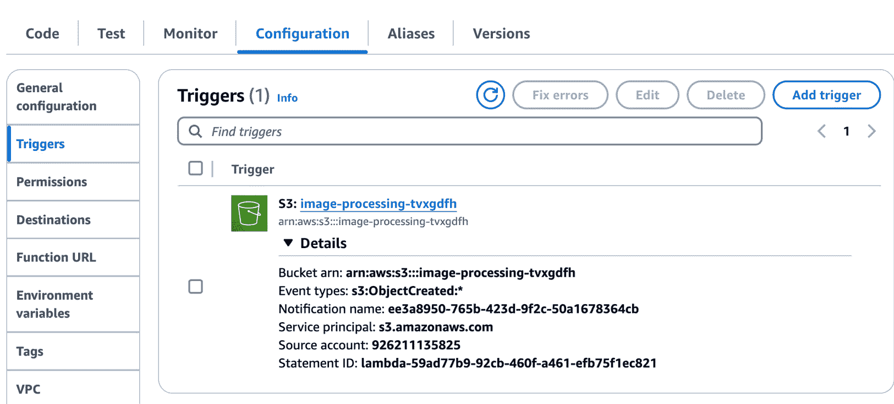

图 15.14 – AWS Lambda 函数 – 事件触发

在构建生命周期中，构建者通常会在调试和修复测试期间遇到的问题上花费大量时间。在 Amazon Q 之前，构建者必须自己进行研究来了解错误是什么以及如何修复它。但现在，有了 Amazon Q，构建者可以直接从 AWS 管理控制台进行故障排除。让我们探索这个功能，了解我们如何使用它来解决我们的用例中的问题。

## 使用 Amazon Q 故障排除 Lambda 错误

在 AWS 管理控制台中，Amazon Q 可以诊断并解决使用 AWS 服务时遇到的问题，包括权限不足、配置错误和超出服务限制的情况。此功能适用于 Amazon EC2、Amazon ECS、Amazon S3 和 AWS Lambda 等服务中发生的错误。虽然 Amazon Q 可以解决许多常见的控制台错误，但它不处理基本的验证错误，并且不保留之前的故障排除会话记录。

让我们了解我们如何使用此功能来满足我们的用例。现在，为了测试我们的 Lambda 函数是否正常工作，我们将在 AWS Lambda 控制台中使用测试选项。对于测试，我们将在源存储桶中预先上传一个样本图像，然后执行以下测试：

```py
{
  "Records": [
    {
      "eventVersion": "2.0",
      "eventSource": "aws:s3",
      "awsRegion": "us-west-2",
      "eventTime": "2022-02-18T10:05:09.775Z",
      "eventName": "ObjectCreated:Put",
      "userIdentity": {
        "principalId": "EXAMPLE"
      },
      "requestParameters": {
        "sourceIPAddress": "127.0.0.1"
      },
      "responseElements": {
        "x-amz-request-id": "EXAMPLE123456789",
        "x-amz-id-2": "EXAMPLE123/5678abcdefghijklambdaisawesome/mnopqrstuvwxyzABCDEFGH"
      },
      "s3": {
        "s3SchemaVersion": "1.0",
        "configurationId": "testConfigRule",
        "bucket": {
          "name": "image-processing-tvxgdfh",
          "ownerIdentity": {
            "principalId": "EXAMPLE"
          },
          "arn": "arn:aws:s3:::image-processing-tvxgdfh"
        },
        "object": {
          "key": "example.jpg",
          "size": 1024,
          "eTag": "0123456789abcdef0123456789abcdef",
          "sequencer": "0A1B2C3D4E5F678901"
        }
      }
    }
  ]
}
```

此测试只是模拟 Lambda 函数在图像上传到源存储桶时接收的事件消息。Lambda 控制台中的测试功能允许构建者在代码投入生产之前验证 lambda 是否按预期工作。

当我们在 AWS Lambda 控制台中点击**测试**按钮时，我们会立即遇到错误，如下面的截图所示。

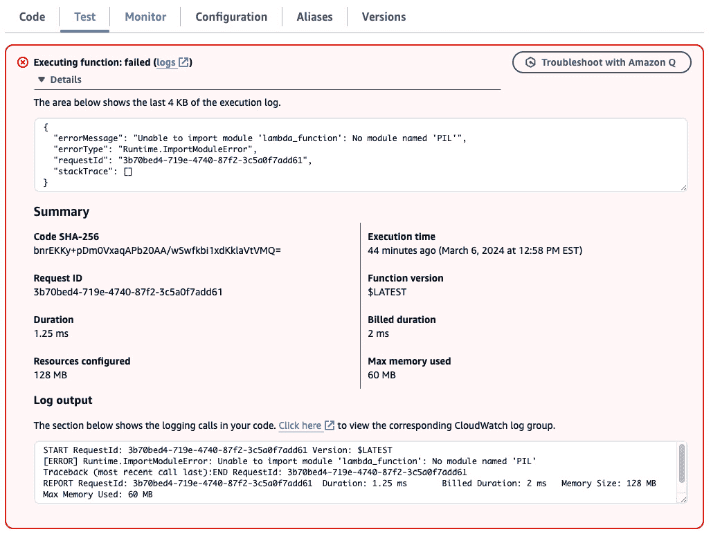

图 15.15 – AWS Lambda 函数 – 测试期间错误

从这个错误中可以看出，似乎 PIL 模块没有被识别。错误旁边的**使用 Amazon Q 故障排除**选项出现。当你点击该选项时，Amazon Q 将首先分析问题，并提供问题的分析，如以下截图所示。

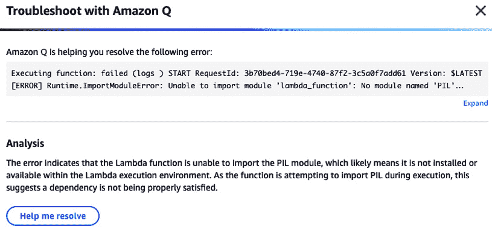

图 15.16 – Amazon Q – 故障排除 AWS Lambda 错误

当你选择**帮助我解决问题**选项时，Amazon Q 将提供可能的解决方案。这样，构建者就不必进行外部研究来了解如何修复错误。以下截图显示了我们的 Lambda 函数错误解决步骤。

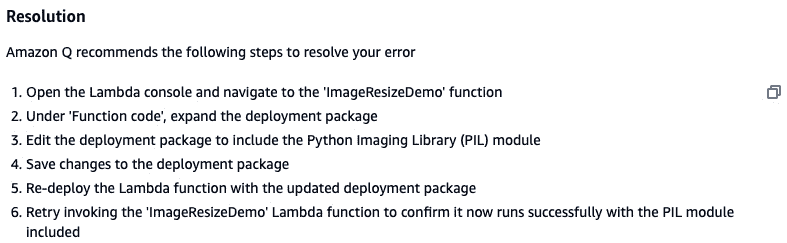

图 15.17 – Amazon Q – AWS Lambda 错误的解决方案

所以基本上，Python Imaging Library 缺失了，Amazon Q 建议将库添加到 Lambda 函数中。在这个用例的开始，我添加了一个关于 LLM（大型语言模型）助手如 Amazon Q 提供的解决方案的重要备注。提供的解决方案可能因 Amazon Q 的不同调用而异。为了说明这一点，我关闭了解决方案窗口，并要求 Q 再次对同一问题进行故障排除。这次，Amazon Q 提出了不同的建议来解决此问题。

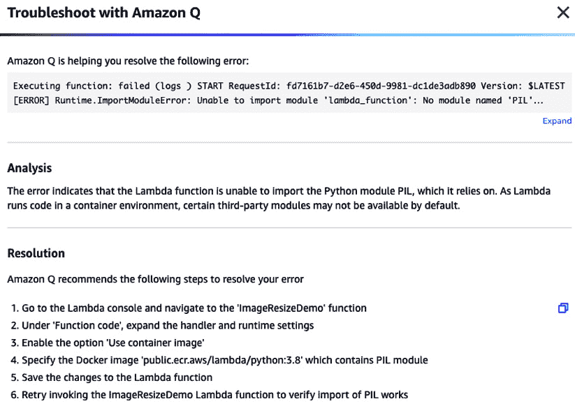

图 15.18 – Amazon Q – AWS Lambda 错误解决 – 变体 1

如果我寻求另一个故障排除实例，这次，我收到了另一个解决相同问题的建议，如下面的截图所示。

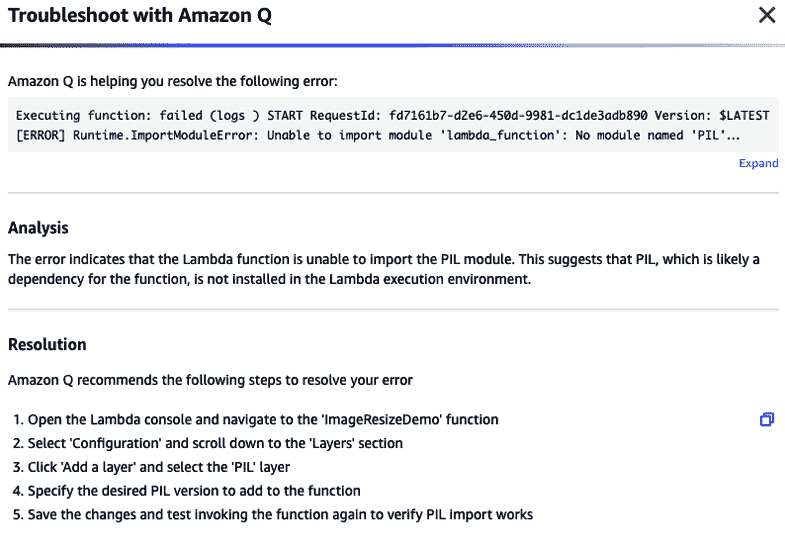

图 15.19 – Amazon Q – AWS Lambda 错误解决 – 变体 2

现在，你可能想知道为什么这种情况会发生。首先，一个问题可能有多个解决方案，每个解决方案都有自己的步骤。哪个解决方案最适合我们的问题取决于构建者去尝试和决定。并非每个解决方案都可能是最佳选择，因为 Amazon Q 可能不了解您的团队或项目的特定实现可能具有的任何外部依赖。构建者需要在实施最终解决方案时进行尽职调查。Amazon Q 只是帮助您缩小可能需要您自己花费更多时间研究的研究选项。

为了继续前进，我采纳了图 15.14 中提供的 Amazon Q 建议。为了快速解决库问题，我在 Lambda 函数层部分添加了一个外部 ARN，`'arn:aws:lambda:us-west-2:770693421928:layer:Klayers-p312-Pillow:1'`，作为 PIL 库的参考。

我重新运行了测试，看看是否解决了我的问题。但是，立即，我遇到了另一个错误，如下面的截图所示。

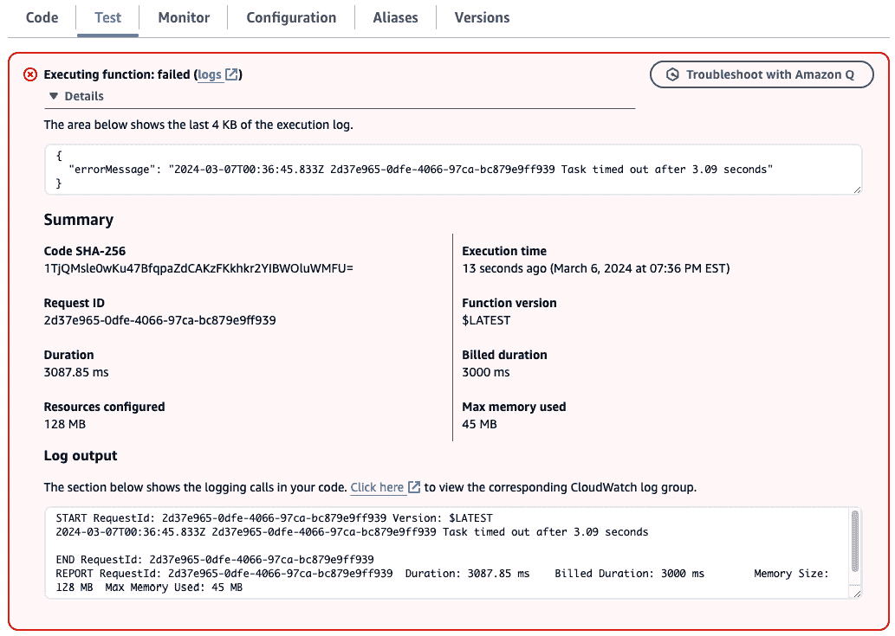

图 15.20 – Amazon Q – 另一个 AWS Lambda 错误

看起来库的问题已经解决了，但函数超时了。为了找出这个问题的原因，我没有逐行检查日志，而是再次点击了**使用 Amazon Q 进行故障排除**按钮。下面的截图显示了 Amazon Q 提供的错误分析和解决方案。

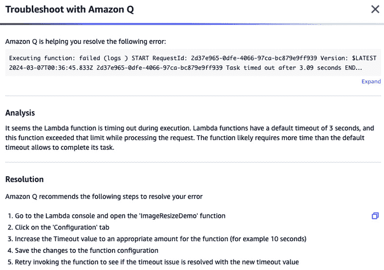

图 15.21 – Amazon Q – AWS Lambda 超时错误的分析和解决

有时，简单的问题会导致挫败感，并浪费时间去试图找出原因。Amazon Q 理解了这个问题，并在几秒钟内提供了解决问题的确切步骤。这个例子可能很简单，但它突出了所有开始利用 Amazon Q 在 AWS 管理控制台中解决问题的 AWS 构建者将体验到的生产力提升。

最后，在增加超时时间后，Lambda 测试成功完成，以下截图确认了图像已被调整大小。

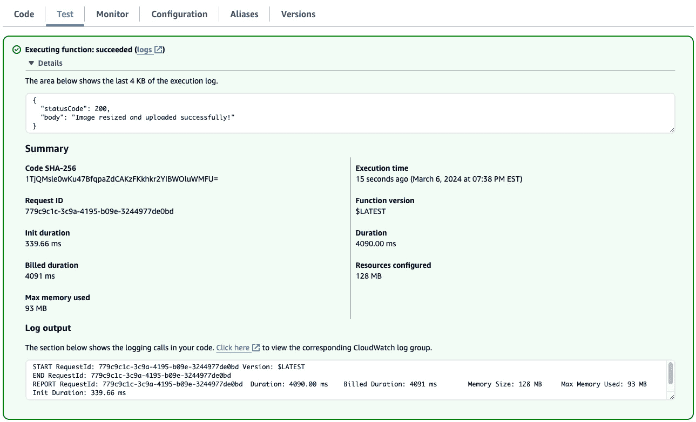

图 15.22 – Amazon Q – AWS Lambda 函数成功执行

您可以检查目标 S3 存储桶，以找到其中的调整大小后的图像。

这使我们的用例结束；然而，Q 的另一个功能可以帮助您了解账户中存在哪些资源。换句话说，Amazon Q 也了解您账户中正在使用的 AWS 资源。

# 了解 AWS 账户资源

到目前为止，在本章中，我们已经看到 Amazon Q 如何通过生成架构模式、最佳实践以及代码来帮助构建者在 AWS 上创建解决方案。但如果构建者需要帮助处理他们 AWS 账户中已经构建的 AWS 资源，并希望了解更多细节，而无需单独查找这些信息呢？现在，Amazon Q 不仅了解您账户中的 AWS 资源，还可以回答有关成本的问题，帮助您更好地理解和创建优化策略。让我们快速查看这些功能。

## 使用 Amazon Q 分析资源

在您要求 Q 分析您的资源之前，请确保为 Q 要执行的操作授予了 IAM 权限。例如，如果您要求 Q 列出您账户中的所有 S3 存储桶，那么必须授予`s3:ListAllMyBuckets` IAM 权限。

以下截图显示了我在我的用例中使用的所有 EC2 实例。

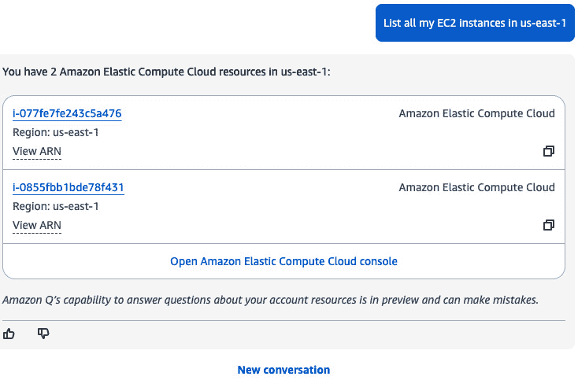

图 15.23 – Amazon Q – AWS 资源分析

您可以提出更精确的问题，以获得对您已配置的 AWS 资源的许多此类洞察。在以下截图中，我们正在检查我们为本章中的用例配置的存储桶的加密设置。

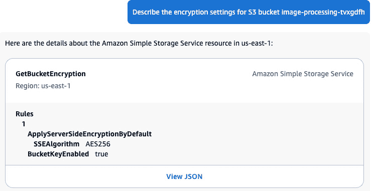

图 15.24 – Amazon Q – AWS 资源设置分析

在我们结束本章之前，我们肯定想了解与用例相关的成本。实际上，所有使用 AWS 处理其工作负载的团队都会探索成本及其管理，以确保由于不必要的操作而导致支出激增。Amazon Q 也可以在这方面提供帮助。

## 使用 Amazon Q 分析成本

Amazon Q 通过检索、解释和分析您的成本数据，实现了无缝的成本管理，使您能够了解您的支出。

当你查询你的成本时，Amazon Q 提供详细的响应，包括具体的成本数字、相关指标、时间段以及细粒度细节，以及任何应用的组或过滤器。此外，它还提供了一个链接到具有相同规范的 AWS Cost Explorer 视图，使你能够可视化或下载数据以进行进一步分析。

以下是一个简单的例子，说明如何询问 Q 为我们特定月份的 EC2 实例的成本。

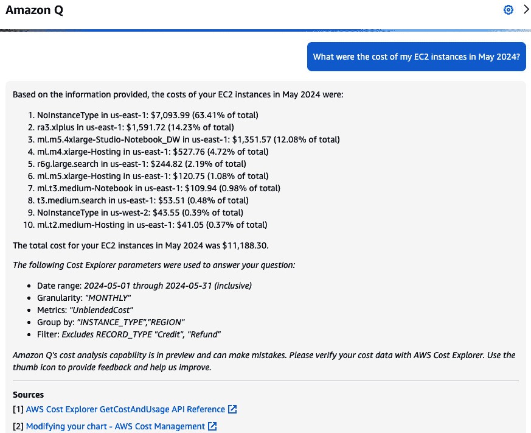

图 15.25 – Amazon Q – AWS 成本分析

为了让 Amazon Q 分析成本，需要启用 AWS Cost Explorer。之后，你可以与 Q 聊天并询问任何成本探索问题的变体，如下所示：

+   我们在 2024 年在 EC2 上花费了多少钱？

+   过去 6 个月中，我的 EC2 成本按实例类型如何？

+   哪些链接账户在上个月花费在 Redshift 上的最多？

这使我们到达了本章的结尾；然而，在 Amazon Q 能做什么方面，我们只是触及了表面。随着生成式 AI 的快速发展，预计 Amazon Q 将会有更多的新功能和能力，涉及解决 AWS 中的用例。

# 摘要

在本章中，我们介绍了如何使用 Amazon Q 在 AWS 上构建解决方案。Amazon Q 在构建过程的许多方面提供帮助，包括提供架构模式和最佳实践、诊断 AWS 控制台错误、解决网络问题、创建支持案例以及理解所有已配置的 AWS 资源及其成本。

在下一章和最后一章中，我们将探讨 DevOps 构建者的另一个关键方面，以及 Amazon Q 如何帮助快速推进其许多方面。

# 参考文献

AWS 支持计划：[`aws.amazon.com/premiumsupport/plans/`](https://aws.amazon.com/premiumsupport/plans/)
