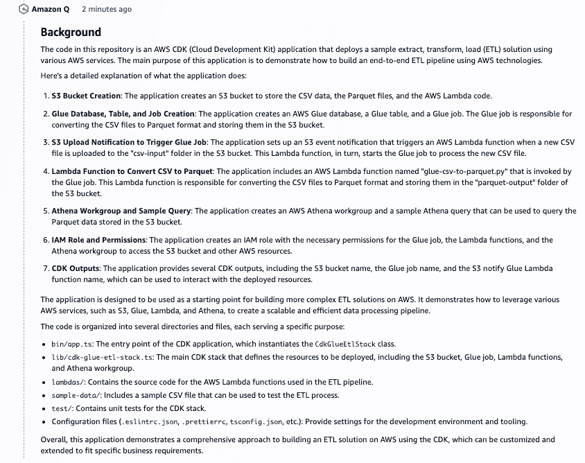

# 16

# 加速 AWS 上的 DevOps 流程

在本章中，我们将探讨以下关键主题：

+   DevOps 过程中的挑战

+   Amazon CodeCatalyst 简介

+   探索 Amazon Q 在 Amazon CodeCatalyst 中的能力

+   Amazon Q 在 Amazon CodeCatalyst 中的功能开发能力

+   Amazon Q 在 Amazon CodeCatalyst 中的总结能力

在任何组织中，软件开发不仅仅是编写代码。软件工程过程还涉及一种称为 DevOps 的东西。它结合了“开发”和“运营”，涉及一系列旨在改善软件**开发**（**Dev**）和 IT**运营**（**Ops**）团队之间协作和沟通的实践。它侧重于自动化流程，提高效率，并更快、更可靠地交付高质量的软件产品。

DevOps 强调协作文化、**持续集成和持续交付**（**CI/CD**）、基础设施和工作流程的自动化，以及监控和反馈循环，以实现更快的开发周期、提高部署频率和更稳定的运行环境。

市场上有许多工具可供选择，用于 DevOps 生命周期的各种目的，包括版本控制、持续集成、持续交付、配置管理、基础设施即代码、监控和协作。AWS 还提供了一种名为 Amazon CodeCatalyst 的服务，有助于这一过程。但首先，我们需要了解在 DevOps 过程中面临的挑战。

# DevOps 过程中的挑战

尽管 DevOps 工具在软件开发过程的许多方面都提供了帮助，但在这一过程中仍存在一些挑战。让我们了解一些挑战，以便您能够欣赏到 Amazon Q 在 CodeCatalyst 的 DevOps 过程中带来的价值：

+   **复杂性**：许多 DevOps 工具在设置、配置和维护方面可能很复杂，需要专业知识和技术技能。例如，使用 Jenkins 设置 CI/CD 管道涉及多个步骤：在服务器上安装和配置 Jenkins，将其与版本控制系统（如 Git）集成，设置构建脚本，配置管道各个阶段的插件，管理用户权限，并确保服务器安全且定期更新。这个过程可能耗时且需要深入理解 Jenkins 及其底层基础设施。

+   **集成问题**：将多个 DevOps 工具集成到一个统一的管道中可能具有挑战性，导致兼容性问题和数据孤岛。

+   **自动化有限**：虽然自动化是 DevOps 的一个关键原则，但并非所有工具都提供强大的自动化功能，导致手动解决方案和低效。例如，考虑一个团队使用缺乏自动化回滚功能的部署工具的场景。如果部署失败，团队成员必须手动干预以将系统恢复到先前的稳定状态。这个过程可能耗时且容易出错，并会打断 DevOps 力求实现的流畅工作流程。因此，工具中缺乏强大的自动化功能会导致低效和运营成本增加。

+   **学习曲线**：DevOps 工具通常具有陡峭的学习曲线，需要时间和资源让团队熟练使用，这可能会减缓采用和实施的速度。

+   **缺乏协作**：孤立的团队和部门可能会阻碍协作和沟通，导致 DevOps 流程中的低效和瓶颈。

+   **持续测试**：实施全面的测试策略，包括单元测试、集成测试和自动化回归测试，可能具有挑战性，尤其是在频繁代码更改的复杂环境中。

+   **技能差距**：在竞争激烈的就业市场中，寻找并留住具有自动化、云计算、容器化和其他相关技术专长的 DevOps 专业人员可能具有挑战性。

让我们快速了解亚马逊 CodeCatalyst 的基础知识，这样就可以轻松理解亚马逊 Q 如何加速 DevOps 流程。

# 亚马逊 CodeCatalyst 简介

亚马逊 CodeCatalyst 为采用持续集成和持续交付实践的团队简化了软件开发。通过整合关键工具，它简化了工作计划、代码协作和应用程序开发，内置 CI/CD 功能。通过直接连接 AWS 账户，可以无缝地将 AWS 资源集成到项目中。这个一站式工具管理应用程序生命周期的每个阶段和方面，实现快速和可靠的软件交付。

下图突出了 CodeCatalyst 帮助的软件开发的所有不同方面。

图 16.1 – 亚马逊 CodeCatalyst 功能

让我们浏览一下 CodeCatalyst 可以做的关键功能。这些内容也参考了 AWS 文档中的 CodeCatalyst 部分，相关链接在章节末尾的 *参考文献* 部分提供：

+   **代码协作**：通过分支、合并、拉取请求和源代码仓库中的评论与团队无缝协作。快速创建开发环境，无需克隆或设置与仓库的连接即可进行代码工作。

+   **使用工作流构建、测试和部署应用程序**：通过构建、测试和部署操作定义工作流，以管理您应用程序的 CI/CD。可以手动启动工作流或根据代码推送或拉取请求的创建或关闭等事件自动启动它们。

+   **使用问题跟踪优先处理工作**：使用问题建立待办事项列表并使用看板跟踪正在进行中的任务的状态。维护一个健康的项目待办事项列表，以便您的团队能够处理，对于软件开发至关重要。

+   **监控和通知**：监控团队活动和资源状态，并配置通知，以便了解重要更改。

Amazon CodeCatalyst 是一个具有多个功能和特性的综合服务。提供详细概述超出了本书的范围。然而，如果您对将 CodeCatalyst 作为 DevOps 工具进行探索感兴趣，请自由地查阅本章末尾*参考*部分列出的研讨会。

为了快速学习并看到 CodeCatalyst 的实际应用，服务内提供了多个蓝图。这些蓝图将创建实现特定用例端到端 DevOps 流程所需的所有基础设施。其中一个蓝图是用于实现现代三层 Web 应用程序的。您可以在*参考*部分提供的链接中找到它的逐步教程。

在介绍了 DevOps 之后，让我们直接进入本章的主题：Amazon Q 如何帮助在 Amazon CodeCatalyst 内部进行 DevOps 流程。

# 探索 Amazon Q 在 Amazon CodeCatalyst 中的功能

如果您的项目位于 Amazon CodeCatalyst、GitHub Cloud 或 Bitbucket Cloud 中的源代码库中，并且启用了 Amazon Q 功能，您可以利用 Q 的一些功能来加速 DevOps 流程。开发者经常面临时间限制，导致任务积压。因此，他们可能忽略在拉取请求中提供代码更改的详细解释，假设他们的同事可以独立解读。同样，拉取请求的创建者和审阅者可能缺乏足够的时间来彻底分析评论，尤其是在多次修订的情况下。

在现代软件开发中，工程师在 DevOps 流程中会遇到重大挑战，导致瓶颈和低效。一个突出的问题是代码审查和团队协作的耗时性质。软件工程师往往难以在拉取请求中提供对代码更改的全面解释，而审查者则面临全面分析和理解更改的困难，尤其是在多次修订的情况下。这些低效导致延迟、生产力下降和错失创新机会。此外，向代码中添加新功能是一个耗时的过程；同时，审查者可能难以理解复杂更改，尤其是在处理大型代码库时。

通过与 Amazon CodeCatalyst 的集成，团队成员可以简化他们的工作流程，从而有更多时间专注于工作的关键方面。我们将 Amazon Q 整合到 DevOps 流程中仍处于起步阶段，但到目前为止，以下是 Amazon Q 与 Amazon CodeCatalyst 一起工作的关键功能：

+   **功能开发**：允许开发者在一个问题中输入想法，并获取完全测试的应用程序代码，该代码已准备好在拉取请求中合并。只需几点击和自然语言输入，整个工作流程就简化了。

+   **自动生成拉取请求摘要**：Amazon Q 可以分析拉取请求中留下的所有代码更改评论，并生成简洁的反馈摘要。

+   **自动生成拉取请求描述**：Amazon Q 可以分析代码更改，并在拉取请求中生成更改的描述，使审查和批准更改更加容易。

在 CodeCatalyst 中，Q 还协助其他领域，例如自动选择蓝图和提供任务推荐。我们将在本章中详细讨论每个这些功能。但首先，像往常一样，再次提醒关于 LLM 生成输出的非确定性。

提醒

在我们开始展示 Amazon Q 与 CodeCatalyst 的能力之前，重要的是要记住一些事情。从 LLM 收到的响应通常不是幂等的。幂等性是指操作的一个属性，即多次应用该操作的效果与只应用一次相同。

在 LLM 的背景下，每个生成的响应都是基于当时提供的特定输入提示。虽然相同的提示可能在多次迭代中产生相似或相关的响应，但无法保证每次生成的响应都相同。模型初始化、随机化和提示的具体上下文等因素可能会影响生成响应的变化。

因此，即使在以下章节中我们将使用的示例中，如果您向 Amazon Q 发送相同的提示，您可能会每次都收到不同的响应，使得响应不具有幂等性。在尝试所有步骤之前，请根据自己的判断来决定接受什么作为准确的信息，以及需要再次提示系统以接收修订的方法。

现在，让我们从我们的 DevOps 服务 Amazon CodeCatalyst 中的功能开发能力开始，其中已经启用了 Amazon Q 的生成式 AI 能力。

# Amazon CodeCatalyst 中 Amazon Q 的功能开发能力

Amazon Q 的功能开发能力使用户能够针对特定领域定制和增强 Q 的问答技能。关于使用 Amazon CodeCatalyst 的 DevOps 流程，功能开发可能包括对应用程序中识别出的错误进行修复、进行改进或添加新功能。对于所有这些任务，都需要修改代码库、测试、在过程中解决任何问题，然后将更改推回生产环境进行部署。虽然这看起来很简单，但在具有许多组件且注释不足的大型代码库中，特别是对于新加入的开发者来说，快速完成端到端任务很快就会变得具有挑战性。

让我们通过一个例子来看看 Amazon Q 如何协助在 Amazon CodeCatalyst 中进行功能开发。在这里，我们假设您对 CodeCatalyst 的不同组件有基本的了解。如果您是第一次使用此服务，我们鼓励您尝试本章末尾*参考文献*部分中链接的工作坊。完成这些后，您将能够更好地理解本节中讨论的一些方面。让我们直接进入用例。

## 利用 Amazon CodeCatalyst 中 Amazon Q 功能开发的用例

为了展示功能开发能力，我们将选择在创建项目时可用 AWS Glue ETL 蓝图。我们选择这个例子是为了提供一个全面的视角，展示开发者如何在 Glue 中加速他们的 ETL 代码。有关使用 Glue 加速编码的其他技术，请参阅*第十四章*。

下面的截图显示了 CodeCatalyst 中的 AWS Glue ETL 蓝图。

图 16.2 – Amazon CodeCatalyst 中的 Glue ETL 蓝图

在这个例子中，因为我们已经知道我们想要哪个蓝图，所以我们很容易阅读描述并选择它用于我们的项目。然而，某些用例可能需要我们在选择最合适的蓝图之前阅读多个可用蓝图的描述。现在，Amazon Q 通过根据您以自然语言提供的标准自动选择最佳匹配的蓝图来帮助您创建项目，从而为您节省宝贵的时间。Q 将分析所有蓝图的描述，并为您选择最佳的蓝图来创建项目，从而节省您的时间。

以下示例突出了使用 Amazon Q 建立项目的过程，Amazon Q 根据我们在聊天中提供的标准建议 Glue 蓝图。

图 16.3 – Amazon Q 建议的 Glue ETL 蓝图

完成步骤后，源代码库将设置好，并通过工作流程完成 CI/CD 管道。该管道本质上使用存储在库中的 AWS **云开发工具包**（**CDK**）代码启动 AWS CloudFormation 堆栈。

以下截图展示了在 CodeCatalyst 中设置后的 Glue ETL 蓝图。此 ETL 项目的架构也在概述中进行了说明。这是一个简单的项目，其中输入数据使用 AWS Glue 处理，并以 Parquet 文件格式存储在 Amazon S3 中，以便由 Amazon Athena 进行查询。屏幕底部的流程状态指示完成，这意味着 CloudFormation 堆栈已成功部署了架构的所有组件。您可以通过 AWS 中的 AWS Lambda 和 AWS Glue 服务控制台导航以检查工件。

图 16.4 – 使用 Amazon CodeCatalyst 部署的 Glue ETL 蓝图

注意到 **使用 Amazon Q 添加** 选项（在上一个截图的右上角），它允许您通过根据您所需的建议其他蓝图来添加新组件。对于此用例，假设我们在单个蓝图中找到了我们想要的所有内容，因此我们将使用我们已有的内容。

现在，让我们假设我们在我们的 Glue ETL 管道中需要进行一些增强。对解决方案的持续增强和改进总是受到鼓励，因此我们也将做类似的事情。

Glue ETL 蓝图将最终输出存储在 Parquet 文件格式中，该格式广泛用于设置数据湖。然而，随着处理和存储的数据量的增加，存储成本也在增加。为了提高这些 Parquet 文件的存储效率，可以应用压缩算法以压缩格式存储它们。但是，对于开发者来说，确定平衡存储节省与性能的优化压缩算法可能具有挑战性。如果没有关于如何处理此任务和测试压缩到性能比率的明确指导，开发者可能需要在实施更改之前花费大量时间进行研究。或者，他们可以通过咨询集成到 CodeCatalyst 中的 Amazon Q 的功能开发能力来寻求快速解决方案。

以下图提供了一个很好的工作流程，展示了 Amazon Q 如何帮助进行功能开发。

图 16.5 – Amazon Q 功能开发工作流程

让我们详细理解这些步骤，并看看 Amazon Q 如何加速我们在本章所选的 Glue 项目中的繁琐 DevOps 流程。

## 将问题分配给 Amazon Q

假设一个 ETL 开发者知道他们需要在代码中应用一些压缩逻辑，但不确定应该应用哪种算法。此外，开发者也不确定需要更改代码库中的哪些代码。这就是 Amazon Q 可以提供帮助的地方。开发者将在 CodeCatalyst 中创建一个**问题**，并尽可能详细地描述他们的问题。

以下截图显示了我们将创建的问题，包括标题和描述我们的最终目标。

图 16.6 – 在 Amazon CodeCatalyst 中创建问题并将其分配给 Amazon Q

我们现在可以保持状态为**待办**，并将优先级设置为**无优先级**作为默认选项。请注意，我们不是将此分配给用户，而是可以选择将其分配给 Amazon Q。

一旦分配给 Amazon Q，它希望我们指定它应该如何处理流程。首先，我们提供了这个问题应该与之工作的源仓库。然后，它询问用户是否希望在过程中审查代码更改建议。根据用户评论，Q 可以调整其方法一定次数。在绝大多数情况下，保持此选项启用总是好的，因为建议可能并不总是符合我们期望的代码。接下来，它还询问 Q 是否可以自行修改工作流程文件。在这种情况下，我们只是出于安全考虑禁用了此选项。现在，Q 还可以根据对问题的分析推荐任务。目前，我们将保持它关闭，但我们将在下一阶段再次考虑此选项。

以下截图显示了我们将问题分配给 Amazon Q 时的选择。

图 16.7 – 亚马逊为处理问题所需初始输入

一旦我们确认选择并创建问题，亚马逊 Q 将问题移动到**进行中**通道，如下面的截图所示。

图 16.8 – 亚马逊 Q 在“进行中”通道中分析的问题

下一步是生成一个解决问题的方法，并给开发者提供通过提示提供任何反馈的选项。

## 生成方法和提供反馈

这个步骤是幕后所有真正神奇的事情发生的地点。Q 将首先评估任何先决条件，然后继续阅读你在上一步提供的代码库。

以下截图突出了 Q 将采取的方法以达到最终目标。注意，它在继续前进之前会等待用户的响应。

图 16.9 – 当问题分配给亚马逊 Q 在 CodeCatalyst 中的分析步骤

**推荐任务**按钮也显示在这个屏幕上，Q 可以分析问题并为用户提供更多可管理的任务以加快行动。在我们的用例中，我们不需要使用此功能，但请随意尝试它来解决你希望在办公场所创建的更复杂的问题。

根据它所学到的，它将生成一个关于它对项目理解的总背景。以下截图突出了为 AWS Glue ETL 项目生成的背景。

图 16.10 – 亚马逊 Q 在 CodeCatalyst 中的背景生成步骤

背景有助于总结代码库的主要内容。下一步是主要步骤，因为它展示了它将采取的方法来解决问题，该问题已在问题的描述中提供。

以下截图突出了我们向 Q 展示的压缩用例的方法。

图 16.11 – 亚马逊 Q 在 CodeCatalyst 中生成的方案 – 第一部分

在步骤结束时，一旦你理解了 Q 提出的更改，你有两个选择。在某些情况下，Q 会提供完美的选择，并且所提出的所有内容可能看起来 100%准确。在这种情况下，你可以直接继续。然而，重要的是要记住，正如我们一直被提醒的那样，基于 LLM 的解决方案可能并不总是你想要的，但 Q 愿意学习和提供更好的或替代的解决方案。这就是提示工程发挥作用的地方，亚马逊 Q 允许你通过评论部分提供提示，以便它可以修改其方法并提供不同的解决方案。

以下屏幕截图突出了 Q 为其生成的方案提供的选项。对于我们的用例，我们将接受 Q 提供的方案并继续下一步。

图 16.12 – CodeCatalyst 中由 Amazon Q 生成的方案 – 第二部分

观察 Amazon Q 如何系统地列出可能的下一步。首先，它理解了我们的需求，并建议使用 Snappy 压缩，这将提供压缩和速度之间的良好平衡。然后，它提供了需要在每个源代码文件中添加或更改的代码片段，以使这成为可能。对于开发者来说，研究问题的可能解决方案和理解所有需要代码更改的地方可能需要大量的时间和精力。Amazon Q 代表我们在几分钟内完成了所有这些。

为了增加一些神秘感，方案中提供的代码片段之一似乎存在问题。我本可以提供额外的提示并尝试让 Amazon Q 提供确切的工作代码。然而，在现实生活中，有时问题会从缝隙中溜走。但不用担心；我们将在稍后的阶段有另一个机会修复这个问题。这也展示了 Q 如何在 CodeCatalyst 中提供其他功能，以朝着完美的最终解决方案迈进。

目前，我们接受方案并指示其继续进行。工作流程的下一步是生成拉取请求。

## 生成拉取请求

一旦 Q 收到我们继续使用批准的方案的命令，它将生成必要的代码并创建一个拉取请求。在这一步，工作流程进入审查阶段。开发者将再次欣赏这将为他们节省多少时间。

以下屏幕截图显示了 Amazon Q 在分支、创建必要的更改并在拉取请求中向审批者展示所有这些工作的全过程。

图 16.13 – Amazon Q 完成了方法并生成了一个拉取请求

当你点击拉取请求时，方案将在概述中展开，使审查者更容易理解代码库中做出的更改。以下屏幕截图显示了拉取请求的概述页面，其中总结了更改。

图 16.14 – CodeCatalyst 中由 Amazon Q 生成的拉取请求概述

生成拉取请求以及更改的详细描述，有助于工作流程的下一步，即审查和修改代码库中的建议更改。

## 审查和修改代码更改

审批者通常会想要在并排比较屏幕上比较建议的更改，这样就可以轻松理解不同代码文件中的所有更改。以下屏幕截图显示了突出显示 Amazon Q 提出的所有更改的屏幕。

图 16.15 – 在 CodeCatalyst 中 Amazon Q 生成的拉取请求代码比较

回想一下，我们之前提到过，似乎在 Amazon Q 方法建议的一个代码片段中存在问题。由于我们在上一步中没有注意到它，所以在实际代码提交审查时，这个问题在拉取请求中显得尤为突出。没有团队希望错误的代码进入仓库，因此通常在代码合并到主分支之前，审查和批准拉取请求是一种最佳实践。

仔细检查后，观察到在 CDK 代码文件中，`compression` 不是 Glue 表的直接属性。因此，代码 `compression:glue.Compression.SNAPPY` 将在构建阶段编译失败。为了避免重复做同样的事情，CodeCatalyst 允许审查者在拉取请求屏幕内直接添加注释并请求修订。

在以下屏幕截图中，我们在错误代码行旁边添加了注释，要求系统使用不同的逻辑。

图 16.16 – 在 CodeCatalyst 的拉取请求中添加注释并请求修订

当你在拉取请求屏幕上点击**创建修订**按钮时，Amazon Q 会被再次调用。它将代码中的注释作为提示，并创建一个新的拉取请求修订，这次带有正确的逻辑。以下屏幕截图显示了修订 v2 能够返回正确代码的情况。

图 16.17 – 在 CodeCatalyst 修订的拉取请求中的新、更新后的代码

一旦审查者确认一切看起来都正确，他们就可以在 CodeCatalyst 中作为下一步批准拉取请求。以下屏幕截图显示了这一过程。

图 16.18 – 在 CodeCatalyst 修订的拉取请求中批准的新、更新后的代码

这将我们带到了工作流程的最终一步，即将批准的代码更改合并回仓库。

## 仓库中的代码更改合并

一旦完成审查和批准，代码就可以合并到主分支，如下一个屏幕截图所示。

图 16.19 – CodeCatalyst 中的代码合并过程

合并请求触发工作流通过 CI/CD 流程重新编译、重建和重新部署代码。您始终可以前往 CI/CD 部分的工作流以确认构建和部署过程的成功完成。下面的截图显示了拉取请求合并后工作流的成功构建。

图 16.20 – CodeCatalyst 中的工作流

对于我们的 Glue ETL 用例，工作流将编译代码并通过 CDK 逻辑触发 AWS CloudFormation 堆栈。CloudFormation 堆栈反过来将重新创建/更新受代码更改影响的基础设施。在我们的案例中，您可以访问 Glue 控制台并检查包含压缩逻辑的更新 ETL 作业，准备触发下一次运行。

在我们结束使用 Amazon Q 在 CodeCatalyst 中的功能开发能力之前，我还想提供一个失败的替代场景。在软件工程的世界里，并非所有事情都按计划进行。如果在代码审查过程中，审查者没有发现代码问题，并且没有使用修订功能来修复它，会怎样呢？好吧，他们会批准请求，合并过程将触发工作流，最终导致失败。

下面的截图显示了如果在拉取请求过程中没有修订代码问题，将显示失败的工作流。

图 16.21 – 由于代码问题导致 CodeCatalyst 中的失败工作流

在这一点上，开发团队进入灭火模式，并从失败工作流中提供的日志中识别导致失败的错误。下面的截图显示了导致失败的错误。

图 16.22 – CodeCatalyst 中工作流日志中的失败工作流原因

在此之后的一个下一步将是创建另一个问题在 CodeCatalyst 中，提供描述中的错误详情，并将其分配回 Amazon Q 进行分析和故障排除。您可能需要参与快速工程并提供多个评论，以便 Amazon Q 得出正确的逻辑来修复问题。一旦您完成整个流程，新代码将再次包含在拉取请求中，以供批准和合并到主分支。

在我们结束本章之前，我们将快速查看 CodeCatalyst 中使用 Amazon Q 的几个其他酷炫功能，这些功能可以帮助开发者节省时间和精力。

# Amazon Q 在 Amazon CodeCatalyst 中的总结能力

开发者会理解尝试理解拉取请求提交中变更的痛苦。通常，进行代码变更的人并不是批准他们的人。因此，其他人需要理解代码库中所有变更，分析其预期效果，并最终，如果它们符合标准，批准它们。

没有适当的注释，很难理解所有变更的细微差别。有时，即使有注释，也很难完全理解变更的意图。这就是 Amazon Q 介入，使开发者和审批者生活变得更轻松的地方。

让我们看看 Amazon Q 分析代码变更并在创建拉取请求时生成变更总结的能力，以及根据拉取请求中对代码变更的所有评论创建总结。

## 拉取请求评论摘要

在审查拉取请求时，用户经常就拟议的变更留下许多评论。随着多个审查者提供反馈，确定共同主题或确保对所有评论进行彻底审查可能变得具有挑战性。为了简化此过程，**创建评论摘要**功能利用 Amazon Q 分析拉取请求中留下的所有代码变更评论，并生成简洁的反馈摘要。

以下屏幕截图突出了 Amazon Q 为我们拉取请求中进行的压缩变更生成的摘要。

图 16.23 – 拉取请求内容摘要

## 拉取请求描述

拉取请求作为代码变更审查的协作平台，无论是微小的修复、重大的功能添加，还是发布软件版本的更新。在拉取请求描述中包含代码变更的总结及其目的，有助于审查者理解变更并促进对代码演变的历史视角。然而，开发者经常依赖代码本身来传达信息，导致描述模糊或不够详细，从而阻碍审查者对变更或其潜在意图的理解。

这就是**为我编写描述**功能派上用场的地方，因为它能够生成拉取请求中变更的描述，使审查和批准变更变得更加容易。以下屏幕显示了拉取请求屏幕上的**为我编写描述**选项。

图 16.24 – CodeCatalyst 中的拉取请求描述生成功能

Amazon Q 检查包含代码修改的源分支和您打算合并这些变更的目标分支之间的差异。随后，它生成一个总结，概述这些修改的性质，并提供了对其目的和影响的最准确解释。

下面的屏幕截图突出了 Amazon Q 使用拉取请求中所有信息生成的描述。

图 16.25 – CodeCatalyst 拉取请求屏幕上的自动生成描述

CodeCatalyst 是一项具有众多自身功能的综合服务。我们只介绍了通过 Amazon Q 提供的部分下一代功能，Amazon Q 是一个由生成式 AI 驱动的助手。

# 摘要

在本章中，我们讨论了开发者在 DevOps 过程中面临的一些挑战。然后，我们介绍了 Amazon CodeCatalyst，这是一项为开发团队设计的综合软件开发服务，旨在快速构建、部署和扩展在 AWS 上运行的应用程序。

之后，我们利用一个用例来展示该服务不同的生成式 AI 功能。Amazon Q 允许开发者快速向软件添加新功能。开发者可以创建问题并将它们分配给 Amazon Q，以全面理解并针对提供的特定任务所需的不同方法提供建议。Q 还可以根据用户提供的评论提示提供修订的方法。然后，它生成代码并创建拉取请求，以便审阅者可以检查提议的更改，并在合并回主存储库之前批准或要求修订。

我们还探讨了 Amazon Q 如何提供拉取请求评论摘要和生成拉取请求描述。所有这些功能都提高了开发者的生产力，并在整个软件开发过程中节省了大量时间。

# 最后的想法

感谢您花时间与我们一同经历这本书中的旅程。尽管我们已经到达了关于 Amazon Q 开发者的书籍的结尾，并涵盖了众多主题，但我们仍处于生成式 AI 的初期阶段。全面创新正在各个领域迅速发生，因此在看到和探索新功能时，请保持开放的心态。我们描述的许多功能可能会得到更好的发展。编写这本书的目的是让您一窥使用 Amazon Q 开发者可能实现的技艺。

由生成式 AI 驱动的助手，如 Amazon Q 开发者，将改变当前软件工程师和可能缺乏资源或技能的渴望成为开发者的前景。对于经验丰富的工程师来说，AI 将通过生成代码片段、提供实时反馈以及自动化如调试和文档等繁琐任务（正如我们在本书中所见）来显著提高生产力。这使得他们能够专注于开发更复杂和更具创造性的方面。AI 还可以通过总结讨论和翻译语言障碍来促进团队内部更好的协作，营造一个更具包容性的工作环境。

对于有志于成为开发者的人来说，尤其是那些资源有限或接受过正规教育的人，AI 提供了个性化的学习体验，这些体验是根据他们的优势和劣势量身定制的。它提供即时反馈和学习支持，使获取新技能和理解复杂概念变得更加容易。AI 驱动的工具可以通过提供导师指导、职业路径推荐以及适应不断变化的行业趋势的资源，来民主化编码教育的获取途径。此外，AI 还可以通过语音激活编码和其他辅助功能帮助克服身体或学习障碍的人士的障碍。

因此，总结来说，如果你在信息技术领域的新知识学习上感到不知所措，那么拥抱由 Amazon Q Developer 等生成式 AI 助手正是你的时刻。你用得越多，就越能增强自己在职业生涯中达到更高成就的能力。

永远不要停止学习；你会对它为你打开多少新的大门感到惊讶。

# 参考文献

+   Amazon CodeCatalyst 文档: [`docs.aws.amazon.com/codecatalyst/latest/userguide/welcome.html`](https://docs.aws.amazon.com/codecatalyst/latest/userguide/welcome.html)

+   Amazon CodeCatalyst 工作坊: [`catalog.workshops.aws/ccdevops/`](https://catalog.workshops.aws/ccdevops/)

+   Amazon CodeCatalyst – 现代三层 Web 应用程序教程: [`docs.aws.amazon.com/codecatalyst/latest/userguide/getting-started-template-project.html`](https://docs.aws.amazon.com/codecatalyst/latest/userguide/getting-started-template-project.html)

+   在 Amazon CodeCatalyst 中管理生成式 AI 功能: [`docs.aws.amazon.com/codecatalyst/latest/adminguide/managing-generative-ai-features.html`](https://docs.aws.amazon.com/codecatalyst/latest/adminguide/managing-generative-ai-features.html)
