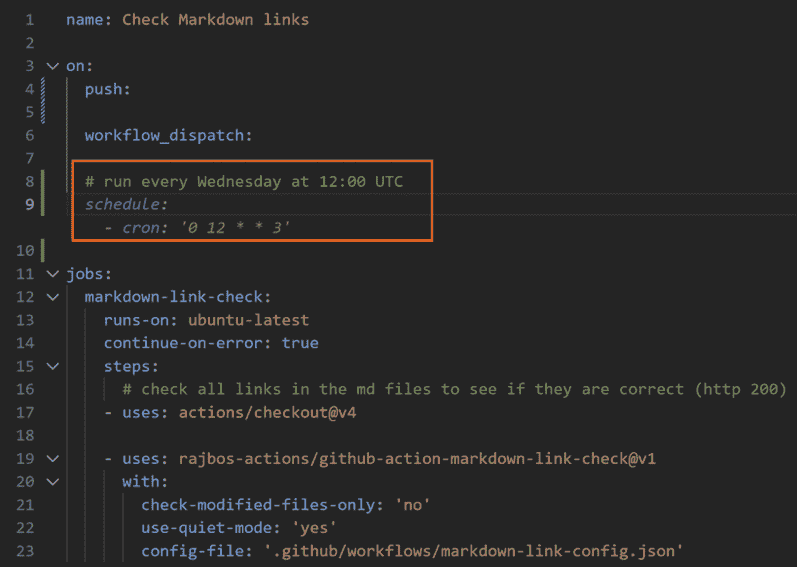
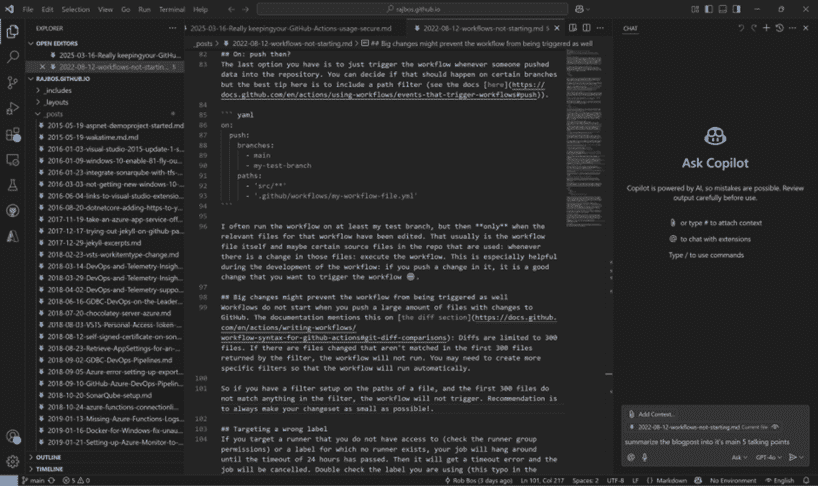
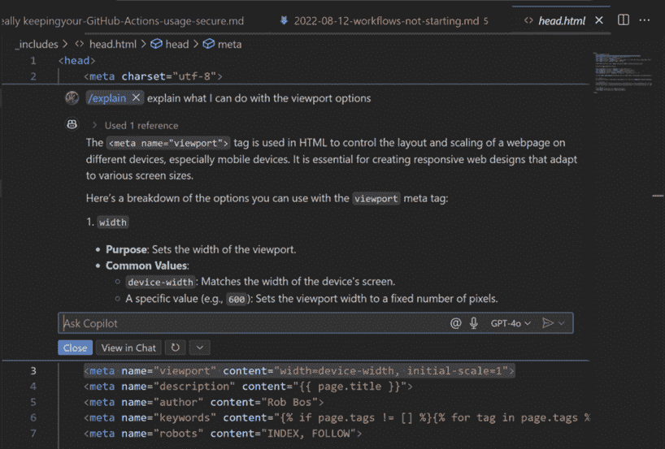
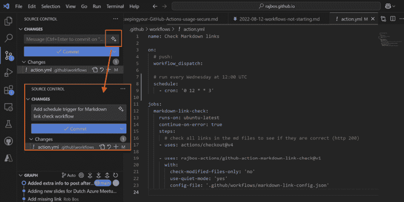
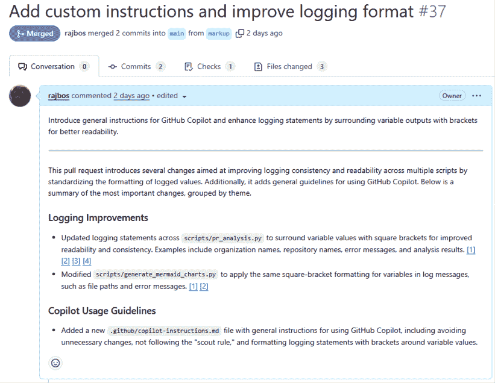
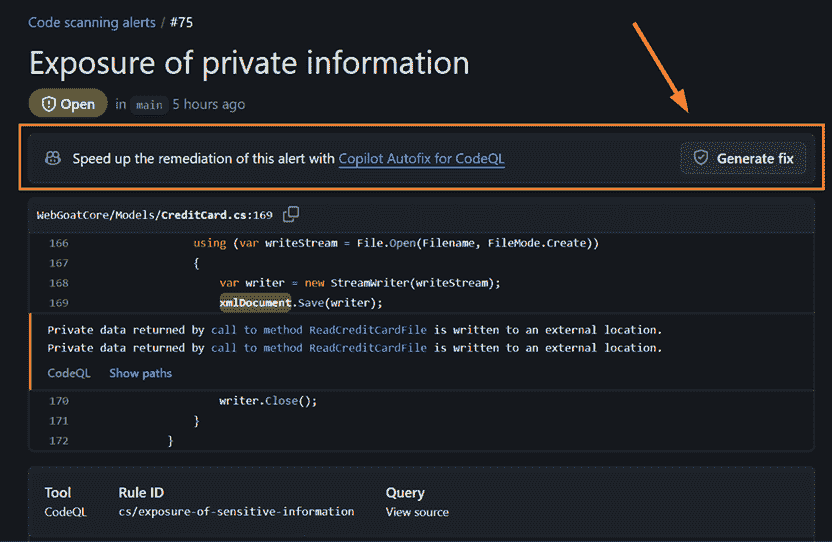

# 1

# 解释 GitHub Copilot

**GitHub Copilot** 是 GitHub 提供的一项服务，它帮助你在软件开发生命周期的所有步骤中工作：从构思、理解编写代码，到审查你的拉取请求和分析管道故障。通过使用我们所说的生成式 **人工智能**（**AI**），它帮助你加快常规任务，以便你可以专注于你做得最好的事情：为最终用户提供价值。

GitHub 将 Copilot 描述为你的编程伙伴：一个几乎了解所有编程语言、框架和知名编码模式的工具。它可以帮助你研究现有和新代码方向，可以帮助审查你的代码并提出改进建议，或者可以完成你正在进行的任务。它直观地理解你当前的代码和编码风格，并将遵循这些风格来匹配。我们甚至认为 GitHub Copilot 比人类编程伙伴更好，因为它不会对你提出的任何问题进行评判！记不起几年前学过的算法如何实现吗？你可能害怕向团队成员询问，但 GitHub Copilot 会乐意为你解释——而且，它还会在你的代码库上下文中解释它！

请记住，工具的名称也揭示了它在您使用中的最重要部分：它是一个 *共飞行员*，这意味着 *你* 是飞行员，*你* 掌控一切。你定义你向它提出的问题；你让它完成的场景；你请求它的帮助；以及你是否接受这些建议。最后，代码存储在带有 *你的* 名字的 **源代码管理**（**SCM**）系统中，而不是 GitHub Copilot 的名字。

本书将带你了解 GitHub Copilot 对 **软件开发生命周期**（**SDLC**）所有步骤的影响，从开始到结束。我们将解释工具的功能、生成式人工智能的基础知识以及如何利用 GitHub Copilot 获取最大价值。我们还将讨论可用的不同许可类型及其在您的编辑器或 GitHub 网页界面上的功能。

为了让事情开始运转，我们将探讨 GitHub Copilot 是什么以及它提供了哪些功能。它最初是编码编辑器中的一个扩展，现在已经发展成为一个完整的特性集，帮助你从编写代码到生成全新的想法，从分析拉取请求到帮助你修复管道错误，以及更多。这些功能内置到许多编辑器中，其中一些位于 GitHub.com 的网页界面内。

在本章中，我们将涵盖以下主题：

+   什么是 GitHub Copilot？

+   在编辑器中审查其他辅助功能

+   在 GitHub.com 上使用 GitHub Copilot 集成

|

## 随书免费福利

您的购买包括本书的免费 PDF 复印本以及其他独家优惠。请参阅序言中的 *本书的免费优惠* 部分，以立即解锁它们并最大化您的学习体验。|

# 技术要求

要使用 GitHub Copilot，您不需要使用 GitHub 套件中的其他工具。您可以在您选择的任何支持编辑器中对其任何文件使用它，无论它存储在哪里。如果您已经使用 GitLab、Azure DevOps 或 Bitbucket 等源代码控制系统，您仍然可以使用 GitHub Copilot。GitHub 是该产品的供应商，但使用 GitHub 本身不是必需的。

当然，如果您使用 GitHub，还有额外的功能可用，这将在 *第六章* 中详细介绍。能够使用 GitHub Copilot 的唯一集成是拥有一个可以用来登录的 GitHub 账户，然后可以将您的 GitHub Copilot 许可证与之关联。这个工具甚至作为一个免费层（有一些限制）提供，使其对所有 GitHub 用户都可用。哪些功能在哪个层可用将在 *第三章* 中解释。

# 什么是 GitHub Copilot？

GitHub Copilot 是一套工具，可以帮助您理解或生成代码，无论是通过帮助您在编辑器中编写代码，与您的代码库交谈以获取更多信息，还是从 GitHub 网页界面中的集成功能中获得帮助。

所有这一切都始于 GitHub Copilot 利用 **大型语言模型**（**LLMs**）来补充您正在工作的当前代码行，通过在您停止输入几毫秒或按下 *Return* 键时添加建议来实现。根据您的配色方案，建议在编辑器中以 *灰色* 或 *暗淡* 文本显示，位于您的光标后面。您可以在 *图 1.1* 中看到这一点，其中光标位于第 9 行。这也被称为“幽灵文本”。这段文本是您已经输入的代码的延续，GitHub Copilot 找到代码的最合理完成部分，并为您建议接受。

图 1.1：VS Code 中“幽灵文本”的示例

接受代码就像按下 *Tab* 键一样简单，并且幽灵文本将插入到您的光标处。光标将移动到插入文本的末尾。根据您正在做什么以及 GitHub Copilot 对建议的信心程度，您可以得到一个单词、一行完整的代码，或者多行代码。然后，您完全可以根据自己的意愿来决定如何处理这个建议：您可以使用它如提议的那样，您可以选择接受其中的一部分，或者您可以选择不接受任何部分。我们还看到，人们阅读建议后，会根据新的见解修改他们原本的方向或周围的代码。

除了建议功能，GitHub Copilot 还集成了聊天功能，你可以与工具就当前打开的文件进行对话。参见*图 1.2*的示例：

图 1.2：与 GitHub Copilot 的聊天对话示例

在聊天界面中，你可以提出任何你能想到的问题——以下是一些示例：

+   当前开源代码库的主要元素是什么

+   如何执行你项目中存在的测试

+   在你的测试套件中找到缺失的边缘情况

+   在你需要的任何**持续集成/持续部署**（**CI/CD**）系统中为你创建管道

可能性是无限的，完全取决于你。聊天界面是与你的代码互动的绝佳方式。无论你是刚开始接触开发的开发者，还是经验丰富的工程师：GitHub Copilot 为每个人提供了所需的东西。

如果你是新接触一个代码库，GitHub Copilot 可以帮助你快速找到你想要查看的部分，我们会觉得这特别有帮助。另一个很好的用例是当你在一个你不那么熟悉的开发语言中工作时：我们开始为之前没有使用过的编程语言编写代码做出贡献，因为 GitHub Copilot 帮助我们理解这些语言是如何工作的。如果你理解编程的基本知识，例如`if`语句、`for`循环和数组，你就可以利用 GitHub Copilot 快速取得很大的进步。即使你对这些基础知识并不完全理解，如果你有探索的心态，GitHub Copilot 可以通过一种实用主义的方式帮助你在这个新环境中导航：

+   你可以要求它为你解释这些功能，它将乐意一步一步地带你通过这些概念

+   你可以通过请求解释入口点在哪里或如何构建应用程序来快速找到新代码库的路径

+   你可以让 GitHub Copilot 通过使用图表来放置组件，为你解释应用程序，这样你可以快速了解后端和前端之间的集成点

由于 GitHub Copilot 是非评判性的配对编程伙伴，可以帮助你完成从超级基础任务到更复杂的编码概念，聊天功能是对于新手和经验丰富的工程师，以及两者之间的所有人都是一个伟大的工具。

对生成式 AI 的底层技术有一个基本的了解对于对这些工具带来的价值有现实的期望至关重要。GitHub Copilot 生成代码的方式在*第二章*中解释。有了这些知识，即使是经验较少的工程师也能利用 GitHub Copilot 在当前代码库的背景下研究并解释编码概念，他们可以逐一分析这些概念。由于他们明白需要仔细检查 GitHub Copilot 生成的代码，所以他们可以安全地验证自己的知识，并在一段时间内提高他们的编码技能。常规的编码实践仍然适用，我们通过编程景观引导这些工程师，并以这种心态审查他们产生的代码，以确保他们以安全的方式成长。所有这些都同样适用于其他非技术利益相关者。

虽然 GitHub Copilot 在大多数编辑器中提供的主要功能是建议和聊天，但一些编辑器甚至包含更多功能。例如，有些编辑器提供了内联聊天功能（见 *图 1.3*），可以直接在文本编辑器窗口中编辑一段代码。这个功能让你可以直接在你编辑的地方与代码互动，并且它会直接应用它提出的建议，并通过内联概述显示与你的代码的差异。

图 1.3：内联聊天对话示例

其他编辑器与其自身功能有深度集成；例如，有些编辑器利用其调试功能来查看测试执行期间的变量运行时值，或者可以查看性能测试的统计数据。常见的做法是寻找一个表示 GitHub Copilot 在编辑器的该位置或功能上可以执行某些操作的“魔法”图标。见 *图 1.4* 中的示例，其中 GitHub Copilot 根据当前更改的文件集生成一个 `git commit` 消息。

图 1.4：GitHub Copilot 在 git 提交窗口中的集成

现在我们已经简要概述了 GitHub Copilot 为你的编辑器添加的主要功能——包括你输入时的建议、与代码聊天以及内联聊天以创建内联更改——以及其他编辑器中的一些功能。在下一节中，我们将更详细地探讨哪些编辑器支持这些附加功能，以及它们是如何在主要功能之上实现的。

# 在编辑器中审查其他辅助功能

GitHub Copilot 的主要用例是在您编写代码时帮助您处理代码库。这是通过将现有**集成开发环境**（**IDE**）中的不同功能集成来实现的。这通常也被称为“编辑器”。您在编辑器中工作，以向您正在开发的应用程序或脚本添加新方法和功能。

## 拥有 GitHub Copilot 插件的编辑器

拥有 GitHub Copilot 插件的 IDE 列表仍在增长。目前，以下编辑器对 GitHub Copilot 提供了一些支持：

| **编辑器** | **建议** | **聊天** | **其他功能** |
| --- | --- | --- | --- |
| **VS Code** | 是 | 是 | 是 |
| **Visual Studio** | 是 | 是 | 是 |
| **JetBrains IDEs** | 是 | 是 | 是 |
| **Vim/Neovim** | 是 | 否 | 否 |
| **XCode** | 否 | 是 | 否 |
| **Eclipse** | 是 | 是 | 否 |

图 1.5：每种编辑器的三种类型功能概述

根据编辑器的不同，某些功能已被内置，专门为该编辑器工作，我们看到创建它们的团队相互学习，有时以适合他们编辑器设置的方式重建出色的功能。一个例子是 Visual Studio 与其性能分析器深度集成，在性能调整会话期间为 GitHub Copilot 提供额外的上下文：这是其他编辑器没有的功能。

## 编辑器之外的额外集成

除了编辑器之外，GitHub Desktop 工具还提供了额外的集成，让您可以使用任何 Git 仓库，无论您使用的是哪种版本控制系统：

+   VS Code 的**拉取请求**（**PR**）扩展与 GitHub Copilot 集成，可以编写 PR 标题和描述，甚至可以选择使用 AI 来审查 PR 中的更改。

+   甚至还有一个 GitHub Copilot 的**命令行界面**（**CLI**），可以提问并让 GitHub Copilot 直接从命令行对您的代码库进行必要的更改。我们将在*第五章*中深入了解 CLI。

+   此外，还有一个开源的 GitHub Copilot 语言服务器可用，允许任何人在使用 GitHub Copilot 许可证验证用户的情况下，将 GitHub Copilot 集成到任何客户端中。

这意味着包含 GitHub Copilot 的可能性是无限的。

## 编辑器功能发布计划

每个编辑器插件通常由 GitHub 或 Microsoft（因为他们拥有 VS Code 和 Visual Studio）的不同团队构建。VS Code 的 GitHub Copilot 功能是开源的，并且直接集成到 VS Code 仓库中的开源代码库！您可以在 [`github.com/microsoft/vscode`](https://github.com/microsoft/vscode) 找到该仓库，并跟踪他们的迭代规划。由于 VS Code 是微软目前的主要编辑器，支持许多语言和工具，我们经常看到新功能首先出现在 VS Code 中。它是首先尝试和测试新功能的地方。

由于 VS Code 的正常测试版本在 Insiders 发布中，因此跟踪和使用 Insiders 发布是在更广泛的受众获得正式发布之前看到新功能实际效果的最佳方式。您可以从 [`code.visualstudio.com/insiders`](https://code.visualstudio.com/insiders) 免费下载和安装 Insiders 版本。VS Code 每月都会有一个新的发布版本。插件是单独分版本的，并在整个月份内进行多次更新。

通常在 VS Code 之后获得新功能的编辑器是 Visual Studio，尽管有时 Visual Studio 团队有很好的想法，他们首先将其添加到 Visual Studio 中，然后 VS Code 团队在稍后的阶段也实现了这些功能。最终，这些功能会在其他大多数编辑器中出现，只要它们有意义或可行。例如 Vim/Neovim 这样的编辑器只有最小的用户界面，因此 GitHub Copilot 只能通过建议来工作，因为没有地方显示聊天界面。Visual Studio 通常每三个月发布一个新版本。插件是单独分版本的，可以在主要发布窗口期间多次发布。

IDE 功能在 *第四章* 中进行了深入解释。

在这一点上，我们已经探讨了编辑器之外可用的额外工具，例如 GitHub CLI 的扩展和 GitHub Desktop 的集成。我们了解到不同的编辑器遵循不同的更新周期，这会影响特定功能何时可能添加到您选择的编辑器中，甚至是否会发生这种情况。在下一节中，我们将探讨当您的代码存储在 GitHub.com 平台上时，该平台上可用的额外功能。

# 在 GitHub.com 上使用 GitHub Copilot 集成

如果你正在使用 GitHub 套件产品的其他部分，那么你还可以通过 GitHub Copilot 的工具大大增强这一体验。登录到 [`github.com`](https://github.com) 后，你可以在任何仓库的顶部与 GitHub Copilot 进行聊天（参见 *图 1.6* ）或在一个沉浸式窗口中打开它以进行聊天，而不需要仓库的上下文。这对于研究事物并有一个独立的、无上下文的侧边窗口在旁边快速查找信息非常有用。需要查找如何在特定的包管理器中安装包？那么这个聊天窗口就是询问这个问题的正确地方。个人来说，我们一直在浏览器中打开这个标签页。

图 1.6：GitHub 界面上的聊天

在聊天旁边，你也会在网页界面的很多地方找到 GitHub Copilot 的集成。按照 SDLC 的步骤，它从研究你想要构建的新功能并规划这项工作开始。GitHub Copilot 可以帮助你完成这两项任务。聊天界面有一个创建仓库问题的功能，只需告诉 GitHub Copilot 你想要这样做。然后它会提出问题标题和文本，包括你在聊天对话中收集的所有要求。这对于研究你的应用程序中新功能的接触点以及为问题描述找到更多上下文非常有用。然后你可以指示 GitHub Copilot 在仓库中创建问题，它会为你这样做，使用你的 GitHub 登录。这将确保问题贡献与你的用户相关联，以便未来跟踪，并将你使用 GitHub Copilot 所做的工作归功于你。

在开始创建问题的时候，也有集成功能，例如，可以引入来自管道运行的环境或代码扫描警报，并分配代码库中需要发生更改或将会受到影响的位置。你的问题中信息量越高，工程师（甚至 GitHub Copilot！）开始实施必要更改就越容易。

是的，你没有看错：GitHub 现在有了直接将问题分配给 GitHub Copilot 并让它尝试为你实施所需更改的功能！它将尝试确定要采取的步骤并实施更改，通过构建和或测试运行进行验证，然后为你创建一个拉取请求以供审查。

此外，如果你需要手动创建拉取请求，GitHub Copilot 可以帮助你根据你的更改编写标题和拉取请求正文。它会总结更改集，并会给出关于更改的详细描述，包括它们对应用程序的影响，甚至会在描述中标注相关更改的文件和行位置。参见 *图 1.7* :

图 1.7：GitHub Copilot 生成的拉取请求摘要示例

最上面的句子是工程师的描述，而所有以下内容都是由 GitHub Copilot 生成的。注意清晰的解释和包含对 GitHub Copilot 版本中更改的引用。这对于获取更好的拉取请求信息非常有用，因为这是许多工程师都臭名昭著地做得不好的地方。我们总是钦佩这些摘要的详细程度，因为它们比我们亲自创建的描述更能描述更改。

在创建拉取请求后，有一个集成可以让 GitHub Copilot 自动审查提出的更改，例如错误、可维护性、错别字等。它将对拉取请求进行注释并提供反馈，甚至可以创建您只需单击一下即可将其合并到应用程序中的建议。这大大节省了审查时间，以便在审查过程中找到低垂的果实，从而使团队成员可以专注于检查完整性、与应用程序架构和设计的匹配度等问题。

如果拉取请求被安全扫描（如代码扫描结果，GitHub 高级安全的一部分）注释，GitHub Copilot 可以在拉取请求反馈中审查发现并提出修复方案。这允许您在它们成为生产问题之前快速解决常见的编码问题，直接从 PR 界面进行。这个功能被称为 **GitHub Copilot 自动修复**，您可以在 *图 1.8* 中看到：

图 1.8：Copilot 自动修复的结果

另一个体现 GitHub Copilot 与 GitHub 工具套件之间深层联系的集成，是集成到 GitHub Actions 中：当工作流程（管道）运行失败时，有一个按钮可以启动与 GitHub Copilot 的聊天会话，一起查看错误，将其与您仓库中的信息进行映射，然后提出工作流程失败的原因并提出修复方案。您可以直接从聊天界面创建新的问题并规划要完成的工作！

在 GitHub.com 上，这些集成在 *第六章* 中有详细的解释。

现在我们已经概述了 GitHub Copilot 在 GitHub 网页界面上的不同集成。从通用聊天来询问常见的编码问题到创建问题和处理拉取请求，GitHub Copilot 在工程师日常流程的各个地方都有集成，这是非常有意义的。

# 摘要

在本章中，我们讨论了 GitHub Copilot 提供的功能，以便我们可以将它们放在正确的上下文中，从集成到您选择的编辑器到集成在 GitHub 的 Web 界面上。这不仅仅局限于 GitHub 工具套件，因为它由第三方供应商在不同 IDE 中提供。您可以使用 GitHub Copilot 针对任何代码文件，无论它存储在哪里。如果您不想，您的代码根本不需要存储在 GitHub 上。

我们探讨了主要的 IDE 功能，例如在您输入时提供编码建议、聊天界面和内联聊天。请记住，并非所有编辑器都提供完全相同的功能，因此请查看编辑器或插件的文档以获取更具体的信息。在 GitHub.com 的 Web 界面上，有一些功能可以帮助您在整个 SDLC（软件开发生命周期）中：从需求工程到创建问题再到创建拉取请求，都有与 GitHub Copilot 的集成，以帮助您为正在工作的软件增加价值。

在下一章中，我们将探讨 GitHub Copilot 如何产生您请求的所有建议和聊天答案。对生成式 AI 基础知识的良好理解对于对工具的帮助和不足之处有现实的理解至关重要。这将为您打下真正的理解基础，这样您就不会将这些工具视为魔法黑盒子，而是成为一个能够将这些工具发挥最大作用的强大用户！

|

## 获取本书的 PDF 版本和独家额外内容

扫描二维码（或访问[packtpub.com/unlock](http://packtpub.com/unlock)）。通过书名搜索此书，确认版本，然后按照页面上的步骤操作。 |  |

| *注意：请妥善保管您的发票。直接从 Packt 购买不需要发票。* |
| --- |
