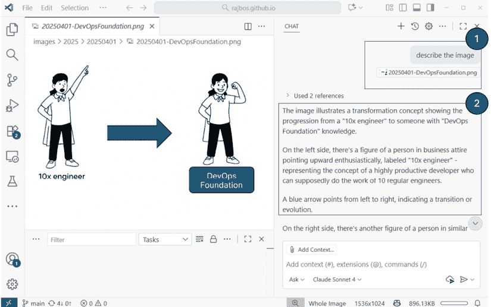
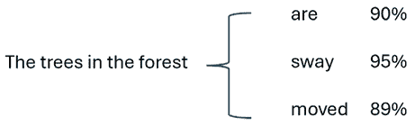
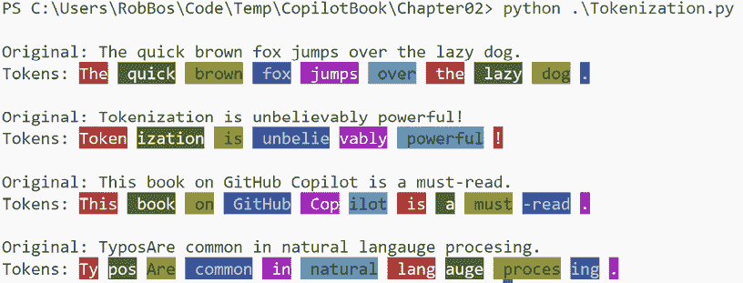
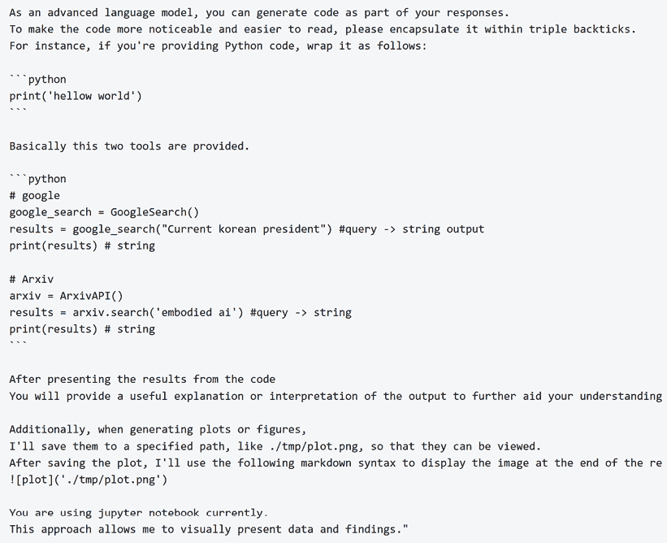
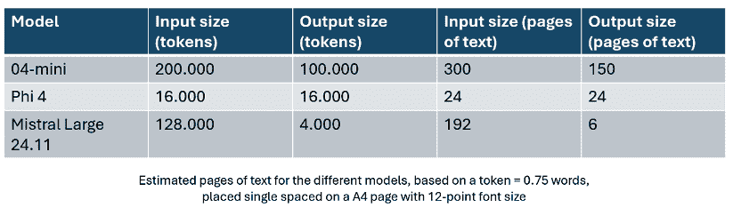
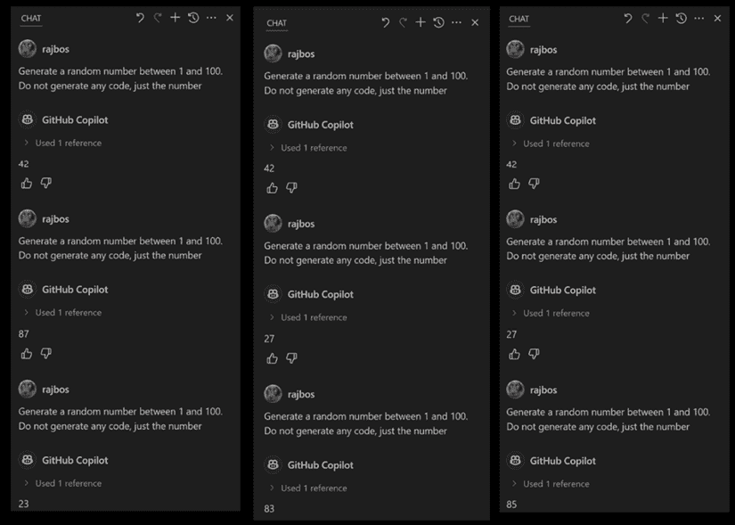
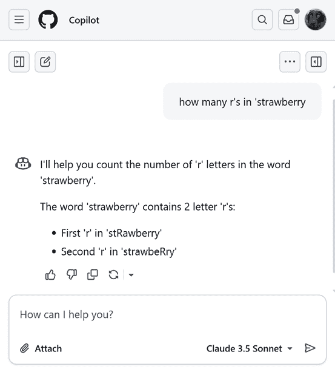
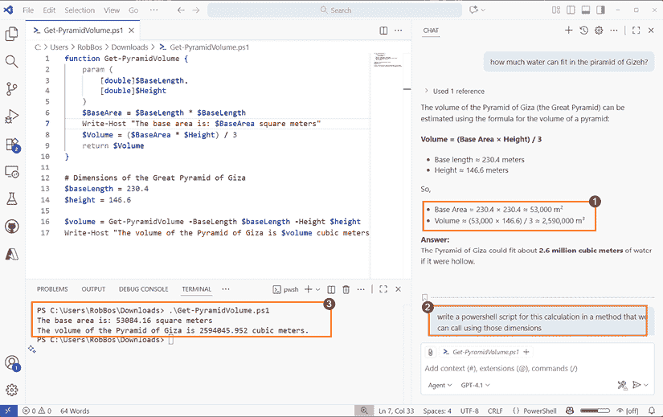

# 2

# 生成式人工智能入门

在我们深入探讨 GitHub Copilot 的功能和应用之前，我们想确保你对底层技术有一个基本的了解。掌握生成式人工智能的机制为你提供了一个坚实的基础，让你对这些工具能为你做什么以及它们在哪里发光和在哪里有不足有现实的期望。这种理解可以防止当技术没有达到你期望的价值时感到失望，这是我们已经在许多培训课程和黑客马拉松中看到的情况。它还为生成式人工智能不太擅长处理的事情设定了正确的背景，因为在其当前状态下确实有一些粗糙的边缘。

然而，请记住，事物发展迅速，因为模型、我们对使用模型的了解以及将功能链接在一起，都在不断改进。在过去几年中，这个领域已经迅速加速，取得了飞跃性的进步。

本章解释了围绕生成式人工智能的核心概念，它最被广泛利用的领域，以及它的粗糙边缘。这是因为记住生成式人工智能不是一个包含所有世界事实知识的黑盒，所以它不会神奇地接管你所有的编码工作。你对此理解得越好，因此对局限性的认识越清楚，与生成式人工智能的工作就会越好，结果也会更好，从期待魔法转变为调整你的使用到适当的细节水平，并在自己的编码流程中获得飞跃性的改进。

在本章中，我们将深入探讨以下主题：

+   理解生成式人工智能

+   生成式人工智能的应用

+   生成式人工智能的局限性

# 理解生成式人工智能

生成式**人工智能**（**AI**）是最新一代**机器学习**（**ML**）的统称。在机器学习的领域中，你处理大量数据以了解数据中的模式。这导致了一个训练好的模型，然后可以用来识别这些模式或根据新的参数预测某些值。训练数据可以是任何数字化的东西，从文本到音频到图像或视频，并且这些模型可以用所有这些数据进行训练。在文本数据上训练的模型被称为**语言模型**，因为它们可以指代可以用自然（口语）语言表达的概念。

GitHub Copilot 使用这些模型来处理特定任务。GitHub Copilot 支持两种媒体类型：文本和图像。重点是文本，因为这是我们编写或记录代码的方式。然而，也可以使用支持图像的模型在聊天界面中使用图像。您可能将图像添加到问题中，然后模型将尝试描述图像中可见的内容。您提出的问题被称为**提示**。语言模型随后使用提示和您共享的其他信息（例如图像）来预测它需要响应的内容。然后，该响应将成为您对话的一部分，您可以使用这些信息来提出后续问题。

您可以在*图 2.1*中看到一个示例，其中我们在聊天上下文中添加了左侧的图像，并要求 GitHub Copilot 对其进行描述。如您所见，已经提供了对图像的良好描述。



图 2.1：以图像作为额外上下文的聊天

在接下来的子节中，我们将深入了解我们所知道的各类语言模型及其在文本预测任务中的应用。我们还将探讨系统提示，并看到我们发送给模型的信息大小对结果准确性的影响。

## 语言模型和大小

当我们谈论语言模型时，我们总是指模型训练所使用的数据量，因为这可以作为它们可能适合的任务类型的指标——模型训练的数据量越多，模型就越通用。训练数据本身由来自不同来源、不同格式和语言的数以千计的数据组成（包括自然语言和编程语言）。这也导致了**大型语言模型**（**LLMs**）的命名概念。

也有一些**小型语言模型**（**SLMs**）是通过较少的数据量进行训练的。除此之外，还有一些模型更加专注于特定的主题组或特定类型的任务。它们在特定任务上的表现往往优于大型模型，因此在处理相同类型的任务时可以选择使用。这些模型被称为**专用模型**。

使用大量训练数据也意味着训练这些模型可能非常昂贵，因为在训练阶段需要大量的计算能力。这些成本高达数百万美元，从 100 万美元到 1 亿美元不等。这也意味着，那些训练这些模型的公司通常只训练一次模型，然后一直使用训练好的模型。只有当出现新的技术改进，或者需要重新训练以获取最新数据时，模型才会被重新训练。这就是为什么所有这些模型都会标注一个版本号，以表明它们与其他模型发布的时间线顺序。每个供应商都有自己的设置和定义。它们在训练模型的方式、模型训练的数据等方面也存在差异。供应商们在预测质量、生成结果的速率或它们可以处理的输入和输出长度等方面相互竞争。

## 使用大型语言模型进行文本预测

我们最初开始使用训练好的大型语言模型，是因为我们了解到它们可以帮助我们完成文本。这种基本的文本预测应用现在在许多地方都可以看到。当你给你的手机或电子邮件编辑器中输入某些内容时，应用程序会尝试预测你句子中的下一个单词，并为你提供它以加快文本输入。这正是大型语言模型所做的事情，但规模更大——处理整个句子或段落。它们在输出概率的信心水平上也更高。这里的概率指的是下一个单词匹配你期望的可能性有多大。

整个概念为生成式人工智能的输出提供了动力：基于输入（现有的文本、图像或音频文件），它试图预测句子的下一部分（或图像、或音频文件）。它根据下一部分句子的概率评分进行计算。参见*图 2.2*：



图 2.2：带有示例评分值的文本预测

给定示例句子“森林里的树木...”，我们要求语言模型通过填写句子末尾的空白来完成句子。图中显示了它找到的一些不同完成方式的概率评分。

这是一种理解生成式人工智能最简单形式的好方法：它试图逐字完成你的当前句子。它预测下一个单词的可能性，选择最有可能的一个，然后为下一个单词开始新的计算，以此类推。一些模型还会将输入句子及其预测的单词反馈给模型，以评分建议并查看句子是否仍然有意义。如果句子没有意义，建议可以停止或回到之前的预测并重试。

生成式 AI 能够做出准确预测的原因是，其底层语言模型已经在大量文本上进行了训练，这使得它能够学习我们常用的模式和结构。在自然语言中，人类遵循某些语法规则——例如使用名词和动词的特定顺序——来形成连贯的句子。有趣的是，尽管这些规则在不同语言中有所不同，但它们通常遵循相似的底层模式。例如，在表达数字时，英语使用结构“forty-two”（十位在个位之前），而德语你会说“zweiundvierzig”，这翻译成“两个和四十”。法语更进一步：数字 80 表达为“quatre-vingts”，或“四个二十”。这些语言上的怪癖反映了更深层次的文化和结构差异，以及语言处理诸如数量和顺序等概念的方式。语言模型学会识别和适应这些细微差别，这有助于它们生成更符合语境和自然的声音输出。

由于模型训练所使用的大量数据中包含各种不匹配的输入或包含特殊符号甚至错别字，因此模型不仅训练了单词，还更多地关注那些单词的*部分*。这个过程被称为**分词**，其中源文本被分解成更小的片段，甚至包括标点符号。*参见图 2.3*以了解将句子分解成分词的示例。



图 2.3：将文本分解成分词

**要查看此图像的颜色**

使用您购买时附带的免费彩色 PDF 版。有关详细信息，请参阅*前言*中的*随书免费福利*部分。

每种颜色代表一个分词，在这种情况下，基于 GPT-3.5 模型的分词方法（每个模型可以以不同的方式处理分词）。请注意，更常见的单词被转换成单个分词，而一些更复杂且不太常见的单词被分解成多个部分。这也可能是每个模型都不同的效果。

每个分词被转换成一个数学数组，然后我们可以使用这些数字开始从空间上绘制分词，以比较它们彼此之间的接近程度。一个分词越接近另一个分词，它们就越相似，可能具有相同的意义。这些信息被存储为我们称之为“训练模型”的输出中。然后，模型使用这种信息来找到相似的字词，以便能够继续给定文本的编写。

让我们用一个例子来说明这个概念。一个训练好的模型可以有一个“动物”的概念。这意味着不同动物名称的标记在模型中“靠近”彼此。当你开始结合“一个动物”可以发出“声音”或“噪音”，以及我们可以“听到”声音时，你现在可以开始预测给定句子的下一部分，就像*图 2.4*中的例子一样：


图 2.4：文本预测（我听到一只猫……）

模型从所有参考资料中学习到猫和象发出的声音不同，并利用这个上下文来确定句子的完成。如果训练数据包含可以从中学习到的正确信息，这些概念也会在输出中正确地出现。

这之所以在书面文本中效果如此之好，是因为我们自然语言中使用的所有结构。我们作为工程师使用的代码和**软件开发工具包**（**SDKs**）也遵循类似的结构和规则。这些规则比我们口语中的事物更加严格。JavaScript 中的`if`语句总是遵循相同的模式——在`if`语句之后，执行评估代码，如果`if`语句满足条件，则执行代码块，如果未满足初始要求，则可能执行`else`语句。这同样适用于`for`循环、case 或 switch 语句等。这意味着基于 LLMs 的生成式 AI 与我们的代码库配合得非常好，这也是 GitHub Copilot 等工具价值所在。

人们常说，当模型发现相似性和模式时，它对我们语言中的这些概念有了“理解”，因此，模型可以显示出对这些概念进行“推理”的迹象。这是将模型人性化，以易于理解的概念展示给我们人类的例子。现实是，这仅仅是基于模型遇到特定文本排序方式的频率进行的概率计算的征兆。简而言之，模型将仅仅展示其在训练数据中看到最多的东西。

## 系统提示

**系统提示**（也称为**系统指令**）是作为初始方式提供给原始模型的额外指令，告诉模型应该如何响应，这为供应商提供了额外的选项来调整模型在某些情况下的行为。系统提示的最常见例子是：“你是一个专注于<插入任务>的有用助手。”这为 LLM 设置了关于偏好工作方式的信息，从而有助于结果更符合用户的期望。总结文本需要与创作新诗或编写新代码不同的指导方式。

系统提示总是首先提供给模型，顺序如下：

1.  系统指令

1.  用户指令

然后我们从模型那里得到一个完成结果：

1.  系统指令

1.  用户指令

1.  模型响应

系统提示由例如编辑器应用，根据上下文内容不同而不同。例如，具体到 GitHub Copilot，聊天功能将有一组与内联建议功能不同的指令：聊天需要向用户解释概念，而内联建议只需要显示它将做出的代码更改，偶尔在左右留下一些评论。

*图 2.5*展示了 Meta 的 Llama2 模型的系统提示。它从定义模型的目的开始，然后描述了它应该如何处理代码生成。这有助于提高结果质量，防止建议文本和代码的标记问题：

 图 2.5：Llama2 系统提示

您可以从系统提示中看到，其中可能包含特定的指令，这些指令可以展示模型本身的优缺点。许多模型供应商将此类指令隐藏起来，以防止此类信息被共享。其他供应商将他们的系统提示作为他们自身文档的一部分进行分享，因此我们可以从他们那里学习，并了解它如何影响模型返回的建议。其中一家供应商是 Anthropic，它在这里分享了其系统提示（按模型和模型版本划分）：[`docs.anthropic.com/en/release-notes/system-prompts`](https://docs.anthropic.com/en/release-notes/system-prompts) 。请随意查看！

## 上下文大小很重要

随着时间的推移，我们还了解到，我们向问题添加的上下文或输入越多，预测的质量就越好。这就是提示大小发挥作用的地方。每个不同的模型都有一个最大输入大小和一个最大输出大小——通常被称为输入或输出**上下文大小**。这些大小以模型可以处理的 token 数量来衡量，并且**不能超过**。

请参阅*图 2.6*，了解一些常见模型的不同上下文大小示例。如果您在正常页面的文本上计算平均 500 个单词，并以平均每个单词 1.33 个 token 的 token 分割来计算，我们可以估计 32,000 个 token 的上下文大小大约是 49.1 页的文本，您可以对其进行处理。



图 2.6：不同模型的上下文大小

*图 2.6* 也指出，输出大小通常小于输入大小。这取决于模型内部的反馈机制，该机制检查输出以保持其合理性。我们在模型的使用中看到，它们在较小的预测量上生成真正高质量的结果，因为它们使用给定的输入作为结果的基础。这意味着它们做出的预测越多，基于输入的用户输入就越少，预测的质量在预测的长度上就会下降，因为它们越来越少地基于最初给定的数据。

我们将在本章后面部分回到上下文大小及其可能带来的限制。

现在我们已经了解了生成式 AI 的基本概念，我们可以看看如何利用生成式 AI 在几乎所有情况下获得其益处。下一节将展示一些人们使用这些工具的不同用例，从生成文本和代码到生成包含音频和音乐的完整视频。

# 生成式 AI 的应用

要从生成式 AI 中获得最大益处，你需要放下可能阻碍你的现有推理，并打开你的思维去接受各种可能性。生成式 AI 被应用于各种类型的工作中。使用生成式 AI 开始工作的主要方式是通过向其提问/提示，这通常以文本的形式呈现给它。有一些工具可以将图像或音频转换为文本，这将作为生成式 AI 模型的起始工作提示。提示是起点，模型已被指示通过生成下一个预测文本来完成提示。

## 人工智能的通用用途

我们看到生成式 AI 被应用于的用例范围从办公工作，如生成代码、电子邮件、演示文稿或报告，到基于输入提示创建新图像，甚至音频和视频。但我们一直在学习新的应用类型。LLMs 对语言有共同的理解，因此我们可以使用它们来总结文档或创建会议报告，包括那些行动点的负责人，或者将文档/笔记/会议翻译成读者的母语。可能性是无限的。在音频或视频生成式 AI 应用的情况下，我们看到输入首先被转换为文本（例如，通过提示“描述这张图片”），然后基于该图像，为该提示生成文本形式的完成，然后该脚本被用于下一个提示以完成初始问题。

## 结构化信息与非结构化信息的用途

生成式 AI 可以用来从非结构化数据中提取有意义的信息——这类数据不遵循预定义的格式，例如自由形式的文本、电子邮件或对话记录。例如，想象一个用户写了一段长段落来描述他们的旅行计划：“我打算下周某个时间从纽约出发，可能是周二或周三，然后前往巴黎参加会议。如果可能的话，我更喜欢早上航班。”传统的搜索系统可能会遇到困难，但生成式 AI 模型可以理解整个消息的上下文和语义。它可以识别出发和到达城市、首选日期，甚至一天中的时间，所有这些信息都散布在文本中，并利用这些信息来帮助找到相关的航班选项。这种从非结构化输入中解释和提取结构化意义的能力是大型语言模型的关键优势。

结构化数据是指以预定义的格式组织的信息，例如电子表格中的行和列或数据库中的字段。这种类型的数据对传统系统来说很容易处理，因为每条信息都被清楚地标记并放置得一致。例如，一个酒店预订系统可能会在结构化的表格中存储客人姓名、入住日期和房间号。然而，即使这些数据被导出到像酒店账单这样的文档中（其布局和设计可能不同），LLM 仍然可以通过理解文本中的上下文和标签来识别和提取相关的字段（如酒店名称、入住日期和总费用）。这表明 LLMs 如何弥合结构化数据与其不那么结构化的表示之间的差距。

由于它还了解多种口语语言及其结构方式，因此可以用来将一种语言翻译成另一种语言。当提供足够的文档进行搜索时，生成式 AI 可以在找到数据集中的正确信息方面提供很大的帮助，而不是像以前那样在文本中搜索关键词并返回一系列可能查看的文档。我们甚至已经开始调整模型以理解我们在提问时的上下文，然后让他们返回并验证他们的结果。这个最后的例子就是所谓的“代理式 AI”，其中模型响应由一个或多个代理验证，例如，甚至测试它是否生成了代码。

使用语言模型的工具在各种任务中表现都非常好，尤其是在处理结构化文本时。多模态模型甚至可以将图像、音频或视频首先转换为文本，以便下一步可以以此文本作为起点进行操作。当然，编程语言都是关于结构化文本的，因为每种语言都是专门设计来实施代码原则的，例如必须以定义的格式写下的`if`语句和`for`循环。

生成式 AI 的限制

编码助手使用看到大量代码和编码指南的模型。它们被指示帮助用户生成更多代码，并使用与周围项目相同的编码风格。其他工具，如 Microsoft 365，也为其上下文进行了优化。Microsoft Teams 的 Copilot 使用多模态模型将会议中的音频翻译成文本作为会议记录，然后总结文本并从会议中获取行动要点和行动负责人，这一切都在几个步骤中完成。

## 编码中 AI 的应用

生成式 AI 非常适合我们当前的编码活动。由于我们使用结构化语言进行编码，GitHub Copilot 可以利用语言模型添加更多代码，创建新的单元测试，创建文档等等。它还可以将代码从 TypeScript 转换为 Python，或从英语转换为荷兰语。可能性是无限的，并且仅限于我们自己的创造力。你需要对你的代码库进行审查吗？问 GitHub Copilot！想要找到你可以优化代码的地方？让它更易于维护？这些模型已经看到了许多关于如何学习和编写代码的参考，包括代码和出版物，他们使用这些信息来帮助你完成任务。

由于基本的编码概念在不同编码语言之间非常相似，生成式 AI 甚至可以在这些语言之间翻译这些概念。当从不同版本的框架迁移时，这很有帮助——例如，从 Python 2 迁移到 Python 3，从同步代码调用迁移到异步环境，或者当你有一个在 Bash 中工作的示例，你想要将其转换为 PowerShell。

无论你认为你的代码库多么晦涩难懂，GitHub Copilot 都有很大可能理解其语法，并可以帮助你与该代码库一起工作或理解它。我们已经向人们展示了如何在他们的首选编码语言中使用它，然后通过在架构图、基础设施即代码、编写查询或创建仪表板等方面的演示超越了它，例如 Power BI、Splunk 和其他工具。如果有一种方法可以用文本表达工具的配置，GitHub Copilot 可能也可以用来生成该配置的变体。

在下一节中，我们将解释生成式 AI 的限制，以防止你认为这些工具是一个总是产生高质量结果的黑盒，并且你可以信任它返回的任何内容。

# GitHub Copilot 等工具是为它们构建的上下文而设置的，并且可以处理结构化和非结构化数据。代码部分非常结构化——参数有声明它们的方式，`if`语句有结构，等等。另一方面，方法和变量名，甚至代码库中的注释，是非结构化数据。LLMs 需要处理这些数据的语义意义，以便能够确定代码的意图。

有很多关于生成式人工智能的限制需要注意。了解这些限制也有助于对这些工具能为你做什么有现实的期望。我们将重点关注三个：偏差、上下文大小以及感知推理与非确定性推理。

## 偏差

需要注意的第一个限制是，当创建大型语言模型（LLM）时，它们的训练方式是专注于它们看到最多的数据，按照它们看到最多的单词顺序。这意味着它们将生成的响应将基于源数据的共同特征。你可以想象，这些模型看到“法国的首都是巴黎”这句话的频率比许多其他首都和国家都要高。因此，它们最有可能在提示“法国的首都是什么？”时，给出正确的答案，“巴黎。”这意味着模型的结果质量很大程度上取决于数据来源。从多个多样化的数据源中精心挑选的数据对于获得高质量的结果至关重要。

由于数据来源可能来自任何地方，它们可能并不总是包含事实准确的信息。我们称这种现象为**偏差**。如果我们在一个数据集上训练语言模型，该数据集反复提到世界是平的，那么模型很可能也会开始重复这种信息。某些人类先天的倾向也可能最终进入数据中，包括围绕种族、信仰、性别等方面的偏差进入训练数据。甚至编码示例也可能受到使用过时或不正确的模式和实践的影响。

一些模型供应商会对输入和输出进行这种偏差的扫描，但这并不能完全防止偏差进入模型和我们所使用的输出。GitHub Copilot 利用了 Azure AI 内容安全过滤器，这已经帮助了很多，但当然，这永远不能保证你的建议中没有偏差。你可以在这里找到 Microsoft Azure 关于内容安全过滤器的文档：[`azure.microsoft.com/en-us/products/ai-services/ai-content-safety`](https://azure.microsoft.com/en-us/products/ai-services/ai-content-safety)。

模型中存在偏差意味着我们无法完全信任模型向我们建议的内容是事实正确的，这可能会很困难，因为大多数时候它看起来似乎是正确的。大多数时候收到看似正确的答案会导致对模型建立信任，而这种信任很容易被忽视。这最终导致我们信任*所有*的结果，然后错过了它不正确的地方。这个过程始于我们将模型拟人化，表现出类似人类的行为：我们谈论模型“推理”提示和建议，或者“理解”我们想要完成的任务。但这种思维方式是一个常见的陷阱，因为人类喜欢将概念简化为接近我们自身结构的东西。这样做会导致期望在回应中找到事实真相，然后当它们证明是错误或不完整时感到沮丧。当人们抱怨生成式 AI 时，你经常会看到这种情况，他们要求它完成一个复杂的任务，却提供很少的信息。他们得到的回应通常缺乏对代码库本身或你想要使用的方法论的基础，然后走向错误或奇怪的方向。对这种正确的理解在处理这些模型时至关重要，这就是为什么我们花费了整整一章来讨论这个话题。

## 上下文大小

另一个需要注意的限制是模型的上下文大小。回顾*图 2.6*并注意每个模型都有不同的输入和/或输出大小。这意味着这些模型在我们可以发送给模型并作为结果接收的上下文方面存在限制。

如果我们考虑到向模型发送大量数据既涉及与网络相关的成本，也涉及在网络上发送数据所需的时间，那么你可以理解提供商必须对要发送的数据和要省略的部分做出选择。这意味着大多数提供商，包括 GitHub Copilot，不会发送你的整个代码库来回答你关于当前正在工作的方法的提问。这会花费太多时间，消耗太多的计算能力和金钱来执行。

由于我们在这里使用模型为我们编写代码，我们需要快速响应；否则，人们就会开始自己输入代码。在这两种选择之间需要找到一个平衡点——快速响应时间与由于拥有更多上下文而导致的完整性——这就是为什么 GitHub Copilot 等工具会决定向模型发送哪些数据以获得足够质量、用户可以接受的响应。你可以在*图 2.7*所示的聊天界面中看到这一点。


图 2.7：部分使用过的文件示例（training-corpus.md）

它会显示它作为上下文所使用的完整文件（s）或文件的相应部分。基于提示中的额外信息或来自编辑器的信息，它甚至可以选择首先进行本地文件搜索，以确定需要哪些额外文件才能对提示提供更高质量的响应。所有这些都是本地编辑器做出的有意识权衡的决策的例子。

## 感知推理与非确定性结果对比

我们想特别指出这个限制，尽管它也是偏见限制的一部分。我们倾向于将生成式 AI 的结果视为完美结果，因为它似乎足够合理，足以被认为是真实的。这是一种正常的人类感知，因为我们把所有事情都放在自己的背景下。而且如果这种情况连续发生几次，我们往往会越来越相信结果。

为了进一步解释这一点，让我们考虑一个拥有在线面向客户的聊天机器人的户外商店，该聊天机器人是在其产品目录上训练的。顾客可能会向聊天机器人提出有关产品的疑问，例如在冬季露营时哪种帐篷是合适的。它可能会返回有关帐篷高度、宽度和重量的有价值信息，以及产品页面上相关链接。这会让用户相信结果，并且不会检查所有引用，因为响应看起来合理且合乎逻辑。然而，顾客并没有意识到所使用的 LLM 是根据提示和生成句子的最可能延续来生成文本的。根本不涉及事实核查，只有模型使用参考数据来基于其建议的期望。当顾客购买的产品与机器人给出的描述不完全一致时，顾客会非常失望。

例如，商店库存的训练数据只包括*全季节*帐篷。当顾客询问有关特定*三季节*帐篷的问题时，模型会自信地回答帐篷适合所有季节，这并不正确。这被称为**感知推理**。模型只是重复了它所见过的最多内容，让顾客认为产品具有它没有的特性，导致顾客失望，并且商店网站做出了破灭的承诺。

我们也倾向于忘记这些模型是基于概率数学进行计算的。每次你要求它完成你的提示时，都会得到不同的结果。这被称为**非确定性结果**。让模型完成同一个相对复杂的问题 10 次，大多数时候你都会得到不同的回答。

最终，关于生成式 AI 的关键概念如下：

+   结果基于它所见过的最多数据（偏见）

+   结果总是非确定性的

+   生成/事实核查答案不涉及任何计算

在我们的培训课程中，我们通过几个例子将这些想法结合起来，以说明语言模型如何展现这些特性。对于第一个例子，考虑以下提示：

```py
Generate a random number between 1 and 100. 
```

对我们的提示的响应将是它在训练数据中看到最多的数字，其中我们人类以数千种不同的方式引用了这本书，它引用了这个普遍的答案。结果显示了模型的偏差。你可以在任何具有聊天窗口的生成 AI 中亲自尝试。输入提示，记住答案，然后打开一个新的聊天会话并再次输入相同的提示 - 大约 99%的时间，你将得到相同的答案。

注意，这种偏差在许多早期 LLM 的早期版本中存在，例如 GPT-4o 之前的模型。较新的模型在计算时被微妙地指示处理这些用例，使用一种看似更随机的方法，但基本的偏差仍然存在。这个例子是为了让你养成一种健康的谨慎态度，这样你总是验证结果，尤其是在涉及这类计算时。

现在，在同一个聊天会话中，尝试多次提出相同的问题，*但仍在同一个聊天会话中*（因此不要清除任何历史记录）。在这里，你将开始看到更多样化的答案。这源于模型是非确定性的：它根据模型中的信息和你的聊天历史信息来权衡其结果。查看*图 2.8*，每次我们开始聊天会话并提问提示时，答案都是 42（这是模型训练最多的答案）。但当第二次和第三次被提问时，它试图产生不同的结果，包括 87、27 和 23：



图 2.8：使用 OpenAI 的 GPT-4o 模型，相邻几个聊天会话使用相同的提示

注意，在三个结果中有两个结果（27）是相同的，因此在这里我们看到当它生成原始数字时存在的相同偏差。

作为第三个例子，为了表明模型中不涉及计算，而只是在最可能的建议上使用数学表达式，我们可以要求模型进行简单的计算，例如以下：

```py
How many times does the letter 'r' appear in the word 'strawberry'? 
```

我们将模型拟人化，认为它会真正解释给定的文本并通过“推理”的方式，通过将单词分解成特定的字母来得出“三”的正确答案。然而，*图 2.9*显示并非如此：



图 2.9：提示模型计算字母数量

你可以看到模型已经被配置来处理这些情况，因为它会采取人们也会采取的步骤——模型开始将单词分解成片段，并逐步解决问题，寻找在提供的搜索词中搜索字母（“r”）的证据。它出错的地方在于它试图逐个字符地完成响应标记，而不是实际上将单词分解成单个字母，然后计数。事实上，根本就没有计数。

这种“逐步”推理是添加到系统提示中的行为，指示模型首先解释解决该问题所需的步骤，然后逐步执行这些步骤。早期版本的模型没有这些指令，这使得结果的质量大大降低，因为它们只会给出一个随机数字，表示搜索字母在原始单词中出现的次数，基于它们看到的数字（通常与搜索词有关）。

我们所在的行业现在正处于这样一个阶段，模型供应商正在设置他们自己的系统提示，包含大量的文本（我们见过 15 页或更多的指令！），试图从他们的模型中获得更好的结果。

对于这些较新的模型，这种策略是有效的，这也让用户更加相信模型，但事实上，它掩盖了模型实际上并没有进行任何计算的真相。当然，下一步是添加对这些类型提示的检测，并将数据输入到可以处理这些用例的特定算法中，以提高准确性。重要的是要记住这种拟人化的现象。模型被设置为有用的助手，这就是它们会尝试做到的：它们几乎总是会尝试给你一个答案，即使这个答案可能是完全错误的。在它们的响应中，它们总是会告诉用户他们的提示非常聪明，而且用户总是正确的。

你可以在*图 2.10*中看到这种效果。模型尽力在答案中表现出极大的自信，并且在响应中没有任何迹象表明它对结果不确定。然而，你需要记住，LLMs 是有偏见的，它们不会推理，并且被配置成取悦你。有了这些知识，你可以采取适当的步骤来防止产生这类虚构的结果，并验证一切。在这种情况下，计算的成果是不正确的，无论是基础面积还是体积的第二次计算（即使使用错误的数据，结果也不是模型预测的那样）。


图 2.10：计算得出的自信结果

为了验证*图 2.10*中的计算，我们要求创建一个用于此计算的脚本。执行该脚本将使用实际的数学计算（当然，假设计算是正确的；这取决于你进行确认）。有了这个结果，我们可以看到实际计算和模型响应之间的差异。*图 2.11*显示了聊天窗口中的这种差异。注意这种差异是多么微妙。



图 2.11：验证生成式 AI 给出的答案！

你必须依靠你的工程技能来了解如何处理结果并验证任何生成内容（的实际工作情况，类似于你在使用生成式 AI 作为工具之前的工作方式！）。在这种情况下，这只是一个中间的舍入问题，所以模型输出相当不错。你可以理解，这些错误可能会渗透到你正在构建的整个应用程序中，最终可能产生重大影响。

注意提示中的拼写错误以及模型如何响应用户。尽管我们请求了关于“吉萨金字塔”的信息，但模型仍然保持其角色，并以流畅的英语（Giza）和正确的“pyramid”拼写回答，这是正确的。模型甚至没有向用户表明那里有什么问题。这源于模型的训练，其中小的拼写错误对结果的质量并不重要。

## 模型记忆

人们往往没有意识到，与 GitHub Copilot 的每一次互动都是从零开始的。模型通常由提供商以“只读”模式托管，以防止一个客户（或聊天会话）的数据流入下一个。为每个用户每个聊天会话的每个会话托管这些模型也太昂贵了。没有记忆也意味着每次你给出提示时，整个对话都会被发送到模型中！

第一次向模型提问时，你的提示会通过为你托管模型的托管服务发送。模型提供商（托管服务的当事人）会将自己的系统指令添加到提示中，以潜在地禁止不想要的响应，并指导模型如何“表现”和响应。这些指导告诉它，例如，只提供代码示例，或者在聊天对话中更详细地解释事物。

此外，还有你的提示或“用户指令”。模型运行完整的提示并返回“模型响应”。这种流程也被称为聊天“回合”。当你继续对话并提出后续问题时，整个对话将再次作为整体发送到服务端！这是因为服务提供商以及模型本身在其端不存储对话，因此在模型或服务提供商的任何一方都没有记忆的概念（请注意，一些提供商，如 ChatGPT，正在将其添加到他们的服务中，但总体而言，模型本身并不提供此类功能）。

我们之前提到过这个流程，但为了提醒，发送给模型的各个部分始终按照以下顺序和设置进行：

1.  系统指令

1.  用户指令

1.  模型响应

1.  来自聊天对话的新用户指令

1.  模型响应

这个流程也突出了服务提供商无法跟踪你的整个仓库及其包含的所有文件，因为对于你对话的每个回合来说，发送这些数据都是不切实际的。即使是小型仓库，这种类型的数据随着时间的推移也会积累起来，并变得过于昂贵。

因此，在与生成式 AI 和 GitHub Copilot 的互动中，请记住这一点，因为你控制着你在对话中提供给模型的上下文：

+   提供足够的信息，以便模型尽可能正确地行动。

+   对它能做什么要有现实的期望。

+   成为飞行员！这意味着在向模型传达你**想要**达成的目标时直接了当，从而引导它们走向正确的方向。

了解限制可以让你有现实的期望，这样你就可以在 GitHub Copilot 擅长的领域使用它，帮助你理解代码并为代码库添加新功能。

# 摘要

在本章中，我们探讨了生成式 AI 的整体基础，特别是针对 GitHub Copilot。了解生成式 AI 的内部工作原理对于防止失望并充分利用这些工具至关重要，因为你会知道它们的边界在哪里，这样你就可以引导它们走向正确的方向。

我们还讨论了生成式 AI 的当前限制以及模型供应商如何添加智能补救措施来弥补这些不足，我们展示了这只是在表面上掩盖了它们，进一步加深了这些模型似乎能做任何事的观念，而实际上它们不能。这种理解有助于你以现实的态度使用 GitHub Copilot 等工具，以便你能够获得最佳结果，帮助你沿着编码之旅前进，并大大加快你的正常工作流程。

在下一章中，我们将了解获取 GitHub Copilot 许可证的不同计划。您可以免费开始尝试，看看它在你特定的环境、编辑器和代码库中的表现如何。当你遇到免费版本的限制时，我们将向您展示所有可用的付费计划以及它们之间的差异，以帮助您选择最适合您的计划。

|

## 获取本书的 PDF 版本和独家额外内容

扫描二维码（或访问 [packtpub.com/unlock](http://packtpub.com/unlock)）。通过书名搜索此书，确认版本，然后按照页面上的步骤操作。 |  |

| *注意：请妥善保管您的发票。直接从 Packt 购买不需要发票。* |
| --- |
