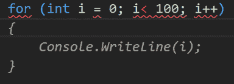
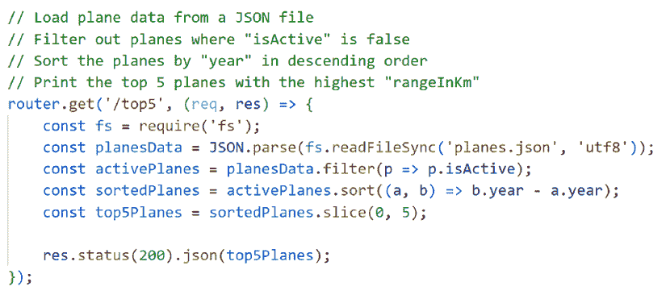
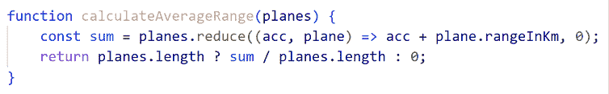
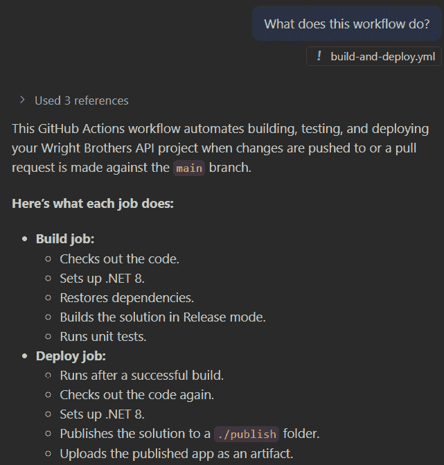
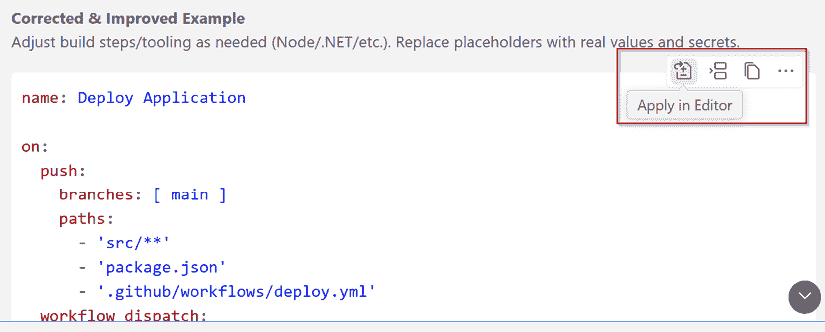
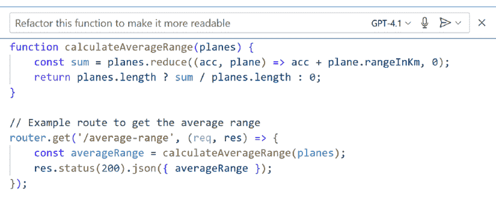
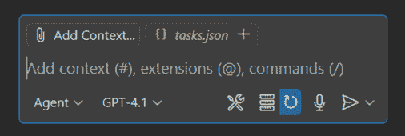
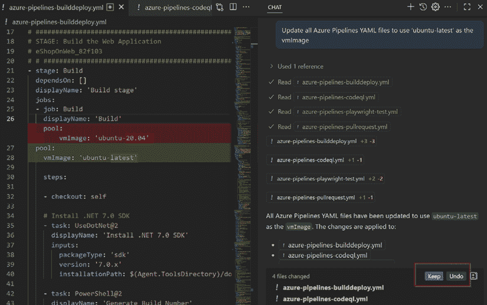

# 4

# 在您的 IDE 中精通 GitHub Copilot：内联建议、聊天和代理模式

GitHub Copilot 不仅提供对不同的订阅计划的访问。一旦在您的 IDE 中启用，Copilot 就成为您日常工作流程的积极部分。它可以实时建议代码，响应自然语言注释，帮助解释代码的复杂部分，甚至自动化大规模更改。了解这些功能如何在您的开发环境中工作，是有效和负责任地使用 Copilot 的关键。

在本章中，我们将逐步探索 Copilot 的 IDE 功能。您将了解补全如何加快常规编码，如何将注释转换为实际实现，以及内联建议如何适应您项目的上下文。我们还将涵盖 Copilot 问答模式以提供对话式帮助，Copilot 编辑模式以重构和改进，以及 Copilot 代理模式以在您的存储库中自动化多步任务。在此过程中，您将看到从 JavaScript 函数到基础设施即代码模板的各种实际示例，我们还将强调常见陷阱，以便您在将 Copilot 引入工作流程时避免错误。

到本章结束时，您将清楚地、亲手地了解 Copilot 如何集成到 IDE 中，以支持您的整个开发过程，从编写单行代码到管理多个文件中的大规模更改。您还将看到如何将这些功能应用于应用程序代码、基础设施模板、CI/CD 工作流程和文档。

在本章中，我们将涵盖以下主题：

+   不是一个自动驾驶仪，而是一个辅助驾驶

+   代码补全：核心体验

+   注释到代码：将自然语言转换为工作代码

+   内联建议和上下文感知：边打字边实时预测

+   GitHub Copilot 问答模式：IDE 中的对话式辅助

+   GitHub Copilot 编辑模式：即时重构和改进代码

+   GitHub Copilot 代理模式：自动化多步任务

+   结合功能以实现实际工作流程

+   不同 IDE 中的 GitHub Copilot：相同之处和独特之处

# 技术要求

如*第一章*所述，GitHub Copilot 与多个编辑器无缝集成，例如**Visual Studio Code**（**VS Code**）、**Visual Studio**、**JetBrains** IDEs（例如**PyCharm**和**IntelliJ IDEA**）、**Neovim**、**Eclipse**和**Xcode**。虽然一些功能将首先在 VS Code 中推出，但包括代码补全、内联建议和 Copilot 问答在内的核心功能在所有这些环境中都可用。这确保您可以在最适合您的工作流程和编程语言偏好的编辑器中使用 GitHub Copilot。

# 不是一个自动驾驶仪，而是一个辅助驾驶

在继续之前，值得强调的核心哲学是：您始终是飞行员。GitHub Copilot 在那里是为了协助、加速和激发灵感，但您决定要编写、接受或修改的代码。将 GitHub Copilot 视为一个有帮助的队友，他可以建议下一步，解释复杂的代码片段或生成测试，但最终的决定权始终属于您。

在您的 IDE 中安装并激活 GitHub Copilot 后，您会注意到它在您输入时几乎立即开始建议代码。无论您是在使用 C#、Python、JavaScript 还是其他数十种语言，GitHub Copilot 都可以做到以下几项：

+   预测并完成代码的行或块

+   将自然语言注释转换为真实代码

+   为复杂部分提供文档或解释

+   根据请求重构或改进现有函数

+   在编辑器中直接回答“我该如何……”的问题

+   使用代理模式自动化多步更改

您将看到 GitHub Copilot 的“幽灵文本”建议实时出现，并且您可以通过侧边栏的 GitHub Copilot 或聊天面板进行交互以获得更深入的帮助。例如，假设您正在开始一个新的 Python 函数用于数据处理。一旦您编写了描述性的注释，GitHub Copilot 就会提出相关的代码块。如果您遇到困难，您可以在侧边栏中打开聊天窗口，请求解释、测试用例或快速重构，而不会打断您的流程。

然而，在使用 Copilot 时，请尽量避免以下常见陷阱：

+   **将 Copilot 视为黑盒**：盲目接受建议可能导致微妙的错误或不符合您风格的代码。

+   **忘记功能可用性可能因 IDE 而异**：并非每个编辑器在第一天都支持 GitHub Copilot 的所有功能。如果您缺少一个功能，请检查文档。

+   **假设 GitHub Copilot 总是会“正常工作”**：GitHub Copilot 依赖于它所看到的上下文。如果您的代码不完整或含糊不清，建议可能不太准确。提供清晰的注释并以小步骤编写代码可以提高结果。

如前所述，Copilot 可以在流行的 IDE 中工作。在下一节中，我们将从一般概述转向更深入地了解其功能如何在编辑器内部工作。您将看到 Copilot 如何通过提供补全、将注释转换为代码、协助内联建议和支持代理模式来与您的编码环境集成。

# 代码补全：核心体验

GitHub Copilot 最基础的功能是代码补全。随着您的输入，它分析周围的环境，例如变量名、函数签名、注释和附近的代码，以预测您可能需要的下一个内容。这些预测以淡灰色“幽灵文本”的形式直接出现在您的编辑器中，提供下一个单词或行，甚至是一个完整的代码块。这种无缝集成允许您更快地完成日常开发任务，同时保持对编辑器的关注。

例如，如果您正在用 C#编写代码，并且想要遍历数字并显示它们，您可能从这样一个简单的`for`循环开始：

```py
for (int i = 0; i < 100; i++) 
```

根据您开始的循环结构，Copilot 预测您可能想要输出`i`的每个值，并建议使用`Console.WriteLine(i);`语句。这不仅节省了时间，还减少了小错误的可能性，例如偏移量错误或遗漏属性引用。

您可以在*图 4.1*中看到结果。



图 4.1：实际操作中的占位文本建议；C#中的 for 循环代码完成建议

这些完成建议有助于您保持流程，尤其是在重复结构、标准库调用或您经常使用的代码模式中。

## 接受、循环和拒绝建议

Copilot 提供了几种与代码建议交互的方式：

+   **接受**：按*Tab*键（或您编辑器中的等效键）接受建议并将其插入到您的代码中

+   **循环**：使用键盘快捷键，如*Alt* + *[* 或 *Alt* + *]*（VS Code 默认设置）在可用时滚动查看多个建议

+   **拒绝**：如果当前建议不符合您的需求，请按*Esc*键将其忽略，或者继续键入

这些选项允许您快速测试替代方案，找到最合适的代码，或者如果没有任何一个完全符合，可以返回编写自己的实现。

以一个例子为例，输入带有三个`Option`注释的`squareAll(nums)`存根，然后暂停。Copilot 首先提出`return nums.map(n => n * n);`作为第一个完成建议，当您按*Alt* + *]*循环时，第二种风格作为一个幽灵行出现，`return` `nums.reduce((acc, n) => { … })`，如*图 4.2*所示。按*Tab*键接受您想要的版本，按*Alt* + **返回，或者按*Esc*键并继续编写，如果都不合适。

![图 4.2：在 VS Code 中循环到减少替代方案图 4.2：在 VS Code 中循环到减少替代方案## 完成建议的最佳实践要从 Copilot 的代码完成建议中获得最大价值，请记住以下实践：+   **审查每个建议**：GitHub Copilot 的预测速度快，但并不总是完美。始终检查建议的代码的正确性、安全性和适用性。+   **使用常规模式**：代码完成在重复或模板代码，如日志记录、数据解析或测试脚手架中表现最佳。+   **上下文很重要**：您周围的代码和注释越相关，Copilot 的建议就越准确。## 避免的常见陷阱虽然 Copilot 的完成建议可以加速您的工作流程，但有一些常见的陷阱需要注意：+   **接受未经验证的建议**：在没有审查的情况下信任完成建议可能会引入逻辑错误、安全漏洞或不符合您团队标准的代码+   **缺少更好的替代方案**：在未遍历选项的情况下接受第一个建议可能会导致你忽略更好的或更符合习惯的实现。+   **过度使用不熟悉的代码中的补全**：依赖 GitHub Copilot 在你不理解的编程语言或代码库中生成代码可能会导致混淆或模式不匹配。GitHub Copilot 的代码补全是一个生产力提升工具，而不是你个人判断的替代品。使用它们来保持动力，但始终花点时间检查细节。通过练习如何遍历、接受和拒绝建议，你可以增强塑造 Copilot 输出以符合项目需求的能力。有了这些机制，我们现在可以超越简单的补全，看看 Copilot 如何直接从自然语言注释生成代码。# 注释到代码：将自然语言转换为工作代码 GitHub Copilot 的一个突出特点是它能够将自然语言注释直接转换为草稿实现。通过在注释中描述你想要的内容，就像你向同事解释一个想法一样，你可以提示 GitHub Copilot 生成完整的代码片段、函数，甚至整个类。你可以在*图 4.3*中看到这个功能的效果。

图 4.3：JavaScript 中的注释到代码转换

这种方法可以加快你的工作流程，并使实现想法变得更容易，即使在你不记得确切语法或最佳实践的情况下。

## 编写自然语言提示

要充分利用注释到代码的转换，请记住以下指南：

+   **清晰直接**：具体明确。编写如`// 将摄氏度转换为华氏度`这样的注释，而不是模糊的笔记，如`// 转换温度`。

+   **提及边缘情况或要求**：如果你需要错误处理或特定的库，请在注释中提及。请参见以下示例：

    ```py
    // Parse a JSON string into an object
    // If parsing fails, return an empty object instead of throwing an error 
    ```

Copilot 将识别到错误处理的必要性，并在 JavaScript 中建议使用 try-catch 块。

+   **使用上下文**：周围的变量名和函数签名有助于产生更好的结果。请参见以下示例：

    ```py
    def calculate_discount(price, discount_rate):
    # Apply discount only if rate is between 0 and 1 
    ```

在这里，Copilot 可以看到函数名和参数，更有可能生成正确的逻辑，例如限制无效的速率或正确应用公式。

让我们看看两个快速示例来具体说明。例如，如果你需要一个返回数组中最大值的函数，可以在函数上方添加一个清晰的注释，如下所示：

```py
// Find the maximum value in an array
function getMax(arr) {
} 
```

GitHub Copilot 使用此注释以及周围的代码上下文来建议相关的实现：

```py
 // Copilot suggests:
    return Math.max(...arr); 
```

这里是另一个处理日期的例子：

```py
// Format a date as YYYY, MM, DD
function formatDate(date) {
    // Copilot suggests:
    return date.toISOString().split('T')[0];
} 
```

你的注释越清晰、越精确，生成的代码就越有帮助。

## 避免的常见陷阱

在为 Copilot 编写自然语言注释时，请注意，某些方法会降低建议的质量。注意以下常见问题：

+   **模糊的注释**：如`//处理数据`之类的注释会导致通用或不相关的代码。

+   **省略重要细节**：未提及输入类型或预期结果可能会导致建议不完整。

+   **注释中要求过多**：在注释中包含多个任务可能会使 Copilot 的建议不够准确。

总是审查和测试 GitHub Copilot 生成的代码。将每个建议视为起点，而不是最终解决方案。我们建议添加集成或单元测试来验证代码的正确运行，并在将代码推送到上游之前在本地执行这些测试。

通过遵循这些指南，您的注释为 Copilot 提供了生成更准确草稿实现所需的清晰度和上下文。

现在我们已经看到了自然语言提示如何塑造 Copilot 的输出，让我们看看内联建议是如何在您打字时实时工作的。

# 内联建议和上下文感知：边打字边实时预测。

GitHub Copilot 不仅对注释做出响应，它还会监视您的输入，并根据周围上下文提供实时建议。这个**内联建议**功能就像有一个知识渊博的同事在安静地预测您的下一步，节省您的按键，并呈现您可能没有考虑到的解决方案。

内联建议会以淡灰色“幽灵文本”的形式直接出现在您的编辑器中。Copilot 不仅分析您正在输入的内容，还会分析附近的变量、函数名、数据结构和甚至文件名，因此其建议是根据您当前的任务定制的。

上下文感知是使 Copilot 的内联建议感觉相关而不是随机的因素。例如，如果您正在 Dockerfile 中工作，Copilot 可能会提出有效的 FROM 和 RUN 指令，而在 SQL 文件中，它可能会建议一个 SELECT 查询模板。通过将建议建立在上下文中，Copilot 帮助您继续前进，而无需中断注意力去查找语法或样板代码。

内联建议之所以强大，是因为它们不仅限于完成单行。GitHub Copilot 经常可以生成多行代码片段或完整的块，例如函数体、配置部分，甚至是链式 API 调用。以下是一些示例：

+   在 JavaScript 中，如果您开始定义一个循环，Copilot 可能会提出包括初始化、条件和增量逻辑在内的整个循环结构。

+   在 Terraform 中，输入资源块的开始部分可以提示 Copilot 草拟整个部分，包括预填充提供者、参数和变量引用。

+   在 Python 中，开始定义一个处理列表的函数可能会导致 Copilot 建议一个包含迭代、条件语句和返回语句的完整函数体。

这些建议在加速重复性或模板化工作同时，引导你遵循最佳实践。通过将上下文感知与多行补全相结合，GitHub Copilot 不再像是一个自动完成工具，而更像是一个合作伙伴，它看到你的代码走向，并帮助你更快地到达那里。

例如，在 JavaScript 中，如果你开始输入一个函数，GitHub Copilot 会根据函数名和参数预测函数体：

```py
function calculateAverageRange(scores) {
    const sum =
} 
```

这里，它从函数名（`calculateAverageRange`）和参数（`planes`）中推断出你的意图，正如我们在 *图 4.4* 中可以看到的。



图 4.4：内联建议完成函数体

或者，如果你想计算一个数组的总和，你可以从一个简单的函数轮廓开始，如下所示：

```py
// Calculate the sum of an array
function sum(arr) { 
```

当你输入时，GitHub Copilot 预测可能的实现并建议以下代码来完成它：

```py
 return arr.reduce((a, b) => a + b, 0);
} 
```

GitHub Copilot 的上下文感知能力不仅限于当前行 - 如果你之前已经声明了一个变量或资源，GitHub Copilot 可能会在后续建议中引用或使用它。

## 内联建议与代码注释的区别

容易将内联建议与代码注释混淆，但它们是针对工作流程中不同时刻的不同工具：

+   通过对代码添加注释，你用自然语言注释明确地描述你的意图，Copilot 根据你的描述生成代码。请看以下示例：

    ```py
    // Load data from a JSON file
    // Filter out inactive users
    // Return top 5 by last login 
    ```

+   使用内联建议时，Copilot 预测你在使用函数名、参数、附近变量和文件上下文输入代码时的下一步。例如，你可能会输入以下内容：

    ```py
    for (const user of users) 
    ```

Copilot 可能会建议以下内容：

```py
console.log(user.name); 
```

将代码注释视为你用普通语言告诉 Copilot 你想要什么，而内联建议是 Copilot 在你编写时预测自然下一步。结合使用，它们形成了一对强大的组合：一个是明确的指导，另一个是预测性帮助。

## 最佳实践

为了充分利用 Copilot 的内联建议，当编写代码时，请考虑以下实践：

+   **利用上下文**：首先定义变量和函数签名。随着 GitHub Copilot 从你的即时上下文中学习，其建议的相关性会更高。

+   **小步骤最有效**：逐步编写代码。当代码的结构和意图表达得清楚时，GitHub Copilot 生成的建议会更加精确。

+   **使用模式**：内联建议在应用于重复结构（如循环、过滤器、资源块和遵循良好模式的配置部分）时最为有效。

## 需要避免的常见陷阱

尽管 Copilot 的内联建议可以节省大量时间，但也有一些限制和风险需要注意：

+   **忽略项目标准**：GitHub Copilot 可能会建议不符合您项目命名约定或风格指南的代码，因此在接受之前请务必进行审查。

+   **大或通用的建议**：多行建议很有帮助，但可能会引入不符合您需求的额外代码或假设。

+   **上下文混淆**：在高度复杂或模糊的文件中，GitHub Copilot 的猜测可能不准确。考虑简化代码或添加注释以提高清晰度。

将 GitHub Copilot 的内联建议视为您自己想法的加速器。接受适合的部分，根据需要编辑，并丢弃不适合您上下文的部分。继续测试新代码以确保其按预期工作。添加自动化测试（使用 GitHub Copilot）可以帮助做到这一点。

通过了解 Copilot 如何提供内联建议并适应您代码的上下文，您可以利用其预测您下一步行动的能力，从而加速日常任务。

在这个基础上，我们现在可以看看 Copilot 如何超越无声的预测，并通过询问模式提供对话辅助。

# GitHub Copilot 询问模式：IDE 中的对话辅助

并非每个 IDE 都实现了 GitHub Copilot 聊天功能。例如，VS Code、JetBrains IDE 和 Visual Studio 提供了用于对话交互的专用面板，而其他编辑器，如 Neovim，则没有，因为它们缺乏显示聊天窗口的用户界面。

支持的位置，**GitHub Copilot 询问模式**允许您使用自然语言问题与您的代码库进行交互。您可以请求解释复杂的逻辑、生成测试、起草文档，甚至获得配置文件的指导，所有这些都不需要打断您的工作流程。Copilot 询问模式在您需要上下文感知的帮助、想要理解不熟悉的代码或需要自动化重复的文档和测试生成活动时特别有用。

## Copilot 如何收集上下文

当您使用 GitHub Copilot 聊天功能时，IDE 会将与服务相关的您的工作空间的部分内容共享，以帮助生成有意义的响应。这可能包括您正在工作的文件、最近的编辑或对附近代码的引用。每个 IDE 集成对此的处理略有不同，但目标相同：提供足够的信息，以便 Copilot 能够生成与您的项目相一致的回答和建议。

例如，在 VS Code 或 JetBrains IDEs 中，Copilot Chat 可以使用打开的文件加选定的文本作为基础点。在没有聊天面板的编辑器中，如 Neovim，此集成不可用，因为没有界面供 Copilot 显示对话结果。

## 使用 GitHub Copilot 询问模式

GitHub Copilot 询问模式将对话式 AI 的功能带入您的编码工作流程。您只需在聊天面板中键入一个问题或请求，它就会以解释、代码示例或针对您的代码定制的可操作建议进行响应，正如您在*图 4.5*中所见。



图 4.5：Copilot Chat 在 GitHub Actions YML 文件中回答“这个工作流程做什么？”

这适用于代码、脚本、配置文件，甚至 CI/CD YAML 定义，使其成为开发人员、DevOps 工程师和云专业人员的灵活资源。例如，假设您遇到了一个棘手的正则表达式，不确定它做什么。您可以突出以下代码：

```py
const pattern = /^(\d{3}), (\d{2}), (\d{4})$/; 
```

您可以随后向 GitHub Copilot 提出以下问题：

```py
// What does this regex match? 
```

Copilot 将这样回答：

```py
This matches a string in the format of a US Social Security Number (e.g., 123, 45, 6789). 
```

或者，也许您正在查看以下工作流程文件，并想知道它实现了什么：

```py
# .github/workflows/deploy.yml
name: Deploy Application
on:
  push:
    branches: [ main ]
jobs:
  deploy:
    runs, on: ubuntu, latest
    steps:
      ,  uses: actions/checkout@v3
      ,  name: Deploy to Azure
        uses: azure/webapps, deploy@v2 
```

您可以向 GitHub Copilot 提出以下问题：

```py
// Summarize what this workflow does and if there are any best practices missing. 
```

它可能会这样回答：

```py
This workflow deploys your application to Azure on every push to the main branch. Consider adding steps for testing or environment, specific deployments for more robust automation. 
```

您还可以请求代码片段、配置设置的说明或简单的文档。响应将出现控制按钮，如**在编辑器中应用**、**复制**和**插入**，这样您就可以立即使用建议。



图 4.6：Copilot Chat 总结 GitHub Actions 工作流程并突出显示缺失的最佳实践，提供复制或直接插入编辑器的选项

## 充分利用 GitHub Copilot 询问模式

为了使您与 Copilot 的对话更加高效，请记住以下方法：

+   **具体和上下文相关**：您提供的上下文越多，答案就越好。引用代码片段、文件名，甚至特定行。

+   **使用后续问题**：将 Copilot 询问模式视为一次对话。明确您的目标，询问替代方案，深入细节，并记住它使用您最近的聊天和附近的代码作为上下文。

+   **请求解释、测试或改进**：不要犹豫，请求单元/集成测试、安全审查或优化代码或配置的建议。

在实际操作中，您可以在提供清晰上下文的同时向 Copilot 提出一个专注的问题，如前述列表中所建议的。例如，如果您有一个 Node.js 项目，您可能会提出以下问题：

```py
In .github/workflows/deploy.yml, add a step to run tests before the deploy job runs, use npm test. 
```

GitHub Copilot 将建议在部署步骤之前插入一个运行项目测试命令的工作步骤，如下所示：

```py
- name: Run tests
run: npm test 
```

然后，作为后续问题，您可以向 Copilot 提问：“在这个工作流程中，我们仍然缺少哪些重要的检查，例如缓存依赖项、上传覆盖率或添加审计步骤？”

## 使用斜杠命令和 @参与者

GitHub Copilot Chat 支持不仅仅是简单的自然语言问题。为了使请求更加精确，您可以使用斜杠命令和 @参与者。这些功能作为快捷方式，引导 Copilot 向特定类型的响应或缩小其在工作空间中的关注范围。

**斜杠命令** 是您在消息开头键入的关键字，用于指示 GitHub Copilot 如何处理您的请求。以下是一些示例：

+   `/explain` : 解释代码片段的功能

+   `/fix` : 为您的代码中的错误或漏洞建议一个修正

+   `/tests` : 为您正在查看的文件或函数生成单元测试

+   `/doc` : 为您的代码创建文档注释

这些命令通过消除需要用完整句子表达请求的需要来节省时间。您不需要键入“你能解释这个函数吗？”只需在函数打开时键入 `/explain` 即可。

同时，**@participants** 关键字让您能够指示 GitHub Copilot 从特定的上下文中获取信息。以下是一些示例：

+   `@workspace` : 让 Copilot 能够访问整个项目，因此当回答问题时可以考虑到多个文件。

+   `@file` : 仅将 Copilot 的注意力限制在当前文件上

+   `@terminal` : 允许 Copilot 生成适合终端会话的命令

通过结合斜杠命令和 @participants，您可以创建高度针对性的提示。以下是一个示例：

```py
@workspace  /tests
Generate integration tests that cover login and logout flows. 
```

在这里，Copilot 将识别到请求了测试，并知道要扫描整个工作区以找到相关的代码路径。

然而，当使用这两个功能时，请注意以下这些要点：

+   如果您省略了 @participant 关键字，GitHub Copilot 可能只会考虑当前文件，导致答案不完整。

+   斜杠命令是快捷方式，而不是自然语言的替代品，所以尽量不要依赖它们。如果 GitHub Copilot 误解了，尝试重新措辞而不是重复命令。

+   并非所有 IDE 都公开提供这些命令的聊天界面。例如，Neovim 没有内置的 GitHub Copilot Chat UI 面板，因此在那里无法使用斜杠命令和 @participants。

## 使用 #keywords 添加上下文

除了斜杠命令和 @participants，GitHub Copilot Chat 还识别内联上下文处理程序，这些处理程序为您的请求提供了更精确的焦点。以下是一些示例：

+   `#file` : 指的是当前文件的全部内容

+   `#symbol` : 专注于当前光标下的函数、类或符号

+   `#terminalLastCommand` : 传递您在集成终端中最近运行的命令

例如，您可以使用 `/explain #symbol` 来请求仅对您光标下的函数或符号进行解释，而不是整个文件。在编辑前快速阅读时，这很有用。

或者，您可以使用 `/explain #terminalLastCommand` 来请求对您在终端中运行的最后一个命令的纯英文解释。这有助于在脚本失败或构建步骤不明确时。

当与斜杠命令和 @participants 结合使用时，这些上下文处理程序特别强大，让您能够对 GitHub Copilot 如何解释您的请求有分层控制。

使用 GitHub Copilot 询问模式将困惑转化为动力。如果你遇到困难，请请求摘要、测试或最佳实践审查。将 GitHub Copilot 视为一个知识渊博、始终可用的队友。

## 需要避免的常见陷阱

尽管 Copilot 询问模式可以提供快速的解释和有用的建议，但有一些常见的错误可能会限制其有效性：

+   **过于模糊**：在没有上下文的情况下询问“这是否好？”将导致泛泛的回答。始终具体说明你想要了解或改进的内容。

+   **不审查建议**：GitHub Copilot 的解释通常很有帮助，但始终要验证准确性，特别是对于影响部署的配置文件或脚本。

+   **假设 GitHub Copilot 了解所有上下文**：GitHub Copilot 只能看到你编辑器中的内容。对于关于相关文件的问题，请打开它们或将相关部分粘贴到聊天中。

通过有效地使用询问模式，你可以获得有针对性的解释、生成支持性测试，并在不离开编辑器的情况下提高你对复杂代码的理解。

在这种对话支持到位的情况下，下一步是看看 Copilot 如何通过编辑模式超越建议，直接通过自然语言提示修改、重构或改进你的现有代码和配置文件。

# GitHub Copilot 编辑模式：即时重构和改进代码

**GitHub Copilot 编辑模式**将人工智能驱动的编码概念进一步推进，允许你通过自然语言提示指示 GitHub Copilot 修改、重构或改进你的现有代码和配置文件。你无需手动重写函数、重新格式化 SQL 或更新基础设施代码，只需告诉 GitHub Copilot 你想要更改的内容。

结果？更快的改进和更多时间专注于逻辑而不是机械的编辑。

编辑模式旨在立即实施你请求的更改，这些更改与当前问题相关的文件相关。这使得与询问模式相比，应用这些更改要容易得多，在询问模式中，你必须自己复制和粘贴更改。

## 编辑的情景

编辑可以应用于编程语言、脚本、SQL 和基础设施即代码文件，这使得无论你正在处理什么类型的项目，这个功能都很有用。以下是一些示例情景：

+   **重构函数**：使代码更模块化、可读或符合惯例。请看以下示例：“将这个函数转换为 async/await 语法。”

+   **改进查询**：清理 SQL 或 NoSQL 语句。请看以下示例：“简化这个 SQL 查询并确保它使用正确的 JOIN 语法。”

+   **优化基础设施代码**：参数化、添加标签或在 Bicep 或 Terraform 中应用最佳实践。请看以下示例：“更新这个 Bicep 模板以添加所需的标签并使用参数来指定区域和 SKU。”

+   **更新文档**：更新或生成 README 部分或内联注释。请看以下示例：“更新这个 markdown 部分，使用编号列表而不是项目符号。”

+   **脚本调整**：添加错误处理或改进自动化脚本。请看以下示例：“将错误处理添加到此 PowerShell 脚本中，以便在网络故障时重试。”

## 使用 GitHub Copilot 编辑模式

GitHub Copilot 编辑模式通常通过选择一段代码并发出一个命令或提示来激活，无论是通过一个专用面板（例如 VS Code 中的“GitHub Copilot：使用提示编辑...”）还是通过右键单击并选择 GitHub Copilot 选项。你描述你想改变的内容，然后工具会生成重构或转换后的版本，正如你在 *图 4.7* 中可以看到的那样。



图 4.7：Copilot 编辑模式重构函数以提高可读性

让我们看看几个例子。假设你有一个难以阅读的复杂 SQL 查询：

```py
SELECT id, name, salary, department FROM employees WHERE salary > 70000 AND (department = 'IT' OR department = 'Engineering') ORDER BY salary DESC; 
```

你可以向 GitHub Copilot 提出以下提示：

```py
 Reformat for readability and add aliases for columns. 
```

它可能会提出以下建议：

```py
SELECT
    id AS employee_id,
    name AS employee_name,
    salary,
    department
FROM
    employees
WHERE
    salary > 70000
    AND (department = 'IT' OR department = 'Engineering')
ORDER BY
    salary DESC; 
```

或者，假设你想要在 Bicep 模板中添加标签并对资源进行参数化：

```py
resource storageAccount 'Microsoft.Storage/storageAccounts@2022, 09, 01' = {
  name: 'myuniquestorage'
  location: 'eastus'
  sku: {
    name: 'Standard_LRS'
  }
  kind: 'StorageV2'
} 
```

你可以向 GitHub Copilot 提出以下提示：

```py
Parameterize the name and location, and add a 'Project' tag. 
```

它可能会生成类似以下的内容：

```py
param storageAccountName string
param location string = 'eastus'
resource storageAccount 'Microsoft.Storage/storageAccounts@2022, 09, 01' = {
  name: storageAccountName
  location: location
  sku: {
    name: 'Standard_LRS'
  }
  kind: 'StorageV2'
  tags: {
    Project: 'MyProject'
  }
} 
```

你可以使用类似的编辑提示来更新文档、改进变量名或优化 Bash 脚本和配置文件。

## 最佳实践

为了有效地使用 Copilot 编辑模式并获得可信赖的结果，请记住以下实践：

+   **审查每个更改**：将 GitHub Copilot 的编辑视为建议——在提交之前始终审查、测试和验证。

+   **使用具体、可操作的提示**：你的请求越清晰（例如，“将此逻辑提取到名为 `getSalary` 的新函数中”），结果就越好。

+   **迭代性地进行编辑**：将大型或复杂的更改分解为更小的步骤，而不是一次性请求大的转换。例如，首先请求 Copilot 将逻辑块提取到其自己的函数中，然后发出第二个编辑来重命名变量或改进格式。按顺序连锁小编辑可以给你更多的控制，减少不完整或不正确重构的风险，并在继续之前更容易验证每个步骤。

## 需要避免的常见陷阱

虽然 Copilot 编辑模式可以节省大量时间，但在应用更改时仍有一些风险和限制需要注意：

+   **意外更改**：GitHub Copilot 可能会调整比你预期的更多。仔细检查微妙的逻辑变化，尤其是在 SQL 或基础设施文件中。

+   **不完整的重构**：大型或复杂的提示可能会导致部分编辑。将请求分解为更可靠的成果。

+   **丢失上下文**：如果你编辑依赖于附近定义的代码，确保 GitHub Copilot 看到足够多的上下文以正确完成任务。

将 Copilot 编辑模式用作“智能双手”，用于日常改进，节省你在重复编辑上的时间，让你专注于最重要的事情。

通过学习如何使用编辑模式，您可以指导 Copilot 在您的编辑器内直接进行专注的改进和转换。这些编辑有助于日常重构、查询清理、基础设施调整和脚本改进，让您在保持工作流程的同时保持高效。

在编辑模式的基础上，下一步是探索代理模式，在那里 Copilot 可以协调多步骤更改并在多个文件甚至整个项目中应用更新。

# GitHub Copilot 代理模式：自动化多步骤任务

随着项目的增长，对自动化跨多个文件和技术重复或大规模代码更改的需求也在增加。**GitHub Copilot 代理模式**将人工智能驱动的开发提升到新的水平，帮助您编排那些否则需要耗时且手动操作的多步骤任务。

## 什么是代理模式？

代理模式使 GitHub Copilot 能够对多步骤任务进行推理。您不是逐行工作，而是定义一个目标或描述一个项目范围内的更改。GitHub Copilot 分析您的代码库，确定步骤，并在上下文中提出更改建议。您审查、批准或修改每个步骤，保持完全控制。

代理模式可以在单个工作流程中跨越代码、文档和配置更新，当需要更改影响项目的多个部分时特别有用。例如，它可以一起更新代码引用、文档链接和配置文件，确保在整个存储库中的一致性。

利用这一功能，Copilot 超越了生成代码片段的能力，可以执行端到端任务。它通过人工智能推理或执行本地脚本来检查所做的更改，并在您的项目中测试其发现。这使得代理模式在 DevOps、CI/CD 和云工程场景中特别有价值。

常见用途包括更新 API 端点、重命名资源、现代化脚本以及调整 CI/CD 工作流程。代理模式在支持的 IDE 中可用（通常在 VS Code 中提供最丰富的体验）且非常适合复杂的重构、自动化和批量更新。

## 何时以及如何使用代理模式

当您在处理影响项目多个部分的大范围或重复性更改时，代理模式最为有效。代理模式在以下情况下表现出色：

+   您需要在多个文件或目录中做出一致性的更改

+   重构影响应用程序代码和配置

+   自动化重复的 DevOps、CI/CD 或基础设施更新是优先事项

要开始使用代理模式，请执行以下操作：

1.  在您的 IDE 中打开 **Copilot 聊天**面板。从面板顶部的下拉菜单中选择 **代理**。



图 4.8：VS Code IDE 中的代理模式聊天面板

1.  接下来，描述你的目标。例如，你可以键入“将所有部署管道更新为使用`ubuntu, latest`而不是`ubuntu, 20.04`”，或者“在 PowerShell 脚本中将`Invoke WebRequest`替换为`Invoke RestMethod`”。

1.  GitHub Copilot 将扫描你的项目，列出提出的更改，并允许你接受或调整每个更改。

## 在代理模式中审查和接受更改

当代理模式提出编辑时，你通过审查差异并决定是否接受、调整或拒绝每个更改来保持控制。让我们通过一个具体的例子来了解一下。

假设你的组织正在所有 CI/CD 管道中标准化新的部署环境。在这个例子中，这里是一个仍然针对旧 Ubuntu 20.04 映像的现有管道片段：

```py
pool:
  vmImage: 'ubuntu-20.04' 
```

要通过一个请求将新映像应用于你的所有存储库，请按照以下示例请求 GitHub Copilot 代理模式：

```py
Update all Azure Pipelines YAML files to use 'ubuntu-latest' as the vmImage. 
```

代理扫描你的存储库，找到具有此模式的每个 YAML 文件，并提出更新：

```py
pool:
  vmImage: 'ubuntu-latest' 
```

提出的更改显示在差异视图中，你可以执行以下操作：

+   **保留**看起来正确的更改

+   **调整**你的提示（例如，“仅将此应用于发布管道”）并重新运行

+   **撤销**不符合你需求的建议

除非你批准，否则不会提交任何内容，Copilot 可以选择在合并之前运行本地单元或集成测试以验证结果。



图 4.9：使用 CI/CD YAML 更新在代理模式中审查提出的编辑

## 最佳实践

要使用代理模式获得可靠的结果并避免不必要的返工，请记住以下实践：

+   **从明确的目标开始**：在提示中要具体。例如，“更新所有管道文件以添加代码扫描步骤”比“改进我的 CI/CD”给出更好的结果。

+   **审查每个更改**：不要盲目接受全面的更新。使用审查/批准工作流程来捕获错误或不必要的修改。

+   **应用后测试**：在代理模式更改后运行构建、部署或脚本，以确认没有出现错误。

## 需要避免的常见陷阱

虽然代理模式可以在大规模更新上节省大量时间，但在应用其建议时仍有一些风险需要注意：

+   **过度自动化**：大型自动化更改可能会引入微妙的错误或配置漂移。在生产仓库中仔细审查。

+   **意外的范围**：含糊的提示可能导致 GitHub Copilot 代理模式更新你未打算更新的文件——始终检查文件列表。

+   **遗漏的边缘情况**：可能遗漏复杂或自定义代码模式。将代理模式与手动审查相结合以获得最佳覆盖率。

GitHub Copilot 代理模式是你的虚拟助手，用于重复或大规模的项目更改，但你始终掌握着控制权。在合并大规模更新之前，花时间进行审查和测试。如果可能，在本地运行更改后的代码，并执行（单元）测试。

通过学习如何使用代理模式，你有一种方法可以指导 Copilot 在代码库中进行更大、多步骤的更改。这通过提供项目级自动化的工具，补充了早期功能，如补全、注释到代码、内联建议、询问模式和编辑模式。

在这些能力到位的情况下，下一节将展示如何将这些功能组合成实际的工作流程，将它们链接起来以处理从开始到结束的实际开发任务。

# 为实际工作流程组合功能

当你将 GitHub Copilot 的功能、代码补全、注释到代码、询问模式、编辑模式和代理模式结合成无缝的工作流程时，GitHub Copilot 的最大价值就显现出来。通过链接这些工具，你可以更快、更有信心地从想法到实现、审查和自动化，无论你正在处理的是代码、脚本还是配置文件。

本节展示了 GitHub Copilot 的能力如何支持你完成一个现实任务，从编写新代码到改进它，自动化大量更改，以及编写文档，所有这些都在一个单一、高效的工作流程中完成。

## 工作流程示例 1：从注释到完整解决方案（JavaScript）

这个例子展示了 Copilot 的核心功能按顺序工作，从一条普通注释开始，以测试、小重构和文档更新结束：

1.  **注释到代码**：创建一个名为 `password.js` 的新文件。添加简短、具体的注释和空函数，然后暂停以让 Copilot 提出主体：

    ```py
    // Generate a random password of given length
    function generatePassword(length) {
      // Copilot completes with a full implementation
    } 
    ```

使用 *Tab* 接受建议的实现。你可以使用 *Alt* + *]* 或 *Alt* + *[* 来循环选择，或者按 *Esc* 来取消并继续键入。

1.  **内联补全**：在函数内部键入时，Copilot 提出一个内联补全，返回一个随机字符串。审查建议，如果符合你的意图，则接受它：

    ```py
    return Array.from({length}, () =>
      String.fromCharCode(Math.floor(Math.random() * 94) + 33)
    ).join(''); 
    ```

1.  **询问模式**：在 VS Code 中打开 GitHub Copilot 询问模式，然后用完整的句子编写测试，以确保请求明确：

    ```py
    Write a simple Jest unit test for generatePassword that checks the returned length. 
    ```

这里是响应：

```py
test('generates password of correct length', () => {
  expect(generatePassword(10)).toHaveLength(10);
}); 
```

然后运行测试以确认基本行为。

1.  **编辑模式**：仅选择 `generatePassword` 函数，然后使用 GitHub Copilot 编辑模式请求有针对性的更改：

    ```py
    Refactor to exclude ambiguous characters like O and 0, and keep the rest of the printable ASCII range. 
    ```

GitHub Copilot 更新逻辑以过滤掉这些字符。

1.  **代理模式**：使用 Copilot 代理模式进行小型的仓库更改，以强化新功能：

    ```py
    Update all README.md files in this repository to document the generatePassword(length) function, add a short usage example, and include a note about excluding O and 0. 
    ```

**代理模式**：代理模式提出编辑和更改摘要。检查更改，如果看起来正确，则提交。

这就是完整的循环，从清晰的注释开始，接受或调整内联代码，请求测试，通过编辑进行细化，然后使用代理模式应用小范围的仓库更新。

## 工作流程示例 2：基础设施和 CI/CD（Terraform、YAML、PowerShell）

这个例子展示了 Copilot 功能在整个端到端场景中工作，从基础设施代码到管道步骤、部署脚本，最后在仓库中进行的小批量更改：

1.  **注释到代码**：打开一个 Terraform 文件，然后写一个简短、具体的注释并开始代码块。暂停以让 Copilot 完成资源：

    ```py
    Create an S3 bucket with versioning enabled
    resource "aws_s3_bucket" "logs" {
    Copilot will fill in the bucket config with versioning
    } 
    ```

接受建议。您通常会看到一个带有`versioning { enabled = true }`块的完整存储桶资源以及一些有用的标签。

1.  **内联完成**：开始一个将运行您的部署脚本的管道步骤。Copilot 提出缺失的字段和合理的内联脚本：

    ```py
    - task: AzureCLI@2
      inputs:
        scriptType: bash
        scriptLocation: inlineScript
        inlineScript: |
           Initialize and apply Terraform
     ..terraform init -input=false
      terraform plan -out=tfplan
      terraform apply -input=false -auto-approve tfplan 
    ```

审查命令，然后接受或编辑以匹配您的流程。

1.  **询问模式**：打开 GitHub Copilot 询问模式，然后请求对管道进行清晰的安全改进：

    ```py
    Add a security scan step before the Terraform apply, prefer Microsoft Security DevOps or a simple Trivy file system scan. 
    ```

Copilot 建议使用 Trivy 或 Azure 安全中心等工具执行额外任务。

1.  **编辑模式**：选择您的部署脚本，然后使用 GitHub Copilot 编辑模式请求更好的日志记录和错误处理：

    ```py
     Add detailed logging and error handling. 
    ```

GitHub Copilot 编辑脚本，提高鲁棒性和可追溯性。审查差异，然后保留或调整模式以符合您的标准。

1.  **代理模式**：使用 GitHub Copilot 代理模式，通过以下提示在整个仓库中推出一致的更新：

    ```py
    Update all Azure Pipelines YAML files to use ubuntu-latest for the build agent. Show me a summary of files changed before creating a pull request. 
    ```

代理模式找到每个管道，更新`vmImage`，并呈现摘要，以便您在提交之前进行审查。

这就是完整的流程：使用清晰的注释生成资源，添加带有内联完成的管道步骤，请求安全检查，通过编辑使脚本更紧密，然后使用代理模式应用安全的批量更改。

## 结合 Copilot 功能的最佳实践

当在单个工作流程中使用 Copilot 功能时，以下最佳实践将帮助您获得最可靠的结果并避免不必要的返工：

+   **迭代移动**：从生成初始代码的完成和注释开始，然后使用询问模式来澄清或创建测试，接着使用编辑模式进行有针对性的重构，最后使用代理模式进行整个仓库的更改。

+   **混合代码和配置**：GitHub Copilot 跨越代码、管道、基础设施和文档工作，这意味着您可以使用相同的流程来一起更新所有这些，而不是将它们视为单独的任务。

+   **每步审查**：不要在功能之间跳过手动审查。每个 GitHub Copilot 工具都能加速您的工作，但您是最终的检查者。

## 需要避免的常见陷阱

虽然结合 Copilot 功能可以简化开发，但有一些陷阱需要注意，以确保准确性并保持对代码库的控制：

+   **跳过验证**：功能链可以快速移动，但请始终在 GitHub Copilot 更改后测试代码、脚本和配置，尤其是在代理模式批量编辑之后。

+   **过度自动化而未审查**：在不审查中间步骤的情况下结合代理模式和编辑模式可能会在多个文件中引入问题。

+   **丢失跟踪**：使用版本控制工具跟踪 GitHub Copilot 的多步更改。在合并到主分支之前审查差异。

将 GitHub Copilot 的功能视为模块化构建块。将它们一起使用，以实现流畅的端到端工作流程，但始终引导过程并检查结果。

通过浏览这些工作流程示例，您已经看到了 Copilot 的单个功能如何串联起来，以处理从开始到结束的实际开发、基础设施和自动化任务。这些场景展示了 Copilot 在 IDE 中的灵活性，但体验可能会根据您使用的编辑器而有所不同。

在下一节中，我们将探索不同 IDE 中的 GitHub Copilot，突出显示在环境中保持一致的内容以及每个编辑器提供的独特功能。

# 不同 IDE 中的 GitHub Copilot：相同之处与独特之处

GitHub Copilot 可在包括 VS Code、Visual Studio 和 JetBrains IDEs（如 IntelliJ IDEA、PyCharm 和 WebStorm）在内的最流行的开发环境中使用。虽然核心体验保持一致，但每个编辑器都有自己的功能集和细微差别。了解您所选环境中的可能性，可以帮助您充分利用 GitHub Copilot，并避免在功能在不同工具之间有所不同时产生混淆。

## 差异和独特功能

虽然基础相同，但每个 IDE 都提供略微不同的 GitHub Copilot 体验。一些高级功能可能在一个编辑器中先于其他编辑器出现。您可以在以下表中查看主要 IDE 及其功能的细分：

| 功能 | VS Code | Visual Studio | JetBrains IDEs |
| --- | --- | --- | --- |
| 内联补全 | ✔ | ✔ | ✔ |
| 注释到代码 | ✔ | ✔ | ✔ |
| Copilot Ask/Chat | ✔侧边栏/面板 | ✔面板 | ✔面板 |
| Copilot 编辑模式 | ✔(完整) | ✔(完整) | ✔(完整) |
| 代理模式 | ✔(最丰富) | ✔(完整) | ✔(完整) |
| 多文件/项目重构 | ✔(代理模式) | ✔(代理模式) | ✔(代理模式) |
| Markdown/配置文件支持 | ✔ | ✔ | ✔ |
| 常规功能更新 | ✔(首次) | ✔(VS Code 之后) | ✔(VS 之后) |

图 4.10：按 IDE 对 Copilot 功能的比较表

GitHub Copilot 可在多个主要 IDE 中使用，尽管核心体验保持相似，但每个编辑器都提供略微不同的功能集。以下是您在最常用环境中可以期待的内容概述：

+   **VS Code**：通常首先获得新的 GitHub Copilot 功能，包括编辑模式和代理模式。开放的生态系统使其成为新的人工智能驱动工作流程的展示平台，并支持最广泛的文件类型。聊天扩展已被开源，以便其他编辑器可以在其环境中复制相同的机制。

+   **Visual Studio**：支持补全、注释到代码，以及 .NET 和其他支持语言的 GitHub Copilot Ask/Chat。Copilot 编辑模式可用，但与在 VS Code 中使用相比可能有限制，尤其是在批量或多文件更改方面。

+   **JetBrains IDEs**：提供坚实的内联建议、注释到代码的翻译以及编辑器内的对话式聊天。截至目前，Copilot 编辑模式可用，允许跨多个文件进行交互式代码重构。代理模式也通常可用，支持使用自然语言任务进行自动多步更新。

+   **Neovim**：提供内联代码建议，允许你在键入时实时完成。

+   **Eclipse IDE**：支持在编辑器内直接提供内联建议和 Copilot Chat（询问模式）。

+   **Xcode**：提供内联建议，并包含 Copilot Chat 功能，在 IDE 内提供对话式辅助。

## 最佳实践

要充分利用 GitHub Copilot 在你的首选 IDE 中，请记住以下实践：

+   **检查你 IDE 的 GitHub Copilot 扩展页面**：功能变化很快。查看文档或发布说明以保持最新。以下是一些直接链接：

    +   **VS** Code：[`marketplace.visualstudio.com/items?itemName=GitHub.copilot`](https://marketplace.visualstudio.com/items?itemName=GitHub.copilot)

    +   **JetBrains**：[`plugins.jetbrains.com/plugin/17718-github-copilot`](https://plugins.jetbrains.com/plugin/17718-github-copilot)

    +   **Visual** Studio：[`learn.microsoft.com/visualstudio/ide/visual-studio-github-copilot-install-and-states?view=vs-2022`](https://learn.microsoft.com/visualstudio/ide/visual-studio-github-copilot-install-and-states?view=vs-2022)

+   **使用正确的工具完成任务**：如果你需要最新的功能，如代理模式，尝试使用 VS Code 进行大量重构或 DevOps 自动化任务。

+   **同步快捷键**：自定义键盘快捷键，使 Copilot 操作自然融入你的工作流程。

## 需要避免的常见陷阱

在不同的 IDE 中使用 GitHub Copilot 非常强大，但如果你没有做好准备，以下是一些可能会让你绊倒的挑战：

+   **期望功能一致性**：并非所有编辑器同时支持每个 GitHub Copilot 功能。如果你的 IDE 中没有看到某个功能，请调整你的期望。

+   **缺少更新**：未能更新 GitHub Copilot 扩展可能会让你错过最新的改进。

+   **不一致的用户体验**：微小的 UI 差异（如聊天面板的位置或编辑命令）可能会导致困惑。探索你的 IDE 以发现 GitHub Copilot 功能是如何访问的。

如果你对你的编辑器中 GitHub Copilot 能做什么感到怀疑，请查看文档或扩展市场。更新频繁，功能定期在整个生态系统中推出。你可以通过访问[`github.com/marketplace`](https://github.com/marketplace)来找到市场。

# 摘要

在本章中，你学习了 GitHub Copilot 如何在 IDE 内部工作，包括代码补全、代码注释、内联建议、询问、编辑和代理模式等核心功能，以及如何将它们组合成涵盖应用程序代码、基础设施定义、CI/CD 文件和文档的实用工作流程。你看到了为什么这对于日常开发很重要，因为这些工具可以减少重复性工作，提供合理的起点，并加快重构速度，同时仍然需要你进行审查、测试，并确保更改与项目标准保持一致。你还了解到，核心体验在主要编辑器之间是一致的，尽管在高级功能方面存在一些差异，因此检查你 IDE 的 Copilot 扩展以获取更新是值得的。

在下一章中，我们将从功能机制转向 IDE 集成，如终端、命令行界面和调试支持，这样你就可以将 GitHub Copilot 的应用范围扩展到编辑器面板之外，并简化你的更多工作流程。

|

## 获取本书的 PDF 版本和独家额外内容

扫描二维码（或访问[packtpub.com/unlock](http://packtpub.com/unlock)）。通过书名搜索本书，确认版本，然后按照页面上的步骤操作。 |  |

| *注意：请妥善保管你的发票。直接从 Packt 购买不需要发票。* |
| --- |
