# 6

# 在 GitHub.com 上与 Copilot 协作：问题、PR、审查和编码代理

GitHub Copilot 已经成为现代开发者工具箱的核心部分，它不仅提供编辑器中的代码建议，还提供了更多功能。在过去几年中，GitHub Copilot 直接扩展到 GitHub.com，将智能辅助带到开发者协作的地方，在问题、**拉取请求**（**PRs**）和讨论中。这些基于网页的功能使 GitHub Copilot 超越了个人生产力，开始塑造团队如何沟通、审查代码以及在整个开发生命周期中自动化常规项目任务。

虽然前面的章节侧重于 GitHub Copilot 在 IDE 内部的体验、代码补全、对话式聊天、自动编辑和代理驱动的更改，但本章将聚焦于你在浏览器中工作时会发生什么。在这里，GitHub Copilot 不仅是编写代码的助手，也是审查、总结和在 GitHub 托管的存储库上下文中推进工作的有用助手。

你将看到 GitHub Copilot 如何帮助以下方面：

+   起草和总结问题和讨论

+   建议修复并生成 PR 摘要

+   在 PR 中直接审查和评论代码

+   使用编码代理功能自动化更改

+   回答问题、解释差异，甚至在分配问题时承担委托任务

+   解释和解决 GitHub Actions 中的工作流程失败

+   修复安全警报

在实践中，将 GitHub Copilot 视为协作伙伴的开发者，提出明确的问题，审查其建议，并让其处理重复性工作，往往能从这些功能中获得最大价值。GitHub.com 上的 GitHub Copilot 在有足够上下文来引导其输出，并且在合并或分享之前快速审查建议时效果最佳。

在本章中，你将涵盖以下主题：

+   GitHub.com 上的 GitHub Copilot 聊天

+   问题和支持讨论

+   PR 支持

+   GitHub.com 上的编码代理

+   GitHub.com 上 Copilot 的附加功能

# GitHub.com 上的 GitHub Copilot 聊天

GitHub Copilot Chat 是直接集成到 GitHub.com 中的对话式界面。它允许你在问题、PR 和工作流程日志中直接与 GitHub Copilot 互动。你无需切换回 IDE，只需在浏览器中打开一个聊天面板，就可以提问、请求解释或在存储库的上下文中生成内容。

与 IDE 版本不同，聊天历史与你的本地编辑器绑定，GitHub.com 上的对话将保存到你的 GitHub 账户中。这意味着上下文和历史记录可以在会话和设备之间传递，无论你从桌面、笔记本电脑还是移动应用登录，都能保持连贯性。

当你在 GitHub.com 上查看 PR 时，点击仓库标题栏中的搜索栏旁边的 Copilot Chat 图标以打开聊天面板：

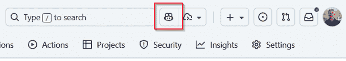

图 6.1：在 GitHub.com 上查看 PR 时从存储库标题打开 Copilot Chat

一旦面板打开，请要求 Copilot 总结提议的更改。这为审查者提供了一个快速的技术概述，而无需阅读每个文件差异或提交消息：

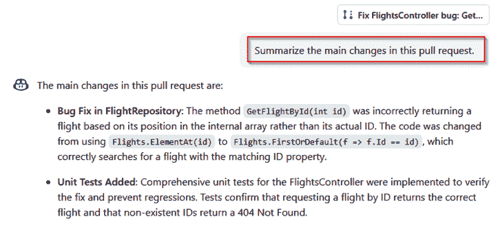

图 6.2：Copilot Chat 总结 GitHub.com 上 PR 中的主要代码更改

GitHub Copilot Chat 可以生成 PR 中更改的普通语言摘要，帮助审查者快速了解所提议的内容。

## 审查 PR 中的 SQL 迁移

在 GitHub.com 上，GitHub Copilot Chat 最常见的用途之一是在代码审查期间澄清代码更改。在审查 PR 时，你可以要求 GitHub Copilot 解释代码更改，而无需输入提示。在差异文件中，点击右上角的向下箭头，选择 **Copilot** | **解释**。GitHub Copilot 然后在面板中直接生成所选更改的普通语言解释。

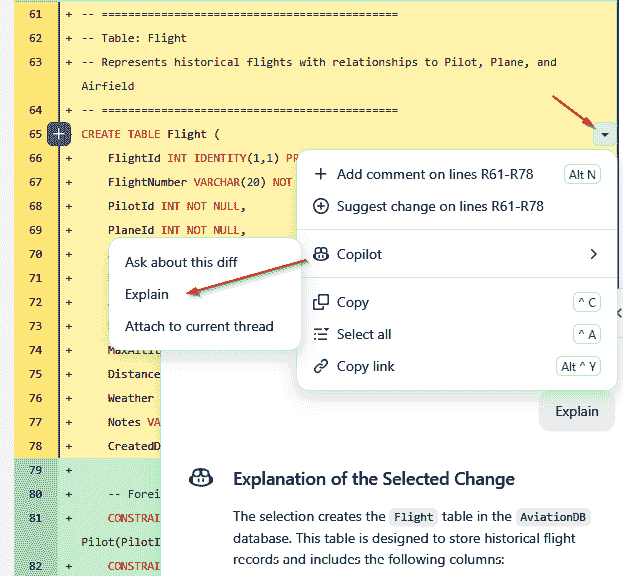

图 6.3：Copilot 在 PR 差异中提供 SQL 迁移的普通语言解释

GitHub Copilot 以普通语言响应，分解模式更改或更新。这节省了审查者的时间，并帮助贡献者将讨论重点放在设计上，而不是解析基础知识。

## 解释 GitHub Actions 中的 CI 失败

GitHub Copilot Chat 不仅限于 PR。它还直接与 GitHub Actions 集成，因此你可以在日志视图中不离开即可调查失败的工作流程运行。

当作业失败时，你可以展开步骤，滚动到错误消息，并点击 **解释错误**。Copilot 然后生成关于出了什么问题的普通语言分解，并提出如何修复的建议。

一个示例响应可能如下所示：

```py
This job failed because the build step is missing a dependency on Node.js 18\. You can fix this by adding a setup-node action before running your build command. 
```

这将故障排除保持在问题源头附近，无需将日志复制到另一个工具或请求队友帮助。

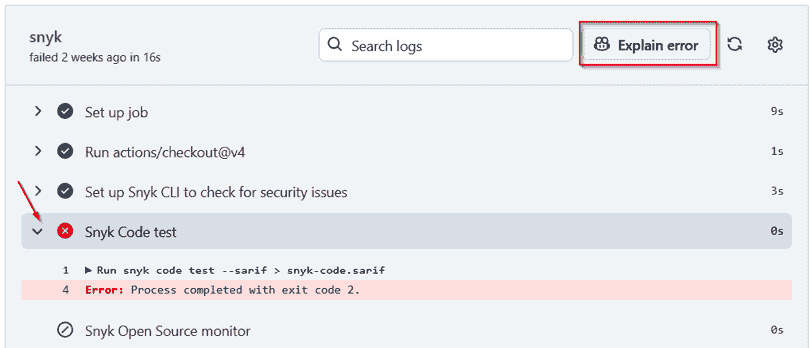

图 6.4：GitHub Actions 中解释失败的工作流程步骤的 Chat

## 入门和文档

在长时间运行的问题或讨论中，GitHub Copilot Chat 可以快速将线程压缩成结构化摘要。你无需滚动浏览数十条评论，只需请求到目前为止的关键决策和任何未解决的问题。这对新贡献者或中途加入的团队成员来说尤其有价值，因为他们需要快速熟悉情况。

一个示例提示可能看起来像这样：

```py
Summarize the main points of this actual discussion in this thread and list any open questions. 
```

GitHub Copilot 将生成一个简短的结构化摘要，突出已经做出的决策和未解决的问题。这有助于新来者定位活跃项目，并确保讨论随着时间的推移保持可访问性。

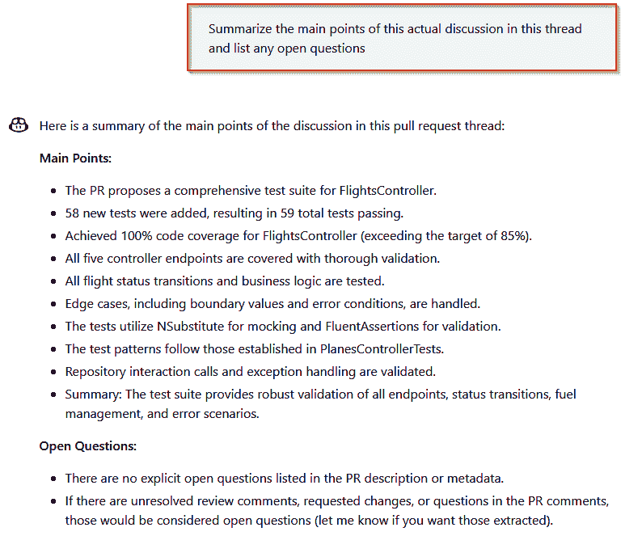

图 6.5：Copilot Chat 总结讨论线程并突出显示开放问题

这些示例展示了 GitHub Copilot Chat 如何扩展 GitHub.com 上的协作。无论您是在审查 PR 中的架构更改、调查失败的工作流程还是总结讨论线程，聊天窗口都使对话与您的项目保持联系。因为聊天历史记录保存在您的账户中，Copilot 在会话和设备之间提供连续性，使其成为您工作流程中的一致部分。

在 PR、工作流程和讨论中确立了聊天作为伴侣之后，接下来让我们探索 GitHub Copilot 如何更直接地支持问题和线程式对话。由于问题通常是大多数协作的起点，GitHub Copilot 在帮助结构化、总结和推进工作方面自然是一个很好的位置。

# 问题和支持讨论

问题和支持讨论是 GitHub.com 上许多协作活动的起点。它们记录了错误报告、功能请求、设计提案和日常项目问题。GitHub Copilot 通过帮助您从提示中创建结构化问题、草拟或总结长对话以及准备推动讨论的回复来扩展到这些领域。您不必从头开始输入所有内容或阅读数十条评论，而可以依赖 GitHub.com 上的 GitHub Copilot Chat 来草拟、总结和阐明内容——同时保持对最终信息的控制。

## 草拟和总结问题

在 GitHub.com 上，填写问题表单时不会直接获得 GitHub Copilot 建议。相反，您需要转到 GitHub Copilot Chat（通过右上角的聊天图标或沉浸式聊天视图访问）并在那里提出您的请求。它将使用当前会话的整个聊天历史作为创建新问题的依据。

这非常有帮助，因为现在您可以使用存储库或 GitHub Actions 工作流程中的任何上下文作为额外信息，例如，通过询问 GitHub Copilot 关于工作流程失败的原因，让它搜索可能引起它的代码，然后创建一个包含所有收集信息的 issue。拥有所有这些信息将使处理问题并实施必要更改变得容易得多。

例如，您可以在 GitHub.com 上打开 GitHub Copilot Chat 并输入以下提示：

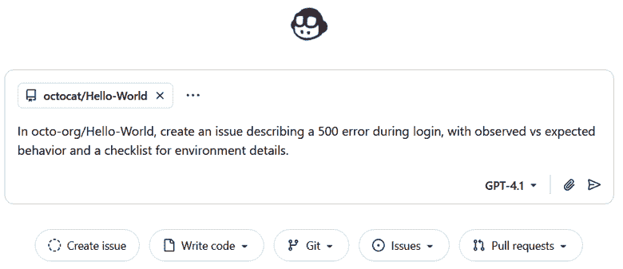

图 6.6：使用 Copilot Chat 提示创建新的 issue

GitHub Copilot 生成一个建议，包括标题和正文，并从您的仓库问题表单或模板中填写字段（如果您有一个的话）。以下是 Copilot 可能生成的示例：

```py
## Observed Behavior
When attempting to log in, users encounter a 500 Internal Server Error. The error occurs immediately after submitting valid account credentials. No additional error message is displayed to the user.
## Expected Behavior
Users should be able to log in successfully and access their account dashboard after submitting valid credentials.
Environment Details Checklist
[ ] Operating system (Windows, macOS, Linux)
[ ] Browser and browser version
[ ] Application version or commit hash
[ ] Any relevant logs or error messages
[ ] Steps to reproduce
Please fill out the checklist above to help diagnose the issue. 
```

在点击**创建**之前，您需要审查和细化这个建议。

从相同的聊天界面，您还可以要求 GitHub Copilot Chat 概述问题线程或讨论，帮助协作者快速了解情况。您还可以采取下一步行动，直接将问题分配给 Copilot，就像分配给团队成员一样，以便它可以开始修复或添加功能。

## 自动化响应和常规任务

维护者经常花费时间提醒贡献者提供缺失的细节，指导他们查阅文档，或关闭重复的问题。在 GitHub.com 的集成聊天中，您可以要求 GitHub Copilot 为您草拟这些响应。您不必重复输入相同的文本，GitHub Copilot 准备了一个您可以审查和编辑的回复，让您可以专注于调整语气和细节以适应问题。

我们可以在这里看到一个示例：

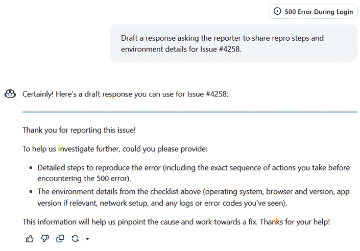

图 6.7：使用 Copilot Chat 处理常规任务

在此示例中，用户要求 Copilot 编写一个请求重现步骤和环境细节的响应，针对 Issue #4258。GitHub Copilot 生成了一条礼貌的消息，感谢报告者，并要求提供详细的错误重现步骤，以及环境细节，如操作系统、浏览器、应用程序版本、网络设置和日志。

## 支持讨论

GitHub Discussions 提供了一个论坛式空间，贡献者可以在其中分享想法、提问或提出更改，而无需打开问题或 PR。与跟踪具体工作项的问题不同，讨论通常是探索性的，并且随着多人的参与可能会变得很长。

在这种情况下，GitHub Copilot Chat 通过将对话压缩成简短的结构化摘要或提出澄清的后续问题来帮助推进线程。这对于希望快速响应而不必解析每个回复的维护者来说特别有价值。

例如，如果用户发布了一个描述部署设置的 YAML 片段，您可以向 GitHub Copilot Chat 提出以下问题：

```py
Summarize the main point of this discussion and suggest one clarifying question I could ask. 
```

响应可能如下所示：

```py
The user is configuring a Service to expose my-service internally. A good clarifying question could be: Do you plan to expose this service externally, or should it remain internal-only? 
```

这种方法使讨论保持进行，并确保响应是深思熟虑且具有针对性的。

## 工作流程示例

GitHub Copilot 可以在实际操作中支持问题和讨论，如下所示：

1.  贡献者通过在您的存储库中打开问题来报告一个登录错误。

1.  作为维护者，您打开 GitHub Copilot Chat 并要求它将描述重新格式化为具有观察到的行为、预期行为和重现步骤的良好结构化问题。

1.  另一位用户提供了额外的上下文评论。您要求 GitHub Copilot Chat 概述到目前为止的线程。

1.  维护者需要跟进请求日志。GitHub Copilot Chat 以适当的语气草拟了 Markdown 响应，您在发布前进行审查。

通过为 GitHub Copilot 提供足够的上下文，并在发布前审查其草稿，您可以更有效地处理问题和讨论，同时确保沟通符合您项目的标准。

我们已经看到 GitHub Copilot Chat 如何简化问题和讨论，使其更容易捕捉报告、总结对话并保持线程高效。这些功能在协作的早期阶段特别有用，那时想法被提出，问题首次报告。

下一节将探讨许多实际决策发生的地方：**拉取请求**，或**PRs**。在这里，GitHub Copilot 不仅限于对话，还支持审阅、生成摘要、建议修复，并与安全工具集成以提高代码质量。

# PR 支持

PRs 是 GitHub.com 上协作开发的中心。GitHub Copilot 通过帮助作者和审阅者节省时间、明确更改并捕捉合并代码之前的问题，进入这个空间。无论你是打开新的 PR、审阅更改还是回应反馈，GitHub Copilot 都提供了一系列工具来简化工作流程。

## 总结 PRs

当你在 GitHub.com 上创建或编辑 PR 时，你可以要求 GitHub Copilot 生成所提议更改的摘要。在 PR 描述字段中，点击 Copilot 图标（如图 6.8 所示），然后选择**总结此拉取请求中的更改**。

Copilot 审查源分支和目标分支之间的差异，以及提交信息和更改的文件，以生成 PR 的简单语言概述。生成的摘要将直接显示在描述框中，你可以在提交之前对其进行细化、扩展或编辑。

对于拥有许多贡献者或复杂代码库的团队，这一步骤帮助审阅者理解 PR 的目的，而无需逐个阅读每个文件。

例如，如果你的 PR 涉及多个领域，如更新 API 验证和添加新测试，GitHub Copilot 可能会草拟如下内容：

```py
This PR refactors the API input validation logic to support new user fields and adds comprehensive unit tests for edge cases. Updates documentation to match new requirements. 
```

这个摘要帮助审阅者快速理解 PR 的意图，而无需阅读每个文件。它还简化了新贡献者的入职流程，他们可能不熟悉代码库的所有部分。

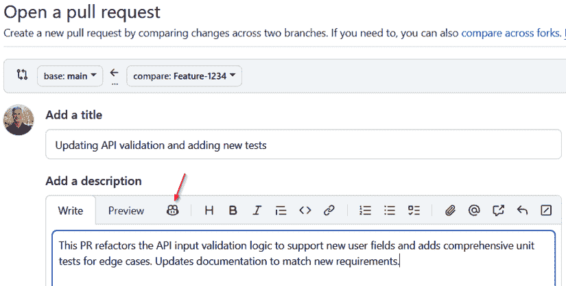

图 6.8：在 PR 描述中使用 Copilot 图标生成 PR 摘要

## 将 GitHub Copilot 分配为审阅者

在 GitHub.com 上，你可以通过**审阅者**标签将 GitHub Copilot 分配为 PR 审阅者，如图所示：

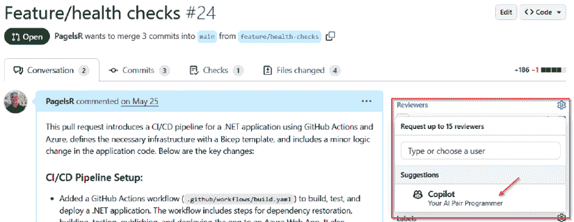

图 6.9：GitHub Copilot 作为审阅者

一旦添加，GitHub Copilot 可以执行以下操作：

+   分析更改并留下审阅评论

+   标记潜在的 bug、不一致性或风格问题

+   建议改进，例如更好的测试覆盖率或简化代码

+   生成或更新 PR 摘要以帮助审阅者了解更改范围

与静态审查工具不同，GitHub Copilot 支持在 PR 内进行迭代对话。您或另一位审查人员可以要求它澄清特定的代码块，扩展其早期的评论之一，或提供额外的示例。所有这些都在 PR 线程中直接发生，因此 AI 辅助反馈和人类讨论的历史记录都保留在一个地方。

### 一般示例

考虑一个小型航空服务，该服务存储飞行记录并通过仓库类公开它们。在这个 PR 中，团队正在修复通过 ID 查找航班的函数。之前的代码使用了`ElementAt(id)`，它将 ID 视为基于零的索引，而不是匹配航班的实际`Id`属性。

在查看差异时，GitHub Copilot 用普通语言解释更改：修复将`ElementAt(id)`替换为`FirstOrDefault(f => f.Id == id)`，因此查找使用正确的标识符并返回正确的记录。这为审查人员提供了立即了解更改重要性的上下文。

审查人员可以通过有针对性的请求将对话保持在 PR 内，如下所示：

```py
@copilot clarify this block of code and explain why not to use FirstOrDefault() 
```

GitHub Copilot 在线程中回复后续细节，例如权衡、边缘情况和更安全的替代方案。这种来回对话有助于团队在不离开 PR 的情况下确认推理。

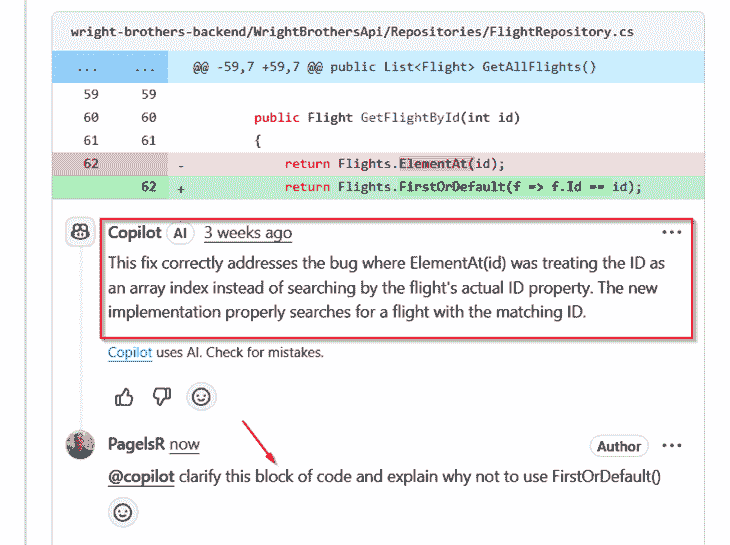

图 6.10：GitHub Copilot 在飞行应用 PR 中的评论和审查人员跟进

请记住，每次向 Copilot 提出的审查请求都会消耗一个高级请求，因此团队可能希望有意识地决定何时分配它。有关高级请求的工作方式和计费方式的更多详细信息，请参阅*第三章*。对此保持警觉可以确保您从 Copilot 的反馈中获得最大价值，同时保持使用量在您的计划分配内。

### 工作流程示例

考虑一个更新 Node.js 后端和 CI 工作流程的多文件 PR：

1.  作者打开 PR（Pull Request）并使用 GitHub Copilot 生成更改的摘要。

1.  GitHub Copilot 被添加为审查人员，并标记边缘情况和缺失的文档。

1.  人工审查人员随后通过要求助手澄清特定的代码块，直接在 PR 线程中继续对话。

1.  CI 中有一个测试失败，Copilot 建议调整 YAML 以解决错误。

1.  作者应用修复并推送更新，GitHub Copilot 会自动刷新 PR 摘要。

清晰的提交信息和描述性的 PR 细节有助于 Copilot 的摘要和评论保持准确。这种支持可以缩短反馈周期并减少常规审查人员的工作，但在合并之前，建议始终与项目约定和业务需求进行验证。

## 审查和评论代码

一旦 GitHub Copilot 被添加为审查人员，您就可以在 PR 视图中直接与之交互。在审查过程中，它可以通过以下方式提供帮助：

+   解释差异或复杂的代码更改

+   突出显示潜在问题，例如缺少错误处理或不一致的风格

+   提出内联建议或编辑

例如，当审查 Python diff 时，您可能会突出显示一个部分，并使用以下内容提示 GitHub Copilot：

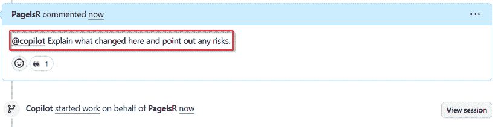

图 6.11：在 PR 审查中提示 Copilot

它可能会回复以下内容：

```py
Replaces manual password hashing with a call to the new hash_password utility. Make sure this function is compatible with existing hashes before merging. 
```

GitHub Copilot 的建议不仅限于代码；它还可以帮助起草 Markdown 注释，以阐明理由、提出问题、更新文档或提出改进，使审查对话保持专注和可操作。

请记住，每次 GitHub Copilot 在 PR 审查期间发布评论时，都会消耗您配额中的另一个高级请求。如果您想保持在每月配额内，请务必监控您的使用情况。

## 自动修复

自动修复实际上可以指两个相关的功能：

+   其中一个出现在 PR 审查期间，GitHub Copilot 根据您正在审查的代码提出内联修复

+   另一个是 GitHub 高级安全的一部分，其中 GitHub Copilot 自动修复对代码扫描警报做出针对性的修复步骤

它们在 UI 上看起来很相似，但它们是由不同的信号触发的，并且服务于不同的目的。让我们来看看它们两个。

### PR 建议

在 PR 审查期间，GitHub Copilot 可以注意到有风险或不高效的代码，并直接在**文件更改**视图中提出内联修复。这些建议带有**自动修复**标签，但它们与 GitHub 高级安全中的 GitHub Copilot 自动修复不同。相反，它们是 Copilot PR 审查功能更广泛集合的一部分。

例如，如果 PR 包含一个不安全的 SQL 语句，Copilot 可能会在 diff 中直接建议参数化。您可以立即应用修复、编辑它或要求 Copilot 进行细化。这使整个检测-修复-审查循环都在 PR 内部完成。

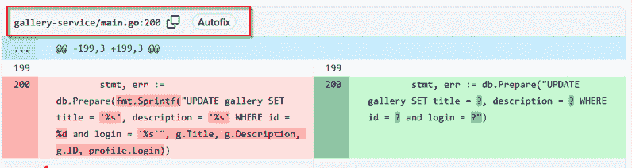

图 6.12：Copilot 自动修复建议参数化 SQL 查询以防止注入

在审查过程中生成自动修复可能会消耗一个高级请求。请参阅*第三章*以获取使用和限制的详细信息。

### GitHub 高级安全中的 GitHub Copilot 自动修复

自动修复的另一个背景是在 GitHub 高级安全中。在这里，当代码扫描警报标记出漏洞时，自动修复会提出针对性的修复方案。从警报详情页面，您可能会看到一个**生成修复**按钮。选择此按钮将触发 Copilot 自动修复草拟修复计划并打开一个 PR 以供审查：

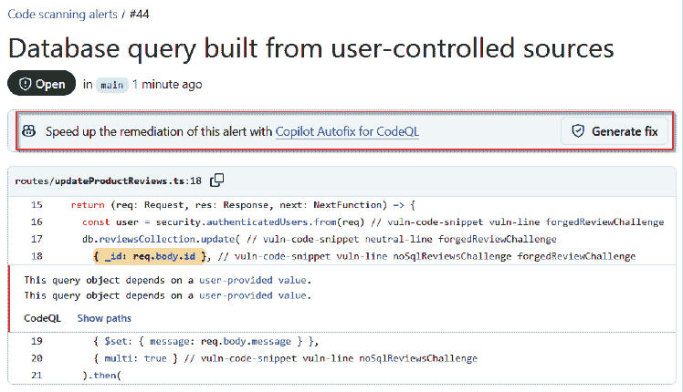

图 6.13：从 GitHub 高级安全中的安全警报直接生成修复

这种区别很重要。GitHub Copilot 在 PR 审查期间提出的修复方案是基于 diff 中更改的代码。GitHub Copilot Autofix 提出的修复方案与 GitHub 高级安全警报相关联，该警报由代码扫描产生，并遵循警报的指导以产生有针对性的修复。

当建议准备就绪时，选择**提交到新分支**选项以应用修复。提议的补丁以 PR 的形式在您的仓库中打开，您可以像审查任何其他更改一样审查它，如果需要，请求调整，然后批准并合并。

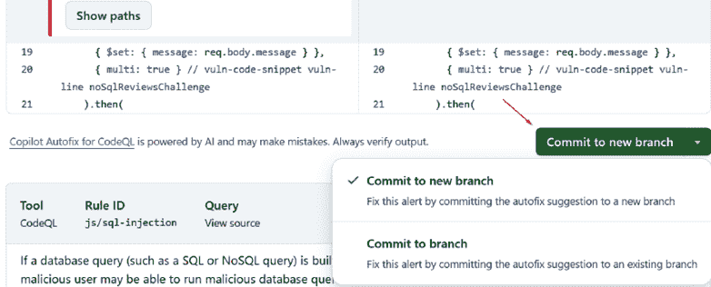

图 6.14：将修复提交到新分支和 PR

例如，对于标题为`由用户控制的源构建的 SQL 查询`的警报，GitHub Copilot Autofix 提供了以下说明：

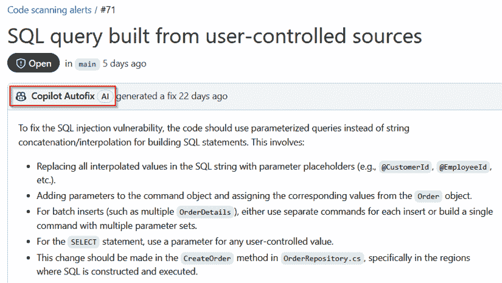

图 6.15：GitHub Copilot Autofix 在 GitHub 高级安全中针对 SQL 注入警报的修复细节

GitHub Copilot Autofix 支持越来越多的语言和查询家族。如果发现超出了当前覆盖范围，即使存在警报，Autofix 也可能不会提供补丁。

修复单个警报后，您可以使用 GitHub 安全活动将同样的想法扩展到更大的规模。这正是 GitHub Copilot Autofix 真正发光的地方。

**GitHub 安全活动**允许管理员和安全负责人将许多仓库中的相关漏洞分组在一起，并将修复作为一项工作来处理。您不是按警报一个接一个地工作，而是定义范围，在一个地方跟踪进度，并在所有受影响的代码库中一致地应用修复。

GitHub Copilot Autofix 可以集成到安全活动中，为维护者提供批量生成支持漏洞修复的选项。当活动启动时，您可以选择为符合条件的警报**生成修复**，例如 SQL 注入、不安全的反序列化或命令注入。然后 GitHub Copilot 在受影响的仓库中准备 PR，以便团队可以审查和合并一致、有针对性的修复。

GitHub Copilot Autofix 可以集成到安全活动中，以大规模生成对支持警报的建议。活动将警报提交给 Autofix，以便维护者可以审查提议的修复方案。当您决定继续时，您可以从警报或活动上下文中创建 PR，然后像审查任何其他更改一样审查和合并它们。

这种集成将 Autofix 扩展到单个警报之外，使企业团队能够保持大型代码库的安全。而不是手动打开数十个 PR，安全负责人可以从活动视图中触发 Autofix，然后团队可以将生成的补丁作为他们正常工作流程的一部分进行审查和合并。

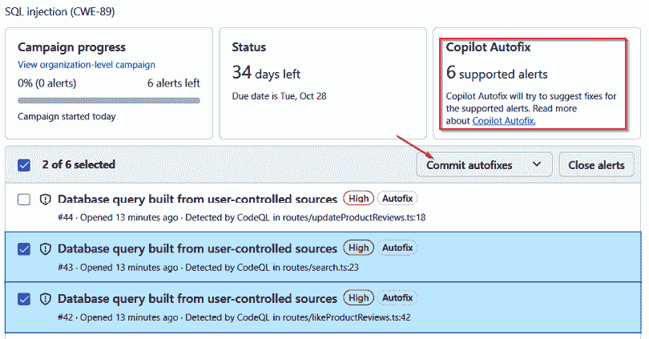

图 6.16：GitHub Copilot Autofix 集成到 GitHub 安全活动中

您可以在此处了解有关 GitHub 高级安全性的更多信息：[`docs.github.com/en/get-started/learning-about-github/about-github-advanced-security`](https://docs.github.com/en/get-started/learning-about-github/about-github-advanced-security)。

在处理了 PR 审查和安全警报后，很明显 Copilot 已经能够处理开发中大量重复性和细节导向的工作。Autofix 展示了如何生成和审查单个修复甚至整个活动的补救措施，而不会减慢团队的工作进度。

下一步是更广泛的自动化。在下一节中，我们将探讨 GitHub Copilot 编码代理，它允许您将整个问题委派给 Copilot。在这里，Copilot 不仅建议编辑，实际上还完成了开发任务，在安全环境中运行，并打开符合您团队工作流程的 PR。

# GitHub.com 上的编码代理

GitHub Copilot 编码代理通过让您将整个问题委派给 Copilot，直接将自动化引入浏览器。您不必自己起草修复或编写代码，只需在 GitHub.com 上分配一个任务，Copilot 就会从那里开始处理。代理在安全云环境中运行，对新的分支进行更改，打开草稿 PR，并标记您进行审查。这使得问题变成了可以向前推进的可操作工作项，同时仍然让您在最终审查和合并中保持控制。

## 编码代理与代理模式

GitHub 提供了两种相关但不同的将工作委托给 AI 的方式：**编码代理**和**代理模式**。两者都属于更广泛的代理 AI 概念，即您描述一个任务，系统迭代直到产生结果。区别在于工作发生的地方以及如何应用：

+   **代理模式（在 IDE 中）**：您在编辑器的聊天面板中选择代理模式，并描述任务，Copilot 将直接在您的本地工作区进行更改。它应用编辑、运行工具，并持续迭代，直到工作完成。

+   **编码代理（在 GitHub.com）**：您可以从浏览器、您的编辑器，甚至 GitHub 移动应用中委派任务。然后 Copilot 在安全的 GitHub Actions 环境中异步运行，对分支进行更改，并打开一个 PR 进行审查。

这种区别很重要，因为代理模式最适合交互式、本地编辑，您希望保持亲力亲为，而编码代理更适合委派可以端到端自动化并在 GitHub 中跟踪的封装任务。

## GitHub.com 上编码代理的工作原理

GitHub Copilot 的编码代理允许您直接从浏览器委派开发任务，无需 IDE。此功能仅适用于付费 Copilot 计划（Pro+和 Enterprise），管理员可能需要在组织或企业级别启用策略。

您可以通过三种主要方式委派任务：

+   **将问题分配给 Copilot**：打开问题，使用**分配者**面板，并选择**Copilot**。这就像分配给人类队友一样。Copilot 将阅读问题详情并在后台开始工作。

+   **使用代理面板**：GitHub 最近推出了**代理**面板。这个弹出覆盖层就像一个任务控制中心。从任何 GitHub.com 页面，您都可以打开面板，用自然语言描述任务，选择仓库和分支，并启动代理。在底层，GitHub Copilot 启动一个由 GitHub Actions 提供动力的安全工作空间，应用更改，并创建一个供审查的 PR。面板还显示实时会话详情和日志，这样您可以在不离开当前上下文的情况下跟踪进度。

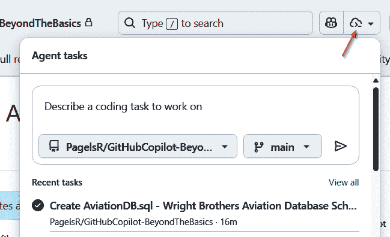

图 6.17：在代理面板中委派任务

+   **从您的编辑器分配（如果支持）**：某些编辑器提供集成点，在本地工作时可以直接将任务委派给编码代理，这使得保持浏览器和 IDE 工作流程一致变得更容易。（截至 2025 年 9 月 1 日，只有 VS Code 允许直接将任务分配给编码代理。）

一旦分配，代理将执行以下操作：

+   在 GitHub Actions 中启动一个安全的工作空间，从您分配的分钟数中抽取（公共仓库免费，或针对您的私有仓库预算进行跟踪）

+   在新分支中应用更改，运行检查，如有必要进行迭代，并创建一个带有 WIP 标题的草稿 PR

+   每个会话使用一个高级请求，无论涉及多少编辑或文件

+   为您标记以供审查，并记录会话详情，您可以在执行期间或之后检查这些详情。

您可以在多个地方跟踪代理的进度：

+   **代理面板**或**代理页面**：显示实时会话状态、日志和任务历史。这是最详细视图，显示 Copilot 在 GitHub Actions 驱动的工作空间中采取的每一步。

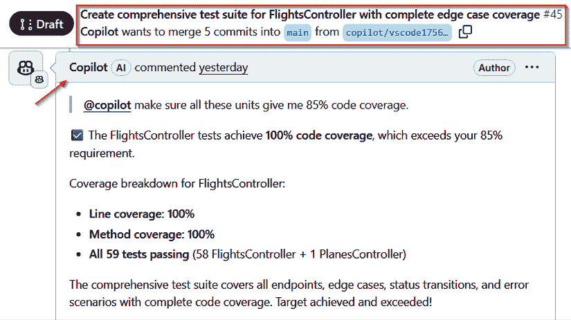

图 6.18：从 GitHub.com 的代理面板跟踪编码代理会话

+   **问题的开发面板和 PR 视图**：列出代理创建的分支和相关草稿 PR。如果您在代理工作时跟进团队讨论，此视图很有帮助。

+   **编辑器集成（如果支持）**：在某些 IDE 中，您可以跟踪会话进度或在代理的 PR 准备好审查时收到通知。

一旦 PR 打开，您就可以像与其他任何 PR 交互一样与之交互。在这个阶段，您可以执行以下操作：

+   像其他 PR 一样审查差异

+   请求更改或编辑

+   在评论中提及`@copilot`以指示代理完善或扩展其工作

一旦 PR 打开，您就可以像审查其他 PR 一样审查差异，但您还可以选择与 GitHub Copilot 交互以改进或扩展其工作。通过在 PR 评论中直接提及 `@copilot`，您可以请求澄清、请求改进或建议更改。如图所示，Copilot 不仅响应请求，还在后台开始更新工作，其进度在会话视图中跟踪。

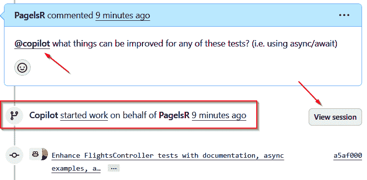

图 6.19：审查和改进 FlightsController 测试套件的编码代理的 PR，其中 Copilot 对审阅者的评论做出响应并开始实施改进

## 查看编码代理会话

当编码代理打开 PR 时，您可以直接在线程中进行交互。例如，您可能在评论中提及 `@copilot` 以请求改进，如 *图 6.1* *9* 所示。从同一位置，点击 **查看会话** 按钮将带您进入会话日志。

这将打开 **代理** 面板或 **代理** 页面，您可以跟踪代理所做活动的完整历史。以下图显示了此详细视图，包括任务的每个迭代、会话持续时间和消耗的优质请求数量。

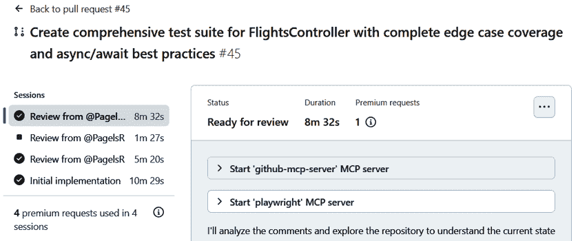

图 6.20：显示任务历史、MCP 服务器、会话持续时间和动作分钟及优质请求使用的编码代理会话视图](img/B34107_06_20.png)

监控会话让您能够了解进度，帮助您及早发现错误，并在合并前确保自动化流程的信心。

每个会话都在安全的 GitHub Actions 工作区内部运行，因此会消耗您的账户或组织的动作分钟。公共仓库是免费的，而私有仓库则计入使用量。PR 或问题中的每个 `@copilot` 交互也会消耗一个优质请求。有关优质请求和限制的更深入解释，请参阅 *第三章* 。

## 最佳位置

编码代理对于范围明确的任务最为有效：修复问题中描述的 bug、添加或扩展测试或更新文档。它节省了日常工作的宝贵时间，同时保持人类对最终审查的控制。您的编码基础越扎实，编码代理的结果就越好。这意味着设置一个包含信息的良好 README，添加自定义指令以遵循，记录如何构建、测试和运行应用程序，并拥有足够的测试以验证结果。

所有这些都可以由编码代理用来确定要做什么以及如何实施更改，包括运行测试以验证是否一切仍然按预期工作。如果你只有一个文档糟糕的应用程序，且代码混乱如意大利面，编码代理将很难确定要做什么，甚至可能无法完成。

## 它如何融入你的工作流程

编码代理完全集成到 GitHub.com 中，并针对浏览器优先的协作而构建。团队经常用它来做以下事情：

+   加快常规修复的速度

+   增强测试覆盖率

+   快速处理小改进，无需等待人工审查

它也自然地融入了移动工作流程中。从 GitHub 移动应用中，你可以在手机或平板电脑上审查问题和 PR。如果一个问题已经包含足够的细节，你可以直接将其分配给编码代理，让它在你离开桌面时开始工作。这使得在空闲时轻松委派任务，而不会打断工作节奏。

人工智能可以处理繁重的工作，但仍然重要的是要审查每个生成的 PR，以确认更改符合项目标准。请记住，响应可能并不总是准确的，这使得最终审查步骤至关重要。

## 编码代理的附加配置选项

除了分配和跟踪会话的基本功能之外，还有一些高级设置可以让你更好地控制编码代理的操作：

+   **默认锁定网络设置**：编码代理会话默认受到限制以确保安全。它们在一个没有互联网访问的锁定网络中运行，减少了外部调用或数据泄露的风险。你应该只在绝对必要时才打开网络访问，例如在测试依赖于外部 API 的代码时。

+   **会话的 MCP 服务器配置**：你可以通过连接到 MCP 服务器来扩展会话。这允许代理获取额外的上下文或与外部系统集成，例如内部文档或 API。配置是在组织或存储库级别完成的，以便在执行任务时，会话可以安全地拉取正确的数据。

通过编码代理，你看到了 GitHub Copilot 如何承担分配的问题，生成代码，并在 PR 内自主推进工作。这种自动化程度使 GitHub Copilot 感觉像是你团队的一个活跃贡献者，但它只是这幅图景的一部分。

除了编码任务之外，GitHub Copilot 继续在 GitHub.com 上扩展其功能，这些功能改善了日常协作，简化了项目管理，并在大规模上呈现洞察力。在下一节中，我们将探讨这些附加功能，从批量摘要和指标仪表板到实验性预览，这些预览暗示了平台的发展方向。

# GitHub.com Copilot 的附加功能

除了问题自动化和 PR 支持之外，GitHub.com 上的 GitHub Copilot 继续通过简化日常开发和优化项目工作流程的功能不断发展。其中一些功能已经可用，而另一些仍在预览中，但所有这些功能都是为了帮助团队节省时间和保持专注。

## 批量总结和评论

GitHub.com 上的 Copilot Chat 可以提供高级概述，并帮助起草清晰、有针对性的评论。这些功能有助于团队更快地处理信息并更有效地回应，无需手动浏览每个细节或从头开始起草每个回复。

在分类会议、发布计划或回来后，你可以请求对 PR、讨论甚至整个仓库的简洁概述。

例如，在沉浸式 Copilot Chat 中，你可以提出以下问题：

```py
@workspace Summarize the purpose of this repository and its key modules. 
```

然后，GitHub Copilot 会从整个仓库中提取上下文并生成一个摘要，帮助你快速了解项目情况。

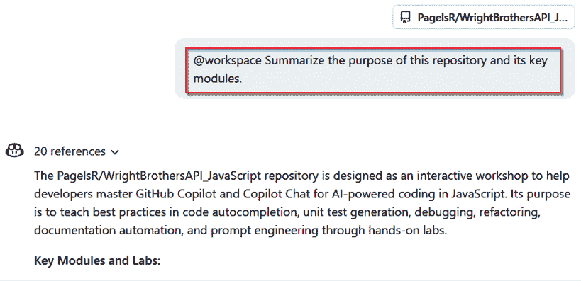

图 6.21：GitHub Copilot Chat 总结仓库

或者在一个 GitHub 讨论或问题线程中，你可以输入以下内容：

```py
Summarize the main points of this discussion thread so far. 
```

Copilot 会将来回的对话压缩成可消化的摘要，这样你就可以专注于下一步。

除了总结之外，GitHub Copilot 还可以帮助你参与对话。你可以要求它起草澄清问题，提供对缺失细节的温和提示，或者用符合项目风格的 Markdown 语言表达回应。

例如，在一个长讨论线程中，你可能会说以下内容：

```py
Suggest a clarifying question I could ask in this thread. 
```

Copilot 可能会返回以下内容：

```py
Have you confirmed whether this deployment needs to run in staging before production? 
```

这种总结和评论起草的组合有助于维护者和审查者保持高效，无需自己解析每个细节，同时仍然保持最终的人为监督。

## 代码和文档中的上下文感知建议

GitHub Copilot 在提出建议时会适应你仓库的上下文。这意味着当你编辑代码块、YAML 工作流程、SQL 脚本或文档文件时，输出会反映你项目中已经存在的格式、命名约定和模式。通过与团队已建立的风格保持一致，Copilot 减少了摩擦并有助于保持贡献的一致性。

例如，假设你正在更新一个 SQL 迁移脚本。你可以在聊天面板中提出以下问题：

```py
Add a column for last_login with a default value of NULL and follow the same style as the existing columns. 
```

GitHub Copilot 会根据你的仓库风格生成 SQL 语句，确保与其他模式更新书写的风格保持一致。

## 指标和活动仪表板

商业和企业计划的管理员可以使用 GitHub.com 上的 GitHub Copilot 仪表板来监控采用情况、使用模式和成本。这些视图使得管理许可证、跟踪支出和理解 Copilot 在团队中的使用情况变得更加容易。

仪表板分为三个主要视图：

+   **Copilot IDE 使用**：突出显示授权开发者的采用和活动趋势

+   **高级请求分析**：跟踪按产品划分的计费高级请求、成本和使用情况。

+   **详细使用模式**：显示聊天模式、代码补全和每日模型使用情况，以揭示 Copilot 在实际中的应用。

这些仪表板共同提供了财务和行为视角，帮助管理员在控制成本的同时，理解 Copilot 如何推动开发者生产力。

### Copilot IDE 使用

Copilot IDE 使用仪表板突出显示了开发者如何在他们的 IDE 中使用 GitHub Copilot。您可以跟踪活跃用户数量，查看哪些代理功能正在使用，以及每日和每周的活动趋势。这有助于管理员区分许可证分配和实际使用，以便在需要时重新分配许可证。

要导航到此视图，请执行以下步骤：

1.  从 GitHub.com 的右上角，点击您的个人照片，选择**您的企业**，然后选择您管理的公司。

1.  在**企业**侧边栏中，打开**洞察**。

1.  选择**Copilot**，然后选择**Copilot IDE 使用**。

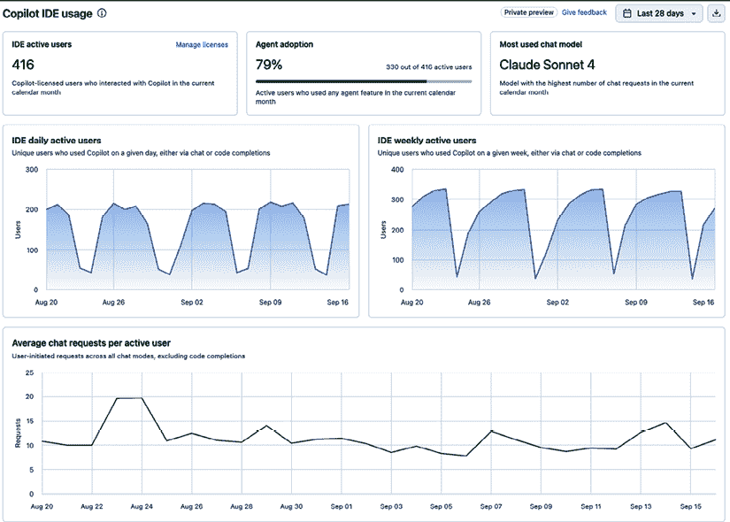

图 6.22：GitHub Copilot 活动仪表板

**要查看此图像的彩色版本**

使用您购买时附带的免费彩色 PDF 版。有关详细信息，请参阅*前言*中的**您的书中的免费福利**部分。

访问通常对企业管理员和账单管理员开放。某些组织可能启用只读分析查看器角色。可用性可能因计划和管理权限而异。

### 高级请求分析

高级请求分析仪表板专注于成本可见性。它显示了已消耗多少高级请求，哪些产品（Copilot、编码代理或 Spark）推动了使用，以及相关的账单金额。管理员可以使用此报告跟踪支出趋势并规划预算。

要导航到此视图，请执行以下操作：

1.  在 GitHub.com 的右上角，点击您的个人照片，然后选择**您的组织**。

1.  在您想要管理的组织旁边，点击**设置**。

1.  在左侧侧边栏中，打开**账单和许可**，然后点击**使用情况**。

1.  选择**Copilot 高级请求分析**。

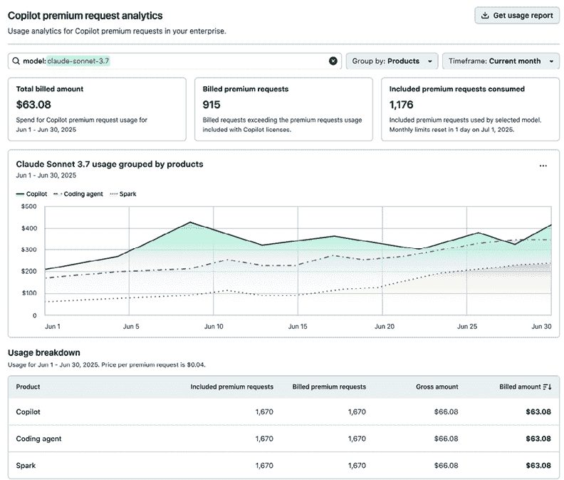

图 6.23：显示使用和账单详细信息的 Copilot 高级请求分析仪表板

**要查看此图像的彩色版本**

使用您购买时附带的免费彩色 PDF 版。有关详细信息，请参阅*前言*中的**您的书中的免费福利**部分。

### 详细 Copilot 使用模式

此仪表板提供了更细粒度的视图，展示了 GitHub Copilot 的日常使用情况。它包括按聊天模式（询问、编辑或代理）的请求图表、代码补全和接受率，以及每日模型使用情况。这些洞察不仅显示了 GitHub Copilot 是否被使用，还展示了它如何塑造开发工作流程。

要导航到此视图，请执行以下步骤：

1.  从 GitHub.com 的右上角打开您的个人资料照片菜单，选择**您的企业**，然后选择您管理的企业账户。

1.  在**企业**侧边栏中，打开**洞察**。

1.  然后选择**Copilot**并选择**使用模式**。

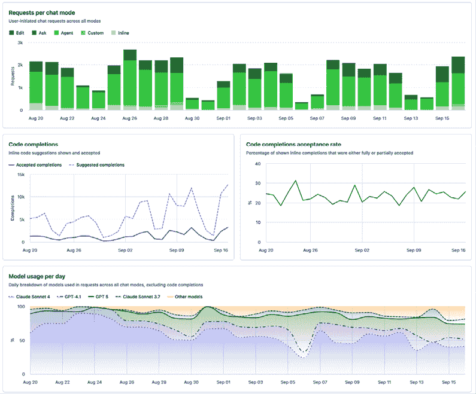

图 6.24：详细的 Copilot 使用仪表板，包括聊天模式、补全和模型趋势

访问通常对企业管理员和账单经理可用。某些组织可能为只读访问启用自定义分析查看器角色。可用性可能因计划和管理权限而异。

要全面了解这些类型报告及其解释方法，请参阅*第三章*。

## 早期访问和实验性功能

GitHub 定期向选定用户和组织发布 Copilot 增强功能的有限预览。这些预览为团队提供了尝试新功能并就可能在将来普遍可用的新功能提供反馈的机会。

截至 2025 年 10 月，以下是一些值得注意的实验性功能：

+   **通过代理面板进行任务控制**：GitHub 引入了一个**代理**面板，允许您从 GitHub 上的任何页面启动、管理和监控 AI 任务。此弹出覆盖允许您描述任务、启动它并跟踪进度，所有这些都在您当前的工作流程中完成。

+   **更好的 PR 处理和多文件推理**：编码代理现在在 PR 审查和更强的多文件上下文理解方面提供了更可靠的支持。

+   **更智能的分级和项目链接**：开发者可以预览高级分级工具，这些工具建议问题优先级或关闭过时的讨论。还有对将 GitHub Copilot 生成的 PR 或任务直接链接到 GitHub 项目板、冲刺或路线图的初步支持。

要了解这些预览并注册新版本，请查看 https://docs.github.com/en/copilot。

## 与团队工作流程的集成

随着 GitHub Copilot 在 GitHub.com 上的功能不断发展，团队正在发现将 AI 自动化与现有工作流程、安全措施和项目管理工具相结合的强大方法。

您现在可以使用 GitHub Copilot 与 GitHub Actions、分支保护规则集和自定义标签一起创建无缝的开发体验。例如，当 GitHub Copilot 打开 PR 时，可以配置分支保护规则集以要求二次批准或强制执行状态检查，然后再允许合并。这确保了 AI 生成的更改与人类贡献一样受到治理。

许多开发者发现，当 Copilot 处理重复性任务时，如起草文档或更新模板，他们能获得最大的好处，这样人类审查者就可以专注于更深层次的技术或以功能驱动的开发。

保持对 GitHub Copilot 文档和发布说明的更新，确保你的团队能够始终了解新的工作流程以及如何最佳采用它们。

## 智能集成

一些团队全力以赴，充分利用 GitHub Copilot 在 GitHub.com 上的功能。例如，他们将 Copilot 集成到 GitHub Actions 工作流程中，以便当工作流程失败时，会自动创建一个问题并分配给编码代理进行处理。

另一个模式是在每次打开新的 PR 时运行工作流程，自动分配 GitHub Copilot 进行审查。这允许团队跳过 GitHub Copilot 可以处理的简单错误，并将人类审查时间集中在设计决策、架构和业务逻辑上。仓库管理员还可以配置分支规则集，要求在合并前进行 Copilot 审查，确保每个变更都至少经过一次自动化审查。

这些模式展示了团队如何将常规检查和跟进转变为可靠的自动化。随着 GitHub Copilot 处理重复性步骤，人类专注于更高层次的决策，项目得以以更少的交接和更清晰的归属感推进。

# 摘要

在本章中，你学习了 GitHub Copilot 如何超越 IDE，进入 GitHub.com，支持软件开发中心的协作。我们介绍了它如何起草和总结问题、简化讨论、对 PR 进行审查和评论、提出内联修复，并通过 GitHub Copilot 编码代理完成分配的任务。我们还探讨了 GitHub Copilot 如何与安全功能如自动修复和安全活动集成，以及管理员如何通过仪表板监控采用和使用的状况。

这很重要，因为这些功能将 GitHub Copilot 从个人编码工具转变为共享开发过程的一部分。通过自动化重复性工作、揭示重要细节，并在问题和 PR 中直接参与，GitHub Copilot 减少了开销，并使项目得以推进。有效使用 GitHub Copilot 的团队报告了更短的审查周期、更少的时间用于模板编写，以及更多时间专注于有意义的开发和问题解决。

同时，AI 生成的内容始终需要审查。GitHub Copilot 创建的摘要、修复和 PR 仍需要人工监督，以确保它们符合项目规范和业务需求。将 GitHub Copilot 视为一个加速常规任务但仍然需要人工审查的合作伙伴，有助于团队获得最可靠的结果。

在下一章中，我们将探讨通过**模型上下文协议**（**MCP**）服务器连接外部数据源或工具，从而丰富 GitHub Copilot 的上下文，并使其行为与团队的流程保持一致。

|

## 获取此书的 PDF 版本和独家额外内容

扫描二维码（或访问 [packtpub.com/unlock](http://packtpub.com/unlock)）。通过书名搜索此书，确认版本，然后按照页面上的步骤操作。 |  |

| *注意：请妥善保管您的发票。直接从 Packt 购买不需要发票。* |
| --- |
