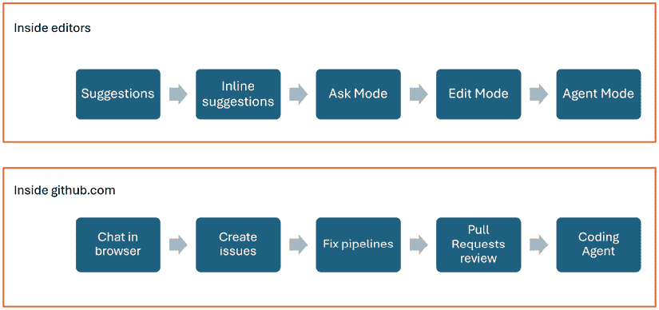
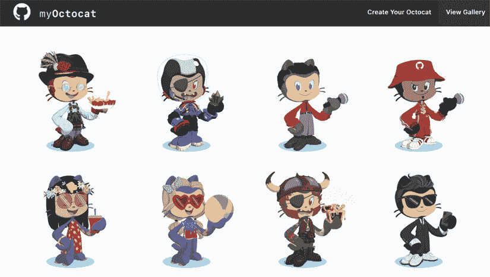
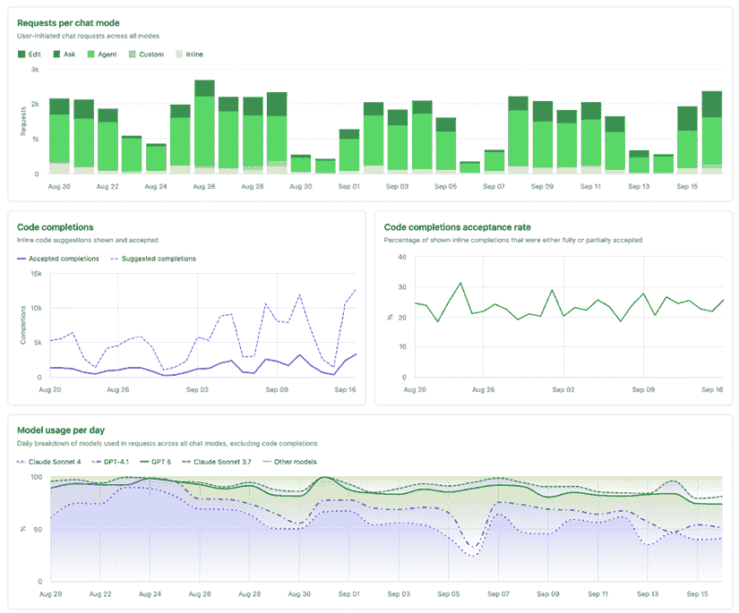
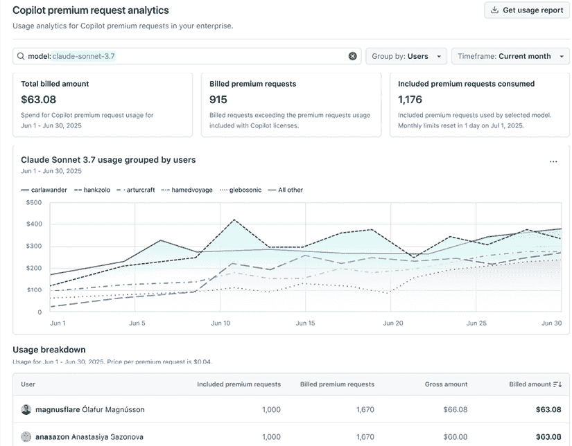

# 9

# 建立内部 GitHub Copilot 社区

在过去的几年里，我们一直是各种客户众多推广和启用计划的一部分，从不到一百名开发者到数千名。对我们来说，始终突出的一点是，工程师们通常在做同样的事情——为最终用户提供价值——但他们实现这一目标的方式往往在每个公司都不同，有时甚至在部门和团队之间也不同。我们还看到，团队之间往往存在脱节，即他们不太倾向于或鼓励在不同群体之间分享知识。通常，工具和工作方式都局限于他们自己的团队/部门/小组，这导致了信息孤岛和不同团队试图重新发明轮子。

在本章中，我们分享了我们如何帮助客户和我们的团队建立社区，从彼此那里不断学习新的用例，或者仅仅是 GitHub Copilot 新增的功能。我们将涵盖以下主题：

+   承认学习曲线

+   使用内部维基

+   安排每周问答会

+   创建通讯稿

+   组织黑客马拉松

+   调查用户

+   查看指标

# 承认学习曲线

如上章所见，所有努力都是从接受这些新的生成式 AI 工具存在学习曲线这一事实开始的——无论是微软 365 Copilot、Claude、Gemini 还是 GitHub Copilot。让您的团队（们）达到能够真正从生成式 AI 中获益的程度，需要时间和培训。

只是分发许可证并希望人们能弄懂是不够的。我们遇到过对生成式 AI 和/或 GitHub Copilot 非常轻视的人，因为他们对这些工具能为自己做什么有着天真的期望。他们的领导忽视了学习曲线，因此，工程师们向工具投掷了随意的提示，并对结果不以为然。在我们与他们交谈并提供了“GitHub Copilot 入门”培训之后，他们告诉我们，现在他们对这些工具以及它们如何帮助他们工作有了更好的理解，尤其是在他们能做什么和不能做什么的范围内。

在接受需要学习这些新工具的事实之后，我们可以看看人们是如何学习的。每个人都有不同的学习方法，他们的大多数学习偏好可以分为两类：通过培训学习或通过试用工具学习。我们将深入探讨这些类别，以便您更好地理解，并了解如何满足不同人的不同需求。尽管这些是不同的类别，但大多数人都会在这两个类别中接受培训，首先是接受解释核心概念和思想的培训，然后结合实际操作练习，以他们自己的方式看到新工具对他们工作方式的影响。

## 通过培训学习

许多人想要通过培训来了解这些工具能做什么，如何应用它们，以及如何利用它们的优点和缺点来获得优势。设置一个培训路径可以引导人们通过学习流程，并帮助他们将不同的功能与他们的流程步骤对齐，以产生他们的应用程序或解决方案。

我们还建议按照这本书的流程进行，特别是通过了解生成式 AI 和语言模型，然后从代码补全到与第一阶段的“询问模式”聊天，再到“编辑模式”，最后是“代理模式”。除此之外，你还可以添加 GitHub Web UI 中可用的工具，例如用于开始收集新问题上下文的聊天界面，然后是拉取请求审查和编码代理。你可以在这里看到这个流程的架构：

图 9.1：培训过程中的主题顺序

我们遵循这个流程，以便人们逐渐了解使用这些工具进行下一级共创的知识，这有助于保持期望的合理性。这也是为什么我们一开始就不从代理模式开始的特定原因：没有适当的经验，错误的空间太大，有时会有灾难性的后果。跳过基础知识，甚至包括生成式 AI 在底层是如何工作的，会导致期望这些工具总是正确且不会失败。我们希望防止人们陷入这个陷阱，并引导他们走向成功。

要将知识传授给工程师，你可以让某人提供现场培训（无论是面对面还是在线），或者你可以让人们观看预先录制的会议。请记住，有些人有不同的偏好和不同的学习需求。我们建议同时满足这两种培训类型。有些人喜欢观看视频，因为他们可以暂停、倒退和重试，而有些人则更喜欢现场培训，因为他们可以提问并直接得到答案。我们甚至遇到过同时做这两件事的人——他们想看录像（并倒退以获得更好的理解），然后参加培训会议来提出后续问题并真正吸收内容。

从我们的经验来看，我们了解到，在人们所在的地方与他们见面，并为他们提供多种方式来参与材料和培训师互动是有帮助的。我们曾与那些在他们的电子学习环境中设置了整个学习路径的客户一起工作，他们注意到人们根本不会查看那些培训材料。这些客户犯了一个错误，就是只是给每个人发放许可证，指向内部或外部的电子学习平台，这就是新工具“启用”的全部内容。这些客户没有认识到学习曲线（甚至更糟糕的是：期望所有工程师在自己的时间里观看培训）并看到工程师们没有参与，因此没有从新工具中获得承诺的价值。

我们建议结合所有选项，让人们可以选择。规划现场培训有助于在人们的日程中腾出时间，以便他们可以深入探索新工具。这也向公司管理层发出了明确的支持信号，因为你表明为这次培训分配时间比将其用于他们的正常工作更重要。此外，给他们提供预录内容的访问权限和时间，然后安排后续的问答、黑客马拉松等活动。做所有这些事情不仅是在首次推出工具访问权限时需要，对于新加入的人，或者已经使用了一段时间的人来说也是如此。生成式 AI 领域发展迅速，仅就 GitHub Copilot 而言，我们至少每六个月就会与工程师举行“上次以来有什么新变化”的会议！

## 通过使用工具学习

第二种学习类别是通过实际操作经验学习。有些人一直在关注生成式 AI 或 GitHub Copilot 的新闻，他们想直接深入其中，看看这些工具在自己的开发流程中是如何工作的。

正如我们在*第三章*中看到的，对于那些想看看工具在自己编辑器中的表现的人来说，有一个免费计划，这是一个简单的开始方式。请注意，即使是这些人也会得到一些正式培训的帮助，所以也提供给他们开始的机会，然后仍然可以参加培训课程。培训旨在提供额外的背景信息，讨论不同的功能，并展示人们可能没有考虑过将这些工具应用到的情况。如前所述，有些人经常将讨论的两个学习类别结合起来，而不是分别遵循它们。

为了帮助人们发现 GitHub Copilot 的主要功能，我们将实际操作分为两个独立的部分：我们首先在受控环境中尝试一些通用示例，然后让他们将工具应用到自己的代码中，完成定义的任务。有很多在线资源可以用于通用示例。我们推荐的是由 Microsoft Learn 创建的 Copilot Adventures：[`microsoft.github.io/CopilotAdventures`](https://microsoft.github.io/CopilotAdventures) 。它包含一系列练习，带你通过不同的编码场景，并允许你根据自己的 GitHub Copilot 熟练程度选择冒险。更好的是，这些场景也会随着时间的推移而更新，最近新增的是定制聊天模式和模型上下文协议冒险。

图 9.2：合作冒险

我们总是建议留出时间让人们有足够的时间去完成这些练习。这再次向工程师表明，你认真对待工具及其培训，而不是希望他们在自己的时间里完成这些练习。如果你不为它分配时间（总有一些工作要做），人们通常会跳过它，然后他们就不会进步很多，无法真正熟练地使用这些工具。

在承认学习曲线并计划培训课程后，我们建议启动一个内部社区，以便人们可以找到彼此，分享学习和更新，并持续了解其他人如何在他们的环境中使用这些工具。通常，公司没有这样的社区，因此这也可以是成为知识共享公司的开始，将公司的不同团队和部门聚集在一起。在接下来的章节中，我们将探讨一些这些方法，例如维基、问答会、黑客马拉松等。

如果你想要更深入地了解，可以在[`github.com/orgs/community/discussions/86520`](https://github.com/orgs/community/discussions/86520)找到一个非常棒的社区示例，GitHub 在这里展示了如何直接从你的正常 GitHub 仓库使用 GitHub Discussions（一种问答风格的论坛）！

# 内部维基

人们总是需要能够找到内部文档、访问培训的信息、获取许可证和安装的内部支持链接等。大多数公司都有一种内部方式让社区聚集和分享这类信息，通常有一个人或一个团队负责制作这份文档并保持其更新。

在我们协助的维基中，我们通常会包含以下内容：

+   如何下载和安装贵公司偏好的编辑器以及必要的 GitHub Copilot 扩展的说明。

+   关于如何获得对新工具内部支持的信息，例如人们可以提问的地方、如何获取许可证等。

+   如何定期更新编辑器和 GitHub Copilot 扩展的说明。扩展更新来得如此之快，以至于它们包含一个“最小编辑器版本”的要求。他们甚至不断地在编辑器中构建新功能，为扩展提供新的 API，因此更新编辑器本身也是至关重要的。我们建议至少将编辑器更新到最新的减去次要版本发布——发布号通常以*主要.次要.补丁*的形式出现，所以当 v1.100.0 发布时，用户至少应该使用到 v1.98.0，包括扩展的最新版本。

+   关于使用 GitHub Copilot 的内部指南，支持哪些编辑器在内部环境中，以及如何跟随内部社区并接收新闻更新的信息。

+   关于新功能和需要解锁它们的编辑器更新的分组信息。

+   不要忘记添加任何发送的新闻快报的在线版本，例如，公告或通讯。这样，人们可以在以后搜索和引用它们，例如，当有人加入他们的团队时。

# 每周问答会

即使在所有培训会议和动手实践之后，人们仍会有问题，也会有新的更新要分享。GitHub 和编辑团队都没有停滞不前，生成式 AI 领域以及将其添加到开发者工作流程的方法都在不断演变。

因此，我们建议在项目开始后的前六个月内，至少每周进行这些会议。总会有第一次安装 GitHub Copilot 的人，或者他们发现了一个功能，或者遇到了需要帮助的事情。我们使用问答会来推动社区感，更新维基上的常见问题，并询问小组他们想了解更多信息的话题。这些话题可以用于下次会议的演示，或者作为新知识分享会（甚至培训）的起点，这些会议可以录制以供将来使用。

在这些会议期间从社区中获得见解，极大地帮助人们建立联系。当有人请求更多使用 GitHub Copilot 创建单元测试的示例时，另一个人回应说他们有一个很好的流程或提示，你刚刚就连接了他们，有时甚至跨越了部门！通过询问这些人记录一篇博客文章放到维基上，或者一个解释他们过程的简短视频，突然之间，你就有了一个可以内部分享的新主题。

这类迷你知识分享会效果显著：不再是培训师提供通常的演示，现在有人内部分享他们如何使用工具的故事，包括他们的内部环境、工具栈和编程语言。继续从社区中寻求示例，因为得到的不同环境示例越多，人们就越能将它们转化为自己的流程！

# 通讯

如我们之前所指出的，在人们所在的地方与他们见面很重要。对于很多人来说，我们注意到他们要么认为他们已经知道了一切，要么认为他们太忙了，没有时间研究维基或参加问答会等。以通讯的形式提供新闻的简单总结可以帮助人们扫描新闻，寻找可能对他们感兴趣的事情，然后引导他们到维基或迷你知识分享视频。

这里有一些创建通讯的有用提示：

+   保持通讯内容丰富，并添加一些截图和幽默的图片来装饰它。幸运的是，GitHub 有一个很棒的品牌吉祥物，Mona the Octocat（猫和章鱼的结合），他们甚至为它创建了一个个性化网站，可以在[`myoctocat.com`](https://myoctocat.com)找到。

图 9.3：与 Mona 玩耍的不同方式

+   我们总是将上周（s）的新闻与一些常见问题（附带对维基的链接）结合起来，并包括一些我们看到 GitHub Copilot 被用于的新用例。

+   提供链接回问答环节，以吸引更多观众，并指出如果他们无法等待问答环节开始，人们如何获得支持。

紧跟所有在线新闻是一项相当大的挑战。每个编辑都有一个或多个网站要关注，通常既有编辑团队自己的帖子，也有来自 GitHub 的帖子。你可以逐个关注这些博客，或者将它们组合成一个像我们为自己和公司培训团队所做的那样单一的新闻来源。我们共同建立了 [`github-copilot.xebia.ms`](https://github-copilot.xebia.ms)，我们经常在问答环节之前或撰写新版本通讯之前重新访问它。

# 黑客马拉松

大多数人通过实践学习，这就是我们使用黑客马拉松的原因。这让我们能够让人们摆脱他们日常的日常环境，进入一个新而干净的环境。将这些会议纳入他们的日程表也显示了他们投入时间（从而金钱）进行培训和了解新工具的承诺。我们通常为黑客马拉松安排至少 2 小时，最多可达正常工作日的一半。

有几种方法可以让人工作，我们通常计划多个黑客马拉松，让人们有机会通过 GitHub Copilot 的不同功能逐步成长。参与者可以执行以下操作：

+   在一个全新的项目（通常是游戏）上大显身手。这包括以下内容：

    +   从零开始进行研究

    +   实施他们不熟悉的工具/语言/SDK

    +   添加测试和文档

    +   将项目切换到不同的团队，并从他们的方法和设置中学习

这次黑客马拉松有助于以全新的视角审视你的编码过程，并给你一个机会摆脱现有的步骤。这导致了一些新的深刻见解。

+   在你自己的项目上大显身手。这包括以下内容：

    +   首先关注各种技术债务，因为将这些添加到项目中通常会提高 GitHub Copilot 的结果

    +   添加缺失的集成/单元测试、文档、改进 README、添加自定义指令等

在这次黑客马拉松中，部分指示是尽量不编写任何代码，尽可能多地使用 GitHub Copilot。这导致人们使用新功能，特别是帮助人们开始使用聊天界面来完成大部分工作。

这些黑客马拉松总是很有趣，给人提供了一个机会走出他们的舒适区。为了实现这一点，我们有一些我们经常使用的提示要分享。

## 总是以 GitHub Copilot 的一个功能开始

我们总是以一个特定的主题开始黑客马拉松，并将其与我们的共同目标联系起来。例如，一些团队可能有季度性的倡议，专注于质量改进。基于这一点，主题可以是改进部署前的变更信任度，任务可以是“如何使用 GitHub Copilot 提高单元测试覆盖率。”

人们常常在寻找练习的目的，并可能不确定对他们有什么期望，所以这种方法帮助他们前进。把它变成一个故事，配上展示/一些幻灯片，并演示其功能。一旦他们（重新）看到了这个功能，他们就可以被分配去使用这个功能来完成你给他们指定的挑战或主题。

你也可以考虑将功能、功能或重构拆分，专注于如何使用 GitHub Copilot 来处理它，然后让团队应用这种方法来改进他们自己的代码。

## 混合交流

黑客马拉松是让人们探索其他团队及其工作方式的好方法。我们让不同的团队聚集在一起，让他们成对工作，建议他们与团队外的人合作。突然之间，他们开始学习新团队的过程、编辑器或语言。通常，人们不会跨越他们团队的范围和范围，所以这是一个真正的改进。你也可以通过例如根据工程经验年数、GitHub Copilot 熟练程度等因素来混合他们，以帮助这个过程。

在第一种类型黑客马拉松中，参与者从事新项目时，我们也进行了一些调整：在项目上投入三分之二的时间后，我们让他们推送仓库并从另一个团队获取仓库。这强化了每个人（通常）使用不同方法的事实。使用 GitHub Copilot，团队可以使用聊天界面来研究新的路线和解决方案，生成更改，并提交带有改进的拉取请求。对于许多团队来说，这已经是一个很大的启发，因为他们通常非常封闭在自己的工作方式中，他们的环境中很少发生协作。

## 报告结果/颁发奖品

在黑客马拉松结束时，我们邀请参与者展示他们的学习成果、解决方案或他们为应用程序增加的价值。讨论 GitHub Copilot 如何帮助他们带来了与其他人和团队更深层次的联系，鼓励相互学习，并能够就引起他们兴趣的点提出后续问题。这是一个非常好的结束会议的方式，同时也是庆祝所学知识的好方法。

我们经常为那些故事、方法或学到的经验最好的参与者带来小奖品。我们特别不关注谁构建了最好的解决方案或谁最快。相反，我们优先考虑参与者学到了什么，他们对自己面临的挑战的开放性，以及他们如何深思熟虑地使用 GitHub Copilot 追求目标。看到人们敞开心扉并帮助他人前进——这些都是我们珍视的事情。而且，坦白说，给人们一点他们辛勤工作的纪念品总是一个好主意。

因此，正如你所看到的，黑客马拉松是设定方向并让人们发现他们现在学到的新工具和功能的一个极好方式。这个动手的部分有助于理解生成式 AI 对他们工作方式的影响，并且与不同团队一起这样做有助于打破内部界限，将人们聚集在一起。这是启动社区的一个极好方式！

# 调查

了解如何将新工具整合到你的工作方式中总是一个旅程，而且永远不会结束。特别是随着 GitHub Copilot 和当前生成式 AI 的势头，每天都有新的东西出现。即使你总是通过通讯稿分享新功能，定期举办黑客马拉松和每周问答会话，你（或你的管理层）可能还是想了解并从工程师那里学习他们如何在开发过程中使用这些工具，找到可以分享他们顶级技巧的强大用户，或者了解工具在哪些方面表现不佳，以便你可以看看如何改进。

了解所有这些的一种方法就是向 GitHub Copilot 用户提问：“你对这个工具有什么反馈？”市场上有很多工具可以帮助你做到这一点：从包含工具的整个“开发者体验”方法论，到标准的调查工具。你可以使用公司/团队已经使用的工具，并在需要时进行扩展。

我们的技巧是保持调查低调，将其定位为用户提供反馈的一种方式。我们见过各种在调查中采取的行动，试图让人们做出回应。有些调查试图索取与 GitHub Copilot 无关的大量信息。如果你的调查问题超过 10 个，那么它会对响应率产生负面影响。最佳选择似乎是 4-6 个问题，最多。

此外，请记住，人们通常只有在他们不喜欢某个方面时才会大声说出他们的不满。快乐的人通常对使用的工具保持沉默，直到你撤销他们的访问权限。我们甚至见过一些公司将这些调查作为保持许可证的强制条件。在我们看来，这并不一定能激励人们提供高质量的反馈。

当发送调查时，如果你已经了解某些数据点（例如使用某种语言或 SDK 的年数），那么请将它们从调查中排除。提出像“GitHub Copilot 是否帮助你在日常（编码）工作中？”或“你希望从 GitHub Copilot 获得更多特定主题的培训吗？”这样的问题。别忘了提供选项来详细说明他们的答案，因为简单的“是/否”可能并不总是足够。

在以下表格中，你可以看到关于调查的注意事项概览：

| **应该做的** | **不应该做的** |
| --- | --- |
| 鼓励持续学习关于 GitHub Copilot 等工具的知识 | 假设学习之旅永远无法完成 |
| 定期分享新功能（例如，通讯简报、黑客马拉松和问答环节） | 仅仅依赖自上而下的沟通——直接与工程师互动 |
| 识别高级用户并收集他们的建议 | 忽视工具的实际用户反馈 |
| 通过调查向用户收集反馈 | 使调查过于正式或复杂 |
| 使用团队熟悉的现有工具进行反馈收集 | 强制采用不熟悉或过于复杂的反馈工具 |
| 保持调查低调，将其定位为反馈机会 | 将调查作为保留访问权限的强制要求；这可能会降低回答质量 |
| 保持调查简短并聚焦 | 询问你已经拥有的信息（例如，经验水平） |
| 包含开放式问题以供详细说明 | 仅依靠没有上下文空间的“是/否”问题 |

图 9.4：调查的注意事项

在完成所有工作以使人们使用新工具并在工作中接受这些工具之后，是时候考虑如何衡量这些工具的使用情况了。既然你们为这些工具支付了许可证费用，并花费了时间确保你们可以在符合公司关于安全、法律和负责任使用内部政策的情况下使用它们，那么查看有关使用统计信息的相关信息将变得必要。

# 指标

讨论 GitHub Copilot 等工具的指标可以是一本完整的书。关于如何衡量开发者产出（也称为*生产力*）及其含义的研究有很多。我们看到客户也想要查看这些数据，但他们中的大多数人还没有开始思考开发者产出是什么，更不用说如何比较它了。

确定如何衡量（开发者）产出以及产出显著改进的标准也很困难。公司通常只关注他们可以测量的东西，这很快就会变成诸如代码行数、拉取请求数量、故事点等等。然而，工程师通过不同的方式为应用程序增加价值，而不仅仅是添加额外的代码——他们的价值在于使应用程序更高效、更安全或更好地满足用户需求。随着需要为 GitHub Copilot 赋能工程师而进行的投资，公司感到有必要再次关注开发者生产力，以证明所需投资是合理的。

人们往往忽视了生成式 AI 对我们工作其他方面的影响，从构思（问题或用户故事）到架构工作，再到审查评论数量的变化，或者生产中发现的 bug。所有这些都可以是使用 GitHub Copilot 等工具在工作流程中的结果。这些指标难以理解的地方在于，观察它们可能会给人一种开发者比以前更高效的感觉，而故事远不止于你所测量的“开发者生产力”的增加。

以一个特定时间段内合并的**pull requests**（**PRs**）数量为例。合并 PR 真的是衡量成功的标准吗？这考虑了 PR 的大小吗？PR 的质量又如何？我们是否可以通过观察这些代码更改引入的 bug 数量来衡量这一点？这些更改在系统中的影响往往被忽视。甚至 PR 的大小（更改的文件/行数）的变化也可能是一个人们改变工作方式的指标。更大的 PR 可能意味着工程师能够一次性完成某个功能的更改，但也可能意味着他们没有在本地验证所有更改，因为“AI 帮他们做了”。

相反，我们需要关注 PR（Pull Requests，拉取请求）上的不同信息：

+   随着时间的推移，PR 是变得更大/更小吗？这是否是因为 GitHub Copilot，还是有其他原因？

+   这对 PR 审查中的评论数量有何影响？如果人们使用 AI 生成代码，代码的质量和清晰度是提高还是降低？

+   使用 GitHub Copilot 后，PR 的 CI（持续集成）构建失败是否更频繁？

这些方面说明了我们所说的 GitHub Copilot 的“下游影响”。仅仅通过观察我们可以测量的指标，如果你不关注软件开发生命周期后期的影响，那么这只能告诉你故事的一半。下游影响显示了工程师是否在使用 AI 来获得利益，或者他们是否变得自满，只是接受 AI 提出的任何建议。

我们看到的例子也显示了观察生产力是多么复杂，因为有许多方面会影响我们的代码，而且它们各自都有其细微差别，以确定影响是积极的还是消极的。

与关注生产力相比，GitHub 尽可能多地关注**使用**指标：人们如何使用 GitHub Copilot，他们使用哪些功能，以及哪些功能缺乏参与度。为了帮助那些想要开始测量工程生产力的公司，GitHub 创建了**工程系统成功手册**（**ESSP**）。这是一个三步过程，可以帮助您在组织中推动有意义的、可衡量的改进，无论您是想采用新的 AI 工具如 GitHub Copilot，还是识别并解锁阻碍性能的瓶颈。您可以在以下位置找到 ESSP：[`resources.github.com/engineering-system-success-playbook`](https://resources.github.com/engineering-system-success-playbook)。

使用指标提供了关于人们如何使用这些工具的信息，以及他们感知价值的一点点信息。我们建议您也这样做：如果一个用户几乎从不使用这个工具，或者只在获得许可证的初期使用，那么您可能推断出它对他们来说价值不大，无论是什么原因。这应该导致联系这些用户，了解他们的环境或其他原因，为什么他们不能从 GitHub Copilot 中受益。

其他用户可能会大量使用这些工具，您可以从他们的工作方式中学习，或者让他们向公司内的其他用户组传授他们的技巧。您可以从两个主要数据集中使用这些指标，并且这两个数据集都可以在 GitHub 上通过漂亮的仪表板和图表查看：

+   第一个是**指标**仪表板，位于**洞察**标签页上。如果您为 GitHub Copilot 购买了商业或企业计划，则企业或组织级管理员可以看到：

图 9.5：Copilot 指标仪表板

**要查看此图像的颜色**

使用您购买时包含的免费彩色 PDF 版。有关详细信息，请参阅*前言*中的“与您的书一起获得的好处”部分。

在这个仪表板上，您可以查看诸如每日活跃用户数、每周活跃用户数等信息，以及聊天交互次数、每种聊天模式下的请求次数、所使用的模型等等。仪表板上的信息并不能让您对所有可用信息进行切片和切块——为此，您需要将数据导出到帮助您的工具中。例如，我们已经帮助客户在 Power BI、Splunk、Grafana 等工具上使用仪表板。

+   可用的第二种报告选项是**高级请求分析**视图，它位于企业和组织版的**计费**标签页上，因此仅适用于企业或组织管理员和计费管理员，并且仅适用于 GitHub Copilot 的商业和企业版本。

图 9.6：高级请求分析视图的一部分

**要查看此图像的颜色**

使用随购买附赠的免费彩色 PDF 版。有关详细信息，请参阅*前言*中的“*随书免费福利*”部分。

在这个仪表板中，您可以跟踪人们如何使用他们的高级请求以及他们使用它们的原因。它跟踪了您已启用的不同模型，以及每个已配置的用户、产品、组织或成本中心。有关高级请求的更多信息以及它们是什么，请参阅*第三章*。

在查看指标时请记住，它总是可以从不同的方式来解释，仅使用一个指标意味着你可能会错过其他数据点的洞察。我们建议关注*人们如何使用工具*，并带着这些信息回到团队中询问他们需要什么才能利用 GitHub Copilot 进入下一个阶段。

# 摘要

在本章中，我们探讨了在您的团队/组织中建立知识共享社区的方法和工具，以便您可以相互学习。由于生成式 AI 运动如此之新，我们都在适应新的工作和学习方式，了解这些工具如何影响我们的编码环境以及我们的工作方式。通过相互讨论这些担忧，您可以帮助消除一些担忧，并共同建立一个社区，在 GitHub Copilot 的所有方面保持相互更新：从产品上的功能更新和不同编辑器中的功能，到不同环境或模型的使用案例。

我们人类从看到他人使用工具中学到最多，这就是为什么分享您的经验如此重要的原因。继续实验并分享您的学习成果！

在下一章和最后一章中，我们将更深入地探讨 GitHub Copilot 等工具对我们整个工作领域的影响：从与同事和经理讨论预期的冲击，到寻找我们在由生成式 AI 工具赋能的新世界中的位置。

|

## 获取本书的 PDF 版本和独家额外内容

扫描二维码（或访问[packtpub.com/unlock](http://packtpub.com/unlock)）。通过书名搜索此书，确认版本，然后按照页面上的步骤操作。 |  |

| *注意：请妥善保管您的发票。直接从 Packt 购买不需要发票。* |
| --- |
