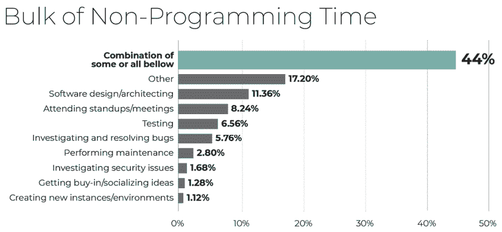
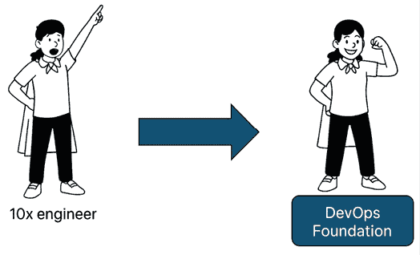
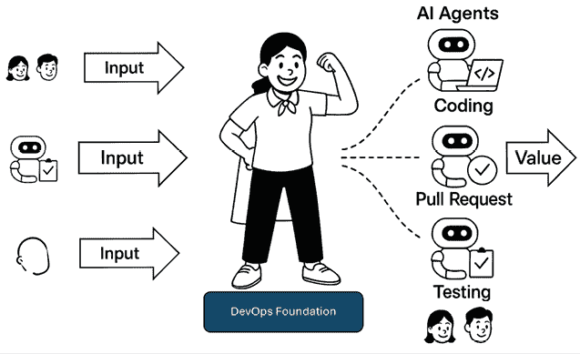
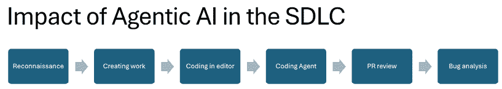

# 10

# 改变叙事：用 AI 重新构架工程

生成式 AI 在软件开发生命周期（SDLC）中的影响正在加速，并正在改变我们整个工作领域。现在，简单的日常任务可以由代理处理，这样人类工程师就可以专注于真正有价值的地方——交付对最终用户有价值的耐用、可工作的应用程序。我们现在已经到了一个地步，创建某些更改变成了让人类工程师花时间实施这些更改，还是将手头的任务交给 AI 代理，并支付几美元以自动实施的选择。

在我们看来，我们需要将叙事从仅仅让工程师使用 GitHub Copilot，然后简单地观察感知到的生产力提升转变过来。目前，公司往往专注于 AI 更容易、更快地生成代码的想法，这让他们认为他们终于找到了一种方法，将 1 个配备 AI 工具的工程师变成 10 个工程师（其中，一个配备 AI 工具的工程师可以完成 10 个没有这些工具的工程师的工作）。

我们甚至看到工程师们用关于“氛围编码”与 AI 的故事来炒作这件事：他们用一个简单的提示就跳上键盘，接受给出的每一个建议，然后运行应用程序来找出他们最初的问题是否得到了解决。最终，这条路径只会导致失望：要么代码没有按预期工作，要么缺少关键信息，AI 在某个地方走错了方向。更糟糕的是，我们见过生成式 AI 遵循“侦察规则”，开始清理自己的痕迹，修改根本不需要修改的代码。这可能导致代码库中的其他地方受到影响，从而引入新的错误。更不用说这一切了，我们还看到工程师们在将“氛围编码”的成果推送到生产环境之前甚至没有对其进行测试。这是一个灾难性的配方，最终会导致大量的挫败感和失望。

我们还看到另一个问题是，管理者常常认为他们会通过这些新工具获得那 10 名工程师，他们产生商业价值的问题都会消失！焦点往往在于使工程师更加“高效”，以便他们创造更多的代码和为最终用户创造的价值，而且代码的生成速度也比以往任何时候都要快。这样做，他们完全忽略了我们只关注工程师每天可用于编码工作的两个小时（例如，参见 ActiveState 的 2019 年开发者调查：[`www.activestate.com/wp-content/uploads/2019/05/ActiveState-Developer-Survey-2019-Open-Source-Runtime-Pains.pdf`](https://www.activestate.com/wp-content/uploads/2019/05/ActiveState-Developer-Survey-2019-Open-Source-Runtime-Pains.pdf)）。一天中的其他时间用于诸如需求收集、文档和会议等活动。我们根本不谈论优化剩余的工作日！

图 10.1：ActiveState 2019 开发者报告中非编程时间的主体

**要查看此图像的颜色**

使用您购买时附带的免费彩色 PDF 版。有关详细信息，请参阅*前言*中的*随书免费福利*部分。

GitHub Copilot 可以用来帮助处理一些这些任务，如需求收集，但对于站立会议、改进和会议等任务，找到 GitHub Copilot 的好用例就更加困难。有其他工具可以帮助处理这些类型的事情，例如来自各种供应商的自动会议记录转录器。

只关注代码生成似乎有点狭隘。突然，我们看到公司需要为使他们的开发者使用 GitHub Copilot 而辩护成本。这提出了一个有趣的观点：尽管 GitHub Copilot 承诺提高生产力，但其许可成本通常成为焦点。我们看到了一些商业案例，其中对费用的主要辩护完全基于预期的生产力改进，以防御许可成本。当然，如果您有 500 名工程师，他们现在需要额外花费每月 19 美元（商业许可证）的新工具，那么就是 500 x 12 个月 x $19 = $114,000。另一方面，我们从未需要为购买代码编辑器的许可证或办公工具的许可证提出商业案例，但为了帮助我们每天多出两个小时的工具，我们需要定义一个商业案例并辩护为什么我们需要每月花费约 19 美元在 GitHub Copilot 上！

大多数编辑器的成本是这个成本的数倍，更不用说工程师现在使用的硬件了。如果你假设工程师的薪资成本较低，那么我们可以计算出，如果我们每个月为工程师节省大约 20 分钟的时间，那么许可费用就已经赚回来了！既然我们整个行业已经加入了人工智能的行列，那么关于投资回报率（**ROI**）的讨论应该相当简单。

如果你有正确的想法，那么就有更多的理由将叙事从仅仅关注 ROI 转向讨论 GitHub Copilot 在你的组织中可以产生的实际影响。我们需要考虑对代码库和工程师的下游影响，以便我们能够充分利用新工具带来的浪潮。我们需要具备哪些条件才能获得这些好处？我们如何将影响扩展到我们团队中不是工程师的人？

正因如此，我们将在本章中探讨以下主题：

+   GitHub Copilot 的伦理使用

+   建立坚实的 DevOps 基础

+   将人工智能扩展到工程师相关角色

+   人工智能增强的工程

# GitHub Copilot 的伦理使用

当使用生成代码库一部分的工具时，我们始终需要牢记几个伦理方面。代码生成本身有一个方面，大型语言模型会根据它们的训练方式表现出某些特征。我们已经在*第二章*中提到了诸如偏见等问题。另一个方面是工程师如何使用这些工具，以及他们在工具影响他们的工作方式方面的勤奋程度。如果工程师停止思考，盲目接受大型语言模型的每一个输出，他们实际上真的获得了什么？我们认为没有。这个方面更多的是人工智能对团队工作方式可能产生的一种文化影响：我们需要避免仅仅指出工具，并说它是人工智能生成的，因此它应该能够正常工作。我们是回路中的人类，我们需要将我们的专业观点带入为我们的最终用户创造商业价值。

作为工程师，这意味着我们需要保持警觉，并成为回路中的人类：我们对代码建议的使用做出伦理决策，并选择以某种方式实现我们的代码。例如，我们必须做以下事情：

+   确保我们从 GitHub Copilot 接受的任何代码不会无意中引入安全漏洞，例如硬编码的凭证或处理不安全的输入方式

+   对版权和许可保持警惕——如果建议的代码与具有限制性许可的开源项目非常相似，那么我们有责任核实我们是否被允许使用它

+   避免使用可能强化偏见或歧视的人工智能生成的代码，尤其是在招聘算法或面向用户的特性等领域的代码

这些只是我们在使用人工智能工具作为工程师所面临的伦理决策的几个例子。

我们需要继续成为考虑应用程序所有方面的专业人士：我们带来构建解决方案的愿景，考虑到我们的需求，从功能角度以及技术角度。尤其是当与代码变更相关联的人仍然是我们而不是 AI 时：每个提交或拉取请求都是以我们的名义创建的，所以这一切都归因于进行更改的工程师。我们需要坚持我们的标准来构建展示正确专业水平和目的的应用程序。通过这样做，我们确保我们的应用程序不仅满足期望，而且在我们交付的内容中激发信心和自豪感。继续独立思考，并将所需内容添加到你的提示和实现中：你仍然是飞行员！

现在我们已经讨论了使用 GitHub Copilot 的伦理方面，包括生成式 AI 的已知局限性和偏见，以及工具对工程师及其团队的文化影响，我们可以看看为了真正从 GitHub Copilot 中获得最大价值需要做些什么，因为这一切都取决于遵循创建应用程序和代码的正常最佳实践。

# 建立一个坚固的 DevOps 基础

当通过 AI 赋能工程师时，你需要意识到创建代码和应用程序的基本原则仍然存在——如果你有一个糟糕的基础，那么在上面添加更多的代码并不会增加多少价值，甚至可能使事情变得更糟。相反，我们建议专注于使工程师能够工作在打下坚固的基础，以便能够更快地推出他们的应用程序，并且更有信心他们的应用程序按预期工作。

这将重点从获得 10 倍工程师转向赋予工程师一个他们可以信赖的基础，这反过来又将提高通过 SDLC 的价值流动。

图 10.2：转向坚固的 DevOps 基础

我们一直秉持 DevOps 思维，我们坚信要建立基本的原则：

+   自动化的管道和测试验证每个变更，以防止这些变更的不希望出现的副作用。

+   将一切视为代码或配置，以确保部署的一致性和可靠性。例如，基础设施应被编码化，以便每次都能以相同的结果重新创建。如果你的环境有不同的设置，这些差异应记录在代码中。这种方法允许你明确地管理变化，并确保部署保持可预测和值得信赖。

+   实施更多的眼睛原则，即每个变更都由其他人进行审查——这有助于防止意外的副作用，并信任单个人的想法。

+   足够的测试以建立信任——如果部署因任何原因失败，应向管道中添加一个新的测试以防止其再次发生。

+   持续监控和反馈循环。

只有当大部分这些基础都建立起来后，工程师团队才能更快地推出他们的变更，例如，测试已经到位，可以依赖他们的部署。请注意，这可以通过多种方式实现——例如，使用单元测试、回归测试或集成测试。使用适合您应用程序的方法。

类似于 GitHub Copilot 的生成式 AI 可以帮助建立这些基础，并且在这方面工作得非常好。我们发现很多用户只关注使用 GitHub Copilot 进行编码，却不知道它还能做更多：我们已经用 GitHub Copilot 创建了各种脚本、流水线和甚至 Splunk 查询，如果你知道如何正确地提示，它工作得非常好。我们将 GitHub Copilot 视为一个赋能者，帮助团队有时间整理好基础。由于常规任务被加速，额外的时间可以用于改善那些经常被推到待办事项底部或至少被排除在冲刺之外的事项。

我们建议团队始终嵌入这些类型的债务，要么将其纳入他们的工作方式，要么在每次冲刺中专门留出时间来改进它。我们观察到，成功的团队通常会持续将每个冲刺的约 10%时间用于解决技术债务。通过使这成为他们工作流程的常规部分，他们确保改进和重构永远不会被忽视。

在建立了良好的、坚实的基础之后，团队实际上可以更快地交付价值，增加信任，并减少生产中的问题。工程师开始在他们流程中利用 AI，从生成新需求到编码、审查和测试。工程师成为中间的协调者，在坚实的 DevOps 基础上构建：

图 10.3：工程团队的新角色

当我们建立了良好的基础并信任我们的流程可以让我们更快地工作，我们就可以开始考虑团队的其他工作以及如何让团队中的其他人，而不仅仅是工程师，得到赋能。

# 将 AI 扩展到工程相关角色

在推出 GitHub Copilot 时，人们通常会只想到团队中的工程师——他们是那些通过编写代码来创建新功能的人，以便能够执行它们。但采取这种立场，我们会忘记团队中的其他人。正如我们所说，平均而言，一个工程师如果能每天专注于编写两小时的代码就足够幸运了。其余的时间都花在准备、讨论、架构工作、文档等等上。然后，总有团队大部分时间都在开会，有时在一天中重叠或并行进行。有时甚至感觉会议被认为比实际的编码更重要！

这引出了更广泛的转变：工作如何流向工程师。除了编码之外，他们的大部分时间都花在将用户需求转化为可执行任务、明确需求以及确保团队中的每个人都理解提议变更的影响上。这些任务通常涉及与利益相关者的合作，在许多情况下，产品所有者充当渠道，将工作引导到团队中。GitHub Copilot 可以通过帮助团队更有效地阐述、完善和传达这些变更来支持这一流程。

在我们看来，我们现在需要将重点从仅关注编写代码的人转移到使团队中的其他角色，如产品所有者、利益相关者或用户，能够使用生成式 AI 发送更好的、更详细且因此更具体的功能实现描述。他们可以用自然语言描述他们想要进行的更改，并使用 AI 将其转换为详细规范。他们可以向用户故事/工作项/问题添加的信息越多，工程师就越容易在代码中实施变更。

现在 GitHub Copilot 允许产品所有者和工程师直接从他们的浏览器中探索计划中的变更和描述即将到来的工作，在他们在工作的存储库上下文中。考虑以下流程：

1.  从存储库上下文（或问题、讨论、失败的流程、代码扫描警报等）开始对话。

1.  让 GitHub Copilot 帮助你定义新的工作。提出像“基于当前代码库，我们如何添加一个执行<描述>的新功能？”这样的问题。

1.  提出后续问题以添加更多上下文或需求，或者找到添加新测试以验证新功能的位置。

1.  当你有足够的上下文时，让 GitHub Copilot 为你创建问题，直接从网页浏览器开始！聊天界面知道你正在工作的存储库，并且有一个弹出窗口让你创建一个新工作描述，包括所有讨论的上下文和文件。

在那详细的职责描述中，一位在应用方面有专长的工程师可以审查即将到来的工作描述并添加最后的修饰，因为他们理解整个系统和必要的需求。当即将到来的工作有足够的清晰度，包括对所需内容的详细解释和对代码库中现有功能的引用时，可以使用 AI 来建议需要实施代码调整，并提出实际变更。可以利用像 Coding Agent 这样的工具，GitHub Copilot 根据问题建议变更，来重新运行管道中的测试并根据需要迭代。一旦测试成功并且变更得到验证，系统将提交一个拉取请求以供最终审查。这种以代理驱动的流程正在变得越来越普遍，GitHub 在合理的关键领域集成了这些放大器。

有关这些代理实现的更多详细信息，例如编码代理，请参阅*第六章*。

通过将 AI 的使用范围扩展到工程师之外，我们可以使所有团队成员都能为应用程序做出贡献。这样，我们就可以从仅仅关注生成新代码转变过来。相反，我们关注 SDLC 的各个方面，从需求工程到编写工作描述，编写必要的代码更改，审查代码更改，修复管道故障，甚至解决代码扫描中发现的问题。我们可以通过将生产中的任何错误反馈回系统作为工作定义来闭环。

这样，我们都可以从使用生成式 AI 中受益，使每个人都能利用其功能，并继续专注于我们一直在做的事情——为我们的最终用户提供价值。

现在，让我们看看如何利用 AI 使整个团队能力提升，并在创建应用程序的整个过程中真正产生影响。

# AI 增强型工程

随着所有 AI 技术融入我们的日常工作中，我们看到我们的行业正朝着代理式 AI 转变，其中像 GitHub Copilot 这样的工具成为知识型人员的延伸，这样我们就可以专注于真正重要的事情。在代理式 AI 中，我们指的是基于事件触发生成式 AI 工具的使用，然后这些工具可以对工作进行评估，实施更改，运行测试，并在过程中无需额外监督的情况下验证结果。最终结果随后被发布回工程师处，以便在需要时进行处理和跟进。

我们常说，作为工程师，我们不是来编写下一个`if`语句或`for`循环的。当我们编写出精彩的代码时，并不会得到掌声。相反，当我们构建出能为最终用户提供价值的东西时，我们才会得到赞誉。对于用户来说，我们如何实现这种价值并不那么重要，只要功能能按需工作即可。他们不关心我们是用 C#还是 Typescript 编写的解决方案，只关心它是否工作，以及他们是否不需要等待太长时间就能看到他们行动的结果。

这是我们看到的人工智能赋能工程师的新角色——聪明地使用合适的工具来完成合适的工作，以实现你想要创造的价值。这意味着我们可以在软件开发过程中合理地融入 GitHub Copilot 功能。就像行业中的同行已经在他们的流程中拥抱 AI 一样，我们也可以利用它来获得它带来的好处。有了这些工具，工程从仅仅编写新代码（及其所有相关工作）转变为专注于系统工程，描述功能和技术需求，然后保护系统，使其在请求的更改中保持在我们设定的要求范围内。

在以下图中，你可以找到 GitHub Copilot 功能到我们的 SDLC（未来，肯定会有更多机会进一步发展）的当前接触点：

图 10.4：GitHub Copilot 在 SDLC 中的接触点

让我们回顾这些接触点，并将它们与 GitHub Copilot 的不同功能联系起来：

| **阶段** | **GitHub Copilot 功能** |
| --- | --- |
| 探索 | 使用聊天界面（无论是在你的编辑器中还是在 GitHub.com 上）来收集你想要工作的功能的背景信息。 |
| 创建工作 | 当侦察完成并且你有足够的背景信息时，你可以让 GitHub Copilot 为你创建工作项，无论是通过在编辑器中利用 GitHub MCP 服务器，还是通过指示它从 Web 界面创建一个新的问题。 |
| 在编辑器中编码 | 为了实施必要的更改，你可以在你的编辑器中使用 GitHub Copilot，从你键入时的建议到带有询问、编辑或代理模式的聊天界面，你可以选择所有你想要的不同选项。 |
| Coding Agent | 你不必自己做出所有更改，将工作交给 Coding Agent，让它为你实施更改，这样你就有了一个工作并经过测试的 PR，可以准备审查。你可以通过沟通来做出更改或加载 PR 状态到编辑器中，并从那里进行微调。 |
| PR review | 当创建一个 PR 时，你可以从 Coding Agent 那里获得第一次审查。在审查中处理至少低垂的果实，这样你作为循环中的人类，就可以花时间在 PR 上，这会非常有帮助。记住，代码审查当然不能捕捉到每一个问题；这仍然是标准和安全测试的角色。另一方面，我们见过代码审查员发现的问题，我们甚至都没有想过！见*第六章*了解更多例子。 |
| Bug analysis | 无论错误发生在生产环境中还是你的 CI/CD 管道中，GitHub Copilot 都可以跳到错误消息并找出解决方案。你可以在多个地方利用这一点，从 Web UI 到编辑器，并在你认为最合理的地方采取行动。 |

图 10.5：GitHub Copilot 在 SDLC 中的接触点

你可以从这些接触点中看出，工程师（以及他们的同行）的角色正在从专注于编写更多代码，转变为更加勤奋地考虑要构建什么，以及如何使这些更改在未来保持高质量和可维护性。我们不需要自己做出所有这些更改——相反，我们有 AI 代理可以帮助我们实施更改，这样我们就可以专注于如何为我们的最终用户提供最大价值。

我们也不担心我们自己的角色和成为工程师的原因——对于高技能人员来说，总会有工作要做，而且，我们认为他们将在未来 AI 代理的生产中扮演更多的协调者角色。工程师将监督 AI，确保系统有足够的信任来继续下一步。下一步是让我们的同行也能够使用这些工具，因为它为我们所有人带来了很多价值。有了更多具有工程思维的人，我们可以走得更远，更快。

同时，拥有一种良好的方法来培训新工程师，使他们能够熟练使用工具、了解其局限性，并理解变化对他们工作的应用带来的影响，这也是至关重要的。有关创建培训机会和社区建设的更多信息，请参阅*第八章*。未能培训新工程师将导致更多（下游）问题和工程师及其利益相关者的挫败感。

接受新的工作方式将导致更高效的工作方式，并最终使我们的应用程序最终用户获得更好的体验，正如我们在*第九章*中描述的那样。

# 摘要

在本章中，我们展示了在讨论 GitHub Copilot 时改变叙述的不同方式。我们不仅关注更快地产生更多代码，还希望关注这些新工具对我们开发过程的影响。我们通过审视对盲目信任 LLM 产生的内容的伦理反对，以及仅仅接受一切并停止独立思考的伦理影响，来讨论 GitHub Copilot 的伦理使用。要真正从生成式 AI 中获得好处，你需要有一个坚实的（DevOps）基础。这将帮助你避免许多失败模式，并提高你对即将到来的变化的信任度。然后，我们探讨了将 AI 的使用扩展到团队中非工程师职业的每个人：从利益相关者到产品所有者/经理，甚至最终用户。最后，我们探讨了 AI 增强的工程团队如何在他们的开发过程中利用 GitHub Copilot 的所有功能。

由此，我们到达了本书的结尾：我们向您介绍了 GitHub Copilot 的不同功能，例如（内联）建议、（内联）聊天，以及其不同的聊天选项，如询问、编辑和代理模式。我们首先深入了解了生成式 AI，以便对它有一个基本的了解。在深入探讨与 GitHub Copilot 合作的不同模式（在编辑器中、在浏览器中以及在所有不同的扩展和选项中，如 GitHub Copilot CLI）之后，我们讨论了接受学习曲线，因为在使用这些新的 AI 工具的过程中，有很多教训需要随着时间的推移内化。由于每个人学习的风格都不同，我们还探讨了如何建立一个社区，以便分享学到的经验，从而造福整个社区。我们结束了关于这些工具能为你和你的队友带来什么变化的当前章节。

随着 AI 工具的出现，GitHub Copilot 作为这场革命的先锋，我们看到了我们对工程师贡献看法的根本转变。作为工程师，我们增加的价值从未仅仅在于我们生产的代码，而随着我们对 AI 的使用，这一点正在变得日益突出。我们的价值在于我们学习到的系统思维。通过将系统作为一个整体来看待，我们思考应用变更可能产生的影响，以及我们如何为最终用户提供商业价值。

对我们的软件或脚本的变更实施已经从手动添加代码更改转变为描述和记录这些更改以及我们的需求。现在，这是一个选择由人类实施这些更改还是让 GitHub Copilot 为我们实施它们的问题。这个决定基于能力和成本。如果我们预计 GitHub Copilot 可以实施这些更改，那么这是一个基于成本的决定：我们应该自己实施并花几分钟时间，还是这将花费我们更多时间，我们可以将其转交给，例如，编码代理，它可以花费额外的请求和几分钟的 GitHub Actions 时间来解决这个问题并修复它？

现在，我们在开发过程的各个不同地方都有一些令人惊叹的工具。这些工具可以被利用来使我们的工作变得更加容易，这样我们就可以再次找到工程实践中的乐趣。我们不再需要敲击键盘并深入代码更改，现在我们可以探索并花时间在我们一直希望有时间去做的事情上，现在我们实际上可以创造这样的时间！将那些枯燥且不太有趣的任务交给 GitHub Copilot，这样你就可以更多地专注于工程工作的有趣部分。

|

## 获取本书的 PDF 版本和独家额外内容

扫描二维码（或访问[packtpub.com/unlock](http://packtpub.com/unlock)）。通过书名搜索本书，确认版本，然后按照页面上的步骤操作。 |  |

| *注意：请妥善保管您的发票。直接从 Packt 购买的商品不需要发票。* |
| --- |
