# 在 AI 世界的第一步

*从青铜巨人塔洛斯到符号系统和神经网络：AI 是如何在视频游戏中被塑造和使用的。*

欢迎读者，欢迎来到我们人工智能之旅的开始，或者简称为 AI。你有没有想过那些在《魔兽世界》中辛勤工作的平民是如何探索复杂的地图的？或者，那些在《吃豆人》中活泼的幽灵是如何把你带到任何地方的？或者，也许你的对手在《最终幻想》中是如何优化攻击来屠杀你的团队的？

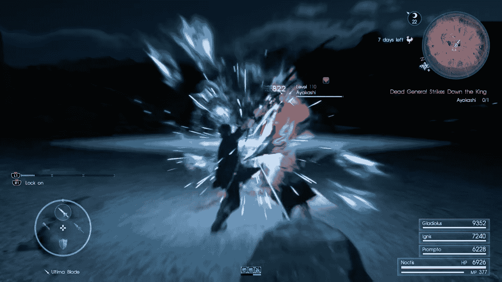

来自《最终幻想 XV》[Square Enix, 2016]的战斗截图。

那你就来对地方了！

在本章中，我们将探讨成为 AI 游戏开发者的先决条件以及 AI 在游戏开发流程中的应用。然后，我们将回顾 AI 的一般历史和在视频游戏中的历史，了解众多杰出人士的联合努力是如何构建出我们今天所知道的 AI。之后，我们将讨论 Unreal 引擎下的 AI 框架，因为本书将专注于 Unreal。

最后，我们将规划我们的旅程，并对本书不同章节所涉及的主题有一个总体了解。

# 在开始之前...

...我想回答一些你们中的一些人可能已经有的问题。

**这本书考虑了 Blueprint 和 C++吗？**

本书将解释这两者，所以请放心。

如果你不知道 C++，你可以跟随本书的 Blueprint 部分，如果你愿意，也可以尝试 C++部分。

如果，另一方面，你是一个更喜欢 C++的程序员，那么请不要担心！本书将解释如何在 Unreal 中使用 C++处理 AI。

**关于 AI 的书有很多，我为什么应该选择这本书？**

不同的书解释了 AI 的不同方面，而且它们往往不是相互排斥的，而是相互补充的。

然而，这本书的主要亮点在于它很好地平衡了 Unreal 中存在的不同 AI 系统的理论以及实际应用，因为整本书都充满了具体的例子。

**这本书提供测试项目/材料来工作吗？**

绝对，是的。你将能够从以下链接下载本书的内容：[`hog.red/AIBook2019ProjectFiles`](http://hog.red/AIBook2019ProjectFiles)（链接区分大小写）。

**我已经在使用 Unreal Engine 进行人工智能开发，这本书对我有帮助吗？**

这一切都取决于你的知识水平。实际上，本书的第一部分，我们将主要讨论内置在虚幻引擎中的 AI 框架以及如何使用它。如果你在虚幻引擎 AI 方面有一些经验，这可能是你更熟悉的部分。然而，本书将深入探讨这些主题，即使是专家也能找到一些有用的提示。相反，第二部分将讨论游戏 AI 的一些调试方法，并解释如何扩展它们（主要使用 C++）。请随意查看大纲，并决定这本书是否适合你。

**我已经在使用另一个游戏引擎，这本书对我还有用吗？**

好吧，尽管我很想说我写的是一本关于 AI 的通用书籍，但这并不是——至少不是完全如此。尽管主要焦点仍然是 AI 的主要概念，但我们将探讨如何在虚幻引擎中实现它们。然而，这本书将大量依赖虚幻引擎内置的 AI 框架。因此，我鼓励你阅读更多关于 AI 的通用书籍，以获得更好的理解。另一方面，你总是可以尝试。也许，通过理解这里的一些概念，其他书籍会更容易阅读，你将能够将这种知识转移到你选择的任何游戏引擎中。

**我是一个学生/教师，这本书适合在课堂上教学吗？**

绝对是的。我知道找到好的资源对于教学来说有多重要，我写这本书正是出于这个目的。因此，无论你是学生还是教师，你都会在每一章的末尾找到一个部分，其中包含一些练习，你可以通过这些练习提高你的技能（或者如果你是教师，你可以将这些练习推荐给你的学生）。此外，你还可以在这里找到一些更综合的材料：[`hog.red/AIBook2019LearningMaterial`](http://hog.red/AIBook2019LearningMaterial)（链接对大小写敏感）。

**这本书是否会涵盖关于虚幻引擎及其所有系统的 AI 的方方面面？**

尽管我尽力详细描述每个系统，但涵盖所有内容是不可能的任务，这也归因于如此大型引擎的复杂性。然而，我有信心地说，这本书涵盖了与虚幻引擎中每个 AI 系统相关的几乎所有方面，包括如何扩展内置系统以及如何高效地进行调试。因此，我确实可以说这本书非常全面。

# 前置条件

由于本书面向的是刚开始在游戏开发中使用 AI 的人群，因此我不会假设读者有任何关于 AI 的先验/背景知识。然而，请考虑以下几点：

+   *蓝图用户*：你应该熟悉蓝图编程，并了解蓝图图的一般工作原理。

+   *C++ 用户*：您应该熟悉编程，特别是 C 家族语言（如 C、C#、C++ 或甚至 Java），尤其是 C++，因为这是 Unreal Engine 使用的语言。熟悉 Unreal Engine C++ API 是一个很大的加分项，尽管不是强制性的。所以，即使您不是专家，也不要担心——跟随步骤，您将会学到。

此外，如果您对矢量数学和物理运动学原理有所了解——至少是视频游戏中常用的那些——那就太好了。无论如何，如果您对这些内容不太熟悉，也不要过于担心，因为这本书并不要求您必须掌握；然而，如果您在寻找人工智能开发者的工作，这将是一个加分项。

# 安装和准备软件

在您继续阅读之前，让我们安装我们需要的软件。特别是，我们需要 Unreal Engine 和 Visual Studio。

# Unreal Engine

让我们来谈谈 Unreal Engine。毕竟，这是一本关于如何在这样一个优秀的游戏引擎中开发游戏人工智能的书。

*Unreal Engine* 是由 *Epic Games* 开发的一款游戏引擎。它最初于 1998 年发布，如今由于它强大的功能，它是使用最广泛的（开源）游戏引擎之一（与 Unity 并列）。下面的截图显示了 Unreal Engine 的主界面：

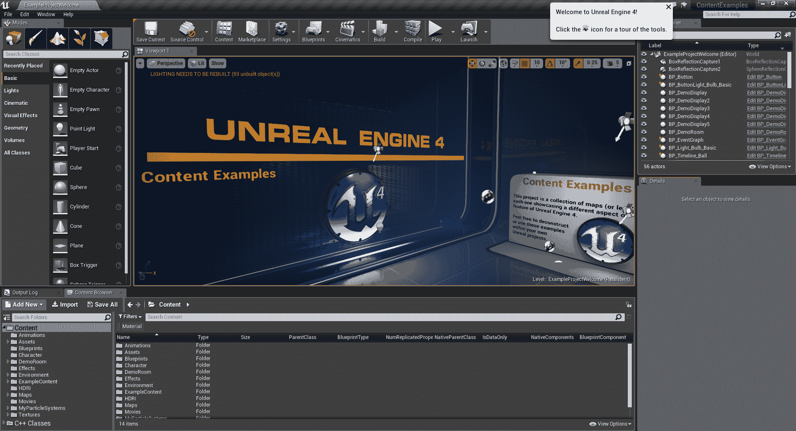

Unreal Engine 主界面截图

我们需要安装最新版本的 Unreal Engine。您可以通过访问 [`www.unrealengine.com/en-US/what-is-unreal-engine-4`](https://www.unrealengine.com/en-US/what-is-unreal-engine-4) 来找到它。除非您是从源代码获取的 Unreal Engine ([`docs.unrealengine.com/en-us/Programming/Development/BuildingUnrealEngine`](https://docs.unrealengine.com/en-us/Programming/Development/BuildingUnrealEngine))，否则您将安装 *Epic Launcher*。如果您是 Blueprint 用户，并且不打算使用 C++，那么这已经足够了。如果您将使用 C++，您需要执行几个额外的步骤。

在安装引擎时，如果您使用的是 C++，您需要检查一些选项。特别是，我们需要确认我们既有 “***Engine Source***” 也有 “***Editor symbols for debugging***”，如下面的截图所示：


通过这样做，我们能够导航 C++ 引擎源代码，并在发生崩溃时拥有完整的调用栈（这样您就会知道出了什么问题）。

# Visual Studio

如果您使用的是 Blueprint，您不需要这样做——这仅适用于 C++ 用户。

实际上，我们需要一个集成开发环境（IDE）来编辑我们的 C++ 代码。我们将使用 *Visual Studio*，因为它与 Unreal 集成得很好。您可以通过官方网站 [`www.visualstudio.com`](https://www.visualstudio.com) 或 [`visualstudio.microsoft.com/vs/`](https://visualstudio.microsoft.com/vs/) 免费下载 *Visual Studio Community Edition*。

你可能也会发现这个关于如何设置*Visual Studio*以便与 Unreal Engine 一起工作的简短指南很有用：[`docs.unrealengine.com/en-us/Programming/Development/VisualStudioSetup`](https://docs.unrealengine.com/en-us/Programming/Development/VisualStudioSetup)。

一旦你安装好所有东西并准备就绪，我们就可以继续本章的其余部分。

如果你是一名*MacOS*用户，有一个适用于*MacOS*的*Visual Studio*版本。你可以使用那个版本。或者，你可能能够使用 *XCode*。

# 成为 AI 游戏开发者

你曾梦想过成为一名 AI 游戏开发者吗？或者只是能够编写"*智能*"程序？那么这本书就是为你准备的！

然而，我必须建议你，这并不是一件容易的任务。

游戏开发和设计是周围最广泛的艺术作品之一。这是由于将游戏带到生命中所需要的专业知识量很大。你只需看看游戏中的最终字幕就能得到这个想法。它们是无穷无尽的，包含了许多人在各种角色上为游戏投入了大量时间的名字。AI 开发是这个大过程中的一个核心部分，它需要多年的时间来掌握，就像生活中的大多数事情一样。因此，迭代是关键，这本书是一个开始的好地方。

# 成为 AI 游戏开发者意味着什么

首先，你需要掌握数学、物理和编程。此外，你很可能会在一个跨学科团队中工作，这个团队包括艺术家、设计师和程序员。实际上，你可能需要与现有的专有软件技术合作，并且需要你能够构建新技术以满足项目的技术要求。你将被要求研究编码技术和算法，以便你能够跟上游戏行业的技术发展和进步，并识别技术和发展风险/障碍，并生成解决方案来克服已识别的风险。

另一方面，你将能够赋予视频游戏中的角色和实体生命。在你可能经历的所有挫折之后，你将是第一个提供帮助的人，或者更好的是，在游戏中生成智能行为。这需要时间，而且相当具有挑战性，所以在早期阶段不要对自己太苛刻。一旦你在游戏中实现了可以独立思考的真正 AI，这将是一个值得奖励自己的成就。

对于 AI 的初学者来说，这本书将帮助你为那个目标奠定第一块基石。对于专家来说，这本书将提供一份有用的指南，帮助你刷新 Unreal 中的不同 AI 系统，并深入探索可能有助于你工作的功能。

# 游戏开发过程中的 AI

游戏开发流程可能会因你访问的哪个工作室而大不相同，但它们都指向了视频游戏的创作。这不是一本关于流程的书，所以我们不会探索它们，但了解 AI 大致的位置是很重要的。

事实上，AI 与游戏开发流程的许多部分相交。以下是一些主要的部分：

+   **动画**：可能会让一些人感到惊讶，但关于这个主题正在进行很多研究。有时，动画和 AI 会重叠。例如，开发者需要解决的一个问题是如何以程序化的方式为角色生成数百个动画，这些动画可以表现得非常逼真，以及它们如何相互交互。实际上，解决逆运动学（IK）是一个数学问题，但选择无限多解中的哪一个来实现目标（或者只是提供一个逼真的外观）是一个 AI 任务。在这本书中，我们不会面对这个具体问题，但最后一章将提供一些指向你可以了解更多信息的地点。

+   **关卡设计**：如果一个游戏能够自动生成关卡，那么 AI 在这个游戏中就扮演着重要的角色。*程序性内容生成*（PCG）在游戏中是一个热门话题。有些游戏完全基于 PCG。不同的工具可以用来程序化生成高度图，帮助关卡设计师实现看起来逼真的景观和环境。这确实是一个值得深入探讨的广泛话题。

+   **游戏引擎**：当然，在游戏引擎内部，有很多 AI 算法在发挥作用。其中一些是针对代理的特定算法，而另一些则只是改进了引擎的功能和/或任务。这些构成了最广泛的类别，它们可以从简单的调整贝塞尔曲线的算法到实现用于动画的行为树或有限状态机。在底层，这里有很多事情在进行。在这本书中，我们将探讨一些这些概念，但要记住的是，一个算法可以被调整来解决不同领域中的类似问题。实际上，如果有限状态机（FSMs）被用来做出决策，为什么不用它们来“决定”播放哪个动画？或者为什么不甚至处理整个游戏逻辑（即 Unreal 引擎中的蓝图可视化脚本）？

+   **非玩家角色**（**NPCs**）：这是在游戏中使用 AI 的最明显例子，也是玩家最明显的 AI（我们将在第十四章“超越”中探讨 AI 与玩家之间的关系）。这本书的大部分内容都集中在这一点上；也就是说，从移动角色（例如，使用寻路算法）到做出决策（即使用行为树），或者与其他 NPC 合作（多代理系统）。

很遗憾，我们在这本书中没有足够的空间来处理所有这些主题。因此，我们将只关注最后一部分（NPCs），并探索内置在 Unreal 中的 AI 框架。

# 一点历史

在我们开始这段旅程之前，我相信对人工智能和游戏人工智能的历史有一个大致的了解可能会很有益。当然，如果你是一个更倾向于动手操作、迫不及待想要开始编程人工智能的人，你可以跳过这部分内容。

# 什么是人工智能？

这是一个非常有趣的问题，它没有唯一的答案。实际上，不同的答案会引导我们了解人工智能的不同方面。让我们探索一些（众多）不同学者（按时间顺序）给出的定义。

实际上，在他们的书中，Russell 和 Norvig 将这些特定的定义组织成了四个类别。以下是他们的框架：

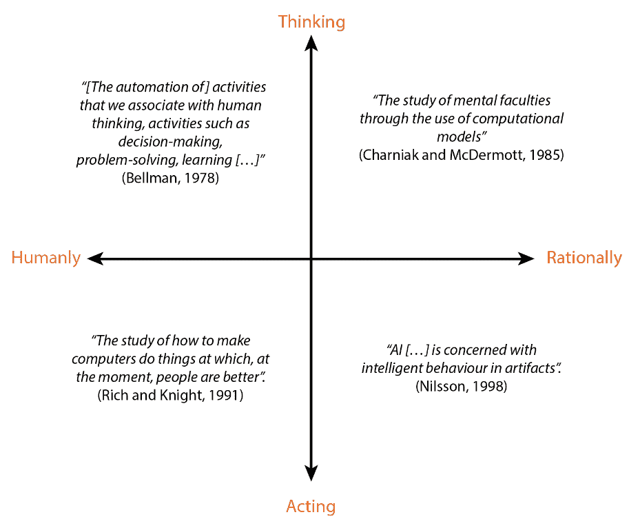

Russell 和 Norvig 的四个类别。左上角：“像人类一样思考的系统”。右上角：“理性思考的系统”。左下角：“像人类一样行动的系统”。右下角：“理性行动的系统”。

我们没有时间详细探讨“什么是人工智能？”这个问题，因为这可以单独填满一本书，但本书的最后一章也将包括一些哲学参考，你可以在这里扩展你对这个主题的了解。

# 回顾过去

对于一些人来说，人工智能的故事始于计算机之前。事实上，甚至古希腊人也假设了智能机器的存在。一个著名的例子是青铜巨人塔洛斯，它保护克里特城免受入侵者。另一个例子是赫菲斯托斯的金色助手，它们帮助上帝在火山锻造中工作，还有独眼巨人。在 17 世纪，勒内·笛卡尔写下了关于能够思考的自动机，并相信动物与机器不同，可以用滑轮、活塞和凸轮复制。

然而，这个故事的核心始于 1931 年，当时奥地利逻辑学家、数学家和哲学家库尔特·哥德尔证明了所有一阶逻辑中的真命题都是可推导的。另一方面，这在高阶逻辑中并不成立，其中一些真（或假）命题是无法证明的。这使得一阶逻辑成为自动推导逻辑后果的良好候选者。听起来很复杂吗？嗯，你可以想象这对他的传统主义同代人来说听起来是怎样的。


阿兰·图灵 16 岁时的照片

在 1937 年，英国计算机科学家、数学家、逻辑学家、密码分析家、哲学家和理论生物学家艾伦·图灵，通过停机问题指出了“*智能机器*”的一些局限性：除非实际运行，否则无法预先判断一个程序是否会终止。这在理论计算机科学中产生了许多后果。然而，根本性的步骤发生在十三年后的 1950 年，当时艾伦·图灵撰写了他的著名论文“*计算机与智能*”，在其中他讨论了模仿游戏，现在通常被称为“*图灵测试*”：一种定义智能机器的方法。

在 20 世纪 40 年代，一些尝试试图模拟生物系统：1943 年，麦克洛奇和皮茨为神经元开发了一个数学模型，1951 年，马文·明斯基创建了一台机器，能够用 3000 个真空管模拟 40 个神经元。然而，他们陷入了黑暗。

从 20 世纪 50 年代末到 20 世纪 80 年代初，大量的人工智能研究致力于“*符号系统*”。这些系统基于两个组件：由符号组成的知识库和一个推理算法，该算法使用逻辑推理来操纵这些符号，以扩展知识库本身。

在这个时期，许多杰出的思想者取得了显著的进步。值得提及的名字是麦卡锡，他在 1956 年在达特茅斯学院组织了一次会议，在那里首次提出了“*人工智能*”这个术语。两年后，他发明了高级编程语言*LISP*，在其中编写了第一个能够自我修改的程序。其他引人注目的成果包括 1959 年盖尔伦特的*几何定理证明器*，1961 年纽厄尔和西蒙的*通用问题求解器*（GPS），以及由维齐纳鲍姆开发的著名聊天机器人*Eliza*，这是 1966 年第一款能够用自然语言进行对话的软件。最后，在 1972 年，法国科学家阿兰·科梅拉乌尔发明了*PROLOG*，标志着符号系统的顶峰。

符号系统导致了众多人工智能技术的产生，这些技术至今仍被用于游戏，如黑板架构、路径查找、决策树、状态机和转向算法，我们将在本书中探讨所有这些内容。

这些系统的权衡在于知识和搜索之间。你拥有的知识越多，你需要的搜索就越少，你搜索得越快，你需要的知识就越少。这甚至已经在 1997 年由沃尔珀特和麦克雷德通过数学证明了。我们将在本书的后面有机会更详细地考察这种权衡。

在 20 世纪 90 年代初，符号系统变得不适用，因为它们证明难以扩展到更大的问题。此外，一些哲学论点反对它们，认为符号系统是有机智能的不兼容模型。因此，开发了受生物学启发的旧技术和新技术。旧的神经网络被从架子上取下来，1986 年 Nettalk 的成功，这个程序能够学会如何朗读，以及同年 Rumelhart 和 McClelland 出版的书"*并行分布式处理*"。事实上，"*反向传播*"算法被重新发现，因为它们允许神经网络（NN）真正地学习。

在过去 30 年的 AI 研究中，研究方向发生了新的变化。从 Pearl 在"*智能系统中的概率推理*"上的工作开始，概率被采纳为处理不确定性的主要工具之一。因此，人工智能开始使用许多统计技术，如贝叶斯网络、支持向量机（SVMs）、高斯过程和马尔可夫隐模型，后者被广泛用于表示系统状态的时态演变。此外，大型数据库的引入为人工智能解锁了许多可能性，并出现了一个名为"*深度学习*"的新分支。

然而，重要的是要记住，即使人工智能研究人员发现了新的和更先进的技巧，旧的技巧也不应该被丢弃。事实上，我们将看到，根据问题和其规模的不同，特定的算法可以大放异彩。

# 游戏中的 AI

视频游戏中人工智能的历史与我们之前讨论的内容一样有趣。我们没有时间详细地回顾并分析每一款游戏以及它们如何为该领域做出贡献。对于最好奇的你们，在本书的结尾，你们将找到其他讲座、视频和书籍，你们可以更深入地了解视频游戏中人工智能的历史。

视频游戏中人工智能的第一种形式是原始的，并用于像**《乒乓》**[*Atari*, 1972]，**《太空侵略者》**[*Midway Games West, Inc*., 1978]等游戏。事实上，除了移动球拍试图捕捉球，或者移动外星人向玩家移动之外，我们并没有做更多的事情：

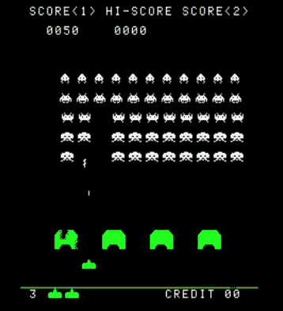

**《太空侵略者》**的一个截图[Midway Games West, Inc., 1978]，其中使用了一种原始形式的人工智能来控制外星人

第一款使用显著人工智能的著名游戏是**《吃豆人》**[*Midway Games West, Inc.*, 1979]。四个**怪物**（后来因为 Atari 2600 中的闪烁端口而被称为**幽灵**）使用有限状态机（FSM）来追逐（或逃离）玩家：

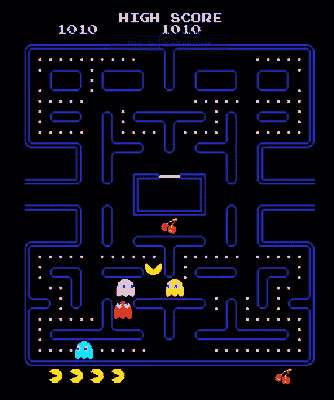

**《吃豆人》**游戏的一个截图[Midway Games West, Inc., 1979]，其中四个怪物使用有限状态机试图捕捉玩家

在 20 世纪 80 年代，游戏中的 AI 并没有太大变化。直到**《魔兽世界：兽人 vs 人类》**[*Blizzard Entertainment*, 1994]的引入，路径查找系统才在视频游戏中成功实现。我们将在第三章，*导航*中探讨导航系统：

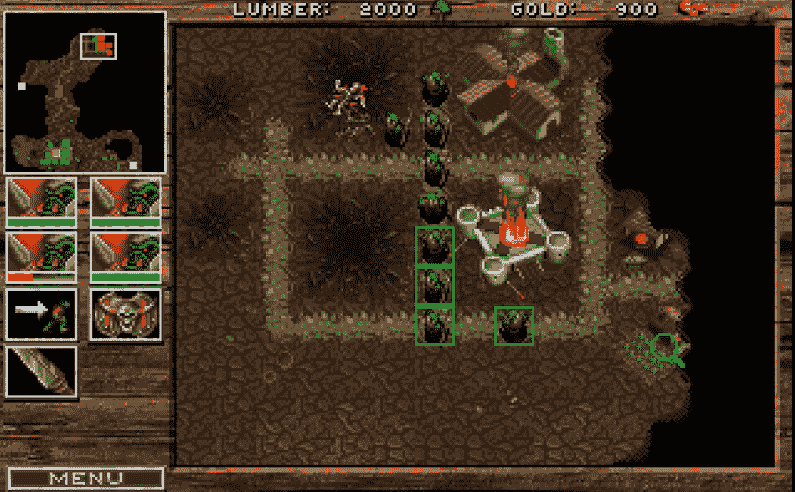

**《魔兽世界：兽人 vs 人类》**[Blizzard Entertainment, 1994]的截图，其中单位（本截图中的兽人步兵和士兵）使用路径查找算法在地图上移动

可能是开始让人们关注 AI 的游戏是**《007 黄金眼》**[*Rare Ltd.*, 1997]，它展示了 AI 如何提升游戏体验。尽管它仍然依赖于 FSM，但创新之处在于角色可以*看到*彼此，并相应地行动。我们将在第五章，*代理意识*中探讨*代理意识*。这当时是一个热门话题，一些游戏将其作为主要游戏机制，例如**《盗贼：暗影项目》**[*Looking Glass Studios, Inc.*, 1998]：

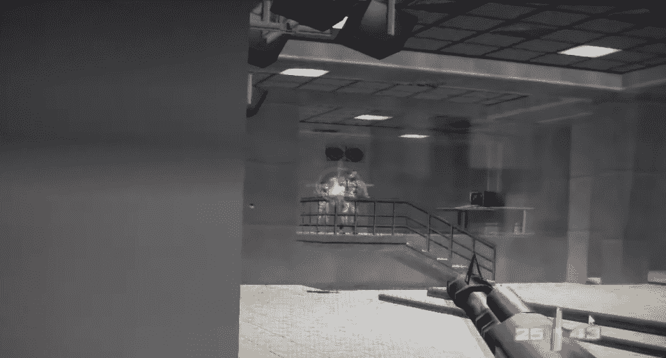

**《007 黄金眼》**[*Rare Ltd.*, 1997]的截图，它改变了人们对于视频游戏 AI 的看法

和**《合金装备固体》**[*Konami Corporation*, 1998]：


**《合金装备固体》**[*Konami Corporation*, 1998]的截图，

另一个热门话题是在战斗中模拟士兵的情绪。最早实现情感模型的游戏之一是**《战锤：黑暗预兆》**[*Mindscape*, 1998]，但直到**《全面战争：幕府将军》**[*The Creative Assembly*, 2000]，这些模型才在大量士兵中使用并取得了极大的成功，而没有性能问题：

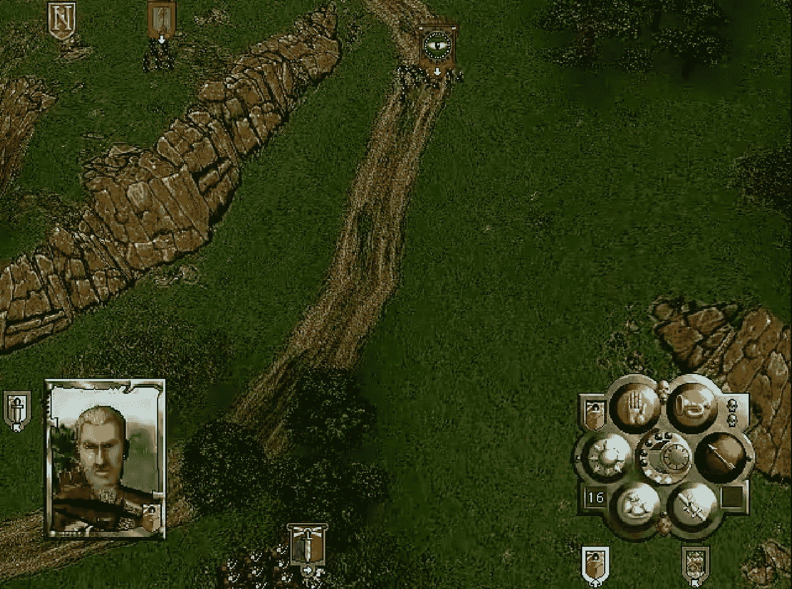

**《战锤：黑暗预兆》**的截图，这是最早使用士兵情感模型的游戏之一

和

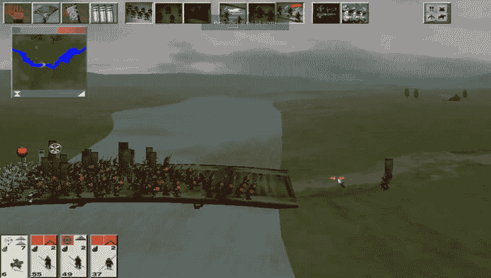

**《全面战争：幕府将军》**的截图。士兵的情感模型比《战锤：黑暗预兆》中的更复杂，但仍然成功地用于许多士兵

一些游戏甚至将 AI 作为游戏的核心。尽管最早这样做的一款游戏是**《Creatures》**[*Cyberlife Technology Ltd.*, 1997]，但这一概念在**《模拟人生》**[*Maxis Software, Inc.*, 2000]或**《黑与白》**[*Lionhead Studios Ltd.*, 2001]等游戏中更为明显：


**《模拟人生》**的截图。一个模拟者（角色）正在烹饪，这是游戏中由 AI 驱动的复杂行为的一部分。

在过去的 20 年里，许多 AI 技术已被采用和/或开发。然而，如果游戏不需要高级 AI，你可能会发现仍然广泛使用的有限状态机（FSMs），以及我们将很快在第二章中探讨的**行为树**，**黑板**。

# 游戏中的 AI – 行业与学术界

当涉及到比较应用于视频游戏的 AI，无论是在学术界还是在工业界，都存在很大的差异。我可以说，两者之间几乎有一场斗争。让我们看看背后的原因。事实上，它们的目标非常不同。

学术界希望**创建能够智能思考并在环境中行动以及与玩家互动的游戏 AI 代理**。

另一方面，游戏行业希望**创建看起来能够智能思考并在环境中行动以及与玩家互动的游戏 AI 代理**。

我们可以清楚地注意到，前者导致**更真实的 AI**，而后者导致**更可信的 AI**。当然，商业游戏更担心后者而不是前者。

我们将在第十四章中更详细地探讨这个概念，**超越**，当我们讨论创建游戏 AI 系统所涉及的心理学和游戏设计时。实际上，为了实现可信的行为，你通常需要尝试并使其尽可能真实。

然而，在更正式的术语中，我们可以这样说，游戏 AI 属于**弱 AI**（与**强 AI**相对）的范畴，它专注于以**智能**的方式解决特定任务或问题，而不是在其背后发展意识。无论如何，我们不会进一步探讨这个问题。

# 规划我们的旅程

现在是时候开始规划我们的旅程了，在跳入下一章之前。

# 技术术语

由于对于一些人来说，这是他们第一次进入 AI 领域，因此了解这本书（以及在 AI 中通常使用的）中使用的术语的小型词汇表很重要。我们在过去几页中已经遇到了其中的一些：

+   **代理**是能够自主推理以解决特定目标集的系统。

+   **反向链式推理**是通过向后工作来追踪问题原因的过程。

+   **黑板**是不同代理之间交换数据以及有时甚至在代理本身内部（特别是在虚幻引擎中）交换数据的架构。

+   **环境**是代理生活的世界。例如，游戏世界是同一游戏中 NPC 的环境。另一个例子是棋盘，它代表了一个与人类（或其他系统）下棋的系统的环境。

+   **正向链式推理**，与**反向链式推理**相反，是通过向前工作来找到问题解决方案的过程。

+   **启发式**是一种解决问题的实用方法，它不保证是最优的，也不足以满足即时目标。当寻找问题的最优解不切实际（甚至不可能）时，使用启发式方法来找到令人满意的解决方案。它们可以被视为在决策过程中减轻认知负担的心理捷径。有时，它可以代表基于代理过去经验的认知（尽管这通常是在先验的基础上给出的）。术语"*启发式*"源自古希腊，其意义为"*找到*"或"*发现*"。

对于更广泛的词汇表，你可以查看维基百科上的一个。以下是链接：[`en.wikipedia.org/wiki/Glossary_of_artificial_intelligence`](https://en.wikipedia.org/wiki/Glossary_of_artificial_intelligence)。

# 自下而上的方法

通常，当一个系统被构建或研究时，有两种主要的方法：自上而下和自下而上。前者从系统的较高层次结构开始，逐渐进入系统的颗粒度细节。后者从基础开始，逐步创建依赖于前者的更复杂结构。两种方法都是有效的，但出于个人偏好，我选择了自下而上的方法来介绍本书的主题。

事实上，我们将从代理如何移动开始，然后理解它如何感知，最后使用这些数据来做出信息化的决策，甚至制定一个计划。这一点反映在这本书的结构和各部分中。

# 代理模式

由于在这本书中，我们将探讨人工智能代理如何感知、移动、规划和与周围环境交互的不同部分，因此绘制一个为此目的的方案将是有用的。当然，可能会有许多其他方案，它们都是同样有效的，但我相信这个方案对于开始*AI 游戏开发*特别有用：

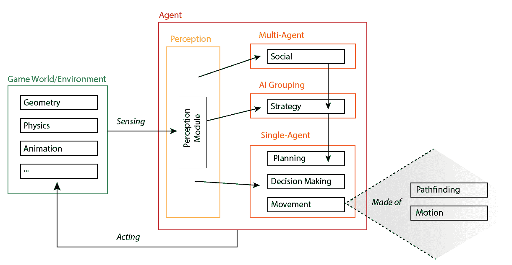

本书将要使用的代理模型

由于我们选择了自下而上的方法，我们应该从底部读取模式。我们将更正式地称这个为我们的*代理模型*。

首先，我们可以看到代理总是与游戏世界交换信息，这包括几何、物理和动画，以及它们的抽象。这些信息被用于我们代理模型的所有层级。

从底层来看，我们首先关注的是如何在环境中移动。这是一个可以分解为运动和路径查找的过程（第三章*，导航*）。沿着链向上，我们可以看到代理感知世界（第四章，*环境查询系统*和第五章，代理意识*），并且基于这种感知，代理可以做出决策（第二章，*行为树和黑板*）。有时，在那一刻做出最佳决策可能不会在长期内带来更好的结果，因此代理应该能够提前规划。通常，在视频游戏中，一个 AI 系统（不一定是 NPC）可以控制多个角色，因此它应该能够协调一组角色。最后，代理可能需要与其他代理协作。当然，我们无法在这本书中深入探讨每个主题，但你可以自由地在网上查看，以便更深入地了解某些主题。

最后一点：通常，游戏中的 AI 不会一次性使用所有这些层级；有些只实现其中之一，或者混合使用。然而，在开始操作之前，了解事物的结构是很重要的。

# 虚幻引擎 AI 框架

尽管其他游戏引擎只提供渲染能力，但虚幻引擎自带了许多实现（并通过插件扩展）。这并不意味着制作游戏更容易，而是我们拥有更多开发游戏所需的工具。

实际上，虚幻引擎也实现了许多人工智能工具。当我们探索它们时，我们可以创建一个这些工具及其相互关联的架构。因此，让我们先了解一下我们将要在哪个层面上操作。这意味着要深入了解**虚幻游戏框架**（你可以在以下链接中找到更多关于此的信息：[`docs.unrealengine.com/en-us/Gameplay/Framework`](https://docs.unrealengine.com/en-us/Gameplay/Framework))。

存在一个控制器类，它可以分为两个子类。第一个是玩家控制器；正如其名所示，它为游戏和玩家之间提供了一个接口（当然，这本书中并未涵盖，因为我们将会关注 AI 而不是通用的游戏玩法）。第二个类是 AIController，它提供的是我们的 AI 算法和游戏本身之间的接口。

以下图表展示了这些工具以及它们如何相互作用：

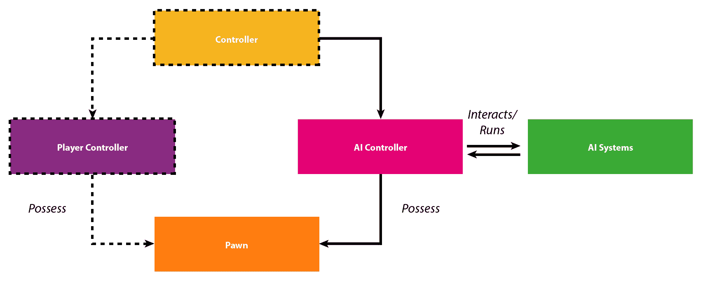

这两种控制器都可以拥有一个 Pawn，这可以被认为是一个虚拟化身。对于玩家来说，这可能就是主要角色；对于 AIController 来说，Pawn 可以是被玩家想要击败的敌人。

在这本书中，我们将只关注 AIController，以及所有围绕和在其下为我们的 AI 带来生命力的工具（我们不会涵盖前图中省略的部分）。我们将在稍后的阶段理解我的意思，但关键概念是我们将操作在***AIController***的层面。

如果你已经对 C++和 Unreal 有些熟悉，你可以查看其类，该类定义在***AIController.h***文件中，以了解更多关于这个控制器的信息。

# 我们旅程的草图

既然我们已经对将要使用的架构有了大致的了解，让我们按我们将要面对的主题的顺序（我说的是大致的顺序，因为有些主题会跨越多个章节，并且在我们对 AI 的了解扩展后需要迭代）来分解这本书将要涵盖的内容。

然而，你可以将这本书视为分为三个部分：

+   *第 2-7 章*：对不同内置 AI 系统的描述

+   *第 8-10 章*：如何使用我们在前几章中探索的 AI 系统的具体示例

+   *第 11-13 章*：对游戏 AI 的不同调试方法的描述（因为我相信这部分与了解系统本身同等重要）

让我们详细谈谈这本书将要涵盖的内容。

# 使用行为树进行决策（第 2、6、8、9 和 10 章）

一旦智能体能够感知其周围的世界，它就需要开始做出决策，这些决策会有后果。某些决策过程可能会变得非常复杂，以至于智能体需要制定一个适当的计划才能成功实现目标。

内置的 Unreal Engine 框架围绕行为树旋转，这占据了本书的大部分内容。当然，这并不排除你在 Unreal 中自行实现其他 AI 系统进行决策的可能性，但通过选择行为树，你将拥有一套强大的工具集，我们将在本书中详细探讨。

# 导航（第 3 和 7 章）

除非游戏是离散的或回合制的，否则每个 AI 智能体都需要以连续的方式在其自己的环境中移动。Unreal 提供了一个强大的导航系统，允许你的 AI 智能体在环境中轻松导航，从坠落到跳跃，从蹲伏到游泳，到不同类型的区域和不同类型的智能体。

这个系统如此庞大，要全部涵盖它将很困难，但我们将尽力涵盖你开始学习第三章，“导航”所需的所有内容。

# 环境查询系统（第 4 和 12 章）

*环境查询系统 (ESQ)* 可以从代理周围的环境中收集信息，从而允许代理据此做出决策。本书专门用一章来介绍这个系统。实际上，它位于第五章，*代理意识*和*决策制定*之间，并且是已经内置到 Unreal 中的宝贵资源。

# 代理意识（第五章和第十二章）

*代理意识*（或*感知*）涉及赋予 AI 代理感官的能力。特别是，我们将涵盖视觉，这是最常见和最广泛使用的，但也会涉及听觉和嗅觉。

此外，我们将开始探讨这些数据如何被用于高级结构中，以便代理可以相应地行动。

# 人群（第七章）

当你在地图中拥有许多 AI 代理时，环境会变得容易过于拥挤，各种代理可能会相互干扰。人群系统允许你控制大量 AI 代理（同时它们可以保持个体行为），以便它们可以避免彼此。

# 设计行为树（第 8、9 和 10 章）

对于 AI 开发者来说，仅仅了解行为树的工作原理是不够的：他们需要知道如何设计它们。实际上，你的大部分工作都是关于创建一个抽象系统来协调所有 AI 代理，然后你才会花剩下的时间来实现它。因此，我们将涵盖一个单一且庞大的示例，展示如何从头开始设计、创建单个部分，并构建一个完整的 *行为树*。

# 游戏 AI 的调试方法（第 11、12 和 13 章）

一旦你了解了所有不同的 AI 系统，你就可以开始对这些系统进行实验或编写游戏，但如何理解你的 AI 是否按照你的计划执行并且/或者表现良好？调试方法在任何软件中都是关键，但在游戏 AI 中，你还需要视觉调试。因此，Unreal Engine 提供了许多调试方法（包括一些专门针对 AI 的方法），我坚信了解这些方法非常重要。你不仅会学习工具，还会学习如何根据你的需求扩展它们。

# 超越（第十四章）

本书最后一部分将探讨一些目前在 AI 领域正在进行的激动人心的想法和创新，并为你继续美妙旅程提供灵感。我将介绍一些正在进行的 AI 研究，这些研究被应用于游戏，以及这最终如何对你的游戏产生益处。在这个领域，了解新技术和算法是关键，这样你才能始终保持最新。

# 为 C++用户启用 AI

如果您作为 C++ 用户阅读此书，当您在项目（或项目的特定模块或插件）中编写 C++ 代码时，您需要确保添加正确的依赖项，以便您能够访问 AI 系统，否则您将遇到编译错误。我们将在下一章中更详细地探讨这一点，当时我们将创建一个项目来插入本书中我们将产生的所有代码。然而，以下是插入/修改 `.cs` 项目文件的代码行（粗体部分是 AI 运作所必需的）：

```py
PublicDependencyModuleNames.AddRange(new string[] { "Core", "CoreUObject", "Engine", "InputCore", "HeadMountedDisplay", *"GameplayTasks", "AIModule"* });
```

# 摘要

在本章中，我们看到了视频游戏中的 AI 世界是多么奇妙。我们探索了视频游戏背后的历史，无论是在学术界还是在工业界。我们在本书中规划了我们的旅程，并解释了它将是什么样子。

现在，是我们准备的时候了，因为从下一章开始，我们将深入实践，直接进入 Unreal Engine。
