# 第二章：行为树和黑板

**一个决定我们如何行动的树，一个黑板来记住它！**

欢迎来到**第二章**Chapter 2，*行为树和黑板*。从这里开始，事情开始变得更有趣，因为我们将会学习如何使用两个主要的虚幻 AI 框架结构。首先，我们将查看**行为树**并了解它们的主要组件，如任务、装饰器和服务。接下来，我们将学习关于**黑板**的内容以及如何将其与**行为树**集成。在完成这些之后，我们将能够设置使用**行为树**的 AI 控制器，这对于实现本书中其余的技术至关重要。

如你所注意到的，我们首先学习一点理论，然后直接进入实践来理解它是如何运作的。这是我们将在每一章中遵循的模式。所以，让我们开始吧。

在决策领域，有许多可以使用的数学结构。**有限状态机**（FSM）是一个简单而强大的例子，它能够做出复杂的决策。然而，在游戏人工智能的世界中，还有一个结构可以被非 AI 专家使用：**行为树**。

因此，虚幻引擎的设计选择之一是它内置了对行为树的支持，并且实际上是 AI 框架的主要核心部分。这并不意味着你不能实现其他决策过程或结构，但使用内置的行为树支持将大大有利于你团队的预算（从时间角度考虑）。所以，在你实现在虚幻引擎中的不同决策结构之前，请三思是否这是一个好的决定（当然，行为树可能不是你游戏的最佳选择，但请记住它们有内置支持，可能是一个节省时间的好方法）。然而，你仍然可以在行为树中实现子结构来扩展其功能，但不要急于求成；首先，让我们来了解一下行为树的基础知识。

特别是，在本章中，我们将学习以下主题：

+   **行为树**是什么，从更广泛的角度和虚幻引擎的上下文中来看。

+   在虚幻引擎中，**行为树**是如何工作的，包括其不同的组件以及它们如何与树交互

+   什么是**黑板**以及它如何用于存储行为树的数据

+   如何通过使用 AI 控制器**启动运行行为树**，无论是在蓝图还是 C++中

那么，让我们深入探讨！

# 行为树是如何工作的

考虑到行为树在我们 AI 代理中的作用，最简单的方法是将其想象成一个大脑。它做出决定，并相应地采取行动。它是我们代理中人工智能的处理器。在我们开始之前，如果你在其他环境中对行为树有任何经验，重要的是要理解它们在虚幻引擎中的不同。

如果你想了解更多关于它们如何不同的信息，你可以通过访问以下链接来了解：[`docs.unrealengine.com/en-US/Engine/AI/BehaviorTrees/HowUE4BehaviorTreesDiffer`](https://docs.unrealengine.com/en-US/Engine/AI/BehaviorTrees/HowUE4BehaviorTreesDiffer)。

然而，在这里强调一个关键的区别是很重要的：***虚幻引擎的行为树***是从上到下读取的，节点将从左到右执行。在其他环境中，你可能发现顺序相反，即树是从左到右读取的，节点是从上到下执行的。

如果这是你第一次遇到行为树，那么当你阅读下一节时，这将会变得有意义。

# 数学树的结构

好的，现在是时候了解一个***行为树***是如何工作的了。首先，正如其名所示，它是一个树，从数学的角度来说。

如果你想要了解更多关于图论中树的信息，你可以查阅以下维基百科页面：[`zh.wikipedia.org/wiki/树 _(图论)`](https://zh.wikipedia.org/wiki/树 _(图论))。或者，如果你想了解得更深入，你可以查阅以下页面：[`mathworld.wolfram.com/Tree.html`](http://mathworld.wolfram.com/Tree.html)。然而，两个链接中找到的定义都非常数学化，你不需要它们来理解行为树。

需要明确的是，一个（数学）树表达了节点之间的关系。在这个意义上，描述家庭（例如，父母、子女、兄弟姐妹）的技术术语中采用了相同的关系。为了简化对树的了解，你可以想象你的家谱树：每个节点是一个人，连接人们的分支（即关系）是各种人之间的关系。然而，结构还是略有不同。

那么，什么是树？它是一个描述不同节点之间关系的图。

特别是，有一个***根***节点，它是*唯一没有父节点的节点*。从那里，*每个节点可以有一个或多个子节点*，*但只有一个父节点*。没有子节点的终端节点被称为***叶子节点*。以下是一个简单的图表，帮助你理解一般*数学树*的基本结构：

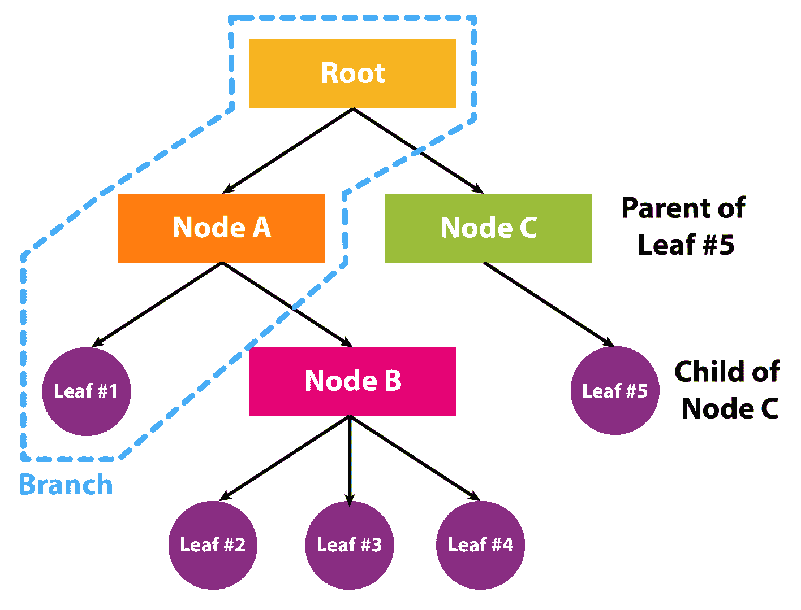

这可能听起来很复杂，但实际上并不复杂。当我们继续前进并讨论行为树时，事情将会变得有趣起来。

# 行为树组件

如果你查看官方文档，你会发现有五种类型的节点（**任务**、**装饰器**、**服务**、**组合**和**根**）可供使用，具体取决于你试图创建的行为类型（以及随后 AI 在世界上应该如何行动）。然而，我想以更易于理解的方式重新表述这一点，并希望它更实用。

除了**根**节点之外，唯一的一种不是叶子的节点是**组合**节点。叶子被称为**任务**。**装饰器**和**服务**是**组合**节点或**任务**叶子的附加功能。尽管虚幻引擎允许你将**组合**节点作为叶子使用，但你不应该这样做，因为这意味着你可以移除该节点，而行为树仍然会以相同的方式工作。以下是一个显示所有不同类型节点的树形结构的示例（实际上，我们将在本书的后面部分构建这个**行为树**）：

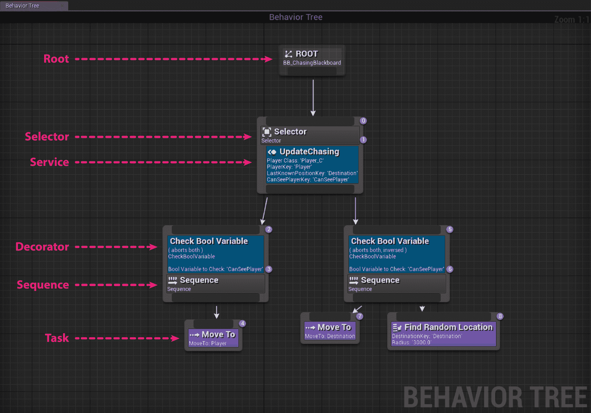

当树在执行时，你需要从根节点开始，沿着树向下，从左到右读取节点。你以特定的方式遍历所有不同的分支（**组合**节点），直到我们达到一个叶子，即**任务**。在这种情况下，AI 将执行那个**任务**。重要的是要注意，**任务**可能会失败，例如，如果 AI 无法完成它。*任务*可能会失败的事实将有助于理解组合节点的工作原理。毕竟，决策过程只是选择执行哪个任务以更好地实现目标（例如，杀死玩家）。因此，根据哪个任务未能执行（或者，正如我们将看到的，装饰器可以使任务或整个分支失败），组合节点将确定树中的下一个任务。

此外，当你创建你的**行为树**时，每个节点都可以被选中，你可以在**详细面板**中找到一些调整节点/叶子的行为设置的选项。此外，由于顺序很重要，行为树中的节点有数字（在右上角）来帮助你理解节点的顺序（尽管它始终是从上到下，从左到右）。以下截图显示了你可以找到这些数字的位置：

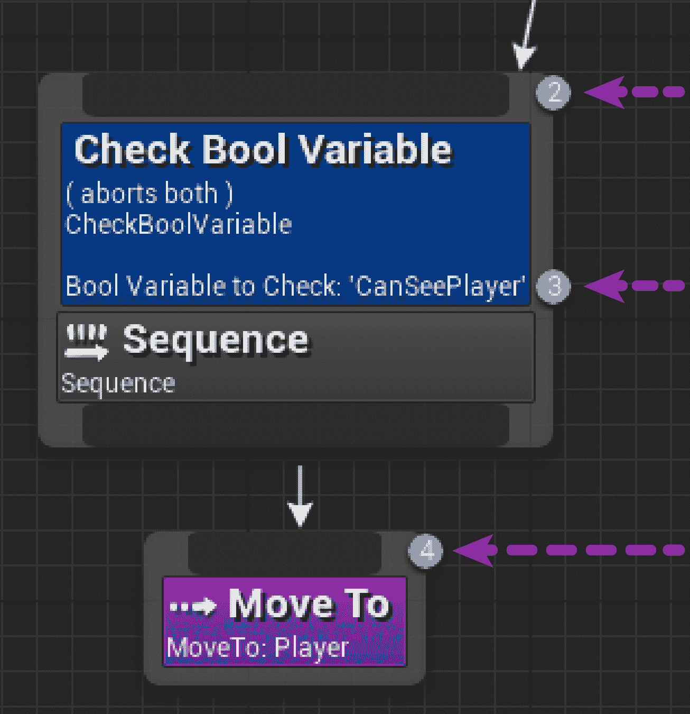

“*-1*”的值意味着节点将不会以任何顺序执行，节点周围的色彩会略暗。这可能是由于节点以某种方式未连接到根，因此它是孤立的：

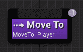

让我们详细看看这些组件，并特别注意**组合**节点。

# 根

对于**根**节点，没有太多可说的。树需要从某个地方开始，所以根节点就是树开始执行的地方。下面是这个节点的样子：

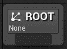

请注意，***根节点***只能有一个子节点，并且这个子节点必须是***组合节点***。您不能将任何***装饰器***或***服务***附加到***根节点***。如果您选择***根节点***，它没有任何属性，但您将能够分配一个***黑板***（我们将在本章后面介绍），如下面的屏幕截图所示：

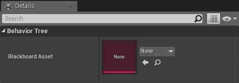

# 任务

当我们想到一棵树时，我们通常会想象一个粗大的树干和树枝，树枝上长着叶子。在 UE4 的上下文中，那些“***叶子***”就是我们所说的“***任务***”。这些是执行各种动作的节点，例如移动 AI，并且可以附加***装饰器***或***服务***节点。然而，它们没有输出，这意味着它们本身不参与决策过程，这个决策完全由组合节点负责。相反，它们定义了如果该任务需要执行，AI 应该做什么。

请注意，***任务***可以像您喜欢的那样复杂。它们可以像等待一段时间那样简单，也可以像在射击玩家的同时解决谜题那样复杂。大任务难以调试和维护，而小任务可能会使***行为树***变得过于拥挤和庞大。作为一名优秀的 AI 设计师，您应该尝试在任务的大小之间找到平衡，并以一种方式编写它们，以便它们可以在树的各个部分（甚至在其他树中）重复使用。

一个*任务*可以***失败***（报告***失败***）或***成功***（报告***成功***），并且它不会停止执行直到报告这两个结果之一。***组合节点***负责处理这个结果并决定下一步要做什么。因此，一个任务可能需要几个帧来执行，但它只有在报告了***失败***或***成功***时才会结束。当您继续到第六章，*扩展行为树*时，请记住这一点，在那里您将创建自己的任务。

*任务*可以有参数（一旦选择了一个*任务*，您就可以在*详细信息面板*中设置这些参数），通常它们是硬编码的值或***黑板键引用***（关于***黑板***的更多内容将在本章后面介绍）。

在行为树编辑器中，任务以紫色框的形式出现。在下面的屏幕截图中，您可以查看一些任务的示例以及它们在编辑器中的外观：

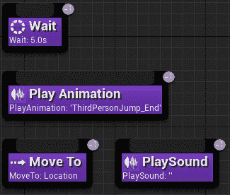

Unreal 自带一些内置的任务，可以直接使用。它们是通用的，涵盖了您可能需要的最基本的情况。显然，它们不能针对您的游戏特定，因此您需要创建自己的*任务*（我们将在第六章，*扩展行为树*)中查看这一点）。

这里是 Unreal 内置任务的列表：

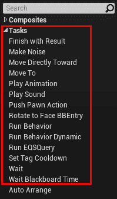

+   ***完成并返回结果***：强制任务立即返回一个*完成结果*（无论是*失败*还是*成功*）。

+   ***制造噪音***：产生一个噪音刺激，由*感知系统*（这将在第五章，*代理意识*）使用。

+   ***直接朝向移动***：与下面的节点类似，但它忽略了*导航系统*。

+   ***移动到***：使用*导航系统*（我们将在第三章，*导航*）将 Pawn 移动到从*黑板*中指定的位置（我们将在本章后面介绍*黑板*）。

+   ***播放动画***：正如其名所示，此节点播放动画。然而，除了例外情况（这也是此节点存在的原因）之外，将动画逻辑和行为逻辑分开是良好的实践。因此，尽量不使用此节点，而是改进你的动画蓝图。

+   ***播放声音***：正如其名所示，此节点播放声音。

+   ***推送 Pawn 动作***：执行一个*Pawn 动作*（不幸的是，我们不会在本章中介绍它们）。

+   ***旋转以面对 BB 条目***：将 AI Pawn 旋转以面对在 Blackboard 中记住的特定键（我们将在本章后面介绍*黑板*）。

+   ***运行行为***：作为一个整体子树运行另一个*行为树*。因此，可以嵌套*行为树*以创建和组合非常复杂的行为。

+   ***运行行为动态***：与前面的节点类似，但在运行时可以更改要执行的(*子*)*行为树*。

+   ***运行 EQS 查询***：执行一个*EQS 查询*（我们将在第四章中看到它们，环境查询系统）并将结果存储在*黑板*中。

+   ***设置标签冷却时间***：通过使用标签为特定的*冷却时间*节点设置计时器（我们将在本章后面介绍装饰器）。

+   ***等待***：停止行为一段时间。可以指定一个随机偏差，使等待的时间每次都不同。

+   ***黑板时间等待***：与上一个节点类似，但时间是从*黑板*中获取的（关于*黑板*的更多内容将在本章后面介绍）。

现在我们已经了解了*任务*节点的工作方式，让我们来探索*组合*节点，这些节点根据*任务*返回的是失败还是成功来做出决策。

# **组合**

组合节点是 Unreal 中*行为树*决策能力核心，理解它们的工作方式是关键。

有三种组合节点：*选择器*、*序列*和*简单并行*。最后一种最近被添加，你会发现通过使用*选择器*和*序列*的组合，你将能够覆盖大多数情况。以下是它们的工作方式：

**选择器**：这种节点会尝试找到其子节点中的一个来执行，这意味着它会尝试找到一个分支（因此作为子节点附加的另一个**复合**节点）或一个**任务**（另一个子节点，但它是一个叶子）。因此，**选择器**从最左边的子节点开始尝试执行它。如果它失败了（无论是**任务**未能执行，还是整个分支失败了），那么它将尝试第二个最左边的，依此类推。如果一个子节点返回**成功**，这意味着任务已经完成或整个分支已经完成，那么**选择器**将向其父节点报告**成功**，并停止执行其他子节点。另一方面，如果**选择器**的所有子节点都报告**失败**，那么**选择器**也将向其父节点报告**失败**。在下面的屏幕截图中，你可以看到**选择器**节点的外观：

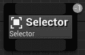

**序列**：这种节点的工作方式有点像**选择器**的反面。为了向其父节点报告成功，序列的所有子节点都必须报告成功。这意味着序列将开始执行最左边的子节点。如果它成功了，它将继续执行第二个最左边的，依此类推，如果也成功了。如果所有子节点直到最右边的都是成功，那么**序列**将向其父节点报告一个**成功**。否则，如果只有一个子节点失败，那么**序列**将停止执行其子节点，并向父节点报告一个**失败**。在下面的屏幕截图中，你可以看到**序列**节点的外观：


**简单并行**：这是一种特定的**复合**节点，用于特定情况。实际上，它只能有两个子节点。最左边的子节点必须是一个**任务**，而最右边的子节点可以是**任务**或**复合**（从而产生一个子树）。**简单并行**开始并行执行其所有子节点，尽管最左边的一个被认为是主要的。如果主要的一个失败了，它将报告一个失败，但如果主要的一个成功了，那么它将报告一个成功。根据其设置，简单并行一旦完成了主要任务的执行，可以选择等待子树执行结束，或者直接向父节点报告主要任务的成功或失败，并停止执行子树。在下面的屏幕截图中，你可以看到**简单并行**节点的外观。请注意，只能拖动两个子节点，其中最左边的一个必须是一个**任务**（紫色块是可拖动区域）：

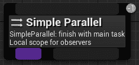

以这种方式，*复合* 节点可以根据其子节点报告的内容（失败或成功）来“决定”执行哪些任务，并且 *复合* 节点会向其父节点报告（要么失败要么成功）。即使根节点（也是一个 *复合* 节点）的唯一子节点向 ***根节点*** 报告成功，那么整个树已经成功执行。一个好的 ***行为树*** 设计应该始终允许成功。

# 装饰器

***装饰器*** 节点（也称为条件）附加到 *复合* 或 *任务* 节点上。***装饰器*** 节点决定 *行为树* 中的某个分支，甚至单个节点是否可以执行。本质上，它们是一个条件；它们检查是否应该发生某事。换句话说，一个 ***装饰器*** 可以检查是否值得继续该分支，并且如果根据条件我们确定 *任务*（或子树）将失败，它可以报告一个预防性的 *失败*。这将避免装饰器尝试执行一个不可能的任务（或子树）（由于任何原因：信息不足，目标不再相关等...）。

通常，装饰器节点可以充当父节点和其余子树之间的 ***门***。因此，装饰器有权力循环子树直到满足某个条件，或者直到特定计时器到期才在子树中执行，甚至可以改变 *子树* 的返回结果。

例如，想象有一个专门用于杀死玩家的子树（它将做出决策，使代理尝试杀死玩家）。检查玩家是否在范围内（并且不是来自地图的另一侧），或者甚至玩家是否仍然存活，可能会在没有执行该子树的情况下给我们一个预防性的失败。因此，树可以继续执行其他事件或树的其余部分，例如，在另一个子树中，该子树将负责游荡行为。

*装饰器* 可以有参数（一旦选择了一个 *装饰器*，你将在 *详情面板* 中能够设置这些参数），通常它们是硬编码的值或 *黑板键引用*（关于 *黑板* 的更多内容将在本章后面介绍）。

几乎每个 *装饰器* 都有一个复选框在其参数中，允许你反转条件（因此，你将拥有更多的自由，并且可以在树的两个不同部分使用相同的装饰器来执行不同的条件）。

以下截图展示了如何将装饰器附加到 *复合* 节点上。请注意，每个节点可以有多个装饰器：

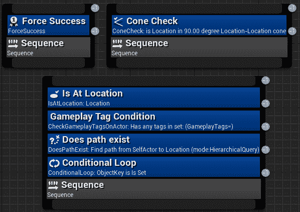

对于熟悉其他行为树系统中条件节点的用户来说，重要的是不要将它们与 Unreal Engine 中的任务叶节点混淆。更多信息可以在[`docs.unrealengine.com/en-us/Engine/AI/BehaviorTrees/HowUE4BehaviorTreesDiffer`](https://docs.unrealengine.com/en-us/Engine/AI/BehaviorTrees/HowUE4BehaviorTreesDiffer)找到。

与任务类似，Unreal 自带一些内置的装饰器，它们可以立即使用。它们是通用的，涵盖了你可能需要的最基本的情况，但显然，它们不能针对你的游戏或应用程序进行特定化，因此你需要创建自己的*装饰器*（我们将在第六章扩展行为树中详细讨论）。

这里是 Unreal 内置任务列表：

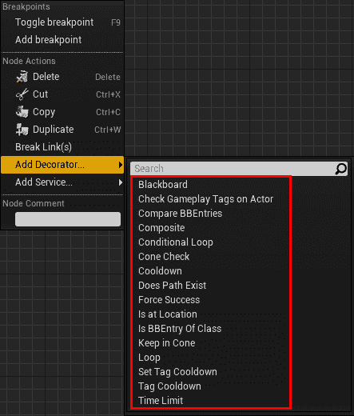

+   ***黑板***：检查*黑板*上的特定键是否*设置*（或*未设置*）。

+   ***检查演员游戏标签***：正如其名所示，它检查是否有由黑板值指定的特定游戏标签（或多个标签）在指定的演员上。

+   ***比较 BB 条目***：比较两个黑板值，并检查它们是否相等（或不相等）。

+   ***组合***：这允许你使用布尔逻辑一次性组合不同的*装饰器*。一旦放置了此*装饰器*，你可以通过双击它来打开其编辑器。从那里，你将能够使用布尔运算符和其他*装饰器*构建一个图。

+   ***条件循环***：只要条件得到满足（无论*黑板键*是否*设置*或*未设置*），它将不断循环通过子树。

+   ***锥形检查***：这检查一个点（通常另一个演员）是否在从另一个点（通常为 AI 代理）开始的锥形内；锥形角度和方向可以更改。其使用的一个例子是，如果你想检查玩家是否在敌人前方——你可以使用此代码来确定此条件。

+   ***冷却时间***：一旦执行从包含此*装饰器*的分支退出，将启动*冷却计时器*，并且此*装饰器*不允许执行在此计时器过期之前再次进入（它立即报告*失败*）。此节点用于确保你不频繁地重复相同的子树。

+   ***路径是否存在***：这使用导航系统（关于这一点，请参阅第三章导航）来确定（并检查）是否存在特定点的路径。

+   ***强制成功***：正如其名所示，它强制子树成功，无论是否从下面报告了*失败*（或*成功*）。这对于在序列中创建可选分支非常有用。

注意，强制失败不存在，因为这没有意义。如果将其放置在选择上，这将使其成为一个序列，如果将其放置在序列上，它将只执行一个子节点。

+   ***位于位置***：正如其名所示，它检查 Pawn 是否（靠近或）位于特定位置（可选地，使用*导航系统*）。

+   ***是类的 BB 条目***：正如其名所示，它检查特定的黑板条目是否属于特定的类。当黑板条目是 Object 类型，并且需要检查黑板内的引用是否属于特定类（或继承自一个类）时，这很有用。

+   ***保持圆锥内***：与*圆锥检查*类似，这个*装饰器*（持续地）检查*观察者*是否在*圆锥*内。

+   ***循环***：正如其名所示，它会在特定子树中循环特定次数（甚至无限次数；在这种情况下，需要其他东西来停止子树的行为，例如另一个*装饰器*）。

+   ***设置标签冷却时间***：与同名的*任务*类似，当这个*装饰器*变得相关（或者如果你将其想象为一个门，当它被穿越时），它将改变特定*标签*的*冷却时间计时器*（参见以下节点）。

+   ***标签冷却时间***：这与*冷却时间*节点相同，但它与一个*标签*相关联的计时器。因此，这个计时器可以通过"*设置标签冷却时间*" *任务*和"*设置标签冷却时间*" *装饰器*来改变。

+   ***时间限制***：正如其名所示，它为子树完成其执行提供时间限制。否则，这个装饰器将停止执行并返回*失败*。

现在我们已经了解了*装饰器*节点的工作方式，让我们探索行为树中的最后一种节点类型，*服务*节点，这些节点将连续更新并提供实时信息。

# 服务

***服务***节点连接到*组合*或*任务*节点，并且如果它们的分支正在执行，它们将执行。这意味着只要节点下方有节点连接，无论父-子级别有多少层正在执行——服务也会运行。以下截图将帮助您可视化这一点：

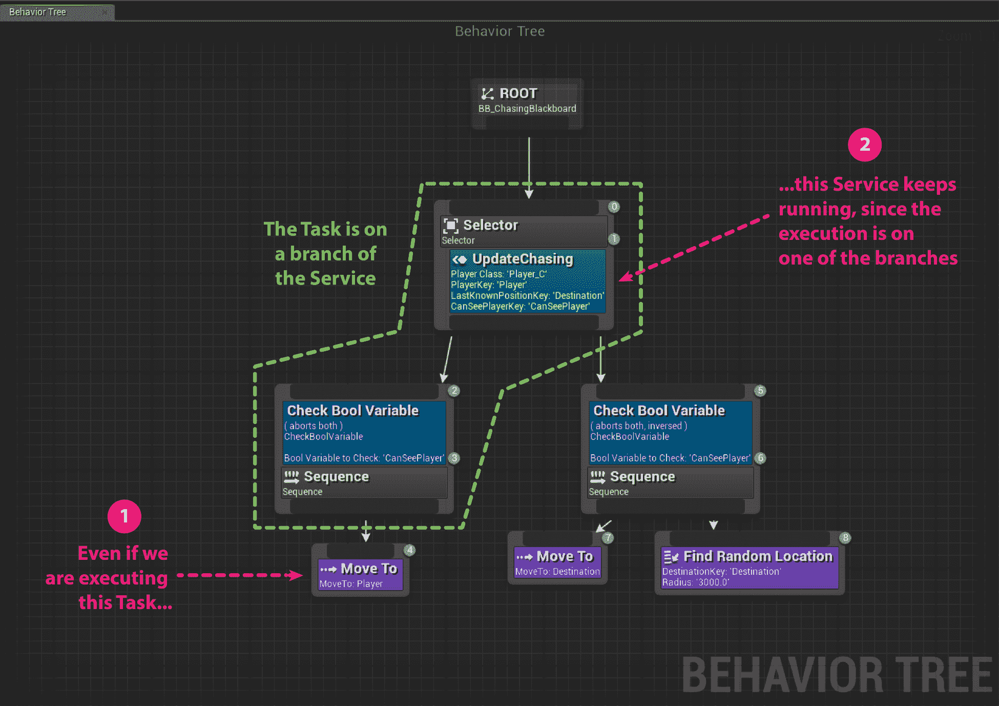

这意味着服务节点是行为树执行的眼睛。实际上，它们会持续运行（如果子树是活跃的），并且可以实时执行检查和/或更新*黑板*（稍后介绍）的值。

***服务节点*** 确实是为你的 *行为树* 应用程序量身定制的，因此只有两个默认节点。它们的一个用法示例可能是向子树提供/更新信息。例如，想象一个场景，子树（敌人）试图杀死玩家。然而，即使玩家没有向敌人射击，追求这个目标也是愚蠢的（好吧，这取决于敌人的类型，巨魔可能并不那么聪明）。因此，当子树试图杀死玩家时，子树需要找到掩护来减少敌人受到的伤害。然而，敌人可能在地图上移动，或者玩家可能摧毁了我们 AI 藏身的掩护。因此，子树需要有关最近且最安全的掩护位置的信息，这个位置仍在玩家的射程内（一个 *EQS 查询* 可以计算出这个信息）。服务可以实时更新这些信息，以便当子树需要使用有关掩护的数据时，它们已经准备好了。在这个特定的例子中，为了找到掩护，在服务上运行 *环境查询* 是处理这个任务的动态方式（我们将在 第四章，*环境查询系统*）中探讨这个话题）。否则，*服务* 可能会检查地图上设计师放置的某些指定点，并评估哪个最适合其给定的动作。

如你所见，***服务节点*** 可以非常强大，但它们也特定于你使用它们的应用程序。因此，它们确实取决于你为你的游戏编写的 AI。

下面的屏幕截图显示了几个服务示例。请注意，*服务* 可以与 *装饰器* 一起使用，并且一个 *组合节点* 可以有多个 ***服务***：

*服务节点* 替换了其他 *行为树系统* 中的传统 *并行节点*。

可用的两个默认 *服务*（因为你将需要为你的游戏编写自己的服务，我们将在 第六章*，扩展行为树*）在下面的屏幕截图中显示：

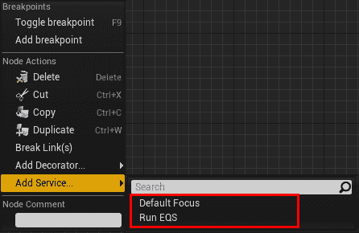

+   ***设置默认焦点***：当这个节点变为活动状态时，它会自动为 *AI 控制器* 设置 *默认焦点*。

+   ***运行 EQS*** *(定期查询)*：正如其名所示，它定期运行 *环境查询*（有关更多信息，请参阅 第四章，*环境查询系统*），以检查特定的位置或演员。这是我们例子中寻找掩护所需的这种服务。

你将在第四章“环境查询系统”中了解更多关于*环境查询*的内容。然而，目前你需要知道的是，这是一个用于空间推理的系统，运行这些查询可以在空间中找到具有特定属性的位置（或演员）（在寻找掩护敌人的例子中，最大化这些属性的那个：最近的、最安全的，并且仍然在射程内可以射击玩家）。

现在，我们已经了解了组成**行为树**的不同类型的节点。现在，是时候探索黑板了！

# 黑板及其与行为树集成

将**行为树**视为大脑，我们可以将**黑板**视为其记忆——更具体地说，是 AI 的记忆。**黑板**存储（并设置）用于**行为树**使用的键值。

它们被称为黑板，因为在教室里，黑板是一个传递大量信息的地方，但其中大部分信息是学生之间共享的；分发给学生的单独笔记是私人的。你可以将学生想象为不同的任务（和节点），而**黑板**则是一个共享的数据空间。

**黑板**相对简单易懂，因为它们只比数据结构复杂一点。唯一的区别在于可以将一个**黑板**分配给特定的**行为树**，这个黑板被树中的每个节点共享。因此，每个节点都可以读取和/或写回**黑板**。

对于那些熟悉**黑板设计模式**的人来说，在虚幻引擎中，它们只是承担了为**行为树**保存记忆的角色。

它的工作方式就像一个*字典*（数据结构），其中键对应一个特定的值类型（例如，一个向量、一个浮点数、一个演员等……，甚至是另一个**黑板键**）。因此，通过使用或回忆键，可以写入或读取相关的值。

**黑板**的另一个酷炫特性是它们可以通过继承来扩展。这意味着另一个**黑板**可以作为一个父类，子类将继承所有父类的键值对，再加上子类本身包含的一些特定键值对。

现在我们已经涵盖了理论部分，让我们看看如何创建一个**行为树**并让它运行。要做到这一点，让我们先创建一个新的项目。

# 创建我们的 AI 项目

从现在起，我们将通过创建项目来实践，并了解我们关于***行为树***所学的知识。在本节中，我们将创建一个简单的树，但随着我们在下一章学习更多其他主题，我们将迭代***行为树***的工具。这将为你提供更好的理解，了解创建出色的***行为树***所需的工具。然后，在第八章，*设计行为树 - 第一部分*，第九章，*设计行为树 - 第二部分*，和第十章，*设计行为树 - 第三部分*中，我们将专注于如何从头开始*创建和设计*一个追逐玩家的***行为树***，这将为你提供关于***行为树***的实用方法。

为了能够测试本书将要探索的技术，我们需要创建一个项目。通过这样做，你将能够跟随本书中将要涵盖的实践方面。

你可以从模板创建一个新项目。第三人称模板特别适用。实际上，它已经内置了一个角色，可以很容易地被 AI 控制。这意味着你不必过多担心与 AI 无关的细节，例如动画。你可以选择蓝图版本或 C++版本。我将在整个过程中用蓝图和 C++术语解释我们将要覆盖的概念，但请注意，本书中的一些技术如果用 C++编写将运行得更好。因此，我选择了第三人称模板的 C++版本，尽管这个初始选择对我们影响不大（我们是在编写 AI，而不是玩家或游戏玩法）。

最后，我将我的项目命名为`UnrealAIBook`，如下面的截图所示。你可以在以下链接找到项目文件：[`hog.red/AIBook2019ProjectFiles`](http://hog.red/AIBook2019ProjectFiles)（该链接区分大小写）：

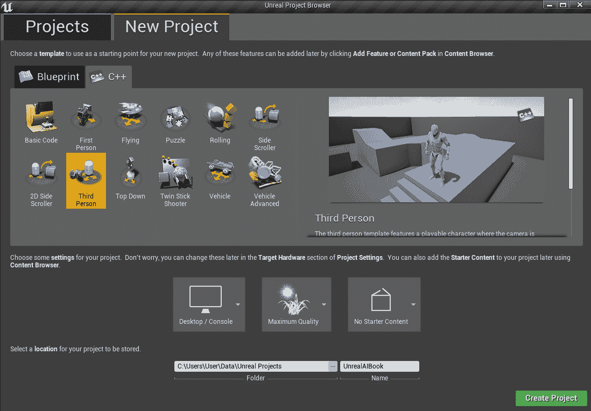

# 从 AI 控制器开始行为树

现在我们已经了解了行为树的基本概念及其构成，让我们来创建自己的行为树。回顾前一章，负责拥有并控制棋子的类是 AI 控制器。因此，我们的***行为树***应该在*AI 控制器*上运行。

我们有两种方法可以做到这一点。第一种是使用蓝图。通常，即使你是程序员，最好也使用蓝图来创建一个**行为树**，因为逻辑非常简单，控制器也很简单。另一方面，如果你是 C++爱好者，并且想尽可能多地使用它，即使是对于小任务，不用担心——我会再次重构我们在蓝图中所做的相同逻辑，但这次是在 C++中。无论如何，**行为树**资产应该在编辑器中创建和修改。你最终要编写的程序节点将不同于默认可用的节点（我们将在本书的后面看到这一点），但树本身始终是在编辑器中制作的。

# 创建行为树和黑板

要开始，我们需要创建四个蓝图类：**AI 控制器**、**角色**、**行为树**和**黑板**。我们将在后面介绍 AI 控制器。如果你选择了两个第三人称模板之一，你应该已经有一个**角色**准备好了。因此，你只需要创建一个**行为树**和一个**黑板**。

在**内容浏览器**中创建一个新的文件夹，并将其命名为`Chapter2`。这将有助于保持事物有序。然后，创建一个子文件夹并将其命名为`AI`。结果，我们可以保持我们的项目整洁，并确保我们不会将本章的内容与其他**非人工智能相关**的类和/或对象混淆。我们将把为 AI 创建的所有资产放在这个文件夹中。

# 创建黑板

现在，我们需要添加一个**黑板**，它应该始终位于`AI`文件夹中。为此，请转到**内容浏览器**并选择**添加新项** > **人工智能** > **黑板**。

现在，我们将我们的黑板命名为`BB_MyFirstBlackboard`。在这里，我使用命名约定，将所有黑板的前缀命名为`BB_`。除非你有特定的理由不遵循这个命名约定，请使用它。通过这样做，你将与本书的其余部分保持同步。

由于在同一**行为树**上无法拥有多个黑板，您可以在**黑板详情**面板中使用继承，父级和子级，如下所示（右边的截图）：

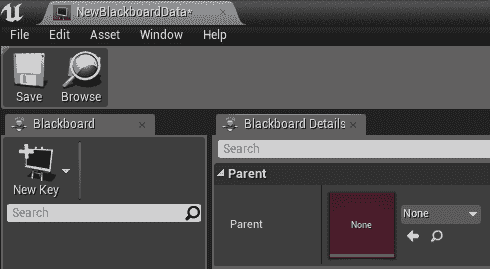

# 创建行为树

让我们通过转到**内容浏览器**并选择**添加新项** > **人工智能** > **行为树**来添加一个**行为树**，如下面的截图所示：

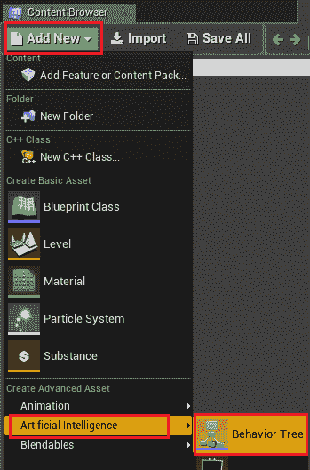

现在，我们将我们的行为树命名为`BT_MyFirstBehaviorTree`。再次强调，这里我使用特定的命名约定，将所有行为树资产的前缀命名为`BT_`。请再次遵循命名约定，除非你有特定的理由不这样做。

当你打开**行为树**窗口时，你会看到一个名为**根**的单个节点，如下所示：


**根节点**是您的*行为树*执行开始的地方（从上到下，从左到右）。根节点本身只有一个引用，那就是黑板，因此它不能连接到其他任何东西。它是树的顶端，所有后续的节点都在其下方。

如果您从***根节点***拖动，您将能够添加***组合***节点：

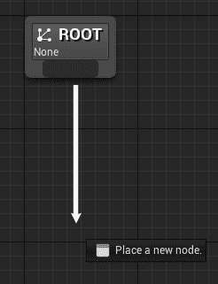

对于此，*行为树编辑器*非常直观。您可以从节点拖动以添加***组合***或***任务***节点。要添加***装饰器***或***服务***，您可以在节点上右键单击并选择“***添加装饰器...***”或“***添加服务...***”，如图所示：

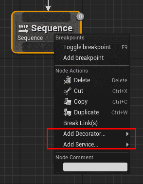

最后，如果您单击一个节点，可以在*详细信息面板*中选择其参数（以下截图显示了一个*移动到节点*的示例）：

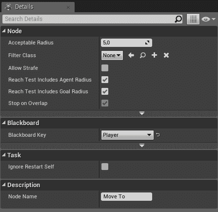

# 运行行为树的 AI 控制器

下一步是从*AI 控制器*运行*行为树*。通常，这是一个简单的任务，在蓝图（其中可以直接引用特定的行为树）中实现。即使我们有复杂的*C++ AI 控制器*，我们也可以在蓝图扩展控制器并从蓝图*运行*行为树。在任何情况下，如果硬引用不起作用（例如，您正在使用 C++或因为您想要有更多的灵活性），那么您可以将*行为树*存储在需要运行该特定*行为树*的*角色/单位*中，并在*AI 控制器*拥有*单位*时检索它。

让我们探索如何在蓝图（我们将在一个变量中引用*行为树*，我们可以决定其默认值）和 C++（我们将把*行为树*存储在*角色*中）中实现这一点。

# 蓝图中的 AI 控制器

我们可以通过单击**添加新** | **蓝图类** | **AI** **控制器**来创建蓝图 AI 控制器。您必须单击**所有类**并搜索**AI 控制器**来访问它。您可以在以下截图中看到一个示例：

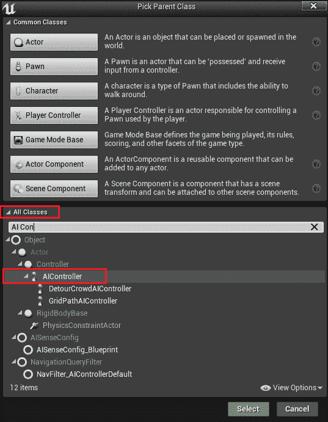

目前，我们将我们的**AI 控制器**命名为`BP_MyFirstAIController`。双击它以打开*蓝图编辑器*。

首先，我们需要创建一个变量，以便我们可以存储我们的***行为树***。尽管保留对*行为树*的引用不是必需的，但这是一个好的实践。要创建变量，我们需要在*我的蓝图*面板中按下***+ 变量 ***按钮，位于***变量***标签旁边，如图所示（请注意，您的光标需要位于变量标签上，按钮才会显示）：

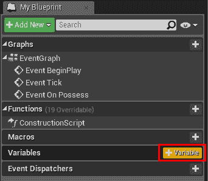

然后，作为一个变量类型，你需要选择**行为树**并给它一个名称，例如**BehaviorTreeReference**。这就是你的变量应该看起来像的样子：

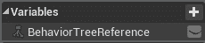

然后，在**详细面板**中，我们将设置默认值（记住，为了设置默认值，蓝图需要编译）：

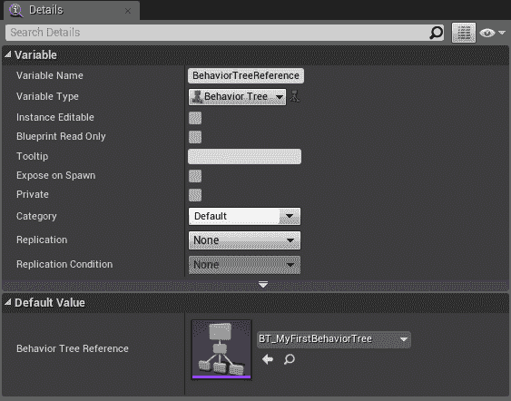

然后，我们需要重写**On Possess**函数，如下面的截图所示：

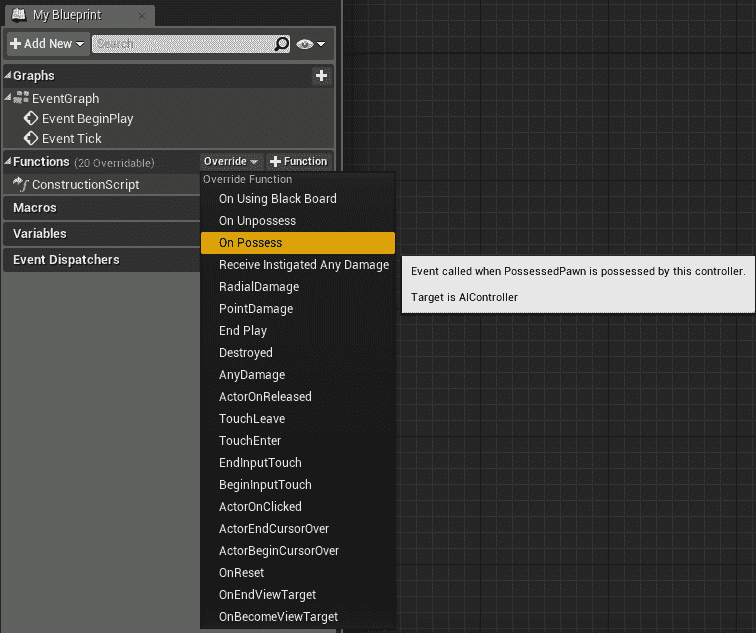

最后，在**AI 控制器的事件拥有**中，我们需要开始运行/执行**行为树**。我们可以通过使用以下简单的节点，命名为**运行行为树**来实现这一点：

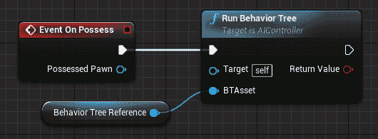

结果，你的 AI 控制器将能够执行存储在**BehaviorTreeReference**中的**行为树**。

# C++中的 AI 控制器

如果你已经决定在 C++中创建这个简单的 AI 控制器，让我们开始吧。我假设你的 Unreal 编辑器已经设置为 C++工作（例如，你已经安装了 Visual Studio，调试符号等），并且你对 C++在 Unreal 中的基本工作原理有基本的了解。以下是一个参考链接，以便你可以开始：[`docs.unrealengine.com/en-us/Programming/QuickStart`](https://docs.unrealengine.com/en-us/Programming/QuickStart)以及一个命名规范的链接，以便你理解为什么一些类在代码中带有字母前缀：[`docs.unrealengine.com/en-us/Programming/Development/CodingStandard`](https://docs.unrealengine.com/en-us/Programming/Development/CodingStandard)。

在你开始之前，请记住，为了在 C++中工作 AI，你需要在你的`.cs`文件中添加公共依赖项（在这个例子中，是**UnrealAIBook.cs**），并将**GameplayTasks**和**AIModule**作为公共依赖项添加，如下面的代码所示：

`PublicDependencyModuleNames.AddRange(new string[] { "Core", "CoreUObject", "Engine", "InputCore", "HeadMountedDisplay", **"GameplayTasks", "AIModule"** });`

这将确保你的代码可以无问题编译。

让我们创建一个新的 C++类，如下面的截图所示：

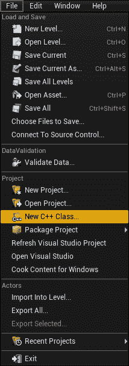

这个类需要从**AIController**类继承。你可能需要检查右上角的**显示所有类**复选框，然后使用搜索栏，如下面的截图所示：

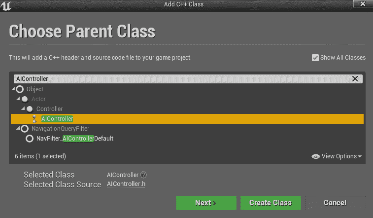

点击*下一步*并命名类为***MyFirstAIController***。此外，我建议你保持我们的项目整洁。因此，点击***选择文件夹***按钮。Unreal 会提示你打开系统文件夹资源管理器。在这里，创建一个名为`Chapter2`的文件夹，并在其中创建一个名为`AI`的子文件夹。选择这个文件夹作为你将要存储我们即将创建的代码的地方。在你点击*创建*之前，对话框应该看起来像这样：

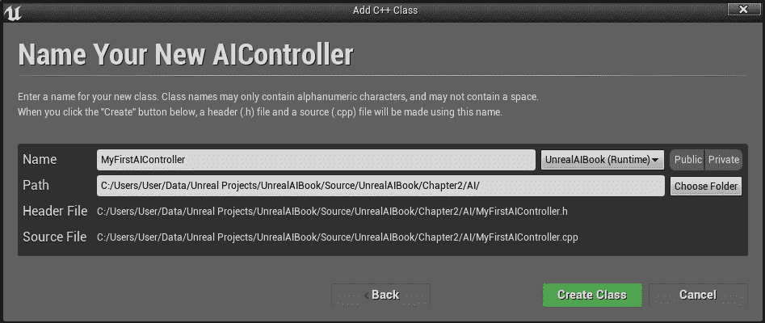

现在，点击*创建*并等待你的编辑器加载。你可能看到如下内容：

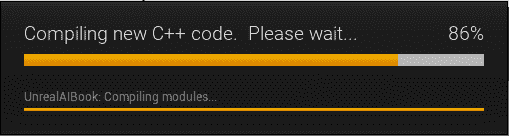

我们代码的结构将与蓝图版本略有不同。实际上，我们不能直接从 AI 控制器类（主要因为直接引用它会很困难）分配一个***行为树***；相反，我们需要从角色中获取它。正如我之前提到的，当你使用蓝图时，这也是一个好的方法，但既然我们选择了 C++项目，我们应该看看一些代码。在 Visual Studio 中，打开`UnrealAIBookCharacter.h`文件，并在公共变量下方添加以下代码行：

```py
    //** Behavior Tree for an AI Controller (Added in Chapter 2)
    UPROPERTY(EditAnywhere, BlueprintReadWrite, category=AI)
    UBehaviorTree* BehaviorTree;
```

对于那些仍然不熟悉的人来说，这里有一段更大的代码块，以便你可以理解如何在类中放置前面的代码：

```py
public:
     AUnrealAIBookCharacter();

    /** Base turn rate, in deg/sec. Other scaling may affect final turn rate. */
     UPROPERTY(VisibleAnywhere, BlueprintReadOnly, Category=Camera)
     float BaseTurnRate;

    /** Base look up/down rate, in deg/sec. Other scaling may affect final rate. */
     UPROPERTY(VisibleAnywhere, BlueprintReadOnly, Category=Camera)
     float BaseLookUpRate;

 *//** Behavior Tree for an AI Controller (Added in Chapter 2)*
 *UPROPERTY(EditAnywhere, BlueprintReadWrite, category=AI)*
 *UBehaviorTree* BehaviorTree;*
```

此外，为了编译前面的代码，我们还需要在类的顶部包含以下语句，就在`.generated`上方：

```py
#include "CoreMinimal.h"
#include "GameFramework/Character.h"
#include "BehaviorTree/BehaviorTree.h" #include "UnrealAIBookCharacter.generated.h"
```

关闭*角色类*，因为我们已经完成了它。因此，每次我们在世界中放置该角色的实例时，我们都能在*详细信息*面板中指定一个*行为树*，如下面的截图所示：


让我们打开我们新创建的 AI 控制器的头文件（`.h`）。特别是，我们需要覆盖 AI 控制器类的一个函数。我们要覆盖的函数叫做`Possess()`，它允许我们在 AI 控制器拥有一个新的 Pawn（即它控制的角色，它是一个 Pawn）时立即运行一些代码。在受保护的可见性中添加以下加粗代码：

```py
UCLASS()
class UNREALAIBOOK_API AMyFirstAIController : public AAIController
{
     GENERATED_BODY()

protected:

 //** override the OnPossess function to run the behavior tree.
 void OnPossess(APawn* InPawn) override;

};
```

接下来，打开实现文件（`.cpp`）。再次使用*行为树*，我们必须包含*行为树*和`UnrealAIBookCharacter`类：

```py
#include "MyFirstAIController.h"
#include "UnrealAIBookCharacter.h" #include "BehaviorTree/BehaviorTree.h"
```

接下来，我们需要为`Possess()`函数分配一个功能。我们需要检查*Pawn*是否实际上是***UnrealAIBookCharacter***，如果是，我们就检索*行为树*并运行它。当然，这被一个`if`语句包围，以避免我们的指针是`nullptr`：

```py
void AMyFirstAIController::OnPossess(APawn* InPawn)
{
  Super::OnPossess(InPawn);
  AUnrealAIBookCharacter* Character = Cast<AUnrealAIBookCharacter>(InPawn);
  if (Character != nullptr)
  {
    UBehaviorTree* BehaviorTree = Character->BehaviorTree;
    if (BehaviorTree != nullptr) {
      RunBehaviorTree(BehaviorTree);
    }
  }
}
```

如果由于任何原因您无法使代码运行，您可以使用蓝图控制器来启动*行为树*，或者直接继承 C++控制器，并确保所有其他代码都能运行，然后在蓝图中的`RunBehaviorTree()`函数中进行调用。

一旦我们编译了我们的项目，我们就能使用这个控制器。从层级中选择我们的 AI 角色（如果您没有，您可以创建一个），这次，在*详细信息*面板中，我们可以设置我们的 C++控制器，如下所示：

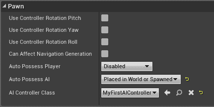

此外，别忘了在*详细信息面板*中将*行为树*分配好，我们总是这样做：

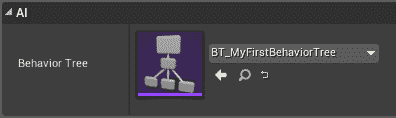

因此，一旦游戏开始，敌人将开始执行行为树。目前，树是空的，但这给了我们所需的架构，以便我们可以开始使用*行为树*。在接下来的章节中，我们将更详细地探讨*行为树*，特别是在第八章、第九章和第十章，我们将探讨设计和构建*行为树*的更实际的方法。

# 摘要

在本章中，我们介绍了什么是***行为树***以及它们包含的一些内容，包括*任务*、*装饰器*和*服务*。接下来，我们学习了***黑板***以及如何将其与*行为树*集成。然后，我们创建了一个*行为树*并学习了如何从*AI 控制器*（在蓝图和 C++中）启动它。通过这样做，我们建立了一个坚实的基础，为我们提供了关键知识，以便我们可以处理这本书的其他部分。

因此，在这本书中，我们将遇到更多的***行为树***，您将有机会掌握它们。但在那之前，我们首先需要了解一些特定的主题。一旦我们有了导航和感知（包括 EQS）的坚实基础，我们就可以迭代***行为树***来理解*复合*节点的作用，以及*装饰器*和*任务*。此外，我们还将能够创建自己的。第八章、第九章和第十章将指导您从头开始创建行为树的过程，从设计阶段到实现阶段。

但在那之前，让我们继续到下一章，我们将讨论*导航*和*路径查找*！
