# 扩展行为树

*赋予树更多的叶子和分支将使其变得不可阻挡*。

在本章中，我们将了解如何通过实现我们自定义的 **任务**、**装饰器** 和 **服务** 来扩展 *行为树*。

由于在第八章、第九章和第十章中，我们将从头开始创建一个具体的 *行为树* 示例，并创建自定义的 *任务*、*装饰器* 和 *服务*，您可以将本章视为对这些章节的快速理论介绍，以便为您扩展 *行为树* 提供一个基础。因此，本章可能会非常流畅且重复，但它将向您介绍一个伟大的工具，我们将在本书的后续部分以更轻松的方式对其进行完善。

在本章中，我们将涵盖以下主题：

+   如何在 *Blueprint* 和 *C++* 中创建一个 ***任务***，使我们的 AI 代理能够执行自定义动作。

+   如何在 *Blueprint* 和 *C++* 中创建一个 ***装饰器***，以创建我们可以在 *行为树* 的某些子分支中输入的特定条件

+   如何在 *Blueprint* 和 *C++* 中创建一个 ***服务***，以持续更新 *黑板* 中用于 *行为树* 的数据

+   如何创建 *复合节点*、*新类型的节点* 或甚至 *新树*

那么，让我们深入探讨吧！

# 行为树的快速回顾

这里有一个关于 **行为树** 的快速回顾，以帮助您巩固记忆。

**行为树** 是一种决策结构，它使用 *黑板* 作为其内存。特别是，流程从称为 **根** 的特殊节点开始，一直到底部的叶子节点，这些叶子节点被称为 **任务**。**任务** 是 AI 可以采取/执行的单一动作。

然后，所有非叶子节点（或根节点）都是 **复合** 节点。复合节点选择执行哪个子节点。两个主要的 **复合** 节点是 ***序列***（它试图按顺序执行其子节点的所有序列，如果它们成功，则返回成功，否则返回失败）和 ***选择器***（它尝试每个子节点，直到找到一个成功的，并报告成功，或者所有子节点都失败，并报告失败）。

**复合** 和 **任务** 节点都可以使用 **装饰器**（它施加必须为真的条件，以便你可以选择该节点）或顶部的 **服务**（一段持续运行的代码，例如用于设置黑板值）。

如果您仍有疑问，请复习 第二章，*行为树和黑板*。

# 创建一个任务

深入探讨我们在第二章“行为树和黑板”中讨论的概念，**任务**是我们的人工智能代理可以执行的单个动作。一些例子包括走到特定位置、执行/运行 EQS、定位某物、追逐玩家等。所有这些动作都可以失败或成功。然后，任务的最终结果会通过**行为树**返回，遵循我们看到的选择器和序列的规则。

任务不一定必须在帧中执行，但它可以无限期地扩展。实际上，任务只有在报告了**失败**或**成功**后才会完成。然而，它们可以被外部节点（如**装饰器**）中断/中止。

当您创建任务时，无论这是在蓝图还是 C++中完成，您都需要覆盖一些函数。由于蓝图更容易，并且与我们在 C++中使用的概念相同，我们将首先查看蓝图中的系统是如何工作的。

# 创建蓝图任务

要创建一个**蓝图任务**，我们有几种选择可供选择。最简单的一种是在**行为树编辑器**中，我们在顶部栏中按下“**新建任务**”按钮，如下面的截图所示：


然而，您需要手动重命名文件并将其放置在您希望它所在的文件夹中。

创建任务的另一种方法是创建一个新的蓝图，它继承自**BTTask_BlueprintBase**，如下面的截图所示：

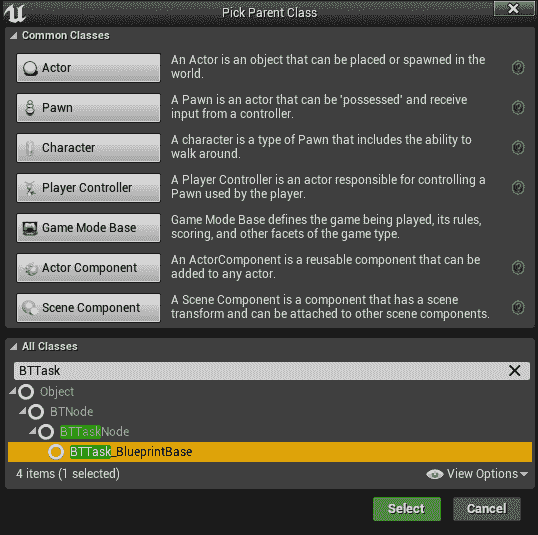

习惯上，在任务前加上“*BBTask_*”（代表**行为树任务**）。例如，我们可以将我们的任务命名为*BTTask_BPMyFirstTask*：


一旦创建了**蓝图任务**，我们可以覆盖三种类型函数：

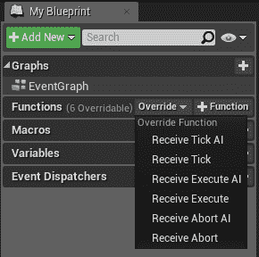

+   **接收执行**：当**任务**开始时调用此功能，在这里您应该实现您任务的全部初始化。

+   **接收时钟**：每次任务时钟滴答时都会调用此功能，因此您可以使用它来持续做某事。然而，由于可能有许多代理执行许多**行为树**，建议尽可能保持此时钟函数尽可能短，或者根本不实现它（出于性能原因），并使用计时器或委托来处理任务。

+   **接收中止**：每次任务执行时都会调用此功能，但**行为树**请求中止它。您需要使用此功能来清理您的任务（例如，恢复一些黑板值）。

在蓝图（Blueprint）中，这三个功能以两种形式存在，即***AI***和***非 AI***，也被称为是*通用的*（例如*接收执行*和*接收执行 AI*）。它们之间没有太大的区别。如果只实现了一个（建议实现 AI 版本以保持项目一致性），那么调用的是这个功能。否则，最方便的版本将被调用，这意味着当 Pawn 被*AI 控制器*控制时，将调用 AI 版本，而在所有其他情况下将调用*非 AI*版本。当然，在大多数情况下，*行为树*都是在*AI 控制器*上运行的，所以*非 AI*版本是为非常特定且较少见的情况准备的。

到目前为止，系统没有方法理解一个*任务*何时完成执行或完成清理操作。因此，你需要调用两个函数：

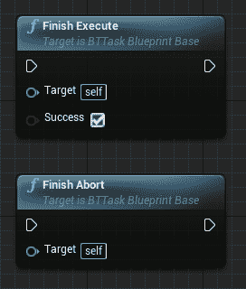

+   **完成执行**：这将表明*任务*已完成其执行。它有一个布尔参数来指示*任务*是否***成功***（***true***值）或***失败***（***false***值）。

+   **完成中止**：这将表明*任务*已完成中止。它没有参数。

请注意，如果你不调用这两个函数，任务将永远挂在那里，这不是期望的行为。虽然建议在*接收中止*事件的末尾调用*完成中止*函数，但在某些情况下你可能需要多帧来清理。在这种情况下，你可以在其他地方（例如在委托中）调用*完成中止*。

完成执行一个*任务*还有其他方法，例如使用 AI 消息，但在这本书中我们不会涉及这些内容。

创建*任务*你需要知道的所有内容。你只需创建你想要的图，记得在完成（无论是*成功*还是*失败*）时调用*完成执行*节点。我们将在接下来的三个章节中查看创建新任务的实例。

# 在 C++中创建任务

创建 C++中*任务*的概念与蓝图中的对应概念相同。

首先，要创建一个新的 C++任务，我们需要创建一个继承自***BTTaskNode***的 C++类，如下面的截图所示：

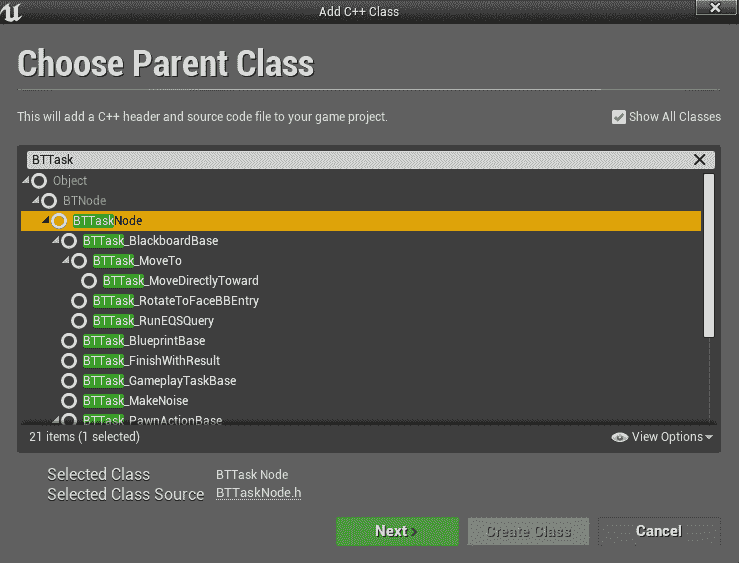

就像蓝图中的任务一样，惯例是在*任务*前加上"***BTTask_***"（*行为树任务*）。因此，我们可以将我们的任务命名为"*BTTask_MyFirstTask*"：

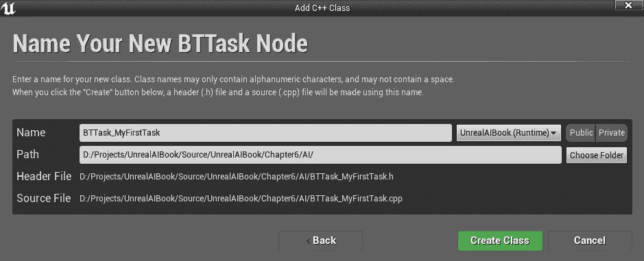

一旦创建了*任务*，你需要重写一些函数，这些函数的功能与蓝图中的非常相似。然而，也有一些区别。

主要区别之一是如何报告任务已完成其执行（或已完成取消）。对于这些情况，有一个特殊的枚举结构称为`EBTNodeResult`。它需要由一个函数返回，这样*行为树*才能“知道”是否需要继续调用任务。这个结构可以有四个值：

+   **成功**：任务以成功结束

+   **失败**：任务以失败结束

+   **已取消**：任务已取消

+   **进行中**：任务尚未完成

另一个区别在于，蓝图*接收执行*的双胞胎必须完成，因此它需要返回一个`EBTNodeResult`结构来通信并声明任务是否已完成或是否需要多个帧。如果是这样，那么将调用其他函数，正如我们将看到的。

此外，在 C++中，还有一些其他特殊的概念和结构，你可以在蓝图中使用，而在蓝图中不能使用。例如，你可以访问`NodeMemory`，它为已执行的任务保留特定的内存。为了正确使用这个结构，请查看引擎源代码，特别是本节末尾建议的文件。

最后一个区别是，没有*AI*和*非 AI*（通用*）版本的函数。你必须自己判断是否有 AI 控制器以及要做什么（如果你做了什么）。

函数如下（这直接取自引擎的源代码，其中两个最重要的函数用粗体表示）：

```py

   /** starts this task, should return Succeeded, Failed or InProgress
   * (use FinishLatentTask() when returning InProgress)
   * this function should be considered as const (don't modify state of object) if node is not instanced! */
 virtual EBTNodeResult::Type ExecuteTask(UBehaviorTreeComponent& OwnerComp, uint8* NodeMemory);

protected:
  /** aborts this task, should return Aborted or InProgress
   * (use FinishLatentAbort() when returning InProgress)
   * this function should be considered as const (don't modify state of object) if node is not instanced! */
 virtual EBTNodeResult::Type AbortTask(UBehaviorTreeComponent& OwnerComp, uint8* NodeMemory);

public:
#if WITH_EDITOR
  virtual FName GetNodeIconName() const override;
#endif // WITH_EDITOR
  virtual void OnGameplayTaskDeactivated(UGameplayTask& Task) override;

  /** message observer's hook */
  void ReceivedMessage(UBrainComponent* BrainComp, const FAIMessage& Message);

  /** wrapper for node instancing: ExecuteTask */
  EBTNodeResult::Type WrappedExecuteTask(UBehaviorTreeComponent& OwnerComp, uint8* NodeMemory) const;

  /** wrapper for node instancing: AbortTask */
  EBTNodeResult::Type WrappedAbortTask(UBehaviorTreeComponent& OwnerComp, uint8* NodeMemory) const;

  /** wrapper for node instancing: TickTask */
  void WrappedTickTask(UBehaviorTreeComponent& OwnerComp, uint8* NodeMemory, float DeltaSeconds) const;

  /** wrapper for node instancing: OnTaskFinished */
  void WrappedOnTaskFinished(UBehaviorTreeComponent& OwnerComp, uint8* NodeMemory, EBTNodeResult::Type TaskResult) const;

  /** helper function: finish latent executing */
  void FinishLatentTask(UBehaviorTreeComponent& OwnerComp, EBTNodeResult::Type TaskResult) const;

  /** helper function: finishes latent aborting */
  void FinishLatentAbort(UBehaviorTreeComponent& OwnerComp) const;

  /** @return true if task search should be discarded when this task is selected to execute but is already running */
  bool ShouldIgnoreRestartSelf() const;

  /** service nodes */
  UPROPERTY()
  TArray<UBTService*> Services;

protected:

  /** if set, task search will be discarded when this task is selected to execute but is already running */
  UPROPERTY(EditAnywhere, Category=Task)
  uint32 bIgnoreRestartSelf : 1;

  /** if set, TickTask will be called */
  uint32 bNotifyTick : 1;

  /** if set, OnTaskFinished will be called */
  uint32 bNotifyTaskFinished : 1;

  /** ticks this task 
   * this function should be considered as const (don't modify state of object) if node is not instanced! */
  virtual void TickTask(UBehaviorTreeComponent& OwnerComp, uint8* NodeMemory, float DeltaSeconds);

  /** message handler, default implementation will finish latent execution/abortion
   * this function should be considered as const (don't modify state of object) if node is not instanced! */
  virtual void OnMessage(UBehaviorTreeComponent& OwnerComp, uint8* NodeMemory, FName Message, int32 RequestID, bool bSuccess);

  /** called when task execution is finished
   * this function should be considered as const (don't modify state of object) if node is not instanced! */
  virtual void OnTaskFinished(UBehaviorTreeComponent& OwnerComp, uint8* NodeMemory, EBTNodeResult::Type TaskResult);

  /** register message observer */
  void WaitForMessage(UBehaviorTreeComponent& OwnerComp, FName MessageType) const;
  void WaitForMessage(UBehaviorTreeComponent& OwnerComp, FName MessageType, int32 RequestID) const;

  /** unregister message observers */
  void StopWaitingForMessages(UBehaviorTreeComponent& OwnerComp) const;
```

如你所见，代码量相当大，一开始可能会有些混乱。然而，如果你已经很好地理解了蓝图，那么理解 C++函数应该会容易得多。例如，`ExecuteTask()`函数开始执行任务，但如果它返回任务仍在进行中，则不会完成它。

这里是来自引擎源代码的注释，可能有助于澄清这一点：

```py
/** 
 * Task are leaf nodes of behavior tree, which perform actual actions
 *
 * Because some of them can be instanced for specific AI, following virtual functions are not marked as const:
 * - ExecuteTask
 * - AbortTask
 * - TickTask
 * - OnMessage
 *
 * If your node is not being instanced (default behavior), DO NOT change any properties of object within those functions!
 * Template nodes are shared across all behavior tree components using the same tree asset and must store
 * their runtime properties in provided NodeMemory block (allocation size determined by GetInstanceMemorySize() )
 *
 */
```

我知道的两个最好的方法是更好地了解如何创建 C++任务，要么自己创建一个，要么阅读其他任务的源代码。例如，你可以阅读引擎源代码中的`BTTask_MoveTo.cpp`文件，以了解如何创建一个完整的 C++任务的示例。不要气馁，因为使用 C++很酷！

在任何情况下，我们将在接下来的三个章节中从头开始创建一个 C++任务的过程。

# 创建一个装饰器

从第二章*，行为树和黑板*中回忆起，**装饰器**是一个条件节点（也可以看作是一个门），它控制着它所附加的子分支的执行流程（如果执行首先进入子分支的话）。

与我们如何*扩展/创建*一个*任务*类似，我们也可以*扩展/创建*一个***装饰器***。再次强调，我们首先将深入探讨如何在蓝图（Blueprint）中实现它，然后继续讨论如何在 C++中扩展它。

# 在蓝图（Blueprint）中创建一个装饰器

要创建一个与*任务*类似的***蓝图装饰器***，你可以按下*行为树编辑器*顶部栏中的“***新建装饰器***”按钮，如下面的截图所示：


或者，你可以生成继承自***BTDecorator_BlueprintBase***的*蓝图*类，如下面的截图所示：

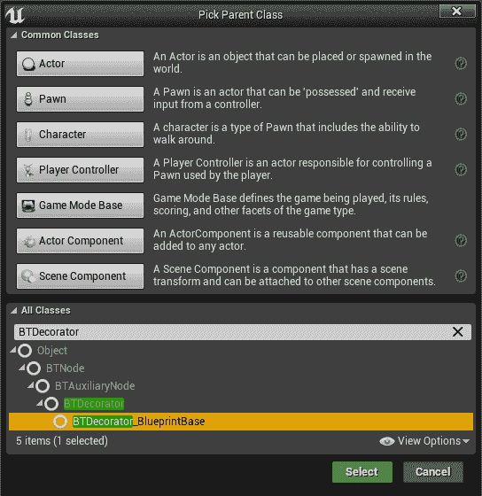

在任何情况下，命名约定是在*装饰器*前加上“***BTDecorator_***”（代表*行为树装饰器*）。例如，我们可以将我们的类命名为*BTDecorator_BPMyFirstDecorator*：


对于任务，所有*可重写*的函数都有两种风味：*AI*和*非 AI*。概念完全相同。如果只实现其中之一（为了保持项目一致性，建议重写 AI 版本），则调用该函数。如果两者都实现了，当 Pawn 被 AI 控制器拥有时，调用*AI*，而在所有其他情况下调用*非 AI*函数。

这里是*装饰器*可以扩展的六个函数：

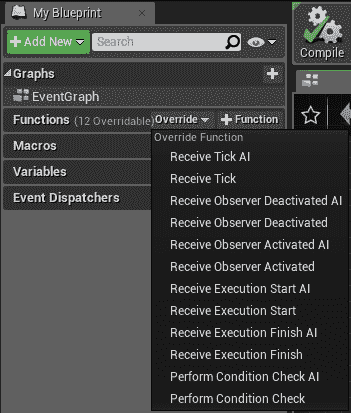

+   **执行条件检查**：这是最重要的函数，也是唯一可能需要重写的函数（如果你没有动态事物要处理）。它返回一个 bool 值，表示条件检查是否成功。

+   **接收执行开始**：当底层节点（无论是组合节点还是任务）的执行开始时，会调用此函数。使用此函数来初始化装饰器。

+   **接收执行完成**：当底层节点（无论是组合节点还是任务）的执行完成时，会调用此函数。使用此函数来清理装饰器。

+   **接收 tick**：这是 tick 函数，以防你需要持续更新某些内容。从性能的角度来看，不建议用于重操作，但如果完全不使用它就更好（例如，使用计时器或委托）。

+   **接收观察者激活**：正如其名所示，当观察者被激活时，会调用此函数。

+   **接收观察者禁用**：正如其名所示，当观察者被禁用时，会调用此函数。

如您所见，*装饰器*相当简单（至少在蓝图（Blueprint）中是这样）；主要来说，你只需要*重写/实现*一个名为*Perform Condition Check*的函数，该函数返回一个布尔值：

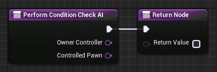

在任何情况下，我们将在接下来的三个章节中查看从零开始创建*蓝图装饰器*的具体示例。

# 在 C++中创建一个装饰器

与我们在 C++ 中扩展 *Task* 的方式非常相似，你还可以扩展一个 ***Decorator in C++***。要继承的基类是 ***BTDecorator***，如下面的截图所示：

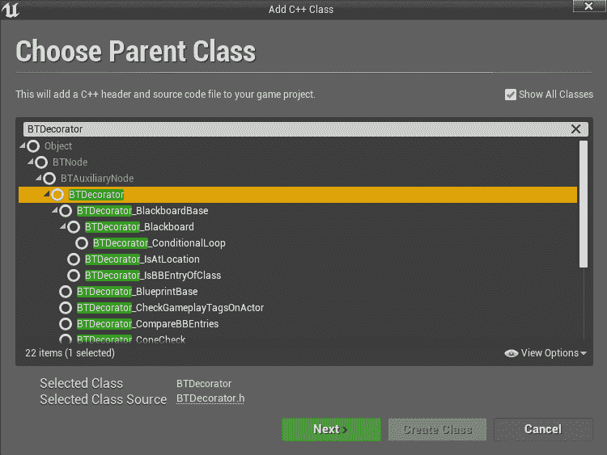

习惯上，是在 *Decorator* 前缀为 "***BTDecorator_***"（*Behavior Tree Decorator*）。我们的 *Decorator* 的一个可能名称可以是 "*BTDecorator_MyFirstDecorator*":

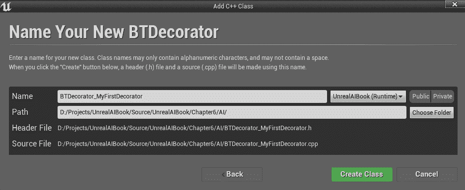

直接进入 C++，这些是可重写的函数，如从引擎源代码中获取（有很多）：

```py

   /** wrapper for node instancing: CalculateRawConditionValue */
  bool WrappedCanExecute(UBehaviorTreeComponent& OwnerComp, uint8* NodeMemory) const;

  /** wrapper for node instancing: OnNodeActivation */
  void WrappedOnNodeActivation(FBehaviorTreeSearchData& SearchData) const;

  /** wrapper for node instancing: OnNodeDeactivation */
  void WrappedOnNodeDeactivation(FBehaviorTreeSearchData& SearchData, EBTNodeResult::Type NodeResult) const;

  /** wrapper for node instancing: OnNodeProcessed */
  void WrappedOnNodeProcessed(FBehaviorTreeSearchData& SearchData, EBTNodeResult::Type& NodeResult) const;

  /** @return flow controller's abort mode */
  EBTFlowAbortMode::Type GetFlowAbortMode() const;

  /** @return true if condition should be inversed */
  bool IsInversed() const;

  virtual FString GetStaticDescription() const override;

  /** modify current flow abort mode, so it can be used with parent composite */
  void UpdateFlowAbortMode();

  /** @return true if current abort mode can be used with parent composite */
  bool IsFlowAbortModeValid() const;

protected:

  /** if set, FlowAbortMode can be set to None */
  uint32 bAllowAbortNone : 1;

  /** if set, FlowAbortMode can be set to LowerPriority and Both */
  uint32 bAllowAbortLowerPri : 1;

  /** if set, FlowAbortMode can be set to Self and Both */
  uint32 bAllowAbortChildNodes : 1;

  /** if set, OnNodeActivation will be used */
  uint32 bNotifyActivation : 1;

  /** if set, OnNodeDeactivation will be used */
  uint32 bNotifyDeactivation : 1;

  /** if set, OnNodeProcessed will be used */
  uint32 bNotifyProcessed : 1;

  /** if set, static description will include default description of inversed condition */
  uint32 bShowInverseConditionDesc : 1;

private:
  /** if set, condition check result will be inversed */
  UPROPERTY(Category = Condition, EditAnywhere)
  uint32 bInverseCondition : 1;

protected:
  /** flow controller settings */
  UPROPERTY(Category=FlowControl, EditAnywhere)
  TEnumAsByte<EBTFlowAbortMode::Type> FlowAbortMode;

  void SetIsInversed(bool bShouldBeInversed);

  /** called when underlying node is activated
    * this function should be considered as const (don't modify state of object) if node is not instanced! */
  virtual void OnNodeActivation(FBehaviorTreeSearchData& SearchData);

  /** called when underlying node has finished
   * this function should be considered as const (don't modify state of object) if node is not instanced! */
  virtual void OnNodeDeactivation(FBehaviorTreeSearchData& SearchData, EBTNodeResult::Type NodeResult);

  /** called when underlying node was processed (deactivated or failed to activate)
   * this function should be considered as const (don't modify state of object) if node is not instanced! */
  virtual void OnNodeProcessed(FBehaviorTreeSearchData& SearchData, EBTNodeResult::Type& NodeResult);

  /** calculates raw, core value of decorator's condition. Should not include calling IsInversed */
  virtual bool CalculateRawConditionValue(UBehaviorTreeComponent& OwnerComp, uint8* NodeMemory) const;

  /** more "flow aware" version of calling RequestExecution(this) on owning behavior tree component
   * should be used in external events that may change result of CalculateRawConditionValue */
  void ConditionalFlowAbort(UBehaviorTreeComponent& OwnerComp, EBTDecoratorAbortRequest RequestMode) const;
```

此外，在引擎源代码中，我们可以找到以下注释，它解释了一些实现选择：

```py
/** 
 * Decorators are supporting nodes placed on parent-child connection, that receive notification about execution flow and can be ticked
 *
 * Because some of them can be instanced for specific AI, following virtual functions are not marked as const:
 *  - OnNodeActivation
 *  - OnNodeDeactivation
 *  - OnNodeProcessed
 *  - OnBecomeRelevant (from UBTAuxiliaryNode)
 *  - OnCeaseRelevant (from UBTAuxiliaryNode)
 *  - TickNode (from UBTAuxiliaryNode)
 *
 * If your node is not being instanced (default behavior), DO NOT change any properties of object within those functions!
 * Template nodes are shared across all behavior tree components using the same tree asset and must store
 * their runtime properties in provided NodeMemory block (allocation size determined by GetInstanceMemorySize() )
 *
 */
```

不幸的是，我们没有时间详细讲解它们，但大多数都非常直观，所以你不应该很难理解它们的含义。无论如何，我们将在接下来的三个章节中查看如何从头创建一个 ***C++ Decorator*** 的具体示例（我们将使用许多这些函数）。

# 创建服务

回顾 第二章*，行为树和黑板*，一个 ***Service*** 是一个节点，如果附加到子分支的父节点之一，则持续运行。此节点的主要用途是更新 *Behavior Tree* 的 *Blackboard* 中的数据，并且它是你需要创建的节点之一，因为它们非常特定于你的游戏玩法。

与我们扩展任务和 *Decorators* 的方式类似，我们也可以 *扩展/创建* ***Services***。我们首先将介绍如何在蓝图中进行扩展实现，然后了解如何在 C++ 中实现。

# 在蓝图创建服务

就像你对 *Tasks* 和 *Decorators* 所做的那样，你可以通过按 *Behavior Tree Editor* 顶部的 ***New Service*** 按钮创建一个新的 ***Blueprint Service***，如下面的截图所示：


或者，你可以生成继承自 ***BTService_BlueprintBase*** 的 *Blueprint* 类，如下面的截图所示：

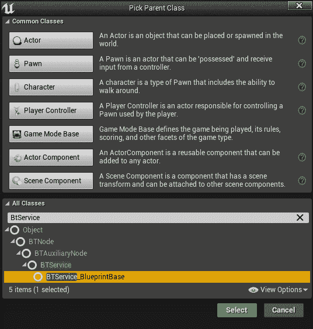

在任何情况下，命名约定是在 *Service* 前缀为 "***BTService_***"（代表 *Behavior Tree Service*）。例如，我们可以将我们的类命名为 *BTService_BPMyFirstService*：


就像对 *Tasks* 和 *Decorators* 所做的那样，所有 *可重写* 的函数都有两种不同的版本：AI 和 *非-AI* (*通用*)。概念完全相同：如果只实现了一个（为了保持项目一致性，建议重写 AI 版本），则调用该函数。如果两者都实现了，当 Pawn 被 AI 控制器控制时调用 AI，否则调用通用函数。

这里是四个*可重写*的函数：

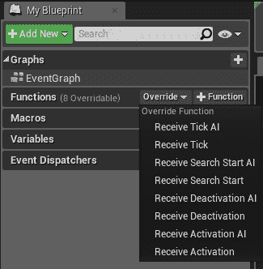

+   **接收激活**：当*服务*变为活动状态时，会调用此函数。使用它来初始化服务。

+   **接收时钟**：当服务时钟滴答时，会调用此函数。主要地，一个*服务*会持续进行某些操作（例如更新*黑板*变量），因此这是服务最重要的函数。从性能的角度来看，建议将其保持尽可能短。此外，回到*行为树*，可以调整服务滴答的频率（使用介于最小值和最大值之间的随机值）。然而，从理论上讲，实现应该不知道服务滴答的频率；它只需要提供一个"*服务*"。然后，服务的使用者，即*行为树*，将决定它希望这个服务多频繁。

+   **接收搜索开始**：这是一个特殊案例，其中服务是活动的（因此你应该已经初始化了服务，但在理论上，服务不应该已经执行任何操作）。在搜索*任务/节点*之前，会调用此函数。实际上，*行为树*需要评估下一个要执行的*任务*或*节点*。在这个过程中，*行为树*会检查可能*任务*或*节点*上装饰器的条件。因此，在这个函数中，你可以在下一个*任务*或*节点*被搜索之前调整值，并因此选择影响选择成为正确选择的东西。

+   **接收停用**：当服务变为非活动状态时，会调用此函数。使用它来清理服务。

主要，你需要在***Receive Tick***函数中实现你的逻辑，以便你能够不断更新黑板上的信息。*服务*是行为树和游戏世界之间的一个层。

我们将在接下来的三章中实现一个*蓝图服务*，我们将面对一个更加实际和具体的例子。

# 在 C++中创建一个*服务*

与我们在 C++中扩展*任务*和*装饰器*的方式非常相似，你还可以在 C++中扩展***服务***。要继承的基类是***BTService***，如下面的截图所示：

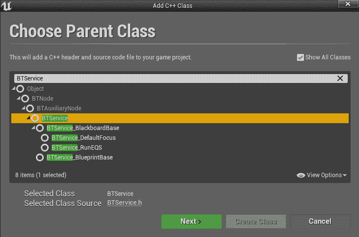

习惯上，在*服务*类名前加上"***BTService_***"（*行为树服务*）。我们类的可能名称可以是*BTService_MyFirstService*：

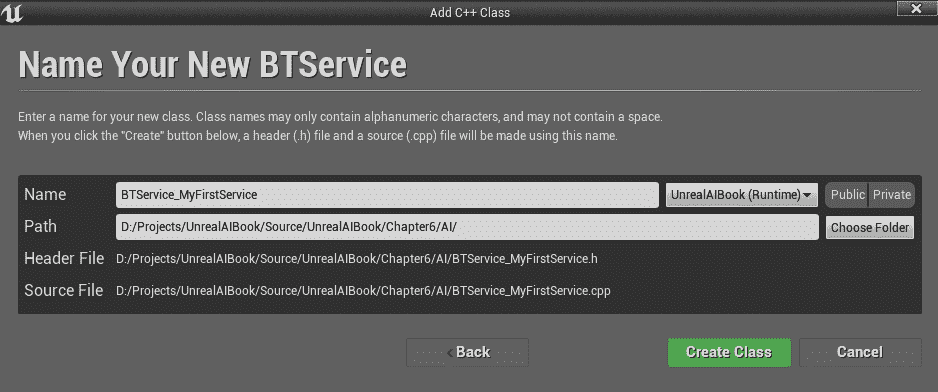

一旦我们创建了***C++中的服务***，其余的工作就与在 C++中*扩展/创建*一个*装饰器*非常相似。这里有一些需要重写的函数（来自引擎源代码）：

```py
virtual FString GetStaticDescription() const override;

  void NotifyParentActivation(FBehaviorTreeSearchData& SearchData);

protected:

  // Gets the description of our tick interval
  FString GetStaticTickIntervalDescription() const;

  // Gets the description for our service
  virtual FString GetStaticServiceDescription() const;

  /** defines time span between subsequent ticks of the service */
  UPROPERTY(Category=Service, EditAnywhere, meta=(ClampMin="0.001"))
  float Interval;

  /** adds random range to service's Interval */
  UPROPERTY(Category=Service, EditAnywhere, meta=(ClampMin="0.0"))
  float RandomDeviation;

  /** call Tick event when task search enters this node (SearchStart will be called as well) */
  UPROPERTY(Category = Service, EditAnywhere, AdvancedDisplay)
  uint32 bCallTickOnSearchStart : 1;

  /** if set, next tick time will be always reset to service's interval when node is activated */
  UPROPERTY(Category = Service, EditAnywhere, AdvancedDisplay)
  uint32 bRestartTimerOnEachActivation : 1;

  /** if set, service will be notified about search entering underlying branch */
  uint32 bNotifyOnSearch : 1;

  /** update next tick interval
   * this function should be considered as const (don't modify state of object) if node is not instanced! */
  virtual void TickNode(UBehaviorTreeComponent& OwnerComp, uint8* NodeMemory, float DeltaSeconds) override;

  /** called when search enters underlying branch
   * this function should be considered as const (don't modify state of object) if node is not instanced! */
  virtual void OnSearchStart(FBehaviorTreeSearchData& SearchData);

#if WITH_EDITOR
  virtual FName GetNodeIconName() const override;
#endif // WITH_EDITOR

  /** set next tick time */
  void ScheduleNextTick(uint8* NodeMemory);
```

这里有一个开头注释（总是来自引擎源代码），它解释了一些实现选择：

```py
/** 
 * Behavior Tree service nodes is designed to perform "background" tasks that update AI's knowledge.
 *
 * Services are being executed when underlying branch of behavior tree becomes active,
 * but unlike tasks they don't return any results and can't directly affect execution flow.
 *
 * Usually they perform periodical checks (see TickNode) and often store results in blackboard.
 * If any decorator node below requires results of check beforehand, use OnSearchStart function.
 * Keep in mind that any checks performed there have to be instantaneous!
 * 
 * Other typical use case is creating a marker when specific branch is being executed
 * (see OnBecomeRelevant, OnCeaseRelevant), by setting a flag in blackboard.
 *
 * Because some of them can be instanced for specific AI, following virtual functions are not marked as const:
 * - OnBecomeRelevant (from UBTAuxiliaryNode)
 * - OnCeaseRelevant (from UBTAuxiliaryNode)
 * - TickNode (from UBTAuxiliaryNode)
 * - OnSearchStart
 *
 * If your node is not being instanced (default behavior), DO NOT change any properties of object within those functions!
 * Template nodes are shared across all behavior tree components using the same tree asset and must store
 * their runtime properties in provided NodeMemory block (allocation size determined by GetInstanceMemorySize() )
 */
```

不幸的是，我们无法详细说明每个函数，但它们都相当容易理解。无论如何，我们将在接下来的三章中进一步探讨 *服务*，当我们从头开始构建 *行为树* 以及实现 *C++服务* 时。

# 创建一个组合节点

在大多数这些情况下，你**不需要扩展一个组合节点**。通过“大多数这些情况”，我的意思是你可以创建非常复杂的 *AI 行为树*，它可以执行非常复杂的任务，而且你真的不需要扩展或创建一个组合节点，除非你真的需要。

事实上，组合节点会影响 *行为树* 的流程，包括要执行哪个节点、要检查哪些 *装饰器* 以及要激活哪个 *服务*。默认情况下，只有三个：*选择器*、*序列* 和 *简单并行*。这些将足以覆盖我们的大部分情况。

然而，如果你真的有特定的需求，那么虚幻引擎非常灵活，它允许你扩展一个 *组合节点*。

首先，这在蓝图（Blueprint）中是不可能的，所以唯一能够扩展一个（或创建一个新的）*组合节点*的方法是通过 C++。

让我们看看一个具体的例子，说明为什么你可能想要创建一个新的 *组合节点*。

**原因**：因为你可以实现一个在行为树中可能难以实现（或不可能实现）的流程。

**示例**：你可以用简单的并行节点模拟一个行为树，也可以不用它们。但这会非常复杂，而且不够整洁。因此，使用简单的并行节点可以大大简化工作流程（最初，在引擎的第一版中，没有简单的并行节点）。

**具体示例**：你想要根据某些权重随机选择在这个自定义组合节点下应该执行的任务。例如，权重可以通过一种特殊的 *装饰器* 来评估。因此，扩展 *组合* 可能需要在其他类型的节点上做额外的工作。

**另一个具体示例**：你可以创建一个组合节点，它不断随机选择一个子节点，直到达到阈值或其中一个子节点报告失败。

尽管这是一个非常有趣的话题，但不幸的是，它超出了本书的范围。因此，我们将限制自己只创建新的 *任务*、*装饰器* 和 *服务*。

# 创建新的节点类型或新的树类型

理论上，你可以创建新的节点类型（对于 *行为树* 而言，这实际上并不需要，因为你将创建不同类型的结构）。实际上，你可以创建不再是 *行为树* 的不同树结构（例如，一个 *对话树*），这比为行为树创建另一个节点更有用。*对话树* 非常有趣，因为它们使用与 *行为树* 非常相似的结构，你可以使用相同的 *编辑器*（或者更好的是，它的一个稍微修改过的版本）来编辑树。

尽管我很想深入探讨这些主题，但本书的主要焦点是人工智能，因此讨论 *对话树* 超出了本书的范围。

# 摘要

在本章中，我们探讨了如何在 *Blueprint* 和 *C++* 中 *扩展/创建* **任务**、**装饰器** 和 **服务** 的可能性。因此，这使我们能够为我们的 AI 代理创建复杂的行为，尤其是如果与我们在前几章中学到的内容相结合，如 *导航*、*EQS* 和 *感知*。

在下一章中，我们将处理 *人群*，然后再跳转到在 第八章 *设计行为树 – 第 I 部分*、第九章 *设计行为树 – 第 II 部分* 和 第十章 *设计行为树 – 第 III 部分* 中创建具体示例。
