# 第九章：设计行为树 - 第二部分

本章是上一章的延续。特别是，在我们下一章构建最终的 Behavior Tree 之前，我们将构建最后缺失的拼图。

尤其是我们将涵盖以下主题：

+   创建**玩家角色**，以及**追逐代理**

+   在关卡内设置**导航系统**

+   实现一个**自定义服务**（在蓝图和 C++中），以更新追逐行为所需的变量

我们将再次在蓝图和 C++中实现一切，以给你一个更广泛的想法，了解你可以使用什么。或者，如果你已经知道你想要使用什么，你只需遵循两种实现方法之一。

制作自定义服务是耗时最长的部分，因为我们将逐步进行。

让我们开始吧！

# 为测试 Behavior Tree 设置环境

在我们继续之前，让我们从编码中休息一下，创建我们需要测试 Behavior Tree 的环境。准备一个好的测试环境可以让你轻松地发现并修复错误。

在本节中，我们不会做任何花哨的事情，但我们将逐步查看测试我们的 AI 所需的内容。

# 创建玩家

首先，我们需要在关卡上有一个玩家，因为我们的 AI 代理将追逐玩家。此外，在本章中我们将编写的代码中，我们需要引用一个玩家类。

在这种情况下，我们已经在我们的项目中有了 ThirdPersonCharacter（如果你是从*第三人称模板*创建的项目）。右键单击它，选择创建子蓝图类，如下面的截图所示：

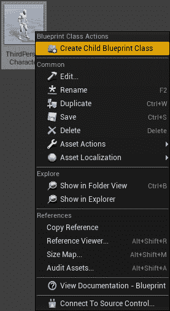

然后，我们可以将其重命名为**玩家**：

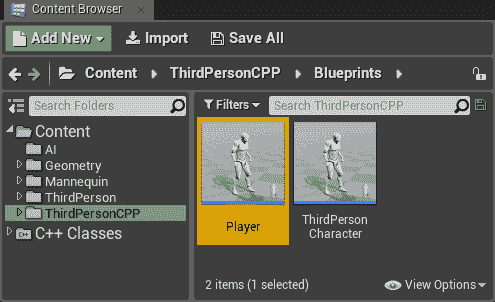

双击玩家，在*蓝图编辑器*中打开它。在详细信息面板中，在 Pawn 选项卡下，我们需要将自动占据玩家更改为玩家 0，并将自动占据 AI 更改为禁用，如下面的截图所示：

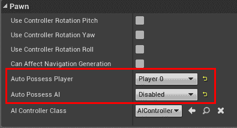

因此，我们将有一个专门用于*玩家 Actor*的类（它是一个蓝图类，这很重要）。一旦将其放置在地图上，它将被玩家占据（更准确地说，由*玩家控制器 0*占据）。

# 创建追逐代理

下一步是设置追逐代理。

我们在前一章中已经为它创建了一个控制器，既有蓝图也有 C++。然而，我们需要创建一个将被占据的实际 Pawn。我们可以用与创建玩家非常相似的方式来实现这一点。

创建 ThirdPersonCharacter 的另一个子蓝图，但这次将其重命名为 AI_ChasingAgent：

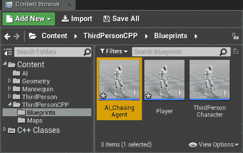

双击以打开蓝图编辑器。正如我们在上一章中在*使用 AI 控制器*部分所预料的，在*细节*面板下，在 Pawn 选项卡中，我们需要将 Auto Possess Player 设置为 Disabled，Auto Possess AI 设置为 Placed in World or Spawned，并将 AI Controller Class 设置为 ChasingAIController（或者如果你更喜欢蓝图版本，则为`BP_ChasingAIController`），如下面的截图所示：

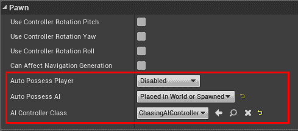

由于我们将会有许多代理试图追逐玩家，如果他们使用当前的设置，他们可能会卡住。然而，在第七章[人群]中，我们探讨了我们可以用来处理这类情况的技术。特别是，如果我们只有少数几个代理，激活***RVO Avoidance***可能就足够了。因此，从组件面板中选择***CharacterMovementComponent***：

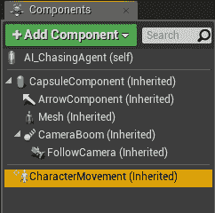

然后，在角色移动：避免选项卡中，我们只需勾选使用 RVOAvoidance。默认设置应该足够好，但如果你需要更多帮助，请随意根据你的需求调整（查看第七章，*人群*）：

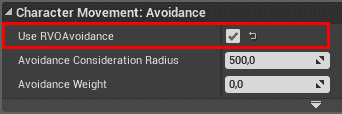

保存`AI_ChasingAgent`。因此，我们的追逐代理已经准备好放置在地图中，一旦我们实现了行为树并启动它，它将开始追逐玩家。

# 准备级别

我们已经有了*玩家*和*追逐代理*。然而，我们需要设置一个可以测试我们行为的级别。因此，我们可以复制（或者如果你更喜欢，可以直接使用）`ThirdPersonExampleMap`并将其重命名为更熟悉的名字（例如，`TestingChasingBehavior`）。

在这里，我将留给你的想象力，以便你可以为我们的角色构建一个不错的测试地图。一旦你完成了，请回到这里继续阅读。为了简单起见，我不会修改地图，但将描述应该采取的下一步。

第一步是擦除地图中可能存在的所有字符（例如，`ThirdPersonCharacter`），因为我们将会用我们的来替换它们。然后，我们将放置（通过从*内容浏览器*拖动到*视口*）一个，并且只有一个，玩家：

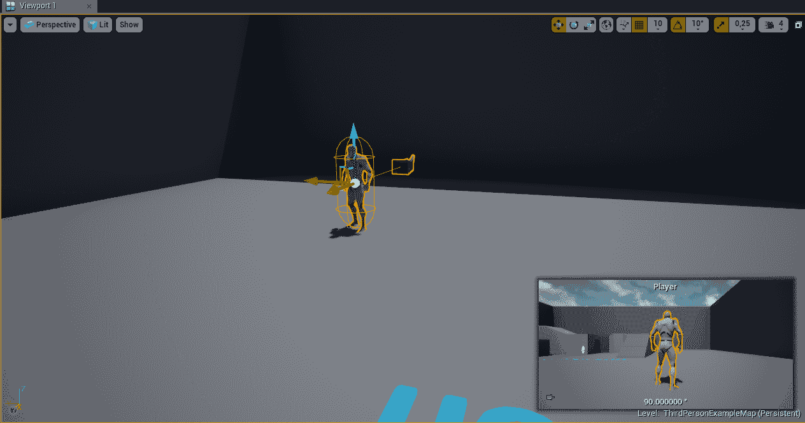

然后，我们可以以与玩家相同的方式放置几个追逐代理：

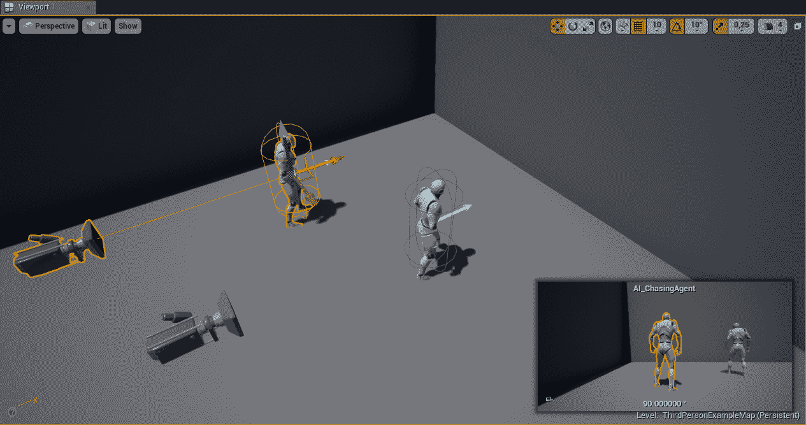

我们几乎完成了。最后一步是为该级别设置导航。实际上，我们的***随机位置查找任务***依赖于导航网格已为该级别设置。我们在第 XX 章详细介绍了导航系统，所以如果你需要进一步的帮助，请修改该章节。本节将仅描述如何快速设置我们级别的导航。

要构建导航系统，我们只需从模式面板中选择***导航网格边界体积***（通过选择*所有类标签*）并将其拖入地图中：

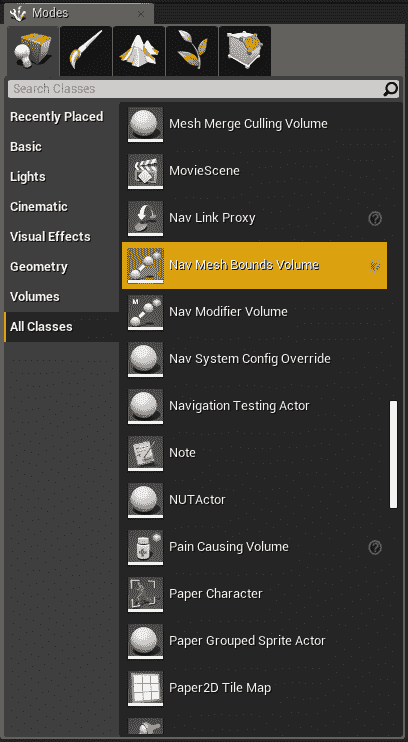

然后，你需要将其扩展以覆盖整个地图。如果你按下*P*键，你将能够预览你的*NavMesh*，如下面的截图所示：

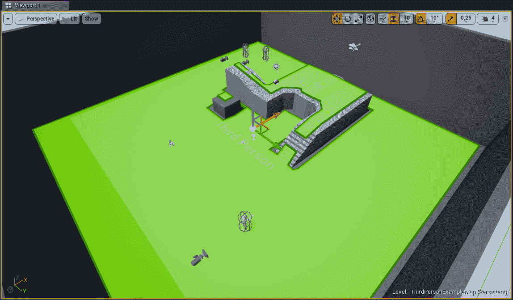

现在，我们准备出发。让我们继续进行编码部分。

# 服务 - 更新追逐行为

在我们的***预期行为***中，我们没有描述任何类似服务的内容，这是可以的——这意味着我们本身不需要类似服务来处理我们的行为。然而，每个行为树必须以某种方式更新相关值。一种方法是通过使用服务。

更新特定值的服务的类型通常（在实现上）是特定的，并且不太可能重用，但有时它们是运行行为树所必需的。此外，因为我们已经查看了一个创建*任务*和*装饰器*的实际示例，这是学习更多关于***服务***的好机会。

我们需要考虑包含在*黑板*中的变量，以及哪个需要更新。

我们需要分配的第一个变量是**玩家**。实际上，我们需要有一个对玩家 Pawn 的引用，以便当代理在视野中时它们可以追逐。然而，我们不需要每次服务更新时都更新这个值，只需在服务启动时更新。

值得注意的是，这个服务将被放置在树的开始处。每次行为树重新启动时，服务都会再次“重启”，更新玩家引用。这是有意为之的，因为如果玩家死亡，并且另一个 Pawn 生成，这个服务也会更新对新 Pawn 的引用。

然后，我们必须更新布尔变量，以确定*玩家*当前是否在*视野*中。由于这个变量将决定执行行为树中的哪个部分（在我们的情况下，装饰器如果条件不满足将会剪枝，我们将在本章后面看到），我们必须在服务的每个 tick 更新它。

最后要更新的变量是 ***Destination***（在这种情况下，玩家不在视线中）。实际上，这个变量将包含玩家刚刚离开视线的 ***最后已知玩家位置***。否则，该变量将包含我们在 *Task* 中分配的随机位置。因此，我们需要在服务的每个 tick 中检查是否更新这个变量（因为我们希望只有在玩家离开我们的代理视野时，才更新玩家最后看到的位置）。目前，玩家不再在视线中，所以我们只更新这个值一次，因为 ***最后已知玩家*** 位置不会改变，直到 *Player* 再次出现在视线中，行为树将保持它，直到不再需要，并用 *随机位置* 覆盖它。我们可以通过在服务中使用一个局部变量来实现这种行为，该变量跟踪布尔变量的最后一个值（如果玩家在视线中），如果它与服务的当前周期（tick）不同，则我们使用 ***最后已知玩家位置*** 更新 ***Destination*** 变量。

此外，值得注意的是，我们将从这个变量中获取代理控制器的值，这使得这个服务依赖于这个特定的控制器（这就是我之前说这些类型的服务不太可重用的原因）。

现在我们已经清楚地了解了我们的服务应该做什么，让我们来看看如何实现它（在蓝图和 C++中，这样你可以选择你更喜欢的方法）。

# 更新追逐行为蓝图实现

首先，我们需要创建服务并命名为 `BTService_UpdateChasingBehavior`。然后，我们需要添加一些变量。我们将第一个变量命名为 ***CanSeePlayerKey***，其类型为 *Blackboard Key Selector*，它将保存 Blackboard 中确定 AI 是否可以当前看到玩家的布尔变量的引用。当然，这个变量需要是公共的，这样它就可以从行为树中设置。第二个变量，其类型始终为 *Blackboard Key Selector*，命名为 ***PlayerKey***，是 Blackboard 中玩家 Pawn 的引用；这也必须是公共的。第三个是一个名为 ***LastKnownPositionKey*** 的公共 *Blackboard Key Selector*，但它将接收我们在上一节中讨论的 *Destination* 向量。最后一个变量是一个类型为布尔值的局部私有变量，命名为 ***LastCanSeePlayer***，它存储了 ***CanSeePlayer*** 布尔变量的上一个状态（在上一个 tick 期间）。这样，就可以知道状态是否已更改，以及是否需要更新目的地。最后，这是我们的变量在编辑器中应该出现的方式：


下一步是 *覆盖/创建* ***Receive Activation AI*** 事件，如下面的截图所示：

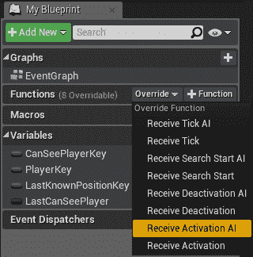

这个事件仅在服务被激活时触发，在我们的案例中，这将是每次行为树重新启动时。在这里，我们需要获取到*Player*的引用。我们可以通过使用***Get All Actor of Class***节点轻松实现这一点。我们需要提供类 player，这样我们就可以插入我们选择的*Player*类。在这种情况下，我们将使用本章开头创建的 Player 类：

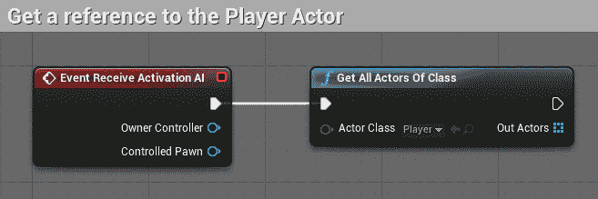

如果你想要使你的服务更加模块化，你可以将 Player 类作为一个变量传递，这样你就可以根据行为树来改变它。在 C++实现中，我们会这样做，主要是因为这样更容易引用蓝图类。

然后，我们假设游戏中只有一个玩家（否则，你应该有逻辑来找到正确的玩家去追逐；可能是最近的那个？）并从数组中获取它。最后，我们使用**Set Blackboard Value as Object**节点将其保存到黑板的**Player Key** *对象引用*中。这是事件的最终图表：

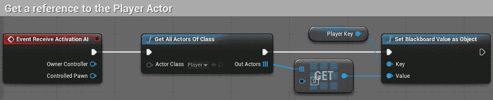

现在，我们需要**覆盖/创建****Receive Tick AI**事件，如下面的截图所示：

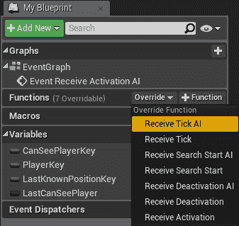

我们可以做的第一件事是将所有者控制器转换为我们在前面创建的控制器类：

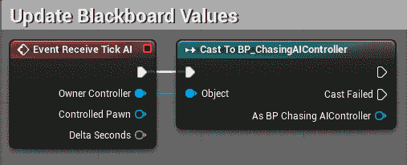

你也可以使用`ChasingAIController`（用 C++编写的非蓝图版本）。然而，如果你这样做，你将无法访问它的变量。即使它们被声明为 public，如果没有在它们之前使用`***UPROPERTY()***`宏，它们对蓝图来说就是不可见的。所以，如果你想使用控制器的 C++版本，确保在每个变量之前添加`UPROPERTY()`宏（带有适当的参数），以便它们对蓝图也是可见的。

现在，如果转换成功，我们可以从`BP_ChasingAIController`中收集到**CanSeePlayer**变量的引用。然后，通过使用**CanSeePlayerKey**变量，我们可以使用**Set Blackboard Value as Bool**在黑板上设置其值。这是我们到目前为止的图表：

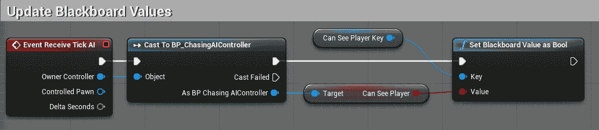

接下来，我们需要比较这个值（当前的**CanSeePlayer**布尔值）与存储在**LastCanSeePlayer**变量中的值（存储上一次 Tick 的值）。我们可以通过使用**Equal**节点和**Branch**来实现这一点，如下面的截图所示：


如果这两个值不同，那么我们需要从`BP_ChasingAIController`中检索**LastKnownPlayerPosition**并将其通过**LastKnownPlayerPositionKey**变量设置在黑板上：

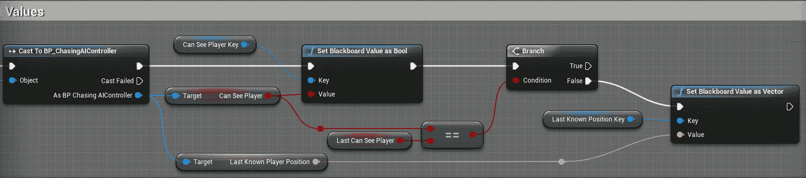

最后，无论我们是否更新了这个向量（在*True*和*False*分支中），我们都需要使用当前值更新**LastCanSeePlayer**变量。这是图的最后一部分：


保存*服务*，我们终于准备好构建我们的*行为树*了！

如果您在*行为树*中添加这个服务，它看起来会是这样：

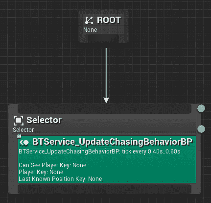

*服务*的*详细信息面板*（在行为树编辑器中）应该如下所示：

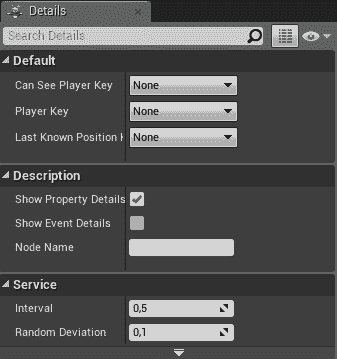

在下一节中，我们将实现这个*服务在 C++中*，并将有许多事情需要考虑。当然，您也可以在 C++中重复这个过程来提高您的技能；否则，您可以跳到下一节，我们将构建我们的行为树。

# 更新追逐行为 C++实现

在本节中，我们将重新创建*C++中的*更新追逐行为服务*。

让我们从创建一个新的类开始，该类继承自**BTService**：

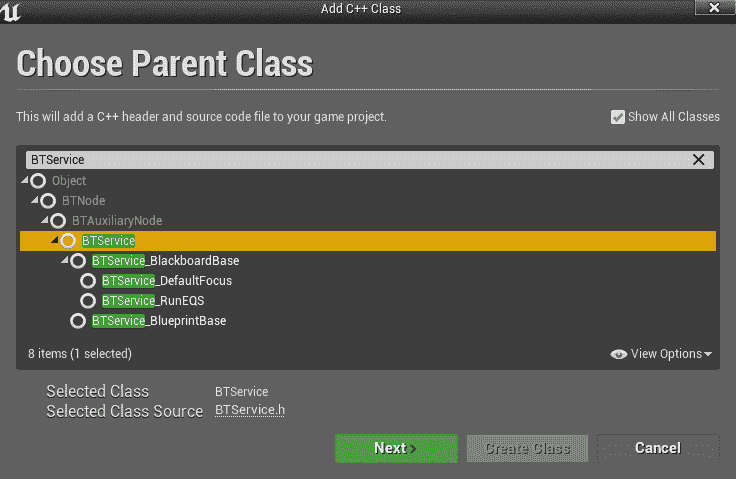

我们将重命名我们的类`BTService_UpdateChasing`并将其放置在`AI`文件夹中，就像我们在前面的章节中对其他 AI 类所做的那样：

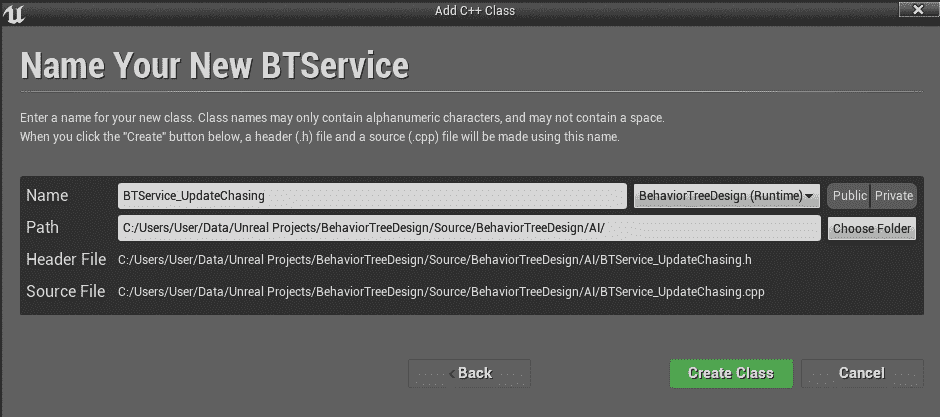

在代码创建之后，如果无法编译，请确保您遵循了前面的章节。实际上，我们已经将**GameplayTasks**和**AIModule**添加到了我们项目的公共依赖中。为了您的方便，以下是我们在前面的章节中所做的工作：

您需要更改您的`.cs`文件（在我们的例子中，是***BehaviorTreeDesign.cs****）并添加**GameplayTasks**和**AIModule**作为公共依赖，如下面的代码所示：

`PublicDependencyModuleNames.AddRange(new string[] { "Core", "CoreUObject", "Engine", "InputCore", "HeadMountedDisplay", **"GameplayTasks", "AIModule"** });`

现在，您应该能够编译而不会出现任何问题。

下一步是在头文件中为我们的服务添加一些变量。我们可以调用第一个 **CanSeePlayerKey**，其类型为黑板键选择器（Blackboard Key Selector），它将持有黑板上确定 AI 是否可以当前看到玩家的布尔变量的引用。当然，这个变量需要设置 `UPROPERTY()`，以便可以从行为树中设置。第二个变量，总是类型为黑板键选择器（Blackboard Key Selector），命名为 **PlayerKey**，是黑板上玩家 Pawn 的引用；这也需要 `UPROPERTY()` 宏。第三个是一个名为 **LastKnownPositionKey** 的另一个黑板键选择器，总是带有 `UPROPERTY()` 宏，但它将接收黑板中的目标向量，正如我们之前讨论的那样。最后一个变量是一个类型为布尔值的局部私有变量，命名为 "***Last*CanSeePlayer**"，它存储了 **CanSeePlayer** 布尔变量的上一个状态（在上一个 Tick 期间）。这样，就可以知道状态是否已更改，以及是否需要更新目标。

以下代码需要插入到头文件中：

```py
 UPROPERTY(EditAnywhere, Category = Blackboard)
  FBlackboardKeySelector CanSeePlayerKey;

  UPROPERTY(EditAnywhere, Category = Blackboard)
  FBlackboardKeySelector PlayerKey;

  UPROPERTY(EditAnywhere, Category = Blackboard)
  FBlackboardKeySelector LastKnownPositionKey;

private:

  bool bLastCanSeePlayer;
```

现在，我们需要另一个变量——不是用于服务的逻辑，就像之前的案例一样，而是一个用于从行为树中选择玩家类（Player class）的变量。我们将这个变量命名为 **PlayerClass**，其类型为 **TSubclassOf<AActor>**，这样我们就可以选择任何从 AActor 继承的类。当然，这个变量也需要有 `UPROPERTY()` 宏，以便它可以直接从行为树中发送：

我们将镜像服务的蓝图版本，其中我们找到该类的所有演员，并假设只有一个。在本章的结尾，将提出一种不同的方法。

```py
  UPROPERTY(EditAnywhere, Category = PlayerClass)
  TSubclassOf<AActor> PlayerClass;
```

下一步是声明一些函数，以便我们可以覆盖/创建蓝图 **Receive Activation AI** 和 **Receive Tick AI** 事件的 C++ 版本。这些分别称为 `OnBecomingRelevant()` 和 `TickNode()`，覆盖它们的签名如下：

```py
protected:

  virtual void OnBecomeRelevant(UBehaviorTreeComponent& OwnerComp, uint8* NodeMemory) override;

  virtual void TickNode(UBehaviorTreeComponent& OwnerComp, uint8* NodeMemory, float DeltaSeconds) override;
```

最后，我们需要为我们的服务声明一个构造函数。您很快就会明白为什么：

```py
 UBTService_UpdateChasing(const FObjectInitializer& ObjectInitializer = FObjectInitializer::Get());
```

现在，在 `.cpp` 文件中，我们需要实现这些函数。

让我们从构造函数开始。在这个函数中，我们需要为我们的服务初始化一些值；特别是，我们想要通知（通过将相应的变量设置为 true）我们想要使用 `OnBecomeRelevant()` 函数。即使这不是必需的，因为这个变量默认设置为 *true*，但在构造函数中明确设置这类变量的值是一种非常好的做法。既然我们在这里，关闭对 `OnCeaseRelevant()` 函数（`OnBecomeRelevant()` 的逆函数）的调用也是值得的。以下代码显示了包含我们需要设置的布尔变量名称的构造函数：

```py
UBTService_UpdateChasing::UBTService_UpdateChasing(const FObjectInitializer& ObjectInitializer)
  : Super(ObjectInitializer)
{
 bNotifyBecomeRelevant = true;
 bNotifyCeaseRelevant = false;
}
```

下一个要实现的事件是`OnBecomRelevant()`，它仅在服务变得相关（被激活）时触发，在我们的案例中，这将是每次行为树重新启动时。在这里，我们需要获取玩家的引用，以便我们可以在黑板中存储它。首先，我们需要检索黑板组件：

```py
void UBTService_UpdateChasing::OnBecomeRelevant(UBehaviorTreeComponent & OwnerComp, uint8 * NodeMemory)
{

 //Get Blackboard Component
 UBlackboardComponent* BlackboardComp = OwnerComp.GetBlackboardComponent();
 if (BlackboardComp == NULL)
 {
 return;
 }

 *//[REST OF THE CODE]* 
}
```

然后，我们需要使用类似于蓝图节点`GetAllActorsOfClass`的方式来检索玩家。具体来说，我们将创建一个空的`TArray<AActor*>`并使用`UGameplayStatics::GetAllActorsOfClass()`函数绕过世界、玩家类和空数组。现在，这个函数将填充我们的数组：

```py
void UBTService_UpdateChasing::OnBecomeRelevant(UBehaviorTreeComponent & OwnerComp, uint8 * NodeMemory)
{
  //Get Blackboard Component
  UBlackboardComponent* BlackboardComp = OwnerComp.GetBlackboardComponent();
  if (BlackboardComp == NULL)
  {
    return;
  }

 //Retrieve Player and Update the Blackboard
 TArray<AActor*> FoundActors;
 UGameplayStatics::GetAllActorsOfClass(GetWorld(), PlayerClass, FoundActors);

 *//[REST OF THE CODE]* 
}
```

接下来，我们假设游戏中只有一个玩家（否则，你需要找到正确的玩家来追逐；可能是最近的那个？）并检查数组的第一个元素是否有效，如果是，我们使用**PlayerKey**变量将其保存在黑板组件中。

这是执行此操作的代码：

```py
void UBTService_UpdateChasing::OnBecomeRelevant(UBehaviorTreeComponent & OwnerComp, uint8 * NodeMemory)
{
  //Get Blackboard Component
  UBlackboardComponent* BlackboardComp = OwnerComp.GetBlackboardComponent();
  if (BlackboardComp == NULL)
  {
    return;
  }

  //Retrieve Player and Update the Blackboard
  TArray<AActor*> FoundActors;
  UGameplayStatics::GetAllActorsOfClass(GetWorld(), PlayerClass, FoundActors);
 if (FoundActors[0]) {
 BlackboardComp->SetValueAsObject(PlayerKey.SelectedKeyName, FoundActors[0]);
 }
}
```

再次，我们已经镜像了蓝图服务。

此外，在 C++中，我们可以进行额外的一步，如果*Key*已经设置（这是在蓝图中所不能做的），则避免再次设置*Player*。因此，我们可以添加这个*if 语句*：

```py
void UBTService_UpdateChasing::OnBecomeRelevant(UBehaviorTreeComponent & OwnerComp, uint8 * NodeMemory)
{

  //Get Blackboard Component
  UBlackboardComponent* BlackboardComp = OwnerComp.GetBlackboardComponent();
  if (BlackboardComp == NULL)
  {
    return;
  }

 if (!PlayerKey.IsSet()) {
    //Retrieve Player and Update the Blackboard
    TArray<AActor*> FoundActors;
    UGameplayStatics::GetAllActorsOfClass(GetWorld(), PlayerClass, FoundActors);
    if (FoundActors[0]) {
      UE_LOG(LogTemp, Warning, TEXT("Found Player"));
      BlackboardComp->SetValueAsObject(PlayerKey.SelectedKeyName, FoundActors[0]);
    }
 }

}
```

现在，关于`TickNode()`函数的实现，我们首先检索*黑板组件*：

```py
void UBTService_UpdateChasing::TickNode(UBehaviorTreeComponent & OwnerComp, uint8 * NodeMemory, float DeltaSeconds)
{

 //Get Blackboard Component
 UBlackboardComponent* BlackboardComp = OwnerComp.GetBlackboardComponent();
 if (BlackboardComp == NULL)
 {
 return;
 }

 *//[REST OF THE CODE]*

}
```

然后，我们需要从`OwnerComp`中检索 AI 控制器并检查其是否有效：

```py
void UBTService_UpdateChasing::TickNode(UBehaviorTreeComponent & OwnerComp, uint8 * NodeMemory, float DeltaSeconds)
{

 *//[PREVIOUS CODE]*

 //Get AI Controller
 AAIController* AIController = OwnerComp.GetAIOwner();
 if (!AIController) {
 return;
 }

 *//[REST OF THE CODE]*

}
```

一旦我们有了 AI 控制器，我们需要将其**转换**为我们的`AChasingAIController`（我们在上一章中创建的）并检查其有效性。因此，此服务仅当 AI 代理由`ChasingAIController`控制时才会工作：

```py
void UBTService_UpdateChasing::TickNode(UBehaviorTreeComponent & OwnerComp, uint8 * NodeMemory, float DeltaSeconds)
{

 *//[PREVIOUS CODE]*

 //Get ChasingAIController (the controller we have created in the previous chapter)
 AChasingAIController* ChasingController = Cast<AChasingAIController>(AIController);
 if (!ChasingController) {
 return;
 }

 *//[REST OF THE CODE]*

}
```

从`ChasingAIController`中，我们可以通过使用`CanSeePlayerKey`变量检索（当前）**CanSeePlayer**并将其保存在黑板中：

```py
void UBTService_UpdateChasing::TickNode(UBehaviorTreeComponent & OwnerComp, uint8 * NodeMemory, float DeltaSeconds)
{

 *//[PREVIOUS CODE]*

 //Update the Blackboard with the current value of CanSeePlayer from the Chasing Controller
 BlackboardComp->SetValueAsBool(CanSeePlayerKey.SelectedKeyName, ChasingController->bCanSeePlayer);

 *//[REST OF THE CODE]*

}
```

如果私有`LastCanSeePlayer`变量（包含上一次 Tick 的`CanSeePlayer`的值）与当前的`CanSeePlayer`不同（这意味着玩家要么进入了我们的代理的视线，要么离开了），那么从`ChasingAIController`中检索`LastKnownPlayerPosition`并使用`LastKnonwPositionKey`变量将其保存在黑板中：

```py
void UBTService_UpdateChasing::TickNode(UBehaviorTreeComponent & OwnerComp, uint8 * NodeMemory, float DeltaSeconds)
{

 *//[PREVIOUS CODE]*

 //If the LastCanSeePlayer is different from the current one, then update the LastKnownPlayerPosition
 if (ChasingController->bCanSeePlayer != bLastCanSeePlayer) {
 BlackboardComp->SetValueAsVector(LastKnownPositionKey.SelectedKeyName, ChasingController->LastKnownPlayerPosition);
 }

 *//[REST OF THE CODE]*

}
```

在之前的检查之后，我们需要使用当前的值更新`LastCanSeePlayer`，以便在下一个 Tick 中我们将有正确的值：

```py
void UBTService_UpdateChasing::TickNode(UBehaviorTreeComponent & OwnerComp, uint8 * NodeMemory, float DeltaSeconds)
{

 *//[PREVIOUS CODE]*

 //Update the LastCanSeePlayer with the current CanSeePlayer
 bLastCanSeePlayer = ChasingController->bCanSeePlayer;

 *//[REST OF THE CODE]*

}
```

最后，我们可以调用父`TickNode()`（按照良好实践）：

```py
void UBTService_UpdateChasing::TickNode(UBehaviorTreeComponent & OwnerComp, uint8 * NodeMemory, float DeltaSeconds)
{

 *//[PREVIOUS CODE]*

 //Call to the parent TickNode
 Super::TickNode(OwnerComp, NodeMemory, DeltaSeconds);

}
```

我们服务的代码现在已完成。为了方便起见，以下是`TickNode()`函数的代码：

```py
void UBTService_UpdateChasing::TickNode(UBehaviorTreeComponent & OwnerComp, uint8 * NodeMemory, float DeltaSeconds)
{

  //Get Blackboard Component
  UBlackboardComponent* BlackboardComp = OwnerComp.GetBlackboardComponent();
  if (BlackboardComp == NULL)
  {
    return;
  }

  //Get AI Controller
  AAIController* AIController = OwnerComp.GetAIOwner();
  if (!AIController) {
    return;
  }

  //Get ChasingAIController (the controller we have created in the previous chapter)
  AChasingAIController* ChasingController = Cast<AChasingAIController>(AIController);
  if (!ChasingController) {
    return;
  }

  //Update the Blackboard with the current value of CanSeePlayer from the Chasing Controller
  BlackboardComp->SetValueAsBool(CanSeePlayerKey.SelectedKeyName, ChasingController->bCanSeePlayer);

  //If the LastCanSeePlayer is different from the current one, then update the LastKnownPlayerPosition
  if (ChasingController->bCanSeePlayer != bLastCanSeePlayer) {
    BlackboardComp->SetValueAsVector(LastKnownPositionKey.SelectedKeyName, ChasingController->LastKnownPlayerPosition);
  }

  //Update the LastCanSeePlayer with the current CanSeePlayer
  bLastCanSeePlayer = ChasingController->bCanSeePlayer;

  //Call to the parent TickNode
  Super::TickNode(OwnerComp, NodeMemory, DeltaSeconds);

}
```

保存并编译服务。现在，你可以在行为树中使用它了。

这就是服务放置在行为树中的样子：

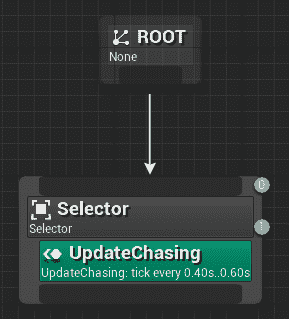

服务（在*行为树编辑器*中的*详细信息面板*）应如下所示：

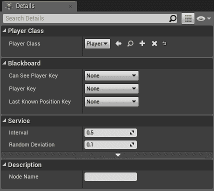

在我们继续之前，就像我们对 *Decorator* 和 *Task* 所做的那样，将静态描述添加到 *Service* 中是一种良好的实践，这样我们就可以可视化我们分配了哪些键（*Blackboard Key Selector* 变量），以及 *Player* 类。在这里，我们需要在头文件中添加函数的签名，如下所示：

```py
protected:

 virtual FString GetStaticDescription() const override;
```

对于实现（在 `.cpp` 文件中），我们只需返回一个格式化的 *FString*，其中包含我们需要显示的所有信息。我们可以使用 `Printf()` 函数轻松地格式化字符串。我在这里使用 `Append()` 函数来提高每一行的清晰度。特别是，我们需要显示哪一行是针对 `PlayerClass` 的，以及我们分配给每个 *Blackboard Key Selector* 变量的哪些值：

```py
FString UBTService_UpdateChasing::GetStaticDescription() const
{
  return FString::Printf(TEXT("%s: '%s'"), TEXT("Player Class"), PlayerClass ? *PlayerClass->GetName() : TEXT(""))
    .Append(FString::Printf(TEXT("\n%s: '%s'"), TEXT("PlayerKey"), PlayerKey.IsSet() ? *PlayerKey.SelectedKeyName.ToString() : TEXT("")))
    .Append(FString::Printf(TEXT("\n%s: '%s'"), TEXT("LastKnownPositionKey"), LastKnownPositionKey.IsSet() ? *LastKnownPositionKey.SelectedKeyName.ToString() : TEXT("")))
    .Append(FString::Printf(TEXT("\n%s: '%s'"), TEXT("CanSeePlayerKey"), CanSeePlayerKey.IsSet() ? *CanSeePlayerKey.SelectedKeyName.ToString() : TEXT("")));
}
```

现在，在行为树中，服务将如下所示：

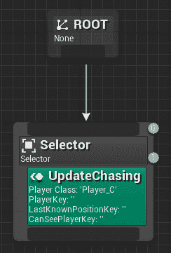

现在我们已经实现了 *Service*，我们准备在下一章构建我们的 *行为树*！

# 摘要

在这一章中，我们继续深入探讨了如何创建 **行为树** 的示例，并使用了迄今为止遇到的所有系统。

尤其是我们可以看到如何设置**测试环境**并创建**玩家角色**和追逐代理。后者需要正确的控制器，并且还需要激活*RVO 避障*。

然后，我们实现了我们的 **更新追逐行为服务**，并探讨了如何在 C++ 和 Blueprint 中实现。

在下一章中，我们将继续这个示例并构建最终的行为树。到下一章结束时，我们将完成这个项目，并拥有我们的 **追逐行为**。所以，让我们继续前进！
