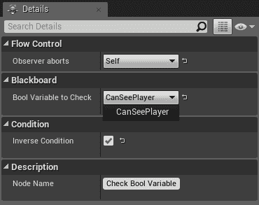

# 设计行为树 - 第三部分

本章是上一章的延续，是**设计行为树**的最后一部分。我们将完成我们开始的工作。特别是，我们将构建最终的行为树并使其运行。

特别是，我们将涵盖以下主题：

+   生成**黑板**和**行为树**资产

+   设置黑板（**Blackboard**）以便与行为树一起使用

+   实现行为树（使用蓝图或 C++节点）以创建追逐行为

+   **使行为树运行**（在蓝图或 C++中）

+   **改进行为树的 C++节点**以更好地符合最佳实践

再次强调，我们将同时在蓝图和 C++中实现一切，以给你一个更广泛的想法，了解你可以使用什么。或者，如果你已经知道你想要使用什么，你只需遵循两种实现中的任何一个。

这将结束我们从零开始设计行为树的旅程，最终我们将拥有完整的功能追逐行为。

因此，无需多言，让我们开始构建行为树！

# 构建行为树

创建追逐行为的最后一步是构建行为树。

在这个阶段，如果你觉得你遗漏了什么，只需回顾一下**预期行为**（我们在第八章中描述的那个）并**制作一个清单**，列出你需要构建这个行为树所需的内容。然而，即使你确实遗漏了什么，也不要担心——你可以在稍后阶段创建它。

许多开发者开始开发行为树，并在需要时构建节点。除非你真的很擅长或者树特别简单，否则始终建议提前做一些规划，就像我们在前两章中所做的那样。通过这样做，你将避免以后出现很多头痛的问题，并且通过在开始时稍微增加一些工作量，你可以避免大量的错误修复时间成本。当然，你仍然需要进行错误修复，但规划应该会减少引入错误或实现与最初计划不同的行为的机会。

从现在开始，你可以使用蓝图和 C++实现（如果你之前两者都使用过），或者只坚持使用你迄今为止一直在使用的那个。我将使用蓝图实现中的名称，但使用我们的 C++节点的概念是完全相同的。最后，我会展示一个使用 CPP 节点构建的行为树截图。

值得注意的是，我们还可以创建一个混合树。实际上，我们可以在同一个树中使用 C++和蓝图节点。由于在我们的案例中，我们在蓝图和 C++中都有每个节点的副本，我们可以随意使用任何一种。然而，这并不正确，因为我们已经创建了一些依赖于特定于该实现的 C++ AI 控制器的节点。幸运的是，在一个项目中，您不会对一切都有副本，所以如果您有一个特定的 AI 控制器，蓝图和 C++节点都应该引用同一个。

在您项目的开发过程中，请记住，您可以在 C++中创建一些*行为树*节点，在蓝图中也创建一些。一些开发者使用蓝图原型化他们的节点，然后将开发转移到 C++。尝试找到 C++和蓝图之间的公式和最佳平衡，这对您或您的团队来说是最有效的。

首先，如果您还没有创建，请创建*行为树资产*和*黑板*。在我的情况下，我将把*行为树*命名为***BT_ChasingBehavior***，黑板命名为***BB_ChasingBlackboard***。两者都放在 AI 文件夹中（我们创建蓝图节点的地方），如图所示：


您可以通过创建子文件夹来稍微重新排列`AI`文件夹。例如，您可以为您的设计器创建一个子文件夹，为您的任务创建另一个子文件夹，为您的服务创建第三个子文件夹。无论如何，这是一个相对较小的示例，所以我们将保持文件夹不变。

# 设置黑板

让我们从打开*黑板编辑器*（双击资产）开始。如您所回忆的那样，我们需要有一个玩家引用。

因此，创建一个类型为***对象***的***新键***：


将其重命名为***Player***，然后在*详情面板*下，在***键类型***（可能需要展开此选项），将***基础类***设置为我们的选择（例如，***Player***，我们在本章开头创建的类），如图所示：


下一个要添加的*键*是***目的地***，其类型为 Vector。当玩家不在视线范围内时，这将有助于确定一个目标。说到这里，我们需要一个名为***CanSeePlayer***的第三个键，类型为*布尔值*，用于检查玩家当前是否在视线范围内。这就是*黑板*应该看起来像的样子：


# 构建树

双击***BT_ChasingBehavior***资产以打开*行为树编辑器*。确保您已选择树中的***BB_ChasingBlackboard***，如图所示：


从**根**节点开始，我们需要一个**选择器**。这个**选择器**将是树将分为两个分支的地方：一个是在视线中追逐玩家时，另一个是在他/她不在视线中时。在这个**选择器**上，我们需要附加我们的**BTService_UpdateChasingBehavior**服务（或者如果您愿意，它的 C++版本，命名为**UpdatedChasing**）。别忘了在**详细面板**中分配所有变量（**三个黑板变量**），如下面的截图所示：


在 C++版本中，我们还需要分配玩家类，以及黑板变量（因为这是我们用 C++设计服务的方式）。因此，您将得到类似以下的内容：


一旦我们分配了所有变量，那么当附加到**选择器**节点时，我们的服务在**行为树**中的样子如下所示：


从**选择器**中添加两个**序列**节点（每个代表树的两个分支）。**选择器**将选择哪个取决于我们将放置在这两个节点上的装饰器。

将两个**序列**节点添加到**BTDecorator_CheckBoolVariableBP**（或其 C++版本的**CheckBoolVariable**）。在详细面板中，需要将**要检查的布尔变量**变量设置为**CanSeePlayer**黑板键，如下面的截图所示：


然而，对于右侧的序列，您应该将**逆条件**复选框设置为**true**。通过这样做，我们可以检查**CanSeePlayer**是否设置为**false**。这有点啰嗦，但以下是详细面板中的最终结果：


到目前为止，我们的树看起来如下所示：


从左侧的序列节点，我们只需使用**移动到**任务来追踪玩家。您需要选择**玩家**黑板变量作为**黑板键**，如下面的截图所示：


这是树的当前阶段：


从右侧的**序列**节点，我们需要两个任务。第一个是**移动到**，但这次选择**目的地**变量作为**黑板键**，如下面的截图所示：


这就是到目前为止的树的样子：


第二个*任务*是我们已经创建的，***BTTask_FindRandomLocationBP***（或 C++版本的***Find Random Location***）。我们需要将***DestinationKey***设置为***Destination*** *黑板变量*，至于***Radius***，我们可以选择一个值（例如 30000，是默认值的十倍）。这就是*详细信息*面板的样子：


这就是完整的树应该看起来像的样子：


看起来我们已经完成了，但我们还有一件事要做。事实上，目前，装饰器在 AI 执行子树时不会控制子树的流程。事实上，我们希望如果玩家不再在视野中，就中止移动到玩家的任务；另一方面，如果智能体正在前往随机位置，我们希望如果玩家再次出现在视野中，智能体去追逐玩家。

要实现这一点，我们需要选择我们的***装饰器***（一次一个）并将***观察者中止***设置为***自我***，如下面的截图所示：


如果装饰器仍然被选中，将要被中止的节点将在树中高亮显示：


树略微改变以反映这种行为（在***装饰器***下，显示中止条件）：


如果你使用 C++节点构建了树，你将得到类似这样的东西：


此外，你应该注意，在节点名称下方，并非所有信息都会显示（例如，在*装饰器*中，它不会说明其条件是否反转以及中止条件是什么）。在章节的后面，我们也会解决这个问题。

如你所见，结构非常简单（我见过在不同的树中实现相同的行为），但它包含了设计行为树的所有主要概念（包括创建每种类型的节点：***装饰器***、***服务***和***任务***）。结构简单并不意味着代表它的行为也简单。事实上，我们构建的是一个非常好的***追逐行为***！

我们还没有涉及到简单的并行节点，但那些在更复杂的树中用于特定子树的行为。你不必担心——一旦你开始掌握创建*行为树*的艺术，使用简单并行节点将变得自然。

最后要做的事情是让这个*行为树*运行，然后在游戏中对其进行测试！

# 运行行为树

我们已经创建了整个设置，包括演员、控制器、感知和导航。然而，我们没有使这个行为树在我们的智能体上运行的任何代码。当然，我们将涵盖蓝图案例和 C++案例。

# 使用蓝图控制器运行行为树

如果我们已设置蓝图控制器，我们可以轻松地修改它，以便立即运行行为树。

事实上，一旦我们打开编辑器，我们可以在重写*Event OnPossess*后添加*运行行为树*节点，并选择正确的*行为树*，如图所示：


保存它，然后你就可以开始了！运行游戏，看看它是否工作（当然，AI 控制器需要设置为**BP_ChasingAIController**）。

# 使用 C++控制器运行行为树

不幸的是，对于 C++来说，这并不像我们已经在第二章*行为树和黑板*中看到的那样直接。特别是，我们有两种选择：我们硬编码值或使用蓝图获取树的引用。

第一个选项对于这类东西不太实用，而且也不是最佳实践。

对于第二种选项，我们有多种选择。特别是，我建议你在控制器中创建一个*行为树*变量并使用它，以便它可以在`OnPossess()`函数上运行。然后，我们可以在蓝图中的这个类中创建一个子类，在那里我们可以轻松地分配这个变量。最后，我们可以更改对**AIChasingAgent**控制器的引用。

或者，你可以将*行为树*放在 AI 将要控制的*Character/Pawn*上，就像我们在*第二章*中所做的那样。这将是最理想的方法；然而，在这个时候，看到不同的替代方案是好的，以防你处于需要直接在控制器上使用*行为树*的情况。

让我们从打开我们的 C++控制器头文件并添加以下公共变量开始（使用`UPROPERTY()`宏，因为它需要在蓝图中进行编辑）：

```py
  UPROPERTY(EditAnywhere)
  UBehaviorTree* BehaviorTree;
```

然后，我们需要重写`OnPossess()`函数：

```py
   virtual void OnPossess(class APawn* InPawn) override;
```

接下来，在`.cpp`文件中，我们需要包含*行为树类*，因此我们需要添加以下语句：

```py
#include "BehaviorTree/BehaviorTree.h"
```

最后，在`OnPossess()`的实现中，我们只需运行行为树：

```py
void AChasingAIController::OnPossess(APawn * InPawn)
{
  Super::OnPossess(InPawn);
  if (BehaviorTree != nullptr) {
    RunBehaviorTree(BehaviorTree);
  }
}
```

编译代码后，我们可以在 C++控制器上右键单击并选择**基于 ChasingAIController 创建蓝图类**，如图所示：


然后，我们可以将这个蓝图放在 AI 文件夹中，命名为**CPP_ChasingAIController**（以区分*BP_ChasingAIController*）：


它的*蓝图编辑器*应该会自动打开（如果没有，只需双击资产打开它）。在*详细信息面板*中设置**行为树**变量，如图所示（当然，我们需要设置*行为树*的*C++版本*）：


编译并保存*蓝图*。

最后，在***AI_ChasingAgent***蓝图上，让我们更改其设置（从***Pawn***选项卡中的*详细信息*面板），使其使用新的控制器：


这就结束了如何在*C++控制器*上运行*行为树*。

# 错误修正

如果你以为你已经完成了，嗯，那还不是。事实上，在设计行为树时，必须始终有一个调试阶段，检查一切是否按预期工作。实际上，我故意构建了一个不工作的树。你能找出问题吗？在继续阅读之前试一试。

第一个问题在于，直到玩家出现在视野中，黑板上的目的地键永远不会初始化。此外，还有一个问题，当 AI 敌人寻找玩家的最后一个已知位置，但不可达时，它将失败任务。结果，序列将不允许进入下一个任务以选择一个*随机目的地*。我们如何解决这个问题？在继续阅读之前让我们试一试。

有许多方法可以做到这一点。例如，你可能想过使用“*强制成功*”装饰器。这绝对不是一个坏主意，实际上，这就是你可能会使用这个装饰器的情况（向序列添加一个可选分支，这样即使“移动到”失败，我们仍然可以选择一个随机目的地）。不幸的是，它与其他两个装饰器的设置不太兼容。

因此，另一种解决方案是以下方式修改树。我们需要将第二个序列替换为一个选择器，并有两个序列作为子节点。在第一个序列中，我们放置我们的“移动到任务”然后是“找到随机目的地”。在另一个序列中它们是相反的。结果，如果跟随最后一个已知玩家位置的任务失败，树可以回退到“找到一个随机位置”。如果你愿意，你也可以从第二个序列中移除最后一个“移动到”，但我留下它以提高清晰度；特别是对于那些难以理解*行为树*工作原理的人来说。最后，这是行为树（蓝图版本）应该看起来像的：


这就是 C++版本应该改变的样子（下一节中的更改已经在这个图片中实现）：


当然，解决方案不是唯一的，你可能会找到更好的方法来做这件事。

关于我们的第一个问题，即*目的地*永远不会初始化？嗯，有了提出的解决方案，我们就不再有这个问题了，因为如果第一个*序列*（在右分支）失败，那么第二个将把*目的地*设置为一个*随机位置*。实际上，在调试行为树时，你总是需要小心每个修改以及它对整个树的影响。想象一下复杂行为的情况，你就可以得到这种任务所需时间的概念。

一旦我们解决这个问题，我们就可以检查其他错误，或者尝试改进设置。以下是一些其他问题，我将留给你去解决，以便练习使用行为树：

+   当行为树开始执行时，*目的地*被设置为零向量。这意味着，如果 AI 没有看到玩家，它将直接前往*世界原点*。你能尝试避免这种情况吗？试着思考一下，我们有哪些不同的选择？最好的选择是在范围内有一个随机目的地。我们如何实现这一点？

+   目前，当我们进行感知系统中的转换时，我们只是选择一个更广泛的*BehaviorTreeDesignCharacter*类。然而，如果你在级别中有多个 AI，这会导致问题。你该如何解决这个问题？当然，你可以将转换改为更具体的东西，仅将其限制为玩家。但如果你不能这样做，因为玩家和友军 AI 必须共享同一个类，你该怎么办？你可以尝试使用不同的队伍来区分敌人、盟友和中立者；回想一下第五章。

当然，这只是一个非常小的行为树示例，但要详细讲解它需要三个完整的章节。我将留给你探索游戏中的行为树，但在那之前，下一节将讨论一些关于如何改进 C++代码的建议。

# 进一步改进（仅限 C++）

我们通过编程不同的节点创建了一个非常好的行为树。然而，当你在一个大项目或与其他团队成员一起工作时，你应该确保你的节点尽可能稳固。实际上，在 C++实现中，我们在节点中添加了一个静态描述，以显示设置了哪些变量，这真是太棒了。但我们还能做更多！

本节将指导你进一步改进 C++节点。

# 节点名称

Unreal 在 C++行为树节点方面做得很好，通过去除前缀（例如"***BTTask_***")，直接显示任务（或装饰器或服务）的名称。在蓝图界面中，它保留了整个前缀，如下面的截图所示：


正如我们在前面的章节中看到的，你可以通过更改“*详情*”面板中的“***节点名称***”属性来修改将显示的名称：


这在行为树中得到了反映：


因此，当你编写 C++节点时，一个好的做法是提供一个默认的***节点名称***。你可以通过在构造函数中简单地分配它来实现这一点。所以，让我们为我们创建的所有三个 C++节点做这件事。

在*装饰器*头文件中，我们需要添加构造函数的声明：

```py
 UBTDecorator_CheckBoolVariable(const FObjectInitializer& ObjectInitializer = FObjectInitializer::Get());
```

在`.cpp`文件中的实现很简单，因为我们只需要添加以下内容：

```py
UBTDecorator_CheckBoolVariable::UBTDecorator_CheckBoolVariable(const FObjectInitializer & ObjectInitializer)
  : Super(ObjectInitializer)
{
  NodeName = "Check Bool Variable";
}
```

这是最终结果：


我们也需要对我们的任务做同样的事情。所以，让我们在头文件中声明构造函数：

```py
 UBTTaskNode_FindRandomLocation(const FObjectInitializer& ObjectInitializer = FObjectInitializer::Get());
```

它在`.cpp`文件中的实现如下：

```py
UBTTaskNode_FindRandomLocation::UBTTaskNode_FindRandomLocation(const FObjectInitializer & ObjectInitializer)
  : Super(ObjectInitializer)
{
  NodeName = "Find Random Location";
}
```

这就是它在行为树编辑器中的样子：


最后，我们已经有了我们的 Service 构造函数，所以我们只需要在`.cpp`文件中添加一行：

```py
UBTService_UpdateChasing::UBTService_UpdateChasing(const FObjectInitializer& ObjectInitializer)
  : Super(ObjectInitializer)
{
 NodeName = "Update Chasing Behavior";

  bNotifyBecomeRelevant = false;
  bNotifyCeaseRelevant = true;
}
```

该服务将在行为树编辑器中显示一个漂亮的名字：


# 对装饰器的更好描述

正如我们之前提到的，当我们使用装饰器的 C++版本时，我们无法看到条件是否反转，或者中止设置。

要将它们添加到我们的静态描述中，我们需要稍微修改一下代码。幸运的是，描述所有这些属性的头部文件在我们装饰器的父类中给出，所以我们不需要从头编写代码。我们需要将父函数的返回值（通过使用`Super::GetStaticDescription()`函数）存储在一个本地的 FString 变量中。

然后，我们可以添加几行新代码，并附加我们创建的原生静态描述。最后，我们返回新的变量：

```py
FString UBTDecorator_CheckBoolVariable::GetStaticDescription() const
{
  FString ReturnDesc = Super::GetStaticDescription();
  ReturnDesc += "\n\n";
  ReturnDesc += FString::Printf(TEXT("%s: '%s'"), TEXT("Bool Variable to Check"), BoolVariableToCheck.IsSet() ? *BoolVariableToCheck.SelectedKeyName.ToString() : TEXT(""));
  return ReturnDesc;
}
```

这就是最终的效果：


当然，您也可以为任务和服务使用`Super::GetStaticDescription()`函数。

# 过滤黑板键

当我们在*详细信息面板*中插入*黑板键*时，我们可以插入黑板中存在的任何键。然而，当我们使用我们的***检查布尔变量***装饰器时，我们只想在***要检查的布尔变量***中插入布尔键。

我们可以通过在构造函数中添加一些过滤器来实现这一点，就像我们在第六章，“扩展行为树”中学到的那样。让我们为所有三个节点都这样做。

在我们的***检查布尔变量装饰器***的*构造函数*（`.cpp`文件）实现中，我们需要添加以下过滤器，以便它只能选择布尔键：

```py
UBTDecorator_CheckBoolVariable::UBTDecorator_CheckBoolVariable(const FObjectInitializer & ObjectInitializer)
  : Super(ObjectInitializer)
{
  NodeName = "Check Bool Variable";

 BoolVariableToCheck.AddBoolFilter(this, GET_MEMBER_NAME_CHECKED(UBTDecorator_CheckBoolVariable, BoolVariableToCheck));
}
```

现在，我们的*装饰器*将只能接受布尔键：



同样，我们也可以为我们的*任务*（类型为 Vector）做同样的操作。在其*构造函数*（`.cpp`文件）中添加以下内容：

```py
UBTTaskNode_FindRandomLocation::UBTTaskNode_FindRandomLocation(const FObjectInitializer & ObjectInitializer)
  : Super(ObjectInitializer)
{
  NodeName = "Find Random Location";

 DestinationVector.AddVectorFilter(this, GET_MEMBER_NAME_CHECKED(UBTTaskNode_FindRandomLocation, DestinationVector));
}
```

现在，我们的 ***随机位置查找任务*** 只能接受 Vector 键：


最后，在我们的***更新追逐行为服务***中，我们需要做同样的操作，但针对每个三个变量。特别是，在*对象*过滤器中，我们需要指定一个类。在这个例子中，我们只需基于`AActor`进行过滤。因此，在`.cpp`文件中添加以下行：

```py
UBTService_UpdateChasing::UBTService_UpdateChasing(const FObjectInitializer& ObjectInitializer)
  : Super(ObjectInitializer)
{
  NodeName = "Update Chasing Behavior";

  bNotifyBecomeRelevant = true;
  bNotifyCeaseRelevant = false;

 // Filter the Blackboard Key Selectors
 PlayerKey.AddObjectFilter(this, GET_MEMBER_NAME_CHECKED(UBTService_UpdateChasing, PlayerKey), AActor::StaticClass());
 LastKnownPositionKey.AddVectorFilter(this, GET_MEMBER_NAME_CHECKED(UBTService_UpdateChasing, LastKnownPositionKey));
 CanSeePlayerKey.AddBoolFilter(this, GET_MEMBER_NAME_CHECKED(UBTService_UpdateChasing, CanSeePlayerKey));
}
```

这是我们尝试为我们的*服务*选择键时的样子：


这就结束了本节，以及我们从零开始创建*行为树*的旅程。

# 摘要

在本章中，我们完成了在前两章中开始的工作。实际上，我们从设计阶段开始，从头构建了一个行为树，并在过程中实现了所有需要的组件（包括蓝图和 C++！）。

尤其是在本章中，我们看到了如何构建行为树，以及黑板；使行为树运行（无论是在蓝图还是 C++设置中）；并通过分配节点名称、在装饰器中放置头文件以及根据其类型过滤*黑板键*选择器来改进节点的 C++实现。

本章总结了虚幻引擎 AI 框架的主要特性。然而，这并不意味着我们就此完成了对这个框架的研究。实际上，我们现在可以对 AI 进行广泛的调试，这是我们在下一章将要面对的主题。
