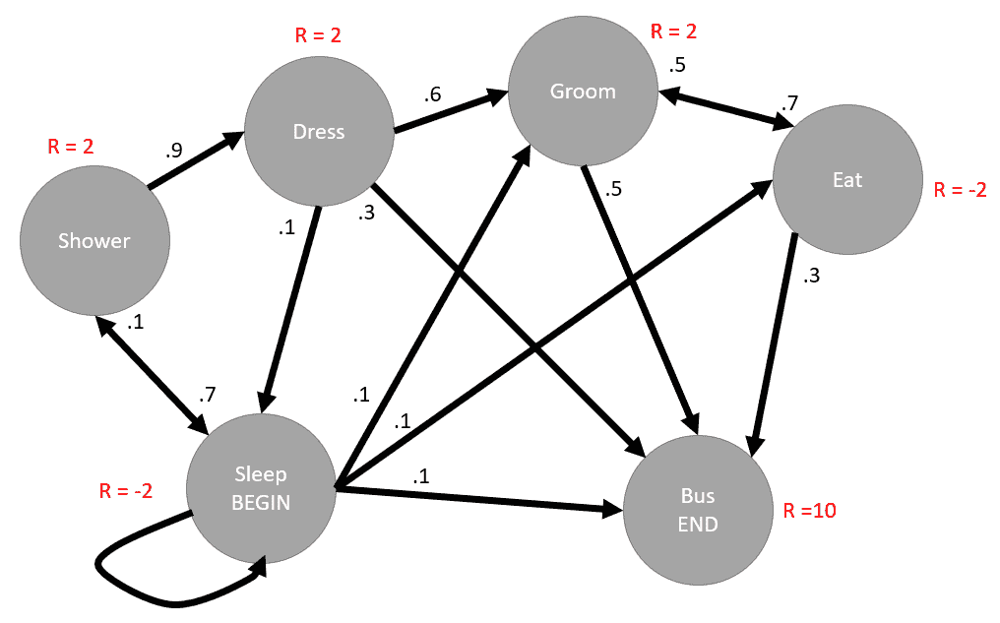
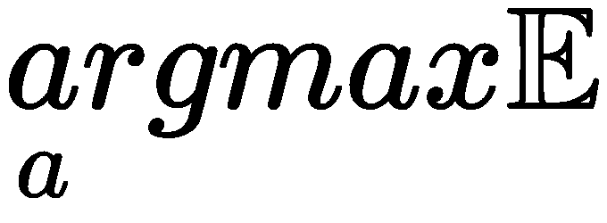
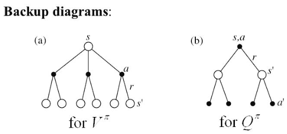
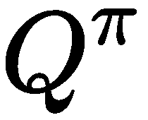
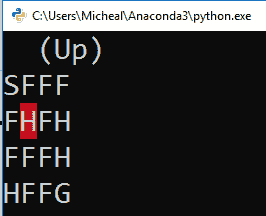
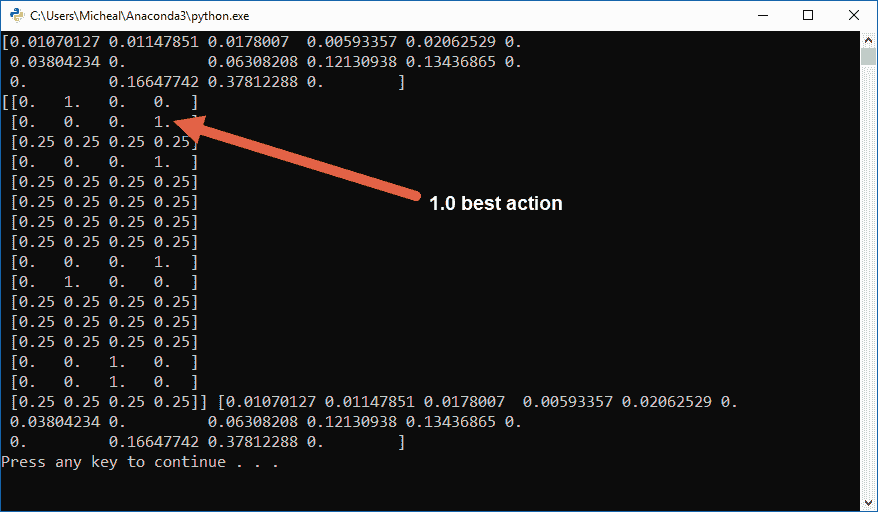
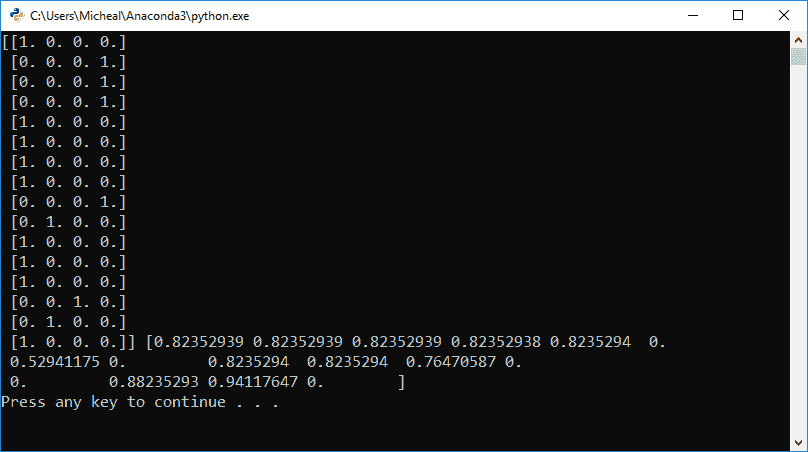
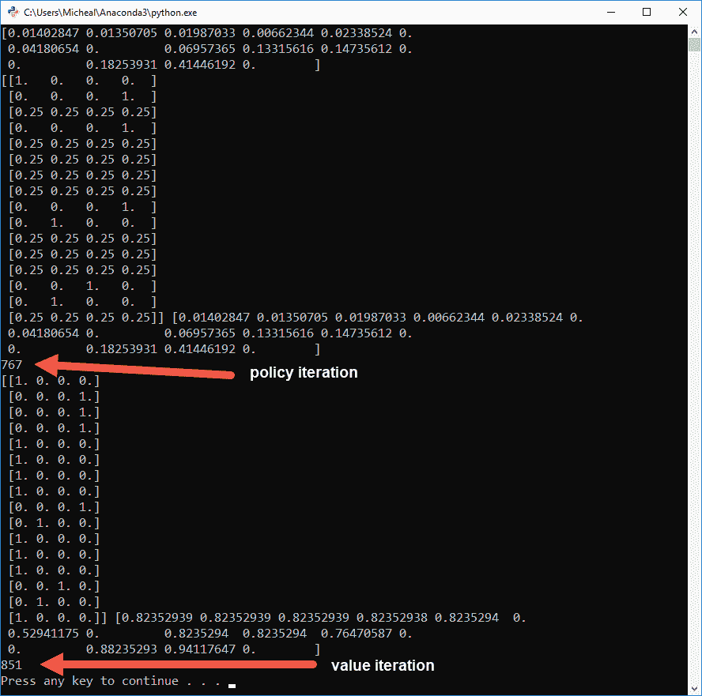

# 动态规划与贝尔曼方程

**动态规划（DP**）是继试错学习之后，对现代**强化学习（RL**）产生重大影响的第二个主要分支。在本章中，我们将探讨DP的基础，并研究它们如何影响RL领域。我们还将探讨贝尔曼方程和最优性概念如何与RL交织在一起。从那里，我们将探讨策略和值迭代方法来解决适合DP的一类问题。最后，我们将探讨如何使用本章学到的概念来教一个智能体玩OpenAI Gym中的FrozenLake环境。

下面是我们将在本章中涵盖的主要主题：

+   介绍动态规划（DP）

+   理解贝尔曼方程

+   构建策略迭代

+   构建值迭代

+   玩策略迭代与值迭代

对于本章，我们将探讨如何使用贝尔曼最优方程，用DP解决有限**马尔可夫决策过程（MDP**）。本章旨在作为DP和贝尔曼的历史课程和背景介绍。如果您已经非常熟悉DP，那么您可能希望跳过本章，因为我们只将探索入门级DP，涵盖足够的背景知识，以了解它如何影响和改进RL。

# 介绍DP

DP是由理查德·E·贝尔曼在20世纪50年代开发的，作为一种优化和解决复杂决策问题的方法。该方法最初应用于工程控制问题，但后来在所有需要分析和建模问题及其子问题的学科中找到了应用。实际上，所有DP都是关于解决子问题，然后找到将这些子问题连接起来以解决更大问题的关系。它通过首先应用贝尔曼最优方程，然后求解来实现这一点。

在我们用DP解决有限MDP之前，我们希望更详细地了解我们正在讨论的内容。让我们在下一节中看看正常递归和DP之间的简单示例差异。

# 正规编程与DP的比较

我们将通过首先使用常规方法解决问题，然后使用DP来进行比较。在这个过程中，我们将识别出使我们的解决方案成为DP的关键元素。大多数经验丰富的程序员发现，他们可能已经在某种程度上做过DP，所以如果这一切听起来非常熟悉，请不要感到惊讶。让我们打开`Chapter_2_1.py`示例并跟随练习：

1.  这段代码是使用递归查找斐波那契序列中第*n*个数字的示例，如下所示：

```py
def Fibonacci(n): 
    if n<0: 
        print("Outside bounds")
    elif n==1:
        return 0 # n==1, returns 0  
    elif n==2: 
        return 1 # n==2, returns 1
    else: 
        return Fibonacci(n-1)+Fibonacci(n-2) 
print(Fibonacci(9))
```

1.  回想一下，我们可以通过将序列中的前两个数字相加来解决问题序列的第*n*个元素。我们考虑当`n == 1`时，值为`0`，当`n == 2`时，返回的值是`1`。因此，序列中的第三个元素将是`Fibonacci(1)`和`Fibonacci(2)`的和，并将返回一个值为`1`。这在以下代码行中得到了反映：

```py
return Fibonacci(n-1)+Fibonacci(n-2)
```

1.  因此，使用递归的线性规划版本找到第四个元素的解决方案如下所示：


解决斐波那契数列的第四个元素

我们可以注意以下几点：

+   上述图表显示了计算前一个元素所需的每个递归调用`Fibonacci`函数。注意这种方法需要解决或调用`Fibonacci(2)`函数两次。当然，在这个例子中，额外的调用是微不足道的，但这些额外的调用可以迅速累积。

+   按照常规方式运行代码，并查看第九个元素的打印结果。

为了欣赏递归可能有多么低效，我们已经修改了之前的示例并将其保存为`Chapter_2_2.py`。现在打开这个示例并跟随下一个练习：

1.  修改后的代码，带有高亮显示的额外行，如下所示供参考：

```py
def Fibonacci(n):     
    if n<0: 
        print("Outside bounds")
    elif n==1: 
        return 0 # n==1, returns 0 
    elif n==2: 
        return 1 # n==2, returns 1
    else:   
        print("Solving for {}".format(n))
        return Fibonacci(n-1)+Fibonacci(n-2)
print(Fibonacci(9))
```

1.  我们所做的一切只是打印出我们需要计算两个更多序列以返回总和的时刻。运行代码并注意以下截图所示的输出：


来自示例`Chapter_2_1.py`的输出

1.  注意，仅使用递归计算斐波那契数列的第九个元素时，`Fibonacci(3)`被调用的次数。

现在，解决方案有效，正如人们所说，它既美观又简洁。事实上，作为一个程序员，你可能曾经被教导要崇拜这种编程风格。然而，我们可以清楚地看到这种方法在扩展时的低效，这就是动态规划（DP）发挥作用的地方，我们将在下一节中讨论。

# 进入动态规划和记忆化

动态规划（DP）的一个关键概念是将较大的问题分解成较小的子问题，然后解决这些较小的子问题并存储结果。这种活动的时髦名称叫做**记忆化**，展示这种工作方式的最佳方式是使用一个例子。打开`Chapter_2_3.py`并跟随练习：

1.  作为参考，我们之前示例中的整个代码块已被修改如下：

```py
fibSequence = [0,1]

def Fibonacci(n):     
    if n<0: 
        print("Outside bounds")
   elif n<= len(fibSequence): 
 return fibSequence[n-1] 
    else:   
        print("Solving for {}".format(n))
        fibN = Fibonacci(n-1) + Fibonacci(n-2)
 fibSequence.append(fibN)
 return fibN 

print(Fibonacci(9))
```

1.  再次强调，高亮显示的行表示代码更改，但在这个例子中，我们将更详细地逐个分析代码更改，从第一个更改开始，如下所示：

```py
fibSequence = [0,1]
```

1.  这条新线创建了一个新的斐波那契列表，包含我们的两个基数`0`和`1`。我们仍然使用递归函数，但现在我们还存储每次独特计算的每个结果以供以后使用：

```py
elif n<= len(fibSequence): 
        return fibSequence[n-1]
```

1.  下一个代码更改是在算法返回之前存储的值的地方，例如`0`或`1`，或者计算后存储在`fibSequence`列表中：

```py
fibN = Fibonacci(n-1) + Fibonacci(n-2) fibSequence.append(fibN) return fibN 
```

1.  最后一批代码更改现在保存了递归计算，将新值添加到整个序列中。这现在要求算法只需计算序列的第*n*个值一次。

1.  按照常规方式运行代码，并查看以下截图所示的结果：


来自示例`Chapter_2_3.py`的输出示例

注意我们现在只计算序列中的数字，而不重复任何计算。显然，这种方法比我们之前看到的线性规划示例要好得多，而且代码看起来也不差。现在，正如我们所说的，如果这种解决方案看起来很显然，那么你可能比你意识到的更了解DP。

在这本书中，我们将仅简要介绍与强化学习相关的动态规划（DP）。正如你所见，DP是一种强大的技术，可以惠及任何认真优化代码的开发者。

在下一节中，我们将进一步探讨贝尔曼的工作以及以他的名字命名的方程。

# 理解贝尔曼方程

贝尔曼在解决有限MDP问题时使用了动态规划（DP），正是在这些努力中他推导出了他著名的方程。这个方程背后的美丽之处——以及更抽象地说，一般概念——在于它描述了一种优化状态价值或质量的方法。换句话说，它描述了在给定动作和后续状态的选择的情况下，我们如何确定处于某个状态的最优价值/质量。在分解方程本身之前，让我们首先在下一节重新审视有限MDP。

# 解开有限MDP

考虑我们在[第1章](5553d896-c079-4404-a41b-c25293c745bb.xhtml)，“理解奖励学习”中开发的有限MDP，它描述了你的早晨常规。如果你之前没有完成那个练习，不用担心，我们将考虑一个更具体的例子，如下所示：



用于醒来和乘坐公交车的MDP

前面的有限MDP描述了某人醒来并准备乘坐公交车去上学或上班的可能常规。在这个MDP中，我们定义了一个初始状态（**BEGIN**）和一个结束状态，即上车（**END**）。**R =** 表示移动到该状态时分配的奖励，而靠近动作行末尾的数字表示采取该动作的概率。我们可以用以下图示表示通过这个有限MDP的最优路径：


MDP的最佳解决方案

从数学上讲，我们可以将最优结果描述为通过环境遍历获得的所有奖励的总和。更正式地说，我们也可以这样数学地写出：


然而，这正是贝尔曼介入的地方，我们不能将所有奖励视为相等。在不更深入地探讨数学细节的情况下，贝尔曼方程引入了未来奖励应该被折现的概念。当你这样思考时，这也是相当直观的。从未来的动作中感受到的经验或效果会根据我们需要决定的时间距离而减弱。这正是我们应用贝尔曼方程时所采用的概念。因此，我们现在可以对前面的方程应用一个折现因子（伽马）并展示以下内容：


伽马（），在方程中表示，代表未来奖励的折现因子。这个值可以从 `0.0` 到 `1.0`。如果值为 `1.0`，则我们不考虑未来奖励的折现，而值为 `0.1` 将会大幅度折现未来奖励。在大多数强化学习问题中，我们保持这个数值相当高，并且远高于 `0.9`。这引出了下一节，我们将讨论贝尔曼方程如何优化问题。

# 贝尔曼最优方程

贝尔曼方程表明，你可以通过首先找到允许智能体遍历 MDP 的最优策略来解决任何 MDP。回想一下，策略定义了指导智能体通过 MDP 的每个动作的决定。理想情况下，我们想要找到的是最优策略：一个可以最大化每个状态的价值并确定要遍历哪些状态以获得最大奖励的策略。当我们结合其他概念并应用更多的数学技巧，然后与贝尔曼最优方程结合，我们得到以下最优策略方程：


非常奇怪的开头术语（[）是一种描述函数的方式，该函数在给定一组状态和动作的情况下最大化奖励，同时考虑到我们通过一个称为伽马（gamma）的因子对未来的奖励进行折现。注意我们如何也使用  来表示策略方程，但我们通常认为这是一个质量，可能会将其称为 *q* 或 *Q*。如果你回想起我们之前对 Q-learning 方程的简要了解，那么现在你可以清楚地看到奖励的折现因子伽马是如何起作用的。

在下一节中，我们将探讨使用动态规划（DP）和基于我们对贝尔曼最优原则和结果策略方程的理解的策略迭代方法来解决 MDP 的方法。

# 构建策略迭代

为了确定最佳策略，我们首先需要一个方法来评估给定状态的政策。我们可以通过搜索 MDP 的所有状态并进一步评估所有动作来评估政策。这将为我们提供给定状态的价值函数，然后我们可以使用它来迭代地执行新值函数的连续更新。从数学上讲，我们可以使用前面的 Bellman 最优性方程并推导出新的状态值函数更新，如下所示：


在前面的方程中，[] 符号代表期望值，表示期望状态值更新到新的值函数。在这个期望值内部，我们可以看到它依赖于返回的奖励加上给定已选择动作的下一个状态的先前折现值。这意味着我们的算法将遍历每个状态和动作，使用前面的更新方程评估新的状态值。这个过程称为备份或规划，使用备份图可视化这个算法的工作方式对我们很有帮助。以下是动作值和状态值备份的备份图示例：



动作值和状态值备份的备份图

图**(a)**或[]是备份或评估中尝试每个动作的部分，因此为我们提供了动作值。评估的第二部分来自更新，并在图**(b)**中显示为[]。回想一下，更新通过评估每个状态动作来评估前向状态。这些图用实心圆圈表示评估点。注意动作值只关注前向动作，而状态值关注每个前向状态的动作值。当然，查看代码中这些是如何结合起来的会有所帮助。然而，在我们到达那里之前，我们想要在下一节做一些整理工作。

# 安装 OpenAI Gym

为了鼓励强化学习（RL）的研究和开发，OpenAI 团队提供了一个开源的 RL 训练平台，称为 Gym。由 OpenAI 提供的 Gym 拥有大量的样本测试环境，我们可以在阅读本书的过程中探索这些环境。此外，其他 RL 开发者也使用 Gym 相同的标准接口开发了其他环境。因此，通过学习使用 Gym，我们将在本书的后面部分也能够探索其他前沿的 RL 环境。

Gym 的安装相当简单，但同时我们想要避免任何可能让你感到沮丧的小错误。因此，最好使用以下说明来设置和安装一个用于开发的 RL 环境。

强烈建议您使用Anaconda进行本书的Python开发。Anaconda是一个免费的开源跨平台工具，可以显著提高您的开发便利性。除非您认为自己是一位经验丰富的Python开发者，否则请坚持使用Anaconda。通过Google搜索`python anaconda`下载并安装它。

按照练习设置和安装带有Gym的Python环境：

1.  打开一个新的Anaconda Prompt或Python shell。如果您需要，请以管理员身份执行这些命令。

1.  从命令行运行以下命令：

```py
conda create -n chapter2 python=3.6
```

1.  这将为您的开发创建一个新的虚拟环境。虚拟环境允许您隔离依赖项并控制版本。如果您不使用Anaconda，您可以使用Python虚拟环境来创建一个新环境。您还应该注意到，我们正在强制环境使用Python 3.6。再次强调，这确保我们知道我们使用的是哪个版本的Python。

1.  安装完成后，我们使用以下命令激活环境：

```py
activate chapter2
```

1.  接下来，我们使用以下命令安装Gym：

```py
pip install gym
```

1.  Gym将安装几个依赖项，包括我们稍后将在其上训练的各种样本环境。

在我们走得太远之前，现在让我们在下一节中使用代码测试我们的Gym安装。

# 测试Gym

在下一个练习中，我们将编写代码来测试Gym和一个名为FrozenLake的环境，这个环境也恰好是我们本章的测试环境。打开`Chapter_2_4.py`代码示例并按照练习进行：

1.  为了参考，代码如下所示：

```py
from os import system, name
import time
import gym
import numpy as np

env = gym.make('FrozenLake-v0')
env.reset()

def clear():
    if name == 'nt': 
        _ = system('cls')    
    else: 
        _ = system('clear')

for _ in range(1000):
    clear()
    env.render()
    time.sleep(.5)
    env.step(env.action_space.sample()) # take a random action
env.close()
```

1.  在顶部，我们有导入语句，用于加载`system`模块以及`gym`、`time`和`numpy`。`numpy`是一个辅助库，我们用它来构建张量。张量是数学/编程概念，可以描述单个值或数字的多维数组。

1.  接下来，我们使用以下代码构建和重置环境：

```py
env = gym.make('FrozenLake-v0')
env.reset()
```

1.  之后，我们有一个`clear`函数，我们用它来清除对示例不重要的渲染。代码应该也是不言自明的。

1.  这将带我们到`for`循环，也就是所有动作发生的地方。以下是最重要的那一行：

```py
env.step(env.action_space.sample())
```

1.  `env`变量代表环境，在那一行中，我们让算法每一步或迭代随机采取一个动作。在这个例子中，代理目前什么也没学到，只是随机移动。

1.  按照正常方式运行代码，并注意输出。以下是一个输出屏幕的示例：



从FrozenLake环境中提取的示例渲染

由于算法/代理随机移动，它很可能会撞到表示为`H`的洞，并停留在那里。为了参考，以下是FrozenLake的图例：

+   **S** = 开始：当调用重置时，代理从这里开始。

+   **F** = 冻结：这允许代理在这个区域内移动。

+   **H** = 洞：这是冰中的洞；如果智能体移动到这里，它会掉进去。

+   **G** = 目标：这是智能体想要达到的目标，当它达到时，它将获得 1.0 的奖励。

现在我们已经设置了 Gym，我们可以进入下一节来评估策略。

# 策略评估

与试错学习不同，你已经接触到了 DP 方法，它们作为一种静态学习形式或我们可能称之为规划的形式工作。在这里，规划是一个合适的定义，因为算法在评估整个 MDP 以及所有状态和动作之前。因此，这些方法需要完全了解环境，包括所有有限状态和动作。虽然这对于我们在这个章节中玩的环境等已知有限环境有效，但这些方法对于现实世界的物理问题来说还不够充分。当然，我们将在本书的后面解决现实世界的问题。不过，现在让我们看看如何从之前的更新方程中在代码中评估策略。打开 `Chapter_2_5.py` 并遵循练习：

1.  为了参考，整个代码块 `Chapter_2_5.py` 显示如下：

```py
from os import system, name
import time
import gym
import numpy as np
env = gym.make('FrozenLake-v0')
env.reset()

def clear():
    if name == 'nt': 
        _ = system('cls')    
    else: 
        _ = system('clear')

def act(V, env, gamma, policy, state, v):
    for action, action_prob in enumerate(policy[state]):                
        for state_prob, next_state, reward, end in env.P[state][action]:                                        
            v += action_prob * state_prob * (reward + gamma * V[next_state])                    
            V[state] = v

def eval_policy(policy, env, gamma=1.0, theta=1e-9, terms=1e9):     
    V = np.zeros(env.nS)  
    delta = 0
    for i in range(int(terms)): 
        for state in range(env.nS):            
            act(V, env, gamma, policy, state, v=0.0)         
        clear()
        print(V)
        time.sleep(1) 
        v = np.sum(V)
        if v - delta < theta:
            return V
        else:
            delta = v
    return V

policy = np.ones([env.env.nS, env.env.nA]) / env.env.nA
V = eval_policy(policy, env.env)

print(policy, V)
```

1.  在代码的开始，我们执行与我们的测试示例相同的初始步骤。我们加载 `import` 语句，初始化和加载环境，然后定义 `clear` 函数。

1.  接下来，移动到代码的末尾并注意我们是如何使用 `numpy as np` 初始化策略来填充一个大小为环境 `state` x `action` 的张量。然后，我们将张量除以状态中的动作数量——在这个例子中是 `4`。这给出了每个动作的分布式概率 `0.25`。记住，在马尔可夫属性中，所有动作的概率总和需要达到 `1.0` 或 100%。

1.  现在，向上移动到 `eval_policy` 函数并关注双重循环，如下面的代码块所示：

```py
for i in range(int(terms)):
  for state in range(env.nS):
    act(V, env, gamma, policy, state, v=0.0)
  clear()
  print(V)
  time.sleep(1)
  v = np.sum(V)
  if v - delta < theta:
    return V
  else:
    delta = v
return V
```

1.  第一个 `for` 循环遍历在终止之前的项数或迭代次数。在这里我们设置一个限制以防止无限循环。在内循环中，通过 `act` 函数对环境中的所有状态进行迭代并采取行动。之后，我们使用之前的渲染代码来显示更新的值。第一个 `for` 循环结束时，我们检查计算出的 `v` 值的总变化是否小于特定的阈值，`theta`。如果值的变化小于阈值，函数返回计算出的值函数，`V`。

1.  算法的核心是 `act` 函数以及更新方程操作的地方；该函数内部的显示如下：

```py
for action, action_prob in enumerate(policy[state]):   
  for state_prob, next_state, reward, end
 in env.P[state][action]:   
    v += action_prob * state_prob * (reward + gamma * V[next_state]) #update 
    V[state] = v
```

1.  第一个 `for` 循环遍历给定状态下策略中的所有动作。回想一下，我们首先将策略初始化为每个 `action` 函数的 `0.25`，即 `action_prob = 0.25`。然后，我们遍历从状态和动作到每个转换并应用更新。更新在突出显示的方程中显示。最后，当前状态的价值函数 `V` 更新为 `v`。

1.  运行代码并观察输出。注意`value`函数是如何不断更新的。在运行结束时，你应该看到类似于以下截图的内容：


运行示例Chapter_2_5.py

如果策略没有更新看起来有些不对劲，实际上这现在是完全可以接受的。这里的重要部分是看到我们是如何更新`value`函数的。在下一节中，我们将探讨如何改进策略。

# 策略改进

在掌握策略评估之后，是时候通过前瞻性思考来改进策略了。回想一下，我们是通过对当前状态之前的一个状态进行观察，然后评估所有可能的行为来做到这一点的。让我们看看在代码中是如何实现这一点的。打开`Chapter_2_6.py`示例并跟随练习：

1.  为了简洁起见，以下从`Chapter_2_6.py`中摘录的代码仅显示了添加到上一个示例中的新代码部分：

```py
def evaluate(V, action_values, env, gamma, state):
    for action in range(env.nA):
        for prob, next_state, reward, terminated in env.P[state][action]:
            action_values[action] += prob * (reward + gamma * V[next_state])
    return action_values

def lookahead(env, state, V, gamma):
    action_values = np.zeros(env.nA)
    return evaluate(V, action_values, env, gamma, state)

def improve_policy(env, gamma=1.0, terms=1e9):    
    policy = np.ones([env.nS, env.nA]) / env.nA
    evals = 1
    for i in range(int(terms)):
        stable = True       
        V = eval_policy(policy, env, gamma=gamma)
        for state in range(env.nS):
            current_action = np.argmax(policy[state])
            action_value = lookahead(env, state, V, gamma)
            best_action = np.argmax(action_value)
            if current_action != best_action:
                stable = False               
                policy[state] = np.eye(env.nA)[best_action]
            evals += 1                
            if stable:
                return policy, V

#replaced bottom code from previous sample with
policy, V = improve_policy(env.env) 
print(policy, V)
```

1.  在上一个示例中添加了三个新的函数：`improve_policy`、`lookahead`和`evaluate`。`improve_policy`使用有限循环遍历当前环境中的状态；在遍历每个状态之前，它调用`eval_policy`通过传递当前的`policy`、`environment`和`gamma`（折扣因子）参数来更新`value`函数。然后，它调用`lookahead`函数，该函数内部调用一个`evaluate`函数来更新状态的动作值。`evaluate`是`act`函数的一个修改版本。

1.  虽然`eval_policy`和`improve_policy`这两个函数都使用有限循环的术语来防止无限循环，但它们仍然使用非常大的限制；在示例中，默认值是`1e09`。因此，我们仍然希望确定一个条件，以便在术语限制之前尽早停止循环。在策略评估中，我们通过观察价值函数的变化或delta来控制这一点。在策略改进中，我们现在要改进实际策略，为此，我们假设一个贪婪策略。换句话说，我们希望改进我们的策略，使其总是选择具有最高价值的动作，如下面的代码所示：

```py
action_value = lookahead(env, state, V, gamma)best_action = np.argmax(action_value)
if current_action != best_action:                
  stable = False   
  policy[state] = np.eye(env.nA)[best_action]
evals += 1 

if stable:
  return policy, V
```

1.  上述代码块首先使用`numpy`函数——`np.argmax`在`lookahead`函数返回的`action_value`列表上返回最大值或`best_action`，换句话说，就是贪婪动作。然后我们考虑`current_action`是否不等于`best_action`；如果不等于，那么我们认为策略是不稳定的，将`stable`设置为`false`。由于动作不是最好的，我们还使用`np.eye`为定义的形状更新`policy`，使用单位张量。这一步只是将策略的值分配为`1.0`给最佳/贪婪动作，而其他所有动作的值为`0.0`。

1.  在代码的末尾，你可以看到我们现在只是调用`improve_policy`并打印策略和价值函数的结果。

1.  按照正常方式运行代码并观察输出，如下面的截图所示：



`Chapter_2_6.py`的示例输出

这个示例将需要更长的时间来运行，你应该会看到随着示例的运行，`value`函数得到改善。当示例完成后，它将打印出值函数和策略。你现在可以看到策略如何清楚地指示每个状态的最佳动作，其值为`1.0`。一些状态的所有动作仍然具有`0.25`的值，原因在于算法认为在这些状态下没有必要评估或改进策略。这些状态可能是空缺状态或位于最优路径之外。

政策评估和改进是我们可以使用DP进行规划的一种方法，但在下一节中，我们将探讨第二种方法，称为值迭代。

# 构建值迭代

在值迭代中，我们遍历整个MDP中的所有状态，寻找每个状态的最佳值，当我们找到时，就停止或中断。然而，我们并没有就此停止，而是继续向前查看所有状态，并假设最佳动作的概率为100%。这产生了一种新的策略，可能比之前的策略迭代演示表现得更好。这两种方法之间的差异很微妙，最好通过代码示例来理解。打开`Chapter_2_7.py`并跟随下一个练习：

1.  这个代码示例建立在之前的示例之上。示例`Chapter_2_7.py`中的新代码变化如下：

```py
def value_iteration(env, gamma=1.0, theta=1e-9, terms=1e9):
    V = np.zeros(env.nS)
    for i in range(int(terms)):
        delta = 0
        for state in range(env.nS):
            action_value = lookahead(env, state, V, gamma)
            best_action_value = np.max(action_value)
            delta = max(delta, np.abs(V[state] - best_action_value))
            V[state] = best_action_value             
        if delta < theta: break
    policy = np.zeros([env.nS, env.nA])
    for state in range(env.nS):
        action_value = lookahead(env, state, V, gamma)
        best_action = np.argmax(action_value)
        policy[state, best_action] = 1.0
    return policy, V

#policy, V = improve_policy(env.env) 
#print(policy, V)

policy, V = value_iteration(env.env)
print(policy, V)
```

1.  这段代码的大部分与我们之前在示例中已经审查过的代码非常相似，但也有一些值得注意的细微差别。

1.  首先，这次，在有限项循环内部，我们遍历状态并使用`lookahead`函数进行直接前瞻性查看。此代码的详细信息如下：

```py
for state in range(env.nS):
 action_value = lookahead(env, state, V, gamma)
 best_action_value = np.max(action_value)
 delta = max(delta, np.abs(V[state] - best_action_value))
 V[state] = best_action_value 

```

1.  与政策评估和改进相比，前述代码的细微差别在于，这次我们立即进行前瞻性查看，遍历动作值，然后根据最佳值更新`value`函数。在这段代码块中，我们还计算了一个新的`delta`值或从先前最佳动作值的变化量：

```py
if delta < theta: break
```

1.  在循环之后，有一个`if`语句检查计算出的`delta`值或动作值变化量是否低于特定的阈值`theta`。如果`delta`足够小，我们就中断有限项循环：

```py
policy = np.zeros([env.nS, env.nA])
  for state in range(env.nS):
    action_value = lookahead(env, state, V, gamma)
    best_action = np.argmax(action_value)
    policy[state, best_action] = 1.0
return policy, V
```

1.  从那里，我们使用`numpy np.zeros`函数将`policy`初始化为零。然后，我们再次遍历所有状态，并使用`lookahead`函数进行另一步前瞻性查看。这个函数返回一个动作值的列表，我们确定最大索引值，即`best_action`。然后我们将`policy`设置为`1.0`；我们假设最佳动作总是为该状态选择。最后，我们返回新的策略和`value`函数，`V`。

1.  按照正常方式运行代码，并检查以下截图所示的输出：



从 Chapter_2_8.py 生成的输出示例

这次，我们没有进行任何策略迭代或改进，因此样本运行得更快。你也应该注意策略是如何对所有状态进行更新的。回想一下，在策略迭代中，只有算法/智能体能够通过的相关状态才会被评估。

在下一节中，我们将使用策略迭代和改进与价值迭代计算出的策略，将实际智能体释放到环境中。

# 策略与价值迭代的比较

策略和价值迭代方法非常相似，被视为配套方法。因此，为了评估使用哪种方法，我们通常需要将两种方法都应用于所讨论的问题。在下一个练习中，我们将在 FrozenLake 环境中同时评估策略和价值迭代方法：

1.  打开`Chapter_2_8.py`示例。此示例基于之前的代码示例，因此我们只展示新的附加代码：

```py
def play(env, episodes, policy):
    wins = 0
    total_reward = 0
    for episode in range(episodes):
        term = False
        state = env.reset()
        while not term:
            action = np.argmax(policy[state])
            next_state, reward, term, info = env.step(action)
            total_reward += reward
            state = next_state
            if term and reward == 1.0:
                wins += 1
    average_reward = total_reward / episodes
    return wins, total_reward, average_reward

policy, V = improve_policy(env.env)
print(policy, V)

wins, total, avg = play(env.env, 1000, policy)
print(wins)

policy, V = value_iteration(env.env)
print(policy, V)

wins, total, avg = play(env.env, 1000, policy)
print(wins)
```

1.  附加代码包括一个新的函数`play`和末尾的不同测试代码。在末尾的代码中，我们首先使用`improve_policy`函数计算策略，该函数执行策略迭代：

```py
wins, total, avg = play(env.env, 1000, policy)print(wins)
```

1.  接下来，我们使用`play`函数评估`policy`的获胜次数。之后，我们打印获胜次数。

1.  然后，我们使用价值迭代评估一个新的策略，再次使用`play`函数评估获胜次数，并打印结果：

```py
for episode in range(episodes):
  term = False
  state = env.reset()
  while not term:
    action = np.argmax(policy[state])
    next_state, reward, term, info = env.step(action)
    total_reward += reward
    state = next_state
    if term and reward == 1.0:
      wins += 1
average_reward = total_reward / episodes    return wins, total_reward, average_reward
```

1.  在`play`函数中，我们遍历次数。每个回合都被认为是智能体从起点移动到目标的一次尝试。在这个例子中，回合的终止发生在智能体遇到洞或目标时。如果它达到目标，它将获得`1.0`的奖励。大部分代码都是自解释的，除了智能体执行动作并再次显示的时刻如下：

```py
next_state, reward, term, info = env.step(action)
```

1.  回想一下，在我们的 Gym 环境测试中，我们只是随机移动智能体。现在，在前面代码中，我们执行由策略设定的特定动作。执行动作的回报是`next_state`、`reward`（如果有）、`term`或终止，以及一个`info`变量。这一行代码完全控制智能体，并允许其移动并与环境交互：

```py
total_reward += reward
state = next_state
if term and reward == 1.0:
  wins += 1
```

1.  智能体移动一步后，我们更新`total_reward`和`state`。然后，我们测试智能体是否获胜，环境是否终止，以及返回的奖励是否为`1.0`。否则，智能体继续。智能体也可能因掉入洞而结束回合。

1.  按照正常方式运行代码，并检查以下截图所示的输出：



以下是从示例 Chapter_2_8.py 生成的输出示例

注意结果之间的差异。这是在FrozenLake问题上策略迭代与值迭代的差异。你可以调整`theta`和`gamma`参数的值，看看是否可以得到更好的结果。同样，就像强化学习本身一样，你需要自己进行一些尝试和错误，以确定最佳的DP方法。

在下一节中，我们将探讨一些可以帮助你进一步理解材料的附加练习。

# 练习

完成本节中的练习完全是可选的，但希望你能开始欣赏到，作为强化学习者的我们，通过实践学习是最好的。尽力而为，并尝试完成以下至少2-3个练习：

1.  考虑其他可以使用动态规划（DP）解决的问题？你将如何将问题分解为子问题并计算每个子问题？

1.  编写另一个示例，比较线性编程与动态编程的问题。使用*练习1*中的示例。代码示例`Chapter_2_2.py`和`Chapter_2_3.py`是并列比较的好例子。

1.  查阅OpenAI文档，并探索其他强化学习环境。

1.  使用`Chapter_2_4.py`中的示例测试代码创建、渲染和探索Gym中的其他强化学习环境。

1.  解释使用DP评估和改进策略的过程/算法。

1.  解释策略迭代与值迭代之间的区别。

1.  打开`Chapter_2_5.py`策略迭代示例，并调整`theta`和`gamma`参数。这些参数对学习率和值有什么影响？

1.  打开`Chapter_2_6.py`策略改进示例，并调整`theta`和`gamma`参数。这些参数对学习率和值有什么影响？

1.  打开`Chapter_2_7.py`值迭代示例，并调整`theta`和`gamma`参数。这些参数对学习率和值有什么影响？

1.  使用`FrozenLake 8x8`环境完成所有策略和值迭代示例。这是湖泊问题的更大版本。现在，哪种方法表现更好？

使用这些练习来加强你对本章所涵盖材料的理解。在下一节中，我们将总结本章所涵盖的内容。

# 概述

在本章中，我们深入探讨了动态规划（DP）和贝尔曼方程。通过引入未来奖励和优化的概念，具有DP的贝尔曼方程对强化学习（RL）产生了显著影响。在本章中，我们首先深入研究了动态规划以及如何动态地解决问题，从而介绍了贝尔曼的贡献。然后，我们进一步理解了贝尔曼最优性方程及其如何通过迭代方法来考虑未来奖励以及确定期望的状态和动作值。特别是，我们关注了在Python中实现策略迭代和改进的实现。接着，我们从那里转向了价值迭代。最后，我们通过使用由策略和价值迭代生成的策略，在FrozenLake环境中设置了一个智能体测试，以此结束本章。对于本章，我们研究了一类非常适合DP的问题，这也有助于我们推导出强化学习中的其他概念，例如折现奖励。

在下一章中，我们将继续探讨这一主题，通过研究蒙特卡洛方法。
