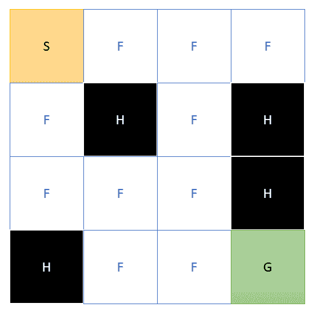
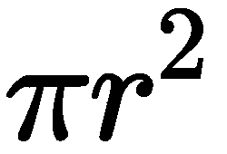

# 第四章：蒙特卡洛方法

对于本章，我们将回到强化学习（**RL**）的试错线程，并探讨蒙特卡洛方法。这是一类通过周期性地在一个环境中进行游戏而不是进行规划来工作的方法。我们将看到这种方法如何改进我们的最佳策略搜索，现在我们开始将我们的算法视为一个实际的代理——一个探索游戏环境而不是预先规划策略的代理，这反过来又使我们能够理解使用模型进行规划或不使用模型的益处。从那里，我们将探讨蒙特卡洛方法及其在代码中的实现。然后，我们将使用我们新的蒙特卡洛代理算法重新审视一个更大的FrozenLake环境版本。

在本章中，我们将继续探讨强化学习（RL）的演变过程，特别是关注蒙特卡洛方法中的试错线程。以下是本章我们将涵盖的主要主题总结：

+   理解基于模型和无模型学习

+   介绍蒙特卡洛方法

+   添加强化学习

+   玩FrozenLake游戏

+   使用预测和控制

我们再次探索强化学习、变分推理和试错方法的基础。这些知识对于任何认真完成这本书的人来说都是至关重要的，所以请不要跳过本章。

# 理解基于模型和无模型学习

如果您还记得我们非常第一章节，[第1章](5553d896-c079-4404-a41b-c25293c745bb.xhtml)，“基于奖励的学习理解”，我们探讨了强化学习的主要元素。我们了解到强化学习包括策略、价值函数、奖励函数，以及可选的模型。在这个上下文中，我们使用“模型”一词来指代环境的详细计划。回到上一章，我们使用了FrozenLake环境，我们对该环境有一个完美的模型：



FrozenLake环境的模型

当然，在有限MDP中用完全描述的模型来观察问题对于学习来说是非常好的。然而，当涉及到现实世界时，拥有任何环境的完整和完全理解模型很可能是不太可能，甚至是不可能的。这是因为任何现实世界问题中都有太多的状态需要考虑或建模。实际上，这也可能适用于许多其他模型。在本书的后面部分，我们将看到比已知宇宙中原子数量还要多的状态的环境。我们永远无法模拟这样的环境。因此，我们在[第2章](8237fd36-1edf-4da0-b271-9a50c5b8deb3.xhtml)，“动态规划和贝尔曼方程”中学到的规划方法将不起作用。相反，我们需要一种可以探索环境并从中学习的方法。这就是蒙特卡洛方法出现的地方，我们将在下一节中介绍。

# 介绍蒙特卡洛方法

蒙特卡洛方法之所以得名，是因为它与赌博或机会相似。因此，该方法以当时著名的赌博目的地命名。虽然这种方法非常强大，但它已被用来描述原子、量子力学以及[]本身的数量。直到最近20年，它才在从工程到金融分析等各个领域得到广泛应用。现在，这种方法已成为机器学习许多方面的基础，对于AI领域的任何人来说都值得进一步研究。

在下一节中，我们将看到蒙特卡洛方法如何用来求解[]。

# 求解

蒙特卡洛方法的标准介绍是展示它如何用来求解[]。回想一下几何学，[]代表圆周的一半，2π代表整个圆。为了找到这个关系和值，让我们考虑一个半径为1个单位的单位圆。这个单位可以是英尺、米、秒差距，或者任何其他东西——这并不重要。然后，如果我们把这个圆放在一个边长为1个单位的正方形盒子里，我们可以看到以下情况：


单位圆在单位正方形内

根据前面的内容，我们知道我们有一个边长为2个单位或4平方单位的正方形，它覆盖了100%的区域。回到几何学，我们知道圆的面积由以下公式给出：[]。知道圆在正方形内并且知道总面积，我们就可以应用蒙特卡洛方法来解决以下问题：


蒙特卡洛方法通过随机采样一个区域，然后确定该样本中有多少百分比是正确或错误的。回到我们的例子，我们可以将其想象为随机将飞镖扔到正方形上，然后计算有多少落在圆内。通过计算落在圆内的飞镖数量，我们可以使用以下公式回推π的值：


在前面的公式中，我们有以下内容：

+   *ins*：落在圆内的飞镖或样本的总数

+   *total*：扔下的飞镖总数

前面公式的关键是要意识到我们在这里所做的只是取落在圆内的飞镖数与总数(*ins*/*total*)的百分比来确定π的值。这可能仍然有点不清楚，所以让我们在下一节中看看几个例子。

# 实现蒙特卡洛

在许多情况下，即使没有现实世界的例子，理解抽象的简单概念也可能很困难。因此，打开 `Chapter_3_1.py` 代码示例。

在开始之前，我们应该提到，，在这种情况下，指的是我们估计的实际值 3.14。

按照练习进行：

1.  以下是为参考而列出的整个代码列表：

```py
from random import *
from math import sqrt

ins = 0
n = 100000

for i in range(0, n):
   x = (random()-.5) * 2
    y = (random()-.5) * 2
    if sqrt(x*x+y*y)<=1:
        ins+=1

pi = 4 * ins / n
print(pi)
```

这段代码使用蒙特卡洛方法求解 ，当你考虑到代码的简单性时，这相当令人印象深刻。让我们逐一分析代码的每个部分。

1.  我们从 `import` 语句开始，这里我们只导入了 `random` 和 `math` 函数中的 `sqrt`。

1.  从那里，我们定义了几个变量，`ins` 和 `n`。`ins` 变量存储飞镖或样本落在圆内的次数。`n` 变量代表要投掷的迭代次数或飞镖数量。

1.  接下来，我们使用以下代码随机投掷飞镖：

```py
for i in range(0, n):
  x = (random()-.5) * 2
  y = (random()-.5) * 2
  if sqrt(x*x+y*y)<=1:
   ins+=1
```

1.  所有这些代码所做的只是随机在 `-1` 到 `1` 的范围内采样 `x` 和 `y` 的值，然后确定它们是否在半径为 `1` 的圆内，这是由平方根函数中的计算给出的。

1.  最后，最后几行执行计算并输出结果。

1.  按照常规方式运行示例并观察输出。

你可能会发现猜测可能有些偏差。这完全取决于样本的数量。你看，蒙特卡洛方法的置信度和因此答案的质量会随着样本数量的增加而提高。因此，为了改进最后的例子，你必须增加变量 `n` 的值。

在下一节中，我们再次查看这个例子，但这次我们将看看那些飞镖样本可能看起来是什么样子。

# 绘制猜测

如果你仍然难以理解这个概念，可视化这个例子可能更有帮助。如果你想要可视化这种采样看起来是什么样子，请运行下一节的练习：

1.  在开始这个练习之前，我们将安装 `matplotlib` 库。使用以下命令使用 `pip` 安装库：

```py
pip install matplotlib
```

1.  安装完成后，打开这里显示的 `Chapter_3_2.py` 代码示例：

```py
import matplotlib.pyplot as plt
from random import random

ins = 0
n = 1000

x_ins = []
y_ins = []
x_outs = []
y_outs = []

for _ in range(n):
    x = (random()-.5) * 2
    y = (random()-.5) * 2 
    if (x**2+y**2) <= 1:
        ins += 1
        x_ins.append(x)
 y_ins.append(y)
    else:
        x_outs.append(x)
 y_outs.append(y)

pi = 4 * ins/n
print(pi)

fig, ax = plt.subplots()
ax.set_aspect('equal')
ax.scatter(x_ins, y_ins, color='g', marker='s')
ax.scatter(x_outs, y_outs, color='r', marker='s')
plt.show()
```

1.  代码与上一个练习非常相似，应该相当容易理解。我们只需关注前面突出显示的重要代码部分。

1.  在这个例子中，最大的不同之处在于我们记住了飞镖落下的位置，并确定了它们是否落在圆内或圆外。之后，我们绘制结果。我们为每个点绘制一个点，并将落在圆内的点用绿色表示，落在圆外的点用红色表示。

1.  运行示例并观察输出，如图所示：


来自 Chapter_3_2.py 的示例输出

输出看起来像一个圆圈，正如我们预期的那样。然而，π的输出值存在问题。注意现在π的估计值相当低。这是因为n——即飞镖或样本的数量——仅为1,000。这意味着，为了蒙特卡洛方法成为一个好的估计器，我们还需要意识到它需要一个足够大的猜测数量。

在下一节中，我们将探讨如何将这种方法应用于强化学习（RL）的FrozenLake问题的扩展版本。

# 添加强化学习（RL）

现在我们已经理解了蒙特卡洛方法，我们需要了解如何将其应用于强化学习（RL）。回想一下，我们的期望现在是我们所处的环境相对未知，也就是说，我们没有模型。相反，我们现在需要通过试错来开发一个算法来探索环境。然后，我们可以通过蒙特卡洛方法对所有这些不同的试验进行平均，并确定最佳或更好的策略。然后，我们可以使用这个改进的策略来继续探索环境以实现进一步的改进。本质上，我们的算法变成了一个探险者而不是规划者，这就是为什么我们现在将其称为智能体的原因。

使用术语**智能体**提醒我们，我们的算法现在是一个探险者和学习者。因此，我们的智能体不仅会探索，还会从探索中学习并改进。现在，这真的是人工智能。

除了之前在[第一章](5553d896-c079-4404-a41b-c25293c745bb.xhtml)“基于奖励的学习”中已经讨论过的探索部分，智能体仍然需要评估价值函数并改进策略。因此，我们在[第二章](8237fd36-1edf-4da0-b271-9a50c5b8deb3.xhtml)“动态规划和贝尔曼方程”中讨论的大部分内容都将适用。然而，这一次，我们的智能体将不是进行规划，而是探索环境，然后在每个回合之后重新评估价值函数并更新策略。一个回合被定义为从开始到终止的完整移动集。我们称这种类型的学习为回合式学习，因为它指的是智能体只在回合结束后学习和改进。当然，这有其局限性，我们将在[第四章](bb05e528-e21b-4753-9e4c-372b8ed11e96.xhtml)“时序差分学习”中看到如何进行连续控制。在下一节中，我们将深入探讨代码以及这一切是如何工作的。

# 蒙特卡洛控制

在一个智能体上实现所谓的**蒙特卡洛控制**有两种方式。这两种方法的区别在于它们如何计算平均回报或样本均值。在所谓的**首次访问蒙特卡洛**中，智能体只在首次访问某个状态时采样均值。另一种方法，**每次访问蒙特卡洛**，每次访问状态时都会采样平均回报。后一种方法是我们将在本章代码示例中探讨的方法。

本例的原始源代码来自Ankit Choudhary的博客（[https://www.analyticsvidhya.com/blog/2018/11/reinforcement-learning-introduction-monte-carlo-learning-openai-gym/](https://www.analyticsvidhya.com/blog/2018/11/reinforcement-learning-introduction-monte-carlo-learning-openai-gym/)）。

代码已经从原始版本中进行了大量修改。Ankit对这个方法的数学进行了更深入的探讨，对于那些对探索更多数学感兴趣的读者，原始版本是推荐的。

打开`Chapter_3_3.py`并按照练习进行：

1.  打开代码并查看导入。本例的代码太大，无法内联显示。相反，代码已经被分成几个部分。

1.  滚动到样本的底部并查看以下行：

```py
env = gym.make('FrozenLake8x8-v0')
policy = monte_carlo_e_soft(env,episodes=50000)print(test_policy(policy, env))
```

1.  在第一行，我们构建了环境。然后，我们使用名为`monte_carlo_e_soft`的函数创建`policy`。我们通过打印出`test_policy`函数的结果来完成这一步。

1.  滚动到`monte_carlo_e_soft`函数。我们稍后会解释这个名字，但现在，显示的是顶部几行：

```py
if not policy:
  policy = create_random_policy(env)
Q = create_state_action_dictionary(env, policy)
returns = {}
```

1.  这些行创建了一个策略，如果没有的话。这显示了随机策略是如何创建的：

```py
def create_random_policy(env):
  policy = {}
  for key in range(0, env.observation_space.n):
    p = {}
    for action in range(0, env.action_space.n):
      p[action] = 1 / env.action_space.n
      policy[key] = p
  return policy
```

1.  之后，我们创建一个字典来存储状态和动作值，如下所示：

```py
def create_state_action_dictionary(env, policy):
  Q = {}
  for key in policy.keys():
    Q[key] = {a: 0.0 for a in range(0, env.action_space.n)}
  return Q
```

1.  然后，我们从一个`for`循环开始，遍历所有剧集的数量，如下所示：

```py
for e in range(episodes): 
  G = 0 
  episode = play_game(env=env, policy=policy, display=False)
  evaluate_policy_check(env, e, policy, test_policy_freq)
```

1.  将前面高亮的`display=False`改为`display=True`，如下所示：

```py
episode = play_game(env=env, policy=policy, display=True)
```

1.  现在，在我们走得太远之前，看看代理是如何玩游戏可能会有所帮助。运行代码示例并观察输出。不要运行到完成——只需几秒钟或一分钟即可。确保在保存之前撤销你的代码更改：


代理玩游戏的示例输出

这张截图显示了代理探索扩展的8 x 8 FrozenLake环境的示例。在下一节中，我们将看看代理是如何玩游戏。

再次确保在继续之前撤销你的代码，并将`display=True`改为`display=False`。

# 玩FrozenLake游戏

代理代码现在正在玩游戏或探索环境，如果我们理解这段代码是如何运行的，这将很有帮助。再次打开`Chapter_3_3.py`并按照练习进行：

1.  对于本节，我们只需要关注代理如何玩游戏。滚动到`play_game`函数，如下所示：

```py
def play_game(env, policy, display=True):
  env.reset()
  episode = []
  finished = False
  while not finished:
    s = env.env.s
    if display:
      clear_output(True)
      env.render()
      sleep(1)
    timestep = []
    timestep.append(s)
    n = random.uniform(0, sum(policy[s].values()))
    top_range = 0
    action = 0
    for prob in policy[s].items():
      top_range += prob[1]            
      if n < top_range:
        action = prob[0]
        break 
    state, reward, finished, info = env.step(action)

    timestep.append(action)
    timestep.append(reward)
    episode.append(timestep)
 if display:
   clear_output(True)
   env.render()
   sleep(1)
 return episode
```

1.  我们可以看到这个函数接受`env`和`policy`环境作为输入。然后，在内部，它使用`reset`重置环境并初始化变量。`while`循环的开始是代理开始玩游戏的地方：

```py
while not finished:
```

1.  对于这个环境，我们让代理无限期地玩游戏。也就是说，我们不会限制代理可能采取的步骤数量。然而，对于这个环境来说，这并不是问题，因为它很可能代理会掉入洞中。但这种情况并不总是如此，我们经常需要限制代理在环境中的步骤数量。在许多情况下，这个限制被设置为`100`，例如。

1.  在`while`循环内部，我们更新代理的状态`s`，然后显示环境`display=True`。之后，我们设置一个`timestep`列表来保存那个`state`、`action`和`value`。然后，我们添加状态`s`：

```py
s = env.env.s
if display:
 clear_output(True)
 env.render()
 sleep(1)
timestep = []
timestep.append(s)
```

1.  接下来，我们查看基于`policy`值进行随机采样动作的代码，如下所示：

```py
n = random.uniform(0, sum(policy[s].values())) top_range = 0
action = 0
for prob in policy[s].items():
  top_range += prob[1] 
  if n < top_range:
    action = prob[0]
    break 
```

1.  这实际上是代理使用`random.uniform`对策略进行均匀采样的地方，这是蒙特卡洛方法。均匀意味着采样在值之间是均匀的，并且如果是从正态或高斯方法中来的话，不会偏斜。之后，在`for`循环中根据策略中随机选择的项选择一个动作。记住，在开始时，所有动作可能具有相等的`0.25`概率，但后来，随着代理学习策略项，它也会相应地学习分布。

蒙特卡洛方法使用各种采样分布来确定随机性。到目前为止，我们广泛地使用了均匀分布，但在大多数现实世界环境中，通常使用正态或高斯采样方法。

1.  然后，在选择一个随机动作后，代理采取一步并记录它。它已经记录了`state`，现在它添加`action`和`reward`。然后，它将`timestep`列表添加到`episode`列表中，如下所示：

```py
state, reward, finished, info = env.step(action) timestep.append(action)
timestep.append(reward)
episode.append(timestep)
```

1.  最后，当代理`完成`后，通过找到目标或掉入洞中，它返回`episode`中的步骤列表。

现在，我们理解了代理如何玩游戏后，我们可以继续评估游戏并优化它以预测和控制。

# 使用预测和控制

当我们之前有一个模型时，我们的算法可以学习在线下规划和改进策略。现在，没有模型，我们的算法需要成为一个代理，并学习探索，同时在这个过程中学习和改进。这使得我们的代理现在可以通过试错有效地学习。让我们回到`Chapter_3_3.py`代码示例，并跟随练习：

1.  我们将从我们离开的地方开始，回顾最后几行包括`play_game`函数：

```py
episode = play_game(env=env, policy=policy, display=False)
evaluate_policy_check(env, e, policy, test_policy_freq)
```

1.  在`evaluate_policy_check`内部，我们测试是否达到了`test_policy_freq`数字。如果是，我们输出代理的当前进度。实际上，我们正在评估当前策略将如何运行代理。`evaluate_policy_check`函数调用`test_policy`来评估当前策略。`test_policy`函数如下所示：

```py
def test_policy(policy, env):
  wins = 0
  r = 100
  for i in range(r):
    w = play_game(env, policy, display=False)[-1][-1]
    if w == 1:
      wins += 1
  return wins / r
```

1.  `test_policy`通过运行`play_game`函数并设置由`r = 100`确定的几个游戏来评估当前策略。这提供了一个`wins`百分比，该百分比输出以显示代理的进度。

1.  回到主函数，我们进入一个`for`循环，以相反的顺序遍历最后一轮游戏，如下所示：

```py
for i in reversed(range(0, len(episode))):
  s_t, a_t, r_t = episode[i] 
  state_action = (s_t, a_t)
  G += r_t
```

1.  以相反的顺序遍历场景允许我们使用最后一个奖励并将其反向应用。因此，如果代理收到了负奖励，所有动作都会受到负面影响。对于正奖励也是如此。我们使用`G`变量跟踪总奖励。

1.  在最后一个循环内部，我们检查状态是否已经为这个场景评估过；如果没有，我们找到回报列表并计算它们的平均值。然后，我们可以从平均值中确定最佳动作`A_star`。这显示在代码块中：

```py
if not state_action in [(x[0], x[1]) for x in episode[0:i]]:
  if returns.get(state_action):
    returns[state_action].append(G)
  else:
    returns[state_action] = [G] 

  Q[s_t][a_t] = sum(returns[state_action]) / len(returns[state_action]) 
  Q_list = list(map(lambda x: x[1], Q[s_t].items())) 
  indices = [i for i, x in enumerate(Q_list) if x == max(Q_list)]
  max_Q = random.choice(indices) 
A_star = max_Q
```

1.  这段代码块中有很多事情在进行，所以如果你需要的话，要慢慢工作。关键要点是我们在这里所做的只是平均回报或状态，然后根据蒙特卡洛在该状态内确定最可能的最佳动作。

1.  在我们跳转到代码的最后部分之前，像平常一样运行示例。这应该会产生与以下类似的输出：


Chapter_3_3.py的示例输出

注意我们现在如何可视化代理在随机探索时的进度。你可能会看到的胜利百分比可能完全不同，在某些情况下，它们可能高得多或低得多。这是因为代理正在随机探索。要完全评估一个代理，你可能需要运行代理超过50,000个场景。然而，在添加新样本后，在50,000次迭代中不断平均平均值将非常计算量大。相反，我们使用另一种称为增量平均值的方法，我们将在下一节中探讨。

# 增量意味着

增量或运行平均值允许我们在不记住列表的情况下保持一系列数字的平均值。当然，当我们需要保持50,000、1,000,000或更多场景的平均值时，这具有巨大的好处。我们不是从完整的列表中更新平均值，而是对于每个场景，我们保持一个值，并使用以下方程增量更新：


在前面的方程中，我们有以下内容：

+    = 当前策略的状态值

+    = 代表折扣率

+    = 当前总回报

通过应用这个方程，我们现在有了更新策略的方法，而且巧合的是，我们在完整的Q方程中也使用了类似的方法。然而，我们还没有达到那里，而是使用以下算法来更新值：


蒙特卡洛ε-soft策略算法

该算法展示了e-soft或epsilon soft版本的蒙特卡洛算法是如何工作的。回想一下，这是我们使用蒙特卡洛定义代理的第二个方法。虽然前面的算法可能特别令人恐惧，但我们感兴趣的部分是最后一个，如以下方程所示：


这成为了一种更有效的策略更新方法，这正是示例中展示的。打开`Chapter_3_3.py`并遵循练习：

1.  滚动到以下代码部分：

```py
for a in policy[s_t].items(): 
  if a[0] == A_star:
    policy[s_t][a[0]] = 1 - epsilon + (epsilon / abs(sum(policy[s_t].values())))
  else:
    policy[s_t][a[0]] = (epsilong / abs(sum(policy[s_t].values())))
```

1.  正是在这段代码的最后部分，我们逐步更新策略到最佳值，如下所示：

```py
policy[s_t][a[0]] = 1 - alpha + (alpha / abs(sum(policy[s_t].values())))
```

1.  或者我们给它一个基值，如下所示：

```py
policy[s_t][a[0]] = (alpha / abs(sum(policy[s_t].values())))
```

1.  从这里，我们可以再次运行示例并享受输出。

现在你已经了解了蒙特卡洛方法的基础，你可以继续阅读下一节中的更多示例练习。

# 练习

如往常一样，本节中的练习旨在提高你对材料的知识和理解。请尝试独立完成1-3个这些练习：

1.  我们可以使用蒙特卡洛方法计算哪些其他常数，比如π？想想一个实验来计算我们使用的另一个常数。

1.  打开`Chapter_3_1.py`的示例代码并更改`n`的值，即投掷的飞镖数量。这如何影响π的计算值？使用`n`的更高或更低值。

1.  当我们计算π时，我们假设飞镖是均匀分布的。然而，在现实世界中，飞镖可能以正态或高斯方式分布。这会如何影响蒙特卡洛实验？

1.  参考示例`Chapter_3_2.py`并更改`n`的值。这如何影响绘图生成？你能否修复它？

1.  打开`Chapter_3_3.py`并更改在`test_policy`函数中运行的测试剧集数量到一个更高的或更低的值。

1.  打开`Chapter_3_3.py`并增加用于训练代理的剧集数量。如果有的话，代理的性能如何提高？

1.  打开`Chapter_3_3.py`并更改用于更新增量平均值的alpha值。这如何影响代理的学习能力？

1.  添加在图表中可视化每个策略测试的能力。看看你是否能转移我们在示例`Chapter_3_2.py`中创建图表的方式。

1.  由于代码相当通用，请在另一个Gym环境中测试此代码。从标准的4 x 4 FrozenLake环境开始，看看它的表现如何。

1.  想想这个示例中给出的蒙特卡洛方法可以如何改进。

这些练习不会花费太多额外的时间，并且它们可以极大地影响你对本书中材料的理解。请使用它们。

# 总结

在本章中，我们扩展了我们对强化学习（RL）的探索，并再次审视了试错方法。特别是，我们关注了蒙特卡洛方法如何作为一种从实验中学习的方式。我们首先看了一个蒙特卡洛方法计算π的示例实验。从那里，我们探讨了如何使用matplotlib可视化这个实验的输出。然后，我们查看了一个代码示例，展示了如何使用蒙特卡洛方法解决FrozenLake问题的一个版本。通过详细探索代码示例，我们揭示了智能体如何玩游戏，并通过这种探索学习改进策略。最后，我们通过理解智能体如何使用增量样本均值来改进策略，结束了本章的内容。

蒙特卡洛方法功能强大，但正如我们所学的，它需要基于短期的游戏玩法，而在现实世界中，一个正在工作的智能体需要在其控制过程中持续学习。这种学习形式被称为时序差分学习，这是我们将在下一章中探讨的内容。
