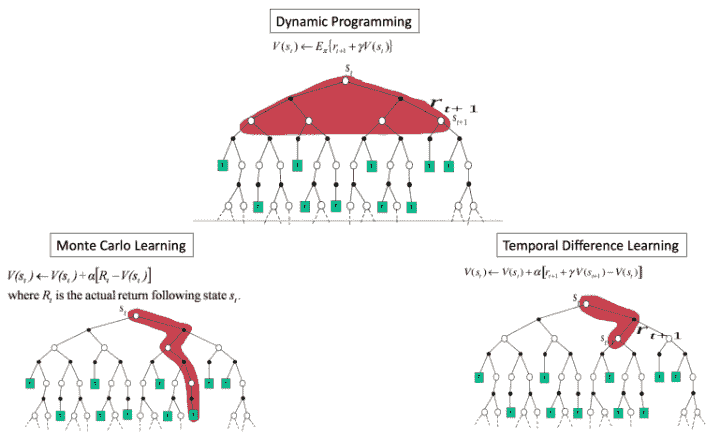
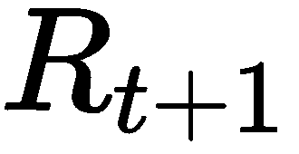
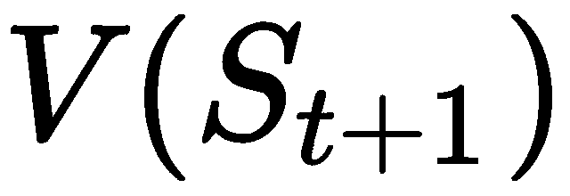
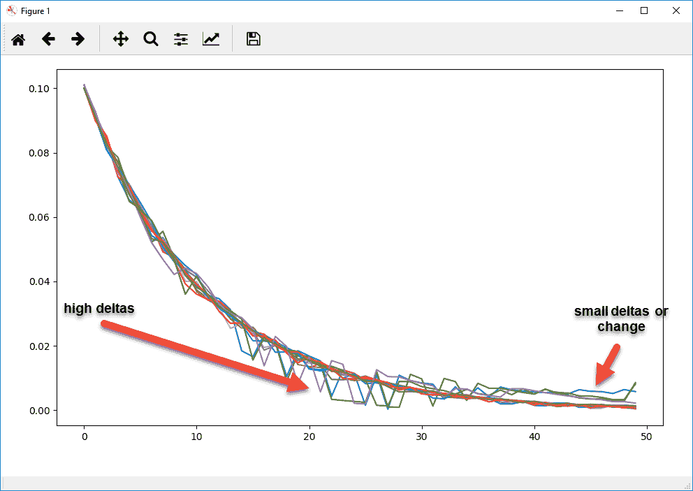
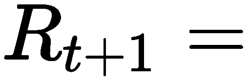
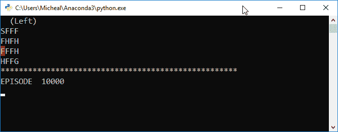
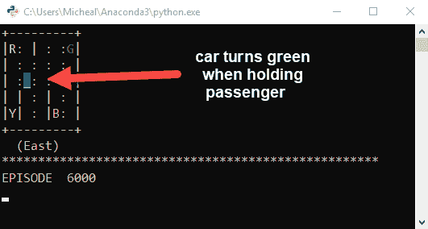

# 时间差分学习

在我们之前关于强化学习历史的讨论中，我们涵盖了两个主要线索，试错和**动态规划**（**DP**），它们结合在一起推导出现代**强化学习**（**RL**）。正如我们在前面的章节中提到的，还有一个后来到达的第三线索，称为**时间差分学习**（**TDL**）。在本章中，我们将探讨TDL以及它是如何解决**时间信用分配**（**TCA**）问题的。从那里，我们将探讨TD与**蒙特卡洛**（**MC**）的不同之处以及它是如何演变成完整的Q-learning的。然后，我们将探讨在策略学习和离策略学习之间的差异，最后，我们将尝试一个新的RL环境示例。

对于本章，我们将介绍TDL以及它是如何改进我们在前几章中查看的先前技术的。以下是本章我们将涵盖的主要主题：

+   理解TCA问题

+   介绍TDL

+   将TDL应用于Q-learning

+   在Q-learning中探索TD(0)

+   运行离策略与在策略

本章详细介绍了TDL和Q-learning。因此，值得仔细回顾和理解这些材料。对基础材料的深入了解将有助于你后来的学习。

# 理解TCA问题

信用分配问题被描述为理解你需要采取哪些行动来获得最多的信用或，在RL的情况下，奖励。RL通过允许算法或智能体找到最大化奖励的最佳动作集来解决信用分配问题。在我们之前的所有章节中，我们都看到了如何使用DP和MC方法实现这一点的变体。然而，这两种先前的方法都是离线的，因此它们在执行任务时无法学习。

TCA问题与信用分配CA问题的区别在于它需要在时间上解决；也就是说，算法需要在时间步长中找到最佳策略，而不是在MC的情况下在事件后学习，或者在DP的情况下需要提前规划。这也意味着，一个在时间上解决CA问题的算法也能够或应该能够实时学习，即在任务进行过程中能够更新策略，而不是像我们在前面的章节中看到的那样在之前或之后。

通过引入时间或事件进展的概念，我们也允许我们的智能体学习事件时间的重要性。以前，我们的智能体对时间关键事件，如击中移动目标或准确计时跳跃，没有任何意识。另一方面，TDL允许智能体理解事件时间并采取适当的行动。我们将在下一节介绍TDL的概念和直觉。

# 介绍TDL

TDL是由强化学习之父理查德·萨顿博士在1988年提出的。萨顿将此方法作为MC/DP的改进，但正如我们将看到的，该方法本身导致了1989年由克里斯·沃特金斯（Chris Watkins）提出的Q-learning的发展。这种方法本身是无模型的，不需要在智能体学习之前完成一个回合。这使得这种方法在实时探索未知环境时非常强大，正如我们将看到的。

在我们深入探讨更新此方法的新数学方法之前，查看下一节中涵盖的所有方法的备份图可能会有所帮助。

# 自举和备份图

TDL可以通过近似给定先前经验更新的价值函数来在回合期间学习。这使得算法在回合中进行学习，并根据需要做出修正。为了进一步了解差异，让我们回顾以下图中DP、MC和TD的备份图的组合：



DP、MC和TDL的备份图

该图取自巴托（Barto）和萨顿（Sutton）的《强化学习导论》（2018年）。在图中，你可以看到我们之前两种方法，DP和MC，以及TDL。阴影区域（红色或黑色）表示算法的学习空间。也就是说，智能体在能够更新其价值函数和策略之前需要探索的区域。注意，随着图从DP到TDL的进展，阴影区域变得较小——也就是说，对于每个进步的算法，智能体在开始学习之前或在学习过程中需要探索的面积越来越少。正如我们将看到的，这允许智能体在学习完成回合之前就开始学习。

在我们查看代码之前，我们应该看看这种新的方法如何在下一节中修改我们的价值函数的数学。

# 应用TD预测

在整本书中，我们将探讨允许算法预测和控制智能体完成任务的方法。预测和控制是强化学习（RL）的核心，之前我们有两种方法分开。也就是说，它们要么在（DP）之前运行，要么在（MC）之后运行。现在，为了使智能体能够实时学习，我们需要一个在线更新规则，该规则将在指定的时间步之后更新价值函数。在TDL中，这被称为TD更新规则。

规则在此以方程形式展示：


在前面的方程中，我们有以下内容：

+   : 当前状态的价值函数

+   : 学习率α

+   : 下一个状态的重奖

+   : 折扣因子

+   : 下一个状态的价值

因此，我们可以说当前状态的价值等于当前状态的价值加上alpha，乘以下一个奖励的总和，再加上一个折现因子，gamma，乘以下一个状态价值与当前状态价值的差。

为了更好地理解这一点，让我们在下一节中查看一个代码示例。

# TD(0)或一步TD

在我们深入之前，我们应该确定的是，我们这里查看的方法是针对一步TD或我们所说的TD(0)。记住，作为程序员，我们从0开始计数，所以TD(0)本质上意味着一步TD。我们将在[第5章](3e0c16c5-2145-498c-8ba1-b917745e0ef0.xhtml)中查看多步TD，*探索SARSA*。

现在，我们将查看使用一步TD在下一练习中的示例：

1.  打开`Chapter_4_1.py`源代码示例，如下所示：

```py
import numpy as np
from tqdm import tqdm
import random

gamma = 0.5 
rewardSize = -1
gridSize = 4
alpha = 0.5 
terminations = [[0,0], [gridSize-1, gridSize-1]]
actions = [[-1, 0], [1, 0], [0, 1], [0, -1]]
episodes = 10000

V = np.zeros((gridSize, gridSize))
returns = {(i, j):list() for i in range(gridSize) for j in range(gridSize)}
deltas = {(i, j):list() for i in range(gridSize) for j in range(gridSize)}
states = [[i, j] for i in range(gridSize) for j in range(gridSize)]

def generateInitialState():
    initState = random.choice(states[1:-1])
    return initState

def generateNextAction():
    return random.choice(actions)

def takeAction(state, action):
  if list(state) in terminations:
    return 0, None
  finalState = np.array(state)+np.array(action)

  if -1 in list(finalState) or gridSize in list(finalState):
    finalState = state
  return rewardSize, list(finalState)

for it in tqdm(range(episodes)):    
  state = generateInitialState()
  while True:
    action = generateNextAction()
    reward, finalState = takeAction(state, action) 
    if finalState is None:
      break

  before =  V[state[0], state[1]]
  V[state[0], state[1]] += alpha*(reward + gamma*V[finalState[0], finalState[1]] - V[state[0], state[1]])
  deltas[state[0], state[1]].append(float(np.abs(before-V[state[0], state[1]])))        
  state = finalState

print(V)
```

1.  这是一个直接展示价值更新工作原理的代码示例，并且不使用RL环境。我们将重点关注的第一个部分是在导入之后初始化我们的参数。在这里，我们初始化学习率`alpha`（`0.5`）、折现因子`gamma`（`0.5`）、环境大小`gridSize`（`4`）、状态`terminations`列表、`actions`列表，最后是`episodes`。动作代表移动向量，终止代表一个episod将终止的网格方块。

1.  接下来，我们使用`numpy`函数`zeros`将值函数`V`初始化为零。然后，我们使用Python列表推导式创建了三个列表，`returns`、`deltas`和`states`。这些列表用于后续检索，并注意这一点如何与动态规划技术相关。

1.  然后，我们定义了一些效用函数，`generateInitialState`、`generateNextAction`和`takeAction`。前两个函数是自解释的，但让我们专注于`takeAction`函数：

```py
def takeAction(state, action):
 if list(state) in terminations:
   return 0, None
 finalState = np.array(state)+np.array(action)
 if -1 in list(finalState) or gridSize in list(finalState):
   finalState = state
 return rewardSize, list(finalState)
```

1.  前面的函数接受当前`state`和`action`作为输入。然后，它确定当前状态是否是终端状态；如果是，则返回。否则，它使用简单的向量数学计算下一个状态以获得`finalState`。

1.  然后，我们进入开始episodic训练的`for`循环。注意，尽管代理是episodically探索环境的，但由于环境有开始和结束，它仍然在时间上学习。也就是说，它在每个时间步之后学习。`tqdm`库是一个辅助枚举器，当我们在`for`循环中运行时，它会打印一个状态栏。

1.  在`for`循环开始时发生的第一件事是代理的状态被随机初始化。之后，它进入一个`while`循环，运行整个一个episodic。大部分代码都是自解释的，除了这里所示的价值更新方程的实现：

```py
V[state[0], state[1]] += alpha*(reward + gamma*V[finalState[0], finalState[1]] - V[state[0], state[1]])
```

1.  这段代码块是之前价值更新函数的实现。注意学习率`alpha`和折现因子`gamma`的使用。

1.  按照正常方式运行代码，并注意`Value`函数的输出：


在第_4_1章中运行示例

现在，函数不是最优的，这更多与我们的训练或使用的超参数有关。我们将在下一节探讨调整超参数的重要性。

# 调整超参数

我们在上一个代码示例顶部调查的训练参数集合被称为超参数，这样命名是为了将它们与我们在深度学习中使用的正常参数或权重区分开来。我们尚未详细探讨深度学习，但了解为什么它们被称为**超参数**是很重要的。之前，我们围绕学习率和折扣因子进行了实验，但现在我们需要正式化它们并理解它们在方法和环境中的影响。

在我们最后的例子中，学习率（alpha）和折扣因子（gamma）都被设置为 .5。我们需要理解这些参数对训练的影响。让我们打开示例代码 `Chapter_4_2.py` 并跟随下一个练习：

1.  `Chapter_4_2.py` 几乎与上一个示例相同，除了几个细微的差异。其中第一个差异是我们在这里`import matplotlib`以便稍后能够查看一些结果。

1.  请记住，你可以使用以下命令从 Python 控制台安装 `matplotlib`：

```py
pip install matplotlib
```

1.  我们使用 `matplotlib` 来渲染我们训练努力的成果。随着我们继续阅读本书，我们将在后面探讨更高级的方法。

1.  接下来，我们看到超参数 alpha 和 gamma 已经被修改为 `0.1` 的值：

```py
gamma = 0.1 
rewardSize = -1
gridSize = 4
alpha = 0.1 
```

1.  现在，由于你经常对训练进行微调，你很可能只想一次只修改一个参数。这将使你能够更好地控制并理解参数可能产生的影响。

1.  最后，在文件末尾，我们看到输出训练值或改变训练值的代码。回想一下我们之前创建的名为 `deltas` 的列表。在这个列表中捕获了训练期间所做的所有 delta 或变化。这可以非常有助于可视化，正如我们将看到的：

```py
plt.figure(figsize=(20,10))
all_series = [list(x)[:50] for x in deltas.values()]
for series in all_series:
    plt.plot(series)

plt.show()

print(V)
```

1.  这段代码只是遍历每个一集中训练期间所做的变化列表。我们期望的是，随着训练的进行，变化量将减少。减少变化量允许代理收敛到某个最优值函数和策略。

1.  按照常规方式运行代码，注意值函数的输出已经发生了显著变化，但我们也可以看到代理的训练进展：



来自 `Chapter_4_2.py` 的示例输出

在图表上，你现在可以看到训练如何随时间收敛。图表表示的是一集中步骤的数量。注意，图表左侧的变化量或 delta 更大，因为一集中的步骤更少，然后随着时间的推移，随着步骤的增加而减少。这种收敛确保代理确实在使用提供的超参数进行学习。

调整超参数是深度学习和深度强化学习的基础。许多人认为调整实践是所有工作的核心，在大多数情况下，这是真的。你可能经常需要花费数天、数周或数月来调整单个网络模型的超参数。

随意探索调整超参数，看看每个参数对训练收敛的影响。在下一节中，我们将探讨TD如何与Q-learning结合。

# 将TDL应用于Q-learning

Q-learning被认为是最受欢迎且经常使用的强化学习基础方法之一。该方法本身由Chris Watkins于1989年作为其论文《从延迟奖励中学习》的一部分开发。Q-learning或更确切地说，深度Q-learning（我们将在第6章中介绍，即《使用DQN深入探索》），因其被DeepMind（谷歌）用于玩经典Atari游戏并优于人类而变得非常流行。Watkins所做的是展示了如何使用学习率α和折扣因子γ在状态-动作对之间应用更新。

这将更新方程改进为Q或状态-动作质量更新方程，如下公式所示：


在前面的方程中，我们有以下内容：

+   

+   

+   

+   

+   

此方程允许我们根据学习到的未来状态-动作对来更新状态-动作对。它也不需要模型，因为算法通过试错进行探索，并且可以在一个回合中学习，因为更新是在回合中运行的。

此方法现在可以解决时间信用分配问题，我们将在下一节中查看一个代码示例。

# 探索Q-learning中的TD(0)

TDL对于第一步或TD(0)实际上简化为Q-learning。为了全面比较此方法与DP和MC，我们首先回顾Gym中的FrozenLake环境。打开示例代码`Chapter_4_4.py`并遵循练习：

1.  代码的完整列表太大，无法展示。相反，我们将从导入部分开始分节审查代码：

```py
from os import system, name
from time import sleep
import numpy as np
import gym
import random
from tqdm import tqdm
```

1.  我们之前已经看到所有这些导入，所以这里没有什么新内容。接下来，我们将介绍环境初始化和输出一些初始环境变量的过程：

```py
env = gym.make("FrozenLake-v0")
env.render()
action_size = env.action_space.n
print("Action size ", action_size)
state_size = env.observation_space.n
print("State size ", state_size)
```

1.  这里也没有什么新内容。接下来，我们介绍Q表或质量表的概念，它现在以`状态-动作`对的形式定义了我们的策略。我们通过将每个`状态-动作`对的质量设置为等于该状态下动作的总数（`action-size`）来设置这个值：

```py
qtable = np.ones((state_size, action_size))/action_size 
print(qtable)
```

1.  接下来，我们可以看到超参数的一部分：

```py
total_episodes = 50000 
total_test_episodes = 100
play_game_test_episode = 1000
max_steps = 99 
learning_rate = 0.7 
gamma = 0.618 
```

1.  这里有两个新的参数，称为 `play_game_test_episode` 和 `max_steps`。`max_steps` 决定了我们的算法在一个场景中可能运行的最大步数。我们这样做是为了限制智能体陷入可能的无穷循环。`play_game_test_episode` 设置场景编号，以显示基于当前最佳 Q 表的智能体预览。

1.  接下来，我们介绍一组全新的参数，这些参数必须处理探索和利用：

```py
epsilon = 1.0 
max_epsilon = 1.0
min_epsilon = 0.01
decay_rate = 0.01 
```

1.  回想一下，我们在 [第 1 章](5553d896-c079-4404-a41b-c25293c745bb.xhtml) 中讨论了 RL 中的探索与利用的困境，*理解基于奖励的学习*。在本节中，我们介绍了 `epsilon`、`max_epsilon`、`min_epsilon` 和 `decay_rate`。这些超参数控制智能体在探索时的探索率，其中 `epsilon` 是智能体在时间步长内探索的概率。最大和最小 ε 代表智能体探索的多少或多少的限制，`decay_rate` 控制从时间步到时间步 `epsilon` 值衰减的程度。

1.  理解探索与利用的困境对于 RL 是至关重要的，因此我们将在这里暂停，让你运行示例。以下是在 FrozenLake 环境中智能体玩游戏的示例：



来自 Chapter_4_4.py 的示例输出

观察智能体在后续场景（40,000 之后）如何玩游戏，你会发现智能体可以迅速在洞周围移动并找到目标，通常情况下。它可能不这样做的原因与探索/利用有关，我们将在下一节再次回顾。

# 重新审视探索与利用

在过去的几章中，我们一直假设我们的智能体是贪婪的。也就是说，它总是根据策略选择最佳行动。然而，正如我们所看到的，这并不总是提供最佳的最优奖励路径。相反，我们发现，通过允许智能体在早期随机探索，然后随着时间的推移减少探索的机会，学习效果有显著提高。除非环境太大或太复杂，智能体可能需要比小得多环境更多的探索时间。如果我们在一个小环境中保持高探索，我们的智能体就会浪费时间探索。这是你需要平衡的权衡，这通常与需要执行的任务相关。

在这个例子中，我们使用的探索方法是称为 ε-贪婪或 ε-greedy。之所以这样命名，是因为我们一开始以高 ε 值贪婪，然后随着时间的推移逐渐减少它。我们可以使用几种探索方法，这里展示了一些更常见的版本及其描述：

+   **随机**：这是一种始终随机的策略，可以作为一个有效的基线测试，在新环境中执行。

+   **贪婪**：这始终是在状态中采取贪婪或最佳动作。正如我们所见，这可能会产生不良后果。

+   **ε-贪婪**：ε-贪婪允许通过在每个时间步或回合期间通过一个因子减少ε（探索率）来平衡随时间变化的探索率。

+   **贝叶斯或汤普森采样**：这种方法利用统计学和概率来从一系列随机采样的动作中选择最佳动作。本质上，动作是从动作分布中选择出来的。例如，如果一个状态有一系列动作可供选择，那么每个袋子也会存储每个动作的先前奖励。通过从每个动作袋中随机选择一个动作并与所有其他选择进行比较，选择一个新的动作。选择最佳动作，即给出最高价值的动作。我们实际上并不存储所有先前动作的所有奖励，而是确定描述这些返回奖励的样本分布。

如果我们刚才讨论的统计学和概率概念对你来说很陌生，那么你应该参与一些关于这些主题的免费在线学习。这些概念将在后面的章节中反复深入探讨。

还有其他方法提供了额外的选项，用于选择Q-学习者的最佳动作的策略。然而，现在我们将坚持使用ε-贪婪，因为它相对简单易行且相当有效。

现在，如果你回到示例`Chapter_4_4.py`并仔细观察，你会看到智能体可能达到目标，也可能不会。事实上，FrozenLake环境比我们给予它的评价要危险得多。这意味着该环境中的奖励更加稀疏，并且通常需要相当长的时间才能通过试错技术进行训练。相反，这种学习方法在具有连续奖励的环境中表现更好。也就是说，当智能体在回合期间而不是仅在终止时收到奖励时。

幸运的是，Gym提供了大量的环境，我们可以玩这些环境，这将使我们获得更多的连续奖励，我们将在下一节中探索一个有趣的例子。

# 教智能体驾驶出租车

OpenAI Gym提供了许多有趣的环境，使我们能够轻松切换和测试新的环境。正如我们所见，这使我们能够更容易地比较算法的结果。然而，正如我们所见，各种算法都有局限性，本节中我们探索的新环境引入了时间的限制。也就是说，它将时间限制作为目标的一部分。通过这样做，我们之前的算法，DP和MC，无法解决这样的问题，这使得这是一个介绍基于时间或时间敏感奖励的好例子。

想要介绍时间依赖性学习，还有什么比考虑一个时间依赖性任务更好的方法呢？有很多任务，但其中一个效果很好的例子是出租车。也就是说，智能体是出租车司机，必须迅速接乘客并送他们到正确的目的地。在Gym Taxi-v2环境中，智能体的目标是接乘客到某个位置，然后将其送到目标。如果智能体成功送达，将获得+20分的奖励，每经过一个时间步长将扣除1分。因此，智能体需要尽可能快地接乘客并送达。

下面展示了智能体在这个环境中玩耍的一个示例：



来自Taxi-v2 Gym环境的示例输出

在截图上，汽车是绿色的，这意味着它已经从其中一个符号接过了一名乘客。当前的目标是让智能体将乘客送到指定的目标（符号）处，该目标被高亮显示。现在让我们回到代码，这次是`Chapter_4_5.py`，这是我们上一个示例的更新版本，现在使用的是Taxi-v2环境。

在打开代码后，请按照以下练习进行操作：

1.  这个代码示例几乎与`Chapter_4_4.py`相同，除了显示的环境初始化不同：

```py
env = gym.make("Taxi-v2")
```

1.  我们将使用之前相同的超参数，因此没有必要再次查看它们。相反，跳到下面的`play_game`函数，如下面的代码块所示：

```py
def play_game(render_game):
  state = env.reset()
  step = 0
  done = False
  total_rewards = 0 
  for step in range(max_steps):
    if render_game:
      env.render()
      print("**...*****************")
      print("EPISODE ", episode)
      sleep(.5)
      clear()
   action = np.argmax(qtable[state,:])
   new_state, reward, done, info = env.step(action)
   total_rewards += reward
   if done:
     rewards.append(total_rewards)
     if render_game:
       print ("Score", total_rewards)
     break
   state = new_state
 return done, state, step, total_rewards
```

1.  `play_game`函数本质上使用的是`qtable`列表，这实际上是状态-动作对的生成策略。现在代码应该很熟悉了，一个需要注意的细节是智能体如何使用以下代码从`qtable`列表中选择动作：

```py
action = np.argmax(qtable[state,:])
```

1.  这里的`play_game`函数扮演了我们之前提到的智能体测试函数的角色。这个函数将允许你在智能体训练过程中看到它玩游戏。这是通过将`render_game`设置为`play_game`为`True`来实现的。这样做可以让你可视化智能体在游戏中的一个回合。

你通常会想观察你的智能体是如何训练的，至少最初是这样。这可以为你提供关于实现中可能出现的错误或智能体在新环境中找到可能的作弊方法的线索。我们发现智能体是非常好的作弊者，或者至少能够很容易地找到作弊方法。

1.  接下来，我们跳到下一个for循环，该循环遍历训练回合并训练`qtable`。当经过`play_game_test_episode`设定的回合数阈值后，我们允许智能体玩一个可见的游戏。这样做可以让我们可视化整体训练进度。然而，重要的是要记住，这只是一个回合，智能体可能正在进行广泛的探索。因此，当观察智能体时，它们可能只是偶尔随机探索。代码展示了我们如何遍历回合：

```py
for episode in tqdm(range(total_episodes)):
  state = env.reset()
  step = 0
  done = False
  if episode % play_game_test_episode == 0:
    play_game(True)
  for step in range(max_steps):
    exp_exp_tradeoff = random.uniform(0,1)
    if exp_exp_tradeoff > epsilon:
      action = np.argmax(qtable[state,:])
    else:
      action = env.action_space.sample()
   new_state, reward, done, info = env.step(action)
   qtable[state, action] = qtable[state, action] + learning_rate * (reward + gamma * np.max(qtable[new_state, :]) - qtable[state, action])
   state = new_state
   if done == True:
     break
  epsilon = min_epsilon + (max_epsilon - min_epsilon)*np.exp(-decay_rate*episode)
```

1.  首先，在情节循环内部，我们通过采样一个随机值并将其与epsilon进行比较来处理探索-利用困境。如果它大于贪婪动作，则选择该动作；否则，选择一个随机的探索性动作，如代码所示：

```py
exp_exp_tradeoff = random.uniform(0,1)
if exp_exp_tradeoff > epsilon:
  action = np.argmax(qtable[state,:])
else:
  action = env.action_space.sample()
```

1.  然后，下一行是执行所选动作的地方。之后，根据之前的Q-learning方程更新`qtable`。这一行代码中发生了很多事情，所以请确保你理解它：

```py
qtable[state, action] = qtable[state, action] + learning_rate * (reward + gamma * np.max(qtable[new_state, :]) - qtable[state, action])
```

1.  之后，我们通过`done`标志检查情节是否结束。如果是，我们终止并继续下一个情节。否则，我们使用以下代码更新`epsilon`的值：

```py
epsilon = min_epsilon + (max_epsilon - min_epsilon)*np.exp(-decay_rate*episode)
```

1.  最后，剩余的代码如下：

```py
env.reset()
print(qtable)

for episode in range(total_test_episodes):
  done, state, step, total_rewards = play_game(False)

env.close()
print ("Score over time: " + str(sum(rewards)/total_test_episodes))
```

1.  最后一段代码重置并使用训练好的`qtable`测试环境，进行`total_test_episodes`次，然后输出一个情节的平均得分或奖励。

1.  最后，像平时一样运行代码，并仔细观察输出结果。特别关注在后续的情节中出租车如何接载和放下乘客。以下是训练过程中的示例输出：


样本输出来自Chapter_4_5.py

在这个例子中，你可以清楚地看到代理在训练中的进步，从什么都不做到迅速接载和放下乘客。实际上，代理在这个环境中会比在其他看似更简单的环境中（如FrozenLake）表现得更好。这更多与学习方法以及相关任务有关，这表明我们需要谨慎选择针对不同问题的方法。在某些情况下，你可能会发现某些高级算法在简单问题上的表现不佳，反之亦然。也就是说，像Q-learning这样的简单算法，当与其他技术结合时，可以变得非常强大，正如我们将在[第6章](42d53358-6f57-4f67-96ce-d8587cbe7cc5.xhtml)“深入DQN”中看到的。

在本章的最后部分，我们将探讨如何改进之前的Q-learning方法。

# 运行离线策略与在线策略

当我们查看 [第2章](5f6ea967-ae50-426e-ad18-c8dda835a950.xhtml) 中的 MC 训练时，我们之前已经讨论了 on-policy 和 off-policy 的术语，*蒙特卡洛方法*。回想一下，代理直到一个回合结束后才更新其策略。因此，这在上一个例子中将 TD(0) 学习方法定义为 off-policy 学习者。在我们的上一个例子中，可能看起来代理是在在线学习，但实际上它仍然在外部训练策略或 Q 表。也就是说，代理在学会做出决策和玩游戏之前需要建立策略。理想情况下，我们希望代理在玩一个回合的过程中学习或改进其策略。毕竟，我们不是离线学习，任何其他生物动物也不是。相反，我们的目标将是了解代理如何使用 on-policy 学习来学习。on-policy 学习将在 [第5章](3e0c16c5-2145-498c-8ba1-b917745e0ef0.xhtml) *探索 SARSA* 中介绍。

# 练习

随着我们这本书的进展，每章末尾的练习将更多地针对为你提供代理训练经验。训练 RL 代理不仅需要相当多的耐心，还需要对如何判断对错有直觉。这只有通过训练经验才能获得，所以请使用以下练习来学习：

1.  打开示例 `Chapter_4_2.py` 并将 `gridSize` 变量更改，以查看这将对收敛产生什么影响。

1.  打开示例 `Chapter_4_2.py` 并调整 alpha 和 gamma 的超参数。尝试找到两者的最佳值。这需要你多次运行示例。

1.  打开示例 `Chapter_4_2.py` 并更改回合数，增加或减少。看看大量回合，如 100,000 或 1,000,000，对训练有什么影响。

1.  在示例 `Chapter_4_4.py` 中调整 `learning_rate` 和 `gamma` 超参数。它们是否可以改进？

1.  从示例 `Chapter_4_4.py` 中调整探索（`epsilon`、`max_epsilon`、`min_epsilon` 和 `decay_rate`）超参数。改变这些值会如何影响训练性能或缺乏性能？

1.  在示例 `Chapter_4_5.py` 中调整 `learning_rate` 和 `gamma` 超参数。它们是否可以改进？

1.  从示例 `Chapter_4_5.py` 中调整探索（`epsilon`、`max_epsilon`、`min_epsilon` 和 `decay_rate`）超参数。改变这些值会如何影响训练性能或缺乏性能？

1.  将跟踪训练期间 delta 或 Q 值变化的能力添加到示例 `Chapter_4_4.py` 或 `Chapter_4_5.py` 中。回想一下，我们在示例 `Chapter_4_2.py` 中是如何跟踪和输出 delta 到图的。

1.  将绘制训练性能图的能力添加到示例 `Chapter_4_4.py` 或 `Chapter_4_5.py` 中。这需要你完成之前的练习。

1.  使用示例 `Chapter_4_5.py` 中的代码，并在其他环境中尝试 Q-learner。Gym 中的 Mountain Car 或 Cart Pole 环境很有趣，我们很快就会探索。

在你的RL训练生涯的这个阶段，了解超参数的工作方式非常重要。正确或错误的选择超参数可能会使实验成功或彻底失败。这给你留下了两个选择：阅读大量枯燥的数学诱导论文，或者只是动手实践。由于这是一本实践性书籍，我们期待你更倾向于后者。

# 摘要

在本章中，我们讨论了如何将强化学习（RL）的第三条线索——时序差分学习（Temporal Difference Learning）结合，以发展出TD(0)和Q-learning。我们首先探讨了时序信用分配问题及其与信用分配问题的区别。从那里，我们了解了TD学习的工作原理以及如何将TD(0)或第一步TD简化为Q-learning。

之后，我们再次在FrozenLake环境中进行实验，以了解新算法与我们的过去努力相比如何。使用无模型离策略Q-learning使我们能够解决更困难的出租车环境问题。这就是我们学习如何调整超参数，并最终查看离策略和在线策略学习之间的差异的地方。在下一章中，我们将继续探讨在线策略与离策略，当我们探索SARSA时。
