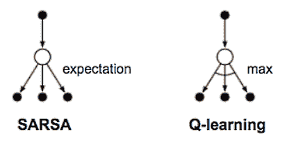
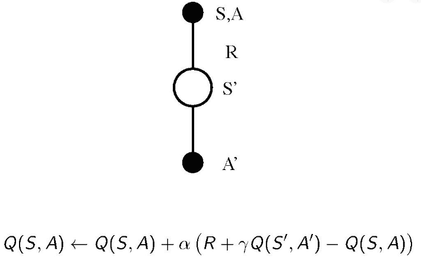
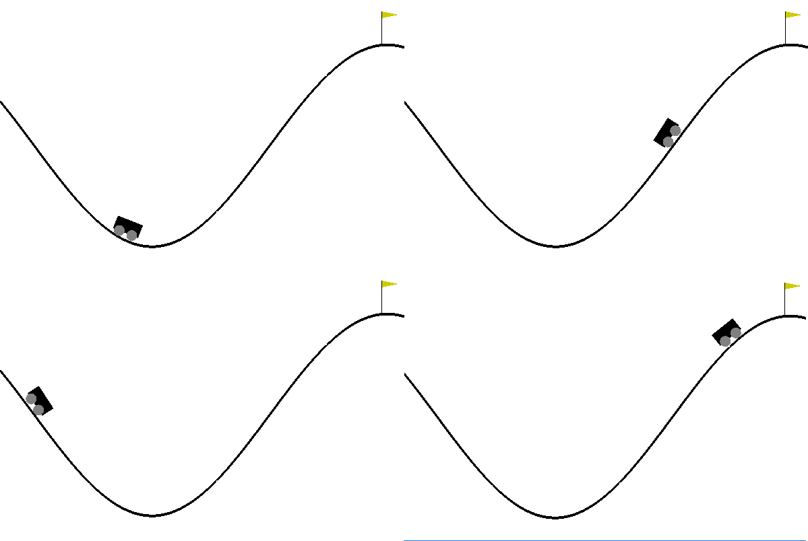
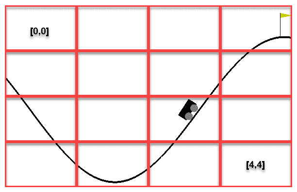
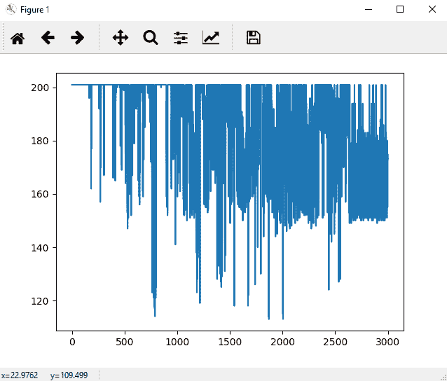
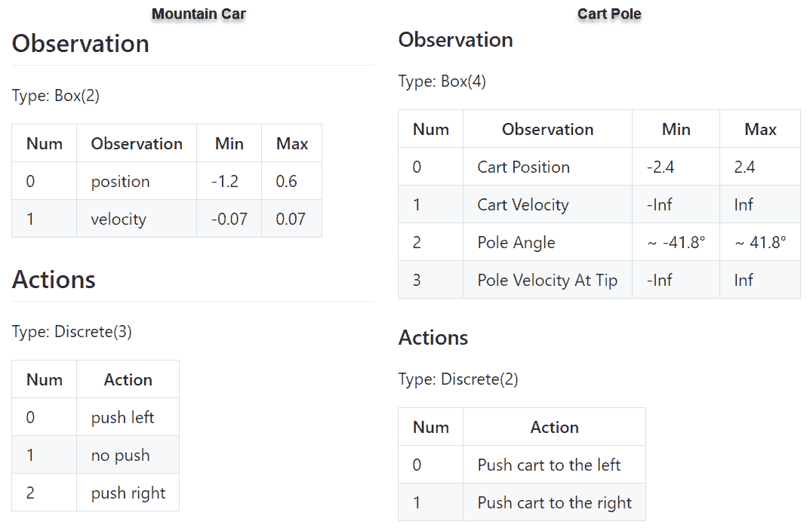
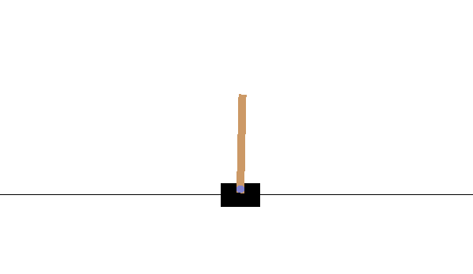
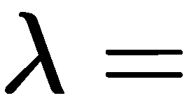
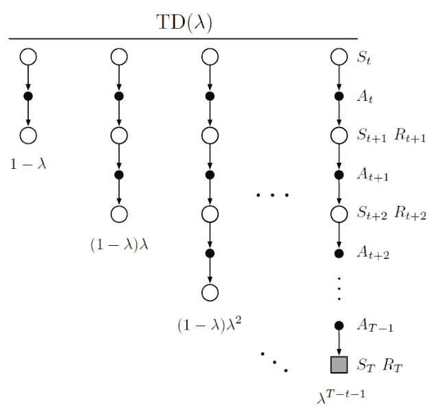
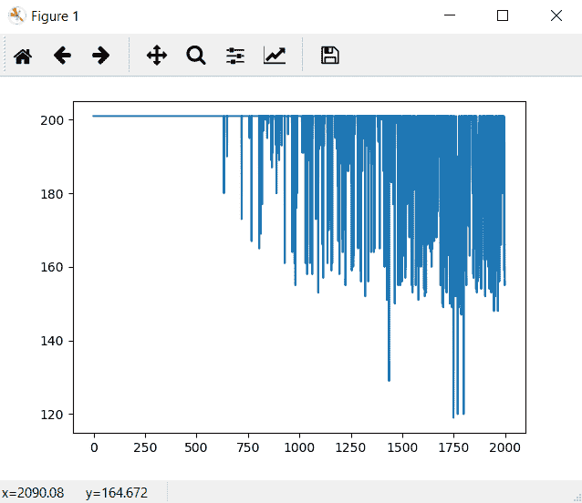

# 探索SARSA

在本章中，我们继续关注**时间差分学习**（**TDL**），并从TD(0)扩展到多步TD以及更远。我们将研究一种新的**强化学习**（**RL**）方法，称为SARSA，探索它是什么，以及它与Q学习的区别。从那里，我们将查看一些来自Gym的新持续控制学习环境示例。然后，我们将更深入地理解TDL，并介绍称为**TD lambda**（λ）和**资格痕迹**的概念。最后，我们将通过查看SARSA的示例来完成本章。

对于本章，我们将扩展我们对TDL的讨论，并揭示**状态-动作-奖励-状态-动作**（**SARSA**），连续动作空间，TD(λ)，资格痕迹和在线策略学习。以下是本章我们将涵盖的内容概述：

+   探索SARSA在线策略学习

+   使用SARSA与连续空间

+   扩展连续空间

+   使用TD(λ)和资格痕迹进行工作

+   理解SARSA(λ)

本章在很大程度上是[第4章](bb05e528-e21b-4753-9e4c-372b8ed11e96.xhtml)，*时间差分学习*的延续。请在阅读本章之前阅读那一章。在下一节中，我们将继续上一章结束的地方。

# 探索SARSA在线策略学习

SARSA，这是该方法模拟的过程。也就是说，算法通过移动到状态，然后选择一个动作，获得奖励，然后移动到下一个状态动作来工作。这使得SARSA成为一个在线策略方法，即算法通过使用相同的策略学习和决策。这与我们在[第4章](bb05e528-e21b-4753-9e4c-372b8ed11e96.xhtml)，*时间差分学习*中看到的Q作为离线策略学习器的方法不同。

以下图表显示了Q学习和SARSA的回溯图之间的差异：



Q和SARSA的回溯图

回想一下，我们的Q学习器是一个离线策略学习器。也就是说，它需要算法离线更新策略或Q表，然后从那里做出决策。然而，如果我们想解决超过一步或TD(0)的TDL问题，那么我们需要有一个在线策略学习器。我们的学习代理或算法必须能够在观察到的任何数量的TD步骤之间更新其策略。这也要求我们更新我们的Q更新方程，使用新的SARSA更新方程，如下所示：


回想一下，我们的Q学习方程是这样的：


在前面的方程中，我们有以下内容：

+   

+   

+   

+   

+   最大最佳或贪婪动作

我们可以将这一点进一步可视化，如下面的图所示：



SARSA图和方程

注意，在SARSA中那个有趣的*max*项现在消失了，我们现在使用期望值而不是仅仅使用最佳值。这与动作选择策略有关。如果你还记得在Q-learning中，我们总是使用最大或最佳动作，根据平均奖励来选择。回想一下，Q-learning假设你平均最大奖励。相反，我们希望选择代理认为将返回最佳可能回报的动作。希望你也注意到了，我们是如何从谈论奖励到价值、状态动作、状态价值，再到现在的回报的，其中回报代表对动作的感知价值。我们将在本章后面更详细地讨论最大化回报。

在下一节中，我们将学习如何解决一种称为**连续动作空间**的新类型问题。然后，我们将探讨如何使用SARSA来解决一个新的Gym环境。

# 使用SARSA的连续空间

到目前为止，我们一直在探索**有限马尔可夫决策过程**或**有限MDP**。这类问题对于模拟和玩具问题来说都很好，但它们并没有展示我们如何解决现实世界的问题。现实世界的问题可以被分解或离散化为有限MDP，但现实问题并不是有限的。现实问题是无限的，也就是说，它们不定义像洗澡或吃早餐这样的离散简单状态。无限MDP在连续空间或连续动作空间中建模问题，也就是说，在我们将状态视为时间点的问题中，状态被定义为时间的切片。因此，**吃早餐**的离散任务可以分解为包括个别咀嚼动作的每个时间步。

使用我们当前的工具集解决无限MDP或连续空间问题并不简单，但我们需要应用离散化技巧。应用离散化或把连续空间分解成离散空间将使这个问题可以用我们的当前工具集解决。在[第6章](a9e9aefb-40af-4886-9b4f-94e725dd2f92.xhtml)“深入DQN”，我们将探讨如何将深度学习应用于连续动作空间，这样我们就可以不使用这些离散化技巧来解决这些环境。

许多连续强化学习环境的环境状态比可观测宇宙中的原子还多，是的，这是一个非常大的数字。我们已经通过应用深度学习，从[第6章](a9e9aefb-40af-4886-9b4f-94e725dd2f92.xhtml)“深入DQN”开始，解决了这些问题。

本章的代码最初来源于这个GitHub仓库：[https://github.com/srnand/Reinforcement-Learning-using-OpenAI-Gym](https://github.com/srnand/Reinforcement-Learning-using-OpenAI-Gym)。看起来作者Shrinand Thakkar已经转向了其他追求，并且没有完成他原本打算完成的这项优秀的工作。

打开`Chapter_5_1.py`并遵循这里显示的练习：

1.  列出的完整源代码如下：

```py
import gym
import math
from copy import deepcopy
import numpy as np
import matplotlib.pyplot as plt

env = gym.make('MountainCar-v0')
Q_table = np.zeros((20,20,3))
alpha=0.3
buckets=[20, 20]
gamma=0.99
rewards=[]
episodes = 3000

def to_discrete_states(observation):
 interval=[0 for i in range(len(observation))]
 max_range=[1.2,0.07] 

 for i in range(len(observation)):
  data = observation[i]
  inter = int(math.floor((data + max_range[i])/(2*max_range[i]/buckets[i])))
 if inter>=buckets[i]:
   interval[i]=buckets[i]-1
  elif inter<0:
   interval[i]=0
  else:
   interval[i]=inter
 return interval

def expect_epsilon(t):
  return min(0.015, 1.0 - math.log10((t+1)/220.))

def expect_alpha(t):
  return min(0.1, 1.0 - math.log10((t+1)/125.))

def get_action(observation,t):
 if np.random.random()<max(0.001, expect_epsilon(t)):
  return env.action_space.sample()
 interval = to_discrete_states(observation) 
 return np.argmax(np.array(Q_table[tuple(interval)]))

def update_SARSA(observation,reward,action,ini_obs,next_action,t): 
 interval = to_discrete_states(observation)
 Q_next = Q_table[tuple(interval)][next_action]
 ini_interval = to_discrete_states(ini_obs)
 Q_table[tuple(ini_interval)][action]+=max(0.4, expect_alpha(t))*(reward + gamma*(Q_next) - Q_table[tuple(ini_interval)][action])

for episode in range(episodes):
  observation = env.reset() 
  t=0
  done=False
  while (done==False):
    env.render()
    print(observation)
    action = get_action(observation,episode)
    obs_next, reward, done, info = env.step(action)
    next_action = get_action(obs_next,episode)
    update_SARSA(obs_next,reward,action,observation,next_action,episode) 
    observation=obs_next
    action = next_action
    t+=1
  rewards.append(t+1)   

plt.plot(rewards)
plt.show()
```

1.  跳过导入部分，我们将查看超参数初始化代码：

```py
env = gym.make('MountainCar-v0')
Q_table = np.zeros((20,20,3))
alpha=0.3
buckets=[20, 20]
gamma=0.99
rewards=[]
episodes = 3000
```

1.  我们从创建一个新的环境`MountainCar-v0`开始，它位于连续空间环境中。然后我们看到`Q_table`表被初始化为全零。然后，我们设置了学习率`alpha`、折现因子`gamma`和剧集数`episodes`的值。我们还看到构建了一个新的列表`buckets`。我们将在稍后介绍`buckets`的作用。

1.  从那里跳到代码的末尾。我们首先想要对代码的功能有一个高级概述。看看这里显示的剧集`for`循环：

```py
observation = env.reset() 
t=0
done=False
while (done==False):
 env.render()
 print(observation)
 action = get_action(observation,episode)
 obs_next, reward, done, info = env.step(action)
 next_action = get_action(obs_next,episode)
 update_SARSA(obs_next,reward,action,observation,next_action,episode)
  observation=obs_next
  action = next_action
  t+=1
rewards.append(t+1) 
```

1.  前面的代码是剧集循环代码，非常遵循我们在前几章中看到的模式。这里的一个主要不同点是算法/智能体似乎选择了两次动作，如下面的代码块所示：

```py
action = get_action(observation,episode)
obs_next, reward, done, info = env.step(action)
next_action = get_action(obs_next,episode)
```

1.  与Q-learning相比，这里的区别在于SARSA中的智能体是按策略的，也就是说，它选择的行为也需要决定其下一个行为。回想一下，在Q-learning中，智能体是离策略的，也就是说，它从一个之前学习过的策略中采取行动。同样，这也回到了TD(0)或一步，其中算法仍然只看一步。

1.  在这个阶段，让我们运行算法来看看它是如何工作的。这里可以看到一些汽车爬山的示例：



来自`Chapter_5_1.py`的示例输出

从前面的截图，我们可以看到智能体正在爬山。让智能体继续爬山直到它到达旗帜；它应该几乎要到达那里了。现在，这很酷，而且相当强大，但考虑到我们可以通过假设我们的无限MDP（连续空间）可以在离散步骤中控制，因此是一个有限MDP，这一点更加突出。为了做到这一点，我们必须学习如何离散化连续的动作空间，我们将在下一节中看到如何做到这一点。

# 离散化连续状态空间

强化学习（RL）局限于离散空间，或者我们之前所学的有限马尔可夫决策过程（MDP）。一个有限MDP描述了一组离散的步骤或状态，以及一个通过概率决定在状态间移动的动作。这个过程的无限版本可能在任意一组状态之间定义无限数量的状态-动作。因此，一个篮球运动员从球场一端移动到另一端投篮，描述了一个无限MDP或连续空间。也就是说，对于每一个时间点，球员可能处于无限多个位置，运球或不运球，投篮等等。同样，在`MountainCar`环境中，汽车可以在任何时间点向上或向下移动，无论是哪个方向。这使得`MountainCar`环境成为一个连续状态空间，但仅仅是刚刚好。幸运的是，我们可以使用一个巧妙的技巧来离散化状态空间，如下所示：



山地车示例离散化

在前面的图中，我们在环境中叠加了一个网格，以表示小车可能处于的状态空间。对于这个示例，使用了一个4x4的网格，但在我们的代码中，我们将使用一个更大的网格。这样做可以让我们捕捉到小车在网格上的位置。由于这个任务的目标是将小车移动到山上，因此通过应用网格技术来离散化空间效果相当好。在更复杂的连续空间中，你的网格可能代表空间中的多个维度或其他特征。幸运的是，当我们学习如何将深度学习应用于连续空间时，我们不必担心那些复杂的数学问题。

现在我们已经了解了空间是如何离散化的，让我们回到`Chapter_5_1.py`中的示例代码，并回顾以下练习中它是如何工作的：

1.  我们将从上次结束的地方开始。在上一个点，我们只是在事件`for`循环中用以下行更新`Q_table`表：

```py
update_SARSA(obs_next,reward,action,observation,next_action,episode)
```

1.  这调用了一个名为`update_SARSA`的函数，如下所示：

```py
def update_SARSA(observation,reward,action,ini_obs,next_action,t):  
  interval = to_discrete_states(observation) 
  Q_next = Q_table[tuple(interval)][next_action]
  ini_interval = to_discrete_states(ini_obs)
  Q_table[tuple(ini_interval)][action]+=max(0.4, expect_alpha(t))*(reward + gamma*(Q_next) - Q_table[tuple(ini_interval)][action])
```

1.  现在，忽略`Q_table`更新代码，而是专注于高亮的`to_discrete_states`调用。这些调用接受一个观察值作为输入。观察值表示小车在*x,y*坐标中的绝对位置。这就是我们使用以下函数来离散化状态的地方：

```py
def to_discrete_states(observation):
 interval=[0 for i in range(len(observation))]
 max_range=[1.2,0.07] 
 for i in range(len(observation)):
   data = observation[i]
   inter = int(math.floor((data + max_range[i])/(2*max_range[i]/buckets[i])))
   if inter>=buckets[i]:
     interval[i]=buckets[i]-1
   elif inter<0:
     interval[i]=0
   else:
     interval[i]=inter
 return interval
```

1.  `to_discrete_states`函数返回小车当前所在的网格区间。在`update_SARSA`函数中，我们使用以下方式将区间列表转换回一个元组：

```py
tuple(interval)
```

1.  再次运行示例，只是为了确认它按预期工作。

这种简单的离散化方法对于这个任务来说效果很好，但根据环境的复杂度，可能会迅速失效或变得过于复杂。在我们继续其他话题之前，我们想要回顾一下下一节中如何使用SARSA更新`Q_table`。

# 预期SARSA

在选择值方面，Vanilla SARSA与Q-learning非常相似。它通常会使用epsilon-greedy最大动作策略，这与我们之前使用的方法类似；然而，我们发现，尤其是在按策略工作的情况下，算法需要更加选择性地进行。现在，这确实是所有强化学习（RL）的目标，但在这个特定的情况下，我们通过引入期望来更好地管理这些权衡。当我们结合SARSA时，我们称之为**期望SARSA**。

在期望SARSA中，我们假设一个未知的学习率alpha，以及一个未知的探索率epsilon。相反，我们使用基于分配奖励的函数将学习率alpha和探索率epsilon等同起来。我们为每个时间步分配一个时间点奖励，然后根据这些计算新的alpha和epsilon。打开`Chapter_5_2.py`文件，让我们通过以下练习来查看这是如何工作的：

1.  我们感兴趣的代码的两个函数在此处显示：

```py
def expect_epsilon(t):
  return min(0.015, 1.0 - math.log10((t+1)/220.))

def expect_alpha(t):
  return min(0.1, 1.0 - math.log10((t+1)/125.))
```

1.  这两个函数，`expect_epsilon`和`expect_alpha`，根据到目前为止返回的奖励计算期望或比率，其中`t`等于小车在环境中移动的总时间。

1.  我们可以通过查看此处显示的`get_action`函数来关注`expect_epsilon`的使用：

```py
def get_action(observation,t):  
  if np.random.random()<max(0.001, expect_epsilon(t)):
    return env.action_space.sample()
  interval = to_discrete_states(observation) 
  return np.argmax(np.array(Q_table[tuple(interval)]))
```

1.  `get_action`函数根据观察到的信息（小车*x*和*y*位置）返回动作。它是通过首先检查是否要采样随机动作，或者相反，选择最佳动作来做到这一点的。我们通过使用`expect_epsilon`方程来确定这种概率，该方程根据在环境中玩的总游戏时间计算epsilon。这意味着在这个例子中，epsilon的范围将在0.001和0.0015之间；看看你是否能在代码中找出这一点。

1.  接下来，我们做类似的事情来计算`update_SARSA`函数中显示的`alpha`。再次显示使用此功能的单行：

```py
Q_table[tuple(ini_interval)][action]+=max(0.4, expect_alpha(t))*(reward + gamma*(Q_next) - Q_table[tuple(ini_interval)][action])
```

1.  之前的代码现在应该很熟悉了，因为它看起来像我们的常规策略更新方程，只是在这次实例中，我们使用基于当前任务时间的期望来调整`alpha`的值。你也可以从某些方面将其视为一种次级奖励。

1.  再次运行代码并让它完成。注意输出，因为我们很快会将其用作比较：



训练时间内的回报/奖励输出

图表显示了小车在环境中累积的奖励/时间。每次小车在环境中停留的时间片都会获得时间奖励，如果小车在几个时间片内保持静止或相对静止，则游戏结束。因此，小车在环境中停留的时间越长，也等于移动得越多。

在考虑实时问题时，我们不仅需要关注连续状态或连续观察。在现实世界中，我们还要处理连续动作空间。目前，我们一直在研究具有离散动作空间的问题，即使用任意离散动作来控制智能体的环境。这些动作通常是上、下、左和右。然而，对于现实世界，我们需要更精细的控制，通常将动作分类为左转*x*度或右转*y*度。通过添加连续动作空间，我们的强化学习算法变得更加灵活，提供了更精细的控制。将离散动作空间离散化到连续动作空间更困难，这不是我们关注的重点。相反，我们将探讨如何在下一节中转换另一个更流行的连续动作空间，该空间用于深度强化学习。

# 扩展连续空间

通常，我们会将具有大观察空间的问题留给深度学习来解决。正如我们将学习的，深度学习非常适合这类问题。然而，深度学习并非没有问题，有时尝试在没有深度学习的情况下解决环境是明智的。现在，并非所有环境都能很好地离散化，正如我们之前提到的，但我们确实想看看另一个例子。下一个我们将要查看的例子是臭名昭著的滑车杆环境，它几乎总是使用深度强化学习来解决，主要是因为它使用了一个具有四个维度的连续动作空间。记住，我们之前的观察空间只有一个维度，而在我们上一个例子中，我们只有两个维度。

能够转换智能体的观察空间可以是一个有用的技巧，尤其是在更抽象的游戏环境中。记住，好的游戏机制往往更注重乐趣而非准确性。这当然也适用于游戏中的一些AI元素。

如果环境有GitHub页面，你可以通过访问该页面找到观察和状态空间的详细信息。大多数更受欢迎的环境都有自己的页面。以下摘录显示了**滑车杆**和**山地车**的观察和动作空间：



山地车和滑车杆环境的空间

上述摘录显示了**山地车**与**滑车杆**环境的比较。这两个环境都使用离散动作空间，这是好的。然而，**滑车杆**环境使用了一个具有四个维度的观察空间，其值在截图中的表格中显示。这可能有点棘手，了解多维观察空间如何工作将非常有帮助。

打开 `Chapter_5_3.py` 并按照这个练习来查看我们的上一个例子是如何转换为**滑车杆**的：

1.  大部分代码与最后两个示例相同，所以我们只需要查看差异。我们将从顶部的环境构建部分开始，如下所示：

```py
env = gym.make('CartPole-v0')
```

1.  这构建了臭名昭著的 **Cart Pole** 环境。再次强调，切换环境很容易，但你的代码必须适应观察和动作空间。**Cart Pole** 和 **Mountain Car** 具有相同的观察/动作空间类型。也就是说，其观察空间是连续的，但动作空间是离散的。

1.  接下来，我们将查看并了解这如何影响我们在此处代码中的 `Q_table` 表的初始化：

```py
Q_table = np.zeros((20,20,20,20,3))
```

1.  注意现在表格是如何配置为四个维度，每个维度大小为 20。之前，这仅仅是两个维度，每个维度大小为 20。如果你需要比较，请回过头去检查最后的代码示例。

1.  随着 `Q_table` 表中维度的增加，这也意味着我们需要在我们的离散化桶中添加更多维度，如下所示：

```py
buckets=[20, 20, 20, 20]
```

1.  再次，我们将 `buckets` 数组从两个维度增加到四个，所有维度的大小都是 `20`。我们任意使用大小为 20，但我们也可以使用更大的或更小的值。

1.  我们最后需要做的是重新定义环境观察的边界。回想一下，我们能够从 GitHub 页面提取出这些信息。这是显示范围中最小/最大值的表格。我们感兴趣的代码行就在 `to_discrete_states` 函数内部，如下所示：

```py
def to_discrete_states(observation):
 interval=[0 for i in range(len(observation))]
 max_range=[2.4,999999, 41.8,999999]
```

1.  这一行被突出显示并声明了 `max_range` 变量。`max_range` 设置观察空间中每个维度的最大值。我们用表中的值填充这个变量，在无穷大的情况下，我们使用六个 9（999999），这通常适用于具有无穷大的值的上限。

1.  接下来，我们需要更新用于索引 `Q_table` 表的轴维度，如下所示代码所示：

```py
Q_table[:,:,:,:,action]+=lr*td_error*(eligibility[:,:,:,:,action])
```

1.  在前面的代码中，请注意我们现在正在对四个维度和动作进行索引。

1.  按照常规运行代码并观察输出；这里有一个示例：



示例：Chapter_5_3.py

最终，使用离散化观察空间的 SARSA 可以解决 `CartPole` 环境。这个可能需要一段时间来学习，所以请耐心等待，但智能体将学会在车上平衡杆子。你应该对离散化如何工作以及 TD (0) 中的 SARSA 有相当好的理解。在下一节中，我们将探讨向前/向后看超过一步的情况。

# 与 TD (λ) 和资格迹（eligibility traces）一起工作

到目前为止，我们一直关注的是前视或代理感知到的下一个最佳奖励或状态。在**MC**中，我们查看整个剧集，然后使用这些值来反向计算回报。对于Q学习、SARSA等TDL方法，我们查看单步前瞻或我们所说的TD（0）。然而，我们希望我们的代理能够提前考虑*n*步。如果我们能这样做，那么我们的代理肯定能够做出更好的决策。

如我们之前所见，我们可以使用折现因子gamma对步骤间的回报进行平均。然而，在这个阶段，我们需要更加小心地处理回报的平均或收集方式。相反，我们可以将所有回报在无限多个步骤前进行平均定义为以下内容：


在前一个方程中，我们有以下内容：

+    这是所有回报的加权平均值。

+    这是从*t*到*t+n*的单个剧集回报。

+    Lambda，一个介于[0,1]之间的权重值。

由于lambda小于1，随着*n*的增加，对最终平均回报的贡献量会逐渐减小。这是由于在前一个方程中将lambda（λ）提升到*n*的幂次所致。再次强调，这与使用折现因子gamma的原理相同。现在，当我们从*n*步或我们所说的lambda的角度思考时，我们可以回顾以下图表中的情况：



TD（λ）的进展

为了找到*n*时间步长的通用解，其中*n*是我们称为lambda（λ）的未知数，我们需要确定一个寻找lambda的通用解，即lambda的值可以泛化问题。我们可以通过首先假设任何剧集将在时间步长*t*结束，然后按照以下方式重写我们之前的方程来实现这一点：


当lambda的值为0时，这代表TD（0）。lambda的值为1代表MC或需要完整的剧集前瞻。然而，实现这种前瞻模型比较复杂，并且直观上看，前瞻只是生物动物学习过程中的一个非常小的部分。实际上，我们学习的主要来源是经验，这正是我们在下一节将要考虑的内容。

# 后视和资格痕迹

你还记得上一次你在地板或街上找到硬币的时间吗？在你捡起硬币后，你是否想过：a) "我知道低头看那么久会得到回报，" 或 b) "哇，我找到了一个硬币，我是怎么做到的？" 事实上，在大多数情况下，会是选项 *b*，也就是说，我们学到某件事是好的，然后回想起我们是怎样发现它的。选项 *a* 中的精彩时刻类似于相信量子粒子、原子和细菌。在强化学习（RL）中，情况也是如此，我们发现回顾过去发生的事情通常更有用；然而，不要回溯得太远，以至于成为像蒙特卡洛（MC）那样的过去事件。

我们可以使用 TDL 来回顾几步的回报。然而，我们不能仅仅使用状态转换的绝对值。相反，我们需要使用以下方程确定每步回溯的预测误差：


在前面的方程中，我们有以下：

+   [] 这是 TD 错误或 delta。

+   [] 值函数，它可以进一步定义为以下：


我们可以进一步定义以下：


在前面的方程中， 当状态处于 *s.* 时赋予完整的值 1。

*E* 表示资格因子或值在 TD 错误中应考虑的量。这里发生的情况是，值函数正在通过 *n* 步的 TD 错误数量进行更新，但我们不是向前看，而是向后看。就像强化学习（RL）中的所有事情一样，这似乎需要在算法的多个变体中应用。对于 *n* 步 TDL 或 TD (λ)，我们有三个我们关注的变体。它们是表格式 TD (λ)、SARSA (λ) 和 Q (λ)。以下图表显示了伪代码中的每个算法变体：


TD (λ), SARSA (λ), 和 Q (λ)

每个算法在计算值和 TD 错误的方式上都有细微的差别。在下一节中，我们将查看 SARSA (λ) 的完整代码实现。

# 理解 SARSA (λ)

我们当然可以使用表格式在线方法实现 TD (λ)，这是我们还没有覆盖的，或者使用 Q-learning。然而，由于这是关于 SARSA 的章节，我们继续这一主题是合情合理的。打开 `Chapter_5_4.py` 并遵循练习：

1.  代码与我们的前例相当相似，但让我们回顾一下完整的源代码，如下所示：

```py
import gym
import math
from copy import deepcopy
import numpy as np
import matplotlib.pyplot as plt
import seaborn as sns

env = gym.make('MountainCar-v0')
Q_table = np.zeros((65,65,3))
alpha=0.3
buckets=[65, 65]
gamma=0.99
rewards=[]
episodes=2000
lambdaa=0.8

def to_discrete_states(observation):
 interval=[0 for i in range(len(observation))]
 max_range=[1.2,0.07] 
 for i in range(len(observation)):
  data = observation[i]
  inter = int(math.floor((data + max_range[i])/(2*max_range[i]/buckets[i])))
  if inter>=buckets[i]:
   interval[i]=buckets[i]-1
  elif inter<0:
   interval[i]=0
  else:
   interval[i]=inter
 return interval

def expect_epsilon(t):
  return min(0.015, 1.0 - math.log10((t+1)/220.))

def get_action(observation,t):
 if np.random.random()<max(0.001, expect_epsilon(t)):
  return env.action_space.sample()
 interval = to_discrete_states(observation)
 return np.argmax(np.array(Q_table[tuple(interval)]))

def expect_alpha(t):
  return min(0.1, 1.0 - math.log10((t+1)/125.))

def updateQ_SARSA(observation,reward,action,ini_obs,next_action,t,eligibility):
 interval = to_discrete_states(observation)
 Q_next = Q_table[tuple(interval)][next_action]
 ini_interval = to_discrete_states(ini_obs)
 lr=max(0.4, expect_alpha(t))
 td_error=(reward + gamma*(Q_next) - Q_table[tuple(ini_interval)][action])
 Q_table[:,:,action]+=lr*td_error*(eligibility[:,:,action])
for episode in range(episodes):
  observation = env.reset()
  t=0
  eligibility = np.zeros((65,65,3))
  done=False
  while (done==False):
    env.render()
    action = get_action(observation,episode)
    next_obs, reward, done, info = env.step(action)
    interval = to_discrete_states(observation)
    eligibility *= lambdaa * gamma
    eligibility[tuple(interval)][action]+=1

    next_action = get_action(next_obs,episode)
    updateQ_SARSA(next_obs,reward,action,observation,next_action,episode,eligibility)
    observation=next_obs
    action = next_action
    t+=1
  rewards.append(t+1)

plt.plot(rewards)
plt.show()
```

1.  代码的上半部分与之前的例子相当相似，但有几个显著的不同之处。注意以下代码初始化了 `MountainCar` 环境和 `Q_table` 表格设置：

```py
env = gym.make('MountainCar-v0')
Q_table = np.zeros((65,65,3))
```

1.  注意我们是如何在初始化`Q_table`表时将离散状态的数量从20 x 20增加到65 x 65。

1.  现在的主要区别是使用lambda计算可选性。我们可以在下面的代码中的底部`for`循环中找到此代码，如下所示：

```py
env.render()
action = get_action(observation,episode)        next_obs, reward, done, info = env.step(action)
interval = to_discrete_states(observation)
eligibility *= lambdaa * gamma
eligibility[tuple(interval)][action]+=1 
next_action = get_action(next_obs,episode)
updateQ_SARSA(next_obs,reward,action,observation,next_action,episode,eligibility)
observation=next_obs
action = next_action
t+=1
```

1.  可选性的计算在突出显示的行中进行。注意我们是如何将`eligibility`乘以`lambda`和`gamma`，然后为当前状态加一的。然后将此值传递到`update_SARSA`函数中，如下所示：

```py
def updateQ_SARSA(observation,reward,action,ini_obs,next_action,t,eligibility):
 interval = to_discrete_states(observation)
 Q_next = Q_table[tuple(interval)][next_action]
 ini_interval = to_discrete_states(ini_obs)
 lr=max(0.4, expect_alpha(t))
 td_error=(reward + gamma*(Q_next) - Q_table[tuple(ini_interval)][action])
 Q_table[:,:,action]+=lr*td_error*(eligibility[:,:,action])
```

1.  注意我们现在是根据`td_error`和`eligibility`的确定来更新`Q_table`表的。换句话说，我们现在考虑信息的当前性和过去的价值。

1.  按照常规再次运行代码示例，并观察智能体如何完成任务。此任务的训练输出如下所示：



SARSA（λ）的奖励输出图

生成前面图表所示的图形可能需要几分钟时间，所以请耐心等待。务必注意这与我们在本章中已经运行过的先前示例相比如何。你真的完成了所有的样本练习吗？注意每个时间段的回报/奖励输出是如何更快地增加并更快地收敛的。

我们想在下一个例子中查看一个更复杂的例子，将我们对离散化的使用推向极致。

# SARSA lambda和Lunar Lander

随着我们开发的算法变得越来越复杂，它们的性能也越来越强大。然而，它们有局限性，了解任何技术的局限性都很重要。为了测试这些限制，我们想看看一个能够推动它们的例子。对于这个特定的情况，我们将查看Gym中的Lunar Lander环境。这个环境是根据同名经典街机游戏建模的，目标是将登月舱降落在月球表面。在这个环境中，观察空间由八个维度描述，动作空间由四个维度描述。我们将看到，这很快就会超出我们当前的计算限制。

`LunarLander`环境需要安装一个名为`Box2D`的特殊模块。这本质上是一个图形包。

按照下一节的练习来设置和运行Gym的高级`Box2D`模块：

+   按照以下步骤在Windows（Anaconda）上操作：

1.  以管理员身份打开Anaconda Prompt。运行以下命令：

```py
 conda install swig
```

SWIG是`Box2D`的要求。

1.  接下来，运行以下命令安装Box2D：

```py
pip install box2d-py

```

+   按照以下步骤在Mac/Linux（或没有Anaconda的Windows）上操作：

1.  打开Python shell并运行以下命令：

```py
pip install gym[all]
```

1.  如果遇到问题，请参阅Windows安装说明。

现在的安装允许你运行所有更高级的Box2D环境。这些环境在游戏性和训练上都要有趣得多。打开`Chapter_5_5.py`并按照练习设置和训练月球着陆器上的SARSA：

1.  `Chapter_5_5.py`的源代码几乎与`Chapter_5_4.py`相同，除了在设置离散状态方面有一些细微的差异。我们将首先查看如何使用以下代码设置`Q_table`表：

```py
env = gym.make('LunarLander-v2')
Q_table = np.zeros((5,5,5,5,5,5,5,5,4))
```

1.  注意我们是如何从65步的值减少到5。最后一个值表示动作空间的大小，它从`MountainCar`中的三个增加到`LunarLander`中的四个。然而，由于有八个维度，我们必须小心数组的尺寸。因此，在这个例子中，我们需要将每个步长限制为五。

1.  接下来，我们初始化`buckets`状态：

```py
buckets=[5,5,5,5,5,5,5,5]
```

1.  再次，初始化为三个大小，用于八个维度。

1.  然后，我们设置`max_range`值，这是我们想要我们的步骤跨越的最大值，如下所示：

```py
max_range=[100,100,100,100,100,100,100,100] 
```

1.  我们在这里使用100这个值来表示某个任意的最大值。改变或调整这些值可能会提高训练效率。

1.  接下来，我们需要扩展`Q_table`索引以包括8个维度，如下所示：

```py
Q_table[:,:,:,:,:,:,:,:,action]+=lr*td_error*(eligibility[:,:,:,:,:,:,:,:,action])
```

1.  注意在这个例子中我们对代理施加的限制。我们实际上让代理以大块的方式观察，其中每个块或轴特征只分为三个部分。这个方法的有效性令人惊讶。

1.  运行示例并让它完成。是的，这个会花一些时间，但这是值得的。以下是一个来自月球着陆器环境的示例输出：


来自`Chapter_5_5.py`的示例输出

在上一个例子中，我们简要地探讨了在另一个连续观察空间环境——月球着陆器上使用SARSA。虽然在这些环境中玩耍并观察我们的离散化如何适当地处理无限MDP很有趣，但现在是时候转向使用深度学习的强大工具来处理连续观察空间了。从奖励输出中我们可以看到，这个例子根本就没有收敛。这很可能是由于离散化不够精细；也许你可以在这方面有所改进？

在这个例子中，离散化过程并不最优，并且可以使用一些DP方法进行改进。

将深度学习网络应用于强化学习（RL）使我们能够处理巨大的连续观察和动作空间。因此，在未来的常规操作中，我们可能不需要经常进行空间离散化，但对于更简单的问题，它可能是一个有用的技巧或优势。

这完成了这一章，我鼓励你继续前进并探索练习，以提升你自己的学习。

# 练习

这些练习是为了让你使用和学习而提供的。至少尝试2-3个，你做得越多，后面的章节也会越容易：

1.  在线策略代理和离线策略代理之间有什么区别？

1.  调整本章中任何或所有示例的超参数，包括新的超参数`lambda`。

1.  在任何使用离散化的示例中更改离散化步骤，并观察它对训练的影响。

1.  使用示例 `Chapter_5_3.py`，**SARSA(0**)，并将其适配到另一个使用连续观察空间和离散动作空间的Gym环境。

1.  使用示例 `Chapter_5_4.py`，**SARSA(λ**)，并将其适配到另一个使用连续观察空间和离散动作空间的Gym环境。

1.  代码中显示了一个未使用的超参数。它是哪个参数？

1.  使用示例 `Chapter_5_5.py`，**SARSA(λ**)，月球着陆器，并优化离散化以使其表现更佳。例如，你仍然受限于数组维度，但你可以增加或减少一些更重要的维度。

1.  使用示例 `Chapter_5_5.py`，**SARSA(λ**)，月球着陆器，并优化`max_range`值以使其表现更佳。例如，而不是将所有值都设置为999，检查是否某些值可以缩小或需要扩展。

1.  更新一个示例以适应连续动作环境。这需要你将动作空间离散化。

1.  将其中一个示例转换为Q-learning，即它使用离线策略。

随意探索更多内容。我们仅仅触及了这些方法复杂性的表面。最后，我们将在下一节中总结。

# 摘要

对于本章，我们继续探索TD学习。我们查看了一个名为**SARSA**的在线TD (0)方法的示例。然后，我们探讨了如何将观察空间离散化以解决更难的问题，但仍然使用相同的工具集。从那里，我们探讨了如何解决更难的连续空间问题，例如`CartPole`。之后，我们回顾了TDL，然后转向*n*步前瞻视角，认为这不够理想，然后转向后向视角和资格痕迹，这导致我们发现了TD (λ)、SARSA(λ)和Q (λ)。使用SARSA(λ)，我们能够在远少于预期的时间内解决`MountainCar`环境。最后，我们想要使用SARSA(λ)而不使用深度学习来解决一个更困难的`LunarLander`环境。

在下一章中，我们将探讨引入深度学习，并提升自己成为深度强化学习者。
