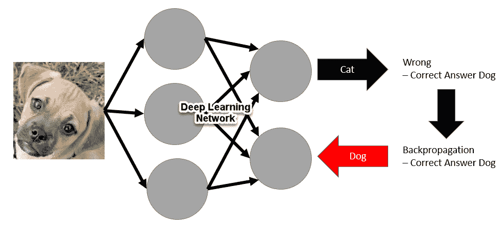
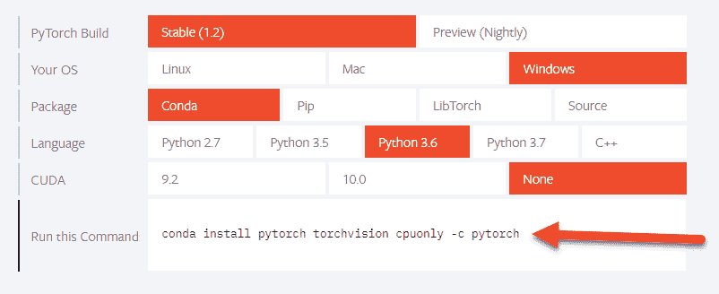
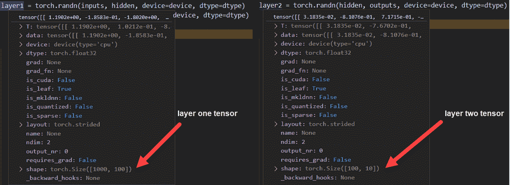
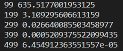
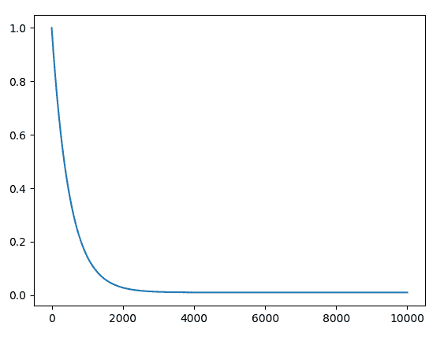
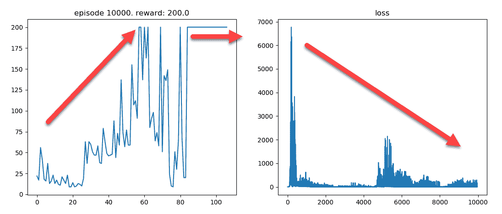
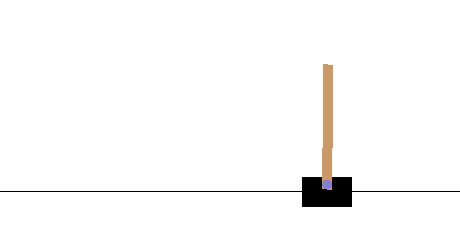
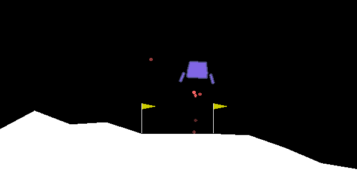

# 第八章：深度学习与DQN

在本章中，你将了解**深度学习**（**DL**），以便处理更新、更具挑战性的无限**马尔可夫决策过程**（**MDP**）问题。我们将涵盖一些与**强化学习**（**RL**）相关的DL基础知识，然后探讨如何解决Q学习问题。之后，我们将探讨如何构建深度Q学习或DQN代理来解决一些Gym环境。

下面是本章我们将涵盖的主题摘要：

+   深度学习在强化学习中的应用

+   使用PyTorch进行深度学习

+   使用PyTorch构建神经网络

+   在PyTorch中理解DQN

+   锻炼DQN

在本章中，我们介绍深度学习与强化学习的关系。将深度学习应用于**深度强化学习**（**DRL**）非常具体，这里没有详细涵盖。

# 深度学习在强化学习中的应用

在前五章中，我们学习了如何评估给定有限MDP的状态和动作的价值。我们学习了如何使用MC、DP、Q学习和SARSA等方法解决各种有限MDP问题。然后我们探讨了无限MDP或连续观察/动作空间问题，我们发现这类问题引入了计算限制，这些限制只能通过引入其他方法来克服，这就是深度学习介入的地方。

深度学习现在如此流行且易于获取，我们决定在这本书中只涵盖该主题的非常广泛的概述。任何认真想要构建DRL代理的人应该自己进一步学习深度学习。

对于许多人来说，深度学习（DL）涉及图像分类、语音识别，或者那个被称为**生成对抗网络**（**GAN**）的新潮事物。现在，这些都是深度学习的伟大应用，但本质上，深度学习是关于学习如何最小化损失或错误。因此，当将图像展示给网络以学习图像时，它首先被分割，然后输入到网络中。然后网络输出一个答案。答案的正确性被确定，任何错误都会作为学习方式被推回到网络中。这种将错误推回网络的方法被称为**反向传播**。

整个系统的基本原理如下所示：



深度学习过于简化

深度学习网络通过反向传播错误，作为对每个称为神经元的单元的修正来学习，神经元内部有称为权重的参数。每个权重控制着与该神经元的连接强度。网络中每个连接或权重的强度使用基于梯度下降的优化方法进行修改。**梯度下降**（**GD**）是一种源自微积分的方法，它允许我们计算每个连接/权重对答案的影响。反向工作，因此我们可以使用GD来确定每个权重需要的修正量。

使用GD（梯度下降）进行反向传播的主要缺点是训练或学习需要非常缓慢地进行。因此，可能需要向网络展示数千或数百万个图像，以便它能够学习。当我们将深度学习应用于强化学习时，这实际上效果很好，因为我们的试错学习方法也是迭代的。

DeepMind和其他公司目前正在研究除了用于深度学习网络的反向传播之外的其他学习方法。甚至有人谈论过进行一次学习。也就是说，只需用一个图像就能训练一个网络。这与我们人类学习的方式非常相似。

现在，人们常说深度学习可以有多种解释。作为强化学习从业者，我们对深度学习的兴趣在于将其用作方程求解器。你本质上会发现，深度学习做的就是解方程；无论是用于图像分类、语音翻译还是用于强化学习的方程。深度强化学习是应用深度学习来解决我们在前几章中看到的以及更多的学习方程。实际上，深度学习的加入也为学习提供了许多其他能力，我们将在本书的其余部分进行探讨。在下一节中，我们将概述用于DRL的常见深度学习框架。

# DRL的深度学习框架

目前有多个深度学习框架可供使用，但只有少数在强化学习研究或项目中得到了广泛应用。这些框架之间有许多相似之处，因此从一个框架转移到另一个框架相对简单。在过去几年中，用于强化学习的三个最受欢迎的框架是Keras、TensorFlow和PyTorch。

下面这张表展示了每个框架的优缺点总结：

| **框架** | **Keras** | **TensorFlow** | **PyTorch** |
| --- | --- | --- | --- |
| **可访问性** | 最容易学习和使用 | 提供高级Keras接口和低级接口。 | 中级到低级接口 |
| **可扩展性** | 适用于小型项目 | 可扩展到任何规模的项目，并且支持的输出网络模型可以在许多不同的平台上运行。 | 适用于需要扩展的大型项目 |
| **性能/功率** | 简单的接口和有限的定制 | 强大且非常适合性能 | 优秀的性能，并提供最多的控制和额外的接口，用于定制开发 |
| **流行度** | 流行度下降 | 持续流行的框架，被认为是行业最佳。 | 流行度上升，尤其是在DRL应用中 |

如果你查看这张表，我们选择深度学习框架的明显选择将是PyTorch。基于Torch的PyTorch是一个相对较新的框架，但在短短几年内，它作为深度学习和深度强化学习框架已经获得了巨大的流行度。因此，它将成为我们本章选择的框架。在下一节中，我们将探讨如何开始使用PyTorch进行深度学习。

# 使用PyTorch进行深度学习

PyTorch 提供了构建深度学习网络/计算图的低级和中级接口。尽管我们构建深度学习系统时将其视为具有层中连接的神经元的网络，但神经网络的实际实现是通过计算图来完成的。计算图位于所有深度学习框架的核心，TensorFlow 也不例外。然而，Keras 从用户那里抽象掉了计算图的概念，这使得学习更容易，但并不像 PyTorch 那样提供灵活性。但在我们开始使用 PyTorch 构建计算图之前，让我们先在下一个练习中安装 PyTorch：

1.  将您的浏览器导航到 [pytorch.org,](https://pytorch.org) 并向下滚动到 **运行此命令** 部分，如下面的截图所示：



生成 PyTorch 安装命令

1.  选择 **稳定** 版本，然后选择您的特定 **操作系统**（**Linux**、**Mac** 或 **Windows**）。接下来选择 **包**（**Conda**、**Pip**、**LibTorch** 或 **源**）；我们在这里的首选是 **Conda** 用于 Anaconda，但如果您有其他经验，请使用它们。

1.  接下来，选择 **语言**（Python 2.7、Python 3.5、Python 3.7 或 C++）；对于我们来说，我们将使用 **Python 3.6**。

1.  下一个选项 **CUDA**（**9.2**、**10.0** 或 **None**）确定您是否有能够运行 **CUDA** 的 **图形处理单元**（**GPU**）。目前，唯一受支持的 GPU 是由 NVIDIA 制造的。这种情况不太可能在短期内改变。对于我们来说，我们将使用 **None**。**None** 或 CPU 仅在 CPU 上运行，这较慢，但可以在大多数设备上运行。

1.  在管理员权限下打开一个 64 位 Python 控制台。如果您使用 **Conda**，请以管理员身份启动窗口。

1.  使用以下命令创建新的虚拟环境：

```py
conda create -n gameAI python=3.6
```

1.  这将使用 Python 3.6 创建虚拟环境。PyTorch 目前在 Windows 64 位上运行。这可能会根据操作系统而有所不同。然后使用以下命令激活环境：

```py
activate gameAI
```

1.  将之前生成的 `install` 命令复制并粘贴到窗口中，并执行它。以下是在 Windows 上运行 Anaconda 的命令示例：

```py
conda install pytorch torchvision cpuonly -c pytorch
```

1.  此命令应安装 PyTorch。如果您遇到任何问题，例如显示库对 32 位不可用的错误，请确保您正在使用 64 位版本的 Python。

前面的过程将安装 PyTorch 以及我们现在需要的所有依赖项。如果您在安装框架时遇到问题，请检查在线文档或众多在线帮助论坛之一。在大多数情况下，通过确保您使用 64 位并作为管理员运行，可以解决安装问题。

本书的所有代码示例都已准备并使用Visual Studio Professional或Visual Studio Code进行测试，两者都安装了Python工具。VS Code是一个免费且跨平台的优秀编辑器。它是Python开发的相对新手，但受益于微软多年来在构建**集成开发环境**（**IDEs**）方面的经验。

在安装了PyTorch之后，我们可以在下一节中继续使用一个简单的示例，该示例创建一个计算深度学习图。

# 张量计算图

所有深度学习框架的核心概念是张量，或者我们通常认为的多维数组或矩阵。我们构建的计算图将使用各种操作在张量上工作，将输入线性地转换成最终输出。您可以将其视为一种流程，这也是TensorFlow命名的原因。在接下来的练习中，我们将使用计算PyTorch图构建一个两层深度学习网络，并训练该网络：

这里所涉及的概念假设读者已经理解了线性代数、矩阵乘法和线性方程组。因此，建议任何缺乏这些技能或需要快速复习的读者进行复习。当然，快速复习微积分也可能很有用。

1.  打开`Chapter_6_1.py`代码示例。该示例是从PyTorch快速入门手册中提取的，其中一些变量名被更改以更具上下文性：

```py
import torch

dtype = torch.float
device = torch.device("cpu")
# device = torch.device("cuda:0") # Uncomment this to run on GPU

batch_size, inputs, hidden, outputs = 64, 1000, 100, 10
x = torch.randn(batch_size, inputs, device=device, dtype=dtype)
y = torch.randn(batch_size, outputs, device=device, dtype=dtype)

layer1 = torch.randn(inputs, hidden, device=device, dtype=dtype)
layer2 = torch.randn(hidden, outputs, device=device, dtype=dtype)
learning_rate = 1e-6

for t in range(500):
  h = x.mm(layer1)
  h_relu = h.clamp(min=0)
  y_pred = h_relu.mm(layer2)

  loss = (y_pred - y).pow(2).sum().item()
  if t % 100 == 99:
    print(t, loss)

  grad_y_pred = 2.0 * (y_pred - y)
  grad_layer2 = h_relu.t().mm(grad_y_pred)
  grad_h_relu = grad_y_pred.mm(layer2.t())
  grad_h = grad_h_relu.clone()
  grad_h[h < 0] = 0
  grad_layer1 = x.t().mm(grad_h)

  layer1 -= learning_rate * grad_layer1
  layer2 -= learning_rate * grad_layer2
```

1.  我们首先使用`import torch`导入PyTorch库。然后设置我们首选的数据类型`dtype`变量为`torch.float`。接着通过使用`torch.device`并传入`cpu`来初始化设备变量，表示仅使用CPU。示例中保留了启用CUDA在GPU上运行的选项，但安装CUDA由您自行决定：

```py
batch_size, inputs, hidden, outputs = 64, 1000, 100, 10
```

1.  接下来，我们设置一些变量来定义数据的处理方式和网络的架构。`batch_size`参数表示在一次迭代中要训练的项目数量。`inputs`变量表示输入空间的大小，而`hidden`变量代表网络中隐藏或中间层的神经元数量。最后的`outputs`变量表示输出空间或网络输出层的神经元数量：

```py
x = torch.randn(batch_size, inputs, device=device, dtype=dtype)
y = torch.randn(batch_size, outputs, device=device, dtype=dtype)
```

1.  之后，我们设置了输入和输出变量：`x`作为输入，`y`作为输出，这些变量将基于`batch_size`的随机采样进行学习。在这个例子中，`inputs`变量的大小为1,000，因此批次的每个元素都将有1,000个输入用于`x`。输出有10个值，因此每个`y`的样本也将有10个项目：

```py
layer1 = torch.randn(inputs, hidden, device=device, dtype=dtype)
layer2 = torch.randn(hidden, outputs, device=device, dtype=dtype)
```

1.  这两条线创建了我们深度学习网络中的计算层，这些层是由我们之前的 `inputs`、`hidden` 和 `outputs` 参数定义的。此时，`layer1` 和 `layer2` 的张量内容包含一个初始化的随机权重集，其大小由输入数量、隐藏层和输出数量设置。

1.  您可以通过在层设置之后的行设置断点，然后在 Visual Studio Code 或 Professional 中以调试模式 *F5* 运行文件来可视化这些张量的大小。当断点被触发时，您可以使用鼠标悬停在变量上以查看有关张量的信息，如下面的截图所示：



检查层权重张量的大小

1.  注意第一层的维度是 1000 x 100，第二层的维度是 100 x 10。在计算上，我们通过乘以第一层的权重来转换输入，然后将结果输出到第二层。在这里，第二层的权重乘以第一层的输出。我们很快就会看到这是如何工作的。

1.  接下来，我们定义一个 `learning_rate` 参数，或者我们现在将明确地称之为超参数。学习率是一个乘数，我们可以用它来缩放学习的速率，并且与之前探索的学习率 alpha 没有区别：

```py
learning_rate = 1e-6

```

在深度学习中，我们经常使用 `weight` 和 `parameter` 这两个术语来表示相同的意思。因此，其他参数，如 `learning_rate`、epoch、批量大小等，将被描述为超参数。学习调整超参数将是构建深度学习示例的持续旅程。

1.  在我们进入训练循环之前，让我们运行示例并观察输出。像平常一样运行示例，无论是以调试模式还是非调试模式。此示例的输出如下截图所示：



示例输出 Chapter_6_1.py

输出基本上显示了错误损失如何在训练迭代中下降。在第 99 次迭代时，我们可以看到在前面的例子中错误大约为 635，但通过第 499 次迭代下降到几乎为零。尽管输入和输出都是随机的，我们仍然可以看到网络学会了在数据中识别模式，从而减少错误。在下一节中，我们将更详细地探讨这种学习是如何进行的。

# 训练神经网络 – 计算图

为了训练一个网络或计算图，我们首先需要给它输入数据，确定图认为的答案，然后通过反向传播迭代地纠正它。让我们回到 `Chapter_6_1.py` 代码示例，并跟随下一个练习来学习训练是如何进行的：

1.  我们将从以下代码中显示的 `for` 循环开始的训练循环的开始处开始。

```py
for t in range(500):
  h = x.mm(layer1)
  h_relu = h.clamp(min=0)
  y_pred = h_relu.mm(layer2)
```

1.  在这个例子中，500表示总的训练迭代次数或周期数。在每个迭代中，我们使用接下来的三行计算预测输出。这一步被称为通过图或网络的正向传递。第一行使用`x.mm`对`layer1`权重与`x`输入进行矩阵乘法。然后，它将这些输出值通过一个名为**clamp**的激活函数。clamp为网络的输出设置限制，在这种情况下，我们使用clamp限制为0。这也恰好对应于修正线性单元或ReLU函数。

在深度学习中，我们使用许多不同形式的激活函数。ReLU函数目前是较为流行的函数之一，但在这本书的整个过程中，我们还会使用其他函数。

1.  在ReLU函数激活输出之后，它随后与第二层权重`layer2`进行矩阵乘法。这个结果的输出是`y_pred`，它是一个包含输出预测的张量。

1.  从那里，我们使用以下代码预测我们想要实际预测的`y`张量与我们的网络刚刚预测的张量`y_pred`之间的损失或误差量：

```py
loss = (y_pred - y).pow(2).sum().item()
if t % 100 == 99:
  print(t, loss)
```

1.  使用**均方误差**或**MSE**方法计算`loss`值或总误差。请注意，由于`y_pred`和`y`都是张量，减法操作是在张量范围内进行的。也就是说，所有10个预测值都从预测的`y`值中减去，然后平方并求和。我们在这里使用相同的输出技术来打印出每99次迭代的总损失。

1.  在计算损失之后，我们接下来需要计算图权重的梯度，以确定如何推动和纠正图中的错误。计算这个梯度超出了本书的范围，但代码如下所示：

```py
grad_y_pred = 2.0 * (y_pred - y)
grad_layer2 = h_relu.t().mm(grad_y_pred)
grad_h_relu = grad_y_pred.mm(layer2.t())
grad_h = grad_h_relu.clone()
grad_h[h < 0] = 0
grad_layer1 = x.t().mm(grad_h)
```

1.  我们在这里展示低级代码，以GD（梯度下降）对抗一个简单的网络图为例，来说明数学是如何工作的。幸运的是，自动微分让我们大部分时间可以忽略那些更精细、更痛苦细节。这里计算出的梯度现在需要使用以下代码应用到图层的权重上：

```py
layer1 -= learning_rate * grad_layer1
layer2 -= learning_rate * grad_layer2
```

1.  注意我们再次使用张量减法来减去按学习率缩放的已计算的梯度`grad_layer1`和`grad_layer2`。

1.  再次运行示例，你应该会看到类似的输出。尝试调整`learning_rate`超参数以查看它对训练有什么影响可能会有所帮助。

之前的例子是低级地查看我们如何实现一个表示两层神经网络的计算图。虽然这个例子旨在向您展示实际操作中事物是如何工作的内部细节，但我们将使用PyTorch的高级神经网络子集来构建图。我们将在下一节中看到如何构建一个示例。

# 使用Torch构建神经网络

在最后一节中，我们探讨了构建类似于神经网络的计算图。这正如你所预期的那样是一个相当常见的任务。如此之多，以至于PyTorch以及大多数深度学习框架都提供了构建深度学习图的辅助方法、类和函数。Keras本质上是一个围绕TensorFlow的包装器，只做这件事。因此，在本节中，我们将使用PyTorch中的神经网络辅助函数重新创建上一节练习的例子。打开`Chapter_6_2.py`代码示例，并跟随下一个练习：

1.  整个示例的源代码如下：

```py
import torch

batch_size, inputs, hidden, outputs = 64, 1000, 100, 10

x = torch.randn(batch_size, inputs)
y = torch.randn(batch_size, outputs)

model = torch.nn.Sequential(
  torch.nn.Linear(inputs, hidden),
  torch.nn.ReLU(),
  torch.nn.Linear(hidden, outputs),
)

loss_fn = torch.nn.MSELoss(reduction='sum')
learning_rate = 1e-4

for t in range(500):   
  y_pred = model(x)

  loss = loss_fn(y_pred, y)

  if t % 100 == 99:
    print(t, loss.item())  

  model.zero_grad()
  loss.backward()  

  with torch.no_grad():
    for param in model.parameters():
      param -= learning_rate * param.grad
```

1.  代码变得大大简化，但并没有到无法让我们控制深度学习图内部结构的地步。这可能是你直到与其他深度学习框架一起工作时才完全欣赏的东西。然而，推动PyTorch成为深度学习领域第一框架的不是简单性，而是灵活性：

```py
model = torch.nn.Sequential(
  torch.nn.Linear(inputs, hidden),
  torch.nn.ReLU(),
  torch.nn.Linear(hidden, outputs),
)
```

1.  代码的上部有一些重大变化，最值得注意的是使用`torch.nn.Sequential`设置模型。这个模型或图的设置与我们之前做的是一样的，只是更明确地描述了每个连接点。我们可以看到第一层是用`torch.nn.Linear`定义的，它以`inputs`和`hidden`作为参数。这连接到激活函数，再次是ReLU，由`torch.nn.ReLU`表示。之后，我们使用`hidden`和`outputs`作为参数创建最终的层。模型的`Sequential`术语表示整个图是完全连接的；就像我们在上一个例子中看到的那样：

```py
loss_fn = torch.nn.MSELoss(reduction='sum')
```

1.  在模型定义之后，我们还可以看到我们的`loss_fn`损失函数通过使用`torch.nn.MSELoss`作为函数变得更加描述性。这让我们明确知道`loss`函数是什么以及它将如何被减少，在这种情况下，减少总和，用`reduction='sum'`表示，或者平均平方误差的总和：

```py
for t in range(500):   
  y_pred = model(x)
```

1.  训练循环的开始与之前相同，但这次`y_pred`是从将整个`x`批次输入到`model`中获得的。这个操作与正向传播相同，或者说是网络输出答案的地方：

```py
loss = loss_fn(y_pred, y)
```

1.  之后，我们使用`loss_fn`函数计算`loss`作为Torch张量。接下来的代码片段与之前看到的相同损失输出代码：

```py
model.zero_grad()
loss.backward()
```

1.  接下来，我们在模型中清除任何梯度——这本质上是一个重置。然后我们使用`backward`函数计算损失张量中的梯度。这本质上是我们之前看到的那个讨厌的代码片段，现在已经被简化为单行：

```py
with torch.no_grad():
    for param in model.parameters():
      param -= learning_rate * param.grad
```

1.  我们通过调整模型中的权重来结束训练，使用计算出的`loss`张量的梯度。虽然这段代码比我们之前的例子更冗长，但它更好地解释了实际的学习过程。

1.  按照你之前的方式运行示例，你应该会看到与`Chapter_6_1.py`示例中非常相似的结果。

您注意到第二个示例中的 `learning_rate` 变量略低吗？这是因为神经网络模型在几个方面略有不同，包括每个神经元使用另一个称为 **偏置** 的权重。如果您想了解更多关于偏置的信息，请确保选择一门好的深度学习课程。

在对如何使用 PyTorch 有良好的基本理解之后，我们现在将探讨如何将我们的知识应用到下一节中的强化学习。

# 在 PyTorch 中理解 DQN

深度强化学习之所以突出，是因为将 Q-learning 与深度学习相结合的工作。这种组合被称为深度 Q-learning 或 **DQN**（深度 Q 网络）。该算法为一些 DRL 的尖端示例提供了动力，当谷歌 DeepMind 在 2012 年使用它使经典 Atari 游戏比人类表现得更好时。这个算法有许多实现，谷歌甚至为其申请了专利。目前的共识是，谷歌为了阻止专利勒索者攻击小公司或开发使用 DQN 的商业应用程序而申请了这样一个基础算法。谷歌不太可能行使这项法律权利，或者由于这个算法不再被认为是尖端技术，因此不太可能需要这样做。

专利勒索是一种做法，其中一家往往不太道德的公司会为任何和所有类型的发明申请专利，只是为了确保专利。在许多情况下，这些发明甚至不是由公司发明的，但它们高效的专利流程使它们能够以较低的成本获得知识产权。这些勒索者通常主要在软件领域工作，因为软件初创公司和该领域的其他创新者往往忽视申请专利。谷歌和其他大型软件公司现在会不遗余力地申请这些专利，但本质上暗示他们永远不会执行这些专利。当然，他们可能会改变主意——只需看看 Java。

DQN 就像是 DRL 的 Hello World，几乎每本关于这个主题的书籍或课程都会有一个演示版本。我们在这里将要查看的版本遵循标准模式，但以一种展示我们之前在 TD 和时间信用分配方面的学习成果的方式分解。这将提供使用深度学习和不使用深度学习之间的良好比较。在接下来的章节中，我们将学习如何设置和运行一个 DQN 模型。

# 刷新环境

新用户感到沮丧的主要原因往往是仅仅设置示例。这就是为什么我们想要确保您的环境已经安装了适当的组件。如果您还记得，您应该已经创建了一个名为 `gameAI` 的新虚拟环境。我们现在将安装其他我们为下一个练习所需的模块：

1.  您现在应该在与新虚拟环境中工作。因此，我们将需要再次安装 Gym 和其他所需的组件。

1.  确保您已安装了最新的Windows C++编译器。有关支持的编译器列表，请查看此网站：[https://wiki.python.org/moin/WindowsCompilers.](https://wiki.python.org/moin/WindowsCompilers)

1.  首先，让我们安装Windows所需的库，记住这些步骤仅适用于Windows安装，以下命令：

```py
conda install swig
pip install box2d-py
```

1.  在Windows上安装了所有必备条件后，您可以使用安装Gym的命令来完成剩余的安装工作。这个命令在Mac和Linux的安装中也会用到：

```py
pip install gym[all]

```

1.  接下来，使用以下命令安装`matplotlib`和`tqdm`：

```py
pip install matplotlib
pip install tqdm
```

1.  回想一下，那些是我们用来监控训练的辅助库。

安装了这些包之后，请确保您的IDE配置为指向`gameAI`虚拟环境。您的特定IDE将提供如何做到这一点的说明。在下一节中，我们将探讨一些允许我们使用深度学习解决无限MDP，如DQN的假设。

# 部分可观察马尔可夫决策过程

我们已经看到，我们可以通过将其离散化成桶来处理连续或无限的观察空间。这工作得很好，但正如我们所看到的，它在处理观察状态空间的巨大问题时并不容易扩展。通过引入深度学习，我们可以有效地增加我们的状态空间输入，但远未达到我们需要的程度。相反，我们需要引入**部分可观察马尔可夫决策过程**（**POMDP**）的概念。也就是说，我们可以将任何无限MDP问题视为部分可观察的，这意味着智能体或算法只需要观察局部或观察到的状态来采取行动。如果你这么想，这正是你与环境互动的方式。你可能将你的日常活动视为对全局无限MDP的部分可观察观察，或者说，是宇宙。而你的日常行动和决策发生在更高的可观察状态，你只能对整个全局无限MDP有一个部分可观察的视角。

能够在不同的部分可观察视角之间切换同一无限MDP的概念是许多研究的核心。目前，有两个主要的DRL分支正在解决此问题。它们是**分层强化学习**（**HRL**），它试图将问题描述为MDP层次结构的起点。另一个分支被称为**元强化学习**（**MRL**），它采取更广泛的方法，试图在不同的时间步长中学习部分可观察性。通过引入时间序列，我们还可以开始使用其他形式的神经网络，称为循环神经网络，它们可以学习时间。我们将在第14章中重新探讨MRL，*从DRL到AGI*。

在下一节中，我们将最终探讨如何使用PyTorch构建DQN。

# 构建DQN

你可能可以在每个深度学习框架中找到一个DQN的版本。这个算法本身在学习方面是一个了不起的成就，因为它现在允许我们学习连续或无限的空间/无限马尔可夫决策过程。打开`Chapter_6_DQN.py`，按照下一个练习来构建DQN示例：

这个示例的源代码最初是从这个GitHub仓库中提取的：[https://github.com/higgsfield/RL-Adventure/blob/master/1.dqn.ipynb](https://github.com/higgsfield/RL-Adventure/blob/master/1.dqn.ipynb)。为了与本书中的先前示例相匹配，它已经进行了重大修改。

1.  到目前为止，样本已经变得太大，无法在一个列表中列出。相反，我们将像往常一样分部分进行。通常，如果你在编辑器中跟随代码，这会有所帮助：

```py
import math, random
import torch
import torch.nn as nn
import torch.optim as optim
import torch.autograd as autograd 
import torch.nn.functional as F

import matplotlib.pyplot as plt
import gym
import numpy as np
from collections import deque
from tqdm import trange
```

1.  这些是常见的导入，但应该指出的是，`torch`需要在导入`gym`或`numpy`等其他导入之前加载。我们将跳过第一个`ReplayBuffer`函数，直到稍后：

```py
env_id = "CartPole-v0"
env = gym.make(env_id)
epsilon_start = 1.0

epsilon_final = 0.01
epsilon_decay = 500
eps_by_episode = lambda epoch: epsilon_final + (epsilon_start - epsilon_final) * math.exp(-1\. * epoch / epsilon_decay)

plt.plot([eps_by_episode(i) for i in range(10000)])
plt.show()
```

1.  前面的代码显示了创建强化学习环境和设置超参数的典型设置。注意我们是如何使用lambda表达式生成`eps_by_episode`来生成衰减的`epsilon`的。这是一种非常Pythonic的方式来产生衰减的epsilon。代码的最后几行将衰减的epsilon绘制在图表中，并输出类似于以下图表的内容：



展示训练时期望epsilon衰减的图表

1.  你可以从前面的图中看到，epsilon在大约2,000次迭代时稳定在某个水平；这似乎表明代理那时应该已经学到了足够的知识。我们现在将向下滚动到函数外的下一块代码：

```py
model = DQN(env.observation_space.shape[0], env.action_space.n)
optimizer = optim.Adam(model.parameters())
replay_buffer = ReplayBuffer(1000)
```

1.  这三行代码设置了关键组件——模型，它是`DQN`类型的，以及我们很快就会接触到的类。在这种情况下，**优化器**是`Adam`类型的，由`optim.Adam`定义。最后一行创建了`ReplayBuffer`，这是我们很快就会接触到的另一个类。我们再次向下滚动，跳过函数中的所有代码，并回顾主代码的下一部分：

```py
episodes = 10000
batch_size = 32
gamma      = 0.99

losses = []
all_rewards = []
episode_reward = 0

state = env.reset()
tot_reward = 0
tr = trange(episodes+1, desc='Agent training', leave=True)
```

1.  到现在为止，大部分代码应该看起来很熟悉。注意我们现在设置了一个新的超参数，称为`batch_size`。基本上，`batch_size`是我们一次通过网络推送的项目数量的大小。我们更喜欢批量处理，因为这提供了更好的平均机制。这意味着当我们训练模型时，我们将以批量的方式进行：

```py
for episode in tr:
  tr.set_description("Agent training (episode{}) Avg Reward {}".format(episode+1,tot_reward/(episode+1)))
  tr.refresh() 
  epsilon = eps_by_episode(episode)

  action = model.act(state, epsilon)
  next_state, reward, done, _ = env.step(action)

  replay_buffer.push(state, action, reward, next_state, done)
  tot_reward += reward

  state = next_state
  episode_reward += reward

  if done:
    state = env.reset()
    all_rewards.append(episode_reward)
    episode_reward = 0

  if len(replay_buffer) > batch_size:
    loss = compute_td_loss(batch_size)
 losses.append(loss.item())

  if epoch % 2000 == 0:
    plot(epoch, all_rewards, losses) 
```

1.  再次强调，现在大部分代码应该已经很熟悉了，因为它与我们之前的许多示例相似。我们将关注两个代码高亮部分。第一个是推送`state`、`action`、`reward`、`next_state`和`done`函数到`replay_buffer`的行。我们尚未查看`replay`缓冲区，但在此阶段，所有这些信息都将被存储以供后续使用。另一个高亮部分与使用`compute_td_loss`函数计算损失有关。该函数使用TD误差来计算损失，正如我们在介绍TD和SARSA时所见。

1.  在我们探索额外的函数和类之前，运行样本以便您可以看到输出。当样本运行时，您需要在每2,000次迭代后重复关闭绘图窗口。以下图表显示了数千次训练迭代的输出：



几千次训练迭代后的示例输出

图表中的输出显示了智能体在各个回合中的学习情况，并且能够快速最大化奖励，如左图所示。相比之下，右图显示了智能体预测中的损失或总误差在下降。实际上，我们可以在第8000个回合看到，智能体确实已经学会了这个问题，并且能够持续获得最大奖励。如果你还记得[第5章](3e0c16c5-2145-498c-8ba1-b917745e0ef0.xhtml)，*探索SARSA*，我们解决了CartPole环境，但只是勉强通过离散化的SARSA解决了。尽管如此，这仍然需要大约50,000个回合的训练。现在我们已经观察到这种方法比我们之前的尝试好得多，在下一节中，我们需要探索这种方法是如何工作的细节。

# 重放缓冲区

对于深度学习方法来说，基本的需求是我们需要将观察到的智能体事件批次输入到神经网络中。记住，我们这样做是为了让算法能够更好地平均错误或损失。这一需求更多的是深度学习的方法，而不是与强化学习有关。因此，我们想要存储之前观察到的状态、动作、下一个状态、奖励和从智能体采取动作返回的值，并将它们存储在一个称为`ReplayBuffer`的容器中。然后，我们从重放缓冲区中随机抽取这些事件，并将它们注入神经网络进行训练。让我们再次通过重新打开`Chapter_6_DQN.py`样本并遵循这个练习来查看缓冲区的构建方式：

1.  `ReplayBuffer`类的整个代码如下所示：

```py
class ReplayBuffer(object):
  def __init__(self, capacity):
    self.buffer = deque(maxlen=capacity)

  def push(self, state, action, reward, next_state, done):
    state      = np.expand_dims(state, 0)
    next_state = np.expand_dims(next_state, 0)
    self.buffer.append((state, action, reward, next_state, done))

  def sample(self, batch_size): 
 state, action, reward, next_state, done 
 = zip(*random.sample(self.buffer, batch_size))
    return np.concatenate(state), action,
  reward, np.concatenate(next_state), done

  def __len__(self):
    return len(self.buffer)
```

1.  在内部，`ReplayBuffer`使用一个名为`deque`的类，这是一个可以存储任何类型对象的类。在`init`函数中，我们创建了一个所需指定大小的队列。该类有三个函数`push`、`sample`和`len`。`len`函数相当直观，但我们应该查看的其他函数：

```py
def push(self, state, action, reward, next_state, done):
  state      = np.expand_dims(state, 0)
  next_state = np.expand_dims(next_state, 0)
  self.buffer.append((state, action, reward, next_state, done))
```

1.  `push`函数将`state`、`action`、`reward`、`next_state`和`done`观察结果推送到队列中以便稍后处理：

```py
def sample(self, batch_size): 
    state, action, reward, next_state, done 
      = zip(*random.sample(self.buffer, batch_size))
    return np.concatenate(state), action,
      reward, np.concatenate(next_state), done
```

1.  另一个函数`sample`是缓冲区从队列中随机采样事件并使用`zip`将它们组合起来。然后，它将返回这个随机事件批次以供网络学习。

1.  找到设置重放缓冲区大小的代码行，并将其更改为以下内容：

```py
replay_buffer = ReplayBuffer(3000)
```

1.  再次运行示例，并观察新的缓冲区大小对训练的影响。

1.  现在再次使用以下代码更改缓冲区大小：

```py
replay_buffer = ReplayBuffer(333)
```

1.  再次运行示例，并仔细观察输出。注意训练性能的变化。

我们实际上尝试了3次运行代理，以及缓冲区大小的1/3。你会在这个问题中发现，较小的缓冲区大小更有效，但可能不是最优的。你可以将缓冲区大小视为你需要学习的另一个基本超参数。

重放缓冲区是我们深度学习模型的一个必要组件，我们将在未来看到其他类似的类。在下一节中，我们将继续构建DQN类。

# DQN类

之前，我们看到了如何使用DQN类构建我们将用于学习TD损失函数的神经网络模型。再次打开`Chapter_6_DQN.py`练习以回顾DQN类的构建：

1.  DQN类的整个代码如下：

```py
class DQN(nn.Module):
  def __init__(self, num_inputs, num_actions):
    super(DQN, self).__init__()

    self.layers = nn.Sequential(
      nn.Linear(env.observation_space.shape[0], 128),
      nn.ReLU(),
      nn.Linear(128, 128),
      nn.ReLU(),
      nn.Linear(128, env.action_space.n))

  def forward(self, x):
    return self.layers(x)

  def act(self, state, epsilon):
    if random.random() > epsilon:
      state   = autograd.Variable(torch.FloatTensor(state).unsqueeze(0),
        volatile=True)
      q_value = self.forward(state)
      action  = q_value.max(1)[1].item()
    else:
      action = random.randrange(env.action_space.n)
    return action
```

1.  `init`函数使用PyTorch的`nn.Sequential`类初始化网络，以生成一个全连接网络。我们可以看到第一层的输入由`env.observation_space.shape[0]`设置，神经元数量为128。

1.  我们可以看到这个网络有三个层，第一层由128个神经元组成，通过ReLU连接到中间层，中间层也有128个神经元。这一层连接到输出层，输出数量由`env.action_space.n`定义。我们可以看到，网络将学习选择哪个动作。

1.  `forward`函数只是网络模型的正向传递或预测。

1.  最后，`act`函数与其他我们之前构建的Q学习样本非常相似。我们想要关注的一点是在非探索期间如何选择实际动作，如下面的代码片段所示：

```py
state   = autograd.Variable(torch.FloatTensor(state).unsqueeze(0),
        volatile=True)
q_value = self.forward(state)
action  = q_value.max(1)[1].item()
```

1.  在第一行使用`autograd.Variable`计算`state`张量是将状态转换为张量以便它可以被输入到前向传递中。这是在下一行调用`self.forward`来计算该`state`张量的所有Q值`q_value`的地方。然后我们在最后一行使用贪婪（最大）选择策略来选择动作。

1.  将网络大小从128个神经元更改为32、64或256，以观察这对训练的影响。以下代码显示了配置示例以使用64个神经元的正确方式：

```py
self.layers = nn.Sequential(
      nn.Linear(env.observation_space.shape[0], 64),
      nn.ReLU(),
      nn.Linear(64, 64),
      nn.ReLU(),
      nn.Linear(64, env.action_space.n))
```

1.  再次运行示例，并观察不同大小变化对训练性能的影响。

好消息，我们认为网络中神经元和层数的数量是我们解决问题时需要观察的额外训练超参数。正如你可能已经注意到的，这些新输入可以对训练性能产生重大影响，需要仔细选择。

我们几乎已经拼凑出整个算法的所有部分，以便理解。在下一节中，我们将介绍最后一部分，确定损失和训练网络。

# 计算损失和训练

最后，我们可以看到所有这些是如何结合在一起来训练智能体学习策略的。再次打开`Chapter_6_DQN.py`，并跟随下一个练习来了解损失是如何计算的：

1.  计算基于TD误差的损失的函数如下所示：

```py
def compute_td_loss(batch_size):
  state, action, reward, next_state, done = replay_buffer.sample(batch_size)

  state      = autograd.Variable(torch.FloatTensor(np.float32(state)))
  next_state = autograd.Variable(torch.FloatTensor(np.float32(next_state)),
    volatile=True)
  action     = autograd.Variable(torch.LongTensor(action))
  reward     = autograd.Variable(torch.FloatTensor(reward))
  done       = autograd.Variable(torch.FloatTensor(done))

  q_values      = model(state)
  next_q_values = model(next_state)
  q_value       = q_values.gather(1, action.unsqueeze(1)).squeeze(1)

  next_q_value  = next_q_values.max(1)[0]
  expected_q_value = reward + gamma * next_q_value * (1 - done)

  loss = (q_value - autograd.Variable(expected_q_value.data)).pow(2).mean()
  optimizer.zero_grad()
  loss.backward()
  optimizer.step()

  return loss
```

1.  在第一行中，我们使用`batch_size`作为输入从`replay_buffer`调用`sample`。这返回了从之前运行中随机采样的一组事件。这返回了`state`、`next_state`、`action`、`reward`和`done`。然后，在接下来的五行中，使用`autograd.Variable`函数将这些转换为张量。这个函数是一个辅助函数，用于将类型转换为适当类型的张量。注意，动作是`long`类型，使用`torch.LongTensor`，而其他变量只是浮点数。

1.  下一节代码计算Q值：

```py
q_values      = model(state)
next_q_values = model(next_state)
q_value       = q_values.gather(1, action.unsqueeze(1)).squeeze(1)
```

1.  记住，当我们调用`model(state)`时，这相当于在网络上进行前向传递或预测。现在这和我们在之前的例子中从策略中采样是相同的。

1.  然后，我们回到之前定义的Q学习方程，并使用它来确定最佳期望Q值应该是什么，以下代码所示：

```py
next_q_value  = next_q_values.max(1)[0]
expected_q_value = reward + gamma * next_q_value * (1 - done)
```

1.  从之前计算`expected_q_value`值使用Q学习方程来确定期望值应该是什么。基于期望值，我们可以确定网络误差的大小以及它需要通过以下行来纠正的损失：

```py
loss = (q_value - autograd.Variable(expected_q_value.data)).pow(2).mean()  
```

1.  这行代码将值转换为张量，然后使用我们老朋友均方误差（MSE）来确定损失。我们的最后一步是使用以下代码来优化或减少网络的损失：

```py
optimizer.zero_grad()
loss.backward()
optimizer.step()
```

1.  代码与我们之前用来优化我们的神经网络和计算图示例的代码非常相似。我们首先对优化器应用`zero_grad`，以便将任何梯度归零作为重置。然后我们将损失反向传播，最后在优化器上执行一步。最后这部分是新的，与我们使用的优化器类型有关。

我们不会深入探讨你可以在深度学习中使用的各种优化器，直到[第6章](42d53358-6f57-4f67-96ce-d8587cbe7cc5.xhtml)，*深入探索DDQN*。在大多数情况下，我们将使用Adam优化器或其某种变体，这取决于环境。

1.  随意再次运行代码示例，以便更好地观察训练中的所有细节。

希望到现在为止，即使包括了深度学习（DL），这些示例也开始感觉越来越熟悉。在某种程度上，DL 使得这些算法比我们之前的例子简单得多。幸运的是，这是一个好事，因为随着我们向更难的环境进化，我们的智能体将需要变得更加复杂和健壮。

到目前为止，我们只能查看智能体的训练过程，看不到性能的实际更新。由于这是我们对智能体训练理解的关键，在下一节中，我们将将其添加到上一个示例中。

# 练习 DQN

随着我们通过这本书的进展，我们花时间确保我们可以看到我们的智能体在各自环境中的进展。在本节中，我们的目标是使用我们最后的 DQN 示例在训练期间为智能体环境添加渲染。然后我们可以看到智能体实际的表现，也许还可以在途中尝试几个新的环境。

添加观看智能体在环境中玩的能力并不困难，我们可以像其他示例一样实现它。打开 `Chapter_6_DQN_wplay.py` 代码示例，并遵循下一个练习：

1.  代码几乎与之前的 DQN 示例完全相同，所以我们不需要审查整个代码。然而，我们确实想介绍两个新的变量作为超参数；这将使我们能够更好地控制网络训练和观察性能：

```py
buffer_size = 1000
neurons = 128
```

1.  我们将使用 `buffer_size` 来表示缓冲区的大小。这个值在我们确定我们的模型是否有一些训练量时也会很有用。DQN 不会开始训练模型，直到重放缓冲区或我们通常所说的经验缓冲区填满。注意我们还添加了一个新的神经元超参数；这将允许我们根据需要快速调整网络。

1.  接下来，我们将查看将渲染智能体玩游戏代码注入到训练循环中的方法：

```py
 if done:
   if episode > buffer_size:
 play_game()
   state = env.reset()
   all_rewards.append(episode_reward)
   episode_reward = 0  
```

1.  高亮行表示新的代码，该代码将检查当前剧集是否大于 `buffer_size`。如果是，则使用模型/策略渲染智能体玩游戏。

1.  接下来，我们将查看新的 `play_game` 函数，如下所示：

```py
def play_game():
  done = False
  state = env.reset()
  while(not done):
    action = model.act(state, epsilon_final)
    next_state, reward, done, _ = env.step(action)
    env.render()
    state = next_state
```

1.  这段代码与我们之前编写的其他 `play_game` 函数非常相似。注意高亮行显示了如何使用 `model.act` 函数预测下一个动作。传递给这个函数的是状态和我们的最小 epsilon 值，称为 `epsilon_final`。我们在这里设置最小值，因为我们选择执行最小探索的智能体，并且动作完全从策略/模型中选择。

1.  运行这个示例，你可以看到智能体成功地在以下图中玩 CartPole 环境：



智能体成功玩 CartPole 的示例渲染

在有了能够轻松应对CartPole环境的智能体之后，在下一节中，我们将现在来看一下上一章中失败的例子，即LunarLander环境。

# 回顾LunarLander及其他

现在我们有了DQN的稳固示例，我们可以继续解决更困难的环境，如LunarLander。在这个练习中，我们设置了DQN智能体来解决LunarLander环境，以便比较我们之前的尝试与离散化SARSA：

1.  打开`Chapter_6_DQN_lunar.py`示例，注意`env_id`环境ID和创建的环境如下所示：

```py
env_id = 'LunarLander-v2'
env = gym.make(env_id)
```

1.  我们还调整了一些超参数，以应对环境复杂性的增加：

```py
epsilon_decay = 1000
buffer_size = 3000
neurons = 192

```

1.  我们增加`epsilon_decay`的值，以鼓励智能体进行更长时间的探索。探索是我们始终需要与环境平衡的权衡。注意，`buffer_size`也增加到3,000，以应对环境复杂性的增加。此外，我们还把网络的神经元数量统一增加到192。

1.  您可能还需要将总训练轮数从10,000增加到更高的值。我们将把这个决定留给你。

1.  从这里，你可以运行示例并可视化智能体着陆的情况，如下面的屏幕截图所示：



智能体在LunarLander环境中进行游戏

这就完成了我们对DQN的探索，并鼓励你在下一节中跟随练习来练习这些新技能。

# 练习

随着我们通过本书的进展，我希望你能看到进行这些额外动手练习的价值。学习如何调整超参数对于构建能够应对困难环境的DRL模型至关重要。使用以下练习来巩固你对材料的理解：

1.  从`Chapter_6_1.py`中修改`batch_size`、`inputs`、`hidden`和`outputs`超参数，并观察这些参数对输出损失的影响。

1.  在`Chapter_6_1.py`示例中，结合其他超参数调整训练迭代次数，以评估这对训练的影响。

1.  从`Chapter_6_2.py`中修改`batch_size`、`inputs`、`hidden`和`outputs`超参数，并观察这些参数对输出损失的影响。

1.  在`Chapter_6_2.py`示例中，结合其他超参数调整训练迭代次数，以评估这对训练的影响。

1.  在`Chapter_6_DQN.py`示例中调整超参数，以改善CartPole环境上的训练性能。创建你可能需要的任何额外超参数。

1.  在`Chapter_6_DQN_wplay.py`示例中调整超参数，以改善CartPole环境上的训练性能。创建你可能需要的任何额外超参数。

1.  在`Chapter_6_DQN_lunar.py`示例中调整超参数，以改善LunarLander环境上的训练性能。创建你可能需要的任何附加超参数。

1.  将`batch_size`超参数调整到低值，如8或16，一直调整到256、512和1,024，以观察这将对所有DQN示例产生什么影响。

1.  介绍一个主要功能，该功能将接受命令行参数，允许你在运行时配置各种超参数。你可能需要使用辅助库（`argparse`）来完成此操作。

1.  添加渲染训练性能的能力，而不会阻塞训练执行。

做两到三个这样的练习可以极大地提高你对这些知识的掌握，而且实际上没有比实践更好的学习方法了，只需问问你的智能体。唉，我们已经到达了本章的结尾，在下一节中我们将有总结。

# 摘要

在本章中，我们探讨了DRL的Hello World，即DQN算法，以及将深度学习应用于强化学习。我们首先探讨了为什么我们需要深度学习来处理更复杂的连续观察状态环境，如CartPole和LunarLander。然后，我们探讨了你可能用于深度学习的更常见的深度学习环境，以及我们使用的PyTorch。从那里，我们安装了PyTorch，并使用计算图作为低级神经网络设置了一个示例。随后，我们使用PyTorch神经网络接口构建了第二个示例，以便比较原始计算图和神经网络之间的差异。

在获得这些知识后，我们便深入探讨了DQN。我们研究了DQN如何使用经验回放或回放缓冲区在训练网络/策略时重放事件。此外，我们还研究了基于预测值和期望值之间差异的TD损失是如何计算的。我们使用我们熟悉的朋友Q学习方程来计算期望值，并将差异作为损失反馈给模型。通过这样做，我们能够训练模型/策略，使得智能体能够在足够多的迭代次数下解决CartPole和LunarLander环境。

在下一章中，我们将再次扩展本章的知识，并探索DQN的下一个层次，即Double DQN或DDQN。同时，我们将探索网络图像处理方面的进展，使用CNN，以便我们可以处理更复杂的环境，例如经典的Atari。
