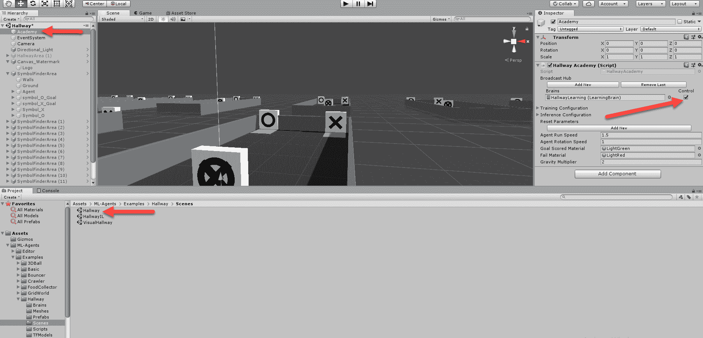
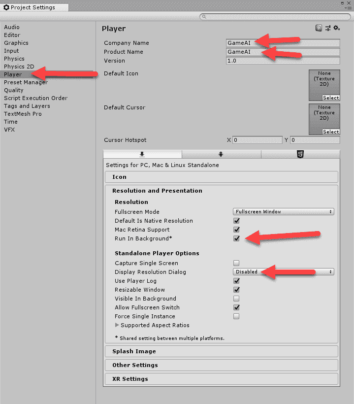
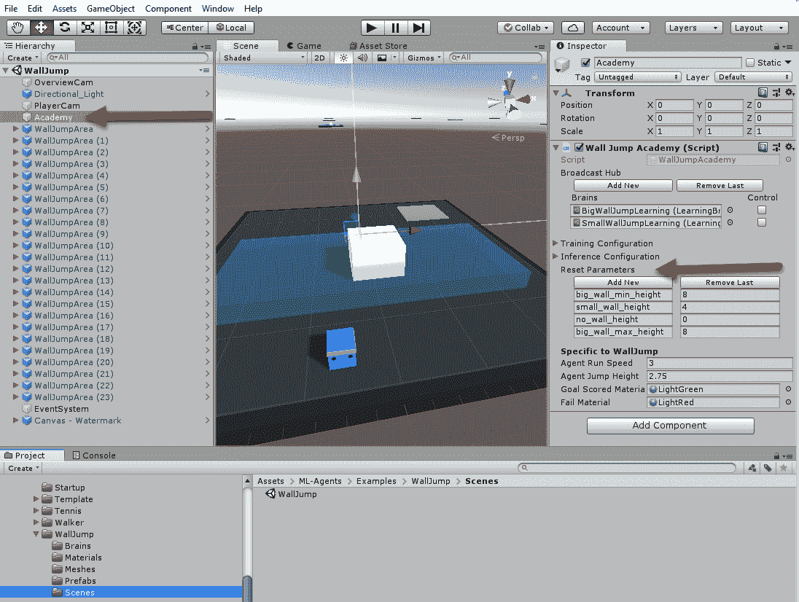
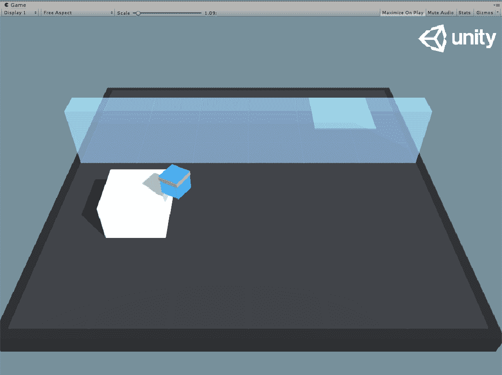
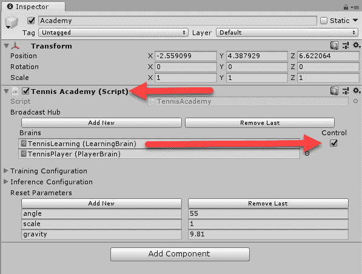
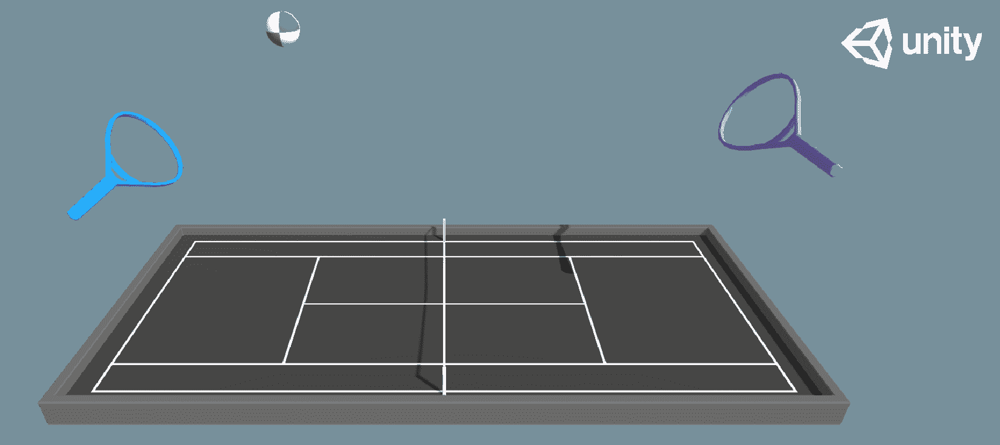
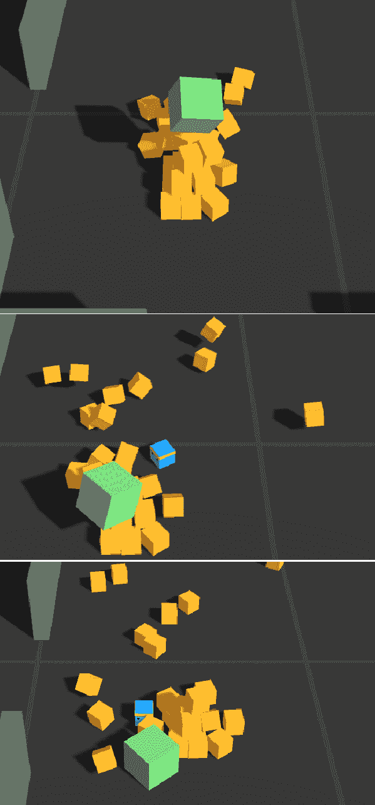

# 第十三章：利用 ML-Agents

在某个时候，我们需要超越构建和训练代理算法，探索构建我们自己的环境。构建自己的环境也将使你在制作良好的奖励函数方面获得更多经验。我们在**强化学习**（**RL**）和**深度强化学习**（**DRL**）中几乎忽略了这个问题，而这正是制作良好奖励函数的关键。

在本章中，我们将探讨什么使奖励函数良好，或者奖励函数是什么。我们将通过使用 Unity 游戏引擎构建新环境来讨论奖励函数。我们将首先安装和设置 Unity ML-Agents，这是一个用于构建代理和环境的高级 DRL 工具包。从那里，我们将探讨如何构建一个标准的 Unity 示例环境，以便我们使用 PyTorch 模型。方便的是，这使我们能够使用 ML-Agents 工具包从 Python 和 PyTorch 中使用 Unity 环境，与之前探索的 Rainbow DQN 模型一起。之后，我们将探讨创建一个新环境，然后通过探讨 Unity 为推进 RL 所开发的进步来结束本章。

在本章中，我们将涵盖以下主要主题：

+   安装 ML-Agents

+   构建 Unity 环境

+   使用 Rainbow 训练 Unity 环境

+   创建一个新环境

+   使用 ML-Agents 推进 RL

Unity 是游戏开发中最大和最常用的游戏引擎。如果你是游戏开发者，你很可能已经知道这一点。游戏引擎本身是用 C++ 开发的，但它提供了一个 C# 脚本接口，99% 的游戏开发者都在使用它。因此，在本章中，我们需要向您展示一些 C# 代码，但只是很少量。

在下一节中，我们将安装 Unity 和 ML-Agents 工具包。

# 安装 ML-Agents

安装游戏引擎本身（Unity）并不困难，但在与 ML-Agents 一起工作时，您在选择版本时需要小心。因此，下一个练习旨在更具可配置性，这意味着您在执行练习时可能需要提问/回答问题。我们这样做是为了使这个练习更持久，因为这个工具包已知经常发生许多破坏性更改。

Unity 可以在任何主流桌面计算机（Windows、Mac 或 Linux）上运行，所以打开您的开发计算机，按照下一个练习安装 Unity 和 ML-Agents 工具包：

1.  在安装 Unity 之前，请检查 ML-Agents GitHub 安装页面 ([https://github.com/Unity-Technologies/ml-agents/blob/master/docs/Installation.md](https://github.com/Unity-Technologies/ml-agents/blob/master/docs/Installation.md)) 并确认当前支持哪个版本的 Unity。在撰写本文时，这是 2017.4 版本，尽管文档建议支持后续版本，但我们更倾向于只使用那个版本。

您可以直接下载并安装 Unity，或者通过 Unity Hub 进行安装。由于管理多个版本的 Unity 非常常见，Unity 为此目的构建了一个管理应用程序，即 Unity Hub。

1.  下载并安装所需的最低版本的 Unity。如果您从未安装过 Unity，您将需要创建一个用户帐户并验证其许可协议。创建用户帐户后，您将能够运行 Unity 编辑器。

1.  打开 Python/Anaconda 命令行，并确保使用以下命令激活您的虚拟环境：

```py
conda activate gameAI
--- or ---
activate gameAI
```

1.  使用以下命令安装 Unity Gym 包装器：

```py
pip install gym_unity 
```

1.  切换到根工作文件夹，最好是 `C:` 或 `/`，并使用以下命令创建一个目录以克隆 ML-Agents 工具包：

```py
cd /
mkdir mlagents
cd mlagents
```

1.  然后，假设您已安装 `git`，使用以下命令使用 `git` 拉取 ML-Agents 工具包：

```py
git clone https://github.com/Unity-Technologies/ml-agents.git
```

我们更喜欢根目录的原因是 ML-Agents 目录结构可能相当深，这可能在某些操作系统中导致文件名过长错误。

1.  通过查阅当前 Unity 文档并使用他们最新的指南来测试整个安装效果最佳。一个好的起点是第一个示例环境，3D 平衡球。您可以在[https://github.com/Unity-Technologies/ml-agents/blob/master/docs/Getting-Started-with-Balance-Ball.md](https://github.com/Unity-Technologies/ml-agents/blob/master/docs/Getting-Started-with-Balance-Ball.md)找到此文档。

抽出一些时间，自己探索 ML-Agents 工具包。它旨在易于访问，如果您在 DRL 方面的唯一经验是这本书，那么您现在应该有足够的背景知识来理解运行 Unity 环境的一般概念。我们将回顾一些这些流程，但还有许多其他有用的指南可以帮助您在 Unity 中运行 ML-Agents。我们在这里的优先事项将是使用 Unity 构建环境，以及可能的新环境，我们可以使用这些环境来测试我们的模型。虽然我们不会使用 ML-Agents 工具包来训练智能体，但我们将使用 Gym 包装器，这确实需要了解大脑或学院是什么。

Adam Kelly 拥有一个优秀的博客，沉浸式极限 ([http://www.immersivelimit.com/tutorials/tag/Unity+ML+Agents](http://www.immersivelimit.com/tutorials/tag/Unity+ML+Agents))，专注于机器学习和 DRL，并专注于创建非常酷的 ML-Agents 环境和项目。

ML-Agents 目前使用 PPO 和 Soft Actor-Critic 方法来训练代理。它还提供了使用卷积和循环网络进行状态编码的几个有用模块，从而允许进行视觉观察编码和记忆或上下文。此外，它提供了定义离散或连续动作空间的方法，以及启用混合动作或观察类型。这个工具包做得非常好，但随着机器学习领域的快速变化，它已经变得很快过时，或者可能只是被炒作得过多。最终，似乎大多数研究人员或严肃的 DRL 实践者现在只想构建自己的框架。

虽然 DRL 非常复杂，但制作出强大功能的代码量仍然相当小。因此，我们可能会看到许多 RL 框架试图在这个领域站稳脚跟。无论您决定使用这些框架中的哪一个，还是构建自己的框架，这完全取决于您。只需记住，框架有来有去，但您对某个主题的底层知识越多，您指导未来决策的能力就越强。

无论您决定是否使用 ML-Agents 框架来训练 DRL 代理，使用其他框架，还是构建自己的框架，Unity 都为您提供了构建新的、更令人兴奋的环境的绝佳机会。我们将在下一节学习如何构建一个可以使用 DRL 训练的 Unity 环境。

# 构建 Unity 环境

ML-Agents 工具包不仅提供了一个 DRL 训练框架，还提供了一种在 Unity 游戏中快速轻松地设置 AI 代理的机制。这些代理可以通过 Gym 接口外部控制——是的，就是我们在训练大多数先前代理/算法时使用的同一个接口。这个平台真正伟大的地方之一是 Unity 提供了几个我们可以探索的新演示环境。稍后，我们将探讨如何为训练代理构建自己的环境。

本节中的练习旨在总结构建用于 Python 训练的可执行环境所需的设置步骤。它们是为那些只想构建训练环境而不想学习 Unity 所有知识的 Unity 新手准备的。如果您在使用这些练习时遇到问题，那么 SDK 可能已经发生了变化。如果是这种情况，那么只需回退并查阅完整的在线文档。

构建用于代理训练的 Unity 环境需要一些专门的步骤，我们将在本练习中介绍：

1.  首先，打开 Unity 编辑器，无论是通过 Unity Hub 还是直接使用 Unity 本身。请记住使用支持 ML-Agents 工具包的版本。

1.  使用 Unity Hub，我们可以通过以下截图所示的 **添加** 按钮添加项目：


在 Unity Hub 中添加项目

1.  点击**添加**后，您将被提示定位项目文件夹。使用对话框找到并选择我们在之前的练习中用`git`下载的`UnitySDK`项目文件夹。这个文件夹应该位于您的`/mlagents/ml-agents/UnitySDK`文件夹中。

1.  当项目被添加后，它也将被添加到项目列表的顶部。您可能会看到一个警告图标，表示您需要选择版本号。选择与ML-Agents工具包相匹配的Unity版本，然后选择项目以在编辑器中启动它。

1.  您可能会被提示**升级**项目。如果您被提示，请选择**是**以进行升级。如果升级失败或项目无法正常运行，您可以简单地删除所有旧文件，并尝试使用不同版本的Unity。加载此项目可能需要一些时间，所以请耐心等待，拿杯饮料，然后等待。

1.  项目加载完成并打开编辑器后，通过双击位于`Assets/ML-Agents/Examples/Hallway/Scenes`文件夹中的`3DBall`场景文件来打开`3DBall`环境的场景。

1.  我们需要将学院设置为控制大脑，也就是说，允许大脑进行训练。为此，选择**学院**，然后在**检查器**窗口中找到**走廊学院**组件，并选择**控制**选项，如图所示：



将学院设置为控制大脑

1.  接下来，我们需要修改环境的运行参数。这里的想法是，我们将构建Unity环境作为一个可执行的游戏，然后我们可以使用包装器来训练智能体进行游戏。但是，为了做到这一点，我们需要对游戏做一些假设：

    +   游戏是无窗口的，在后台运行。

    +   任何玩家动作都需要由智能体控制。对话框会提示警告、错误或其他必须避免的事情。

    +   确保首先加载训练场景。

1.  在完成那之前，请将学院的**控制**选项关闭或打开，然后通过界面顶部的**播放**按钮运行场景。您将能够观察到一个已经训练好的智能体在场景中玩耍。完成观看后，请确保将**控制**选项重新打开。

现在，ML-Agents工具包将允许您通过运行一个单独的Python命令行和脚本控制编辑器来直接从这里进行训练。到目前为止，这还不可能，我们运行环境的唯一方法是通过包装器。在下一节中，我们将通过设置一些最终参数并构建它们来完成环境的设置。

# 为Gym包装器构建

配置环境的设置只需设置一些额外的参数。我们将在接下来的练习中学习如何做到这一点：

1.  从编辑菜单中选择**编辑 | 项目设置...**以打开**项目设置**窗口。您可以在编辑完成后锚定此窗口或关闭它。

1.  选择**玩家**选项。在这里，玩家指的是玩家或游戏运行者——不要与实际的人类玩家混淆。将**公司名称**和**产品名称**字段中的文本更改为`GameAI`。

1.  打开**分辨率和显示**部分，并确保**在后台运行**被勾选，**显示分辨率对话框**设置为**禁用**，如下面的截图所示：



设置玩家设置

1.  关闭对话框或将其锚定，然后从菜单中选择**文件 | 构建设置**。

1.  点击**添加打开场景**按钮，并确保选择你的默认训练平台。这应该是一个你可以轻松用 Python 运行的桌面环境。下面的截图显示了默认的 Windows 选项：


将场景构建成游戏环境

1.  点击对话框底部的构建按钮来构建可执行环境。

1.  你将被提示将输出保存到文件夹中。请确保注意此文件夹的位置，并将其保存在可访问的地方。一个建议的位置是`/mlagents`中的`mlagents`根文件夹。创建一个名为`desktop`的新文件夹并将输出保存在那里。

环境现在应该作为 Gym 环境构建并可运行。我们将在下一节中设置此环境并开始对其进行训练。

# 使用 Rainbow 训练 Unity 环境

训练一个智能体来学习 Unity 环境并不像我们已经做过的许多训练那样。我们在交互和设置环境的方式上做了一些细微的调整，但总体上还是相同的，这使我们受益匪浅，因为我们现在可以回到过去，在完全新的环境中训练几个不同的智能体/算法，甚至是我们自己设计的。此外，我们现在可以使用其他 DRL 框架用 Python 训练智能体——即除了 ML-Agents 智能体之外。我们将在第 12 章[**DRL 框架**](6d061d35-176a-421a-9b62-aed35f48a6b7.xhtml)中详细介绍如何使用其他框架。

在下一个练习中，我们将看到如何将我们最新且最先进的样本之一`Chapter_10_Rainbow.py`转换为`Chapter_11_Unity_Rainbow.py`。打开`Chapter_11_Unity_Rainbow.py`并按照下一个练习进行操作：

1.  我们首先需要从最后的构建中复制输出文件夹，即桌面文件夹，并将其放置在与本章源代码相同的文件夹中。这将允许我们以该构建作为智能体训练的环境。

1.  由于你可能会想要将我们之前的一些样本转换为运行 Unity 环境，我们将逐步介绍所需的变化，首先从新的导入开始，如下所示：

```py
from unityagents import UnityEnvironment
```

1.  这导入了`UnityEnvironment`类，这是一个Unity的Gym适配器。接下来，我们使用这个类来实例化`env`环境，如下所示；注意，我们为其他操作系统放置了注释行：

```py
env = UnityEnvironment(file_name="desktop/gameAI.exe") # Windows
#env = UnityEnvironment(file_name="desktop/gameAI.app") # Mac
#env = UnityEnvironment(file_name="desktop/gameAI.x86") # Linux x86
#env = UnityEnvironment(file_name="desktop/gameAI.x86_64") # Linux x86_64
```

1.  接下来，我们从环境中获取`brain`和`brain_name`。Unity使用大脑的概念来控制智能体。我们将在后面的章节中探讨智能体大脑。现在，请记住我们只是用以下代码获取第一个可用的大脑：

```py
brain_name = env.brain_names[0]
brain = env.brains[brain_name]
```

1.  然后，我们从大脑中提取动作大小（`action_size`）和状态大小（`state_size`），并使用这些作为输入来构建我们的`RainbowDQN`模型，如下所示：

```py
action_size = brain.vector_action_space_size
state_size = brain.vector_observation_space_size

current_model = RainbowDQN(state_size, action_size, num_atoms, Vmin, Vmax)
target_model = RainbowDQN(state_size, action_size, num_atoms, Vmin, Vmax)
```

1.  我们需要关注的最后一部分是在训练代码中，与环境的重置方式有关。Unity允许多个智能体/大脑在并发环境中并发运行，这可以是A2C/A3C或其他机制的方式机制。因此，我们需要更加小心地确定我们想要重置的具体大脑和模式。以下代码展示了我们在训练Unity时如何重置环境：

```py
env_info = env.reset(train_mode=True)[brain_name]
state = env_info.vector_observations[0]
```

1.  如前所述，这种稍微有些令人困惑的索引目的在于确定你想要从哪个大脑/智能体中提取状态。Unity可能拥有多个大脑在多个子环境中训练多个智能体，这些智能体要么协同工作，要么相互竞争。我们将在第14章中详细介绍多个智能体环境的训练，即从DRL到AGI。

1.  我们还必须更改任何其他可能重置环境的情况，如下例所示，当算法检查是否完成一个回合时，使用以下代码：

```py
if done:
        #state = env.reset()
        env_info = env.reset(train_mode=True)[brain_name] 
        state = env_info.vector_observations[0]
        all_rewards.append(episode_reward)
        episode_reward = 0
```

1.  运行代码并观察智能体训练过程。除非你在另一个shell中运行TensorBoard并完成所有步骤，否则你将看不到除了TensorBoard输出之外的任何视觉内容，现在你很可能可以自己做到这一点。

这个例子可能由于API兼容性问题而难以运行。如果你在运行示例时遇到问题，那么尝试设置一个全新的虚拟环境并重新安装所有内容。如果问题仍然存在，那么在网上寻找帮助，例如在Stack Overflow或GitHub上。务必参考最新的Unity文档关于ML-Agents的部分。

将Unity连接并使用它的真正好处是能够构建自己的环境，然后使用这些新环境与自己的或另一个RL框架一起使用。在下一节中，我们将探讨使用Unity ML-Agents构建自己的RL环境的基本知识。

# 创建一个新环境

ML-Agents工具包的伟大之处在于它提供了快速简单地创建新智能体环境的能力。你甚至可以将现有的游戏或游戏项目转换成用于各种目的的训练环境，从构建完整的机器人模拟到简单的游戏智能体，甚至扮演非玩家角色的游戏智能体。甚至有潜力使用深度强化学习智能体进行游戏质量保证测试。想象一下，建立一个游戏测试员团队，他们只通过试错来学习玩你的游戏。可能性是无限的，Unity甚至正在构建一个完整的基于云的模拟环境，用于未来运行或训练这些智能体。

在本节中，我们将通过使用游戏项目作为新的训练环境来演示。在设置自己的Python代码之前，你最好使用ML-Agents工具包测试你在Unity中创建的任何环境。深度强化学习智能体是发现错误和/或作弊的大师。因此，你几乎总是希望在用你的代码训练环境之前，先使用ML-Agents测试环境。我已经推荐你通过设置和运行ML-Agents Python代码来训练智能体的过程。记住，一旦你导出环境用于Gym训练，它就变成了无窗口的，你将无法了解智能体在环境中的训练或表现情况。如果有任何作弊或错误需要被发现，智能体几乎肯定能找到。毕竟，你的智能体将尝试数百万种不同的试错组合，试图找到如何玩游戏的方法。

我们将查看基本ML-Agents环境，以了解如何构建我们自己的扩展或新环境。如果这里的信息不足，ML-Agents文档是一个很好的备选资源。这个练习的目的是让你快速掌握构建自己的环境：

1.  打开**Unity编辑器**到我们之前打开的**UnitySDK** ML-Agents项目。在`Assets/ML-Agents/Examples/Basic/Scenes`中找到并打开（双击）**基本**场景。

1.  任何环境的中心都是学院。在**层次结构**窗口中找到并选择**学院**对象，然后在**检查器**窗口中查看属性，如图所示：


检查学院

1.  在**基本学院 | 广播中心 | 大脑**条目中点击并选择**基本学习（学习大脑）**大脑。这将突出显示**项目**窗口中的条目。在**项目**窗口中选择**基本学习**大脑，并在**检查器**窗口中查看大脑设置，如图所示：


检查学习大脑

1.  在这里我们可以看到关于大脑的一些信息。大脑控制智能体，因此大脑的观察和动作空间实际上与智能体的相同。在**检查器**窗口中，你可以看到有20个向量观察和一个包含三个离散动作的动作空间。对于这个环境，动作是左移或右移以及空操作。0动作变为空操作或暂停操作。

1.  接下来，我们想要检查智能体本身。在**层次结构**窗口中点击并展开**基本**对象。选择**BasicAgent**对象，然后根据截图查看**检查器**窗口：


检查基本智能体

1.  检查基本智能体组件，你可以看到**大脑**设置为**BasicLearning**大脑，并且这里还显示了其他属性。注意重置完成和按需决策都被勾选了。**重置完成**使环境在完成一个回合后自动重置——这是你期望的默认行为，但实际上并非如此。**按需决策**等同于使用在线策略模型和离线策略模型，在用ML-Agents工具包训练时更为相关。

1.  按下播放键将显示智能体在玩游戏。观察智能体的游戏过程，当智能体移动时，确保在编辑器中选择并检查对象。Unity非常适合查看你的游戏机制如何工作，这在构建自己的智能体环境时尤其有用。

在构建任何新的环境时，你需要考虑的主要元素是学院、大脑和智能体。只要遵循这个基本示例，你应该能够快速构建一个简单的可工作环境。构建自己的环境时另一个棘手的部分是你可能需要做的特殊编码，我们将在下一节中介绍。

# 编写智能体/环境代码

Unity提供了一个出色的界面用于原型设计和构建商业游戏。实际上，你可以用很少的代码走得很远。不幸的是，目前构建新的ML-Agents环境并不是这样。

因此，我们将在下一项练习中探索重要的编码部分：

1.  接下来，定位并打开位于`Assets/ML-Agents/Examples/Basic`下的**脚本**文件夹，并在其中双击打开`BasicAgent.cs`。这是一个C#（CSharp）文件，它将在默认编辑器中打开。

1.  在文件顶部，你会注意到这个`BasicAgent`类是从`Agent`扩展的，而不是Unity默认的`MonoBehaviour`。`Agent`是Unity中的一个特殊类，正如你可能猜到的，它定义了一个能够探索环境的智能体。然而，在这种情况下，智能体更多地指的是异步或同步actor-critic中的工作者。这意味着单个大脑可以控制多个智能体，这通常是这种情况：

```py
using UnityEngine;
using MLAgents;

public class BasicAgent : Agent
```

1.  跳过字段，我们跳到以`CollectObservations`开始的方法定义，如下所示：

```py
public override void CollectObservations()
{
  AddVectorObs(m_Position, 20);
}
```

1.  在这个方法内部，我们可以看到代理/大脑如何从环境中收集观察结果。在这种情况下，观察是通过 `AddVectorObs` 添加的，它将观察结果添加为所需大小的 one-hot 编码向量。在这种情况下，向量大小是 20，与大脑的状态大小相同。

One-hot 编码是一种方法，通过在向量内部使用二进制值来编码类信息。因此，如果一个表示类别或位置 1 的一热编码向量是激活的，它将被写成 [0,1,0,0]。

1.  主要的动作方法是 `AgentAction` 方法。这是代理在环境中执行动作的地方，无论是移动还是其他动作：

```py
 public override void AgentAction(float[] vectorAction, string textAction)
 {
  var movement = (int)vectorAction[0];
  var direction = 0;
  switch (movement)
  {
    case 1:
      direction = -1;
      break;
    case 2:
      direction = 1;
      break;
  }

  m_Position += direction;
  if (m_Position < m_MinPosition) { m_Position = m_MinPosition; }
  if (m_Position > m_MaxPosition) { m_Position = m_MaxPosition; }

  gameObject.transform.position = new Vector3(m_Position - 10f, 0f, 0f);

  AddReward(-0.01f);

  if (m_Position == m_SmallGoalPosition)
  {
    Done();
    AddReward(0.1f);
  }

  if (m_Position == m_LargeGoalPosition)
  {
    Done();
    AddReward(1f);
  }
}
```

1.  这段代码的第一部分只是根据代理所采取的动作确定其移动方式。您可以看到代码如何根据移动调整代理的位置。然后，我们看到以下代码行：

```py
AddReward(-0.01f);
```

1.  这行代码添加了一个步骤奖励，意味着它会在每一步都添加这个奖励。它这样做是为了限制代理的移动。因此，代理做出错误决策所需的时间越长，奖励就越少。我们有时会使用步骤奖励，但它也可能有负面影响，并且通常有理由完全消除步骤奖励。

1.  在 `AgentAction` 方法的底部，我们可以看到当代理达到小目标或大目标时会发生什么。如果代理达到大目标，它会获得 1 的奖励，如果达到小目标，它会获得 0.1 的奖励。有了这些，我们还可以看到，当它达到目标时，通过调用 `Done()` 来终止游戏：

```py
Done();
AddReward(0.1f);  //small goal
// or
Done();
AddReward(1f);  //large goal
```

1.  将奖励的数字反转，保存代码，然后返回编辑器。将 **Academy** 设置为控制大脑，然后使用 ML-Agents 或我们之前开发的代码训练代理。您应该非常清楚地看到代理对较小目标的偏好。

将这些概念扩展并构建您自己的环境现在将取决于您。天空真的是无极限，Unity 提供了几个出色的示例供您学习和使用。在下一节中，我们将有机会查看 ML-Agents 提供的作为增强您的代理或探索新的训练方式的机制。

# 使用 ML-Agents 推进强化学习

ML-Agents 工具包，允许您训练深度强化学习（DRL）代理的部分，被认为是训练代理中较为严肃和高端的框架之一。由于该框架是在 Unity 上开发的，因此在类似 Unity 的环境中表现通常更好。然而，与许多花费时间训练代理的人一样，Unity 开发者早期就意识到，某些环境提出了如此困难的挑战，以至于我们需要协助我们的代理。

现在，这种辅助作用不是那么直接，而是间接的，并且通常直接关系到代理找到奖励的难易程度。这反过来又直接关系到环境设计师能否构建一个代理可以用来学习环境的奖励函数。也有时候，环境的状态空间如此之大且不明显，以至于创建一个典型的奖励函数根本不可能。考虑到所有这些，Unity 已经竭尽全力通过以下新的学习形式来增强 ML-Agents 内的强化学习：

+   课程学习

+   行为克隆（模仿学习）

+   好奇心学习

+   训练通用强化学习代理

我们将通过使用 Unity 环境的快速示例来介绍每种学习形式。

# 课程学习

课程学习允许你通过随着代理的学习增加任务的复杂性来训练代理。这相当直观，可能非常类似于我们从数学到编程学习各种任务的方式。

按照练习快速了解如何为课程学习进行设置：

1.  打开位于 `Assets/ML-Agents/Examples/WallJump/Scenes` 文件夹中的 `WallJump` 场景。

1.  在场景中选择 **Academy**，并在 **Inspector** 窗口中查看 **Wall Jump Academy** 组件的设置，如图所示：



检查 WallJump 学院

1.  在学院内部有一个扩展的部分，称为 **Reset Parameters**。这些参数代表我们想要让代理经历的各个训练状态的训练级别参数。

1.  这些参数现在需要在配置文件中进行配置，ML-Agents 工具包将使用该配置文件来训练使用课程的代理。该文件的 内容可以在 `config/curricula/wall-jump/` 中找到或创建，并包括以下内容：

```py
{
    "measure" : "progress",
    "thresholds" : [0.1, 0.3, 0.5],
    "min_lesson_length" : 100,
    "signal_smoothing" : true,
    "parameters" :
    {
        "big_wall_min_height" : [0.0, 4.0, 6.0, 8.0],
        "big_wall_max_height" : [4.0, 7.0, 8.0, 8.0]
    }
}
```

1.  通过参考 ML-Agents 文档可以最好地理解这些参数。基本上，这里的想法是这些参数控制着随时间增加的墙壁高度。因此，代理需要学会移动方块跳过墙壁，随着难度越来越大。

1.  在 **Academy** 脑上设置 **Control** 标志，然后在 Python shell 中运行以下命令以启动 ML-Agents 会话：

```py
mlagents-learn config/trainer_config.yaml --curriculum=config/curricula/wall-jump/ --run-id=wall-jump-curriculum --train
```

1.  假设配置文件位于正确的位置，你将被提示运行编辑器并观察代理在环境中的训练。此示例的结果如下所示：



课程训练示例的输出

课程学习以新颖的方式解决了环境在没有明显答案的问题。在这种情况下，智能体的目标是使目标方块。然而，如果墙壁一开始就很高，智能体需要移动方块到那里以跳过它，它可能甚至不会理解它需要到达方块。因此，我们通过首先允许它到达目标，然后逐渐使其更难做到这一点来帮助它进行训练。随着难度的增加，智能体学会如何使用方块跳过墙壁。

在下一节中，我们将探讨另一种帮助智能体解决具有难以找到的或我们称之为稀疏奖励的任务的方法。

# 行为克隆

行为克隆有时也被称为模仿学习。虽然这两个术语并不完全相同，但在这里我们将交替使用这两个术语。在强化学习（RL）中，我们使用“稀疏奖励”或“奖励稀疏性”这个术语来描述任何对智能体来说仅通过试错和可能的好运很难完成任务的环境。环境越大，奖励越稀疏，在许多情况下，观察空间可能如此之大，以至于训练智能体的任何希望都极其困难。幸运的是，一种称为行为克隆或模仿学习的方法可以通过使用人类的观察作为先前采样的观察来解决稀疏奖励的问题。Unity 提供了三种生成先前观察的方法，如下所示：

+   **生成对抗模仿学习**（**GAIL**）：你可以使用称为 GAIL 奖励信号的东西来增强从少量观察中学习到的奖励。

+   **预训练**：这允许你使用预先录制的人类演示，并利用这些演示来启动智能体的学习。如果你使用预训练，你还需要在你的 ML-Agents 配置文件中提供一个配置部分，如下所示：

```py
pretraining:
        demo_path: ./demos/Tennis.demo
        strength: 0.5
        steps: 10000
```

+   **行为克隆**（**BC**）：在这个训练中，设置直接在 Unity 编辑器中进行。这对于小演示可以帮助智能体增加学习的环境来说非常好。BC 在具有大观察状态空间的大型环境中效果不佳。

这三种方法可以以各种配置组合在一起，并在预训练和 GAIL 与其他方法（如好奇心学习，我们将在后面看到）一起使用的情况下一起使用。

使用 BC 在实时中训练智能体特别有趣，正如我们将在下一个练习中看到的那样。遵循下一个练习来探索使用 BC 方法向智能体演示：

1.  打开位于 `Assets/ML-Agents/Examples/Tennis/Scenes` 文件夹中的 **TennisIL** 场景。

1.  这个环境是一个稀疏奖励环境的例子，其中智能体需要找到并击打球回对手。这个环境是测试 BC 的绝佳例子。

1.  在**层次结构**窗口中选择**Academy**对象，然后在**检查器**窗口中检查**TennisLearning (LearningBrain)**的**控制**选项，如图中所示：



打开学习大脑以进行控制

1.  如您所见，在这个场景中有两个大脑：一个学生大脑——学习大脑，和一个教师大脑——玩家大脑。教师大脑由人类玩家控制，不会控制实际的代理，而是直接从玩家那里获取输入。学生大脑观察教师的行为，并使用这些行为作为其策略的样本。从基本意义上讲，这变成了教师根据目标策略，即代理需要学习的策略，从人类策略中工作。这实际上与我们拥有当前网络和目标网络并没有太大的区别。

1.  我们接下来要做的事情是自定义ML-Agents的超参数配置文件。我们通过为`StudentBrain`添加以下条目来自定义文件：

```py
StudentBrain:
  trainer: imitation
  max_steps: 10000
  summary_freq: 1000
  brain_to_imitate: TeacherBrain
  batch_size: 16
  batches_per_epoch: 5
  num_layers: 4
  hidden_units: 64
  use_recurrent: false
  sequence_length: 16
  buffer_size: 128
```

1.  在前面的配置中，突出显示的元素显示了`trainer:`设置为`imitation`和`brain_to_imitate:`为`TeacherBrain`。有关设置ML-Agents配置的更多信息，可以在在线文档中找到。

1.  接下来，您需要打开Python/Anaconda shell并切换到`mlagents`文件夹。之后，运行以下命令以开始训练：

```py
mlagents-learn config/trainer_config.yaml --run-id=tennis1 --train
```

1.  这将启动训练器，不久之后您将被提示以**播放**模式启动Unity编辑器。

1.  按**播放**将编辑器置于播放模式，并使用*WASD*控制来操纵球拍与代理进行网球比赛。假设您做得很好，代理也会提高。这次训练的截图如下所示：



使用BC训练网球代理

模仿学习是训练代理AlphaStar的关键因素。AlphaStar被证明在一种非常复杂的实时策略游戏*星际争霸2*中击败了人类玩家。它在帮助代理克服稀疏奖励问题方面有许多显著优势。然而，在强化学习（RL）社区中，许多人希望避免模仿学习（IL）或行为克隆（BC），因为这可能会引入人类偏见。研究表明，与完全未经BC训练的代理相比，人类偏见会降低代理的性能。实际上，AlphaStar在开始自我训练之前已经达到了足够的可玩性水平。正是这种自我训练被认为使其能够击败人类玩家。

在下一节中，我们将探讨Unity尝试捕捉解决稀疏奖励问题的一种另类激动人心的方法。

# 好奇心学习

到目前为止，我们只考虑了环境给予智能体的外部奖励。然而，我们和其他动物会接收到各种各样的外部和内部奖励。内部奖励通常由情绪或感觉来表征。智能体可能有一种内部奖励，每次它看向某个面孔时都会得到 +1，这或许代表了一些内在的爱或迷恋奖励。这类奖励被称为内在奖励，它们代表了智能体内部或自我产生的奖励。这为从创建有趣的动机智能体到增强智能体的学习能力等方面提供了强大的能力。

这是 Unity 引入好奇心学习或内部好奇心奖励系统的第二种方式，作为一种让智能体在感到惊讶时探索更多的方式。也就是说，每当智能体对某个动作感到惊讶时，它的好奇心就会增加，因此它需要探索使其感到惊讶的状态动作空间。

Unity 在一个名为 Pyramids 的环境中产生了一个非常强大的好奇心学习示例。在这个环境中，智能体的目标是找到一堆带有金色方块在顶部的黄色方块。推倒方块堆，然后获取金色方块。问题是，一开始在许多房间里都有盒子堆，但没有一个是黄色的。要使方块变黄，智能体需要找到并按下按钮。使用直接强化学习（RL）找到这个任务序列可能会出现问题，或者会耗费时间。幸运的是，有了 CL，我们可以显著提高这种性能。我们将在下一节中探讨如何使用 CL 来训练 Pyramids 环境：

1.  打开位于 `Assets/ML-Agents/Examples/Pyramids/Scenes` 文件夹中的 **Pyramids** 场景。

1.  按下播放按钮运行默认智能体；这将是一个使用 Unity 训练的智能体。当你运行智能体时，观察它如何在环境中玩耍，你会看到智能体首先找到按钮，按下它，然后定位到它需要推倒的方块堆。它将像这里截图序列中所示那样推倒盒子：



Pyramids 智能体在玩环境

1.  仅需将学院设置为控制大脑，并使用适当的配置运行 ML-Agents 训练器，就可以训练一个好奇心的智能体。这份关于驱动 CL 的文档在 ML-Agents 开发过程中已经更改了好几次。因此，建议您查阅 ML-Agents 文档以获取最新的文档信息。

CL 可以非常强大，内在奖励的整个概念在游戏中有一些有趣和有趣的应用。想象一下，能够为可能表现出贪婪、权力或其他邪恶特质的敌方智能体提供内部奖励系统。在下一节中，我们将通过探讨训练通用强化学习智能体来结束这一章。 

# 训练通用强化学习智能体

我们经常需要提醒自己，强化学习只是数据科学最佳实践的衍生，我们经常需要考虑如何使用数据科学来修复训练问题。在强化学习的案例中，我们看到与数据科学和机器学习相同的问题，只是在不同的规模和不同的方式下暴露出来。一个例子是，当代理过度拟合到我们试图应用于该环境其他一般变体的环境中时。例如，想象一下可能具有不同大小或甚至提供随机起点或其他变体的 Frozen Lake 环境。通过引入这些类型的变体，我们允许我们的代理更好地泛化到更广泛的类似环境中。我们希望将这种泛化引入到我们的环境中。

**AGI** 或 **通用人工智能** 是将通用训练代理扩展到 *n* 次方的概念。预期一个真正的 AGI 代理能够被放置在任何环境中并学会解决任务。这可能需要一定量的训练，但理想情况下，不应需要其他超参数或其他人为干预。

通过使环境具有随机性，我们实际上增加了我们使用分布式强化学习和有噪声网络的方法的效力。不幸的是，启用这些类型的参数与其他训练代码或我们的 PyTorch 代码目前不可用。在下一个练习中，我们将学习如何设置一个通用的训练环境：

1.  打开位于 `Assets/ML-Agents/Examples/WallJump/Scenes` 文件夹中的 **WallJump** 场景。

1.  **WallJump** 已经设置并配置了我们在审查课程学习时看到的几个重置参数。这次，我们不是逐步改变这些参数，而是让环境随机采样它们。

1.  我们想要重新采样的参数基于这个样本。我们可以在配置文件夹中创建一个新的通用 YAML 文件，命名为 `walljump_generalize.yaml`。

1.  打开文件，将以下文本放入其中，然后保存：

```py
resampling-interval: 5000

big_wall_min_height:
    sampler-type: "uniform"
    min_value: 5
    max_value: 8

big_wall_max_height:
    sampler-type: "uniform"
    min_value: 8
    max_value: 10

small_wall_height:
    sampler-type: "uniform"
    min_value: 2
    max_value: 5

no_wall_height:
    sampler-type: "uniform"
    min_value: 0
    max_value: 3
```

1.  这设置了我们将如何采样值的采样分布。然后，可以使用以下代码对环境的值进行采样：

```py
SamplerFactory.register_sampler(*custom_sampler_string_key*, *custom_sampler_object*)
```

1.  我们还可以定义新的采样器类型或使用自定义采样器以自定义方式采样数据值，该采样器由我们在 ML-Agents 代码中的 `sample_class.py` 文件中的类放置。以下是一个自定义采样器的示例：

```py
class CustomSampler(Sampler):
    def __init__(self, argA, argB, argC):
        self.possible_vals = [argA, argB, argC]

    def sample_all(self):
        return np.random.choice(self.possible_vals)
```

1.  然后，您可以配置配置文件以运行此采样器，如下所示：

```py
height:
    sampler-type: "custom-sampler"
    argB: 1
    argA: 2
    argC: 3
```

1.  请记住，当代理重置时，您仍然需要采样值并修改环境的配置。这需要修改代码以使用适当的采样器采样输入。

1.  您可以使用以下命令运行 Unity ML-Agents 训练器代码：

```py
mlagents-learn config/trainer_config.yaml --sampler=config/walljump_generalize.yaml
--run-id=walljump-generalization --train
```

能够以这种方式训练代理可以使您的代理更加健壮，能够应对各种环境形态。如果您正在构建需要实用代理的游戏，您很可能会需要以通用方式训练您的代理。通用代理通常能够更好地适应环境中不可预见的变化，比其他方式训练的代理要好得多。

这就是本章的内容，在下一节中，我们将探讨如何通过本章的示例练习获得更多经验。

# 练习

本节中的练习旨在更详细地向您介绍Unity ML-Agents。如果您不打算使用ML-Agents作为训练框架，那么请继续下一节和本章的结尾。对于那些仍然在这里的人，ML-Agents本身是一个强大的工具包，可以快速探索DRL代理。该工具包隐藏了DRL的大部分细节，但您现在应该能够自己找出这些细节：

1.  在编辑器中设置并运行Unity ML-Agents的一个示例环境来训练代理。这需要您查阅Unity ML-Agents文档。

1.  调整示例Unity环境的超参数。

1.  启动TensorBoard并运行它，以便从Unity运行文件夹中收集日志。这将允许您查看使用ML-Agents训练的代理的训练性能。

1.  使用彩虹DQN示例构建Unity环境并进行训练。

1.  通过更改设置、参数、重置参数和/或奖励函数来自定义现有的Unity环境。也就是说，改变代理在完成动作或任务时收到的奖励反馈。

1.  使用预训练数据设置和训练代理。这需要您设置一个玩家大脑来记录演示。玩游戏以记录这些演示，然后设置游戏以学习大脑进行训练。

1.  使用网球环境通过行为克隆训练代理。

1.  使用金字塔场景通过好奇心学习训练代理。

1.  设置并运行一个用于通用训练的Unity环境。使用采样从分布中提取环境的随机值。不同的分布对代理的训练性能有什么影响？

1.  将PG方法示例（如PPO）转换为可以在Unity环境中运行。其性能与彩虹DQN相比如何？

使用这些示例熟悉Unity ML-Agents和RL中的更高级概念。在下一节中，我们将总结并完成本章。

# 摘要

在本章中，我们偏离了主线，构建了我们自己的DRL环境，用于使用自己的代码、另一个框架或使用Unity的ML-Agents框架进行训练。起初，我们探讨了安装ML-Agents工具包的基本知识，用于开发环境、训练以及使用自己的代码进行训练。然后，我们了解了如何从Gym界面构建一个基本的Unity环境，就像我们在整本书中一直做的那样。之后，我们学习了如何定制我们的RainbowDQN示例以训练一个智能体。从那里，我们探讨了如何从基础创建一个全新的环境。我们通过查看如何在环境中管理奖励以及ML-Agents用于增强具有稀疏奖励的环境的工具集来结束本章。在那里，我们探讨了Unity为ML-Agents添加的几种方法，以帮助处理困难的环境和稀疏奖励。

从本章继续前进，我们将继续探索其他可用于训练智能体的DRL框架。ML-Agents是许多强大的框架之一，可用于训练智能体，正如我们很快将看到的。
