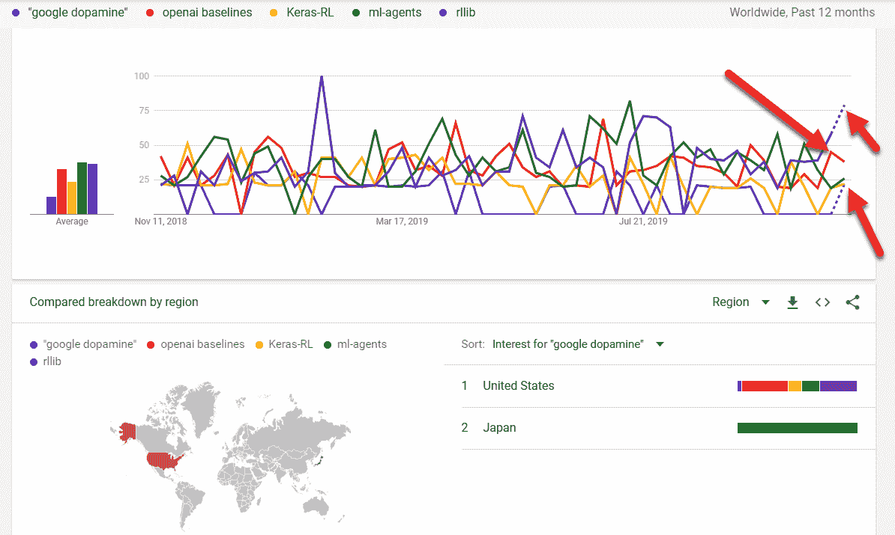
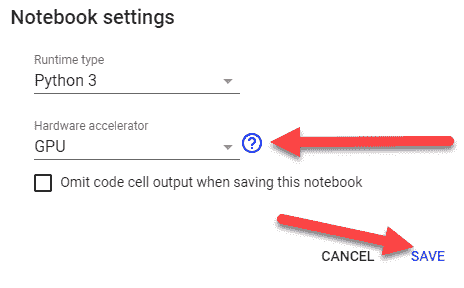

# DRL 框架

在本书中通过和探索代码旨在成为学习如何**强化学习**（**RL**）算法工作的练习，同时也了解让这些算法工作起来的难度。正是因为这种难度，每天都有许多开源的RL框架出现。在本章中，我们将探讨几个更受欢迎的框架。我们将从为什么您想要使用一个框架开始，然后转向探索更受欢迎的框架，如Dopamine、Keras-RL、TF-Agents和RL Lib。

下面是本章我们将涵盖的主要主题的简要总结：

+   选择一个框架

+   介绍 Google Dopamine

+   玩转 Keras-RL

+   探索 RL Lib

+   使用 TF agents

我们将结合使用Google Colab上的笔记本环境和虚拟环境，这取决于本章示例的复杂性。Jupyter Notebooks，Colab的基础，是展示代码的绝佳方式。它通常不是开发代码的首选方式，这也是我们为什么直到现在才避免使用这种方法的原因。

在下一节中，我们将探讨为什么您会选择一个框架。

# 选择一个框架

如您现在可能已经推测到的，在深度学习框架（如PyTorch）之上编写自己的RL算法和函数并非易事。还重要的是要记住，本书中的算法回顾了RL发展的约30年。这意味着任何RL的重大新进展都需要大量的努力和时间——是的，包括开发和特别是训练。除非您有开发自己框架的时间、资源和动力，那么强烈建议您使用成熟的框架。然而，新的和可比较的框架数量正在不断增加，因此您可能会发现您无法只选择一个。直到这些框架实现真正的AGI，您可能还需要为不同的环境或甚至不同的任务使用不同的框架。

记住，**AGI**代表**人工通用智能**，这确实是任何RL框架的目标。一个AGI框架可以在任何环境中进行训练。一个高级AGI框架可能能够跨任务进行迁移学习。迁移学习是指一个智能体可以学习一个任务，然后利用这些学习来完成另一个类似的任务。

我们将在后面的章节中查看目前最受欢迎且最有潜力的框架。比较各种当前框架，以确定其中一个可能更适合您和您的团队，这一点很重要。因此，我们将查看以下列表中目前可用的各种RL框架的比较。

此列表按当前流行度（由Google）排序，列出当前最受欢迎的框架，但预计随着时间的推移，此列表将发生变化：

+   **OpenAI Gym 和 Baselines**：OpenAI Gym 是我们在本书中探索的大多数环境所使用的框架。这个库还有一个配套的库叫做 Baselines，它为 Gym 环境提供了几个代理，正如你所猜测的，用于基准测试 Gym 环境。Baselines 也是一个非常受欢迎且优秀的强化学习框架，但在这里我们为了查看其他库而省略了它。

+   **Google Dopamine**：这是一个相对较新的框架，迅速获得了人气。这可能是部分原因在于其实施了 RainbowDQN 代理。这个框架已经得到了很好的发展，但被描述为笨拙且不太模块化。我们在这里展示它，因为它很受欢迎，你很可能仍然想更仔细地看看它。

+   **ML-Agents**：我们已经在某种程度上覆盖了整个关于这个框架的章节，所以在这里我们不需要进一步探索。Unity 开发了一个非常稳固但不太模块化的框架。当前的实现仅支持 PG 方法，如 PPO 和 Soft Actor-Critic。然而，ML-Agents 本身可以是一个展示强化学习给开发团队或向客户介绍概念的极好且推荐的方式。

+   **RL Lib 与 ray-project**：这个项目的起源很奇特，它最初是一个 Python 的并行化项目，后来演变成一个强化学习的训练平台。因此，它倾向于使用异步代理（如 A3C）的训练制度，非常适合复杂的环境。不仅如此，这个项目基于 PyTorch，所以它值得一看。

+   **Keras-RL**：Keras 本身也是一个非常流行的深度学习框架。这个深度学习库本身相当简洁且易于使用——也许在某些方面，过于简单。然而，它可以用作原型化强化学习概念或环境的绝佳方式，值得我们进一步关注。

+   **TRFL**：这个库与 Keras-RL 类似，是 TensorFlow 框架的扩展，以纳入强化学习。TensorFlow 是另一个低级深度学习框架。因此，构建任何有效代理的代码也需要相当低级，使用这个库可能不适合你，尤其是如果你喜欢 PyTorch。

+   **Tensorforce**：这是一个专注于扩展 TensorFlow 以用于强化学习的库。使用基于 TF 的解决方案的好处是跨兼容性，甚至可以将你的代码移植到网页或移动设备。然而，构建低级计算图并不适合每个人，并且确实需要比本书中涵盖的更高水平的数学知识。

+   **Horizon**：这个框架来自 Facebook，是在 PyTorch 上开发的。不幸的是，这个框架在多个领域中的优势不足，包括没有 `pip` 安装程序。它还缺乏与 Gym 环境的紧密集成，所以除非你在 Facebook 工作，否则你可能会想避免使用这个框架。

+   **Coach**：这是那种可能有一天会建立自己大量追随者的隐藏框架之一。Coach有很多有用和强大的功能，包括专门的仪表板和直接支持Kubernetes。这个框架目前也拥有最大的RL算法实现，将为你提供大量的探索空间。Coach是一个值得你自己探索的框架。

+   **MAgent**：这个项目与RLLib（Ray）类似，因为它专门用于异步或各种配置下训练多个代理。它是基于TensorFlow开发的，并使用自己设计的网格世界环境进行所谓的现实生活模拟。这是一个非常专业的框架，适用于开发者或现实生活中的RL解决方案。

+   **TF-Agents**：这是谷歌在TensorFlow之上开发的另一个RL实现。因此，它是一个更底层的框架，但比这里提到的其他TF框架更稳健和强大。这个框架似乎是一个更严肃的研究和/或生产实现的强劲竞争者，值得那些想要进行此类工作的读者进一步关注。

+   **SLM-Lab**：这是另一个基于PyTorch的框架，实际上是基于Ray（RLLib）之上的，尽管它更多的是为纯研究而设计。因此，它没有`pip`安装程序，并假设用户直接从存储库中拉取代码。现在最好把这个框架留给研究人员。

+   **DeeR**：这是另一个与Keras集成的库，旨在更加易于使用。这个库维护得很好，文档也很清晰。然而，这个框架是为那些学习RL的人设计的，如果你已经走到这一步，你可能已经需要更高级和更稳健的东西了。

+   **车库（Garage）**：这是另一个基于TF的框架，它具有一些出色的功能，但缺乏文档和良好的安装流程，这使得它又是一个很好的研究框架，但对于那些对开发工作代理感兴趣的人来说可能更好避免。

+   **Surreal**：这个框架更多的是为机器人应用而设计的，因此它更加封闭。使用Mujoco等环境进行机器人RL已被证明具有商业可行性。因此，这个RL分支正在看到那些试图分得一杯羹的人的影响。这意味着这个框架目前是免费的，但不是开源的，而且免费的部分可能很快就会改变。尽管如此，如果你专注于机器人应用，这可能值得认真考虑。

+   **RLgraph**：这可能是一个值得关注的潜在项目。这个库目前正在吸收大量的提交，并且变化很快。它也使用PyTorch和TensorFlow映射构建。我们将在后面的部分花时间探讨如何使用这个框架。

+   **简单RL**：这可能是一个RL框架所能达到的最简单形式。该项目旨在非常易于访问，并且可以在少于八行代码的情况下开发出具有多个代理的示例。实际上，它可能就像以下从示例文档中摘取的代码块那样简单：

```py
from simple_rl.agents import QLearningAgent, RandomAgent, RMaxAgent
from simple_rl.tasks import GridWorldMDP
from simple_rl.run_experiments import run_agents_on_mdp

# Setup MDP.
mdp = GridWorldMDP(width=4, height=3, init_loc=(1, 1), goal_locs=[(4, 3)], lava_locs=[(4, 2)], gamma=0.95, walls=[(2, 2)], slip_prob=0.05)

# Setup Agents.
ql_agent = QLearningAgent(actions=mdp.get_actions())
rmax_agent = RMaxAgent(actions=mdp.get_actions())
rand_agent = RandomAgent(actions=mdp.get_actions())

# Run experiment and make plot.
run_agents_on_mdp([ql_agent, rmax_agent, rand_agent], mdp, instances=5, episodes=50, steps=10)
```

由于有这么多框架可供选择，我们只有时间在本章中概述最受欢迎的框架。虽然框架因为编写得好并且倾向于在各种环境中表现良好而变得流行，但直到我们达到通用人工智能（AGI），你可能仍然需要探索各种框架，以找到适合你和你问题的算法/代理。

为了了解这种演变，我们可以使用谷歌趋势进行搜索比较分析。这样做通常可以给我们一个特定框架在搜索词中的流行趋势的指示。更多的搜索词意味着对框架的兴趣更大，这反过来又导致更多的开发和更好的软件。

下面的谷歌趋势图显示了前五个列表框架的比较：



谷歌趋势对比RL框架

你可以在图中看到RL库和谷歌多巴胺的趋势增长。值得注意的是，对RL开发的主要兴趣目前在美国和日本最为浓厚，日本对ML-Agents特别感兴趣。

ML-Agents的流行归因于几个因素，其中之一是Unity公司AI和ML副总裁，丹尼·兰格博士。兰格博士在日本居住了几年，日语流利，这很可能促成了这种特定的流行。

值得注意的是，中国在这一领域缺席，至少对于这些类型的框架来说是这样。中国对强化学习的兴趣目前非常具体，专注于由强化学习代理击败围棋游戏而流行起来的规划应用。那个强化学习代理是使用蒙特卡洛树搜索算法开发的，该算法旨在对复杂但有限的状态空间进行全面探索。我们开始研究有限状态空间，但转向探索连续或无限状态空间。这类代理也很好地过渡到通用游戏和机器人技术，而这并不是中国的主要兴趣。因此，我们还需要看看中国在这个领域将如何或表现出什么兴趣，但一旦发生，这很可能会影响这个领域。

在下一节中，我们将探讨我们的第一个框架，可能也是我们最熟悉的框架，谷歌多巴胺。

# 介绍谷歌多巴胺

多巴胺是在谷歌开发的，作为一个平台来展示公司在深度强化学习方面的最新进展。当然，谷歌还有其他团队在做同样的事情，这或许是对这些平台仍然多样化的证明，以及它们需要进一步多样化的证明。在下一个练习中，我们将使用谷歌Colab构建一个示例，使用云上的多巴胺训练一个代理。

要访问 Colab 上的所有功能，您可能需要创建一个已授权支付的 Google 账户。这可能意味着输入一张信用卡或借记卡。好处是 Google 为 GCP 平台提供了 300 美元的信用额度，而 Colab 只是其中的一小部分。

打开您的浏览器到 [colab.research.google.com](http://colab.research.google.com) 并跟随下一个练习：

1.  我们将首先创建一个新的 **Python 3 笔记本**。请确保通过提示对话框或通过 Colab **文件** 菜单选择此选项。

这个笔记本是基于 Dopamine 作者的一个变体，原始版本可以在以下链接中找到：[https://github.com/google/dopamine/blob/master/dopamine/colab/agents.ipynb](https://github.com/google/dopamine/blob/master/dopamine/colab/agents.ipynb)。

1.  我们首先需要安装几个支持训练的包。在 Colab 笔记本中，我们可以通过在命令前加上 `!` 来将任何命令传递给底层的 shell。在一个单元格中输入以下代码，然后运行该单元格：

```py
!pip install --upgrade --no-cache-dir dopamine-rl
!pip install cmake
!pip install atari_py
!pip install gin-config
```

1.  然后，我们在新的单元格中进行一些导入并设置一些全局字符串：

```py
import numpy as np
import os
from dopamine.agents.dqn import dqn_agent
from dopamine.discrete_domains import run_experiment
from dopamine.colab import utils as colab_utils
from absl import flags
import gin.tf

BASE_PATH = '/tmp/colab_dope_run'  # @param
GAME = 'Asterix'  # @param
```

1.  `@param` 函数表示该值为参数，并在界面提供了一个有用的文本框，以便稍后更改此参数。这是一个很酷的笔记本功能：

```py
!gsutil -q -m cp -R gs://download-dopamine-rl/preprocessed-benchmarks/* /content/
experimental_data = colab_utils.load_baselines('/content')
```

1.  然后，我们在另一个新的单元格中运行前面的命令和代码。这将加载我们将用于在代理上运行的数据：

```py
LOG_PATH = os.path.join(BASE_PATH, 'random_dqn', GAME)

class MyRandomDQNAgent(dqn_agent.DQNAgent):
  def __init__(self, sess, num_actions):
    """This maintains all the DQN default argument values."""
    super(MyRandomDQNAgent, self).__init__(sess, num_actions)

  def step(self, reward, observation):
    """Calls the step function of the parent class, but returns a random action.
    """
    _ = super(MyRandomDQNAgent, self).step(reward, observation)
    return np.random.randint(self.num_actions)

def create_random_dqn_agent(sess, environment, summary_writer=None):
  """The Runner class will expect a function of this type to create an agent."""
  return MyRandomDQNAgent(sess, num_actions=environment.action_space.n)

random_dqn_config = """
import dopamine.discrete_domains.atari_lib
import dopamine.discrete_domains.run_experiment
atari_lib.create_atari_environment.game_name = '{}'
atari_lib.create_atari_environment.sticky_actions = True
run_experiment.Runner.num_iterations = 200
run_experiment.Runner.training_steps = 10
run_experiment.Runner.max_steps_per_episode = 100
""".format(GAME)
gin.parse_config(random_dqn_config, skip_unknown=False)

random_dqn_runner = run_experiment.TrainRunner(LOG_PATH, create_random_dqn_agent)
```

1.  创建一个新的单元格并输入前面的代码并运行它。这将创建一个用于在环境中进行盲探索的随机 DQN 代理。

1.  接下来，我们想要通过创建一个新的单元格并输入以下代码来训练代理：

```py
print('Will train agent, please be patient, may be a while...')
random_dqn_runner.run_experiment()
print('Done training!')
```

1.  这可能需要一段时间，所以如果您已经启用了支付授权，您可以通过更改笔记本类型来在 GPU 实例上运行此示例。您可以通过选择 **Runtime** | **Change runtime type** 菜单来完成此操作。将弹出一个对话框；更改运行时类型并关闭对话框，如图所示：



在 Colab 上更改运行时类型

1.  在更改运行时类型后，您需要再次运行整个笔记本。为此，请从菜单中选择 **Runtime | Run all** 以再次运行所有单元格。您仍然需要等待一段时间才能完成训练；毕竟，这是在运行 Atari 环境，但这正是目的所在。

我们刚刚构建的代理正在使用运行在经典 Atari 游戏 *Asterix* 上的随机 DQN 代理。Dopamine 是一个功能强大且易于使用的框架，正如我们刚刚看到的。您可以从源本身找到有关库的更多信息，包括如何输出最后一个示例练习的结果。

在下一节中，我们将离开 Colab 并探索另一个框架，即使用常规 Python 的 Keras-RL。

# 玩转 Keras-RL

Keras 是一个非常流行的深度学习框架，它本身就被那些想要学习构建网络基础知识的新手大量使用。该框架被认为是高度高级和抽象的，它抽象了构建网络的大部分内部细节。因此，可以假设使用 Keras 构建的强化学习框架会尝试做同样的事情。

此示例依赖于 Keras 和 TensorFlow 的版本，并且如果这两个版本不能协同工作，可能无法正确运行。如果您遇到问题，请尝试安装 TensorFlow 的不同版本，然后再次尝试。

要运行这个示例，我们首先将在本练习中进行安装和所有设置：

1.  要安装 Keras，您应该使用 Python 3.6 创建一个新的虚拟环境，并使用 `pip` 安装它以及 `keras-rl` 框架。在 Anaconda 上执行所有这些命令的命令如下所示：

```py
conda create -n kerasrl python=3.6
conda activate kerasrl
pip install tensorflow==1.7.1  #not TF 2.0 at time of writing
pip install keras
pip install keras-rl
pip install gym
```

1.  在安装完所有包后，打开示例代码文件，`Chapter_12_Keras-RL.py`，如图所示：

```py
import numpy as np
import gym

from keras.models import Sequential
from keras.layers import Dense, Activation, Flatten
from keras.optimizers import Adam

from rl.agents.dqn import DQNAgent
from rl.policy import BoltzmannQPolicy
from rl.memory import SequentialMemory

ENV_NAME = 'CartPole-v0'

env = gym.make(ENV_NAME)
np.random.seed(123)
env.seed(123)
nb_actions = env.action_space.n

model = Sequential()
model.add(Flatten(input_shape=(1,) + env.observation_space.shape))
model.add(Dense(16))
model.add(Activation('relu'))
model.add(Dense(16))
model.add(Activation('relu'))
model.add(Dense(16))
model.add(Activation('relu'))
model.add(Dense(nb_actions))
model.add(Activation('linear'))
print(model.summary())

memory = SequentialMemory(limit=50000, window_length=1)
policy = BoltzmannQPolicy()
dqn = DQNAgent(model=model, nb_actions=nb_actions, memory=memory, nb_steps_warmup=10,
               target_model_update=1e-2, policy=policy)
dqn.compile(Adam(lr=1e-3), metrics=['mae'])
dqn.fit(env, nb_steps=50000, visualize=True, verbose=2)

dqn.save_weights('dqn_{}_weights.h5f'.format(ENV_NAME), overwrite=True)

dqn.test(env, nb_episodes=5, visualize=True)
```

1.  我们还没有涵盖任何 Keras 代码，但希望代码的简单性使得它相当直观。如果有什么不同的话，代码应该感觉相当熟悉，尽管缺少训练循环。

1.  注意在先前的代码块中，模型是如何使用名为 `Sequential` 的类构建的。该类是网络层的容器，我们随后添加适当的激活函数。注意在网络的末尾，最后一个层使用的是线性激活函数。

1.  接下来，我们将更详细地研究记忆、策略和智能体本身的构建。请参见以下代码：

```py
memory = SequentialMemory(limit=50000, window_length=1)
policy = BoltzmannQPolicy()
dqn = DQNAgent(model=model, nb_actions=nb_actions, memory=memory, nb_steps_warmup=10,
               target_model_update=1e-2, policy=policy)
```

1.  这里值得注意的有趣之处在于我们如何在智能体外部构建网络模型，并将其作为输入与记忆和政策一起提供给智能体。这非常强大，并为一些有趣的扩展提供了可能。

1.  在文件末尾，我们可以找到训练代码。使用名为 `fit` 的训练函数来迭代训练智能体。所有执行此操作的代码都封装在 `fit` 函数中，如下面的代码所示：

```py
dqn.fit(env, nb_steps=50000, visualize=True, verbose=2)
```

1.  代码的最后部分保存了模型，然后使用以下代码对智能体进行了测试：

```py
dqn.save_weights('dqn_{}_weights.h5f'.format(ENV_NAME), overwrite=True)

dqn.test(env, nb_episodes=5, visualize=True)
```

1.  按照常规运行代码，并观察以下图中所示的视觉训练输出和测试：


来自 `Chapter_12_Keras-RL.py` 的示例输出

Keras-RL 是一个轻量级的强大框架，可以快速测试概念或其他想法。Keras 本身的性能并不像 TensorFlow 或 PyTorch 那样强大，因此任何严肃的开发都应该使用这些平台之一。在下一节中，我们将探讨另一个基于 PyTorch 的强化学习平台，称为 RLLib。

# 探索 RL Lib

RL Lib 基于 Ray 项目，本质上是一个基于 Python 作业的系统。RL Lib 更像 ML-Agents，它通过配置文件公开功能，尽管在 ML-Agents 的情况下，结构完全运行在其平台上。Ray 非常强大，但需要详细了解配置参数和设置。因此，我们在这里展示的练习只是为了展示 Ray 的强大和灵活性，但您被指引到完整的在线文档以进行进一步的自我探索。

打开您的浏览器访问 [colab.research.google.com](http://colab.research.google.com) 并按照下一个练习进行操作：

1.  使用 Colab 的好处是它运行和设置起来相当容易。创建一个新的 Python 3 笔记本并输入以下命令：

```py
!pip uninstall -y pyarrow
!pip install tensorflow ray[rllib] > /dev/null 2>&1
```

1.  这些命令会在 Colab 实例上安装框架。安装完成后，您需要通过从菜单中选择来重启运行时：**运行时 | 重启运行时**。

1.  在运行时重启后，创建一个新的单元格并输入以下代码：

```py
import ray
from ray import tune

ray.init()
```

1.  那段代码导入了框架和用于超参数调整的 tune 类。

1.  创建一个新的单元格并输入以下代码：

```py
tune.run("DQN", stop={"episode_reward_mean": 100},
    config={
            "env": "CartPole-v0",
            "num_gpus": 0,
           "num_workers": 1,
           "lr": tune.grid_search([0.01, 0.001, 0.0001]),
           "monitor": False,    },)
```

1.  信不信由你，就是这样。这就是构建一个在 `CartPole` 环境中运行和训练的 DQN 代理的代码剩余部分。更不用说 `tune` 类被设置为使用 `tune.grid_search` 函数调整学习率超参数 `lr` (`alpha`)。

1.  运行最后一个单元格并观察输出。输出非常全面，这里展示了一个例子：


在 Google Colab 上训练 RLLib

如前一个截图所示，这是一个非常强大的框架，旨在优化超参数调整，并提供大量选项来实现这一点。它还允许在多种配置中进行多智能体训练。对于任何在强化学习方面进行严肃工作或研究的人来说，这个框架是必学的。在下一节中，我们将探讨最后一个框架，TF-Agents。

# 使用 TF-Agents

我们将要探讨的最后一个框架是 TF-Agents，这是一个相对较新但正在崛起的工具，同样来自 Google。Google 构建强化学习框架的方法有点像强化学习本身。他们正在尝试多次试错尝试/动作以获得最佳奖励——对于 Google 来说，这并不是一个坏主意，考虑到他们投入强化学习的资源，看到更多强化学习库的出现可能并不令人意外。

TF-Agents，虽然较新，但通常被认为更稳健和成熟。这是一个为笔记本设计的框架，这使得它非常适合尝试各种配置、超参数或环境。该框架基于 TensorFlow 2.0 开发，在 Google Colab 上运行得非常好。它很可能会成为未来教授基本强化学习概念和演示强化学习的默认平台。

在 TF-Agents Colab 仓库中有许多笔记本示例，展示了如何使用 TF-Agents（[https://github.com/tensorflow/agents/tree/master/tf_agents/colabs](https://github.com/tensorflow/agents/tree/master/tf_agents/colabs)）。整个仓库是一个很好的资源，但这个部分本身对于我们想要看到工作代码示例的人来说可能特别有用。

打开您的浏览器，访问前面的链接中的 TF-Agents Colab 页面，并遵循下一个练习：

1.  对于这个练习，我们将修改其中一个样本的训练环境。这应该足以让我们了解代码的样子以及如何自己稍后进行修改。定位 `1_dqn_tutorial.ipynb` 并点击它以打开页面。请注意，`.ipynb` 代表 **I-Python Notebook**；I-Python 是一个用于托管笔记本的服务器平台。

1.  点击顶部链接，链接上写着 **在 Google Colab 中运行**。这将打开 Colab 中的笔记本。

1.  从菜单中选择 **运行时** | **更改运行时类型** **到 GPU**，然后点击 **保存**。我们将把这个示例转换为使用来自 Cart Pole 的 Lunar Lander。正如我们所知，这将需要更多的计算周期。

1.  首先，我们希望修改初始 `pip install` 命令，通过更新第一个单元格中的命令来导入完整的 `gym` 包。

```py
!apt-get install xvfb
!pip install gym[all]
!pip install 'imageio==2.4.0'
!pip install PILLOW
!pip install 'pyglet==1.3.2'
!pip install pyvirtualdisplay
!pip install tf-agents-nightly
try:
  %%tensorflow_version 2.x
except:
  pass
```

1.  接下来，我们希望定位到两个提及 **CartPole** 环境的单元格。我们希望将所有提及 **CartPole** 的内容更改为 **LunarLander**，如下所示：

```py
env_name = 'LunarLander-v2'
env = suite_gym.load(env_name)

# -- and --

example_environment = tf_py_environment.TFPyEnvironment(uite_gym.load('LunarLander-v2')) 
```

1.  这个示例使用的算法是一个简单的 DQN 模型。根据我们的经验，我们不能只是为 `LunarLander` 运行相同的超参数；因此，我们将它们更改为以下内容：

    +   `迭代次数`: 从 20000 变为 500000

    +   `初始收集步骤`: 从 1000 变为 20000

    +   `每迭代收集步骤数`: 从 1 变为 5

    +   `重放缓冲区最大长度`: 从 100000 变为 250000

    +   `批量大小`: 从 64 变为 32

    +   `学习率`: 从 1e-3 变为 1e-35

    +   `日志间隔`: 从 200 变为 2000

    +   `评估回合数`: 从 10 变为 15

    +   `评估间隔`: 从 1000 变为 500

1.  让我们继续调整网络大小。定位以下代码行，并按所示进行更改：

```py
fc_layer_params = (100,)

# change to

fc_layer_params = (256,)
```

1.  随意更改其他参数。如果你已经完成了作业，使用这个示例应该非常直接。TF-Agents 和 Google Colab 的一般优点之一是样本和训练输出的交互性。

这本书几乎完全是用 Google Colab 笔记本编写的。然而，尽管它们很好，但笔记本仍然缺少一些对于更大样本所需的一些良好元素。它们也使得在多个原因下难以在其他示例中稍后使用。因此，优先考虑将样本保留在 Python 文件中。

1.  从菜单中选择 **运行所有**，以运行示例，然后耐心等待输出。这可能需要一段时间，所以拿一杯饮料放松一下。

在页面上，你将能够看到我们已覆盖的几个其他算法形式，以及我们没有时间在本书中涵盖的。以下是目前TF-Agents支持的代理类型列表及其简要描述：

+   **DQN**：这是我们已经多次探讨的标准深度Q学习网络代理。目前没有DDQN代理，所以看起来你可能需要将两个DQN代理组合在一起。

+   **REINFORCE**：这是我们首先探讨的策略梯度方法。

+   **DDPG**：这是一种PG方法，更具体地说，是深度确定性策略梯度方法。

+   **TD3**：这最好描述为一个剪裁的双Q学习模型，它使用Actor-Critic来更好地描述离散动作空间中的优势。通常，PG方法在离散动作空间中表现不佳。

+   **PPO**：这是我们熟悉的最邻近策略优化，另一种PG方法。

+   **SAC**：这是基于软Actor-Critic——一种具有随机actor的离策略最大熵深度强化学习方法。这里的推理是，代理通过尽可能随机来最大化预期奖励。

TF-Agents是一个稳定且优秀的平台，它允许你轻松地在云端构建直观的样本进行训练。这可能会使其成为构建各种问题概念模型的非常受欢迎的框架。在下一节中，我们将通过通常的附加练习来结束本章。

# 练习

本节中的练习在本章中范围更广，希望你能自己查看几个框架：

1.  花些时间查看本章中未审查的早期框架之一。

1.  使用SimpleRL解决一个与示例中不同的网格世界MDP。务必花时间调整超参数。

1.  使用Google Dopamine训练一个代理来玩LunarLander环境。最佳选择可能是RainbowDQN或其变体。

1.  使用Keras-RL训练一个代理来玩月球着陆环境；确保花时间调整超参数。

1.  使用RL Lib训练一个代理来玩月球着陆环境；确保花时间调整超参数。

1.  修改Keras-RL示例并修改网络结构。改变神经元和层的数量。

1.  修改RL Lib示例并更改一些超参数，例如`num`工作者和GPU数量，如下面的`tune`代码所示：

```py
tune.run("DQN", stop={"episode_reward_mean": 100},
    config={
            "env": "CartPole-v0",
            "num_gpus": 0,
           "num_workers": 1,
           "lr": tune.grid_search([0.01, 0.001, 0.0001]),
           "monitor": False,    },)
```

1.  修改RLLib示例并使用不同的代理类型。你可能需要检查RLLib的文档以查看支持的其他代理。

1.  使用TF-Agents中的TD3训练一个代理来完成月球着陆环境。

1.  使用TF-Agents中的SAC并使用它来训练月球着陆环境。

随意使用 Google Colab 或您喜欢的 IDE 来执行这些练习。如果您使用的是 IDE，可能需要特别注意安装一些依赖项。在下一节和本章的最后一节中，我们将完成总结。

# 总结

这是一个短暂但紧张的章节，我们花时间审视了各种第三方 DRL 框架。幸运的是，所有这些框架仍然都是免费和开源的，让我们希望它们保持这种状态。我们首先审视了许多正在增长的框架以及一些优缺点。然后，我们研究了目前最受欢迎或最有前途的库。从 Google Dopamine 开始，它展示了 RainbowDQN，我们探讨了如何在 Google Colab 上运行一个快速示例。之后，Keras-RL 接下来，我们介绍了 Keras 框架以及如何使用 Keras-RL 库。接着转向 RLLib，我们研究了 DRL 框架强大的自动化功能，它具有许多功能。最后，我们用 Google 的另一个项目 TF-Agents 完成了这一章，我们在 Google Colab 笔记本上使用 TF-Agents 运行了一个完整的 DQN 代理。

我们已经花费了大量时间学习和使用强化学习（RL）和深度强化学习（DRL）算法。如此之多，以至于我们应该对训练和寻找更具挑战性的环境感到相当舒适。

在下一章中，我们将转向在更复杂的环境中训练代理，例如现实世界。然而，我们不会使用现实世界，而是将使用下一个最佳选择：3D 世界。
