# 从 DRL 到 AGI

我们在这本书中的旅程是对强化和**深度强化学习**（**DRL**）演变的探索。我们查看了许多你可以用来解决各种环境中的各种问题的方法，但总的来说，我们一直坚持在一个单一的环境中；然而，DRL 的真正目标是能够构建一个能够在许多不同环境中学习的代理，一个能够在多个任务中泛化其知识的代理，就像我们动物一样。这种类型的代理，那种可以在没有人类干预的情况下跨多个任务泛化的代理，被称为人工通用智能，或 AGI。这个领域目前正在因各种原因迅速增长，并将是我们本章的重点。

在本章中，我们将探讨如何构建 DRL 的 AGI 代理。我们首先将探讨元学习或学习如何学习的概念。然后，我们将学习元学习如何应用于强化学习，并查看一个应用于 DRL 的模型无关元学习的例子。超越元学习，我们将转向后见之明经验回放，这是一种使用轨迹后见之明来提高跨任务学习的方法。接下来，我们将转向**生成对抗模仿学习**（**GAIL**），并了解其实现方式。我们将以一个新概念结束本章，这个概念正在应用于 DRL，称为想象和推理。

下面是本章我们将涵盖的主题简要概述：

+   学习元学习

+   介绍元强化学习

+   使用后见之明经验回放

+   想象和推理

+   理解增强想象力的代理

在最后一章中，我们将快速涵盖各种复杂示例。本章的每个部分都足以成为一个完整的章节或一本书。如果你对其中任何内容感兴趣，请务必在网上进行进一步研究；一些领域可能或可能没有在撰写此材料后发展。在下一节中，我们将探讨机器学习（ML）和元强化学习（MRL）。

# 学习元学习

“元”一词定义为“指代自身或其类型或体裁”。当谈论元学习时，我们是在谈论理解学习过程的学习——也就是说，我们不是在思考一个代理如何学习一个任务，而是想思考一个代理如何能够在多个任务中学习如何学习。这是一个既有趣又抽象的问题，因此我们首先想探索元学习是什么。在下一节中，我们将探讨机器学习如何学习如何学习。

# 学习如何学习

任何好的学习模型都应该在各种任务上进行训练，然后推广以适应这些任务的最佳分布。虽然我们在广义机器学习方面涉及很少，但考虑一下简单的深度学习图像分类问题。我们通常会以一个目标或任务来训练这样的模型，比如识别数据集中是否包含猫或狗，但不是两者，也没有其他。通过元学习，猫/狗数据集将是一组图像分类任务中的一个训练条目，这些任务可以覆盖广泛的任务，从识别花朵到汽车。以下示例图像进一步说明了这一概念：

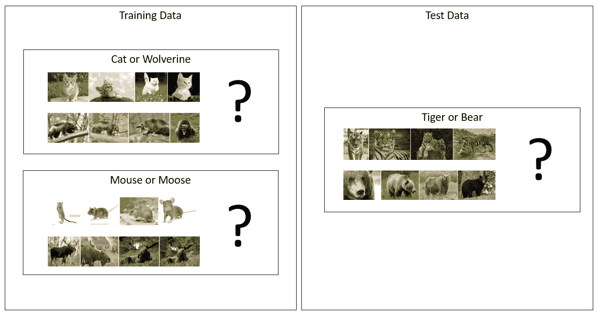

将元学习应用于图像分类的例子（图片来源：Google）

因此，这个概念涉及训练模型来分类识别老鼠或驼鹿以及猫或猞猁的任务，然后通过元学习，将这一方法应用于识别老虎或熊的任务。本质上，我们以递归测试模型的方式训练模型——迭代地使用少量样本集合暴露给网络，作为泛化学习的一种方式。您可能已经听说过在元学习背景下使用的“少样本学习”这个术语，它描述了每个任务中暴露给模型的少量样本。通过这个过程更新模型的方式已被归类为以下三种当前思想流派：

+   **基于度量**：这些解决方案之所以被称为如此，是因为它们依赖于训练一个度量来评估和监控性能。这通常要求学习者在定义网络试图模拟的分布的核而不是显式调整网络。我们发现，使用两个相对对立的网络进行对抗性学习可以平衡和细化这种学习，以编码或嵌入的形式学习度量。这种类型方法的一些优秀例子包括用于少样本学习的卷积孪生网络、匹配网络、全上下文嵌入、关系网络和原型网络。

+   **基于模型**：解决方案定义了一组依赖于某种形式记忆增强或上下文的方法。记忆增强神经网络（MANN）是使用此解决方案时将找到的主要实现。这一概念进一步基于神经图灵机（NTM），它描述了一个学习从记忆-软注意力中读取和写入的控制器网络。以下NTM架构图展示了这一概念的一个例子：

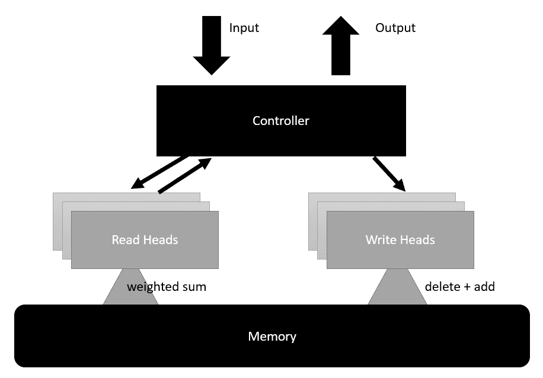

神经图灵机的例子

+   NTM架构被用来为元学习提供动力。训练MANN需要对模型如何记忆和编码任务细节给予关注。这个模型通常以延长不同训练数据重新引入和记忆所需的时间的方式来训练。本质上，代理（agent）在单个任务上的训练时间会越来越长，然后在后续的训练中被迫回忆预先学习任务的记忆。有趣的是，这正是我们人类经常用来专注于学习特定复杂任务的方法。然后，我们会在之后重新测试这些知识，以加强记忆中的这些知识。这个概念在MANN中同样适用，许多人认为NTM或记忆是任何元学习模式的关键成分。

+   **基于优化的**：解决方案既是前两种解决方案的结合，也是一种反模式。在基于优化的问题中，我们考虑问题的根源，因此优化我们的函数问题，不仅使用梯度下降，还通过上下文或时间引入梯度下降。通过上下文或时间进行的梯度下降也被称为**时间反向传播**（**BPTT**），这是我们查看循环网络时简要提到过的。通过将循环网络或**长短期记忆**（**LSTM**）层引入网络，我们鼓励网络记住梯度上下文。另一种思考方式是，网络学习它在训练期间应用的梯度历史。因此，元学习器通过以下图示所示的过程进行训练：

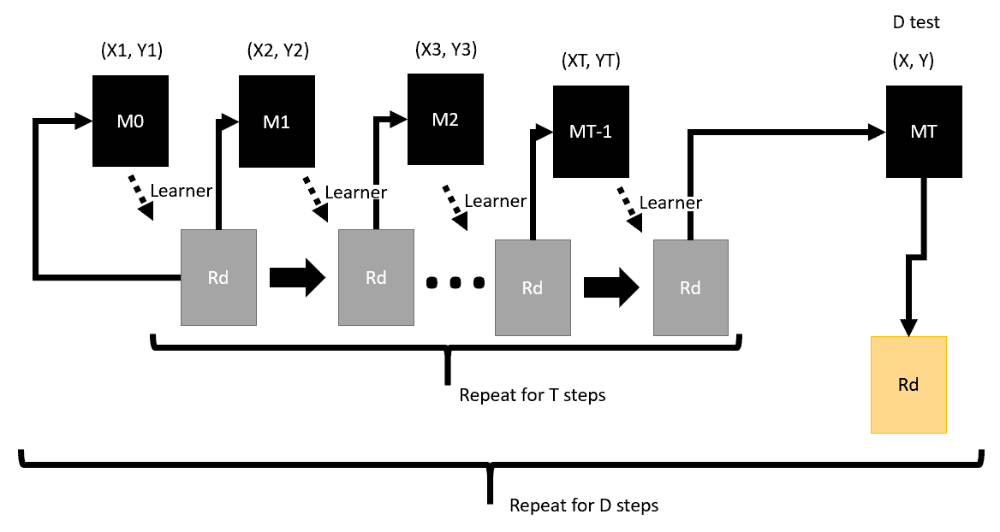

使用LSTM训练元学习

该图来源于Sachin Ravi和Hugo Larochelle发表的论文《Optimization as a Model for Few-Shot Learning》，并且是原始版本的一个大幅简化版。在图中，我们可以看到元学习器是如何在常规模型之外进行训练的，通常在一个外部循环中，而内部循环则定义为单个分类、回归或其他基于学习任务的训练过程。

虽然存在三种不同的元学习形式，但我们将特别关注优化形式，特别是通过假设无模型（agnostic model）的方法，我们将在下一节中探讨。

# 模型无关的元学习

**模型无关的元学习**（**MAML**）被描述为一种通用的优化方法，它将适用于任何使用梯度下降进行优化或学习的机器学习方法。这里的直觉是我们希望找到一个损失近似，它能最好地匹配我们当前正在执行的任务。MAML通过在模型训练任务中添加上下文来实现这一点。这个上下文被用来细化模型训练参数，从而使我们的模型能够更好地为特定任务应用梯度损失。

这个例子使用了MNIST数据集，这是一个包含60,000个手写数字的集合，通常用于基本的图像分类任务。虽然该数据集已经通过多种方法以高精度解决，但它通常是图像分类任务的基准比较。

这可能仍然听起来很抽象，所以在下一次练习中，我们将下载一个名为`learn2learn`的PyTorch机器学习框架，并展示如何使用MAML：

1.  我们首先创建一个新的虚拟环境，然后下载一个名为`learn2learn`的包，这是一个元学习框架，它提供了PyTorch中MAML的出色实现。确保你创建一个新的环境并安装PyTorch和Gym环境，就像我们之前做的那样。你可以使用以下命令安装`learn2learn`：

```py
pip install learn2learn  # after installing new environment with torch

pip install tqdm # used for displaying progress
```

1.  为了了解如何在基本任务中使用`learn2learn`，我们将回顾存储库中找到的基本MNIST训练样本，但不会查看源代码`Chapter_14_learn.py`中提供的每个代码示例的每个部分。打开样本并查看代码的顶部部分，如下所示：

```py
import learn2learn as l2l
class Net(nn.Module):
    def __init__(self, ways=3):
        super(Net, self).__init__()
        self.conv1 = nn.Conv2d(1, 20, 5, 1)
        self.conv2 = nn.Conv2d(20, 50, 5, 1)
        self.fc1 = nn.Linear(4 * 4 * 50, 500)
        self.fc2 = nn.Linear(500, ways)

    def forward(self, x):
        x = F.relu(self.conv1(x))
        x = F.max_pool2d(x, 2, 2)
        x = F.relu(self.conv2(x))
        x = F.max_pool2d(x, 2, 2)
        x = x.view(-1, 4 * 4 * 50)
        x = F.relu(self.fc1(x))
        x = self.fc2(x)
        return F.log_softmax(x, dim=1)
```

1.  这段代码的顶部部分显示了`learn2learn`的`import`语句和`Net`类的定义。这是我们将要训练的网络模型。注意模型由两个卷积/池化层组成，随后是一个连接到输出层的全连接线性层。注意使用`ways`作为输入变量，它定义了最后一个输出层的输出数量。

1.  接下来，我们将向下滚动到`main`函数。这里发生所有的主设置和初始化。这个样本比大多数样本更健壮，它提供了输入参数，你可以使用这些参数而不是在代码中修改超参数。以下代码展示了`main`函数的顶部：

```py
def main(lr=0.005, maml_lr=0.01, iterations=1000, ways=5, shots=1, tps=32, fas=5, device=torch.device("cpu"),
         download_location="/tmp/mnist"):
    transformations = transforms.Compose([
        transforms.ToTensor(),
        transforms.Normalize((0.1307,), (0.3081,)),
        lambda x: x.view(1, 1, 28, 28),
    ])

    mnist_train = l2l.data.MetaDataset(MNIST(download_location, train=True, download=True, transform=transformations))
    # mnist_test = MNIST(file_location, train=False, download=True, transform=transformations)

    train_gen = l2l.data.TaskGenerator(mnist_train, ways=ways, tasks=10000)
    # test_gen = l2l.data.TaskGenerator(mnist_test, ways=ways)

    model = Net(ways)
    model.to(device)
    meta_model = l2l.algorithms.MAML(model, lr=maml_lr)
    opt = optim.Adam(meta_model.parameters(), lr=lr)
    loss_func = nn.NLLLoss(reduction="sum")
```

1.  虽然我们之前没有通过图像分类示例，但希望代码对你来说相对容易理解且熟悉。需要注意的是，在代码高亮行使用`l2l.algorithms.MAML`模型构建`meta_model`。注意`meta_model`是如何通过将其作为输入来包装`model`网络的。

1.  从这里，我们将向下滚动到我们之前多次见过的熟悉的训练循环。然而，这次有一些有趣的不同之处。具体查看第一个迭代循环内部的代码，如下所示：

```py
iteration_error = 0.0
iteration_acc = 0.0
for _ in range(tps):
    learner = meta_model.clone()
    train_task = train_gen.sample()
    valid_task = train_gen.sample(task=train_task.sampled_task)
```

注意我们是如何构建一个`meta_model`学习器的`learner`克隆。这个`learner`克隆变成了我们的目标学习网络。最后两行展示了为训练和验证任务构建采样器的过程。

1.  接下来，让我们看看如何使用`learner`在另一个循环中以迭代方式再次计算损失，如下所示：

```py
for step in range(fas):
    train_error, _ = compute_loss(train_task, device, learner, loss_func, batch=shots * ways)
    learner.adapt(train_error)
```

1.  在这个阶段，运行样本并观察输出，以了解训练是如何进行的。

现在我们已经理解了一些基本的代码设置，我们将继续探索如何在下一节中探索样本的训练和损失计算。

# 训练元学习器

`learn2learn`框架提供了MAML框架，用于构建我们可以用来学习如何学习的学习者模型；然而，它不是自动的，并且确实需要一些设置和思考，关于如何计算特定任务集的损失。我们已经看到了我们计算损失的地方——现在我们将更详细地看看如何在任务之间计算损失。重新打开`Chapter_14_learn.py`并完成以下练习：

1.  滚动回`main`函数中最内层的训练循环。

1.  这里的内部循环被称为**快速自适应训练循环**，因为我们向网络展示了一些或小批量或数据样本进行训练。计算网络的损失是通过`compute_loss`函数完成的，如下面的代码所示：

```py
def compute_loss(task, device, learner, loss_func, batch=5):
    loss = 0.0
    acc = 0.0
    dataloader = DataLoader(task, batch_size=batch, shuffle=False, num_workers=0)
    for i, (x, y) in enumerate(dataloader):
        x, y = x.squeeze(dim=1).to(device), y.view(-1).to(device)
        output = learner(x)
        curr_loss = loss_func(output, y)
        acc += accuracy(output, y)
        loss += curr_loss / x.size(0)
    loss /= len(dataloader)
    return loss, acc
```

1.  注意损失是如何通过迭代任务训练批次来计算的，通过迭代`dataloader`列表。然后我们通过将总损失`loss`除以数据加载器的数量来计算所有任务的平均损失。

1.  这个平均`loss`和准确度`acc`由`compute_loss`函数返回。从这个学习实例中，学习者随后使用以下代码行进行适应或更新：

```py
train_error, _ = compute_loss(train_task, device, learner, loss_func, batch=shots * ways)
learner.adapt(train_error)
```

1.  在快速自适应循环和通过每个循环更新学习者之后，我们可以使用以下代码验证学习者：

```py
valid_error, valid_acc = compute_loss(valid_task, device, learner, loss_func, batch=shots * ways)
iteration_error += valid_error
iteration_acc += valid_acc
```

1.  `valid_error`验证错误和`valid_acc`准确度随后累计在总的`iteration_error`错误和`iteration_acc`准确度值上。

1.  我们通过以下代码计算平均迭代和准确度误差，`iteration_error`或`iteration_acc`值，然后将该误差反向传播到网络中：

```py
iteration_error /= tps
iteration_acc /= tps
tqdm_bar.set_description("Loss : {:.3f} Acc : {:.3f}".format(iteration_error.item(), iteration_acc))

# Take the meta-learning step
opt.zero_grad()
iteration_error.backward()
opt.step()
```

1.  这个示例的训练相当快，所以再次运行示例并观察算法在元学习任务上的训练速度有多快。

每个元学习步骤都涉及使用BPTT将损失反向推回网络，因为元网络由循环层组成。这个细节在这里被抽象化，但希望你能欣赏我们如何无缝地将元学习引入到训练这个常规图像分类任务中。在下一节中，我们将看看如何将元学习应用于强化学习。

# 介绍元强化学习

现在，我们理解了元学习的概念，我们可以继续探讨元强化学习。元-RL——或者称为RL^2（RL平方），正如它被称呼的那样——正在迅速发展，但额外的复杂性仍然使得这种方法目前难以接触。虽然概念与原始元学习非常相似，但它仍然为RL引入了许多细微差别。其中一些可能难以理解，因此希望以下图表能有所帮助。它来自一篇题为《强化学习，快与慢》的论文，作者为Botvinick等人，2019年([https://www.cell.com/action/showPdf?pii=S1364-6613%2819%2930061-0](https://www.cell.com/action/showPdf?pii=S1364-6613%2819%2930061-0))：

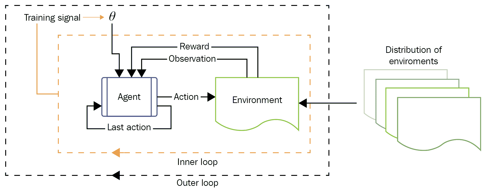

元强化学习

在图中，你可以看到典型的元学习特征，即熟悉的内外循环。这意味着我们也在元-RL中从评估任何观察到的状态的政策，现在也包括最后一步、最后奖励和观察到的状态。这些差异总结如下：

+   强化学习 = 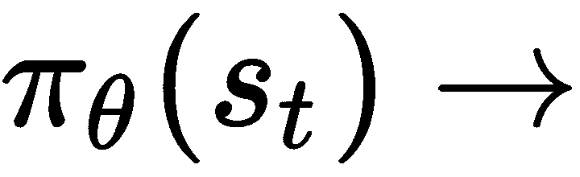 分布在  上

+   元强化学习 = 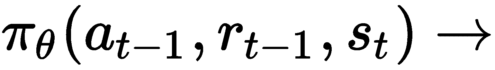 分布在  上

正如我们所看到的常规元学习，元-RL中有许多变体被使用和实验，但它们都共享以下三个共同元素：

+   **模型记忆**：我们通过循环网络层或LSTM的形式向我们的模型添加记忆。通常，外循环由LSTM层激活的记忆组件组成。

+   **MDPs的分布**：代理/算法需要在多个不同的MDPs上进行训练，这通常是通过将其暴露于不同的或随机化的环境中来完成的。

+   **元学习算法**：代理需要一种元学习算法来学习如何学习。

Unity Obstacle Tower Challenge很可能是为了鼓励开发者构建元-RL代理而开发的，但正如我们所看到的，获胜的条目使用了分层强化学习的变体。虽然HRL旨在完成与元-RL相同的功能，但它缺乏自动生成记忆的能力。

为了了解元-RL算法的多样性，我们将查看一个似乎是最新的方法列表：

+   **优化权重**：这本质上上是MAML或另一个称为Reptile的变体。MAML是目前使用较为流行的变体之一，我们将在稍后详细探讨。

+   **元学习超参数**：我们有几个内部使用的超参数来平衡RL中的学习。这些是我们之前调整过的gamma和alpha值，但想象一下，如果它们可以通过元学习来自动调整。

+   **元学习损失**：这考虑了损失函数本身可能需要调整，并使用一种模式在迭代中进化它。这种方法使用的是本书范围之外的进化策略。

+   **元学习探索**：这使用元学习来构建更有效的探索策略。这反过来又减少了探索所需的时间，并提高了有效的训练性能。

+   **周期性控制**：这为智能体提供了一种方法来保持重要的周期在记忆中，并忘记其他周期。这听起来很像优先经验回放，但这里的控制方法是在损失计算中，而不是从回放中。

+   **进化算法**：这些是梯度无关的、基于优化的解决方案，它们使用一种遗传搜索形式来找到解决方案方法。进化算法与深度学习的碰撞是一个持续的努力，许多人尝试过并失败了。这两种方法本身都非常强大和有能力，因此它们可能很快就会结合成一个有效的模型。

如您所见，元RL方法有很多变化，我们将在下一节中详细查看一种方法的实现。

# MAML-RL

`learn2learn`存储库包含如何使用他们的库来实现这种方法的一些变体的另一个很好的例子。我们将要查看的一个好方法是Meta-SGD的实现，它通过采用vanilla策略梯度来使用每个参数的学习率进一步扩展了MAML，通常被称为MetaSGD-VPG。这个概念最初在论文《带有任务嵌入和共享策略的元强化学习》中提出，该论文本身是在IJCAI-19上提出的。

在继续之前，请确保您已经完成了上一个练习中的所有安装步骤。如果您在运行示例时遇到问题，请在新虚拟环境中重新安装。一些问题可能与您使用的PyTorch版本有关，因此请检查您的版本是否兼容。

打开`Chapter_14_MetaSGD-VPG.py`并按照以下步骤进行：

1.  您需要首先通过在您的虚拟环境窗口中输入以下命令来安装cherry RL包：

```py
pip install cherry-rl
```

1.  我们不会审查整个代码列表，只审查关键部分。首先，让我们看看`main`函数，它启动初始化并托管训练。此函数的开始部分如下所示：

```py
def main(
        experiment='dev',
        env_name='Particles2D-v1',
        adapt_lr=0.1,
        meta_lr=0.01,
        adapt_steps=1,
        num_iterations=200,
        meta_bsz=20,
        adapt_bsz=20,
        tau=1.00,
        gamma=0.99,
        num_workers=2,
        seed=42,
):
    random.seed(seed)
    np.random.seed(seed)
    th.manual_seed(seed)

    def make_env():
        return gym.make(env_name)
```

在`main`函数的定义中，我们可以看到所有相关的超参数以及它们选择的默认值。请注意，用于适应和元学习步骤的两个新超参数组分别以前缀`adapt`和`meta`开头。

1.  接下来，我们将使用以下代码查看环境的初始化、策略、元学习者和优化器的初始化：

```py
env = l2l.gym.AsyncVectorEnv([make_env for _ in range(num_workers)])
env.seed(seed)
env = ch.envs.Torch(env)
policy = DiagNormalPolicy(env.state_size, env.action_size)
meta_learner = l2l.algorithms.MetaSGD(policy, lr=meta_lr)
baseline = LinearValue(env.state_size, env.action_size)
opt = optim.Adam(policy.parameters(), lr=meta_lr)
all_rewards = []
```

1.  在这里，我们可以看到三个训练循环。首先，外层迭代循环控制元学习的重复次数。在这个循环内部，我们有任务设置和配置循环；记住，我们希望每个学习会话都需要一个不同但相关的任务。第三个、最内层的循环是自适应发生的地方，我们将损失反向传递通过模型。所有三个循环的代码如下所示：

```py
for iteration in range(num_iterations):
    iteration_loss = 0.0
    iteration_reward = 0.0
    for task_config in tqdm(env.sample_tasks(meta_bsz)): 
        learner = meta_learner.clone()
        env.set_task(task_config)
        env.reset()
        task = ch.envs.Runner(env)

        # Fast Adapt
        for step in range(adapt_steps):
            train_episodes = task.run(learner, episodes=adapt_bsz)
            loss = maml_a2c_loss(train_episodes, learner, baseline, gamma, tau)
            learner.adapt(loss)
```

1.  在快速自适应循环完成后，我们然后回到第二个循环并使用以下代码计算验证损失：

```py
valid_episodes = task.run(learner, episodes=adapt_bsz)
loss = maml_a2c_loss(valid_episodes, learner, baseline, gamma, tau)
iteration_loss += loss
iteration_reward += valid_episodes.reward().sum().item() / adapt_bsz
```

1.  验证损失是在第二个循环中为每个不同的任务计算的。然后，这个损失被累积到迭代损失 `iteration_loss` 中。离开第二个循环后，我们打印出一些统计数据并计算自适应损失 `adaption_loss`，并使用以下代码将这个损失作为梯度反向传递通过网络进行训练：

```py
adaptation_loss = iteration_loss / meta_bsz
print('adaptation_loss', adaptation_loss.item())

opt.zero_grad()
adaptation_loss.backward()
opt.step()
```

1.  记住，在损失方程（迭代和自适应）中的除数都使用了一个相似的值 `20`，`meta_bsz` `= 20`，和 `adapt_bsz = 20`。基本损失函数由 `maml_a2c_loss` 和 `compute_advantages` 函数定义，如下面的代码所示：

```py
def compute_advantages(baseline, tau, gamma, rewards, dones, states, next_states):
    # Update baseline
    returns = ch.td.discount(gamma, rewards, dones)
    baseline.fit(states, returns)
    values = baseline(states)
    next_values = baseline(next_states)
    bootstraps = values * (1.0 - dones) + next_values * dones
    next_value = th.zeros(1, device=values.device)
    return ch.pg.generalized_advantage(tau=tau,
                                       gamma=gamma,
                                       rewards=rewards,
                                       dones=dones,
                                       values=bootstraps,
                                       next_value=next_value)

def maml_a2c_loss(train_episodes, learner, baseline, gamma, tau):    
    states = train_episodes.state()
    actions = train_episodes.action()
    rewards = train_episodes.reward()
    dones = train_episodes.done()
    next_states = train_episodes.next_state()
    log_probs = learner.log_prob(states, actions)
    advantages = compute_advantages(baseline, tau, gamma, rewards,
                                    dones, states, next_states)
    advantages = ch.normalize(advantages).detach()
    return a2c.policy_loss(log_probs, advantages)
```

注意樱桃RL库如何帮助我们避免了某些复杂代码的实现。幸运的是，我们应该已经知道樱桃函数 `ch.td.discount` 和 `ch.pg.generalized_advantage` 是什么，因为我们已经在之前的章节中遇到过它们，所以我们在这里不需要回顾它们。

1.  按照正常方式运行示例并观察输出。以下代码展示了生成的输出示例：

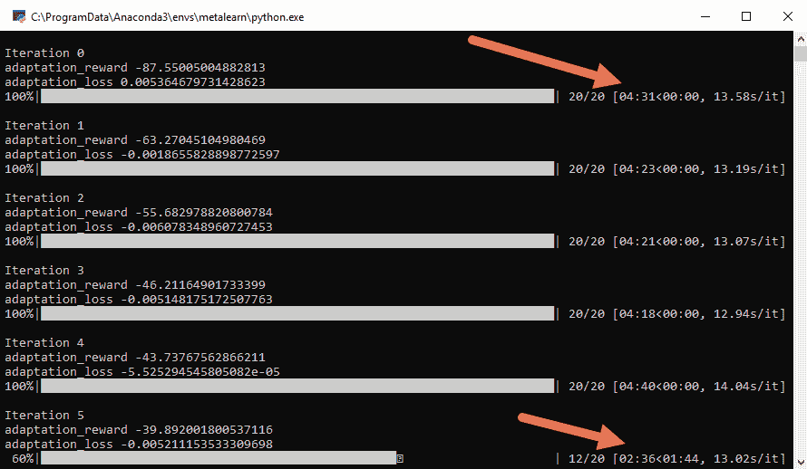

来自第14章 Chapter_14_MetaSQG-VPG.py 的示例输出

注意样本在首次运行于CPU时预期的训练时间量。当预测在不到一个小时的时间内从五天减少到略超过两天时，它仍然展示了此类训练的计算需求。因此，如果你计划进行任何严肃的元强化学习（meta-RL）工作，你可能会想使用一个非常快的GPU进行训练。在非常快的GPU上进行测试时，前面的样本处理时间减少了1,000倍。是的，你读对了，1,000倍。虽然你可能不会体验到如此巨大的差异，但从CPU升级到GPU的任何提升都将非常显著。

在强化学习（RL）社区中，许多人坚信元强化学习（meta-RL）是我们需要解决以接近通用人工智能（AGI）的下一个重大飞跃。这个领域的大部分发展仍然由当前最先进的技术所指导，以及如何和何时变化将决定RL的未来。考虑到这一点，我们将探讨一些其他潜在的下一步，从下一节中的HER开始。

# 使用事后经验重放

OpenAI引入了回溯经验重放作为处理稀疏奖励的方法，但该算法也已被证明能够成功地在任务间泛化，部分原因是HER工作的新颖机制。用来解释HER的类比是一个保龄球游戏，其目的是将一个圆盘滑过一张长桌以达到目标。当我们刚开始学习这个游戏时，我们经常会反复失败，圆盘掉落桌子或游戏区域。但是，我们假设我们通过预期失败并在失败时给自己奖励来学习。然后，在内部，我们可以通过减少失败奖励来反向工作，从而增加其他非失败奖励。在某种程度上，这种方法类似于层次强化学习（我们之前看过的HRL的一种形式），但没有广泛的预训练部分。

下面的部分样本再次来源于[https://github.com/higgsfield](https://github.com/higgsfield)，是来自哈萨克斯坦阿拉木图的一名年轻人Dulat Yerzat的结果。

打开`Chapter_14_wo_HER.py`和`Chapter_14_HER.py`的样本。这两个样本是应用了和未应用HER的简单DQN网络的比较。按照以下步骤进行：

1.  这两个示例几乎相同，除了HER的实现，所以比较将帮助我们理解代码的工作方式。接下来，环境已经被简化并定制构建，以执行简单的随机位移动操作。创建环境的代码如下：

```py
class Env(object):
    def __init__(self, num_bits):
        self.num_bits = num_bits

    def reset(self):
        self.done = False
        self.num_steps = 0
        self.state = np.random.randint(2, size=self.num_bits)
        self.target = np.random.randint(2, size=self.num_bits)
        return self.state, self.target

    def step(self, action):
        if self.done:
            raise RESET        
        self.state[action] = 1 - self.state[action]        
        if self.num_steps > self.num_bits + 1:
            self.done = True
        self.num_steps += 1        
        if np.sum(self.state == self.target) == self.num_bits:
            self.done = True
            return np.copy(self.state), 0, self.done, {}
        else:
            return np.copy(self.state), -1, self.done, {}
```

1.  我们从未真正讲解过如何构建自定义环境，但正如你所见，它可以相当简单。接下来，我们将查看我们将用于训练的简单DQN模型，如下面的代码所示：

```py
class Model(nn.Module):
    def __init__(self, num_inputs, num_outputs, hidden_size=256):
        super(Model, self).__init__()

        self.linear1 = nn.Linear(num_inputs, hidden_size)
        self.linear2 = nn.Linear(hidden_size, num_outputs)

    def forward(self, state, goal):
        x = torch.cat([state, goal], 1)
        x = F.relu(self.linear1(x))
        x = self.linear2(x)
        return x
```

1.  这就是你可以得到的简单DQN模型。接下来，让我们通过并排查看代码来比较这两个示例，如下面的截图所示：

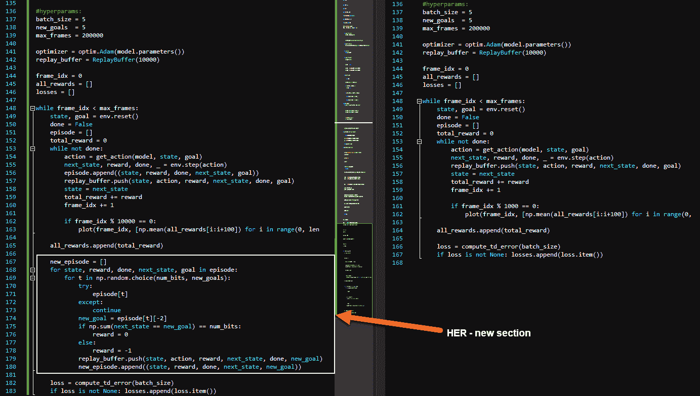

VS中的代码示例比较

1.  新的代码部分也在这里显示：

```py
new_episode = []
  for state, reward, done, next_state, goal in episode:
    for t in np.random.choice(num_bits, new_goals):
      try:
        episode[t]
      except:
        continue
      new_goal = episode[t][-2]
      if np.sum(next_state == new_goal) == num_bits:
        reward = 0
      else:
        reward = -1
      replay_buffer.push(state, action, reward, next_state, done, new_goal)
      new_episode.append((state, reward, done, next_state, new_goal)) 
```

1.  我们在这里看到的是添加了另一个循环，这与元强化学习类似，但这次它作为一个兄弟存在。第二个循环在第一个内部循环完成一个回合后激活。然后，它遍历前一个回合中的每个事件，并根据新的目标调整目标或目标，基于返回的奖励。这本质上就是回溯部分。

1.  这个例子剩余的部分与我们之前的许多例子相似，现在应该已经很熟悉了。但有趣的部分是`get_action`函数，如下面的代码所示：

```py
def get_action(model, state, goal, epsilon=0.1):
    if random.random() < 0.1:
        return random.randrange(env.num_bits)

    state = torch.FloatTensor(state).unsqueeze(0).to(device)
    goal = torch.FloatTensor(goal).unsqueeze(0).to(device)
    q_value = model(state, goal)
    return q_value.max(1)[1].item()
```

注意，这里我们使用了一个默认为`.1`的`epsilon`值，表示探索的倾向。实际上，你可能注意到这个例子没有使用变量探索。

1.  继续探讨差异，下一个关键差异是`compute_td_loss`函数，如下面的代码所示：

```py
def compute_td_error(batch_size):
    if batch_size > len(replay_buffer):
        return None

    state, action, reward, next_state, done, goal = replay_buffer.sample(batch_size)

    state = torch.FloatTensor(state).to(device)
    reward = torch.FloatTensor(reward).unsqueeze(1).to(device)
    action = torch.LongTensor(action).unsqueeze(1).to(device)
    next_state = torch.FloatTensor(next_state).to(device)
    goal = torch.FloatTensor(goal).to(device)
    mask = torch.FloatTensor(1 - np.float32(done)).unsqueeze(1).to(device)

    q_values = model(state, goal)
    q_value = q_values.gather(1, action)

    next_q_values = target_model(next_state, goal)
    target_action = next_q_values.max(1)[1].unsqueeze(1)
    next_q_value = target_model(next_state, goal).gather(1, target_action)

    expected_q_value = reward + 0.99 * next_q_value * mask

    loss = (q_value - expected_q_value.detach()).pow(2).mean()

    optimizer.zero_grad()
    loss.backward()
    optimizer.step()

    return loss
```

1.  首先运行不带HER的示例并观察结果，然后运行带有HER的示例。带有HER的示例的输出如下所示：

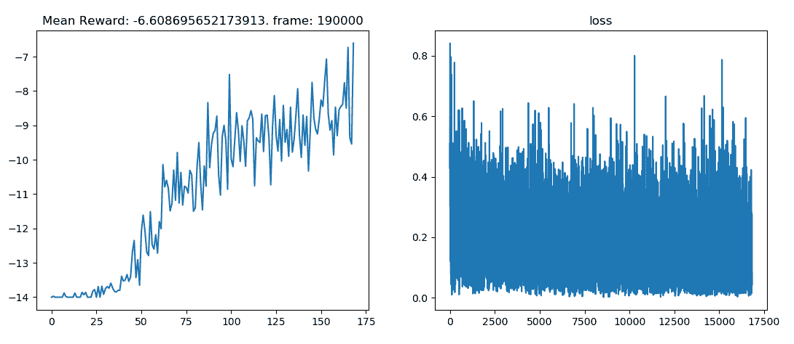

从`Chapter_14_HER.py`章节的示例输出

与没有HER的示例相比，前面的输出明显更好。您需要亲自运行这两个示例以查看确切差异。注意损失的计算始终保持一致且没有收敛，而平均奖励却在增加。在下一节中，我们将转向RL领域预期的下一波浪潮——想象和推理。

# RL中的想象和推理

从我们自己的学习经验中，我们可以观察到想象如何有助于学习过程。纯想象是深层次抽象思维和梦想的素材，通常比解决实际问题的任何方法更接近于幻觉。然而，这种相同的想象力可以用来填补我们对知识的理解中的空白，并允许我们推理出可能的解决方案。比如说，我们正在尝试解决拼图的问题，而我们只有三个剩余的、大部分是黑色的碎片，如下面的图像所示：

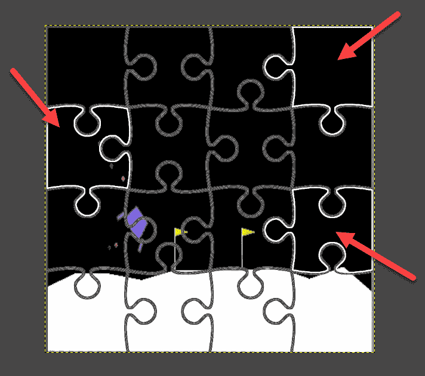

想象三个缺失的拼图碎片可能的样子

由于前面的图示非常简单，我们很容易想象那些拼图碎片可能的样子。我们能够利用之前的观察和推理的想象力轻松填补这些空白。这种使用想象力填补空白的方法是我们经常使用的，人们常说，想象力越丰富，智力也越高。现在，这条通往AI的道路是否真的能证明这一理论，还有待观察，但它确实看起来是一个可能性。

想象并非凭空而来，同样地，为了给我们的代理赋予想象，我们必须基本上引导他们的记忆或之前的经验。我们将在下一项练习中这样做，以便我们能够从这些经验中生成想象。打开样本`Chapter_14_Imagine_A2C.py`并按照以下步骤进行：

1.  我们将使用一个简单的A2C Vanilla PG方法作为生成我们想象训练引导的基础代理。让我们首先在文件中向下滚动，看看定义我们的代理的`ActorCritic`类：

```py
class ActorCritic(OnPolicy):
    def __init__(self, in_shape, num_actions):
        super(ActorCritic, self).__init__()

        self.in_shape = in_shape

        self.features = nn.Sequential(
            nn.Conv2d(in_shape[0], 16, kernel_size=3, stride=1),
            nn.ReLU(),
            nn.Conv2d(16, 16, kernel_size=3, stride=2),
            nn.ReLU(),
        )

        self.fc = nn.Sequential(
            nn.Linear(self.feature_size(), 256),
            nn.ReLU(),
        )

        self.critic = nn.Linear(256, 1)
        self.actor = nn.Linear(256, num_actions)

    def forward(self, x):
        x = self.features(x)
        x = x.view(x.size(0), -1)
        x = self.fc(x)
        logit = self.actor(x)
        value = self.critic(x)
        return logit, value

    def feature_size(self):
        return self.features(autograd.Variable(torch.zeros(1, *self.in_shape))).view(1, -1).size(1)
```

1.  我们可以看到一个简单的PG代理，它将由A2C同步的actor-critic提供动力。接下来，我们来到另一个新类，称为`RolloutStorage`。Rollout storage在概念上与经验回放相似，但它还使我们能够进行持续的回报计算，如下面的代码所示：

```py
class RolloutStorage(object):
    def __init__(self, num_steps, num_envs, state_shape):
        self.num_steps = num_steps
        self.num_envs = num_envs
        self.states = torch.zeros(num_steps + 1, num_envs, *state_shape)
        self.rewards = torch.zeros(num_steps, num_envs, 1)
        self.masks = torch.ones(num_steps + 1, num_envs, 1)
        self.actions = torch.zeros(num_steps, num_envs, 1).long()
        #self.use_cuda = False

    def cuda(self):
        #self.use_cuda = True
        self.states = self.states.cuda()
        self.rewards = self.rewards.cuda()
        self.masks = self.masks.cuda()
        self.actions = self.actions.cuda()

    def insert(self, step, state, action, reward, mask):
        self.states[step + 1].copy_(state)
        self.actions[step].copy_(action)
        self.rewards[step].copy_(reward)
        self.masks[step + 1].copy_(mask)

    def after_update(self):
        self.states[0].copy_(self.states[-1])
        self.masks[0].copy_(self.masks[-1])

    def compute_returns(self, next_value, gamma):
        returns = torch.zeros(self.num_steps + 1, self.num_envs, 1)
        #if self.use_cuda:
        # returns = returns.cuda()
        returns[-1] = next_value
        for step in reversed(range(self.num_steps)):
            returns[step] = returns[step + 1] * gamma * self.masks[step + 1] + self.rewards[step]
        return returns[:-1]
```

1.  如果我们滚动到`main`函数，我们可以看到有16个同步环境正在以下代码的运行下进行：

```py
def main():
    mode = "regular"
    num_envs = 16

    def make_env():
        def _thunk():
            env = MiniPacman(mode, 1000)
            return env

        return _thunk

    envs = [make_env() for i in range(num_envs)]
    envs = SubprocVecEnv(envs)

    state_shape = envs.observation_space.shape
```

1.  我们将在稍后更多地讨论`RolloutStorage`类。现在，向下移动到代码的训练部分。这是典型的双层循环代码，外部循环控制剧集，内部循环控制步骤，如下面的代码所示：

```py
for i_update in range(num_frames):
        for step in range(num_steps):
            action = actor_critic.act(autograd.Variable(state))
```

其余的训练代码应该很熟悉，但你应该自己详细复习。

1.  我们想要观察的下一个主要区别是在外部训练循环的末尾。这段最后的代码块是计算损失并将其推回网络的地方：

```py
optimizer.zero_grad()
loss = value_loss * value_loss_coef + action_loss - entropy * entropy_coef
loss.backward()
nn.utils.clip_grad_norm(actor_critic.parameters(), max_grad_norm)
optimizer.step()
```

1.  注意前面代码块中突出显示的行。这是独特的，因为我们正在将梯度裁剪到可能避免爆炸梯度的最大值。代码的最后部分渲染出游戏区域，并显示代理玩游戏。

爆炸梯度是指梯度值变得如此之大，以至于它使网络忘记了知识。网络权重开始进行剧烈波动，任何以前的知识通常会丢失。

1.  按照正常方式运行代码并观察输出。

运行前面的代码还会创建一个保存状态字典的记忆，我们将用它来填充想象。如果你想继续进行后续练习，你必须完成这个最后的练习。在下一节中，我们将探讨如何使用这些潜在痕迹来生成代理的想象。

# 生成想象

在这个算法的当前版本中，我们首先需要通过一个代理或可能是一个人的先前运行来引导我们在代理中填充的记忆。这实际上与模仿学习或行为克隆没有太大区别，只是我们使用的是一个我们将后来用作想象离策略基础的在线策略代理。在我们将想象结合到代理之前，我们可以看到预测的下一个状态与代理的实际状态相比将是什么样子。让我们通过打开下一个示例`Chapter_14_Imagination.py`并执行以下步骤来了解这是如何工作的：

1.  这个例子通过加载我们在上一个练习中生成的上一个保存状态字典来工作。在继续之前，请确保这些数据是在同一文件夹中带有前缀为`actor_critic_`的文件中生成并保存的。

1.  这段代码的目的是提取我们之前记录的保存状态观察字典。然后我们想要提取观察结果，并使用它来想象下一个状态将是什么样子。然后我们可以比较想象的状态和下一个状态之间的相似程度。这种相似程度将反过来用于训练想象损失。我们可以通过查看以下代码行来了解如何加载先前的模型：

```py
actor_critic.load_state_dict(torch.load("actor_critic_" + mode))
```

1.  上一行代码重新加载了我们之前训练的模型。现在我们想使用想象力（例如）合理地填补代理可能没有探索的区域。向下滚动，我们可以看到将学习代理的想象力部分的训练循环：

```py
for frame_idx, states, actions, rewards, next_states, dones in play_games(envs, num_updates):
    states = torch.FloatTensor(states)
    actions = torch.LongTensor(actions)
    batch_size = states.size(0)

    onehot_actions = torch.zeros(batch_size, num_actions, *state_shape[1:])
    onehot_actions[range(batch_size), actions] = 1
    inputs = autograd.Variable(torch.cat([states, onehot_actions], 1))
```

1.  此循环遍历之前玩过的游戏，并使用独热编码对动作进行编码。向下滚动，我们可以看到如何学习`imagined_state`状态和`imagined_reward`奖励：

```py
imagined_state, imagined_reward = env_model(inputs)

target_state = pix_to_target(next_states)
target_state = autograd.Variable(torch.LongTensor(target_state))
target_reward = rewards_to_target(mode, rewards)
target_reward = autograd.Variable(torch.LongTensor(target_reward))

optimizer.zero_grad()
image_loss = criterion(imagined_state, target_state)
reward_loss = criterion(imagined_reward, target_reward)
loss = image_loss + reward_coef * reward_loss
loss.backward()
optimizer.step()

losses.append(loss.item())
all_rewards.append(np.mean(rewards))
```

这是学习从之前观察到的观察中正确想象目标状态和奖励的代码部分。当然，观察越多，想象力越好，但到了某个点，过多的观察将完全消除所有想象力。平衡这种新的权衡将需要一些自己的尝试和错误。

1.  向文件底部滚动，您可以看到以下代码输出的想象力和目标状态的示例：

```py
while not done:
    steps += 1
    actions = get_action(state)
    onehot_actions = torch.zeros(batch_size, num_actions, *state_shape[1:])
    onehot_actions[range(batch_size), actions] = 1
    state = torch.FloatTensor(state).unsqueeze(0)

    inputs = autograd.Variable(torch.cat([state, onehot_actions], 1))      
    imagined_state, imagined_reward = env_model(inputs)
    imagined_state = F.softmax(imagined_state)
    iss.append(imagined_state)

    next_state, reward, done, _ = env.step(actions[0])
    ss.append(state)
    state = next_state

    imagined_image = target_to_pix(imagined_state.view(batch_size, -1, len(pixels))[0].max(1)[1].data.cpu().numpy())
    imagined_image = imagined_image.reshape(15, 19, 3)
    state_image = torch.FloatTensor(next_state).permute(1, 2, 0).cpu().numpy()

    plt.figure(figsize=(10,3))
    plt.subplot(131)
    plt.title("Imagined")
    plt.imshow(imagined_image)
    plt.subplot(132)
    plt.title("Actual")
    plt.imshow(state_image)
    plt.show()
    time.sleep(0.3)

    if steps > 30:
       break
```

1.  以下示例截图展示了原始作者通过长时间训练代理所能达到的最佳效果：

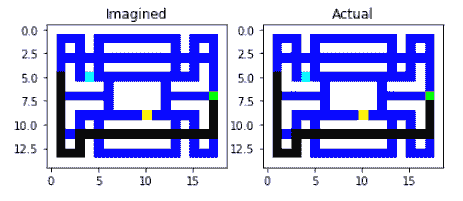

想象与实际比较示例

1.  运行示例并查看您的输出：根据您之前的训练量，它可能看起来并不那么好。再次强调，想象力的质量将基于先前的经验和训练量来完善想象力本身。

1.  最后要注意的一点是如何提取想象图像。这是通过在`BasicBlock`类中使用反转CNN来完成的，它将编码转换回正确分辨率的图像。`BasicBlock`类的代码在此处显示：

```py
class BasicBlock(nn.Module):
    def __init__(self, in_shape, n1, n2, n3):
        super(BasicBlock, self).__init__()

        self.in_shape = in_shape
        self.n1 = n1
        self.n2 = n2
        self.n3 = n3

        self.maxpool = nn.MaxPool2d(kernel_size=in_shape[1:])
        self.conv1 = nn.Sequential(
            nn.Conv2d(in_shape[0] * 2, n1, kernel_size=1, stride=2, padding=6),
            nn.ReLU(),
            nn.Conv2d(n1, n1, kernel_size=10, stride=1, padding=(5, 6)),
            nn.ReLU(),
        )
        self.conv2 = nn.Sequential(
            nn.Conv2d(in_shape[0] * 2, n2, kernel_size=1),
            nn.ReLU(),
            nn.Conv2d(n2, n2, kernel_size=3, stride=1, padding=1),
            nn.ReLU(),
        )
        self.conv3 = nn.Sequential(
            nn.Conv2d(n1 + n2, n3, kernel_size=1),
            nn.ReLU()
        )

    def forward(self, inputs):
        x = self.pool_and_inject(inputs)
        x = torch.cat([self.conv1(x), self.conv2(x)], 1)
        x = self.conv3(x)
        x = torch.cat([x, inputs], 1)
        return x

    def pool_and_inject(self, x):
        pooled = self.maxpool(x)
        tiled = pooled.expand((x.size(0),) + self.in_shape)
        out = torch.cat([tiled, x], 1)
        return out
```

如我们所见，训练想象力过程本身并不困难。真正的困难是将这一切整合到一个运行代理中，我们将在下一节中了解如何做到这一点，当我们学习I2A时。

# 理解增强想象力代理

**增强想象力代理**（**I2A**）的概念于2018年2月由T. Weber等人发表在题为《Imagination-Augmented Agents for Deep Reinforcement Learning》的论文中提出。我们之前已经讨论了为什么想象力对学习和学习学习很重要。想象力使我们能够填补学习中的空白，并在我们的知识上实现飞跃。

给予智能体想象能力，使我们能够结合基于模型和无模型的学习。我们在这本书中使用的多数智能体算法都是无模型的，这意味着我们没有环境的代表模型。早期，我们确实覆盖了基于模型的RL，包括MC和DP，但我们的大部分努力都集中在无模型智能体上。拥有环境模型的好处是智能体可以规划。没有模型，我们的智能体就只是通过试错尝试变得反应性。增加想象能力使我们能够在无模型的同时结合使用环境模型的一些方面。本质上，我们希望通过想象实现两者的最佳结合。

我们已经探讨了想象在I2A架构中的核心作用。这是我们上一节中查看的部分，它生成了想象特征和奖励，本质上属于模型部分。以下图展示了I2A架构、想象核心部分和 rollout 编码器：

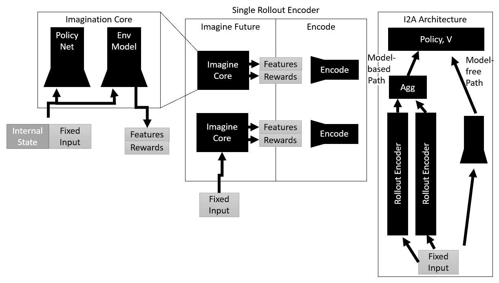

I2A架构总结

I2A架构展示了我们可以构建在DRL之上的系统的复杂性，以期望添加额外的学习优势，例如想象。为了真正理解这个架构，我们应该查看一个代码示例。打开`Chapter_14_I2A.py`并按照以下步骤进行：

1.  我们已经涵盖了架构的第一部分，所以在这个阶段，我们可以从策略本身开始。看看I2A策略类：

```py
class I2A(OnPolicy):
    def __init__(self, in_shape, num_actions, num_rewards, hidden_size, imagination, full_rollout=True):
        super(I2A, self).__init__()

        self.in_shape = in_shape
        self.num_actions = num_actions
        self.num_rewards = num_rewards

        self.imagination = imagination

        self.features = nn.Sequential(
            nn.Conv2d(in_shape[0], 16, kernel_size=3, stride=1),
            nn.ReLU(),
            nn.Conv2d(16, 16, kernel_size=3, stride=2),
            nn.ReLU(),
        )

        self.encoder = RolloutEncoder(in_shape, num_rewards, hidden_size)

        if full_rollout:
            self.fc = nn.Sequential(
                nn.Linear(self.feature_size() + num_actions * hidden_size, 256),
                nn.ReLU(),
            )
        else:
            self.fc = nn.Sequential(
                nn.Linear(self.feature_size() + hidden_size, 256),
                nn.ReLU(),
            )

        self.critic = nn.Linear(256, 1)
        self.actor = nn.Linear(256, num_actions)

    def forward(self, state):
        batch_size = state.size(0)

        imagined_state, imagined_reward = self.imagination(state.data)
        hidden = self.encoder(autograd.Variable(imagined_state), autograd.Variable(imagined_reward))
        hidden = hidden.view(batch_size, -1)

        state = self.features(state)
        state = state.view(state.size(0), -1)

        x = torch.cat([state, hidden], 1)
        x = self.fc(x)

        logit = self.actor(x)
        value = self.critic(x)

        return logit, value

    def feature_size(self):
        return self.features(autograd.Variable(torch.zeros(1, *self.in_shape))).view(1, -1).size(1)
```

1.  在大多数情况下，这是一个相当简单的PG策略，除了增加了想象元素。注意在`forward`函数中，前向传递指的是提取`imagined_state`和`imagined_reward`值所需的想象。

1.  接下来，我们再向下滚动一点，来到`ImaginationCore`类。这个类封装了我们之前看到的功能，但全部封装在一个单独的类中，如下面的代码所示：

```py
class ImaginationCore(object):
    def __init__(self, num_rolouts, in_shape, num_actions, num_rewards, env_model, distil_policy, full_rollout=True):
        self.num_rolouts = num_rolouts
        self.in_shape = in_shape
        self.num_actions = num_actions
        self.num_rewards = num_rewards
        self.env_model = env_model
        self.distil_policy = distil_policy
        self.full_rollout = full_rollout

    def __call__(self, state):
        state = state.cpu()
        batch_size = state.size(0)

        rollout_states = []
        rollout_rewards = []

        if self.full_rollout:
            state = state.unsqueeze(0).repeat(self.num_actions, 1, 1, 1, 1).view(-1, *self.in_shape)
            action = torch.LongTensor([[i] for i in range(self.num_actions)]*batch_size)
            action = action.view(-1)
            rollout_batch_size = batch_size * self.num_actions
        else:
            action = self.distil_policy.act(autograd.Variable(state, volatile=True))
            action = action.data.cpu()
            rollout_batch_size = batch_size

        for step in range(self.num_rolouts):
            onehot_action = torch.zeros(rollout_batch_size, self.num_actions, *self.in_shape[1:])
            onehot_action[range(rollout_batch_size), action] = 1
            inputs = torch.cat([state, onehot_action], 1)

            imagined_state, imagined_reward = self.env_model(autograd.Variable(inputs, volatile=True))

            imagined_state = F.softmax(imagined_state).max(1)[1].data.cpu()
            imagined_reward = F.softmax(imagined_reward).max(1)[1].data.cpu()

            imagined_state = target_to_pix(imagined_state.numpy())
            imagined_state = torch.FloatTensor(imagined_state).view(rollout_batch_size, *self.in_shape)

            onehot_reward = torch.zeros(rollout_batch_size, self.num_rewards)
            onehot_reward[range(rollout_batch_size), imagined_reward] = 1

            rollout_states.append(imagined_state.unsqueeze(0))
            rollout_rewards.append(onehot_reward.unsqueeze(0))

            state = imagined_state
            action = self.distil_policy.act(autograd.Variable(state, volatile=True))
            action = action.data.cpu()

        return torch.cat(rollout_states), torch.cat(rollout_rewards)
```

1.  现在我们已经看到了这些大型组件是如何工作的，是时候进入`main`函数了。我们将从查看代码的前十几行开始：

```py
envs = [make_env() for i in range(num_envs)]
envs = SubprocVecEnv(envs)
state_shape = envs.observation_space.shape
num_actions = envs.action_space.n
num_rewards = len(task_rewards[mode])

full_rollout = True

env_model = EnvModel(envs.observation_space.shape, num_pixels, num_rewards)
env_model.load_state_dict(torch.load("env_model_" + mode))
distil_policy = ActorCritic(envs.observation_space.shape, envs.action_space.n)
distil_optimizer = optim.Adam(distil_policy.parameters())

imagination = ImaginationCore(1, state_shape, num_actions, num_rewards, env_model, distil_policy, full_rollout=full_rollout)

actor_critic = I2A(state_shape, num_actions, num_rewards, 256, imagination, full_rollout=full_rollout)
```

注意代码的流程。代码从实例化环境模型`env_model`和`distil_policy`，来自`ActorCritic`类开始。然后代码设置优化器，并实例化`ImaginationCore`类型的`imagination`对象，输入为`env_model`和`distil_policy`。最后一行使用`imagination`对象作为输入创建`actor_critic I2A`策略。

1.  跳转到训练循环。注意它看起来相当标准：

```py
for i_update in tqdm(range(num_frames)):
    for step in range(num_steps):
        action = actor_critic.act(autograd.Variable(current_state))
        next_state, reward, done, _ = envs.step(action.squeeze(1).cpu().data.numpy())
        reward = torch.FloatTensor(reward).unsqueeze(1)
        episode_rewards += reward
        masks = torch.FloatTensor(1-np.array(done)).unsqueeze(1)
        final_rewards *= masks
        final_rewards += (1-masks) * episode_rewards
        episode_rewards *= masks
```

1.  内部剧集循环完成后，我们接着跳转到损失计算和更新代码，如下所示：

```py
_, next_value = actor_critic(autograd.Variable(rollout.states[-1], volatile=True))
next_value = next_value.data

returns = rollout.compute_returns(next_value, gamma)
logit, action_log_probs, values, entropy = actor_critic.evaluate_actions(
autograd.Variable(rollout.states[:-1]).view(-1, *state_shape),
            autograd.Variable(rollout.actions).view(-1, 1)
        )

distil_logit, _, _, _ = distil_policy.evaluate_actions(
            autograd.Variable(rollout.states[:-1]).view(-1, *state_shape),
            autograd.Variable(rollout.actions).view(-1, 1)
        )

distil_loss = 0.01 * (F.softmax(logit).detach() * F.log_softmax(distil_logit)).sum(1).mean()

values = values.view(num_steps, num_envs, 1)
action_log_probs = action_log_probs.view(num_steps, num_envs, 1)
advantages = autograd.Variable(returns) - values

value_loss = advantages.pow(2).mean()
action_loss = -(autograd.Variable(advantages.data) * action_log_probs).mean()

optimizer.zero_grad()
loss = value_loss * value_loss_coef + action_loss - entropy * entropy_coef
loss.backward()
nn.utils.clip_grad_norm(actor_critic.parameters(), max_grad_norm)
optimizer.step()
distil_optimizer.zero_grad()
distil_loss.backward()
optimizer.step()
```

1.  这里需要注意的一点是，我们正在使用两个损失梯度将损失推回到`distil`模型，该模型调整`distil`模型的参数和`actor_critic`模型或策略及其参数。不深入细节，这里的主要概念是我们训练`distil`模型来学习想象力和用于一般策略训练的其他损失。

1.  再次运行示例。等待它开始，然后你可能想在几轮之后关闭它，因为这个样本在较慢的CPU上每迭代可能需要超过一个小时，可能更长。以下是一个训练开始的示例截图：

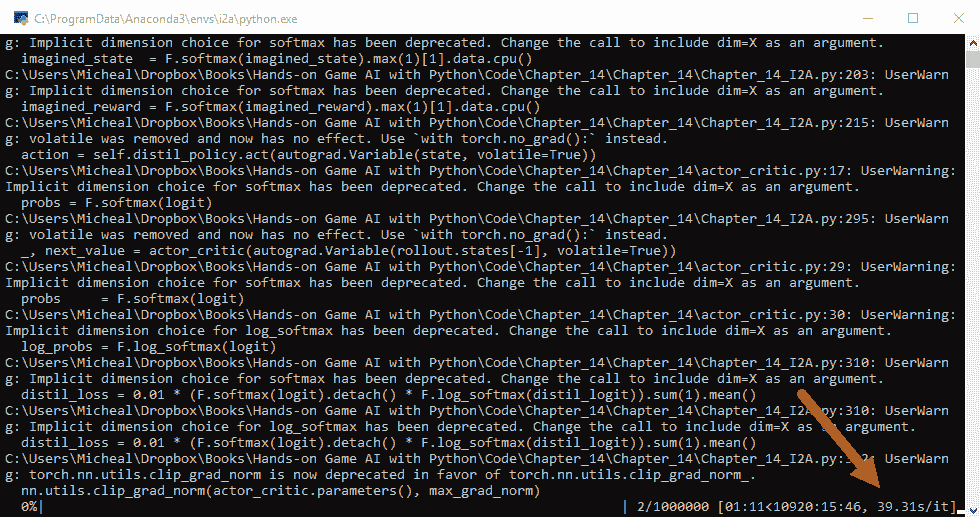

`Chapter_14_I2A.py`训练示例

现在，如果你想完成这个练习，至少应该使用一个GPU。在CPU上训练一万个小时需要一年时间，这并不是你愿意花时间的事情。如果你使用GPU，你将不得不修改样本以支持GPU，这将需要取消注释部分并设置PyTorch以便它可以与CUDA一起运行。

这完成了本节、本章的内容以及整本书的内容。在下一节中，我们将查看最后一组练习。

# 练习

以下是一些简单和非常困难的练习的组合。选择那些你觉得适合你兴趣、能力和资源的练习。以下列表中的某些练习可能需要相当多的资源，因此请选择那些在你时间/资源预算范围内的练习：

1.  调整`Chapter_14_learn.py`样本的超参数。这个样本是一个标准的深度学习模型，但参数应该足够熟悉，可以自己找出。

1.  按照常规方式调整`Chapter_14_MetaSGD-VPG.py`样本的超参数。

1.  调整`Chapter_14_Imagination.py`样本的超参数。在这个样本中有几个新的超参数，你应该熟悉一下。

1.  调整`Chapter_14_wo_HER.py`和`Chapter_14_HER.py`示例的超参数。使用相同的技术在有和没有HER的情况下训练样本对你的理解非常有帮助。

1.  调整`Chapter_14_Imagine_A2C.py`示例的超参数。这对后续运行`Chapter_14_Imagination.py`示例有什么影响？

1.  将HER示例（`Chapter_14_HER.py`）升级为使用不同的PG或价值/DQN方法。

1.  将`Chapter_14_MetaSGD-VPG.py`示例升级为使用更先进的PG或DQN方法。

1.  将`Chapter_14_MetaSGD-VPG.py`示例调整以在不同的环境中进行训练，这些环境使用连续或甚至可能是离散的动作。

1.  将`Chapter_14_I2A.py`样本训练完成。你需要配置示例以使用CUDA运行，以及安装带有CUDA的PyTorch。

1.  调整`Chapter_14_I2A.py`样本的超参数。你可以选择只使用CPU进行部分训练运行，这是可以接受的。因此，你可以一次训练几个迭代，并仍然优化那些新的超参数。

做你最感兴趣的练习，并记得要享受乐趣。

# 摘要

在本章中，我们超越了DRL，进入了通用人工智能（AGI）的领域，或者至少是我们希望AGI会走向的方向。更重要的是，我们探讨了DRL的下一阶段，我们如何解决其当前的不足，以及它可能走向何方。我们探讨了元学习以及学习如何学习意味着什么。然后，我们介绍了优秀的`learn2learn`库，并看到了它如何被用于一个简单的深度学习问题，以及一个更高级的元强化学习问题（MAML）。从那里，我们探讨了使用后见之明（HER）的另一种新的学习方法。从后见之明转向想象和推理，以及这些如何被纳入智能体中。然后，我们通过探讨I2A——想象增强智能体——以及想象如何帮助我们填补知识空白来结束本章。

我只想感谢你抽出时间与我们共同完成这本书。这是一段令人惊叹的旅程，涵盖了几乎整个强化学习（RL）和深度强化学习（DRL）的概念、术语和缩写。这本书从RL的基础开始，深入到DRL。只要你具备数学背景，你现在很可能可以独立探索，并构建你自己的最新和最优秀的智能体。RL，尤其是DRL，有一个神话，即你需要大量的计算资源才能做出有价值的贡献。虽然对于某些研究来说这确实如此，但还有很多更基础的元素需要更好的理解，并且可以进一步改进。DRL领域仍然相对较新，我们很可能在旅途中遗漏了一些东西。因此，无论你的资源如何，你很可能在未来几年内对DRL做出有价值的贡献。如果你确实计划追求这个梦想，我祝愿你成功，并希望这本书能对你的旅程有所帮助。
