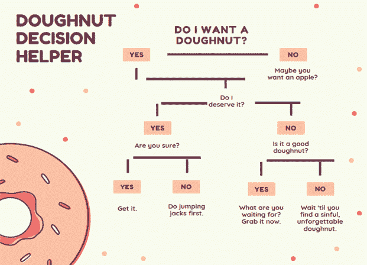
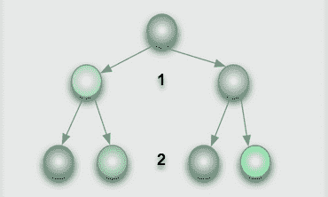
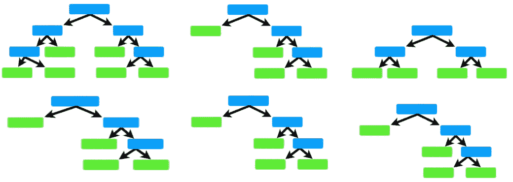
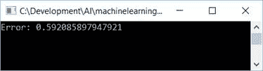
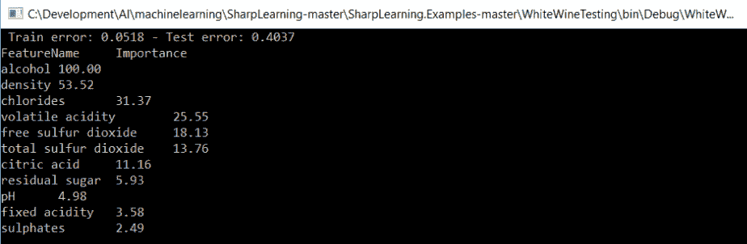

# 第八章：决策树和随机森林

决策树和随机森林是强大的技术，您可以使用它们来增强您的应用程序。让我们浏览一些概念和一些代码，并希望您能迅速上手。

在本章中，我们将学习决策树和随机森林。我们将：

+   通过大量的代码示例向您展示如何将此强大的功能添加到您的应用程序中

+   讨论决策树

+   讨论随机森林

# 技术要求

您的系统需要安装 Microsoft Visual Studio。您可能还需要参考开源 SharpLearning 框架的 GitHub 仓库，网址为 [`github.com/mdabros/SharpLearning`](https://github.com/mdabros/SharpLearning)。

查看以下视频以查看代码的实际应用：[`bit.ly/2O1Lbhr`](http://bit.ly/2O1Lbhr)。

# 决策树

决策树可以用于分类和回归。决策树通过是/否、真/假的响应来回答连续问题。基于这些响应，树按照预定的路径达到其目标。从更正式的角度来看，树是已知的有向无环图的一种版本。最后，决策树是使用整个数据集和所有特征构建的。

这里是一个决策树的例子。您可能不知道它是一个决策树，但肯定知道这个过程。有人想要甜甜圈吗？



如您所见，决策树流程从顶部开始，向下工作，直到达到特定的结果。树的根是第一个分割数据集的决定。树根据每个节点上所谓的**分割度量**递归地分割数据集。最流行的两个度量是**基尼不纯度**和**信息增益**。

这里是另一个决策树的表示，尽管没有那些美味的甜甜圈！



决策树的**深度**表示到目前为止已经问过多少问题。这是树可以到达的最深程度（可能问的问题总数），即使使用更少的问题也可以得到一些结果。例如，使用前面的图，一些结果在 1 个问题后就可以得到，一些在 2 个问题后。因此，该决策树的**深度**为 2。

# 决策树优点

使用决策树的一些优点如下：

+   容易解释。

+   直观、易于理解的可视化。

+   可以轻松复制。

+   可以处理数值和分类数据。

+   在非常大的数据集上表现良好。

+   通常运行非常快。

+   在深度上，树的位置允许轻松可视化哪些特征很重要。重要性由树的深度表示。

# 决策树缺点

使用决策树的一些缺点如下：

+   在每个节点，算法需要确定正确的选择。一个节点的最佳选择可能并不一定是整棵树的最佳选择。

+   如果树很深，它可能会倾向于所谓的过拟合。

+   决策树可以记住训练集。

# 我们应该在什么情况下使用决策树？

以下是使用决策树的一些例子：

+   当你想要一个简单且可解释的模型时

+   当你的模型应该是非参数时

+   当你不想担心特征选择时

# 随机森林

我们已经讨论了决策树，现在是时候讨论随机森林了。非常基本地说，随机森林是一系列决策树的集合。在随机森林中，随机选择了一部分总行数和特征数来训练。然后在这个子集上构建决策树。这个集合的结果将汇总成一个单一的结果。

随机森林还可以减少偏差和方差。它们是如何做到这一点的？通过在不同的数据样本上训练，或者通过使用特征的随机子集。让我们举一个例子。假设我们有 30 个特征。随机森林可能只使用其中的 10 个特征。这留下了 20 个未使用的特征，但其中一些 20 个特征可能很重要。记住，随机森林是一系列决策树的集合。因此，在每一棵树中，如果我们利用 10 个特征，随着时间的推移，大多数甚至所有我们的特征都会被包括在内，这仅仅是因为平均法则。所以，正是这种包含帮助我们限制由于偏差和方差引起的错误。

对于大型数据集，树的数量可能会非常大，有时达到数万甚至更多，这取决于你使用的特征数量，因此你需要注意性能。

这是一个随机森林可能看起来像的图示：



# 随机森林的优点

以下是使用随机森林的一些优点：

+   比单个决策树更稳健

+   随机森林包含许多决策树，因此能够限制过拟合和错误

+   在深度方向上，位置显示了哪些特征对分类或回归有贡献以及它们的相对重要性

+   可以用于回归和分类

+   默认参数可能足够

+   训练速度快

# 随机森林的缺点

以下是使用随机森林的一些缺点：

+   随机森林需要并行处理以提高速度

+   一旦训练完成，预测可能创建得较慢

+   更高的精度需要更多的树，这可能会导致模型变慢

# 我们应该在什么情况下使用随机森林？

以下是使用随机森林的一些例子：

+   当模型解释不是最重要的标准时。解释可能不会像单棵树那样简单。

+   当模型精度是最重要的。

+   当你想要稳健的分类、回归和特征选择分析时。

+   为了防止过拟合。

+   图像分类。

+   推荐引擎。

# SharpLearning

现在，让我们将注意力转向一个令人难以置信的开源包，SharpLearning。**SharpLearning** 是一个出色的机器学习框架，个人可以从中了解许多机器学习的方面，包括我们在前几节中描述的决策树和随机森林。在我们深入研究代码示例和示例应用之前，让我们花几分钟时间熟悉一些事情。

# 术语

在本章中，您将看到以下术语的使用。以下是每个术语的含义背景：

+   **学习器**：这指的是一个机器学习算法。

+   **模型**：这指的是一个机器学习模型。

+   **超参数**：这些是用于调整和调节（希望是）机器学习模型的参数。

+   **目标**：这些更常见地被称为因变量。在大多数记号中，这将表示为 *y*。这些是我们试图建模的值。

+   **观测值**：这些是特征矩阵，其中包含我们目前关于目标的所有信息。在大多数记号中，这将表示为 *x*。

在我们的大多数示例中，我们将关注 SharpLearning 中的两个命名空间。它们是：

+   `SharpLearning.DecisionTrees`

+   `SharpLearning.RandomForest`

在此基础上，让我们开始深入研究 SharpLearning，向您展示一些与它的工作方式相关的基本概念。

# 加载和保存模型

SharpLearning 使将模型加载和保存到磁盘变得非常容易。这是机器学习库的一个重要部分，而 SharpLearning 是最容易实现的部分之一。

SharpLearning 中的所有模型都有一个 `Save` 和一个 `Load` 方法。这些方法为我们完成了保存和加载模型的繁重工作。

例如，这里我们将保存一个我们学习到的模型到磁盘：

```py
model.Save(() => StreamWriter(@"C:\randomforest.xml"));
```

如果我们想重新加载此模型，我们只需使用 `Load` 方法：

```py
varloadedModel = RegressionForestModel.Load(() => newStreamReader(@"C:\randomforest.xml"));
```

是的，加载和保存数据模型既简单又容易。您还可以使用序列化来保存模型。这将使我们能够在 XML 和二进制格式之间进行选择。SharpLearning 的另一个非常棒的设计特性是，序列化模型允许我们将其序列化为 `IPredictorModel` 接口。这使得如果每个模型都符合该接口，替换模型变得更加容易。以下是这样做的方法：

```py
varxmlSerializer = new GenericXmlDataContractSerializer();
xmlSerializer.Serialize<IPredictorModel<double>>(model, 
 () => new StreamWriter(@"C:\randomforest.xml"));
var loadedModelXml = xmlSerializer
.Deserialize<IPredictorModel<double>>(() => new StreamReader(@"C:\randomforest.xml"));
```

| **算法** | **训练误差** | **测试误差** |
| --- | --- | --- |
| 回归决策树学习器（默认） | 0.0518 | 0.4037 |

如此一来，立即得到训练和测试误差。

当报告您模型的性能时，您应该始终使用测试误差，即使训练误差更低，因为那是模型对新数据泛化能力的估计。

现在，让我们谈谈**超参数**。超参数是影响机器学习算法学习过程的参数。你可以调整它们来调整过程并提高性能和可靠性。同时，你也可以错误地调整参数，得到一个不符合预期的工作结果。让我们看看一个错误调整的超参数可能会发生的一些事情：

+   如果模型过于复杂，你可能会得到所谓的**高方差**，或称为**过拟合**

+   如果模型最终变得过于简单，你将得到所谓的**高偏差**，或称为**欠拟合**

对于那些还没有这样做的人来说，手动调整超参数，这个过程几乎在每一个用例中都会发生，可能会占用你相当多的时间。随着模型超参数数量的增加，调整时间和努力也会增加。解决这个问题最好的办法是使用一个优化器，让它为你完成工作。为此，SharpLearning 可以为我们提供巨大的帮助，因为它提供了许多可用的优化器。以下是一些其中的例子：

+   网格搜索

+   随机搜索

+   粒子群（我们将在第七章中讨论，*用 PSO 替换反向传播*）

+   贝叶斯优化

+   全球化边界内尔德梅德

让我们从例子开始。

让我们创建一个学习器并使用默认参数，这些参数很可能已经足够好了。一旦我们找到参数并创建学习器，我们需要创建模型。然后我们将预测训练集和测试集。一旦所有这些都完成，我们将测量测试集上的误差并记录下来：

```py
// create learner with default parameters
var learner = new RegressionSquareLossGradientBoostLearner(runParallel: false);
// learn model with found parameters
var model = learner.Learn(trainSet.Observations, trainSet.Targets);
// predict the training and test set.
var trainPredictions = model.Predict(trainSet.Observations);
var testPredictions = model.Predict(testSet.Observations);
// since this is a regression problem we are using square error as metric
// for evaluating how well the model performs.
var metric = new MeanSquaredErrorRegressionMetric();
// measure the error on the test set.
var testError = metric.Error(testSet.Targets, testPredictions);
```

这里是我们的测试集误差

| **算法** | **测试误差** |
| --- | --- |
| 回归平方损失梯度提升学习器（默认） | 0.4984 |

那部分完成之后，我们现在已经建立了基线。让我们使用`RandomSearchOptimizer`来调整超参数，看看我们是否能得到更好的结果。为此，我们需要确定超参数的范围，这样我们的优化器就知道如何调整。让我们看看我们是如何做到这一点的：

```py
var parameters = new ParameterBounds[]
{
 new ParameterBounds(min: 80, max: 300, 
 transform: Transform.Linear, parameterType: ParameterType.Discrete), 
 new ParameterBounds(min: 0.02, max: 0.2, 
 transform: Transform.Logarithmic, parameterType: ParameterType.Continuous), 
 new ParameterBounds(min: 8, max: 15, 
 transform: Transform.Linear, parameterType: ParameterType.Discrete), 
 new ParameterBounds(min: 0.5, max: 0.9, 
 transform: Transform.Linear, parameterType: ParameterType.Continuous), 
 new ParameterBounds(min: 1, max: numberOfFeatures, 
 transform: Transform.Linear, parameterType: ParameterType.Discrete), 
};
```

你注意到我们使用了学习率的对数变换吗？你知道为什么这样做吗？答案是：确保在整个值域上有一个更均匀的分布。我们的最小值和最大值之间有一个很大的范围差异（0.02 -> 0.2），因此对数变换将是最好的。

我们现在需要一个**验证集**来帮助我们衡量模型在优化过程中对未见数据的泛化能力。为此，我们需要进一步分割训练数据。为此，我们将把当前的测试集排除在优化过程之外。如果不这样做，我们可能会在最终的误差估计上产生正偏差，而这并不是我们想要的：

```py
var validationSplit = new RandomTrainingTestIndexSplitter<double>(trainingPercentage: 0.7, seed: 24)
.SplitSet(trainSet.Observations, trainSet.Targets);
```

优化器还需要另一件事，那就是目标函数。该函数将接受一个 double 数组作为输入（包含超参数集）并返回一个`OptimizerResult`，其中包含验证错误和相应的超参数集：

```py
Func<double[], OptimizerResult> minimize = p =>
 {
 var candidateLearner = new RegressionSquareLossGradientBoostLearner(
 iterations: (int)p[0],
learningRate: p[1], 
maximumTreeDepth: (int)p[2], 
subSampleRatio: p[3], 
featuresPrSplit: (int)p[4],
runParallel: false);
 var candidateModel = candidateLearner.Learn(validationSplit.TrainingSet.Observations,
validationSplit.TrainingSet.Targets);
 var validationPredictions = candidateModel.Predict(validationSplit.TestSet.Observations);
 var candidateError = metric.Error(validationSplit.TestSet.Targets, validationPredictions);
 return new OptimizerResult(p, candidateError);
};
```

一旦定义了`objective`函数，我们现在可以创建并运行优化器以找到最佳参数集。让我们先运行我们的优化器 30 次迭代，并尝试 30 个不同的超参数集：

```py
// create our optimizer
var optimizer = new RandomSearchOptimizer(parameters, iterations: 30, runParallel: true);
// find the best hyperparameters for use
var result = optimizer.OptimizeBest(minimize);
var best = result.ParameterSet;
```

一旦我们运行这个，我们的优化器应该找到最佳的超参数集。让我们看看它找到了什么：

+   `Trees`: 277

+   `学习率`: 0.035

+   `maximumTreeDepth`: 15

+   `subSampleRatio`: 0.838

+   `featuresPrSplit`: 4

进度。现在我们已经有一组在验证集上测量的最佳超参数，我们可以使用这些参数创建一个学习器，并使用整个数据集学习一个新的模型：

```py
var learner = new RegressionSquareLossGradientBoostLearner(
 iterations: (int)best[0],
learningRate: best[1], 
maximumTreeDepth: (int)best[2], 
subSampleRatio: best[3],
featuresPrSplit: (int)best[4], 
runParallel: false);
var model = learner.Learn(trainSet.Observations, trainSet.Targets);
```

现在我们有了最终的超参数集，我们将这些传递给我们的学习器，能够显著降低测试错误。如果我们手动做这件事，将花费我们无尽的时光和更多！

| **算法** | **测试错误** |
| --- | --- |
| 回归平方损失梯度提升学习器（默认） | 0.4984 |
| 回归平方损失梯度提升学习器（优化器） | 0.3852 |

# 示例代码和应用

在接下来的几节中，我们将查看一些没有所有冗余的代码示例。这将完全是 C#代码，所以它应该是所有人都容易理解的。

让我们快速看一下我们如何使用 SharpLearning 来预测观察值。我将向您展示一个完整的代码示例，而不包含冗余：

```py
var parser = new CsvParser(() =>new StringReader(Resources.AptitudeData));
var observations = parser.EnumerateRows(v => v != "Pass").ToF64Matrix();
var targets = parser.EnumerateRows("Pass").ToF64Vector();
var rows = targets.Length;
var learner = new ClassificationDecisionTreeLearner(100, 1, 2, 0.001, 42);
varsut = learner.Learn(observations, targets);
var predictions = sut.Predict(observations);
var evaluator = new TotalErrorClassificationMetric<double>();
var error = evaluator.Error(targets, predictions);
Assert.AreEqual(0.038461538461538464, error, 0.0000001);
```

# 保存模型

这里是一个代码示例，将向您展示保存模型是多么容易：

```py
var parser = new CsvParser(() =>new StringReader(Resources.AptitudeData));
var observations = parser.EnumerateRows(v => v != "Pass").ToF64Matrix();
var targets = parser.EnumerateRows("Pass").ToF64Vector();
var learner = new ClassificationDecisionTreeLearner(2);
var sut = learner.Learn(observations, targets);
var writer = new StringWriter();
sut.Save(() => writer);
```

# 均方误差回归指标

**均方误差**（MSE）是一个衡量误差平方平均值的指标。更具体地说，它衡量估计值与估计值之间的平均距离。均方误差始终为非负值，接近零的值被认为是更可接受的。SharpLearning 使得计算此误差指标变得极其简单，如下面的代码所示：

```py
var targets = new double[] { 1.0, 2.3, 3.1, 4.4, 5.8 };
var predictions = new double[] { 1.0, 2.0, 3.0, 4.0, 5.0 };
var sut = new MeanSquaredErrorRegressionMetric();
var actual = sut.Error(targets, predictions);
```

# F1 分数

要谈论 f1 分数，我们必须首先谈论*精确度*和*召回率*。

**精确度**是正确预测的正观察值与总预测正观察值的比率。不太正式地说，在所有说他们会来的人中，有多少人真的来了？

**回忆**（灵敏度）是正确预测的正观察值与总观察值的比率。

**F1 分数**是精确度和召回率的加权平均值。

这是使用 SharpLearning 计算 f1 分数的方法：

```py
var targets = new double[] { 0, 1, 1 };
var predictions = new double[] { 0, 1, 1 };
var sut = new F1ScoreMetric<double>(1);
var actual = sut.Error(targets, predictions);
Assert.AreEqual(0.0, actual);
```

# 优化

以下是如何使用*粒子群优化器*返回最佳最小化提供的函数的结果的方法：

```py
var parameters = new ParameterBounds[]
{
new ParameterBounds(-10.0, 10.0, Transform.Linear),
new ParameterBounds(-10.0, 10.0, Transform.Linear),
new ParameterBounds(-10.0, 10.0, Transform.Linear),
}; 
var sut = new ParticleSwarmOptimizer(parameters, 100);
var actual = sut.OptimizeBest(Minimize);
```

以下是如何使用*网格搜索优化器*通过尝试提供的参数的所有组合来优化的方法：

```py
var parameters = new double[][] { new double[]{ 10.0, 20.0, 30.0, 35.0, 37.5, 40.0, 50.0, 60.0 } };
var sut = new GridSearchOptimizer(parameters);
var actual = sut.OptimizeBest(Minimize);
```

以下是如何使用 *随机搜索优化器* 在提供的最小值和最大值之间初始化随机参数的方法。将返回最小化提供函数的最佳结果：

```py
var parameters = new ParameterBounds[] 
{
new ParameterBounds(0.0, 100.0, Transform.Linear)
};
var sut = new RandomSearchOptimizer(parameters, 100);
var actual = sut.OptimizeBest(Minimize);
```

# 样本应用 1

在掌握所有这些知识之后，让我们继续编写我们的第一个样本程序。程序本身非常简单，旨在展示如何以最少的代码实现这些技术。为了展示我的意思，以下是程序输出的样子：



# 代码

这里是实现我们的样本程序并产生之前输出的代码。如您所见，代码非常简单，这里面的所有代码（除了索引的洗牌）都是我们之前已经介绍过的。我们将保持详尽性到最小，以便您能专注于代码本身。这个样本将读取我们的数据，将其解析成观察和目标样本，然后使用 1,000 棵树创建一个学习器。然后我们将使用这个学习器来学习和创建我们的模型。一旦完成，我们将计算均方误差指标并在屏幕上显示：

```py
var parser = new CsvParser(() =>new StringReader(Resources.Glass));
var observations = parser.EnumerateRows(v => v != "Target").ToF64Matrix();
var targets = parser.EnumerateRows("Target").ToF64Vector();
int trees = 1000;
var sut = new RegressionExtremelyRandomizedTreesLearner(trees, 1, 100, 1, 0.0001, 1.0, 42, false);
var indices = Enumerable.Range(0, targets.Length).ToArray();
indices.Shuffle(new Random(42));
indices = indices.Take((int)(targets.Length * 0.7)).ToArray();
var model = sut.Learn(observations, targets, indices);
var predictions = model.Predict(observations);
var evaluator = new MeanSquaredErrorRegressionMetric();
var error = evaluator.Error(targets, predictions);
Console.WriteLine("Error: " + error);
```

# 样本应用 2 – 葡萄酒质量

在我们的下一个应用程序中，我们将使用我们的知识来确定基于创建的模型，葡萄酒最重要的特征。以下是完成它后我们的输出将看起来像什么：



# 代码

这里是我们应用程序的代码。和往常一样，我们首先将数据加载并解析成观察和目标样本集。由于这是一个回归样本，我们将数据样本分成 70/30 的比例：70%用于训练，30%用于测试。然后，我们创建我们的随机森林学习者和模型。之后，我们计算训练和测试错误，并按模型找到的重要性顺序打印出特征重要性：

```py
var parser = new CsvParser(() =>new StreamReader(Application.StartupPath + "\\winequality-white.csv"));
var targetName = "quality";
// read in our feature matrix
var observations = parser.EnumerateRows(c => c != targetName).ToF64Matrix();
// read in our regression targets
var targets = parser.EnumerateRows(targetName).ToF64Vector();
// Since this is a regression problem, we use the random training/test set splitter. 30 % of the data is used for the test set. 
var splitter = new RandomTrainingTestIndexSplitter<double>(trainingPercentage: 0.7, seed: 24);
var trainingTestSplit = splitter.SplitSet(observations, targets);
var trainSet = trainingTestSplit.TrainingSet;
var testSet = trainingTestSplit.TestSet;
var learner = new RegressionRandomForestLearner(trees: 100);
var model = learner.Learn(trainSet.Observations, trainSet.Targets);
var trainPredictions = model.Predict(trainSet.Observations);
var testPredictions = model.Predict(testSet.Observations);
// since this is a regression problem we are using squared error as the metric
// for evaluating how well the model performs.
var metric = new MeanSquaredErrorRegressionMetric();
var trainError = metric.Error(trainSet.Targets, trainPredictions);
var testError = metric.Error(testSet.Targets, testPredictions);
Trace.WriteLine($"Train error: {trainError:0.0000} - Test error: {testError:0.0000}");
System.Console.WriteLine($"Train error: {trainError:0.0000} - Test error: {testError:0.0000}");

// the variable importance requires the featureNameToIndex from the dataset. 
// This mapping describes the relation from the column name to the associated 
// index in the feature matrix.
var featureNameToIndex = parser.EnumerateRows(c => c != targetName).First().ColumnNameToIndex;

var importances = model.GetVariableImportance(featureNameToIndex);

var importanceCsv = new StringBuilder();
importanceCsv.Append("FeatureName;Importance");
System.Console.WriteLine("FeatureName\tImportance");
foreach (var feature in importances)
{
importanceCsv.AppendLine();
importanceCsv.Append($"{feature.Key};{feature.Value:0.00}");
System.Console.WriteLine($"{feature.Key}\t{feature.Value:0.00}");
}
Trace.WriteLine(importanceCsv);
```

# 摘要

在本章中，我们学习了决策树和随机森林。我们还学习了如何使用开源框架 SharpLearn 将这些强大的功能添加到我们的应用程序中。在下一章中，我们将学习关于面部和动作检测的内容，并展示您如何使用这项令人兴奋的技术来启用您的应用程序！您将见到我的宠物法国斗牛犬 Frenchie，他将演示我们将展示的大多数样本。此外，我们还有一位嘉宾，您绝对会想见一见！

# 参考文献

+   [`github.com/mdabros/SharpLearning`](https://github.com/mdabros/SharpLearning)
