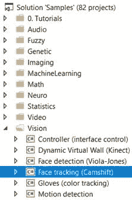

# 面部与动作检测

现在是我们深入一个真正有趣的应用的时候了。我们将从使用开源包[`www.aforgenet.com/`](http://www.aforgenet.com/)来构建一个面部和动作检测应用开始。为此，你需要在你的系统中安装一个摄像头来查看实时视频流。从那里，我们将使用这个摄像头来检测面部和动作。在本章中，我们将展示两个独立的示例：一个用于面部检测，另一个用于动作检测。我们将向你展示具体发生了什么，以及你如何快速将这些功能添加到你的应用中。

在本章中，我们将涵盖以下主题：

+   面部检测

+   动作检测

+   如何使用本地视频集成摄像头

+   图像滤波/算法

让我们从面部检测开始。在我们的示例中，我将使用我友好的小法国斗牛犬来为我们摆姿势。在我这样做之前，请重新阅读章节标题。无论你读多少次，你可能会错过这里的关键点。注意它说的是面部*检测*而不是面部*识别*。这一点非常重要，我想停下来再次强调。我们不是试图识别 Joe、Bob 或 Sally。我们试图验证，通过我们的摄像头看到的所有事物中，我们能否*检测*到有面孔存在。我们并不关心这是谁的面孔，只是它是一个面孔！这一点非常重要，在我们继续之前，我们必须理解这一点，否则你的期望可能会被错误地偏向，这会让你感到困惑和沮丧，而我们不想看到这种情况发生！

面部检测，就像我稍后会再次强调的那样，是面部识别的第一步，这是一个更为复杂的任务。如果你不能从屏幕上所有的事物中识别出一张或更多面孔，那么你永远无法识别出这是谁的面孔！

# 技术要求

作为先决条件，你需要在你的系统上安装 Microsoft Visual Studio（任何版本）。你还需要访问开源的 accord 框架，网址为[`github.com/accord-net/framework`](https://github.com/accord-net/framework)。

查看以下视频以了解代码的实际应用：[`bit.ly/2xH0thh`](http://bit.ly/2xH0thh)。

# 面部检测

现在，让我们快速看一下我们的应用。你应该已经将示例解决方案加载到 Microsoft Visual Studio 中：



下面是我们的示例应用运行时的样子。大家好，向 Frenchie 问好！


如你所见，我们有一个非常简单的屏幕，专门用于我们的视频捕获设备。在这种情况下，笔记本电脑的摄像头是我们的视频捕获设备。Frenchie 友好地站在摄像头前为我们摆姿势，一旦我们启用面部跟踪，看看会发生什么：


Frenchie 的面部特征现在正在被跟踪。你看到围绕 Frenchie 的是跟踪容器（白色方框），以及我们的角度检测器（红色线条）显示。当我们移动 Frenchie 时，跟踪容器和角度检测器将跟踪他。那很好，但如果我们在真实的人类脸上启用面部跟踪会怎样呢？正如你在下面的截图中所见，跟踪容器和角度正在跟踪我们客座摆姿势者的面部，就像对 Frenchie 做的那样。


当我们的摆姿势者从一侧移动头部时，相机跟踪这个动作，你可以看到角度检测器正在调整以识别为面部角度。在这种情况下，你会注意到色彩空间是黑白而不是彩色。这是一个直方图反向投影，这是一个你可以更改的选项：


即使当我们远离相机，其他物体进入视野时，面部检测器也能在噪声中跟踪我们的面部。这正是电影中你看到的面部识别系统的工作方式，尽管更为简单，而且几分钟内你就可以启动自己的面部识别应用！


既然我们已经看到了外部情况，那么让我们来看看引擎盖下正在发生的事情。

我们需要确切地问问自己，我们在这里试图解决什么问题。嗯，我们正在尝试检测（注意我没有说识别）面部图像。虽然对人类来说很容易，但计算机需要非常详细的指令集来完成这项任务。幸运的是，有一个非常著名的算法叫做 Viola-Jones 算法，它将为我们完成繁重的工作。我们为什么选择这个算法呢？

+   非常高的检测率和极低的误报率。

+   非常擅长实时处理。

+   非常擅长从非面部检测面部。检测面部是面部识别的第一步。

此算法要求相机有一个正面的正面视角。为了被检测到，面部需要直接朝向相机，不能倾斜，不能向上或向下看。记住，目前我们只对面部检测感兴趣。

要深入了解技术方面，我们的算法需要四个阶段来完成其任务。它们是：

+   Haar 特征选择

+   创建积分图像

+   Adaboost 训练

+   级联分类器

我们必须首先声明，所有人类面部都有一些相似的特征，例如眼睛比上脸颊暗，鼻梁比眼睛亮，你的额头可能比你的脸的其他部分亮，等等。我们的算法通过使用所谓的**Haar 特征**来匹配这些特征。我们可以通过观察眼睛、嘴巴和鼻梁的位置和大小来得出可匹配的面部特征。然而，这里是我们的问题。

在一个 24x24 像素的窗口中，总共有 162,336 个可能的特征。显然，尝试评估所有这些特征将是非常昂贵的，如果它甚至能工作的话。因此，我们将使用一种称为**自适应提升**的技术，或者更常见地，**AdaBoost**。这是你词汇表中的一个新词，你无处不在都能听到它，也许甚至读过它。我们的学习算法将使用 AdaBoost 来选择最佳特征并训练分类器来使用它们。让我们停下来谈谈它。

AdaBoost 可以与许多类型的学习算法一起使用，被认为是许多任务的最好现成算法。你通常不会注意到它有多好、有多快，直到你切换到另一个算法并对其进行计时。我已经这样做过无数次，我可以告诉你差别非常明显。

Boosting 从其他弱学习算法的输出中提取信息，并将它们与加权求和结合起来，这是提升分类器的最终输出。AdaBoost 的自适应部分来自于后续的学习者被调整以有利于那些被先前分类器错误分类的实例。然而，我们必须小心我们的数据准备，因为 AdaBoost 对噪声数据和异常值很敏感（记得我们在第一章，*快速复习*中强调了这些）。该算法比其他算法更容易过拟合数据，这就是为什么在我们早期的章节中我们强调了缺失数据和异常值的数据准备。最后，如果*弱*学习算法比随机猜测更好，AdaBoost 可以成为我们流程中的一个宝贵补充。

在有了这个简短的描述之后，让我们来看看底层发生了什么。在这个例子中，我们再次使用 Accord 框架，我们将与 Vision Face Tracking 示例一起工作。你可以从其 GitHub 位置下载这个框架的最新版本：[`github.com/accord-net/framework`](https://github.com/accord-net/framework)。

我们首先创建一个`FaceHaarCascade`对象。这个对象包含了一组 Haar-like 特征的弱分类阶段，或者说是阶段。将提供许多阶段，每个阶段包含一组将在决策过程中使用的分类树。我们现在实际上是在处理一个决策树。Accord 框架的美丽之处在于`FaceHaarCascade`会自动为我们创建所有这些阶段和树，而不会暴露给我们细节。

让我们看看一个特定阶段可能的样子：

```py
List<HaarCascadeStage> stages = new List<HaarCascadeStage>();
List<HaarFeatureNode[]> nodes;
HaarCascadeStage stage;
stage = new HaarCascadeStage(0.822689414024353); nodes = new List<HaarFeatureNode[]>();
nodes.Add(new[] { new HaarFeatureNode(0.004014195874333382, 0.0337941907346249, 0.8378106951713562, new int[] { 3, 7, 14, 4, -1 }, new int[] { 3, 9, 14, 2, 2 }) });
nodes.Add(new[] { new HaarFeatureNode(0.0151513395830989, 0.1514132022857666, 0.7488812208175659, new int[] { 1, 2, 18, 4, -1 }, new int[] { 7, 2, 6, 4, 3 }) });
nodes.Add(new[] { new HaarFeatureNode(0.004210993181914091, 0.0900492817163467, 0.6374819874763489, new int[] { 1, 7, 15, 9, -1 }, new int[] { 1, 10, 15, 3, 3 }) });
stage.Trees = nodes.ToArray(); stages.Add(stage);
```

如你所见，我们通过为每个阶段的节点提供每个特征的数值，在底层构建了一个决策树。

一旦创建，我们可以使用我们的级联对象来创建我们的`HaarObjectDetector`，这是我们用于检测的工具。它需要：

+   我们的面部级联对象

+   搜索对象时使用的最小窗口大小

+   我们搜索的模式——在我们的例子中，我们只搜索单个对象

+   在搜索过程中重新调整搜索窗口大小时使用的缩放因子

```py
HaarCascade cascade = new FaceHaarCascade();
detector = new HaarObjectDetector(cascade, 25, ObjectDetectorSearchMode.Single, 1.2f,
ObjectDetectorScalingMode.GreaterToSmaller);
```

一旦创建，我们就准备好处理视频源的话题。在我们的示例中，我们将简单地使用本地相机来捕获所有图像。然而，Accord.Net 框架使得使用其他图像捕获源变得容易，例如 `.avi` 文件，动画 `.jpg` 文件等等。

我们连接到相机，选择分辨率，然后准备出发：

```py
foreach (var cap in device?.VideoCapabilities)
 {
if (cap.FrameSize.Height == 240)
return cap;
if (cap.FrameSize.Width == 320)
return cap;
 }
return device?.VideoCapabilities.Last();
```

应用程序现在正在运行，并且已选择视频源，我们的应用程序将如下所示。再次，请输入法尼奇这只斗牛犬！请原谅这儿的混乱，法尼奇不是最整洁的宠物！：


在这个演示中，您会注意到法尼奇正对着相机，背景中有 2 个 55 英寸的显示器，以及许多其他我妻子喜欢称之为*垃圾*（我们将正式称之为*噪声*）的东西！这是为了展示面部检测算法如何从其他所有东西中区分出法尼奇的脸！如果我们的检测器无法处理这种情况，它将迷失在噪声中，对我们几乎没有用处。

现在我们有了视频源，我们需要在接收到新帧时得到通知，以便我们可以处理它，应用我们的标记等。我们通过将视频源播放器的 `NewFrameReceived` 事件处理程序附加到它来完成此操作。.NET 开发者应该非常熟悉这一点：

```py
this.videoSourcePlayer.NewFrameReceived += new Accord.Video.NewFrameEventHandler(this.videoSourcePlayer_NewFrame);
```

让我们看看每次我们被通知有新的视频帧可用时会发生什么。

我们需要做的第一件事是将图像`下采样`，使其更容易处理：

```py
ResizeNearestNeighbor resize = new ResizeNearestNeighbor(160, 120);
UnmanagedImagedownsample = resize.Apply(im);
```

当图像大小更易于处理时，我们将处理该帧。如果没有找到面部区域，我们将保持在跟踪模式中等待一个可检测到面部的帧。如果找到了面部区域，我们将重置跟踪器，定位面部，减小其大小以清除任何背景噪声，初始化跟踪器，并将标记窗口应用于图像。所有这些操作都通过以下代码完成：

```py
if (regions != null&&regions.Length>0)
 {
tracker?.Reset();
// Will track the first face found
Rectangle face = regions[0];
// Reduce the face size to avoid tracking background
Rectangle window = new Rectangle((int)((regions[0].X + regions[0].Width / 2f) * xscale),
 (int)((regions[0].Y + regions[0].Height / 2f) * yscale), 1, 1);
window.Inflate((int)(0.2f * regions[0].Width * xscale), (int)(0.4f * regions[0].Height * yscale));
if (tracker != null)
 {
tracker.SearchWindow = window;
tracker.ProcessFrame(im);
 }
marker = new RectanglesMarker(window);
marker.ApplyInPlace(im);
args.Frame = im.ToManagedImage();
tracking = true;
 }
else
 {
detecting = true;
 }
```

如果检测到面部，我们的图像帧现在看起来如下：


如果法尼奇将头倾斜到一边，我们的图像帧现在看起来如下：


# 运动检测

现在，我们将关注范围扩大一些，检测任何运动，而不仅仅是面部运动。再次，我们将使用 Accord.Net 并使用 `运动检测` 示例。就像面部识别一样，您将看到如何简单地将此功能添加到您的应用程序中，并立即成为工作中的英雄！让我们确保您已将正确的项目加载到 Microsoft Visual Studio 中：


使用运动检测，屏幕上移动的任何东西都会用红色突出显示，所以使用以下屏幕截图，你可以看到手指在移动，但其他一切保持静止：


在下面的屏幕截图中，你可以看到更多的运动，由沿着这个匿名手的红色方块表示：


在下面的屏幕截图中，你可以看到整个手在移动：


如果我们不希望处理整个屏幕区域中的运动，我们可以定义**运动区域**，运动检测将仅在这些区域内发生。在下面的屏幕截图中，你可以看到我定义了一个运动区域。你将在接下来的屏幕截图中注意到，这是唯一一个将处理运动的区域：


现在，如果我们为相机创建一些运动，你会看到只有我们定义区域内的运动被处理，如下所示：


你也可以看到，在定义了运动区域，并且彼得这个冥想的哥布林站在区域前面时，我们仍然能够检测到他后面的运动，但他的脸不是识别的一部分。当然，你可以将这两个过程结合起来，以获得最好的效果，如下所示：


另一个我们可以使用的选项是**网格运动高亮**。它根据定义的网格以红色方块的形式突出显示检测到的运动区域。基本上，运动区域现在是一个红色框，正如你所见：


# 代码

以下代码片段展示了添加视频识别到你的应用所需做的所有事情。正如你所见，这 couldn’t be any easier:

```py
// create motion detector
MotionDetector detector = new MotionDetector(
 new SimpleBackgroundModelingDetector( ),
 new MotionAreaHighlighting( ) );
// continuously feed video frames to motion detector
while ( ... )
{
 // process new video frame and check motion level
 if ( detector.ProcessFrame( videoFrame ) > 0.02 )
 {
 // ring alarm or do something else
 }
}
```

我们现在打开我们的视频源：

```py
videoSourcePlayer.VideoSource = new AsyncVideoSource(source);
```

当我们接收到一个新的视频帧时，所有的魔法就会发生。以下是将处理新的视频帧成功所需的全部代码：

```py
private void videoSourcePlayer_NewFrame(object sender, NewFrameEventArgsargs)
 {
lock (this)
 {
if (detector != null)
 {
floatmotionLevel = detector.ProcessFrame(args.Frame);
if (motionLevel > motionAlarmLevel)
 {
// flash for 2 seconds
flash = (int)(2 * (1000 / alarmTimer.Interval));
 }
// check objects' count
if (detector.MotionProcessingAlgorithm is BlobCountingObjectsProcessing)
 {
BlobCountingObjectsProcessing countingDetector = (BlobCountingObjectsProcessing)detector.MotionProcessingAlgorithm;
detectedObjectsCount = countingDetector.ObjectsCount;
 }
else
 {
detectedObjectsCount = -1;
 }
// accumulate history
motionHistory.Add(motionLevel);
if (motionHistory.Count> 300)
                    {
motionHistory.RemoveAt(0);
                    }

if (showMotionHistoryToolStripMenuItem.Checked)
DrawMotionHistory(args.Frame);
                }
            }
```

关键在于检测帧中发生的运动量，这是通过以下代码完成的。对于这个例子，我们使用运动警报级别为 0.2，但你可以使用任何你喜欢的。一旦这个阈值被超过，你可以执行任何你喜欢的逻辑，比如发送电子邮件警报，短信，启动视频捕获操作等等：

```py
float motionLevel = detector.ProcessFrame(args.Frame);
if (motionLevel > motionAlarmLevel)
{
// flash for 2 seconds
flash = (int)(2 * (1000 / alarmTimer.Interval));
}
```

# 摘要

在本章中，我们学习了图像和运动检测（不是识别！）我们以 Accord.Net 作为开源工具为我们提供添加应用功能的一个例子。

在下一章中，我们继续探讨图像主题，但使用开源包 ConvNetSharp 训练卷积神经网络。
