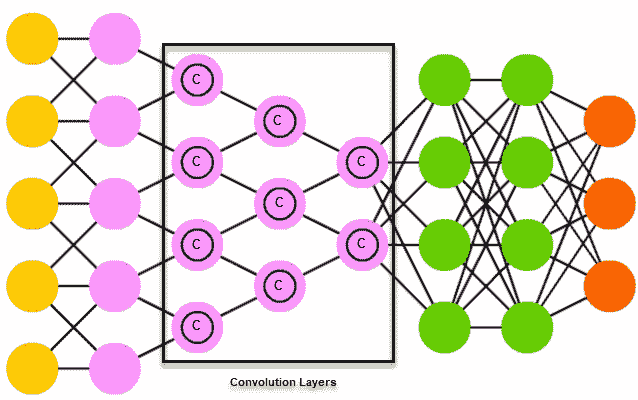
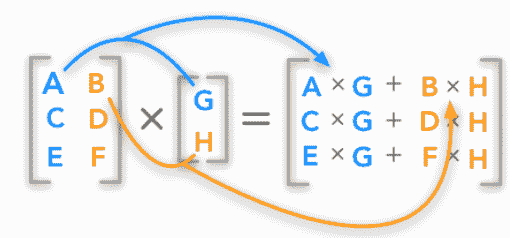
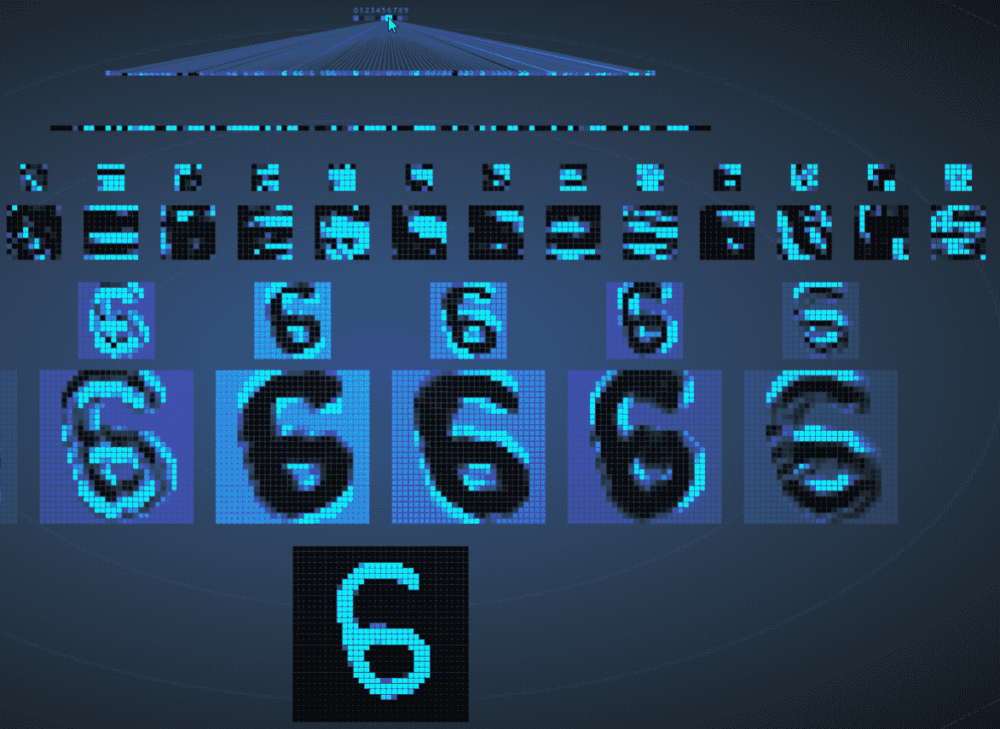
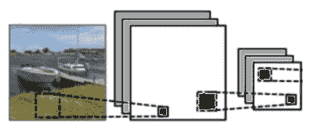
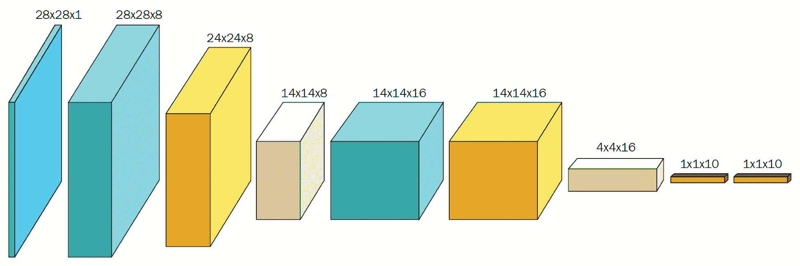
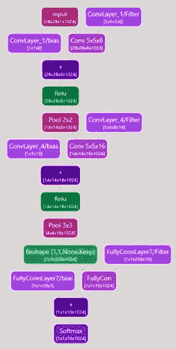
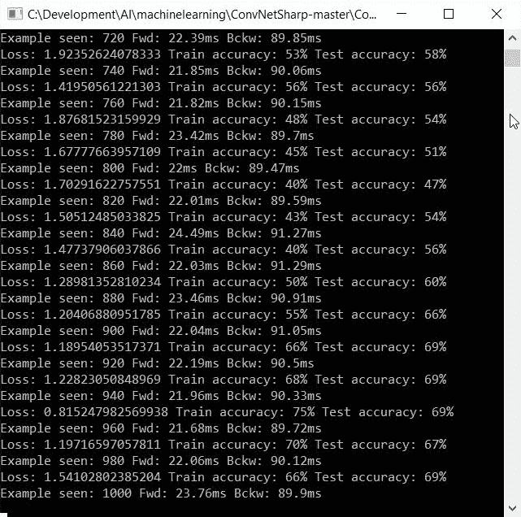
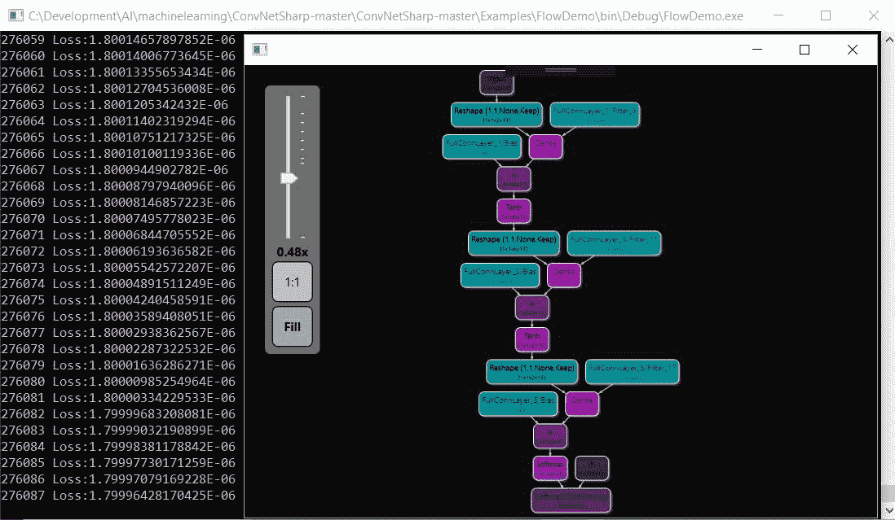
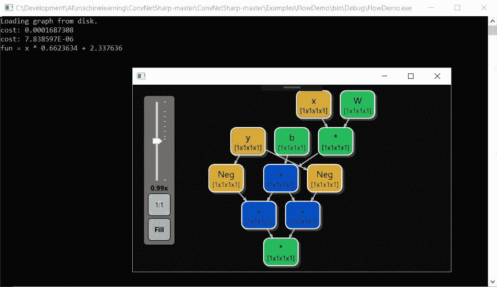

# 使用 ConvNetSharp 训练 CNN

在本章中，我们将使用 Cédric Bovar 的杰出开源包**ConvNetSharp**，来展示如何训练我们的**卷积神经网络**（**CNN**）。在本章中，我们将探讨以下主题：

+   常见的神经网络模块

+   与 CNN 相关的各种术语和概念

+   处理图像的卷积网络

# 技术要求

您需要 Microsoft Visual Studio 和 ConvNetSharp 框架来完成本章内容。

# 熟悉环境

在我们开始深入代码之前，让我们先了解一下一些基本术语，这样当我们提到这些术语时，我们都在同一页面上。这个术语适用于 CNN 以及**ConvNetSharp**框架。

**卷积**: 在数学中，*卷积*是对两个函数执行的操作。这个操作产生第三个函数，它表达了其中一个形状如何被另一个形状修改的表达式。这在以下图中以视觉方式表示：



重要的是要注意，卷积层本身是 CNN 的构建块。这个层的参数由一组可学习的过滤器（有时称为**核**）组成。这些核具有小的感受野，这是一个对整个图像的较小视图，并且这个视图扩展到输入体积的整个深度。在前向传播阶段，每个过滤器在整个输入体积的宽度和高度上**卷积**。正是这种卷积计算了过滤器和输入之间的点积。然后产生一个二维图（有时称为**激活图**）的过滤器。这有助于网络学习在检测到相应输入位置的特征时应该激活哪些过滤器。

**点积计算**: 以下图是当我们说点积计算时我们指的是什么的一个可视化：



+   **Vol 类**: 在 ConvNetSharp 中，`Vol`类简单地说是一个围绕一维数字列表、它们的梯度以及维度（即宽度、深度和高度）的包装。

+   **Net 类**: 在 ConvNetSharp 中，`Net`是一个非常简单的类，它包含一个层的列表。当一个`Vol`通过`Net`类时，`Net`会遍历所有其层，通过调用`forward()`函数逐个前向传播，并返回最后一层的输出。在反向传播过程中，`Net`会调用每个层的`backward()`函数来计算梯度。

+   **层**: 如我们所知，每个神经网络都是一个层的线性列表，我们的也不例外。对于一个神经网络，第一层必须是输入层，我们的最后一层必须是输出层。每一层都接受一个输入`Vol`并产生一个新的输出`Vol`。

+   **全连接层**：全连接层可能是最重要的层，并且在功能上肯定是最有趣的。它包含一个执行所有输入加权加权的神经元层。然后，这些输入通过一个非线性激活函数，如 ReLU。

+   **损失层**和**分类器层**：当我们需要为我们的数据预测一组离散类别时，这些层非常有用。你可以使用 softmax、SVM 和许多其他类型的层。像往常一样，你应该对你的特定问题进行实验，看看哪一个效果最好。

+   **损失层**和**L2 回归层**：这一层接受一个目标列表，并通过它们反向传播 L2 损失。

+   **卷积层**：这一层几乎与全连接层是镜像关系。这里的区别在于神经元仅与层中的一些神经元局部连接，而不是与所有神经元连接。它们也共享参数。

+   **训练器**：`Trainer`类接受一个网络和一组参数。它将这些参数通过网络传递，查看预测结果，并调整网络权重以使提供的标签对特定输入更加准确。随着时间的推移，这个过程将改变网络，并将所有输入映射到正确的输出。

在我们解决了这些问题之后，现在让我们谈谈 CNN 本身。CNN 由输入层和输出层组成；这并不令人惊讶。将有一到多个隐藏层，这些隐藏层由卷积层、池化层、全连接层或归一化层组成。魔法就发生在这些隐藏层中。卷积层对输入应用**卷积**操作，并将结果传递到下一层。我们稍后会更多地讨论这一点。

随着我们前进，激活图将被堆叠，以处理沿着深度维度的所有过滤器。这反过来将形成层的完整输出体积。该层上的每个神经元只处理其自身的感受野（它可以看到的数据）。这些信息与其他神经元共享。

在 CNN 中，我们必须始终牢记输入大小，这可能会根据图像的分辨率需要处理极大量的神经元。这可能会在架构上变得不方便，甚至无法处理，因为每个像素都是一个需要处理的可变因素。

让我们来看一个例子。如果我们有一个 100 x 100 像素的图像，我们都会同意这是一个小图像。然而，这个图像总共有 10,000 个像素（100 x 100），这些像素是第二层中每个神经元的权重。卷积是解决这个问题的关键，因为它减少了参数的数量，并允许网络在更少的参数下更深入地学习。如果有 10,000 个可学习的参数，解决方案可能是完全不可行的；然而，如果我们把这个图像缩小到 5 x 5 的区域，例如，我们现在有 25 个不同的神经元来处理，而不是 10,000 个，这要现实得多。这也有助于我们消除，或者至少大大减少，我们在训练多层网络时有时会遇到梯度消失或爆炸问题。

现在我们快速看一下这是如何视觉化的。如图所示，我们将使用数字 6 并通过 CNN 运行它，看看我们的网络是否能够检测到我们试图绘制的数字。以下屏幕截图底部的图像是我们将要绘制的。当我们把所有卷积都做到顶部时，我们应该能够点亮表示数字 6 的单个神经元，如下所示：



在前面的屏幕截图中，我们可以看到一个输入层（我们单独的数字 6），卷积层，下采样层，以及输出层。我们的进展如下：我们从一个 32 x 32 的图像开始，这给我们留下了 1,024 个神经元。然后我们减少到 120 个神经元，然后到 100 个神经元，最后在我们的输出层有 10 个神经元 – 那就是每个 10 个数字中的一个神经元。你可以看到，随着我们向输出层前进，图像的维度在减小。正如我们所看到的，我们的第一个卷积层是 32 x 32，第二个是 10 x 10，第二个池化层是 5 x 5。

值得注意的是，输出层中的每个神经元都与它前面的全连接层中的所有 100 个节点完全连接；因此，称之为全连接层。

如果我们把这个网络的三维图画出来并翻转它，我们可以更好地看到卷积是如何发生的。以下图解正是如此，因为激活的神经元颜色更亮。层继续卷积，直到决定我们画的是哪个数字，如下所示：


# 过滤器

CNN 的另一个独特特征是许多神经元可以共享相同的权重和偏差向量，或者更正式地说，相同的**过滤器**。那为什么这很重要呢？因为每个神经元通过将一个函数应用于前一层的输入值来计算输出值。对这些权重和偏差的增量调整有助于网络学习。如果相同的过滤器可以被重用，那么所需的内存占用将大大减少。这变得非常重要，尤其是在图像或感受野变得更大时。

CNN 具有以下特点：

+   **神经元的体积**：CNN 的层在三个维度上排列神经元：宽度、高度和深度。每个层内的神经元连接到其前一层的较小区域，称为它们的感受野。不同类型的连接层堆叠形成实际的卷积架构，如下所示：

**卷积**

+   **共享权重**：在卷积神经网络中，每个感受野（滤波器）在整个视觉场中复制，如前述图像所示。这些滤波器共享相同的权重向量和偏置参数，形成了通常所说的 **特征图**。这意味着给定卷积层中的所有神经元对其特定区域内的同一特征做出响应。以这种方式复制单元允许无论特征在视觉场中的位置如何都能检测到特征。以下图是这一含义的简单示例：

**这是一个示例**

这是一个示例

这是一个示例

这是一个示例

# 创建一个网络

使用 ConvNetSharp 框架，有三种创建神经网络的方法。首先，我们可以使用 `Core.Layers` 或 `Flow.Layers` 对象创建卷积网络（带或不带计算图），如下所示：



或者，我们可以创建一个如下所示的计算图：



# 示例 1 – 一个简单示例

让我们看看我们的第一个示例。这是一个最简单的示例，我们将定义一个 **两层** 神经网络，并在单个数据点上对其进行训练。我们故意使这个例子详细，以便我们可以一起逐步了解，以加深我们的理解：

```py
var net = new Net<double>();
```

`InputLayer` 变量声明了输入的大小。如前述代码所示，我们使用二维数据。需要三维体积（宽度、高度和深度），但如果您不处理图像，则可以将前两个维度（宽度和高度）设置为 1，如下例所示：

```py
net.AddLayer(new InputLayer(1, 1, 2));
```

声明一个包含 `20` 个神经元的全连接层，如下所示：

```py
net.AddLayer(new FullyConnLayer(20));
```

接下来，我们需要声明一个 Rectified Linear Unit 非线性层（`ReLU`），如下所示：

```py
net.AddLayer(new ReluLayer());
```

然后，使用以下代码声明一个全连接层，该层将被 `SoftmaxLayer` 使用：

```py
net.AddLayer(new FullyConnLayer(10));
```

在上一个隐藏层之上声明线性分类器，如下所示：

```py
net.AddLayer(new SoftmaxLayer(10));
var x = BuilderInstance.Volume.From(new[] { 0.3, -0.5 }, new Shape(2));
```

然后，我们需要通过一个随机数据点在网络中前进，如下所示：

```py
var prob = net.Forward(x);
```

`prob` 是一个体积。体积具有属性权重，用于存储原始数据，以及权重梯度，用于存储梯度。以下代码打印出约 0.50101，如下所示：

```py
Console.WriteLine("probability that x is class 0: " + prob.Get(0));
```

接下来，我们需要训练网络，指定 `x` 是类别零，并使用随机梯度下降训练器，如下所示：

```py
var trainer = new SgdTrainer(net)
{
LearningRate = 0.01, L2Decay = 0.001
};
trainer.Train(x,BuilderInstance.Volume.From(new[]{ 1.0, 0.0, 0.0, 0.0, 0.0, 0.0, 0.0, 0.0, 0.0, 0.0 }, new Shape(1, 1, 10, 1)));
var prob2 = net.Forward(x);
Console.WriteLine("probability that x is class 0: " + prob2.Get(0));
```

现在的输出应该是 0.50374，这略高于之前的 0.50101。这是因为网络权重已经被`trainer`调整，给训练网络时我们训练的类别（即零）更高的概率。

# 示例 2 – 另一个简单示例

如前文所述，以下示例同样解决了一个简单问题，同时展示了如何保存和加载一个图：

```py
var cns = new ConvNetSharp<float>();
```

要创建一个图，请输入以下代码：

```py
Op<float> cost;
Op<float> fun;
if (File.Exists("test.graphml"))
{
Console.WriteLine("Loading graph from disk.");
var ops = SerializationExtensions.Load<float>("test", true);
fun = ops[0];
cost = ops[1];
}
else
{
var x = cns.PlaceHolder("x");
var y = cns.PlaceHolder("y");
var W = cns.Variable(1.0f, "W", true);
var b = cns.Variable(2.0f, "b", true);
fun = x * W + b;
cost = (fun - y) * (fun - y);
}
var optimizer = new AdamOptimizer<float>(cns, 0.01f, 0.9f, 0.999f, 1e-08f);
using (var session = new Session<float>())
{
```

接下来，为了计算图中每个节点的 dCost/dW，我们使用以下代码：

```py
session.Differentiate(cost);
float currentCost;
do
{
 var dico = new Dictionary> { { "x", -2.0f }, { "y", 1.0f } };
currentCost = session.Run(cost, dico);
Console.WriteLine($"cost: {currentCost}");
var result = session.Run(fun, dico);
session.Run(optimizer, dico);
}
while (currentCost > 1e-5);
float finalW = session.GetVariableByName(fun, "W").Result;
float finalb = session.GetVariableByName(fun, "b").Result;
Console.WriteLine($"fun = x * {finalW} + {finalb}");
fun.Save("test", cost);
```

要显示图，请输入以下代码：

```py
var vm = new ViewModel<float>(cost);
var app = new Application();
app.Run(new GraphControl { DataContext = vm });
}
```

# 示例 3 – 我们最后的简单示例

以下示例执行了一个简单的计算，并显示了结果计算图。所需的代码如下：

```py
var cns = new ConvNetSharp<float>();
```

要创建一个图，请使用以下代码：

```py
var x = cns.PlaceHolder("x");
var fun = 2.0f * x;
using (var session = new Session<float>())
{
```

接下来，为了计算图中每个节点的 dCost/dW，我们使用以下代码：

```py
session.Differentiate(fun);
```

最后，为了显示图，请输入以下代码：

```py
var vm = new ViewModel<float>(x.Derivate);
var app = new Application();
app.Run(new GraphControl { DataContext = vm });
}
```

# 使用 Fluent API

对于那些有 Fluent API 错误的朋友，ConvNetSharp 已经为您提供了一个解决方案。

只需查看以下示例，看看使用 Fluent DSL 添加层是多么简单：

```py
varnet=FluentNet<double>.Create(24, 24, 1)
.Conv(5, 5, 8).Stride(1).Pad(2)
.Relu()
.Pool(2, 2).Stride(2)
.Conv(5, 5, 16).Stride(1).Pad(2)
.Relu()
.Pool(3, 3).Stride(3)
.FullyConn(10)
.Softmax(10)
.Build();
```

# GPU

为了在您的软件中使用 ConvNetSharp 的 GPU 功能，您必须安装 CUDA 版本 8 和 Cudnn 版本 6.0（2017 年 4 月 27 日）。同时，`Cudnn bin path`也应该在**PATH**环境变量中引用。

# 使用 MNIST 数据库进行 Fluent 训练

在以下示例中，我们将训练我们的 CNN 对抗`MNIST`图像数据库。

声明一个函数，请使用以下代码：

```py
private void MnistDemo()
{
```

接下来，使用以下命令下载训练和测试`datasets`：

```py
var datasets = new DataSets();
```

使用以下命令加载`100`个验证集：

```py
if (!datasets.Load(100))
{
return;
}
```

现在是时候使用 Fluent API 创建神经网络了，如下所示：

```py
this._net = FluentNet<double>.Create(24, 24, 1)
.Conv(5, 5, 8).Stride(1).Pad(2)
.Relu()
.Pool(2, 2).Stride(2)
.Conv(5, 5, 16).Stride(1).Pad(2)
.Relu()
.Pool(3, 3).Stride(3)
.FullyConn(10)
.Softmax(10)
.Build();
```

使用以下命令从网络创建随机梯度下降训练器：

```py
this._trainer = new SgdTrainer<double>(this._net)
{
LearningRate = 0.01,
BatchSize = 20,
L2Decay = 0.001,
Momentum = 0.9
};
do
{
```

接下来，使用以下代码获取数据的`NextBatch`：

```py
var trainSample = datasets.Train.NextBatch(this._trainer.BatchSize);
```

使用以下命令`Train`接收到的数据：

```py
Train(trainSample.Item1, trainSample.Item2, trainSample.Item3);
```

现在是时候获取数据的`NextBatch`；为此，请使用以下命令：

```py
var testSample = datasets.Test.NextBatch(this._trainer.BatchSize);
```

可以使用以下命令测试代码：

```py
Test(testSample.Item1, testSample.Item3, this._testAccWindow);
```

要报告`accuracy`，请输入以下命令：

```py
Console.WriteLine("Loss: {0} Train accuracy: {1}% Test accuracy: {2}%", this._trainer.Loss, Math.Round(this._trainAccWindow.Items.Average() * 100.0, 2),
Math.Round(this._testAccWindow.Items.Average() * 100.0, 2));
} while (!Console.KeyAvailable);

```

# 训练网络

为了训练卷积网络，我们必须执行前向和反向传播，如下所示：

```py
public virtual void Train(Volume<T> x, Volume<T> y)
{
Forward(x);
Backward(y);
}
```

以下截图展示了我们的训练过程：



# 测试数据

本节详细介绍了`Test`函数，它将向我们展示如何测试我们已训练的数据。我们通过以下命令获取网络预测并跟踪每个标签的准确性：

```py
private void Test(Volume x, int[] labels, CircularBuffer<double> accuracy, bool forward = true)
{
if (forward)
{
```

`Forward`动量可以通过以下代码找到：

```py
this._net.Forward(x);
}
var prediction = this._net.GetPrediction();
for (var i = 0; i < labels.Length; i++)
{
```

要跟踪`accuracy`，请输入以下代码：

```py
accuracy.Add(labels[i] == prediction[i] ? 1.0 : 0.0);
}
}
```

# 预测数据

在这个例子中，预测数据意味着预测`argmax`值。为此，我们假设网络的最后一层是一个`SoftmaxLayer`。当调用`GetPrediction()`函数时，就会发生预测，如下所示：

```py
public int[] GetPrediction()
{
var softmaxLayer = this._lastLayer as SoftmaxLayer<T>;
if (softmaxLayer == null)
{
throw new Exception("Function assumes softmax as last layer of the net!");
}
var activation = softmaxLayer.OutputActivation;
var N = activation.Shape.Dimensions[3];
var C = activation.Shape.Dimensions[2];
var result = new int[N];
for (varn = 0; n < N; n++)
{
varmaxv = activation.Get(0, 0, 0, n);
varmaxi = 0;
for (vari = 1; i < C; i++)
{
var output = activation.Get(0, 0, i, n);
if (Ops<T>.GreaterThan(output, maxv))
{
maxv = output;
maxi = i;
}
}
result[n] = maxi;
}
return result;
}
```

# 计算图

以下是我们基于示例应用创建的两个计算图截图：





# 摘要

在本章中，我们使用了开源包 ConvNetSharp 来解释卷积神经网络。我们探讨了如何测试和训练这些网络，并学习了为什么它们是卷积的。我们与几个示例应用合作，解释了 ConvNetSharp 如何工作和操作。在下一章中，我们将探讨自编码器和 RNNSharp，进一步向您介绍循环神经网络。

# 参考文献

+   ConvNetSharp 版权所有 (c) 2018 Cédric Bovar。经许可使用。

+   神经网络的大部分完整图表，由 Asimov Institute 解释，经许可使用。

+   [`scs.ryerson.ca/~aharley/vis/conv/flat.html`](http://scs.ryerson.ca/~aharley/vis/conv/flat.html)
