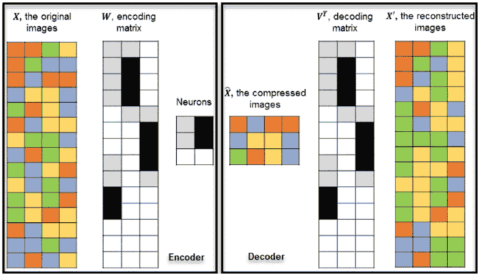
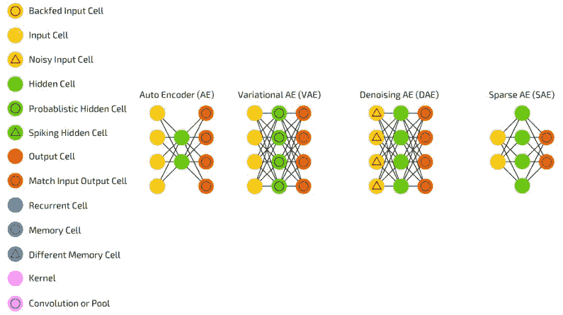
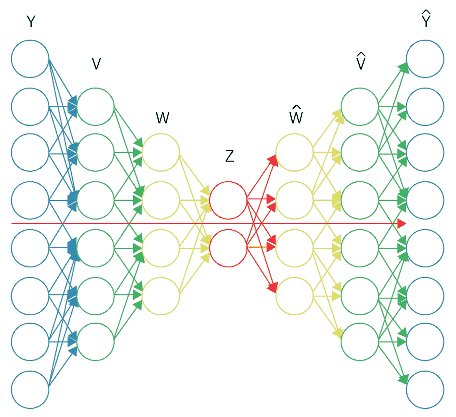

# 第十一章：使用 RNNSharp 训练自动编码器

在本章中，我们将讨论**自动编码器**及其用法。我们将讨论什么是自动编码器，不同类型的自动编码器，并展示不同的示例，以帮助您更好地理解如何在应用程序中使用这项技术。到本章结束时，您将了解如何设计自己的自动编码器，从磁盘加载和保存它，以及如何训练和测试它。

本章涵盖了以下主题：

+   什么是自动编码器？

+   不同类型的自动编码器

+   创建自己的自动编码器

# 技术要求

您需要安装 Microsoft Visual Studio。

# 什么是自动编码器？

自动编码器是一种无监督学习算法，它应用反向传播并设置目标值等于输入。自动编码器学习将输入层的数据压缩成更短的代码，然后将其解压缩成与原始数据非常接近的东西。这更广为人知的是**降维**。

以下是对自动编码器的描述。原始图像被编码，然后解码以重建原始图像：



# 不同类型的自动编码器

以下介绍了不同类型的自动编码器：



让我们简要讨论自动编码器和我们已经看到的变体。请注意，还有其他变体；这些只是我认为您至少应该熟悉的可能最常见的。

# 标准自动编码器

自动编码器学习将输入层的数据压缩成更小的代码，然后将该代码解压缩成（希望）与原始数据匹配的东西。标准自动编码器背后的基本思想是自动编码信息，因此得名。整个网络在形状上总是类似于沙漏，其隐藏层比输入层和输出层少。中间层之前的所有内容称为编码部分，中间层之后的所有内容称为解码部分，中间层本身被称为，正如你可能猜到的，代码。您可以通过提供输入数据和设置错误状态为输入和输出之间的差异来训练自动编码器。可以构建自动编码器，使得编码权重和解码权重相同。

# 变分自动编码器

**变分自编码器**与自编码器具有相同的架构，但它们学习的内容不同：输入样本的近似概率分布。这是因为它们与玻尔兹曼机和受限玻尔兹曼机有更紧密的联系。然而，它们确实依赖于贝叶斯数学以及一个重新参数化技巧来实现这种不同的表示。基本原理可以归结为：考虑影响。如果在一处发生某事，而在另一处发生另一件事，它们不一定相关。如果它们不相关，那么错误传播应该考虑这一点。这是一个有用的方法，因为神经网络是大型图（在某种程度上），所以当你深入到更深的层时，能够排除某些节点对其他节点的影响是有帮助的。

# 去噪自编码器

**去噪自编码器**从自身被损坏的版本中重建输入。这做了两件事。首先，它试图编码输入，同时尽可能保留信息。其次，它试图撤销损坏过程的影响。在随机移除一定比例的数据后，输入被重建，这迫使网络学习鲁棒的特征，这些特征往往具有更好的泛化能力。去噪自编码器是我们在输入数据中添加噪声（例如使图像更粗糙）的自编码器。我们以相同的方式计算误差，因此网络的输出与原始无噪声输入进行比较。这鼓励网络学习不是细节而是更广泛的特征，这些特征通常更准确，因为它们不受不断变化的噪声的影响。

# 稀疏自编码器

**稀疏自编码器**在某种程度上是自编码器的对立面。不是教网络以更少的空间或节点表示信息，而是尝试在更多的空间中编码信息。不是网络在中间收敛然后扩展回输入大小，而是将中间部分膨胀。这类网络可以用来从数据集中提取许多小的特征。如果你以与自编码器相同的方式训练稀疏自编码器，你几乎在所有情况下都会得到一个相当无用的恒等网络（即输入的是什么，输出的也是什么，没有任何转换或分解）。为了防止这种情况，我们反馈输入，以及所谓的**稀疏驱动器**。这可以采取阈值滤波器的形式，其中只有一定错误的误差被反馈并训练。其他错误对于那次传递将是无关紧要的，并将被设置为零。在某种程度上，这类似于脉冲神经网络，其中不是所有神经元都始终在放电。

# 创建自己的自编码器

现在你已经成为自动编码器的专家，让我们转向更少的理论，更多的实践。让我们在这件事上采取一条不同的路线。而不是使用开源包并展示如何使用它，让我们编写我们自己的自动编码器框架，你可以增强它来制作自己的。我们将讨论和实现所需的基本组件，然后编写一些示例代码来展示如何使用它。我们将使这一章节独特，因为我们不会完成使用示例；我们只会做足够的，让你开始自己的自动编码器创建之路。考虑到这一点，让我们开始。

让我们从思考自动编码器是什么以及我们想要包含哪些内容开始。首先，我们需要跟踪我们有多少层。这些层肯定是受限玻尔兹曼机。只是让你知道，当我们需要简洁时，我们也会将 **受限玻尔兹曼机** 简称为 **RBMs**。

因此，我们知道我们需要跟踪我们的自动编码器有多少层。我们还将需要监控我们将需要使用的权重：学习率、识别权重和生成权重。当然，训练数据很重要，错误也是如此。我认为现在应该就足够了。让我们创建一个类来专门做这件事。

让我们从创建一个 `interface` 开始，我们将使用它来计算错误。我们只需要一个方法，这个方法会为我们计算错误。RBM 将负责做这件事，但我们会稍后讨论：

```py
public interface IErrorObserver
{
void CalculateError(double PError);
}
```

在我们定义我们的 RBM 类之前，我们需要查看它将使用的层。为了最好地表示这一点，我们将创建一个 `abstract` 类。我们需要跟踪层的状态、使用的偏置、偏置变化量、活动本身以及它将有多少个神经元。我们不会区分镜像神经元和规范神经元，而将所有神经元类型表示为一个单一的对象。我们还需要有多个类型的 RBM 层。高斯和二进制是两个可以想到的类型，所以以下将是这些层的基类：

```py
public abstract class RestrictedBoltzmannMachineLayer
{
protected double[] state;
protected double[] bias;
protected double[] biasChange;
protected double[] activity;
protected int numNeurons = 0;
}
```

我们必须记住，我们的 RBM 需要跟踪其权重。由于权重是通过称为 **突触** 的层应用的，我们将创建一个类来表示我们想要对权重做的所有事情。由于我们需要跟踪权重、它们的变化以及前向和后向大小，让我们创建一个封装所有这些内容的类：

```py
public class RestrictedBoltzmannMachineWeightSet
{
private int preSize;
private int postSize;
private double[][] weights;
private double[][] weightChanges;
}
```

接下来，由于我们的学习率包括权重、偏置和动量等特征，我们最好创建一个单独的类来表示所有这些：

```py
public struct RestrictedBoltzmannMachineLearningRate
{
internal double weights;
internal double biases;
internal double momentumWeights;
internal double momentumBiases;
}
```

最后，让我们创建一个包含我们的训练数据的类：

```py
public struct TrainingData
{
public double[] posVisible;
public double[] posHidden;
public double[] negVisible;
public double[] negHidden;
}
```

在所有这些都定义好之后，让我们继续工作在我们的 `RestrictedBoltzmannMachine` 类上。对于这个类，我们需要跟踪我们有多少个可见层和隐藏层，我们将使用的权重和学习率，以及我们的训练数据：

```py
public class RestrictedBoltzmannMachine
{
private RestrictedBoltzmannMachineLayer visibleLayers;
private RestrictedBoltzmannMachineLayer hiddenLayers;
private RestrictedBoltzmannMachineWeightSet weights;
private RestrictedBoltzmannMachineLearningRate learnrate;
private TrainingData trainingdata;
private int numVisibleLayers;
private int numHiddenLayers;
}
```

最后，在所有其他内容都就绪之后，让我们创建我们的 `Autoencoder` 类：

```py
public class Autoencoder
{
private int numlayers;
private bool pretraining = true;
private RestrictedBoltzmannMachineLayer[] layers;
private AutoencoderLearningRate learnrate;
private AutoencoderWeights recognitionweights;
private AutoencoderWeights generativeweights;
private TrainingData[] trainingdata;
private List<IErrorObserver> errorobservers;
}
```

尽管我们知道这些类中的一些将需要更多的功能，但这是我们开始构建其余代码所需的基本框架。为了做到这一点，我们应该考虑一些事情。

由于权重是我们自动编码器的一个突出方面，我们将不得不经常使用和初始化权重。但是我们应该如何初始化我们的权重，以及使用什么值？我们将提供两种不同的选择。我们将要么将所有权重初始化为零，要么使用高斯分布。我们还将不得不初始化偏差。让我们继续创建一个接口来完成这项工作，这样以后选择我们想要的初始化类型（零或高斯）会更容易：

```py
public interface IWeightInitializer
{
double InitializeWeight();
double InitializeBias();}
```

我们之前提到，我们需要有多个类型的 RBM 层来使用。高斯和二进制是两个想到的类型。我们已经为这个创建了接口，所以让我们继续将我们的基类放入形式，因为我们很快就会需要它们。为此，我们需要扩展我们的 RBM 层类并添加两个抽象方法，这样它们就可以被克隆，并且我们可以设置层的状态：

```py
public abstract void SetState(int PWhich, double PInput);
public abstract object Clone();
```

我们的`RestrictedBoltzmannMachineLayer`类现在看起来是这样的：

```py
public abstract class RestrictedBoltzmannMachineLayer
{
protected double[] state;
protected double[] bias;
protected double[] biasChange;
protected double[] activity;
protected int numNeurons = 0;
public abstract void SetState(int PWhich, double PInput);
public abstract object Clone();
}
```

在我们建立了非常基础的自动编码器之后，我们现在应该将注意力转向我们如何构建自动编码器。让我们尽量使事物尽可能模块化，并考虑到这一点，让我们创建一个`AutoEncoderBuilder`类，它可以封装诸如权重初始化、添加层等事物。它看起来可能如下所示：

```py
public class AutoencoderBuilder
{
private List<RestrictedBoltzmannMachineLayer> layers = new List<RestrictedBoltzmannMachineLayer>();
private AutoencoderLearningRate learnrate = new AutoencoderLearningRate();
private IWeightInitializer weightinitializer = new GaussianWeightInitializer();
}
```

现在我们已经将这个类建立起来，让我们开始通过函数的形式给它添加一些内容。我们知道当我们构建一个自动编码器时，我们将需要添加层。我们可以用这个函数来做。我们将传递层，然后更新我们内部的学习率层：

```py
private void AddLayer(RestrictedBoltzmannMachineLayer PLayer)
{
learnrate.preLearningRateBiases.Add(0.001);
learnrate.preMomentumBiases.Add(0.5);
learnrate.fineLearningRateBiases.Add(0.001);
if (layers.Count >= 1)
{
learnrate.preLearningRateWeights.Add(0.001);
learnrate.preMomentumWeights.Add(0.5);
learnrate.fineLearningRateWeights.Add(0.001);
}
layers.Add(PLayer);
}
```

一旦我们有了这个基本函数，我们就可以添加一些更高级的函数，这将使我们更容易向自动编码器添加层：

```py
public void AddBinaryLayer (int size)
{
AddLayer (new RestrictedBoltzmannMachineBinaryLayer(size));
}
public void AddGaussianLayer (int size)
{
AddLayer (new RestrictedBoltzmannMachineGaussianLayer(size));
}
```

最后，让我们在我们的自动编码器构建器中添加一个`Build()`方法，使其更容易构建：

```py
public Autoencoder Build()
{
return new Autoencoder(layers, learnrate, weightinitializer);
}
```

现在，让我们将注意力转向我们的自动编码器本身。我们需要一个函数来帮助我们初始化偏差：

```py
private void InitializeBiases(IWeightInitializer PWInitializer)
{
for (int i = 0; i < numlayers; i++)
{
for (int j = 0; j < layers[i].Count; j++)
{
layers[i].SetBias(j, PWInitializer.InitializeBias());
}
}
}
```

接下来，我们需要初始化我们的训练数据。这基本上涉及到创建我们需要的所有数组并将它们的初始值设置为零，如下所示：

```py
private void InitializeTrainingData()
{
trainingdata = new TrainingData[numlayers - 1];
for (inti = 0; i < numlayers - 1; i++)
{
trainingdata[i].posVisible = new double[layers[i].Count];
Utility.SetArrayToZero(trainingdata[i].posVisible);
trainingdata[i].posHidden = new double[layers[i + 1].Count];
Utility.SetArrayToZero(trainingdata[i].posHidden);
trainingdata[i].negVisible = new double[layers[i].Count];
Utility.SetArrayToZero(trainingdata[i].negVisible);
trainingdata[i].negHidden = new double[layers[i + 1].Count];
Utility.SetArrayToZero(trainingdata[i].negHidden);
}
}
```

在这之后，我们已经有一个良好的开端。让我们开始使用软件，看看我们缺少什么。让我们创建我们的`builder`对象，添加一些二进制和高斯层，看看效果如何：

```py
AutoencoderBuilder builder = new AutoencoderBuilder();
builder.AddBinaryLayer(4);
builder.AddBinaryLayer(3);
builder.AddGaussianLayer(3);
builder.AddGaussianLayer(1);
```

还不错，对吧？那么接下来是什么？嗯，我们已经创建了自动编码器并添加了层。我们现在缺少允许我们微调和训练学习率和动量的函数。让我们看看如果我们按照以下方式添加它们会是什么样子：

```py
builder.SetFineTuningLearningRateBiases(0, 1.0);
builder.SetFineTuningLearningRateWeights(0, 1.0);
builder.SetPreTrainingLearningRateBiases(0, 1.0);
builder.SetPreTrainingLearningRateWeights(0, 1.0);
builder.SetPreTrainingMomentumBiases(0, 0.1);
builder.SetPreTrainingMomentumWeights(0, .05);
```

看起来差不多。在这个阶段，我们应该将这些函数添加到我们的`autoencoderbuilder`对象中，以便我们可以使用它们。让我们看看那会是什么样子。记住，随着我们的 builder 对象，我们自动创建了学习率对象，所以现在我们只需要使用它来填充诸如权重和偏差、动量权重和偏差等东西：

```py
public void SetPreTrainingLearningRateWeights(int PWhich, double PLR)
{
learnrate.preLearningRateWeights[PWhich] = PLR;
}
public void SetPreTrainingLearningRateBiases(int PWhich, double PLR)
{
learnrate.preLearningRateBiases[PWhich] = PLR;
}
public void SetPreTrainingMomentumWeights(int PWhich, double PMom)
{
learnrate.preMomentumWeights[PWhich] = PMom;
}
public void SetPreTrainingMomentumBiases(int PWhich, double PMom)
{
learnrate.preMomentumBiases[PWhich] = PMom;
}
public void SetFineTuningLearningRateWeights(int PWhich, double PLR)
{
learnrate.fineLearningRateWeights[PWhich] = PLR;
}
public void SetFineTuningLearningRateBiases(int PWhich, double PLR)
{
learnrate.fineLearningRateBiases[PWhich] = PLR;
}
```

好吧，现在让我们停下来看看我们的示例程序看起来像什么：

```py
AutoencoderBuilder builder = new AutoencoderBuilder();
builder.AddBinaryLayer(4);
builder.AddBinaryLayer(3);
builder.AddGaussianLayer(3);
builder.AddGaussianLayer(1);
builder.SetFineTuningLearningRateBiases(0, 1.0);
builder.SetFineTuningLearningRateWeights(0, 1.0);
builder.SetPreTrainingLearningRateBiases(0, 1.0);
builder.SetPreTrainingLearningRateWeights(0, 1.0);
builder.SetPreTrainingMomentumBiases(0, 0.1);
builder.SetPreTrainingMomentumWeights(0, .05);
```

还不错。现在我们只需要在`builder`上调用我们的`Build()`方法，就应该有我们框架的第一版了：

```py
Autoencoder encoder = builder.Build();
```

现在所有这些都已完成，回顾前面的代码，我认为在某个时候我们将需要能够访问我们的单个层；你怎么看？以防万一，我们最好提供一个函数来做这件事。让我们看看那会是什么样子：

```py
RestrictedBoltzmannMachineLayer layer = encoder.GetLayer(0);
RestrictedBoltzmannMachineLayer layerHidden = encoder.GetLayer(1);
```

由于我们的内部层是`RestrictedBoltzmannMachine`层，这就是我们应该返回的类型，正如您可以从前面的代码中看到的那样。`GetLayer()`函数需要位于自动编码器对象内部，而不是 builder。所以，让我们现在就添加它。我们需要成为优秀的开发者，确保我们在尝试使用它之前，有一个边界检查来确保我们传递了一个有效的层索引。我们将所有这些小巧的实用函数存储在一个自己的类中，我们可以称之为`Utility`，因为这个名字是有意义的。我不会深入讲解如何编写这个函数，因为我相当确信每个读者都已经知道如何进行边界检查，所以你可以自己编写或者查看附带的源代码来了解在这个例子中是如何实现的：

```py
public RestrictedBoltzmannMachineLayer GetLayer(int PWhichLayer)
{
Utility.WithinBounds("Layer index out of bounds!", PWhichLayer, numlayers);
return layers[PWhichLayer];
}
```

好的，现在我们可以创建我们的自动编码器，设置权重和偏差，并访问单个层。我认为接下来我们需要开始考虑的是训练和测试。当然，我们需要分别处理它们，那么为什么不从训练开始呢？

我们需要能够训练我们的 RBM，那么为什么不创建一个专门用于此的对象呢。我们将它命名为，不出所料，`RestrictedBoltzmannMachineTrainer`。再次强调，我们还需要处理我们的`LearningRate`对象和权重集，所以让我们立即将它们作为变量添加：

```py
public static class RestrictedBoltzmannMachineTrainer
{
private static RestrictedBoltzmannMachineLearningRate learnrate;
private static RestrictedBoltzmannMachineWeightSet weightset;
}
```

现在，你认为我们需要为我们的训练器添加哪些功能呢？显然，需要一个`Train()`方法；否则，我们给对象命名就不正确了。我们还需要训练我们的权重和层偏差：

```py
private static void TrainWeight(int PWhichVis, int PWhichHid, double PTrainAmount);
private static void TrainBias(RestrictedBoltzmannMachineLayer PLayer, int PWhich, double PPosPhase, double PNegPhase);
```

最后，但同样重要的是，我们可能需要一个`helper`函数，它让我们知道训练量，对我们来说，这涉及到将正可见量乘以正隐藏量，然后从负可见量乘以负隐藏量中减去：

```py
private static double CalculateTrainAmount(double PPosVis, double PPosHid, double PNegVis, double PNegHid)
{
return ((PPosVis * PPosHid) - (PNegVis * PNegHid));
}
```

好的，让我们看看我们的程序现在处于什么位置：

```py
AutoencoderBuilder builder = new AutoencoderBuilder();
builder.AddBinaryLayer(4);
builder.AddBinaryLayer(3);
builder.AddGaussianLayer(3);
builder.AddGaussianLayer(1);
builder.SetFineTuningLearningRateBiases(0, 1.0);
builder.SetFineTuningLearningRateWeights(0, 1.0);
builder.SetPreTrainingLearningRateBiases(0, 1.0);
builder.SetPreTrainingLearningRateWeights(0, 1.0);
builder.SetPreTrainingMomentumBiases(0, 0.1);
builder.SetPreTrainingMomentumWeights(0, .05);
Autoencoder encoder = builder.Build();
RestrictedBoltzmannMachineLayer layer = encoder.GetLayer(0);
RestrictedBoltzmannMachineLayer layerHidden = encoder.GetLayer(1);
```

很好。你能看到所有这些是如何开始整合的吗？现在是我们考虑如何将数据添加到我们的网络中的时候了。在我们对网络进行任何类型的训练之前，我们需要加载数据。我们将如何做？让我们考虑预训练的概念。这是在我们训练之前手动将数据加载到网络中的行为。在我们的程序上下文中，这个函数会是什么样子？比如这样？

```py
encoder.PreTrain(0, new double[] {0.1, .05, .03, 0.8});
```

我们只需要告诉我们的自动编码器我们想要用数据填充哪一层，然后提供数据。这应该对我们有效。如果我们这样做，那么我们的程序将像这样发展：

```py
AutoencoderBuilder builder = new AutoencoderBuilder();
builder.AddBinaryLayer(4);
builder.AddBinaryLayer(3);
builder.AddGaussianLayer(3);
builder.AddGaussianLayer(1);
builder.SetFineTuningLearningRateBiases(0, 1.0);
builder.SetFineTuningLearningRateWeights(0, 1.0);
builder.SetPreTrainingLearningRateBiases(0, 1.0);
builder.SetPreTrainingLearningRateWeights(0, 1.0);
builder.SetPreTrainingMomentumBiases(0, 0.1);
builder.SetPreTrainingMomentumWeights(0, .05);
Autoencoder encoder = builder.Build();
RestrictedBoltzmannMachineLayer layer = encoder.GetLayer(0);
RestrictedBoltzmannMachineLayer layerHidden = encoder.GetLayer(1);
encoder.PreTrain(0, new double[] {0.1, .05, .03, 0.8});
encoder.PreTrain(1, new double[] { 0.1, .05, .03, 0.9 });
encoder.PreTrain(2, new double[] { 0.1, .05, .03, 0.1 });
encoder.PreTrainingComplete();
```

到目前为止，你怎么看？有了这个代码，我们就能用数据填充三个层。我加入了一个额外的函数`PreTrainingComplete`，作为一种让我们的程序知道我们已经完成了预训练的好方法。现在，让我们弄清楚这些函数是如何结合在一起的。

对于预训练，我们将分批进行。我们可以有从 1 到*n*个批次的数量。在许多情况下，批次的数量将是 1。一旦我们确定我们想要使用的批次数量，我们将遍历每一批数据。

对于每一批数据，我们将处理数据并确定我们的神经元是否被激活。然后我们根据这个设置层状态。我们将向前和向后通过网络，设置我们的状态。使用以下图表，我们将像这样通过层 *Y -> V -> W -> (Z)*：



一旦激活被设置，我们必须执行实际的预训练。我们在预突触层中这样做，从层 0 开始。当我们预训练时，我们调用我们之前创建的培训对象`Train`方法，然后传递层（s）、训练数据、我们的识别权重和学习率。为此，我们需要创建我们的实际函数，我们将称之为`PerformPreTraining()`。以下是这个代码的样子：

```py
private void PerformPreTraining(int PPreSynapticLayer)
{
RestrictedBoltzmannMachineLearningRate sentlearnrate = new RestrictedBoltzmannMachineLearningRate(learnrate.preLearningRateWeights[PPreSynapticLayer],learnrate.preLearningRateBiases[PPreSynapticLayer],learnrate.preMomentumWeights[PPreSynapticLayer],learnrate.preMomentumBiases[PPreSynapticLayer]);RestrictedBoltzmannMachineTrainer.Train(layers[PPreSynapticLayer], layers[PPreSynapticLayer + 1],trainingdata[PPreSynapticLayer], sentlearnrate, recognitionweights.GetWeightSet(PPreSynapticLayer));
}
```

一旦预训练完成，我们现在将需要根据正负可见数据属性计算错误率。这将完成我们的`pretraining`函数，我们的示例程序现在将如下所示：

```py
AutoencoderBuilder builder = new AutoencoderBuilder();
builder.AddBinaryLayer(4);
builder.AddBinaryLayer(3);
builder.AddGaussianLayer(3);
builder.AddGaussianLayer(1);
builder.SetFineTuningLearningRateBiases(0, 1.0);
builder.SetFineTuningLearningRateWeights(0, 1.0);
builder.SetPreTrainingLearningRateBiases(0, 1.0);
builder.SetPreTrainingLearningRateWeights(0, 1.0);
builder.SetPreTrainingMomentumBiases(0, 0.1);
builder.SetPreTrainingMomentumWeights(0, .05);
Autoencoder encoder = builder.Build();
RestrictedBoltzmannMachineLayer layer = encoder.GetLayer(0);
RestrictedBoltzmannMachineLayer layerHidden = encoder.GetLayer(1);
encoder.PreTrain(0, new double[] {0.1, .05, .03, 0.8});
encoder.PreTrain(1, new double[] { 0.1, .05, .03, 0.9 });
encoder.PreTrain(2, new double[] { 0.1, .05, .03, 0.1 });
encoder.PreTrainingComplete();
```

在我们有了所有这些代码之后，我们现在需要做的就是保存自动编码器，我们应该就绪了。我们将通过在自动编码器中创建一个`Save()`函数并按如下方式调用它来完成这项工作：

```py
encoder.Save("testencoder.txt");
```

要实现这个功能，让我们看看我们需要做什么。首先，我们需要一个用于自动编码器名称的文件名。一旦我们打开一个**.NET TextWriter**对象，我们就保存学习率、识别权重和生成权重。接下来，我们遍历所有层，写出层类型，然后保存数据。如果你决定实现比我们创建的更多类型的 RBM 层，确保你相应地更新`Save()`和`Load()`方法，以便你的新层数据能够正确保存和重新加载。

让我们看看我们的 `Save` 函数：

```py
public void Save(string PFilename)
{
TextWriter file = new StreamWriter(PFilename);
learnrate.Save(file);
recognitionweights.Save(file);
generativeweights.Save(file);
file.WriteLine(numlayers);
for (inti = 0; i < numlayers; i++)
{
if(layers[i].GetType() == typeof(RestrictedBoltzmannMachineGaussianLayer))
{
file.WriteLine("RestrictedBoltzmannMachineGaussianLayer");
}
else if (layers[i].GetType() == typeof(RestrictedBoltzmannMachineBinaryLayer))
{
file.WriteLine("RestrictedBoltzmannMachineBinaryLayer");
}
layers[i].Save(file);
}
file.WriteLine(pretraining);
file.Close();
}
```

现在我们已经将自动编码器保存到磁盘上，我们应该真正处理将数据重新加载到内存中并从中创建自动编码器的功能。因此，我们现在需要一个 `Load()` 函数。我们需要基本上遵循我们写入磁盘时所做的步骤，但这次我们将读取它们，而不是写入它们。我们的权重、学习率和层也将有一个 `Load()` 函数，就像前面的每个项目都有一个 `Save()` 函数一样。

我们的 `Load()` 函数在声明上会有所不同。由于我们正在加载一个已保存的自动编码器，我们必须假设在调用此函数时，自动编码器对象尚未创建。因此，我们将在这个自动编码器对象本身上将其函数声明为 `static()`，因为它将为我们返回一个新创建的自动编码器。我们的函数将看起来是这样的：

```py
public static Autoencoder Load(string PFilename)
{
TextReader file = new StreamReader(PFilename);
Autoencoder retval = new Autoencoder();
retval.learnrate = new AutoencoderLearningRate();
retval.learnrate.Load(file);
retval.recognitionweights = new AutoencoderWeights();
retval.recognitionweights.Load(file);
retval.generativeweights = new AutoencoderWeights();
retval.generativeweights.Load(file);
retval.numlayers = int.Parse(file.ReadLine());
retval.layers = new RestrictedBoltzmannMachineLayer[retval.numlayers];
for (inti = 0; i < retval.numlayers; i++)
{
string type = file.ReadLine();
if (type == "RestrictedBoltzmannMachineGaussianLayer")
{
retval.layers[i] = new RestrictedBoltzmannMachineGaussianLayer();
}
else if (type == "RestrictedBoltzmannMachineBinaryLayer")
{
retval.layers[i] = new RestrictedBoltzmannMachineBinaryLayer();
}
retval.layers[i].Load(file);
}
retval.pretraining = bool.Parse(file.ReadLine());
retval.InitializeTrainingData();
retval.errorobservers = new List<IErrorObserver>();
file.Close();
return retval;
}
```

做完这些后，让我们看看我们如何调用我们的 `Load()` 函数。它应该像以下这样：

```py
Autoencoder newAutoencoder = Autoencoder.Load("testencoder.txt");
```

那么，让我们在这里停下来，看看我们取得了哪些成果。让我们看看我们的程序能做什么，如下所示：

```py
AutoencoderBuilder builder = new AutoencoderBuilder();
builder.AddBinaryLayer(4);
builder.AddBinaryLayer(3);
builder.AddGaussianLayer(3);
builder.AddGaussianLayer(1);
builder.SetFineTuningLearningRateBiases(0, 1.0);
builder.SetFineTuningLearningRateWeights(0, 1.0);
builder.SetPreTrainingLearningRateBiases(0, 1.0);
builder.SetPreTrainingLearningRateWeights(0, 1.0);
builder.SetPreTrainingMomentumBiases(0, 0.1);
builder.SetPreTrainingMomentumWeights(0, .05);
Autoencoder encoder = builder.Build();
RestrictedBoltzmannMachineLayer layer = encoder.GetLayer(0);
RestrictedBoltzmannMachineLayer layerHidden = encoder.GetLayer(1);
encoder.PreTrain(0, new double[] {0.1, .05, .03, 0.8});
encoder.PreTrain(1, new double[] { 0.1, .05, .03, 0.9 });
encoder.PreTrain(2, new double[] { 0.1, .05, .03, 0.1 });
encoder.PreTrainingComplete();
encoder.Save("testencoder.txt");
Autoencoder newAutoencoder = Autoencoder.Load("testencoder.txt");
```

# 摘要

好吧，朋友们，我认为是时候结束这一章并继续前进了。您应该为自己感到自豪，因为您已经从开始（几乎）完成了完整的自动编码器。在配套的源代码中，我添加了更多函数来使其更加完整，并为您提供一个更好的起点，以便将其构建成一个强大的框架供您使用。在增强这个框架的过程中，请考虑您需要自动编码器执行的任务，将这些函数块在里，然后像我们一样完成它们。您不是学习如何使用开源框架，而是构建了自己的——恭喜您！

我已经利用提供的源代码对我们的自动编码器框架进行了更多的发展。您可以自由使用、丢弃或修改它以满足您的需求。它很有用，但正如我提到的，请随意对其进行装饰，使其成为您自己的东西，即使只是为了教育目的。

那么，让我们简要回顾一下本章我们学到了什么：我们学习了自动编码器和不同的变体，我们编写了自己的自动编码器并创建了一些强大的功能。在下一章，我们将继续探讨我最大的热情，我希望它很快也会成为您的热情，那就是**群体智能**。当然，会有一些理论，但一旦我们讨论了这些，我想你会对粒子群优化算法能做什么感到印象深刻！

# 参考文献

+   Vincent P, La Rochelle H, Bengio Y, 和 Manzagol P A (2008)，*使用去噪自动编码器提取和组合鲁棒特征*，第 25 届国际机器学习会议（ICML，2008）论文集，第 1,096 - 1,103 页，ACM。

+   Vincent, Pascal, 等人，*使用去噪自动编码器提取和组合鲁棒特征*，第 25 届国际机器学习会议论文集。ACM，2008。

+   Kingma, Diederik P 和 Max Welling*, *自编码变分贝叶斯*, arXiv 预印本 arXiv:1312.6114 (2013).

+   Marc'Aurelio Ranzato, Christopher Poultney, Sumit Chopra, 和 Yann LeCun, *基于能量模型的稀疏表示的高效学习，NIPS 会议论文，2007*.

+   Bourlard, Hervé, 和 Yves Kamp, *多层感知器和奇异值分解的多层感知器自联想，生物控制论 59.4–5* (1988): 291-294.
