# 第十四章：寻找最优参数

在本章中，我们将使用开源软件包 SwarmOps，版本 4.0，帮助您更好地理解如何使用此工具为您函数找到最优参数。您可以从以下位置获取 SwarmOps 的最新版本：[`github.com/mattcolefla/SwarmOps`](https://github.com/mattcolefla/SwarmOps).

再次强调，我们必须花一点时间在理论上，我们将带你回到学术时代，打下基础，以便我们都使用相同的语言。需要注意的是，SwarmOps 是一个高度研究导向的工具，应如此使用。我们努力使这个产品开源，最新版本有超过 60 种不同的优化函数供您使用。

本章将涵盖以下主题：

+   适应度函数

+   约束条件

+   元优化

+   优化方法

+   并行性

准备好了吗？我们开始了！

# 技术要求

您需要具备使用 Microsoft Visual Studio 和 C# 进行 .NET 开发的基本知识。您需要从本书的网站上下载本章的代码：SwarmOps ([`github.com/mattcolefla/SwarmOps`](https://github.com/mattcolefla/SwarmOps)).

查看以下视频以查看代码的实际应用：[`bit.ly/2QPddLO`](http://bit.ly/2QPddLO).

# 优化

一些问题的解决方案并不像 *正确* 或 *错误* 那样简单明了，而是根据质量进行评分。这类问题被称为 **优化问题**，因为目标是找到最佳、即 *最优* 质量的候选解。

# 适应度函数是什么？

SwarmOps 适用于实值和单目标优化问题，即从 -维实值空间映射到一维实值空间的优化问题。从数学的角度讲，我们考虑优化问题为以下形式的函数 ：

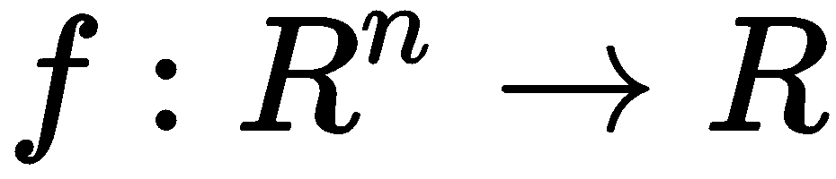

在 SwarmOps 中，假设  是一个最小化问题，这意味着我们正在寻找具有最小值 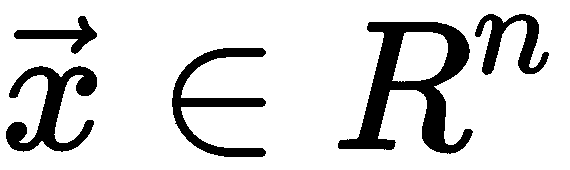 的候选解 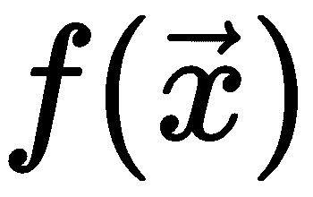。从数学上讲，这可以写成以下形式：

找到 ，使得 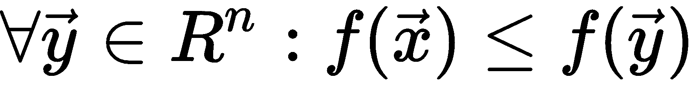.

然而，通常情况下，我们无法找到确切的优化最佳点；我们必须满足于一个足够高质量的候选解，可能并非完全最优。在本章中，我们将优化问题称为“适应度”函数，但它也可以被称为成本函数、目标函数、误差函数、质量度量等等。我们还可以将候选解称为位置、代理或粒子，将所有可能的候选解称为搜索空间。

# 最大化

SwarmOps 也可以用于最大化问题。如果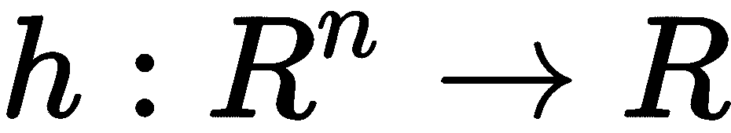是一个最大化问题，那么等价的最小化问题如下：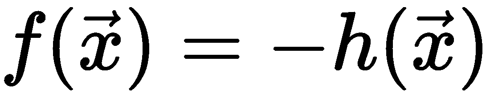。

# 基于梯度的优化

优化适应度函数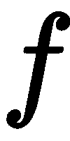的经典方法首先是推导其梯度，即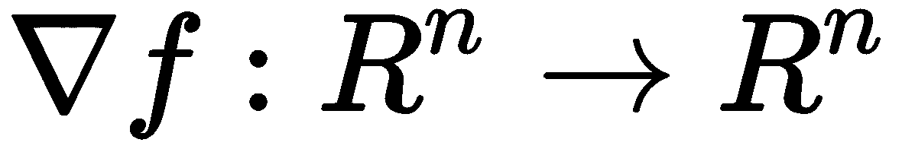，它由的偏导数组成，即：


然后迭代地沿着最速下降方向跟踪梯度；如果需要，也可以使用准牛顿优化器。这个优化器要求不仅适应度函数是可微分的，还需要时间和耐心。这是因为梯度的推导可能非常耗时，执行也可能非常耗时。

# 启发式优化

基于梯度的优化方法的替代方案是让优化完全由适应度值引导。这种优化没有关于适应度景观外观的明确知识，而只是将适应度函数视为一个黑盒，它接受候选解作为输入并产生适应度值作为输出。在本章中，这种优化被称为无导数优化、直接搜索、启发式优化、元启发式、黑盒优化等等。我们将大量使用这些术语！

# 约束

约束将搜索空间分割成可行候选解和不可行候选解的区域。例如，一个工程问题可能有一个需要优化的数学模型，但在现实世界中产生解决方案可能会对可行性施加一些约束。在启发式优化中，有不同方式来支持和处理约束。

# 边界

约束的一种简单形式是搜索空间边界。而不是让 ![img/4b827c98-c3b5-4f2a-a2e3-22a8f3cd3d14.png] 从整个 ![img/19fe84b2-bee4-4df9-9731-e4c5979c7344.png] 维的实值空间映射，通常只使用这个庞大搜索空间的一部分是实用的。构成搜索空间的上下边界表示为 ![img/fd613b81-7202-46fa-a065-f4a9e7d46c66.png] 和 ![img/bc508a18-3f8e-460f-994a-a9a844344e7e.png]，因此适应性函数的形式如下：

![img/a9c3f595-e542-4b73-a111-d269ef1cfee6.png]

这种边界通常通过将候选解移动回边界值来在优化方法中强制执行，如果它们已经超过了边界。这是 SwarmOps 中可用的默认约束类型。

# 惩罚函数

任何启发式优化器通过惩罚不可行的候选解（即在适应性函数中添加惩罚函数）透明地支持更复杂的约束。示例可以在 SwarmOps 源代码的惩罚基准问题部分找到。

# 一般约束

SwarmOps 通过在比较候选解时考虑可行性（约束满足）来支持一般约束。通常，我们通过比较它们的适应性 ![img/0c872fc8-9935-4e18-bc4e-251e8c91cece.png] 来确定候选解 ![img/b7d1afed-2b91-4ede-92ad-7d844093c95c.png] 是否比 ![img/6815653e-4aad-427b-bc3c-42cd1411241f.png] 更好，但也可以考虑可行性。可行性是一个布尔值；候选解要么是可行的，要么是不可行的。比较运算符如下图中所示：

![img/06b8c937-53e5-41e6-98f1-721e4ec3c124.png]

注意在前面的图中，这种比较的实际实现被简化了一些。还请注意，当 ![img/0dd53fa0-41cc-4d49-bfe8-cb86d4e72111.png] 是可行的而 ![img/606727bc-e8d5-4fcc-8c0f-e8b40205a94f.png] 是不可行的时候，它们的适应性不需要计算。这是因为 ![img/04942206-ca8b-4c51-893f-41b045d9c844.png] 由于它们的相互可行性而比 ![img/7dd24064-e485-4ab1-a789-218fe581c80c.png] 更差。这在实现中用于在可能的情况下避免适应性计算。

# 约束优化阶段

使用早期的比较运算符意味着优化有两个阶段。首先，优化器可能会只找到不可行的候选解，因此它优化不可行解的适应性。然后，在某个时刻，优化器希望发现一个可行的候选解；无论其适应性如何，它将成为优化器找到的最佳解，并成为进一步搜索的基础。这本质上是对可行解适应性的优化。

# 约束优化困难

虽然 SwarmOps 允许你实现任何可想象的约束，但约束本身会使优化器越来越难以找到可行的最优解，因为约束缩小了搜索空间的可行区域。因此，你应该也将初始化和搜索空间边界尽可能靠近可行区域。

# 实现

在`problem`类中有两种方法可以用来实现约束；它们如下所示：

+   `EnforceConstraints()`允许你在评估候选解的可行性和适应度之前对其进行修复。例如，当使用搜索空间边界作为约束时，修复将包括将候选解移动回边界之间，如果它们越界了。这是默认行为。

+   `Feasible()`评估并返回候选解的可行性，而不会改变它。

# 元优化

优化方法通常有几个用户定义的参数，这些参数控制着优化方法的行为和有效性。这些被称为优化器的行为参数或控制参数。寻找这些行为参数的良好选择以前是通过手动调整完成的，有时甚至通过粗略的数学分析。研究人员中普遍认为，行为参数可以在优化过程中进行调整以改善整体优化性能；然而，这已被证明大部分情况下不太可能。调整行为参数可以被视为一个优化问题，因此可以通过叠加优化方法来解决。在这里，这被称为元优化，但在本章中也被称为元进化、超级优化、参数校准等等。SwarmOps 在元优化中的成功主要依赖于以下三个因素：

1.  SwarmOps 具有一种特别适合作为叠加元优化器的优化方法，因为它能快速发现表现良好的行为参数（这是本章中描述的 LUS 方法）。

1.  SwarmOps 采用一种简单的技术来减少计算时间，称为抢占性适应度评估。

1.  SwarmOps 使用相同的函数接口来处理优化问题和优化方法。有几篇科学出版物使用了 SwarmOps 进行元优化，并且比这里给出的描述更为详细，包括文献综述和实验结果。元优化的概念可以用以下示意图来表示：

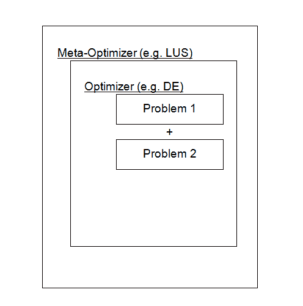

在前面的图中，将要调整行为参数的优化器被带到 DE 方法中，我们将在本章后面讨论。SwarmOps 框架允许针对多个优化问题调整参数，这在某些情况下是必要的，以便使行为参数的性能更好地响应更一般的问题。

在前面的例子中，DE 参数针对两个特定问题进行了调整。

# 适应度归一化

在 SwarmOps 中与元优化正常工作，适应度函数必须是非负的。这是因为预防性适应度评估是通过累加多次优化运行的适应度值来工作的，当适应度总和变得比考虑新候选解决方案作为改进所需的适应度总和更差时，就终止累加。这意味着适应度值必须是非负的，因此适应度总和只能变得更差，从而可以安全地终止评估。SwarmOps for C#会自动进行这种归一化，前提是你准确实现了`problem`类的**MinFitness**字段。例如，你可能有一个适应度函数![img/e06c6075-b237-4bd1-9991-78e53f0daf3f.png]，它映射到，例如，![img/6395813e-55ae-4fe8-8fad-868fc3b68984.png]。在这种情况下，你必须将**MinFitness**设置为![img/c1279116-97cc-4e9c-b33d-18fd0264cc45.png]。最好使**MinFitness**准确，以便![img/b5f6c6b2-1db6-4603-b18f-d789f786eadc.png]对于最优解![img/4c08bc18-d933-418f-bcfe-9e672b621b2d.png]，也就是说，**MinFitness**应该是最优解的适应度。你应该能够估计大多数现实世界问题的较低适应度边界，如果你不确定理论边界值是多少，你可以选择一些充足但不过分的边界适应度值。

# 多个问题的适应度权重

如果你正在元优化中使用多个问题，你可能需要针对每个问题进行权重实验，以使它们对元优化过程的影响更加均衡。

# 建议

通常推荐使用`LUS`方法作为叠加的元优化器。教程源代码包含了一些实验设置的建议，这些设置已被证明效果良好。最好你在针对你最终将使用优化方法的实际问题进行元优化。然而，如果你的适应度函数评估成本非常高，那么在元优化你的优化器的行为参数时，你可以尝试使用基准问题作为临时的替代——前提是你使用多个基准问题，并且优化设置与实际应用中使用的设置相同。换句话说，你应该使用与实际问题中使用的相似维度和优化迭代次数的基准问题。

# 约束和元优化

在元优化中关于约束的两个问题应该被提及；它们如下：

+   可以通过在优化器的类中实现`EnforceConstraints()`和`Feasible()`方法，以与优化问题相同的方式对优化器的控制参数施加约束。这意味着元优化器将搜索可行最优的控制参数，允许你搜索满足某些标准（例如，它们之间存在某种关系，如一个参数比另一个小等）的控制参数；例如，MOL 优化器的源代码就是这样一个例子。

+   在确定优化器在构建元适应度度量方面的表现如何时，会忽略约束满足情况。这是一个开放的研究课题，但实验表明，优化器的控制参数应该为无约束问题进行元优化。这也会在约束问题上有良好的性能。

# 元元优化

当使用元优化来寻找优化器的最佳性能参数时，人们自然会想知道元优化器本身的最佳性能参数是什么。如果经常使用它，找到最佳的元优化器是有意义的。元优化器的最佳参数可以通过采用另一层优化来找到，这可以被称为元元优化。

# 优化方法

本节将简要介绍 SwarmOps 提供的优化方法，以及一些使用建议。

# 选择优化器

面对一个新优化问题时，你可能首先想尝试的是`PS`方法，这通常足够并且具有快速收敛（或停滞）的优势。此外，`PS`没有需要调整的行为参数，所以它要么有效，要么无效。如果`PS`方法在优化你的问题时失败，你可能想尝试`LUS`方法。你可能需要多次运行`PS`和`LUS`，因为它们可能会收敛到次优解。如果`PS`和`LUS`都失败了，你可能想尝试`DE`、`MOL`或`PSO`方法，并实验它们的行为参数。

按照惯例，`PS`和`LUS`方法很快就会停滞，比如说在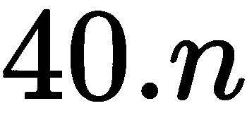次迭代后，其中是搜索空间的维度。另一方面，`DE`、`MOL`和`PSO`方法需要更多的迭代，比如说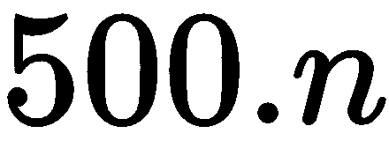或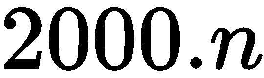，有时甚至更多。

如果这些优化器失败，你可能需要使用元优化来调整它们的行为参数，或者完全使用另一个优化器。

# 梯度下降（GD）

最小化适应度函数 () 的经典方法是在最速下降方向上反复跟随梯度。梯度函数  定义为  的偏导数向量，表示如下：

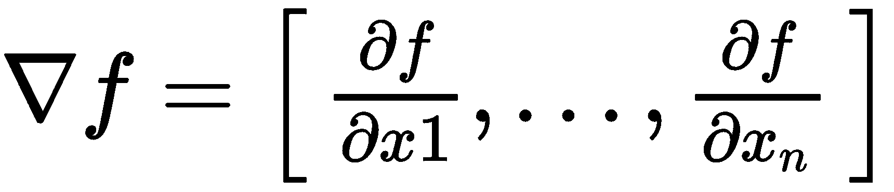

# 它是如何工作的

位置  首先从搜索空间中随机选择，然后根据以下公式迭代更新，无论是否改善适应度：

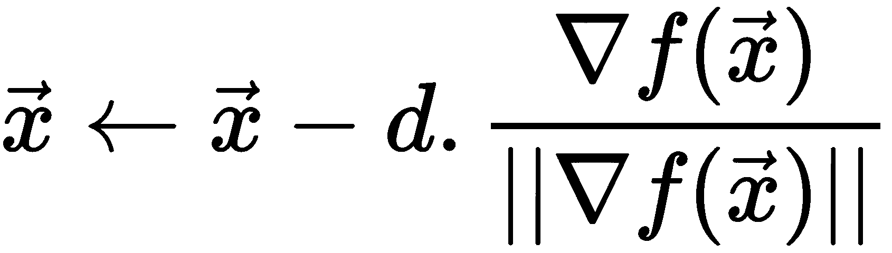

如前公式所示，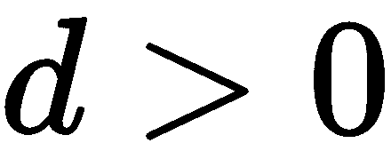 是步长。当  是一个最小化问题时，遵循下降方向，即我们从当前位置减去梯度，而不是像最大化问题那样添加它。

# 缺点

`GD` 方法有一些缺点，即它需要定义梯度 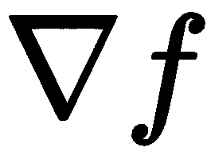。梯度可能也难以计算，并且 `GD` 可能太慢地接近最优解。

# 模式搜索（PS）

优化方法称为 **模式搜索** (**PS**)，最初由 Fermi 和 Metropolis 提出，如 [6] 中所述，与 Hooke 和 Jeeves [7] 使用的方法类似。这里提出的是 [4] 中的变体。

# 它是如何工作的

`PS` 使用一个代理或搜索空间中的位置，该位置正在移动。令位置表示为 ，它最初从整个搜索空间中随机选择。初始采样范围是整个搜索空间：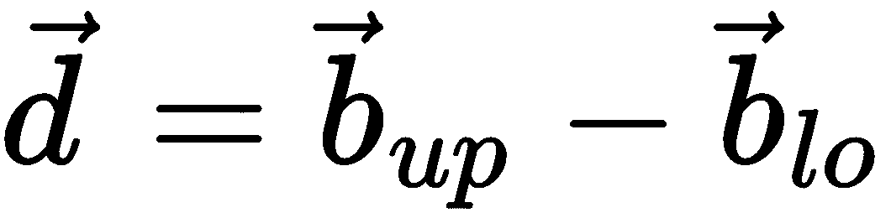。新的潜在位置表示为  并按以下方式采样。

首先，随机选择一个索引 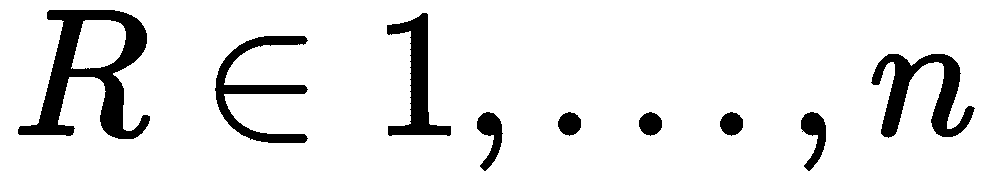，并让 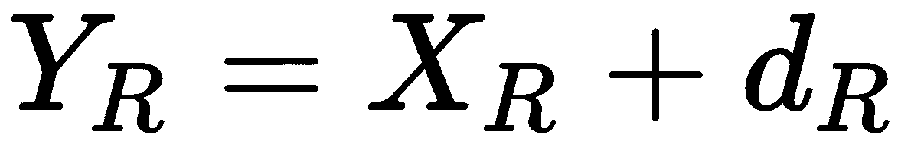 和 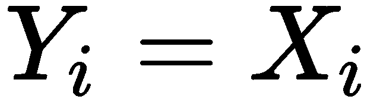 对所有 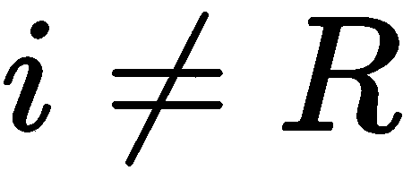。如果 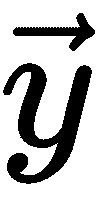 改善了  的适应度，则移动到 。否则，将 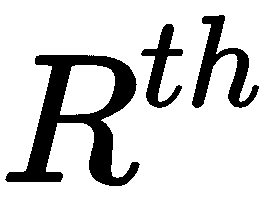 的采样范围减半并反转，使用 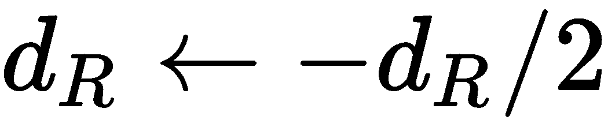。重复此操作几次。

# 局部单峰采样（LUS）

LUS 优化方法通过在搜索空间中移动单个代理进行局部采样，以在优化过程中减少采样范围。`LUS` 方法在 [4] [8] 中提出。

# 它是如何工作的

代理的当前位置表示为！图片，最初是从整个搜索空间中随机选择的。潜在的新的位置表示为！图片，通过让！图片从！图片的邻域中采样，其中！图片是从范围！图片中均匀选择的随机向量，该范围最初为！图片。换句话说，整个搜索空间的完整范围由其上边界！图片和下边界！图片定义。`LUS`在任何改进适应度的情况下，从位置！图片移动到位置！图片未能改进！图片的适应度时，采样范围通过乘以一个因子！图片减少，如下所示：

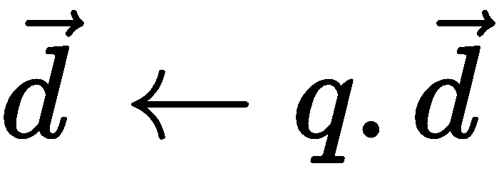

这里，减少因子！图片定义为以下：

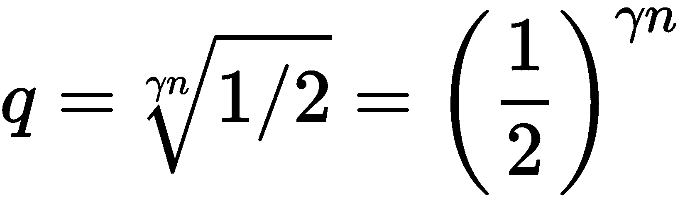

前面的公式表示！图片为搜索空间的维度，！图片为一个用户定义的参数，用于调整采样范围减少的速率。研究发现，！图片的值对于许多优化问题都表现良好。

# 差分进化 (DE)

知名的多代理优化方法**差分进化**（DE）最初由 Storn 和 Price [9] 设计。存在许多 DE 变体，其中简单的一个在 DE 类中实现。通过 DE Suite 和 JDE 类提供了几种不同的 DE 变体。

# 它是如何工作的

`DE`使用一组代理。令！图片表示正在更新的代理的位置，该位置是从整个种群中随机选择的。令！图片为其新潜在位置，计算如下（这就是所谓的**DE/rand/1/bin**变体）：

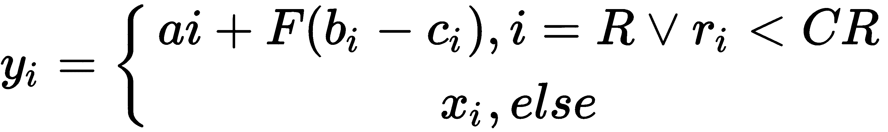

在这里，向量 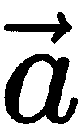、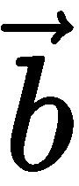 和 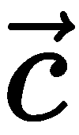 是从种群中随机选择的独立代理的位置。索引 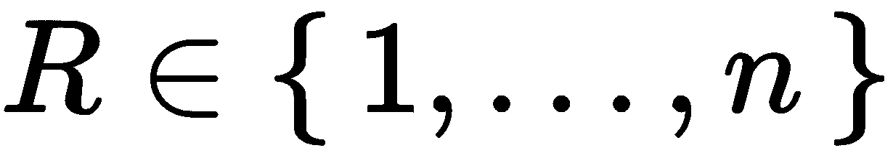 是随机选择的，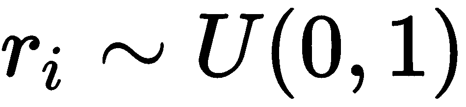 对于每个维度也是随机选择的，。如果移动到新位置  可以提高  的适应性，则进行移动。用户定义的参数包括微分权重 、交叉概率 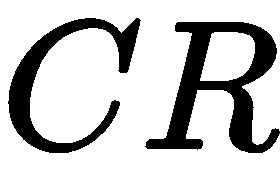 和种群大小 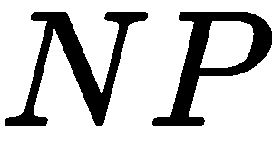。

# 粒子群优化（PSO）

被称为**粒子群优化**（**PSO**）的优化方法最初由 Kennedy、Eberhart 和 Shi [10] [11] 设计。它通过拥有一群称为粒子的候选解决方案来实现，每个粒子都有一个速度，该速度会反复更新并加到粒子的当前位置上，以将其移动到新的位置。

# 它是如何工作的

设  表示从群体中粒子的当前位置。粒子的速度 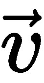 然后按以下方式更新：

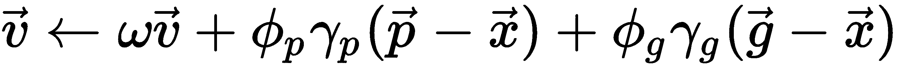

在这里，用户定义的参数  被称为惯性权重，用户定义的参数 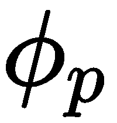 和 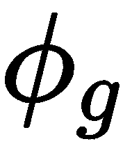 是对粒子自身已知最佳位置 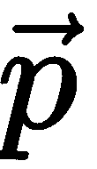 和群体已知最佳位置 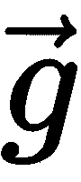 的吸引力权重。这些也通过随机数 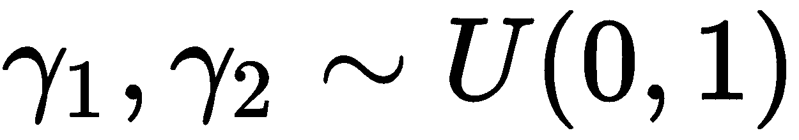 加权。此外，用户还确定群体大小，。在 SwarmOps 实现中，速度被限制在搜索空间的整个范围内，因此一个代理在一次移动中不能移动超过一个搜索空间边界到另一个边界。

一旦计算了代理的速度，就将其加到代理的位置上，如下所示：

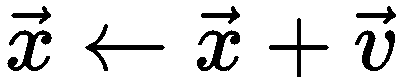

# 许多优化联络（MOL）

PSO 的一种简化称为**许多优化联络**（**MOL**），最初由 Kennedy [12]提出，他称之为*仅社交* PSO。MOL 这个名字在[5]中使用，那里进行了更深入的研究。MOL 与 PSO 的不同之处在于它消除了粒子的最佳已知位置， 。这已被发现可以提高某些问题的性能，并使调整行为参数变得更容易。

# 网格（MESH）

可以使用`MESH`方法在搜索空间的常规间隔内计算适应度。对于增加搜索空间维度，这会导致网格点呈指数增长以保持相似的间隔大小。这种现象被称为维度诅咒。`MESH`方法在 SwarmOps 中用作任何其他优化方法，并且确实会返回找到的最佳适应度的网格点作为其解。这个解的质量将取决于网格的粗细。`MESH`方法主要用于绘制简单优化问题的适应度景观图，或研究不同的行为参数选择如何影响优化方法的表现，即元适应度景观看起来如何。

`MESH`方法不打算用作优化器。

# 并行性

拥有多个处理单元的计算机越来越受欢迎，有不同方式来利用这种并行性。

# 并行化优化问题

一些优化问题可以在内部并行化。这种方法的优点是 SwarmOps 中的所有优化方法都可以不加修改地使用。缺点是每个优化问题都必须并行化，这个过程没有利用基于群体的优化器的自然并行结构。

# 并行优化方法

SwarmOps 提供了`DE`、`PSO`和`MOL`方法的并行版本，这些方法仅假设适应度函数的实现是线程安全的。这些并行优化器最适合计算耗时的适应度函数，否则并行化开销会抵消收益。

# 必要的参数调整

并行优化器的实现方式与其顺序版本略有不同。并行化多智能体优化器的典型方式是在一个执行线程上维护和更新智能体群体，然后将适应度计算仅分配到多个执行线程。这使得同步访问数据变得更容易。然而，这也意味着必须处理整个群体，才能使改进变得有效并用于计算新的候选解。这改变了优化器的动态行为，意味着它需要不同的行为参数才能有效工作，这不一定像优化器的顺序版本那样有效。

# 最后，代码

假设你已经下载了本章开头描述的代码，现在让我们看看发生了什么。首先，让我们打开 `TestParallelMetaBenchmarks` 项目并打开 `main.cs` 文件。这是我们将在以下代码中工作的文件。

首先，我们需要创建一些非常重要的变量，这些变量将成为优化层的设置。我们对每个变量都进行了注释，以便你知道它们的作用，如下所示：

```py
// Set this close to 50 and a multiple of the number of processors, e.g. 8.
static readonly int NumRuns = 64;
// The total dimensions.
static readonly int Dim = 5;
// The dimension factor.
static readonly int DimFactor = 2000;
// The total number of times we will loop to determine optimal parameters.
static readonly int NumIterations = DimFactor * Dim;
```

接下来，我们将创建我们的优化器。SwarmOps 包含了几个优化器，但为了我们的目的，我们将使用 MOL 优化器。**MOL** 代表 **Many Optimizing Liaisons**，它是 Eberhart 等人原始粒子群优化方法的一种简化。Many Optimizing Liaisons 方法不对粒子的已知最佳位置产生吸引力，并且算法还随机选择更新哪个粒子，而不是迭代整个群体。它与 Kennedy 提出的 Social Only Particle Swarm Optimization 类似，并由 Pedersen 等人进行了更深入的研究 [3][4]，他们发现它可以优于标准的粒子群优化方法，并且具有更容易调整的控制参数。哇，这听起来是不是有点复杂？

```py
// The optimizer whose control parameters are to be tuned.
static Optimizer Optimizer = new MOL();
```

接下来是我们想要优化的问题（s）。你可以选择同时解决一个或多个问题，但通常一次解决一个优化调整问题更容易。

优化器正在调整其控制参数以在包含的问题（s）上良好工作，如下所示。数字表示在调整中问题之间的相互重要性。权重越高，其重要性越大，如下面的代码所示：

```py
static WeightedProblem[] WeightedProblems = new WeightedProblem[]
{
new WeightedProblem(1.0, new Sphere(Dim, NumIterations)),
};
Next we have our settings for the meta-optimization layer.
static readonly int MetaNumRuns = 5;
static readonly int MetaDim = Optimizer.Dimensionality;
static readonly int MetaDimFactor = 20;
static readonly int MetaNumIterations = MetaDimFactor * MetaDim;
```

元适应度方面包括在多个优化运行中计算我们列出的问题的优化性能，并将结果相加。为了方便使用，我们用 `MetaFitness` 对象包装优化器，如下所示：

```py
static SwarmOps.Optimizers.Parallel.MetaFitness MetaFitness = new SwarmOps.Optimizers.Parallel.MetaFitness(Optimizer, WeightedProblems, NumRuns, MetaNumIterations);
```

现在我们需要创建我们的元优化器对象，如下面的代码片段所示。为此，我们将使用 Pedersen 原创的 **Local Unimodal Sampling** （**LUS**）优化器。该对象使用指数递减的采样范围进行局部采样。它适用于许多优化问题，尤其是在仅使用或允许短运行时效果很好。它特别适合作为调整另一个优化器参数时的叠加元优化器：

```py
static Optimizer MetaOptimizer = new LUS(LogSolutions);
```

最后，我们将使用 `Statistics` 对象包装元优化器以记录我们的结果。然后，我们使用 `MetaRepeat` 对象重复进行多次元优化运行，如下所示：

```py
static readonly bool StatisticsOnlyFeasible = true;
static Statistics Statistics = new Statistics(MetaOptimizer, StatisticsOnlyFeasible);
static Repeat MetaRepeat = new RepeatMin(Statistics, MetaNumRuns);
```

# 执行元优化

如果你查看项目，我们的优化器中的主要方法似乎是一个执行元优化运行的大方法，但事实上它只包含以下一行代码：

```py
double fitness = MetaRepeat.Fitness(MetaParameters);
```

就这些！其余的都涉及到记录和向用户打印结果和信息。

# 计算适应度

我们接下来应该查看的代码块是如何计算我们的解决方案的。我们的主循环如下调用我们的适应度函数：

```py
Statistics.Compute();
```

现在，让我们深入了解`Fitness`函数。为了方便，我们将整个函数放在以下代码片段中。我们将根据其在函数中的重要性逐行分析。我们在这里的最终目标是通过对我们的优化器传递参数来计算元适应度度量。我们在问题数组上执行优化运行，直到适应度超过`fitnessLimit`参数：

```py
public override double Fitness(double[] parameters, double fitnessLimit)
{
double fitnessSum = 0;
// Iterate over the problems.
for (int i = 0; i < ProblemIndex.Count && fitnessSum<fitnessLimit; i++)
{
// Assign the problem to the optimizer.
Optimizer.Problem = ProblemIndex.GetProblem(i);
// Get the weight associated with this problem.
double weight = ProblemIndex.GetWeight(i);
// Use another fitness summation because we need to keep
// track of the performance on each problem.
double fitnessSumInner = 0;
// Perform a number of optimization runs.
for (int j = 0; j < NumRuns && fitnessSum < fitnessLimit; j++)
{
// Perform one optimization run on the problem.
Result result = Optimizer.Optimize(parameters, fitnessLimit -fitnessSum);
// Get the best fitness result from optimization and adjust it
// by subtracting its minimum possible value.
double fitness = result.Fitness;
double fitnessAdjusted = fitness - Optimizer.MinFitness;
// Ensure adjusted fitness is non-negative, otherwise Preemptive
// Fitness Evaluation does not work.
Debug.Assert(fitnessAdjusted >= 0);
// Apply weight to the adjusted fitness.
fitnessAdjusted *= weight;
// Accumulate both fitness sums.
fitnessSumInner += fitnessAdjusted;
fitnessSum += fitnessAdjusted;
}
// Set the fitness result achieved on the problem.
// This was why we needed an extra summation variable.
ProblemIndex.SetFitness(i, fitnessSumInner);
}
// Sort the optimization problems so that the worst
// performing will be attempted optimized first, when
// this method is called again.
ProblemIndex.Sort();
return fitnessSum;
}
```

现在，让我们看看我们的代码在实际中的应用，如下面的截图所示：

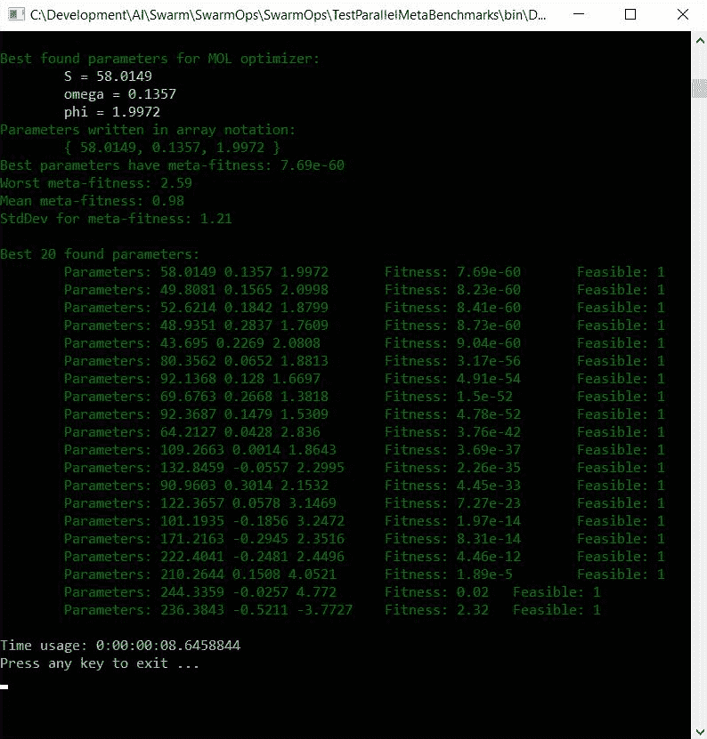

如您所见，程序的目标是输出最优化参数，以便您可以使用相同的功能优化来调整您的网络。

但如果你有一个不在 SwarmOps 中包含的函数，你能做什么呢？幸运的是，你可以定义一个自己的自定义问题并使用它。让我们看看它是如何使用的。首先，让我们看看`TestCustomProblem`项目，如下面的截图所示：

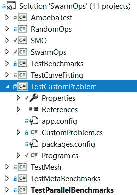

TestCustomProblem 项目

# 测试自定义问题

在我们创建和测试自己的自定义问题之前，让我们讨论一个更一般的问题。我们已经在本章前面概述了我们将什么定义为问题，但现在是在我们设计自己的基对象`Problem`之前展示代码的好时机。因此，让我们继续前进。

# 基础问题

以下是在每次优化中使用的基类`Problem`：

```py
public abstract class Problem
{
public Problem() : this(0, true)
{
}
public Problem(int maxIterations) : this(maxIterations, true)
{
}
public Problem(int maxIterations, bool requireFeasible)
{
MaxIterations = maxIterations;
RequireFeasible = requireFeasible;
}
```

执行优化的最大迭代次数如下：

```py
public int MaxIterations
```

以下命令检查解决方案是否可行（即它是否满足约束）：

```py
public bool RequireFeasible
```

然后，使用以下命令返回优化问题的名称：

```py
public abstract string Name
```

这包括一个包含参数名称的数组，如下所示：

```py
public virtual string[] ParameterName => null;
```

要降低搜索空间边界，请使用以下命令：

```py
public abstract double[] LowerBound
```

要增加上界搜索空间边界，请使用以下命令：

```py
public abstract double[] UpperBound
```

如果与搜索空间边界不同，则下界初始化边界如下表示：

```py
public virtual double[] LowerInit => LowerBound;
```

如果与搜索空间边界不同，则上界初始化边界如下表示：

```py
public virtual double[] UpperInit => UpperBound;
```

以下命令详细说明了可能的最大（即最差）适应度，如下所示：

```py
public virtual double MaxFitness => double.MaxValue;
```

以下命令详细说明了可能的最小（即最佳）适应度。如果使用元优化且假设适应度非负，这在所有我们元优化的问题中应该是大致相当的：

```py
public abstract double MinFitness
```

可接受的适应度值的阈值如下表示：

```py

public virtual double AcceptableFitness => MinFitness;
```

要返回问题的维度，即候选解中的参数数量，请使用以下命令：

```py
public abstract int Dimensionality
```

以下行检查梯度是否已实现：

```py
public virtual bool HasGradient => false;
```

以下命令计算并返回给定参数的适应度：

```py
public virtual double Fitness(double[] parameters)
{
return Fitness(parameters, true);
}
```

如果适应度变得高于`fitnessLimit()`（即更差），或者无法提高适应度，则预先终止适应度评估，如下所示：

```py
public virtual double Fitness(double[] parameters, double fitnessLimit){
return Fitness(parameters);
}
```

我们计算并返回给定参数的适应度。如果新候选解的可行性与旧候选解相同或更好，或者如果适应度变得高于`fitnessLimit()`且无法提高适应度，则预先终止适应度评估，如下所示：

```py
public virtual double Fitness(double[] parameters, double fitnessLimit, bool oldFeasible, bool newFeasible)
{
return Tools.BetterFeasible(oldFeasible, newFeasible)? Fitness(parameters, fitnessLimit) : Fitness(parameters);
}
```

按如下方式计算并返回给定参数的适应度：

```py
public virtual double Fitness(double[] parameters, bool feasible)
{
return Fitness(parameters, MaxFitness, feasible, feasible);
}
```

使用以下命令计算适应度函数的梯度，该命令与计算时间复杂度因子相关。例如，如果适应度计算的时间复杂度为 O(n)，则梯度计算的时间复杂度为 O(n*n)，则`return n.</returns>`：

```py
public virtual int Gradient(double[] x, ref double[] v)
{
throw new NotImplementedException();
}
```

使用以下命令强制约束并评估可行性。如果您不想强制约束，应调用`Feasible()`：

```py
public virtual bool EnforceConstraints(ref double[] parameters)
{
```

默认情况下，我们将候选解限制在搜索空间边界内，如下所示：

```py
Tools.Bound(ref parameters, LowerBound, UpperBound);
```

由于我们知道候选解现在在范围内，而这正是可行性所需的所有内容，我们在这里可以直接返回`true`。如下所示，`Feasible`是为了教育目的而调用的，因为大多数优化器都会调用`EnforceConstraints()`。

```py
return Feasible(parameters);
}
```

使用以下代码评估可行性（约束满足）：

```py
public virtual bool Feasible(double[] parameters)
{
return Tools.BetweenBounds(parameters, LowerBound, UpperBound);
}
```

以下是在优化运行开始时调用的：

```py
public virtual void BeginOptimizationRun()
```

以下是在优化运行结束时调用的：

```py
public virtual void EndOptimizationRun()
```

要返回是否允许优化继续，请使用以下代码：

```py
public virtual bool Continue(int iterations, double fitness, bool feasible)
{
return (iterations < MaxIterations &&!(fitness <= AcceptableFitness && (!RequireFeasible || feasible)));
}
}
```

# 创建自定义问题

现在我们已经解决了这些问题，让我们基于基类创建一个自定义问题。代码将类似于以下示例。

以下是一个二维 Rosenbrock 问题及其示例约束；其最优可行解似乎如下所示：

```py
<summary>
a ~ 1.5937
b ~ 2.5416
 </summary>
Class CustomProblem :Problem
{
public double GetA(double[] parameters)
{
return parameters[0];
}
public double GetB(double[] parameters)
{
return parameters[1];
}
```

在这里，基类覆盖了优化器的名称，如下所示：

```py
public override string Name => "CustomProblem";
```

问题的维度如下所示：

```py
public override int Dimensionality => 2;
double[] _lowerBound = { -100, -100 };
```

以下为下界搜索空间边界：

```py
public override double[] LowerBound => _lowerBound;
double[] _upperBound = { 100, 100 };
```

以下为上界搜索空间边界：

```py
public override double[] UpperBound => _upperBound;
```

下界初始化边界如下所示：

```py
public override double[] LowerInit => LowerBound;
```

上界初始化边界如下所示：

```py
public override double[] UpperInit => UpperBound;
```

使用以下行计算出此问题的可能最小适应度：

```py
public override double MinFitness => 0;
```

可接受的适应度阈值如下所示：

```py
public override double AcceptableFitness => 0.4;
string[] _parameterName = { "a", "b" };
```

问题的参数名称如下所示：

```py
public override string[] ParameterName => _parameterName;
```

要计算并返回给定参数的适应度，请使用以下代码：

```py
public override double Fitness(double[] x)
{
Debug.Assert(x != null && x.Length == Dimensionality);
double a = GetA(x);
double b = GetB(x);
double t1 = 1 - a;
double t2 = b - a * a;
return t1 * t1 + 100 * t2 * t2;
}
```

要强制和评估约束，请使用以下代码：

```py
public override bool EnforceConstraints(ref double[] x)
{
// Enforce boundaries.
SwarmOps.Tools.Bound(ref x, LowerBound, UpperBound);
return Feasible(x);
}
// Evaluate constraints.
public override bool Feasible(double[] x)
{
Debug.Assert(x != null && x.Length == Dimensionality);
double a = GetA(x);
double b = GetB(x);
// Radius.
double r = Math.Sqrt(a * a + b * b);
return ((r < 0.7) || ((r > 3) && (r < 5))) && (a < b * b);
}
}
}
```

# 我们的定制问题

现在，创建一个自定义问题对象，如下所示：

```py
static Problem Problem = new CustomProblem();
```

优化设置应如下所示：

```py
static readonly int NumRuns = 50;
static readonly int DimFactor = 4000;
static readonly int Dim = Problem.Dimensionality;
static readonly int NumIterations = DimFactor * Dim;
```

按如下方式创建优化器对象：

```py
static Optimizer Optimizer = new DE(Problem);
```

优化器的控制参数应如下所示：

```py
static readonly double[] Parameters = Optimizer.DefaultParameters;
```

将优化器包装在结果统计日志器中，如下所示：

```py
static readonly bool StatisticsOnlyFeasible = true;
static Statistics Statistics = new Statistics(Optimizer, StatisticsOnlyFeasible); 
```

再次用以下重复器包裹：

```py
static Repeat Repeat = new RepeatSum(Statistics, NumRuns);
static void Main(string[] args)
{
```

然后，初始化并行随机数生成器，如下所示：

```py
Globals.Random = new RandomOps.MersenneTwister();
```

然后，设置要执行的优化迭代次数的最大值，如下所示：

```py
Problem.MaxIterations = NumIterations;
```

使用以下代码创建一个适应度跟踪，以追踪优化的进度：

```py
int NumMeanIntervals = 3000;
FitnessTrace fitnessTrace = new FitnessTraceMean(NumIterations, NumMeanIntervals);
FeasibleTrace feasibleTrace = new FeasibleTrace(NumIterations, NumMeanIntervals, fitnessTrace);
```

然后，按照以下方式将适应度跟踪分配给优化器：

```py
Optimizer.FitnessTrace = feasibleTrace;
```

按照以下步骤进行优化：

```py
double fitness = Repeat.Fitness(Parameters);
if (Statistics.FeasibleFraction > 0)
{
```

使用以下行计算结果统计：

```py
Statistics.Compute();
```

使用以下代码输出最佳结果以及结果统计：

```py
Console.WriteLine("Best feasible solution found:", Color.Yellow);
Tools.PrintParameters(Problem, Statistics.BestParameters);
Console.WriteLine();
Console.WriteLine("Result Statistics:", Color.Yellow);
Console.WriteLine("\tFeasible: \t{0} of solutions found.", Tools.FormatPercent(Statistics.FeasibleFraction), Color.Yellow);
Console.WriteLine("\tBest Fitness: \t{0}", Tools.FormatNumber(Statistics.FitnessMin), Color.Yellow);
Console.WriteLine("\tWorst: \t\t{0}", Tools.FormatNumber(Statistics.FitnessMax), Color.Yellow);
Console.WriteLine("\tMean: \t\t{0}", Tools.FormatNumber(Statistics.FitnessMean), Color.Yellow);
Console.WriteLine("\tStd.Dev.: \t{0}", Tools.FormatNumber(Statistics.FitnessStdDev), Color.Yellow);
Console.WriteLine();
Console.WriteLine("Iterations used per run:", Color.Yellow);
Console.WriteLine("\tMean: {0}", Tools.FormatNumber(Statistics.IterationsMean), Color.Yellow);
}
else
{
Console.WriteLine("No feasible solutions found.", Color.Red);
}
}
```

当我们运行我们的程序时，它应该看起来像以下截图：

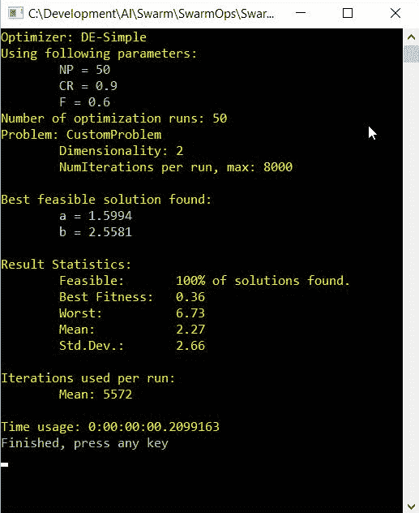

我们问题的输出结果

# 摘要

在本章中，我们学习了如何使用 SwarmOps 帮助我们优化函数优化的参数。我们学习了如何使用 SwarmOps 的内置函数，以及如何定义我们自己的函数。在下一章中，我们将继续学习图像检测，并使用伟大的开源包 TensorFlowSharp。

# 参考文献

+   J. Kennedy 和 R. Eberhart. 载于 IEEE 国际神经网络会议论文集，第 IV 卷，第 1942-1948 页，珀特，澳大利亚，1995 年

+   Y. Shi 和 R.C. Eberhart. 一种改进的粒子群优化器。载于 IEEE 国际进化计算会议论文集，第 69-73 页，安克雷奇，阿拉斯加，美国，1998 年。

+   J. Kennedy. 粒子群：知识的社交适应。载于 IEEE 国际进化计算会议论文集，印第安纳波利斯，美国，1997 年。

+   M.E.H Pederson 和 A.J. Chipperfield. 简化的粒子群优化。应用软计算，第 10 卷，第 618-628 页，2010 年。

+   简化粒子群优化。Pedersen, M.E.H. 和 Chipperfield, A.J. s.l. : 应用软计算，2010 年，第 10 卷，第 618-628 页。

+   最小化变量的度量方法。Davidon, W.C. 1, s.l. : SIAM 优化杂志，1991 年，第 1 卷，第 1-17 页。

+   “直接搜索”解决方案用于数值和统计问题。Hooke, R. 和 Jeeves, T.A. 2, s.l. : 计算机协会（ACM）杂志，1961 年，第 8 卷，第 212-229 页。

+   Pedersen, M.E.H. 和 Chipperfield, A.J. 局部单峰采样。s.l. : Hvass 实验室，2008\. HL0801。

+   差分进化 - 一种在连续空间上全局优化的简单而有效的方法。Storn, R. 和 Price, K. s.l. : 全球优化杂志，1997 年，第 11 卷，第 341-359 页。

+   粒子群优化。Kennedy, J. 和 Eberhart, R. 澳大利亚珀斯 : IEEE 国际神经网络会议，1995 年。

+   改进的粒子群优化器。Shi, Y. 和 Eberhart, R. 安克雷奇，阿拉斯加，美国 : IEEE 国际进化计算会议，1998 年。

+   粒子群：知识的社交适应。Kennedy, J. 印第安纳波利斯，美国 : IEEE 国际进化计算会议论文集，1997 年。
