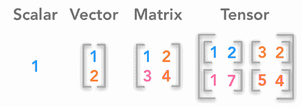
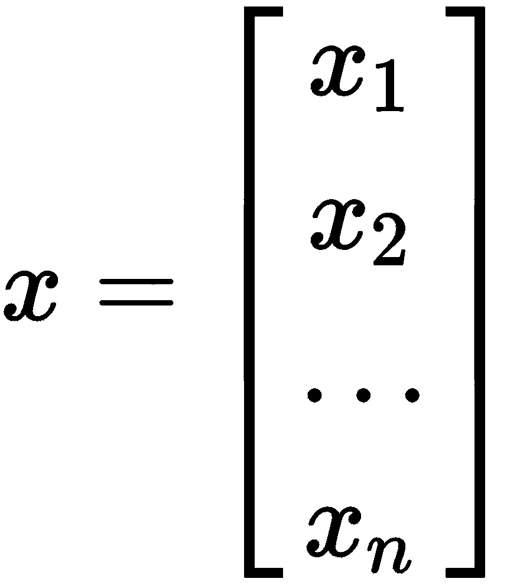
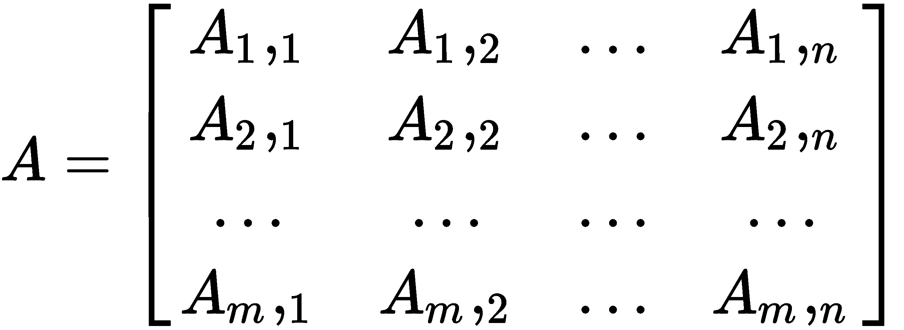
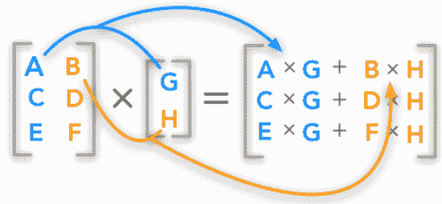
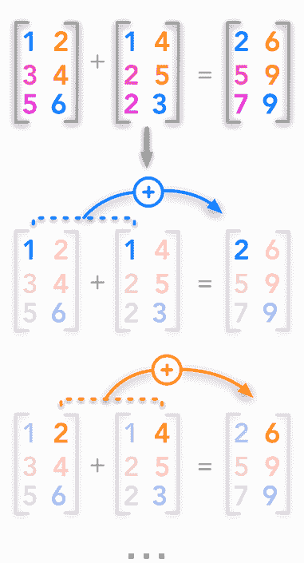
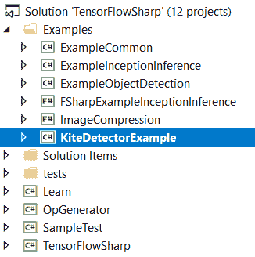
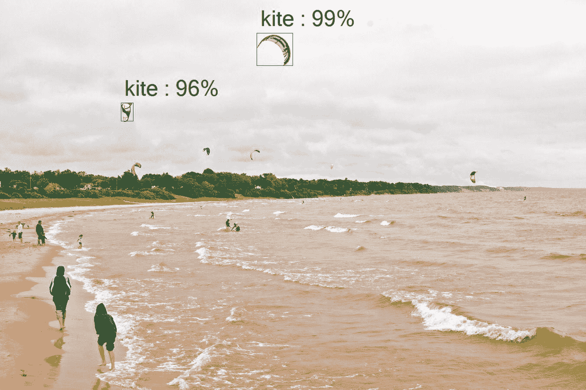
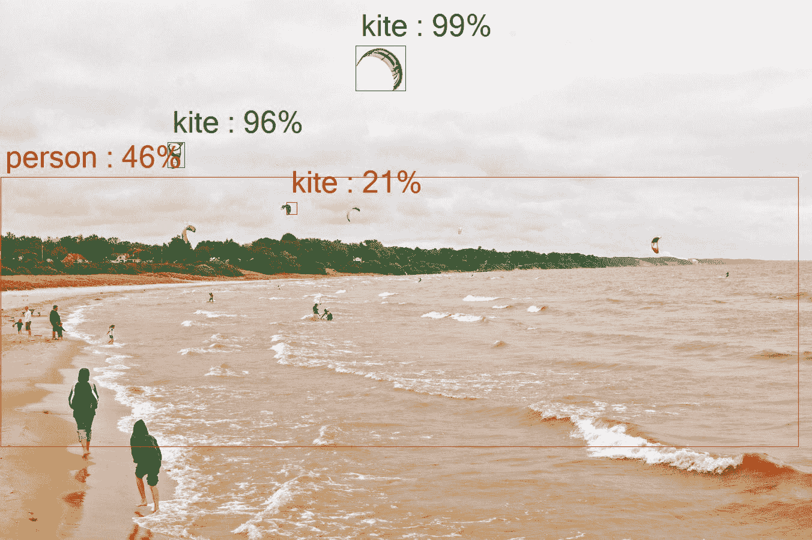
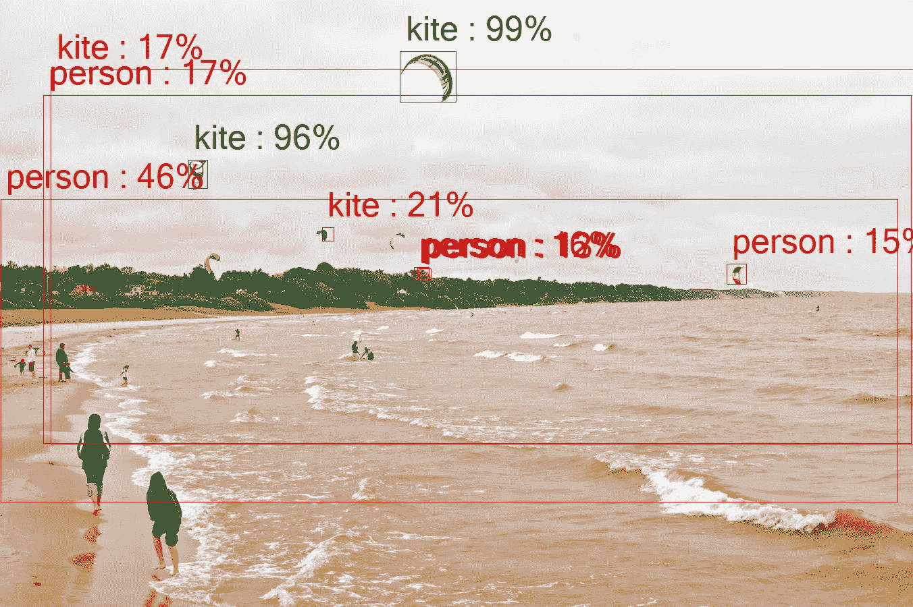
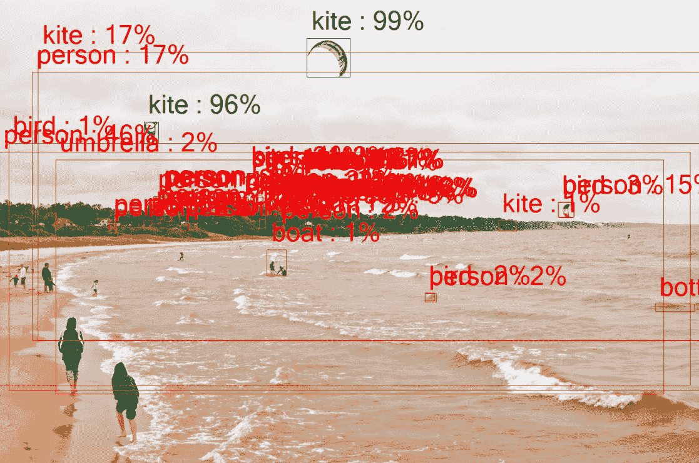

# 第十五章：使用 TensorFlowSharp 进行对象检测

在本章中，我们将向您介绍一个名为 TensorFlowSharp 的开源软件包。更具体地说，我们将使用 TensorFlow[1] 对象检测 API，这是一个基于 TensorFlow 的开源框架，它使得构建、训练和部署各种形式的对象检测模型变得容易。

对于不熟悉 TensorFlow 的人来说，以下是从 TensorFlow 网站摘录的内容[2]：

"TensorFlow 是一个用于高性能数值计算的开源软件库。其灵活的架构允许轻松地将计算部署到各种平台（如 CPU、GPU 和 TPU），从桌面到服务器集群，再到移动和边缘设备。最初由 Google Brain 团队的研究人员和工程师在 Google 人工智能组织内部开发，它提供了强大的机器学习和深度学习支持，并且灵活的数值计算核心被广泛应用于许多其他科学领域。"

TensorFlowSharp 为 TensorFlow 库提供了 .NET 绑定，这些绑定在此发布，以防您将来需要它们：[`github.com/tensorflow/tensorflow`](https://github.com/tensorflow/tensorflow)。

本章包含以下主题：

+   使用张量

+   TensorFlowSharp

+   开发自己的 TensorFlow 应用程序

+   检测图像

+   对象高亮的最小分数

# 技术要求

您需要具备使用 Microsoft Visual Studio 和 C# 进行 .NET 开发的基本知识。您需要从本书的网站下载本章的代码：TensorFlowSharp ([`github.com/migueldeicaza/TensorFlowSharp`](https://github.com/migueldeicaza/TensorFlowSharp))。

查看以下视频以查看代码的实际应用：[`bit.ly/2pqEiZ9`](http://bit.ly/2pqEiZ9)。

# 使用张量

让我们通过讨论张量究竟是什么来设定场景。为此，我们也应该稍微谈谈向量和矩阵。如果您已经熟悉这些，您可以跳过这一部分，但它是简短的，如果您已经了解矩阵和向量，谁知道呢，您可能会记得一些您已经忘记的东西！所以，无论如何，都请继续阅读！

现在，在我们交谈之前，让我向您展示一个可能使事情更容易可视化的图形：



向量是一个数字数组，正如您在这里可以看到的：



矩阵是一个 *n x m* 的数字网格，一个二维数组。只要大小兼容，我们可以在矩阵上执行各种操作，例如加法和减法：



如果我们愿意，我们可以相乘矩阵，如下所示：



并且矩阵可以相加，如下所示：



在这两种情况下，我们都在二维空间内工作。那么，如果我们的需求是在一个*n*维空间（其中*n > 2*）内工作，我们该怎么办？这就是张量发挥作用的地方。

张量基本上是一个矩阵，但它不是二维的（尽管它可以是）。它可能是一个三维矩阵（向量是一个张量，也是一个矩阵）或者是我们尚未学会如何可视化的某些极其疯狂的维度。为了展示张量的真正强大之处，一个张量可以在一个维度上是协变的，而在另一个维度上是反变的。张量的维度通常被称为其**秩**。

更正式地说，张量实际上是被称为**数学实体**的东西，它存在于一个结构中，并与该结构内的其他实体相互作用。如果一个实体发生了变换，张量必须遵守所谓的**相关变换规则**。这正是矩阵与张量之间的区别。张量必须允许实体在变换发生时移动。

现在我们已经把所有这些都整理好了，让我们看看我们如何通过一些示例代码来处理张量：

```py
void BasicVariables ()
{
Console.WriteLine ("Using placerholders");
using (var g = new TFGraph ())
{
var s = new TFSession (g);
```

注意变量类型必须与`TFTensor`中的转换匹配：

```py
var var_a = g.Placeholder (TFDataType.Int16);
var var_b = g.Placeholder (TFDataType.Int16);
```

我们将要进行加法和乘法操作：

```py
var add = g.Add (var_a, var_b);
var mul = g.Mul (var_a, var_b);
varrunner = s.GetRunner ();
```

让我们相加两个张量（这是之前提到的变量类型转换）：

```py
runner.AddInput (var_a, new TFTensor ((short)3));
runner.AddInput (var_b, new TFTensor ((short)2));
Console.WriteLine ("a+b={0}", runner.Run (add).GetValue ());
```

现在我们来乘以两个张量：

```py
runner = s.GetRunner ();
runner.AddInput (var_a, new TFTensor ((short)3));
runner.AddInput (var_b, new TFTensor ((short)2));
Console.WriteLine ("a*b={0}", runner.Run (mul).GetValue ());
}
}
```

# TensorFlowSharp

在我们讨论并向您展示了张量之后，让我们看看我们通常会如何使用 TensorFlowSharp API 本身。

您的应用程序通常会创建一个图（`TFGraph`），在那里设置操作，然后从它创建一个会话（`TFSession`）。然后这个会话将使用会话运行器来设置输入和输出并执行管道。让我们看看一个快速示例，看看它可能如何流动：

```py
using(var graph = new TFGraph ())
{
graph.Import (File.ReadAllBytes ("MySavedModel"));
var session = new TFSession (graph);
var runner = session.GetRunner ();
runner.AddInput (graph ["input"] [0], tensor);
runner.Fetch (graph ["output"] [0]);
var output = runner.Run ();
```

从输出中获取结果：

```py
TFTensor result = output [0];
}
```

在您不需要独立设置图的情况下，会话会自动为您创建一个。以下示例显示了如何使用 TensorFlow 计算两个数字的和。我们将让会话自动为我们创建图：

```py
using (var session = new TFSession())
{
var graph = session.Graph;
var a = graph.Const(2);
var b = graph.Const(3);
Console.WriteLine("a=2 b=3");
```

添加两个常数：

```py
var addingResults = session.GetRunner().Run(graph.Add(a, b));
var addingResultValue = addingResults.GetValue();
Console.WriteLine("a+b={0}", addingResultValue);
```

乘以两个常数：

```py
var multiplyResults = session.GetRunner().Run(graph.Mul(a, b));
var multiplyResultValue = multiplyResults.GetValue();
Console.WriteLine("a*b={0}", multiplyResultValue);
}
```

# 开发自己的 TensorFlow 应用程序

现在我们已经向您展示了一些初步的代码示例，让我们继续我们的示例项目——如何从控制台应用程序中使用 TensorFlowSharp 检测图像中的对象。这段代码足够简单，您可以将其添加到您的解决方案中，如果您愿意的话。只需调整输入和输出名称，也许允许用户调整超参数，然后就可以开始了！

要运行此解决方案，您应该已从网站下载此章节的源代码并在 Microsoft Visual Studio 中打开。请按照以下说明下载本书的代码：



在我们深入代码之前，让我们讨论一个非常重要的变量：

```py
private static double MIN_SCORE_FOR_OBJECT_HIGHLIGHTING = 0.5;
```

这个变量是我们识别和突出显示基础图像中物体的阈值。在 0.5 时，检测可靠性和准确性之间有合理的同步性。随着我们降低这个数字，我们会发现识别到的物体更多，然而，识别的准确性开始下降。我们降得越低，错误识别物体的可能性就越大。我们会识别它们，但它们可能不是我们想要的，您很快就会看到。

现在，让我们快速看一下这个样本的主要功能，并了解一下它在做什么：

```py
static void Main(string[] args)
{
```

加载默认模型和数据：

```py
_catalogPath = DownloadDefaultTexts(_currentDir);
_modelPath = DownloadDefaultModel(_currentDir);
_catalog = CatalogUtil.ReadCatalogItems(_catalogPath);
var fileTuples = new List<(string input, string output)>() { (_input, _output) };
string modelFile = _modelPath;
```

让我们在这里创建我们的 TensorFlowSharp 图对象：

```py
using (var graph = new TFGraph())
{
```

将所有数据读入我们的图对象：

```py
graph.Import(new TFBuffer(File.ReadAllBytes(modelFile)));
```

创建一个新的 TensorFlowSharp 会话来工作：

```py
using (var session = new TFSession(graph))
{
Console.WriteLine("Detecting objects", Color.Yellow);
foreach (var tuple in fileTuples)
{
```

从我们的图像文件创建我们的张量：

```py
var tensor = ImageUtil.CreateTensorFromImageFile(tuple.input, TFDataType.UInt8);
var runner = session.GetRunner();
runner.AddInput(graph["image_tensor"][0], tensor).Fetch(graph["detection_boxes"][0],graph["detection_scores"][0],graph["detection_classes"][0],graph["num_detections"][0]);var output = runner.Run();
var boxes = (float[,,])output[0].GetValue();
var scores = (float[,])output[1].GetValue();
var classes = (float[,])output[2].GetValue();
Console.WriteLine("Highlighting object...", Color.Green);
```

在处理完所有变量后，让我们在我们的样本图像上识别并绘制我们检测到的物体的框：

```py
DrawBoxesOnImage(boxes, scores, classes, tuple.input, tuple.output, MIN_SCORE_FOR_OBJECT_HIGHLIGHTING);
Console.WriteLine($"Done. See {_output_relative}. Press any key", Color.Yellow);
Console.ReadKey();
}
}
}
```

好吧，对于一个简单的操作来说，这一切都很好，但如果我们真正需要做的是一个更复杂的操作，比如说乘法一个矩阵呢？我们可以这样做：

```py
void BasicMultidimensionalArray ()
{
```

创建我们的 `TFGraph` 对象：

```py
using (var g = new TFGraph ())
{
```

创建我们的 `TFSession` 对象：

```py
var s = new TFSession (g);
```

为我们的乘法变量创建一个占位符：

```py
var var_a = g.Placeholder (TFDataType.Int32);
var mul = g.Mul (var_a, g.Const (2));
```

进行乘法：

```py
var a = new int[,,] { { { 0, 1 } , { 2, 3 } } , { { 4, 5 }, { 6, 7 } } };
var result = s.GetRunner ().AddInput (var_a, a).Fetch (mul).Run () [0];
```

测试结果：

```py
var actual = (int[,,])result.GetValue ();
var expected = new int[,,] { { {0, 2} , {4, 6} } , { {8, 10}, {12, 14} } };
Console.WriteLine ("Actual: " + RowOrderJoin (actual));
Console.WriteLine ("Expected: " + RowOrderJoin (expected));
Assert(expected.Cast<int> ().SequenceEqual (actual.Cast<int> ()));
};
}
private static string RowOrderJoin(int[,,] array) => string.Join (", ", array.Cast<int> ());
```

# 检测图像

现在是时候转向一个真实的项目了。在这个例子中，我们将使用我们的基础图像（如下所示）并让计算机检测图像中的物体。如您所见，照片中有几个人的实例和风筝。这是所有 TensorFlowSharp 示例中使用的相同基础图像。您将看到随着我们改变我们的最小允许阈值，检测和突出显示的进展如何变化。

这里是我们的基础样本图像，一张照片：


# 物体突出显示的最小分数

我们之前谈到了突出显示的最小分数。让我们通过查看当我们使用不同的最小分数进行物体突出显示时会发生什么来确切了解这意味着什么。让我们从一个值为 0.5 的值开始，看看在我们的照片中检测到了哪些物体：



如您所见，我们已选择了两个风筝，并且每个风筝都附有一个相当好的准确度分数。绿色框表示高置信度目标。不错。但还有很多其他物体我认为我们应该检测到。还有几个风筝和几个人应该很容易检测到。为什么我们没有这样做呢？

如果我们将最小阈值从 0.5 降低到 0.3 呢？让我们看看结果：



好吧，如您所见，我们确实检测到了其他风筝，尽管由于它们在照片中的距离，置信度分数较低，但我们更重要的是，现在已经开始识别人。任何用红色画出的框都是低置信度目标，绿色是高置信度，黄色是中等置信度。

现在，如果我们再进一步，将我们的最小阈值降低到 0.1 呢？如果我们的模式遵循，我们应该能够识别更多的图像，当然，置信度分数会较低。

如果你看看照片的以下版本，你会发现我们确实选择了更多的对象。不幸的是，正如我们所怀疑的，准确性大幅下降，风筝被误认为是人，在一种情况下，一棵树也被误认为是人。但积极的方面是，我们的识别会随着我们调整阈值而改变。这能在更高级的应用中自适应地进行吗？绝对可以，这正是我想培养你思考的方式，以便你可以丰富代码并创造出真正震撼的应用：



好的，这里有一个我认为你会喜欢的最终示例。在这个例子中，我将最小阈值降低到了 0.01。如果我们猜测正确，屏幕现在应该会亮起低置信度目标。让我们看看我们是否猜对了：



看起来我们的猜测是正确的。我知道屏幕上的标记很混乱，但重点是我们的目标检测增加了，尽管是对于较低的置信度阈值。

你现在应该花些时间考虑这种技术的所有激动人心的应用。从人脸和物体检测到自动驾驶汽车，张量今天无处不在，这是你应该熟悉的东西。

# 摘要

TensorFlowSharp 是一个令人兴奋的开源项目，它使得使用张量和 TensorFlow 变得非常容易。在本章中，我们向您展示了张量是什么以及如何使用它们。我们还构建了一个功能强大的示例应用程序，允许您在图片中检测和标记图像。

在下一章中，我们将学习关于长短期记忆网络以及如何使用它们来增强您的应用程序和流程。

# 参考文献

+   [1]"现代卷积目标检测器的速度/精度权衡。"Huang J, Rathod V, Sun C, Zhu M, Korattikara A, Fathi A, Fischer I, Wojna Z, Song Y, Guadarrama S, Murphy K, CVPR 2017

+   [2] [www.tensorflow.org](http://www.tensorflow.org)

+   [3] JEAN, Hadrien. *深度学习书籍系列 2.1 标量、向量、矩阵和张量* 网络博客文章。[hadrienj.github.io](http://hadrienj.github.io). 26 Mar. 2018.
