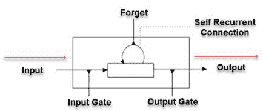
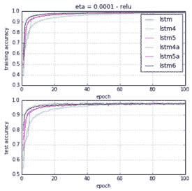
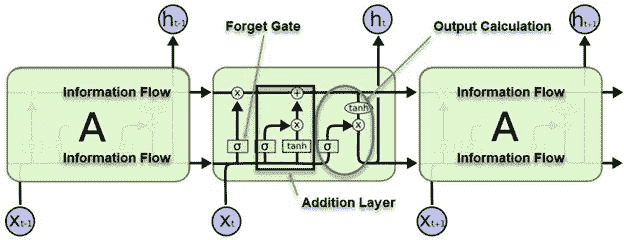
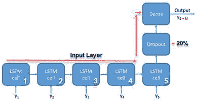
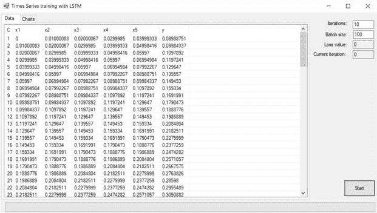
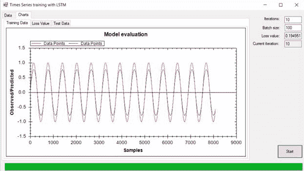
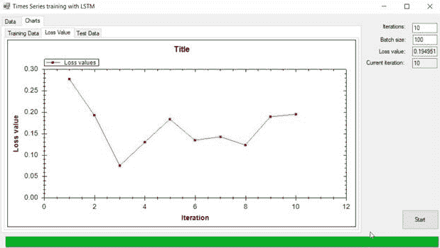
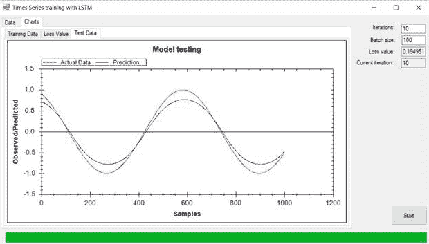
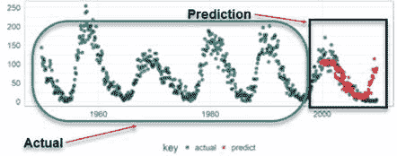

# 使用 CNTK 进行时间序列预测和 LSTM

本章致力于帮助你更好地了解 Microsoft 认知工具包，或 CNTK。本章中包含的示例灵感来源于 CNTK 106 的 Python 版本：**A 部分 – 使用 LSTM 进行时间序列预测（基础）**。作为 C#开发者，我们不会使用 Python 代码（尽管有几种方法可以实现这一点），因此我们制作了自己的 C#示例来模仿那个教程。为了使我们的示例简单直观，我们将使用正弦函数来预测未来的时间序列数据。具体来说，我们将使用**长短期记忆循环神经网络**，有时称为**LSTM-RNN**或简称为**LSTM**。LSTM 有很多变体；我们将使用原始版本。

在本章中，我们将涵盖以下主题：

+   LSTM

+   张量

+   静态和动态轴

+   加载数据集

+   绘制数据

+   创建模型

+   创建小批量

+   以及更多...

# 技术要求

你需要具备使用 Microsoft Visual Studio 和 C#进行.NET 开发的基本知识。你需要从本书的网站上下载本章的代码。

查看以下视频以查看代码的实际应用：[`bit.ly/2xtDTto`](http://bit.ly/2xtDTto)。

# 长短期记忆

**长短期记忆**（**LSTM**）网络是一种特殊的循环神经网络。它们能够保留它们过去遇到的事情的长期记忆。在 LSTM 中，每个神经元都被称为**记忆单元**的东西所取代。这个记忆单元在适当的时候被激活和去激活，实际上就是所谓的**循环自连接**。

如果我们退一步，看看常规循环网络的反向传播阶段，梯度信号可能会被神经元之间隐藏层中突触的权重矩阵多次相乘。这究竟意味着什么呢？嗯，这意味着这些权重的幅度可以对学习过程产生更强的影响。这既有好的一面，也有不好的一面。

如果权重很小，可能会导致所谓的**梯度消失**，在这种情况下，信号变得非常小，以至于学习速度减慢到难以忍受，甚至更糟，完全停止。另一方面，如果权重很大，这可能会导致信号变得非常大，导致学习发散而不是收敛。这两种情况都是不希望的，但可以通过 LSTM 模型中的一个项目来处理，即**记忆单元**。现在让我们来谈谈这个记忆单元。

一个记忆单元有四个不同的部分。它们是：

+   输入门，具有恒定的权重 1.0

+   自循环连接神经元

+   遗忘门，允许细胞记住或忘记其先前状态

+   输出门，允许记忆单元状态对其他神经元产生影响（或没有影响）

让我们来看看这个，并尝试将其全部整合起来：



存储单元

# LSTM 变体

LSTM 网络有许多变体。其中一些变体包括：

+   门控循环神经网络

+   LSTM4

+   LSTM4a

+   LSTM5

+   LSTM5a

+   LSMT6



训练和测试准确度，σ = relu，η = 1e −4

这些变体中的一种，LSTM 的一个稍微更戏剧化的版本，被称为门控循环单元，或 GRU/GRNN。它将 LSTM 的忘记门和输入门合并成一个称为**更新门**的单个门。这使得它比标准的 LSTM 更简单，并且越来越受欢迎。

这里是一个 LSTM 的样子：



LSTM

如您所见，LSTM 中有各种记忆*门*，而 RNN 没有。这使得它能够轻松地保留长期和短期记忆。因此，如果我们想要理解文本并需要向前或向后查看时间，LSTM 正是为此而生的场景。让我们暂时谈谈不同的门。正如我们提到的，有三个。让我们用以下短语来解释每个是如何工作的。

*Bob 住在纽约市。John 整天打电话与人交谈，并乘坐火车通勤。*

**忘记门**：当我们到达单词 City 之后的时期，忘记门意识到可能存在上下文的变化。结果，主题 Bob 被遗忘，主题所在的位置现在为空。当句子转向 John 时，主题现在是 John。这个过程是由忘记门引起的。

**输入门**：所以重要的信息是 Bob 住在纽约市，John 整天乘坐火车并与人们交谈。然而，他通过电话与人交谈的事实并不那么重要，可以忽略。添加新信息的过程是通过输入门完成的。

**输出门**：如果我们有一个句子 *Bob 是一位伟大的人。我们向他致敬 ____*。在这个句子中，我们有一个空格，有很多可能性。我们知道的是，我们将向这个空格中的任何东西致敬，这是一个描述名词的动词。因此，我们可以安全地假设这个空格将被名词填充。所以，一个好的候选者可以是 *Bob*。选择从当前细胞状态中提取哪些信息有用并将其显示为输出的工作是由输出门完成的。

# LSTM 的应用

以下只是 LSTM 堆叠网络的几个应用示例：

+   语音识别

+   手写识别

+   时间序列预测和异常检测

+   业务流程管理

+   机器人控制

+   以及更多...

时间序列预测本身可以对企业的底线产生重大影响。我们可能需要预测某些大额支出将在哪一天、哪个季度或哪一年发生。我们可能还会对我们的业务相对于时间序列的消费者价格指数表示关注。预测精度的提高可以肯定地改善我们的底线。

# CNTK 术语

理解 Microsoft CNTK 工具包中使用的某些术语非常重要。现在让我们看看这些术语中的一些：

+   **张量**：CNTK 的所有输入、输出和参数都组织为张量。还应注意的是，*小批量*也是张量。

+   **秩**：每个张量都有一个秩。标量是秩为 0 的张量，向量是秩为 1 的张量，矩阵是秩为 2 的张量。

+   **静态轴**：在 2 中列出的尺寸被称为**轴**。每个张量都有**静态**和**动态**轴。静态轴在其整个生命周期中长度保持不变。

+   **动态轴**：然而，动态轴的长度可以从实例到实例变化。通常在呈现每个小批量之前不知道它们的长度。此外，它们可能是有序的。

+   **小批量**：小批量也是一个张量。它有一个动态轴，称为**批量轴**。这个轴的长度可以从一个小批量变化到另一个小批量。

在撰写 CNTK 时，支持一个额外的单动态轴，也称为**序列轴**。这个轴允许用户以更抽象、更高级的方式处理序列。序列的美丽之处在于，每当对序列执行操作时，CNTK 工具包都会进行类型检查操作以确定安全性：



序列轴

# 我们的示例

因此，现在我们已经介绍了 CNTK 和 LSTM 的一些基础知识，是时候深入我们的示例应用程序了。您可以在本书附带的代码中找到这个项目。在继续之前，请确保您已经在 Microsoft Visual Studio 中将其打开。如果您需要进一步说明，可以参考即将到来的*代码*部分。

我们正在创建的示例使用 Microsoft CNTK 作为后端，并将使用简单的正弦波作为我们的函数。正弦波之前已经绘制过，并且因其广为人知而被选用。

下面是我们示例应用程序的截图：



主页 – 训练数据

上述截图显示了我们的主屏幕，显示了我们的正弦波数据点，我们的训练数据。目标是使我们的训练数据（蓝色）在形状上尽可能接近红色，如下所示：



主页 - 图表

以下屏幕允许我们绘制我们的损失函数：



绘制损失值（损失值选项卡）

以下屏幕允许我们绘制观察值与预测值。目标是使预测值（蓝色）尽可能接近实际值（以红色显示）：



在测试数据选项卡中绘制观察值与预测值

# 编写我们的应用程序

现在让我们看看我们的代码。为此，您需要参考随本书附带的`LSTMTimeSeriesDemo`项目。在 Microsoft Visual Studio 中打开项目。所有必需的 CNTK 库已经在此项目中为您引用，并包含在 Debug/bin 目录中。我们将使用的主要库是`Cntk.Core.Managed`。对于这个例子，我们使用的是 2.5.1 版本，以防您想知道！

# 加载数据和图表

为了加载数据和图表，我们有两个主要函数，我们将

使用；`LoadTrainingData()`和`PopulateGraphs()`。非常直接，对吧？：

```py
private void Example_Load(object sender, EventArgs e)
{
 LoadTrainingData(DataSet?["features"].train, DataSet?["label"].train);
PopulateGraphs(DataSet?["label"].train, DataSet?["label"].test);
}
```

# 加载训练数据

对于这个例子，我们只是即时创建我们的测试和训练数据。`LoadTrainingData()`函数正是如此：

```py
private void LoadTrainingData(float[][] X, float[][] Y)
 {
 //clear the list first
 listView1.Clear();
 listView1.GridLines = true;
 listView1.HideSelection = false;
 if (X == null || Y == null )
 return;

 //add features
 listView1.Columns.Add(new ColumnHeader() {Width=20});
 for (int i=0; i < inDim ;i++)
 {
 var col1 = new ColumnHeader
 {
 Text = $"x{i + 1}",
 Width = 70
 };
 listView1.Columns.Add(col1);
 }

 //Add label
 var col = new ColumnHeader
 {
 Text = $"y",
 Width = 70
 };
 listView1.Columns.Add(col);
for (int i = 0; i < 100; i++)
 {
 var itm = listView1.Items.Add($"{(i+1).ToString()}");
 for (int j = 0; j < X[i].Length; j++)
 itm.SubItems.Add(X[i][j].ToString(CultureInfo.InvariantCulture));
 itm.SubItems.Add(Y[i][0].ToString(CultureInfo.InvariantCulture));
 }
 }
```

# 填充图表

此函数使用训练数据和测试数据填充图表：

```py
private void PopulateGraphs(float[][] train, float[][] test)
 {
 if (train == null)
 throw new ArgumentException("TrainNetwork parameter cannot be null");
 if (test == null)
 throw new ArgumentException("test parameter cannot be null");
for (int i=0; i<train.Length; i++)
trainingDataLine?.AddPoint(new PointPair(i + 1, train[i][0]));
for (int i = 0; i < test.Length; i++)
testDataLine?.AddPoint(new PointPair(i + 1, test[i][0]));
zedGraphControl1?.RestoreScale(zedGraphControl1.GraphPane);
zedGraphControl3?.RestoreScale(zedGraphControl3.GraphPane);
}
```

# 分割数据

使用此函数，我们模仿了 Python 等框架，这使得从主数据集中分割训练数据和测试数据变得非常容易。我们已创建了自己的函数来完成相同的事情：

```py
static (float[][] train, float[][] valid, float[][] test) SplitDataForTrainingAndTesting(float[][] data, float valSize = 0.1f, float testSize = 0.1f)
{
 if (data == null)
 throw new ArgumentException("data parameter cannot be null");
//Calculate the data needed
var posTest = (int)(data.Length * (1 - testSize));
 var posVal = (int)(posTest * (1 - valSize));
 return (
 data.Skip(0).Take(posVal).ToArray(), 
 data.Skip(posVal).Take(posTest - posVal).ToArray(), 
data.Skip(posTest).ToArray());
}
```

# 运行应用程序

一旦我们点击**运行**按钮，我们将执行以下概述的函数。我们首先确定用户想要使用的迭代次数以及批次大小。在设置进度条和一些内部变量之后，我们调用我们的`TrainNetwork()`函数：

```py
private void btnStart_Click(object sender, EventArgs e)
{
int iteration = int.Parse(textBox1.Text);
 batchSize = int.Parse(textBox2.Text);
progressBar1.Maximum = iteration;
progressBar1.Value = 1;
inDim = 5;
 ouDim = 1;
 int hiDim = 1;
 int cellDim = inDim;
Task.Run(() => TrainNetwork(DataSet, hiDim, cellDim, iteration, batchSize, ReportProgress));
}
```

# 训练网络

在每个神经网络中，我们必须训练网络，以便它能够识别我们提供给它的任何内容。我们的`TrainNetwork()`函数正是如此：

```py
private void TrainNetwork(Dictionary dataSet, int hiDim, int cellDim, int iteration, int batchSize, Action<Trainer, Function, int, DeviceDescriptor> progressReport)
{
Split the dataset on TrainNetwork into validate and test parts
var featureSet = dataSet["features"];
var labelSet = dataSet["label"];
```

创建模型，如下所示：

```py
var feature = Variable.InputVariable(new int[] { inDim }, DataType.Float, featuresName, null, false /*isSparse*/);
 var label = Variable.InputVariable(new int[] { ouDim }, DataType.Float, labelsName, new List<CNTK.Axis>() { CNTK.Axis.DefaultBatchAxis() }, false);
 var lstmModel = LSTMHelper.CreateModel(feature, ouDim, hiDim, cellDim, DeviceDescriptor.CPUDevice, "timeSeriesOutput");
 Function trainingLoss = CNTKLib.SquaredError(lstmModel, label, "squarederrorLoss");
 Function prediction = CNTKLib.SquaredError(lstmModel, label, "squarederrorEval");
```

准备训练：

```py
TrainingParameterScheduleDouble learningRatePerSample = new TrainingParameterScheduleDouble(0.0005, 1);
TrainingParameterScheduleDouble momentumTimeConstant = CNTKLib.MomentumAsTimeConstantSchedule(256);
IList<Learner> parameterLearners = new List<Learner>()
{
Learner.MomentumSGDLearner(lstmModel?.Parameters(), learningRatePerSample, momentumTimeConstant, /*unitGainMomentum = */true)
};
```

创建训练器，如下所示：

```py
       var trainer = Trainer.CreateTrainer(lstmModel, trainingLoss, prediction, parameterLearners);
```

训练模型，如下所示：

```py
for (int i = 1; i <= iteration; i++)
{
```

获取下一个 minibatch 数量的数据，如下所示：

```py
foreach (var batchData infrom miniBatchData in GetNextDataBatch(featureSet.train, labelSet.train, batchSize)
let xValues = Value.CreateBatch(new NDShape(1, inDim), miniBatchData.X, DeviceDescriptor.CPUDevice)
let yValues = Value.CreateBatch(new NDShape(1, ouDim), miniBatchData.Y, DeviceDescriptor.CPUDevice)
select new Dictionary<Variable, Value>
{
{ feature, xValues },
{ label, yValues }})
{
```

训练，如下所示：

```py
trainer?.TrainMinibatch(batchData, DeviceDescriptor.CPUDevice);
} 
if (InvokeRequired)
{
Invoke(new Action(() => progressReport?.Invoke(trainer, lstmModel.Clone(), i, DeviceDescriptor.CPUDevice)));
}
else
{
progressReport?.Invoke(trainer, lstmModel.Clone(), i, DeviceDescriptor.CPUDevice);
}
}
}
```

# 创建模型

要创建一个模型，我们将构建一个包含**长短期记忆**（**LSTM**）细胞的单向循环神经网络，如下所示：

```py
public static Function CreateModel(Variable input, int outDim, int LSTMDim, int cellDim, DeviceDescriptor device, string outputName)
{
Func<Variable, Function> pastValueRecurrenceHook = (x) => CNTKLib.PastValue(x);
```

为每个输入变量创建一个 LSTM 细胞，如下所示：

```py
Function LSTMFunction = LSTMPComponentWithSelfStabilization<float>(input,  new[] { LSTMDim }, new[] { cellDim }, pastValueRecurrenceHook, pastValueRecurrenceHook, device)?.Item1;
```

在创建 LSTM 序列之后，返回最后一个细胞以便继续生成网络，如下所示：

```py
pre>       Function lastCell = CNTKLib.SequenceLast(LSTMFunction);
```

实现 dropout 为 20%，如下所示：

```py
       var dropOut = CNTKLib.Dropout(lastCell,0.2, 1);
```

在输出之前创建最后一个密集层，如下所示：

```py
 return FullyConnectedLinearLayer(dropOut, outDim, device, outputName);
}
```

# 获取下一个数据批次

我们以可枚举的方式获取下一批数据。我们首先验证参数，然后调用`CreateBatch()`函数，该函数列在此函数之后：

```py
private static IEnumerable<(float[] X, float[] Y)> GetNextDataBatch(float[][] X, float[][] Y, int mMSize)
{
if (X == null)
 throw new ArgumentException("X parameter cannot be null");
 if (Y == null)
 throw new ArgumentException("Y parameter cannot be null");
for (int i = 0; i <= X.Length - 1; i += mMSize)
 {
 var size = X.Length - i;
 if (size > 0 && size > mMSize)
 size = mMSize;
var x = CreateBatch(X, i, size);
 var y = CreateBatch(Y, i, size);
yield return (x, y);
 }
}
```

# 创建数据批次

给定一个数据集，此函数将创建用于在更可管理的段中遍历整个数据集的*批次*。您可以从之前显示的`GetNextDataBatch()`函数中看到它是如何被调用的：

```py
internal static float[] CreateBatch(float[][] data, int start, int count)
{
 var lst = new List<float>();
 for (int i = start; i < start + count; i++)
 {
 if (i >= data.Length)
 break;
lst.AddRange(data[i]);
}
return lst.ToArray();
}
```

# LSTM 的表现如何？

我们测试了 LSTM 对太阳黑子数据预测的预测和历史值，这是深度学习中的一个非常著名的测试。正如您所看到的，红色曲线，即我们的预测，与趋势完全融合，这是一个非常鼓舞人心的迹象：



预测与性能比较

# 摘要

在本章中，我们学习了长短期记忆循环神经网络。我们编写了一个示例应用程序，展示了如何使用它们，并且在过程中学习了一些基本术语。我们涵盖了诸如 LSTM、张量、静态和动态轴、加载数据集、绘制数据、创建模型和创建小批量等主题。在我们下一章中，我们将访问 LSTM 网络的一个非常近的表亲：门控循环单元。

# 参考文献

+   Hochreiter, S., & Schmidhuber, J. (1997). 长短期记忆。神经计算，第 9 卷，第 8 期，第 1735-1780 页。

+   Gers, F. A., Schmidhuber, J., & Cummins, F. (2000). 学习遗忘：使用 LSTM 的持续预测。神经计算，第 12 卷，第 10 期，第 2451-2471 页。

+   Graves, Alex. 使用循环神经网络进行监督序列标注。Springer, 第 385 卷，2012 年。

+   Y. Bengio, P. Simard, 和 P. Frasconi. 使用梯度下降学习长期依赖性是困难的。IEEE 神经网络 Transactions，第 5 卷，1994 年。

+   F. Chollet. Keras github.

+   J. Chung, C. Gulcehre, K. Cho, 和 Y. Bengio. 对序列建模的门控循环神经网络的实证评估，2014 年。

+   S. Hochreiter 和 J. Schmidhuber. 长短期记忆。神经计算，第 9 卷，第 1735-1780 页，1997 年。

+   Q. V. Le, N. Jaitly, 和 H. G. E. 矩形线性单元循环网络的一个简单初始化方法。2015 年。

+   Y. Lu 和 F. Salem. 长短期记忆（LSTM）循环神经网络中的简化门控。arXiv:1701.03441，2017 年。

+   F. M. Salem. 基本循环神经网络模型。arXiv 预印本 arXiv:1612.09022，2016 年。

+   F. M. Salem. 门控循环神经网络的参数化减少。MSU 备忘录，2016 年 11 月 7 日。
