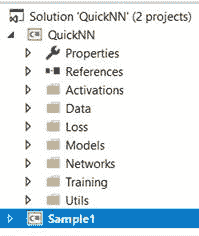
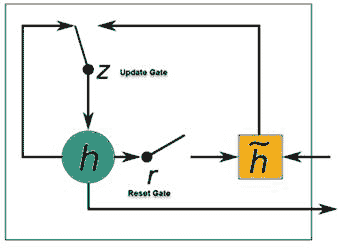
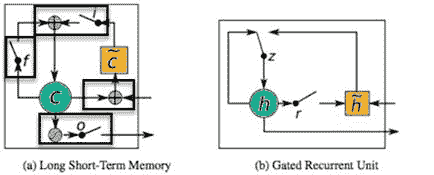
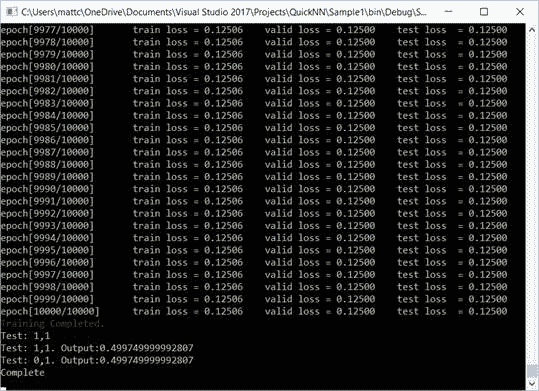
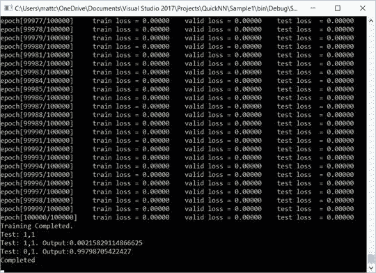

# 与 LSTMs、RNNs 和前馈网络相比的 GRUs

在本章中，我们将讨论**门控循环单元**（**GRU**）。我们还将将其与我们在上一章中学到的 LSTMs 进行比较。正如您所知，LSTMs 自 1987 年以来一直存在，并且是目前在深度学习 NLP 中最广泛使用的模型之一。然而，GRUs 首次在 2014 年提出，是 LSTMs 的一个更简单的变体，具有许多相同的属性，训练更容易、更快，并且通常具有更少的计算复杂度。

在本章中，我们将学习以下内容：

+   GRUs

+   GRU 与 LSTM 的不同之处

+   如何实现 GRU

+   GRU、LTSM、RNN 和前馈比较

+   网络差异

# 技术要求

您需要具备使用 Microsoft Visual Studio 和 C#进行.NET 开发的基本知识。您需要从本书网站下载本章的代码。

查看以下视频以查看代码的实际应用：[`bit.ly/2OHd7o5`](http://bit.ly/2OHd7o5)。

# QuickNN

要跟随代码，您应该在 Microsoft Visual Studio 中打开 QuickNN 解决方案。我们将使用此代码来详细解释一些细微之处以及不同网络之间的比较。以下是您应该加载的解决方案：



Solution

# 理解 GRUs

GRUs 是长短期记忆循环神经网络的一个分支。LSTM 和 GRU 网络都有额外的参数来控制它们内部记忆何时以及如何更新。两者都可以捕捉序列中的长短期依赖关系。然而，GRU 网络涉及的参数比它们的 LSTM 表亲要少，因此训练速度更快。GRU 学习如何使用其重置和遗忘门来做出长期预测，同时执行记忆保护。让我们看看一个简单的 GRU 图示：



GRU

# LSTM 和 GRU 之间的差异

虽然 LSTM 和 GRU 之间有一些细微的区别，但坦白说，它们之间的相似之处要多于不同之处！首先，GRU 比 LSTM 少一个门。如图所示，LSTM 有一个输入门、一个遗忘门和一个输出门。另一方面，GRU 只有两个门，一个是重置门，一个是更新门。重置门决定了如何将新输入与之前的记忆结合，而更新门定义了之前记忆保留的程度：



LSTM 与 GRU 的比较

另一个有趣的事实是，如果我们把重置门设为全 1，更新门设为全 0，你知道我们有什么吗？如果你猜到是一个普通的循环神经网络，你就对了！

下面是 LSTM 和 GRU 之间的关键区别：

+   一个 GRU 有两个门，一个 LSTM 有三个。

+   GRU 没有与暴露的隐藏状态不同的内部记忆单元。这是因为 LSTM 有输出门。

+   输入门和遗忘门通过一个更新门耦合，该更新门权衡新旧内容。

+   重置门直接应用于前一个隐藏状态。

+   在计算 GRU 输出时，我们不应用第二个非线性函数。

+   没有输出门，加权求和就是输出。

# 使用 GRU 与 LSTM 的比较

由于 GRU 相对较新，通常会出现一个问题，即何时使用哪种网络类型。说实话，这里真的没有明确的赢家，因为 GRU 尚未成熟，而 LSTM 变体似乎每个月都会出现。GRU 确实有更少的参数，理论上可能训练得比 LSTM 快一些。它也可能理论上需要比 LSTM 更少的数据。另一方面，如果你有大量数据，LSTM 的额外功能可能更适合你。

# 编写不同的网络

在本节中，我们将查看本章前面描述的示例代码。我们将特别查看我们如何构建不同的网络。`NetworkBuilder`是我们构建本练习所需的四种不同类型网络的主要对象。你可以随意修改它并添加额外的网络，如果你愿意的话。目前，它支持以下网络：

+   LSTM

+   RNN

+   GRU

+   前馈

你会在我们的示例网络中注意到的一件事是，网络之间的唯一区别在于网络本身是通过`NetworkBuilder`创建的。所有其余的代码都保持不变。如果你查看示例源代码，你还会注意到 GRU 示例中的迭代次数或周期数要低得多。这是因为 GRU 通常更容易训练，因此需要更少的迭代。虽然我们的正常 RNN 训练大约在 50,000 次迭代（我们让它达到 100,000 次以防万一）完成，但我们的 GRU 训练循环通常在 10,000 次迭代以下完成，这是一个非常大的计算节省。

# 编写 LSTM

要构建一个 LSTM，我们只需调用我们的`NetworkBuilder`的`MakeLstm()`函数。这个函数将接受几个输入参数，并返回给我们一个网络对象：

```py
INetwork nn = NetworkBuilder.MakeLstm(inputDimension,
hiddenDimension,hiddenLayers,outputDimension,data.GetModelOutputUnitToUse(),
initParamsStdDev, rng);
```

如您所见，内部它调用了`NetworkBuilder`对象内部的`MakeLSTM()`函数。以下是该代码的查看：

```py
public static NeuralNetwork MakeLstm(int inputDimension, int hiddenDimension, int hiddenLayers, int outputDimension, INonlinearity decoderUnit, double initParamsStdDev, Random rng)
{
List<ILayer> layers = new List<ILayer>();
for (int h = 0; h<hiddenLayers; h++)
{
```

添加所有隐藏层：

```py
layers.Add(h == 0? new LstmLayer(inputDimension, hiddenDimension, initParamsStdDev, rng): new LstmLayer(hiddenDimension, hiddenDimension, initParamsStdDev, rng));
}
```

添加前馈层：

```py
layers.Add(new FeedForwardLayer(hiddenDimension, outputDimension, decoderUnit, initParamsStdDev, rng));
```

创建网络：

```py
return new NeuralNetwork(layers);
}
```

# 编写 GRU

要构建一个门控循环单元，我们只需像这里所示的那样调用我们的`NetworkBuilder`的`MakeGru()`函数：

```py
INetwork nn = NetworkBuilder.MakeGru(inputDimension,
hiddenDimension,
hiddenLayers,
outputDimension,
data.GetModelOutputUnitToUse(),
initParamsStdDev, rng);
```

`MakeGru()`函数在内部调用同名的函数来构建我们的 GRU 网络。以下是它是如何做到这一点的：

```py
public static NeuralNetwork MakeGru(int inputDimension, int hiddenDimension, int hiddenLayers, int outputDimension, INonlinearity decoderUnit, double initParamsStdDev, Random rng)
{
List<ILayer> layers = new List<ILayer>();
for (int h = 0; h<hiddenLayers; h++)
 {
 layers.Add(h == 0
 ? newGruLayer(inputDimension, hiddenDimension, initParamsStdDev, rng)
 : newGruLayer(hiddenDimension, hiddenDimension, initParamsStdDev, rng));
 }
layers.Add(new FeedForwardLayer(hiddenDimension, outputDimension, decoderUnit, initParamsStdDev, rng));
return new NeuralNetwork(layers);
}
```

# 比较 LSTM、GRU、前馈和 RNN 操作

为了帮助您看到我们一直在处理的所有网络对象在创建和结果上的差异，我创建了下面的示例代码。这个示例将让您看到我们这里四种网络类型在训练时间上的差异。正如之前所述，GRU 是最容易训练的，因此将比其他网络更快完成（迭代次数更少）。在执行代码时，您将看到 GRU 通常在 10,000 次迭代以下就达到最佳错误率，而传统的 RNN 和/或 LSTM 可能需要 50,000 次或更多迭代才能正确收敛。

下面是我们的示例代码的样子：

```py
static void Main(string[] args)
{
Console.WriteLine("Running GRU sample", Color.Yellow);
Console.ReadKey();
ExampleGRU.Run();
Console.ReadKey();
Console.WriteLine("Running LSTM sample", Color.Yellow);
Console.ReadKey();
ExampleLSTM.Run();
Console.ReadKey();
Console.WriteLine("Running RNN sample", Color.Yellow);
Console.ReadKey();
ExampleRNN.Run();
Console.ReadKey();
Console.WriteLine("Running Feed Forward sample", Color.Yellow);
Console.ReadKey();
ExampleFeedForward.Run();
Console.ReadKey();
}
```

下面是示例运行的结果：



输出 1



输出 2

现在，让我们看看我们如何创建 GRU 网络并运行程序。在下面的代码段中，我们将使用我们的 XOR 数据集生成器为我们生成随机数据。对于我们的网络，我们将有 2 个输入，1 个包含 3 个神经元的隐藏层，以及 1 个输出。我们的学习率设置为 0.001，我们的标准差设置为 0.08。

我们调用我们的`NetworkBuilder`对象，该对象负责创建我们所有的网络变体。我们将所有描述的参数传递给`NetworkBuilder`。一旦我们的网络对象创建完成，我们就将这个变量传递给我们的训练器并训练网络。一旦网络训练完成，我们就测试我们的网络以确保我们的结果是令人满意的。当我们创建用于测试的 Graph 对象时，我们确保将 false 传递给构造函数，以让它知道我们不需要反向传播：

```py
public class ExampleGRU
 {
public static void Run()
 {
Random rng = new Random();
DataSet data = new XorDataSetGenerator();
int inputDimension = 2;
int hiddenDimension = 3;
int outputDimension = 1;
int hiddenLayers = 1;
double learningRate = 0.001;
double initParamsStdDev = 0.08;

INetwork nn = NetworkBuilder.MakeGru(inputDimension,
hiddenDimension, hiddenLayers, outputDimension, newSigmoidUnit(),
initParamsStdDev, rng);

int reportEveryNthEpoch = 10;
int trainingEpochs = 10000; // GRU's typically need less training
Trainer.train<NeuralNetwork>(trainingEpochs, learningRate, nn, data, reportEveryNthEpoch, rng);
Console.WriteLine("Training Completed.", Color.Green);
Console.WriteLine("Test: 1,1", Color.Yellow);
Matrix input = new Matrix(new double[] { 1, 1 });
Matrix output = nn.Activate(input, new Graph(false));
Console.WriteLine("Test: 1,1\. Output:" + output.W[0], Color.Yellow);
Matrix input1 = new Matrix(new double[] { 0, 1 });
Matrix output1 = nn.Activate(input1, new Graph(false));
Console.WriteLine("Test: 0,1\. Output:" + output1.W[0], Color.Yellow);
Console.WriteLine("Complete", Color.Yellow);
 }
 }
```

# 网络差异

如前所述，我们网络之间的唯一区别是创建并添加到网络对象中的层。在 LSTM 中，我们将添加 LSTM 层，在 GRU 中，不出所料，我们将添加 GRU 层，依此类推。以下显示了所有四种创建函数，供您比较：

```py
public static NeuralNetwork MakeLstm(int inputDimension, int hiddenDimension, int hiddenLayers, int outputDimension, INonlinearity decoderUnit, double initParamsStdDev, Random rng)
{
    List<ILayer> layers = new List<ILayer>();
    for (int h = 0; h<hiddenLayers; h++)
    {
        layers.Add(h == 0
         ? new LstmLayer(inputDimension, hiddenDimension, initParamsStdDev, rng)
         : new LstmLayer(hiddenDimension, hiddenDimension, initParamsStdDev, rng));
    }
    layers.Add(new FeedForwardLayer(hiddenDimension, outputDimension, decoderUnit,         initParamsStdDev, rng));
    return new NeuralNetwork(layers);
}

public static NeuralNetwork MakeFeedForward(int inputDimension, int hiddenDimension, inthiddenLayers, int outputDimension, INonlinearity hiddenUnit, INonlinearity decoderUnit, double initParamsStdDev, Random rng)
{
    List<ILayer> layers = new List<ILayer>();
    for (int h = 0; h<hiddenLayers; h++)
    {
        layers.Add(h == 0? new FeedForwardLayer(inputDimension, hiddenDimension,         hiddenUnit, initParamsStdDev, rng): new FeedForwardLayer(hiddenDimension,         hiddenDimension, hiddenUnit, initParamsStdDev, rng));
    }
    layers.Add(new FeedForwardLayer(hiddenDimension, outputDimension,             decoderUnit, initParamsStdDev, rng));
    return new NeuralNetwork(layers);
 }

public static NeuralNetwork MakeGru(int inputDimension, int hiddenDimension, int hiddenLayers, int outputDimension, INonlinearity decoderUnit, double initParamsStdDev, Random rng)
{
    List<ILayer> layers = new List<ILayer>();
    for (int h = 0; h<hiddenLayers; h++)
    {
        layers.Add(h == 0? new GruLayer(inputDimension, hiddenDimension, initParamsStdDev, rng): new GruLayer(hiddenDimension, hiddenDimension, initParamsStdDev, rng));
    }
    layers.Add(new FeedForwardLayer(hiddenDimension, outputDimension, decoderUnit, initParamsStdDev, rng));
    return new NeuralNetwork(layers);
}

public static NeuralNetwork MakeRnn(int inputDimension, int hiddenDimension, int hiddenLayers, int outputDimension, INonlinearity hiddenUnit, INonlinearity decoderUnit, double initParamsStdDev, Random rng)
{
    List<ILayer> layers = new List<ILayer>();
    for (int h = 0; h<hiddenLayers; h++)
    {
        layers.Add(h == 0? new RnnLayer(inputDimension, hiddenDimension, hiddenUnit, initParamsStdDev, rng)
        : new RnnLayer(hiddenDimension, hiddenDimension, hiddenUnit, initParamsStdDev, rng));
    }
    layers.Add(new FeedForwardLayer(hiddenDimension, outputDimension, decoderUnit, initParamsStdDev, rng));
    return new NeuralNetwork(layers);
}
```

# 摘要

在本章中，我们学习了 GRU。我们展示了它们与 LSTM 网络的比较和区别。我们还向您展示了一个示例程序，该程序测试了我们讨论的所有网络类型并生成了它们的输出。我们还比较了这些网络的创建方式。

我希望您在这本书的旅程中过得愉快。作为作者，我们试图更好地了解读者想要看到和听到什么，我欢迎您的建设性评论和反馈，这将有助于使本书和源代码更加完善。直到下一本书，祝您编码愉快！
