# 神经进化方法概述

**人工神经网络**（**ANN**）的概念灵感来源于人脑的结构。人们坚信，如果我们能够以非常相似的方式模仿这种复杂的结构，我们就能创造出人工智能。我们仍在通往这一目标的道路上。尽管我们可以实现窄AI代理，但我们离创建通用AI代理还远着呢。

本章向您介绍了人工神经网络的概念以及我们可以用来训练它们的两种方法（带有误差反向传播的梯度下降和神经进化），以便它们学会如何逼近目标函数。然而，我们将主要关注讨论基于神经进化的算法系列。您将了解受自然进化启发的进化过程的实现，并熟悉最流行的神经进化算法：NEAT、HyperNEAT和ES-HyperNEAT。我们还将讨论我们可以用来搜索最终解决方案的优化方法，并在基于目标搜索和新颖性搜索算法之间进行比较。到本章结束时，您将对神经进化算法的内部结构有一个完整的理解，并准备好将此知识应用于实践。

在本章中，我们将涵盖以下主题：

+   进化算法和基于神经进化的方法

+   NEAT算法概述

+   基于超立方体的NEAT

+   可进化基座HyperNEAT

+   新颖性搜索优化方法

# 进化算法和基于神经进化的方法

人工神经网络这一术语代表由链接连接的节点图，其中每个链接都有一个特定的权重。神经网络节点定义了一种阈值运算符，它允许信号在应用特定的激活函数之后才通过。它远程地类似于大脑中神经元的组织方式。通常，ANN的训练过程包括选择网络中所有链接的适当权重值。因此，ANN可以逼近任何函数，可以被认为是通用逼近器，这是由通用逼近定理所确立的。

如需了解更多关于通用逼近定理证明的信息，请参阅以下论文：

+   Cybenko, G. (1989)*通过Sigmoid函数的叠加逼近*，《控制、信号与系统数学》，2(4)，303–314。

+   Leshno, Moshe; Lin, Vladimir Ya.; Pinkus, Allan; Schocken, Shimon (1993年1月)。*多层前馈网络具有非多项式激活函数可以逼近任何函数*。神经网络。6（6）：861–867。doi:10.1016/S0893-6080(05)80131-5。（[https://www.sciencedirect.com/science/article/abs/pii/S0893608005801315?via%3Dihub](https://www.sciencedirect.com/science/article/abs/pii/S0893608005801315?via%3Dihub)）

+   Kurt Hornik (1991) *多层前馈网络的逼近能力*, 神经网络，4(2), 251–257\. doi:10.1016/0893-6080(91)90009-T ([https://www.sciencedirect.com/science/article/abs/pii/089360809190009T?via%3Dihub](https://www.sciencedirect.com/science/article/abs/pii/089360809190009T?via%3Dihub))

+   Hanin, B. (2018). *通过最小宽度的ReLU网络逼近连续函数*. arXiv预印本 arXiv:1710.11278\. ([https://arxiv.org/abs/1710.11278](https://arxiv.org/abs/1710.11278))

在过去的70年里，提出了许多人工神经网络训练方法。然而，在本十年中获得声誉的最流行技术是由Jeffrey Hinton提出的。它基于通过网络反向传播预测误差，并在网络节点之间的连接权重上围绕损失函数相对于梯度下降的各种优化技术构建。它展示了训练深度神经网络在主要与模式识别相关的任务上的卓越性能。然而，尽管它具有内在的力量，但它有显著的缺点。其中一个缺点是需要大量的训练样本才能从特定的数据集中学习到有用的东西。另一个显著的缺点是实验者手动创建的固定网络架构，这导致计算资源的低效使用。这是由于大量的网络节点没有参与推理过程。此外，基于反向传播的方法在将获得的知识转移到其他类似领域时存在问题。

除了反向传播方法之外，还有一些非常有前途的进化算法可以解决上述问题。这些生物启发技术从达尔文的进化论中汲取灵感，并使用自然进化的抽象来创建人工神经网络。神经进化的基本思想是通过使用基于群体的随机搜索方法来产生人工神经网络。有可能通过进化过程进化出神经网络的优化架构，这些架构能够准确完成特定任务。因此，可以创建出紧凑且节能的网络，同时具有适中的计算能力需求。进化过程通过在许多代中对染色体群体（ANN/solutions的遗传编码表示）应用遗传算子（*变异*，*交叉*）来执行。核心信念是，由于这是在生物系统中，后续的代将能够承受由目标函数表达出的代际压力，也就是说，它们将成为目标函数更好的近似器。

接下来，我们将讨论遗传算法的基本概念。你需要对遗传算法有一个中等水平以上的理解。

# 遗传算子

遗传算子是每个进化算法的核心，任何神经进化算法的性能都取决于它们。主要有两种遗传算子：变异和交叉（重组）。

在本章中，你将学习遗传算法的基本知识以及它们与使用基于误差反向传播方法的常规算法的不同之处。

# 变异算子

变异算子起着在进化过程中保持种群遗传多样性的基本作用，并在种群中生物体的染色体变得过于相似时防止局部最小值停滞。这种变异根据实验者定义的变异概率改变染色体中的一个或多个基因。通过向求解器的染色体引入随机变化，变异允许进化过程在可能解的搜索空间中探索新的区域，并在代际之间找到更好和更好的解。

下图显示了常见的变异算子类型：

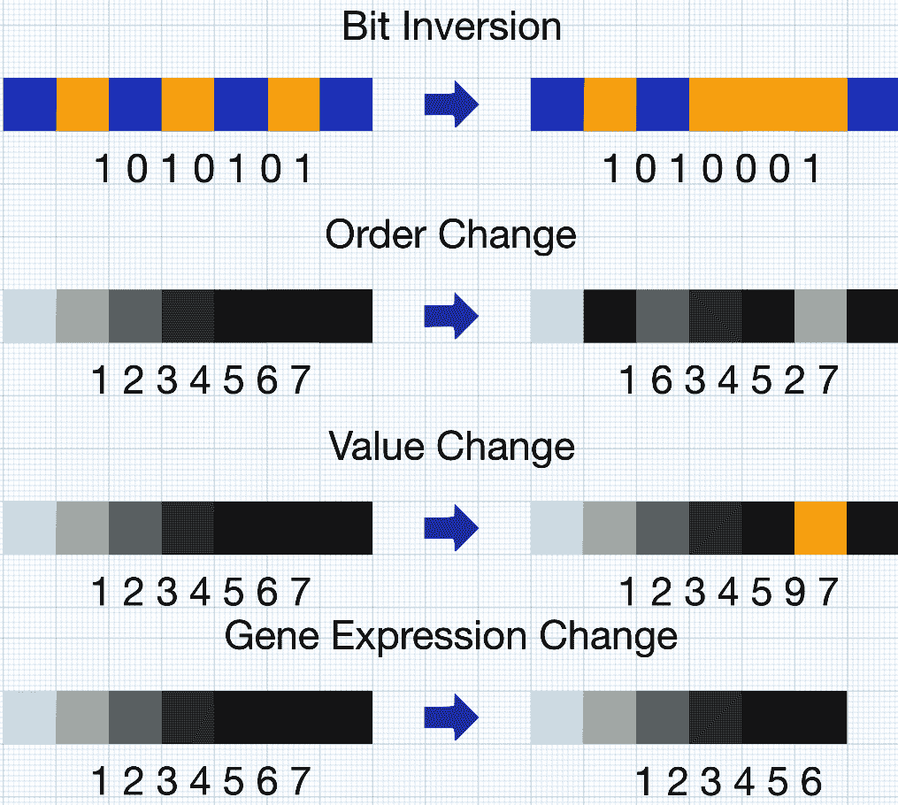

变异算子类型

具体的变异算子类型取决于特定遗传算法使用的遗传编码类型。在遇到的多种变异类型中，我们可以区分以下几种：

+   **位反转**：随机选择的位被反转（*二进制编码*）。

+   **顺序变化**：随机选择两个基因，并在基因组中翻转它们的位置（*排列编码*）。

+   **值变化**：在表达基因的随机位置添加一个小的值（*值编码*）。

+   **基因表达变化**：随机选择一个基因并从基因型（*结构编码*）中添加/移除。

基因型可以使用具有固定和可变染色体长度的遗传编码方案进行编码。前三种变异可以应用于两种类型的编码方案。最后一种变异只能表达在已使用可变长度编码编码的基因型中。

# 交叉算子

交叉（重组）算子允许我们通过重新组合两个父母的遗传信息以生成后代来随机生成新的一代（解）。因此，来自父母生物体的良好解的部分可以结合起来，并可能产生更好的后代。通常，在交叉之后，产生的后代在添加到下一代种群之前会被变异。

下图显示了各种交叉算子：

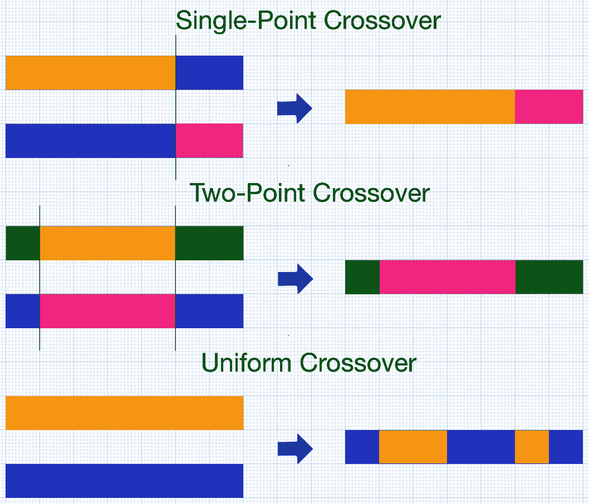

交叉算子类型

不同的交叉算子类型也取决于特定算法使用的遗传编码，但以下是最常见的：

+   **单点交叉**：随机选择交叉点，从开始到交叉点的基因组部分复制到来自一个亲本的子代，其余部分来自另一个亲本。

+   **两点交叉**：两个交叉点随机选择，从第一个点到开始的部分基因组来自第一个亲本，第一个和第二个交叉点之间的部分来自第二个亲本，其余部分来自第一个亲本。

+   **均匀交叉**：基因从第一个或第二个亲本随机复制。

# 基因组编码方案

设计神经进化算法时最重要的选择之一是确定神经网络的遗传表示，这可以通过以下方式进化

+   标准突变（参见前面的 *突变算子* 子节）

+   组合算子（参见前面的 *交叉算子* 子节）

目前，存在两种主要的基因组编码方案：直接和间接。让我们更详细地考虑每个方案。

# 直接基因组编码

在神经进化方法中，直接基因组编码尝试用于创建与具有固定拓扑的神经网络相关的 ANNs；也就是说，网络拓扑完全由实验者决定。在这里，遗传编码（*基因型*）实现为一个表示网络节点之间连接强度（*权重*）的实数向量。

进化算子通过突变算子修改权重向量的值，并通过重组（交叉）算子结合亲本有机体的向量以产生后代。虽然允许进化算子轻松应用，但所描述的编码方法有一些显著的缺点。其主要缺点之一是网络拓扑从一开始就由实验者决定，并在算法执行的所有代中固定。这种方法与自然进化过程相矛盾，在自然进化过程中，不仅有机体的属性，而且其物理结构在进化过程中也会发生变化。这使我们能够探索最广泛的搜索空间并找到最优解。

下面的图显示了进化过程：

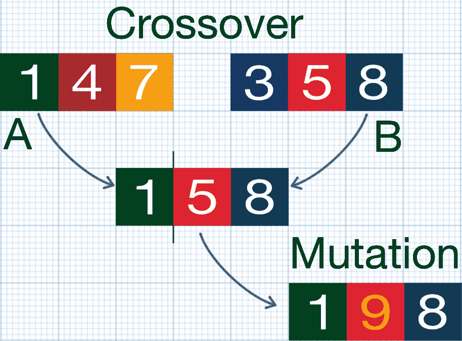

进化过程

为了解决固定拓扑方法的缺点，Kenneth O. Stanley 提出了 **增强拓扑的神经进化**（**NEAT**）方法。该算法背后的主要思想是，进化算子不仅应用于所有连接权重的向量，还应用于创建的神经网络拓扑。因此，通过生成有机体的种群，测试了具有各种连接权重的各种拓扑。我们将在本章后面讨论 NEAT 算法的具体细节。

NEAT算法在各种任务中表现出卓越的性能——从传统的强化学习到控制计算机游戏中的复杂非玩家角色——并已成为最受欢迎的神经进化算法之一。然而，它属于直接编码算法的家族，这限制了其只能用于进化适度规模的ANN，其中参数空间限制在最多数千个连接。这是因为每个连接都直接编码在基因型中，随着编码连接数量的增加，计算需求显著增加。这使得无法使用该算法进化大型神经网络。

# 间接基因组编码

为了克服直接编码的大小问题，Kenneth O. Stanley提出了一个**间接**编码方法，该方法受到DNA中基因组如何编码表型的启发。它基于这样一个事实，即物理世界是围绕几何和规律性（结构模式）构建的，其中自然对称性无处不在。因此，任何物理过程的编码大小可以通过重复使用一组特定的编码块来显著减少，这些编码块用于重复多次的结构。提出的方法，称为**基于超立方体的增强拓扑神经进化**（**HyperNEAT**），旨在通过利用几何规律性来构建大规模神经网络。HyperNEAT采用一个连接的**组合模式生成网络**（**CPPN**）来表示节点连接作为笛卡尔空间中的函数。我们将在本章后面更详细地讨论HyperNEAT。

# 协同进化

在自然界中，不同物种的种群常常在相互作用的共同进化中同时进化。这种种间关系被称为**协同进化**。协同进化是自然进化的强大工具，它吸引了神经进化社区的注意也就不足为奇了。协同进化主要有三种类型：

+   **互利共生**，即两种或更多物种共存并相互受益。

+   **竞争协同进化**：

    +   **捕食**，即一种生物杀死另一种生物并消耗其资源的行为。

    +   **寄生**，即一种生物利用另一种生物的资源，但并不杀死它。

+   **共生**，即一种物种的成员在没有造成伤害或从其他物种中获得利益的情况下获得利益。

研究人员已经探讨了先前的协同进化策略，并揭示了它们的优缺点。在这本书中，我们将介绍一种采用共生原理的神经进化算法，以维持两个协同进化的种群：候选解决方案的种群和候选目标函数的种群。我们将在第9章[协同进化和SAFE方法](048be1ce-8b6a-48c7-9d13-cb34c8482eb4.xhtml)中讨论**解决方案和适应度进化**（**SAFE**）算法。

# 模块化和层次结构

自然认知系统组织的另一个关键方面是模块化和层次结构。在研究人脑时，神经科学家发现它不是一个具有统一结构的单一系统，而是一个复杂的模块化结构层次。此外，由于生物组织中信号传播速度的限制，大脑的结构强制执行局部性原则，当大脑中几何相邻的结构处理相关任务时。这一自然系统的方面没有逃过神经进化研究者的注意，他们已经在许多进化算法中实现了这一点。我们将在第8章[ES-HyperNEAT和视网膜问题](9f3dce4d-2cc7-4307-a704-bfcfe4ad56b4.xhtml)中讨论如何使用基于神经进化的算法创建模块化人工神经网络。

# NEAT算法概述

NEAT用于进化复杂人工神经网络的方法旨在通过在进化过程中逐步细化人工神经网络的结构来减少参数搜索空间的维度。进化过程从一个小型、简单的基因组（种子）种群开始，并在每一代中逐渐增加其复杂性。

种子基因组具有一个非常简单的拓扑结构：仅表达输入、输出和偏置神经元。从一开始就没有引入隐藏节点，以确保解决方案的搜索从可能的最低维参数空间（连接权重）开始。在每一代中，都会引入新的基因，通过呈现一个之前不存在的新维度来扩展解决方案搜索空间。因此，进化开始于一个小型空间，可以轻松优化，并在必要时添加新维度。采用这种方法，可以逐步、逐步地发现复杂的表型（解决方案），这比直接在最终解决方案的广阔空间中启动搜索要高效得多。自然进化通过偶尔添加使表型更复杂的基因来利用类似的策略。在生物学中，这个过程被称为**复杂化**。

NEAT方法的主要目标是最小化基因组结构的复杂性——不仅是最終產品，还包括所有中间代有机体的结构。因此，网络拓扑结构的进化通过减少搜索空间的整体解决方案来带来显著的性能优势。例如，最终解决方案的高维空间仅在进化过程的最后阶段遇到。算法的另一个基本特征是，引入基因组的每个结构都将成为未来代际中后续适应性评估的主题。此外，在进化过程中，只有有用的结构才能生存下来。换句话说，基因组的结构复杂性始终是目标合理的。

# NEAT编码方案

NEAT的遗传编码方案设计用于在交叉操作应用于两个父代基因组时，允许在配对过程中轻松匹配相应的基因。NEAT基因组是编码神经网络连接模式的线性表示，如下所示NEAT基因组方案：

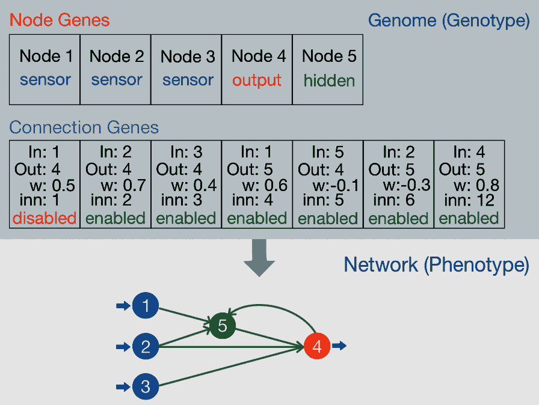

NEAT基因组方案

每个基因组表示为连接基因的列表，这些连接基因编码神经网络节点之间的连接。此外，还有节点基因，这些基因编码有关网络节点信息，例如节点标识符、节点类型和激活函数类型。连接基因编码网络链接的以下连接参数：

+   输入网络节点的标识符

+   输出网络节点的标识符

+   连接的强度（权重）

+   一个位，表示连接是否启用（表达）

+   一个创新号，允许在重组过程中匹配基因

前一个图的下部表示同一基因组以有向图形式呈现的方案。

# 结构突变

特定于NEAT的突变操作可以改变连接的强度（权重）和网络的结构。主要有两种结构突变类型：

+   在节点之间添加新的连接

+   在网络中添加新的节点

下图显示了NEAT算法的结构突变：

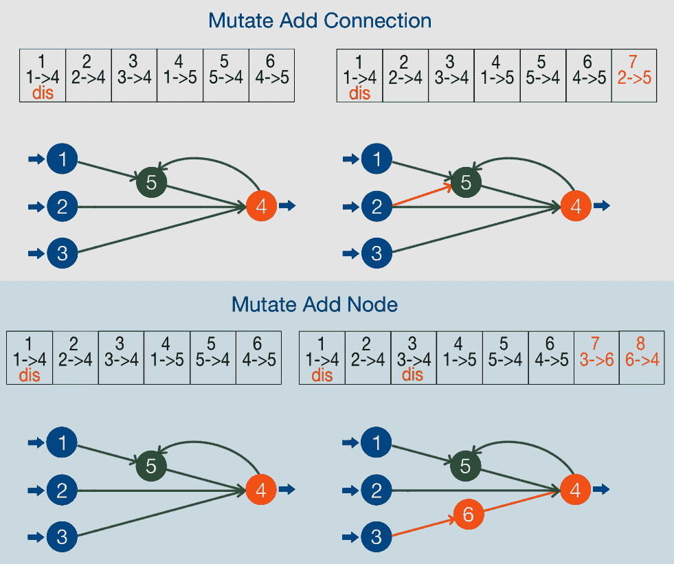

NEAT算法的结构突变

当突变操作应用于NEAT基因组时，新添加的基因（连接基因或节点基因）被分配一个不断增加的创新号。在进化过程中，种群中生物的基因组逐渐变大，产生了不同大小的基因组。这个过程导致不同的连接基因在基因组中的相同位置，使得同源基因之间的匹配过程极其复杂。

# 带有创新号的交叉

在进化过程中存在一些未被充分利用的信息，它告诉我们如何精确匹配任何在拓扑多样性种群中生物的基因组之间的基因。这正是每个基因告诉我们该基因是从哪个祖先那里衍生出来的。具有相同历史起源的连接基因代表相同的结构，尽管可能具有不同的连接权重值。NEAT算法中基因的历史起源由递增分配的创新号表示，这使我们能够追踪结构突变的年代学。

同时，在交叉过程中，后代继承了来自父母基因组的基因创新编号。因此，特定基因的创新编号永远不会改变，这使得来自不同基因组的相似基因在交叉过程中可以匹配。匹配基因的创新编号是相同的。如果创新编号不匹配，该基因属于基因组的*不连续*或*多余*部分，这取决于其创新编号是否位于其他父母创新编号的范围之内或之外。不连续或多余的基因代表在另一父母基因组中不存在的结构，在交叉阶段需要特殊处理。因此，后代继承了具有相同创新编号的基因。这些基因是从父母之一随机选择的。后代总是从适应度最高的父母那里继承不连续或多余的基因。这一特性允许NEAT算法使用线性基因组编码有效地执行基因重组，而无需进行复杂的拓扑分析。

以下图表展示了NEAT算法中的交叉（重组）：

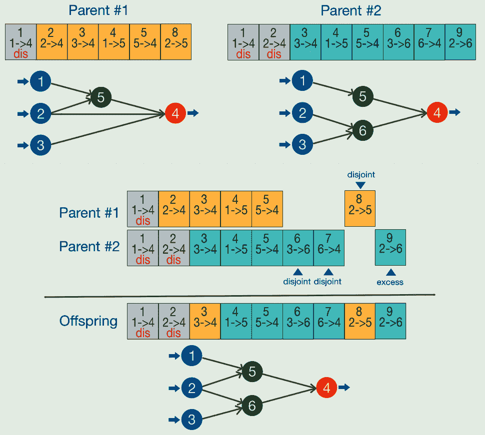

NEAT算法中的交叉（重组）

上述图表展示了使用NEAT算法的两个父母之间的交叉示例。两个父母的基因组通过创新编号（连接基因细胞顶部的数字）对齐。之后，当创新编号相同时，通过从任一父母随机选择连接基因来产生后代：编号为一到五的基因。最后，无条件地从任一父母那里添加不连续和多余的基因，并按创新编号排序。

# 物种分化

在进化过程中，生物体可以通过代际繁衍创造出多样的拓扑结构，但它们无法产生并维持自身的拓扑创新。较小的网络结构比较大的网络结构优化得更快，这人为地减少了在基因组中添加新节点或连接后后代基因组的生存机会。因此，新增加的拓扑结构由于种群中生物体适应度的暂时下降而承受着负面的进化压力。同时，新的拓扑结构可以引入创新，最终导致长期的成功解决方案。为了解决适应度的暂时下降，NEAT算法中引入了物种分化的概念。物种分化通过引入狭窄的生态位来限制可以交配的生物体范围，在这些生态位中，只有属于同一生态位的生物体在交叉过程中相互竞争，而不是与种群中的所有生物体竞争。物种分化通过将种群分割，使得具有相似拓扑结构的生物体属于同一物种来实现。

让我们参考以下物种分化算法：

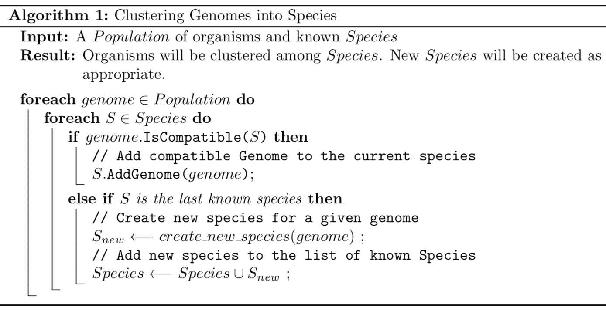

物种分化算法

NEAT方法允许创建复杂的ANN，能够解决各种控制优化问题，以及其他无监督学习问题。由于引入了通过复杂化和物种分化来增强ANN拓扑结构的特定细节，解决方案往往优化了训练和推理的性能。结果，ANN拓扑结构增长以匹配需要解决的问题，而没有通过传统的ANN拓扑设计方法引入任何多余的隐藏层。

关于NEAT算法的更多详细信息，请参阅原始论文：[http://nn.cs.utexas.edu/downloads/papers/stanley.phd04.pdf](http://nn.cs.utexas.edu/downloads/papers/stanley.phd04.pdf)。

# 基于超立方体的NEAT

智力是大脑的产物，而人类大脑作为一种结构，本身也是自然进化的产物。这样一个复杂的结构在数百万年的演变过程中，在恶劣环境的压力下，以及在与其他生物为生存而竞争的过程中逐渐形成。因此，一个极其复杂的结构已经形成，具有许多层次、模块以及神经元之间数万亿的连接。人类大脑的结构是我们的指南星，正帮助我们努力创造人工智能系统。然而，我们如何用我们不完美的工具来应对人类大脑的复杂性呢？

通过研究人类大脑，神经科学家发现，其空间结构在所有感知和认知任务中起着至关重要的作用——从视觉到抽象思维。已经发现了许多复杂的几何结构，例如帮助我们进行惯性导航的网格细胞，以及与眼睛视网膜相连的皮层柱，用于处理视觉刺激。已经证明，大脑的结构使我们能够通过由输入中的特定模式激活的特定神经网络结构，有效地对从感官接收到的信号中的模式做出反应。这种大脑的特性允许它以极其高效的方式表示和处理从环境中获得的所有输入数据的多样性。我们的头脑已经进化成有效的模式识别和模式处理引擎，积极重用特定的神经网络模块来处理特定的模式，从而大大减少了所需的不同神经网络结构的数量。这仅由于复杂的模块化层次和其各个部分的空間整合才成为可能。

正如我们之前提到的，生物大脑包含了复杂的分层和空间感知数据处理程序。这激发了神经进化研究人员在人工神经网络领域引入类似的数据处理方法。在设计此类系统时，必须解决以下问题：

+   需要大规模ANN的大量输入特征和训练参数

+   有效表示在物理世界中观察到的自然几何规律和对称性

+   通过引入局部性原理有效地处理输入数据，即当空间/语义相邻的数据结构由相互连接的神经单元模块处理时，这些模块占据整个网络结构的相同紧凑区域

在本节中，你了解了**基于超立方的神经进化拓扑增强**（**HyperNEAT**）方法，该方法由Kenneth O. Stanley提出，通过利用几何规律来解决各种问题。在下一节中，我们将探讨**组合模式生成网络**（**CPPNs**）。

# 组合模式生成网络

HyperNEAT通过引入一种新的间接基因组编码方案CPPNs扩展了原始的NEAT算法。这种编码方式使得将表型ANN的连接模式表示为其几何形状的函数成为可能。

HyperNEAT将表型神经网络的连接模式存储为一个四维超立方体，其中每个点编码两个节点之间的连接（即源神经元和目标神经元的坐标）以及连接的CPPN在其内部绘制各种图案。换句话说，CPPN计算一个四维函数，其定义如下：

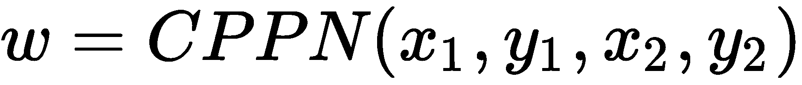

在这里，源节点位于(*x[1]*, *y[1]*)，目标节点位于(*x[2]*, *y[2]*)。在这个阶段，CPPN为表型网络中每个节点之间的每个连接返回一个权重，这以网格的形式表示。按照惯例，如果CPPN计算出的连接权重的大小小于一个最小阈值(*w[min]*)，则不表示两个节点之间的连接。这样，CPPN产生的连接模式可以表示任何网络拓扑。连接模式可以通过在训练数据中发现规律来编码大规模ANN，并且可以重用同一组基因来编码重复。按照惯例，CPPN产生的连接模式被称为**基质**。

下图展示了基于超立方的几何连接模式的解释：

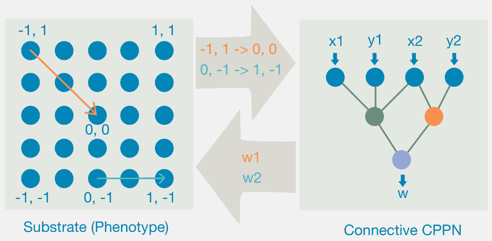

基于超立方的几何连接模式解释

与传统的ANN架构不同，CPPN为其隐藏节点使用一组各种激活函数来探索各种几何规律。例如，三角函数的正弦可以用来表示重复，而高斯函数可以用来在网络的特定部分强制局部性（即沿坐标轴的对称性）。因此，CPPN编码方案可以以紧凑的方式表示具有不同几何规律的图案，如对称性、重复、具有规律的重复等。

# 底板配置

CPPN连接到底板中的网络节点的布局可以采取各种形式，最适合不同类型的问题。选择合适的布局以实现最佳性能是实验者的责任。例如，控制六腿爬行器等径向实体的输出节点可能最好采用径向几何布局，以便可以用极坐标表示连接模式。

下图展示了底板布局配置的一些示例：

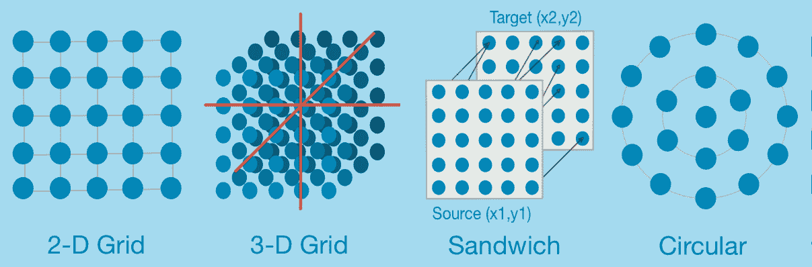

底板布局配置示例

HyperNEAT通常使用几种常见的底板布局类型（参见前面的图），以下是一些例子：

+   **二维网格**：以(0, 0)为中心的二维笛卡尔空间中的网络节点规则网格

+   **三维网格**：以(0, 0, 0)为中心的三维笛卡尔空间中的网络节点规则网格

+   **状态空间三明治**：两个二维平面网格，其中源节点和目标节点可以相互发送连接

+   **圆形**：适合定义基于极坐标的径向几何规律的规则径向结构

# 进化连接CPPN和HyperNEAT算法

这种方法被称为**HyperNEAT**，因为它使用修改后的NEAT来进化表示超空间中空间模式的CPPNs。每个由超立方体界定的模式表达点，代表低维图中两个节点之间的连接（底板）。因此，超空间的维度是底层低维图维度的两倍。在[第8章](9f3dce4d-2cc7-4307-a704-bfcfe4ad56b4.xhtml)，*ES-HyperNEAT和视网膜问题*中，我们将探讨一些使用二维连接模式示例。

HyperNEAT算法如下图所示：

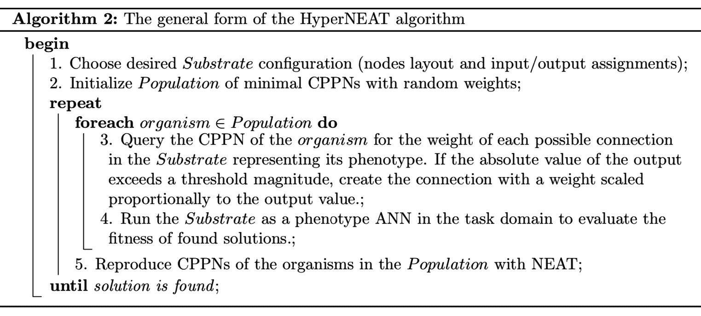

HyperNEAT算法的一般形式

在其进化过程中添加到连接CPPN中的任何连接基因或节点基因都会导致在表型基板上的连接模式中找到新的全局变化维度（新特性）。对CPPN基因组所做的任何修改都代表了一种全新的整个连接模式可以变化的方式。此外，先前进化的连接CPPN可以被查询以产生比用于其训练的更高分辨率的基板连接模式。这使得我们能够在任何分辨率下产生相同问题的有效解决方案，可能没有上限。因此，上述特性使HyperNEAT成为进化大规模生物启发式人工神经网络的有力工具。

如需了解更多关于HyperNEAT方法的信息，您可以参考以下链接：[https://eplex.cs.ucf.edu/papers/stanley_alife09.pdf](https://eplex.cs.ucf.edu/papers/stanley_alife09.pdf).

# 可进化基板HyperNEAT

HyperNEAT方法揭示了自然世界的几何规律可以通过放置在特定空间位置的人工神经网络节点得到充分表示。这样，神经进化获得了显著的好处，并允许大规模ANN用于高维问题，这在普通的NEAT算法中是不可能的。同时，HyperNEAT方法受到自然大脑结构的启发，但仍然缺乏自然进化过程的可塑性。虽然允许进化过程在节点之间阐述各种连接模式，但HyperNEAT方法在节点放置位置上暴露了一个硬限制。实验者必须从一开始就定义网络节点的布局，任何研究人员做出的错误假设都会降低进化过程的表现。

通过将网络节点放置在基板上的特定位置，实验者对由CPPN产生的权重模式施加了无意中的约束。这种限制随后干扰了CPPN，当它试图将自然世界的几何规律编码到产生解决方案的ANN（表型）的地形时。在这里，由CPPN产生的连接模式必须与实验者定义的基板布局完美对齐；只有给定网络节点之间才能建立连接。这种限制导致不必要的近似误差，从而破坏了结果。对于CPPN来说，在放置位置略有不同的节点上详细阐述连接模式可能更有效。

# 超立方体中的信息模式

为什么一开始就要对节点的位置施加这样的限制？如果从连接模式中提取的隐含线索成为放置下一个节点以更好地表示物理世界自然规律的位置指南，那岂不是很好？

具有均匀连接权重的区域编码的信息量很少，因此功能价值不大。同时，具有巨大权重值梯度的区域信息密集度极高。这些区域可以通过放置额外的网络节点来受益，以表示对自然过程的更精细编码。如您从我们对HyperNEAT算法的讨论中回忆的那样，可以在四维超立方体中用一个点来表示基板中两个节点之间的连接。因此，所提出的ES-HyperNEAT算法的主要特征是在检测到连接权重高变动的超立方体区域中表达更多的超点。同时，在连接权重变动较低的区域中放置较少的超点。

节点的放置以及它们之间暴露的连接可以由进化CPPN为基板给定区域产生的连接权重变化来决定。换句话说，除了从编码网络连接模式的CPPN中接收到的信息之外，不需要额外的信息来决定基板中下一个节点的放置。信息密度成为算法确定基板地形的主要指导原则。

表型ANN中的节点放置表示信息编码在由CPPN创建的连接模式中。

# 四叉树作为有效的信息提取器

为了表示在超立方体中编码连接权重的超点，ES-HyperNEAT算法采用了一个**四叉树**。四叉树是一种树形数据结构，其中每个内部节点恰好有四个子节点。这种数据结构被选中是因为其固有的特性，允许它在不同粒度级别上表示二维区域。使用四叉树，可以通过将任何感兴趣的区域分割成四个子区域来有效地组织二维空间中的搜索，每个子区域成为树的叶子节点，根（父）节点代表原始（分解）区域。

使用基于四叉树的信息提取方法，ES-HyperNEAT方法迭代地在基板ANN的二维空间中寻找节点之间新的连接，从实验者预先定义的输入和输出节点开始。这种方法比直接在四维超立方体空间中搜索计算上更有效。

下图展示了使用四叉树数据结构提取信息的一个示例：

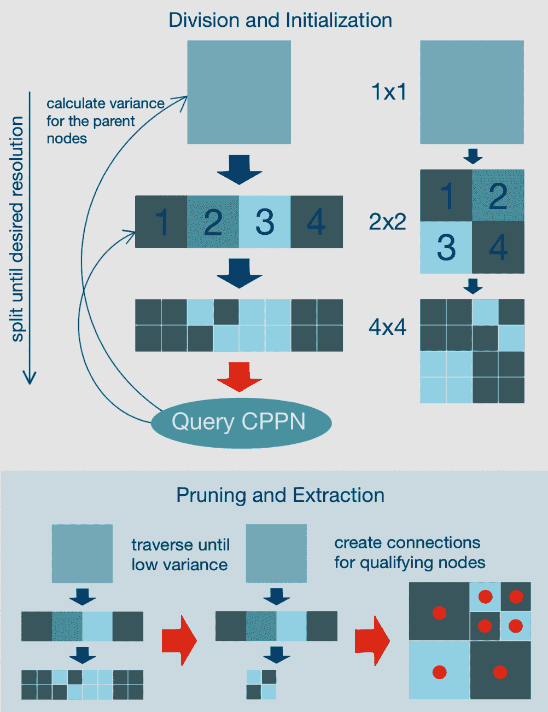

基于四叉树的信息提取示例

基于四叉树的搜索算法在两个主要阶段运行：

1.  **划分和初始化**：在这个阶段，通过递归细分初始底物空间（从(-1, -1)到(1, 1)的区域）来创建四叉树。细分在达到所需的树深度时停止。这隐式地确定了有多少子空间适合底物的初始空间（初始化分辨率）。之后，对于每个以 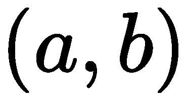 为中心的四叉树节点，使用 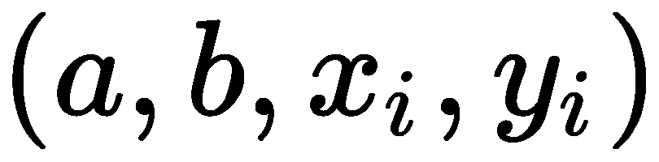 个参数查询CPPN以找到连接权重。当找到特定四叉树节点  的叶节点的连接权重时，可以使用以下公式计算该节点的方差：

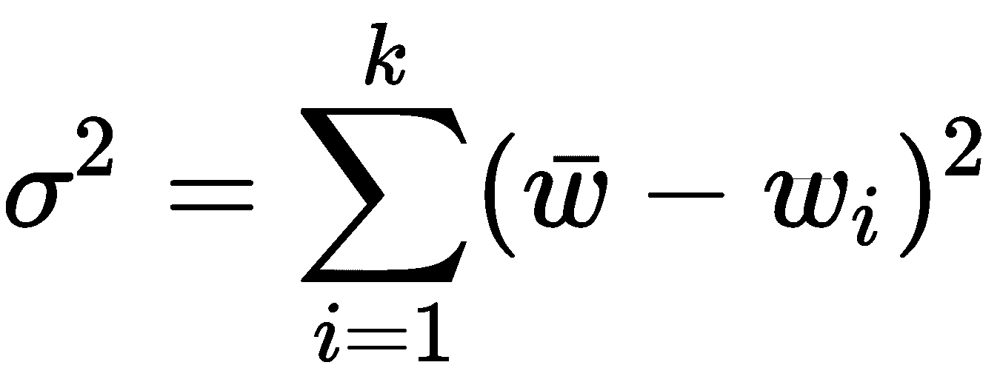

这里  是叶节点之间平均连接权重，而  是到特定叶节点的连接权重。计算出的方差值是特定底物区域存在信息的启发式指标。如果这个值高于特定的划分阈值（定义所需信息密度），则可以对底物的相应平方区域重复划分阶段。这样，算法可以通过这种方式强制执行所需的信息密度。查看前一个图的顶部部分，以了解如何使用四叉树数据结构进行划分和初始化的视觉洞察。

1.  **修剪和提取**：为了保证更多连接（以及底物中的节点）在信息密度高（权重方差高）的区域表达出来，修剪和提取过程是在前一个阶段生成的四叉树上执行的。四叉树深度优先遍历，直到当前节点的方差小于方差阈值 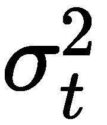 或者直到节点没有子节点（零方差）。对于每个合格的节点，连接在其中心 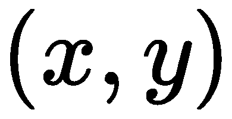 和每个父节点之间表达，父节点要么由实验者定义，要么在前两个阶段的运行中找到（即，从ES-HyperNEAT方法已经创建的隐藏节点）。参考前一个图的底部部分，以了解修剪和提取阶段的工作原理。

# ES-HyperNEAT算法

ES-HyperNEAT算法从用户定义的输入节点开始，并详细探索从它们到新表达的隐藏节点的连接。在基板空间内表达输出连接模式和隐藏节点位置使用的是我们之前描述的四叉树信息提取方法。信息提取过程是迭代应用的，直到达到所需的信息表达密度水平，或者直到在超立方体中不能再发现更多信息。之后，通过表达到输出的输入连接模式，将得到的网络连接到用户定义的输出节点。我们也为此使用了四叉树信息提取。只有那些有路径连接到输入和输出节点的隐藏节点被保留在最终的网络中。

现在，我们在表型ANN的基板中定义了许多节点和连接。引入一个额外的带修剪处理阶段来从网络中移除一些节点可能是有益的。在这个阶段，我们只保留特定带内的点，并移除带边缘的点。通过使带变宽或变窄，CPPN可以管理编码信息的密度。有关带修剪的更多详细信息，请参阅*ES-HyperNEAT论文* ([https://eplex.cs.ucf.edu/papers/risi_alife12.pdf](https://eplex.cs.ucf.edu/papers/risi_alife12.pdf))。

看看下面的ES-HyperNEAT算法：

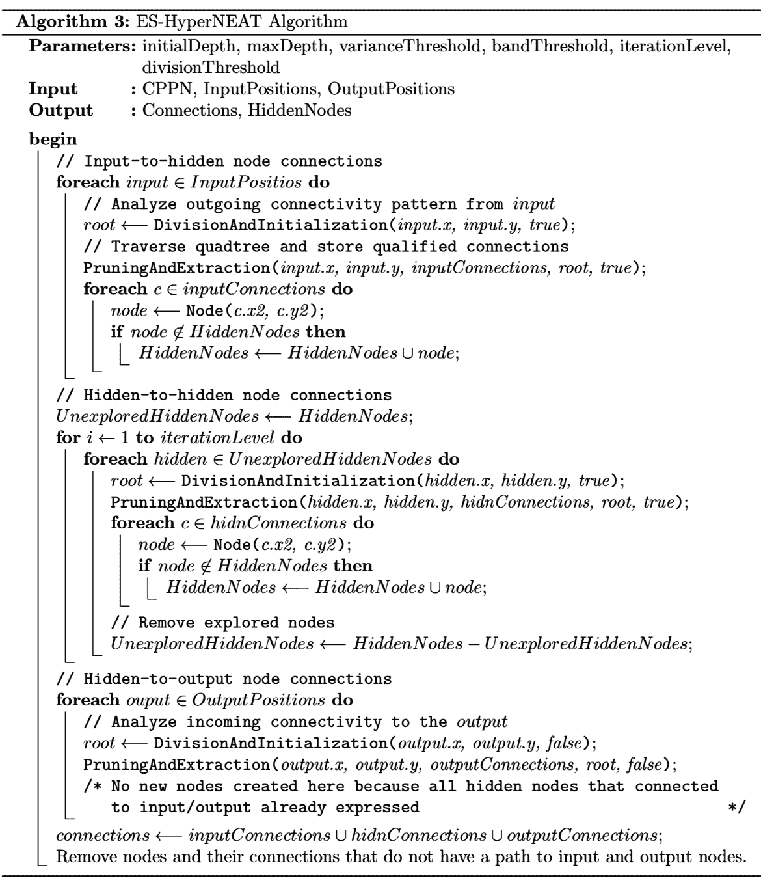

ES-HyperNEAT算法

ES-HyperNEAT算法继承了NEAT和HyperNEAT方法的所有优点，并引入了更多更强大的新特性，包括以下内容：

+   自动在基板内放置隐藏节点，以精确匹配由进化出的CPPN所表达的联系模式。

+   由于其固有的能力，即通过初始CPPN架构的具体设计，以局部性偏向开始进化搜索，这使得我们能够更容易地产生模块化表型ANN。

+   使用ES-HyperNEAT，可以在进化过程中通过增加基板中的节点和连接数量来详细阐述现有的表型ANN结构。这与HyperNEAT相反，在HyperNEAT中，基板节点的数量是预定义的。

ES-HyperNEAT算法允许我们使用原始的HyperNEAT架构，而不改变NEAT部分的遗传结构。它使我们能够解决由于在事先创建适当的基板配置方面的困难，而难以用HyperNEAT算法解决的问题。

关于ES-HyperNEAT算法及其背后的动机的更多详细信息可以在[h](https://eplex.cs.ucf.edu/papers/risi_alife12.pdf)[ttps://eplex.cs.ucf.edu/papers/risi_alife12.pdf](https://eplex.cs.ucf.edu/papers/risi_alife12.pdf)找到。

# 新颖性搜索优化方法

大多数机器学习方法，包括进化算法，都是基于目标函数的优化进行训练的。目标函数优化方法背后的主要关注点是，提高求解器性能的最佳方式是奖励它们接近目标。在大多数进化算法中，接近目标是通过求解器的适应度来衡量的。一个生物体的性能是通过适应度函数来定义的，这是生物体适应其环境的进化压力的隐喻。根据这一范式，最适应的生物体更适合其环境，并且最适合找到解决方案。

虽然直接适应度函数优化方法在许多简单情况下效果良好，但对于更复杂的任务，它往往陷入局部最优的陷阱。收敛到局部最优意味着在搜索空间中的任何局部步骤在适应度函数优化过程中都不会提供任何改进。传统的遗传算法使用变异和岛屿机制来逃离这种局部最优。然而，正如我们在本书后面的实验中所发现的那样，它可能并不总是有助于欺骗性问题，或者可能需要太长时间才能找到成功的解决方案。

许多现实世界的问题具有这样的欺骗性适应度函数景观，无法通过仅基于测量当前解决方案与目标接近程度的优化过程来解决。例如，我们可以考虑在具有不规则街道模式的未知城市中导航的任务。在这样的任务中，朝着目的地前进通常意味着沿着欺骗性的道路行驶，这些道路只会让你离目的地越来越远，直到经过几次转弯后才到达。但如果你决定从指向目的地的道路开始，这通常会让你走到死胡同，而目的地就在墙的另一边，却无法触及。

# 新颖性搜索与自然进化

通过观察自然选择在物理世界中的运作方式，我们可以看到，进化多样性的背后推动力是对新颖性的追求。换句话说，任何正在进化的物种通过发现新的行为模式，都能立即获得相对于其竞争对手的进化优势。这使得它们能够更有效地利用环境。自然进化没有明确的目标，它通过奖励对新行为的探索和利用来扩大解决方案的搜索空间。这种新颖性可以被视为自然界中许多隐藏的创造力的代理，这使得进化能够进一步细化更复杂的行为和生物结构。

受自然进化的启发，*乔尔·莱曼*提出了一种用于人工进化过程的新颖性搜索优化方法。使用这种方法，没有定义或使用特定的适应度函数来搜索解决方案；相反，在神经进化过程中，每个找到的解决方案的新颖性直接得到奖励。因此，找到的解决方案的新颖性指导神经进化达到最终目标。这种方法使我们有机会利用进化的创造力，而无需适应压力将解决方案适应到特定的生态位。

新颖性搜索的有效性可以通过迷宫导航实验来证明，其中基于目标的搜索在简单迷宫中找到解决方案所需的步骤（代数）比新颖性搜索多得多。此外，对于具有欺骗性配置的困难迷宫，基于目标的搜索甚至无法找到任何解决方案。我们将在第5章 [自主迷宫导航](22365f85-3003-4b67-8e1e-cc89fa5e259b.xhtml)中讨论迷宫导航实验。

# 新颖性度量

新颖性搜索方法使用新颖性度量来跟踪每个新个体的行为独特性。也就是说，新颖性度量是衡量新生物体在行为空间中相对于其他个体的距离的度量。一个有效的新颖性度量实现应该允许我们在行为空间的任何点上计算稀疏性。任何有更密集的访问点集群的区域都相对不那么新颖，并产生较少的进化奖励。

在行为空间中，一个点稀疏性的最直接度量是该点k个最近邻的平均距离。当这个距离较高时，感兴趣的点位于稀疏区域。同时，密集区域以较低的距离值标记。因此，点  的稀疏性  由以下公式给出：

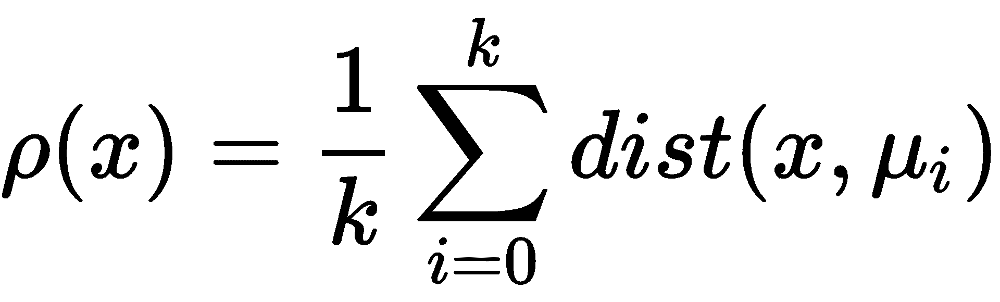

在这里， 是根据距离度量 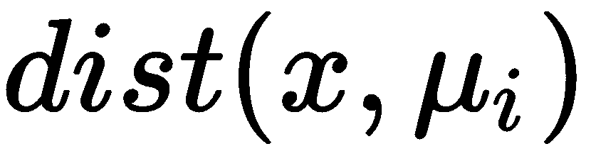 计算的  的第i个最近邻。距离度量是两个个体之间行为差异的特定领域度量。

来自稀疏区域的候选个体获得更高的新颖性评分。当这个评分超过某个最小阈值时！，该位置的个体将被添加到表现最佳者的存档中，这些最佳表现者表征了行为空间中先前解决方案的分布。当前种群代与存档一起定义了搜索已经进行过的地方以及现在所在的位置。因此，通过最大化新颖性指标，搜索的梯度被引导向新的行为，而不需要任何明确的目标。然而，新颖性搜索仍然由有意义的信息驱动，因为探索新的行为需要全面利用搜索域。

以下图像展示了新颖性搜索算法：

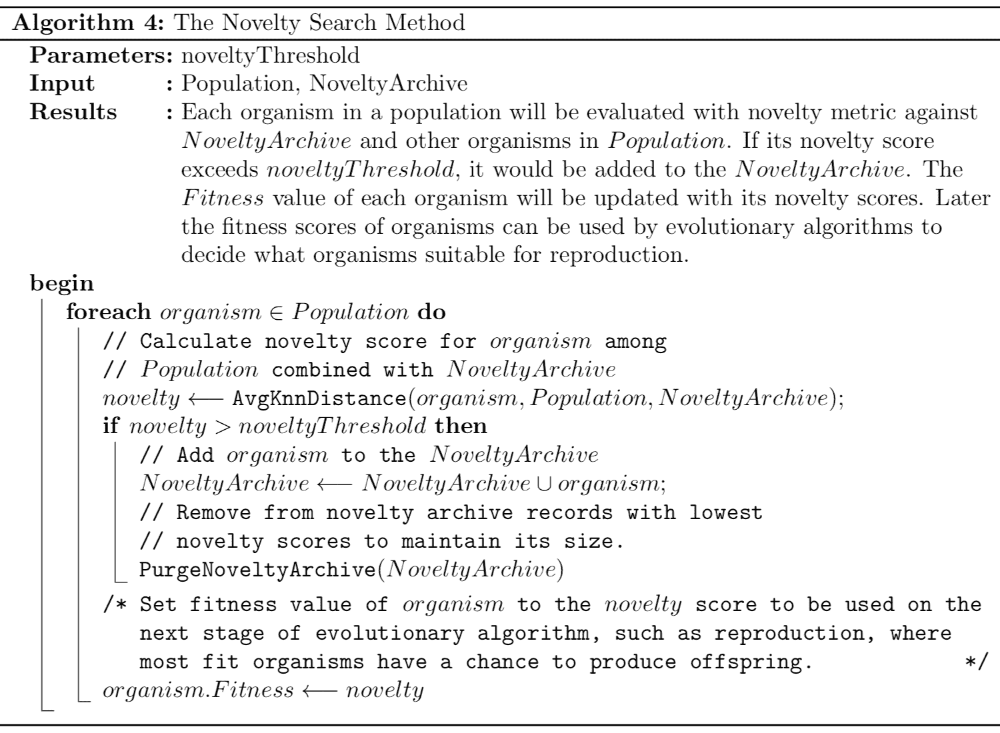

新颖性搜索算法

新颖性搜索优化方法允许进化在任意欺骗空间中搜索解决方案并找到最优解。使用这种方法，当种群被迫不在特定利基解决方案（局部最优）中收敛，而必须探索整个解决方案空间时，可以实现发散进化。尽管其方法反直觉，完全忽略了搜索过程中的明确目标，但它似乎是一种非常有效的搜索优化方法。此外，它可以在大多数情况下比测量适应度作为最终解决方案距离的传统基于目标的搜索更快地找到最终解决方案。

如需更多详细信息，请参阅以下链接： [http://joellehman.com/lehman-dissertation.pdf](http://joellehman.com/lehman-dissertation.pdf)。

# 摘要

在本章中，我们首先讨论了用于训练人工神经网络的多种方法。我们考虑了基于传统梯度下降的方法与基于神经进化的方法之间的区别。然后，我们介绍了一种最流行的神经进化算法（NEAT）以及我们可以扩展它的两种方式（HyperNEAT和ES-HyperNEAT）。最后，我们描述了搜索优化方法（新颖性搜索），它可以找到传统基于目标的搜索方法无法解决的多种欺骗问题的解决方案。现在，在设置必要的环境之后，你就可以将所学知识付诸实践了，我们将在下一章中讨论这一点。

在下一章中，我们将介绍可用的库，以便我们可以在Python中进行神经进化的实验。我们还将演示如何设置工作环境以及Python生态系统中可用于管理依赖项的工具。

# 进一步阅读

为了更深入地理解本章讨论的主题，请查看以下链接：

+   **NEAT**: [http://nn.cs.utexas.edu/downloads/papers/stanley.phd04.pdf](http://nn.cs.utexas.edu/downloads/papers/stanley.phd04.pdf)

+   **HyperNEAT**: [https://eplex.cs.ucf.edu/papers/stanley_alife09.pdf](https://eplex.cs.ucf.edu/papers/stanley_alife09.pdf)

+   **ES-HyperNEAT**: [https://eplex.cs.ucf.edu/papers/risi_alife12.pdf](https://eplex.cs.ucf.edu/papers/risi_alife12.pdf)

+   **新颖搜索**: [http://joellehman.com/lehman-dissertation.pdf](http://joellehman.com/lehman-dissertation.pdf)
