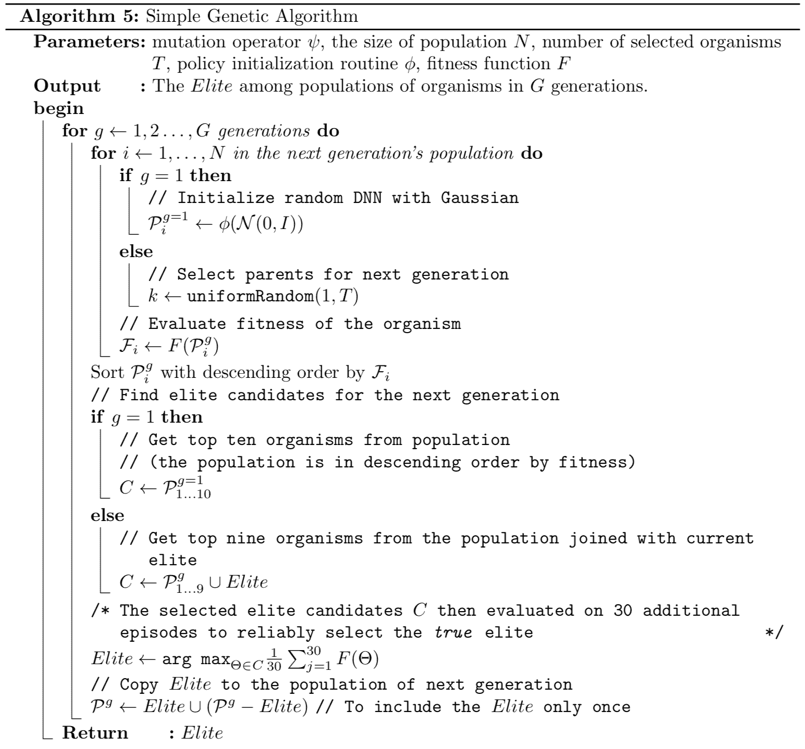

# Python库和环境设置

本章介绍了我们可以使用的Python库，以便实现上一章中描述的神经进化算法。我们还将讨论每个库的优缺点。此外，我们还将提供基本的使用示例。然后，我们将考虑如何设置本书后面将要进行的实验环境，并检查在Python生态系统中执行此操作的常见方法。最后，我们将演示如何使用Anaconda Distribution设置一个工作环境，这是数据科学家中用于管理Python依赖项和虚拟环境的流行工具。在本章中，你将学习如何开始使用Python来实验本书中将要涵盖的神经进化算法。

在本章中，我们将涵盖以下主题：

+   适用于神经进化实验的Python库

+   环境设置

# 适用于神经进化实验的Python库

Python编程语言是机器学习和人工智能领域相关活动以及该领域研发中最受欢迎的语言之一。最突出的框架要么是用Python编写的，要么提供相应的接口。这种流行度可以归因于Python的学习曲线短，以及它作为可脚本化语言的本性，这使得实验可以快速进行。因此，遵循机器学习社区的一般趋势，一些支持神经进化的库是用Python编写的，并且随着时间的推移，库的数量持续增长。在本节中，我们将查看适用于进化算法领域的最稳定的Python库。

# NEAT-Python

正如其名所示，这是通过Python编程语言实现的NEAT算法。NEAT-Python库提供了标准NEAT方法，用于种群中生物体基因组的遗传进化。它实现了将生物体的基因型转换为表型（人工神经网络）的实用程序，并提供方便的方法来加载和保存基因组配置以及NEAT参数。此外，它还实现了有用的例程，以便它可以收集关于进化过程执行状态的统计信息，并提供一种从给定的检查点恢复执行的方法。检查点允许我们定期保存进化过程的状态，并在稍后从保存的检查点数据中恢复过程的执行。

NEAT-Python算法的优点如下：

+   它有一个稳定的实现。

+   它有全面的文档。

+   它可以通过PIP包管理器轻松安装。

+   它具有内置的统计信息收集和存储执行检查点的支持，以及从给定检查点恢复执行的能力。

+   它提供了多种激活函数类型。

+   它支持连续时间循环神经网络表型。

+   它可以轻松扩展以支持各种 NEAT 修改。

NEAT-Python 算法的缺点如下：

+   默认情况下仅实现了 NEAT 算法。

+   目前它处于仅维护状态，最近没有进行任何活跃的开发。

# NEAT-Python 使用示例

以下是如何使用 NEAT-Python 库的一般示例，没有特定的问题。它描述了典型的步骤以及如何获得必要的结果。我们将在这本书中广泛使用这个库。您可以跳到下一章以获取具体的用法示例，但您应该阅读到本章的结尾，以了解更多关于替代库的信息。让我们开始吧：

1.  加载 NEAT 设置和初始基因组配置：

```py
config = neat.Config(neat.DefaultGenome, neat.DefaultReproduction, neat.DefaultSpeciesSet, neat.DefaultStagnation, config_file)

```

这里，`config_file` 参数指向包含 NEAT-Python 库设置和初始基因组默认配置的文件。

1.  从配置数据创建生物体种群：

```py
p = neat.Population(config)
```

1.  添加统计报告器和检查点收集器：

```py
# Output progress to the stdout
p.add_reporter(neat.StdOutReporter(True)) 
stats = neat.StatisticsReporter()
p.add_reporter(stats)
p.add_reporter(neat.Checkpointer(5))
```

1.  在特定数量的代数（在我们的例子中是 `300`）上运行进化过程：

```py
winner = p.run(eval_genomes, 300)
```

这里，`eval_genomes` 是一个函数，用于评估种群中所有生物体的基因组与特定适应度函数，而 `winner` 是找到的最佳表现型基因型。

1.  可以如下从基因组创建表型 ANN：

```py
winner_ann = neat.nn.FeedForwardNetwork.create(winner, config)
```

1.  之后，可以使用输入数据查询 ANN 以计算结果：

```py
for xi in xor_inputs: 
    output = winner_ann.activate(xi)
    print(xi, output) # print results
```

该库可在 [https://github.com/CodeReclaimers/neat-python](https://github.com/CodeReclaimers/neat-python) 获取。

以下源代码旨在让您了解库的功能。完整的代码示例将在后续章节中提供。

# PyTorch NEAT

该库是基于 NEAT-Python 库构建的。它为 NEAT-Python 库生成的工件与 *PyTorch* 平台提供了易于集成的功能。因此，可以将 NEAT 基因组转换为基于 PyTorch 实现的循环神经网络（ANN）表型。此外，它还允许我们将**组合模式生成网络**（**CPPNs**）表示为 PyTorch 结构，这是 HyperNEAT 方法的主要构建块。与 PyTorch 集成的主要优势是，它使我们能够利用 GPU 进行计算，从而可能由于评估进化种群中生物体基因组的速度提高而加速进化过程。

PyTorch NEAT 的优点如下：

+   它基于稳定的 NEAT-Python 库，这使得我们能够利用其所有优势。

+   与 PyTorch 框架的集成。

+   它对 NEAT 基因组的评估进行了 GPU 加速。

+   它包括 CPPN 实现，这是 HyperNEAT 算法的构建块。

+   与 OpenAI GYM 环境的集成。

PyTorch NEAT 的缺点如下：

+   仅完全实现了NEAT算法。

+   它只提供了HyperNEAT算法实现的有限支持。

更多关于OpenAI GYM的详细信息，请访问[https://gym.openai.com](https://gym.openai.com)。

# PyTorch NEAT使用示例

以下是用PyTorch NEAT库实现倒立摆平衡控制器的示例。这只是一个概述。本书后面将更详细地探讨倒立摆平衡问题。让我们开始吧：

1.  加载NEAT设置和种子基因组配置：

```py
config = neat.Config(neat.DefaultGenome, neat.DefaultReproduction, 
      neat.DefaultSpeciesSet, neat.DefaultStagnation, config_file)
```

在这里，`config_file`文件存储了NEAT算法设置以及默认的基因组配置。

1.  从配置数据创建生物种群：

```py
pop = neat.Population(config)
```

1.  基于PyTorch和OpenAI GYM准备多环境基因组评估器：

```py
def make_env(): 
    return gym.make("CartPole-v0")

def make_net(genome, config, bs): 
    return RecurrentNet.create(genome, config, bs)

def activate_net(net, states): 
    outputs = net.activate(states).numpy()
    return outputs[:, 0] > 0.5

evaluator = MultiEnvEvaluator( 
    make_net, activate_net, make_env=make_env, 
    max_env_steps=max_env_steps
)

def eval_genomes(genomes, config): 
    for _, genome in genomes:
        genome.fitness = evaluator.eval_genome(genome, config)
```

在这里，对`gym.make("CartPole-v0")`函数的调用是调用OpenAI GYM框架以创建单个倒立摆平衡环境。

1.  添加统计和日志报告器：

```py
stats = neat.StatisticsReporter()
pop.add_reporter(stats)
reporter = neat.StdOutReporter(True)
pop.add_reporter(reporter)
logger = LogReporter("neat.log", evaluator.eval_genome)
pop.add_reporter(logger)
```

1.  在特定的代数（在我们的例子中是`100`）上运行进化过程：

```py
winner = pop.run(eval_genomes, 100)
```

在这里，`eval_genomes`是一个用于评估种群中所有生物的基因组的函数，而`winner`是找到的最佳表现型基因型。

1.  可以从基因组创建表型ANN，如下面的代码所示：

```py
winner_ann = RecurrentNet.create(genome, config, bs)
```

在这里，`genome`是NEAT基因组配置，`config`是一个封装NEAT设置的对象，而`bs`是一个指示所需批量大小的参数。

1.  之后，可以使用输入数据查询ANN以获得结果：

```py
action = winner_ann.activate(states).numpy()
```

在这里，`action`是用于模拟的动作指定符，而`states`是包含从模拟器获得的当前环境状态的张量。

图书馆的源代码可在[https://github.com/uber-research/PyTorch-NEAT](https://github.com/uber-research/PyTorch-NEAT)找到。

上述源代码是为了让你对库有一个感觉。完整的代码示例将在后续章节中提供。

# MultiNEAT

MultiNEAT是本书中我们将讨论的库中最通用的库，因为它支持标准的NEAT算法和两个关键扩展：HyperNEAT和ES-HyperNEAT。此外，MultiNEAT库还提供了一个新颖性搜索优化方法的实现。该库是用C++编程语言编写的，但提供了一个全面的Python接口。MultiNEAT Python wheel也通过Anaconda包管理器提供，这使得在任何操作系统上安装和使用变得容易。

MultiNEAT库的优点如下：

+   稳定实现

+   实现了NEAT家族的多种算法，如下所示：

    +   NEAT

    +   HyperNEAT

    +   ES-HyperNEAT

+   提供了新颖性搜索优化方法的实现

+   通过Hebbian学习支持可塑神经网络

+   通过Python中的OpenCV提供基因型和表型的可视化

+   与OpenAI GYM环境的集成

+   完整的文档

MultiNEAT库的缺点如下：

+   没有GPU支持

+   不支持检查点

# MultiNEAT使用示例

以下是一个使用MultiNEAT库通过神经进化实现XOR求解器的示例。这只是一个概述，没有实现XOR适应度评分评估器（`evaluate_xor`），这将在下一章中讨论。让我们开始吧：

1.  创建NEAT配置设置：

```py
params = NEAT.Parameters()
params.PopulationSize = 100
# The rest of the settings omitted for brevity
```

1.  创建一个最小基因组配置并从这个基因组中生成一个生物种群：

```py
g = NEAT.Genome(0, 3, 0, 1, False, 
      NEAT.ActivationFunction.UNSIGNED_SIGMOID,
      NEAT.ActivationFunction.UNSIGNED_SIGMOID, 0, params, 0)
pop = NEAT.Population(g, params, True, 1.0, i)
```

1.  在`1000`代或找到胜者之前运行进化过程：

```py
for generation in range(1000):
    # Evaluate genomes
    genome_list = NEAT.GetGenomeList(pop)
    fitnesses = EvaluateGenomeList_Serial(genome_list, 
                            evaluate_xor, display=False)
    [genome.SetFitness(fitness) for genome, fitness in zip(genome_list, fitnesses)]

    # Evaluate fitness value against specific threshold
    best = max(fitness_list)
    if best > 15.0:
        # get the phenotype of a best organism
        net = NEAT.NeuralNetwork()
        pop.Species[0].GetLeader().BuildPhenotype(net)
        # return the fitness and phenotype ANN of the winner
        return (best, net)

    # Next epoch
    pop.Epoch()
```

1.  以下是对查询胜者表型ANN的查询，以及一些输入以获取结果：

```py
net.Input( [ 1.0, 0.0, 1.0 ] )
net.Activate()
output = net.Output()
```

你可以在[https://github.com/peter-ch/MultiNEAT](https://github.com/peter-ch/MultiNEAT)找到这个库。

以下源代码是为了让你对库有一个感觉。完整的代码示例将在接下来的章节中提供。

# 深度神经进化

**深度神经网络**（**DNNs**）通过利用现代GPU的并行处理能力，在涉及模式识别和强化学习任务中表现出卓越的性能提升。在神经进化的背景下，探索传统的**深度强化学习**（**deep RL**）方法如何与基于深度神经进化的方法进行比较特别有趣。为了回答这个问题，UberAI实验室的研究团队创建并发布了相应的Python编程语言库，该库使用TensorFlow框架处理与GPU设备上神经网络训练相关的计算。

该库提供了简单**遗传算法**（**GA**）和新颖性搜索优化方法的实现。它还提供了进化策略方法的实现，这是一种另一种进化算法。

你可以在Hans-Georg Beyer的《进化策略理论》一书中找到更多关于进化策略方法的信息。Springer，2001年4月27日。

深度神经进化的优点如下：

+   稳定实现

+   通过与TensorFlow的集成启用GPU

+   能够直接处理高维问题，例如直接从像素中学习行动的能力

+   提供了新颖性搜索优化方法的实现

+   无梯度方法优化DNNs

+   通过**神经进化视觉检查器**（**VINE**）提供学习过程的可视化

+   提供与OpenAI GYM环境的集成

+   提供与Atari游戏环境的集成

深度神经进化的缺点是它没有提供NEAT家族神经进化算法的实现，即NEAT、HyperNEAT和ES-HyperNEAT。

在Deep Neuroevolution库中实现的遗传算法控制着一群具有基因组编码深度神经网络学习参数（连接权重）向量的生物体的进化。在每一代中，每个基因型都会被评估并产生一个适应度分数。之后，从最适应的个体中随机选择特定数量的生物体作为下一代父母。然后，每个选定的父母生物体的基因型通过添加高斯噪声进行突变。此外，算法还使用了精英主义的概念，即从上一代中添加特定数量的最适应生物体到下一代，而不进行任何修改。在进化过程中不应用交叉算子以简化算法。该算法使用的DNN拓扑结构是固定的，由实验者手动设置。

让我们参考以下简单的遗传算法：



简单遗传算法

关于深度神经演化的实现细节，可在[https://github.com/uber-research/deep-neuroevolution](https://github.com/uber-research/deep-neuroevolution)找到。

# 比较Python神经进化库

下表提供了本章中讨论的Python库之间的快速比较：

|  | **NEAT-Python** | **PyTorch NEAT** | **MultiNEAT** | **Deep Neuroevolution** |
| --- | --- | --- | --- | --- |
| **NEAT** | Yes | Yes | Yes | No |
| **HyperNEAT** | No | Partial (CPPN only) | Yes | No |
| **ES-HyperNEAT** | No | No | Yes | No |
| **Novelty Search** | No | No | Yes | Yes |
| **OpenAI GYM** | No | Yes | Yes | Yes |
| **Visualization** | No | No | Yes | Yes |
| **GPU support** | No | Yes | No | Yes |
| **PIP** | Yes | No | No | No |
| **Anaconda** | No | No | Yes | No |
| **Checkpoints** | Yes | Yes | No | Yes |

NEAT-Python库提供了优秀的可视化集成，并且易于使用。然而，它有一个显著的缺点，那就是它完全是用Python实现的，因此执行速度非常慢。它仅适用于简单的问题。

MultiNEAT Python库的核心是用C++实现的，这使得它的性能略优于NEAT-Python库。它可以用于解决需要创建更大表型ANN的更复杂任务。此外，它还提供了HyperNEAT和ES-HyperNEAT方法的实现，这使得它成为与训练大规模ANN相关的任务的正确选择。

Deep Neuroevolution库是最先进的神经进化实现，它允许我们利用GPU的力量来处理具有数百万可训练参数的训练任务。这在视觉图像处理领域是可行的。

在本书的后面部分，我们将更深入地了解每个Python库，并将它们付诸实践。

# 环境设置

在使用 Python 库时，正确设置工作环境至关重要。有许多依赖项，包括 Python 语言版本和系统中可用的二进制文件；所有这些都必须对齐并具有兼容的版本。因此，库和语言版本的冲突配置可以很容易地创建，这增加了挫败感和数小时的调试和错误修复。为了解决这个问题，Python 编程语言中引入了虚拟环境的概念。虚拟环境允许我们创建包含特定 Python 项目中使用的所有必要依赖项和可执行文件的隔离 Python 环境。这样的虚拟环境在不再需要时可以轻松创建和删除，而不会在系统中留下任何残留。

在众多用于处理 Python 虚拟环境的工具中，我们可以突出以下工具：

+   Pipenv

+   Virtualenv

+   Anaconda

# Pipenv

Pipenv 是一个将包管理器与虚拟环境管理器结合在一起的工具。主要目标是使开发者能够轻松地为特定项目设置一个包含所有必要依赖项的独特工作环境。

可以使用以下命令通过 PIP（Python 的包安装器）进行安装：

```py
$ pip install --user pipenv
```

上述命令将 `pipenv` 工具安装到用户空间，以防止它破坏任何系统范围的包。

要安装所有依赖项并为您的项目创建一个新的虚拟环境（如果尚不存在），请切换到项目的目录并运行安装过程，如下所示：

```py
$ cd my_project_folder
$ pipenv install <package>
```

此命令在 `my_project_folder` 中创建一个新的虚拟环境并将 `<package>` 安装到其中。就是这样。

可以提供一个配置文件（Pipfile），指定应安装哪些包，以及与构建过程相关的其他信息。当您第一次运行 `install` 命令时，如果 Pipfile 还不存在，它将自动创建。

更多关于该工具的详细信息可以在 [https://pipenv.kennethreitz.org/en/latest/](https://pipenv.kennethreitz.org/en/latest/) 找到[。](https://docs.pipenv.org/en/latest/)

# Virtualenv

Virtualenv 是一个从 Python 3.3 开始使用的用于创建隔离 Python 环境的工具，它部分集成到标准库的 `venv` 模块中。该工具解决的主要问题是独立维护每个 Python 项目的独特依赖项、版本和权限集合。Virtualenv 通过为每个项目创建一个具有自己的安装目录的独立环境来处理这个问题。这阻止了我们与其他项目共享任何依赖项和库。此外，还可以阻止对全局安装的库的访问。

Virtualenv 是一个纯虚拟环境管理器，它不提供任何包管理例程。因此，它通常与包管理器一起使用来管理项目的依赖项，例如 PIP。让我们看看 Virtualenv 的样子：

1.  使用以下方式使用 PIP 安装 Virtualenv：

```py
$ pip install virtualenv
```

1.  测试安装是否成功：

```py
$ virtualenv --version
```

1.  使用以下命令为您项目创建虚拟环境：

```py
$ cd my_project_folder
$ virtualenv venv
```

此命令在 `my_project_folder` 中创建一个新的虚拟环境。新的环境包括一个包含 Python 可执行文件的文件夹，以及 PIP 库的副本，这是一个允许我们安装其他依赖项的包管理器。

1.  在开始使用之前，您需要使用以下命令激活虚拟环境，该命令可以输入到您选择的终端应用程序中：

```py
$ source /path/to/ENV/bin/activate
```

在执行上述命令后，所有必要的环境变量都将设置为针对您项目特定的正确值，并且当前终端应用程序会话将使用它来执行任何后续输入的命令。

1.  可以使用 PIP 将其他包轻松安装到活动环境中：

```py
$ pip install sqlite
```

上述命令将 SQLite 包安装到当前活动环境中。

如果在 `pip install` 命令之后没有提供包名称，pip 管理器将在当前目录中查找 `requirements.txt` 文件以指定要安装的包。

您可以在 [https://virtualenv.pypa.io/en/latest/](https://virtualenv.pypa.io/en/latest/) 找到更多详细信息。

# Anaconda

Anaconda Distribution 是一个包和一个虚拟环境管理器，在数据科学家和机器学习专业人士中很受欢迎，因为它提供了对大量定制科学库（超过 1,500 个）和有用工具的便捷访问。除此之外，它还允许您在一个地方编写源代码并执行 Python 和 R 脚本。使用 Anaconda，您可以轻松创建、保存、加载和切换虚拟环境，以及将 Anaconda 团队审查和维护的数千个包安装到每个虚拟环境中。

要安装 Anaconda，您需要从 [https://www.anaconda.com/distribution/](https://www.anaconda.com/distribution/) 下载适合您操作系统的安装程序。

之后，可以使用以下命令为您项目创建新的环境：

```py
$ cd my_project_folder
$ conda create --name ENV_NAME <package>
```

上述命令为您项目创建一个新的虚拟环境，并将指定的包或多个包安装到其中。在激活后，可以轻松地将其他包安装到新环境中。

可以使用以下命令列出系统中可用的所有环境：

```py
$ conda env list
```

任何现有环境都可以按以下方式激活：

```py
$ conda activate ENV_NAME
```

要停用当前活动环境，请使用以下命令：

```py
$ conda deactivate
```

可以通过标准 PIP 或使用 `conda install` 命令将额外的库安装到当前环境中：

```py
$ conda install sqlite
```

执行上述命令后，SQLite 将被安装到当前活动环境中。

在本书中，我们将使用 Anaconda 来管理我们大多数项目的依赖关系和环境。

如果你想了解更多信息，请熟悉所有可用的 Anaconda 命令，请参阅 [https://docs.conda.io/projects/conda/en/latest/commands.html](https://docs.conda.io/projects/conda/en/latest/commands.html)。

# 摘要

在本章中，我们学习了四个流行的 Python 库，我们可以使用这些库在神经进化领域进行实验。我们讨论了每个库的优点和缺点，并回顾了在 Python 中使用这些库的基本示例。之后，我们探讨了如何设置基于 Python 的实验环境，以避免 Python 路径中存在相同库的多个版本所带来的副作用。我们发现，为每个 Python 项目创建隔离的虚拟环境是最佳做法，并考虑了开源社区为帮助完成这项任务而创建的几个流行解决方案。最后，我们介绍了 Anaconda Distribution，它包括（但不仅限于）包管理器和环境管理器。在本书的剩余部分，我们将使用 Anaconda 正确处理实验中的环境设置。

在下一章中，我们将讨论如何使用 NEAT 算法来解决经典的计算机科学问题。你将使用本章中讨论的 NEAT-Python 库编写 XOR 问题求解器。我们还将讨论用于配置 NEAT 算法的超参数以及如何调整这些参数以提高神经进化过程的表现。
