# 第八章：新颖性搜索优化方法

在本章中，你将了解一种高级的解决方案搜索优化方法，该方法可用于创建自主导航代理。这种方法被称为**新颖性搜索**（**NS**）。这种方法的主要思想是，可以使用求解代理暴露的行为的新颖性来定义目标函数，而不是在解决方案搜索空间中到目标的距离。

在本章中，你将学习如何使用基于NS的搜索优化方法与神经进化算法一起训练成功的迷宫导航代理。通过本章中展示的实验，你还将看到NS方法在特定任务中优于传统的以目标为导向的搜索优化方法。到本章结束时，你将掌握NS优化方法的基础知识。你将能够使用新颖性得分来定义适应度函数，并将其应用于解决与你的工作或实验相关的实际任务。

本章将涵盖以下主题：

+   NS优化方法

+   NS实现基础

+   带有新颖性得分的适应度函数

+   尝试简单的迷宫配置

+   尝试难以解决的迷宫配置

# 技术要求

为了执行本章中描述的实验，应满足以下技术要求：

+   Windows 8/10, macOS 10.13或更高版本，或现代Linux

+   Anaconda Distribution版本2019.03或更高版本

本章的代码可以在[https://github.com/PacktPublishing/Hands-on-Neuroevolution-with-Python/tree/master/Chapter6](https://github.com/PacktPublishing/Hands-on-Neuroevolution-with-Python/tree/master/Chapter6)找到

# NS优化方法

NS背后的主要思想是奖励产生解决方案的新颖性，而不是其向最终目标的进展。这个想法受到了自然进化的启发。在寻找成功解决方案时，并不总是明显应该采取的确切步骤。自然进化不断地产生新颖的形式，不同的表型试图利用周围环境并适应变化。这导致了地球上生命形式的爆炸性增长，并推动了生命进化的质变。同样的过程使得生命形式从海洋中离开并征服陆地。真核生物的非凡起源成为了地球上所有更高级生命形式的源头。所有这些都是进化过程中奖励新颖性的例子。同时，在自然进化中，没有明确的目标或最终目标。

正如你在上一章所学，传统的以目标为导向的适应度函数容易陷入局部最优陷阱。这种病理学给进化过程施加压力，使其收敛到单一解，这通常会导致搜索空间中的死胡同，没有局部步骤可以进一步提高适应度函数的性能。因此，结果是，成功的解决方案未被探索。

另一方面，NS推动进化朝着多样性发展。这种推动力有助于神经进化过程产生成功的求解器代理，即使对于具有欺骗性适应度函数值的任务，如迷宫导航问题也是如此。

一个这样的欺骗性问题的现实例子是绕过一个未知城市的导航任务。如果你访问的是带有不规则道路图的古老城市，你需要使用与具有规则道路网格图案的现代城市不同的策略从A点到B点。在现代城市中，沿着指向目的地的道路行驶就足够了，但在古老城市中导航要复杂得多。朝向目的地前进往往会导致死胡同（欺骗性局部最优）。你需要采用更探索性的方法，尝试新颖且往往反直觉的方向，这些方向似乎会将你引离目的地。所以，最终，在道路的又一转弯后，你到达了目的地。然而，请注意，仅根据到达最终目的地的距离（即目标导向的适应度分数）来决定转弯并不明显。通向最终解决方案的垫脚石往往放置在看似将你引离的地方，但最终帮助你成功。

请参阅[第1章](f59c6396-55e5-4495-95c0-7af9a42c2f20.xhtml)，*神经进化方法概述*，以获取更多关于NS优化的详细信息。

# NS实现基础

NS实现应包括用于存储关于已探索新颖项的信息的数据结构，以及用于维护和管理新颖项列表的结构。在我们的实现中，此功能封装在三个Python类中：

+   `NoveltyItem`：一个结构，用于存储在进化过程中评估的个体的所有相关信息。

+   `NoveltyArchive`：一个类，用于维护相关`NoveltyItem`实例的列表。它提供了评估与已收集的`NoveltyItem`实例和当前种群相比的个体基因组新颖性分数的方法。

+   `ItemsDistance`：一个辅助结构，用于存储两个`NoveltyItem`实例之间的距离（新颖性）度量值。它在计算平均k最近邻距离时使用，该距离用作实验中的新颖性分数值。

对于实现细节，请参考 [https://github.com/PacktPublishing/Hands-on-Neuroevolution-with-Python/blob/master/Chapter6/novelty_archive.py](https://github.com/PacktPublishing/Hands-on-Neuroevolution-with-Python/blob/master/Chapter6/novelty_archive.py) 文件。

# NoveltyItem

这个类是主要结构，用于存储在进化过程中评估的每个个体的新颖度分数信息。它有几个字段用于存储相关信息，正如我们在源代码中所看到的：

```py
    def __init__(self, generation=-1, genomeId=-1, fitness=-1, novelty=-1):
        self.generation = generation
        self.genomeId = genomeId
        self.fitness = fitness
        self.novelty = novelty
        self.in_archive = False
        self.data = []
```

`generation` 字段持有创建此项时的代数 ID。基本上，`genomeId` 是被评估的基因组的 ID，而 `fitness` 是被评估基因组的（目标导向的）适应度分数（接近迷宫出口的距离）。此外，`novelty` 是分配给被评估基因组的新颖度分数，正如我们在下一节中讨论的，而 `data` 是表示迷宫求解代理在模拟过程中访问的特定迷宫位置坐标的数据点列表。此数据列表用于估计当前新颖项与其他新颖项之间的距离。计算出的距离之后可以用来估计与特定新颖项相关联的新颖度分数。

# NoveltyArchive

这个类维护了一个相关新颖项的列表，并提供方法来评估单个基因组以及整个基因组种群的新颖度分数。它在构造函数中定义了以下字段：

```py
    def __init__(self, threshold, metric):
        self.novelty_metric = metric
        self.novelty_threshold = threshold
        self.novelty_floor = 0.25
        self.items_added_in_generation = 0
        self.time_out = 0
        self.neighbors = KNNNoveltyScore
        self.generation = 0
        self.novel_items = []
        self.fittest_items = []
```

注意，`novelty_metric` 是一个指向函数的引用，该函数可以用来估计新颖度度量或两个新颖项之间的距离。

此外，`novelty_threshold` 定义了当前 `NoveltyItem` 需要达到的最小新颖度分数值，才能被添加到这个档案中。这个值是动态的，在执行过程中会改变，以保持档案的大小在特定的限制范围内；`novelty_floor` 是 `novelty_threshold` 的最小可能值。`items_added_in_generation` 和 `time_out` 字段用于安排 `novelty_threshold` 值变化的动态性。`neighbors` 字段是用于新颖度分数估计的默认的 *k-最近邻* 数量。`generation` 是当前的进化代数。基本上，`novel_items` 是到目前为止收集到的所有相关 `NoveltyItem` 实例的列表，而 `fittest_items` 是在所有新颖项中具有最大目标导向适应度分数的新颖项列表。

`novelty_threshold` 字段的动态性由以下源代码确定：

```py
    def _adjust_archive_settings(self):
        if self.items_added_in_generation == 0:
            self.time_out += 1
        else:
            self.time_out = 0
        if self.time_out >= 10:
            self.novelty_threshold *= 0.95
            if self.novelty_threshold < self.novelty_floor:
                self.novelty_threshold = self.novelty_floor
            self.time_out = 0
        if self.items_added_in_generation >= 4:
            self.novelty_threshold *= 1.2
        self.items_added_in_generation = 0
```

在每个进化代结束时调用前面的函数来调整下一代的`novelty_threshold`字段值。如前所述，此值决定了下一代应添加多少创新项目到存档中。随着时间的推移，使用NS方法找到新颖解决方案的难度动态调整此属性是必要的。在进化的开始，由于在迷宫中只探索了少数路径，因此找到具有高创新度分数的新颖解决方案的机会巨大。然而，在进化的后期，由于剩余未探索的路径较少，这变得更为困难。为了补偿这一点，如果在最后2,500次评估（`10`代）中没有找到新颖路径，则将`novelty_threshold`值降低5%。另一方面，为了在进化的早期阶段降低将新的`NoveltyItem`添加到存档的速度，如果在上一代中添加了超过四个项目，则将`novelty_threshold`值提高20%。

以下源代码显示了如何使用`novelty_threshold`值来确定要添加哪个`NoveltyItem`：

```py
    def evaluate_individual_novelty(self, genome, genomes, n_items_map, 
                                    only_fitness=False):
        item = n_items_map[genome.key]
        result = 0.0
        if only_fitness:
            result = self._novelty_avg_knn(item=item, genomes=genomes, 
                                           n_items_map=n_items_map)
        else:
            result = self._novelty_avg_knn(item=item, neighbors=1, 
                                           n_items_map=n_items_map)
            if result > self.novelty_threshold or \
               len(self.novel_items) < ArchiveSeedAmount:
                self._add_novelty_item(item)
        item.novelty = result
        item.generation = self.generation
        return result
```

前面的代码使用一个函数来评估创新度分数，我们将在下一节中描述该函数，以估计提供的基因组的新颖性。如果在此更新存档模式（`only_fitness = False`）下调用此函数，则获得的创新度分数（`result`）与当前`novelty_threshold`字段的值进行比较。根据比较结果，将`NoveltyItem`对象添加到`NoveltyArchive`对象中或不添加。此外，引入了`ArchiveSeedAmount`常量，在进化开始时存档仍然为空时，使用`NoveltyItem`实例对存档进行初始播种。

# 具有创新度分数的适应度函数

现在我们已经定义了NS方法背后的基本原理，我们需要找到一种方法将其整合到将用于指导神经进化过程的适应度函数定义中。换句话说，我们需要定义一个创新度指标，可以捕捉特定解算器代理在进化过程中引入的创新量。对于解算器代理，可以使用以下几种特征作为创新度指标：

+   解算器基因型结构的创新性——*结构*创新性

+   在解决方案搜索空间中找到的垫脚石——*行为*创新性

我们在本章中的主要兴趣是创建一个成功的迷宫导航代理。为了成功地在迷宫中导航，代理必须对迷宫中的大多数地方给予同等关注。这种行为可以通过奖励选择与之前测试代理已知路径相比独特探索路径的代理来实现。就之前提到的创新度指标类型而言，这意味着我们需要定义一个使用围绕*行为*创新性构建的适应度函数。

# 新颖分数

迷宫求解代理的行为空间由其在迷宫求解模拟中运行的轨迹定义。有效的创新分数实现需要在行为空间的任何点计算稀疏性。因此，任何具有更密集的行为空间访问点簇的区域都较少创新，给予求解代理更少的奖励。

如 [第 1 章](f59c6396-55e5-4495-95c0-7af9a42c2f20.xhtml) 中所述，*神经进化方法概述*，一个点稀疏性的最直接度量是从它到 *k 个最近邻* 的平均距离。稀疏区域具有更高的距离值，而密集区域具有更低的距离值，相应地。以下公式给出了行为空间中点  的稀疏性：

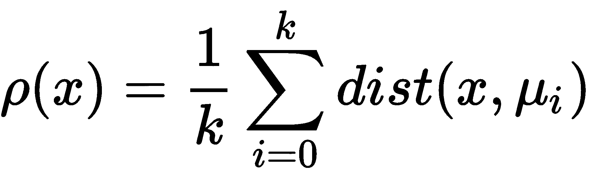

注意  是根据距离（新颖性）度量 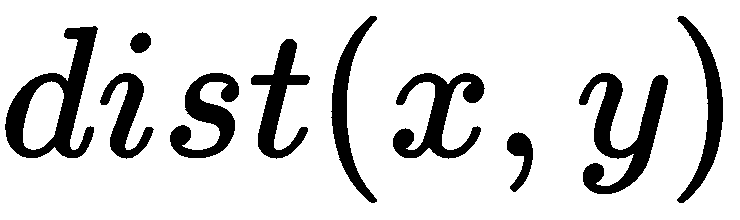 计算的 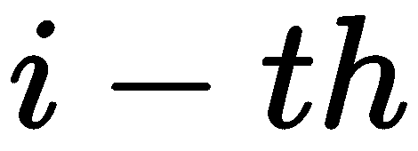  的最近邻。

根据上述公式计算的行为空间特定点的稀疏性是一个可以由适应度函数使用的创新分数。

查找新颖分数的 Python 代码定义在以下函数中：

```py
    def _novelty_avg_knn(self, item, n_items_map, genomes=None, 
                         neighbors=None):
        distances = None
        if genomes is not None:
            distances = self._map_novelty_in_population(item=item, 
                          genomes=genomes, n_items_map=n_items_map)
        else:
            distances = self._map_novelty(item=item)
        distances.sort()
        if neighbors is None:
            neighbors = self.neighbors

        density, weight, distance_sum = 0.0, 0.0, 0.0
        length = len(distances)
        if length >= ArchiveSeedAmount:
            length = neighbors
            if len(distances) < length:
                length = len(distances)
            i = 0
            while weight < float(neighbors) and i < length:
                distance_sum += distances[i].distance
                weight += 1.0
                i += 1
            if weight > 0:
                sparsity = distance_sum / weight
        return sparsity
```

上述函数的主要实现部分如下：

1.  首先，我们检查提供的 `_novelty_avg_knn` 函数的参数是否包含当前种群中所有基因组的列表。如果是这样，我们就开始填充种群中所有基因组的特征行为之间的距离列表，包括来自 `NoveltyArchive` 的所有 `NoveltyItem` 对象。否则，我们使用提供的新颖性项（`item`）来找到它与 `NoveltyArchive` 中所有 `NoveltyItem` 对象之间的距离。

```py
    distances = None
    if genomes is not None:
        distances = self._map_novelty_in_population(item=item, 
                         genomes=genomes, n_items_map=n_items_map)
    else:
        distances = self._map_novelty(item=item)
```

1.  然后，我们将距离列表按升序排序，以便首先得到最小的距离，因为我们对在行为空间中与提供的创新项最接近的点感兴趣：

```py
    distances.sort()
```

1.  接下来，我们初始化计算 k 个最近邻分数所必需的所有中间变量，并测试在之前步骤中收集的距离值数量是否高于 `ArchiveSeedAmount` 常量值：

```py
    if neighbors is None:
        neighbors = self.neighbors

    density, weight, distance_sum = 0.0, 0.0, 0.0
    length = len(distances)
```

1.  现在，我们可以检查找到的距离列表的长度是否小于我们要求测试的邻居数量（`neighbors`）。如果是这样，我们更新相关变量的值：

```py
    if length >= ArchiveSeedAmount:
        length = neighbors
        if len(distances) < length:
            length = len(distances)
```

1.  在所有局部变量都设置为正确值之后，我们可以开始收集每个连接的所有距离和权重的总和的循环：

```py
        i = 0
        while weight < float(neighbors) and i < length:
            distance_sum += distances[i].distance
            weight += 1.0
            i += 1
```

1.  当先前的循环由于计算出的权重值超过指定的邻居数量而退出，或者如果我们已经迭代过`distances`列表中的所有距离值，我们就准备好计算给定项目的新颖性得分，作为到k个最近邻的平均距离：

```py
        if weight < 0:
            sparsity = distance_sum / weight 
```

函数随后返回估计的新颖性得分值。

对于更多实现细节，请参阅[https://github.com/PacktPublishing/Hands-on-Neuroevolution-with-Python/blob/master/Chapter6/novelty_archive.py](https://github.com/PacktPublishing/Hands-on-Neuroevolution-with-Python/blob/master/Chapter6/novelty_archive.py)文件。

# 新颖性度量

新颖性度量是衡量当前解决方案与已知解决方案之间差异的指标。它用于在估计行为空间中当前点到其**k个最近邻**的距离时计算新颖性得分。

在我们的实验中，测量两个代理行为差异的新颖性度量是通过两个轨迹向量之间的**项距离**（每个代理一个向量）确定的。轨迹向量包含迷宫导航代理在模拟期间访问的位置坐标。以下公式给出了该度量的定义：

![img/a61b41a8-e092-4cca-8df7-32742826e827.png]

注意 ![img/cbb7ac77-245c-4bb4-9e7d-415935eedb59.png] 是轨迹向量的大小，而 ![img/ead12303-fc2d-4a5d-9a5c-10b6fa003efc.png] 和 ![img/e8429ede-3355-4312-9e8c-8485763b8fda.png] 是比较轨迹向量 ![img/15e07257-bf42-4ea2-ab1a-83055f6410b7.png] 和 ![img/dacf8b1f-2342-42a5-903b-1a8168bcd0a6.png] 在位置 ![img/15e07257-bf42-4ea2-ab1a-83055f6410b7.png] 的值。

在迷宫导航实验中，我们主要对求解代理的最终位置感兴趣。因此，轨迹向量可能仅包含代理在完成迷宫导航模拟中所有必要步骤后的最终坐标，或者在找到迷宫出口时。

以下是对新颖性度量值估计的Python代码：

```py
def maze_novelty_metric(first_item, second_item):
    diff_accum = 0.0
    size = len(first_item.data)
    for i in range(size):
        diff = abs(first_item.data[i] - second_item.data[i])
        diff_accum += diff

    return diff_accum / float(size)
```

上述代码取两个新颖性项，并找到在迷宫导航模拟中持有相应求解代理位置的两个轨迹向量之间的**项距离**。

# 适应度函数

本章所述实验中使用的适应度函数直接将先前定义的新颖性得分作为基因的适应度值。因此，神经进化过程试图通过使用这种适应度函数来最大化产生个体的新颖性。

在本实验的不同任务中，我们使用各种适应度因素：

+   新颖性得分用于指导神经进化过程（解决方案搜索优化）。它被分配为每个基因的适应度值，并在进化的各个世代中用于基因评估。

+   从迷宫模拟器获得的目标导向适应度分数（到达迷宫出口的距离）用于测试是否实现了最终目标（即找到了迷宫出口）——此外，此值也记录下来以评估每个求解代理的性能。

健身值评估的源代码包含两个函数：

+   评估整个种群适应度分数的回调函数（`eval_genomes`）

+   通过迷宫解决模拟评估单个基因的函数（`eval_individual`）

# 种群适应度评估函数

适应度评估函数是一个回调函数，它注册到NEAT-Python库中，允许该库运行对种群基因进行评估，以解决特定任务的特定条件。我们实现此函数以使用迷宫解决任务评估当前种群中的每个基因，并使用获得的新颖性分数作为基因的适应度值。

NEAT-Python库不允许我们从回调函数发送任何关于任务完成的信号，除了指定获胜基因的特定适应度分数值。这个适应度值必须高于NEAT-Python超参数配置中的适应度阈值。然而，使用NS算法，无法准确估计获胜基因可以实现的新颖性分数的上限。此外，获胜基因的新颖性分数值可能低于在进化过程中，当解决方案搜索空间没有如此彻底探索时，早期获得的基因的值。

因此，鉴于新颖性分数被分配给基因作为它们的适应度值，我们需要想出一个解决方案，使我们能够使用NEAT-Python库定义的标准终止标准。我们通过使用一个足够大的特定指示性新颖性分数值来实现这一点，这个值在正常算法执行过程中可能会遇到。这个值决定了通过NEAT-Python超参数配置提供的终止标准。我们将`800000`用作新颖性分数及其自然对数（约`13.59`）作为适当的适应度阈值。

函数的完整源代码如下：

```py
def eval_genomes(genomes, config):
    n_items_map = {}
    solver_genome = None
    for genome_id, genome in genomes:
        found = eval_individual(genome_id=genome_id, 
                                genome=genome, 
                                genomes=genomes, 
                                n_items_map=n_items_map, 
                                config=config)
        if found:
            solver_genome = genome
    trial_sim.archive.end_of_generation()
    # Now evaluate fitness of each genome in population
    for genome_id, genome in genomes:
        fitness = trial_sim.archive.evaluate_individual_novelty(
                   genome=genome,
                   genomes=genomes,
                   n_items_map=n_items_map,
                   only_fitness=True)
        if fitness > 1:
            fitness = math.log(fitness)
        else:
            fitness = 0
        genome.fitness = fitness

    if solver_genome is not None:
        solver_genome.fitness = math.log(800000) # ~=13.59
```

函数实现的显著部分如下：

1.  首先，我们创建字典以存储评估后的新颖性项目（`n_items_map`），用于种群中每个基因，并遍历种群中的所有基因，评估它们的迷宫解决性能：

```py
    n_items_map = {}
    solver_genome = None
    for genome_id, genome in genomes:
        found = eval_individual(genome_id=genome_id, 
                                genome=genome, 
                                genomes=genomes, 
                                n_items_map=n_items_map, 
                                config=config)
        if found:
            solver_genome = genome
    trial_sim.archive.end_of_generation()
```

1.  之后，我们再次遍历种群中的所有基因，使用估计的新颖性分数为基因分配适应度分数。新颖性分数估计的过程使用在第一次循环（如前所述）中收集的`NoveltyItem`对象，在迷宫解决模拟期间：

```py
    for genome_id, genome in genomes:
        fitness = trial_sim.archive.evaluate_individual_novelty(
                   genome=genome,
                   genomes=genomes,
                   n_items_map=n_items_map,
                   only_fitness=True)
        if fitness > 1:
            fitness = math.log(fitness)
        else:
            fitness = 0
        genome.fitness = fitness
```

1.  最后，如果在第一个循环中找到成功的解决基因组，我们将其分配一个等于前面描述的指示性适应度分数的适应度值（`~13.59`）：

```py
    if solver_genome is not None:
        solver_genome.fitness = math.log(800000) # ~13.59
```

请注意，我们将获得的创新度分数值和指示性创新度分数应用自然对数，以保持它们在数值上的接近。因此，我们可以使用实验期间收集的统计数据正确地绘制性能图表。

# 个体适应度评估函数

这个函数是种群适应度评估的重要组成部分，它通过前面讨论过的`eval_genomes`函数被调用，以评估种群中每个基因组的迷宫解决性能。

通过迷宫导航模拟评估个体基因组作为迷宫解决代理的情况如下：

```py
def eval_individual(genome_id, genome, genomes, n_items_map, config):
    n_item = archive.NoveltyItem(
                        generation=trial_sim.population.generation,
                        genomeId=genome_id)
    n_items_map[genome_id] = n_item
    maze_env = copy.deepcopy(trial_sim.orig_maze_environment)
    control_net = neat.nn.FeedForwardNetwork.create(genome, config)
    goal_fitness = maze.maze_simulation_evaluate(
                                    env=maze_env, 
                                    net=control_net, 
                                    time_steps=SOLVER_TIME_STEPS,
                                    n_item=n_item,
                                    mcns=MCNS)

    if goal_fitness == -1:
        # The individual doesn't meet the min. fitness criterion
        print("Individ with ID %d marked for extinction, MCNS %f" 
               % (genome_id, MCNS))
        return False

    record = agent.AgentRecord(
        generation=trial_sim.population.generation,
        agent_id=genome_id)
    record.fitness = goal_fitness
    record.x = maze_env.agent.location.x
    record.y = maze_env.agent.location.y
    record.hit_exit = maze_env.exit_found
    record.species_id = trial_sim.population.species \
        .get_species_id(genome_id)
    record.species_age = record.generation - \
       trial_sim.population.species.get_species(genome_id).created
    trial_sim.record_store.add_record(record)

    if not maze_env.exit_found:
        record.novelty = trial_sim.archive \
         .evaluate_individual_novelty(genome=genome, 
                       genomes=genomes, n_items_map=n_items_map)

    trial_sim.archive.update_fittest_with_genome(genome=genome, 
                                        n_items_map=n_items_map)
    return maze_env.exit_found
```

让我们深入探讨`eval_individual`函数实现中所有核心部分的意义：

1.  首先，我们创建一个`NoveltyItem`对象来保存与特定基因组相关的创新度分数信息，并将其保存在`n_items_map`字典中的`genome_id`键下：

```py
    n_item = archive.NoveltyItem(
                       generation=trial_sim.population.generation,
                       genomeId=genome_id)
    n_items_map[genome_id] = n_item
```

1.  之后，我们创建原始迷宫环境的深度副本以避免模拟期间的副作用，并从提供的基因组创建控制ANN：

```py
    maze_env = copy.deepcopy(trial_sim.orig_maze_environment)
    control_net = neat.nn.FeedForwardNetwork.create(genome, config)
```

1.  现在，使用迷宫环境的副本和创建的控制ANN，我们执行给定步数的迷宫解决模拟：

```py
    goal_fitness = maze.maze_simulation_evaluate(
                                    env=maze_env, 
                                    net=control_net, 
                                    time_steps=SOLVER_TIME_STEPS,
                                    n_item=n_item,
                                    mcns=MCNS)
```

1.  模拟完成后，返回的基于目标的适应度分数（接近迷宫出口的距离）和其他模拟及基因组参数存储在`AgentRecord`中，然后将其添加到记录存储中：

```py
    record = agent.AgentRecord(
        generation=trial_sim.population.generation,
        agent_id=genome_id)
    record.fitness = goal_fitness
    record.x = maze_env.agent.location.x
    record.y = maze_env.agent.location.y
    record.hit_exit = maze_env.exit_found
    record.species_id = trial_sim.population.species \
        .get_species_id(genome_id)
    record.species_age = record.generation - \
       trial_sim.population.species.get_species(genome_id).created
    trial_sim.record_store.add_record(record)
```

1.  最后，如果给定的基因组不是赢家，我们估计其创新度分数，并在适当的情况下，使用当前基因组的`NoveltyItem`更新`NoveltyArchive`中适应度最高的基因组列表：

```py
    if not maze_env.exit_found:
        record.novelty = trial_sim.archive \
         .evaluate_individual_novelty(genome=genome, 
              genomes=genomes, n_items_map=n_items_map)

    trial_sim.archive.update_fittest_with_genome(genome=genome, 
                                        n_items_map=n_items_map)
```

在这个实验中，基因组的适应度分数定义为两个不同的值，每个值都服务于不同的目的。目标导向的适应度分数有助于测试是否找到了解决方案并收集有用的性能统计数据。基于创新度的适应度分数引导神经进化过程朝着解决行为最大多样性的方向发展，这意味着解决方案搜索的梯度被引导去探索不同的行为，而不存在任何明确的目标。

关于实现的更多细节，请参阅[https://github.com/PacktPublishing/Hands-on-Neuroevolution-with-Python/blob/master/Chapter6/maze_experiment.py](https://github.com/PacktPublishing/Hands-on-Neuroevolution-with-Python/blob/master/Chapter6/maze_experiment.py)文件。

# 尝试简单的迷宫配置

我们使用与上一章中描述的类似的一个简单迷宫配置开始我们的实验。然而，我们不是使用以目标为导向的目标函数，而是使用NS优化方法来指导神经进化过程。我们希望使用新颖性搜索方法可以在更少的进化周期内找到成功的迷宫求解器。

你可以在以下图表中看到简单迷宫的架构：

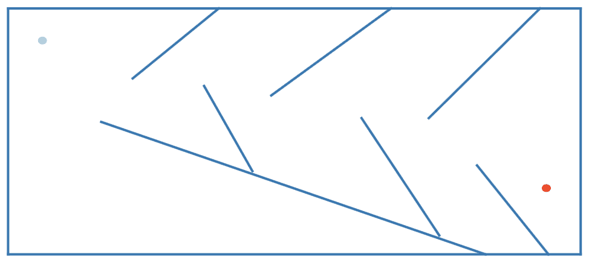

简单迷宫配置

迷宫配置与上一章相同。然而，我们需要调整相应的NEAT超参数以满足NS优化方法的要求。

# 超参数选择

本章所述实验中使用的目标函数基于一个没有明确上限值的创新度指标。因此，适应度阈值值无法精确估计。因此，为了表明找到了获胜的解决方案，我们使用一个足够大以至于在正常算法执行过程中不会遇到的指示值。

我们选择了`800000`作为指示性新颖度分数值。然而，为了在绘制实验结果时保持适应度分数的视觉表现，我们使用自然对数缩小了求解器代理获得的新颖度分数。因此，配置文件中使用的适应度阈值值变为`13.5`，略低于最大可能的适应度分数（`13.59`），以避免浮点数舍入的问题。此外，我们将种群大小从上一章中描述的值（`250`）增加到使解决方案搜索空间更深入，因为我们需要检查迷宫中最大数量的唯一位置：

```py
[NEAT]
fitness_criterion = max
fitness_threshold = 13.5
pop_size = 500
reset_on_extinction = False
```

在每个试验中，我们运行的代数比上一章实验中多。因此，我们将停滞值增加，以使物种保持更长时间：

```py
[DefaultStagnation]
max_stagnation = 100
```

所有其他NEAT超参数的值与上一章中展示的类似。请参考上一章了解选择特定超参数值的原因。

实验中使用的完整超参数列表可以在[https://github.com/PacktPublishing/Hands-on-Neuroevolution-with-Python/blob/master/Chapter6/maze_config.ini](https://github.com/PacktPublishing/Hands-on-Neuroevolution-with-Python/blob/master/Chapter6/maze_config.ini)的`maze_config.ini`文件中找到。

# 工作环境设置

实验的工作环境应包括所有依赖项，并可以使用以下命令使用Anaconda创建：

```py
$ conda create --name maze_ns_neat python=3.5
$ conda activate maze_ns_neat
$ pip install neat-python==0.92 
$ conda install matplotlib
$ conda install graphviz
$ conda install python-graphviz
```

这些命令创建并激活了一个Python 3.5的`maze_ns_neat`虚拟环境。之后，安装了版本0.92的NEAT-Python库，以及我们可视化工具使用的其他依赖项。

# 实验运行器实现

本章中使用的实验运行函数在大多数方面与上一章中使用的函数相似，但具有显著的不同之处，我们将在本节中讨论。

# 试验周期

在本章中，我们介绍了对实验运行函数实现的升级。我们实现了支持顺序运行多个试验直到找到解决方案的功能。这种升级极大地简化了顺序处理多个实验试验的工作，特别是考虑到每个试验可能需要很长时间来执行。

实验运行函数的主循环现在看起来是这样的（参见`maze_experiment.py`脚本中的`__main__`）：

```py
    print("Starting the %s maze experiment (Novelty Search), for %d trials" 
          % (args.maze, args.trials))
    for t in range(args.trials):
        print("\n\n----- Starting Trial: %d ------" % (t))
        # Create novelty archive
        novelty_archive = archive.NoveltyArchive(
                                  threshold=args.ns_threshold,
                                  metric=maze.maze_novelty_metric)
        trial_out_dir = os.path.join(out_dir, str(t))
        os.makedirs(trial_out_dir, exist_ok=True)
        solution_found = run_experiment( config_file=config_path, 
                                        maze_env=maze_env, 
                                        novelty_archive=novelty_archive,
                                        trial_out_dir=trial_out_dir,
                                        n_generations=args.generations,
                                        args=args,
                                        save_results=True,
                                        silent=True)
        print("\n------ Trial %d complete, solution found: %s ------\n" 
               % (t, solution_found))
```

循环运行`args.trials`数量的实验试验，其中`args.trials`是由用户从命令行提供的。

循环的前几行创建了一个`NoveltyArchive`对象，它是新颖性搜索算法的一部分。在特定的试验中，此对象将用于存储所有相关的`NoveltyItems`：

```py
        novelty_archive = archive.NoveltyArchive(
                       threshold=args.ns_threshold,
                       metric=maze.maze_novelty_metric)
```

注意，`maze.maze_novelty_metric`是对用于评估每个求解代理新颖度分数的函数的引用。

在本章的源代码中，我们提供了两个新颖性度量函数的实现：

+   逐项距离新颖性度量（`maze.maze_novelty_metric`）

+   欧几里得距离新颖性度量（`maze.maze_novelty_metric_euclidean`）

然而，在我们的实验中，我们使用第一种实现。第二种实现是为了让你运行额外的实验。

# 实验运行函数

运行函数与上一章中介绍的运行函数有许多相似之处，但同时也具有特定于NS优化算法的独特功能。

在这里，我们考虑实现中的最显著部分：

1.  它从为随机数生成器选择一个特定的种子值开始，这个种子值基于当前系统时间：

```py
    seed = int(time.time())
    random.seed(seed)
```

1.  之后，它加载NEAT算法配置并创建一个初始基因组种群：

```py
config = neat.Config(neat.DefaultGenome, 
                     neat.DefaultReproduction, 
                     neat.DefaultSpeciesSet, 
                     neat.DefaultStagnation, 
                     config_file)
p = neat.Population(config) 
```

1.  为了在每代评估后保存中间结果，我们使用`MazeSimulationTrial`对象初始化一个名为`trial_sim`的全局变量。

我们使用一个全局变量，以便它可以通过传递给NEAT-Python框架的适应度评估回调函数（`eval_genomes(genomes, config)`）进行访问：

```py
    global trial_sim
    trial_sim = MazeSimulationTrial(maze_env=maze_env, 
                                    population=p,
                                    archive=novelty_archive)
```

1.  此外，传统上，我们通过`Population`对象注册报告算法结果和收集统计信息的报告者数量：

```py
    p.add_reporter(neat.StdOutReporter(True))
    stats = neat.StatisticsReporter()
    p.add_reporter(stats)
```

1.  现在，我们已经准备好在指定数量的代数上运行NEAT算法并评估结果：

```py
    start_time = time.time()
    best_genome = p.run(eval_genomes, n=n_generations)
    elapsed_time = time.time() - start_time
    # Display the best genome among generations.
    print('\nBest genome:\n%s' % (best_genome))
    solution_found = \
        (best_genome.fitness >= config.fitness_threshold)
    if solution_found:
        print("SUCCESS: The stable maze solver controller was found!!!")
    else:
        print("FAILURE: Failed to find the stable maze solver controller!!!")
```

1.  之后，收集的统计数据和新颖性存档记录可以被可视化并保存到文件系统：

```py
    node_names = {-1:'RF_R', -2:'RF_FR', -3:'RF_F', -4:'RF_FL', 
                    -5:'RF_L', -6: 'RF_B', -7:'RAD_F', -8:'RAD_L',
                    -9:'RAD_B', -10:'RAD_R', 0:'ANG_VEL', 1:'VEL'}
    visualize.draw_net(config, best_genome, view=show_results, 
                           node_names=node_names, 
                           directory=trial_out_dir, fmt='svg')
    if args is None:
        visualize.draw_maze_records(maze_env, 
                                trial_sim.record_store.records,
                                view=show_results)
    else:
        visualize.draw_maze_records(maze_env, 
                           trial_sim.record_store.records, 
                           view=show_results, width=args.width, 
                           height=args.height,
                           filename=os.path.join(trial_out_dir, 
                                           'maze_records.svg'))
    visualize.plot_stats(stats, ylog=False, 
                          view=show_results,
                          filename=os.path.join(trial_out_dir, 
                                           'avg_fitness.svg'))
    visualize.plot_species(stats, view=show_results, 
                          filename=os.path.join(trial_out_dir, 
                                            'speciation.svg'))
    # store NoveltyItems archive data
    trial_sim.archive.write_fittest_to_file(
                             path=os.path.join(trial_out_dir, 
                                     'ns_items_fittest.txt'))
    trial_sim.archive.write_to_file(
                             path=os.path.join(trial_out_dir, 
                                         'ns_items_all.txt'))
```

1.  最后，我们执行本章中介绍的其他可视化程序，这些程序可视化迷宫求解代理在迷宫中的路径。

我们通过运行迷宫导航模拟，与在进化过程中找到的最佳求解代理的控制器ANN进行对比来实现这一点。在这次模拟运行期间，所有由求解代理访问的路径点都被收集起来，稍后由`draw_agent_path`函数进行渲染：

```py
    maze_env = copy.deepcopy(trial_sim.orig_maze_environment)
    control_net = neat.nn.FeedForwardNetwork.create(
                                            best_genome, config)
    path_points = []
    evaluate_fitness = maze.maze_simulation_evaluate(
                                    env=maze_env, 
                                    net=control_net, 
                                    time_steps=SOLVER_TIME_STEPS,
                                    path_points=path_points)
    print("Evaluated fitness of best agent: %f" 
              % evaluate_fitness)
    visualize.draw_agent_path(trial_sim.orig_maze_environment, 
                             path_points, best_genome,
                             view=show_results, 
                             width=args.width,
                             height=args.height,
                             filename=os.path.join(trial_out_dir,
                                        'best_solver_path.svg'))
```

最后，`run_experiment`函数返回一个布尔值，指示在试验期间是否找到了成功的迷宫求解代理。

请参考位于[https://github.com/PacktPublishing/Hands-on-Neuroevolution-with-Python/blob/master/Chapter6/maze_experiment.py](https://github.com/PacktPublishing/Hands-on-Neuroevolution-with-Python/blob/master/Chapter6/maze_experiment.py)的`maze_experiment.py`文件中的`run_experiment(config_file, maze_env, novelty_archive, trial_out_dir, args=None, n_generations=100, save_results=False, silent=False)`函数。

# 使用NS优化运行简单的迷宫导航实验

确保将所有相关的Python脚本和配置文件（`maze_config.ini`和`medium_maze.txt`）从在线仓库复制到本地目录，该仓库位于：[https://github.com/PacktPublishing/Hands-on-Neuroevolution-with-Python/blob/master/Chapter6/](https://github.com/PacktPublishing/Hands-on-Neuroevolution-with-Python/blob/master/Chapter6/)。

现在进入这个目录，并在终端应用程序中执行以下命令：

```py
python maze_experiment.py -g 500 -t 10 -m medium --width 300 --height 150
```

不要忘记使用以下命令激活适当的虚拟环境：

`conda activate maze_ns_neat`

上述命令运行了10次迷宫导航实验，加载了从`medium_maze.txt`文件加载的简单迷宫配置。神经进化算法在每个试验中评估迷宫求解者的`500`代，使用从`maze_config.ini`文件加载的NEAT配置数据。`width`和`height`参数指定了迷宫记录子图的尺寸（有关更多详细信息，请参阅`visualize.draw_maze_records`函数实现）。

在进化`99`代之后，成功迷宫求解代理在第`100`代被发现。在进化的最后一代中，关于基因组种群的一般统计数据。在完成Python程序的控制台输出中，您将看到以下内容：

```py
 ****** Running generation 100 ****** 

Maze solved in 391 steps
Population's average fitness: 1.28484 stdev: 0.90091
Best fitness: 13.59237 - size: (2, 8) - species 1 - id 48354

Best individual in generation 100 meets fitness threshold - complexity: (2, 8)
```

之后，我们显示获胜基因组的配置和关于试验的一般统计数据：

```py
Best genome:
Key: 48354
Fitness: 13.592367006650065
Nodes:
 0 DefaultNodeGene(key=0, bias=-2.1711339938349026, response=1.0, activation=sigmoid, aggregation=sum)
 1 DefaultNodeGene(key=1, bias=6.576480565646596, response=1.0, activation=sigmoid, aggregation=sum)
Connections:
 DefaultConnectionGene(key=(-10, 1), weight=-0.5207773885939109, enabled=True)
 DefaultConnectionGene(key=(-9, 0), weight=1.7778928210387814, enabled=True)
 DefaultConnectionGene(key=(-7, 1), weight=-2.4940590667086524, enabled=False)
 DefaultConnectionGene(key=(-6, 1), weight=-1.3708732457648565, enabled=True)
 DefaultConnectionGene(key=(-4, 0), weight=4.482428082179011, enabled=True)
 DefaultConnectionGene(key=(-4, 1), weight=-1.3103728328721098, enabled=True)
 DefaultConnectionGene(key=(-3, 0), weight=-0.4583080031587811, enabled=True)
 DefaultConnectionGene(key=(-3, 1), weight=4.643599450804774, enabled=True)
 DefaultConnectionGene(key=(-2, 1), weight=-0.9055329546235956, enabled=True)
 DefaultConnectionGene(key=(-1, 0), weight=-1.5899992185951817, enabled=False)
SUCCESS: The stable maze solver controller was found!!!
Record store file: out/maze_ns/medium/0/data.pickle
Random seed: 1567086899
Trial elapsed time: 7452.462 sec
Plot figure width: 6.8, height: 7.0
Maze solved in 391 steps
Evaluated fitness of best agent: 1.000000
Plot figure width: 7.8, height: 4.0
```

控制台输出显示，编码成功迷宫求解者控制ANN的获胜基因组只有两个节点基因和八个连接基因。这些基因对应于控制器ANN中的两个输出节点，八个连接用于与输入建立联系。控制器ANN的结果配置如下所示：

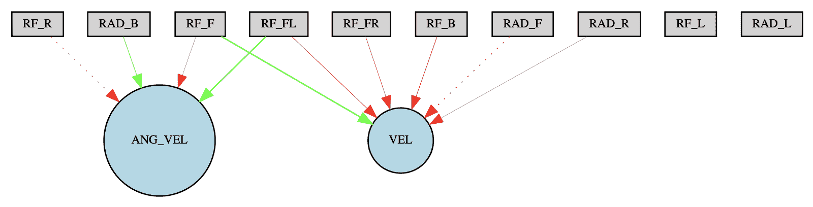

成功控制器ANN的配置

成功控制ANN的配置优于上一章中描述的配置，后者是通过*目标导向*搜索优化方法找到的。在这个实验中，ANN配置完全省略了隐藏节点，进化过程需要更少的代数就能找到它。

因此，我们可以假设新颖性搜索优化方法至少与目标导向方法一样有效。尽管搜索优化方法不是基于对最终目标的接近度，而是基于奖励新颖行为，但这一点仍然成立。神经进化过程产生了一个成功的迷宫求解代理，没有任何关于最终目标（迷宫出口）的提示，这真是太令人惊讶了。

此外，观察进化过程中的物种分化图也很有趣：

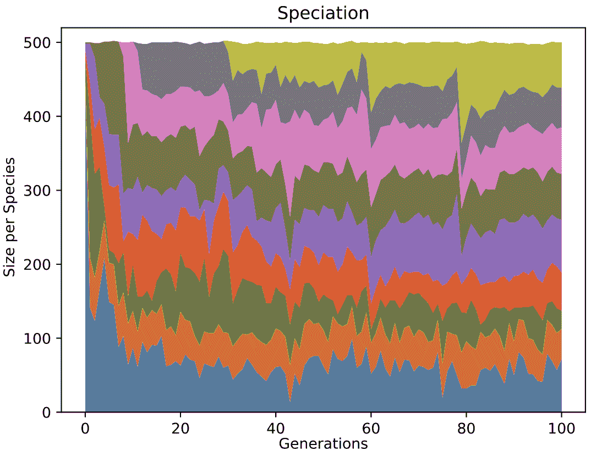

物种分化图

在物种分化图中，我们可以看到在进化过程中物种的总数不超过九种。此外，其中大多数物种从进化的第一代开始就存在，直到找到成功的迷宫求解者。

# 代理记录可视化

我们使用了上一章中介绍的可视化代理记录的方法，并引入了一种新的可视化方法来展示求解代理在迷宫中的路径。

对代理记录的可视化以`obj_medium_maze_records.svg` SVG文件的形式自动保存在对应实验的输出目录中。

在下面的图像中，您可以查看本章所述实验的代理记录可视化：

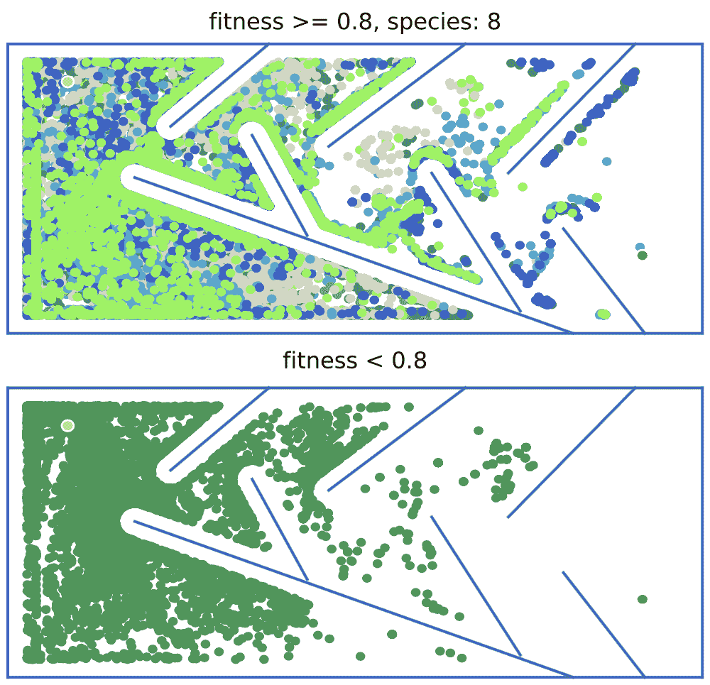

对代理记录的可视化

图表的顶部子图显示了具有目标导向适应度得分值高于**0.8**的最适合物种的代理的最终位置。我们找到了八种物种，它们几乎探索了迷宫的所有区域，并最终找到了迷宫出口。同时，即使是进化失败者（底部图）也表现出高度探索性的行为，均匀地填充了迷宫区域的前半部分（与上一章中的类似图表进行比较）。

此外，值得注意的是，在进化过程中创建的九种物种中有八种表现出最高的目标导向适应度得分；也就是说，它们几乎能够到达迷宫出口（其中一种最终到达了）。这一成就与上一章的实验形成鲜明对比，在上一章的实验中，只有一半的物种（十二种中的六种）达到了相同的结果。

然而，最令人兴奋的可视化允许我们查看能够找到迷宫出口的成功迷宫求解代理的路径：

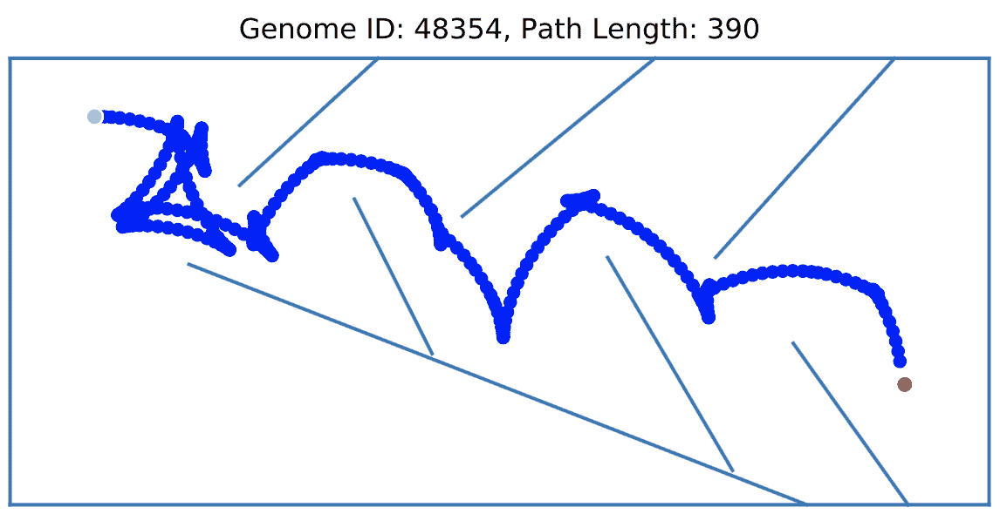

成功迷宫求解者通过迷宫的路径

可视化结果可以在实验的`output`目录下的`best_solver_path.svg`文件中找到。

如你所见，一个成功的迷宫求解代理能够找到迷宫中的几乎最优路径，尽管它在开始时似乎有些困惑。

真是令人难以置信，这样的迷宫路径可以在没有任何关于迷宫出口位置参考的情况下找到，仅仅是通过奖励每个找到的中间解决方案的新颖性。

# 练习1

1.  将`maze_config.ini`文件中的`pop_size`（种群大小）参数设置为`250`。看看在这种情况下是否可以找到迷宫求解器。

1.  修改指定添加新节点概率的参数值（`node_add_prob`）。神经进化过程是否找到了解决方案，并且从拓扑角度来看是否是最优的？

1.  将初始基因组配置修改为零隐藏节点（`num_hidden`）。这如何影响算法的性能？

1.  尝试使用源代码中提供的另一个新颖性度量指标（`maze.maze_novelty_metric_euclidean`）并看看会发生什么。

1.  将命令行参数`location_sample_rate`从默认值（`4000`）修改，这允许你只将迷宫求解器的最终位置包含到其行为向量中。尝试小于`400`（迷宫模拟步骤数）的值。例如，如果我们设置此参数为`100`，那么行为向量将包括每个求解代理最多四个轨迹点的坐标。看看这个参数如何影响算法性能。你可以通过运行以下命令来提供此参数的值：

```py
python maze_experiment.py -g 500 -t 10 -r 100 -m medium --width 300 --height 150
```

上述命令以`location_sample_rate`设置为`100`运行简单的迷宫实验。

# 在难以解决的迷宫配置上进行实验

在下一个实验中，我们评估NS优化方法在更复杂任务中的有效性。在这个任务中，我们尝试进化一个迷宫求解代理，使其能够找到复杂配置的迷宫路径。

对于这个实验，我们使用上一章中引入的难以解决的迷宫配置。这种方法允许我们比较使用NS优化方法获得的结果与上一章中使用的目标导向优化方法获得的结果。迷宫配置如下：

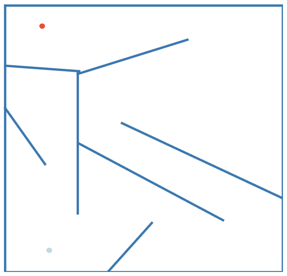

难以解决的迷宫配置

这个迷宫配置与上一章中描述的配置相同。因此，你可以参考[第5章](22365f85-3003-4b67-8e1e-cc89fa5e259b.xhtml)，*自主迷宫导航*，以获取详细描述。

# 超参数选择和工作环境设置

本实验的超参数与我们在本章前面进行的简单迷宫实验中使用的相同。我们决定保持超参数不变，以测试算法通过尝试在同一领域内找到解决方案的能力，但具有不同的配置来测试算法的泛化能力。

本实验的工作环境与为简单迷宫实验创建的环境完全兼容。因此，我们也可以使用它。

# 运行难以解决的迷宫导航实验

要运行此实验，我们可以使用为简单迷宫实验开发的相同实验运行器，唯一的区别是在启动时应该提供不同的命令行参数。你可以使用以下命令启动困难迷宫实验：

```py
$ python maze_experiment.py -m hard -g 500 -t 10 --width 200 --height 200
```

此命令启动了10次试验的难以解决的迷宫实验，每次试验有500代。宽度和高度参数决定了绘制实验期间收集到的迷宫记录的子图的尺寸。

在进行困难迷宫实验时，我们使用NEAT-Python库，在10次试验中未能找到成功的迷宫求解代理，即使使用了NS优化方法。尽管如此，使用NS方法获得的结果比上一章中的目标导向优化方法更有希望。你可以在以下图表中看到这一点，该图表描绘了迷宫导航模拟期间求解代理的最终位置：

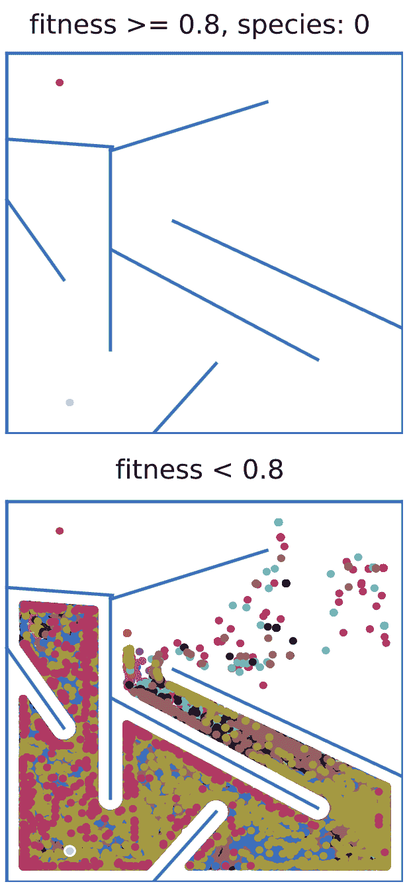

代理记录的可视化

可视化所有评估代理最终位置的图表表明，在这次实验中，使用NS优化方法探索的迷宫区域比使用目标导向方法更多。你还可以看到，某些物种几乎到达终点线，只需几步就能到达迷宫出口。

最成功迷宫求解代理的路径如下：

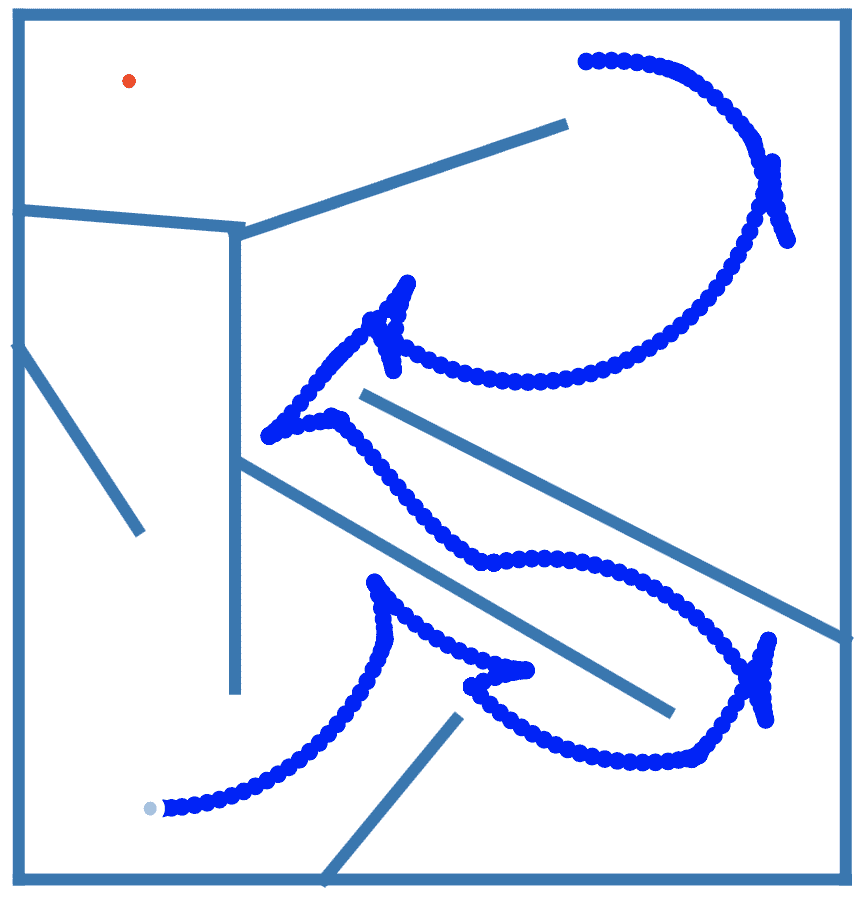

通过最成功迷宫求解代理的迷宫路径

最成功求解代理在迷宫中走过的路径表明，代理能够发现传感器输入与执行动作之间的关键关系。然而，在应用控制信号方面仍缺乏精确性。由于这个缺陷，一些控制动作导致无效的轨迹循环，消耗了宝贵的解决迷宫的时间步数。

最后，看看最成功迷宫求解代理的控制ANN拓扑结构是很有趣的：

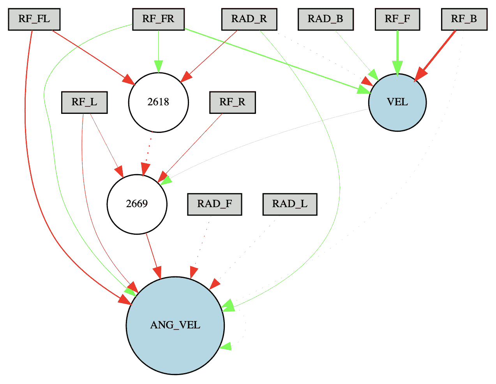

控制ANN的拓扑结构

你可以看到，所有传感器输入都参与了决策，这与本章前一个实验中设计的控制ANN拓扑结构形成对比。此外，网络拓扑包括两个隐藏节点，这使得代理能够实现一个复杂控制策略，以导航通过难以解决的迷宫环境。

尽管在这次实验中，我们未能使用NEAT-Python库通过新颖性搜索优化方法进化出一个成功的迷宫求解代理，但这更多是库中NEAT实现无效的问题，而不是新颖性搜索方法的失败。

我使用GO编程语言实现了一个NEAT算法，该算法以高效率解决了一个困难的迷宫导航任务。你可以在GitHub上查看[https://github.com/yaricom/goNEAT_NS](https://github.com/yaricom/goNEAT_NS)。

# 练习2

在本章的源代码中，我们还提供了基于我们在第2章中介绍的MultiNEAT Python库的实验运行器实现，*Python库和环境设置*。

你可以尝试如下使用它来解决困难迷宫任务：

1.  使用以下命令更新当前Anaconda环境，安装MultiNEAT Python库：

```py
$ conda install -c conda-forge multineat
```

1.  基于MultiNEAT库运行实验运行器实现：

```py
$ python maze_experiment_multineat.py -m hard -g 500 -t 10 --width 200 --height 200
```

这些命令在当前Anaconda环境中安装MultiNEAT库，并使用适当的实验运行器启动10次（每次500代）的困难迷宫实验。

# 摘要

在本章中，你了解了*新颖性搜索*优化方法以及它如何用于指导在欺骗性问题空间环境中的神经进化过程，例如迷宫导航。我们进行了与上一章相同的迷宫导航实验。之后，我们比较了获得的结果，以确定NS方法是否优于上一章中介绍的目标导向优化方法。

你通过使用Python编写源代码获得了实际经验，并尝试调整NEAT算法的重要超参数。此外，我们引入了一种新的可视化方法，让你能够看到代理在迷宫中的路径。使用这种方法，你可以轻松地比较不同代理尝试解决迷宫导航问题的方法，以及找到的迷宫路径是否最优。

下一章将介绍NEAT算法的更多高级应用。我们首先介绍视觉识别任务，并介绍NEAT算法的HyperNEAT扩展。HyperNEAT方法允许你处理大规模的ANN，这些ANN操作在数千或数百万个参数上。这种规模的运算对于经典的NEAT算法是不可能的。
