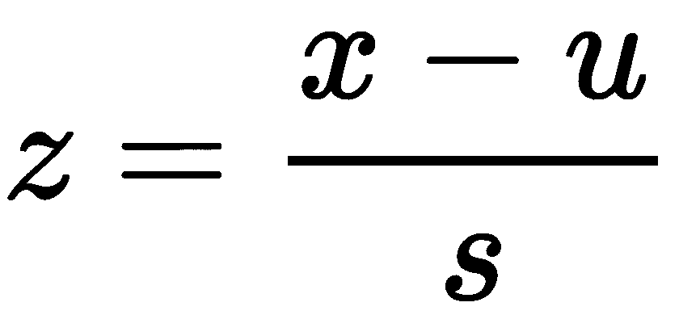
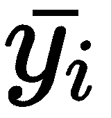
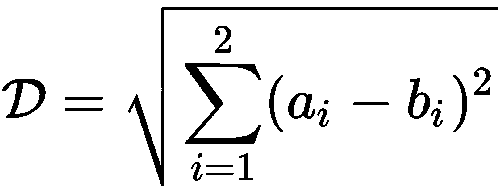

# 第十五章：最佳实践、技巧与窍门

在本章中，我们提供了一些关于编写和分析神经进化算法的最佳实践、技巧和窍门的建议。到本章结束时，你将了解如何开始处理手头的问题，如何调整神经进化算法的超参数，如何使用高级可视化工具，以及可以使用哪些指标来分析算法的性能。此外，你还将了解 Python 的最佳编码实践，这有助于你在项目实施中。

在本章中，我们将涵盖以下主题：

+   从问题分析开始

+   选择最佳搜索优化方法

+   使用高级可视化工具

+   调整超参数并了解应调整的内容

+   理解需要收集哪些性能指标

+   Python 编码技巧与窍门

# 从问题分析开始

从对问题空间的适当分析开始是成功的关键。神经进化对程序员错误宽容。这些错误是环境的一部分，进化过程可以适应它们。然而，有一种特定的错误类别可能会阻碍进化过程找到成功解决方案：进化过程的数值稳定性。大多数类型的激活函数都设计在零到一之间的输入范围内运行。因此，过大或负的值对进化过程的影响不大。

因此，你可能需要预处理输入数据以避免这些数值问题。不要跳过对输入数据样本和分析步骤的分析。

接下来，我们将讨论如何预处理输入数据。

# 预处理数据

总是检查可能的数据输入范围并查找异常值。如果你发现某个输入参数的规模与其他参数相差一个数量级，你需要预处理输入数据样本。否则，具有更高幅度的输入数据特征将对训练过程产生如此显著的影响，以至于它们最终会超过其他输入数据特征的贡献。然而，由小幅度数据输入产生的微小信号通常对于找到成功解决方案至关重要。微妙的输入信号可以表征底层过程中的微妙但宝贵的特性。

# 数据标准化

大多数机器学习算法都从正态分布的输入数据中受益；也就是说，它具有零均值和单位方差。将输入数据缩放到具有零均值和单位方差的一般方法如下公式所示：



注意， 是缩放后的输入分数， 是输入数据样本， 是训练样本的平均值，而  是训练样本的标准差。

你可以使用 Scikit-learn Python 库对你的输入数据样本应用标准缩放。以下源代码是这一点的示例：

```py
>>> from sklearn.preprocessing import StandardScaler
>>> data = [[0, 0], [0, 0], [1, 1], [1, 1]]
>>> scaler = StandardScaler()
>>> print(scaler.fit(data))
StandardScaler(copy=True, with_mean=True, with_std=True)
>>> print(scaler.mean_)
[0.5 0.5]
>>> print(scaler.transform(data))
[[-1\. -1.]
 [-1\. -1.]
 [ 1\. 1.]
 [ 1\. 1.]]
```

在代码中，我们首先创建输入数据样本。之后，使用 `StandardScaler` 对输入样本进行居中和缩放。数据转换的结果显示在代码的最后几行。

数据预处理的另一种方法是缩放特征以适应特定范围，我们将在下一节中讨论。

# 将输入缩放到特定范围

将输入缩放到适应特定范围是数据预处理的另一种方法。这种方法是标准化的替代方案。范围缩放产生位于最小值和最大值之间给定范围内的数据样本。通常，这种方法用于将输入数据缩放到零和一之间的范围。你可以使用 Scikit-learn Python 库中的 `MinMaxScaler` 来缩放数据，如下例所示：

```py
>>> import sklearn.preprocessing
>>> X_train = np.array([[ 1., -1., 2.],
... [ 2., 0., 0.],
... [ 0., 1., -1.]])
...
>>> min_max_scaler = preprocessing.MinMaxScaler()
>>> X_train_minmax = min_max_scaler.fit_transform(X_train)
>>> X_train_minmax
array([[0.5 , 0\. , 1\. ],
       [1\. , 0.5 , 0.33333333],
       [0\. , 1\. , 0\. ]])
```

代码从创建一个样本数据集开始，并使用 `MinMaxScaler` 类对其进行转换。在最终输出中，你可以看到范围缩放转换的结果。

有时，你需要具有相同单位的数据样本。这种预处理类型被称为**归一化**。我们将在下一节中讨论它。

# 数据归一化

通常，你的输入数据特征有不同的度量单位。例如，在平衡杆实验中，小车位置以米为单位测量，线性速度以每秒米为单位，角速度以每秒弧度为单位。将输入数据归一化以简化输入数据特征之间的比较是有益的。

归一化过程有效地从输入数据样本中消除了度量单位。之后，所有样本都将位于零和一之间。

统计学中有不同类型的归一化。我们已提到两种方法：数据标准化和数据范围缩放。此外，Scikit-learn 提供了一个专门的转换器来执行数据归一化，它将单个样本缩放到所谓的单位范数。以下代码演示了如何使用它：

```py
>>> import sklearn.preprocessing
>>> X = [[ 1., -1., 2.],
... [ 2., 0., 0.],
... [ 0., 1., -1.]]
>>> X_normalized = preprocessing.normalize(X, norm='l2')
>>> X_normalized 
array([[ 0.40..., -0.40..., 0.81...],
       [ 1\. ..., 0\. ..., 0\. ...],
       [ 0\. ..., 0.70..., -0.70...]])
```

代码创建测试数据样本，并使用`l2`范数对其进行归一化，然后输出结果。

Scikit-learn 库提供了许多其他数据预处理方法的实现。熟悉它们对你会有所帮助。你可以在 [https://scikit-learn.org/stable/modules/preprocessing.html](https://scikit-learn.org/stable/modules/preprocessing.html) 找到一篇优秀的教程。

# 理解问题域

在本书中，我们讨论的一些实验与物理世界的真实过程有关。为了找到此类过程的成功解决方案，您需要理解其背后的物理定律和原理。例如，平衡小车-杆装置的问题要求我们定义一组完整的运动方程，以编写准确的任务模拟器。

对于机器人领域的许多任务，您还需要编写一个使用底层装置的正确物理模型和方程的模拟器。您需要完全理解该过程的物理，以正确实现模拟器。即使您使用现成的模拟器，理解其中实现的物理原理对您来说也是极其有益的，因为理解现实世界过程的动力学允许您适当地调整训练算法的超参数。

# 编写良好的模拟器

当处理特定问题时，编写一个正确实现模拟过程具体细节的适当模拟器至关重要。如果您使用这样的模拟器，您将能够运行长时间的训练阶段，而使用来自物理设备的直接输入则不可能实现这一点。

一个好的模拟器应该允许您控制模拟过程的单步时间长度。在神经进化过程中，您需要将种群中的每个个体与给定的模拟器进行比较。因此，在训练过程中，使单步时间尽可能短以提高执行速度是有意义的。另一方面，当找到解决方案并需要手动测试时，如果能够以正常执行速度运行模拟器，将是有益的。

此外，您还可以使用现有的成熟模拟器来完成您的项目，这可以为您节省大量时间。熟悉那些经过良好建立的开源模拟器包。它们通常提供高级物理模拟以及为您的虚拟机器人和环境提供的预制的构建块集合。您可以从[https://github.com/cyberbotics/webots](https://github.com/cyberbotics/webots)开始搜索。

接下来，我们将讨论如何为您的实验选择正确的搜索优化方法。

# 选择最佳搜索优化方法

在本书中，我们向您介绍了两种基本的搜索优化方法：目标导向搜索和新颖性搜索。前者方法更易于实现和理解。然而，新颖性搜索在适应度函数具有许多局部最优陷阱的欺骗性景观的情况下非常有用。

在下一节中，我们将简要讨论这两种方法，以提醒您细节并帮助您在特定情况下选择使用哪一种。我们首先从目标导向搜索开始。

# 目标导向搜索优化

目标导向搜索优化基于测量解决方案与最终目标之间的接近程度。为了计算到目标的平均距离，它通常使用均方误差等度量。接下来，我们将讨论均方误差度量的具体细节。

# 均方误差

均方误差是获得的结果与实际值之间平均平方差的平均值。它由以下公式给出：


这里是估计值，而是实际值。

我们使用均方误差的变体来定义XOR实验的目标函数。接下来，我们将讨论与欧几里得空间中的定位相关问题的目标导向度量。

# 欧几里得距离

欧几里得距离是适用于与欧几里得问题空间中的导航相关的任务的适当度量。在欧几里得问题空间中，我们将问题目标定义为具有特定坐标的点。

使用欧几里得距离，可以轻松计算导航代理位置与其试图到达的目标点之间的距离。以下公式计算两个向量之间的欧几里得距离：



这里是具有代理位置的向量与具有代理最终目标的向量之间的欧几里得距离。我们使用这个度量来定义[第5章](22365f85-3003-4b67-8e1e-cc89fa5e259b.xhtml)“自主迷宫导航”中代理在迷宫中导航的目标函数。

然而，自主迷宫导航的问题是由欺骗性的适应度函数景观引起的，这使得目标导向搜索优化效率低下。接下来，我们将讨论新颖搜索优化方法，它能够解决这种低效问题。

# 新颖搜索优化

正如我们提到的，通过迷宫导航是一个具有欺骗性的问题，需要不同的方法来定义适应度函数。在[第5章](22365f85-3003-4b67-8e1e-cc89fa5e259b.xhtml)“自主迷宫导航”中，我们向您展示了一种特定的迷宫配置，该配置产生具有目标导向适应度分数强局部最优的区域。因此，训练过程可能会被困在这些区域中，并无法产生成功的解决方案。新颖搜索优化方法被设计用来解决欺骗性适应度函数景观的问题。

新颖性搜索奖励的是解决方案的新颖性，而不是其与最终目标的接近程度。此外，用于计算每个解决方案适应度分数的新颖性指标，完全忽略了解决方案与最终目标的接近程度。有两种流行的计算新颖性分数的方法：

+   新颖性分数是从解决方案架构的差异中计算出来的。

+   新颖性是通过在共同行为空间中解决方案行为的独特变化来计算的。

前者计算当前解决方案编码与所有先前解决方案编码之间的差异。后者将当前解决方案在行为空间中产生的结果与其他解决方案产生的结果进行比较。

我们使用基于暴露行为独特性的新颖性分数来定义迷宫求解器的适应度函数。迷宫求解器在迷宫中的轨迹完全决定了代理的行为空间，并可用于计算新颖性分数。在这种情况下，新颖性分数是当前解决方案轨迹向量和所有其他解决方案轨迹向量之间的欧几里得距离。

现在我们已经讨论了选择适当的搜索优化方法的重要性，我们可以继续讨论实验成功的另一个重要方面。你需要对实验结果有一个良好的可视化，以便对其性能有深入了解。接下来，我们将讨论结果的可视化。

# 高级可视化

几乎总是，正确地可视化输入和结果对于实验的成功至关重要。有了正确的可视化，你将获得关于出了什么问题以及需要修复什么的直观见解。

总是尝试可视化模拟器执行环境。这种可视化可以在你得到意外结果时节省你数小时的调试时间。通常，有了足够的可视化，你可以一眼看出哪里出了问题，例如一个在角落里卡住的迷宫求解器。

在使用神经进化算法时，你还需要可视化每一代的遗传算法执行性能。你需要从一代到一代地可视化物种形成，以查看进化过程是否已经停滞。停滞的进化无法创造出足够的物种来维持求解器之间的健康多样性。另一方面，过多的物种通过减少不同生物之间繁殖的机会来阻碍进化。

另一个重要的可视化使我们能够看到产生的表型**人工神经网络**（**ANN**）的拓扑结构。检查产生的解决方案的拓扑结构是否满足我们的期望是有用的。例如，当我们讨论第 8 章[模块化视网膜问题](9f3dce4d-2cc7-4307-a704-bfcfe4ad56b4.xhtml)时，*ES-HyperNEAT 和视网膜问题*，看到模块化结构在成功解决方案的拓扑结构中进化是有益的。

您需要熟悉标准的 Python 科学绘图库，以便为您的实验结果创建足够的可视化。掌握像 Matplotlib ([https://matplotlib.org](https://matplotlib.org/)) 和 Seaborn ([https://seaborn.pydata.org](https://seaborn.pydata.org/)) 这样的可视化库的实用技能是至关重要的。

接下来，我们讨论超参数调整对神经进化过程性能的重要性。

# 调整超参数

通过适当调整超参数，您可以极大地提高神经进化过程的训练速度和效率。以下是一些实用技巧：

+   使用不同的随机数生成器种子值进行短时间运行，并注意算法性能的变化。之后，选择给出最佳性能的种子值，并用于长时间运行。

+   您可以通过降低兼容性阈值和略微增加不交/过剩权重系数的值来增加种群中的物种数量。

+   如果神经进化过程在尝试找到解决方案时遇到了困难，尝试降低 NEAT 生存阈值的值。这个系数维持了种群中最佳生物体繁殖的机会比例。通过这样做，您可以根据其适应度分数提高允许繁殖的个体的质量。

+   通过增加最大停滞年龄，您可以确保物种有足够的时间在进化的后期阶段引入有益的突变。有时，这样的操作可以帮助恢复停滞的神经进化过程。然而，您应该始终尝试使用小的停滞年龄值（15-20）来启动物种的快速轮换，并且只有在所有其他调整都失败的情况下才显著增加此参数。

+   在调整超参数后，进行几十代的短时间运行，以观察性能变化动态。特别关注物种数量——种群中至少应该有多个物种。物种过多也是一个不良信号。通常，5 到 20 个物种是一个良好的范围。

+   使用实验结果的可视化来快速了解实验的性能。永远不要错过可视化发现解决方案的ANN拓扑结构的机会。这些可视化可以给你提供无价的见解，告诉你如何调整神经进化过程。

+   不要浪费时间去进行长时间的进化运行。如果实验在1,000代内未能找到成功解决方案，那么很可能你的代码或你使用的库存在问题。对于大多数简单问题，成功解决方案甚至可以在100代内找到。

+   种群大小是进化过程中的一个关键参数。在过程一开始，较大的种群就能带来很大的多样性，从而推动过程的发展。然而，大种群难以计算。因此，种群大小和计算成本之间总是存在权衡。作为一个经验法则，如果你在寻找其他合适的超参数时遇到困难，尝试增加种群大小，看看是否有所帮助。但要做好准备，等待额外的神经进化过程完成时间。

+   总是打印调试信息，这样你可以从评估的任何阶段重新启动实验。当你计算两天后发现解决方案，但由于一些编程错误，你的程序在尝试输出祝贺信息时崩溃，这总是令人痛苦。你需要在每个试验的开始至少输出随机种子值。这可以保证在失败的情况下，你可以准确地重新创建所有进化的代数。

不要低估超参数调整的重要性。即使考虑到神经进化过程可以处理许多编程错误，选择正确的超参数也可以显著提高过程的效率。结果，你将能够在数百代而不是数千代或更多代内找到成功解决方案。

为了比较不同解决方案的性能，你需要使用适当的性能指标，我们将在下面讨论。

# 性能指标

在找到成功解决方案之后，将其与其他解决方案进行比较以估计其好坏至关重要。有许多重要的统计指标可以比较不同的模型。

熟悉精度分数、召回分数、F1分数、ROC AUC和准确率等概念。理解这些指标将帮助你比较不同模型在各种分类任务中产生的结果。接下来，我们将简要概述这些指标。

# 精度分数

精度分数试图回答有多少个阳性识别实际上是正确的。精度分数可以按以下方式计算：


TP是真正阳性，FP是假阳性。

# 回忆分数

召回度分数回答了有多少实际正样本被正确识别的问题。召回度分数可以用以下公式给出：


TP是真正例，FN是假负例。

# F1分数

F1分数是精确度和召回度分数的加权平均值。F1分数的最佳值是1，最差值是0。F1分数允许测量特定类别的分类准确度。它可以定义为以下：


这里是精确度分数，而是与特定正类相关的召回度分数。

在下一节中，我们将探讨**接收者操作特征**（**ROC**）曲线和**曲线下面积**（**AUC**）。

# ROC AUC

我们通过在不同阈值下绘制真正例率与假正例率来创建ROC曲线。它显示了分类模型在不同阈值下的性能。

**真正例率**（**TPR**）是召回的同义词，我们之前讨论过。它可以由以下公式给出：


假正例率的计算方法如下：


TN代表真正例。

AUC允许我们估计分类模型的判别能力，即模型正确对随机正样本点进行排序高于随机负样本点的能力。以下是一个ROC曲线的示例：


ROC曲线示例

在图中，你可以看到ROC曲线的示例。AUC越大，分类器模型越准确。虚线表示最差的分类器准确度。一般来说，ROC曲线越接近左上角，分类模型的性能越好。

# 准确度

准确度是一个衡量我们的模型能够产生多少正确预测的指标。准确度由以下公式给出：


FP代表假正例，FN代表假负例。

更多关于描述的指标详情可以在[https://scikit-learn.org/stable/auto_examples/model_selection/plot_precision_recall.html](https://scikit-learn.org/stable/auto_examples/model_selection/plot_precision_recall.html)找到。

接下来，我们讨论Python编码技巧。

# Python编码技巧和窍门

决定使用Python后，学习该语言的最佳编码实践至关重要。在这里，我们为您提供一些建议，并指导您继续自学。

# 编码技巧和窍门

以下编码技巧和窍门将帮助您掌握Python：

+   您应该学习如何使用流行的机器学习库，例如 NumPy ([https://numpy.org](https://numpy.org/))、pandas ([https://pandas.pydata.org](https://pandas.pydata.org/)) 和 Scikit-learn ([https://scikit-learn.org/stable/](https://scikit-learn.org/stable/))。掌握这些库将在数据处理和分析方面给您带来巨大的力量。这将帮助您避免许多错误，并使从实验中收集的结果易于调试。

+   了解面向对象的编程范式。这将使您能够编写清晰且易于维护的源代码，易于理解。您可以从 [https://www.datacamp.com/community/tutorials/python-oop-tutorial](https://www.datacamp.com/community/tutorials/python-oop-tutorial) 开始。

+   不要将所有内容都写在一个巨大的函数中。将您的代码分解成更小的可重用块，实现为函数或类，这些函数或类可以在多个项目中重用，并且易于调试。

+   打印相关的调试输出以了解您的实现中正在发生什么。足够的调试输出允许您了解执行过程中出现的问题。

+   在您的源代码中编写与函数、类和复杂位置相关的注释。好的注释可以显著帮助代码的可理解性。在开始实现之前编写注释也有助于您澄清思路。

+   在给函数编写注释时，描述所有输入和输出参数及其默认值（如果有的话）。

+   如果你决定继续使用 Python，花些时间学习 Python 的标准库。Python 是一种成熟的编程语言，其中包含了许多嵌入到其标准库中的实用函数。它还提供了许多高级数据处理功能，这些功能可用于机器学习任务。更多关于标准 Python 库的详细信息可以在 [https://docs.python.org/3/library/index.html](https://docs.python.org/3/library/index.html) 找到。

+   在给变量和类命名时，遵循标准的 Python 源代码约定。遵循标准命名约定可以使您的代码对熟悉 Python 的人来说更易于阅读和理解。更多详细信息可以在 [https://docs.python-guide.org/writing/style/](https://docs.python-guide.org/writing/style/) 和 [https://www.python.org/dev/peps/pep-0008/](https://www.python.org/dev/peps/pep-0008/) 找到。

+   使自己熟悉现代版本控制系统，如 Git。**版本控制系统**（**VCS**）是您可用的强大工具，可能会为您节省数小时甚至数天的时间，以恢复因硬盘故障而丢失的工作。您可以在 [https://github.github.com/training-kit/downloads/github-git-cheat-sheet.pdf](https://github.github.com/training-kit/downloads/github-git-cheat-sheet.pdf) 和 [https://www.atlassian.com/git/tutorials](https://www.atlassian.com/git/tutorials) 了解 Git。

+   了解在线代码仓库，例如GitHub ([https://github.com](https://github.com)) 和 Bitbucket ([https://bitbucket.org](https://bitbucket.org/))，在这些平台上你可以分享你的源代码并研究其他数据科学家的源代码。

编写良好实现的重要方面之一是正确设置工作环境并使用适当的编程工具。

# 工作环境和编程工具

总是使用成熟的Python包管理器之一，如Anaconda Distribution，来正确设置你的工作环境是个好主意。作为额外的好处，你将获得大量免费的科学和机器学习包，这些包可以一键安装。此外，Anaconda Distribution处理所有间接依赖项的管理，并帮助你保持所有包的最新状态。你可以在[https://www.anaconda.com/distribution/](https://www.anaconda.com/distribution/)找到Anaconda Distribution。

在每个实验中始终为你的实验创建一个新的虚拟Python环境。之后，如果依赖项出现问题，你将能够通过一条命令清理一切并从头开始。可以使用以下方式使用Anaconda Distribution创建新的Python环境：

```py
$ conda create --name <name>
$ conda activate <name>
```

在创建新环境时，始终指定你计划在其中使用的确切Python版本。提供确切版本将帮助你避免由不兼容性引起的大量意外。可以按以下方式为新环境定义Python版本：

```py
$ conda create --name <name> python=3.5
```

如果你需要在项目中使用新的依赖项，首先检查Anaconda Cloud中是否存在适当的安装包。通过使用Anaconda Cloud中的库，你可以避免间接依赖安装的问题。此外，一些框架，如TensorFlow，需要安装额外的系统驱动程序和头文件。这项任务可能非常繁琐，并需要额外的专业知识。

使用支持代码补全、文档浏览和维护虚拟Python环境的良好代码编辑器。一个好的起点是Visual Studio Code——由微软提供的免费编辑器。你可以在[https://code.visualstudio.com](https://code.visualstudio.com/)找到它。

使自己熟悉现代Linux系统，如Ubuntu。大多数机器学习库在Linux上使用起来都更容易。这对于使用GPU加速的库尤其如此。有关Ubuntu及其安装的更多详细信息，请参阅[https://ubuntu.com](https://ubuntu.com/)。

# 摘要

在本章中，我们为你提供了实用的技巧，希望这些技巧能让你生活更轻松。你了解了数据预处理的标准化方法，以及可以用来评估你创建的模型性能的传统统计指标。最后，你学习了如何提高你的编码技能以及在哪里寻找有关Python和机器学习主题的更多信息。

在下一章中，我们将回顾一些基于我们在书中所学到的内容以及我们将来可以在哪里应用我们所学概念的总结性评论。
