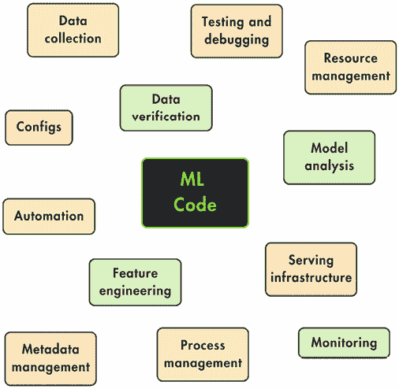
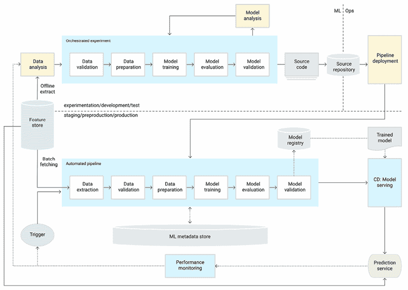
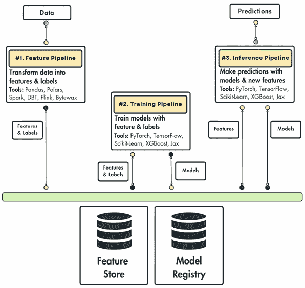
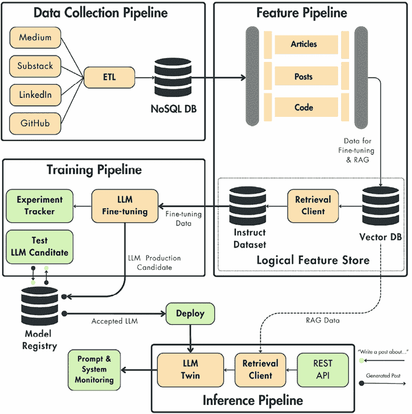

# 1

# 理解 LLM Twin 的概念和架构

到这本书的结尾，我们将带你完成构建一个端到端**大型语言模型**（**LLM**）产品的旅程。我们坚信，了解 LLMs 和生产的**机器学习**（**ML**）的最佳方式是通过亲自动手构建系统。这本书将向你展示如何构建一个 LLM Twin，这是一个通过将特定人的风格、声音和个性融入 LLM 来学习写作的 AI 角色。通过这个例子，我们将带你了解完整的 ML 生命周期，从数据收集到部署和监控。在实现你的 LLM Twin 过程中学到的多数概念都可以应用于其他基于 LLM 或 ML 的应用。

当开始实施新产品时，从工程角度来看，在开始构建之前，我们必须经历三个规划步骤。首先，理解我们试图解决的问题以及我们想要构建的内容至关重要。在我们的案例中，LLM Twin 究竟是什么，为什么构建它？这一步是我们必须梦想并专注于“为什么”。其次，为了反映现实世界场景，我们将设计一个具有最小功能的产品第一迭代。在这里，我们必须明确定义创建一个有效且有价值的产品所需的核心功能。选择基于时间表、资源和团队的知识。这是我们将梦想与现实之间的差距连接起来，并最终回答以下问题的地方：“我们将构建什么？”。

最后，我们将进行系统设计步骤，概述构建 LLM 系统所使用的核心架构和设计选择。请注意，前两个组件主要是与产品相关的，而最后一个则是技术性的，专注于“如何”。

这三个步骤在构建现实世界产品时是自然而然的。即使前两个步骤不需要太多的 ML 知识，但理解“如何”以清晰的愿景构建产品是至关重要的。简而言之，本章涵盖了以下内容：

+   理解 LLM Twin 的概念

+   规划 LLM Twin 产品的最小可行产品（MVP）

+   使用特征/训练/推理管道构建 ML 系统

+   设计 LLM Twin 的系统架构

到本章结束时，你将清楚地了解在整个书中你将学习如何构建的内容。

# 理解 LLM Twin 的概念

第一步是明确我们想要创造什么，以及为什么构建它是宝贵的。LLM Twin 的概念是新的。因此，在深入技术细节之前，理解它是什么，我们应该期望它做什么，以及它应该如何工作是非常重要的。对最终目标的稳固直觉使得消化本书中提出的理论、代码和基础设施变得更加容易。

## 什么是 LLM Twin？

简而言之，LLM 双胞胎是一个将你的写作风格、声音和个性融入 LLM（一个复杂的 AI 模型）的 AI 角色。这是你自己的数字版本，*投射*到 LLM 中。与在互联网上训练的通用 LLM 不同，LLM 双胞胎是在你自己的基础上微调的。自然地，作为一个 ML 模型反映了它所训练的数据，这个 LLM 将融入你的写作风格、声音和个性。我们故意使用了“投射”这个词。就像任何其他投射一样，你会在过程中丢失大量信息。因此，这个 LLM 不会*成为你*；它将复制在它所训练的数据中反映出的你的那一面。

理解这一点至关重要：LLM 反映了它所训练的数据。如果你给它喂莎士比亚的作品，它就会开始像他一样写作。如果你用比莉·艾利什的作品训练它，它就会开始以她的风格写歌。这也被称为风格迁移。这个概念在生成图像中也很普遍。例如，假设你想要用梵高的风格创建一张猫的图片。我们将利用风格迁移策略，但不是选择一个个性，而是基于我们自己的个性来做。

为了调整 LLM 以适应给定的风格和声音，并在微调的同时，我们还将利用各种高级**检索增强生成**（**RAG**）技术，以我们自己的先前嵌入来条件化自回归过程。

我们将在第五章中探讨微调的细节，在第四章和第九章中探讨 RAG，但就目前而言，让我们看看一些例子，直观地理解我们之前所说的。

这里有一些场景，说明你可以在 LLM 上进行微调以成为你的双胞胎：

+   **LinkedIn 帖子和 X 线程**：将 LLM 专门化，用于撰写社交媒体内容。

+   **与朋友和家人交流的消息**：将 LLM 调整为你未经过滤的自我版本。

+   **学术论文和文章**：校准 LLM 以撰写正式和有教育意义的内容。

+   **代码**：将 LLM 专门化，使其以你的方式实现代码。

所有的前述场景都可以归结为一个核心策略：收集你的数字数据（或其部分）并使用不同的算法将其喂给 LLM。最终，LLM 反映了收集到的数据的声调和风格。简单，对吧？

不幸的是，这引发了许多技术和道德问题。首先，在技术方面，我们如何访问这些数据？我们是否有足够的数字数据将自己投射到 LLM 中？哪种数据是有价值的？其次，在道德方面，我们是否应该首先做这件事？我们是否想要创造一个自己的复制品？它将使用我们的声音和个性写作，还是只是试图复制它？

记住，本节的作用不是纠结于“是什么”和“怎么做”，而是关注“为什么”。让我们了解为什么拥有你的 LLM 双胞胎是有意义的，为什么它有价值，以及如果我们正确地界定问题，为什么在道德上是正确的。

## 为什么建立 LLM 双胞胎很重要

作为一名工程师（或任何其他职业），建立个人品牌比标准的简历更有价值。创建个人品牌最大的问题是，在 LinkedIn、X 或 Medium 等平台上撰写内容需要花费大量时间。即使你喜欢写作和创作内容，你最终也会耗尽灵感或时间，并感觉需要帮助。我们不希望将这一部分变成一个推销，但我们必须清楚地了解这个产品/项目的范围。

我们希望构建一个 LLM Twin，使用我们的风格和声音在 LinkedIn、X、Instagram、Substack 和 Medium（或其他博客）上撰写个性化内容。它不会用于任何不道德的场景，但它将作为你的写作共同飞行员。基于本书中我们将教授你的内容，你可以发挥创意并适应各种用例，但我们将专注于生成社交媒体内容和文章的利基市场。因此，我们不必从头开始撰写内容，我们可以将我们主要想法的框架输入 LLM Twin，让它做苦力工作。

最终，我们必须检查一切是否正确，并按照我们的喜好进行格式化（更多关于具体功能的内容请参阅*规划 LLM Twin 产品的 MVP*部分）。因此，我们设想自己成为一位内容写作的 LLM Twin，这将帮助我们自动化写作过程。如果我们尝试在不同的场景中使用这个特定的 LLM，它很可能会失败，因为这就是我们将通过微调、提示工程和 RAG 来专门化 LLM 的地方。

那么，为什么构建 LLM Twin 很重要呢？它可以帮助你做到以下几点：

+   创建你的品牌

+   自动化写作过程

+   灵感激发新的创意想法

W**共同飞行员和 LLM Twin 之间的区别是什么？**

共同飞行员和数字双胞胎是两个不同的概念，它们可以协同工作并组合成一个强大的解决方案：

+   共同飞行员是一个 AI 助手或工具，它增强了人类用户在编程、写作或内容创作任务中的能力。

+   双胞胎是现实世界实体的 1:1 数字表示，通常使用 AI 来弥合物理世界和数字世界之间的差距。例如，LLM Twin 是一个学习模仿你声音、个性和写作风格的 LLM。

在这些定义的基础上，一个像你一样写作的内容创作 AI 助手就是你的 LLM Twin 共同飞行员。

此外，理解构建 LLM Twin 完全是道德的至关重要。LLM 将仅在我们个人的数字数据上进行微调。我们不会收集和使用他人的数据来试图模仿任何人的身份。我们有一个明确的目标：创建我们的个性化写作复制品。每个人都将拥有自己的 LLM Twin，并受到限制的访问权限。

当然，涉及许多安全问题，但在这里我们不会深入探讨，因为这可能是一本自己的书。

## 为什么不使用 ChatGPT（或另一个类似的聊天机器人）？

本小节将讨论在生成个性化内容的情况下使用 ChatGPT（或类似聊天机器人）。

我们已经提供了答案。ChatGPT 并没有 *个性化* 到你的写作风格和声音。相反，它非常通用、不连贯且冗长。在建立品牌时保持原创声音对于长期成功至关重要。因此，直接使用 ChatGPT 或 Gemini 并不会产生最佳结果。即使你愿意分享非个性化的内容，盲目使用 ChatGPT 也可能导致以下情况：

+   **由于幻觉而产生的不实信息**：手动检查结果以查找幻觉或使用第三方工具评估你的结果是一个繁琐且低效的经历。

+   **繁琐的手动提示**：你必须手动制作你的提示并注入外部信息，这是一个令人疲惫的经历。此外，由于你无法完全控制你的提示和注入的数据，生成的答案在多个会话之间难以复制。你可以通过使用 API 和 LangChain 等工具来解决部分问题，但你需要编程经验才能做到这一点。

根据我们的经验，如果你想要提供真正价值的高质量内容，你将花费更多的时间调试生成的文本，而不是自己编写。

LLM Twin 的关键在于以下方面：

+   我们收集哪些数据

+   我们如何预处理数据

+   我们如何将数据输入到 LLM 中

+   我们如何链式多个提示以获得期望的结果

+   我们如何评估生成的内容

LLM 本身很重要，但我们想强调的是，使用 ChatGPT 的网页界面在管理和注入各种数据源或评估输出方面非常繁琐。解决方案是构建一个 LLM 系统，该系统封装并自动化以下所有步骤（每次手动复制并不是一个长期且可行的解决方案）：

+   数据收集

+   数据预处理

+   数据存储、版本控制和检索

+   LLM 微调

+   RAG

+   内容生成评估

注意，我们从未说过不要使用 OpenAI 的 GPT API，只是我们将要介绍的 LLM 框架是 LLM 无关的。因此，如果它可以被程序化操作并暴露微调接口，它就可以集成到我们将学习构建的 LLM Twin 系统中。大多数成功的 ML 产品关键在于以数据为中心，并使你的架构模型无关。因此，你可以快速在你的特定数据上对多个模型进行实验。

# 规划 LLM Twin 产品的 MVP

既然我们已经了解了 LLM Twin 是什么以及为什么我们要构建它，我们必须明确定义产品的功能。在这本书中，我们将关注第一代产品，通常被称为**最小可行产品**（**MVP**），以遵循大多数产品的自然周期。在这里，主要目标是使用可用的资源将我们的想法与实际可行的商业目标对齐，以生产产品。即使作为一个工程师，随着你责任的增加，你也必须经历这些步骤，以弥合商业需求与可实现实施之间的差距。

## 什么是 MVP？

MVP 是产品的一个版本，它包含足够的功能来吸引早期用户，并在开发的初始阶段测试产品概念的可行性。通常，MVP 的目的是以最小的努力从市场收集见解。

MVP 是一种强大的策略，原因如下：

+   **加速上市时间**：快速推出产品以获得早期吸引力

+   **理念验证**：在投入产品全面开发之前，用真实用户测试它

+   **市场研究**：深入了解哪些内容与目标受众产生共鸣

+   **风险最小化**：减少可能不会取得市场成功的产品所需的时间和资源

坚持 MVP 中的 *V* 是至关重要的，这意味着产品必须是**可行的**。产品必须提供一个端到端的用户旅程，没有半成品的功能，即使产品很简陋。它必须是一个具有良好用户体验的运行产品，人们会喜欢并希望继续使用它，以查看它如何发展到其全部潜力。

## 定义 LLM Twin MVP

作为一种思想实验，让我们假设我们不是为这本书构建这个项目，而是想制作一个真正的产品。在这种情况下，我们的资源是什么？不幸的是，并不多：

+   我们是一个由三个人组成的团队，其中有两个机器学习工程师和一个机器学习研究员

+   我们的笔记本电脑

+   用于计算的个人资金，例如训练 LLM

+   我们的热情

正如你所见，我们资源有限。即使这只是一个思想实验，它也反映了大多数初创公司在创业初期的现实情况。因此，我们必须在定义我们的 LLM Twin MVP 以及我们想要选择的功能时非常策略。我们的目标很简单：我们希望最大化产品的价值，相对于投入的努力和资源。

为了保持简单，我们将构建以下功能，以供 LLM Twin 使用：

+   从你的 LinkedIn、Medium、Substack 和 GitHub 个人资料收集数据

+   使用收集到的数据微调开源 LLM

+   使用我们的数字数据为 RAG 填充向量数据库（DB）

+   利用以下内容创建 LinkedIn 帖子：

    +   用户提示

    +   RAG 以重用和引用旧内容

    +   为 LLM 提供新帖子、文章或论文作为额外的知识

+   拥有一个简单的网页界面来与 LLM Twin 交互，并能够执行以下操作：

    +   配置你的社交媒体链接并触发收集步骤

    +   发送提示或链接到外部资源

这将是 LLM Twin MVP。即使它听起来不多，记住我们必须使这个系统具有成本效益、可扩展性和模块化。

即使只关注本节中定义的 LLM Twin 的核心功能，我们也会考虑到最新的 LLM 研究和最佳软件工程以及 MLOps 实践来构建产品。我们的目标是向您展示如何构建一个成本效益高且可扩展的 LLM 应用程序。

到目前为止，我们已经从用户和企业的角度审视了 LLM Twin。最后一步是从工程角度审视它，并制定一个开发计划来了解如何从技术上解决它。从现在起，本书的重点将转向 LLM Twin 的实现。

# 使用特征/训练/推理管道构建 ML 系统

在深入了解 LLM Twin 架构的具体细节之前，我们必须了解架构核心的一个 ML 系统模式，称为**特征/训练/推理**（**FTI**）架构。本节将介绍 FTI 管道设计的一般概述以及它如何结构化 ML 应用程序。

让我们看看如何将 FTI 管道应用于 LLM Twin 架构。

## 构建 ML 系统的问题

构建生产就绪的 ML 系统远不止训练一个模型。从工程角度来看，在大多数用例中，训练模型是最直接的一步。然而，当决定正确的架构和超参数时，训练模型变得复杂。这不仅仅是一个工程问题，而是一个研究问题。

在这一点上，我们想要专注于如何设计一个生产就绪的架构。训练一个高精度的模型非常有价值，但仅仅在静态数据集上训练，你离稳健部署还远。我们必须考虑如何做到以下：

+   摄入、清洗和验证新鲜数据

+   训练与推理设置

+   在正确环境中计算和提供特征

+   以成本效益的方式提供服务模型

+   版本、跟踪和共享数据集和模型

+   监控你的基础设施和模型

+   在可扩展的基础设施上部署模型

+   自动部署和训练

这些是机器学习或 MLOps 工程师必须考虑的问题，而研究或数据科学团队通常负责训练模型。

图 1.1：ML 系统中的常见元素

前面的图示展示了谷歌云团队建议的成熟机器学习和 MLOps 系统所需的所有组件。除了机器学习代码，还有很多动态部分。系统的其余部分包括配置、自动化、数据收集、数据验证、测试和调试、资源管理、模型分析、流程和元数据管理、服务基础设施和监控。重点是，在生产化机器学习模型时，我们必须考虑许多组件。

因此，关键问题是这样的：我们如何将这些组件连接成一个单一的统一系统？我们必须为清晰地设计机器学习系统创建一个模板来回答这个问题。

对于经典软件，也存在类似的解决方案。例如，如果你从宏观角度观察，大多数软件应用程序都可以分为数据库、业务逻辑和 UI 层。每一层都可以根据需要变得复杂，但从高层次概述来看，标准软件的架构可以简化为前三个组件。

我们对于机器学习应用有类似的东西吗？第一步是检查以前的解决方案以及为什么它们不适合构建可扩展的机器学习系统。

## 以前解决方案的问题

在*图 1.2*中，你可以观察到大多数机器学习应用中典型的架构。它基于单体批量架构，将特征创建、模型训练和推理耦合到同一组件中。通过采取这种方法，你迅速解决了机器学习世界中的一个关键问题：训练-服务偏差。训练-服务偏差发生在传递给模型的特征在训练和推理时计算不同时。

在这个架构中，特征是通过相同的代码创建的。因此，默认情况下解决了训练-服务偏差问题。当处理小数据时，这种模式运行良好。管道以批量模式按计划运行，预测由第三方应用程序（如仪表板）消费。

不幸的是，构建单体批量系统会引发许多其他问题，例如以下：

+   特征不可重用（由您的系统或其他人）

+   如果数据增加，你必须重构整个代码以支持 PySpark 或 Ray

+   重新编写预测模块以更高效的编程语言（如 C++、Java 或 Rust）是很困难的

+   在特征、训练和预测模块之间共享工作很困难

+   对于实时训练来说，切换到流式技术是不可能的

在*图 1.3*中，我们可以看到一个实时系统的类似场景。这个用例除了我们之前列出的之外，还引入了另一个问题。为了做出预测，我们必须通过客户端请求传输整个状态，以便计算特征并将其传递给模型。

考虑为用户计算电影推荐场景。我们不仅要传递用户 ID，还必须传输整个用户状态，包括他们的姓名、年龄、性别、电影历史等。这种方法充满了潜在的错误，因为客户端必须了解如何访问这个状态，并且它与模型服务紧密耦合。

另一个例子是在实现具有 RAG 支持的 LLM 时。我们添加到查询中的文档作为上下文代表我们的外部状态。如果我们没有在向量数据库中存储记录，我们就必须与用户查询一起传递它们。为了做到这一点，客户端必须知道如何查询和检索文档，这是不可行的。客户端应用程序知道如何访问或计算特征是一种反模式。如果您不了解 RAG 的工作原理，我们将在*第八章*和*第九章*中详细解释。

图 1.3：无状态实时架构

总之，我们的问题是访问特征以进行预测，而不需要根据客户端的请求传递它们。例如，基于我们的第一个用户电影推荐示例，我们如何仅根据用户的 ID 来预测推荐？请记住这些问题，因为我们将在不久后回答它们。

最终，在另一端，Google Cloud 提供了一个生产就绪的架构，如*图 1.4*所示。不幸的是，即使这是一个可行的解决方案，它也非常复杂且不直观。如果您在部署和保持机器学习模型在生产中的经验不是很丰富，您将难以理解这一点。此外，了解如何从小处开始并在一段时间内扩展系统也不是那么简单。

以下图像是从 Google 创建和共享的工作中复制的，并按照 Creative Commons 4.0 署名许可协议的条款使用：

图 1.4：CT 的机器学习管道自动化（来源：https://cloud.google.com/architecture/mlops-continuous-delivery-and-automation-pipelines-in-machine-learning）

但在这里，FTI 管道架构开始发挥作用。接下来的部分将向您展示如何使用直观的机器学习设计来解决这些基本问题。

## 解决方案——机器学习系统的机器学习管道

解决方案是基于创建一个清晰且直接的思维导图，任何团队或个人都可以遵循它来计算特征、训练模型和进行预测。基于任何机器学习系统所需的这三个关键步骤，这种模式被称为 FTI 管道。那么，这与我们之前展示的内容有何不同？

这种模式表明，任何机器学习系统都可以简化为这三个管道：特征、训练和推理（类似于经典软件中的数据库、业务逻辑和 UI 层）。这很强大，因为我们可以清楚地定义每个管道的范围和接口。此外，理解这三个组件如何交互也更容易。最终，我们只有三个而不是 20 个移动部件，正如*图 1.4*所示，这更容易处理和定义。

如*图 1.5*所示，我们有特征、训练和推理管道。我们将逐一深入探讨它们，了解它们的范围和接口。

图 1.5：FTI 管道架构

在深入了解之前，重要的是要理解每个管道都是一个不同的组件，可以在不同的进程或硬件上运行。因此，每个管道可以使用不同的技术编写，由不同的团队完成，或以不同的方式进行扩展。关键思想是设计非常灵活，以满足你团队的需求。它充当了构建你架构的思维导图。

### 特征管道

特征管道以原始数据作为输入，对其进行处理，并输出模型训练或推理所需的特征和标签。而不是直接将它们传递给模型，特征和标签存储在特征存储中。其责任是存储、版本化、跟踪和共享特征。通过在特征存储中保存特征，我们始终有特征的状态。因此，我们可以轻松地将特征发送到训练和推理管道。

由于数据有版本号，我们始终可以确保训练和推理时间特征匹配。因此，我们避免了训练-服务偏差问题。

### 训练管道

训练管道从作为输入的特征存储中的特征和标签中获取，并输出一个或多个训练模型。这些模型存储在模型注册表中。其作用类似于特征存储，但这次模型是第一类公民。因此，模型注册表将存储、版本化、跟踪并与推理管道共享模型。

此外，大多数现代模型注册表支持元数据存储，允许你指定模型训练的必要方面。最重要的是特征、标签以及用于训练模型的版本。因此，我们始终知道模型是在什么数据上训练的。

### 推理管道

推理管道以特征存储中的特征和标签以及模型注册表中的训练模型作为输入。有了这两个，可以轻松地在批量或实时模式下进行预测。

由于这是一个通用的模式，如何处理你的预测取决于你。如果是批量系统，它们可能会存储在数据库中。如果是实时系统，预测将提供给请求它们的客户端。此外，特征、标签和模型都有版本号。我们可以轻松升级或回滚模型的部署。例如，我们始终知道模型 v1 使用特征 F1、F2 和 F3，而模型 v2 使用 F2、F3 和 F4。因此，我们可以快速更改模型与特征之间的连接。

## FTI 架构的好处

总结来说，你必须记住关于 FTI 管道最重要的东西是它们的接口：

+   特征管道接收数据并输出保存到特征存储中的特征和标签。

+   训练管道查询特征存储以获取特征和标签，并将模型输出到模型注册表。

+   推理管道使用特征存储中的特征和模型注册表中的模型进行预测。

无论你的 ML 系统多么复杂，这些接口都将保持不变。

现在我们更好地理解了这种模式的工作原理，我们想强调使用这种模式的主要好处：

+   由于你只有三个组件，使用起来直观且易于理解。

+   每个组件都可以写入其技术栈中，这样我们可以快速适应特定的需求，例如大数据或流数据。这也允许我们选择最适合工作的工具。

+   由于三个组件之间存在透明的接口，因此每个组件可以由不同的团队（如果需要）开发，这使得开发更加可管理和可扩展。

+   每个组件都可以独立部署、扩展和监控。

关于 FTI 模式，你必须理解的最后一点是，系统不必只包含三个管道。在大多数情况下，它将包含更多。例如，特征管道可以由一个计算特征的服务和验证数据的另一个服务组成。同样，训练管道可以由训练和评估组件组成。

FTI 管道作为逻辑层。因此，每个管道都复杂且包含多个服务是完全可以接受的。然而，最重要的是坚持 FTI 管道通过特征存储和模型注册表相互交互的相同接口。通过这样做，每个 FTI 组件可以独立进化，无需了解彼此的细节，也不会因新的变化而破坏系统。

要了解更多关于 FTI 管道模式的信息，请考虑阅读 Jim Dowling（Hopsworks 的首席执行官和联合创始人）所著的《从 MLOps 到 ML 系统：使用特征/训练/推理管道》一书：[`www.hopsworks.ai/post/mlops-to-ml-systems-with-fti-pipelines`](https://www.hopsworks.ai/post/mlops-to-ml-systems-with-fti-pipelines)。他的文章启发了本节。

现在我们已经理解了 FTI 管道架构，本章的最后一步是看看它如何应用于 LLM Twin 用例。

# 设计 LLM Twin 的系统架构

在本节中，我们将列出 LLM Twin 应用的详细技术细节，并了解我们如何通过使用 FTI 架构设计我们的 LLM 系统来解决这些问题。然而，在深入管道之前，我们想强调，我们在这个阶段不会关注工具或技术栈。我们只想定义一个系统的高级架构，在这个阶段它是语言无关、框架无关、平台无关和基础设施无关的。我们将关注每个组件的范围、接口和互连性。在未来的章节中，我们将介绍实现细节和技术栈。

## 列出 LLM Twin 架构的技术细节

到目前为止，我们已经从用户的角度定义了 LLM Twin 应该支持的内容。现在，让我们从纯粹的技术角度明确 ML 系统的要求：

+   在数据方面，我们必须做以下事情：

    +   完全自主地从 LinkedIn、Medium、Substack 和 GitHub 收集数据，并按照计划进行

    +   标准化爬取的数据并将其存储在数据仓库中

    +   清洗原始数据

    +   创建用于微调 LLM 的指令数据集

    +   将清洗后的数据分块并嵌入。将向量化的数据存储到向量数据库中，以供 RAG 使用。

+   对于训练，我们必须做以下事情：

    +   微调各种大小（7B、14B、30B 或 70B 参数）的 LLM

    +   在多个大小的指令数据集上进行微调

    +   在 LLM 类型之间切换（例如，在 Mistral、Llama 和 GPT 之间）

    +   跟踪和比较实验

    +   在部署之前测试潜在的 LLM（大型语言模型）生产候选者

    +   当有新的指令数据集可用时，自动启动训练。

+   推理代码将具有以下特性：

    +   为客户端与 LLM 双提供 REST API 接口

    +   实时访问向量数据库以进行 RAG（阅读-询问-生成）

    +   使用各种大小的 LLM 进行推理

    +   根据用户请求进行自动扩展

    +   自动部署通过评估步骤的 LLM

+   系统将支持以下 LLMOps 功能：

    +   指令数据集版本控制、血缘关系和可重用性

    +   模型版本控制、血缘关系和可重用性

    +   实验跟踪

    +   **持续训练**、**持续集成**和**持续交付**（CT/**CI**/**CD**）

    +   提示和系统监控

如果任何技术要求现在听起来没有意义，请耐心等待。为了避免重复，我们将在它们各自的章节中详细探讨。

上述列表相当全面。我们本可以更详细地说明，但在此阶段，我们想专注于核心功能。在实现每个组件时，我们将关注所有细节。但就目前而言，我们必须问自己这样一个基本问题：我们如何将 FTI 管道设计应用于实现上述要求列表？

## 如何使用 FTI 管道设计来设计 LLM 双架构

我们将系统分为四个核心组件。你会问自己这个问题：“四个？为什么不按 FTI 管道设计明确指出的那样是三个？”这是一个很好的问题。幸运的是，答案很简单。我们必须在三个特征/训练/推理管道中实现数据管道。根据最佳实践：

+   数据工程团队负责数据管道

+   机器学习工程团队负责 FTI 管道。

考虑到我们的目标是使用小团队构建一个 MVP（最小可行产品），我们必须实现整个应用程序。这包括定义数据收集和 FTI（特征/训练/推理）管道。从头到尾解决问题在无法承担专用团队的初创公司中很常见。因此，工程师必须根据产品的状态扮演多个角色。尽管如此，在任何情况下，了解端到端机器学习系统的工作原理对于更好地理解他人的工作都是非常有价值的。

*图 1.6*显示了 LLM 系统架构。理解它的最好方法是分别审查四个组件，并解释它们是如何工作的。

图 1.6：LLM Twin 高级架构

### 数据收集管道

数据收集管道涉及从 Medium、Substack、LinkedIn 和 GitHub 爬取您的个人数据。作为一个数据管道，我们将使用**提取、加载、转换**（**ETL**）模式从社交媒体平台提取数据，对其进行标准化，并将其加载到数据仓库中。

强调这一点至关重要，即数据收集管道仅设计用于从您的社交媒体平台爬取数据。它将无法访问其他人。作为本书的示例，我们同意将我们的收集数据用于学习目的。否则，未经他人同意使用他人的数据是不道德的。

此组件的输出将是一个 NoSQL 数据库，它将充当我们的数据仓库。由于我们处理的是自然无结构的文本数据，因此 NoSQL 数据库非常适合。

尽管 NoSQL 数据库，如 MongoDB，没有被标记为数据仓库，但根据我们的观点，它将充当数据仓库。为什么？因为它存储了由各种 ETL 管道收集的标准化原始数据，这些数据已准备好被摄入到 ML 系统中。

收集的数字数据被分为三个类别：

+   文章（Medium、Substack）

+   帖子（LinkedIn）

+   代码（GitHub）

我们希望抽象出数据被爬取的平台。例如，当向 LLM 提供文章时，知道它来自 Medium 或 Substack 并不是必要的。我们可以保留源 URL 作为元数据以提供参考。然而，从处理、微调和 RAG 的角度来看，了解我们摄入的数据类型至关重要，因为每个类别都必须以不同的方式处理。例如，帖子、文章和代码之间的分块策略将看起来不同。

此外，通过按类别而不是来源分组数据，我们可以快速将来自其他平台的数据，如 X 插入帖子或 GitLab 插入代码收集。作为一个模块化系统，我们必须在数据收集管道中附加额外的 ETL，其他所有操作将无需进一步代码修改。

### 特征管道

特征管道的作用是从数据仓库中提取原始文章、帖子以及代码数据点，对其进行处理，并将它们加载到特征存储中。

FTI 模式的特点已经存在。

这里是 LLM Twin 特征管道的一些自定义属性：

+   它以不同的方式处理三种类型的数据：文章、帖子以及代码

+   它包含三个主要处理步骤，这些步骤对于微调和 RAG 是必要的：清理、分块和嵌入

+   它创建了数字数据的两个快照，一个在清理后（用于微调）和一个在嵌入后（用于 RAG）

+   它使用逻辑特征存储而不是专用特征存储

让我们稍微深入探讨一下逻辑特征存储库的部分。与任何基于 RAG 的系统一样，基础设施的核心部分之一是一个向量数据库。我们不是集成另一个数据库，更具体地说，是一个专门的特征存储库，而是使用了向量数据库，以及一些额外的逻辑来检查我们系统需要的特征存储库的所有属性。

向量数据库不提供训练数据集的概念，但它可以用作 NoSQL 数据库。这意味着我们可以使用它们的 ID 和集合名称来访问数据点。因此，我们可以轻松地查询向量数据库以获取新的数据点，而无需任何向量搜索逻辑。最终，我们将检索到的数据封装成一个版本化、可追踪和可共享的工件——关于工件的内容将在*第二章*中详细介绍。现在，你必须知道这是一个 MLOps 概念，用于封装数据，并使用之前列出的属性来丰富它。

系统的其余部分将如何访问逻辑特征存储库？训练流程将使用指示数据集作为工件，推理流程将使用向量搜索技术查询向量数据库以获取额外的上下文。

对于我们的用例，这已经足够了，原因如下：

+   工件非常适合离线用例，如训练

+   向量数据库是为了在线访问而构建的，这是我们进行推理所必需的。

在未来的章节中，我们将解释三种数据类别（文章、帖子以及代码）是如何被清理、分块和嵌入的。

总结来说，我们接收原始的文章、帖子或代码数据点，对它们进行处理，并将它们存储在特征存储库中，以便于训练和推理流程的访问。注意，去除所有复杂性并仅关注接口与 FTI 模式完美匹配。美丽，对吧？

### 训练流程

训练流程从特征存储库中消耗指示数据集，用其微调一个 LLM，并将微调后的 LLM 权重存储在模型注册库中。更具体地说，当逻辑特征存储库中有新的指示数据集可用时，我们将触发训练流程，消耗工件，并微调 LLM。

在初始阶段，数据科学团队负责这一步骤。他们运行多个实验以找到最适合该工作的最佳模型和超参数，无论是通过自动超参数调整还是手动调整。为了比较和选择最佳的超参数集，我们将使用实验跟踪器来记录所有有价值的内容，并在实验之间进行比较。最终，他们将选择最佳的超参数和微调后的 LLM，并将其作为 LLM 生产候选者提出。提出的 LLM 随后将存储在模型注册库中。实验阶段结束后，我们将存储和重用找到的最佳超参数，以消除过程的手动限制。现在，我们可以完全自动化训练过程，这被称为持续训练。

测试流水线被触发以进行比微调期间更详细的分析。在将新模型推送到生产环境之前，对其进行更严格的测试评估是至关重要的，以确保最新的候选者比当前生产中的更好。如果这一步通过，该模型最终会被标记为接受并部署到生产推理流水线。即使在完全自动化的 ML 系统中，也建议在接受新的生产模型之前有一个手动步骤。这就像在具有高后果的重大行动之前按下红色按钮。因此，在这个阶段，专家会查看测试组件生成的报告。如果一切看起来都很好，它会批准该模型，自动化可以继续。

本组件的特定之处在于 LLM 方面，例如以下内容：

+   你如何实现一个与 LLM 无关的流水线？

+   应该使用哪些微调技术？

+   你如何将微调算法扩展到 LLMs 和各种大小的数据集上？

+   你如何从多个实验中挑选 LLM 生产候选者？

+   你如何测试 LLM 以决定是否将其推送到生产环境？

到这本书的结尾，你将知道如何回答所有这些问题。

我们最后想澄清的一个方面是**CT**。我们的模块化设计使我们能够快速利用 ML 编排器来调度和触发不同的系统部分。例如，我们可以安排数据收集流水线每周爬取数据。

然后，当数据仓库中有新数据可用时，我们可以触发特征流水线；当有新的指令数据集可用时，我们可以触发训练流水线。

### 推理流水线

推理流水线是最后一部分。它与模型注册表和逻辑特征存储相连。它从模型注册表中加载微调后的 LLM，并从逻辑特征存储中访问 RAG 的向量数据库。它通过 REST API 接收客户端请求作为查询。它使用微调后的 LLM 和访问向量数据库来执行 RAG 并回答查询。

所有客户端查询、使用 RAG 丰富后的提示以及生成的答案都会发送到提示监控系统进行分析、调试和更好地理解系统。根据具体要求，监控系统可以触发警报，手动或自动采取行动。

在接口层面，该组件严格遵循 FTI 架构，但当我们放大查看时，我们可以观察到 LLM 和 RAG 系统的独特特征，例如以下内容：

+   用于为 RAG 执行向量搜索的检索客户端

+   用于将用户查询和外部信息映射到 LLM 输入的提示模板

+   专门用于即时监控的工具

## 对 FTI 设计和 LLM 双架构的最终思考

我们不必对 FTI 模式过于严格。它是一个用于阐明如何设计机器学习系统的工具。例如，我们系统中使用基于向量数据库和工件的逻辑特征存储库比使用专门的特性存储库更容易且成本更低。重要的是要关注特性存储库提供的所需属性，例如版本化和可重用的训练数据集。

最终，我们将简要解释每个组件的计算需求。数据收集和特征管道主要基于 CPU，不需要强大的机器。训练管道需要能够加载 LLM 并进行微调的强大 GPU 机器。推理管道位于中间位置，它仍然需要强大的机器，但计算密集度低于训练步骤。然而，它必须经过仔细测试，因为推理管道直接与用户接口。因此，我们希望延迟在良好的用户体验所需的参数范围内。然而，使用 FTI 设计模式没有问题。我们可以为每个组件选择适当的计算需求。

此外，每个管道的扩展方式也将不同。数据和特征管道将根据 CPU 和 RAM 负载进行水平扩展。训练管道将通过添加更多 GPU 进行垂直扩展。推理管道将根据客户端请求的数量进行水平扩展。

总结来说，所提出的 LLM 架构满足了该节开头列出的所有技术要求。它按照要求处理数据，训练是模块化的，并且可以快速适应不同的 LLM、数据集或微调技术。推理管道支持 RAG，并以 REST API 的形式公开。在 LLMOps 方面，系统支持数据集和模型版本控制、血缘关系和可重用性。系统具有监控服务，整个机器学习架构都是考虑到 CT/CI/CD（持续测试/持续集成/持续部署）来设计的。

这就完成了 LLM Twin 架构的高级概述。

# 摘要

这第一章对于理解本书的目标至关重要。作为一本以产品为导向的书籍，它将引导你构建一个端到端的机器学习系统，因此首先理解 LLM Twin 的概念是至关重要的。之后，我们向您介绍了 MVP 是什么以及如何根据我们可用的资源来规划我们的 LLM Twin MVP。接着，我们将我们的概念转化为一个具有具体要求的实际技术解决方案。在此背景下，我们介绍了 FTI 设计模式，并展示了其在设计既模块化又可扩展的系统中的实际应用。最终，我们成功地将 FTI 模式应用于设计 LLM Twin 的架构，以满足所有技术要求。

在构建系统时，拥有清晰的总体视图至关重要。理解单个组件如何集成到应用程序的其他部分，在开发过程中可能会非常有价值。我们首先对 LLM Twin 架构进行了更抽象的介绍，重点关注每个组件的范围、接口和互连性。

以下章节将探讨如何实现和部署每个组件。在 MLOps 方面，我们将向您介绍如何使用计算平台、编排器、模型注册、工件和其他工具和概念来支持所有 MLOps 最佳实践。

# 参考文献

+   Dowling, J. (2024a, July 11). *从 MLOps 到 ML 系统：特征/训练/推理管道*。 *Hopsworks*。 [`www.hopsworks.ai/post/mlops-to-ml-systems-with-fti-pipelines`](https://www.hopsworks.ai/post/mlops-to-ml-systems-with-fti-pipelines)

+   Dowling, J. (2024b, August 5). *使用 AI 管道和共享存储构建 AI 系统的模块化和可组合性*。 *Hopsworks*。 [`www.hopsworks.ai/post/modularity-and-composability-for-ai-systems-with-ai-pipelines-and-shared-storage`](https://www.hopsworks.ai/post/modularity-and-composability-for-ai-systems-with-ai-pipelines-and-shared-storage)

+   Joseph, M. (2024, August 23). *AI 系统中数据转换的分类法*。 *Hopsworks*。 [`www.hopsworks.ai/post/a-taxonomy-for-data-transformations-in-ai-systems`](https://www.hopsworks.ai/post/a-taxonomy-for-data-transformations-in-ai-systems)

+   *MLOps：机器学习中的持续交付和自动化管道*。 (2024, August 28). Google Cloud. [`cloud.google.com/architecture/mlops-continuous-delivery-and-automation-pipelines-in-machine-learning`](https://cloud.google.com/architecture/mlops-continuous-delivery-and-automation-pipelines-in-machine-learning)

+   Qwak. (2024a, June 2). *2024 年机器学习的 CI/CD：构建、测试和部署的最佳实践* | Infer. *Medium*。 [`medium.com/infer-qwak/ci-cd-for-machine-learning-in-2024-best-practices-to-build-test-and-deploy-c4ad869824d2`](https://medium.com/infer-qwak/ci-cd-for-machine-learning-in-2024-best-practices-to-build-test-and-deploy-c4ad869824d2)

+   Qwak. (2024b, July 23). *2024 年 5 大最佳开源工具构建端到端 MLOps 管道*。 *Medium*。 [`medium.com/infer-qwak/building-an-end-to-end-mlops-pipeline-with-open-source-tools-d8bacbf4184f`](https://medium.com/infer-qwak/building-an-end-to-end-mlops-pipeline-with-open-source-tools-d8bacbf4184f)

+   Salama, K., Kazmierczak, J., & Schut, D. (2021). *MLOps 实践指南：机器学习持续交付和自动化的框架*（第 1 版）[PDF]. Google Cloud. [`services.google.com/fh/files/misc/practitioners_guide_to_mlops_whitepaper.pdf`](https://services.google.com/fh/files/misc/practitioners_guide_to_mlops_whitepaper.pdf)

# 加入我们书籍的 Discord 空间

加入我们社区的 Discord 空间，与作者和其他读者进行讨论：

[`packt.link/llmeng`](https://packt.link/llmeng)

