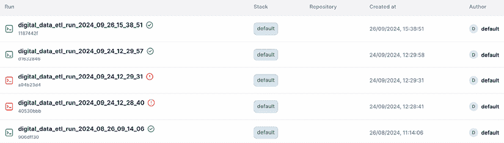
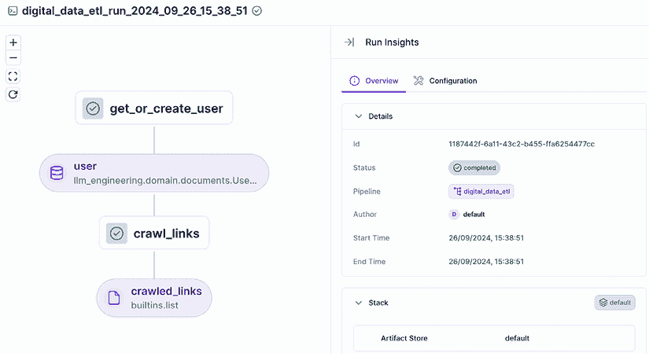
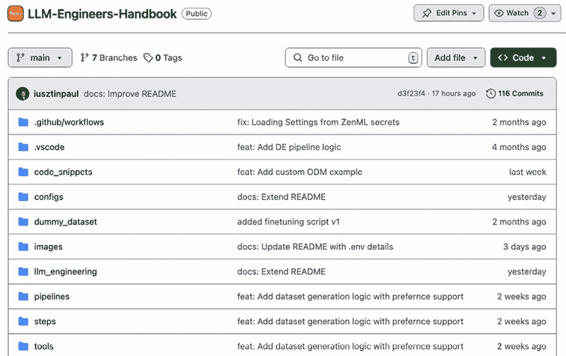
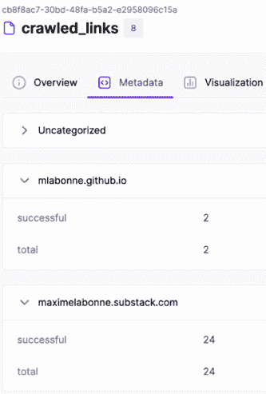
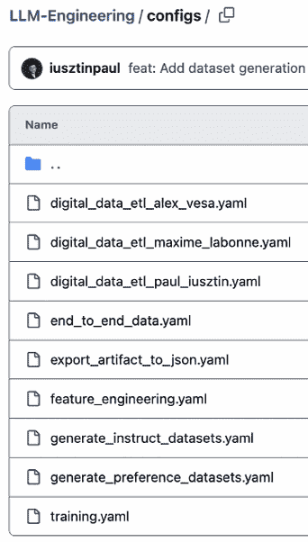
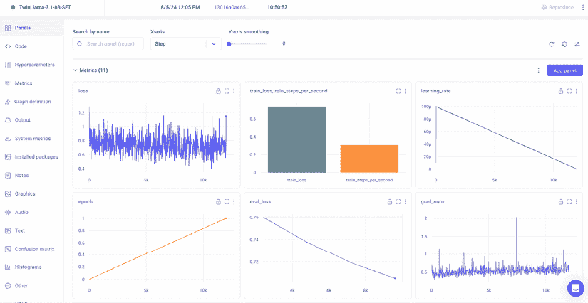
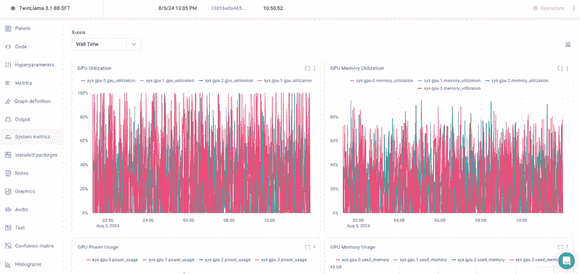

# 2

# 工具和安装

本章介绍了本书中将使用到的所有基本工具，特别是在实现和部署 LLM Twin 项目时。在本书的这一部分，我们并不计划深入介绍 LLM、RAG、MLOps 或 LLMOps 的概念。我们将快速带您了解我们的技术栈和先决条件，以避免在书中重复介绍如何设置特定工具以及为什么选择它。从**第三章**开始，我们将通过实现一个从互联网爬取数据的 ETL 数据收集过程，开始探索我们的 LLM Twin 用例。

在本章的第一部分，我们将介绍 Python 生态系统中的工具，用于管理多个 Python 版本，创建虚拟环境，并安装项目运行所需的固定依赖项。在介绍这些工具的同时，我们还将展示如何在本地机器上安装`LLM-Engineers-Handbook`仓库（如果您想亲自尝试代码）：[`github.com/PacktPublishing/LLM-Engineers-Handbook`](https://github.com/PacktPublishing/LLM-Engineers-Handbook)。

接下来，我们将探索我们将使用的所有 MLOps 和 LLMOps 工具，从更通用的工具开始，例如模型注册表，然后转向更面向 LLM 的工具，例如 LLM 评估和提示监控工具。我们还将了解如何使用 ZenML（一个连接 ML 和 MLOps 的桥梁）来管理具有多个 ML 管道的项目。此外，我们将快速探讨我们将使用哪些数据库来存储 NoSQL 和矢量数据。我们将向您展示如何使用 Docker 在本地机器上运行所有这些组件。最后，我们将快速回顾 AWS，并展示如何创建 AWS 用户和访问密钥，以及如何安装和配置 AWS CLI 以程序化地操作云资源。我们还将探索 SageMaker 以及为什么我们使用它来训练和部署我们的开源 LLM。

如果您熟悉这些工具，您可以安全地跳过本章。我们还在仓库的`README`中解释了如何安装项目和设置所有必要的组件。因此，如果您计划在阅读本书的同时运行代码，您也可以选择使用它作为更简洁的文档。

总结一下，在本章中，我们将探讨以下主题：

+   Python 生态系统和项目安装

+   MLOps 和 LLMOps 工具

+   用于存储非结构化和矢量数据的数据库

+   准备 AWS

到本章结束时，您将了解本书中我们将使用的所有工具。此外，您将学会如何安装`LLM-Engineers-Handbook`仓库，设置其余的工具，并在阅读本书时运行代码。

# Python 生态系统和项目安装

任何 Python 项目都需要三个基本工具：Python 解释器、依赖关系管理和任务执行工具。Python 解释器按照预期执行你的 Python 项目。本书中所有的代码都是使用 Python 3.11.8 进行测试的。你可以从这里下载 Python 解释器：[`www.python.org/downloads/`](https://www.python.org/downloads/)。我们建议安装确切的 Python 版本（Python 3.11.8），以便使用`pyenv`运行 LLM Twin 项目，使安装过程变得简单直接。

与安装多个全局 Python 版本相比，我们建议使用`pyenv`来管理它们，这是一个 Python 版本管理工具，它允许你在项目之间管理多个 Python 版本。你可以使用此链接安装它：[`github.com/pyenv/pyenv?tab=readme-ov-file#installation`](https://github.com/pyenv/pyenv?tab=readme-ov-file#installation)。

在你安装了`pyenv`之后，你可以使用`pyenv`安装 Python 3.11 的最新版本，如下所示：

```py
pyenv install 3.11.8 
```

现在列出所有已安装的 Python 版本，以查看它是否已正确安装：

```py
pyenv versions 
```

你应该看到类似以下内容：

```py
# * system
#   3.11.8 
```

要将 Python 3.11.8 设置为整个系统的默认版本（每次打开新终端时），请使用以下命令：

```py
pyenv global 3.11.8 
```

然而，我们的目标是只在我们的仓库中本地使用 Python 3.11.8。为了实现这一点，首先，我们必须克隆仓库并导航到它：

```py
git clone https://github.com/PacktPublishing/LLM-Engineers-Handbook.git 
cd LLM-Engineers-Handbook 
```

因为我们在仓库中定义了`.python-version`文件，`pyenv`将知道从该文件中获取版本，并在你在这个文件夹内工作时本地使用它。为了双重检查，请在仓库内运行以下命令：

```py
python --version 
```

它应该输出：

```py
# Python 3.11.8 
```

要创建`.python-version`文件，你必须运行一次`pyenv local 3.11.8`。然后，`pyenv`将始终知道在特定目录内工作时使用该 Python 版本。

现在我们已经使用`pyenv`安装了正确的 Python 版本，让我们继续使用 Poetry，我们将将其用作依赖关系和虚拟环境管理器。

## 诗歌：依赖关系和虚拟环境管理

Poetry 是 Python 生态系统中最受欢迎的依赖关系和虚拟环境管理器之一。但让我们首先明确什么是依赖关系管理器。在 Python 中，依赖关系管理器允许你指定、安装、更新和管理项目所依赖的外部库或包（依赖项）。例如，这是一个简单的 Poetry 需求文件，它使用 Python 3.11 和`requests`以及`numpy` Python 包。

```py
[tool.poetry.dependencies]
python = "³.11"
requests = "².25.1"
numpy = "¹.19.5"
[build-system]
requires = ["poetry-core"]
build-backend = "poetry.core.masonry.api" 
```

通过使用 Poetry 来锁定依赖项，你总是确保安装了与你的项目兼容的正确版本的依赖项。默认情况下，Poetry 会将所有需求保存在`pyproject.toml`文件中，这些文件存储在你的仓库根目录下，正如你在克隆的 LLM-Engineers-Handbook 仓库中看到的那样。

使用 Poetry 的另一个巨大优势是它创建一个新的 Python 虚拟环境，在其中安装指定的 Python 版本和需求。虚拟环境允许你将你的项目依赖与全局 Python 依赖和其他项目隔离开来。通过这样做，你可以确保项目之间没有版本冲突。例如，假设项目 A 需要`numpy == 1.19.5`，而项目 B 需要`numpy == 1.26.0`。如果你将这两个项目都保留在全局 Python 环境中，那么这将不起作用，因为项目 B 将覆盖项目 A 的`numpy`安装，这将破坏项目 A 并使其停止工作。使用 Poetry，你可以将每个项目隔离在其自己的 Python 环境中，每个项目都有自己的 Python 依赖，从而避免任何依赖冲突。

你可以从这里安装 Poetry：[`python-poetry.org/docs/`](https://python-poetry.org/docs/)。本书中我们使用 Poetry 1.8.3。一旦安装了 Poetry，导航到你的克隆的 LLM-Engineers-Handbook 仓库，并运行以下命令来安装所有必要的 Python 依赖：

```py
poetry install --without aws 
```

此命令知道从你的仓库中提取所有在`pyproject.toml`和`poetry.lock`文件中列出的依赖。安装完成后，你可以在终端中运行`poetry shell`或通过以下方式将所有 CLI 命令作为前缀来激活你的 Poetry 环境：`poetry run <your command>`。

关于诗歌的一个最后注意事项是，它会在`poetry.lock`文件中锁定基于添加到`project.toml`文件中的定义的依赖树的确切版本。虽然`pyproject.toml`文件可能指定版本范围（例如，`requests = "².25.1"`），但`poetry.lock`文件会记录安装的确切版本（例如，`requests = "2.25.1"`）。它还会锁定子依赖的版本（你的依赖的依赖），这些版本可能没有在`pyproject.toml`文件中明确列出。通过将所有依赖和子依赖锁定到特定版本，`poetry.lock`文件确保所有项目安装都使用每个包的相同版本。这种一致性导致行为可预测，减少了遇到“在我的机器上工作”问题的可能性。

与 Poetry 类似的其他工具包括用于创建虚拟环境的 Venv 和 Conda。但它们缺少依赖管理选项。因此，你必须通过 Python 的默认`requirements.txt`文件来完成，这些文件比 Poetry 的`lock`文件功能弱。另一个选项是 Pipenv，它在功能上更类似于 Poetry，但速度较慢，还有`uv`，它是用 Rust 构建的 Poetry 替代品，使其速度极快。`uv`有很大的潜力取代 Poetry，因此值得尝试：[`github.com/astral-sh/uv`](https://github.com/astral-sh/uv)。

最后一个要考虑的问题是查看我们用来管理所有 CLI 命令的任务执行工具。

## 诗人 Poe：任务执行工具

Poe the Poet 是 Poetry 之上的一个插件，用于管理和执行与项目交互所需的所有 CLI 命令。它帮助你在 Python 项目中定义和运行任务，简化了自动化和脚本执行。其他流行的选项包括 Makefile、Invoke 或 shell 脚本，但 Poe the Poet 消除了为管理项目任务而编写单独的 shell 脚本或 Makefile 的需求，使其成为使用 Poetry 已经使用的相同配置文件管理任务的一种优雅方式。

当使用 Poe the Poet 时，你不必在 README 文件或其他文档中记录所有命令，可以直接将它们添加到 `pyproject.toml` 文件中，并在命令行中使用别名执行它们。例如，使用 Poe the Poet，我们可以在 `pyproject.toml` 文件中定义以下任务：

```py
[tool.poe.tasks]
test = "pytest"
format = "black ."
start = "python main.py" 
```

然后，你可以使用 `poe` 命令运行这些任务：

```py
poetry poe test
poetry poe format
poetry poe start 
```

你可以将 Poe the Poet 作为 Poetry 插件安装，如下所示：

```py
poetry self add 'poethepoet[poetry_plugin]' 
```

最后，使用工具作为所有 CLI 命令的代理来运行你的应用程序是必要的。它显著简化了应用程序的复杂性，并增强了协作，因为它充当了即用型的文档。

假设你已经安装了 `pyenv` 和 Poetry，以下是你需要运行的所有命令来克隆存储库、安装依赖项并将 Poe the Poet 作为 Poetry 插件安装：

```py
git clone https://github.com/PacktPublishing/LLM-Engineers-Handbook.gitcd LLM-Engineers-Handbook
poetry install --without aws
poetry self add 'poethepoet[poetry_plugin]' 
```

要使项目完全运行，还需要遵循一些步骤，例如填写 `.env` 文件以包含你的凭证，并从 OpenAI 和 Hugging Face 获取令牌。但本书不是安装指南，所以我们已将这些详细信息移至存储库的 README 文件中，因为它们仅在计划运行存储库时才有用：[`github.com/PacktPublishing/LLM-Engineers-Handbook`](https://github.com/PacktPublishing/LLM-Engineers-Handbook)。

现在我们已经安装了我们的 Python 项目，让我们来介绍本书中将使用的 MLOps 工具。如果你已经熟悉这些工具，你可以安全地跳过以下工具部分，直接进入 *存储非结构化和矢量数据的数据库* 部分。

# MLOps 和 LLMOps 工具

本节将快速介绍本书中将使用的所有 MLOps 和 LLMOps 工具及其在构建使用 MLOps 最佳实践的 ML 系统中的作用。在本书的这一部分，我们并不旨在详细说明我们将用于实现 LLM Twin 用例的所有 MLOps 组件，例如模型注册表和编排器，而只是提供一个快速了解它们是什么以及如何使用它们的想法。随着我们在本书中开发 LLM Twin 项目，你将看到我们如何使用所有这些工具的实战示例。在 *第十一章* 中，我们将深入探讨 MLOps 和 LLMOps 的理论，并连接所有线索。由于 MLOps 和 LLMOps 领域高度实用，我们将把这些方面的理论留到后面，因为在你完成 LLM Twin 用例实现后，理解它们会更容易。

此外，本节并非专门介绍如何设置每个工具。它主要关注每个工具的用途，并突出本书中使用的核心功能。

尽管如此，使用 Docker，你可以在本地快速运行整个基础设施。如果你想自己运行书中的步骤，你可以通过以下三个简单步骤在本地托管应用程序：

1.  确保 Docker 已安装 27.1.1（或更高版本）。

1.  按照仓库 README 中的说明，将所有必要的凭据填入 `.env` 文件。

1.  运行 `poetry` `poe` `local-infrastructure-up` 以在本地启动 ZenML (`http://127.0.0.1:8237/`) 以及 MongoDB 和 Qdrant 数据库。

你可以在 LLM-Engineers-Handbook 仓库的 README 中阅读更多关于如何在本地运行所有内容的细节：[`github.com/PacktPublishing/LLM-Engineers-Handbook`](https://github.com/PacktPublishing/LLM-Engineers-Handbook)。在书中，我们还将向你展示如何将每个组件部署到云端。

## Hugging Face：模型注册库

模型注册库是一个集中式存储库，它管理着 ML 模型在其整个生命周期中的状态。它存储模型及其元数据、版本历史和性能指标，作为单一的真实来源。在 MLOps 中，模型注册库对于跟踪、共享和记录模型版本至关重要，它促进了团队协作。此外，它还是部署过程中的基本元素，因为它与 **持续集成** **和** **持续部署** (**CI/CD**) 管道集成。

我们使用 Hugging Face 作为我们的模型注册库，因为我们可以利用其生态系统轻松地将我们的微调 LLM Twin 模型与阅读本书的任何人共享。此外，通过遵循 Hugging Face 模型注册库界面，我们可以轻松地将模型与 LLM 生态系统周围的各个框架集成，例如用于微调的 Unsloth 和用于推理的 SageMaker。

我们微调的 LLM 可在 Hugging Face 上找到：

+   **TwinLlama 3.1 8B** (在微调之后): [`huggingface.co/mlabonne/TwinLlama-3.1-8B`](https://huggingface.co/mlabonne/TwinLlama-3.1-8B)

+   **TwinLlama 3.1 8B DPO** (在偏好对齐之后): [`huggingface.co/mlabonne/TwinLlama-3.1-8B-DPO`](https://huggingface.co/mlabonne/TwinLlama-3.1-8B-DPO)


图 2.1：Hugging Face 模型注册库示例

为了快速演示，我们在 Hugging Face Spaces 上提供了它们：

+   **TwinLlama 3.1 8B:** [`huggingface.co/spaces/mlabonne/TwinLlama-3.1-8B`](https://huggingface.co/spaces/mlabonne/TwinLlama-3.1-8B)

+   **TwinLlama 3.1 8B DPO:** [`huggingface.co/spaces/mlabonne/TwinLlama-3.1-8B-DPO`](https://huggingface.co/spaces/mlabonne/TwinLlama-3.1-8B-DPO)

大多数机器学习工具都提供模型注册功能。例如，ZenML、Comet 和 SageMaker（我们将在未来章节中介绍），也提供自己的模型注册功能。它们是不错的选择，但我们选择 Hugging Face 完全是因为其生态系统，它为开源环境提供了易于共享和集成的功能。因此，您通常会选择与您的项目工具和需求集成度最高的模型注册。

## ZenML：编排器、工件和元数据

ZenML 作为机器学习和 MLOps 之间的桥梁。因此，它提供了多个 MLOps 功能，使您的机器学习管道的可追溯性、可重复性、部署和维护变得更加容易。在核心上，它旨在创建可重复的机器学习工作流程。它解决了从 Jupyter 笔记本中的探索性研究过渡到生产就绪的机器学习环境的问题。它解决了基于生产的复制问题，如版本控制困难、重现实验、组织复杂的机器学习工作流程、弥合训练和部署之间的差距以及跟踪元数据。因此，ZenML 的主要功能是编排机器学习管道、将机器学习管道作为输出存储和版本控制，以及将元数据附加到工件以实现更好的可观察性。

ZenML 不是另一个机器学习平台，而是引入了 *堆栈* 的概念，这使得您可以在多个基础设施选项上运行 ZenML。堆栈将使您能够将 ZenML 连接到不同的云服务，例如：

+   一个编排器和计算引擎（例如，AWS SageMaker 或 Vertex AI）

+   远程存储（例如，AWS S3 或 Google Cloud Storage 存储桶）

+   一个容器注册库（例如，Docker Registry 或 AWS ECR）

因此，ZenML 通过其 *堆栈* 功能充当粘合剂，将您的所有基础设施和工具集中在一个地方，让您能够快速迭代开发过程，并轻松监控整个机器学习系统。这种做法的美妙之处在于 ZenML 不会将您锁定在任何一个云平台上。它完全抽象化了您的 Python 代码的实现与其运行的基础设施。例如，在我们的 LLM Twin 用例中，我们使用了 AWS 堆栈：

+   SageMaker 作为我们的编排器和计算引擎

+   S3 作为我们用于存储和跟踪工件的远程存储

+   ECR 作为我们的容器注册库

然而，Python 代码不包含 S3 或 ECR 特殊性，因为 ZenML 会处理这些。因此，我们可以轻松切换到其他提供商，例如 Google Cloud Storage 或 Azure。有关 ZenML *堆栈* 的更多详细信息，您可以从这里开始：[`docs.zenml.io/user-guide/production-guide/understand-stacks`](https://docs.zenml.io/user-guide/production-guide/understand-stacks)。

我们将专注于本书中使用的 ZenML 功能，例如编排、工件和元数据。有关 ZenML 的更多详细信息，请参阅他们的入门指南：[`docs.zenml.io/user-guide/starter-guide`](https://docs.zenml.io/user-guide/starter-guide)。

ZenML 服务器的本地版本作为 Python 包安装。因此，当运行`poetry install`时，它会安装一个 ZenML 调试服务器，你可以在本地使用。在*第十一章*中，我们将向你展示如何使用他们的云无服务器选项将机器学习管道部署到 AWS。

### 管道编排器

管道编排器是一个自动化、调度和协调所有机器学习管道的系统。它确保每个管道（如数据摄取、预处理、模型训练和部署）按正确顺序执行并有效地处理依赖关系。通过管理这些流程，编排器优化资源利用，优雅地处理故障，并增强可扩展性，使复杂的机器学习管道更可靠且易于管理。

**ZenML 作为编排器是如何工作的？**它与**管道**和**步骤**一起工作。管道是一个包含多个步骤的高级对象。一个函数通过装饰`@pipeline`成为 ZenML 管道，一个步骤通过装饰`@step`。这是使用编排器时的标准模式：你有一个高级函数，通常称为管道，它调用多个单元/步骤/任务。

让我们探索如何使用 LLM Twin 项目实现的机器学习管道之一来实现 ZenML 管道。在下面的代码片段中，我们定义了一个 ZenML 管道，该管道根据用户的完整名称查询数据库，并爬取该用户下提供的所有链接：

```py
from zenml import pipeline
from steps.etl import crawl_links, get_or_create_user
@pipeline
def digital_data_etl(user_full_name: str, links: list[str]) -> None:
    user = get_or_create_user(user_full_name)
    crawl_links(user=user, links=links) 
```

你可以使用以下 CLI 命令运行管道：`poetry poe run-digital-data-etl`。要可视化管道运行，你可以访问你的 ZenML 仪表板（在`http://127.0.0.1:8237/`），然后在左侧面板中点击**管道**标签，然后点击**digital_data_etl**管道，如图*图 2.2*所示：


图 2.2：ZenML 管道仪表板

点击**digital_data_etl**管道后，你可以可视化所有之前的和当前的管道运行，如图*图 2.3*所示。你可以看到哪个成功了，失败了，或者仍在运行。此外，你还可以看到用于运行管道的堆栈，其中默认堆栈是用于本地运行你的机器学习管道的堆栈。



图 2.3：ZenML digital_data_etl 管道仪表板。特定管道的示例

现在，在点击最新的**digital_data_etl**管道运行（或任何其他成功运行或仍在运行的运行）后，我们可以可视化管道的步骤、输出和见解，如图*图 2.4*所示。这种结构通常被称为**有向无环图**（DAG）。关于 DAG 的更多内容请见*第十一章*。



图 2.4：ZenML digital_data_etl 管道运行仪表板（特定管道运行的示例）

通过点击特定的步骤，你可以更深入地了解其代码和配置。它甚至聚合了该特定步骤输出的日志，以避免在工具之间切换，如图*图 2.5*所示。


图 2.5：数字数据 ETL 管道运行特定步骤的见解示例

```py
defined the get_or_create_user() step, which works just like a normal Python function but is decorated with @step. We won’t go into the details of the logic, as we will cover the ETL logic in *Chapter 3*. For now, we will focus only on the ZenML functionality.
```

```py
from loguru import logger
from typing_extensions import Annotated
from zenml import get_step_context, step
from llm_engineering.application import utils
from llm_engineering.domain.documents import UserDocument
@step
def get_or_create_user(user_full_name: str) -> Annotated[UserDocument, "user"]:
    logger.info(f"Getting or creating user: {user_full_name}")
    first_name, last_name = utils.split_user_full_name(user_full_name)
    user = UserDocument.get_or_create(first_name=first_name, last_name=last_name)
    return user 
```

在 ZenML 步骤中，你可以定义你的用例需要的任何 Python 逻辑。在这个简单的例子中，我们只是创建或检索一个用户，但我们可以用任何东西替换这段代码，从数据收集到特征工程和训练。重要的是要注意，为了将 ZenML 集成到你的代码中，你必须编写模块化代码，其中每个函数只做一件事。你代码的模块化使得你可以用 `@step` 装饰你的函数，然后在用 `@pipeline` 装饰的主函数中粘合多个步骤变得容易。一个会影响你应用程序的设计选择是决定每个步骤的粒度，因为每个步骤在部署到云中时都会作为不同的单元在不同的机器上运行。

为了将我们的代码与 ZenML 解耦，我们将所有应用程序和领域逻辑封装到了 `llm_engineering` Python 模块中。我们还定义了 `pipelines` 和 `steps` 文件夹，在其中定义了我们的 ZenML 逻辑。在 `steps` 模块中，我们只使用了从 `llm_engineering` Python 模块中需要的内容（类似于你使用 Python 包的方式）。在 `pipelines` 模块中，我们只聚合 ZenML 步骤以将它们粘合到最终的管道中。使用这种设计，我们可以轻松地用另一个编排器替换 ZenML，或者在其他用例中使用我们的应用程序逻辑，例如 REST API。我们只需替换 ZenML 代码，而不必触及存放所有逻辑的 `llm_engineering` 模块。

此文件夹结构在 LLM-Engineers-Handbook 仓库的根目录中体现，如图 2.6 所示：

*图 2.6*：LLM-Engineers-Handbook 仓库文件夹结构

在编写 ZenML 步骤时需要考虑的最后一点是，如果你返回一个值，它应该是可序列化的。ZenML 可以序列化大多数可以减少为基本数据类型的对象，但有一些例外。例如，我们在整个代码中使用了 UUID 类型作为 ID，这些类型不是 ZenML 本地支持的。因此，我们必须扩展 ZenML 的材料化器以支持 UUID。我们将这个问题提交给了 ZenML。因此，在未来的 ZenML 版本中，UUID 将得到支持，但这是一个很好的例子，说明了在艺术品中转换函数输出的序列化方面。

### 艺术品和元数据

如前所述，ZenML 将任何步骤输出转换为工件。首先，让我们快速了解什么是工件。在 MLOps 中，**工件**是指在机器学习生命周期中产生的任何文件（s），例如数据集、训练模型、检查点或日志。工件对于重现实验和部署模型至关重要。我们可以将任何东西转换为工件。例如，模型注册表是工件的一个特定用例。因此，工件具有这些独特的属性：它们是版本化的、可共享的，并且附有元数据，以便快速了解其内容。例如，当用工件包装您的数据集时，您可以在其元数据中添加数据集的大小、训练-测试分割比率、大小、标签类型以及其他任何有助于了解数据集内容的有用信息，而无需实际下载它。

让我们回到我们的**digital_data_etl**管道示例，其中我们作为步骤输出一个工件，即爬取的链接，这是一个工件，如图*图 2.7*所示


图 2.7：使用 digital_data_etl 管道作为示例的 ZenML 工件示例

通过点击`crawled_links`工件并导航到**元数据**标签，我们可以快速查看我们为特定作者爬取的所有域名，每个域名爬取的链接数量，以及成功的数量，如图*图 2.8*所示：



图 2.8：使用 digital_data_etl 管道作为示例的 ZenML 元数据示例

一个更有趣的工件及其元数据的例子是生成的数据集工件。在*图 2.9*中，我们可以可视化`instruct_datasets`工件的元数据，该工件是自动生成的，将被用于微调 LLM Twin 模型。关于`指令数据集`的更多细节请见*第五章*。现在，我们想强调的是，在数据集的元数据中，我们已经预先计算了关于它的许多有用信息，例如它包含多少数据类别，其存储大小，以及每个训练和测试分割的样本数量。


图 2.9：instruct_datasets 工件的 ZenML 元数据示例

```py
helpful for dataset discovery across your business and projects:
```

```py
… # More imports
from zenml import ArtifactConfig, get_step_context, step
@step
def generate_intruction_dataset(
    prompts: Annotated[dict[DataCategory, list[GenerateDatasetSamplesPrompt]], "prompts"]) -> Annotated[
    InstructTrainTestSplit,
    ArtifactConfig(
        name="instruct_datasets",
        tags=["dataset", "instruct", "cleaned"],
    ),
]:
    datasets = … # Generate datasets
    step_context = get_step_context()
    step_context.add_output_metadata(output_name="instruct_datasets", metadata=_get_metadata_instruct_dataset(datasets))
    return datasets
def _get_metadata_instruct_dataset(datasets: InstructTrainTestSplit) -> dict[str, Any]:
    instruct_dataset_categories = list(datasets.train.keys())
    train_num_samples = {
        category: instruct_dataset.num_samples for category, instruct_dataset in datasets.train.items()
    }
    test_num_samples = {category: instruct_dataset.num_samples for category, instruct_dataset in datasets.test.items()}
    return {
        "data_categories": instruct_dataset_categories,
        "test_split_size": datasets.test_split_size,
        "train_num_samples_per_category": train_num_samples,
        "test_num_samples_per_category": test_num_samples,
    } 
```

此外，您可以使用其**通用唯一标识符**（**UUID**）轻松下载和访问数据集的特定版本，您可以使用 ZenML 仪表板或 CLI 找到该 UUID：

```py
from zenml.client import Client
artifact = Client().get_artifact_version('8bba35c4-8ff9-4d8f-a039-08046efc9fdc')
loaded_artifact = artifact.load() 
```

探索 ZenML 的最后一个步骤是了解如何运行和配置 ZenML 管道。

### 如何运行和配置 ZenML 管道

所有的 ZenML 管道都可以从`run.py`文件中调用，该文件位于我们的 GitHub 仓库中的`tools/run.py`。在`run.py`文件中，我们实现了一个简单的命令行界面（CLI），允许您指定要运行的管道。例如，要调用`digital_data_etl`管道以爬取 Maxime 的内容，您必须运行：

```py
python -m tools.run --run-etl --no-cache --etl-config-filename digital_data_etl_maxime_labonne.yaml 
```

或者，要爬取 Paul 的内容，您可以运行：

```py
python -m tools.run --run-etl --no-cache --etl-config-filename digital_data_etl_paul_iusztin.yaml 
```

正如在介绍诗人 Poe 时解释的那样，我们用于与项目交互的所有 CLI 命令将通过 Poe 执行，以简化并标准化项目。因此，我们将这些 Python 调用封装在以下`poe` CLI 命令中：

```py
poetry poe run-digital-data-etl-maxime
poetry poe run-digital-data-etl-paul 
```

我们只在抓取不同人的内容时更改 ETL 配置文件名。ZenML 允许我们在运行时注入特定的配置文件，如下所示：

```py
config_path = root_dir / "configs" / etl_config_filename
assert config_path.exists(), f"Config file not found: { config_path }"
run_args_etl = {
 "config_path": config_path,
 "run_name": f"digital_data_etl_run_{dt.now().strftime('%Y_%m_%d_%H_%M_%S')}"
}
 digital_data_etl.with_options()(**run_args_etl) 
```

在配置文件中，我们指定所有将输入管道的参数。例如，`configs/digital_data_etl_maxime_labonne.yaml`配置文件如下所示：

```py
parameters:
  user_full_name: Maxime Labonne # [First Name(s)] [Last Name]
  links:
    # Personal Blog
    - https://mlabonne.github.io/blog/posts/2024-07-29_Finetune_Llama31.html
    - https://mlabonne.github.io/blog/posts/2024-07-15_The_Rise_of_Agentic_Data_Generation.html
    # Substack
    - https://maximelabonne.substack.com/p/uncensor-any-llm-with-abliteration-d30148b7d43e
    … # More links 
```

`digital_data_etl`函数签名看起来如下：

```py
@pipeline
def digital_data_etl(user_full_name: str, links: list[str]) -> str: 
```

这种方法允许我们在运行时配置每个管道，而不需要修改代码。我们还可以清楚地跟踪所有管道的输入，确保可重复性。如*图 2.10*所示，我们为每个管道有一个或多个配置。



图 2.10：ZenML 管道配置

我们亲自测试过并认为功能强大的类似 ZenML 的流行编排器包括 Airflow、Prefect、Metaflow 和 Dagster。此外，如果你是 Kubernetes 的重度用户，可以选择 Agro Workflows 或 Kubeflow，后者仅在 Kubernetes 之上运行。我们仍然认为 ZenML 在易用性、功能和成本之间提供了最佳权衡。此外，这些工具中没有哪一个提供 ZenML 所提供的堆栈功能，这允许它避免将你锁定在任何云生态系统中。

在*第十一章*中，我们将更深入地探讨如何利用编排器来实现 MLOps 的最佳实践。但现在我们了解了 ZenML，它有什么帮助，以及如何使用它，让我们继续到实验跟踪器。

## Comet ML：实验跟踪器

训练机器学习模型是一个完全迭代和实验的过程。与传统的软件开发不同，它涉及运行多个并行实验，根据预定义的指标进行比较，并决定哪个应该进入生产。一个实验跟踪工具允许你记录所有必要的信息，例如模型预测的指标和可视化表示，以便比较所有实验并快速选择最佳模型。我们的 LLM 项目也不例外。

如*图 2.11*所示，我们使用 Comet 跟踪训练和评估损失或梯度范数的值等指标。



图 2.11：Comet ML 训练指标示例

使用实验跟踪器，你可以超越训练和评估指标，并记录你的训练超参数以跟踪实验之间的不同配置。

它还记录了开箱即用的系统指标，如 GPU、CPU 或内存利用率，以清楚地了解你在训练期间需要哪些资源以及潜在瓶颈在哪里减慢了你的训练速度，如*图 2.12*所示。



图 2.12：Comet ML 系统指标示例

您无需在本地设置 Comet。在本书中，我们将免费使用其在线版本，没有任何限制。此外，如果您想更深入地了解 Comet ML 实验跟踪器，我们在微调我们的 LLM Twin 模型时，已将使用 Comet ML 跟踪的训练实验公开。您可以通过以下链接访问：[`www.comet.com/mlabonne/llm-twin-training/view/new/panels`](https://www.comet.com/mlabonne/llm-twin-training/view/new/panels)。

其他流行的实验跟踪器包括 W&B、MLflow 和 Neptune。我们与它们都合作过，可以声明它们都具有大部分相同的功能，但 Comet ML 通过其易用性和直观界面脱颖而出。让我们继续到最后一个 MLOps 拼图部分：Opik 用于提示监控。

## Opik：提示监控

在记录和监控提示时，您不能使用标准的工具和技术。原因很复杂。我们将在第十一章中深入探讨。然而，为了快速让您了解一些情况，您不能使用标准的日志记录工具，因为提示是复杂且非结构化的链。

与 LLM 应用交互时，您将多个输入提示和生成的输出链接成一个跟踪，其中一个提示依赖于前面的提示。

因此，您需要一种直观的方式来将这些跟踪分组到一个专门的仪表板中，以便更容易地调试和监控提示的跟踪。

我们使用 Comet 制作的开源工具 Opik 作为我们的提示监控工具，因为它遵循 Comet 的简洁和易用性哲学，这在当前的 LLM 领域中相对罕见。提供类似功能的其他选项包括 Langfuse（开源，[`langfuse.com`](https://langfuse.com)）、Galileo（非开源，[rungalileo.io](https://rungalileo.io)）和 LangSmith（非开源，[`www.langchain.com/langsmith`](https://www.langchain.com/langsmith)），但我们发现它们的解决方案在使用和实施上更为繁琐。Opik 及其无服务器选项还提供了一个完全由您控制的免费开源版本。您可以在[`github.com/comet-ml/opik`](https://github.com/comet-ml/opik)上了解更多关于 Opik 的信息。

# 用于存储非结构化和矢量数据的数据库

我们还希望展示我们将要在示例中使用到的 NoSQL 和矢量数据库。当在本地工作时，它们已经通过 Docker 集成。因此，当按照上面几个部分中的说明运行`poetry poe local-infrastructure-up`时，本地数据库的 Docker 镜像将被拉取并在您的机器上运行。此外，在部署项目时，我们将向您展示如何使用它们的无服务器选项并将其集成到 LLM Twin 项目的其余部分。

## MongoDB：NoSQL 数据库

MongoDB 是当今最受欢迎、最稳健、最快且功能丰富的 NoSQL 数据库之一。它与大多数云生态系统集成良好，如 AWS、Google Cloud、Azure 和 Databricks。因此，将 MongoDB 作为我们的 NoSQL 数据库是一个显而易见的选择。

当我们撰写本书时，MongoDB 被 Novo Nordisk、Delivery Hero、Okta 和 Volvo 等大公司使用。这种广泛的应用表明 MongoDB 将长期保持领先地位。

我们使用 MongoDB 作为 NoSQL 数据库来存储我们从互联网收集的原始数据，在处理并推送到向量数据库之前。由于我们处理的是非结构化文本数据，NoSQL 数据库的灵活性非常适合。

## Qdrant: 向量数据库

Qdrant ([`qdrant.tech/`](https://qdrant.tech/)) 是最受欢迎、最稳健且功能丰富的向量数据库之一。我们本来可以用几乎任何向量数据库来构建我们的小型 MVP，但我们想选择一个轻量级且可能在未来许多年里在业界被广泛使用的数据库。

我们将使用 Qdrant 来存储 MongoDB 处理和转换后的数据，以便用于 GenAI 的可用性。

Qdrant 被像 X（前 Twitter）、迪士尼、微软、Discord 和强生这样的行业巨头所使用。因此，Qdrant 很可能在向量数据库领域长期保持领先地位。

在撰写本书时，其他流行的选择包括 Milvus、Redis、Weaviate、Pinecone、Chroma 和 pgvector（一个用于向量索引的 PostgreSQL 插件）。我们发现 Qdrant 在 RPS、延迟和索引时间之间提供了最佳权衡，使其成为许多生成式 AI 应用的稳固选择。

详细比较所有向量数据库可能本身就是一个章节。我们不想在这里做这件事。不过，如果您好奇，可以查看 Superlinked 提供的*向量数据库比较*资源，[`superlinked.com/vector-db-comparison`](https://superlinked.com/vector-db-comparison)，它从许可证和发布年份到数据库功能、嵌入模型和支持的框架等各个方面比较了所有顶级向量数据库。

# 准备 AWS

本章的最后一部分将专注于设置 AWS 账户（如果您还没有的话）、AWS 访问密钥和 CLI。我们还将探讨 SageMaker 是什么以及为什么我们使用它。

我们选择 AWS 作为我们的云服务提供商，因为它是最受欢迎的，并且是我们（作者）最有经验的领域。现实是，其他大型云服务提供商，如 GCP 或 Azure，也提供类似的服务。因此，根据您的具体应用，在开发时间（您最有经验的时间）、功能和成本之间总会有权衡。但对我们的小型 MVP 来说，AWS 是完美的选择，因为它为我们需要的所有功能提供了稳健的特性，如 S3（对象存储）、ECR（容器注册库）和 SageMaker（用于训练和推理的计算）。

## 设置 AWS 账户、访问密钥和 CLI

由于 AWS 可能会更改其 UI/UX，指导您如何创建 AWS 账户的最佳方式是通过将其重定向到他们的官方教程：[`docs.aws.amazon.com/accounts/latest/reference/manage-acct-creating.html`](https://docs.aws.amazon.com/accounts/latest/reference/manage-acct-creating.html)。

成功创建 AWS 账户后，您可以通过 [`console.aws.amazon.com`](http://console.aws.amazon.com) 访问 AWS 控制台。选择 **使用 root 用户邮箱登录**（位于 **登录** 按钮下方），然后输入您的账户邮箱地址和密码。

接下来，我们必须生成访问密钥以程序化地访问 AWS。这样做最好的方法是首先创建一个具有管理访问权限的 IAM 用户，如本 AWS 官方教程中所述：[`docs.aws.amazon.com/streams/latest/dev/setting-up.html`](https://docs.aws.amazon.com/streams/latest/dev/setting-up.html)

对于生产账户，最佳实践是以最小权限策略授予权限，为每个用户提供他们执行其角色所需的权限。然而，为了简化我们的测试账户的设置，我们将使用 `AdministratorAccess` 管理策略，这将在上述教程中解释并在 *图 2.13* 中展示。


图 2.13：IAM 用户权限策略示例

接下来，您必须使用以下教程为您刚才创建的 IAM 用户创建一个访问密钥：[`docs.aws.amazon.com/IAM/latest/UserGuide/id_credentials_access-keys.html`](https://docs.aws.amazon.com/IAM/latest/UserGuide/id_credentials_access-keys.html)。

访问密钥将如下所示：

```py
aws_access_key_id = <your_access_key_id>
aws_secret_access_key = <your_secret_access_key> 
```

只需小心地将它们存储在安全的地方，因为创建后您将无法访问它们。此外，与谁分享它们时要谨慎，因为它们可能被用来访问您的 AWS 账户并操纵各种 AWS 资源。

最后一步是安装 AWS CLI 并使用您新创建的访问密钥进行配置。您可以通过以下链接安装 AWS CLI：[`docs.aws.amazon.com/cli/latest/userguide/getting-started-install.html`](https://docs.aws.amazon.com/cli/latest/userguide/getting-started-install.html)。

安装 AWS CLI 后，您可以通过运行 `aws configure` 来配置它。以下是我们 AWS 配置的示例：

```py
[default]
aws_access_key_id = *************
aws_secret_access_key = ************
region = eu-central-1
output = json 
```

要了解如何配置 AWS CLI 的更多详细信息，请查看以下教程：[`docs.aws.amazon.com/cli/v1/userguide/cli-configure-files.html`](https://docs.aws.amazon.com/cli/v1/userguide/cli-configure-files.html)。

此外，为了使用您的 AWS 凭据配置项目，您必须在您的 `.env` 文件中填写以下变量：

```py
AWS_REGION="eu-central-1" # Change it with your AWS region. By default, we use "eu-central-1".
AWS_ACCESS_KEY="<your_aws_access_key>"
AWS_SECRET_KEY="<your_aws_secret_key>" 
```

**关于本书中与动手实践任务相关的费用的重要说明**

本书使用的所有云服务都坚持其免费增值选项，除了 AWS。因此，如果您使用个人 AWS 账户，您将负责 AWS 成本，因为您在本书中跟随操作。虽然一些服务可能属于 AWS 免费层使用，但其他服务则不属于。因此，您需要定期检查您的计费控制台。

大部分成本将在测试 SageMaker 用于训练和推理时产生。根据我们的测试，使用本书和存储库中提供的规范，AWS 成本可能在 50 美元到 100 美元之间变化。

请参阅 AWS 文档中关于设置计费警报以监控您的成本的部分，链接为 [`docs.aws.amazon.com/AmazonCloudWatch/latest/monitoring/monitor_estimated_charges_with_cloudwatch.html`](https://docs.aws.amazon.com/AmazonCloudWatch/latest/monitoring/monitor_estimated_charges_with_cloudwatch.html)。

## SageMaker：训练和推理计算

本章的最后一个主题是理解 SageMaker 以及我们为什么决定使用它。SageMaker 是一个用于训练和部署机器学习模型的 ML 平台。官方定义如下：AWS SageMaker 是 AWS 提供的完全托管机器学习服务，使开发者和数据科学家能够以规模化的方式构建、训练和部署机器学习模型。它通过处理底层基础设施简化了流程，使用户能够专注于高效地开发高质量模型。

我们将使用 SageMaker 在 GPU 集群上微调和操作我们的训练流程，并将我们的自定义 LLM Twin 模型作为 REST API 部署，该 API 可从世界任何地方实时访问。

### 为什么选择 AWS SageMaker？

我们还必须讨论为什么我们选择 AWS SageMaker 而不是更简单、成本效益更高的选项，例如 AWS Bedrock。首先，让我们解释 Bedrock 及其优势。

Amazon Bedrock 是一种无服务器解决方案，用于部署大型语言模型（LLMs）。无服务器意味着没有服务器或基础设施需要管理。它提供了预训练的模型，您可以通过 API 调用直接访问。当我们编写这本书时，它们只提供了 Mistral、Flan、Llama 2 和 Llama 3 的支持（选项列表相当有限）。您可以直接向模型发送输入数据并接收预测，而无需管理底层基础设施或软件。这种方法显著降低了将 AI 功能集成到应用程序中的复杂性和时间，使得对机器学习专业知识有限的开发者更容易使用。然而，这种易于集成的便利性是以有限的定制选项为代价的，因为您被限制在 Amazon Bedrock 提供的预训练模型和 API。在定价方面，Bedrock 使用基于 API 调用次数的简单定价模型。这种简单的定价结构使得成本估算和控制更加高效。

同时，SageMaker 提供了一个全面的平台，用于构建、训练和部署机器学习模型。它允许您完全定制您的 ML 流程，甚至可以使用该平台进行研究。这就是为什么 SageMaker 主要被数据科学家和机器学习专家使用，他们知道如何编程，理解机器学习概念，并且熟悉像 AWS 这样的云平台。在成本方面，SageMaker 是一把双刃剑，采用类似于大多数 AWS 服务的按使用付费定价模式。这意味着您必须为计算资源的使用、存储以及构建应用程序所需的任何其他服务付费。

与 Bedrock 相比，即使 SageMaker 端点未被使用，您仍需为 AWS 上部署的资源付费，例如在线 EC2 实例。因此，您必须设计自动扩展系统来删除未使用的资源。总之，Bedrock 提供了一个即用型的解决方案，允许您快速部署由可用基础模型驱动的 API 端点。同时，SageMaker 是一个多功能平台，使您能够完全定制您的 ML 逻辑。

那么为什么我们选择了 SageMaker 而不是 Bedrock？Bedrock 对于快速原型设计来说是一个极好的解决方案，但这是一本关于 LLM 工程的书，我们的目标是深入挖掘 Bedrock 尝试掩盖的所有工程方面。因此，我们选择了 SageMaker，因为它具有高度的定制性，使我们能够向您展示部署模型所需的全部工程。

事实上，即使是 SageMaker 也不是完全可定制的。如果您希望对部署有完全的控制权，请使用 EKS，这是 AWS 的 Kubernetes 自托管服务。在这种情况下，您可以直接访问虚拟机，允许您完全自定义构建您的 ML 管道的方式、它们如何交互以及您如何管理资源。您也可以使用 AWS ECS，这是 AWS 的 Kubernetes 版本。使用 EKS 或 ECS，您还可以降低成本，因为这些服务的成本要低得多。

总结来说，SageMaker 在完全控制和定制与完全托管服务之间取得了平衡，后者隐藏了所有工程复杂性。这种平衡确保了您拥有所需的控制权，同时也能享受到托管服务的便利性。

# 摘要

在本章中，我们回顾了本书中使用的核心工具。首先，我们了解了如何安装支持我们仓库的正确版本的 Python。然后，我们查看了如何使用 Poetry 创建虚拟环境并安装所有依赖项。最后，我们了解了如何使用像 Poe the Poet 这样的任务执行工具来聚合运行应用程序所需的全部命令。

下一步是审查所有使用的工具，以确保 MLOps 最佳实践，例如用于共享我们模型的模型注册、用于管理我们的训练实验的实验跟踪器、用于管理所有我们的 ML 管道和工件的编排器，以及元数据来管理所有我们的文件和数据集。我们还了解了需要哪种类型的数据库来实现 LLM Twin 用例。最后，我们探索了设置 AWS 账户、生成访问密钥和配置 AWS CLI 以进行程序化访问 AWS 云的过程。我们还对 AWS SageMaker 及其选择用于构建我们的 LLM Twin 应用程序的原因有了深入的了解。

在下一章中，我们将从数据收集 ETL 开始，该 ETL 从互联网上抓取帖子、文章和存储库，并将它们存储在数据仓库中，来探索 LLM Twin 项目的实现。

# 参考文献

+   Acsany, P. (2024 年 2 月 19 日). *使用 Python Poetry 进行依赖管理*. [`realpython.com/dependency-management-python-poetry/`](https://realpython.com/dependency-management-python-poetry/)

+   Comet.ml. (未注明). *comet-ml/opik：开源端到端 LLM 开发平台*. GitHub. [`github.com/comet-ml/opik`](https://github.com/comet-ml/opik)

+   Czakon, J. (2024 年 9 月 25 日). *ML 实验跟踪：它是什麼，为什么它很重要，以及如何实现它*. neptune.ai. [`neptune.ai/blog/ml-experiment-tracking`](https://neptune.ai/blog/ml-experiment-tracking)

+   Hopsworks. (未注明). *ML 工件（ML 资产）？* Hopsworks. [`www.hopsworks.ai/dictionary/ml-artifacts`](https://www.hopsworks.ai/dictionary/ml-artifacts)

+   *介绍 | 文档 | Poetry – 使 Python 依赖管理和打包变得简单*. (未注明). [`python-poetry.org/docs`](https://python-poetry.org/docs)

+   Jones, L. (2024 年 3 月 21 日). *使用 pyenv 管理多个 Python 版本*. [`realpython.com/intro-to-pyenv/`](https://realpython.com/intro-to-pyenv/)

+   Kaewsanmua, K. (2024 年 1 月 3 日). *最佳机器学习工作流和管道编排工具*. neptune.ai. [`neptune.ai/blog/best-workflow-and-pipeline-orchestration-tools`](https://neptune.ai/blog/best-workflow-and-pipeline-orchestration-tools)

+   MongoDB. (未注明). *什么是 NoSQL？* NoSQL 数据库解释. [`www.mongodb.com/resources/basics/databases/nosql-explained`](https://www.mongodb.com/resources/basics/databases/nosql-explained)

+   Nat-N. (未注明). *nat-n/poethepoet：一个与 poetry 配合良好的任务运行器*. GitHub. [`github.com/nat-n/poethepoet`](https://github.com/nat-n/poethepoet)

+   Oladele, S. (2024 年 8 月 29 日). *ML 模型注册：终极指南*. neptune.ai. [`neptune.ai/blog/ml-model-registry`](https://neptune.ai/blog/ml-model-registry)

+   Schwaber-Cohen, R. (未注明). *什么是向量数据库？它是如何工作的？用例+示例*. Pinecone. [`www.pinecone.io/learn/vector-database/`](https://www.pinecone.io/learn/vector-database/)

+   *入门指南 | ZenML 文档*. (n.d.). [`docs.zenml.io/user-guide/starter-guide`](https://docs.zenml.io/user-guide/starter-guide)

+   *向量数据库比较*. (n.d.). [`superlinked.com/vector-db-comparison`](https://superlinked.com/vector-db-comparison)

# 加入我们书籍的 Discord 空间

加入我们社区的 Discord 空间，与作者和其他读者进行讨论：

[`packt.link/llmeng`](https://packt.link/llmeng)


