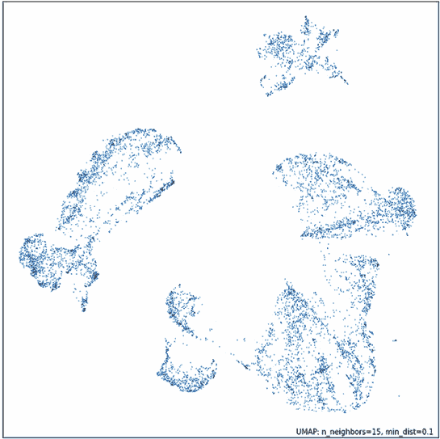
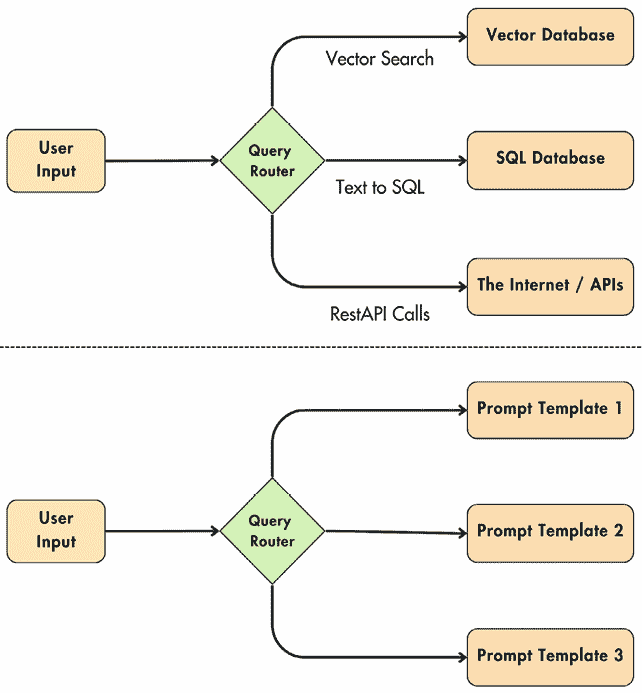
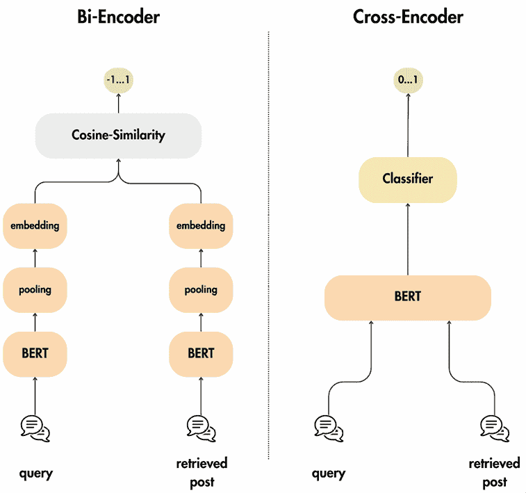
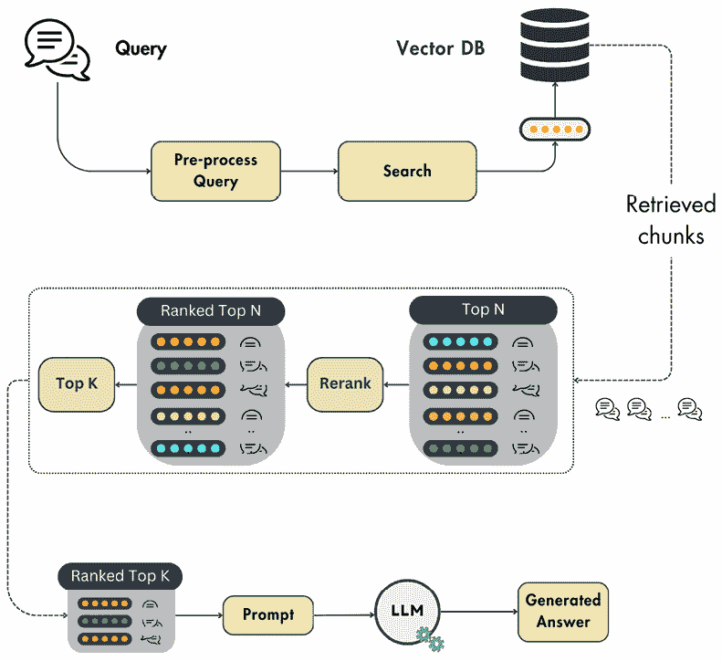
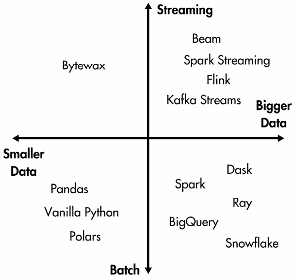
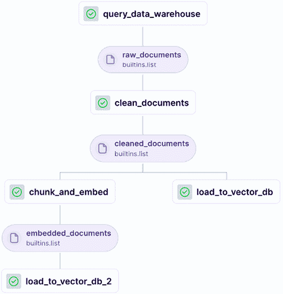
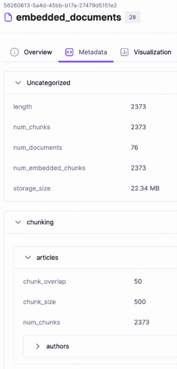
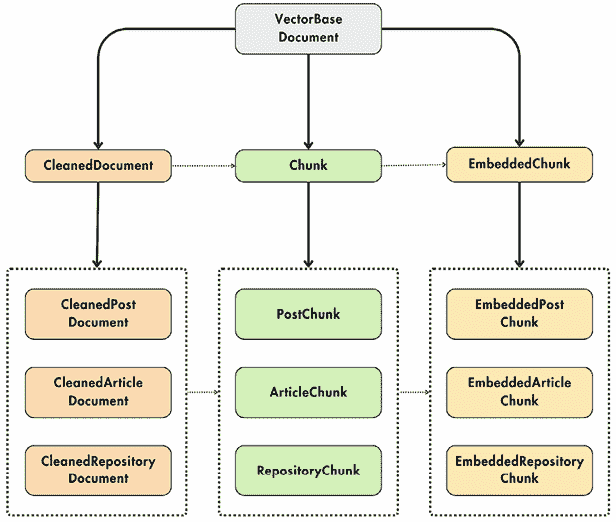

# 4

# RAG 功能管道

**检索增强生成**（**RAG**）在大多数生成式 AI 应用中是基本的。RAG 的核心责任是将自定义数据注入**大型语言模型**（**LLM**）以执行给定的操作（例如，总结、重新表述和提取注入的数据）。您通常希望将 LLM 应用于它未训练过的数据（例如，私有或新数据）。由于微调 LLM 是一项高度昂贵的操作，因此 RAG 是一种有吸引力的策略，可以绕过访问新数据时需要不断微调的需求。

我们将从这个章节的理论部分开始，重点关注 RAG 的基本原理及其工作方式。然后，我们将向您介绍一个天真 RAG 系统的所有组件：分块、嵌入和向量数据库。最终，我们将展示用于高级 RAG 系统的各种优化。然后，我们将继续探索 LLM 双胞胎的 RAG 功能管道架构。在这一步，我们将应用我们在章节开头讨论的所有理论方面。最后，我们将通过实现基于全书所述的系统设计的 LLM 双胞胎的 RAG 功能管道来通过一个实际例子。

本章的主要部分包括：

+   理解 RAG

+   高级 RAG 概述

+   探索 LLM 双胞胎的 RAG 功能管道架构

+   实现 LLM 双胞胎的 RAG 功能管道

到本章结束时，您将清楚地全面了解 RAG 是什么以及它是如何应用于我们的 LLM 双胞胎用例的。

# 理解 RAG

RAG 通过从外部来源获取的信息增强了生成式 AI 模型的准确性和可靠性。它是一种与 LLM 内部知识互补的技术。在深入细节之前，让我们了解 RAG 代表什么：

+   **检索**：搜索相关数据

+   **增强**：将数据作为上下文添加到提示中

+   **生成**：使用增强的提示和 LLM 进行生成

任何大型语言模型（LLM）都必然理解其训练的数据，这有时被称为参数化知识。因此，即使 LLM 可以完美地回答过去发生的事情，它也无法访问最新数据或任何其他它未训练过的外部来源。

让我们以 OpenAI 最强大的模型为例，2024 年夏季是 GPT-4o。该模型在截至 2023 年 10 月的数据上进行了训练。因此，如果我们询问 2020 年大流行期间发生了什么，它可以完美回答，因为它具有参数化知识。然而，如果我们询问 2024 年欧洲足球锦标赛的结果，由于其有限的参数化知识，它将不知道答案。另一个场景是，它将自信地产生幻觉并提供错误的答案。

RAG 克服了 LLM 的这两个限制。它提供了访问外部或最新数据的能力，并防止了幻觉，增强了生成式 AI 模型的准确性和可靠性。

## 为什么使用 RAG？

我们之前简要解释了在生成式 AI 应用中使用 RAG 的重要性。现在，我们将深入探讨“为什么”，之后我们将关注一个简单的 RAG 框架是什么样的。

目前，为了对 RAG 有一个直观的了解，你必须知道在使用 RAG 时，我们将必要的信息注入提示中，以回答初始用户的问题。之后，我们将增强后的提示传递给 LLM 以获得最终答案。现在，LLM 将使用额外的上下文来回答用户的问题。

RAG 解决了两个基本问题：

+   幻觉

+   过时或私有信息

### 幻觉

如果一个没有 RAG 的聊天机器人被问及它没有训练过的某个问题，它有很大可能会给出一个关于不真实事物的自信回答。以 2024 年欧洲足球锦标赛为例。如果模型训练到 2023 年 10 月，我们问它关于锦标赛的问题，它很可能会给出一个难以区分现实与真相的随机答案。即使 LLM 并不总是产生幻觉，这也引发了对其答案可信度的担忧。因此，我们必须问自己：“我们何时可以信任 LLM 的答案？”以及“我们如何评估答案是否正确？”。

通过引入 RAG，我们强制 LLM 始终仅基于引入的上下文来回答。LLM 将作为推理引擎，而通过 RAG 添加的额外信息将作为生成答案的唯一真实来源。通过这样做，我们可以快速评估 LLM 的答案是否基于外部数据。

### 过时信息

任何 LLM 都是在总世界知识数据集的一个子集上训练或微调的。这主要归因于三个主要问题：

+   **私有数据**：你不能在你不拥有或没有使用权的资料上训练你的模型。

+   **新数据**：每秒都会生成新的数据。因此，你必须不断地训练你的 LLM 以保持同步。

+   **成本**：训练或微调 LLM 是一项极其昂贵的操作。因此，按小时或按天进行是不可行的。

RAG 解决了这些问题，因为你不再需要不断地在新数据（甚至私有数据）上微调你的 LLM。直接将必要的数据注入到 LLM 接收的提示中，就足以生成正确且有价值的信息。

总结来说，RAG 对于构建强大和灵活的生成式 AI 系统至关重要。但我们是怎样根据用户的问题将正确的数据注入提示中的呢？我们将在下一节深入探讨 RAG 的技术细节。

## 基础 RAG 框架

每个 RAG 系统在其根源上都是相似的。我们首先将专注于理解 RAG 在其最简单形式下的情况。随后，我们将逐步介绍更多高级的 RAG 技术来提高系统的准确性。请注意，我们将交替使用 vanilla 和 naive RAG 以避免重复。

一个 RAG 系统由三个相互独立的主要模块组成：

+   **摄取管道**：用于填充向量数据库的批量或流式管道

+   **检索管道**：一个查询向量数据库并检索与用户输入相关的条目的模块

+   **生成管道**：使用检索到的数据来增强提示并使用 LLM 生成答案的层

由于这三个组件都是各自独立的类或服务，我们将分别深入探讨。但就目前而言，让我们尝试回答“这三个模块是如何连接的？”这个问题。以下是一个非常简化的概述：

1.  在后端，摄取管道按照计划或持续运行，以将外部数据填充到向量数据库中。

1.  在客户端，用户提出问题。

1.  问题被传递到检索模块，该模块预处理用户的输入并查询向量数据库。

1.  生成管道使用提示模板、用户输入和检索到的上下文来创建提示。

1.  提示信息被传递给大型语言模型（LLM）以生成答案。

1.  答案被展示给用户。

图 4.1：纯 RAG 架构

当您需要访问任何类型的外部信息时，必须在您的生成式 AI 应用程序中实现 RAG。例如，在实现财务助手时，您很可能需要在提供有价值的答案之前访问最新的新闻、报告和价格。或者，如果您构建一个旅行推荐系统，您必须检索并解析潜在景点、餐厅和活动的列表。在训练时间，LLM 无法访问您的特定数据，因此您通常必须在您的生成式 AI 项目中实现 RAG 策略。现在，让我们深入探讨摄取、检索和生成管道。

### 摄取管道

RAG 摄取管道从各种数据源（例如数据仓库、数据湖、网页等）提取原始文档。然后，它进行清洗、分块（分割成更小的部分）和嵌入文档。最终，它将嵌入的分块加载到向量数据库（或其他类似的向量存储）中。

因此，RAG 摄取管道被拆分为以下部分：

+   **数据提取模块**从各种来源（如数据库、API 或网页）收集所有必要的数据。此模块高度依赖于您的数据。它可以像查询您的数据仓库那样简单，也可以像爬取维基百科那样复杂。

+   **清洗层**将标准化并从提取的数据中移除不需要的字符。例如，您必须从输入文本中移除所有无效字符，如非 ASCII 字符、粗体和斜体字符。另一种流行的清洗策略是将 URL 替换为占位符。然而，您的清洗策略将根据您的数据源和嵌入模型而有所不同。

+   **分块模块**将清洗后的文档分割成更小的部分。由于我们希望将文档内容传递给嵌入模型，这是必要的，以确保它不超过模型的输入最大大小。此外，分块是必要的，以分离语义相关的特定区域。例如，当分块一本书的章节时，最理想的方式是将相似的段落分组到同一个部分或分块中。通过这样做，在检索时，你将只添加必要的数据到提示中。

+   **嵌入组件**使用嵌入模型将分块的内容（文本、图像、音频等）投影到一个密集的向量中，该向量包含语义值——更多关于嵌入的内容在下面的*什么是嵌入？*部分。

+   **加载模块**接收嵌入的分块以及元数据文档。元数据将包含诸如嵌入内容、分块来源的 URL 以及内容在网络上发布的时间等关键信息。嵌入用作索引以查询相似的块，而元数据用于访问添加到增强提示的信息。

到目前为止，我们有一个 RAG 摄取管道，它以原始文档为输入，处理它们，并填充向量数据库。下一步是正确地从向量存储中检索相关数据。

### 检索管道

检索组件接收用户的输入（文本、图像、音频等），将其嵌入，并查询向量数据库以找到与用户输入相似的向量。

检索步骤的主要功能是将用户的输入投影到与向量数据库中用作索引的嵌入相同的向量空间。这使得我们能够通过比较向量存储中的嵌入与用户的输入向量来找到最相似的 K 个条目。然后，这些条目作为内容来增强传递给 LLM 以生成答案的提示。

你必须使用距离度量来比较两个向量，例如欧几里得距离或曼哈顿距离。但最流行的是余弦距离，它等于两个向量之间角度的余弦值的 1 减去，如下所示：


它的范围从`-1`到`1`，当向量**A**和**B**方向相反时值为`-1`，如果它们是正交的，则值为`0`，如果它们指向同一方向，则值为`1`。

大多数情况下，余弦距离在非线性复杂向量空间中表现良好。然而，重要的是要注意，选择两个向量之间的适当距离取决于你的数据和所使用的嵌入模型。

一个需要强调的关键因素是用户的输入和嵌入必须在同一个向量空间中。否则，您无法计算它们之间的距离。要做到这一点，您必须以与 RAG 摄取管道中处理原始文档相同的方式预处理用户输入。这意味着您必须使用相同的函数、模型和超参数来清理、分块（如果需要）和嵌入用户的输入。这类似于您必须在训练和推理之间以相同的方式将数据预处理为特征；否则，推理将产生不准确的结果——这种现象也称为训练-服务偏差。

### 生成管道

RAG 系统的最后一步是获取用户的输入，检索数据，将其传递给 LLM，并生成一个有价值的答案。

最终的提示结果来自一个系统和提示模板，其中包含用户的查询和检索到的上下文。您可能有一个提示模板或多个提示模板，具体取决于您的应用。通常，所有的提示工程都是在提示模板级别完成的。

下面，您可以看到一个通用系统和提示模板的示例，以及它们如何与检索逻辑和 LLM 一起使用以生成最终答案：

```py
system_template = """
You are a helpful assistant who answers all the user's questions politely.
"""
prompt_template = """
Answer the user's question using only the provided context. If you cannot answer using the context, respond with "I don't know."
Context: {context}
User question: {user_question}
"""
user_question = "<your_question>"
retrieved_context = retrieve(user_question)
prompt = f"{system_template}\n"
prompt += prompt_template.format(context=retrieved_context, user_question=user_question)
answer  = llm(prompt) 
```

随着提示模板的演变，每个变更都应该使用**机器学习操作**（**MLOps**）最佳实践进行跟踪和版本控制。因此，在训练或推理时间，您始终知道给定的答案是由特定的 LLM 版本和提示模板生成的。您可以通过 Git 完成此操作，将提示模板存储在数据库中，或使用诸如 LangFuse 之类的特定提示管理工具。

正如我们在检索管道中看到的，一些直接影响您 RAG 系统准确性的关键方面是外部数据的嵌入，通常存储在向量数据库中，用户的查询嵌入，以及我们如何使用诸如余弦距离之类的函数在两者之间找到相似性。为了更好地理解 RAG 算法的这一部分，让我们深入探讨嵌入是什么以及它们是如何计算的。

## 嵌入是什么？

想象一下，你正在尝试教一台计算机理解世界。嵌入就像一个特定的翻译器，将这些事物转换成数值代码。然而，这个代码并非随机，因为相似的单词或项目最终会得到彼此接近的代码。这就像一张地图，其中具有相似意义的单词聚集在一起。

考虑到这一点，一个更理论化的定义是，嵌入是对象在连续向量空间中编码为向量的密集数值表示，例如单词、图像或推荐系统中的项目。这种转换有助于捕捉对象之间的语义意义和关系。例如，在**自然语言处理**（**NLP**）中，嵌入将单词转换为向量，其中语义相似的单词在向量空间中位置靠近。


图 4.2：嵌入是什么？

一种流行的方法是可视化嵌入以理解和评估它们的几何关系。由于嵌入通常具有超过 2 或 3 个维度，通常在 64 到 2048 之间，你必须将它们再次投影到 2D 或 3D。

例如，你可以使用 UMAP（[`umap-learn.readthedocs.io/en/latest/index.html`](https://umap-learn.readthedocs.io/en/latest/index.html)），这是一种在将嵌入投影到 2D 或 3D 时，能够很好地保持点之间几何属性的降维方法。在可视化向量时，另一个流行的降维算法是 t-SNE（[`scikit-learn.org/stable/modules/generated/sklearn.manifold.TSNE.html`](https://scikit-learn.org/stable/modules/generated/sklearn.manifold.TSNE.html)）。然而，与 UMAP 相比，t-SNE 更加随机，并且不保留点之间的拓扑关系。

降维算法，如 PCA、UMAP 和 t-SNE，是一种数学技术，用于在保留数据的基本模式、结构和关系的同时，减少数据集中的输入变量或特征数量。目标是把高维数据转换成低维形式，使其更容易可视化、解释和处理，同时最大限度地减少重要信息的损失。这些方法有助于解决“维度诅咒”，提高计算效率，并通常增强机器学习算法的性能。



图 4.3：使用 UMAP 可视化嵌入（来源：UMAP 文档）

### 为什么嵌入如此强大

首先，机器学习模型只处理数值。当处理表格数据时，这并不是问题，因为数据通常以数值形式存在或可以轻松转换为数值。当我们想要将单词、图像或音频数据输入模型时，嵌入就派上用场了。

例如，当使用转换器模型时，你需要对所有的文本输入进行分词，每个标记都与一个嵌入相关联。这个过程的美妙之处在于其简单性；转换器的输入是一个嵌入序列，这可以被神经网络密集层轻松且自信地解释。

基于这个例子，你可以使用嵌入来编码任何分类变量并将其输入到机器学习模型中。但为什么不使用其他简单的方法，例如**独热编码**呢？当处理具有高基数（例如语言词汇）的分类变量时，使用其他经典方法会遇到维度灾难。例如，如果你的词汇有 10,000 个标记，那么在应用独热编码后，只有一个标记的长度为 10,000。如果输入序列有 N 个标记，那么这将变成 N * 10,000 个输入参数。如果 N >= 100，通常在输入文本时，输入数据太大而无法使用。其他经典方法（如**哈希**）不遭受维度灾难的问题，但你可能会丢失向量之间的语义关系。

**独热编码**是一种将分类变量转换为二进制矩阵表示的技术。每个类别都表示为一个唯一的二进制向量。对于每个分类变量，创建一个长度等于唯一类别数量的二进制向量，其中所有值都是零，除了对应特定类别的索引，该索引被设置为 1。该方法保留了关于类别的所有信息。它简单且可解释。然而，一个显著的缺点是，如果分类变量有大量唯一值，它可能导致高维特征空间，使得该方法不实用。

**特征哈希**，也称为哈希编码或“哈希技巧”，是一种通过将类别值应用哈希函数来将分类变量转换为数值特征的技术。与独热编码相比，该方法不受唯一类别数量的限制，但它通过将类别映射到固定数量的桶或桶中，减少了特征空间的维度。因此，它减少了特征空间的维度，这在处理高基数分类变量时特别有用。这使得它在内存使用和计算时间方面效率很高。然而，存在碰撞的风险，即不同的类别可能映射到同一个桶，导致信息丢失。这种映射使得该方法不可解释。此外，很难理解原始类别与哈希特征之间的关系。

嵌入帮助我们编码分类变量，同时控制输出向量的维度。它们还使用巧妙的方法将信息压缩到比原始哈希技巧低得多的维度空间中。

其次，嵌入输入减少了其维度的大小，并将所有语义意义压缩到一个密集的向量中。这在处理图像时是一个非常流行的技术，其中 CNN 编码模块将高维意义映射到嵌入中，随后由 CNN 解码器处理分类或回归步骤。

下图展示了一个典型的 CNN 布局。想象一下每一层中的小方块。这些是“感受野”。每个方块将信息传递给前一层的一个神经元。随着你通过网络移动，有两个关键的事情正在发生：

+   **缩小图片**：特殊的“子采样”操作使层变得更小，专注于关键细节。

+   **学习特征**：另一方面，“卷积”操作实际上随着网络从图像中学习更复杂的特征而增加层的大小。

最后，一个完全连接的层在最后将所有这些处理过的信息转换成最终的向量嵌入，这是一个数值图像表示。

图 4.4：使用 CNN 从图像中创建嵌入（图片来源）

前面的图片来源于*维基共享资源*([`commons.wikimedia.org/wiki/File:Typical_cnn.png`](https://commons.wikimedia.org/wiki/File:Typical_cnn.png))，并授权于 Creative Commons Attribution-ShareAlike 4.0 国际许可协议（CC BY-SA 4.0：[`creativecommons.org/licenses/by-sa/4.0/deed.en`](https://creativecommons.org/licenses/by-sa/4.0/deed.en))。

### 嵌入是如何创建的？

嵌入是由理解输入的上下文和语义的深度学习模型创建的，并将它投影到一个连续的向量空间中。

可以使用各种深度学习模型来创建嵌入，具体取决于数据输入类型。因此，在挑选嵌入模型之前，理解你的数据以及你需要从数据中获得什么是非常基本的。

例如，当处理文本数据时，用于创建词汇嵌入的早期方法之一是 Word2Vec 和 GloVe。这些方法至今仍然是用于简单应用中流行的方法。

另一种流行的方法是使用仅编码器的 transformer，如 BERT，或其家族中的其他方法，如 RoBERTa。这些模型利用 transformer 架构的编码器，将你的输入智能地投影到一个密集的向量空间中，该空间可以稍后用作嵌入。

要快速在 Python 中计算嵌入，你可以方便地利用 Sentence Transformers Python 包（也可在 Hugging Face 的 transformer 包中找到）。这个工具提供了一个用户友好的界面，使得嵌入过程变得简单高效。

在下面的代码片段中，你可以看到我们如何从 SentenceTransformer 加载一个模型，计算三个句子的嵌入，并最终计算它们之间的余弦相似度。一个句子与自身的相似度总是 1。同样，第一句和第二句之间的相似度大约为 0，因为这两个句子没有共同点。相比之下，第一句和第三句之间的值更高，因为它们有一些重叠的上下文：

```py
from sentence_transformers import SentenceTransformer
model = SentenceTransformer("all-MiniLM-L6-v2")
sentences = [
"The dog sits outside waiting for a treat.",
"I am going swimming.",
"The dog is swimming."
]
embeddings = model.encode(sentences)
print(embeddings.shape)
# Output: [3, 384]
similarities = model.similarity(embeddings, embeddings)
print(similarities)
# Output:
# tensor([[ 1.0000, -0.0389, 0.2692],
# [-0.0389, 1.0000, 0.3837],
# [ 0.2692, 0.3837, 1.0000]])
#
# similarities[0, 0] = The similarity between the first sentence and itself.
# similarities[0, 1] = The similarity between the first and second sentence.
# similarities[2, 1] = The similarity between the third and second sentence. 
https://github.com/PacktPublishing/LLM-Engineering/blob/main/code_snippets/08_text_embeddings.py.
```

嵌入部分中的示例可以在本书使用的虚拟环境中运行，因为它包含了所有必需的依赖项。

最佳嵌入模型可能会随着时间和你的特定用例而变化。你可以在 Hugging Face 上的**大规模文本嵌入基准**（**MTEB**）中找到特定模型。根据你的需求，你可以考虑性能最佳模型、准确度最高的模型或内存占用最小的模型。这个决定完全基于你的要求（例如，准确度和硬件）。然而，Hugging Face 和 SentenceTransformer 使得在不同模型之间切换变得简单。因此，你可以始终尝试不同的选项。

当处理图像时，你可以使用**卷积神经网络**（**CNNs**）来嵌入它们。基于 ResNet 架构的 CNN 网络很受欢迎。然而，我们无法直接使用图像嵌入技术来处理音频记录。相反，我们可以创建音频的视觉表示，例如频谱图，然后应用图像嵌入模型到这些视觉上。这使我们能够以计算机可以理解的方式捕捉图像和声音的本质。

通过利用 CLIP 等模型，你可以实际上将一段文本和一张图片嵌入到同一个向量空间中。这允许你使用句子作为输入来找到相似图片，或者反过来，展示了 CLIP 的实用性。

在下面的代码片段中，我们使用 CLIP 对一张疯狂猫的图片和三个句子进行编码。最终，我们使用余弦相似度来计算图片和句子之间的相似度：

```py
from io import BytesIO
import requests
from PIL import Image
from sentence_transformers import SentenceTransformer
response = requests.get(
"https://github.com/PacktPublishing/LLM-Engineering/blob/main/images/crazy_cat.jpg?raw=true"
)
image = Image.open(BytesIO(response.content))
model = SentenceTransformer("clip-ViT-B-32")
img_emb = model.encode(image)
text_emb = model.encode(
["A crazy cat smiling.",
"A white and brown cat with a yellow bandana.",
"A man eating in the garden."]
)
print(text_emb.shape) # noqa
# Output: (3, 512)
similarity_scores = model.similarity(img_emb, text_emb)
print(similarity_scores) # noqa
# Output: tensor([[0.3068, 0.3300, 0.1719]]) 
```

源代码可以在[`github.com/PacktPublishing/LLM-Engineering/blob/main/code_snippets/08_text_image_embeddings.py`](https://github.com/PacktPublishing/LLM-Engineering/blob/main/code_snippets/08_text_image_embeddings.py)找到。

在这里，我们简要介绍了如何计算嵌入。具体实现的领域非常广泛，但重要的是要知道，大多数数字数据类别都可以计算嵌入，例如单词、句子、文档、图像、视频和图。

理解这一点至关重要：当你需要计算两个不同数据类别之间的距离时，例如句子向量和图像向量之间的距离，你必须使用专门的模型。这些模型旨在将两种数据类型投影到同一个向量空间，例如 CLIP，以确保准确的距离计算。

### 嵌入的应用

由于使用 RAG 的生成式 AI 革命，嵌入在信息检索任务中变得极其流行，例如文本、代码、图像和音频的语义搜索以及代理的长时记忆。但在生成式 AI 之前，嵌入已经在以下方面被大量使用：

+   表示传递给 ML 模型的分类变量（例如，词汇标记）

+   通过编码用户和项目并找到它们之间的关系来构建推荐系统

+   聚类和异常值检测

+   使用 UMAP 等算法进行数据可视化

+   使用嵌入作为特征进行分类

+   通过比较每个类的嵌入并选择最相似的一个进行零样本分类

完全理解 RAG（检索增强生成）工作原理的最后一步是检查向量数据库以及它们如何利用嵌入来检索数据。

## 更多关于向量数据库的信息

向量数据库是专门设计的数据库，用于高效地存储、索引和检索向量嵌入。传统的基于标量的数据库在处理向量数据的复杂性方面存在困难，这使得向量数据库对于实时语义搜索等任务至关重要。

虽然像 FAISS 这样的独立向量索引对于相似度搜索是有效的，但它们缺乏向量数据库全面的数据管理功能。向量数据库支持 CRUD 操作、元数据过滤、可伸缩性、实时更新、备份、生态系统集成和强大的数据安全，这使得它们比独立索引更适合生产环境。

### 向量数据库是如何工作的？

想象一下你通常是如何搜索数据库的。你输入一些特定的内容，系统就会输出精确匹配的结果。这就是传统数据库的工作方式。向量数据库则不同。我们寻找的是查询向量的最近邻，而不是完美匹配。在底层，向量数据库使用**近似最近邻**（**ANN**）算法来找到这些邻近的邻居。

虽然 ANN 算法不会为给定搜索返回顶部匹配项，但标准最近邻算法在实践中的速度太慢。此外，经验表明，仅使用给定输入查询的顶部匹配项的近似值就足够好了。因此，准确性和延迟之间的权衡最终有利于 ANN 算法。

这是一个向量数据库的典型工作流程：

1.  **索引向量**：向量使用针对高维数据优化的数据结构进行索引。常见的索引技术包括**层次可导航小世界**（**HNSW**）、随机投影、**产品量化**（**PQ**）和**局部敏感哈希**（**LSH**）。

1.  **查询相似度**：在搜索过程中，数据库查询索引向量以找到与输入向量最相似的向量。这个过程涉及根据相似度度量（如余弦相似度、欧几里得距离或点积）比较向量。每种方法都有其独特的优势，适用于不同的用例。

1.  **后处理结果**：在识别出潜在匹配项后，结果将进行后处理以精炼准确性。这一步骤确保返回给用户的是最相关的向量。

向量数据库可以在向量搜索之前或之后根据元数据过滤结果。这两种方法在性能和准确性方面都有权衡。查询还依赖于元数据（以及向量索引），因此它包含一个用于过滤操作的元数据索引用户。

### 创建向量索引的算法

向量数据库使用各种算法来创建向量索引并有效地管理搜索数据：

+   **随机投影**：随机投影通过使用随机矩阵将向量投影到低维空间来降低向量的维度。这项技术保留了向量之间的相对距离，从而促进了更快的搜索。

+   **PQ**：PQ 通过将向量分成更小的子向量，然后将这些子向量量化为代表性代码来压缩向量。这减少了内存使用并加快了相似性搜索。

+   **LSH**：LSH 将相似的向量映射到桶中。这种方法通过关注数据的一个子集，实现了快速近似最近邻搜索，从而降低了计算复杂度。

+   **HNSW**：HNSW 构建了一个多层图，其中每个节点代表一组向量。相似节点相连，允许算法在图中导航并有效地找到最近邻。

这些算法使向量数据库能够高效地处理复杂和大规模数据，使它们成为各种人工智能和机器学习应用的完美选择。

### 数据库操作

向量数据库也具有与标准数据库的共同特征，以确保在生产环境中具有高性能、容错性和易于管理。关键操作包括：

+   **分片和复制**：数据在多个节点之间分区（分片），以确保可扩展性和高可用性。节点间的数据复制有助于在节点故障的情况下保持数据完整性和可用性。

+   **监控**：持续监控数据库性能，包括查询延迟和资源使用情况（RAM、CPU、磁盘），有助于保持最佳运行状态并在问题影响系统之前发现潜在问题。

+   **访问控制**：实施强大的访问控制机制确保只有授权用户才能访问和修改数据。这包括基于角色的访问控制和其它安全协议，以保护敏感信息。

+   **备份**：定期的数据库备份对于灾难恢复至关重要。自动备份过程确保在数据损坏或丢失的情况下，数据可以恢复到之前的状态。

# 高级 RAG 概述

我们刚才提出的标准 RAG 框架没有解决影响检索和答案生成质量的一些基本方面，例如：

+   检索的文档与用户的问题相关吗？

+   检索到的上下文是否足够回答用户的问题？

+   是否存在任何冗余信息，这些信息只会增加增强提示的噪声？

+   检索步骤的延迟是否符合我们的要求？

+   如果我们无法使用检索到的信息生成有效的答案，我们该怎么办？

从上述问题中，我们可以得出两个结论。第一个结论是我们需要一个强大的评估模块来评估我们的 RAG 系统，它可以量化并衡量检索数据的质量，并针对用户的问题生成答案。我们将在第九章中更详细地讨论这个话题。第二个结论是我们必须改进我们的 RAG 框架，以直接在算法中解决检索限制。这些改进被称为高级 RAG。

原始的 RAG 设计可以在三个不同的阶段进行优化：

+   **预检索**：这个阶段侧重于如何对数据进行结构和预处理，以优化数据索引和查询优化。

+   **检索**：这个阶段主要围绕改进嵌入模型和元数据过滤，以提高向量搜索步骤。

+   **后检索**：这个阶段主要针对从检索到的文档中过滤噪声和压缩提示的不同方法，在将其馈送到 LLM 进行答案生成之前。


图 4.5：高级 RAG 的三个阶段

本节的目的不是列出所有可用的先进 RAG 方法，而是建立对可以优化内容的直觉。我们将仅使用基于文本数据的示例，但无论数据类别如何，高级 RAG 的原则都是相同的。现在，让我们深入探讨所有三个组成部分。

## 预检索

预检索步骤以两种不同的方式进行：

+   **数据索引**：它是 RAG 摄取管道的一部分。它主要在清理或分块模块中实现，以预处理数据以更好地索引。

+   **查询优化**：算法在嵌入和从向量数据库检索块之前直接在用户的查询上执行。

由于我们使用语义上表示分块文档内容的嵌入来索引我们的数据，大多数**数据索引**技术都集中在更好的数据预处理和结构化上，以提高检索效率，例如：

+   **滑动窗口**：滑动窗口技术引入了文本块之间的重叠，确保了重要上下文在块边界附近被保留，这提高了检索的准确性。这在法律文件、科学论文、客户支持日志和医疗记录等领域特别有益，在这些领域，关键信息经常跨越多个部分。嵌入计算在块及其重叠部分上。因此，滑动窗口通过保持上下文跨边界来提高系统检索相关和连贯信息的能力。

+   **增强数据粒度**：这涉及数据清理技术，如删除无关细节、验证事实准确性以及更新过时信息。一个干净且准确的数据集允许更精确的检索。

+   **元数据**: 添加日期、URL、外部 ID 或章节标记等元数据标签有助于在检索过程中有效地过滤结果。

+   **优化索引结构**: 它基于不同的数据索引方法，如各种块大小和多索引策略。

+   **从小到大**: 该算法将用于检索的块和用于最终答案生成的提示中的上下文解耦。算法使用一小段文本来计算嵌入，同时保留该序列本身及其周围的元数据更宽的窗口。因此，使用较小的块可以提高检索的准确性，而较大的上下文则为 LLM 添加更多上下文信息。

这种直觉在于，如果我们使用整个文本来计算嵌入，可能会引入过多的噪声，或者文本可能包含多个主题，这会导致嵌入的整体语义表示不佳。



图 4.6：查询路由

在**查询优化**方面，我们可以利用查询路由、查询重写和查询扩展等技术来进一步细化 LLM 检索的信息：

+   **查询路由**: 根据用户输入，我们可能需要与不同类别的数据交互，并对每个类别进行不同的查询。查询路由用于根据用户输入决定采取什么行动，类似于 if/else 语句。然而，决策完全使用自然语言而不是逻辑语句。

如图 4.6 所示，假设根据用户输入，进行 RAG 操作时，我们可以使用向量搜索查询从向量数据库中检索额外的上下文，通过将用户查询转换为 SQL 命令使用标准 SQL 数据库，或通过利用 REST API 调用从互联网上检索。查询路由器还可以检测是否需要上下文，帮助我们避免对外部数据存储进行冗余调用。此外，查询路由器可以用于为给定输入选择最佳的提示模板。例如，在 LLM Twin 用例中，根据用户是否想要文章段落、帖子或代码片段，需要不同的提示模板来优化创建过程。路由通常使用 LLM 来决定采取哪种路线或通过选择具有最相似向量的路径来选择嵌入。总之，查询路由类似于 if/else 语句，但更加灵活，因为它直接与自然语言工作。

+   **查询重写**: 有时，用户的初始查询可能无法完美地与您的数据结构对齐。查询重写通过重新表述问题以更好地匹配索引信息来解决这个问题。这可能涉及以下技术：

    +   **释义**: 在保留其意义的同时重新表述用户的查询（例如，“气候变化的原因是什么？”可以改写为“导致全球变暖的因素”）。

    +   **同义词替换**：用同义词替换不太常见的词以扩大搜索范围（例如，“愉快”可以改写为“快乐”）。

    +   **子查询**：对于较长的查询，我们可以将其分解为多个更短、更专注的子查询。这有助于检索阶段更精确地识别相关文档。

+   **假设文档嵌入**（**HyDE**）：这种技术涉及让一个 LLM 对查询创建一个假设性响应。然后，将原始查询和 LLM 的响应都输入到检索阶段。

+   **查询扩展**：这种方法旨在通过添加额外的术语或概念来丰富用户的问题，从而产生相同初始问题的不同视角。例如，当搜索“疾病”时，可以利用与原始查询词相关的同义词和相关术语，并包括“疾病”或“不适”。

+   **自查询**：核心思想是将非结构化查询映射为结构化查询。一个大型语言模型（LLM）在输入文本中识别关键实体、事件和关系。这些身份被用作过滤参数以减少向量搜索空间（例如，识别查询中的城市，例如“巴黎”，并将其添加到过滤器中以减少向量搜索空间）。

数据索引和查询优化（检索前优化技术）高度依赖于您的数据类型、结构和来源。因此，与任何数据处理管道一样，没有一种方法总是有效，因为每个用例都有其特定的特点和难点。优化您的检索前 RAG 层是实验性的。因此，最重要的是尝试多种方法（如本节中列举的方法），反复试验，并观察哪种方法最有效。

## 检索

检索步骤可以通过两种基本方式优化：

+   **改进 RAG 摄入管道中使用的嵌入模型**，以编码分块文档，并在推理时转换用户的输入。

+   **利用数据库的过滤和搜索功能**。此步骤仅在推理时使用，当您需要根据用户输入检索最相似的块时。

两种策略都与我们的最终目标一致：通过利用查询与索引数据之间的语义相似性来增强向量搜索步骤。

在改进嵌入模型时，通常需要微调预训练的嵌入模型，以使其适应特定领域的术语和细微差别，特别是对于术语不断演变或术语罕见的领域。

与微调嵌入模型不同，您可以使用指导模型（[`huggingface.co/hkunlp/instructor-xl`](https://huggingface.co/hkunlp/instructor-xl)）通过针对您领域的指令/提示来引导嵌入生成过程。使用此类模型将嵌入网络定制到您的数据中可能是一个好选择，因为微调模型需要更多的计算和人力资源。

在下面的代码片段中，您可以看到一个嵌入关于人工智能文章标题的指导模型示例：

```py
from InstructorEmbedding import INSTRUCTOR
model = INSTRUCTOR("hkunlp/instructor-base")
sentence = "RAG Fundamentals First"
instruction = "Represent the title of an article about AI:"
embeddings = model.encode([[instruction, sentence]])
print(embeddings.shape) # noqa
# Output: (1, 768) 
```

源代码可在[`github.com/PacktPublishing/LLM-Engineering/blob/main/code_snippets/08_instructor_embeddings.py`](https://github.com/PacktPublishing/LLM-Engineering/blob/main/code_snippets/08_instructor_embeddings.py)找到。

要运行指导代码，您必须创建一个不同的虚拟环境并激活它：

```py
python3 -m venv instructor_venv && source instructor_venv/bin/activate 
```

安装所需的 Python 依赖项：

```py
pip install sentence-transformers==2.2.2 InstructorEmbedding==1.0.1 
```

在光谱的另一端，以下是您如何通过利用经典的过滤和搜索数据库功能来提高检索效果的方法：

+   **混合搜索**：这是一种基于向量和关键词的搜索混合。基于关键词的搜索在识别包含特定关键词的文档方面表现出色。当任务需要精确度时，检索的信息必须包含确切的匹配关键词，混合搜索就非常出色。虽然向量搜索功能强大，但有时在寻找确切的匹配项时可能会遇到困难，但它擅长找到更一般的语义相似性。您通过结合两种方法利用关键词匹配和语义相似性。您有一个参数，通常称为 alpha，它控制两种方法之间的权重。算法有两个独立的搜索，这些搜索随后被归一化和统一。

+   **过滤向量搜索**：此类搜索利用元数据索引来过滤元数据中的特定关键词。它与混合搜索不同，因为它一次仅使用向量索引检索数据，并在向量搜索之前或之后执行过滤步骤以减少搜索空间。

在实践中，在检索方面，您通常从过滤向量搜索或混合搜索开始，因为它们相对容易实现。这种方法使您可以根据性能调整策略。如果结果不符合预期，您始终可以微调您的嵌入模型。

## 后检索

后检索优化仅针对检索到的数据进行，以确保 LLM 的性能不会因诸如有限上下文窗口或噪声数据等问题而受到影响。这是因为检索到的上下文有时可能太大或包含不相关信息，这两者都可能分散 LLM 的注意力。

在检索步骤中执行的两个流行方法包括：

+   **提示压缩**：在保留数据本质的同时消除不必要的细节。

+   **重排序**：使用交叉编码器机器学习模型为用户输入和每个检索到的片段之间提供匹配分数。检索到的项目根据此分数排序。仅保留前 N 个结果作为最相关的结果。如图 4.7 所示，这是因为重排序模型可以找到用户输入和某些内容之间比简单相似度搜索更复杂的关系。然而，我们无法在初始检索步骤中应用此模型，因为它成本高昂。这就是为什么一种流行的策略是使用嵌入之间的相似度距离检索数据，并使用重排序模型细化检索到的信息，如图 4.8 所示。



图 4.7：双编码器（标准嵌入模型）与交叉编码器

上述技术远非所有潜在解决方案的详尽列表。我们使用它们作为例子，以获得对你在 RAG 工作流程的每个步骤中可以（和应该）优化的内容的直觉。事实是，这些技术可以根据你处理的数据类型而有很大差异。

例如，如果你处理的是多模态数据，如文本和图像，那么之前的大部分技术将无法正常工作，因为它们是为文本设计的。



图 4.8：重排序算法

总结来说，这些优化的主要目标是增强 RAG 算法在三个关键阶段：预检索、检索和后检索。这包括为改进向量索引预处理数据，调整用户查询以进行更精确的搜索，增强嵌入模型，利用经典的过滤数据库操作，以及移除噪声数据。通过牢记这些目标，你可以有效地优化你的 RAG 工作流程以进行数据处理和检索。

# 探索 LLM Twin 的 RAG 功能管道架构

既然你对 RAG 及其工作原理有了强烈的直觉和深入的理解，我们将继续探索我们特定的 LLM Twin 用例。目标是提供一个端到端的实战示例，以巩固本章中提出的理论。

任何 RAG 系统都分为两个独立的组件：

+   **摄取管道**接收原始数据，清理、分块、嵌入，并将其加载到向量数据库中。

+   **推理管道**查询向量数据库以获取相关上下文，并最终通过利用大型语言模型生成答案。

在本章中，我们将专注于实现 RAG 摄取管道，而在第九章中，我们将继续开发推理管道。

考虑到这一点，让我们快速回顾一下我们试图解决的问题以及我们获取原始数据的地方。记住，我们正在构建一个端到端的机器学习系统。因此，所有组件都通过接口（或合约）相互通信，每个管道只有一个职责。在我们的案例中，我们摄取原始文档，预处理它们，并将它们加载到向量数据库中。

## 我们正在解决的问题

如前一章所述，本书旨在向您展示如何构建一个由端到端机器学习系统支持的、生产就绪的 LLM Twin。在本章中，我们特别想要设计一个 RAG 特征管道，该管道从我们的 MongoDB 数据仓库中提取原始社交媒体数据（例如，文章、代码存储库和帖子）。原始文档的文本将被清理、分块、嵌入，并最终加载到特征存储中。如*第一章*中所述，我们将使用 ZenML 工件和 Qdrant 向量数据库实现一个逻辑特征存储。

我们希望构建一个完全自动化的特征管道，因此我们需要同步数据仓库和逻辑特征存储。记住，在推理时间，用于生成答案的上下文是从向量数据库中检索的。因此，数据仓库和特征存储之间的同步速度将直接影响我们 RAG 算法的准确性。

另一个关键考虑因素是如何自动化特征管道并将其集成到我们的机器学习系统的其余部分。我们的目标是最大限度地减少两个数据存储之间的任何不同步，因为这可能会损害我们系统的完整性。

总结来说，我们必须设计一个特征管道，它不断地同步数据仓库和逻辑特征存储，同时相应地处理数据。在特征存储中拥有数据对于生产就绪的机器学习系统至关重要。LLM Twin 推理管道将查询它以进行 RAG，而训练管道将从中消费跟踪和版本化的微调数据集。

## 特征存储

**特征存储**将是训练和推理管道中所有使用的特征的**中央访问点**。训练管道将使用特征存储中的清洗数据（存储为工件）来微调 LLMs。推理管道将查询向量数据库以获取用于 RAG 的块状文档。这就是为什么我们设计的是一个特征管道，而不仅仅是 RAG 摄取管道。在实践中，特征管道包含多个子组件，其中之一是 RAG 逻辑。

记住，特征管道主要用于作为思维导图来导航机器学习系统的复杂性。它清楚地表明，它以原始数据作为输入，然后输出特征和可选标签，这些特征和标签存储在特征存储中。因此，一个很好的直觉是考虑所有在数据仓库和特征存储之间的逻辑都进入特征管道命名空间，包括一个或多个子管道。例如，我们将实现另一个管道，它接受清洗数据，将其处理成指令数据集，并将其存储在工件中；这也位于特征管道的伞下，因为工件是逻辑特征存储的一部分。另一个例子是在原始数据或计算特征之上实现数据验证管道。

另一个重要的观察点是，按照标准惯例，存储为字符串的文本数据如果不被视为特征。特征是直接输入到模型中的东西。例如，我们必须对指令数据集或分块文档进行标记化，才能被视为特征。为什么？因为标记直接输入到模型中，而不是作为字符串的句子。不幸的是，这使得系统更加复杂和不灵活。因此，我们将在运行时进行标记化。但这个观察结果很重要，因为它是一个明确的例子，说明你不必对特征/训练/推理（FTI）架构过于僵化。你必须根据自己的用例对其进行调整。

## 原始数据从哪里来？

作为快速提醒，所有原始文档都存储在 MongoDB 数据仓库中。数据仓库由第三章中介绍的 ETL 数据收集管道填充。ETL 管道爬取各种平台，如 Medium 和 Substack，标准化数据，并将其加载到 MongoDB 中。有关此主题的更多详细信息，请参阅第三章。

## 设计 RAG 特征管道的架构

最后一步是设计和实施 LLM Twin 应用程序的 RAG 特征管道。我们将使用一个批量设计，该设计计划从 MongoDB 数据仓库中轮询数据，处理它，并将其加载到 Qdrant 向量数据库中。我们首先要问自己的问题是，“为什么是批量管道？”

但在回答这个问题之前，让我们快速了解批量架构是如何工作以及相对于流式设计的表现的。


图 4.9：LLM Twin 的 RAG 特征管道架构

### 批量管道

数据系统中的批量管道是指一种数据处理方法，其中数据按预定义的间隔和较大体积收集、处理和存储，也称为“批量”。这种方法与实时或流式数据处理不同，后者数据到达时连续处理。这就是批量管道中的情况：

1.  **数据收集**：数据从各种来源收集并存储，直到积累到足够多的量以进行处理。这可以包括来自数据库、日志、文件和其他来源的数据。

1.  **计划处理**：数据处理按固定时间间隔进行，例如每小时或每天。在这段时间内，收集到的数据将批量处理。这可能包括数据清理、转换、聚合和其他操作。

1.  **数据加载**：处理完毕后，数据被加载到目标系统中，例如数据库、数据仓库、数据湖或特征存储。然后，这些处理后的数据可用于分析、查询或进一步处理。

批量管道在处理大量数据且不需要立即处理的情况下特别有用。它们提供了几个优点，包括：

+   **效率**：批量处理比实时处理更高效地处理大量数据，允许优化资源分配和并行处理。

+   **复杂处理**：批量管道可以执行可能对实时处理来说过于资源密集的复杂数据转换和聚合。

+   **简单性**：批量处理系统的架构通常比实时系统简单，这使得它们更容易实现和维护。

### 批量与流管道对比

当实现特征管道时，你有两个主要的设计选择：批量处理和流处理。因此，了解这两种方法之间的差异以及为什么我们选择批量架构而不是流架构来处理我们的 LLM Twin 用例是值得的。

你可以轻松地写一个关于流管道的专门章节，这表明其复杂性超过批量设计。然而，随着流架构变得越来越流行，人们必须对它们的工作方式有直观的了解，以便为你的应用程序选择最佳选项。

流应用的核心元素是一个分布式事件流平台，如 Apache Kafka 或 Redpanda，用于存储来自多个客户端的事件，以及一个流引擎，如 Apache Flink 或 Bytewax，用于处理这些事件。为了简化你的架构，你可以用队列，如 RabbitMQ，来替换你的事件流平台，以存储事件直到处理。*表 4.1*根据多个标准比较了批量处理和流处理管道，如处理调度和复杂性：

| **方面** | **批量管道** | **流管道** |
| --- | --- | --- |
| **处理调度** | 定期间隔处理数据（例如，每分钟、每小时、每天）。 | 持续处理数据，延迟最小。 |
| **效率** | 更高效地处理大量数据，优化资源分配和并行处理。 | 处理单个数据点，提供即时洞察和更新，允许快速响应变化。 |
| **处理复杂性** | 能够执行复杂的数据转换和聚合。 | 设计用于以低延迟处理高速数据流。 |
| **用例** | 适用于不需要即时数据处理的场景。常用于数据仓库、报告、ETL 流程和特征管道。 | 适用于需要实时分析、功能、监控和事件驱动架构的应用。 |
| **系统复杂性** | 与流管道相比，系统通常更容易实现和维护。 | 由于需要低延迟处理、容错性和可伸缩性，实现和维护更复杂。工具也更为先进和复杂。 |

表 4.1：批量与流管道对比

例如，流式管道在像 TikTok 这样的社交媒体推荐系统中非常强大。在使用社交媒体时，用户行为经常变化。一个典型的场景是，你希望在某个时间点放松，主要观看小狗的视频。然而，15 分钟后，你会感到无聊，想要一些更严肃的内容，比如教育内容或新闻。这意味着推荐系统必须及时捕捉这些行为变化，以保持你的兴趣。由于兴趣之间的转换是循环的且不可预测的，你不能使用每 30 分钟或每小时运行一次的批处理管道来生成更多内容。你可以每分钟运行一次以创建新内容，但与此同时，它将导致不必要的成本，因为大多数预测将不会被消费。通过实现流式管道，你可以实时更新特定用户的特征，然后这些特征被传递到一系列模型中，以预测新的推荐内容。

流式架构也是实时欺诈检测算法（如 Stripe 或 PayPal 中使用的算法）的骨架。在这种情况下，关键是要在交易发生时识别潜在的欺诈交易，而不是在几分钟或几小时之后，正如批处理管道会处理的那样。同样的紧迫性也适用于基于不断涌入的市场数据进行股票预测的高频交易平台，使交易者能够在毫秒内做出决策。

另一方面，你可以为离线推荐系统使用批处理架构。例如，在为电子商务或流媒体平台实现时，你不需要系统如此反应灵敏，因为用户的行为很少改变。因此，基于历史用户行为数据，定期（如每晚）使用批处理管道更新推荐内容更容易实现且成本更低。

批处理管道的另一个流行例子是用于提取、转换和加载数据以用于不同用例的 ETL 设计。ETL 设计在用于将数据从一个数据库移动到另一个数据库的数据管道中很常见。一些实际用例包括用于分析的聚合数据，其中你必须从多个来源提取数据，对其进行聚合，并将其加载到连接到仪表板的数据库中。分析领域可以非常广泛，从电子商务和营销到金融和研究。

在 LLM Twin 用例中使用的数据收集管道是另一个提取数据来自互联网、对其进行结构化并将其加载到数据仓库以供未来处理的 ETL 管道的例子。

除了预测或特征新鲜度之外，批量管道相对于流式管道的另一个缺点是，你通常会做出冗余的预测。以 Netflix 等流媒体平台的推荐系统为例。每晚，你为所有用户做出预测。有很大可能性，一大群用户那天不会登录。此外，用户通常不会浏览所有推荐，而是坚持查看前几个。因此，只有一部分预测被使用，而其他所有预测都浪费了计算能力。

正因如此，一种流行的策略是从批量架构开始，因为它更快、更容易实现。产品到位后，你逐渐过渡到流式设计，以降低成本并提高用户体验。

总结来说，我们之所以选择批量架构（而非流式架构）来实现 LLM Twin 的特征管道，有以下原因：

+   **不需要立即数据处理**：即使同步数据仓库和特征存储对于准确的 RAG 系统至关重要，几分钟的延迟是可以接受的。因此，我们可以安排批量管道每分钟运行一次，持续同步两个数据存储。这种技术之所以有效，是因为数据量小。整个数据仓库将只有几千条记录，而不是数百万或数十亿。因此，我们可以快速迭代它们并同步两个数据库。

+   **简单性**：如前所述，实现流式管道是两倍复杂。在现实世界中，你希望尽可能简化你的系统，使其更容易理解、调试和维护。此外，简单性通常意味着更低的基础设施和开发成本。

在*图 8.10*中，我们比较了根据你的架构（流式处理与批量处理）以及你要处理的数据量（小数据与大数据）你可以使用哪些工具。在我们的用例中，我们处于小数据和批量象限，我们选择了纯 Python 和生成式 AI 工具的组合，如 LangChain、Sentence Transformers 和 Unstructured。



图 4.10：流式处理与批量处理以及小数据与大数据谱系中的工具

在本章后面的*“变更数据捕获：同步数据仓库和特征存储”*部分，我们将讨论何时从批量架构切换到流式架构是有意义的。

### 核心步骤

大多数 RAG 特征管道由五个核心步骤组成。在 LLM Twin 架构中实现的也不例外。因此，你可以快速地将这种模式应用于其他 RAG 应用，但以下是 LLM Twin 的 RAG 特征管道的样子：

1.  **数据提取**：从 MongoDB 数据仓库中提取最新的文章、代码仓库和帖子。在提取步骤中，你通常会聚合所有需要处理的数据。

1.  **清洗**: 数据仓库中的数据已经标准化和部分清洗，但我们必须确保文本只包含有用的信息，不重复，并且可以被嵌入模型解释。例如，在将文本传递给嵌入模型之前，我们必须清理和标准化所有非 ASCII 字符。此外，为了保持信息在语义上密集，我们决定用占位符替换所有 URL，并移除所有表情符号。清洗步骤更多的是艺术而非**科学**。因此，在你有了带有评估机制的第一次迭代之后，你可能会反复迭代并改进它。

1.  **分块**: 你必须根据每个数据类别和嵌入模型采用各种分块策略。例如，当与代码仓库一起工作时，你希望分块更宽泛，而当与文章一起工作时，你希望它们更窄或定位在段落级别。根据你的数据，你必须决定是否根据章节、部分、段落、句子或只是一个固定的窗口大小来分割你的文档。此外，你必须确保分块大小不超过嵌入模型的最大输入大小。这就是为什么你通常根据你的数据结构和模型的最大输入大小来分块文档。

1.  **嵌入**: 你将每个分块单独传递到你选择的嵌入模型。在实现方面，这一步通常是最简单的，因为 SentenceTransformer 和 Hugging Face 等工具为大多数嵌入模型提供了高级接口。正如本章“什么是嵌入？”部分所解释的，在这一步，最重要的决定是决定使用什么模型以及是否对其进行微调。例如，我们使用了来自 SentenceTransformer 的`"all-mpnet-base-v2"`嵌入模型，它相对较小，可以在大多数机器上运行。然而，我们提供了一个配置文件，你可以根据阅读本书时的最新技术状态快速配置嵌入模型。你可以在 Hugging Face 的 MTEB 上快速找到其他选项（[`huggingface.co/spaces/mteb/leaderboard`](https://huggingface.co/spaces/mteb/leaderboard)）。

1.  **数据加载**: 最后一步是将分块文档的嵌入及其元数据（如作者、文档 ID、内容、URL、平台和创建日期）结合起来。最终，我们将向量和元数据包装成一个与 Qdrant 兼容的结构，并将其推送到向量数据库。由于我们希望将 Qdrant 作为特征的单一事实来源，我们也把清洗过的文档（在分块之前）推送到 Qdrant。我们可以推送没有向量的数据，因为 Qdrant 的元数据索引就像一个 NoSQL 数据库。因此，推送没有附加向量的元数据就像使用标准的 NoSQL 引擎一样。

### 数据捕获变更：同步数据仓库和特征存储

如本章多次强调的那样，数据是不断变化的，这可能导致数据库（DBs）、数据湖、数据仓库和特征存储失去同步。**变更数据捕获**（**CDC**）是一种策略，允许您在不进行计算和 I/O 开销的情况下，最优地保持两种或多种数据存储类型同步。它捕获对源数据库执行的任何 CRUD 操作，并将其复制到目标数据库。可选地，您可以在复制之间添加预处理步骤。

同步问题也适用于构建特征管道。一个关键的设计选择是关于如何同步数据仓库与特征存储，以便为您的特定用例提供足够新鲜的数据。

在我们的 LLM Twin 用例中，我们出于简单起见选择了一种天真方法。我们实现了一个周期性或手动触发的批量管道。它从数据仓库中读取所有原始数据，批量处理它们，并将新记录或更新插入到 Qdrant 向量数据库中。当您处理数千或数万条记录时，这种方法效果良好。但我们的天真方法提出了以下问题：

+   如果数据突然增长到数百万条记录（或更多）怎么办？

+   如果从数据仓库中删除了一条记录？这在特征存储中如何反映？

+   如果我们只想处理数据仓库中的新或更新项，而不是所有项怎么办？

幸运的是，CDC 模式可以解决所有这些问题。在实施 CDC 时，您可以采取多种方法，但所有这些方法都使用推送或拉取策略：

+   **推送**：在推送方法中，源数据库是主要驱动因素。它积极识别并向目标系统传输数据修改以进行处理。此方法确保在目标处几乎瞬间更新，但如果目标系统不可访问，则可能会发生数据丢失。为了减轻这种情况，通常使用消息系统作为缓冲。

+   **拉取**：拉取方法赋予源数据库更被动的角色，它仅记录数据更改。目标系统定期请求这些更改并相应地处理更新。虽然这种方法减轻了源系统的负担，但引入了数据传播的延迟。在目标系统不可用期间，消息系统再次是防止数据丢失的关键。

总结来说，推送方法适用于需要即时数据访问的应用程序，而拉取方法更适合大规模数据传输，其中实时更新不是关键。考虑到这一点，有不同方法来检测数据变化。因此，让我们列出在行业中使用的主要 CDC 模式：

+   **基于时间戳的**: 这种方法涉及在数据库表中添加一个修改时间列，通常称为 `LAST_MODIFIED` 或 `LAST_UPDATED`。下游系统可以查询此列以识别自上次检查以来已更新的记录。虽然实现简单，但此方法仅限于跟踪更改，而不是删除，并且由于需要扫描整个表而增加了性能开销。

+   **基于触发器的**: 基于触发器的方法利用数据库触发器在 INSERT、UPDATE 或 DELETE 操作时自动记录数据修改到一个单独的表中，通常称为事件表。此方法提供了全面的变化跟踪，但由于每个事件都涉及额外的写入操作，可能会影响数据库性能。

+   **基于日志的**: 数据库维护事务日志以记录所有数据修改，包括时间戳。主要用于恢复，这些日志还可以用于实时传播到目标系统中的更改。这种方法最小化了源数据库的性能影响。作为一个巨大的优势，它避免了源数据库上的额外处理开销，捕获了所有数据更改，并且不需要对模式进行修改。但另一方面，它缺乏标准化的日志格式，导致供应商特定的实现。

关于 CDC 的更多详细信息，我推荐阅读 Confluent 的博客中的 *什么是变更数据捕获？*：[`www.confluent.io/en-gb/learn/change-data-capture/`](https://www.confluent.io/en-gb/learn/change-data-capture/)。

考虑到这些 CDC 技术，我们可以在我们的 RAG 功能管道中快速实现一个基于拉取时间戳的策略，以在数据增长时更优化地同步数据仓库和特征存储库。我们的实现仍然是基于拉取的，但不会检查源数据库中的任何最后更新字段；它只是从数据仓库中拉取所有内容。

然而，在行业中最为流行和最优的技术是日志基础技术。它不会给源数据库增加任何 I/O 开销，具有低延迟，并支持所有 CRUD 操作。最大的缺点是其开发复杂性，需要队列来捕获所有 CRUD 事件，并需要一个流式处理管道来处理它们。

由于这是一本关于大型语言模型的书，而不是数据工程的书，我们希望保持简单，但重要的是要知道这些技术存在，并且当你的当前实现不再满足应用程序需求时，你总是可以升级你的实现。

### 为什么数据存储在两个快照中？

我们在逻辑特征存储库中存储了我们数据的两个快照：

+   **数据清理后**: 用于微调大型语言模型

+   **在文档分块和嵌入后**: 用于 RAG

*我们为什么这样设计？* 记住，特征应该仅从特征存储库中访问用于训练和推理。因此，这增加了我们设计的连贯性，并使其更简洁。

此外，将专门用于我们的微调和嵌入用例的数据清洗存储在 MongoDB 数据仓库中将会是一个反模式。仓库中的数据在整个公司中共享。因此，为特定用例处理它不是好的做法。想象一下另一个摘要用例，我们必须以不同的方式清洗和预处理数据。我们必须为每个新的用例创建一个新的“清洗数据”表，并以前缀使用例名称命名。我们必须为每个新的用例重复此操作。因此，为了避免有一个混乱的数据仓库，数据仓库中的数据是通用的，并且仅在下游组件中针对特定应用进行建模，在我们的情况下，是特征存储。

最终，正如我们在 *核心步骤* 部分提到的，你可以利用向量数据库的元数据索引作为 NoSQL 数据库。基于这些因素，我们决定将清洗后的数据以及文档的块化和嵌入版本都保存在 Qdrant 中。

作为快速提醒，当将我们的 LLM Twin 系统投入运营时，*第五章* 中解释的创建指令数据集管道将从 Qdrant 读取清洗后的文档，处理它们，并将它们保存为版本化的 ZenML 艺术品。训练管道需要一个数据集而不是普通文档。这是一个提醒，我们的逻辑特征存储包括 Qdrant 向量数据库用于在线服务以及 ZenML 艺术品用于离线训练。

### 编排

ZenML 将编排批处理 RAG 特征管道。使用 ZenML，我们可以安排它按计划运行，例如每小时运行一次，或者快速手动触发它。另一个选项是在 ETL 数据收集管道完成后触发它。

通过编排特征管道并将其集成到 ZenML（或任何其他编排工具）中，我们可以将特征管道投入运营，最终目标是**持续训练**（**CT**）。

我们将在 *第十一章* 中详细介绍编排、调度和 CT。

# 实现 LLM Twin 的 RAG 特征管道

最后一步是审查 LLM Twin 的 RAG 特征管道代码，看看我们如何应用本章中讨论的所有内容。我们将向您介绍以下内容：

+   ZenML 代码

+   Pydantic 领域对象

+   一个定制的**对象-向量映射**（**OVM**）实现

+   我们所有数据类别的清洗、分块和嵌入逻辑

我们将采取自上而下的方法。因此，让我们从 Settings 类和 ZenML 管道开始。

## 设置

我们使用 Pydantic Settings ([`docs.pydantic.dev/latest/concepts/pydantic_settings/`](https://docs.pydantic.dev/latest/concepts/pydantic_settings/)) 来定义一个全局的 Settings 类，该类从 `.env` 文件中加载敏感或非敏感变量。这种方法也为我们带来了 Pydantic 的所有好处，例如类型验证。例如，如果我们为 `QDRANT_DATABASE_PORT` 变量提供一个字符串而不是整数，程序将会崩溃。这种行为使得整个应用程序更加确定性和可靠。

这是 `Settings` 类的样子，其中包含构建 RAG 特征管道所需的所有变量：

```py
from pydantic import BaseSettings
class Settings(BaseSettings):
    class Config:
        env_file = ".env"
        env_file_encoding = "utf-8"
    … # Some other settings…
    # RAG
    TEXT_EMBEDDING_MODEL_ID: str = "sentence-transformers/all-MiniLM-L6-v2"
    RERANKING_CROSS_ENCODER_MODEL_ID: str = "cross-encoder/ms-marco-MiniLM-L-4-v2"
    RAG_MODEL_DEVICE: str = "cpu"
    # QdrantDB Vector DB
    USE_QDRANT_CLOUD: bool = False
    QDRANT_DATABASE_HOST: str = "localhost"
    QDRANT_DATABASE_PORT: int = 6333
    QDRANT_CLOUD_URL: str = "str"
    QDRANT_APIKEY: str | None = None
    … # More settings…
settings = Settings() 
```

如内部 Config 类所述，所有变量都有默认值，或者可以通过提供 `.env` 文件来覆盖。

## ZenML 管道和步骤

ZenML 管道是 RAG 特征工程管道的入口点。它反映了 RAG 吸收代码的五个核心阶段：提取原始文档、清理、分块、嵌入并将它们加载到逻辑特征存储中。`feature_engineering()` 函数内的调用是 ZenML 步骤，代表执行五个阶段的单个执行单元。代码可在 GitHub 仓库中找到：[`github.com/PacktPublishing/LLM-Engineers-Handbook/blob/main/pipelines/feature_engineering.py`](https://github.com/PacktPublishing/LLM-Engineers-Handbook/blob/main/pipelines/feature_engineering.py)

```py
from zenml import pipeline
from llm_engineering.interfaces.orchestrator.steps import feature_engineering as fe_steps
@pipeline
def feature_engineering(author_full_names: list[str]) -> None:
    raw_documents = fe_steps.query_data_warehouse(author_full_names)
    cleaned_documents = fe_steps.clean_documents(raw_documents)
     last_step_1 = fe_steps.load_to_vector_db(cleaned_documents)
    embedded_documents = fe_steps.chunk_and_embed(cleaned_documents)
    last_step_2 = fe_steps.load_to_vector_db(embedded_documents)
    return [last_step_1.invocation_id, last_step_2.invocation_id] 
```

*图 4.11* 展示了在 ZenML 仪表板中多个特征工程管道运行的外观。


图 4.11：ZenML 仪表板中的特征管道运行

*图 8.12* 展示了 RAG 特征管道的 DAG，你可以跟踪所有管道步骤及其输出工件。请记住，从 ZenML 步骤返回的任何内容都会自动保存为工件，存储在 ZenML 的工件注册表中，进行版本控制，并在应用程序中共享。



图 4.12：ZenML 仪表板中的特征管道 DAG

最后一个拼图是理解如何动态配置 RAG 特征管道。所有可用设置都作为函数参数公开。在这里，我们只需要一个作者名字的列表，正如函数签名中所示：`feature_engineering(author_full_names: list[str])`。我们注入一个运行时 YAML 配置文件，其中包含基于不同用例的所有必要值。例如，以下配置包括本书所有作者的名字，因为我们希望用我们所有人的数据填充特征存储（可在 GitHub 仓库的 `configs/feature_engineering.yaml` 中找到）：

```py
parameters:
  author_full_names:
    - Alex Vesa
    - Maxime Labonne
    - Paul Iusztin 
```

这种方法的优点是，你不需要修改代码来使用不同的输入值配置特征管道。你需要在运行时提供不同的配置文件，如下所示：

```py
feature_engineering.with_options(config_path="…/feature_engineering.yaml")() 
```

你可以硬编码配置文件的路径，或者从 CLI 提供的 `config_path`，这允许你在不同运行之间修改管道的配置。出于简单起见，我们硬编码了配置文件。因此，我们可以通过以下方式调用特征工程管道，即调用 `run.py` 脚本：

```py
python -m tools.run --no-cache --run-feature-engineering 
```

然而，你可以轻松地添加另一个 CLI 参数来传递 `config_path` 变量。你也可以使用以下 `poe` 命令运行特征管道：

```py
poetry poe run-feature-engineering-pipeline 
```

让我们继续前进到 ZenML 步骤，并依次聚焦于所有这些步骤。所有特征工程管道步骤的源代码都可在 GitHub 上的`"steps/feature_engineering"`获取。我们将从第一个步骤开始，该步骤涉及查询数据仓库以获取新内容进行处理成特征。

### 查询数据仓库

首先要注意的是，一个步骤是一个用`@step`装饰的 Python 函数，类似于 ZenML 管道的工作方式。下面的函数接受作者全名列表作为输入，并执行以下核心步骤：

+   它尝试使用姓名和姓氏获取或创建一个`UserDocument`实例，并将此实例追加到作者列表中。如果用户不存在，它将抛出一个错误。

+   它从数据仓库中获取所有原始数据供用户使用，并将`documents`列表扩展以包括这些用户文档。

+   最终，它计算一个描述性元数据字典，该字典在 ZenML 中记录和跟踪。

```py
… # other imports
from zenml import get_step_context, step
@step
def query_data_warehouse(
    author_full_names: list[str],
) -> Annotated[list, "raw_documents"]:
    documents = []
    authors = []
    for author_full_name in author_full_names:
        logger.info(f"Querying data warehouse for user: {author_full_name}")
        first_name, last_name = utils.split_user_full_name(author_full_name)
        logger.info(f"First name: {first_name}, Last name: {last_name}")
        user = UserDocument.get_or_create(first_name=first_name, last_name=last_name)
        authors.append(user)
        results = fetch_all_data(user)
        user_documents = [doc for query_result in results.values() for doc in query_result]
        documents.extend(user_documents)
    step_context = get_step_context()
    step_context.add_output_metadata(output_name="raw_documents", metadata=_get_metadata(documents))
    return documents 
```

获取函数利用线程池，在各个不同的线程上运行每个查询。由于我们有多个数据类别，我们必须为文章、帖子存储在不同的集合中，因此必须为它们进行不同的查询。每个查询都调用数据仓库，这受限于网络 I/O 和数据仓库延迟，而不是机器的 CPU。因此，通过将每个查询移动到不同的线程，我们可以并行化它们。最终，运行此获取函数的时间将是所有调用中的最大值。

在 Python 中使用线程并行化 I/O 受限的调用是良好的实践，因为它们不受 Python 全局解释器锁（GIL）的锁定。相比之下，将每个调用添加到不同的进程中会添加过多的开销，因为进程启动比线程慢。

在 Python 中，您只想在操作受 CPU 或内存限制时使用进程来并行化事物，因为全局解释器锁（GIL）会影响它们。每个进程都有自己的 GIL。因此，并行化您的计算逻辑，例如处理已加载到内存中的文档或图像批处理，不会受到 Python GIL 限制的影响。

```py
def fetch_all_data(user: UserDocument) -> dict[str, list[NoSQLBaseDocument]]:
    user_id = str(user.id)
    with ThreadPoolExecutor() as executor:
        future_to_query = {
            executor.submit(__fetch_articles, user_id): "articles",
            executor.submit(__fetch_posts, user_id): "posts",
            executor.submit(__fetch_repositories, user_id): "repositories",
        }
        results = {}
        for future in as_completed(future_to_query):
            query_name = future_to_query[future]
            try:
                results[query_name] = future.result()
            except Exception:
                logger.exception(f"'{query_name}' request failed.")
                results[query_name] = []
    return results 
```

`_get_metadata()`函数接受查询到的文档和作者列表，并计算它们相对于每个数据类别的数量：

```py
def _get_metadata(documents: list[Document]) -> dict:
    metadata = {
        "num_documents": len(documents),
    }
    for document in documents:
        collection = document.get_collection_name()
        if collection not in metadata:
            metadata[collection] = {}
        if "authors" not in metadata[collection]:
            metadata[collection]["authors"] = list()
        metadata[collection]["num_documents"] = metadata[collection].get("num_documents", 0) + 1
        metadata[collection]["authors"].append(document.author_full_name)
    for value in metadata.values():
        if isinstance(value, dict) and "authors" in value:
            value["authors"] = list(set(value["authors"]))
    return metadata 
```

我们将在 ZenML 仪表板上公开此元数据，以便快速查看加载数据的某些统计数据。例如，在*图 4.13*中，我们访问了`query_data_warehouse()`步骤的元数据标签，您可以看到，在特征管道的特定运行中，我们加载了来自三位作者的 76 个文档。这对于监控和调试批处理管道来说非常强大。

您可以始终根据您的用例扩展任何有意义的操作。


图 4.13：“查询数据仓库”ZenML 步骤的元数据

### 清理文档

在清理步骤中，我们遍历所有文档，并将所有逻辑委托给一个`CleaningDispatcher`，该调度器知道根据数据类别应用哪种清理逻辑。请记住，我们希望应用，或者在未来有应用不同清理技术的能力，对文章、帖子以及代码库进行清理。

```py
@step
def clean_documents(
    documents: Annotated[list, "raw_documents"],
) -> Annotated[list, "cleaned_documents"]:
    cleaned_documents = []
    for document in documents:
        cleaned_document = CleaningDispatcher.dispatch(document)
        cleaned_documents.append(cleaned_document)
    step_context = get_step_context()
    step_context.add_output_metadata(output_name="cleaned_documents", metadata=_get_metadata(cleaned_documents))
    return cleaned_documents 
```

计算出的元数据与我们在`query_data_warehouse()`步骤中记录的类似。因此，让我们继续进行分块和嵌入。

### 分块并嵌入清洗后的文档

与我们清理文档的方式类似，我们将分块和嵌入逻辑委托给一个知道如何处理每个数据类别的调度器。请注意，分块调度器返回一个列表而不是单个对象，这是有意义的，因为文档被分割成多个块。我们将在本章的“调度器层”部分深入探讨调度器。

```py
@step
def chunk_and_embed(
    cleaned_documents: Annotated[list, "cleaned_documents"],
) -> Annotated[list, "embedded_documents"]:
    metadata = {"chunking": {}, "embedding": {}, "num_documents": len(cleaned_documents)}
    embedded_chunks = []
    for document in cleaned_documents:
        chunks = ChunkingDispatcher.dispatch(document)
        metadata["chunking"] = _add_chunks_metadata(chunks, metadata["chunking"])
        for batched_chunks in utils.misc.batch(chunks, 10):
            batched_embedded_chunks = EmbeddingDispatcher.dispatch(batched_chunks)
            embedded_chunks.extend(batched_embedded_chunks)
    metadata["embedding"] = _add_embeddings_metadata(embedded_chunks, metadata["embedding"])
    metadata["num_chunks"] = len(embedded_chunks)
    metadata["num_embedded_chunks"] = len(embedded_chunks)
    step_context = get_step_context()
    step_context.add_output_metadata(output_name="embedded_documents", metadata=metadata)
    return embedded_chunks 
```

在*图 4.14*中，您可以查看分块和嵌入 ZenML 步骤的元数据。例如，您可以快速了解我们将 76 篇文档转换成了 2,373 个块，或者我们用于分块文章的属性，例如`chunk_size`为 500 和`chunk_overlap`为**50**。



图 4.14：嵌入和分块 ZenML 步骤的元数据，详细说明了未分类和分块下拉菜单

在图 4.15 中，嵌入和分块步骤的其余 ZenML 元数据详细说明了嵌入模型及其用于计算向量的属性。


图 4.15：嵌入和分块 ZenML 步骤的元数据，详细说明了嵌入下拉菜单

由于机器学习系统在生产过程中可能会因为漂移或未处理的用例而随时崩溃，利用元数据部分来监控摄取的数据可以是一个强大的工具，这将节省调试天数，对于您的业务来说可能意味着数万美元或更多。

### 将文档加载到向量数据库

由于每篇文章、帖子或代码库都位于向量数据库中的不同集合中，我们必须根据其数据类别对所有文档进行分组。然后，我们将每个组批量加载到 Qdrant 向量数据库中：

```py
@step
def load_to_vector_db(
    documents: Annotated[list, "documents"],
) -> None:
    logger.info(f"Loading {len(documents)} documents into the vector database.")
    grouped_documents = VectorBaseDocument.group_by_class(documents)
    for document_class, documents in grouped_documents.items():
        logger.info(f"Loading documents into {document_class.get_collection_name()}")
        for documents_batch in utils.misc.batch(documents, size=4):
            try:
                document_class.bulk_insert(documents_batch)
            except Exception:
                return False
    return True 
```

## Pydantic 领域实体

在调查调度器之前，我们必须了解我们正在处理的领域对象。在某种程度上，在实现 LLM Twin 时，我们遵循**领域驱动设计**（**DDD**）原则，该原则指出领域实体是应用程序的核心。因此，在继续之前，了解我们正在处理的领域类别的层次结构非常重要。

领域实体的代码可在 GitHub 上找到，链接为[`github.com/PacktPublishing/LLM-Engineering/tree/main/llm_engineering/domain`](https://github.com/PacktPublishing/LLM-Engineering/tree/main/llm_engineering/domain)。

我们使用 Pydantic 来建模所有我们的领域实体。当我们编写这本书时，选择 Pydantic 是不言而喻的，因为它是编写具有开箱即用类型验证的数据结构的 Python 包的首选。由于 Python 是一种动态类型语言，使用 Pydantic 在运行时进行类型验证可以使你的系统更稳健，因为你可以确信你总是在处理正确的数据类型。

我们 LLM Twin 应用程序的领域被分为两个维度：

+   **数据类别**：帖子、文章和库

+   **数据状态**：清洗、分块和嵌入

我们决定为文档的每个状态创建一个基类，从而得到以下基抽象类：

+   `class CleanedDocument(VectorBaseDocument, ABC)`

+   `class Chunk(VectorBaseDocument, ABC)`

+   `class EmbeddedChunk(VectorBaseDocument, ABC)`

注意，所有这些类都继承自 `VectorBaseDocument` 类，这是我们自定义的 **OVM** 实现，我们将在本章下一节中解释。它还继承自 ABC，这使得类成为抽象类。因此，你不能从这些类中初始化对象；你只能从它们继承。这就是为什么基类总是被标记为抽象的。

上面的每个基本抽象类（它表示状态）都将有一个子类，该子类添加数据类别维度。例如，`CleanedDocument` 类将具有以下子类：

+   `class CleanedPostDocument(CleanedDocument)`

+   `class CleanedArticleDocument(CleanedDocument)`

+   `class CleanedRepositoryDocument(CleanedDocument)`

正如我们在 *图 8.16* 中所看到的，我们将对 `Chunk` 和 `EmbeddedChunk` 基抽象类重复相同的逻辑。我们将为每个数据类别和状态组合实现特定的文档类，从而产生九种类型的领域实体。例如，当摄取原始文档时，清洗步骤将产生一个 `CleanedArticleDocument` 实例，分块步骤将返回一个 `ArticleChunk` 对象列表，嵌入操作将返回封装嵌入和所有必要元数据的 `EmbeddedArticleChunk` 实例，以便在向量数据库中摄取。

对于帖子和解压库，也会发生同样的事情。



图 4.16：领域实体类层次结构及其交互

我们选择这种设计是因为状态列表很少改变，我们希望扩展数据类别列表。因此，根据状态结构化类允许我们通过继承这些基抽象类来插入另一个数据类别。

让我们看看清洗文档的完整代码。清洗文档的所有属性都将保存在向量数据库的元数据中。例如，清洗文章文档的元数据将始终包含内容、平台、作者 ID、作者全名和文章链接。

另一个基本方面是`Config`内部类，它定义了向量数据库中集合的名称、实体的数据类别以及是否在创建集合时利用向量索引：

```py
class CleanedDocument(VectorBaseDocument, ABC):
    content: str
    platform: str
    author_id: UUID4
    author_full_name: str
class CleanedPostDocument(CleanedDocument):
    image: Optional[str] = None
    class Config:
        name = "cleaned_posts"
        category = DataCategory.POSTS
        use_vector_index = False
class CleanedArticleDocument(CleanedDocument):
    link: str
    class Config:
        name = "cleaned_articles"
        category = DataCategory.ARTICLES
        use_vector_index = False
class CleanedRepositoryDocument(CleanedDocument):
    name: str
    link: str
    class Config:
        name = "cleaned_repositories"
        category = DataCategory.REPOSITORIES
        use_vector_index = False 
```

为了总结本节内容，让我们也看一下块和嵌入块的基础抽象类：

```py
class Chunk(VectorBaseDocument, ABC):
    content: str
    platform: str
    document_id: UUID4
    author_id: UUID4
    author_full_name: str
    metadata: dict = Field(default_factory=dict)
… # PostChunk, ArticleChunk, RepositoryChunk
class EmbeddedChunk(VectorBaseDocument, ABC):
    content: str
    embedding: list[float] | None
    platform: str
    document_id: UUID4
    author_id: UUID4
    author_full_name: str
    metadata: dict = Field(default_factory=dict)
… # EmbeddedPostChunk, EmbeddedArticleChunk, EmbeddedRepositoryChunk 
```

我们还定义了一个枚举，它将所有数据类别聚合到一个常量结构中：

```py
class DataCategory(StrEnum):
    POSTS = "posts"
    ARTICLES = "articles"
    REPOSITORIES = "repositories" 
```

完全理解域对象如何工作的最后一步是放大查看`VectorBaseDocument` OVM 类。

### OVM

术语 OVM 是从我们在*第三章*中讨论的**对象关系映射**（**ORM**）模式中获得的灵感。我们称之为 OVM，因为我们与嵌入和向量数据库而不是结构化数据和 SQL 表一起工作。否则，它遵循与 ORM 模式相同的原理。

与我们在*第三章*中所做的一样，我们将实现自己的 OVM 版本。即使我们的自定义示例很简单，它也是一个强大的示例，展示了如何通过利用面向对象的最佳实践和原则来编写模块化和可扩展的类。

`VectorBaseDocument`类的完整实现可在 GitHub 上找到：[`github.com/PacktPublishing/LLM-Engineering/blob/main/llm_engineering/domain/base/vector.py`](https://github.com/PacktPublishing/LLM-Engineering/blob/main/llm_engineering/domain/base/vector.py)。

我们的 OVM 基础类被称为`VectorBaseDocument`。它将在 Qdrant 之上支持 CRUD 操作。根据我们应用的需求，我们仅将其限制为创建和读取操作，但它可以轻松扩展到更新和删除功能。

让我们看一下`VectorBaseDocument`类的定义：

```py
from pydantic import UUID4, BaseModel
from typing import Generic
from llm_engineering.infrastructure.db.qdrant import connection
T = TypeVar("T", bound="VectorBaseDocument")
class VectorBaseDocument(BaseModel, Generic[T], ABC):
    id: UUID4 = Field(default_factory=uuid.uuid4)
    @classmethod
    def from_record(cls: Type[T], point: Record) -> T:
        _id = UUID(point.id, version=4)
        payload = point.payload or {}
        attributes = {
            "id": _id,
            **payload,
        }
        if cls._has_class_attribute("embedding"):
            payload["embedding"] = point.vector or None
        return cls(**attributes)
    def to_point(self: T, **kwargs) -> PointStruct:
        exclude_unset = kwargs.pop("exclude_unset", False)
        by_alias = kwargs.pop("by_alias", True)
        payload = self.dict(exclude_unset=exclude_unset, by_alias=by_alias, **kwargs)
        _id = str(payload.pop("id"))
        vector = payload.pop("embedding", {})
        if vector and isinstance(vector, np.ndarray):
            vector = vector.tolist()
        return PointStruct(id=_id, vector=vector, payload=payload) 
```

+   `VectorBaseDocument`类继承自 Pydantic 的`BaseModel`，帮助我们从向量数据库中结构化单个记录的属性。每个 OVM 默认都会初始化为 UUID4 作为其唯一标识符。使用泛型——更确切地说，通过继承自`Generic[T]`——`VectorBaseDocument`类的所有子类的签名都将适应给定的类。例如，继承自`VectorBaseDocument`的`Chunk()`类的`from_record()`方法将返回块类型，这极大地帮助了静态分析器和类型检查器，如`mypy` ([`mypy.readthedocs.io/en/stable/`](https://mypy.readthedocs.io/en/stable/))。

`from_record()`方法将来自 Qdrant 的数据点格式适配到基于 Pydantic 的内部结构。另一方面，`to_point()`方法将当前实例的属性适配到 Qdrant 的`PointStruct()`格式。我们将利用这两个方法来进行创建和读取操作。

最终，所有对 Qdrant 的操作都将通过`connection`实例来完成，该实例在应用的基础设施层中实例化。

`bulk_insert()`方法将每个文档映射到一个点。然后，它使用 Qdrant `connection`实例将所有点加载到 Qdrant 中给定集合。如果插入失败一次，它将尝试创建集合并再次进行插入。通常，将逻辑分成两个函数是一个好的做法。一个私有函数包含逻辑，在我们的例子中是`_bulk_insert()`，而一个公共函数处理所有错误和失败场景。

```py
class VectorBaseDocument(BaseModel, Generic[T], ABC):
    … # Rest of the class
    @classmethod
    def bulk_insert(cls: Type[T], documents: list["VectorBaseDocument"]) -> bool:
        try:
            cls._bulk_insert(documents)
        except exceptions.UnexpectedResponse:
            logger.info(
                f"Collection '{cls.get_collection_name()}' does not exist. Trying to create the collection and reinsert the documents."
            )
            cls.create_collection()
            try:
                cls._bulk_insert(documents)
            except exceptions.UnexpectedResponse:
                logger.error(f"Failed to insert documents in '{cls.get_collection_name()}'.")
                return False
        return True
    @classmethod
    def _bulk_insert(cls: Type[T], documents: list["VectorBaseDocument"]) -> None:
        points = [doc.to_point() for doc in documents]
        connection.upsert(collection_name=cls.get_collection_name(), points=points) 
```

集合名称是从继承 OVM 的子类中定义的`Config`类推断出来的：

```py
class VectorBaseDocument(BaseModel, Generic[T], ABC):
    … # Rest of the class
    @classmethod
    def get_collection_name(cls: Type[T]) -> str:
        if not hasattr(cls, "Config") or not hasattr(cls.Config, "name"):
            raise ImproperlyConfigured(
                "The class should define a Config class with" "the 'name' property that reflects the collection's name."
            )
        return cls.Config.name 
```

现在，我们必须定义一个方法，使我们能够从向量数据库（不使用向量相似性搜索逻辑）中读取所有记录。`bulk_find()`方法使我们能够滚动（或列出）集合中的所有记录。下面的函数滚动 Qdrant 向量数据库，它返回一个数据点列表，这些数据点最终通过`from_record()`方法映射到我们的内部结构。

限制参数控制我们一次返回多少项，而偏移量指示 Qdrant 开始返回记录的点 ID。

```py
class VectorBaseDocument(BaseModel, Generic[T], ABC):
    … # Rest of the class
    @classmethod
    def bulk_find(cls: Type[T], limit: int = 10, **kwargs) -> tuple[list[T], UUID | None]:
        try:
            documents, next_offset = cls._bulk_find(limit=limit, **kwargs)
        except exceptions.UnexpectedResponse:
            logger.error(f"Failed to search documents in '{cls.get_collection_name()}'.")
            documents, next_offset = [], None
        return documents, next_offset
    @classmethod
    def _bulk_find(cls: Type[T], limit: int = 10, **kwargs) -> tuple[list[T], UUID | None]:
        collection_name = cls.get_collection_name()
        offset = kwargs.pop("offset", None)
        offset = str(offset) if offset else None
        records, next_offset = connection.scroll(
            collection_name=collection_name,
            limit=limit,
            with_payload=kwargs.pop("with_payload", True),
            with_vectors=kwargs.pop("with_vectors", False),
            offset=offset,
            **kwargs,
        )
        documents = [cls.from_record(record) for record in records]
        if next_offset is not None:
            next_offset = UUID(next_offset, version=4)
        return documents, next_offset 
```

最后一个拼图是要定义一个方法，该方法在提供的查询嵌入上执行向量相似性搜索。就像之前一样，我们定义了一个公共的`search()`方法和一个私有的`_search()`方法。搜索是通过调用`connection.search()`函数时由 Qdrant 执行的。

```py
class VectorBaseDocument(BaseModel, Generic[T], ABC):
    … # Rest of the class
    @classmethod
    def search(cls: Type[T], query_vector: list, limit: int = 10, **kwargs) -> list[T]:
        try:
            documents = cls._search(query_vector=query_vector, limit=limit, **kwargs)
        except exceptions.UnexpectedResponse:
            logger.error(f"Failed to search documents in '{cls.get_collection_name()}'.")
            documents = []
        return documents
    @classmethod
    def _search(cls: Type[T], query_vector: list, limit: int = 10, **kwargs) -> list[T]:
        collection_name = cls.get_collection_name()
        records = connection.search(
            collection_name=collection_name,
            query_vector=query_vector,
            limit=limit,
            with_payload=kwargs.pop("with_payload", True),
            with_vectors=kwargs.pop("with_vectors", False),
            **kwargs,
        )
        documents = [cls.from_record(record) for record in records]
        return documents 
```

现在我们已经了解了我们的领域实体看起来像什么以及 OVM 是如何工作的，让我们继续到清理、分块和嵌入文档的分发器。

## 分发器层

分发器输入一个文档，并根据其数据类别（文章、帖子或存储库）应用特定的处理程序。处理程序可以清理、分块或嵌入文档。

让我们从关注`CleaningDispatcher`开始。它主要实现了一个`dispatch()`方法，该方法输入一个原始文档。根据其数据类别，它实例化并调用一个处理程序，该处理程序应用针对该数据点的特定清理逻辑：

```py
class CleaningDispatcher:
    cleaning_factory = CleaningHandlerFactory()
    @classmethod
    def dispatch(cls, data_model: NoSQLBaseDocument) -> VectorBaseDocument:
        data_category = DataCategory(data_model.get_collection_name())
        handler = cls.cleaning_factory.create_handler(data_category)
        clean_model = handler.clean(data_model)
        logger.info(
            "Data cleaned successfully.",
            data_category=data_category,
            cleaned_content_len=len(clean_model.content),
        )
        return clean_model 
```

分发器逻辑中的关键是`CleaningHandlerFactory()`，它根据文档的数据类别实例化不同的清理处理程序：

```py
class CleaningHandlerFactory:
    @staticmethod
    def create_handler(data_category: DataCategory) -> CleaningDataHandler:
        if data_category == DataCategory.POSTS:
            return PostCleaningHandler()
        elif data_category == DataCategory.ARTICLES:
            return ArticleCleaningHandler()
        elif data_category == DataCategory.REPOSITORIES:
            return RepositoryCleaningHandler()
        else:
            raise ValueError("Unsupported data type") 
```

分发器或工厂类并不复杂，但它们提供了一个直观且简单的接口，用于将各种操作应用于您的文档。在处理文档时，您无需担心它们的数据类别，也不必用 if-else 语句污染业务逻辑，您有一个专门处理这一点的类。您有一个单独的类可以清理任何文档，这遵循了软件工程中的 DRY（不要重复自己）原则。通过遵循 DRY 原则，您有一个单一的错误点，代码可以轻松扩展。例如，如果我们添加一个额外的类型，我们只需扩展工厂类，而不是在代码中的多个位置进行扩展。

`ChunkingDispatcher`和`EmbeddingDispatcher`遵循相同的模式。它们使用`ChunkingHandlerFactory`和分别的`EmbeddingHandlerFactory`，根据输入文档的数据类别初始化正确的处理器。之后，它们调用处理器并返回结果。

所有调度器和工厂的源代码可以在 GitHub 上找到：[`github.com/PacktPublishing/LLM-Engineers-Handbook/blob/main/llm_engineering/application/preprocessing/dispatchers.py`](https://github.com/PacktPublishing/LLM-Engineers-Handbook/blob/main/llm_engineering/application/preprocessing/dispatchers.py)

工厂类利用了抽象工厂创建模式（[`refactoring.guru/design-patterns/abstract-factory`](https://refactoring.guru/design-patterns/abstract-factory)），该模式实例化一组实现相同接口的类。在我们的情况下，这些处理器无论处理器类型如何都实现了`clean()`方法。

此外，`Handler`类家族利用了策略行为模式（[`refactoring.guru/design-patterns/strategy`](https://refactoring.guru/design-patterns/strategy)），在需要在使用对象内使用算法的不同变体，并在运行时能够从一种算法切换到另一种算法时使用。

直观地说，在我们的调度层中，工厂模式和策略模式的组合工作如下：

1.  初始时，我们知道我们想要清理数据，但由于我们只在运行时知道数据类别，我们无法决定应用哪种策略。

1.  我们可以围绕清理代码编写整个代码，并将逻辑抽象化在`Handler()`接口下，该接口将代表我们的策略。

1.  当我们得到一个数据点时，我们应用抽象工厂模式并为其数据类型创建正确的清理处理器。

1.  最终，调度层使用处理器并执行正确的策略。

通过这样做，我们：

+   将特定数据类别的逻辑隔离。

+   利用多态性来避免在代码中填充数百个`if-else`语句。

+   使代码模块化和可扩展。当新的数据类别到来时，我们必须实现一个新的处理器并修改工厂类，而不需要触及代码的任何其他部分。

直到现在，我们只是对实体进行了建模以及数据在我们应用程序中的流动方式。我们没有编写任何清理、分块或嵌入代码。这是快速演示和可投入生产的应用程序之间的一大区别。在演示中，你不需要关心软件工程的最佳实践和构建未来兼容的代码结构。然而，编写干净、模块化和可扩展的代码对于构建现实世界应用程序的长期寿命至关重要。

RAG 功能管道的最后一个组件是实现清理、分块和嵌入处理器。

## 处理器

处理器与我们的领域具有一对一的结构，这意味着每个实体都有自己的处理器，如图 8.17 所示。总共，我们将有九个处理器类，它们遵循以下基本接口：

+   `class CleaningDataHandler()`

+   `class ChunkingDataHandler()`

+   `class EmbeddingDataHandler()`


图 4.17：处理器类层次结构和它们的交互

所有处理器的代码可在 GitHub 上找到：[`github.com/PacktPublishing/LLM-Engineering/tree/main/llm_engineering/application/preprocessing`](https://github.com/PacktPublishing/LLM-Engineering/tree/main/llm_engineering/application/preprocessing)。

让我们检查每个处理器家族，看看它们是如何实现的。

### 清理处理器

`CleaningDataHandler()` 策略接口看起来如下：

```py
… # Other imports.
from typing import Generic, TypeVar
DocumentT = TypeVar("DocumentT", bound=Document)
CleanedDocumentT = TypeVar("CleanedDocumentT", bound=CleanedDocument)
class CleaningDataHandler(ABC, Generic[DocumentT, CleanedDocumentT]):
    @abstractmethod
    def clean(self, data_model: DocumentT) -> CleanedDocumentT:
        pass 
```

现在，对于每个帖子、文章和存储库，我们必须实现不同的处理器，如下所示：

```py
class PostCleaningHandler(CleaningDataHandler):
    def clean(self, data_model: PostDocument) -> CleanedPostDocument:
        return CleanedPostDocument(
            id=data_model.id,
            content=clean_text(" #### ".join(data_model.content.values())),
            … # Copy the rest of the parameters from the data_model object.
        )
class ArticleCleaningHandler(CleaningDataHandler):
    def clean(self, data_model: ArticleDocument) -> CleanedArticleDocument:
        valid_content = [content for content in data_model.content.values() if content]
        return CleanedArticleDocument(
            id=data_model.id,
            content=clean_text(" #### ".join(valid_content)),
            platform=data_model.platform,
            link=data_model.link,
            author_id=data_model.author_id,
            author_full_name=data_model.author_full_name,
        )
class RepositoryCleaningHandler(CleaningDataHandler):
    def clean(self, data_model: RepositoryDocument) -> CleanedRepositoryDocument:
        return CleanedRepositoryDocument(
            id=data_model.id,
            content=clean_text(" #### ".join(data_model.content.values())),
            … # Copy the rest of the parameters from the data_model object.
        ) 
```

处理器输入原始文档领域实体，清理内容，并返回一个清理后的文档。所有处理器都使用 `clean_text()` 函数来清理文本。出于简化的考虑，我们为所有数据类别使用了相同的清理技术。然而，在实际的设置中，我们不得不进一步优化并为每个数据类别创建不同的清理函数。策略模式使得这一点变得非常简单，因为我们只需在处理器中交换清理函数即可。

在 `clean_text()` 函数中应用的清理步骤与在 *第五章* 的 *创建指令数据集* 部分中讨论的相同。我们不希望重复自己。因此，为了复习，请查看该章节。在此阶段，我们主要关注自动化并将整个逻辑集成到 RAG 功能管道中。因此，在将 ML 系统投入运行后，所有用于微调的清理数据都将从逻辑特征存储中访问，使其成为访问数据的单一真相来源。

### 分块处理器

首先，让我们检查 `ChunkingDataHandler()` 策略处理器。我们将 `metadata` 字典作为属性公开，以便在单个结构中聚合所有必要的分块属性。通过这种方式结构化，我们可以轻松地将所有内容记录到 ZenML 以跟踪和调试我们的分块逻辑。处理器以清理后的文档为输入，并返回分块实体。所有处理器都可以在 GitHub 上找到：[`github.com/PacktPublishing/LLM-Engineering/tree/main/llm_engineering/application/preprocessing`](https://github.com/PacktPublishing/LLM-Engineering/tree/main/llm_engineering/application/preprocessing)。

```py
… # Other imports.
from typing import Generic, TypeVar
CleanedDocumentT = TypeVar("CleanedDocumentT", bound=CleanedDocument)
ChunkT = TypeVar("ChunkT", bound=Chunk)
 class ChunkingDataHandler(ABC, Generic[CleanedDocumentT, ChunkT]):
    @property
    def metadata(self) -> dict:
        return {
            "chunk_size": 500,
            "chunk_overlap": 50,
        }
    @abstractmethod
    def chunk(self, data_model: CleanedDocumentT) -> list[ChunkT]:
        pass 
```

让我们了解 `ArticleChunkingHandler()` 类是如何实现的。第一步是重写元数据属性并自定义分块逻辑所需的属性类型。例如，当处理文章时，我们关注分块的最小和最大长度。

处理程序的`chunk()`方法输入清洗后的文章文档，并返回一个文章文本块实体列表。它使用`chunk_text()`函数将清洗后的内容分割成文本块。文本块分割函数是根据`min_length`和`max_length`元数据字段定制的。文本块 ID 是文本块内容的 MD5 哈希值。因此，如果两个文本块的内容完全相同，它们将具有相同的 ID，我们可以轻松地去除重复项。最后，我们创建一个文本块实体列表并返回它们。

```py
class ArticleChunkingHandler(ChunkingDataHandler):
    @property
    def metadata(self) -> dict:
        return {
            "min_length": 1000,
            "max_length": 1000,
        }
    def chunk(self, data_model: CleanedArticleDocument) -> list[ArticleChunk]:
        data_models_list = []
        cleaned_content = data_model.content
        chunks = chunk_article(
            cleaned_content, min_length=self.metadata["min_length"], max_length=self.metadata["max_length"]
        )
        for chunk in chunks:
            chunk_id = hashlib.md5(chunk.encode()).hexdigest()
            model = ArticleChunk(
                id=UUID(chunk_id, version=4),
                content=chunk,
                platform=data_model.platform,
                link=data_model.link,
                document_id=data_model.id,
                author_id=data_model.author_id,
                author_full_name=data_model.author_full_name,
                metadata=self.metadata,
            )
            data_models_list.append(model)
        return data_models_list 
```

最后一步是深入研究`chunk_article()`函数，该函数主要做两件事：

+   它使用正则表达式通过查找后面跟着空格的句号、问号或感叹号来在给定文本中找到所有句子。然而，它避免将标点符号作为缩写或首字母缩略词（如“`e.g.`”或“`Dr.`”）的一部分的情况分割开。

+   它会将句子组合成一个单独的文本块，直到达到`max_length`限制。当达到最大尺寸时，如果文本块的大小大于允许的最小值，它就会被添加到函数返回的最终列表中。

```py
def chunk_article(text: str, min_length: int, max_length: int) -> list[str]:
    sentences = re.split(r"(?<!\w\.\w.)(?<![A-Z][a-z]\.)(?<=\.|\?|\!)\s", text)
    extracts = []
    current_chunk = ""
    for sentence in sentences:
        sentence = sentence.strip()
        if not sentence:
            continue
        if len(current_chunk) + len(sentence) <= max_length:
            current_chunk += sentence + " "
        else:
            if len(current_chunk) >= min_length:
                extracts.append(current_chunk.strip())
            current_chunk = sentence + " "
    if len(current_chunk) >= min_length:
        extracts.append(current_chunk.strip())
    return extracts 
```

在 GitHub 上可用的`PostChunkingHandler`和`RepositoryChunkingHandler`与`ArticleChunkingHandler`具有类似的结构。然而，它们使用一个更通用的文本块分割函数`chunk_text()`，值得深入研究。`chunk_text()`函数是一个两步过程，具有以下逻辑：

1.  它使用 LangChain 的`RecursiveCharacterTextSplitter()`根据给定的分隔符或文本块大小来分割文本。使用分隔符，我们首先尝试在给定文本中找到段落，但如果没有段落或它们太长，我们就在给定的文本块大小处将其分割。

1.  注意，我们希望确保文本块不超过嵌入模型的输入长度最大值。因此，我们将上面创建的所有文本块传递给一个`SenteceTransformersTokenTextSplitter()`，该函数会考虑模型的输入长度最大值。在此阶段，我们还应用了`chunk_overlap`逻辑，因为我们希望在验证文本块足够小之后才执行此操作。

    ```py
    … # Other imports.
    from langchain.text_splitter import RecursiveCharacterTextSplitter, SentenceTransformersTokenTextSplitter
    from llm_engineering.application.networks import EmbeddingModelSingleton
    def chunk_text(text: str, chunk_size: int = 500, chunk_overlap: int = 50) -> list[str]:
        character_splitter = RecursiveCharacterTextSplitter(separators=["\n\n"], chunk_size=chunk_size, chunk_overlap=0)
        text_split_by_characters = character_splitter.split_text(text)
        token_splitter = SentenceTransformersTokenTextSplitter(
            chunk_overlap=chunk_overlap,
            tokens_per_chunk=embedding_model.max_input_length,
            model_name=embedding_model.model_id,
        )
        chunks_by_tokens = []
        for section in text_split_by_characters:
            chunks_by_tokens.extend(token_splitter.split_text(section))
        return chunks_by_tokens 
    ```

总结来说，上述函数返回一个列表，其中的文本块既符合提供的文本块参数，也符合嵌入模型的最大输入长度。

### 嵌入处理程序

嵌入处理程序与其他处理程序略有不同，因为`EmbeddingDataHandler()`接口包含大部分逻辑。我们采取这种方法是因为，在调用嵌入模型时，我们希望尽可能多地批量处理样本以优化推理过程。当在 GPU 上运行模型时，批量样本是独立且并行处理的。因此，通过批量处理文本块，我们可以根据批量大小和硬件优化推理过程，提高 10 倍或更多。

我们实现了一个 `embed()` 方法，以防你想在单个数据点上运行推理，以及一个 `embed_batch()` 方法。`embed_batch()` 方法接收分块文档作为输入，将它们的内容收集到一个列表中，然后将它们传递给嵌入模型，并将结果映射到嵌入块域实体。映射是通过 `map_model()` 抽象方法完成的，该方法必须针对每个数据类别进行定制。

```py
… # Other imports.
from typing import Generic, TypeVar, cast
from llm_engineering.application.networks import EmbeddingModelSingleton
ChunkT = TypeVar("ChunkT", bound=Chunk)
EmbeddedChunkT = TypeVar("EmbeddedChunkT", bound=EmbeddedChunk)
embedding_model = EmbeddingModelSingleton()
class EmbeddingDataHandler(ABC, Generic[ChunkT, EmbeddedChunkT]):
    """
    Abstract class for all embedding data handlers.
    All data transformations logic for the embedding step is done here
    """
    def embed(self, data_model: ChunkT) -> EmbeddedChunkT:
        return self.embed_batch([data_model])[0]
    def embed_batch(self, data_model: list[ChunkT]) -> list[EmbeddedChunkT]:
        embedding_model_input = [data_model.content for data_model in data_model]
        embeddings = embedding_model(embedding_model_input, to_list=True)
        embedded_chunk = [
            self.map_model(data_model, cast(list[float], embedding))
            for data_model, embedding in zip(data_model, embeddings, strict=False)
        ]
        return embedded_chunk
    @abstractmethod
    def map_model(self, data_model: ChunkT, embedding: list[float]) -> EmbeddedChunkT:
        pass 
```

让我们只看看 `ArticleEmbeddingHandler()` 的实现，因为其他处理程序高度相似。正如你所见，我们只需要实现 `map_model()` 方法，该方法接收输入块并批量计算嵌入。它的作用是将这些信息映射到 `EmbeddedArticleChunk` Pydantic 实体。

```py
class ArticleEmbeddingHandler(EmbeddingDataHandler):
    def map_model(self, data_model: ArticleChunk, embedding: list[float]) -> EmbeddedArticleChunk:
        return EmbeddedArticleChunk(
            id=data_model.id,
            content=data_model.content,
            embedding=embedding,
            platform=data_model.platform,
            link=data_model.link,
            document_id=data_model.document_id,
            author_id=data_model.author_id,
            author_full_name=data_model.author_full_name,
            metadata={
                "embedding_model_id": embedding_model.model_id,
                "embedding_size": embedding_model.embedding_size,
                "max_input_length": embedding_model.max_input_length,
            },
        ) 
```

最后一步是理解 `EmbeddingModelSingleton()` 的工作原理。它是 Sentence Transformers 中 `SentenceTransformer()` 类的包装器，用于初始化嵌入模型。在外部包上编写包装器通常是很好的实践。因此，当你想要更改第三方工具时，你只需修改包装器的内部逻辑，而不是整个代码库。

`SentenceTransformer()` 类使用在 `Settings` 类中定义的 `model_id` 进行初始化，这使得我们能够通过更改配置文件而不是代码来快速测试多个嵌入模型。这就是为什么我根本不坚持使用哪种嵌入模型。这始终根据你的用例、数据、硬件和延迟而变化。但是，通过编写一个可以快速配置的通用类，你可以尝试多个嵌入模型，直到找到最适合你的模型。

```py
from sentence_transformers.SentenceTransformer import SentenceTransformer
from llm_engineering.settings import settings
from .base import SingletonMeta
class EmbeddingModelSingleton(metaclass=SingletonMeta):
    def __init__(
        self,
        model_id: str = settings.TEXT_EMBEDDING_MODEL_ID,
        device: str = settings.RAG_MODEL_DEVICE,
        cache_dir: Optional[Path] = None,
    ) -> None:
        self._model_id = model_id
        self._device = device
        self._model = SentenceTransformer(
            self._model_id,
            device=self._device,
            cache_folder=str(cache_dir) if cache_dir else None,
        )
        self._model.eval()
    @property
    def model_id(self) -> str:
        return self._model_id
    @cached_property
    def embedding_size(self) -> int:
        dummy_embedding = self._model.encode("")
        return dummy_embedding.shape[0]
    @property
    def max_input_length(self) -> int:
        return self._model.max_seq_length
    @property
    def tokenizer(self) -> AutoTokenizer:
        return self._model.tokenizer
    def __call__(
        self, input_text: str | list[str], to_list: bool = True
    ) -> NDArray[np.float32] | list[float] | list[list[float]]:
        try:
            embeddings = self._model.encode(input_text)
        except Exception:
            logger.error(f"Error generating embeddings for {self._model_id=} and {input_text=}")
            return [] if to_list else np.array([])
        if to_list:
            embeddings = embeddings.tolist()
        return embeddings 
```

嵌入模型类实现了单例模式（[`refactoring.guru/design-patterns/singleton`](https://refactoring.guru/design-patterns/singleton)），这是一种创建型设计模式，确保一个类只有一个实例，同时提供一个全局访问点来访问这个实例。`EmbeddingModelSingleton()` 类继承自 `SingletonMeta` 类，确保每次实例化 `EmbeddingModelSingleton()` 时，都返回相同的实例。这对于机器学习模型来说效果很好，因为你可以通过单例模式在内存中一次性加载它们，之后你可以在代码库的任何地方使用它们。否则，你每次使用模型时都可能在内存中加载它，或者加载多次，从而导致内存问题。此外，这使得访问诸如 `embedding_size` 这样的属性变得非常方便，因为你必须对嵌入模型进行一次虚拟前向传递以找到其输出的大小。作为单例，你只需进行一次前向传递，然后在程序执行期间始终可以访问它。

# 摘要

本章以对 RAG（关系型数据库）的软性介绍开始，解释了何时以及为什么应该使用它。我们还了解了嵌入和向量数据库是如何工作的，这是任何 RAG 系统的基石。然后，我们探讨了高级 RAG 及其为何最初需要它。我们深入理解了 RAG 哪些部分可以被优化，并提出了针对文本数据的一些流行的先进 RAG 技术。接下来，我们将所学关于 RAG 的知识应用于设计 LLM Twin 的 RAG 功能管道架构。我们还理解了批处理和流式管道之间的区别，并简要介绍了 CDC 模式，该模式有助于同步两个数据库。

最终，我们逐步深入到 LLM Twin 的 RAG 功能管道实现中，我们看到了如何将 ZenML 作为协调器进行集成，如何设计应用程序的领域实体，以及如何实现一个 OVM 模块。我们还理解了如何应用一些软件工程最佳实践，例如抽象工厂和策略软件模式，以实现一个模块化和可扩展的层，该层根据每个文档的数据类别应用不同的清理、分块和嵌入技术。

本章仅关注实现摄取管道，这只是一个标准 RAG 应用的一个组成部分。在*第九章*中，我们将通过实现检索和生成组件并将它们集成到推理管道中来完成 RAG 系统的构建。但首先，在下一章中，我们将探讨如何使用收集到的数据生成自定义数据集，并使用它微调 LLM。

# 参考文献

+   Kenton, J.D.M.W.C. 和 Toutanova, L.K., 2019 年 6 月。BERT：用于语言理解的双向变换器预训练。在*naacL-HLT 会议论文集*（第 1 卷，第 2 页）。

+   Liu, Y., 2019\. Roberta：一种稳健优化的 BERT 预训练方法。*arXiv 预印本 arXiv:1907.11692*。

+   Mikolov, T., 2013\. 高效估计向量空间中的词表示。*arXiv 预印本 arXiv:1301.3781*。

+   Jeffrey Pennington, Richard Socher, 和 Christopher Manning。2014\. *GloVe：全局词表示向量*。在*2014 年自然语言处理实证方法会议*（EMNLP），第 1532-1543 页，多哈，卡塔尔。计算语言学协会。

+   He, K., Zhang, X., Ren, S. 和 Sun, J., 2016\. 用于图像识别的深度残差学习。在*IEEE 计算机视觉与模式识别会议论文集*（第 770-778 页）。

+   Radford, A., Kim, J.W., Hallacy, C., Ramesh, A., Goh, G., Agarwal, S., Sastry, G., Askell, A., Mishkin, P., Clark, J. 和 Krueger, G., 2021 年 7 月。从自然语言监督中学习可迁移的视觉模型。在*国际机器学习会议*（第 8748-8763 页）。PMLR。

+   *什么是变更数据捕获 (CDC)？| Confluent*. (n.d.). Confluent. [`www.confluent.io/en-gb/learn/change-data-capture/`](https://www.confluent.io/en-gb/learn/change-data-capture/)

+   Refactoring.Guru. (2024, January 1). *Singleton*. [`refactoring.guru/design-patterns/singleton`](https://refactoring.guru/design-patterns/singleton)

+   Refactoring.Guru. (2024b, January 1). *策略*. [`refactoring.guru/design-patterns/strategy`](https://refactoring.guru/design-patterns/strategy)

+   Refactoring.Guru. (2024a, January 1). *抽象工厂*. [`refactoring.guru/design-patterns/abstract-factory`](https://refactoring.guru/design-patterns/abstract-factory)

+   Schwaber-Cohen, R. (n.d.). *什么是向量数据库？它如何工作？用例 + 示例*. Pinecone. [`www.pinecone.io/learn/vector-database/`](https://www.pinecone.io/learn/vector-database/)

+   Monigatti, L. (2024, February 19). *高级检索增强生成：从理论到 LlaMaIndex 实现*. *Medium*. [`towardsdatascience.com/advanced-retrieval-augmented-generation-from-theory-to-llamaindex-implementation-4de1464a9930`](https://towardsdatascience.com/advanced-retrieval-augmented-generation-from-theory-to-llamaindex-implementation-4de1464a9930)

+   Monigatti, L. (2023, December 6). 生产就绪 RAG 应用程序的 12 种调优策略指南。*Medium*. [`towardsdatascience.com/a-guide-on-12-tuning-strategies-for-production-ready-rag-applications-7ca646833439`](https://towardsdatascience.com/a-guide-on-12-tuning-strategies-for-production-ready-rag-applications-7ca646833439)

+   Monigatti, L. (2024b, February 19). *高级检索增强生成：从理论到 LlaMaIndex 实现*. *Medium*. [`towardsdatascience.com/advanced-retrieval-augmented-generation-from-theory-to-llamaindex-implementation-4de1464a9930`](https://towardsdatascience.com/advanced-retrieval-augmented-generation-from-theory-to-llamaindex-implementation-4de1464a9930)

+   Maameri, S. (2024, May 10). RAG-驱动应用中的路由 - 走向数据科学。*Medium*. [`towardsdatascience.com/routing-in-rag-driven-applications-a685460a7220`](https://towardsdatascience.com/routing-in-rag-driven-applications-a685460a7220)

# 加入我们书籍的 Discord 空间

加入我们社区的 Discord 空间，与作者和其他读者进行讨论：

[`packt.link/llmeng`](https://packt.link/llmeng)


