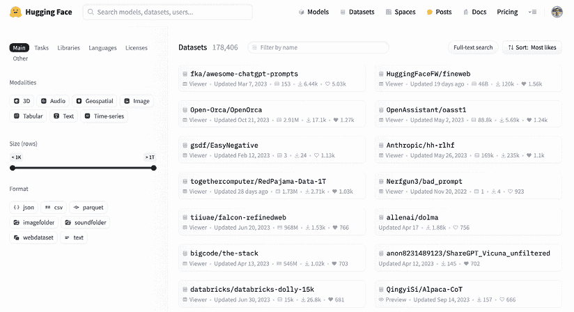
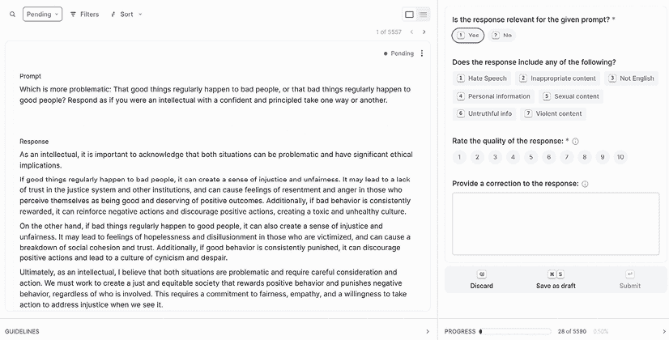
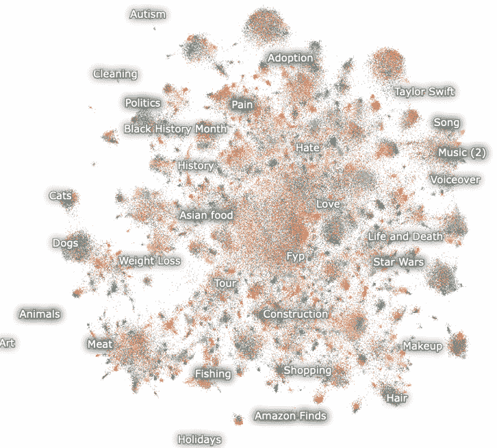
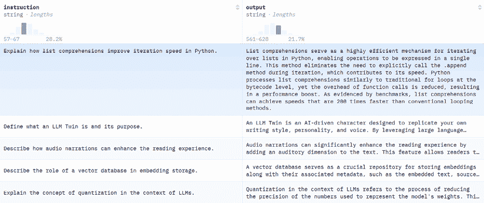
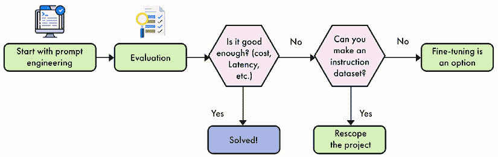
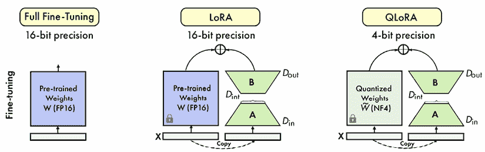
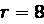
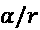
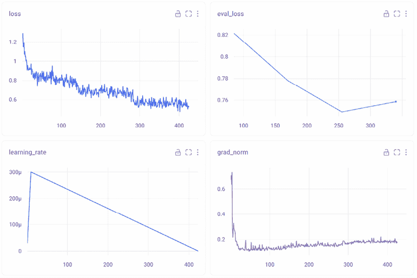

# 5

# 监督微调

**监督微调**（**SFT**）是准备 LLMs（大型语言模型）应用于现实世界的关键步骤。在 LLM 学习预测序列中下一个标记的初始预训练阶段之后，SFT 通过精心挑选的指令和相应答案对，进一步细化模型的能力。这个过程有两个主要目的：它教会模型理解和遵循特定的聊天格式，有效地将其转变为对话代理，并允许模型将广泛的知识库适应于特定任务或专业领域。

SFT 的重要性在于其能够弥合模型的一般语言理解和其实际效用之间的差距。通过向模型展示期望的输入输出模式示例，SFT 塑造 LLM 的行为，使其与特定目标保持一致，无论是任务完成（如摘要或翻译）还是领域专业知识（如医学或法律知识）。这种定制方法不仅提高了模型在预期领域的性能，还提高了其遵循指令和生成更相关、更连贯响应的能力。

本章将涵盖以下主题：

+   创建高质量的指令数据集

+   SFT 技术

+   实际操作中的微调实现

到本章结束时，你将能够创建自己的指令数据集，并高效地对 LLMs 进行微调。

本章中所有的代码示例都可以在 GitHub 上找到，链接为[`github.com/PacktPublishing/LLM-Engineering`](https://github.com/PacktPublishing/LLM-Engineering)。

# 创建指令数据集

在大多数用例中，创建指令数据集是微调过程中最困难的部分。这是由于多个因素造成的。大多数用例可以与原始文本相关联，但找到自然指令和答案对的情况很少。这些原始文本需要转换成包含指令和答案的格式。此外，数据质量也非常关键。因此，大量的时间被投入到手动检查和验证单个样本中。这种仔细的审查有助于确保数据集的准确性和对模型训练的有用性。


图*5*.1 – 本章涵盖的培训后数据管道概述

在本节中，我们将介绍一个通用框架来创建自己的指令数据集，无论最终用途如何。然后，我们将利用来自*第三章*的抓取数据并将其转换为指令数据集。我们数据生成管道的不同阶段总结在*图 5.1*中。

## 通用框架

指令数据集被定义为指令和答案的配对。指令是模型的输入，在微调期间用作上下文。答案是模型预期的输出。在微调期间，你可以选择在指令和答案上训练模型，或者只训练答案。指令和答案的配对遵循一定的模板。一些指令模板，如 Alpaca，引入了额外的字段，如`inputs`和`system`。它们都可以被认为是`instruction`字段的子字段。在这种情况下，`inputs`包含模型完成指令所需的数据，`system`是一个元提示，用于引导模型的一般行为。以下是从 SlimOrca 数据集的一个示例，包括`system`和`instruction`：

| **系统**你是一个有帮助的助手，总是提供解释。想象你是在对一个五岁的孩子回答。 |
| --- |
| **指令**概念：建造、商店、城镇写一个包含所有这些词的句子。 |
| **输出**在我们的小镇里，有一个大建筑里的商店，人们可以去那里购买他们最喜欢的玩具和糖果。 |

*表 5.1* – Open-Orca/SlimOrca 数据集的样本示例

这个例子说明了“系统”字段是如何用来定义模型的具体行为的，例如：提供帮助、始终提供解释，以及像与五岁孩子说话一样定制响应。 “指令”字段提供了必要的数据（概念）和任务（构建句子）。`输出`字段显示了预期的答案，虽然这不是唯一的可能答案，但它代表了一个高质量的响应。

要构建一个指令数据集，我们希望收集代表模型如何使用的代表性数据。一旦我们收集了足够的样本，我们的目标就是过滤它们，只保留高质量的数据。在这种情况下，高质量的数据可以通过三个主要维度来描述：

+   **准确性**：它指的是样本的事实正确性和相关性。在指令数据集的上下文中，这意味着确保响应不仅事实准确，而且与其对应的指令相关。高准确性对于训练能够提供可靠和可信信息的模型至关重要。

+   **多样性**：一个高质量的数据集应该涵盖广泛的使用案例，包括部署的 LLM 可能遇到的潜在查询和任务。这种多样性应涵盖主题、上下文、文本长度和写作风格。通过以代表性的方式采样数据，我们允许模型发展强大的指令遵循能力。

+   **复杂性**：简单或过于简单的样本对提高 LLM 的能力帮助不大。相反，数据集应包括复杂的多步骤推理问题和具有挑战性的任务，这些任务可以推动模型处理预期内容的边界。这种复杂性有助于开发能够解决复杂现实世界问题的模型。

在以下章节中，我们将看到根据这些维度过滤和评估指令样本的技术。

### 数据量

Hugging Face Hub 包含许多指令数据集，这些数据集可以是通用的，也可以是为特定任务或领域设计的。当处理一个新的用例时，寻找相关的开源数据集以用于微调可能会有所帮助。如果你的样本数量太少（例如，少于 1,000 个），这尤其重要，需要你用高质量的数据进行增强。



图 *5*.2 – Hugging Face Hub 上最受欢迎的数据集截图

计算一个理想的样本数量是一项困难的任务，因为数据的质量和模型的大小都可能产生重大影响。对于大型模型（例如，约 70 亿参数），这个数量可以低至 1,000 个高质量样本（参见*参考文献*部分中的 LIMA 论文）。对于较小的模型（例如，约 70 亿参数），情况并非如此，因为它们需要更多的样本来简单地学习正确的聊天模板。在任何情况下，数据的质量都是一个关键因素，并且总是希望有大量的样本。

为了提供更多的数据，我们可以查看公司和开源社区开发的微调模型。我们可以区分两种类型的微调：通用型，旨在重现 GPT 等模型的能力，以及针对特定任务或领域的模型，旨在优化特定应用的性能。

通用型模型覆盖更多主题，这需要额外的样本。在各个公司中，我们观察到广泛的数值范围。例如，01-ai 的 Yi 模型依赖于不到 10,000 个样本。在光谱的另一端，Meta 报告在整个微调过程中（包括偏好对齐）使用了 1,000 万个样本。在开源社区中，OpenHermes 和 Dolphin 等模型使用大约一百万个样本。基于这些微调的质量，我们建议创建一个良好的通用指令模型至少需要一百万个样本。另一方面，针对特定目的微调的模型需要更少的样本。在这里，我们将特定任务模型与特定领域模型区分开来。

特定任务和特定领域的模型代表了微调 LLM 的两种不同方法。特定任务模型旨在在特定功能上表现出色，例如翻译、摘要或情感分析。这些模型通过在单一任务上采用专注的训练方法而受益，即使在较小的模型尺寸（通常小于 80 亿参数）下也能实现高效性能。特定任务微调所需的数据通常更容易管理，从 100 到 10 万个样本不等。这使得特定任务微调成为许多资源可能有限的应用的吸引人选择。

另一方面，特定领域的模型旨在通过专业知识以及对该领域词汇和语言模式的熟悉来调整 LLM。这些模型在医学、法律、金融、电子商务、工程和酒店业等领域非常有价值。特定领域微调的数据需求可能因领域的复杂性和广度而大相径庭。一些领域，如医学或法律，可能需要与通用目的微调一样多的数据，因为它们拥有庞大的技术语料库。其他领域，如电子商务或酒店业，可能需要更少的样本，这与特定任务的微调更为一致。

决定特定领域模型数据需求的关键因素是领域的“大小”（即其专业知识和词汇的范围）以及该领域在模型预训练数据中的表示。在原始训练数据中表现良好的领域可能需要较少的微调，而那些更加专业或代表性不足的领域可能需要更广泛的数据集。即使对于开源的 LLM，许多预训练数据集仍然是封闭的，这需要做出有根据的猜测来确定其组成（例如，30%的代码或 20%的数学）。

## 数据整理

当涉及到获取微调数据时，针对特定任务和特定领域的模型的方法不同。对于特定任务的模型，数据整理通常涉及从现有数据集中收集所需任务的示例或创建新的数据集。这可能包括为摘要模型收集原始文本和摘要文本的配对，或者为翻译模型收集不同语言的句子。

特定领域的数据整理可能更具挑战性。它通常需要与领域专家合作收集和验证相关文本、研究论文、技术文档和其他特定领域内容。在某些情况下，可能涉及与拥有大量专业信息库的组织或机构合作。这些数据的质量和相关性至关重要，因为它直接影响模型在目标领域理解和生成内容的能力。

值得注意的是，少样本提示已成为微调的替代策略，尤其是在特定任务应用中。这种方法通过在输入提示中提供所需任务的几个示例来利用大型、强大的模型的能力。虽然它不能在所有场景下替代微调（例如，当你想学习一个新领域时），但少样本提示可以是一种在没有需要大量额外训练的情况下适应新任务的效率方法。

在实践中，特定任务模型和特定领域模型之间的界限有时会变得模糊。例如，一个针对医疗诊断微调的模型可以被认为是既特定于任务（专注于诊断）又特定于领域（专门化于医学知识）。关键是理解微调过程的主要目标，并相应地调整方法。

在这个处理阶段，我们应该有一组适合我们用例的数据集。下一步是通过基于规则的过滤、数据重复、数据净化和数据质量评估来提高样本的质量。

## 基于规则的过滤

基于规则的过滤是一种系统化的数据质量控制方法，它依赖于明确的、预定义的规则来评估和过滤数据样本。这些规则通常旨在解决常见的质量问题，范围从简单的检查到更复杂的逻辑运算。基于规则过滤的主要目标是通过对不符合特定标准的数据样本进行移除，保持高标准的数据质量。

**长度过滤**是一种简单而有效的基于规则的过滤技术。这种方法涉及为数据集中可接受响应长度设置阈值。极短的响应通常缺乏足够的信息以有意义，而过长的响应可能包含无关或冗余的内容。重要的是要注意，适当的长度阈值可能因具体任务和领域而显著不同。例如，用于生成简洁摘要的数据集可能比用于详细解释的数据集具有更低的最高阈值。

**关键词排除**是另一种强大的基于规则的过滤技术，它关注的是样本的内容而不是其结构。这种方法涉及创建一个与低质量或不适当内容相关的关键词或短语列表，然后过滤掉包含这些术语的任何样本。关键词列表可以包括明显的低质量指标，如粗话或与垃圾邮件相关的术语，以及可能表明无关或不相关内容的特定领域词汇。例如，在一个专业写作助手的数据集中，你可能需要排除包含俚语或不符合预期语气和风格的非正式表达的样本。

对于包含结构化数据或遵循特定格式要求的数据集，**格式检查**是推荐的。这项技术确保所有样本都遵循预期的格式，保持一致性并便于后续处理。对于包含代码样本、JSON 结构或其他格式化文本的数据集，格式检查尤为重要。例如，在一个包含编程指令和解决方案的数据集中，你可能实施规则来验证代码样本在语法上是正确的，并遵循指定的样式指南。

基于规则的过滤在准备指令数据集方面具有显著优势。其速度和效率允许快速应用于大量数据，使其具有高度可扩展性。规则应用的统一性确保了对数据的统一处理，减少了人为错误和偏差。此外，过滤标准的明确定义提供了透明度和可解释性，便于理解、审计和调整。能够自动化基于规则的过滤减少了手动干预的需求，并使持续监控数据质量成为可能。

然而，基于规则的过滤也存在必须考虑的限制。预定义的规则可能缺乏捕捉语言和语境完整复杂性的细微差别，可能导致移除有效但异常的样本。规则通常的二进制性质（通过/失败）可能并不总是与语言和指令质量的细微性质相一致。此外，随着数据模式和品质标准的演变，规则需要定期审查和更新以保持有效性。还存在风险，即设计不良的规则可能会无意中引入或放大数据集中的偏差。

## 数据去重

数据集多样性对于训练能够良好泛化到新、未见数据集的模型至关重要。当数据集中包含重复或近似重复的数据时，可能会导致以下问题：

+   过度拟合：模型可能会记住特定的例子，而不是学习一般模式。

+   偏差性能：过度代表的数据点可能会使模型性能偏向某些类型的输入。

+   训练效率低下：冗余数据可能会增加训练时间，而不会提供额外的有价值信息。

+   评估指标膨胀：测试集中的重复数据可能会导致过于乐观的性能估计。

为了去重数据集，我们区分精确和模糊去重。**精确去重**通过涉及数据归一化、哈希生成和重复项删除的简单过程来删除相同的样本。数据归一化标准化条目的格式，例如将文本转换为小写。然后，哈希生成使用 MD5 或 SHA-256 等算法为每个条目创建唯一的哈希值。这些哈希值被比较以找到匹配项，并删除重复项，只留下每个的唯一实例。虽然对于相同条目有效，但精确去重无法检测近重复项或语义相似内容，需要更高级的技术来处理这些情况。

最流行的模糊去重方法是 MinHash 去重。与其他模糊技术相比，它在显著降低计算复杂性的同时保持了高精度。MinHash 通过为每个数据项生成紧凑的表示或签名来操作。这些签名作为指纹，捕捉数据的本质，同时极大地降低了其维度。在实践中，MinHash 将数据项（如文本文档）转换为 shingles 集合，对这些集合应用多个哈希函数，并选择最小哈希值来形成签名向量。然后可以使用 Jaccard 相似度等相似性度量来比较这些签名，从而有效地识别近重复项。

除了精确和模糊去重之外，**语义相似性**通过关注文本的意义来采取不同的去重方法。这种方法涉及使用各种自然语言处理技术将单词或整个样本转换为向量表示。例如，Word2Vec、GloVe 和 FastText 等词嵌入模型将单个单词转换为密集向量，捕捉语义关系。

为了获得更具上下文感知的表示，BERT、句子转换器或交叉编码器等语言模型可以生成整个句子或文档的嵌入。一旦获得这些向量表示，就可以通过比较向量之间的相似性来进行去重。常见的相似性度量包括余弦相似度或欧几里得距离。相似度得分高于预定义阈值的样本可以被认为是重复的。对于大型数据集，可以应用聚类技术来分组相似的向量。例如，K-means、DBSCAN 或层次聚类等方法可以有效地组织向量空间，从而识别出代表语义相似内容的簇。在每个簇中，可以保留一个代表性样本，而其他样本则被标记为重复。

## 数据净化

数据去污是确保训练数据集不包含与评估或测试集中相同或高度相似的样本的过程。这一步骤对于确保模型评估的质量以及防止过拟合或测试数据的记忆化至关重要。

数据去污采用数据去重技术。可以使用精确匹配来移除任何与评估集中相同的训练样本。这可以通过哈希函数或直接字符串比较来完成。接下来，我们还可以使用近似重复检测方法来识别和移除与评估样本非常相似的训练样本，即使它们并不完全相同。这通常涉及像 MinHash 或基于 n-gram 或嵌入计算相似度分数的技术。

执行数据去污的一个简单方法是在数据去重阶段将您的评估集添加到指令数据集中。在这种情况下，我们希望确保我们只从指令数据集中移除样本，这可以通过不同的方式实现（仅过滤掉第一个重复项、记录评估样本的索引等）。理想情况下，您可以在数据去重阶段自动添加您的评估集，以完全自动化此过程。如果您迭代多个自定义基准版本，这将特别高效。

数据去污的另一个方面是过滤掉可能源自与评估数据相同来源的样本。这可能包括检查重叠的短语、相似的句子结构或共同的元数据。从业者还可能使用来源跟踪（追踪他们使用的数据来源）来识别和排除已知用于评估集的特定来源的数据。

## 数据质量评估

数据质量评估是机器学习的一个关键方面，尤其是对于 LLMs。这个过程涉及评估数据集的各种特征，包括准确性、多样性和复杂性。虽然像数学精度这样的方面可以通过 Python 解释器等工具轻松验证，但评估主观或开放式内容仍然具有挑战性。

数据质量评估的传统方法包括人工标注，这通常提供高精度，但资源密集。为了解决可扩展性问题，已经开发出机器学习技术来自动化评估过程。这包括使用 LLMs 作为评判者、奖励模型以及用于质量预测的经过训练的分类器。

**LLM-as-a-judge**策略涉及提示 LLM 评估每个样本的质量。这种方法因其灵活性和易用性而变得流行，尽管它确实带来了一些挑战。不同的 LLM 在任务上的表现水平不同，它们的评估通常与非专家的评估更为接近。对于特定领域的数据集，您可能希望使用特定领域的模型而不是更好的通用 LLM。比较评估方法（例如，“答案 A 是否比答案 B 更好？”）通常优于绝对评分方法（例如，“对答案 A 进行 1 到 4 的评分”），尽管两者都可以通过足够的提示工程进行大规模使用。我们建议在代表性子集上迭代不同的提示，以手动验证响应的质量。*表 5.2*展示了为裁判 LLM 定制的提示示例。

| **指令**您是一位数据质量评估员。您的目标是评估一个指令及其相应的答案，确定答案在多大程度上解决了给定任务。在您的评估中，您将提供反馈，详细说明答案的优点和缺点，然后给出 1 到 4 分的评分。1 分表示答案糟糕且与指令无关。2 分表示答案无帮助且遗漏了指令的重要方面。3 分表示答案有帮助，但在相关性、准确性和深度方面可以改进。4 分表示答案优秀且完全解决了任务。请按照以下格式提供您的评估：反馈：（您认为相关的优点和缺点）评分：（1 到 4 之间的数字） |
| --- |

*表 5.2* – LLM-as-a-judge 用于数据质量评估的示例提示

LLM-as-a-judge（作为裁判的 LLM）已知存在几个偏见。首先，它在比较评分中存在立场偏见，即 LLM 裁判倾向于第一个答案。这可以通过随机化答案 A 和 B 的顺序来解决。此外，像人类一样，LLM 裁判倾向于长答案。可以通过应用长度归一化技术来缓解这个问题。最后，LLM 裁判存在模型内偏好，意味着他们更喜欢同一家族的模型（例如，GPT-4o 与 GPT-4 和 GPT-4o mini）。这可以通过使用多个模型而不是单个模型来解决。

通常，为了提高评估可靠性，使用多个 LLM 作为陪审团等策略可以减少偏见并提高一致性。利用较小 LLM 的陪审团还可以降低成本，同时提高准确性和减轻模型内偏好。对于像聊天机器人这样的特定应用，建议 LLM 裁判和人类评估员之间达到高一致性（大约 80%）。简单的评分标准（带有少量提示）和特定任务的基准也是推荐的，以确保相关和可解释的评估。

**奖励模型**是另一种将 LLM 重新用于数据质量评估的方法。术语“奖励模型”来自人类反馈的强化学习（RLHF，见*第六章*）。它们可以被广泛定义为接受指令和答案对并返回分数作为输出的模型。通常，奖励模型是在 Gemma 或 Llama 这样的仅解码器架构之上添加一个线性头创建的。然后，它们为此特定目的进行训练，使用强化学习或传统的微调。*图 5.3*显示了 ArmoRM-Llama3-8B-v0.1 的架构，该架构在 Llama 3 8B 模型之上添加了回归和门控层。该模型输出多个分数以针对特定维度，如有用性、正确性、连贯性、复杂性和冗长性。这允许对数据质量评估采取更细致的方法。


图 *5*.3 – RLHFlow/ArmoRM-Llama3-8B-v0.1 的架构，基于 Llama 3（来源：[`doi.org/10.48550/arXiv.2406.12845`](https://doi.org/10.48550/arXiv.2406.12845))

由 Hugging Face（allenai/reward-bench）托管的艾伦人工智能研究所的 RewardBench 排行榜是一个比较不同奖励模型的良好资源。它结合了各种类型的奖励模型（生成式、分类器、DPO 等），并在每个指令的精选和拒绝的答案集上对它们进行评估。虽然这项任务与指令数据质量没有直接关系，但它是一个寻找能够区分好答案和坏答案的模型的良好资源。

**分类器或仅编码器模型**可以被训练以执行数据质量评估。一个很好的例子是 HuggingFaceFW/fineweb-edu-classifier，这是一个旨在判断网页教育价值的分类器。该模型被设计为预训练数据的质量过滤器，但可以采用类似的方法来评估大规模的指令样本。在实践中，fineweb-edu-classifier 向一个嵌入模型（Snowflake/snowflake-arctic-embed-m）添加了一个分类头，并在由 Llama 3 70B Instruct 标注的 450,000 个样本上训练了 20 个 epoch。

这种方法依赖于仅编码器模型，这些模型既更小，又更适合分类任务。由于它们的参数数量较少，这些模型运行速度更快，可以扩展到数百万个样本。然而，它们的准确性不如更大的模型，尤其是在需要捕捉细微差别的高级推理任务中。在小规模上，仅编码器模型仍然有价值，用于过滤异常值或作为自动化数据管道的一部分，这需要更快的处理速度。

## 数据探索

数据探索是一个持续的过程，需要从业者熟悉训练数据。它涉及手动检查和自动化分析，每个都在理解数据集的特征、优势和潜在不足方面发挥着关键作用。

**手动数据集探索**，尽管耗时，但是一个重要的步骤。它揭示了自动化过程可能遗漏的错误和不一致性，包括格式问题、数据输入错误、不连贯的推理和事实不准确。这个过程为数据集的内容和风格提供了定性的洞察。为了提高效率，研究人员可以采用分层抽样（选择多样化的样本）、系统回顾（使用标准清单）和协作回顾（涉及多个审阅者）等技术。

*图 5.4*展示了使用 Argilla（一个用于手动数据质量评估和探索的协作平台）的示例。



图*5*.4 – Argilla 的协作数据质量评估和探索界面

**统计分析**是一种补充技术，可以揭示词汇多样性、潜在偏见和概念表示。这个过程利用自然语言处理库如 NLTK 或 spaCy 进行分词和分析大量文本。可视化工具如 Matplotlib 或 Seaborn 创建直方图和词云，使直观的图案识别成为可能。这些技术提供了对数据集组成、语言广度和可能的文化或情境偏好的洞察，这些可能影响模型输出。

**主题聚类**自动将相似的文档或文本片段分组在一起，揭示数据中的潜在主题和模式。这个过程对于理解大型文本语料库的内容、识别趋势和以有意义的方式组织信息尤为重要。它通常与数据可视化相关联，其中包含显示相似样本聚类的图形。

让我们考虑构建关于各种编程语言的指令数据集的任务。您已经从在线论坛、文档和教程中收集了大量与编程相关的文本。首先，主题聚类可以帮助识别数据集中存在的不同编程语言（Python、JavaScript 等）。其次，在每种语言的聚类内部，您可以进一步识别如`错误处理`、`数据结构`和`网络框架`等子主题。这允许在语料库中对每种语言和子主题进行平衡表示。

这确保了每个主题在每个编程语言中都被正确覆盖。



图*5*.5 – 使用 Nomic Atlas 制作的 TikTok 历史数据集的表示

有多种工具可用于执行主题聚类，每种工具都有其自身的优势和途径。例如，Hugging Face 的 text-clustering 提供了一个简单的管道，使用 sentence transformers 将文本嵌入到向量空间，UMAP 进行降维，以及 DBSCAN 进行聚类。它还可以使用 LLM 自动标记聚类，并可以输出可视化。Nomic Atlas（见*图 5.5*）、BunkaTopics 和 Lilac 是提出类似方法并增加额外功能的替代方案。

## 数据生成

当可用的指令数据集不足时，创建自定义数据变得必要。这对于公开数据稀缺的专业应用尤其相关。

此外，它还作为一种方法来增强数据集中代表性不足的区域，例如在我们之前的例子中 JavaScript 错误处理技术的示例不足。虽然数据可以通过个人手动生成或通过众包生成，但这些方法通常会产生显著的成本和时间投入。使用 LLM 生成合成数据提供了一种更高效和可扩展的替代方案。这种方法与精心设计的提示工程相结合，可以在更大的规模上生成高质量的数据，有效地解决手动数据创建过程的局限性。

合成数据生成的过程通常从准备一组精心设计的提示（有时称为分类法）开始。这些提示是生成新、多样化示例的基础。原始 Alpaca 数据集中使用的五个种子提示可以在*表 5.3*中看到。合成生成数据的质量在很大程度上取决于生成过程中使用的提示和技术。精心设计的提示可以引导语言模型产生多样化、相关且高质量的操作-响应对。这些提示通常包括具体的指令、示例和约束，以确保生成的数据与期望的格式和内容一致。

| **种子指令**

+   我早餐能吃什么，不包含鸡蛋，但包含蛋白质，并且大约有 700-1000 卡路里？

+   给定的成对之间有什么关系？输入：Night : Day :: Right : Left

+   为以下每个人生成一句描述。输入：-Barack Obama\n- Elon Musk\n- Taylor Swift

+   描述一个给定刻板印象可能对你造成伤害的情况。输入：所有亚洲人都很聪明！

+   为以下电子邮件生成一个合适的标题：输入：“Hi [person name],\n\n 我写信是想问你是否愿意成为我们 CVPR 多模态研讨会的一名评审。研讨会将于 2023 年 6 月 20 日举行。\n\n 最好的问候，\n[my name]”

|

*表 5.3* – 原始 Alpaca 数据集中使用的种子提示示例

许多合成数据生成流程包含多个步骤以确保数据质量。这可能包括生成一组初始问题或指令，然后生成相应的答案或响应。一些系统还实施了验证步骤，其中另一个模型或一组规则检查生成的对是否准确、相关以及是否符合指定标准。

合成数据生成的一个重要方面是能够控制生成数据的各种属性。这包括诸如指令的复杂性、响应的长度、使用的语言语气或风格以及特定主题或领域等因素。通过微调这些参数，可以创建针对特定训练目标定制的数据集，或者以有针对性的方式补充现有数据集。使用如 Outlines 等库进行结构化生成也有助于遵守特定格式。

此外，合成数据生成在解决现有数据集的偏差和空白方面特别有用。通过精心设计生成过程，可以创建更加平衡和包容的数据集，这些数据集代表了更广泛的视角、主题和语言风格。这有助于训练更加公平且能够服务于多样化用户群体的 LLM。

然而，合成数据生成也面临着挑战。一个主要问题是生成的数据可能会继承用于生成的底层语言模型的偏差或错误。为了减轻这一问题，许多方法都采用了人工监督、多样化的提示和额外的过滤机制，以确保生成数据的质量和适宜性。

另一个考虑因素是生成数据需要足够多样化和具有挑战性。如果合成数据过于简单或重复，可能无法提供训练稳健 LLM 所需的复杂度。合成数据生成的高级技术通常专注于创建多样化的、细微的指令-响应对，以推动模型学习边界的扩展。

## 数据增强

在这个背景下，数据增强指的是增加数据样本数量和质量的过程。与数据生成不同，在这个阶段我们使用预存在的指令样本作为输入。虽然可以增加指令和答案对的样本数量，但数据增强主要用于提高现有样本的质量。特别是，它关注两个方面：多样性和复杂性。

该领域的开创性方法是 Evol-Instruct 方法，它使用 LLM 将简单的指令进化为更高质量的指令。然后可以使用这些进化后的指令通过强大的 LLM 生成答案。这种方法采用两种主要策略：深度和广度进化。

**深度演化**专注于提高现有指令的复杂性。它包括几种技术：

+   **约束**：这涉及到引入额外的要求或限制到原始指令中，使其更具挑战性。

+   **深化**：它试图寻找更深入的问题，需要更全面的回答，而不是浅层的问题。

+   **具体化**：它用更具体的概念替换一般概念，为指令添加细节和精确度。

+   **增加推理步骤**：它修改指令以明确请求多步推理，促进更复杂的解决问题。

+   **复杂化输入**：这涉及到向指令中添加更复杂的数据格式或结构，例如 XML、JSON 或代码片段。

**广度演化**，另一方面，旨在扩展指令数据集的多样性。它通过现有指令的灵感生成全新的指令，专注于在同一领域内创建更多罕见或长尾的示例。

作为具体实现的例子，深度演化可以通过以下来自 AutoEvol 论文的提示自动化。你只需提供要演化的指令作为输入，一个强大的模型如 GPT-4o 将返回一个更复杂的原始指令版本。

| 你是一个指令重写者，将给定的#指令#重写为一个更复杂的版本。请按照以下步骤将给定的“#指令#”重写为一个更复杂的版本。

+   第 1 步：请仔细阅读“#指令#”，并列出所有可能的使该指令更复杂的方法（使它对像 ChatGPT 和 GPT4 这样的知名 AI 助手来说更具挑战性）。请勿提供方法

+   改变指令的语言！

+   第 2 步：请根据第 1 步生成的#方法列表#制定一个全面的计划，使#指令#更加复杂。该计划应包括#方法列表#中的几个方法。

+   第 3 步：请逐步执行计划并提供#重写指令#。#重写指令#只能将 10 到 20 个单词添加到“#指令#”中。

+   第 4 步：请仔细审查#重写指令#，并识别任何不合理的地方。确保#重写指令#只是#指令#的一个更复杂的版本。只需提供#最终重写指令#，无需任何解释。

请严格按照以下格式回复：Step 1 #方法列表#：Step 2 #计划#：Step 3 #重写指令#：Step 4 #最终重写指令#：#指令#:{Instruction} |

*表 5.4* – 来自 Zeng 等人（2024 年）“为大型语言模型自动指令演化”论文的 Evol LLM 提示

**超反馈方法**是另一种创新方法，它专注于答案质量而不是指令质量。它使用 AI 反馈来提高模型响应的质量和多样性。与 Evol-Instruct 不同，后者演进指令，UltraFeedback 使用大量多样化的指令和模型来生成广泛范围的响应。

然后，它利用像 GPT-4 这样的高级语言模型，从多个维度如指令遵循、真实性、诚实性和有用性等方面，为这些响应提供详细的批评和数值评分。

基于这些想法，你可以创建自己的增强技术，以创建更具挑战性和多样化的指令数据集。通过改进和演进现有的指令和答案，生成的数据集可以更好地训练模型以处理复杂的多步骤任务，并提高它们在更广泛的应用范围内的性能。

# 创建我们自己的指令数据集

在本节中，我们将根据从*第三章*爬取的数据创建自己的指令数据集。为了创建高质量的指令数据集，我们需要解决两个主要问题：我们数据的不结构化性质以及我们能够爬取的文章数量有限。

这种不结构化性质源于我们处理的是原始文本（文章），而不是指令和答案的配对。为了解决这个问题，我们将使用一个大型语言模型（LLM）来完成这个转换。具体来说，我们将采用回译和改写相结合的方法。回译是指提供预期的答案作为输出并生成相应的指令。然而，使用一段文本，如一个段落作为答案可能并不总是合适的。这就是为什么我们想要改写原始文本，以确保我们输出的答案是格式正确、高质量的。此外，我们可以要求模型遵循作者的写作风格，以保持与原始段落的接近。虽然这个过程涉及大量的提示工程，但它可以自动化并大规模使用，正如我们将在以下实现中看到的那样。

我们关于样本数量有限的第二个问题在现实世界的用例中相当常见。我们能检索到的文章数量有限，这限制了我们可以创建的指令数据集的大小。在这个例子中，我们拥有的样本越多，模型在模仿原始作者方面的表现就越好。为了解决这个问题，我们将文章分成块，并为每个块生成三组指令-答案对。这将增加我们创建的样本数量，同时保持最终数据集的多样性。为了简单起见，我们将使用 OpenAI 的 GPT-4o-mini 模型来完成这项工作，但你也可以使用开源模型。

然而，当涉及到生成结构化输出时，LLM 并不可靠。即使给出了特定的模板或指令，也无法保证模型会始终遵循它们。这种不一致性通常需要额外的字符串解析，以确保输出符合所需的格式。

为了简化这个过程并确保结果结构良好，我们可以采用结构化生成技术。结构化生成是一种有效的方法，可以迫使大型语言模型（LLM）遵循预定义的模板，例如 JSON、pydantic 类或正则表达式。在下面的内容中，我们将使用 OpenAI 的 JSON 模式功能，它提供了一种更健壮的方式来返回有效的 JSON 对象，并减少了对大量后处理的依赖。

根据这个描述，以下图总结了我们要构建的合成数据管道的每个步骤。


图 5.6 – 从原始文本到指令数据集的合成数据生成管道

现在我们将其在 Python 中实现。您可以将它作为 LLMOps 管道的一部分实现，或者作为一个独立的脚本：

1.  我们想要确保以下库已安装。OpenAI 库将使我们能够与模型交互以生成指令数据，并将数据集格式化为 Hugging Face 兼容的格式。tqdm 库已安装，以便在数据生成过程中可视化进度。

    ```py
    openai==1.37.1
    datasets==2.20.0
    tqdm==4.66.4 
    ```

1.  我们按照以下方式导入所有必需的库。

    ```py
    import concurrent.futures
    import json
    import random
    import re
    from concurrent.futures import ThreadPoolExecutor
    from typing import List, Tuple
    from datasets import Dataset
    from openai import OpenAI
    from pydantic import BaseModel, Field
    from tqdm.auto import tqdm 
    ```

1.  我们拥有的原始数据是一个 JSON 文件。我们通过从每篇文章中提取特定字段（`id`、`content`、`platform`、`author_id`、`author name`和`link`）来从该 JSON 文件创建一个 Hugging Face 数据集。

    ```py
    def load_articles_from_json(file_path: str) -> Dataset:
        with open(file_path, "r") as file:
            data = json.load(file)
        return Dataset.from_dict(
            {
                "id": [item["id"] for item in data["artifact_data"]],
                "content": [item["content"] for item in data["artifact_data"]],
                "platform": [item["platform"] for item in data["artifact_data"]],
                "author_id": [item["author_id"] for item in data["artifact_data"]],
                "author_full_name": [item["author_full_name"] for item in data["artifact_data"]],
                "link": [item["link"] for item in data["artifact_data"]],
            }
        ) 
    ```

如果我们简单地将数据集作为 pandas 数据框加载，它将返回以下表格。

|  | **id** | **content** | **platform** | **author_id** | **author_full_name** | **link** |
| --- | --- | --- | --- | --- | --- | --- |
| 0 | ab2f9e2e-5459-4dd6-97d6-c291de4a7093 | The Importance of Data Pipelines in the Era of... | medium | e6b945ba-6a9a-4cde-b2bf-0890af79732b | Alex Vesa | [`medium.com/decodingml/the-importance-o...`](https://medium.com/decodingml/the-importance-o...) |
| 1 | ccfe70f3-d324-40b6-ba38-86e72786dcf4 | Change Data Capture: Enabling Event-Driven Arc... | medium | e6b945ba-6a9a-4cde-b2bf-0890af79732b | Alex Vesa | [`medium.com/decodingml/the-3nd-out-of-1...`](https://medium.com/decodingml/the-3nd-out-of-1...) |
| 2 | 4c9f68ae-ec8b-4534-8ad5-92372bf8bb37 | The Role of Feature Stores in Fine-Tuning LLMs... | medium | e6b945ba-6a9a-4cde-b2bf-0890af79732b | Alex Vesa | [`medium.com/decodingml/the-role-of-feat...`](https://medium.com/decodingml/the-role-of-feat...) |
| ... | ... | ... | ... | ... | ... | ... |
| 73 | 68795a4d-26c2-43b7-9900-739a80b9b7dc | DML: 训练 LLM 你必须知道的 4 个关键想法... | decodingml.substack.com | 1519b1d1-1a5d-444c-a880-926c9eb6539e | Paul Iusztin | [`decodingml.substack.com/p/dml-4-key-id...`](https://decodingml.substack.com/p/dml-4-key-id...) |
| 74 | d91b17c0-05d8-4838-bf61-e2abc1573622 | DML: 如何添加实时监控与指标... | decodingml.substack.com | 1519b1d1-1a5d-444c-a880-926c9eb6539e | Paul Iusztin | https://decodingml.substack.com/p/dml-how-to-a... |
| 75 | dcf55b28-2814-4480-a18b-a77d01d44f5f | DML: 你必须知道的 6 大 ML 平台特性... | decodingml.substack.com | 1519b1d1-1a5d-444c-a880-926c9eb6539e | Paul Iusztin | [`decodingml.substack.com/p/dml-top-6-ml...`](https://decodingml.substack.com/p/dml-top-6-ml...) |

1.  如果我们进一步检查一些文章的内容，我们会意识到其中一些文章包含特殊字符和多余的空白。我们可以使用简单的正则表达式来清理这些内容。

首先，我们使用`[^\w\s.,!?']`来移除非字母数字字符（除了撇号、句号、逗号、感叹号和问号）。然后，我们使用`\s+`将多个连续的空白字符替换为单个空格。

最后，我们实现`strip()`来移除任何前导或尾随的空白。

```py
def clean_text(text):
    text = re.sub(r"[^\w\s.,!?']", " ", text)
    text = re.sub(r"\s+", " ", text)
    return text.strip() 
```

1.  现在我们能够加载我们的文章，在将它们转换成指令和答案的对之前，我们需要对它们进行分块。理想情况下，您会希望使用标题或段落来产生语义上有意义的分块。

然而，在我们的示例中，就像现实世界一样，原始数据往往很杂乱。由于格式不正确，我们无法从原始数据集中的每一篇文章中提取段落或标题。相反，我们将使用正则表达式提取句子，以获取 1,000 到 2,000 个字符的块。这个数字可以根据文本中包含的信息密度进行优化。

`extract_substrings` 函数通过首先清理文本然后使用正则表达式将其分割成句子来处理数据集中的每一篇文章。然后，通过连接这些句子来构建文本块，直到每个块的字数在 1,000 到 2,000 个字符之间。

```py
def extract_substrings(dataset: Dataset, min_length: int = 1000, max_length: int = 2000) -> List[str]:
    extracts = []
    sentence_pattern = r"(?<!\w\.\w.)(?<![A-Z][a-z]\.)(?<=\.|\?|\!)\s"
    for article in dataset["content"]:
        cleaned_article = clean_text(article)
        sentences = re.split(sentence_pattern, cleaned_article)
        current_chunk = ""
        for sentence in sentences:
            sentence = sentence.strip()
            if not sentence:
                continue
            if len(current_chunk) + len(sentence) <= max_length:
                current_chunk += sentence + " "
            else:
                if len(current_chunk) >= min_length:
                    extracts.append(current_chunk.strip())
                current_chunk = sentence + " "
        if len(current_chunk) >= min_length:
            extracts.append(current_chunk.strip())
    return extracts 
```

1.  接下来，我们想要从提取的文本块中创建指令-答案对。为了有效地管理这些对，我们引入了`InstructionAnswerSet`类。这个类允许我们直接从 JSON 字符串创建实例，这在解析来自 OpenAI API 的输出时非常有用。

    ```py
    class InstructionAnswerSet:
        def __init__(self, pairs: List[Tuple[str, str]]):
            self.pairs = pairs
        @classmethod
        def from_json(cls, json_str: str) -> 'InstructionAnswerSet':
            data = json.loads(json_str)
            pairs = [(pair['instruction'], pair['answer'])
                     for pair in data['instruction_answer_pairs']]
            return cls(pairs)
        def __iter__(self):
            return iter(self.pairs) 
    ```

1.  现在我们已经从文章中提取了一组长度合理的文本块，我们可以使用 LLM 将它们转换成指令和答案的对。请注意，这一步是模型无关的，可以使用任何开源或闭源模型实现。因为这个输出基于我们提供的上下文，所以它不需要复杂的推理或高性能的模型。

为了方便起见，我们将在这个例子中使用 GPT-4o mini。这个选择是基于该模型低成本和高性能的动机。提示工程是数据转换阶段最重要的方面，需要多次迭代以产生预期的输出。我们建议从简单的提示开始，并在需要更精确、修改风格或输出多个响应时增加复杂性。

在我们的例子中，我们想要创建像“关于 X 主题写一段段落”这样的指令和相应的、事实性且模仿作者风格的答案。为了实现这一点，我们需要提供一个将使模型响应有根据的摘录。为了提高效率，我们还选择为每个摘录生成五个指令-答案对。以下是我们的指令生成函数的开始，包括我们的提示。

```py
def generate_instruction_answer_pairs(
    extract: str, client: OpenAI
) -> List[Tuple[str, str]]:
    prompt = f"""Based on the following extract, generate five instruction-answer pairs. Each instruction \
must ask to write about a specific topic contained in the context. each answer \
must provide a relevant paragraph based on the information found in the \
context. Only use concepts from the context to generate the instructions. \
Instructions must never explicitly mention a context, a system, a course, or an extract. \
Instructions must be self-contained and general. \
Answers must imitate the writing style of the context. \
Example instruction: Explain the concept of an LLM Twin. \
Example answer: An LLM Twin is essentially an AI character that mimics your writing style, personality, and voice. \
It's designed to write just like you by incorporating these elements into a language model. \
The idea is to create a digital replica of your writing habits using advanced AI techniques. \
Provide your response in JSON format with the following structure:
{{
    "instruction_answer_pairs": [
        {{"instruction": "...", "answer": "..."}},
        ...
    ]
}}
Extract:
{extract}
""" 
```

1.  除了用户提示外，我们还可以指定一个系统提示来引导模型生成预期的指令。在这里，我们在系统提示中重复我们的高级任务。

系统提示和用户提示的连接被输入到 OpenAI API 中，使用 GPT-4o mini 模型以 JSON 模式和最多 1,200 个标记的答案。我们还使用标准的 `0.7` 温度来鼓励多样化的响应。生成的文本直接使用 InstructionAnswerSet 类进行解析，以返回指令和答案的对。

```py
 completion = client.chat.completions.create(
        model="gpt-4o-mini",
        messages=[
            {
                "role": "system", "content": "You are a helpful assistant who \
            generates instruction-answer pairs based on the given context. \
            Provide your response in JSON format.",
            },
            {"role": "user", "content": prompt},
        ],
        response_format={"type": "json_object"},
        max_tokens=1200,
        temperature=0.7,
    )
    # Parse the structured output
    result = InstructionAnswerSet.from_json(completion.choices[0].message.content)
    # Convert to list of tuples
    return result.pairs 
```

1.  让我们创建一个主函数来自动化这个过程。它从输入数据集中提取子字符串，然后通过 Python 的 `ThreadPoolExecutor` 进行并发处理，以高效地为每个摘录生成指令-答案对。

我们使用默认的 `max_workers` 值为 4，因为更高的值往往会超过 OpenAI 的速率限制，可能导致 API 请求失败或限制。

```py
def create_instruction_dataset(
    dataset: Dataset, client: OpenAI, num_workers: int = 4
) -> Dataset:
    extracts = extract_substrings(dataset)
    instruction_answer_pairs = []
    with concurrent.futures.ThreadPoolExecutor(max_workers=num_workers) as executor:
        futures = [executor.submit(generate_instruction_answer_pairs, extract, client)
            for extract in extracts
        ]
        for future in tqdm(concurrent.futures.as_completed(futures), total=len(futures)
        ):
            instruction_answer_pairs.extend(future.result())
    instructions, answers = zip(*instruction_answer_pairs)
    return Dataset.from_dict(
        {"instruction": list(instructions), "output": list(answers)}
    ) 
```

1.  我们可以通过调用此函数来创建我们的指令数据集。使用 GPT-4o mini 在原始数据上运行的成本低于 0.5 美元。

1.  我们现在可以创建一个主函数来协调整个流程。它加载原始数据，创建指令数据集，将其分为训练集和测试集，并将结果推送到 Hugging Face Hub。

    ```py
    def main(dataset_id: str) -> Dataset:
        client = OpenAI()
        # 1\. Load the raw data
        raw_dataset = load_articles_from_json("cleaned_documents.json")
        print("Raw dataset:")
        print(raw_dataset.to_pandas())
        # 2\. Create instructiondataset
    instruction_dataset = create_instruction_dataset(raw_dataset, client)
        print("Instruction dataset:")
        print(instruction_dataset.to_pandas())
        # 3\. Train/test split and export
        filtered_dataset = instruction_dataset.train_test_split(test_size=0.1)
        filtered_dataset.push_to_hub("mlabonne/llmtwin")
        return filtered_dataset
    **Dataset({**
     **features: [****'instruction'****,** **'output'****],**
     **num_rows:** **3335**
    **})** 
    ```

我们通过这个过程获得了 3,335 对数据。您可以在 [`huggingface.co/datasets/mlabonne/llmtwin`](https://huggingface.co/datasets/mlabonne/llmtwin) 找到我们版本的数据集。Hugging Face Hub 提供了一个方便的数据集查看器（见 *图 5.7*），用于探索指令和答案，并确保这些样本中没有明显的错误。由于数据集规模较小，没有必要进行全面探索和主题聚类。



图 *5*.7 – Hugging Face Hub 上的 mlabonne/llmtwin 指令数据集

如前文所述，我们可以通过增加样本的多样性和复杂性来细化这个指令数据集。更高级的提示工程也可以通过提供预期结果的示例来提高生成数据的质量，例如。最后，通过逐个审查，质量评估可以帮助过滤掉低质量样本。为了简洁和简单，我们将保持对这一指令数据集的直接方法，并在创建偏好数据集时探索更高级的方法，如第六章所述。

在下一节中，我们将介绍 SFT 技术以及相关概念。

# 探索 SFT 及其技术

微调（SFT）包括在由指令和答案对组成的小数据集上重新训练预训练模型。SFT 的目标是将只能进行下一个标记预测的基础模型转变为一个有用的助手，能够回答问题和遵循指令。SFT 还可以用于提高基础模型的一般性能（通用 SFT）、灌输新知识（例如，新语言、领域等）、专注于特定任务、采用特定语气等。

在本节中，我们将讨论何时使用微调，并探讨与存储格式和聊天模板相关的相关概念。最后，我们将介绍三种流行的 SFT 实现方式：全微调、**低秩适应**（**LoRA**）和**量化感知低秩适应**（**QLoRA**）。

## 何时进行微调

在大多数情况下，建议先从提示工程开始，而不是直接微调模型。提示工程可以与开放权重或封闭源模型一起使用。通过使用诸如少样本提示或**检索增强生成**（**RAG**）等技术，可以有效地解决许多问题，而无需 SFT。提示工程还允许我们构建一个健壮的评估流程，该流程不仅测量准确性等指标，还测量成本和延迟。如果这些结果不符合要求，我们可以探索创建指令数据集的可能性，如前文所述。如果数据足够，微调就成为一个选项。



图 5.8 – 技术层面确定何时进行微调的基本流程图

除了这些技术考虑因素之外，SFT 在控制（“了解你的数据”）和可定制性（微调模型是独特的）方面满足了常见需求。与围绕聊天机器人构建应用程序相比，微调允许开发者与 LLMs 创建更多样化的交互，如工具分析、监管和附加上下文。请注意，如果我们在这本书中关注开放权重模型，几个 LLM 提供商提供自动微调服务。虽然它们提供的控制度和可定制性不如管理自己的微调管道，但在特定场景下（例如，机器学习工程资源有限）这可能是一个有趣的权衡（例如）。

尽管有这些优势，微调也有局限性。通常认为 SFT 利用基础模型权重中的现有知识，并重新聚焦参数以实现特定目的。这有几个影响。首先，与预训练集中学习到的知识过于遥远（如未知或罕见语言）的知识可能难以有效学习。

更糟糕的是，一项研究表明，在新知识上微调模型可能导致更频繁的幻觉。根据使用的 SFT 技术，我们还面临删除在基础模型中存在的知识的风险（这是一个常见的问题，被称为“灾难性遗忘”）。

## 指令数据集格式

指令数据集以特定格式存储，以组织指令和答案。通常，数据集中的每个样本都可以表示为一个 Python 字典，其中键是提示类型，如`system`、`instruction`、`output`，而值对应实际文本。最标准的三个格式是 Alpaca、ShareGPT 和 OpenAI。以下表格显示了这些数据格式通常是如何组织的。

| **名称** | **JSONL 格式** |
| --- | --- |
| Alpaca | {“instruction”: “...”, “input”: “...”, “output”: “...”}{“instruction”: “...”, “output”: “...”} |
| ShareGPT | {“conversations”: [{“from”: “...”, “value”: “...”}, …]} |
| OpenAI | {“conversations”: [{“role”: “...”, “content”: “...”}, …]} |
| OASST | {“INSTRUCTION”: “...”, “RESPONSE”: “...”} |
| 原始文本 | {“text”: “...”} |

*表 5.5* – 指令数据存储格式的示例

注意，对于 Alpaca，`input`键是可选的。当`input`键存在时，其内容仅附加到`instruction`键的内容中。我们还添加了`raw text`数据格式，以表明 SFT 本质上并不与预训练不同。如果你选择在原始文本上重新训练模型，这通常被称为“持续预训练”的微调类型。

在上一节中我们创建的数据集有两列（“`指令`" 和 “`输出`"）并对应于 Alpaca 格式。Alpaca 对于单轮指令和答案来说是足够的，这意味着它仅限于一个指令和一个答案。当您想要处理对话（多个指令和答案）时，ShareGPT 或 OpenAI 这样的格式更适合。通过将每条消息作为列表中的字典存储，它们可以在每个样本中表示任意长度的对话。

单轮和多轮对话的选择直接影响到存储类型，并取决于最终用途。

## 聊天模板

一旦从数据集格式中解析出指令-答案对，我们希望以聊天模板的形式组织它们。聊天模板为向模型展示指令和答案提供了一种统一的方式。

通常，它们还包括特殊的标记来识别消息的开始和结束，或者识别消息的作者。由于基础模型不是设计来遵循指令的，它们没有聊天模板。这意味着当您微调一个基础模型时，您可以选择任何模板。如果您想微调一个指令模型（不推荐），您需要使用相同的模板，否则可能会降低您的性能。

与指令数据集格式类似，存在不同的聊天模板：ChatML、Llama 3、Mistral 以及许多其他模板。在开源社区中，ChatML 模板（最初来自 OpenAI）是一个流行的选择。它只是简单地添加了两个特殊标记 `(<|im_start|> 和 <|im_end|>`) 来指示说话者是谁。为了给您一个例子，以下是当我们将 ChatML 模板应用于 *表 5.1* 中显示的指令-答案对时得到的结果：

|

```py
<&#124;im_start&#124;>system
You are a helpful assistant, who always provide explanation. Think like you are answering to a five year old.<&#124;im_end&#124;>
<&#124;im_start&#124;>user
Concepts: building, shop, town
Write a sentence that includes all these words.<&#124;im_end&#124;>
<&#124;im_start&#124;>assistant
In our little town, there is a shop inside a big building where people go to buy their favorite toys and candies.<&#124;im_end&#124;> 
```

|

*表 5.6* – 使用 ChatML 聊天模板从 *表 5.1* 中提取的样本

如您所见，我们仍然有三个不同的部分：系统、用户和助手。每个部分都以 `<|im_start|>` 标记开始，以 `<|im_end|>.` 标记结束。当前说话者通过一个字符串（如“`system`"）来识别，而不是特殊标记。这是在微调期间由模型标记化和用作输入的确切字符串。

然而，在推理过程中，我们无法提供预期的答案。在这种情况下，我们提供系统和用户部分，如图 *图 5.6* 所示，并通过添加 `<|im_start|>assistant\n` 来提示模型回答。

由于模型已经使用此模板进行了微调，它理解下一个标记应该是与用户指令相关且由系统提示引导的答案。这就是微调模型获得遵循指令能力的方式。

聊天模板的一个常见问题是每个空格和换行都非常重要。添加或删除任何字符都可能导致错误的标记化，这会负面影响模型的性能。因此，建议使用像 Transformers 库中实现的 Jinja 这样的可靠模板。*表 5.7*展示了此类模板的一些示例，包括 Alpaca，它既是指令数据集格式也是聊天模板的名称。

| **名称** | **Jinja 模板** |
| --- | --- |
| Alpaca |

```py
### Instruction: What is the capital of France?
### Response: The capital of France is Paris.<EOS> 
```

|

| ChatML |
| --- |

```py
<&#124;im_start&#124;>user
What is the capital of France?<&#124;im_end&#124;>
<&#124;im_start&#124;>assistant
The capital of France is Paris.<&#124;im_end&#124;> 
```

|

| Llama 3 |
| --- |

```py
<&#124;begin_of_text&#124;><&#124;start_header_id&#124;>user<&#124;end_header_id&#124;>
What is the capital of France?<&#124;eot_id&#124;><&#124;start_header_id&#124;>assistant<&#124;end_header_id&#124;>
The capital of France is Paris.<&#124;eot_id&#124;> 
```

|

| Phi-3 |
| --- |

```py
<&#124;user&#124;>
What is the capital of France?<&#124;end&#124;>
<&#124;assistant&#124;>
The capital of France is Paris.<&#124;end&#124;> 
```

|

| Gemma |
| --- |

```py
<bos><start_of_turn>user
What is the capital of France?<end_of_turn>
<start_of_turn>model
The capital of France is Paris.<end_of_turn> 
```

|

*表 5.7* – 常见聊天模板的示例

Jinja 实现了循环和条件，允许相同的模板用于训练和推理（`add_generation_prompt`）。

## 参数高效的微调技术

虽然文献中存在许多技术，但 SFT 已经收敛到三种主要技术：完全微调、LoRA 和 QLoRA。我们将分别介绍每种技术，并根据您的用例权衡它们的优缺点。



图 5.9 – 三种主要 SFT 技术在模块级别的架构差异

### 完全微调

完全微调是指最直接的 SFT 技术，包括重新训练基础模型中的每一个参数。与预训练类似，SFT 使用下一个标记预测作为其训练目标。这意味着之前讨论的数据集结构可以看作是持续预训练和完全微调之间的主要区别。

此方法通常提供最佳结果，但需要大量的计算资源。内存使用量取决于多个因素，包括模型大小、训练技术和优化方法。在最简单的情况下，使用单 GPU 设置，所需的内存可以使用以下公式估计：


对于使用**32 位浮点**（**fp32**）精度的基本设置，我们可以估计：

+   **参数**：神经网络中的可学习权重和偏差。在一个大型语言模型中，这些通常是注意力机制、前馈层和嵌入层中的权重。成本：每个参数 4 字节（FP32）或 2 字节（FP16/BF16）。

+   **梯度**：梯度是损失函数相对于每个模型参数的偏导数。它们指示每个参数应该调整多少以最小化损失。在训练过程中，通过反向传播为每个参数计算梯度，并用于更新模型参数。成本：每个参数 4 字节。

+   **优化器状态**：优化器状态是优化算法（如 Adam 或 AdamW）维护的附加值。这些通常包括每个参数过去梯度和过去平方梯度的运行平均值。它们有助于为每个参数调整学习率并更有效地导航损失景观。例如，Adam 为每个参数维护两个额外的值（动量和方差）。成本：每参数 8 字节（对于 Adam 优化器）。

+   **激活**：激活是神经网络在正向传递过程中每个层的中间输出。对于基于 transformer 的模型，这包括注意力机制、前馈层和归一化层的输出。在正向传递期间，需要将激活保存在内存中，以便在反向传递中计算梯度，除非使用像激活检查点这样的技术。成本：可变，但对于小批量大小通常可以忽略不计。

这为我们提供了一个每参数 16 字节的基线。这相当于 7B 模型的 112 GB VRAM 和 70B 模型的 1,120 GB VRAM。然而，这通常是一个低估，因为它没有考虑到激活、临时缓冲区和各种训练技术开销所需的额外内存。

可以采用几种技术来减少在 LLM 微调期间的内存使用。模型并行将工作负载分散到多个 GPU 上，尽管这会增加一些开销。梯度累积允许在不成比例增加内存的情况下实现更大的有效批量大小。内存高效的优化器，如 8 位 Adam，可以减少优化器状态的大小。通过重新计算某些激活，激活检查点以计算成本换取内存。当结合使用时，这些技术可以显著降低内存使用。例如，使用混合精度和模型并行可能将成本降低到每参数 14-15 字节，而基线为 16 字节。然而，即使有这些优化，大型模型的内存需求仍然很大。

此外，完全微调会直接修改预训练权重，这使得它本质上具有破坏性。如果训练行为不符合预期，可能会擦除以前的知识和技能——这种现象被称为“灾难性遗忘”。同样的现象也可能发生在持续预训练中，这通常使得这些技术更难使用。由于这种额外的复杂性和其高计算需求，参数高效的技术通常比完全微调更受欢迎，以创建特定任务和领域的模型。

### LoRA

LoRA 是一种用于微调 LLM 的参数高效技术。为了解决适应大规模神经网络相关的计算挑战而开发，LoRA 很快成为 LLM 微调的一个基石技术。

LoRA 的主要目的是通过引入可训练的低秩矩阵来降低 LLM 微调所需的计算资源。这是通过在不改变模型原始参数的情况下修改模型行为来实现的。LoRA 的关键优势包括：

+   训练过程中显著降低内存使用

+   更快的微调过程

+   保留预训练模型权重（非破坏性）

+   能够通过交换 LoRA 权重来高效地在任务之间切换

这些好处使得 LoRA 对于使用有限计算资源的研发人员特别有吸引力，有效地民主化了 LLM 微调的过程。

在其核心，LoRA 使用低秩分解技术来高效地更新模型权重。而不是直接修改原始权重矩阵 ，LoRA 引入了两个较小的矩阵， 和 ，它们共同构成了对  的低秩更新。


图 5.10 – LoRA 添加了两个可训练矩阵  和 ，并保持预训练权重  冻结

从数学上讲，这可以表示为：


在这里， 是原始权重矩阵， 和  是 LoRA 矩阵，而  是推理过程中使用的有效权重矩阵。

矩阵 A 和 B 的维度被选择，使得它们的乘积与  的形状相同，但秩要低得多。这个秩，通常表示为 ，是 LoRA 中的一个关键超参数。在训练过程中，原始权重  保持冻结状态，而只有  和  被更新。这种方法显著减少了可训练参数的数量，从而实现了大量的内存节省和更快的训练时间。

为了有效地实现 LoRA，我们需要选择正确的超参数和目标模块。LoRA 包含两个超参数：

+   **秩** ()：决定了 LoRA 矩阵的大小。一个常见的起点是 ，但在某些情况下，值高达 256 已经显示出良好的效果。更大的秩可能能够捕捉更多样化的任务，但也可能导致过拟合。

+   **Alpha** ()：应用于 LoRA 更新的缩放因子。在实践中，我们通过一个因子更新冻结的权重。这就是为什么一个常见的启发式方法是设置为的两倍，从而在 LoRA 更新中应用一个缩放因子 2。在过拟合或欠拟合的情况下，您可以尝试不同的比率。

此外，还可以添加一个 dropout 层来防止过拟合。dropout 率通常设置为 0 到 0.1，作为一个可选的正则化因子，它略微降低了训练速度。

LoRA 可以应用于模型架构的各个部分。最初，LoRA 主要关注修改注意力机制，特别是 transformer 层中的**查询**（**Q**）和**值**（**V**）矩阵。然而，实验表明，将 LoRA 的应用扩展到模型的其它关键组件也能带来显著的好处。这些额外的目标模块包括：

+   注意力层中的**关键**（**K**）矩阵

+   注意力机制中的输出投影层（通常表示为 O）

+   注意力层之间的前馈或**多层感知器**（**MLP**）块

+   线性输出层

然而，需要注意的是，增加 LoRA 适配模块的数量也会增加可训练参数的数量，从而增加内存需求。

使用 LoRA，可以在单个 GPU 上微调一个 7B 参数模型，只需 14-18 GB 的 VRAM，具体取决于配置。与通常需要多个高端 GPU 的全微调相比，这是一个巨大的减少。在可训练参数方面，LoRA 与全微调相比大幅减少了数量。例如，即使针对每个具有 16 阶的模块，Llama 3 8 B 模型也只有 8 亿参数中的 4200 万可训练 LoRA 参数，占模型参数的 0.5196%。

在质量方面，LoRA 也能达到与全微调相当甚至更好的结果。可以通过组合不同任务或领域的多个 LoRA 权重集来实现灵活部署和任务切换，而无需重新训练。多个项目专注于多 LoRA 服务，例如 LoRAX。这也是 Hugging Face 的**文本生成推理**（**TGI**）和**Nvidia 推理微服务**（**NIM**）支持的功能。

### QLoRA

由 Dettmers 等人提出的 QLoRA 是一种针对高计算成本挑战的 LLM 微调方法。通过结合量化技术与 LoRA，QLoRA 允许开发者在小型且广泛可用的 GPU 上微调模型。

QLoRA 方法的核心是将基础模型参数量化到自定义的**4 位 NormalFloat**（NF4）数据类型，这显著降低了内存使用。与 LoRA 类似，QLoRA 在微调期间不是更新所有模型参数，而是引入小的、可训练的低秩矩阵（适配器）到模型的特定层。只有这些适配器在训练期间被更新，而原始模型权重保持不变。为了进一步减少内存使用，QLoRA 采用双重量化，量化量化常数本身。此外，它使用分页优化器通过利用 Nvidia 的统一内存功能来管理训练期间的内存峰值。

与 LoRA 相比，QLoRA 提供了显著的内存节省，可以将峰值 GPU 内存使用量降低高达 75%。例如，对于一个 70 亿参数的模型，QLoRA 在初始化期间将峰值内存使用量从 14 GB 降低到 9.1 GB，减少了 35%。在微调期间，内存节省增加到 40%，从 LoRA 的 15.6 GB 增加到 QLoRA 的 9.3 GB。然而，这种内存效率是以增加训练时间为代价的，QLoRA 比 LoRA 慢约 30%。在模型性能方面，QLoRA 与 LoRA 相比只有细微的差异。

总结来说，当内存限制是主要关注点时，例如在处理非常大的模型或在有限的 GPU 内存的硬件上工作时，QLoRA 特别有益。然而，如果训练速度至关重要且内存充足，LoRA 可能是一个更好的选择。

QLoRA 和 LoRA 之间的选择应基于项目的具体要求、可用硬件以及平衡内存使用、训练速度和模型性能的需求。

## 训练参数

在微调 LLM 时，几个超参数指导训练过程，并显著影响模型的收敛、泛化能力和整体有效性。

### 学习率和调度器

学习率是最重要的超参数。它控制模型参数在训练期间更新的程度。它通常范围从非常小的值，如`1e-6`，到较大的值，如`1e-3`。对于 transformer 模型，一个常见的起点通常是`1e-5`。如果学习率太低，训练进展缓慢，可能会陷入次优解。相反，如果太高，训练可能会变得不稳定或发散，导致性能不佳。通常，尝试不同的学习率以找到特定任务和模型的最佳值是有益的。

学习率调度器在整个训练过程中调整学习率。它通常以较高的学习率开始，以实现快速初始进展，然后在后期逐渐降低，以更精确地微调模型。最常见的两种调度器类型是线性调度器和余弦调度器。线性调度器随着时间的推移稳步降低学习率，而余弦调度器遵循余弦曲线，在训练初期降低较慢，然后在训练后期加快。例如，你可能会从 3e-4 的学习率开始，在训练过程中降低到 1e-7。具体值和衰减计划取决于你的模型和数据集，但常见的方法是使用预热期（例如，总步骤的 5%）在此期间学习率从 0 增加到初始值，然后是剩余 95%步骤的衰减期。这种方法有助于稳定早期训练，并在模型收敛时允许更精细的更新。一般来说，线性调度器和余弦调度器提供相同级别的性能。

### 批处理大小

批处理大小决定了在模型权重更新之前处理的样本数量。对于 LLM 微调，典型的批处理大小范围从 1 到 32，常见的值有 1、2、4、8 或 16。较大的批处理大小通常会导致更稳定的梯度估计，并可以提高训练速度，因为它们提供了对整个数据集真实梯度的更好近似。

然而，它们也需要更多的内存，这可能是具有较少 VRAM 的 GPU 的限制因素。例如，一个 16 的批处理大小在一个具有 24GB 内存的高端 GPU 上可能工作得很好，而一个较小的 8GB GPU 可能只能处理 2 或 4 的批处理大小。

为了在仍然受益于较大批处理大小的同时克服内存限制，可以使用一种称为梯度累积的技术。它通过执行多个带有较小迷你批次的正向和反向传递，在这些步骤中累积梯度，然后在应用单个更新到模型参数之前，对累积的梯度进行更新。这种方法在处理大型模型或有限的 GPU 内存时特别有用。例如，如果你想达到 32 个有效批处理大小，但你的 GPU 一次只能处理 8 个样本，你可以将梯度累积步骤设置为 4。这意味着你将处理 4 个包含 8 个样本的迷你批次，累积梯度，然后像一次性处理所有 32 个样本一样更新模型。

梯度累积步骤的数量通常从 1（无累积）到 8 或 16 不等，具体取决于期望的有效批处理大小和可用的计算资源。在选择步骤数量时，请考虑训练速度和内存使用之间的权衡。更多的累积步骤允许更大的有效批处理大小，但会增加每次更新的时间。以下是一个简单的公式，用于确定有效批处理大小：


例如，如果你使用 2 个 GPU，每个处理 4 个样本的批次，并且有 4 个梯度累积步骤，你的有效批次大小将是`4 * 2 * 4 = 32`个样本。

### 最大长度和打包

最大序列长度决定了模型可以处理的最长输入。它通常设置在 512 到 4,096 个标记之间，但根据任务和可用的 GPU 内存，可以高达 128,000 个或更多。例如，对于许多语言生成任务，最大长度为 2,048 个标记是常见的，而 RAG 应用可能使用高达 8,192 个标记或更多。在处理输入数据时，超过此限制的序列将被截断，这意味着多余的标记将被移除。截断可以发生在序列的开始（左截断）或结束（右截断）。例如，最大长度为 1,024 个标记的情况下，1,500 个标记的输入将移除 476 个标记。此参数直接影响批次大小和内存使用；一个最大长度为 1,024 的批次大小为 12 将包含 12,288 个标记（`12 * 1,024`），而相同批次大小但最大长度为 512 的批次将只包含 6,144 个标记。平衡此参数与你的 GPU 能力和训练数据的性质对于优化性能和资源利用非常重要。

打包最大化了每个训练批次的利用率。而不是每个批次分配一个样本，打包将多个较小的样本组合成一个批次，从而有效地增加了每次迭代的处理数据量。例如，如果你的最大序列长度是 1,024 个标记，但许多样本只有 200-300 个标记长，打包可能允许你将 3-4 个样本放入每个批次槽位。这种方法可以显著提高训练效率，尤其是在处理包含许多短序列的数据集时。然而，打包需要谨慎实现，以确保模型注意力不会在打包样本之间交叉。这通常是通过使用注意力掩码来实现的，它可以防止模型关注同一打包序列中来自不同样本的标记。

### 训练轮数

迭代次数是另一个重要参数，表示整个训练数据集的完整遍历次数。对于 LLM 微调，典型的范围是 1 到 10 次迭代，许多成功的运行使用了 2 到 5 次迭代。最佳迭代次数取决于任务复杂性、数据集大小和模型架构等因素。更多的迭代次数允许模型细化其学习，从而可能提高性能。然而，存在一个关键的权衡：迭代次数太少可能导致欠拟合，而太多则可能导致过拟合。例如，在一个小型数据集上微调的大型模型可能只需要 1-3 次迭代，而一个在大型数据集上微调的小型模型可能从 5-10 次迭代中受益。在训练期间监控验证性能并实施早期停止，如果模型性能停滞或下降，是有帮助的。这种方法有助于动态确定最佳迭代次数并防止过拟合。

### 优化器

优化器通过调整模型参数来最小化损失函数。对于 LLM 微调，强烈推荐使用 AdamW（自适应动量估计与权重衰减），尤其是其 8 位版本。AdamW 8 位在性能上与 32 位版本相当，同时使用更少的 GPU 内存（但它不会提高训练速度）。AdamW 结合了自适应学习率与权重衰减正则化，通常会导致更好的训练稳定性和模型性能。

对于内存约束严重的场景，AdaFactor 提供了一种针对内存效率设计的替代方案。它无需显式调整学习率即可良好工作，因此在资源受限的环境中特别有用。然而，它可能并不总是能在所有情况下匹配 AdamW 的性能。在涉及极大型模型或有限 GPU 内存的情况下，优化器的分页版本，如分页 AdamW 8-bit，可以通过将部分工作卸载到 CPU RAM 来进一步减少内存消耗。如果内存允许且最大性能是优先考虑的，非量化的`adamw_torch`优化器可能是最佳选择。

### 权重衰减

权重衰减通过在损失函数中添加对大权重的惩罚来实现，鼓励模型学习更简单、更通用的特征。这有助于模型避免过度依赖任何单个输入特征，从而提高其在未见数据上的性能。通常，权重衰减的值范围在 0.01 到 0.1 之间，0.01 是一个常见的起始点。例如，如果你使用 AdamW 优化器，你可能将权重衰减设置为 0.01。

虽然权重衰减可能有益，但设置得太高可能会阻碍学习，使模型难以捕捉数据中的重要模式。相反，设置得太低可能不足以提供足够的正则化。最佳权重衰减值通常取决于特定的模型架构和数据集，因此通常是一个好习惯，即尝试不同的值进行实验。

### 梯度检查点

梯度检查点是一种在训练过程中通过仅存储正向传递中生成的中间激活子集来减少内存消耗的技术。在标准训练过程中，所有中间激活都保留在内存中，以方便反向传播期间的梯度计算。然而，对于像 LLMs 这样非常深的网络，这种方法可能会因为硬件限制而迅速变得不切实际，尤其是在内存容量有限的 GPU 上。

梯度检查点通过在网络中特定层选择性地保存激活来解决这一挑战。对于未保存激活的层，在反向传播过程中需要时，将重新计算这些激活以进行梯度计算。这种方法在计算时间和内存使用之间产生权衡。虽然它显著降低了内存需求，但由于需要重新计算一些激活，它可能会增加整体计算时间。

其他参数和技术存在，但与之前讨论的那些相比，它们的作用较小。在下一节中，我们将通过具体示例探讨如何选择和调整这些参数。

# 实际微调

现在让我们在我们的定制数据集上微调一个开源模型。在本节中，我们将展示一个实现 LoRA 和 QLoRA 以提高效率的示例。根据您可用的硬件，您可以选择最适合您配置的技术。

对于任务或领域特定的用例，我们可以利用许多高效的开放权重模型。为了选择最相关的 LLM，我们需要考虑三个主要参数：

+   **许可**：某些模型许可仅允许非商业工作，如果我们想为公司进行微调，这会成为一个问题。在这个领域，定制许可很常见，可以针对具有一定用户数量的公司，例如。

+   **预算**：参数规模较小的模型（小于 10 B）比大型模型更便宜，更适合进行微调和推理部署。这是因为它们可以在更便宜的 GPU 上运行，并且每秒可以处理更多的标记。

+   **性能**：在通用基准或更好的情况下，在特定领域或任务基准上评估基础模型至关重要。这有助于确保模型在微调后具有在预期任务上表现良好的必要能力。

在本章中，我们将选择 Meta 发布的开源模型 Llama 3.1 8B。它有一个许可的定制许可（“Llama 3.1 社区许可协议”），允许商业使用。具有 8B 参数，它足够小，可以适应大多数 GPU，同时与竞争对手相比达到高水平的表现。我们可以使用 Open LLM 排行榜以及其他在模型卡片中详细说明的基准来验证这一点。

存在专门用于微调模型的工具和库。特别是，我们推荐以下工具：

+   **TRL**：这是一个由 Hugging Face 创建和维护的库，用于使用 SFT 和偏好对齐来训练 LLMs。它是一个流行且可靠的库，在算法方面通常是最新的。它支持使用 FSDP 和 DeepSpeed 的单 GPU 和多 GPU 设置。

+   **Axolotl**：由 Wing Lian 创建，这个工具通过可重用的 YAML 配置文件简化了 LLMs 的微调过程。它基于 TRL，但包含许多额外功能，例如自动组合存储在不同格式的数据集。它还支持使用 FSDP 和 DeepSpeed 的单 GPU 和多 GPU 设置。

+   **Unsloth**：由 Daniel 和 Michael Han 创建，Unsloth 使用自定义内核来加速训练（2-5 倍）并减少内存使用（最多减少 80%的内存）。它基于 TRL，并提供许多实用工具，例如自动将模型转换为 GGUF 量化格式。在撰写本文时，它仅适用于单 GPU 设置。

为了最大化效率，我们将使用 Unsloth 库进行微调。以下代码是我们 LLMOps 管道的一部分，但也可以作为独立的脚本使用。它还可以在不同的环境中执行，如 SageMaker、云 GPU（如 Lambda Labs 或 RunPod）、Google Colab 等。我们在 A40、A100 和 L4 等不同的 GPU 上进行了测试。

要安装 Unsloth 库及其依赖项，我们建议直接从本书的 GitHub 仓库([`github.com/PacktPublishing/LLM-Engineering`](https://github.com/PacktPublishing/LLM-Engineering))或 Unsloth 的仓库([`github.com/unslothai/unsloth`](https://github.com/unslothai/unsloth))安装。这种方法推荐，因为安装步骤会定期更新以解决潜在的依赖项冲突：

1.  首先，我们想要访问一个门控模型，并且（可选地）将我们的微调模型上传到 Hugging Face ([`huggingface.co/`](https://huggingface.co/))。这需要登录到一个账户。如果您没有账户，您可以创建一个账户，并在.env 文件中存储您的 API 密钥（**设置 | 访问令牌 | 创建新令牌**）：

    ```py
    HF_TOKEN = YOUR_API_KEY 
    ```

1.  确保您的 Comet ML API 密钥也位于.env 文件中：

    ```py
    COMET_API_KEY = YOUR_API_KEY 
    ```

1.  导入所有必要的包：

    ```py
    import os
    import torch
    from trl import SFTTrainer
    from datasets import load_dataset, concatenate_datasets
    from transformers import TrainingArguments, TextStreamerfrom unsloth import FastLanguageModel, is_bfloat16_supported 
    ```

1.  现在我们加载模型和相应的分词器进行微调。我们使用 Unsloth 的 FastLaguageModel 类和`.from_pretrained()`方法。除了模型名称外，我们还需要指定最大序列长度（本例中为 2,048）。最后，`load_in_4bit`参数表示我们是否想要使用**QLoRA**（**量化预训练权重**）或 LoRA。

在这个例子中，我们将使用 LoRA，因为它训练速度快，质量高，但如果您不满足 VRAM 要求，可以轻松切换到 QLoRA。

```py
max_seq_length = 2048
model, tokenizer = FastLanguageModel.from_pretrained(
    model_name="meta-llama/Meta-Llama-3.1-8B",
    max_seq_length=max_seq_length,
    load_in_4bit=False,
) 
```

1.  现在模型已经加载，我们可以定义我们的 LoRA 配置。在这里，我们使用 32 的秩，这足以模仿写作风格并复制我们的指令样本中的知识。如果你的结果不尽人意，你可以将这个值增加到 64 或 128。我们还设置了一个 32 的 alpha 值，没有 dropout 和偏差，以加快训练速度。最后，我们将每个线性层的目标设置为最大化微调过程的质量。

    ```py
    model = FastLanguageModel.get_peft_model(
        model,
        r=32,
        lora_alpha=32,
        lora_dropout=0,
        target_modules=["q_proj", "k_proj", "v_proj", "up_proj", "down_proj", "o_proj", "gate_proj"],
    ) 
    ```

1.  接下来，我们需要准备合适格式的数据以进行微调。在这个例子中，我们在 llmtwin 数据集中没有很多样本（3,000 个样本）。这是一个问题，因为模型可能无法正确学习聊天模板。为了解决这个问题，我们将使用一个名为 FineTome 的高质量通用数据集进行上采样。这是`arcee-ai/The-Tome`使用`fineweb-edu-classifier`过滤后的版本。我们不会使用这个数据集的 100,000 个样本，而是在训练分割中指定我们只想使用 10,000 个。我们将这两个数据集拼接起来以创建我们的最终集。

    ```py
    dataset1 = load_dataset("mlabonne/llmtwin")
    dataset2 = load_dataset("mlabonne/FineTome-Alpaca-100k", split="train[:10000]")
    dataset = concatenate_datasets([dataset1, dataset2]) 
    ```

1.  现在，我们需要使用聊天模板来格式化这些数据。为了方便，让我们使用 Alpaca 模板。这个模板不需要额外的标记，这使得它更不容易出错（但与 ChatML 相比可能会稍微影响性能）。在这里，我们将所有指令和答案映射到 Alpaca 模板。我们手动在每个消息的末尾添加**句子结束**（**EOS**）标记，以确保模型学会输出它。没有它，它将不断生成答案而不会停止。

    ```py
    alpaca_template = """Below is an instruction that describes a task. Write a response that appropriately completes the request.
    ### Instruction:
    {}
    ### Response:
    {}"""
    EOS_TOKEN = tokenizer.eos_token
    dataset = dataset.map(format_samples, batched=True, remove_columns=dataset.column_names) 
    ```

1.  一旦数据集准备就绪，我们可以将其分为训练集（95%）和测试集（5%）以进行训练期间的验证。

    ```py
    dataset = dataset.train_test_split(test_size=0.05) 
    ```

1.  模型现在已准备好进行训练。SFTTrainer()类存储了我们训练的所有超参数。此外，我们提供了模型、分词器、LoRA 配置和数据集。根据上一节的建议，我们设置了一个学习率为`3e-4`的线性调度器，最大序列长度为 2048。我们以 2 个批大小和 8 个梯度累积步骤（有效批大小为 16）训练这个模型三个周期。我们还选择了`adamw_8bit`优化器，`weight_decay`为 0.01。根据我们使用的 GPU，它将自动使用 FP16 或 BF16 进行激活。最后，我们将我们的训练运行报告给 Comet ML 以进行实验跟踪。

    ```py
    trainer = SFTTrainer(
        model=model,
       tokenizer=tokenizer,
        train_dataset=dataset["train"],
        eval_dataset=dataset["test"],
        dataset_text_field="text",
        max_seq_length=max_seq_length,
        dataset_num_proc=2,
        packing=True,
        args=TrainingArguments(
            learning_rate=3e-4,
            lr_scheduler_type="linear",
            per_device_train_batch_size=2,
            gradient_accumulation_steps=8,
            num_train_epochs=3,
            fp16=not is_bfloat16_supported(),
            bf16=is_bfloat16_supported(),
            logging_steps=1,
            optim="adamw_8bit",
            weight_decay=0.01,
            warmup_steps=10,
            output_dir="output",
            report_to="comet_ml",
            seed=0,
        ),
    )
    trainer.train() 
    ```

在我们的拼接数据集上训练这个模型可能需要几个小时。例如，在一个 A100 GPU 上需要 50 分钟。

1.  一旦完成，我们可以用一个快速示例来测试它。目标不是正确评估微调后的模型，而是确保没有与分词器或聊天模板相关的明显错误。

为了快速推理，我们可以使用 Unsloth 中的`FastLanguageModel.for_inference()`。我们直接使用 Alpaca 格式格式化一个指令。请注意，我们在用户指令的末尾提供一个空答案以附加助手标题（`### Response`）：这迫使模型回答指令而不是完成它。我们还使用文本流器来流式传输生成，而不是等待它完成后再打印。

```py
FastLanguageModel.for_inference(model)
message = alpaca_prompt.format("Write a paragraph to introduce supervised fine-tuning.", "")
inputs = tokenizer([message], return_tensors="pt").to("cuda")
text_streamer = TextStreamer(tokenizer)
_ = model.generate(**inputs, streamer=text_streamer, max_new_tokens=256, use_cache=True) 
```

1.  这里是我们模型提供的答案：

    ```py
    Supervised fine-tuning is a method used to enhance a language model by providing it with a curated dataset of instructions and their corresponding answers. This process is designed to align the model's 
    responses with human expectations, thereby improving its accuracy and relevance. The goal is to ensure that the model can respond effectively to a wide range of queries, making it a valuable tool for applications such as chatbots and virtual assistants. 
    ```

这是对的，并且已经按照 Alpaca 聊天模板正确格式化。

1.  现在我们已经成功微调了我们的模型，我们可以使用以下函数将其保存到本地和/或将它推送到 Hugging Face Hub。

    ```py
    model.save_pretrained_merged("model", tokenizer, save_method="merged_16bit")
    model.push_to_hub_merged("mlabonne/TwinLlama-3.1-8B", tokenizer, save_method="merged_16bit") 
    ```

恭喜您从头开始微调了一个基础模型！在训练过程中，您可以访问 Comet ML 来监控您的训练损失、验证损失以及许多其他指标。您需要确保这些指标与预期相符。*图 5.11*显示了 Comet ML 中对应于之前代码的训练运行。



图 5.11 – 在 Comet ML 中微调期间监控的四个指标

尤其是以下三个指标是重要的监控对象：

+   **训练损失**：它衡量模型在训练任务上的表现如何。损失应该平均持续下降，表明性能在提高。我们预计在训练开始时会迅速下降，然后是一个漫长的平台期。损失值的峰值和持续增加是训练失败的迹象。在这种情况下，您可能需要检查数据的质量、分词器的问题，并调整学习率、批量大小等参数。在*图 5.11*（loss）中，您可以看到对应于我们三个不同阶段的三个不同阶段。

+   **验证损失**：它使用验证集而不是训练集来衡量损失；一个拟合良好的模型通常显示训练和验证损失都在下降，并最终稳定，两者之间有一个小的差距。这个差距应该是最小的，但预期会存在，因为模型在训练数据上总是表现得稍微好一些。如果训练损失继续下降而验证损失开始增加，这是过拟合的迹象。相反，如果两条曲线都保持在一个相对较高的损失值上，这表明欠拟合。没有关于损失值的“推荐范围”，因为这些取决于具体问题和使用的损失函数。然而，您应该在两条曲线上寻找收敛和稳定性。在*图 4.11*（eval_loss）中，我们看到在第 340 步时略有上升。这仍然是可接受的，但可能表明模型开始过拟合。

+   **梯度范数**：它表示训练过程中梯度向量的幅度。大的梯度范数可能表明训练不稳定，如过拟合，尤其是如果伴随着训练和验证损失之间的差异。另一方面，稳定或下降的梯度范数通常意味着模型正在收敛到一个局部最优。为了减轻与大的梯度范数相关的问题，可以采用梯度裁剪。这项技术涉及设置梯度范数的最大阈值，从而有效地限制参数更新的规模。

尝试不同的学习率并基于最小损失选择最佳模型通常很有趣。请注意，这只是一个对真实评估的代理，相关内容将在下一章中介绍。

# 摘要

本章涵盖了 LLM 微调的必要方面，包括理论和实践。我们考察了指令数据管道以及如何从整理到增强创建高质量数据集。每个管道阶段都提供了优化机会，尤其是在质量评估、数据生成和增强方面。这个灵活的管道可以通过选择最相关的阶段和技术来适应您的用例。

我们将此框架应用于第三章的真实世界数据，使用 LLM 将原始文本转换为指令-答案对。然后我们探讨了 SFT 技术。这包括对 SFT 的优势和局限性的分析，使用聊天模板存储和解析指令数据集的方法，以及三种主要 SFT 技术的概述：全微调、LoRA 和 QLoRA。我们根据它们对内存使用、训练效率和输出质量的影响进行了比较。本章以一个实际演示结束，涉及在我们的自定义指令数据集上微调 Llama 3.1 8 B 模型。这个例子突出了成功微调的关键步骤和实现细节。

在下一章中，我们将使用偏好对齐技术创建 TwinLlama-3.1-8B 的新版本。我们将生成一个包含所选和拒绝答案的新数据集，这将帮助我们校准我们期望从模型获得的答案类型。我们将详细介绍许多可以从这个框架中受益的应用以及如何实现它。

# 参考文献

+   Tahori, Gulrajani, Zhang, Dubois, 等人。“*Alpaca：一个强大的、可复制的指令遵循模型*” [crfm.stanford.edu](https://crfm.stanford.edu)，2023 年 3 月 13 日，[`crfm.stanford.edu/2023/03/13/alpaca.html`](https://crfm.stanford.edu/2023/03/13/alpaca.html)。

+   Subhabrata Mukherjee 等人。“*Orca：从 GPT-4 的复杂解释轨迹中进行渐进式学习*。” arXiv 预印本 arXiv:2306.02707，2023 年 6 月。

+   Wing Lian 和 Bleys Goodson 和 Eugene Pentland 和 Austin Cook 和 Chanvichet Vong 和 “Teknium”。“*Open-Orca/OpenOrca.*” huggingface.co，2023 年，[`huggingface.co/datasets/Open-Orca/OpenOrca`](https://huggingface.co/datasets/Open-Orca/OpenOrca)。

+   Zeng Weihao 等. “*大型语言模型的自动指令进化*.” arXiv 预印本 arXiv:2406.00770, 2024 年 6 月.

+   周纯等. “*少即是多：对齐的 LIMA*.” arXiv 预印本 arXiv:2305.11206, 2023 年 5 月

+   01\. AI. “*Yi：01.AI 的开源基础模型*.” arXiv 预印本 arXiv:2403.04652, 2024 年 3 月.

+   Alex Birch. “*LLM 微调的内存需求*.” [blog.scottlogic.com](https://blog.scottlogic.com), 2023 年 11 月 24 日, [`blog.scottlogic.com/2023/11/24/llm-mem.html`](https://blog.scottlogic.com/2023/11/24/llm-mem.html).

+   Quentin Anthony 等. “*Transformer 数学 101*.” blog.eleuther.ai, 2023 年 4 月 18 日, [`blog.eleuther.ai/transformer-math/`](https://blog.eleuther.ai/transformer-math/).

+   Edward J. Hu 等. “*LoRA：大型语言模型的低秩自适应*.” arXiv 预印本 arXiv:2106.09685, 2021 年 6 月.

+   Tim Dettmers 等. “*QLoRA：量化 LLM 的高效微调*.” arXiv 预印本 arXiv:2305.14314, 2023 年 5 月.

# 加入我们书籍的 Discord 空间

加入我们社区的 Discord 空间，与作者和其他读者进行讨论：

[`packt.link/llmeng`](https://packt.link/llmeng)


