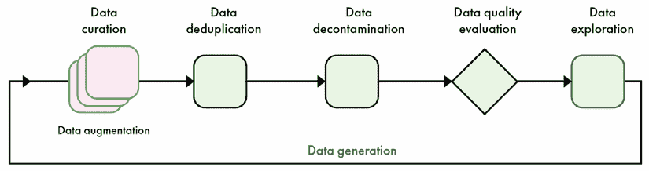
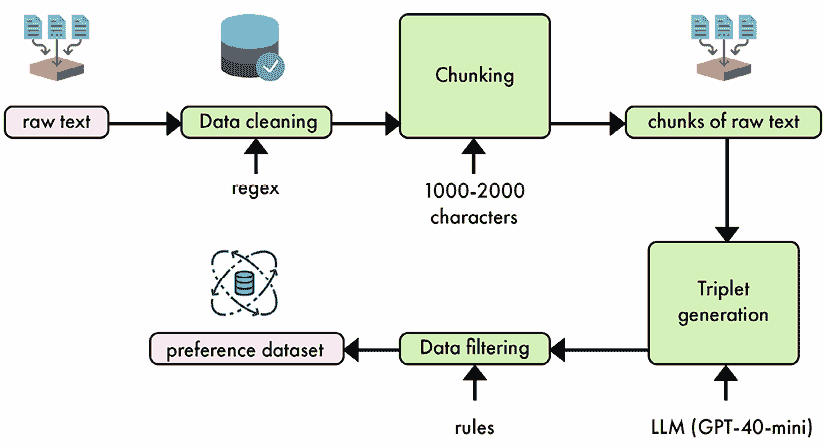
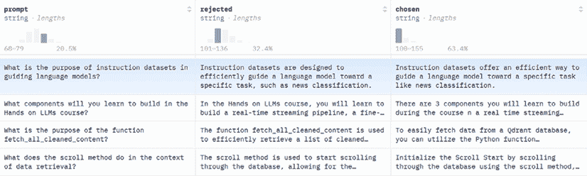
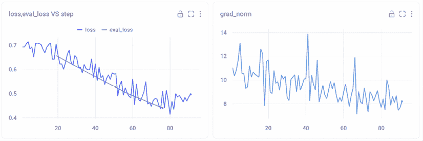

# 6

# 偏好对齐的微调

**监督微调**（**SFT**）在使大型语言模型（LLMs）执行特定任务方面至关重要。然而，SFT 在捕捉人类偏好的细微差别以及模型可能遇到的潜在交互的长尾方面存在困难。这种限制导致了更高级技术的发展，用于将人工智能系统与人类偏好对齐，这些技术被统称为*偏好对齐*。

偏好对齐通过将直接的人类或 AI 反馈纳入训练过程来解决 SFT 的不足。这种方法允许更细微地理解人类偏好，特别是在简单监督学习不足的复杂场景中。虽然存在许多偏好对齐的技术，但本章将主要关注**直接偏好优化**（**DPO**）以实现简单和高效。

本章中，我们将讨论偏好对齐算法如 DPO 所需的数据类型。我们将构建自己的数据集来修改我们模型的写作风格，使其更少人工化，更真实。我们将介绍 DPO 算法并实现它以对齐第五章中训练的模型。

本章将涵盖以下主题：

+   理解偏好数据集

+   如何创建我们自己的偏好数据集

+   **直接偏好优化**（**DPO**）

+   在实践中实施 DPO 以对齐我们的模型

到本章结束时，你将能够创建自己的偏好数据集，并使用多种技术将模型与模型对齐。

本章的所有代码示例都可以在 GitHub 上找到：[`github.com/PacktPublishing/LLM-Engineering`](https://github.com/PacktPublishing/LLM-Engineering)。

# 理解偏好数据集

创建高质量偏好数据集的原则与第五章中讨论的指令数据集的原则相同。我们希望最大化样本的准确性、多样性和复杂性。为了实现这一点，我们遵循与图 6.1 中概述的相同阶段：数据整理、去重、净化、质量评估、探索、生成和增强。



图 6.1 – 本章涵盖的培训后数据管道概述

为了避免重复，本节将专注于指令数据集和偏好数据集之间的主要区别。我们将介绍偏好样本的结构和偏好数据集的理想大小。然后，我们将关注与创建指令数据集最不同的两个阶段：数据生成和评估。

## 偏好数据

由于不同训练算法对数据要求的不同，偏好数据集缺乏指令数据集的标准性。偏好数据包括对给定指令的一系列响应，这些响应由人类或语言模型按顺序排列。本章重点关注 DPO，因此我们将检查该算法所需的具体数据格式。

如*表 6.1*所示，DPO 数据集的结构简单明了：每条指令都配对了一个首选答案和一个拒绝答案。目标是训练模型生成首选响应而不是拒绝的响应。

| **指令**告诉我一个关于章鱼的故事。 |
| --- |
| **选择答案**为什么章鱼不在赌场里玩牌？因为它们数不过八。 | **拒绝答案**要多少次轻触才能让章鱼笑？十次轻触。 |

表 6.1 – mlabonne/orpo-dpo-mix-40k 数据集的样本示例

在偏好数据集中，拒绝的响应与选择的响应一样重要。没有拒绝的响应，数据集将只是一个简单的指令集。拒绝的响应代表我们希望从模型中消除的行为。这提供了很大的灵活性，并允许我们在许多情境中使用偏好数据集。以下是一些例子，说明在单独使用 SFT 相比，使用偏好数据集更有益的情况：

+   **聊天机器人**：在对话式人工智能中，响应的质量往往取决于主观因素，如自然度、参与度和上下文适宜性。偏好数据集允许模型通过比较更好的和较差的响应来学习这些细微之处。简单的 SFT 可能无法捕捉到在特定情境下使一个响应比另一个响应更可取的微妙之处。

+   **内容审核**：确定内容是否适当或违反指南通常涉及细微的判断。偏好数据集可以帮助模型通过比较可接受和不可接受的内容的例子来学习区分边缘案例。这比通过 SFT 进行二进制分类更有效，因为它有助于模型理解审核决策背后的推理。

+   **摘要**：摘要的质量往往取决于诸如简洁性、相关性和连贯性等因素。通过使用偏好数据集，模型可以学习生成人类认为更有用和更有信息量的摘要。简单的 SFT 可能导致技术上正确但不如人类读者偏好的摘要。

+   **代码生成**：在编码任务中，通常有多种正确解决方案，但其中一些比其他方案更高效、更易读，或遵循更好的实践。偏好数据集可以帮助模型学习代码质量的这些定性方面，这些方面可能无法通过基于简单正确性的 SFT 捕捉到。

+   **创意写作**：对于故事生成或诗歌写作等任务，输出的质量高度主观且多方面。偏好数据集可以比指令数据集更好地捕捉人类对风格、创造力和情感影响的判断，后者可能更多地关注技术正确性或遵循提示。

+   **翻译**：虽然像 BLEU 分数这样的传统指标可以衡量翻译的准确性，但它们并不总是能捕捉到翻译的流畅性或自然性。偏好数据集可以帮助模型学习产生母语人士偏好的翻译，即使有多种翻译在技术上都是正确的。

在所有这些场景中，偏好数据集使训练方法更加精细。它们捕捉主观质量评估和人类偏好，这些偏好超越了简单的正确性或遵循指令。这种方法可以产生不仅技术上准确，而且与人类在复杂、开放性任务中的判断和偏好更好的对齐的模型。

与指令数据集不同，没有像 Alpaca 或 ShareGPT 这样的标准化存储格式。大多数偏好数据集的结构类似于*表 6.1*中所示，包含指令、首选答案和拒绝答案的列。在偏好对齐中，多轮对话不常见。在撰写本文时，主要的微调库不支持多轮对话，通常只提取对话中的第一条或最后一条消息。

### 数据量

DPO 数据集通常比指令数据集需要更少的样本量，才能对模型行为产生显著影响。与指令数据集一样，所需的样本数量取决于模型大小和任务复杂性。较大的模型更有效率地使用样本，因此需要的数据更少，而复杂任务则需要更多的示例来捕捉所需的行为。再次强调，数据质量至关重要，大量偏好对通常是有益的。

通用对齐被 LLM 提供商用于提高微调模型的总体性能。这需要数百万样本的偏好数据集。AI 行业的领军企业，包括 Nvidia 和 Meta，正在趋同于类似的训练后管道，涉及多轮偏好对齐和广泛使用合成数据。这一共识表明，这些方法正在证明是推动语言模型能力边界的最有效方法。

在较小规模上，开源社区使用从 10,000 到 100,000 个样本的数据集来提高模型性能。这种方法不仅证明了在提高基准分数方面的有效性，而且在合并、修剪和其他修改后修复网络方面也有效。一般来说，DPO 比 SFT 破坏性小，对最终模型的影响也较轻。

另一方面，如前所述的任务需要较少的偏好对。特定任务的校准关注于提高模型在特定功能上的性能，例如修改写作风格、拒绝某些指令等。这些校准通常可以通过较小的数据集实现，从 100 到 10,000 个偏好对不等，具体取决于任务的复杂度。

需要少量样本的应用示例之一是指导模型声明它并非由 OpenAI、Meta 或其他大型语言模型（LLM）提供商训练。这可以通过使用偏好数据集来实现，其中被拒绝的答案是那些声称有其他来源的回答，而选中的答案是模型正确声明由你训练的回答。一个包含 200 到 500 对的相对较小的数据集可能就足够完成这项任务。

## 数据生成和评估

在创建偏好数据集时，数据生成和评估是紧密相连的。我们首先创建答案，然后对其进行评分以形成最终的数据集。在下面的介绍中，我们将这两个步骤作为一个过程而不是两个单独的过程来介绍。

### 生成偏好

在创建新的偏好数据之前，查看相关的开源数据集是个好主意。与指令数据集相比，这些数据集较少，但在 Hugging Face Hub 上可以找到高质量的偏好数据集。这些数据集可以用于特定任务或添加到你的数据集中。知名偏好数据集包括 Anthropic HH-RLHF 数据集，该数据集包含人类对有益且无害的 AI 响应的偏好，以及 OpenAI 的基于人类反馈的摘要数据集，该数据集专注于文章摘要。

DPO 数据集可以通过各种方法创建，每种方法都有其质量、成本和可扩展性之间的权衡。这些方法可以根据特定应用进行定制，并需要不同程度的人类反馈。我们将它们分为四个主要类别：

+   **由人类生成、由人类评估的数据集**：这种方法涉及雇佣人员来创建对提示的响应并评估这些响应的质量。虽然这种方法可以捕捉到细微的人类偏好，并且对于复杂任务来说是最理想的，但它极其资源密集且难以扩展。因此，它主要被拥有大量资源的大型 AI 公司所采用。

+   **由人类生成、由 LLM 评估的数据集**：如果你有大量现有的人类生成内容，这种方法可能很有用。然而，由于效率低下，这种方法在实践中很少使用，因为它在生成响应时仍然需要大量的人类输入，同时在 LLM 评估阶段可能会错过细微的偏好。

+   **由 LLM 生成、人工评估的数据集**：这种方法在质量和效率之间提供了良好的平衡。LLM 对提示生成多个响应，人类对这些响应进行排名。这种方法通常更受欢迎，因为人类通常在判断答案方面比从头开始编写答案更擅长。它允许快速生成多样化的响应，同时仍然有效地捕捉人类偏好。然而，它可能不会提供人类可能生成的创造性或意外响应。

+   **由 LLM 生成、LLM 评估的数据集**：完全合成的数据集，其中生成和评估都由 LLM 完成，由于其可扩展性和成本效益，正变得越来越普遍。这种方法可以快速生成大量数据集，并随着 LLM 能力的提升而改进。然而，它需要仔细的提示工程以确保质量和多样性，并可能延续生成 LLM 的偏见或局限性。

在实践中，人工生成的数据集成本高昂，难以扩展，且不一定质量最高。另一方面，人工评估非常有价值，但可能难以扩展，这就是为什么大型数据集受益于 LLM 评估。除了这些高级考虑因素之外，你获取数据的方式以及你打算如何使用它也需要被考虑。例如，拥有许多用户的程序可以嵌入反馈机制以提供偏好。这可以简单到“喜欢”和“不喜欢”评分，或者更深入一些，包括文本。

注意，评估并不总是必需的，偏好可以从生成过程中自然出现。例如，可以使用高质量的模型生成首选输出，而使用低质量或故意有缺陷的模型生成不那么首选的替代方案。这会在偏好数据集中产生清晰的区分，从而更有效地训练 AI 系统识别和模仿高质量输出。Hugging Face Hub 上可用的`Intel/orca_dpo_pairs`数据集就是通过这个过程创建的。

另一种方法是比较模型生成的输出与人工编写的响应，这可以提供关于模型与实际人类偏好的匹配程度以及模型可能缺乏的领域的见解。这可以用来复制特定的风格，并为模型提供更真实的语气。

### 数据生成技巧

数据生成在指令和偏好数据集之间是一致的。提示应该设计成鼓励模型响应的多样性和复杂性。通过制作明确要求不同方法或风格的提示，我们可以确保广泛范围的输出，从而捕捉人类偏好的多样性。

例如，在生成摘要时，可能会要求不同的变体，如简洁摘要、详细摘要和关注关键点的摘要。这种方法不仅产生多样化的数据集，还有助于了解不同的风格和方法如何与人类偏好相一致。

在生成合成偏好数据集时，引入输出中的可变性是另一个关键方面。这可以通过调整温度设置或在 LLM 中采用其他采样方法来实现。较高的温度设置往往会产生更具创造性和多样化的响应，而较低的设置则会导致更专注和确定性的输出。这会在多样性和连贯性之间产生权衡，这取决于我们想要生成的数据类型。例如，生成代码需要较低的创造力，因此需要较低的温度，而撰写文章则可以采用较高的温度。

使用多个 LLM 生成样本可能比仅使用一个模型更好。一些 LLM 在特定任务上表现更好，这种方法也增加了更多多样性。这种方法被流行的开源数据集如`argilla/Capybara-Preferences`所采用，结合了 GPT-4 和开放权重模型。然后，评估过程会选择选定的和被拒绝的答案。

### 评估偏好

数据评估可以通过人工评分或使用 LLM 自动化完成。**LLM 评估**涉及制定详细的准则，创建一个明确传达这些指南给 LLM 的提示，并使用该模型选择首选和被拒绝的响应。虽然比人工评分更具可扩展性，并允许一致地应用标准，但这种 LLM 评估的质量直接取决于模型的表现和提供的指南。它可能错过细微的人类偏好或文化细微差别。然而，随着 LLM 的持续改进，它们进行细微判断的能力也在提高，这可能导致随着时间的推移生成更高质量的数据集。

通过绝对评分或成对排名来实现 LLM 对偏好数据集的评估。在绝对评分中，LLM 根据预定义的标准为每个响应分配一个数值分数或分类评级。这种方法简单直接，但可能在不同提示或评估会话中存在不一致性。另一方面，成对排名涉及向 LLM 展示两个响应，并要求它选择更好的一个或对它们进行排名。这种方法更接近于人类评估的格式，并可能导致更一致的结果。

对于绝对评分，您将创建一个概述评估标准的提示，并要求 LLM 在特定尺度上对回答进行评分（例如，1-5 或差/一般/好/优秀）。提示可能看起来像这样：“根据相关性、连贯性和有帮助性，对以下回答进行 1-5 级别的评分：[`INSERT RESPONSE`]。”对于成对排名，提示可能是：“比较以下两个回答。在相关性、连贯性和有帮助性方面，哪个更好？回答 A：[`INSERT RESPONSE A`] 回答 B：[`INSERT RESPONSE B`]。”

偏好数据集的比较性质使得成对排名成为评估的理想方法。这种方法通常比绝对评分更准确，并且与人类判断的相关性更紧密。成对排名模仿了人类比较选项的自然方式，使得人类评分者和 LLM 都能提供一致且有意义的评估。

通过提供真实答案和使用思维链推理，我们可以进一步提高成对排名的准确性。这种方法鼓励评估 LLM 考虑回答的多个方面，并阐明其决策过程，从而得出更全面和合理的评估。当没有真实答案可用时，我们可以提示 LLM 创建评分笔记，即对预期答案的描述。这种技术在 LLM 对特定主题没有广泛知识的情况下尤其有效，因为它迫使模型在评估回答之前建立明确的评估标准。

这里是一个将 LLM 作为裁判的提示进行成对排名的具体实现：

| **指令**您是一位答案裁判。您的目标是比较答案 A 和答案 B。我想知道哪个答案在相关性、准确性、完整性、清晰度、结构和简洁性方面更好地回答了指令。指令：{instruction}答案 A：{answer_a}答案 B：{answer_b}逐步解释您的推理，并使用以下结构输出最佳答案的字母：(比较两个答案)最佳答案：(A 或 B) |
| --- |

*表 6.2* – 使用一个指令和两个答案的 LLM 作为裁判的成对排名提示示例

然而，需要注意的是，基于 LLM 的评估可能受到几种类型的偏差的影响：

+   **位置偏差**：在相对评分中，LLM 裁判倾向于偏好第一个呈现的答案。这种偏差可能会扭曲结果并导致不准确的选择。

+   **长度偏差**：与人类类似，LLM 裁判通常偏好较长的答案，可能会忽略较短、更简洁的回答的质量。

+   **家族偏差**：LLM 裁判可能会偏好由自己或同一家族的模型生成的回答，这可能是由于语言模式或知识库的相似性。

为了减轻这些偏差并提高偏好数据集的质量，可以实施几种解决方案。一种关键的方法是在每次比较中随机化答案 A 和答案 B 的顺序，这可以通过确保展示顺序不会持续影响评估来抵消位置偏差。另一种有价值的策略是提供少量示例，以展示分数的平衡分布。这些示例用于校准评判 LLM 的内部评分机制，并可以通过展示较短答案或来自不同模型家族的答案也可以是高质量的来有效解决长度和家族偏差。此外，采用多个模型作为陪审团，而不是依赖单个 LLM 评判员，可以显著提高评估过程的鲁棒性。这种多模型方法有助于平衡单个模型中可能存在的任何个人偏差，从而对响应进行更全面和准确的评估。

在下一节中，我们将创建自己的偏好数据集。我们将依靠数据生成过程自然地创建选定的（人工生成）和拒绝的（LLM 生成）答案。

# 创建我们自己的偏好数据集

我们的模式目前可以就与机器学习相关的话题撰写段落，但它没有与原始作者相同的写作风格。这是一个典型的偏好对齐用例，我们希望改变模型的“声音”以更接近源数据。需要注意的是，实验上，DPO 往往使模型更加冗长，并推动它们使用非常正式的语言。因此，训练将需要使用 DPO 进行精细操作，以避免这种陷阱，并采用这些博客文章的较少正式的风格。

在本节中，我们将创建一个偏好数据集，其中选定的答案是从文本中提取的，而拒绝的答案是模型生成的。为了实现这一点，我们将修改在*第五章*中创建的代码，该代码旨在生成指令数据集。

如前节所示，偏好和指令数据集依赖于相同的原则。而不是指令和答案的配对，我们需要三元组（指令，答案 1，答案 2）。在这个设置中有趣的是，我们在文本块中有真实答案，这意味着我们不需要像 LLM 评判员那样的复杂评估过程。为了确保这些提取是高质量的，我们将实施两个额外的质量过滤器，基于长度和标点。*图 6.2*总结了端到端的过程：



图 6.2 – 从原始文本到偏好数据集的合成数据生成流程

现在我们已经准备好实现偏好数据生成流程：

1.  我们首先导入必要的库。

    ```py
    import concurrent.futures
    import json
    import re
    from typing import List, Tuple
    from datasets import Dataset
    from openai import OpenAI
    from tqdm.auto import tqdm 
    ```

1.  我们现在不再有 `InstructionAnswerSet` 类，而是有一个 `PreferenceSet` 类。该类旨在处理指令的三元组、生成的答案（被拒绝）和提取的答案（被选中）。

    ```py
    class PreferenceSet:
        def __init__(self, triples: List[Tuple[str, str, str]]):
            self.triples = triples
        @classmethod
        def from_json(cls, json_str: str) -> 'PreferenceSet':
            data = json.loads(json_str)
            triples = [(triple['instruction'], triple['generated_answer'], triple['extracted_answer'])
                       for triple in data['preference_triples']]
            return cls(triples)
        def __iter__(self):
            return iter(self.triples) 
    ```

1.  `load_articles_from_json`、`clean_text` 和 `extract_substrings` 函数与原始代码保持不变。让我们从 `load_articles_from_json` 开始，它接受包含文章的 JSON 文件（`cleaned_documents.json`）作为输入，并返回一个包含文本和元数据（ID、平台、作者 ID、作者全名、链接）的 Hugging Face 数据集。

    ```py
    def load_articles_from_json(file_path: str) -> Dataset:
        with open(file_path, "r") as file:
            data = json.load(file)
        return Dataset.from_dict(
            {
                "id": [item["id"] for item in data["artifact_data"]],
                "content": [item["content"] for item in data["artifact_data"]],
                "platform": [item["platform"] for item in data["artifact_data"]],
                "author_id": [item["author_id"] for item in data["artifact_data"]],
                "author_full_name": [item["author_full_name"] for item in data["artifact_data"]],
                "link": [item["link"] for item in data["artifact_data"]],
            }
        ) 
    ```

1.  `clean_text` 函数移除非字母数字字符（除撇号、句号、逗号、感叹号和问号外），并将多个空格替换为单个空格，以确保正确的格式。

    ```py
    def clean_text(text: str) -> str:    text = re.sub(r"[^\w\s.,!?']", " ", text)    text = re.sub(r"\s+", " ", text)
        return text.strip() 
    ```

1.  `extract_substrings` 函数将文章分割成长度在 1,000 到 2,000 个字符之间的块。为了确保分割不会破坏句子，从而改变其含义，我们使用正则表达式仅在句子末尾进行分割。

    ```py
    def extract_substrings(dataset: Dataset, min_length: int = 1000, max_length: int = 2000) -> List[str]:
        extracts = []
        sentence_pattern = r"(?<!\w\.\w.)(?<![A-Z][a-z]\.)(?<=\.|\?|\!)\s"
        for article in dataset["content"]:
            cleaned_article = clean_text(article)
            sentences = re.split(sentence_pattern, cleaned_article)
            current_chunk = ""
            for sentence in sentences:
                sentence = sentence.strip()
                if not sentence:
                    continue
                if len(current_chunk) + len(sentence) <= max_length:
                    current_chunk += sentence + " "
                else:
                    if len(current_chunk) >= min_length:
                        extracts.append(current_chunk.strip())
                    current_chunk = sentence + " "
            if len(current_chunk) >= min_length:
                extracts.append(current_chunk.strip())
        return extracts 
    ```

1.  `generate_preference_triples` 函数取代了原始的 `generate_instruction_answer_pairs` 函数。提示信息从指令版本中调整，旨在生成三元组而不是对。它还提供了关于我们感兴趣的指令类型、如何从文章中提取答案以及如何格式化它们的通用指导：

    ```py
    def generate_preference_triples(extract: str, client: OpenAI) -> List[Tuple[str, str, str]]:
        prompt = f"""Based on the following extract, generate five instruction-answer triples. Each triple should consist of:
    1\. An instruction asking about a specific topic in the context.
    2\. A generated answer that attempts to answer the instruction based on the context.
    3\. An extracted answer that is a relevant excerpt directly from the given context.
    Instructions must be self-contained and general, without explicitly mentioning a context, system, course, or extract.
    Important:
    - Ensure that the extracted answer is a verbatim copy from the context, including all punctuation and apostrophes.
    - Do not add any ellipsis (...) or [...]  to indicate skipped text in the extracted answer.
    - If the relevant text is not continuous, use two separate sentences from the context instead of skipping text.
    Provide your response in JSON format with the following structure:
    {{
        "preference_triples": [
            {{
                "instruction": "...",
                "generated_answer": "...",
                "extracted_answer": "..."
            }},
            ...
        ]
    }}
        Extract:
        {extract}
    """ 
    ```

1.  在同一函数中，我们使用 GPT-4o-mini 以 JSON 模式生成我们的答案。我们在系统提示中指定我们想要三元组而不是对。JSON 答案直接由我们的 `PreferenceSet` 类解析，以返回预期的元组列表。

    ```py
     completion = client.chat.completions.create(
            model="gpt-4o-mini",
            messages=[
                {
                    "role": "system",
                    "content": "You are a helpful assistant who generates instruction-answer triples based on the given context. Each triple should include an instruction, a generated answer, and an extracted answer from the context. Provide your response in JSON format.",
                },
                {"role": "user", "content": prompt},
            ],
            response_format={"type": "json_object"},
            max_tokens=2000,
            temperature=0.7,
        )
        result = PreferenceSet.from_json(completion.choices[0].message.content)
        return result.triples 
    ```

1.  为偏好数据处理管道引入了两个新的过滤函数：`filter_short_answers` 和 `filter_answer_format`。这些函数过滤掉短答案，并确保答案以大写字母开头并正确结束。我们将它们用作启发式方法来过滤掉质量较差的样本。

    ```py
    def filter_short_answers(dataset: Dataset, min_length: int = 100) -> Dataset:
        def is_long_enough(example):
            return len(example['chosen']) >= min_length
        return dataset.filter(is_long_enough)
    def filter_answer_format(dataset: Dataset) -> Dataset:
        def is_valid_format(example):
            chosen = example['chosen']
            return (len(chosen) > 0 and
                    chosen[0].isupper() and
                    chosen[-1] in ('.', '!', '?'))
        return dataset.filter(is_valid_format) 
    ```

1.  `create_preference_dataset` 函数取代了原始的 `create_instruction_dataset` 函数。现在，该函数使用三元组而不是对，并在生成的数据集中使用不同的列名。

    ```py
    def create_preference_dataset(dataset: Dataset, client: OpenAI, num_workers: int = 4) -> Dataset:
        extracts = extract_substrings(dataset)
        preference_triples = []
        with concurrent.futures.ThreadPoolExecutor(max_workers=num_workers) as executor:
            futures = [
                executor.submit(generate_preference_triples, extract, client)
                for extract in extracts
            ]
            for future in tqdm(concurrent.futures.as_completed(futures), total=len(futures)):
                preference_triples.extend(future.result())
        instructions, generated_answers, extracted_answers = zip(*preference_triples)
        return Dataset.from_dict(
            {
                "prompt": list(instructions),
                "rejected": list(generated_answers),
                "chosen": list(extracted_answers)
            }
        ) 
    ```

1.  主要功能已更新，包括新的过滤步骤，并使用偏好数据集创建功能：

    ```py
    def main(dataset_id: str) -> Dataset:
        client = OpenAI()
        # 1\. Load the raw data
        raw_dataset = load_articles_from_json("cleaned_documents.json")
        print("Raw dataset:")
        print(raw_dataset.to_pandas())
        # 2\. Create preference dataset
        dataset = create_preference_dataset(raw_dataset, client)
        print("Preference dataset:")
        print(dataset.to_pandas())
        # 3\. Filter out samples with short answers
        dataset = filter_short_answers(dataset)
        # 4\. Filter answers based on format
        dataset = filter_answer_format(dataset)
        # 5\. Export
        dataset.push_to_hub(dataset_id)
        return dataset 
    ```

`create_preference_dataset()` 函数生成了 2,970 个样本。然后，通过删除过短或格式不正确的答案（例如，以大写字母开头或以句号、感叹号或问号结尾的答案），该数据集被大量过滤，仅保留 1,467 个样本。

最终数据集可在以下 Hugging Face Hub 地址获取：[`huggingface.co/datasets/mlabonne/llmtwin-dpo`](https://huggingface.co/datasets/mlabonne/llmtwin-dpo)。您可以在 *图 6.3* 中看到一个示例，它捕捉到了写作风格方面的微妙差异。两个答案都是正确的，但**选择的**（提取的）答案听起来稍微随意一些。



图 6.3 – Hugging Face Hub 上 mlabonne/llmtwin-dpo 偏好数据集的屏幕截图

为了生成这个数据集，我们多次迭代提示以生成数据。这需要一些手动评估和实验，直到我们达到令人满意的结果。提示的质量在这个过程中至关重要，这就是为什么建议遵循类似的过程来生成您自己的偏好数据集。

在下一节中，我们将介绍与 **来自人类反馈的强化学习**（RLHF）和 DPO 相关的概念。这包括在本章最后部分实现的新参数和想法。

# 偏好对齐

偏好对齐重新组合了用于在偏好数据上微调模型的技巧。在本节中，我们概述了这个领域，然后重点介绍我们将要实施的技巧：**直接偏好优化**（DPO）。

## 来自人类反馈的强化学习

**来自人类反馈的强化学习**（RLHF）将 **强化学习**（RL）与人类输入相结合，以使模型与人类偏好和价值观保持一致。RLHF 作为对传统 RL 方法挑战的回应而出现，特别是指定复杂任务的奖励函数的困难以及工程奖励与预期目标之间可能出现的偏差。

RLHF 的起源可以追溯到基于偏好的强化学习（PbRL）领域，该领域由 Akrour 等人和 Cheng 等人于 2011 年独立引入。PbRL 旨在从定性反馈中推断目标，例如行为之间的成对偏好，而不是依赖于定量奖励信号。这种方法解决了传统强化学习的一些局限性，在传统强化学习中，定义适当的奖励函数可能具有挑战性，并且容易受到奖励黑客攻击或产生意外行为。

RLHF 这个术语是在 2021-2022 年左右提出的，因为这种方法在训练大型语言模型（LLMs）的背景下获得了显著的关注。然而，其核心思想已经发展了数年。Christianos 等人在 2017 年发表的一篇开创性论文展示了从人类偏好中学习奖励模型并使用它们来训练强化学习代理的有效性。这项工作表明，RLHF 可以匹配或超过基于手工设计的奖励训练的代理的性能，但所需的人类努力显著减少。

在其核心，RLHF 通过迭代改进奖励模型和政策来工作：

+   **奖励模型学习**：RLHF 不是使用预定义的奖励函数，而是从人类反馈中学习奖励模型。这通常是通过向人类展示不同的答案并询问他们更喜欢哪一个来完成的。这些偏好被用来训练奖励模型，通常使用布拉德利-特里模型或类似的方法，将偏好映射到潜在效用函数。

+   **策略优化**：使用学习到的奖励模型，可以采用标准的强化学习算法来优化策略。这种策略生成新的行为，旨在最大化从学习模型预测的奖励。

+   **迭代改进**：随着策略的改进，它会产生新的行为，这些行为可以通过人类进行评估，从而对奖励模型进行细化。这种循环持续进行，理想情况下会导致与人类偏好高度一致的政策。

强化学习与人类反馈的关键创新在于其处理人类反馈高成本的方法。而不是要求持续的人类监督，强化学习与人类反馈允许异步和稀疏的反馈。

学习到的奖励模型作为人类偏好的代理，使得强化学习算法能够在没有直接人类输入的情况下，为每个动作持续训练。

例如，*图 6.4*展示了**近端策略优化**（**PPO**）算法的高级视图，这是最受欢迎的强化学习与人类反馈融合（RLHF）算法之一。在此，奖励模型用于评估训练模型生成的文本。这种奖励通过额外的**库尔巴克-莱布勒**（**KL**）散度因子进行正则化，确保训练前（冻结模型）的标记分布保持相似。


图 6.4 – 偏好对齐的 PPO 算法的高级视图

尽管 RLHF 在将人工智能系统与人类偏好对齐方面已被证明是有效的，但由于其迭代性质和对单独奖励模型的依赖，它面临着挑战。这种依赖可能导致计算成本高昂且可能不稳定。尽管在理论上具有优越性，但 RLHF 算法在实验中与简单方法相比也表现不佳。其中一种受到广泛关注的方法是 DPO。

## 直接偏好优化

在 2023 年的论文《直接偏好优化：你的语言模型实际上是奖励模型》中，Rafailov 等人引入了 DPO，它为传统的 RLHF 方法提供了一种简化的替代方案。

DPO 的核心创新在于其对偏好学习问题的重新表述。与 RLHF 不同，RLHF 通常涉及训练一个单独的奖励模型，然后使用如 PPO 之类的强化学习算法来微调语言模型，DPO 采取了一种更直接的方法。

它在标准 RLHF 目标下，即在具有参考策略的 KL 散度约束下最大化预期奖励的情况下，推导出最优策略的闭式表达式。这一数学洞察力使得 DPO 可以直接用策略来表述偏好学习问题，从而消除了需要单独的奖励模型或复杂的强化学习算法的需求。

在实际应用中，DPO 可以作为一个简单的二元交叉熵损失函数实现，该函数直接作用于语言模型的输出概率。这个损失函数鼓励模型将更高的概率分配给首选响应，将更低的概率分配给非首选响应，同时保持与参考（冻结）模型的接近。通过 0 到 1 之间的 beta 参数直接控制参考模型的重要性。当 beta 等于 0 时，参考模型被忽略，这意味着训练的模型可以与 SFT 模型非常不同。在实践中，0.1 是最受欢迎的值，但这个值可以根据下一节的内容进行调整。

这种方法的简单性允许使用标准的梯度下降技术进行优化，无需在训练期间从模型中采样或实现复杂的 RL 算法。*图 6.5*展示了 DPO 算法的高级视图，与*图 6.4*相比，极大地简化了训练过程。


图 6.5 – DPO 算法的偏好对齐高级视图

DPO 相对于传统的 RLHF 方法具有几个优势。如前所述，它显著简化了偏好学习流程，减少了与 RLHF 方法相关的工程复杂性。通过消除对单独的奖励模型和 RL 算法的需求，DPO 比传统的 RLHF 方法在计算效率上更高。特别是当与适配器（LoRA，QLoRA）一起训练时，冻结和训练的模型不需要分离。实际上，因为我们只训练适配器，所以训练的模型不会被修改。这使得我们只需要加载一个模型而不是两个，从而节省了额外的 VRAM。

尽管这种方法很简单，DPO 通常与更复杂的 RLHF 方法的性能相匹配。它还倾向于在训练期间更加稳定，对超参数的敏感性更低。简化的方法使得 DPO 更容易实现和扩展，尤其是对于没有广泛 RL 知识的中小团队来说。

虽然 RLHF（Reinforcement Learning from Human Feedback）允许通过多个训练轮次进行迭代改进，并且可以动态适应新的偏好，但 DPO 提供了实现类似结果的更直接途径。DPO 与基于 PPO 的 RLHF 之间的选择通常取决于实现简便性和潜在峰值性能之间的权衡。对于包含数百万个偏好样本的大规模训练运行，受 PPO 启发的方 法仍然具有更高的性能上限。然而，对于大多数应用来说，DPO 在较低的计算和工程成本下提供了大部分的性能优势。

RLHF 和 DPO 都显著受益于合成数据的集成。随着 LLM（Large Language Model）能力的增强，它们可以生成在质量和多样性上超越人类创造内容的数据。这创造了一个良性循环，即更好的模型产生更好的训练数据，反过来又导致模型进一步改进。这两种方法的迭代性质允许进行多轮模型精炼，每轮都关注模型性能的不同方面，并逐渐增强各个领域的功能。

尽管 DPO 具有优势，但它并非没有缺点。像 RLHF 一样，DPO 仍然需要成对的偏好数据，这可能很昂贵且耗时收集。DPO 缺乏与强化学习方法相关的某些理论保证。可能存在某些场景，其中 RLHF 增加的灵活性是有益的，特别是对于复杂任务或环境。

尽管如此，DPO 在大多数情况下都是理想的，包括我们的双 LLM 示例。在下一节中，我们将使用 Unsloth 实现它。

# 实现 DPO

在本节中，我们将对在第五章中创建的**TwinLlama-3.1-8B**模型进行 DPO 微调。为了便于使用并最大化性能，我们再次使用 Unsloth 库来实现我们的 DPO。根据可用的 VRAM，您可以选择 LoRA（更高质量、速度和 VRAM 使用）和 QLoRA（较低质量、速度和 VRAM 使用）。这种技术与其他偏好对齐算法一起，也存在于 TRL 和 Axolotl 中。

这个例子可以被视为 DPO（Document Positioning Operator）的高级应用。事实上，我们模仿写作风格的目标与 DPO 鼓励正式语言的自然倾向相冲突。这部分原因是因为所选答案通常比被拒绝的答案更正式。在实践中，这会迫使我们进行轻微的微调，使用低学习率和较少的 epoch 数。为了找到最佳的超参数，我们在一组问题上进行训练，包括“写一段介绍监督微调的段落。”这使我们能够选择最适合此任务的模型和参数。

依赖项与第五章中的 SFT 相同，可以在本书的 GitHub 仓库（[`github.com/PacktPublishing/LLM-Engineering`](https://github.com/PacktPublishing/LLM-Engineering)）或 Unsloth 的仓库（[`github.com/unslothai/unsloth`](https://github.com/unslothai/unsloth)）中找到：

1.  首先，我们想要访问一个门控模型，并且（可选地）将我们的微调模型上传到 Hugging Face（[`huggingface.co/`](https://huggingface.co/)）。这需要我们登录一个账户。如果您没有账户，您可以创建一个，并将 API 密钥（**设置 | 访问令牌 | 创建新令牌**）存储在`.env`文件中：

    ```py
    HF_TOKEN = YOUR_API_KEY 
    ```

1.  确保您的 Comet ML API 密钥也包含在`.env`文件中。否则，当训练开始时，代码会崩溃并引发错误。

    ```py
    COMET_API_KEY = YOUR_API_KEY 
    ```

1.  在导入所有必要的包之前，我们想要对 TRL 中的`DPOTrainer`类应用一个补丁。这修复了笔记本环境中的 DPO 日志。

    ```py
    from unsloth import PatchDPOTrainer
    PatchDPOTrainer() 
    ```

1.  我们现在可以导入其他库。DPO 与 SFT 之间的主要区别是导入 TRL 中的`DPOConfig`和`DPOTrainer`，它们是 DPO 训练特有的。

    ```py
    import os
    import torch
    from datasets import load_dataset
    from transformers import TrainingArguments, TextStreamer
    from unsloth import FastLanguageModel, is_bfloat16_supportedfrom trl import DPOConfig, DPOTrainer 
    ```

1.  此步骤加载第五章中的微调模型。我们使用相同的配置，`max_seq_length`为 2048。您可以通过将`load_in_4bit`设置为`True`来激活 QLoRA。在以下步骤中，我们将执行 LoRA DPO 微调以提高速度和质量。

    ```py
    max_seq_length = 2048
    model, tokenizer = FastLanguageModel.from_pretrained(
        model_name="mlabonne/TwinLlama-3.1-8B",
        max_seq_length=max_seq_length,
        load_in_4bit=False,
    ) 
    ```

1.  现在，让我们使用 LoRA 配置准备模型进行 PEFT。我们将排名（`r`）和`lora_alpha`从第五章中的`32`增加到`64`。这将允许更丰富的微调。我们保持`0`的 dropout 以加快速度，并针对每个线性模块进行操作。

    ```py
    model = FastLanguageModel.get_peft_model(
        model,
        r=32,
        lora_alpha=32,
        lora_dropout=0,
        target_modules=["q_proj", "k_proj", "v_proj", "up_proj", "down_proj", "o_proj", "gate_proj"],
    ) 
    ```

1.  我们加载`llmtwin-dpo`数据集（训练分割），其中包含我们的提示、选择和拒绝的答案。

    ```py
    dataset = load_dataset("mlabonne/llmtwin-dpo", split="train") 
    ```

1.  数据准备与第五章中的 SFT 示例有显著不同。在这里，我们有包含提示、选择答案和拒绝答案的三元组。在`format_samples`函数中，我们将 Alpaca 聊天模板应用于每个单独的消息。请注意，指令是唯一需要聊天格式的：选择和拒绝答案只需要与**句子结束标记**（**EOS**）连接。最后，我们以 95%/5%的比例创建一个训练/测试分割。

    ```py
    alpaca_template = """Below is an instruction that describes a task. Write a response that appropriately completes the request.
    ### Instruction:
    {}
    ### Response:
    """
    EOS_TOKEN = tokenizer.eos_token
    def format_samples(example):
        example["prompt"] = alpaca_template.format(example["prompt"])
        example["chosen"] = example['chosen'] + EOS_TOKEN
        example["rejected"] = example['rejected'] + EOS_TOKEN
        return {"prompt": example["prompt"], "chosen": example["chosen"], "rejected": example["rejected"]}
    dataset = dataset.map(format_samples)
    dataset = dataset.train_test_split(test_size=0.05) 
    ```

1.  模型和数据现在已准备就绪，我们可以开始微调。与 SFT 相比，有一些新的参数，如`ref_model`和`beta`。由于我们使用 LoRA（或 QLoRA），我们不是直接训练模型，而是训练适配器。这意味着我们可以使用原始模型（不带适配器）作为参考，节省大量 VRAM。`beta`参数控制参考模型的重要性。在大多数情况下，标准值 0.1 效果良好，但根据我们的实验，我们决定将其增加到 0.5。这是因为训练模型使用了较低值的正式语言。使其更接近参考模型有助于解决这个问题。

学习率也降低了（从 SFT 的 3e-4 到这里的 2e-6）。我们训练 1 个 epoch 而不是 3 个，并且`max_seq_length`参数现在被分解为两个新的参数：`max_prompt_length`（仅提示）和`max_length`（提示和答案）。请注意，我们还用`DPOConfig`类替换了`TrainingArguments`类。

```py
trainer = DPOTrainer(
    model=model,
    ref_model=None,
    tokenizer=tokenizer,
    beta=0.5,
    train_dataset=dataset["train"],
    eval_dataset=dataset["test"],
    max_length=max_seq_length//2,
    max_prompt_length=max_seq_length//2,
    args=DPOConfig(
        learning_rate=2e-6,
        lr_scheduler_type="linear",
        per_device_train_batch_size=2,
        per_device_eval_batch_size=2,
        gradient_accumulation_steps=8,
        num_train_epochs=1,
        fp16=not is_bfloat16_supported(),
        bf16=is_bfloat16_supported(),
        optim="adamw_8bit",
        weight_decay=0.01,
        warmup_steps=10,
        output_dir="output",
        eval_strategy="steps",
        eval_steps=0.2,
        logging_steps=1,
        report_to="comet_ml",
        seed=0,
    ),
)
trainer.train() 
```

1.  一旦模型训练完成，我们就可以运行它进行快速合理性检查。这一步骤与 SFT 示例类似。它准备模型进行推理，并对提示生成响应。

    ```py
    FastLanguageModel.for_inference(model)
    message = alpaca_template.format("Write a paragraph to introduce supervised fine-tuning.", "")
    inputs = tokenizer([message], return_tensors="pt").to("cuda")
    text_streamer = TextStreamer(tokenizer)
    _ = model.generate(**inputs, streamer=text_streamer, max_new_tokens=256, use_cache=True) 
    ```

1.  训练好的 DPO 模型返回以下响应：

    ```py
    Supervised fine-tuning is a method used to enhance the performance of pre-trained language models by utilizing labeled data. This technique involves taking a pre-trained model and refining it on a specific task, such as content creation or customer service. By providing the model with relevant data and guidance, it can learn to generate outputs that align more closely with the desired outcomes. This approach allows for the creation of more specialized models that can tackle complex tasks with greater accuracy and efficiency. 
    ```

我们可以将其与 SFT 模型提供的答案进行比较：

```py
Supervised fine-tuning is a method used to enhance a language model by providing it with a curated dataset of instructions and their corresponding answers. This process is designed to align the model's responses with human expectations, thereby improving its accuracy and relevance. The goal is to ensure that the model can respond effectively to a wide range of queries, making it a valuable tool for applications such as chatbots and virtual assistants. 
```

DPO 模型提供的答案既更准确，又更接近期望的写作风格。它正确地将预训练语言模型识别为 SFT 的源模型。它还提到了特定领域或任务的微调，而不是与“人类期望”对齐，这更接近偏好对齐阶段。答案也更不正式，是我们会在博客文章中使用的。

1.  最后，最后一步包括将训练好的模型保存在本地并将其推送到 Hugging Face Hub。

    ```py
    model.save_pretrained_merged("model", tokenizer, save_method="merged_16bit") 
    ```

恭喜！我们已经训练并导出了我们的 DPO 模型。它现在可在 Hugging Face Hub 上找到，网址为[`huggingface.co/mlabonne/TwinLlama-3.1-8B-DPO`](https://huggingface.co/mlabonne/TwinLlama-3.1-8B-DPO)。与 SFT 相比，DPO 在训练期间需要跟踪一些额外的指标。*图 6.6*显示了 Comet ML 仪表板上的主要指标。您可以使用以下 URL 公开访问它：[`www.comet.com/mlabonne/llm-twin-training/`](https://www.comet.com/mlabonne/llm-twin-training/)



图 6.6 – 使用 DPO 指标在 Comet ML 中进行实验跟踪

让我们回顾一下这些指标：

+   **训练损失**：我们仍然希望平均损失持续下降。请注意，它可能会迅速下降到零，这意味着模型不再学习任何东西。这种行为不一定导致过拟合或不良模型，但需要密切监控。

+   **验证损失**：关于验证损失，也可以说同样的话。我们预计与训练损失相比会有一个小差距。

+   **梯度范数**：我们期望梯度范数很小，几乎没有峰值。

+   **奖励**：我们有两种不同的奖励：选择和拒绝。它们对应于训练和参考模型输出的对数概率之间的平均值差异。随着时间的推移，我们预计模型会选择选择的答案并拒绝拒绝的答案，这意味着它们之间的差距应该增加。这种差异直接通过`margins`指标跟踪，定义为选择和拒绝奖励之间的差异。一个训练良好的模型的 margin 会迅速增加然后趋于平稳。

+   **准确率**：此指标表示模型正确识别所选答案的百分比。我们希望这个准确率在训练过程中逐渐提高，但不需要达到 100%。100%的准确率，尤其是如果它快速实现，可能表明偏好数据集对模型来说可能太简单了。虽然 LLM 仍然可以从这样的数据集中学习，但添加更多具有挑战性的例子可能是有益的。

通常，DPO 比 SFT 更难监控和调试，因为它是一个更复杂的过程，涉及一个参考模型。然而，它比 PPO 和其他 RLHF 算法更容易使用。只要你有高质量的偏好数据集和强大的微调模型，你就可以尝试不同的排名、beta 参数、学习率和 epoch 数量，以查看哪个实验最能捕捉你的偏好。

虽然这不是本章的目的，但自动评估旨在模仿写作风格的模型是可能的。一个可能的解决方案是，将不同模型（SFT 和 DPO）生成的文本中单词的分布与我们的基准数据集进行比较。在这个例子中，我们预计 SFT 模型会输出很多在 GPT-4o-mini 中过度表示的单词（如“深入研究”）。我们的 DPO 模型输出的分布应该与所选答案非常接近。

# 摘要

本章探讨了用于改进 LLM 的偏好对齐技术。它介绍了偏好数据集的概念，解释了其结构和在捕捉细微的人类偏好中的重要性。我们通过比较真实文章的原始文本和 AI 生成的文本，实现了我们自己的定制偏好数据生成管道。此管道可以根据您的用例重用和定制。

我们还概述了 RLHF 的演变过程，导致了 DPO（直接偏好优化）作为一种更简单、更有效的替代方案的出现。最后，我们使用 Unsloth 库实现了 DPO，以微调我们的 TwinLlama-3.1-8B 模型，该模型来自*第五章*。我们的逐步教程提供了训练模型的实际指导，并突出了与 SFT 的关键差异。最终模型可在 Hugging Face Hub 上找到。

在下一章中，我们将探讨至关重要的 LLM 评估主题，解决评估 LLM 性能的挑战和当前方法。我们将涵盖创建特定领域评估集，探讨为什么评估在领域内仍然是一个持续存在的问题，并介绍使用更大模型评估较小模型的概念（LLM 作为法官）。本章将以一个全面的评估流程结束，提供一个结构化的框架，以实现一致和有效的 LLM 评估。

# 参考文献

+   Rafael Rafailov 等人。“*直接偏好优化：你的语言模型实际上是一个奖励模型*。”arXiv 预印本 arXiv:2305.18290，2023 年 5 月。

+   Timo Kaufmann 等人. “*人类反馈强化学习的强化学习综述*。” arXiv 预印本 arXiv:2312.14925，2023 年 12 月。

+   Anthropic. “*GitHub - anthropics/hh-rlhf: 用于“通过人类反馈的强化学习训练一个有用且无害的助手”的人类偏好数据*。” github.com, 2022，[`github.com/anthropics/hh-rlhf`](https://github.com/anthropics/hh-rlhf).

+   Nisan Stiennon 等人. “*从人类反馈中学习总结*。” arXiv 预印本 arXiv:2009.01325，2020 年 9 月。

+   Intel(R) Neural Compressor. “在 Intel Gaudi2 上进行的监督微调和直接偏好优化。” medium.com, 2024 年 3 月 26 日，[`medium.com/intel-analytics-software/the-practice-of-supervised-finetuning-and-direct-preference-optimization-on-habana-gaudi2-a1197d8a3cd3`](https://medium.com/intel-analytics-software/the-practice-of-supervised-finetuning-and-direct-preference-optimization-on-habana-gaudi2-a1197d8a3cd3).

+   Argilla. “*GitHub - argilla-io/distilabel*。” [github.com](https://github.com), 2024 年 8 月 23 日，[`github.com/argilla-io/distilabel`](https://github.com/argilla-io/distilabel).

+   Databricks. “*使用评分笔记增强 LLM-as-a-Judge*。” databricks.com, 2024 年 7 月 22 日，[`www.databricks.com/blog/enhancing-llm-as-a-judge-with-grading-notes`](https://www.databricks.com/blog/enhancing-llm-as-a-judge-with-grading-notes).

+   Akrour, Riad & Schoenauer, Marc & Sebag, Michèle. (2011). Preference-Based Policy Learning. 12-27\. 10.1007/978-3-642-23780-5_11.

+   Cheng, Weiwei & Fürnkranz, Johannes & Hüllermeier, Eyke & Park, Sang-Hyeun. (2011). *基于偏好的策略迭代：利用偏好学习进行强化学习*。 312-327\. 10.1007/978-3-642-23780-5_30.

+   Paul Christiano 等人. “*从人类偏好中进行深度强化学习*。” arXiv 预印本 arXiv:1706.03741，2017 年 6 月。

+   Long Ouyang 等人. “*通过人类反馈训练语言模型以遵循指令*。” arXiv 预印本 arXiv:2203.02155，2022 年 3 月。

+   John Schulman 等人. “*近端策略优化算法*。” arXiv 预印本 arXiv:1707.06347，2017 年 7 月。

+   unslothai. “*GitHub - unslothai/unsloth: 使用 80%更少的内存，将 Llama 3.1、Mistral、Phi 和 Gemma LLMs 的微调速度提高 2-5 倍。” github.com, 2024 年 8 月 21 日，[`github.com/unslothai/unsloth`](https://github.com/unslothai/unsloth).

# 加入我们书籍的 Discord 空间

加入我们社区的 Discord 空间，与作者和其他读者进行讨论：

[`packt.link/llmeng`](https://packt.link/llmeng)


