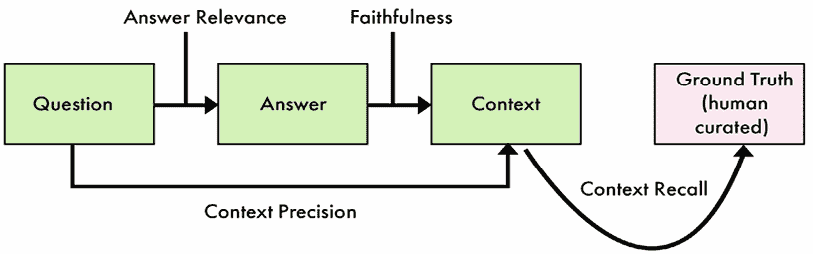
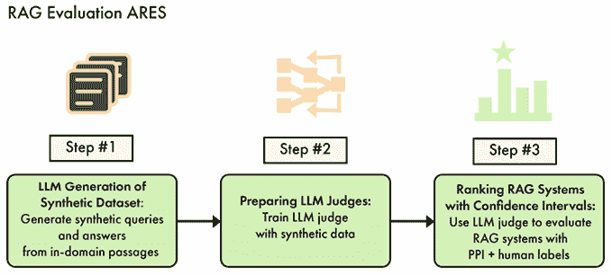

# 第七章：评估大型语言模型（LLMs）

LLM 评估是用于评估 LLM 模型性能和能力的关键过程。它可以采取多种形式，如多项选择题回答、开放式指令和真实用户的反馈。目前，没有统一的衡量模型性能的方法，但有一些模式和配方我们可以根据特定用例进行调整。

虽然通用评估是最受欢迎的，例如**大规模多任务语言理解**（**MMLU**）或 LMSYS 聊天机器人竞技场，但特定领域和任务的模型从更狭窄的方法中受益。这在处理整个 LLM 系统（而不是模型）时尤其如此，通常围绕一个**检索增强生成**（**RAG**）流程。在这些情况下，我们需要扩展我们的评估框架，包括检索器和后处理器等新模块。

在本章中，我们将涵盖以下主题：

+   模型评估

+   RAG 评估

+   评估 TwinLlama-3.1-8B

到本章结束时，你将了解最流行的 LLM 评估以及如何使用不同的技术评估模型和 RAG 系统。

# 模型评估

在模型评估中，目标是评估单个模型的能力，而不需要任何提示工程、RAG 流程等。

这种评估对于几个原因至关重要，例如选择最相关的 LLM 或确保微调过程实际上提高了模型。在本节中，我们将比较机器学习（ML）和 LLM 评估，以了解这两个领域之间的主要区别。然后我们将探讨通用、特定领域和特定任务的基准。

## 比较 ML 和 LLM 评估

机器学习评估主要集中在评估为预测、分类和回归等任务设计的模型的性能。与 LLM 评估不同，LLM 评估通常关注模型理解和生成语言的能力，ML 评估更关注模型如何准确和高效地处理结构化数据以产生特定结果。

这种差异源于这些模型处理的任务的本质。ML 模型通常是为定义狭窄的问题设计的，如预测股价或检测异常值，这通常涉及数值或分类数据，使评估过程更加直接。另一方面，LLM 被要求解释和生成语言，这给评估过程增加了一层主观性。LLM 评估不仅依赖于数值基准，还需要更细致的方法，并经常结合定性评估，检查模型在自然语言中产生连贯、相关和上下文准确响应的能力。

尤其是我们可以看到这些模型工作方式中的三个关键差异，这影响了评估过程：

+   **数值指标**: 评估机器学习模型通常涉及测量客观性能指标，如准确率、精确率、召回率或均方误差，具体取决于手头任务的类型。对于能够处理多个任务（因此，多个评估）且很少依赖于相同数值指标的 LLMs（大型语言模型），这一点并不明确。

+   **特征工程**: 在传统的机器学习中，过程的一个关键部分是在训练模型之前手动选择和转换相关的数据特征。评估这种特征工程的成功往往成为更广泛模型评估的一部分。然而，LLMs 被设计为直接处理原始文本数据，减少了手动特征工程的需求。

+   **可解释性**: 对于机器学习模型，更容易解释模型为何做出某些预测或分类，这种可解释性可以是它们评估的核心部分。然而，LLMs 无法进行这种直接解释。但是，在生成过程中请求解释可以提供关于模型决策过程的见解。

在下一节中，我们将更细致地探讨不同类型的 LLMs。虽然评估通用模型与机器学习评估相对独立，但特定任务的 LLMs 与传统机器学习更紧密地相关。

## 通用 LLMs 评估

通用评估指的是针对基础和通用微调模型的指标。它们涵盖了与知识和实用性相关的一系列能力，而不专注于特定任务或领域。这允许开发者对这些能力有一个全面的了解，与竞争对手进行比较，并识别优势和劣势。基于这些结果，可以调整数据集和超参数，甚至修改架构。

我们可以将通用评估大致分为三个阶段：预训练期间、预训练之后以及微调之后。

在预训练期间，我们密切监控模型的学习过程，如第五章末所示。最直接的指标是低级指标，与模型的训练方式相对应：

+   **训练损失**: 基于交叉熵损失，衡量模型预测的概率分布与下一个标记的真实分布之间的差异

+   **验证损失**: 计算与训练损失相同的损失，但是在保留的验证集上，以评估泛化能力

+   **困惑度**: 交叉熵损失的指数，表示模型对数据的“惊讶”程度（越低越好）

+   **梯度范数**: 监控训练过程中梯度的幅度，以检测潜在的不稳定性或梯度消失/爆炸

在这个阶段也可以包括像 HellaSwag（常识推理）这样的基准测试，但存在过度拟合这些评估的风险。

在预训练之后，通常使用一系列评估来评估基模型。这个套件可以包括内部和公共基准。以下是一个非详尽的常见公共预训练评估列表：

+   **MMLU (知识)**: 在 57 个科目（从基础到专业水平）的多个选择题上测试模型

+   **HellaSwag (推理)**: 挑战模型从多个选择中完成给定情境的最合理结局

+   **ARC-C (推理)**: 评估模型在需要因果推理的年级学校水平选择题上的表现

+   **Winogrande (推理)**: 通过精心制作的句子中的代词解析来评估常识推理

+   **PIQA (推理)**: 通过关于日常物理互动的问题来衡量物理常识理解能力

许多这些数据集也被用来评估通用微调模型。在这种情况下，我们关注基模型和微调模型之间给定分数的差异。例如，不良的微调可能会降低模型的知识，如通过 MMLU 衡量的。相反，良好的微调可能会灌输更多的知识并提高 MMLU 分数。

这也可以帮助识别任何污染问题，模型可能被微调在过于接近测试集的数据上。例如，在微调阶段提高基模型的 MMLU 分数 10 分是不太可能的。这是一个迹象，表明指令数据可能已被污染。

除了这些预训练评估之外，微调模型也有自己的基准。在这里，我们使用“微调模型”这个术语来指代经过**监督微调**（**SFT**）和偏好对齐训练的模型。这些基准针对与微调模型理解和回答问题能力相关的功能。特别是，它们测试指令遵循、多轮对话和代理技能：

+   **IFEval (指令遵循)**: 评估模型在特定约束下（如答案中不输出任何逗号）遵循指令的能力

+   **Chatbot Arena (对话)**: 一个框架，其中人类投票选择对指令的最佳答案，通过面对面对话比较两个模型

+   **AlpacaEval (指令遵循)**: 与 Chatbot Arena 高度相关的自动评估，用于微调模型

+   **MT-Bench (对话)**: 评估模型在多轮对话中的表现，测试其保持上下文并提供连贯回答的能力

+   **GAIA (代理)**: 以多步骤的方式测试广泛的技能，如工具使用和网络浏览

理解这些评估的设计和使用方式对于选择最适合你应用的 LLM 非常重要。例如，如果你想微调模型，你希望选择在给定大小上知识推理方面最好的基础模型。这允许你比较不同 LLM 的能力，并选择一个将为你的微调提供最强基础的模型。

即使你不想微调模型，像 Chatbot Arena 或 IFEval 这样的基准也是一个比较不同指令模型的好方法。例如，如果你在构建聊天机器人，你希望拥有出色的对话能力。然而，如果你的最终目标是像从非结构化文档中提取信息这样的任务，这就不必要了。在这种情况下，你将更多地受益于出色的指令遵循技能来理解和执行任务。

虽然这些基准很受欢迎且有用，但它们也存在固有的缺陷。例如，公开基准可以通过在测试数据或与基准数据集非常相似的数据或样本上训练模型来操纵。甚至人类评估也不是完美的，并且往往偏向于长而自信的答案，尤其是当它们格式良好时（例如，使用 Markdown）。另一方面，私人测试集没有像公开测试集那样受到仔细审查，可能存在自身的问题和偏见。

这意味着基准不是真理的唯一来源，而应该用作信号。一旦多个评估提供了相似的答案，你就可以提高对模型真实能力的信心水平。

## 领域特定 LLM 评估

领域特定 LLM 的适用范围不如通用模型广泛。这有助于针对比以前基准更精细的能力进行更深入的定位。

在该类别中，基准的选择完全取决于所涉及的领域。对于像特定语言模型或代码模型这样的常见应用，建议搜索相关的评估甚至基准套件。这些套件包含不同的基准，并设计成可复制的。通过针对领域的不同方面，它们通常能更准确地捕捉领域性能。

为了说明这一点，以下是一个在 Hugging Face Hub 上有排行榜的领域特定评估列表：

+   **Open Medical-LLM 排行榜**：评估 LLM 在医学问答任务中的性能。它重新组合了 9 个指标，包括来自美国医学执照考试（MedQA）的 1,273 个问题，来自 PubMed 文章（PubMedQA）的 500 个问题，来自印度医学入学考试（MedMCQA）的 4,183 个问题，以及来自 MMLU 的 6 个子类别（临床知识、医学遗传学、解剖学、专业医学、大学生物学和大学医学）的 1,089 个问题。

+   **BigCodeBench 排行榜**：评估代码 LLM 的性能，包括两个主要类别：BigCodeBench-Complete，基于结构化文档字符串的代码补全，以及 BigCodeBench-Instruct，从自然语言指令生成代码。模型根据其 Pass@1 分数使用贪婪解码进行排名，对于 Complete 变体还有一个额外的 Elo 评分。它涵盖了广泛的编程场景，测试 LLM 的组合推理和指令遵循能力。

+   **幻觉排行榜**：评估 LLM 在 16 个涵盖 5 个类别的多样化任务中产生虚假或不支持信息的能力。这些包括*问答*（使用 NQ Open、TruthfulQA 和 SQuADv2 等数据集）、*阅读理解*（使用 TriviaQA 和 RACE）、*摘要*（采用 HaluEval Summ、XSum 和 CNN/DM）、*对话*（特色 HaluEval Dial 和 FaithDial）、以及*事实核查*（利用 MemoTrap、SelfCheckGPT、FEVER 和 TrueFalse）。排行榜还使用 IFEval 评估指令遵循能力。

+   **企业场景排行榜**：评估 LLM 在六个现实世界企业用例上的性能，涵盖与商业应用相关的多样化任务。基准包括 FinanceBench（100 个带有检索上下文的金融问题）、Legal Confidentiality（来自 LegalBench 的 100 个用于法律推理的提示）、Writing Prompts（创意写作评估）、Customer Support Dialogue（客户服务互动中的相关性）、Toxic Prompts（有害内容生成的安全性评估）以及 Enterprise PII（敏感信息保护的企业安全）。一些测试集是闭源的，以防止排行榜被操纵。评估侧重于特定能力，如答案准确性、法律推理、创意写作、上下文相关性以及安全措施，为 LLM 在企业环境中的适用性提供全面评估。

排行榜可以根据其领域采用不同的方法。例如，BigCodeBench 与其他排行榜显著不同，因为它仅依赖于两个足以涵盖整个领域的指标。另一方面，幻觉排行榜重新组合了 16 个指标，包括许多通用评估。这表明，除了定制基准之外，重用通用基准也可以完成自己的套件。

尤其是语言特定的 LLM 通常重用通用基准的翻译版本。这可以通过母语中的原始评估来完成。虽然一些基准使用机器翻译，但最好依赖于人工翻译的评估来提高其质量。我们选择了以下三个特定任务的排行榜及其相应的评估套件，以给您提供一个如何构建自己的排行榜的思路：

+   **OpenKo-LLM 排行榜**：使用九项指标评估韩语 LLM 的性能。这些指标包括将通用基准翻译成韩语（GPQA、Winogrande、GSM8K、EQ-Bench 和 IFEval）以及定制评估（知识、社会价值、无害性和帮助性）。

+   **Open 葡萄牙 LLM 排行榜**：使用九种不同的基准评估葡萄牙语 LLM 的性能。这些基准包括教育评估（ENEM 有 1,430 个问题，BLUEX 有 724 个来自大学入学考试的问题）、专业考试（OAB 考试有超过 2,000 个问题）、语言理解任务（ASSIN2 RTE 和 STS、FAQUAD NLI）以及社交媒体内容分析（HateBR 有 7,000 个 Instagram 评论，PT Hate Speech 有 5,668 条推文，tweetSentBR）。

+   **Open 阿拉伯 LLM 排行榜**：使用一套全面的基准评估阿拉伯语 LLM 的性能，包括本土阿拉伯语任务和翻译数据集。排行榜包括两个本土阿拉伯语基准：AlGhafa 和阿拉伯文化价值观对齐。此外，它还包含 12 个翻译基准，涵盖各种领域，如 MMLU、ARC-Challenge、HellaSwag 和 PIQA。

通用和领域特定的评估设计遵循三个主要原则。首先，它们应该是复杂的，挑战模型区分好和坏的输出。其次，它们应该是多样化的，尽可能涵盖更多主题和场景。当一项基准不足以时，额外的基准可以创建一个更强的套件。最后，它们应该是实用的，易于运行。这与评估库更为相关，这些库可能更容易或更难使用。我们推荐使用 Eleuther AI 的 lm-evaluation-harness（[github.com/EleutherAI/lm-evaluation-harness](https://github.com/EleutherAI/lm-evaluation-harness)）和 Hugging Face 的 lighteval（[github.com/huggingface/lighteval](https://github.com/huggingface/lighteval)）来运行您的基准。

## 任务特定的 LLM 评估

虽然通用和领域特定的评估表明了强大的基础或指导模型，但它们无法提供关于这些模型在特定任务中表现如何的见解。这需要专门为此目的设计的基准，以衡量下游性能。

由于它们的关注范围较窄，任务特定的 LLM 很少能依赖现有的评估数据集。这可能是有利的，因为它们的输出也往往更结构化，更容易使用传统的机器学习指标进行评估。例如，摘要任务可以利用**基于召回的摘要评估辅助工具**（**ROUGE**）指标，该指标通过使用 n-gram 来衡量生成的文本和参考文本之间的重叠。

同样，分类任务也能从中受益，并使用以下经典指标，以及其他指标：

+   **准确性**：准确性指的是正确预测的实例数与总实例数的比例。它对于具有分类输出或存在明显对错之分的任务特别有用，例如**命名实体识别**（NER）。

+   **精确度**：模型做出的真实阳性预测与模型做出的总阳性预测的比例。

+   **召回率**：真实阳性预测与总实际阳性实例的比例。

+   **F1 分数**：精确度和召回率的调和平均数，用于平衡这两个指标。这些指标在分类或实体提取等任务中特别有用。

当任务不能直接映射到传统的机器学习任务时，可以创建一个自定义基准。这个基准可以受到通用和特定领域评估数据集的启发。一个常见且成功的模式是使用多项选择题回答。在这个框架中，指令由一个问题及其几个选项组成。以下是一个来自 MMLU 数据集（抽象代数）的问题示例：

| **指令**找到给定域扩展 Q(sqrt(2), sqrt(3))在 Q.A. 0B. 4C. 2D. 6 上的度。 |
| --- |
| **输出**B |

*表 7.1*：来自 MMLU 数据集的示例

使用此方案评估模型主要有两种方式——文本生成和对数似然评估：

+   第一种方法涉及让模型生成文本回答，并将这些回答与预定义的答案选项进行比较。例如，模型生成一个字母（A、B、C 或 D）作为其答案，然后与正确答案进行核对。这种方法测试了模型在类似实际应用格式中产生连贯且准确回答的能力。

+   相反，使用概率进行评估则关注模型对不同答案选项的预测概率，而不需要文本生成。对于 MMLU，lm-evaluation-harness 比较了每个答案选项全文的概率。这种方法允许对模型的理解进行更细致的评估，因为它可以捕捉模型对不同选项的相对信心，即使它不一定生成确切的正确答案文本。

为了简化，我们建议使用模仿人类考试过程的文本生成版本进行评估。这种方法更容易实现，并且通常更具区分性，因为低质量模型在基于概率的评估中往往表现过好。你可以将这项技术应用于测试模型对特定任务的掌握程度，甚至扩展到特定领域。

相反，如果任务过于开放，传统的机器学习指标和多项选择题回答可能就不相关了。在这种情况下，可以在第五章中介绍的使用 LLM 作为评判者的技术可以用来评估答案的质量。如果你有真实答案，提供它们作为额外上下文可以提高评估的准确性。否则，定义不同的维度（例如相关性或毒性，取决于你的任务）也可以使评估更易于理解。

建议使用大型模型进行评估，并迭代地改进你的提示。在这个过程中，模型输出的解释对于理解其推理中的错误以及通过额外的提示工程修复它们非常重要。

为了便于解析答案，可以在指令中指定结构或使用某种类型的结构化生成（如提纲或 OpenAI 的 JSON 模式）。以下是一个带有结构的指令示例：

| 你是一个评估者，负责评估指令的答案质量。你的目标是提供一个分数，表示答案如何满足指令。你将使用 1 到 4 的刻度，其中每个数字代表以下内容：1. 答案与指令不相关。2. 答案与指令相关但无帮助。3. 答案与指令相关且有帮助，但可以更详细。4. 答案与指令相关、有帮助且详细。请按照以下方式提供你的评估：##评估##说明：（分析答案的相关性、帮助性和复杂性）总分：（1 到 4 之间的最终分数）**指令**:{instruction}**答案**:{answer}##评估##说明： |
| --- |

*表 7.2*：用于答案评估的通用 LLM 作为评判者的提示示例

自然地，你可以调整刻度，将真实答案添加到这个提示中，并根据自己的用例进行定制。

然而，评判 LLM 可能会表现出偏向于自信或冗长回答的偏见，可能高估了听起来更有信心但准确性较低的答案。它们也可能缺乏特定主题的领域专业知识，导致误判。一致性也是一个问题，因为 LLM 可能会对相似响应给出不同的评分。此外，它们可能对某些与实际答案质量无关的写作风格有隐含的偏好。为了减轻这些问题，可以将 LLM 评估与其他指标相结合，使用多个评判者，并精心设计提示以解决偏见。

一旦模型经过适当的评估并按预期工作，它可能被包含在一个更广泛系统中。在下一节中，我们将看到系统是如何改变评估框架的。

# RAG 评估

虽然传统的 LLM 评估侧重于模型固有的能力，但 RAG 评估需要更全面的方法，既要考虑模型的生成能力，也要考虑其与外部信息源的交互。

RAG 系统结合了 LLM 的优势和信息检索机制，使它们能够生成既连贯又符合上下文、且基于最新、外部来源信息的响应。这使得 RAG 在当前和准确信息至关重要的领域特别有价值，例如新闻报道、研究和客户支持。

RAG 系统的评估不仅限于评估一个独立的 LLM。它需要检查整个系统的性能，包括：

+   **检索准确性**：系统检索相关信息的程度如何？

+   **整合质量**：检索到的信息被有效整合到生成的响应中的程度如何？

+   **事实性和相关性**：最终输出是否适当地解决了查询，同时无缝地融合了检索和生成内容？

RAG 评估的关键指标包括检索精度和召回率，这些指标衡量检索信息的准确性和全面性。此外，检索数据与生成文本之间的整合质量至关重要，同样，输出的整体事实性和连贯性也是关键。

为了说明这些指标在实际中的应用，考虑一个为电子商务环境中的客户支持聊天机器人设计的 RAG 系统。在这种情况下，用户询问“假日促销期间购买的笔记本电脑的退货政策是什么？”RAG 管道找到有关电子产品退货政策的文档和有关假日促销条款的文档。这些额外的上下文附加在问题的末尾，并且模型使用它来回答：

| 在我们假日促销期间购买的笔记本电脑，您从购买日期起享有 60 天的延长退货期。这比我们标准电子产品的 30 天退货政策更长。请确保笔记本电脑处于原始包装中，并附带所有配件，以便有资格获得全额退款。 |
| --- |

*表 7.3*：为客服设计的 RAG 管道的输出示例

在这个管道中，我们可以评估检索的文档是否与预期相符（检索准确性）。我们还可以衡量带有和没有额外上下文的响应之间的差异（整合质量）。最后，我们可以评估输出是否与提供的信息相关，并且是否在文档提供的信息基础上（事实性和相关性）。

在本节中，我们将介绍两种评估 RAG 模型如何将外部信息纳入其响应的方法。

## Ragas

**检索增强生成评估**（**Ragas**）是一个开源工具包，旨在为开发者提供一套全面的工具，用于 RAG 评估和优化。它围绕**指标驱动开发**（**MDD**）的理念设计，这是一种产品开发方法，它依赖于数据来做出明智的决策，涉及对关键指标随时间持续监控，以获得有关应用程序性能的宝贵见解。通过采用这种方法，Ragas 使开发者能够客观地评估他们的 RAG 系统，确定改进领域，并跟踪随时间变化的影响。

Ragas 的关键功能之一是其能够合成生成多样化和复杂的测试数据集。这一功能解决了 RAG 开发中的一个重大痛点，因为手动创建数百个问题、答案和上下文既耗时又费力。相反，它使用受 Evol-Instruct 等作品启发的进化方法范式来构建具有不同特征的问题，如推理复杂性、条件元素和多上下文要求。这种方法确保了对 RAG 管道中不同组件的全面评估。

此外，Ragas 可以生成模拟基于聊天的问题和后续交互的对话样本，使开发者能够在更真实的场景中评估他们的系统。



图 7.1：Ragas 评估框架概述

如*图 7.1*所示，Ragas 提供了一套由 LLM 辅助的评价指标，旨在客观地衡量 RAG 系统性能的不同方面。这些指标包括：

+   **忠实度**：此指标衡量生成的答案与给定上下文的事实一致性。它通过将答案分解为单个主张并验证每个主张是否可以从提供的上下文中推断出来来工作。忠实度得分是可验证主张与答案中主张总数的比率。

+   **答案相关性**：此指标评估生成的答案与给定提示的相关性。它采用了一种创新的方法，即提示 LLM 根据答案生成多个问题，然后计算这些生成问题与原始问题之间的平均余弦相似度。这种方法有助于识别那些可能事实正确但与主题无关或不完整的答案。

+   **上下文精确度**：此指标评估上下文中存在的所有真实相关项目是否被适当地排序。它考虑检索上下文中相关信息的位置，奖励将最相关信息置于顶部的系统。

+   **上下文召回率**：这个指标衡量检索到的上下文与标注答案（真实情况）的一致程度。它分析真实情况答案中的每个主张，以确定它是否可以归因于检索到的上下文，从而为检索信息的完整性提供见解。

最后，Ragas 还提供了用于在生产环境中监控 RAG 质量的构建模块。这促进了 RAG 系统的持续改进。通过利用测试数据集的评估结果和生产监控中收集的见解，开发者可以迭代地增强他们的应用程序。这可能包括微调检索算法、调整提示工程策略或优化检索上下文和 LLM 生成的平衡。

Ragas 可以与另一种基于自定义分类器的方法相补充。

## ARES

ARES（一个用于 RAG 系统的自动化评估框架）是一个综合性的工具，旨在评估 RAG 系统。它提供了一个自动化流程，结合合成数据生成和微调的分类器来评估 RAG 性能的各个方面，包括上下文相关性、答案忠实度和答案相关性。

ARES 框架在三个主要阶段运行：合成数据生成、分类器训练和 RAG 评估。每个阶段都是可配置的，允许用户根据他们的特定需求和数据集定制评估过程。

在合成数据生成阶段，ARES 创建与真实世界场景紧密相似的测试数据集，以进行鲁棒的 RAG 测试。用户可以通过指定文档文件路径、少量提示文件和合成查询的输出位置来配置此过程。该框架支持用于此任务的各种预训练语言模型，默认为 google/flan-t5-xxl。用户可以控制采样文档的数量和其他参数，以在全面覆盖和计算效率之间取得平衡。



图 7.2：ARES 评估框架概述

在分类器训练阶段，ARES 创建高精度的分类器以确定 RAG 输出的相关性和忠实度。用户可以指定分类数据集（通常从前一个阶段生成）、用于评估的测试集、标签列和模型选择。ARES 使用 microsoft/deberta-v3-large 作为默认模型，但支持其他 Hugging Face 模型。可以通过微调训练参数，如 epoch 数量、早期停止的耐心值和学习率，来优化分类器性能。

最后的阶段，RAG 评估，利用训练好的分类器和合成数据来评估 RAG 模型的性能。用户提供评估数据集、用于指导评估的少样本示例、分类器检查点和黄金标签路径。ARES 支持各种评估指标，并可以为其评估生成置信区间。

ARES 通过 vLLM 集成提供灵活的模型执行选项，支持基于云和本地运行。该框架还支持各种工件类型（代码片段、文档、HTML、图像等），使不同 RAG 系统输出的全面评估成为可能。

总结来说，Ragas 和 ARES 通过它们在评估和数据集生成方面的不同方法相互补充。Ragas 在生产监控和 LLM 辅助指标方面的优势可以与 ARES 高度可配置的评估过程和基于分类器的评估相结合。虽然 Ragas 可能基于 LLM 能力提供更细致的评估，但一旦其分类器训练完成，ARES 提供一致且可能更快的评估。将它们结合起来提供了一个全面的评估框架，从 Ragas 的快速迭代和 ARES 在关键阶段的深入、定制评估中受益。

在下一节中，我们将创建自己的评估框架来评估我们的特定任务模型 TwinLlama-3.1-8B。

# 评估 TwinLlama-3.1-8B

在前面的章节中，我们创建了两个模型，经过微调以生成高质量的文章和帖子：TwinLlama-3.1-8B 和 TwinLlama-3.1-8B-DPO。基于这个总结，我们想要评估它们编写既准确又流畅文本的能力。相比之下，通用微调模型由于知识广泛而准确，但常常使用过于正式和冗长的语言。通过这次微调，我们希望采用更自然的写作风格，基于训练集中的原始文章。

由于这个问题具有开放性，我们将利用一个裁判 LLM 来评估生成文本的质量。它将指令和答案作为输入，并根据两个标准在 1-3 的尺度上评分：

+   **准确性**：答案中呈现的信息的事实正确性和全面性的程度

+   **风格**：博客文章或社交媒体内容的语气和写作风格的适当性（无正式或学术表达）

在我们的评估框架中，我们将使用指令数据集的测试分割来获取测试指令。我们将将它们输入到我们的模型中并生成答案。然后，这些答案将由我们的裁判 LLM（GPT-4o-mini）根据一个指定我们标准的提示进行评估。最后，我们将分析分数，并根据定性和定量评估得出结论。

## 生成答案

第一步包括高效地为测试集中的每个指令生成答案。除了我们的两个模型外，我们还将使用 meta-llama/Meta-Llama-3.1-8B-Instruct，这是 Llama-3.1-8B 的官方 instruct 版本，作为参考点，以更好地理解我们所做的权衡。

让我们开始实施的第一个阶段：

1.  我们导入相关的库，包括用于快速生成的 vLLM。这个库在本地模型批量生成方面比 transformers 快得多：

    ```py
    from vllm import LLM, SamplingParams
    from datasets import load_dataset
    from tqdm.auto import tqdm
    import gc 
    ```

1.  我们定义了一个名为 `generate_answers` 的函数，该函数将处理我们的数据集并使用指定的模型生成响应。它接受两个输入——我们想要使用的模型的 ID 和测试数据集的名称：

    ```py
    def generate_answers(model_id, dataset_name):
        dataset = load_dataset(dataset_name, split="test") 
    ```

1.  我们需要使用我们的模型训练的聊天模板格式化原始指令。请注意，Llama-3.1-8B-Instruct 已经使用了一个不同的模板，但它可以遵循这个简单的格式。在这里，为了简单起见，我们使用与每个模型相同的聊天模板。我们使用 `format()` 函数将整个测试集映射到这个模板：

    ```py
     def format(sample):
            return "Below is an instruction that describes a task. Write a response that appropriately completes the request.\n\n### Instruction:\n{}\n\n### Response:\n".format(sample["instruction"])
        dataset = dataset.map(lambda sample: {"prompt": format(sample)}) 
    ```

1.  让我们用最大长度为 4,096 个标记初始化 vLLM 使用的 LLM 对象。我们还可以指定采样参数，这些参数对应于解码策略中使用的变量。在这里，我们使用参数来鼓励多样性（高温度）同时移除最不可能的标记（`top_p` 和 `min_p`）。最后，我们通过提供 `dataset["prompt"]` 中的提示列表来开始生成：

    ```py
     llm = LLM(model=model_id, max_model_len=4096)
        sampling_params = SamplingParams(temperature=0.8, top_p=0.95, min_p=0.05, max_tokens=4096)
        outputs = llm.generate(dataset["prompt"], sampling_params) 
    ```

1.  使用我们的 334 个提示，这个过程应该需要几分钟。一旦完成，我们就从 vLLM 输出的对象中提取答案。然后，我们将这些答案作为新列添加到我们的数据集中。这有助于记录答案并在以后进行审查：

    ```py
     answers = [output.outputs[0].text for output in outputs]
        dataset = dataset.add_column("answers", answers) 
    ```

1.  我们将结果保存到 Hugging Face Hub 以便以后方便访问。然后，我们清理 GPU 内存，以防止在处理下一个模型时空间不足：

    ```py
     print(f"Uploading results for {model_id}")
        dataset.push_to_hub(f"mlabonne/{model_id.split('/')[-1]}-results")
        gc.collect()
        return dataset 
    ```

1.  我们创建了一个包含我们想要测试的三个模型的列表。然后，我们逐个运行这些模型的 `generate_answers()` 函数。这将为每个模型创建和上传一组单独的结果：

    ```py
    model_ids = [
        'mlabonne/TwinLlama-3.1-8B',
        'mlabonne/TwinLlama-3.1-8B-DPO',
        'meta-llama/Meta-Llama-3.1-8B-Instruct'
    ]
    for model_id in model_ids:
        generate_answers(model_id, "mlabonne/llmtwin") 
    ```

现在我们有了答案生成，我们可以继续到评估过程。

## 评估答案

为了评估我们的答案，我们将依赖 GPT-4o-mini 作为评判者。这种策略与我们用于数据生成时使用的策略相似。事实上，你可以将其修改为在数据生成过程中过滤掉坏样本。在这里，我们将根据准确性和风格对每个模型生成的每个答案进行评分。平均分数将告诉我们我们的微调质量与 Llama-3.1-8B-Instruct 相比如何：

1.  首先，我们导入所需的库，包括 `openai`：

    ```py
    import json
    from typing import List
    from datasets import Dataset, load_dataset
    from openai import OpenAI
    from tqdm.auto import tqdm
    import concurrent.futures 
    ```

1.  然后，我们定义了 `evaluate_answer()` 函数。这个函数包含我们的评估提示，它根据准确性和风格设置评估答案的上下文：

    ```py
    def evaluate_answer(
        instruction: str, answer: str, client: OpenAI
    ) -> dict:
        prompt = f"""You are an expert judge. Please evaluate the quality of a given answer to an instruction based on two criteria:
    1\. Accuracy: How factually correct is the information presented in the answer? You are a technical expert in this topic.
    2\. Style: Is the tone and writing style appropriate for a blog post or social media content? It should use simple but technical words and avoid formal or academic language. 
    ```

1.  在相同的提示中，我们为每个指标定义了我们的刻度。这些是三点李克特量表，每个分数都有精确的定义：

    ```py
    Accuracy scale:
    1 (Poor): Contains factual errors or misleading information
    2 (Good): Mostly accurate with minor errors or omissions
    3 (Excellent): Highly accurate and comprehensive
    Style scale:
    1 (Poor): Too formal, uses some overly complex words
    2 (Good): Good balance of technical content and accessibility, but still uses formal words and expressions
    3 (Excellent): Perfectly accessible language for blog/social media, uses simple but precise technical terms when necessary 
    ```

1.  最后，我们通过两个示例来总结提示，说明我们所说的“*复杂词汇*”和“*正式*或*学术语言*”。我们提供相应的指令-答案对，并要求模型以 JSON 格式返回响应：

    ```py
    Example of bad style: The Llama2 7B model constitutes a noteworthy progression in the field of artificial intelligence, serving as the successor to its predecessor, the original Llama architecture.
    Example of excellent style: Llama2 7B outperforms the original Llama model across multiple benchmarks.
    Instruction: {instruction}
    Answer: {answer}
    Provide your evaluation in JSON format with the following structure:
    {{
        "accuracy": {{
            "analysis": "...",
            "score": 0
        }},
        "style": {{
            "analysis": "...",
            "score": 0
        }}
    }}
    """ 
    ```

1.  这个提示作为用户查询提供给 GPT-4o-mini 模型。系统提示强化了我们对基于准确性和风格评估答案的兴趣：

    ```py
     completion = client.chat.completions.create(
            model="gpt-4o-mini",
            messages=[
                {
                    "role": "system",
                    "content": "You are a helpful assistant who evaluates answers based on accuracy and style. Provide your response in JSON format with a short analysis and score for each criterion.",
                },
                {"role": "user", "content": prompt},
            ],
            response_format={"type": "json_object"},
            max_tokens=1000,
            temperature=0.8,
        ) 
    ```

1.  如前几章所述，我们将批量处理请求以加快处理速度。这就是我们创建`evaluate_batch()`函数的原因，该函数返回一个包含对应索引的解析结构化输出列表。这些索引对于确保评估的正确顺序非常重要：

    ```py
    def evaluate_batch(batch, start_index):
        client = OpenAI(api_key=OPENAI_KEY)
        return [
            (i, evaluate_answer(instr, ans, client))
            for i, (instr, ans) in enumerate(batch, start=start_index)
        ] 
    ```

1.  我们现在可以在`evaluate_answers()`函数中编排之前的代码。该函数接收模型 ID、线程数和批处理大小作为输入。首先，我们加载之前保存的生成数据集：

    ```py
    def evaluate_answers(model_id: str, num_threads: int = 10, batch_size: int = 5) -> Dataset:
        dataset = load_dataset(f"mlabonne/{model_id.split('/')[-1]}-results", split="all") 
    ```

1.  我们从数据集中创建指令-答案对的批次。每个批次包含`batch_size`数量的对：

    ```py
     batches = [
            (i, list(zip(dataset["instruction"][i:i+batch_size], dataset["answers"][i:i+batch_size])))
            for i in range(0, len(dataset), batch_size)
        ] 
    ```

1.  我们使用多个线程并行评估指令-答案对的批次。我们使用并行处理同时评估多个批次，从而加快整体评估过程。`ThreadPoolExecutor`将每个批次提交给`evaluate_batch()`。结果存储在评估列表中：

    ```py
     evaluations = [None] * len(dataset)
        with concurrent.futures.ThreadPoolExecutor(max_workers=num_threads) as executor:
            futures = [executor.submit(evaluate_batch, batch, start_index) for start_index, batch in batches]
            for future in tqdm(concurrent.futures.as_completed(futures), total=len(futures)):
                for index, evaluation in future.result():
                    evaluations[index] = evaluation 
    ```

1.  我们创建一个新的列来存储评估过程的结果。这个列将存储裁判模型的原始 JSON 输出，包括分数和解释：

    ```py
     if 'evaluation' in dataset.column_names:
            dataset = dataset.remove_columns(['evaluation'])
        dataset = dataset.add_column("evaluation", evaluations) 
    ```

1.  我们可以直接使用`json.loads()`解析这个 JSON 对象，并尝试检索应该生成的准确性和风格分数。这种生成处于尽力而为模式，这意味着分数不能保证。如果解析出现错误，我们使用`None`值作为后备：

    ```py
     accuracy_scores = []
        style_scores = []
        for evaluation in dataset['evaluation']:
            try:
                eval_dict = json.loads(evaluation) if isinstance(evaluation, str) else evaluation
                accuracy_score = eval_dict['accuracy']['score']
                style_score = eval_dict['style']['score']
                accuracy_scores.append(accuracy_score)
                style_scores.append(style_score)
            except (json.JSONDecodeError, KeyError, TypeError):
                accuracy_scores.append(None)
                style_scores.append(None) 
    ```

1.  我们添加两个新列来存储准确性和风格分数，以进行进一步分析：

    ```py
     if 'accuracy' in dataset.column_names:
            dataset = dataset.remove_columns(['accuracy'])
        dataset = dataset.add_column('accuracy', accuracy_scores)
        if 'style' in dataset.column_names:
            dataset = dataset.remove_columns(['style'])
        dataset = dataset.add_column('style', style_scores) 
    ```

1.  让我们将生成的答案、评估和分数的最终数据集推送到 Hugging Face Hub：

    ```py
     dataset.push_to_hub(f"mlabonne/{model_id.split('/')[-1]}-results")
        return dataset 
    ```

1.  我们现在可以用我们选择的三个模型调用`evaluate_answers()`函数：

    ```py
    model_ids = [
        'mlabonne/TwinLlama-3.1-8B',
        'mlabonne/TwinLlama-3.1-8B-DPO',
        'meta-llama/Meta-Llama-3.1-8B-Instruct'
    ]
    for model_id in model_ids:
        evaluate_answers(model_id) 
    ```

通过保存中间结果，我们的评估框架对失败更加健壮。它也容易扩展到其他模型、数据集和标准。

## 分析结果

在这个评估过程的最后，我们可以审查三个元素：模型答案、评估的解释和分数。

虽然审查答案不可扩展，但它是一个至关重要的步骤，可以帮助识别许多常见错误，例如错误的聊天模板或错误的模型。在这里，我们将关注一个单独的指令，并阅读我们两个模型和 Llama-3.1-8B-Instruct 提供的答案：

| **指令**讨论算法偏差的概念及其影响。 |
| --- |
| **TwinLlama-3.1-8B**算法偏差指的是算法由于潜在假设或编程偏差而倾向于产生偏斜或不公平的结果。这可能会产生重大影响，尤其是在机器学习和人工智能等领域，这些领域依赖于算法做出关键决策。如果一个算法没有经过适当的偏见审查，可能会导致歧视性结果，例如贷款实践对某些人口群体产生不成比例的影响或招聘流程不公平地偏袒某些候选人。确保算法在设计和管理时考虑到公平性和准确性，以减轻这些风险是至关重要的。 |
| **TwinLlama-3.1-8B-DPO**算法偏差指的是算法由于潜在假设或编程偏差而倾向于产生偏斜或不公平的结果。这可能会产生重大影响，尤其是在机器学习和人工智能等领域，这些领域依赖于算法做出关键决策。如果一个算法没有经过适当的偏见审查，可能会导致歧视性结果，例如拒绝向某些人口群体发放贷款或持续传播刻板印象。因此，积极应对算法偏差对于确保我们开发的技术公平和正义至关重要。 |
| **Llama-3.1-8B-Instruct** 算法偏差，也称为算法偏差，指的是机器学习模型中可能影响其性能、准确性和公平性的无意或固有偏差。这种偏差可能由各种因素引起，包括用于训练模型的数据、算法本身以及社会或文化中存在的偏差。算法偏差的最显著影响之一是其可能持续并加剧现有的社会不平等。例如，面部识别软件已被证明对有色人种的准确性较低，导致错误的逮捕和歧视。同样，语言处理模型被发现偏向于主流群体的语言和方言，使得边缘化社区难以获取信息和提供服务。算法偏差在医疗保健、教育和就业等领域也可能产生严重后果。例如，偏向于某些人口统计数据的医疗诊断算法可能会误诊或漏诊其他群体的条件，导致治疗延迟或不充分。在教育领域，偏向于某些学习风格的算法可能会不成比例地影响不同学习能力的学生，导致机会不均等。为了减轻算法偏差的影响，解决偏差的根本原因并实施确保机器学习模型公平性和透明度的措施至关重要。这可以通过数据清洗、正则化和去偏技术实现，以及实施多样化和代表性数据集。此外，至关重要的是要涉及多元化的利益相关者，包括边缘化社区的成员，以确保算法的开发和测试是公平和公正的。总之，算法偏差是一个重大问题，可能对个人和社会整体产生深远影响。认识到机器学习模型中的潜在偏差并采取积极措施减轻其影响至关重要。通过这样做，我们可以创建更加公平和正义的系统，使所有人受益，无论其背景或人口统计特征如何。 |

*表 7.4*：给定指令生成的答案示例

立即可以看出，我们模型的答案非常接近。Llama-3.1-8B-Instruct 的答案并非如此，它非常冗长，列举了许多例子。这种类型的答案通常是正确的，但由于其长度，可能会感觉人工且不愉快。另一方面，DPO 模型略微简化了 SFT 版本的措辞，使其不那么学术化。这正是我们想要捕捉的行为，即修改写作风格但不改变答案的实际内容。

现在我们来回顾 GPT-4o-mini 为每个答案提供的评估。

| **TwinLlama-3.1-8B** |
| --- |
| **准确性**该答案准确定义了算法偏差，并强调了其在机器学习、人工智能等领域的含义。它正确地识别了由于偏差算法导致的歧视性结果的风险。没有明显的事实错误，这使得这是一个全面的回答。评分：3 | **风格**语气信息丰富且相对易于理解，尽管在某些部分（例如，“潜在假设或编程偏差”）中趋向于正式。虽然它适当地使用了一些技术术语，但可以进一步简化，以适应更广泛的受众，特别是对于博客或社交媒体内容。评分：2 |
| **TwinLlama-3.1-8B-DPO** |
| **准确性**该答案准确定义了算法偏差，并概述了其在机器学习、人工智能等关键领域的含义。它突出了可能导致歧视性结果的可能性，因此是对该主题的全面概述，没有任何事实错误。评分：3 | **风格**写作风格清晰、易于理解，有效地传达了算法偏差的技术概念，而没有变得过于正式。虽然它使用了一些技术术语，但对于一般受众来说，它们是适当且解释良好的。评分：3 |
| **Llama-3.1-8B-Instruct** |
| **准确性**该答案准确定义了算法偏差，并讨论了其在面部识别、医疗保健和教育等各个领域的成因和影响。它还正确地识别了减轻偏差的方法，例如涉及多元化的利益相关者和采用去偏技术。总体而言，信息是事实性的且全面的。评分：3 | **风格**语气信息丰富且易于理解，技术术语解释清晰。然而，一些短语如“无意或固有的偏差”和“实施多元化和代表性数据集”可能需要简化以吸引更广泛的受众。写作总体上适合博客或社交媒体内容，但可能从更随和的语气中受益。评分：2 |

*表 7.5*：根据风格和准确性对 GPT-4o-mini 每个答案的评价

根据我们的评估者 LLM，答案的准确性没有问题，获得了满分。然而，对于 TwinLlama-3.1-8B（SFT）和 Llama-3.1-8B-Instruct，其风格被认为过于正式，评分为 2。评估者 LLM 同意我们之前的分析，并将满分分配给了 TwinLlama-3.1-8B-DPO 的答案，因为它“在不过度正式的情况下传达了算法偏差的技术概念”。

这种趋势由每个模型获得的平均分数得到证实：

```py
TwinLlama-3.1-8B - Accuracy: 2.45
TwinLlama-3.1-8B - Style: 2.04
TwinLlama-3.1-8B-DPO - Accuracy: 2.46
**TwinLlama-3.1-8B-DPO - Style: 2.12**
**Llama-3.1-8B-Instruct - Accuracy: 2.62**
Llama-3.1-8B-Instruct - Style: 1.86 
```

在准确性方面，我们的两个微调模型获得了相似的分数，而 Llama-3.1-8B-Instruct 实现了最高的准确性分数 2.62。这表明，经过训练的 Llama 模型在提供事实性信息方面可能略有优势。这可能是由于其超过 1000 万个样本的广泛后训练过程（相比之下，我们的案例中为 13000 个）。

然而，当涉及到风格时，我们看到了不同的模式。TwinLlama-3.1-8B-DPO 以 2.12 的分数领先，成功实现了更易于理解和不太正式的写作风格，同时没有牺牲内容质量。TwinLlama-3.1-8B（SFT）以 2.04 的分数紧随其后，显示出改进但保留了一些正式性，而 Llama-3.1-8B-Instruct 以 1.86 的分数落后，趋向于冗长。

基于这些反馈和手动审查生成的答案，我们可以检测错误并确定改进领域。这对于通过额外过滤或用缺失信息增强数据集来完善数据生成过程至关重要。虽然这个版本已经显示出有希望的结果，但通过迭代不同的数据集和模型，我们将能够显著超越基线，并为我们的用例创建最佳模型。

# 摘要

在本章中，我们探讨了使用模型和 RAG 系统进行 LLM 评估。我们看到了如何解释经典基准如 MMLU 来选择使用或微调的强大候选者。我们还详细介绍了特定领域和特定任务的评估如何工作，以及如何根据公开可用的示例创建自己的评估。

我们将这些定制评估框架的核心聚焦于两种技术（多项选择题回答和 LLM 作为裁判）。

然而，模型通常被集成到提供额外上下文的更广泛系统中。我们为 RAG 系统引入了两个评估框架，Ragas 和 ARES。我们看到了它们在评估 RAG 系统方面的相似之处（例如，合成数据生成）和差异（基于上下文的指标与训练分类器）。最后，我们根据相关性、连贯性和简洁性三个标准，使用裁判 LLM 评估了 TwinLlama-3.1-8B。这为我们提供了如何改进它的见解。

在下一章中，我们将探讨推理优化技术以提高速度并减少内存使用，同时不会显著影响模型性能。我们还将深入研究优化方法、模型并行技术，并考察不同的量化方法。

# 参考文献

+   Lianmin Zheng 等人。“*使用 MT-Bench 和聊天机器人竞技场评估 LLM 作为裁判*。”arXiv 预印本 arXiv:2306.05685，2023 年 6 月。

+   Aymeric Roucher。“*使用 LLM 作为裁判进行自动化和通用的评估 - Hugging Face 开源 AI 食谱*。”huggingface.co，未找到日期，[`huggingface.co/learn/cookbook/en/llm_judge`](https://huggingface.co/learn/cookbook/en/llm_judge)。

+   LangChain。“*将 LLM 作为裁判与人类偏好对齐。”blog.langchain.dev，2024 年 6 月 26 日，[`blog.langchain.dev/aligning-llm-as-a-judge-with-human-preferences/`](https://blog.langchain.dev/aligning-llm-as-a-judge-with-human-preferences/)。

+   Dan Hendrycks 等人。“*衡量大规模多任务语言理解*。”arXiv 预印本 arXiv:2009.03300，2020 年 9 月。

+   Jeffrey Zhou 等人. “*大型语言模型的指令遵循评估*.” arXiv 预印本 arXiv:2311.07911, 2023 年 11 月.

+   Yann Dubois 等人. “*长度控制的 AlpacaEval: 一种简单的方法来消除自动评估器的偏差*.” arXiv 预印本 arXiv:2404.04475, 2024 年 4 月.

+   Grégoire Mialon 等人. “*GAIA: 通用人工智能助手的基准*.” arXiv 预印本 arXiv:2311.12983, 2023 年 11 月.

+   Giwon Hong 等人. “*幻觉排行榜 -- 一个衡量大型语言模型中幻觉的公开努力*.” arXiv 预印本 arXiv:2404.05904, 2024 年 4 月.

+   Shahul Es 等人. “*RAGAS: 自动评估检索增强生成*.” arXiv 预印本 arXiv:2309.15217, 2023 年 9 月.

+   Jon Saad-Falcon 等人. “*ARES: 检索增强生成系统的自动评估框架*.” arXiv 预印本 arXiv:2311.09476, 2023 年 11 月.

# 加入我们书籍的 Discord 空间

加入我们社区的 Discord 空间，与作者和其他读者进行讨论：

[`packt.link/llmeng`](https://packt.link/llmeng)


