# 第八章：推理优化

由于 LLM 具有显著的计算和内存需求，部署 LLM 具有挑战性。高效运行这些模型需要使用专门的加速器，如 GPU 或 TPU，这些加速器可以并行化操作并实现更高的吞吐量。虽然一些任务，如文档生成，可以在夜间批量处理，但其他任务，如代码补全，则需要低延迟和快速生成。因此，优化推理过程——即这些模型如何根据输入数据进行预测——对于许多实际应用至关重要。这包括减少生成第一个标记所需的时间（延迟），增加每秒生成的标记数量（吞吐量），以及最小化 LLM 的内存占用。

事实上，简单的部署方法会导致硬件利用率低，吞吐量和延迟不尽如人意。幸运的是，各种优化技术已经出现，可以显著加快推理速度。本章将探讨关键方法，如推测性解码、模型并行化和权重量化，展示精心设计的实现如何实现 2-4 倍或更高的加速。我们还将介绍三种流行的推理引擎（文本生成推理、vLLM 和 TensorRT-LLM），并比较它们在推理优化方面的特性。

在本章中，我们将涵盖以下主题：

+   模型优化策略

+   模型并行化

+   模型量化

到本章结束时，你将了解 LLM 推理的核心挑战，并熟悉最先进的优化技术，包括模型并行化和权重量化。

本章中所有的代码示例都可以在 GitHub 上找到，链接为[`github.com/PacktPublishing/LLM-Engineering`](https://github.com/PacktPublishing/LLM-Engineering)。

# 模型优化策略

目前大多数使用的 LLM，如 GPT 或 Llama，都由仅包含解码器的 Transformer 架构驱动。仅包含解码器的架构是为文本生成任务设计的。它根据前面的单词预测序列中的下一个单词，这使得它在生成上下文适当的文本续写方面非常有效。

相比之下，仅包含编码器架构，如 BERT，专注于通过详细的嵌入来理解和表示输入文本。它在需要全面上下文理解的任务中表现出色，例如文本分类和命名实体识别。最后，编码器-解码器架构，如 T5，结合了这两种功能。编码器处理输入文本以生成丰富的上下文表示，解码器随后使用这些表示来生成输出文本。这种双重结构对于翻译和摘要等序列到序列任务特别强大，在这些任务中，理解输入上下文和生成相关输出同等重要。

在本书中，我们只关注仅包含解码器的架构，该架构主导了 LLM 领域。


图 8.1 – 仅使用解码器模型的推理过程。我们以“我有一个梦想”作为输入，得到“of”作为输出。

如*图 8.1*所示，仅解码器模型的基本推理过程包括：

1.  **标记化**输入提示并将其通过嵌入层和位置编码。

1.  使用多头注意力机制为每个输入标记计算键和值对。

1.  逐个、顺序地**生成**输出标记，使用计算出的键和值。

虽然*步骤 1*和*步骤 2*在计算上很昂贵，但它们由高度可并行化的矩阵乘法组成，可以在 GPU 和 TPU 等加速器上实现高硬件利用率。

真正的挑战在于*步骤 3*中的标记生成本质上是顺序的 – 要生成下一个标记，你需要生成所有之前的标记。这导致了一个迭代过程，其中输出序列逐个标记地增长，未能利用硬件的并行计算能力。解决这个瓶颈是推理优化的核心重点之一。

在本节中，我们将详细介绍几种常用的优化策略，这些策略可以加快推理速度并减少**视频随机存取存储器**（**VRAM**）的使用，例如实现（静态）KV 缓存、连续批处理、推测解码和优化的注意力机制。

## KV 缓存

我们看到，大型语言模型（LLMs）是逐个生成文本标记的，这很慢，因为每个新的预测都依赖于整个先前的上下文。例如，要预测序列中的第 100 个标记，模型需要 1 到 99 个标记的上下文。在预测第 101 个标记时，它又需要 1 到 99 个标记的信息，加上标记 100。这种重复计算特别低效。

**键值对**（**KV**）缓存通过存储自注意力层生成的键值对来解决此问题。模型不再为每个新标记重新计算这些对，而是从缓存中检索它们，从而显著加快了生成速度。

你可以在*图 8.2*中看到这种技术的说明：

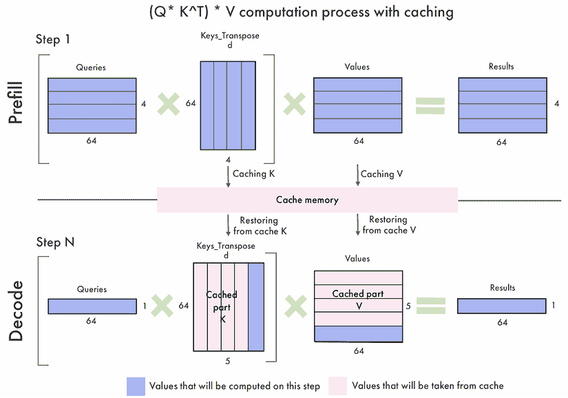

图 8.2 – KV 缓存的说明

当生成新标记时，只需要计算并添加到缓存中该单个标记的键和值。KV 缓存是每个流行工具和库中实施的即时优化。一些实现为模型的每一层维护一个单独的 KV 缓存。

KV 缓存的大小与标记数（）和几个模型维度成比例，如层数（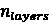）、注意力头数（）、它们的维度（）以及参数的精度（以字节为单位）（）：


对于一个典型的 7B 参数模型，使用 16 位精度，对于高序列长度（高于 2,048 个标记），这超过了 2 GB。具有更多层和更高嵌入维度的更大模型将看到更大的内存需求。

由于 KV 缓存随着每个生成步骤的增长而增长且是动态的，它阻止了你利用 torch.compile，这是一个强大的优化工具，可以将 PyTorch 代码融合到快速和优化的内核中。*静态 KV 缓存*通过预先分配 KV 缓存大小到最大值来解决这个问题，这允许你将其与`torch.compile`结合使用，在正向传递中实现高达 4 倍的速度提升。

要配置模型使用 transformers 库中的静态 KV 缓存，请按照以下步骤操作：

1.  我们导入标记化器和我们要优化的模型：

    ```py
    import torch
    from transformers import AutoTokenizer, AutoModelForCausalLM
    model_id = "google/gemma-2b-it"
    tokenizer = AutoTokenizer.from_pretrained(model_id) 
    model = AutoModelForCausalLM.from_pretrained(model_id, device_map="auto") 
    ```

1.  要实现静态缓存，我们将模型生成配置中的缓存实现更改为`static`：

    ```py
    model.generation_config.cache_implementation = "static" 
    ```

1.  现在 KV 缓存是静态的，我们可以使用 torch.compile 编译模型：

    ```py
    compiled_model = torch.compile(model, mode="reduce-overhead", fullgraph=True) 
    ```

1.  我们对输入问题进行标记化，“`2+2 等于多少？`"，并在可用的 GPU 上存储它（如果不可用，我们将其存储在 CPU 上）：

    ```py
    device = "cuda" if torch.cuda.is_available() else "cpu"
    inputs = tokenizer("What is 2+2?", return_tensors="pt").to(device) 
    ```

1.  让我们使用`generate()`方法获取模型的输出，并用`batch_decode()`解码以打印其答案：

    ```py
    outputs = model.generate(**inputs, do_sample=True, temperature=0.7, max_new_tokens=64)
    print(tokenizer.batch_decode(outputs, skip_special_tokens=True))
    **[****'What is 2+2?\n\nThe answer is 4\. 2+2 = 4.'****]** 
    ```

这返回一个包含输入和输出的列表，正确回答了我们的问题。

注意，静态缓存并不适用于所有架构。有关支持哪些架构的详细信息，请查看 transformers 文档。

有效管理 KV 缓存至关重要，因为它可以快速耗尽可用的 GPU 内存并限制可以处理的批处理大小。这促使开发了内存高效的注意力机制和其他技术，我们将在最后一节中介绍。

## 连续批处理

批处理，或同时处理多个推理请求，是实现高吞吐量的标准方法。较大的批处理大小可以分散模型权重的内存成本，并一次性传输更多数据到 GPU，更好地饱和其并行计算能力。

然而，仅解码器模型由于输入提示长度和期望输出长度的极高可变性而带来特定的挑战。一些请求可能有简短的提示并且只需要一个单词的回答，而其他请求可能输入一个冗长的上下文并期望多段落的响应。

在传统的批处理中，我们必须等待批处理中请求的最长时间完成，然后才能开始新的批处理。这导致加速器部分空闲，等待拖沓的请求完成，从而造成低效。**连续批处理**，也称为**飞行中批处理**，旨在通过在请求完成时立即将新的请求喂入批处理来防止空闲时间。

批处理过程开始时相同——通过填充初始请求。但是，一旦一个请求完成其生成，它就会被从批处理中移除，一个新的请求取而代之。这样，加速器始终在处理一个完整的批处理，从而实现最大化的硬件利用率。另一个需要考虑的因素是需要定期暂停生成过程以运行预填充，即等待请求的嵌入和编码。在生成和预填充之间找到最佳平衡需要调整等待-服务比率超参数。

连续批处理在大多数推理框架中是原生实现的，例如 Hugging Face 的**文本生成推理**（**TGI**）、vLLM 和 NVIDIA TensorRT-LLM。

## 推测解码

另一种强大的优化技术是**推测解码**，也称为辅助生成。关键洞察是，即使在连续批处理中，按标记逐个生成的过程也无法充分利用加速器的并行处理能力。推测解码旨在使用这种额外的计算能力同时预测多个标记，使用较小的代理模型（见*图 8.3*）。


图 8.3 – 传统解码（左）和推测解码（右）的示意图

通用方法是：

+   应用一个较小的模型，例如主模型的蒸馏或剪枝版本，以并行预测多个标记补全。这可能是单步预测 5-10 个标记。

+   将这些推测补全输入到完整模型中，以验证哪些预测与大型模型生成的结果相匹配。

+   保留推测补全中最长的匹配前缀，并丢弃任何错误的标记。

结果是，如果小模型很好地近似大模型，可以在单步中生成多个标记。这避免了多次迭代运行昂贵的大型模型。加速的程度取决于小模型预测的质量——90%的匹配可能导致 3-4 倍的速度提升。

确保两个模型使用相同的分词器至关重要。如果不是这样，草稿模型生成的标记将不会与大型模型产生的标记对齐，使它们不兼容。让我们使用 transformers 库来实现这一点。在这个例子中，我们将使用来自阿里巴巴云的两个 Qwen1.5 模型：一个 1.8B 版本作为主模型，一个 0.5B 版本作为草稿模型。注意，如果您有足够的 VRAM，您可以使用更大的模型，如 14B、32B、72B 或 110B 作为主模型。

在这里，我们受限于 Google Colab 中 T4 GPU 的 VRAM，但要获得最大的加速效果，辅助模型应该远小于大型模型。

下面是实现推测性解码的逐步指南：

1.  我们加载了分词器和两个模型：

    ```py
    import torch
    from transformers import AutoTokenizer, AutoModelForCausalLM
    model_id = "Qwen/Qwen1.5-1.8B-Chat"
    tokenizer = AutoTokenizer.from_pretrained(model_id) 
    model = AutoModelForCausalLM.from_pretrained(model_id, device_map="auto")
    draft_model = AutoModelForCausalLM.from_pretrained("Qwen/Qwen1.5-0.5B-Chat", device_map="auto") 
    ```

1.  然后，我们将相同的输入进行分词并存储在加速器中，如果有的话：

    ```py
    device = "cuda" if torch.cuda.is_available() else "cpu"
    inputs = tokenizer("What is 2+2?", return_tensors="pt").to(device) 
    ```

1.  我们现在可以使用 `model.generate()` 并带有 `assistant_model` 参数来启用推测性解码：

    ```py
    outputs = model.generate(**inputs, do_sample=True, assistant_model=draft_model, temperature=0.7, max_new_tokens=64)
    print(tokenizer.batch_decode(outputs, skip_special_tokens=True))
    **[****'What is 2+2? 2 + 2 equals 4!'****]** 
    ```

在这个小型示例中，加速效果并不显著，但使用更大的模型时，这种加速效果是明显可感知的。

*提示查找解码* 是一种推测性解码的变体，适用于输入与输出有重叠的任务，如摘要。在这里，共享的 n-gram 被用作 LLM 的候选标记。我们可以通过在 `model.generate()` 中使用 `prompt_lookup_num_tokens` 参数来启用提示查找解码：

```py
outputs = model.generate(**inputs, prompt_lookup_num_tokens=4) 
```

通过结合静态 KV 缓存、使用 torch.compile 实现连续批处理以及利用推测性解码技术，LLMs 可以在质量不受损失的情况下看到 2-4 倍或更多的推理速度提升。

创建小型代理模型的另一种方法是与大型模型联合微调一个小型模型，以实现最大的保真度。这里的一个代表性技术是 Medusa，它将专门的推测头插入到主模型中。Medusa-1 方法在冻结大型模型的同时微调这些推测头，而 Medusa-2 方法联合微调推测头和大型模型。Medusa 方法已经展示了令人印象深刻的结果，使一个 70M 参数的模型能够在一系列任务上接近一个 7B 参数模型的性能。推测性解码在 TGI 中原生支持。

## 优化的注意力机制

Transformer 架构基于注意力机制，其复杂度与输入标记数（或序列长度）的平方成正比。这对于较长的序列来说尤其低效，因为 KV 缓存的大小可能会急剧增加。

Kwon、Li 等人（2023）提出的 *PagedAttention* 通过从操作系统的虚拟内存和分页中汲取灵感来解决这些内存挑战。它将 KV 缓存划分为块，消除了对连续内存分配的需求。每个块包含一定数量的标记的键和值。在注意力计算过程中，PagedAttention 内核有效地检索这些块，无论它们的物理内存位置如何。

这种分区可以实现接近最优的内存利用率。这对于将更多序列一起批处理很有用，这增加了吞吐量和 GPU 利用率。此外，`PagedAttention`的基于块的策略自然支持来自同一提示的多个输出序列之间的内存共享。这在并行采样和 beam search 中特别有利，因为在这些情况下，使用相同的提示生成多个输出。共享的内存块减少了冗余计算和内存使用，根据作者的说法，内存开销减少了高达 55%，吞吐量提高了高达 2.2 倍。vLLM 库首先实现了 PagedAttention。从那时起，PagedAttention 也已在 TGI 和 TensorRT-LLM 中得到实现。

另一个流行的选项是*FlashAttention-2*。由 Tri Dao（2023）开发，它引入了几个旨在解决传统注意力中二次运行时间和内存约束的关键创新。通过将输入和输出矩阵划分为更小的块，FlashAttention-2 确保这些块可以适应 GPU 的片上 SRAM，这比高带宽内存要快得多。这种方法显著减少了 GPU 主内存与其处理单元之间数据传输的频率。

这与在线 softmax 相结合，它独立地为注意力分数矩阵的每个块计算 softmax 函数，而不是一次性计算整个矩阵。通过维护指数的运行最大值和运行总和，FlashAttention-2 可以在不存储大型中间矩阵的情况下计算注意力概率。

此外，FlashAttention-2 的在线 softmax 计算允许块级处理，在保持准确性的同时显著降低内存需求。这对于训练尤为重要，因为在反向传播中重新计算中间值（而不是存储它们）可以将内存使用从与序列长度成二次关系降低到线性关系。

与 PagedAttention 不同，FlashAttention-2 可以通过`attn_implementation`参数轻松地与 transformers 库一起使用：

1.  使用`--no-build-isolation`安装`flash-attn`库，这样我们就不需要安装依赖项：

    ```py
    pip install flash-attn --no-build-isolation 
    ```

1.  要使用 FlashAttention-2 进行推理，在加载模型时在`attn_implementation`参数中指定`flash_attention_2`。例如，这是如何使用 FlashAttention-2 加载 Mistral-7B-Instruct-v0.3 的示例：

    ```py
    from transformers import AutoModelForCausalLM
    model = AutoModelForCausalLM.from_pretrained(
        "mistralai/Mistral-7B-Instruct-v0.3",
        attn_implementation="flash_attention_2",
    ) 
    ```

本节中介绍的技术主要集中在提高模型处理令牌的效率。在下一节中，我们将讨论如何将我们的模型和计算分布到多个 GPU 上。

# 模型并行化

模型并行化允许您将 LLM 的内存和计算需求分布到多个 GPU 上。这使得训练和推理那些无法适应单个设备的模型成为可能，同时也在吞吐量（每秒令牌数）方面提高了性能。

模型并行有三种主要方法，每种方法都涉及以不同的方式分割模型权重和计算：*数据并行*、*流水线并行*和*张量并行*。

尽管这些方法最初是为训练开发的，但我们可以通过仅关注正向传递来重新用于推理。

## 数据并行

**数据并行**（**DP**）是最简单的一种模型并行方式。它涉及复制模型并在不同的 GPU 上分配这些副本（参见*图 8.4*）。每个 GPU 同时处理数据的一个子集。在训练过程中，每个 GPU 上计算的梯度被平均并用于更新模型参数，确保每个副本保持同步。这种方法在批大小太大而无法适应单个机器或旨在加快训练过程时特别有益。

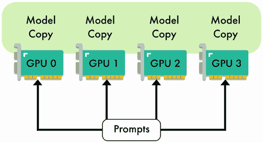

图 8.4 – 使用四个 GPU 的数据并行示意图

在推理过程中，DP（数据并行）可以用于处理并发请求。通过将工作负载分配到多个 GPU 上，这种方法有助于降低延迟，因为可以同时处理多个请求。这种并发处理也提高了吞吐量，因为可以同时处理更多的请求。

然而，DP 的有效性受到模型大小和 GPU 之间通信开销的限制。实际上，在每个 GPU 上复制模型参数是不高效的。这意味着这种技术仅在模型足够小，可以适应单个 GPU 时才有效，从而为输入数据留下较少的空间，从而限制了批大小。对于更大的模型或当内存成为限制时，这可能是一个重大的缺点。

通常，DP 主要用于训练，而流水线和张量并行则更适用于推理。

## 流水线并行

由 Huang 等人于 2019 年在 GPipe 论文中引入的**流水线并行**（**PP**）是一种将训练和运行大型神经网络的计算负载分配到多个 GPU 的策略。

与在传统 DP 中在每个 GPU 上复制整个模型不同，流水线并行将模型的层分配到不同的 GPU 上。这种方法允许每个 GPU 处理模型的一个特定部分，从而减轻了单个 GPU 的内存负担。


图 8.5 – 使用四个 GPU 的流水线并行示意图

如*图 8.5*所示，在典型的四路管道并行分割中，模型被分为四个部分，每个部分分配给不同的 GPU。模型的前 25%层可能由 GPU 1 处理，接下来的 25%由 GPU 2 处理，依此类推。在正向传递过程中，激活被计算然后传递到下一个 GPU。对于训练，反向传递遵循类似的顺序，但方向相反，梯度通过 GPU 反向传播。GPU 的数量通常被称为并行度。

管道并行化的主要优势在于其能够显著降低每个 GPU 的内存需求。然而，这种方法引入了新的挑战，尤其是与管道的顺序性质相关的问题。其中一个主要问题是“管道气泡”的出现。这些气泡发生在某些 GPU 空闲，等待前一层激活时。这种空闲时间可能会降低整个过程的效率。

微批处理是为了减轻管道气泡的影响而开发的。通过将输入批次分成更小的子批次，微批处理确保 GPU 保持忙碌，因为下一个子批次可以在前一个子批次完全完成之前开始处理。


图 8.6 – 微批处理管道并行的示意图。

*图 8.6*展示了带有微批处理的管道并行化示例。在这个例子中，管道有四个阶段（**F0**、**F1**、**F2**、**F3**），输入批次被分为四个微批次。GPU 0 将依次处理正向路径**F0**，0、**F0**，1、**F0**，2 和**F0**，3。一旦**F0**，0 完成，GPU 1 可以立即开始处理**F1**，0，依此类推。完成这些正向传递后，GPU 0 等待其他 GPU 完成各自的正向计算，然后开始反向路径（**B0**，3、**B0**，2、**B0**，1 和**B0**，0）。

管道并行化在分布式训练框架如 Megatron-LM、DeepSpeed (ZeRO)和 PyTorch 中通过专门的**PyTorch 管道并行化库**（**PiPPy**）实现。在撰写本文时，只有某些推理框架如 TensorRT-LLM 支持管道并行化。

## 张量并行化

由 Shoeby、Patwary、Puri 等人于 2019 年在 Megatron-LM 论文中提出，**张量并行化**（**TP**）是另一种流行的技术，用于将 LLM 层的计算分布在多个设备上。与管道并行化不同，TP 将单个层中找到的权重矩阵分割。这允许同时计算，显著减少内存瓶颈并提高处理速度。

在 TP 中，大型矩阵，如 MLP 中的权重矩阵或自注意力层中的注意力头，被分配到多个 GPU 上。每个 GPU 持有这些矩阵的一部分，并在其相应的切片上进行计算。


图 8.7 – MLP 层中列向张量并行化的示意图（W）

例如，在一个 MLP 层中，权重矩阵被分割，使得每个 GPU 只处理权重的一个子集（参见*图 8.7*）。输入被广播到所有 GPU，然后它们独立地计算各自的输出。然后通过 all-reduce 操作聚合部分结果，将它们组合成最终的输出。

在自注意力层的上下文中，TP 由于注意力头固有的并行性而特别高效。每个 GPU 可以独立计算这些头的一部分，这使得模型能够更有效地处理长序列。这使得 TP 比需要等待前一层完成的管道并行化更高效。

尽管 TP 具有优势，但它并不适用于神经网络的所有层。像 LayerNorm 和 Dropout 这样的层，其依赖关系跨越整个输入，无法有效地分区，通常会在设备之间复制。然而，这些操作可以在输入序列的序列维度上拆分（序列并行化）。不同的 GPU 可以在输入序列的不同切片上计算这些层，避免权重的复制。这项技术仅限于少数特定层，但它可以为非常大的输入序列长度提供额外的内存节省。

此外，TP 需要在设备之间实现高速互连以最小化通信开销，这使得在互连带宽不足的节点上实现变得不切实际。

TP 也被实现于分布式训练框架中，如 Megatron-LM、DeepSpeed (ZeRO)和 PyTorch (FSDP)。它在大多数推理框架中都是可用的，如 TGI、vLLM 和 TensorRT-LLM。

## 组合方法

数据、张量和平行化是可组合的正交技术。*图 8.8*展示了如何根据每种方法将给定的模型进行拆分：


图 8.8 – 不同模型并行化技术的示意图

结合这些技术可以缓解它们各自的问题。管道并行化提供了最大的内存减少，但牺牲了效率，因为存在管道气泡。如果主要约束适合 GPU 内存中的模型，这可能是一个理想的选择。相反，如果低延迟至关重要，那么优先考虑张量并行化并接受更大的内存占用可能是一个更好的权衡。在实践中，模型可能被深度拆分为几个管道阶段，每个阶段使用张量并行化。

平衡这些权衡并映射给定的模型架构到可用的硬件加速器是部署大型语言模型（LLMs）的一个关键挑战。

# 模型量化

量化是指使用低精度数据类型来表示神经网络权重和激活的过程。在 LLMs 的上下文中，量化主要关注降低模型权重和激活的精度。

默认情况下，权重通常以 16 位或 32 位浮点格式（FP16 或 FP32）存储，这提供了高精度，但代价是增加了内存使用和计算复杂性。量化是一种减少内存占用并加速 LLMs 推理的解决方案。

除了这些好处外，当量化到 2 位或 3 位精度时，超过 300 亿参数的大型模型在质量方面可以优于较小的模型（7B–13B LLMs）。这意味着它们可以在保持可比内存占用的情况下实现更优越的性能。

在本节中，我们将介绍量化的概念、GGUF 与`llama.cpp`、GPTQ 和 EXL2，以及额外技术的概述。除了本节中提供的代码外，您还可以参考 AutoQuant ([bit.ly/autoquant](https://bit.ly/autoquant))，使用 Google Colab 笔记本量化他们的模型。

## 量化简介

权重量化的主要有两种方法：**训练后量化**（**PTQ**）和**量化感知训练**（**QAT**）。PTQ 是一种直接将预训练模型的权重转换为低精度格式而不进行任何重新训练的直接技术。虽然 PTQ 易于实现，但它可能会导致一些性能下降。相反，QAT 在训练或微调阶段进行量化，允许模型适应低精度权重。与 PTQ 相比，QAT 通常能提供更好的性能，但需要额外的计算资源和代表性的训练数据。

数据类型的选择在量化中起着至关重要的作用。在深度学习中，浮点数，如**FP32**、**FP16**（半精度）和**BF16**（脑浮点），被广泛使用。这些格式为表示数字的`符号`、`指数`和`尾数`（尾数）分配了固定数量的位。


图 8.9 – FP32、FP16 和 BF16 格式的比较

0 的符号表示正数，而 1 表示负数。相反，指数控制表示的范围（大或小）。最后，尾数控制数字的精度（数字的位数）。将这些表示转换为实数的公式是：


*图 7.7*中显示的数据类型展示了不同的权衡，如图（）的不同表示所示。FP32 使用 32 位，提供高精度，但也需要更多的内存。相反，FP16 和 BF16 使用 16 位，降低了内存占用，但精度较低。通常，神经网络更喜欢更大的范围而不是更高的精度，这就是为什么当硬件支持时，BF16 是最受欢迎的数据类型。例如，NVIDIA 的 Ampere 架构（A100、A30 等）支持 BF16，但之前的 Turing（T4、T40 等）不支持。

然而，我们并不局限于这三种数据类型。可以使用低精度数据类型，如 INT8（8 位整数），进行量化，进一步减少内存占用。简单的量化技术，如*绝对最大值（absmax）量化*和*零点量化*，可以将`FP32`、`FP16`或`BF16`权重转换为`INT8`，如图*图 8.10*所示：

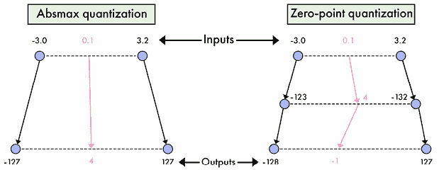

图 8.10 – 使用 absmax 量化和零点量化在[-3.0, 3.2]范围内的 0.1 量化

Absmax 量化将原始权重映射到范围[-127, 127]，通过除以的绝对最大值并对其进行缩放：

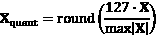

例如，如果我们的绝对最大值是 3.2（见*图 8.8*），则权重 0.1 将被量化为。为了去量化它，我们执行逆操作：


这意味着如果我们去量化我们的权重，我们将获得。在这个例子中，我们可以看到一个舍入误差。在 Python 中，我们可以使用 PyTorch 库如下实现：

```py
import torch
def absmax_quantize(X):
    # Calculate scale
    scale = 127 / torch.max(torch.abs(X))
    # Quantize
    X_quant = (scale * X).round()
    return X_quant.to(torch.int8) 
```

另一方面，零点量化考虑了非对称输入分布，并通过引入零点偏移将权重映射到范围[-128, 127]：

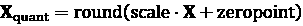

其中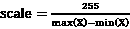和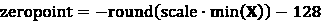。

如果我们用相同的例子，权重为 0.1，我们得到一个缩放因子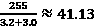和一个零点值。权重 0.1 将被量化为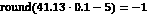，而不是由 absmax 提供的值。

我们可以通过应用逆操作轻松地获得去量化：

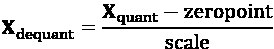

在 Python 中，零点量化可以如下实现：

```py
def zeropoint_quantize(X):
    # Calculate value range (denominator)
    x_range = torch.max(X) - torch.min(X)
    x_range = 1 if x_range == 0 else x_range
    # Calculate scale
    scale = 255 / x_range
    # Shift by zero-point
    zeropoint = (-scale * torch.min(X) - 128).round()
    # Scale and round the inputs
    X_quant = torch.clip((X * scale + zeropoint).round(), -128, 127)

    return X_quant.to(torch.int8) 
```

然而，简单的量化方法存在局限性，尤其是在处理 LLMs 中的*异常特征*时。异常特征是极端的权重值（占总值的约 0.1%），它们可以显著影响量化过程，导致其他值的精度降低。

丢弃这些异常值是不可行的，因为这会降低模型的表现。您可以在*图 8.11*中看到异常值的示例：


图 8.11 – 权重矩阵中异常值的示例

为了解决异常值问题，已经提出了更先进的量化技术。一个值得注意的例子是 Dettmers 等人（2022）引入的`LLM.int8()`。`LLM.int8()`采用混合精度量化方案，其中异常特征使用 FP16 处理，而其余值量化为 INT8。这种方法有效地将 LLM 的内存占用减少了近 2 倍，同时最大限度地减少了性能下降。

`LLM.int8()`通过三个步骤执行矩阵乘法。首先，它使用自定义阈值从输入隐藏状态中提取包含异常特征列。其次，它对异常值（在`FP16`中）和非异常值（在`INT8`中）执行单独的矩阵乘法，使用向量量化。最后，它对非异常结果进行反量化，并将它们与异常结果合并，以获得最终的*FP16*输出。

`LLM.int8()`的有效性已经通过实证研究得到证明，与原始的`FP32`模型相比，性能下降可忽略不计（<1%）。然而，它确实引入了额外的计算开销，导致大型模型的推理速度大约慢 20%。可以使用 transformer 库直接以 8 位精度加载模型，使用`LLM.int8()`，如下所示：

```py
from transformers import AutoModelForCausalLM
model_name = "meta-llama/Meta-Llama-3-8B-Instruct"
model = AutoModelForCausalLM.from_pretrained(model_name, device_map="auto", load_in_8bit=True) 
```

由*Dettmers 等人*（2023）引入的 NF4 是一种 4 位精度格式，专为 QLoRA（在第五章中讨论）设计。它还集成到 transformers 库中，但需要 bitsandbytes 库作为依赖项。要加载 NF4（4 位精度）模型，可以使用`load_in_4bit`参数，如下所示：

```py
from transformers import AutoModelForCausalLM
model_name = "meta-llama/Meta-Llama-3-8B-Instruct"
model = AutoModelForCausalLM.from_pretrained(model_name, device_map="auto", load_in_4bit=True) 
```

## 使用 GGUF 和 llama.cpp 进行量化

llama.cpp 项目是由 Georgi Gerganov 创建的开源 C++软件库，旨在使用各种 LLM 进行推理。它是最受欢迎的量化技术，Hugging Face Hub 上有许多量化模型可用。

与依赖于特定硬件的封闭源库（如 CUDA）的其他库相比，llama.cpp 可以在更广泛的硬件上运行。它在没有专用硬件的用户中获得了显著的流行，因为它可以在 CPU 和 Android 设备上运行。此外，llama.cpp 还可以将层卸载到 GPU，加速推理速度。它与不同的推理优化技术兼容，如 FlashAttention-2 和推测性解码。

该项目具有自己的量化格式，GGUF，旨在简化并加快模型加载。GGUF 文件存储张量和元数据，支持从 1 位到 8 位精度的各种格式。它遵循基于使用的位数和特定变体的命名约定，例如：

+   `IQ1_S` 和 `IQ1_M`: 1 位精度 - 非常低质量

+   `IQ2_XXS/XS/S/M` 和 `Q2_K`: 2 位精度 - 通常质量较低，但 IQ2 可以用于大型模型

+   `IQ3_XXS/XS/S/M` 和 `Q3_K_S/M/L`: 3 位精度 - 质量较低，但可用于大型模型

+   `IQ4_XS/NL` 和 `Q4_K_S/M, Q4_0/1`: 4 位精度 - 良好质量，适用于大多数模型

+   `Q5_K_S/M` 和 `Q5_0/1`: 5 位精度 - 高质量

+   `Q6_K`: 6 位精度 - 非常高质

+   `Q8_0`: 8 位精度 - 最高质量

为了简要概述 GGUF 量化，llama.cpp 将值分组到块中，并将它们四舍五入到更低的精度。例如，传统的 Q4_0 格式处理每个块 32 个值，根据块中最大的权重值进行缩放和量化（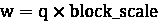）。在 Q4_1 中，还添加了块中最小的 L 值（）。在 Q4_K 中，权重被分成超块，每个超块包含 8 个块，每个块有 32 个值。块缩放和最小值也以 6 位更高的精度进行量化（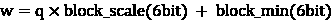）。最后，i-quants 如 IQ4_XS 受到另一种称为 QuIP#的量化技术的启发。这确保了在每组八个中正（或负）量化符号的数量是偶数，并实现了晶格来存储它们的幅度。

这里是一个如何在 GGUF 格式中量化模型的实际示例。以下步骤可以在 Google Colab 中的免费 T4 GPU 上执行：

1.  安装 llama.cpp 和所需的库：

    ```py
    !git clone https://github.com/ggerganov/llama.cpp
    !cd llama.cpp && git pull && make clean && LLAMA_CUBLAS=1 make
    !pip install -r llama.cpp/requirements.txt 
    ```

1.  下载模型进行转换。我们将从 Hugging Face Hub 提供模型 ID - 例如，`mistralai/Mistral-7B-Instruct-v0.2`：

    ```py
    MODEL_ID = "mlabonne/EvolCodeLlama-7b"
    MODEL_NAME = MODEL_ID.split('/')[-1]
    !git lfs install
    !git clone https://huggingface.co/{MODEL_ID} 
    ```

1.  首先，我们将模型转换为 FP16。这是一个中间工件，将被用于所有 GGUF 量化类型。请注意，llama.cpp 中存在不同的转换脚本，并且与不同的模型兼容：

    ```py
    fp16 = f"{MODEL_NAME}/{MODEL_NAME.lower()}.fp16.bin"
    !python llama.cpp/convert.py {MODEL_NAME} --outtype f16 --outfile {fp16} 
    ```

1.  我们选择一个格式（这里，`Q4_K_M`）并开始量化。这个过程在 T4 GPU 上可能需要一个小时：

    ```py
    METHOD = "q4_k_m"
    qtype = f"{MODEL_NAME}/{MODEL_NAME.lower()}.{method.upper()}.gguf"
    !./llama.cpp/quantize {fp16} {qtype} {METHOD} 
    ```

1.  一旦完成，你的量化模型就准备好了。你可以将其下载到本地，或者使用以下代码将其上传到 Hugging Face Hub：

    ```py
    from huggingface_hub import create_repo, HfApi
    hf_token = "" # Specify your token
    username = "" # Specify your username
    api = HfApi()
    # Create empty repo
    create_repo(
        repo_id = f"{username}/{MODEL_NAME}-GGUF",
        repo_type="model",
        exist_ok=True,
        token=hf_token
    )
    # Upload gguf files
    api.upload_folder(
        folder_path=MODEL_NAME,
        repo_id=f"{username}/{MODEL_NAME}-GGUF",
        allow_patterns=f"*.gguf",
        token=hf_token
    ) 
    ```

GGUF 模型可以与 llama-cpp-python 等后端以及 LangChain 等框架一起使用。如果你想要将量化模型集成到一个更广泛系统中，这将非常有用。你也可以直接使用前端与模型进行聊天，例如 llama.cpp 的轻量级服务器、LM Studio 和文本生成 Web UI。这些工具使得与 GGUF 模型交互变得简单，提供类似于 ChatGPT 的体验。

## 使用 GPTQ 和 EXL2 进行量化

虽然 GGUF 和 llama.cpp 提供了带 GPU 卸载的 CPU 推理，但 GPTQ 和 EXL2 是两种针对 GPU 的量化格式。这使得它们在推理时都比 llama.cpp 快。特别是，EXL2 通过其专用库 ExLlamaV2 提供了最高的吞吐量。

GPTQ 和 EXL2 量化器基于 Frantar 等人（2023 年）提出的 GPTQ 算法。它通过细化**最优脑量化**（**OBQ**）方法来优化 LLM 的权重量化，以高效处理大量矩阵。它从 Hessian 逆矩阵的 Cholesky 分解开始，确保数值稳定性。GPTQ 不是严格按照顺序量化权重，而是将它们分批处理，迭代更新列和相关块。这种方法利用了懒惰批更新，减少了计算冗余和内存瓶颈。

虽然 GPTQ 限制在 4 位精度，但 EXL2 提供了高度可定制的精度，可以混合不同的量化级别。这允许每个权重之间精确的比特率在 2 到 8 位之间，例如`2.3`、`3.5`或`6.0`。它还可以将多个量化级别应用于每个线性层，优先考虑更高位量化的重要权重。参数通过多次量化每个矩阵并选择一个组合来选择，该组合在满足目标比特率的同时最小化量化错误。在实践中，这允许 70B 模型在单个 24GB GPU 上以 2.55 位精度运行。

推理本身由支持 GPTQ 和 EXL2 模型的 ExLlamaV2 库处理。

在以下示例中，让我们使用 ExLlamaV2 以 EXL2 格式量化一个模型。这些步骤可以在 Google Colab 中的免费 T4 GPU 上执行：

1.  从源代码安装 ExLlamaV2 库：

    ```py
    !git clone https://github.com/turboderp/exllamav2
    !pip install -e exllamav2 
    ```

1.  通过从 Hugging Face Hub 克隆其 repo 来下载用于量化的模型：

    ```py
    MODEL_ID = "meta-llama/Llama-2-7b-chat-hf"
    MODEL_NAME = MODEL_ID.split('/')[-1]
    !git lfs install
    !git clone https://huggingface.co/{MODEL_ID} 
    ```

1.  下载用于测量量化错误的校准数据集。在这种情况下，我们将使用 WikiText-103，这是一个包含来自维基百科高质量文章的标准校准数据集：

    ```py
    !wget https://huggingface.co/datasets/wikitext/resolve/9a9e482b5987f9d25b3a9b2883fc6cc9fd8071b3/wikitext-103-v1/wikitext-test.parquet 
    ```

1.  在给定的精度下量化模型（例如，4.5）：

    ```py
    !mkdir quant
    !python exllamav2/convert.py \
        -i {MODEL_NAME} \
        -o quant \
        -c wikitext-test.parquet \
        -b 4.5 
    ```

量化模型然后可以上传到 Hugging Face Hub，如前所述。

GPTQ 和 EXL2 量化器不像 GGUF 那样得到广泛支持。例如，LM Studio 等前端目前尚未集成它们。您可以使用其他工具，如 oobabooga 的文本生成 Web UI。它也直接集成到 transformers 库中，并得到 TGI 的支持。GPTQ 模型也支持在 TensorRT-LLM 中。

虽然 GGUF 更受欢迎，但您可以在 Hugging Face Hub 上找到许多 GPTQ 和 EXL2 模型。

## 其他量化技术

除了 GGUF、GPTQ 和 EXL2 之外，还有许多其他量化技术。本小节将简要介绍**激活感知权重量化**（**AWQ**）以及极端量化技术，如 QuIP#（具有失真处理的量化）和 HQQ（半二次量化）。

由 Lin 等人（2023 年）引入的 AWQ 是另一种流行的量化算法。它识别并保护最重要的权重，这些权重是基于激活幅度而不是权重幅度确定的。这种方法涉及对这些显著的权重应用最优的每通道缩放，而不依赖于反向传播或重建，确保 LLM 不会过度拟合校准集。尽管它依赖于不同的范式，但 AWQ 与 GPTQ 和 EXL2 版本相当接近，尽管速度略慢。它们得到了推理引擎的良好支持，并集成到了 TGI、vLLM 和 TensorRT-LLM 中。

一个有趣的趋势是将模型量化为 1 位或 2 位精度。虽然一些格式，如 EXL2，允许极端量化，但模型的品质通常会显著下降。然而，最近的算法如 QuIP#和 HQQ 针对这一领域，并提供了更好地保留原始模型性能的量化方法。这对于大型模型（超过 30B 参数）尤其如此，这些模型最终可能比 7B 或 13B 参数模型占用更少的空间，同时提供更高品质的输出。

预计这一趋势将持续下去，进一步优化这些量化方法。

为了总结本章内容，以下是一个表格，总结了我们在前几节中介绍的三种主要推理引擎的特征：

| **技术** | **TGI** | **vLLM** | **TensorRT-LLM** |
| --- | --- | --- | --- |
| 连续批处理 | ✓ | ✓ | ✓ |
| 推测解码 | ✓ |  |  |
| FlashAttention2 | ✓ | ✓ | ✓ |
| PagedAttention | ✓ | ✓ | ✓ |
| 管道并行性 |  |  | ✓ |
| 张量并行性 | ✓ | ✓ | ✓ |
| GPTQ | ✓ |  | ✓ |
| EXL2 | ✓ |  |  |
| AWQ | ✓ | ✓ | ✓ |

表 8.1 – TGI、vLLM 和 TensorRT-LLM 的特征总结

# 摘要

总结来说，推理优化是有效部署大型语言模型（LLMs）的关键方面。本章探讨了各种优化技术，包括优化的生成方法、模型并行性和权重量化。通过利用预测多个标记与推测解码并行进行等技术，可以实现显著的加速。此外，我们还讨论了模型并行性方法，包括数据、管道和张量并行性，这些方法如何将计算负载分配到多个 GPU 上以提高吞吐量和降低延迟。使用 GGUF 和 EXL2 等格式的权重量化进一步减少了内存占用并加速了推理，尽管在输出质量上有所权衡。

理解和应用这些优化策略对于在 LLM 的实际应用中实现高性能至关重要，例如聊天机器人和代码补全。技术工具的选择取决于具体要求，包括可用的硬件、所需的延迟和吞吐量。通过结合各种方法，如连续批处理和推测性解码，以及高级注意力机制和模型并行性，用户可以定制其部署策略以最大化效率。

在*第四章*中，我们只关注了实现摄取管道，这只是标准 RAG 应用的一个组件。在下一章中，我们将通过实现检索和生成组件并将它们集成到推理管道中来完成 RAG 系统的构建。

# 参考文献

+   Hugging Face, 文本生成推理，[`github.com/huggingface/text-generation-inference`](https://github.com/huggingface/text-generation-inference), 2022.

+   *W. Kwon*, *Z. Li*, *S. Zhuang*, *Y. Sheng*, *L. Zheng*, *C.H. Yu*, *J.E. Gonzalez*, *H. Zhang*, *I. Stoica*, *Efficient Memory Management for Large Language Model Serving with PagedAttention*, *2023*.

+   Nvidia, *TensorRT-LLM*, [`github.com/NVIDIA/TensorRT-LLM`](https://github.com/NVIDIA/TensorRT-LLM), 2023.

+   *Y. Leviathan, M. Kalman, Y. Matias, Fast Inference from Transformers via Speculative Decoding, 2023*.

+   *T. Cai, Y. Li, Z. Geng, H. Peng, J.D. Lee, D. Chen, T. Dao, Medusa: Simple LLM Inference Acceleration Framework with Multiple Decoding Heads, 2024*.

+   *W. Kwon, Z. Li, S. Zhuang, Y. Sheng, L. Zheng, C.H. Yu, J.E. Gonzalez, H. Zhang, I. Stoica, Efficient Memory Management for Large Language Model Serving with PagedAttention, 2023*.

+   *R.Y. Aminabadi, S. Rajbhandari, M. Zhang, A.A. Awan, C. Li, D. Li, E. Zheng, J. Rasley, S. Smith, O. Ruwase, Y. He, DeepSpeed Inference: Enabling Efficient Inference of Transformer Models at Unprecedented Scale, 2022*.

+   *Y. Huang, Y. Cheng, A. Bapna, O. Firat, M.X. Chen, D. Chen, H. Lee, J. Ngiam, Q.V. Le, Y. Wu, Z. Chen, GPipe: Efficient Training of Giant Neural Networks using Pipeline Parallelism, 2019*.

+   *K. James Reed, PiPPy: Pipeline Parallelism for PyTorch*, [`github.com/pytorch/PiPPy`](https://github.com/pytorch/PiPPy), *2022*.

+   *M. Shoeybi, M. Patwary, R. Puri, P. LeGresley, J. Casper, B. Catanzaro, Megatron-LM: Training Multi-Billion Parameter Language Models Using Model Parallelism, 2020.*

+   *Verma and Vaidya, Mastering LLM Techniques: Inference Optimization, NVIDIA 开发者技术博客*, [`developer.nvidia.com/blog/mastering-llm-techniques-inference-optimization/`](https://developer.nvidia.com/blog/mastering-llm-techniques-inference-optimization/), *2023*.

+   *T. Dettmers, M. Lewis, Y. Belkada, L. Zettlemoyer, LLM.int8(): 8-bit Matrix Multiplication for Transformers at Scale, 2022.*

+   *G. Gerganov, llama.cpp*, [`github.com/ggerganov/llama.cpp`](https://github.com/ggerganov/llama.cpp), *2023*.

+   *E. Frantar, S. Ashkboos, T. Hoefler, D. Alistarh, GPTQ: Accurate Post-Training Quantization for Generative Pre-trained Transformers, 2023*.

+   *Tuboderp, exllamav2*, [`github.com/turboderp/exllamav2`](https://github.com/turboderp/exllamav2), *2023*.

+   *J. Lin, J. Tang, H. Tang, S. Yang, W.-M. Chen, W.-C. Wang, G. Xiao, X. Dang, C. Gan, S. Han, AWQ: Activation-aware Weight Quantization for LLM Compression and Acceleration, 2024*.

# 加入我们书籍的 Discord 空间

加入我们社区的 Discord 空间，与作者和其他读者进行讨论：

[`packt.link/llmeng`](https://packt.link/llmeng)


