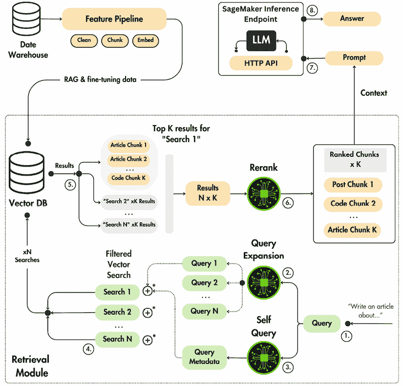
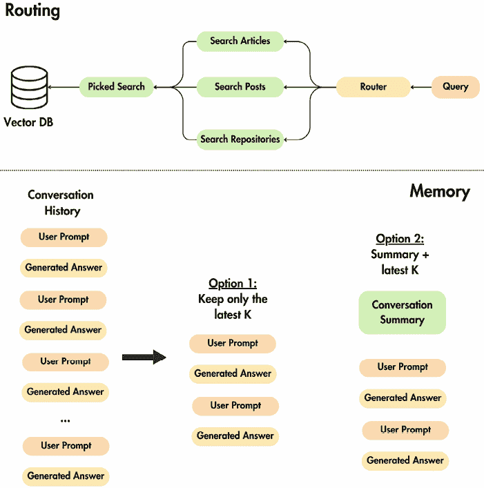

# 第九章：RAG 推理流程

回到第四章，我们实现了**检索增强生成**（**RAG**）特征流程，以填充向量**数据库**（**DB**）。在特征流程中，我们从数据仓库中收集数据，对其进行清理、分块和嵌入文档，最终将它们加载到向量数据库中。因此，到目前为止，向量数据库已经填充了文档，并准备好用于 RAG。

根据 RAG 方法，你可以将你的软件架构分为三个模块：一个用于检索，一个用于增强提示，一个用于生成答案。我们将通过实现一个检索模块来查询向量数据库。在这个模块中，我们将实现高级 RAG 技术来优化搜索。之后，我们不会为增强提示单独设置一个模块，因为这将是过度设计，我们试图避免这种情况。然而，我们将编写一个推理服务，该服务输入用户查询和上下文，构建提示，并调用 LLM 生成答案。总结来说，我们将实现两个核心 Python 模块，一个用于检索，一个用于使用用户的输入和上下文作为输入调用 LLM。当我们把它们粘合在一起时，我们将拥有一个端到端的 RAG 流程。

在第五章和第六章中，我们对我们的 LLM 双胞胎模型进行了微调，在第八章中，我们学习了如何对其进行推理优化。因此，到目前为止，LLM 已经准备好投入生产。剩下的是构建和部署上述两个模块。

我们将在下一章中完全致力于将我们的微调后的 LLM 双胞胎模型部署到 AWS SageMaker，作为 AWS SageMaker 推理端点。因此，本章的重点是深入探讨高级 RAG 检索模块的实现。我们专门用一章来讲述检索步骤，因为这是 RAG 系统中发生魔法的地方。在检索步骤（而不是调用 LLM 时），你将编写大部分 RAG 推理代码。这一步是你必须整理数据以确保从向量数据库中检索到最相关数据点的步骤。因此，大部分高级 RAG 逻辑都包含在检索步骤中。

总结来说，在本章中，我们将涵盖以下主题：

+   理解 LLM 双胞胎的 RAG 推理流程

+   探索 LLM 双胞胎的高级 RAG 技术

+   实现 LLM 双胞胎的 RAG 推理流程

到本章结束时，你将了解如何实现一个高级 RAG 检索模块，使用检索到的上下文增强提示，并调用 LLM 生成最终答案。最终，你将了解如何从头到尾构建一个生产就绪的 RAG 推理流程。

# 理解 LLM 双胞胎的 RAG 推理流程

在实现 RAG 推理管道之前，我们想要讨论其软件架构和高级 RAG 技术。*图 9.1*展示了 RAG 推理流程的概述。推理管道从输入查询开始，使用检索模块（基于查询）检索上下文，并调用 LLM SageMaker 服务生成最终答案。



图 9.1: RAG 推理管道架构

特征管道和检索模块，如*图 9.1*所示，是独立的过程。特征管道在不同的机器上按计划运行，以填充向量数据库。同时，检索模块在推理管道中按需调用，针对每个用户请求。

通过在两个组件之间分离关注点，向量数据库总是填充最新的数据，确保特征的新鲜性，而检索模块可以访问每个请求上的最新特征。RAG 检索模块的输入是用户的查询，基于此，我们必须从向量数据库中返回最相关和相似的数据点，这些数据点将被用来指导 LLM 生成最终答案。

为了完全理解 RAG 推理管道的动态，让我们逐步通过*图 9.1*的架构流程：

1.  **用户查询**: 我们从提出查询的用户开始，例如“写一篇关于...的文章”。

1.  **查询扩展**: 我们扩展初始查询以生成多个查询，这些查询反映了原始用户查询的不同方面或解释。因此，我们不会使用一个查询，而是使用*xN*个查询。通过多样化搜索词，检索模块增加了捕获全面相关数据点的可能性。当原始查询过于狭窄或模糊时，这一步至关重要。

1.  **自我查询**: 我们从原始查询中提取有用的元数据，例如作者的名字。提取的元数据将被用作向量搜索操作的过滤器，从查询向量空间中消除冗余数据点（使搜索更准确和更快）。

1.  **过滤向量搜索**: 我们将每个查询嵌入并执行相似性搜索，以找到每个搜索的前*K*个数据点。我们执行 xN 个搜索，对应于扩展查询的数量。我们称这一步为过滤向量搜索，因为我们利用从自我查询步骤中提取的元数据作为查询过滤器。

1.  **收集结果**: 对于每个搜索操作，我们获取最接近其特定扩展查询解释的*xK*个结果。进一步，我们聚合所有 xN 个搜索的结果，最终得到一个包含文章、帖子、和代码块片段的*N* x *K*结果列表。这些结果包括更广泛的一组可能相关的片段，基于原始查询的不同方面提供多个相关角度。

1.  **重新排序**：为了只保留从*N* x *K*个潜在项目列表中的前*K*个最相关结果，我们必须进一步过滤列表。我们将使用一个重新排序算法，根据相关性和相对于初始用户查询的重要性对每个片段进行评分。我们将利用一个神经交叉编码器模型来计算分数，这是一个介于 0 和 1 之间的值，其中 1 表示结果与查询完全相关。最终，我们将*N* x *K*个结果根据分数排序，并选择前*K*个项目。因此，输出是一个排序的*K*个片段列表，其中最相关的数据点位于顶部。

1.  **构建提示并调用 LLM**：我们将最相关的 K 个片段的最终列表映射到一个用于构建最终提示的字符串。我们使用提示模板、检索到的上下文和用户的查询来创建提示。最终，增强后的提示被发送到 LLM（托管在 AWS SageMaker 上，作为 API 端点暴露）。

1.  **答案**：我们正在等待生成答案。在 LLM 处理提示后，RAG 逻辑通过将生成的响应发送给用户来完成。

这就完成了 RAG 推理管道概述。现在，让我们深入了解细节。

# 探索 LLM 双胞胎的先进 RAG 技术

现在我们已经了解了我们的 RAG 推理管道的整体流程，让我们来探索我们在检索模块中使用的先进 RAG 技术：

+   **预检索步骤**：查询扩展和自我查询

+   **检索步骤**：过滤向量搜索

+   **后检索步骤**：重新排序

在深入探讨每种方法之前，让我们列出我们将在此部分使用的 Python 接口，这些接口可在[`github.com/PacktPublishing/LLM-Engineers-Handbook/blob/main/llm_engineering/application/rag/base.py`](https://github.com/PacktPublishing/LLM-Engineers-Handbook/blob/main/llm_engineering/application/rag/base.py)找到。

第一个是提示模板工厂，它标准化了提示模板的实例化方式。作为一个接口，它继承自`ABC`并公开了`create_template()`方法，该方法返回一个 LangChain `PromptTemplate`实例。即使我们避免过度依赖 LangChain，因为我们想自己实现所有内容以了解背后的工程，但某些对象，如`PromptTemplate`类，有助于加快开发速度，同时不会隐藏太多功能：

```py
from abc import ABC, abstractmethod
from langchain.prompts import PromptTemplate
from pydantic import BaseModel
class PromptTemplateFactory(ABC, BaseModel):
    @abstractmethod
    def create_template(self) -> PromptTemplate:
        pass 
```

我们还希望定义一个`RAGStep`接口，用于标准化高级 RAG 步骤（如查询扩展和自我查询）的接口。由于这些步骤通常依赖于其他 LLM，它有一个`mock`属性，以减少开发过程中的成本和调试时间：

```py
from typing import Any
from llm_engineering.domain.queries import Query
class RAGStep(ABC):
    def __init__(self, mock: bool = False) -> None:
        self._mock = mock
    @abstractmethod
    def generate(self, query: Query, *args, **kwargs) -> Any:
        pass 
```

最终，我们必须了解我们如何对`Query`域实体进行建模，以便用其他所需的高级 RAG 元数据包装用户的输入。因此，让我们看看它的实现。首先，我们导入必要的类：

```py
from pydantic import UUID4, Field
from llm_engineering.domain.base import VectorBaseDocument
from llm_engineering.domain.types import DataCategory 
```

接下来，我们定义了继承自第四章中讨论的`VectorBaseDocument` **对象-向量映射（OVM**）类的`Query`实体类。因此，每个查询都可以轻松地保存或从向量数据库中检索：

```py
class Query(VectorBaseDocument):
    content: str
    author_id: UUID4 | None = None
    author_full_name: str | None = None
    metadata: dict = Field(default_factory=dict)
class Config:
        category = DataCategory.QUERIES 
```

重要的是要注意该类用于将用户的查询与一系列元数据字段组合的属性：

+   `content`：包含输入查询的字符串。

+   `author_id`：从查询中提取的可选 UUID4 标识符，用作向量搜索操作中的过滤器，以检索仅由特定作者编写的块

+   `author_full_name`：用于查询`author_id`的可选字符串

+   `metadata`：用于任何附加元数据的字典，默认初始化为空的`dict`

除了标准定义的域类之外，我们还定义了一个`from_str()`类方法，可以直接从字符串创建`Query`实例。这允许我们标准化在构建`query`对象之前清理查询字符串的方式，例如删除任何前导或尾随空白和换行符：

```py
 @classmethod
    def from_str(cls, query: str) -> "Query":
        return Query(content=query.strip("\n ")) 
```

此外，还有一个名为`replace_content()`的实例方法，用于创建一个新的`Query`实例，其中包含更新的内容，同时保留原始查询的`id`、`author_id`、`author_full_name`和`metadata`：

```py
 def replace_content(self, new_content: str) -> "Query":
        return Query(
            id=self.id,
            content=new_content,
            author_id=self.author_id,
            author_full_name=self.author_full_name,
            metadata=self.metadata,
        ) 
```

这在修改查询文本时特别有用，例如在预处理或归一化过程中，而不会丢失相关的元数据或标识符。在`Query`类之后，我们定义了`EmbeddedQuery`类：

```py
class EmbeddedQuery(Query):
    embedding: list[float]
    class Config:
        category = DataCategory.QUERIES 
```

`EmbeddedQuery`类通过添加嵌入字段扩展了`Query`类。`EmbeddedQuery`实体封装了执行在 Qdrant（或另一个向量数据库）上执行向量搜索操作所需的所有数据和元数据。

现在我们已经理解了 RAG 推理管道中使用的所有接口和新域实体，让我们继续了解我们的高级 RAG 预检索优化技术。

## 高级 RAG 预检索优化：查询扩展和自查询

我们实现了两种方法来优化预检索优化步骤：查询扩展和自查询。这两种方法与过滤向量搜索步骤紧密合作，我们将在下一节中讨论。然而，现在我们将从理解查询扩展的代码开始，然后转向实现自查询。

在这两个方法中，我们将在查询扩展步骤中利用 OpenAI 的 API 生成原始查询的变体，并在自查询算法中提取必要的元数据。当我们编写这本书时，我们在所有示例中都使用了`GPT-4o-mini`，但随着 OpenAI 模型的快速演变，该模型可能会被弃用。但这不是问题，因为您可以通过配置`OPENAI_MODEL_ID`环境变量快速在您的`.env`文件中更改它。

### 查询扩展

在典型的检索步骤中，*问题*在于你使用原始问题的单个向量表示查询你的向量数据库。这种方法只覆盖了嵌入空间的一小部分，这可能有限制。如果嵌入不包含你查询的所有必要信息或细微差别，检索到的上下文可能不相关。这意味着与查询向量语义相关但不在其附近的重要文档可能会被忽略。

*解决方案*基于查询扩展，提供了一种克服这种限制的方法。使用 LLM 根据你的初始问题生成多个查询，你创建了各种视角，以捕捉查询的不同方面。这些扩展查询在嵌入时，针对的是与你的原始问题仍然相关的嵌入空间的其他区域。这增加了从向量数据库检索更多相关文档的可能性。

实现查询扩展可以像编写一个详细的零样本提示来引导 LLM 生成这些替代查询一样简单。因此，在实现查询扩展后，你将不再只有一个查询来搜索相关上下文，而是将有 xN 个查询，因此有 xN 次搜索。

增加搜索次数可能会影响你的延迟。因此，你必须实验性地调整你生成的查询数量，以确保检索步骤满足你的应用需求。你还可以通过并行化搜索来优化搜索，这可以大幅减少延迟，我们将在本章末尾实现的`ContextRetriever`类中这样做。

查询扩展也称为多查询，但其原理是相同的。例如，这是一个 LangChain 实现的多查询检索器的例子，称为`MultiQueryRetriver`：[`python.langchain.com/docs/how_to/MultiQueryRetriever/`](https://python.langchain.com/docs/how_to/MultiQueryRetriever/)

现在，让我们深入代码。我们首先导入查询扩展所需的必要模块和类：

```py
from langchain_openai import ChatOpenAI
from llm_engineering.domain.queries import Query
from llm_engineering.settings import settings
from .base import RAGStep
from .prompt_templates import QueryExpansionTemplate 
```

接下来，我们定义`QueryExpansion`类，该类生成扩展查询版本。类的实现可以在[`github.com/PacktPublishing/LLM-Engineers-Handbook/blob/main/llm_engineering/application/rag/query_expanison.py`](https://github.com/PacktPublishing/LLM-Engineers-Handbook/blob/main/llm_engineering/application/rag/query_expanison.py)找到：

```py
class QueryExpansion(RAGStep):
    def generate(self, query: Query, expand_to_n: int) -> list[Query]:
        assert expand_to_n > 0, f"'expand_to_n' should be greater than 0\. Got {expand_to_n}."
        if self._mock:
            return [query for _ in range(expand_to_n)] 
```

在`generate`方法中，我们首先确保请求的扩展数量（`expand_to_n`）大于零。如果实例处于模拟模式（`self._mock is True`），它将简单地返回一个包含原始查询副本的列表，以模拟扩展而不实际调用 API。如果不处于模拟模式，我们继续创建提示并初始化语言模型：

```py
 query_expansion_template = QueryExpansionTemplate()
        prompt = query_expansion_template.create_template(expand_to_n - 1)
        model = ChatOpenAI(model=settings.OPENAI_MODEL_ID, api_key=settings.OPENAI_API_KEY, temperature=0) 
```

在这里，我们实例化`QueryExpansionTemplate`并创建一个针对生成`expand_to_n - 1`个新查询（不包括原始查询）的定制提示。我们使用指定的设置初始化`ChatOpenAI`模型并将温度设置为 0 以获得确定性输出。然后我们通过将提示与模型结合创建一个 LangChain 链，并用用户的问题调用它：

```py
 chain = prompt | model
        response = chain.invoke({"question": query})
        result = response.content 
```

通过将提示管道输入到模型中（`prompt | model`），我们设置了一个在调用原始查询时生成扩展查询的链。模型的响应被捕获在`result`对象中。在收到响应后，我们解析和清理扩展查询：

```py
 queries_content = result.strip().split(query_expansion_template.separator)
        queries = [query]
        queries += [
            query.replace_content(stripped_content)
            for content in queries_content
            if (stripped_content := content.strip())
        ]
        return queries 
```

我们使用模板中定义的分隔符来分割结果，以获取单个查询。从包含原始查询的列表开始，我们在去除任何额外空格后添加每个扩展查询。

最后，我们定义了`QueryExpansionTemplate`类，该类构建用于查询扩展的提示。该类和其他提示模板可以在[`github.com/PacktPublishing/LLM-Engineers-Handbook/blob/main/llm_engineering/application/rag/prompt_templates.py`](https://github.com/PacktPublishing/LLM-Engineers-Handbook/blob/main/llm_engineering/application/rag/prompt_templates.py)找到：

```py
from langchain.prompts import PromptTemplate
from .base import PromptTemplateFactory
class QueryExpansionTemplate(PromptTemplateFactory):
    prompt: str = """You are an AI language model assistant. Your task is to generate {expand_to_n}
    different versions of the given user question to retrieve relevant documents from a vector
    database. By generating multiple perspectives on the user question, your goal is to help
    the user overcome some of the limitations of the distance-based similarity search.
    Provide these alternative questions separated by '{separator}'.
    Original question: {question}"""
    @property
    def separator(self) -> str:
        return "#next-question#"
    def create_template(self, expand_to_n: int) -> PromptTemplate:
        return PromptTemplate(
            template=self.prompt,
            input_variables=["question"],
            partial_variables={
                "separator": self.separator,
                "expand_to_n": expand_to_n,
            },
        ) 
```

这个类定义了一个提示，指示语言模型生成用户问题的多个版本。它使用像`{expand_to_n}`、`{separator}`和`{question}`这样的占位符来自定义提示。

它接受`expand_to_n`作为输入参数，以定义在构建`PromptTemplate`实例时我们希望生成多少个查询。分隔符属性提供了一个独特的字符串来分割生成的查询。`expand_to_n`和`separator`变量作为`partial_variables`传递，使它们在运行时不可变。同时，`{question}`占位符将在每次调用 LLM 链时更改。

现在我们已经完成了查询扩展实现的研读，接下来让我们看看如何使用`QueryExpansion`类的一个示例。使用以下`python -m llm_engineering.application.rag.query_expansion`命令来运行以下代码：

```py
query = Query.from_str("Write an article about the best types of advanced RAG methods.")
    query_expander = QueryExpansion()
    expanded_queries = query_expander.generate(query, expand_to_n=3)
    for expanded_query in expanded_queries:
        logger.info(expanded_query.content) 
```

我们得到了原始查询的以下变体。如您所观察到的，查询扩展方法成功地提供了更多细节和初始查询的不同视角，例如突出高级 RAG 方法的有效性或这些方法的概述（请记住，第一个查询是原始查询）：

```py
2024-09-18 17:51:33.529 | INFO  - Write an article about the best types of advanced RAG methods.
2024-09-18 17:51:33.529 | INFO  - What are the most effective advanced RAG methods, and how can they be applied?
2024-09-18 17:51:33.529 | INFO  - Can you provide an overview of the top advanced retrieval-augmented generation techniques? 
```

现在，让我们转向下一个预检索优化方法：自查询。

### 自查询

当将查询嵌入到向量空间时遇到的问题是，你不能保证你的用例所需的所有方面都在嵌入向量中有足够的信号。例如，你想要确保你的检索完全依赖于用户输入中提供的标签。不幸的是，你无法控制嵌入中留下的强调标签的信号。仅通过嵌入查询提示，你永远无法确定标签在嵌入向量中得到了充分的表示，或者在与其他向量计算距离时具有足够的信号。

这个问题代表了你希望在搜索过程中展示的任何其他元数据，例如 ID、名称或类别。

*解决方案*是使用自查询来提取查询中的标签或其他关键元数据，并将其与向量搜索一起用作过滤器。自查询使用 LLM 提取对您的业务用例至关重要的各种元数据字段，如标签、ID、评论数、点赞、分享等。之后，您将完全控制提取的元数据在检索过程中的考虑方式。在我们的 LLM Twin 用例中，我们提取作者的名字并将其用作过滤器。自查询与过滤向量搜索协同工作，我们将在下一节中解释。

现在，让我们转向代码。我们首先导入代码所依赖的必要模块和类：

```py
from langchain_openai import ChatOpenAI
from llm_engineering.application import utils
from llm_engineering.domain.documents import UserDocument
from llm_engineering.domain.queries import Query
from llm_engineering.settings import settings
from .base import RAGStep
from .prompt_templates import SelfQueryTemplate 
```

接下来，我们定义了继承自 `RAGStep` 并实现了 `generate()` 方法的 `SelfQuery` 类。该类可以在[`github.com/PacktPublishing/LLM-Engineers-Handbook/blob/main/llm_engineering/application/rag/self_query.py`](https://github.com/PacktPublishing/LLM-Engineers-Handbook/blob/main/llm_engineering/application/rag/self_query.py)找到：

```py
class SelfQuery(RAGStep):
    def generate(self, query: Query) -> Query:
        if self._mock:
            return query 
```

在 `generate()` 方法中，我们检查 `_mock` 属性是否设置为 `True`。如果是，我们将返回未经修改的原始查询对象。这允许我们在测试和调试时绕过调用模型。如果不是模拟模式，我们将创建提示模板并初始化语言模型。

```py
 prompt = SelfQueryTemplate().create_template()
        model = ChatOpenAI(model=settings.OPENAI_MODEL_ID, api_key=settings.OPENAI_API_KEY, temperature=0) 
```

在这里，我们使用 `SelfQueryTemplate` 工厂类实例化提示，并创建一个 `ChatOpenAI` 模型实例（类似于查询扩展实现）。然后我们将提示和模型组合成一个链，并用用户的查询调用它。

```py
 chain = prompt | model
        response = chain.invoke({"question": query})
        user_full_name = response.content.strip("\n ") 
```

我们从 LLM 响应中提取内容，并去除任何前导或尾随空白，以获得 `user_full_name` 值。接下来，我们检查模型是否能够提取任何用户信息。

```py
 if user_full_name == "none":
            return query 
```

如果响应是 `"none"`，则表示查询中没有找到用户名，因此我们返回原始查询对象。如果找到用户名，我们将使用一个实用函数将 `user_full_name` 分割成 `first_name` 和 `last_name` 变量。然后，根据用户的详细信息，我们检索或创建一个 `UserDocument` 用户实例：

```py
 first_name, last_name = utils.split_user_full_name(user_full_name)
        user = UserDocument.get_or_create(first_name=first_name, last_name=last_name) 
```

最后，我们将提取的作者信息更新到查询对象中，并返回它：

```py
 query.author_id = user.id
        query.author_full_name = user.full_name
        return query 
```

更新后的查询现在包含了`author_id`和`author_full_name`值，这些值可以在 RAG 管道的后续步骤中使用。

让我们看看定义提取用户信息的提示的`SelfQueryTemplate`类：

```py
from langchain.prompts import PromptTemplate
from .base import PromptTemplateFactory
class SelfQueryTemplate(PromptTemplateFactory):
    prompt: str = """You are an AI language model assistant. Your task is to extract information from a user question.
    The required information that needs to be extracted is the user name or user id.
    Your response should consist of only the extracted user name (e.g., John Doe) or id (e.g. 1345256), nothing else.
    If the user question does not contain any user name or id, you should return the following token: none.

    For example:
    QUESTION 1:
    My name is Paul Iusztin and I want a post about...
    RESPONSE 1:
    Paul Iusztin

    QUESTION 2:
    I want to write a post about...
    RESPONSE 2:
    none

    QUESTION 3:
    My user id is 1345256 and I want to write a post about...
    RESPONSE 3:
    1345256

    User question: {question}"""
    def create_template(self) -> PromptTemplate:
        return PromptTemplate(template=self.prompt, input_variables=["question"]) 
```

在`SelfQueryTemplate`类中，我们定义了一个提示，指示 AI 模型从输入问题中提取*用户名*或*ID*。该提示使用少量样本学习来指导模型在不同场景下的响应。当模板被调用时，`{question}`占位符将被替换为实际的用户问题。

通过实现自我查询，我们确保了对于我们的用例所必需的关键元数据被明确提取并在检索过程中使用。这种方法克服了仅依赖嵌入语义来捕获查询所有必要方面的局限性。

现在我们已经实现了`SelfQuery`类，让我们提供一个示例。使用`python -m llm_engineering.application.rag.self_query` CLI 命令运行以下代码：

```py
 query = Query.from_str("I am Paul Iusztin. Write an article about the best types of advanced RAG methods.")
    self_query = SelfQuery()
    query = self_query.generate(query)
    logger.info(f"Extracted author_id: {query.author_id}")
    logger.info(f"Extracted author_full_name: {query.author_full_name}") 
```

我们得到了以下结果，其中正确提取了作者的完整姓名和 ID：

```py
2024-09-18 18:02:10.362 | INFO - Extracted author_id: 900fec95-d621-4315-84c6-52e5229e0b96
2024-09-18 18:02:10.362 | INFO - Extracted author_full_name: Paul Iusztin 
```

现在我们已经了解了自我查询的工作原理，让我们探索如何在检索优化步骤中将它与过滤向量搜索结合使用。

## 高级 RAG 检索优化：过滤向量搜索

基于语义相似性检索相关信息是向量搜索的关键。然而，普通的向量搜索可能会引入显著挑战，这些挑战会影响信息检索的准确性和延迟。这主要是因为它仅基于向量嵌入的数值邻近性进行操作，而没有考虑可能对相关性至关重要的上下文或分类细微差别。

普通向量搜索的一个主要问题是检索到语义相似但上下文无关的文档。由于向量嵌入捕获了一般的语义含义，它们可能会将高相似度分数分配给共享语言模式或主题的内容，但这些内容并不符合查询的具体意图或约束。例如，搜索“Java”可能会根据语义相似性检索关于编程语言或印度尼西亚岛屿的文档，导致模糊或误导性的结果。

此外，随着数据集大小的增加，普通向量搜索可能会遇到可扩展性问题。缺乏过滤意味着搜索算法必须在整个向量空间中计算相似度，这可能会显著增加延迟。

这种详尽的搜索会减慢响应时间并消耗更多计算资源，对于实时或大规模应用来说效率低下。

通过过滤额外的标准，如元数据标签或类别，过滤向量搜索成为解决方案，在计算向量相似性之前减少搜索空间。通过应用这些过滤器，搜索算法将潜在结果池缩小到与查询意图上下文一致的结果。这种有针对性的方法通过消除由于语义相似性而被考虑的不相关文档来提高准确性。

此外，通过减少算法需要执行的比较次数，过滤向量搜索提高了延迟。处理更小、更相关的数据子集可以降低计算开销，从而缩短响应时间。这种效率对于需要实时交互或处理大量查询的应用至关重要。

由于过滤向量搜索中使用的元数据通常是用户输入的一部分，我们必须在查询向量数据库之前提取它。这正是我们在自我查询步骤中所做的，我们提取了作者的名字，以将向量空间仅限于作者的内容。因此，当我们处理自我查询步骤中的查询时，它被归类为检索前优化，而当我们过滤向量搜索优化查询时，它被归类为检索优化。

例如，当使用 Qdrant 时，为了在每份文档的元数据中查找匹配的`author_id`，你必须实现以下代码：

```py
from qdrant_client.models import FieldCondition, Filter, MatchValue
records = qdrant_connection.search(
            collection_name="articles",
            query_vector=query_embedding,
            limit=3,
            with_payload=True,
            query_filter= Filter(
                    must=[
                        FieldCondition(
                            key="author_id",
                            match=MatchValue(
                                value=str("1234"),
                            ),
                        )
                    ]
                ),
        ) 
```

从本质上讲，虽然普通向量搜索为语义检索提供了一个基础，但其局限性可能会在实际应用中降低性能。过滤向量搜索通过结合向量嵌入和上下文过滤的优势来解决这些挑战，从而在 RAG 系统中实现更准确和高效的信息检索。优化我们的 RAG 管道的最后一步是考虑重新排序。

## 高级 RAG 检索后优化：重新排序

RAG 系统中*问题*在于检索到的上下文可能包含不相关的片段，这些片段只会：

+   **增加噪声**：检索到的上下文可能是不相关的，这会扰乱信息并可能使语言模型产生混淆。

+   **使提示更大**：包括不必要的片段会增加提示的大小，导致成本更高。此外，语言模型通常偏向于上下文的第一部分和最后一部分。因此，如果你添加了大量上下文，有很大可能会错过本质。

+   **与你的问题不一致**：片段是根据查询与片段嵌入之间的相似性检索的。问题是嵌入模型可能没有针对你的问题进行调整，导致不完全不相关的片段具有很高的相似度评分。

*解决方案*是使用重排序对所有检索到的 N × K 个片段进行排序，根据它们相对于初始问题的相关性，其中第一个片段将是最相关的，最后一个是最不相关的。N 代表查询扩展后的搜索次数，而 K 是每次搜索检索的片段数。因此，我们总共检索了 N x K 个片段。在 RAG 系统中，重排序作为关键的后检索步骤，可以细化从检索模型获得的初始结果。

我们通过应用重排序算法来评估每个片段对原始查询的相关性，该算法通常使用像神经交叉编码器这样的高级模型。这些模型比基于嵌入和余弦相似度距离的初始检索方法更准确地评估查询与每个片段之间的语义相似性，如在第四章中更详细地解释的 *高级 RAG 概述* 部分。

最终，我们根据重排序分数从排序后的 N x K 项中挑选出最相关的 K 个片段。当与**查询扩展**结合使用时，重排序效果良好。首先，让我们了解在没有查询扩展的情况下重排序是如何工作的：

1.  **搜索 > K 个片段**：检索超过 K 个片段，以获得更广泛的潜在相关信息。

1.  **使用重排序重新排序**：将重排序应用于这个更大的集合，以评估每个片段相对于查询的实际相关性。

1.  **选择前 K 个**：选择前 K 个片段，在最终提示中使用它们作为上下文。

因此，当与查询扩展结合使用时，我们从空间中的多个点收集潜在的有价值上下文，而不仅仅是寻找单个位置中的超过 K 个样本。现在流程看起来是这样的：

1.  **搜索 N × K 个片段**：使用扩展查询检索多个片段集。

1.  **使用重排序重新排序**：根据相关性对所有检索到的片段进行重排序。

1.  **选择前 K 个**：选择最相关的片段作为最终提示。

将重排序集成到 RAG 流程中可以增强检索上下文的质量和相关性，并有效地使用计算资源。让我们看看如何实现 LLM Twin 的重排序步骤，以了解我们上面描述的内容，该步骤可以在 GitHub 上找到：[`github.com/PacktPublishing/LLM-Engineers-Handbook/blob/main/llm_engineering/application/rag/reranking.py`](https://github.com/PacktPublishing/LLM-Engineers-Handbook/blob/main/llm_engineering/application/rag/reranking.py)。

我们首先导入重排序过程中所需的必要模块和类：

```py
from llm_engineering.application.networks import CrossEncoderModelSingleton
from llm_engineering.domain.embedded_chunks import EmbeddedChunk
from llm_engineering.domain.queries import Query
from .base import RAGStep 
```

接下来，我们定义 `Reranker` 类，该类负责根据查询的相关性对检索到的文档进行重排序：

```py
class Reranker(RAGStep):
    def __init__(self, mock: bool = False) -> None:
        super().__init__(mock=mock)
        self._model = CrossEncoderModelSingleton() 
```

在 `Reranker` 类的初始化器中，我们通过创建 `CrossEncoderModelSingleton` 的实例来实例化我们的交叉编码器模型。这是用于对每个文档片段相对于查询的相关性进行评分的交叉编码器模型。

`Reranker`类的核心功能在`generate()`方法中实现：

```py
 def generate(self, query: Query, chunks: list[EmbeddedChunk], keep_top_k: int) -> list[EmbeddedChunk]:
        if self._mock:
            return chunks
        query_doc_tuples = [(query.content, chunk.content) for chunk in chunks]
        scores = self._model(query_doc_tuples)
        scored_query_doc_tuples = list(zip(scores, chunks, strict=False))
        scored_query_doc_tuples.sort(key=lambda x: x[0], reverse=True)
        reranked_documents = scored_query_doc_tuples[:keep_top_k]
        reranked_documents = [doc for _, doc in reranked_documents]
        return reranked_documents 
```

`generate()`方法接受一个查询、一个块列表（文档段）以及要保留的前`keep_top_k`个文档数。如果我们处于模拟模式，它将简单地返回原始块。否则，它执行以下步骤：

1.  创建查询内容和每个块内容的对

1.  使用交叉编码器模型对每一对进行评分，评估块与查询的匹配程度

1.  将分数与相应的块进行匹配，创建一个分数列表的元组

1.  根据分数按降序排序此列表

1.  选择前`keep_top_k`个块

1.  从元组中提取块并将它们作为重新排序的文档返回

在定义`CrossEncoder`类之前，我们导入必要的组件：

```py
from sentence_transformers.cross_encoder import CrossEncoder
from .base import SingletonMeta 
```

我们从 sentence_transformers 库中导入`CrossEncoder`类，该库提供了评分文本对的功能。我们还从我们的基础模块中导入`SingletonMeta`，以确保我们的模型类遵循单例模式，这意味着在整个应用程序中只有一个模型实例。现在，我们定义`CrossEncoderModelSingleton`类：

```py
class CrossEncoderModelSingleton(metaclass=SingletonMeta):
    def __init__(
        self,
        model_id: str = settings.RERANKING_CROSS_ENCODER_MODEL_ID,
        device: str = settings.RAG_MODEL_DEVICE,
    ) -> None:
        """
        A singleton class that provides a pre-trained cross-encoder model for scoring pairs of input text.
        """
        self._model_id = model_id
        self._device = device
        self._model = CrossEncoder(
            model_name=self._model_id,
            device=self._device,
        )
        self._model.model.eval() 
```

此类使用从`.env`文件加载的全局`settings`中指定的`model_id`和`device`初始化交叉编码器模型。我们使用`self._model.model.eval()`将模型设置为评估模式，以确保模型已准备好进行推理。

`CrossEncoderModelSingleton`类包含一个可调用的方法来评分文本对：

```py
 def __call__(self, pairs: list[tuple[str, str]], to_list: bool = True) -> NDArray[np.float32] | list[float]:
        scores = self._model.predict(pairs)
        if to_list:
            scores = scores.tolist()
        return scores 
```

`__call__`方法允许我们传入一个包含文本`pairs`（每个包含查询和文档块）的列表，并接收它们的相关性分数。该方法使用模型的`predict()`函数调用模型并计算分数。

`CrossEncoderModelSingleton`类是对`CrossEncoder`类的包装，我们编写它有两个目的。第一个目的是为了单例模式，这使得我们能够轻松地从应用程序的任何地方访问相同的交叉编码器模型实例，而无需每次需要时都将其加载到内存中。第二个原因是，通过编写我们的包装器，我们定义了交叉编码器模型（或用于重新排序的任何其他模型）的接口。这使得代码具有前瞻性，因为如果我们需要不同的实现或策略进行重新排序，例如使用 API，我们只需编写一个遵循相同接口的不同包装器，并用新类替换旧类。因此，我们可以引入新的重新排序方法，而无需触及代码的其他部分。

我们现在理解了架构中使用的所有高级 RAG 技术。在下一节中，我们将检查`ContextRetriever`类，该类连接所有这些方法，并解释如何使用检索模块与 LLM 结合进行端到端的 RAG 推理管道。

# 实现 LLM Twin 的 RAG 推理管道

如本章开头所述，RAG 推理管道主要可以分为三个部分：检索模块、提示创建和答案生成，这归结为调用一个 LLM 并使用增强的提示。在本节中，我们的主要重点是实现检索模块，其中大部分代码和逻辑都在这里。之后，我们将看看如何使用检索到的上下文和用户查询构建最终的提示。

最终，我们将探讨如何结合检索模块、提示创建逻辑和 LLM 来捕获端到端的 RAG 工作流程。不幸的是，我们无法在完成*第十章*之前测试 LLM，因为我们尚未将微调的 LLM Twin 模块部署到 AWS SageMaker。

因此，在本节结束时，你将学习如何实现 RAG 推理管道，你只能在完成*第十章*后才能从头到尾进行测试。现在，让我们先看看检索模块的实现。

## 实现检索模块

让我们深入到`ContextRetriever`类的实现，该类通过整合我们之前使用过的所有高级技术（查询扩展、自我查询、重新排序和过滤向量搜索）来协调我们 RAG 系统中的检索步骤。该类可以在 GitHub 上找到：[`github.com/PacktPublishing/LLM-Engineers-Handbook/blob/main/llm_engineering/application/rag/retriever.py`](https://github.com/PacktPublishing/LLM-Engineers-Handbook/blob/main/llm_engineering/application/rag/retriever.py)。


图 9.2：RAG 检索模块的搜索逻辑

`ContextRetriever` 类的入口函数是 `search()` 方法，它调用本章讨论的所有高级步骤。*图 9.2* 更详细地展示了搜索方法如何将所有用于搜索与用户查询相似结果的步骤粘合在一起。它突出了从自我查询步骤中提取的作者详细信息如何在过滤向量搜索中使用。同时，它还聚焦于搜索操作本身，对于每个查询，我们向向量数据库进行三次搜索，寻找与查询相似的文章、帖子或存储库。对于每次搜索（N 次搜索中的每一次），我们希望检索最多 K 个结果。因此，对于每个数据类别，我们最多检索 K / 3 个条目（因为我们有三个类别）。因此，当汇总时，我们将有一个`≤ K`个块组成的列表。当某个特定数据类别或更多在应用作者过滤器后返回`< K / 3`个条目时（由于缺少该特定作者或数据类别的块），检索到的列表将是`≤ K`（而不是等于 K）。


图 9.3：RAG 检索模块的结果处理流程

*图 9.3*说明了我们如何处理 xN 搜索返回的结果。由于每次搜索返回`≤ K`个项目，我们最终将得到`≤ N x K`个块，我们将它们聚合到一个单独的列表中。由于一些结果可能在搜索者之间重叠，我们必须去重聚合列表以确保每个块是唯一的。最终，我们将结果发送到重排序模型，根据它们的重排序分数进行排序，并选择**最**相关的**K**个块作为 RAG 的上下文。

让我们了解从*图 9.2*和*图 9.3*中的一切如何在`ContextRetriever`类中实现。首先，我们通过设置`QueryExpansion`、`SelfQuery`和`Reranker`类的实例来初始化该类：

```py
class ContextRetriever:
    def __init__(self, mock: bool = False) -> None:
        self._query_expander = QueryExpansion(mock=mock)
        self._metadata_extractor = SelfQuery(mock=mock)
        self._reranker = Reranker(mock=mock) 
```

在`search()`方法中，我们将用户的输入字符串转换为`query`对象。然后我们使用`SelfQuery`实例从查询中提取`author_id`和`author_full_name`：

```py
 def search(
        self,
        query: str,
        k: int = 3,
        expand_to_n_queries: int = 3,
    ) -> list:
        query_model = Query.from_str(query)
        query_model = self._metadata_extractor.generate(query_model)
        logger.info(
            "Successfully extracted the author_id from the query.",
            author_id=query_model.author_id,
        ) 
```

接下来，我们使用`QueryExpansion`实例扩展查询，生成多个语义相似的查询：

```py
 n_generated_queries = self._query_expander.generate(query_model, expand_to_n=expand_to_n_queries)
        logger.info(
            "Successfully generated queries for search.",
            num_queries=len(n_generated_queries),
        ) 
```

然后，我们使用线程池并发地对所有扩展查询进行搜索。每个查询都通过我们很快将要探讨的`_search()`方法进行处理。结果被扁平化、去重并收集到一个单独的列表中：

```py
 with concurrent.futures.ThreadPoolExecutor() as executor:
            search_tasks = [executor.submit(self._search, _query_model, k) for _query_model in n_generated_queries]
            n_k_documents = [task.result() for task in concurrent.futures.as_completed(search_tasks)]
            n_k_documents = utils.misc.flatten(n_k_documents)
            n_k_documents = list(set(n_k_documents))
        logger.info("All documents retrieved successfully.", num_documents=len(n_k_documents)) 
```

在检索到文档后，我们根据它们与原始查询的相关性对它们进行重排序，并仅保留前*k*个文档：

```py
 if len(n_k_documents) > 0:
            k_documents = self.rerank(query, chunks=n_k_documents, keep_top_k=k)
        else:
            k_documents = []
        return k_documents 
```

`_search()`方法在帖子、文章和存储库等不同数据类别上执行过滤向量搜索。它使用`EmbeddingDispatcher`将查询转换为`EmbeddedQuery`，该查询包括查询的嵌入向量和任何提取的元数据：

```py
 def _search(self, query: Query, k: int = 3) -> list[EmbeddedChunk]:
        assert k >= 3, "k should be >= 3"
        def _search_data_category(
            data_category_odm: type[EmbeddedChunk], embedded_query: EmbeddedQuery
        ) -> list[EmbeddedChunk]:
            if embedded_query.author_id:
                query_filter = Filter(
                    must=[
                        FieldCondition(
                            key="author_id",
                            match=MatchValue(
                                value=str(embedded_query.author_id),
                            ),
                        )
                    ]
                )
            else:
                query_filter = None
            return data_category_odm.search(
                query_vector=embedded_query.embedding,
                limit=k // 3,
                query_filter=query_filter,
            )
        embedded_query: EmbeddedQuery = EmbeddingDispatcher.dispatch(query) 
```

我们使用了与 RAG 特征管道中嵌入文档块相同的`EmbeddingDispatcher`来嵌入查询。使用相同的类确保我们在摄取和查询时使用相同的嵌入模型，这对于检索步骤至关重要。

我们通过利用本地`_search_data_category()`函数分别对每个数据类别进行搜索。在`_search_data_category()`函数中，我们应用从`embedded_query`对象中提取的过滤器。例如，如果存在`author_id`，我们使用它来过滤搜索结果，仅包括该作者的文档。然后，将所有类别的结果合并：

```py
 post_chunks = _search_data_category(EmbeddedPostChunk, embedded_query)
        articles_chunks = _search_data_category(EmbeddedArticleChunk, embedded_query)
        repositories_chunks = _search_data_category(EmbeddedRepositoryChunk, embedded_query)
        retrieved_chunks = post_chunks + articles_chunks + repositories_chunks
        return retrieved_chunks 
```

最后，`rerank()`方法接收原始查询和检索到的文档列表，根据相关性对它们进行重新排序：

```py
 def rerank(self, query: str | Query, chunks: list[EmbeddedChunk], keep_top_k: int) -> list[EmbeddedChunk]:
        if isinstance(query, str):
            query = Query.from_str(query)
        reranked_documents = self._reranker.generate(query=query, chunks=chunks, keep_top_k=keep_top_k)
        logger.info("Documents reranked successfully.", num_documents=len(reranked_documents))
        return reranked_documents 
search() method:
```

```py
from loguru import logger
from llm_engineering.application.rag.retriever import ContextRetriever
query = """
        My name is Paul Iusztin.

        Could you draft a LinkedIn post discussing RAG systems?
        I'm particularly interested in:
            - how RAG works
            - how it is integrated with vector DBs and large language models (LLMs).
        """
retriever = ContextRetriever(mock=False)
documents = retriever.search(query, k=3)
logger.info("Retrieved documents:")
for rank, document in enumerate(documents):
    logger.info(f"{rank + 1}: {document}") 
```

使用以下 CLI 命令调用上面的代码：`poetry poe call-rag-retrieval-module`。这将输出以下内容：

```py
2024-09-18 19:01:50.588 | INFO - Retrieved documents:
2024-09-18 19:01:50.588 | INFO - 1: id=UUID('541d6c22-d15a-4e6a-924a-68b7b1e0a330') content='4 Advanced RAG Algorithms You Must Know by Paul Iusztin Implement 4 advanced RAG retrieval techniques to optimize your vector DB searches. Integrate the RAG retrieval module into a production LLM system…" platform='decodingml.substack.com' document_id=UUID('32648f33-87e6-435c-b2d7-861a03e72392') author_id=UUID('900fec95-d621-4315-84c6-52e5229e0b96') author_full_name='Paul Iusztin' metadata={'embedding_model_id': 'sentence-transformers/all-MiniLM-L6-v2', 'embedding_size': 384, 'max_input_length': 256} link='https://decodingml.substack.com/p/the-4-advanced-rag-algorithms-you?r=1ttoeh'
2024-09-18 19:01:50.588 | INFO - 2: id=UUID('5ce78438-1314-4874-8a5a-04f5fcf0cb21') content='Overview of advanced RAG optimization techniquesA production RAG system is split into 3 main components ingestion clean, chunk, embed, and load your data to a vector DBretrieval query your vector DB for …" platform='medium' document_id=UUID('bd9021c9-a693-46da-97e7-0d06760ee6bf') author_id=UUID('900fec95-d621-4315-84c6-52e5229e0b96') author_full_name='Paul Iusztin' metadata={'embedding_model_id': 'sentence-transformers/all-MiniLM-L6-v2', 'embedding_size': 384, 'max_input_length': 256} link='https://medium.com/decodingml/the-4-advanced-rag-algorithms-you-must-know-to-implement-5d0c7f1199d2'
2024-09-18 19:02:45.729 | INFO  - 3: id=UUID('0405a5da-4686-428a-91ca-446b8e0446ff') content='Every Medium article will be its own lesson An End to End Framework for Production Ready LLM Systems by Building Your LLM TwinThe Importance of Data Pipelines in the Era of Generative AIChange Data Capture Enabling Event Driven …" platform='medium' document_id=UUID('bd9021c9-a693-46da-97e7-0d06760ee6bf') author_id=UUID('900fec95-d621-4315-84c6-52e5229e0b96') author_full_name='Paul Iusztin' metadata={'embedding_model_id': 'sentence-transformers/all-MiniLM-L6-v2', 'embedding_size': 384, 'max_input_length': 256} link='https://medium.
com/decodingml/the-4-advanced-rag-algorithms-you-must-know-to-implement-5d0c7f1199d2' 
```

如您在输出中观察到的，除了检索到的内容外，我们还可以访问各种元数据，例如用于检索的嵌入模型或提取块的链接。这些可以快速添加到生成用户结果时的参考列表中，从而增加对最终结果的信任。

现在我们已经了解了检索模块的工作原理，让我们再迈出最后一步，检查端到端的 RAG 推理管道。

## 将所有内容整合到 RAG 推理管道中

要完全实现 RAG 流程，我们仍然需要使用检索模型中的上下文构建提示，并调用 LLM 生成答案。本节将讨论这两个步骤，并将所有内容整合到一个单一的 `rag()` 函数中。本节中的函数可以在 GitHub 上访问：[`github.com/PacktPublishing/LLM-Engineers-Handbook/blob/main/llm_engineering/infrastructure/inference_pipeline_api.py`](https://github.com/PacktPublishing/LLM-Engineers-Handbook/blob/main/llm_engineering/infrastructure/inference_pipeline_api.py)。

让我们从查看 `call_llm_service()` 函数开始，该函数负责与 LLM 服务进行接口交互。它接收用户的查询和一个可选的上下文，设置语言模型端点，执行推理，并返回生成的答案。上下文是可选的；你可以不使用它来调用 LLM，就像与其他任何 LLM 交互时一样：

```py
def call_llm_service(query: str, context: str | None) -> str:
    llm = LLMInferenceSagemakerEndpoint(
        endpoint_name=settings.SAGEMAKER_ENDPOINT_INFERENCE, inference_component_name=None
    )
    answer = InferenceExecutor(llm, query, context).execute()
    return answer 
```

此函数向我们的微调 LLM Twin 模型发送 HTTP 请求，该模型托管在 AWS SageMaker 推理端点上。我们将在下一章中探索所有 SageMaker 的细节，我们将深入研究 `LLMInferenceSagemakerEndpoint` 和 `InferenceExecutor` 类。目前，我们需要知道的是，我们使用此函数调用我们的微调 LLM。然而，我们必须强调查询和上下文是如何传递给 `InferenceExecutor` 类的，并且如何转换成最终的提示。我们通过使用一个简单的提示模板来完成这个任务，该模板使用用户查询和检索到的上下文进行定制：

```py
prompt = f"""
You are a content creator. Write what the user asked you to while using the provided context as the primary source of information for the content.
User query: {query}
Context: {context}
          """ 
```

接下来，我们来看 `rag()` 函数，这是 RAG 逻辑汇聚的地方。它负责根据查询检索相关文档，将文档映射到将要注入提示的上下文中，并从 LLM 获取最终答案：

```py
def rag(query: str) -> str:
    retriever = ContextRetriever(mock=False)
    documents = retriever.search(query, k=3)
    context = EmbeddedChunk.to_context(documents)
    answer = call_llm_service(query, context)
    return answer 
```

由于我们将所有 RAG 步骤模块化为独立的类，我们将高级的 `rag()` 函数简化为五行代码（封装了系统的所有复杂性），类似于我们在 LangChain、LlamaIndex 或 Haystack 等工具中看到的那样。我们不是使用它们的高级实现，而是学习了如何从头开始构建高级 RAG 服务。此外，通过明确分离每个类的责任，我们可以像乐高积木一样使用它们。因此，你可以快速独立调用 LLM 而无需上下文，或者将检索模块用作你向量数据库上的查询引擎。在下一章中，我们将部署我们的微调 LLM 到 AWS SageMaker 推理端点后，看到 `rag()` 函数的实际应用。

在结束本章之前，我们想讨论您可以添加到 RAG 推理管道中的潜在改进。由于我们正在构建聊天机器人，第一个改进是添加一个对话记忆，它将存储所有用户提示和生成的答案。因此，当与聊天机器人交互时，它将意识到整个对话，而不仅仅是最新的提示。当提示 LLM 时，除了新的用户输入和上下文外，我们还传递内存中的对话历史。由于对话历史可能会很长，为了避免超出上下文窗口或更高的成本，你必须实现一种方法来减少你内存的大小。如图 9.4 所示，最简单的方法是只保留聊天历史中的最新 K 个项目。不幸的是，使用这种策略，LLM 将永远不会意识到整个对话。

因此，将聊天历史添加到提示的另一种方法是保留对话的摘要以及最新的 K 个回复。计算这个摘要有多种方法，如果我们详细讨论它们，可能会违背本书的目的，但最简单的方法是在每次用户提示时始终更新摘要并生成答案。



图 9.4：路由和内存示例

对于每次搜索，我们向向量数据库发送三个查询，每个数据类别一个。因此，第二个改进是在查询和搜索之间添加一个路由器。该路由器将是一个多类别分类器，它将预测我们必须为该特定查询检索的数据类别。因此，我们不必为每次搜索发出三个请求，通常可以减少到一或两个。例如，如果用户想为一篇文章撰写关于 RAG 的理论段落，那么查询文章集合可能非常有价值。在这种情况下，路由器将预测文章类别，我们可以用它来决定我们必须查询哪个集合。

另一个例子是，如果我们想展示一段代码，说明如何构建 RAG 管道。在这种情况下，路由器必须预测文章和存储库数据类别，因为我们需要在两个集合中查找示例以获得详尽的环境。

通常，路由策略根据用户的输入决定调用哪个模型，例如是否为特定查询使用 GPT-4 或自托管 Llama 3.1 模型。然而，在我们的特定用例中，我们可以调整路由算法以优化检索步骤。

我们可以通过使用一种结合了基于嵌入的向量搜索和关键字搜索算法（如 BM25）的混合搜索算法来进一步优化检索。在向量搜索算法变得流行之前，搜索算法使用 BM25（或类似方法）在数据库中找到相似项。通过合并这些方法，混合搜索可以检索到匹配精确术语的结果，例如 RAG、LLM 或 SageMaker，以及查询语义，从而提高检索结果的准确性和相关性。从根本上讲，混合搜索算法遵循以下机制：

1.  **并行处理**：搜索查询同时通过向量搜索和 BM25 算法进行处理。每个算法根据其标准检索一组相关文档。

1.  **分数归一化**：对两次搜索的结果分配相关性分数，然后对这些分数进行归一化以确保可比性。这一步至关重要，因为向量搜索和 BM25 评分机制在不同的尺度上工作。因此，没有归一化，它们无法进行比较或合并。

1.  **结果合并**：归一化后的分数通过加权求和等方式合并，以产生文档的最终排名。调整权重允许对语义或关键字搜索算法的强调进行微调。

总结来说，通过结合语义和精确关键字搜索算法，你可以提高检索步骤的准确性。向量搜索有助于识别同义词或相关概念，确保由于词汇差异而不会遗漏相关信息。关键字搜索确保包含关键字的文档得到适当的强调，尤其是在具有特定术语的技术领域。

我们可以对我们的 RAG 系统进行最后一次改进，即使用多索引向量结构而不是仅基于内容嵌入进行索引。让我们详细说明多索引是如何工作的。不是使用单个字段的嵌入来对特定集合进行向量搜索，而是结合多个字段。

例如，在我们的 LLM Twin 用例中，我们只使用了我们文章、帖子或存储库的内容字段来查询向量数据库。当使用多索引策略时，除了内容字段外，我们还可以索引内容发布平台或内容发布时的嵌入。这可能会影响检索的最终准确性，因为不同的平台有不同的内容类型，或者更近期的内容通常更相关。例如，Superlinked 等框架使多索引变得简单。例如，在下面的代码片段中，使用 Superlinked，我们只需几行代码就在我们的文章集合的内容和平台上定义了一个多索引：

```py
from superlinked.framework.common.schema.id_schema_object import IdField
from superlinked.framework.common.schema.schema import schema
from superlinked.framework.common.schema.schema_object import String
… # Other Superlinked imports. 
@schema
class ArticleSchema:
    id: IdField
    platform: String
    content: String
article = ArticleSchema()
articles_space_content = TextSimilaritySpace(
    text=chunk(article.content, chunk_size=500, chunk_overlap=50),
    model=settings.EMBEDDING_MODEL_ID,
)
articles_space_plaform = CategoricalSimilaritySpace(
    category_input=article.platform,
    categories=["medium", "substack", "wordpress"],
    negative_filter=-5.0,
)
article_index = Index(
    [articles_space_content, articles_space_plaform],
    fields=[article.author_id],
) 
```

Superlinked 是一个强大的 Python 工具，适用于包括向量计算在内的任何用例，如 RAG、推荐系统和语义搜索。它提供了一个生态系统，您可以将数据快速导入到向量数据库中，在其上编写复杂的查询，并将服务作为 RESTful API 部署。

LLM 和 RAG 的世界是实验性的，类似于任何其他 AI 领域。因此，在构建现实世界产品时，重要的是快速构建一个工作但未必是最好的端到端解决方案。然后，您可以通过各种实验进行迭代，直到完全优化以适应您的用例。这是行业中的标准做法，让您能够快速迭代，同时为业务提供价值，并在产品的生命周期中尽可能快地收集用户反馈。

# 摘要

本章教我们如何构建高级 RAG 推理管道。我们首先研究了 RAG 系统的软件架构。然后，我们聚焦于检索模块中使用的先进 RAG 方法，例如查询扩展、自我查询、过滤向量搜索和重新排序。之后，我们看到了如何编写一个模块化的`ContextRetriever`类，它将所有高级 RAG 组件粘合在一个单一接口下，使得搜索相关文档变得轻而易举。最终，我们探讨了如何将所有缺失的环节，如检索、提示增强和 LLM 调用，连接到一个单一的 RAG 函数，该函数将作为我们的 RAG 推理管道。

如本章多次强调，我们无法测试我们微调的 LLM，因为我们还没有将其部署到 AWS SageMaker 作为推理端点。因此，在下一章中，我们将学习如何将 LLM 部署到 AWS SageMaker，编写一个调用端点的推理接口，并实现一个 FastAPI 网络服务器作为我们的业务层。

# 参考文献

+   *社交媒体数据的实时检索系统 | SuperLinked 的 VectorHub*。（未注明日期）。[`superlinked.com/vectorhub/articles/real-time-retrieval-system-social-media-data`](https://superlinked.com/vectorhub/articles/real-time-retrieval-system-social-media-data)

+   *从头开始构建路由器 - LlamaIndex*。（未注明日期）。[`docs.llamaindex.ai/en/stable/examples/low_level/router/`](https://docs.llamaindex.ai/en/stable/examples/low_level/router/)

+   *如何为聊天机器人添加内存 | LangChain*。（未注明日期）。[`python.langchain.com/docs/how_to/chatbots_memory/#summary-memory`](https://python.langchain.com/docs/how_to/chatbots_memory/#summary-memory)

+   *如何进行“自我查询”检索 | LangChain*。（未注明日期）。[`python.langchain.com/docs/how_to/self_query/`](https://python.langchain.com/docs/how_to/self_query/)

+   *如何在子链之间进行路由 | LangChain*。（未注明日期）。[`python.langchain.com/docs/how_to/routing/#routing-by-semantic-similarity`](https://python.langchain.com/docs/how_to/routing/#routing-by-semantic-similarity)

+   *如何使用 MultiQueryRetriever | LangChain*。（n.d.）。[`python.langchain.com/docs/how_to/MultiQueryRetriever/`](https://python.langchain.com/docs/how_to/MultiQueryRetriever/)

+   *混合搜索解释*。（2023，1 月 3 日）。Weaviate。[`weaviate.io/blog/hybrid-search-explained`](https://weaviate.io/blog/hybrid-search-explained)

+   Iusztin, P.（2024，8 月 20 日）。你必须知道的 4 个高级 RAG 算法 | 解码机器学习。*Medium*。[`medium.com/decodingml/the-4-advanced-rag-algorithms-you-must-know-to-implement-5d0c7f1199d2`](https://medium.com/decodingml/the-4-advanced-rag-algorithms-you-must-know-to-implement-5d0c7f1199d2)

+   Monigatti, L.（2024，2 月 19 日）。高级检索增强生成：从理论到 LlamaIndex 实现。*Medium*。[`towardsdatascience.com/advanced-retrieval-augmented-generation-from-theory-to-llamaindex-implementation-4de1464a9930`](https://towardsdatascience.com/advanced-retrieval-augmented-generation-from-theory-to-llamaindex-implementation-4de1464a9930)

+   *使用向量嵌入进行多属性搜索 | Superlinked 的 VectorHub*。（n.d.）。[`superlinked.com/vectorhub/articles/multi-attribute-semantic-search`](https://superlinked.com/vectorhub/articles/multi-attribute-semantic-search)

+   *使用混合搜索和重排序优化 RAG | Superlinked 的 VectorHub*。（n.d.）。[`superlinked.com/vectorhub/articles/optimizing-rag-with-hybrid-search-reranking`](https://superlinked.com/vectorhub/articles/optimizing-rag-with-hybrid-search-reranking)

+   Refactoring.Guru.（2024，1 月 1 日）。*Singleton*。[`refactoring.guru/design-patterns/singleton`](https://refactoring.guru/design-patterns/singleton)

+   Stoll, M.（2024，9 月 7 日）。可视化你的 RAG 数据——使用 Ragas 评估你的检索增强生成系统。*Medium*。[`towardsdatascience.com/visualize-your-rag-data-evaluate-your-retrieval-augmented-generation-system-with-ragas-fc2486308557`](https://towardsdatascience.com/visualize-your-rag-data-evaluate-your-retrieval-augmented-generation-system-with-ragas-fc2486308557)

+   *使用 LLM 进行检索和重排序——LlamaIndex，LLM 应用数据框架*。（n.d.）。[`www.llamaindex.ai/blog/using-llms-for-retrieval-and-reranking-23cf2d3a14b6`](https://www.llamaindex.ai/blog/using-llms-for-retrieval-and-reranking-23cf2d3a14b6)

# 加入我们书籍的 Discord 空间

加入我们社区的 Discord 空间，与作者和其他读者进行讨论：

[`packt.link/llmeng`](https://packt.link/llmeng)


